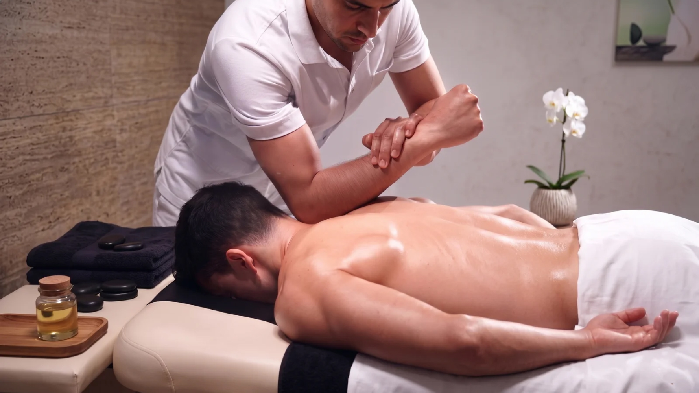
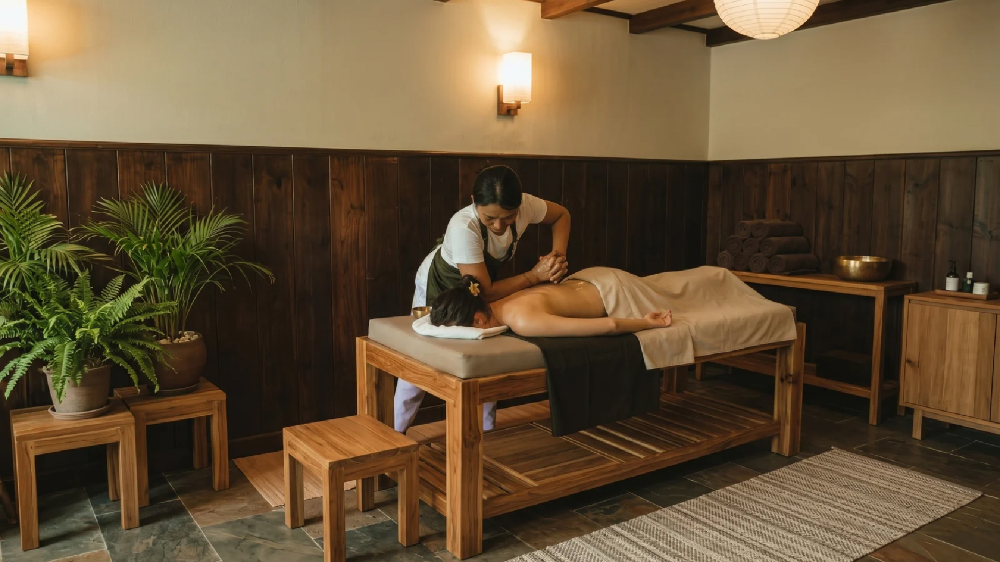
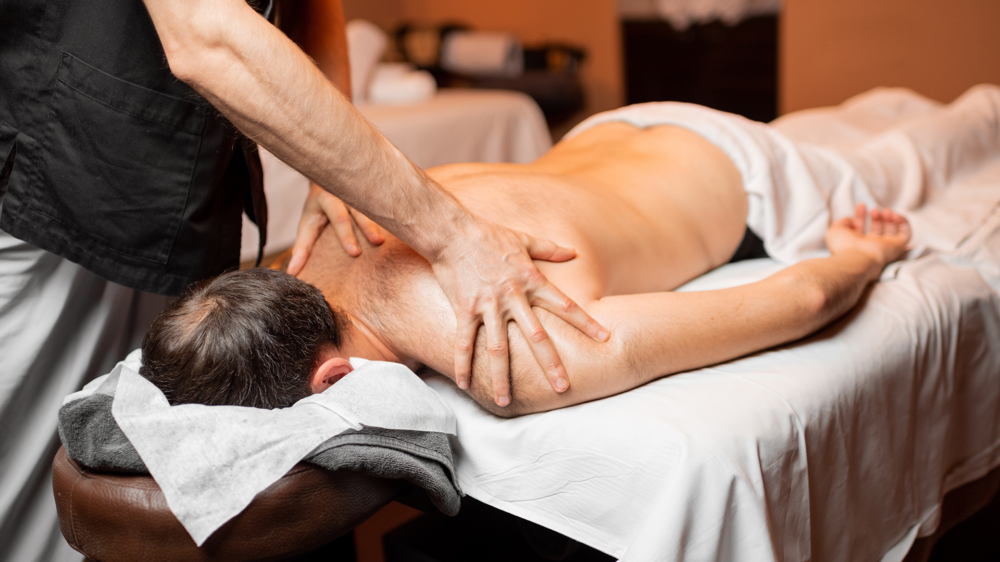
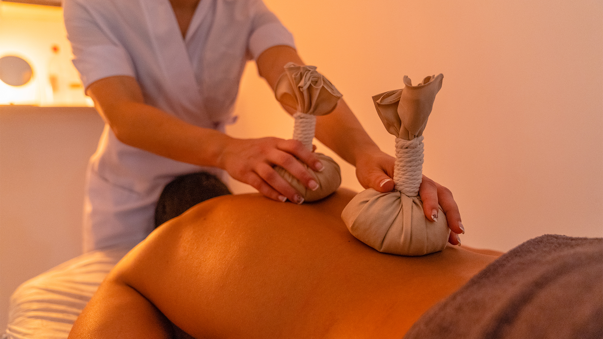
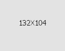
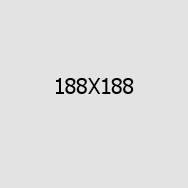
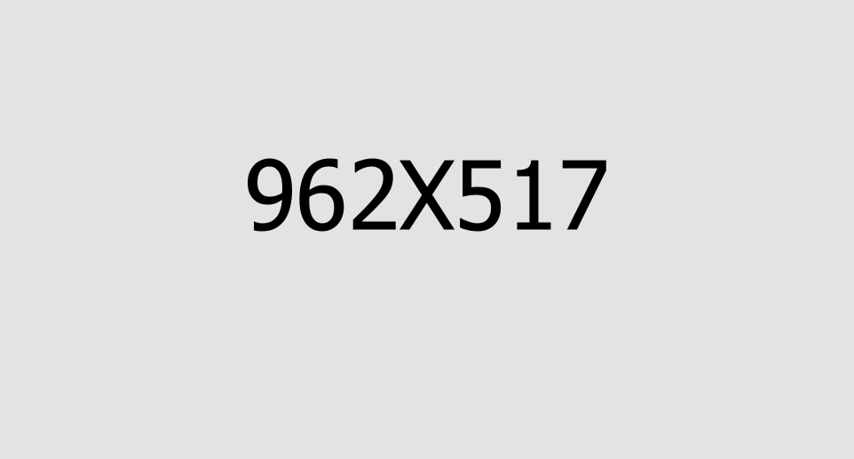

# Refresh D Thai Spa - Codebase Documentation (Part 1: Core Website)

This document contains the directory structure and source codes for the core files (HTML, CSS, JS, PHP, and README).

## 📂 Directory Structure
```text
Refresh-D-Salon-and-Spa/
├── README.md
├── assets/
│   ├── css/
│   │   └── refresh-d-thai-spa.css
│   ├── js/
│   │   └── refresh-d-thai-spa.js
│   └── inc/
│       └── sendemail.php
├── contact.html
├── index.html
├── index-dark.html
├── services.html
└── service-d-*.html (14 individual service detail pages)
```

---

## 📄 Part 1 Source Code Files

### 🌐 File: `README.md`

````markdown
# Refresh D Thai Spa - Website

A premium, responsive, and luxury-oriented website for **Refresh D Thai Spa**, a premier massage and wellness center located in Marathahalli, Bengaluru, Karnataka, India.

This project delivers a state-of-the-art web experience showcasing traditional therapies, signature spa packages, and an appointment booking application.

---

## 🌟 Key Features

- **Luxury Aesthetics**: Rich color palettes, smooth hover effects, custom cursor animations, elegant typography (Alex Brush, Cormorant, Plus Jakarta Sans), and subtle micro-animations.
- **Dual Themes**: Includes light mode (`index.html`) and dark mode (`index-dark.html`) homepage layouts.
- **Signature Service Pages**: 14 distinct service detail pages showcasing various treatments (Aroma, Balinese, Deep Tissue, Thai, Turkish Hammam, VVIP, etc.) with description, benefits, duration, and pricing.
- **Interactive Booking Form**: Direct appointment scheduling form with validation, service dropdown, datepicker, and time selector.
- **Contact & Map Integration**: Fully functional contact page with interactive, customized dark-themed embedded Google Maps pointing to the Marathahalli location.
- **Fully Responsive**: Optimized for desktop, tablet, and mobile screens.

---

## 📂 Project Directory Structure

```text
Refresh-D-Salon-and-Spa/
│
├── index.html                  # Main homepage (Light Theme)
├── index-dark.html             # Homepage (Dark Theme)
├── services.html               # Overview of all spa services
├── contact.html                # Contact page & location map
│
├── service-d-*.html            # Individual service detail pages (14 pages):
│   ├── service-d-aroma.html
│   ├── service-d-balinese.html
│   ├── service-d-candle.html
│   ├── service-d-couple.html
│   ├── service-d-deep-tissue.html
│   ├── service-d-four-hand.html
│   ├── service-d-lomi-lomi.html
│   ├── service-d-stone.html
│   ├── service-d-swedish.html
│   ├── service-d-thai.html
│   ├── service-d-turkish.html
│   ├── service-d-vip.html
│   ├── service-d-vvip.html
│   └── service-d-wine.html
│
├── assets/                     # Core design and styling assets
│   ├── css/                    # Custom stylesheets
│   ├── js/                     # Custom javascript logic
│   ├── images/                 # SVG icons, shapes, and branding assets
│   ├── spa-pictures/           # High-resolution premium images for treatments
│   └── vendors/                # External libraries & frameworks (Bootstrap, Owl Carousel, WOW.js, jQuery, etc.)
│
└── README.md                   # Project documentation (this file)
```

---

## 🛠️ Technologies Used

- **Core Structure & Logic**: HTML5, Vanilla JavaScript, jQuery
- **Styling & Frameworks**: Vanilla CSS3, Bootstrap 5.x
- **Typography & Icons**: Google Fonts, FontAwesome Icons, Custom SVG icon sets
- **Interactive Libraries**:
  - **WOW.js & Animate.css**: For smooth reveals and animations on scroll.
  - **Owl Carousel / Tiny Slider**: For high-performance sliders and carousels.
  - **Magnific Popup**: For responsive lightbox popups.
  - **jQuery UI Datepicker**: For smooth appointment date picking.
  - **Jarallax**: For parallax background scroll effects.

---

## 🚀 How to Run Locally

Since this is a static website, you do not need any build systems, compilers, or server-side runtimes to run it.

### Method 1: Directly Open in Browser
Simply double-click the `index.html` file or open it directly inside any browser (Chrome, Safari, Firefox, Edge).

### Method 2: Local HTTP Server (Recommended)
Running through a local web server ensures all paths, resources, and map assets resolve perfectly without origin restrictions.

- **Using VS Code Live Server**: Right-click `index.html` and select **"Open with Live Server"**.
- **Using Python**:
  ```bash
  python3 -m http.server 8000
  ```
  Then open [http://localhost:8000](http://localhost:8000) in your browser.
- **Using Node.js (`http-server`)**:
  ```bash
  npx http-server -p 8000
  ```

---

## 📍 Contact & Spa Details

- **Location**: 21/2, Main Road, Next to Indian Oil Petrol Bunk, Marathahalli, Bengaluru, KA 560037
- **Phone**: +91 83108 05129
- **Email**: customer.refresh@gmail.com
- **Timings**: Monday to Sunday: 10:00 AM – 8:00 PM
````

---

### 🌐 File: `assets/inc/sendemail.php`

```php
<?php

// Define some constants
define( "RECIPIENT_NAME", "John Doe" );
define( "RECIPIENT_EMAIL", "mail@mail.com" );

// Read the form values
$success = false;
$name = isset( $_POST['name'] ) ? preg_replace( "/[^\.\-\' a-zA-Z0-9]/", "", $_POST['name'] ) : "";
$senderEmail = isset( $_POST['email'] ) ? preg_replace( "/[^\.\-\_\@a-zA-Z0-9]/", "", $_POST['email'] ) : "";
$phone = isset( $_POST['phone'] ) ? preg_replace( "/[^\.\-\_\@a-zA-Z0-9]/", "", $_POST['phone'] ) : "";
$services = isset( $_POST['services'] ) ? preg_replace( "/[^\.\-\_\@a-zA-Z0-9]/", "", $_POST['services'] ) : "";
$subject = isset( $_POST['subject'] ) ? preg_replace( "/[^\.\-\_\@a-zA-Z0-9]/", "", $_POST['subject'] ) : "";
$address = isset( $_POST['address'] ) ? preg_replace( "/[^\.\-\_\@a-zA-Z0-9]/", "", $_POST['address'] ) : "";
$website = isset( $_POST['website'] ) ? preg_replace( "/[^\.\-\_\@a-zA-Z0-9]/", "", $_POST['website'] ) : "";
$message = isset( $_POST['message'] ) ? preg_replace( "/(From:|To:|BCC:|CC:|Subject:|Content-Type:)/", "", $_POST['message'] ) : "";

$mail_subject = 'A contact request send by ' . $name;

$body = 'Name: '. $name . "\r\n";
$body .= 'Email: '. $senderEmail . "\r\n";


if ($phone) {$body .= 'Phone: '. $phone . "\r\n"; }
if ($services) {$body .= 'services: '. $services . "\r\n"; }
if ($subject) {$body .= 'Subject: '. $subject . "\r\n"; }
if ($address) {$body .= 'Address: '. $address . "\r\n"; }
if ($website) {$body .= 'Website: '. $website . "\r\n"; }

$body .= 'message: ' . "\r\n" . $message;


// If all values exist, send the email
if ( $name && $senderEmail && $message ) {
  $recipient = RECIPIENT_NAME . " <" . RECIPIENT_EMAIL . ">";
  $headers = "From: " . $name . " <" . $senderEmail . ">";  
  $success = mail( $recipient, $mail_subject, $body, $headers );
  echo "<div class='inner success'><p class='success'>Thanks for contacting us. We will contact you ASAP!</p></div><!-- /.inner -->";
}else {
	echo "<div class='inner error'><p class='error'>Something went wrong. Please try again.</p></div><!-- /.inner -->";
}

?>
```

---

### 🌐 File: `assets/refresh-d-thai-spa.css`

```css
/*--------------------------------------------------------------
>>> TABLE OF CONTENTS:
----------------------------------------------------------------
# Utility
# Cards
# Common
# Form
# Navigations
# Animations
# Mobile Nav
# Search Popup
# Page Header
# Google Map
# Client Carousel
# Update Home Css
--------------------------------------------------------------*/
:root {
  --refresh-d-thai-spa-font: "Plus Jakarta Sans", sans-serif;
  --refresh-d-thai-spa-heading-font: "Cormorant", serif;
  --refresh-d-thai-spa-special-font: "Alex Brush", cursive;
  --refresh-d-thai-spa-text: #838184;
  --refresh-d-thai-spa-text-rgb: 131, 129, 132;
  --refresh-d-thai-spa-text-dark: #6e6b70;
  --refresh-d-thai-spa-text-dark-rgb: 110, 107, 112;
  --refresh-d-thai-spa-text-gray: #89868d;
  --refresh-d-thai-spa-text-gray-rgb: 137, 134, 141;
  --refresh-d-thai-spa-base: #c2a74e;
  --refresh-d-thai-spa-base-rgb: 194, 167, 78;
  --refresh-d-thai-spa-gray: #f9f6f1;
  --refresh-d-thai-spa-gray-rgb: 249, 246, 241;
  --refresh-d-thai-spa-white: #fff;
  --refresh-d-thai-spa-white-rgb: 255, 255, 255;
  --refresh-d-thai-spa-black: #1c1a1d;
  --refresh-d-thai-spa-black-rgb: 28, 26, 29;
  --refresh-d-thai-spa-black2: #141215;
  --refresh-d-thai-spa-black2-rgb: 20, 18, 21;
  --refresh-d-thai-spa-black3: #000;
  --refresh-d-thai-spa-black3-rgb: 0, 0, 0;
  --refresh-d-thai-spa-border-color: #e8e3da;
  --refresh-d-thai-spa-border-color-rgb: 232, 227, 218;
  --refresh-d-thai-spa-letter-space: 0.1em;
  --refresh-d-thai-spa-letter-space-xl: 0.2em;
}

/*--------------------------------------------------------------
# Utility
--------------------------------------------------------------*/
.mt-20 {
  margin-top: 20px;
}

.mt-30 {
  margin-top: 30px;
}

.mt-40 {
  margin-top: 40px;
}

.mt-50 {
  margin-top: 50px;
}

.mt-60 {
  margin-top: 60px;
}

.mt-80 {
  margin-top: 80px;
}

.mt-120 {
  margin-top: 120px;
}

.mt--60 {
  margin-top: -60px;
}

.mt--120 {
  margin-top: -120px;
}

.mb-20 {
  margin-bottom: 20px;
}

.mb-30 {
  margin-bottom: 30px;
}

.mb-40 {
  margin-bottom: 40px;
}

.mb-50 {
  margin-bottom: 50px;
}

.mb-60 {
  margin-bottom: 60px;
}

.mb-80 {
  margin-bottom: 80px;
}

.mb-120 {
  margin-bottom: 120px;
}

.mb--60 {
  margin-bottom: -60px;
}

.mb--120 {
  margin-bottom: -120px;
}

.pt-20 {
  padding-top: 20px;
}

.pt-30 {
  padding-top: 30px;
}

.pt-40 {
  padding-top: 40px;
}

.pt-50 {
  padding-top: 50px;
}

.pt-60 {
  padding-top: 60px;
}

.pt-80 {
  padding-top: 80px;
}

.pt-100 {
  padding-top: 100px;
}

.pt-110 {
  padding-top: 110px;
}

.pt-115 {
  padding-top: 115px;
}

.pt-120 {
  padding-top: 120px;
}

.pt-142 {
  padding-top: 142px;
}

.pb-20 {
  padding-bottom: 20px;
}

.pb-30 {
  padding-bottom: 30px;
}

.pb-40 {
  padding-bottom: 40px;
}

.pb-50 {
  padding-bottom: 50px;
}

.pb-60 {
  padding-bottom: 60px;
}

.pb-80 {
  padding-bottom: 80px;
}

.pb-90 {
  padding-bottom: 90px;
}

.pb-100 {
  padding-bottom: 100px;
}

.pb-110 {
  padding-bottom: 110px;
}

.pb-115 {
  padding-bottom: 115px;
}

.pb-120 {
  padding-bottom: 120px;
}

.pl-5 {
  padding-left: 5px;
}

.pl-10 {
  padding-left: 10px;
}

.pl-15 {
  padding-left: 15px;
}

.pl-20 {
  padding-left: 20px;
}

.pl-30 {
  padding-left: 30px;
}

.pr-5 {
  padding-right: 5px;
}

.pr-10 {
  padding-right: 10px;
}

.pr-15 {
  padding-right: 15px;
}

.pr-20 {
  padding-right: 20px;
}

.pr-30 {
  padding-right: 30px;
}

/*--------------------------------------------------------------
# Common
--------------------------------------------------------------*/
body {
  font-family: var(--refresh-d-thai-spa-font, "Plus Jakarta Sans", sans-serif);
  color: var(--refresh-d-thai-spa-text, #838184);
  font-size: 16px;
  line-height: 2.125;
  font-weight: 500;
}

body.locked {
  overflow: hidden;
}

a {
  color: var(--refresh-d-thai-spa-base, #c2a74e);
  transition: all 400ms ease;
}

a,
a:hover,
a:focus,
a:visited {
  text-decoration: none;
}

::placeholder {
  color: inherit;
  opacity: 1;
}

h1,
h2,
h3,
h4,
h5,
h6 {
  font-family: var(--refresh-d-thai-spa-heading-font, "Cormorant", serif);
  color: var(--refresh-d-thai-spa-black, #1c1a1d);
}
@media (max-width: 575px) {
  h1 br,
  h2 br,
  h3 br,
  h4 br,
  h5 br,
  h6 br {
    display: none;
  }
}

@media (max-width: 575px) {
  p br {
    display: none;
  }
}

::placeholder {
  color: inherit;
  opacity: 1;
}

.background-base {
  background-color: var(--refresh-d-thai-spa-base, #c2a74e);
}

.background-gray {
  background-color: var(--refresh-d-thai-spa-gray, #f9f6f1);
}

.background-black {
  background-color: var(--refresh-d-thai-spa-black, #1c1a1d);
}

.background-black-2 {
  background-color: var(--refresh-d-thai-spa-black2, #141215);
}

.refresh-d-thai-spa-text-dark {
  color: var(--refresh-d-thai-spa-text-dark, #6e6b70);
}

.page-wrapper {
  position: relative;
  margin: 0 auto;
  width: 100%;
  min-width: 300px;
  overflow: hidden;
}

.container-fluid,
.container {
  padding-left: 15px;
  padding-right: 15px;
}

@media (min-width: 1200px) {
  .container {
    max-width: 1200px;
  }
}
.row {
  --bs-gutter-x: 30px;
}

.gutter-y-10 {
  --bs-gutter-y: 10px;
}

.gutter-y-15 {
  --bs-gutter-y: 15px;
}

.gutter-y-20 {
  --bs-gutter-y: 20px;
}

.gutter-y-30 {
  --bs-gutter-y: 30px;
}

.gutter-y-60 {
  --bs-gutter-y: 60px;
}

.refresh-d-thai-spa-btn {
  display: inline-block;
  vertical-align: middle;
  -webkit-appearance: none;
  border: none;
  outline: none !important;
  background-color: var(--refresh-d-thai-spa-black, #1c1a1d);
  color: #fff;
  font-size: 12px;
  font-weight: 600;
  font-family: var(--refresh-d-thai-spa-font, "Plus Jakarta Sans", sans-serif);
  padding: 16.25px 48px;
  transition: 500ms;
  letter-spacing: var(--refresh-d-thai-spa-letter-space-xl, 0.2em);
  text-transform: uppercase;
  background-color: var(--refresh-d-thai-spa-black, #1c1a1d);
  color: #fff;
  position: relative;
  overflow: hidden;
  text-align: center;
}
.refresh-d-thai-spa-btn:hover {
  color: var(--refresh-d-thai-spa-black, #1c1a1d);
  background-color: #fff;
}
.refresh-d-thai-spa-btn::before {
  content: "";
  position: absolute;
  top: -50%;
  left: 50%;
  transform: translateX(-50%);
  width: 150%;
  height: 150%;
  border-top-left-radius: 50%;
  border-top-right-radius: 50%;
  background-color: var(--refresh-d-thai-spa-black, #1c1a1d);
  transition: 700ms cubic-bezier(0.52, 1.64, 0.37, 0.66);
}
.refresh-d-thai-spa-btn::after {
  content: "";
  position: absolute;
  bottom: 100%;
  left: 50%;
  transform: translateX(-50%);
  width: 150%;
  height: 150%;
  border-bottom-left-radius: 50%;
  border-bottom-right-radius: 50%;
  background-color: var(--refresh-d-thai-spa-white, #fff);
  transition-duration: 700ms;
  transition-timing-function: cubic-bezier(0.52, 1.64, 0.37, 0.66);
}
.refresh-d-thai-spa-btn:hover {
  color: var(--refresh-d-thai-spa-black, #1c1a1d);
}
.refresh-d-thai-spa-btn:hover::before {
  top: 100%;
}
.refresh-d-thai-spa-btn:hover::after {
  bottom: -50%;
}
.refresh-d-thai-spa-btn span {
  position: relative;
  color: inherit;
  z-index: 2;
}
.refresh-d-thai-spa-btn--black:hover {
  color: var(--refresh-d-thai-spa-white, #fff);
}
.refresh-d-thai-spa-btn--black::after {
  background-color: var(--refresh-d-thai-spa-base, #c2a74e);
}
.refresh-d-thai-spa-btn--black::before {
  background-color: var(--refresh-d-thai-spa-black, #1c1a1d);
}
.refresh-d-thai-spa-btn--base:hover {
  color: var(--refresh-d-thai-spa-white, #fff);
}
.refresh-d-thai-spa-btn--base::after {
  background-color: var(--refresh-d-thai-spa-black, #1c1a1d);
}
.refresh-d-thai-spa-btn--base::before {
  background-color: var(--refresh-d-thai-spa-base, #c2a74e);
}

.tabs-box .tabs-content .tab:not(.active-tab) {
  display: none;
}

.bootstrap-select .dropdown-menu {
  padding-top: 0;
  padding-bottom: 0;
  border-radius: 0;
}
.bootstrap-select .dropdown-item.active,
.bootstrap-select .dropdown-item:active {
  background-color: var(--refresh-d-thai-spa-base, #c2a74e);
}

.tns-outer .tns-controls {
  display: flex;
  justify-content: center;
  align-items: center;
  margin-top: 40px;
}
.tns-outer .tns-controls button {
  width: 45px;
  height: 45px;
  border: 2px solid #f4f4f4;
  outline: none;
  display: flex;
  justify-content: center;
  align-items: center;
  color: var(--refresh-d-thai-spa-text, #838184);
  border-radius: 50%;
  margin-left: 5px;
  margin-right: 5px;
}

.block-title {
  margin-top: -8px;
  margin-bottom: 50px;
}
.block-title__decor {
  width: 21px;
  height: 14px;
  background-image: url(../images/shapes/leaf-1-1.png);
  background-repeat: no-repeat;
  background-position: top center;
  display: inline-block;
  line-height: 1;
  margin-bottom: -5px;
  position: relative;
  top: -7px;
}
.block-title p {
  margin: 0;
  color: var(--refresh-d-thai-spa-text, #838184);
  font-size: 16px;
  line-height: 1;
  margin-bottom: 7px;
}
@media (min-width: 768px) {
  .block-title p {
    font-size: 18px;
  }
}
@media (min-width: 992px) {
  .block-title p {
    font-size: 20px;
  }
}
.block-title h3 {
  margin: 0;
  font-size: 35px;
  color: var(--refresh-d-thai-spa-black, #1c1a1d);
  font-family: var(--refresh-d-thai-spa-special-font, "Alex Brush", cursive);
}
@media (min-width: 768px) {
  .block-title h3 {
    font-size: 42px;
  }
}
@media (min-width: 992px) {
  .block-title h3 {
    font-size: 50px;
  }
}

.ul-list-one {
  margin-bottom: 0;
}
.ul-list-one li {
  position: relative;
  padding-left: 45px;
  font-size: 16px;
  font-weight: 500;
  color: var(--refresh-d-thai-spa-black, #1c1a1d);
}
@media (min-width: 481px) {
  .ul-list-one li {
    font-size: 20px;
  }
}
.ul-list-one li::before {
  content: "\e907";
  color: var(--refresh-d-thai-spa-base, #c2a74e);
  font-size: 26px;
  position: absolute;
  top: 50%;
  left: 0;
  transform: translateY(-50%);
  font-family: "azino-icon";
}

.preloader {
  position: fixed;
  background-color: var(--refresh-d-thai-spa-black, #1c1a1d);
  background-position: center center;
  background-repeat: no-repeat;
  top: 0;
  left: 0;
  right: 0;
  bottom: 0;
  z-index: 9991;
  display: -webkit-box;
  display: flex;
  -webkit-box-pack: center;
  justify-content: center;
  -webkit-box-align: center;
  align-items: center;
  text-align: center;
}
.preloader__image {
  -webkit-animation-fill-mode: both;
  animation-fill-mode: both;
  -webkit-animation-name: flipInY;
  animation-name: flipInY;
  -webkit-animation-duration: 2s;
  animation-duration: 2s;
  -webkit-animation-iteration-count: infinite;
  animation-iteration-count: infinite;
  background-repeat: no-repeat;
  background-position: center center;
  background-size: 60px auto;
  width: 100%;
  height: 100%;
}

/* scroll to top */
.scroll-to-top {
  display: flex;
  align-items: center;
  width: auto;
  height: 35px;
  background: transparent;
  position: fixed;
  bottom: 60px;
  right: -12px;
  z-index: 99;
  text-align: center;
  opacity: 0;
  visibility: hidden;
  transform: rotate(-90deg);
  cursor: pointer;
  transition: all 0.2s ease;
}
.scroll-to-top__text {
  display: inline;
  font-size: 12px;
  text-transform: uppercase;
  letter-spacing: 0.1em;
  font-weight: 700;
  margin-right: 8px;
}
.scroll-to-top__wrapper {
  display: inline-block;
  width: 30px;
  height: 4px;
  background-color: var(--refresh-d-thai-spa-base, #c2a74e);
  position: relative;
  overflow: hidden;
}
.scroll-to-top__inner {
  position: absolute;
  left: 0;
  top: 0;
  width: 100%;
  height: 100%;
  background-color: var(--refresh-d-thai-spa-black, #1c1a1d);
}
.scroll-to-top.show {
  opacity: 1;
  visibility: visible;
  bottom: 70px;
}

/* post paginations */
.post-pagination {
  margin-bottom: 0;
  margin-top: 0px;
}
@media (min-width: 992px) {
  .post-pagination {
    margin-top: 0px;
  }
}
.post-pagination a {
  display: flex;
  width: 45px;
  height: 45px;
  background-color: #eff2f6;
  align-items: center;
  justify-content: center;
  color: var(--refresh-d-thai-spa-text, #838184);
  font-size: 16px;
  font-weight: 500;
  border-radius: 50%;
  transition: 500ms ease;
}
@media (min-width: 992px) {
  .post-pagination a {
    width: 60px;
    height: 60px;
    font-size: 18px;
  }
}
.post-pagination a:hover {
  background-color: var(--refresh-d-thai-spa-base, #c2a74e);
  color: #fff;
}
.post-pagination li:first-child a {
  background-color: var(--refresh-d-thai-spa-base, #c2a74e);
  color: #fff;
}
.post-pagination li:last-child a {
  background-color: var(--refresh-d-thai-spa-black, #1c1a1d);
  color: #fff;
}
.post-pagination li + li {
  margin-left: 10px;
}

.refresh-d-thai-spa-owl__carousel--with-shadow .owl-stage-outer {
  overflow: visible;
}
.refresh-d-thai-spa-owl__carousel--with-shadow .owl-item {
  opacity: 0;
  visibility: hidden;
  transition: opacity 500ms ease, visibility 500ms ease;
}
.refresh-d-thai-spa-owl__carousel--with-shadow .owl-item.active {
  opacity: 1;
  visibility: visible;
}

.refresh-d-thai-spa-owl__carousel--basic-nav.owl-carousel .owl-nav {
  display: flex;
  justify-content: center;
  gap: 20px;
  margin-top: 60px;
}
.refresh-d-thai-spa-owl__carousel--basic-nav.owl-carousel .owl-nav button {
  border: none;
  outline: none;
  border-radius: 50%;
  opacity: 1;
  margin: 0;
  padding: 0;
}
.refresh-d-thai-spa-owl__carousel--basic-nav.owl-carousel .owl-nav button span {
  border: none;
  outline: none;
  width: 50px;
  height: 50px;
  background-color: var(--refresh-d-thai-spa-gray, #f9f6f1);
  display: flex;
  justify-content: center;
  opacity: 1;
  align-items: center;
  color: var(--refresh-d-thai-spa-black, #1c1a1d);
  border-radius: 50%;
  font-size: 14px;
  transition: all 500ms ease;
}
.refresh-d-thai-spa-owl__carousel--basic-nav.owl-carousel .owl-nav button span:hover {
  background-color: var(--refresh-d-thai-spa-base, #c2a74e);
  color: var(--refresh-d-thai-spa-white, #fff);
}
.refresh-d-thai-spa-owl__carousel--basic-nav.owl-carousel .owl-dots {
  display: flex;
  align-items: center;
  justify-content: center;
  gap: 10px;
  margin-top: 60px;
}
.refresh-d-thai-spa-owl__carousel--basic-nav.owl-carousel .owl-dots .owl-dot span {
  background-color: var(--refresh-d-thai-spa-black, #1c1a1d);
  border: 2px solid var(--refresh-d-thai-spa-white, #fff);
  box-shadow: 0 0 1px rgba(var(--refresh-d-thai-spa-black-rgb, 28, 26, 29), 1);
  margin: 0;
}
.refresh-d-thai-spa-owl__carousel--basic-nav.owl-carousel .owl-dots .owl-dot:hover span, .refresh-d-thai-spa-owl__carousel--basic-nav.owl-carousel .owl-dots .owl-dot.active span {
  background-color: var(--refresh-d-thai-spa-black, #1c1a1d);
  border: 2px solid var(--refresh-d-thai-spa-black, #1c1a1d);
  box-shadow: 0 0 1px rgba(var(--refresh-d-thai-spa-black-rgb, 28, 26, 29), 1);
}
.refresh-d-thai-spa-owl__carousel--basic-nav.owl-carousel .owl-dots.disabled {
  display: none;
}
.refresh-d-thai-spa-owl__carousel--basic-nav.owl-carousel .owl-nav.disabled + .owl-dots {
  margin-top: 60px;
}
.refresh-d-thai-spa-owl__carousel--basic-nav.owl-carousel .owl-nav.disabled {
  display: none;
}

.sec-title {
  padding-bottom: 50px;
}
@media (min-width: 768px) {
  .sec-title {
    padding-bottom: 46px;
  }
}
.sec-title__img {
  display: inline-flex;
  margin-bottom: 15px;
}
.sec-title__tagline {
  margin: 0;
  font-family: var(--refresh-d-thai-spa-special-font, "Alex Brush", cursive);
  color: var(--refresh-d-thai-spa-base, #c2a74e);
  font-size: 30px;
  line-height: 1.2em;
}
@media (min-width: 768px) {
  .sec-title__tagline {
    font-size: 40px;
  }
}
.sec-title__title {
  margin: 0;
  text-transform: uppercase;
  font-size: 35px;
  color: var(--refresh-d-thai-spa-black, #1c1a1d);
  font-weight: bold;
  line-height: 1.2em;
  margin-top: 5px;
}
@media (min-width: 768px) {
  .sec-title__title {
    font-size: 50px;
    margin-top: -2px;
  }
}

.ui-datepicker .ui-datepicker-header {
  background-image: none;
  background-color: var(--refresh-d-thai-spa-black, #1c1a1d);
  color: var(--refresh-d-thai-spa-white, #fff);
  font-family: var(--refresh-d-thai-spa-font, "Plus Jakarta Sans", sans-serif);
}

.ui-datepicker-calendar th span {
  font-family: var(--refresh-d-thai-spa-font, "Plus Jakarta Sans", sans-serif);
}
.ui-datepicker-calendar td {
  background-color: var(--refresh-d-thai-spa-gray, #f9f6f1);
  background-image: none;
  font-family: var(--refresh-d-thai-spa-font, "Plus Jakarta Sans", sans-serif);
  color: var(--refresh-d-thai-spa-text, #838184);
}
.ui-datepicker-calendar td a {
  border-color: var(--refresh-d-thai-spa-border-color, #e8e3da);
  background-color: var(--refresh-d-thai-spa-gray, #f9f6f1);
  background-image: none;
}
.ui-datepicker-calendar .ui-state-default,
.ui-datepicker-calendar .ui-widget-content .ui-state-default,
.ui-datepicker-calendar .ui-widget-header .ui-state-default {
  border-color: var(--refresh-d-thai-spa-border-color, #e8e3da);
  background-color: var(--refresh-d-thai-spa-gray, #f9f6f1);
  background-image: none;
  color: var(--refresh-d-thai-spa-text, #838184);
  padding: 10px 5px;
  text-align: center;
  line-height: 1em;
}
.ui-datepicker-calendar .ui-state-default:hover,
.ui-datepicker-calendar .ui-widget-content .ui-state-default:hover,
.ui-datepicker-calendar .ui-widget-header .ui-state-default:hover {
  color: var(--refresh-d-thai-spa-white, #fff);
  background-color: var(--refresh-d-thai-spa-base, #c2a74e);
}
.ui-datepicker-calendar .ui-state-highlight,
.ui-datepicker-calendar .ui-widget-content .ui-state-highlight,
.ui-datepicker-calendar .ui-widget-header .ui-state-highlight {
  color: var(--refresh-d-thai-spa-white, #fff);
  background-color: var(--refresh-d-thai-spa-base, #c2a74e);
}

.ui-datepicker .ui-datepicker-prev,
.ui-datepicker .ui-datepicker-next {
  background-image: none;
  background-color: var(--refresh-d-thai-spa-white, #fff);
  color: var(--refresh-d-thai-spa-black, #1c1a1d);
}
.ui-datepicker .ui-datepicker-prev:hover,
.ui-datepicker .ui-datepicker-next:hover {
  background-color: var(--refresh-d-thai-spa-base, #c2a74e);
  color: var(--refresh-d-thai-spa-white, #fff);
  top: 2px;
}

.ui-datepicker .ui-datepicker-prev:hover {
  left: 2px;
}

.ui-datepicker .ui-datepicker-next:hover {
  right: 2px;
}

/*--------------------------------------------------------------
# Cards
--------------------------------------------------------------*/
.video-one {
  position: relative;
  background-color: var(--refresh-d-thai-spa-black, #1c1a1d);
  padding: 100px 0;
}
.video-one__bg {
  position: absolute;
  top: 0;
  left: 0;
  right: 0;
  bottom: 0;
  background-color: var(--refresh-d-thai-spa-black, #1c1a1d);
  background-size: cover;
  background-position: center center;
  opacity: 0.5;
}
.video-one .container {
  position: relative;
  text-align: center;
}
.video-one__btn {
  width: 145px;
  height: 145px;
  display: inline-flex;
  justify-content: center;
  align-items: center;
  border-radius: 50%;
  position: relative;
}
.video-one__btn .video-popup {
  font-size: 24px;
  color: var(--refresh-d-thai-spa-white, #fff);
  transition: all 500ms ease;
  position: relative;
  z-index: 10;
}
.video-one__btn .video-popup:hover {
  color: var(--refresh-d-thai-spa-base, #c2a74e);
}
.video-one__btn .curved-circle {
  position: absolute;
  top: 0;
  left: 0;
  width: 145px;
  height: 145px;
  transform-origin: center center;
  display: flex;
  justify-content: center;
  align-items: center;
  animation: textRotate 15s linear 0s forwards infinite alternate;
}
.video-one__btn .curved-circle--item {
  width: 145px;
}
.video-one__btn .curved-circle--item span {
  text-transform: uppercase;
  font-size: 14px;
  color: var(--refresh-d-thai-spa-white, #fff);
  letter-spacing: 0.4em;
}
.video-one__title {
  margin: 0;
  text-transform: uppercase;
  color: var(--refresh-d-thai-spa-white, #fff);
  font-size: 40px;
  line-height: 1.2em;
  margin-bottom: 40px;
  margin-top: 30px;
}
@media (min-width: 768px) {
  .video-one__title {
    font-size: 50px;
  }
}
@media (min-width: 992px) {
  .video-one__title {
    font-size: 60px;
    margin-top: 20px;
    margin-bottom: 35px;
  }
}
.video-one__link::before {
  background-color: var(--refresh-d-thai-spa-base, #c2a74e);
}

.video-two {
  position: relative;
  background-color: var(--refresh-d-thai-spa-black, #1c1a1d);
  padding: 143px 0 320px;
}
@media (max-width: 767px) {
  .video-two {
    padding: 100px 0 270px;
  }
  .video-two .text-end {
    text-align: left !important;
  }
}
.video-two__bg {
  position: absolute;
  top: 0;
  left: 0;
  right: 0;
  bottom: 0;
  background-color: var(--refresh-d-thai-spa-black, #1c1a1d);
  background-size: cover;
  background-position: center center;
  background-repeat: no-repeat;
  opacity: 0.5;
}
.video-two__shape {
  position: absolute;
  left: 0;
  top: 0;
  width: 100%;
  height: 100%;
  background-position: left top;
  background-repeat: no-repeat;
  background-size: auto;
}
@media (max-width: 1199px) {
  .video-two__shape {
    display: none;
  }
}
.video-two .container {
  position: relative;
}
.video-two__btn {
  width: 145px;
  height: 145px;
  display: inline-flex;
  justify-content: center;
  align-items: center;
  border-radius: 50%;
  position: relative;
  margin-top: 42px;
}
.video-two__btn .video-popup {
  font-size: 24px;
  color: var(--refresh-d-thai-spa-white, #fff);
  transition: all 500ms ease;
  position: relative;
  z-index: 10;
}
.video-two__btn .video-popup:hover {
  color: var(--refresh-d-thai-spa-base, #c2a74e);
}
.video-two__btn .curved-circle {
  position: absolute;
  top: 0;
  left: 0;
  width: 145px;
  height: 145px;
  transform-origin: center center;
  display: flex;
  justify-content: center;
  align-items: center;
  animation: textRotate 15s linear 0s forwards infinite alternate;
}
.video-two__btn .curved-circle--item {
  width: 145px !important;
  height: 145px !important;
}
.video-two__btn .curved-circle--item span {
  text-transform: uppercase;
  font-size: 14px;
  color: var(--refresh-d-thai-spa-white, #fff);
  letter-spacing: 0.4em;
}
.video-two__title {
  margin: 0;
  text-transform: uppercase;
  color: var(--refresh-d-thai-spa-white, #fff);
  font-size: 40px;
  line-height: 1.2em;
  margin-bottom: 40px;
}
@media (min-width: 768px) {
  .video-two__title {
    font-size: 50px;
  }
}
@media (min-width: 992px) {
  .video-two__title {
    font-size: 60px;
    margin-bottom: 35px;
  }
}
.video-two__link::before {
  background-color: var(--refresh-d-thai-spa-base, #c2a74e);
}

.team-one {
  padding-top: 120px;
  padding-bottom: 120px;
  background-color: var(--refresh-d-thai-spa-white, #fff);
}
.team-one .sec-title {
  text-align: center;
}
@media (min-width: 992px) {
  .team-one__carousel .owl-nav {
    display: none;
  }
}
.team-one--page {
  padding-top: 100px;
}

.team-card__image {
  position: relative;
  padding-left: 30px;
  padding-top: 30px;
}
.team-card__image img {
  position: relative;
  max-width: 100%;
}
.team-card__image__bg {
  position: absolute;
  top: 0;
  left: 0;
  width: 100%;
  max-width: 300px;
  height: 324px;
  background-color: var(--refresh-d-thai-spa-gray, #f9f6f1);
  background-image: url(../images/shapes/team-card-s-1-1.png);
  background-repeat: no-repeat;
  background-position: top center;
}
.team-card__hover {
  position: absolute;
  bottom: 0;
  left: 30px;
}
.team-card__email {
  background-color: var(--refresh-d-thai-spa-base, #c2a74e);
  position: relative;
}
.team-card__email > a {
  width: 50px;
  height: 50px;
  font-size: 16px;
  display: flex;
  justify-content: center;
  align-items: center;
  color: var(--refresh-d-thai-spa-white, #fff);
  transition: all 500ms ease;
}
.team-card__email > a:hover {
  background-color: var(--refresh-d-thai-spa-black, #1c1a1d);
  color: var(--refresh-d-thai-spa-white, #fff);
}
.team-card__social {
  background-color: var(--refresh-d-thai-spa-white, #fff);
  position: relative;
  cursor: pointer;
  transition: all 500ms ease;
}
.team-card__social:hover {
  background-color: var(--refresh-d-thai-spa-white, #fff);
}
.team-card__social:hover > i {
  color: var(--refresh-d-thai-spa-base, #c2a74e);
}
.team-card__social > i {
  width: 50px;
  height: 50px;
  font-size: 16px;
  display: flex;
  justify-content: center;
  align-items: center;
  color: var(--refresh-d-thai-spa-black, #1c1a1d);
  transition: all 500ms ease;
}
.team-card__social__list {
  position: absolute;
  top: 50%;
  left: 100%;
  transform: translateY(-50%) scale(0, 1);
  background-color: var(--refresh-d-thai-spa-black, #1c1a1d);
  display: flex;
  align-items: center;
  justify-content: center;
  margin: 0;
  min-height: 50px;
  padding-left: 20px;
  padding-right: 20px;
  opacity: 0;
  transition: 500ms ease;
  transform-origin: top left;
}
.team-card__social__list a {
  color: var(--refresh-d-thai-spa-white, #fff);
  font-size: 14px;
  transition: all 500ms ease;
}
.team-card__social__list a + a {
  margin-left: 27px;
}
.team-card__social__list a:hover {
  color: var(--refresh-d-thai-spa-base, #c2a74e);
}
.team-card__social:hover .team-card__social__list {
  opacity: 1;
  transform: translateY(-50%) scale(1, 1);
}
.team-card__content {
  padding-top: 20px;
  padding-left: 30px;
}
@media (min-width: 992px) {
  .team-card__content {
    padding-top: 30px;
  }
}
.team-card__title {
  margin: 0;
  font-size: 20px;
  line-height: 1.1818181818em;
  color: var(--refresh-d-thai-spa-black, #1c1a1d);
  text-transform: uppercase;
  font-weight: bold;
  margin-bottom: -7px;
}
@media (min-width: 768px) {
  .team-card__title {
    font-size: 22px;
    margin-bottom: -6px;
  }
}
.team-card__title a {
  color: inherit;
  background: linear-gradient(to right, currentcolor 0%, currentcolor 100%) 0px 95%/0px 1px no-repeat;
  transition: all 500ms ease;
}
.team-card__title a:hover {
  background-size: 100% 1px;
}
.team-card__title a:hover {
  color: var(--refresh-d-thai-spa-base, #c2a74e);
}
.team-card__designation {
  line-height: 1em;
  margin: 0;
  font-size: 12px;
  text-transform: uppercase;
  color: var(--refresh-d-thai-spa-text, #838184);
  letter-spacing: var(--refresh-d-thai-spa-letter-space, 0.1em);
  margin-bottom: 5px;
  font-family: var(--refresh-d-thai-spa-font, "Plus Jakarta Sans", sans-serif);
}

.team-details {
  padding-top: 100px;
  background-color: var(--refresh-d-thai-spa-white, #fff);
}
@media (max-width: 767px) {
  .team-details {
    padding: 80px 0 0;
    padding-top: 60px;
  }
}
.team-details__inner {
  border-bottom: 1px solid var(--refresh-d-thai-spa-border-color, #e8e3da);
  padding-bottom: 100px;
}
.team-details__image {
  display: inline-block;
  position: relative;
}
.team-details__image img {
  max-width: 100%;
}
@media (min-width: 992px) {
  .team-details__content {
    padding-left: 70px;
  }
}
.team-details__icon {
  position: absolute;
  left: 40px;
  bottom: 40px;
  background-color: var(--refresh-d-thai-spa-base, #c2a74e);
  border: 20px solid var(--refresh-d-thai-spa-white, #fff);
  width: 220px;
  padding: 30px;
  box-shadow: 0px 10px 60px 0px rgba(0, 0, 0, 0.07);
}
@media (min-width: 992px) {
  .team-details__icon {
    left: -96px;
  }
}
.team-details__icon i {
  font-size: 60px;
  color: var(--refresh-d-thai-spa-white, #fff);
}
.team-details__icon__text {
  margin: 0;
  font-size: 18px;
  color: var(--refresh-d-thai-spa-white, #fff);
  text-transform: uppercase;
  max-width: 104px;
  font-weight: bold;
  margin-bottom: -5px;
  margin-top: 10px;
}
@media (min-width: 768px) {
  .team-details__icon__text {
    font-size: 20px;
  }
}
@media (min-width: 992px) {
  .team-details__icon__text {
    font-size: 24px;
  }
}
.team-details__title {
  text-transform: uppercase;
  margin: 0;
  font-weight: bold;
  font-size: 30px;
  line-height: 1;
  margin-top: -7px;
  margin-bottom: 6px;
}
@media (min-width: 768px) {
  .team-details__title {
    font-size: 35px;
  }
}
@media (min-width: 992px) {
  .team-details__title {
    font-size: 40px;
  }
}
.team-details__designation {
  margin: 0;
  font-size: 16px;
  margin-bottom: 20px;
}
.team-details__text {
  margin: 0;
  font-size: 15px;
  line-height: 2em;
}
.team-details__highlight {
  margin: 0;
  text-transform: uppercase;
  font-weight: bold;
  color: var(--refresh-d-thai-spa-base, #c2a74e);
  font-size: 20px;
  font-family: var(--refresh-d-thai-spa-heading-font, "Cormorant", serif);
  line-height: 1.3em;
  margin-top: 35px;
  margin-bottom: 30px;
}
.team-details__list {
  margin-bottom: 0;
}
.team-details__list li {
  position: relative;
  font-size: 16px;
  line-height: 2.25em;
  padding-left: 27px;
  color: var(--refresh-d-thai-spa-black, #1c1a1d);
}
.team-details__list li > i {
  position: absolute;
  top: 50%;
  left: 0;
  transform: translateY(-50%);
  font-size: 14px;
  color: var(--refresh-d-thai-spa-base, #c2a74e);
}
.team-details__social {
  display: flex;
  flex-wrap: wrap;
  gap: 10px;
  margin-bottom: 20px;
}
.team-details__social a {
  width: 40px;
  height: 40px;
  display: flex;
  justify-content: center;
  align-items: center;
  background-color: var(--refresh-d-thai-spa-gray, #f9f6f1);
  font-size: 14px;
  color: var(--refresh-d-thai-spa-black, #1c1a1d);
  transition: all 500ms ease;
  border-radius: 50%;
}
.team-details__social a:hover {
  background-color: var(--refresh-d-thai-spa-base, #c2a74e);
  color: var(--refresh-d-thai-spa-white, #fff);
}

.team-skills-one {
  padding: 100px 0;
  background-color: var(--refresh-d-thai-spa-white, #fff);
}
@media (max-width: 767px) {
  .team-skills-one {
    padding: 60px 0;
  }
}
.team-skills-one__title {
  margin: 0;
  text-transform: uppercase;
  font-size: 25px;
  font-weight: bold;
  color: var(--refresh-d-thai-spa-black, #1c1a1d);
  line-height: 1.2em;
  margin-bottom: 10px;
}
@media (min-width: 768px) {
  .team-skills-one__title {
    font-size: 30px;
  }
}
@media (min-width: 768px) {
  .team-skills-one__title {
    font-size: 36px;
    margin-bottom: 20px;
  }
}
.team-skills-one__text {
  margin: 0;
  font-size: 15px;
  line-height: 2em;
  max-width: 500px;
  width: 100%;
}
.team-skills-one__progress + .team-skills-one__progress {
  margin-top: 17px;
}
.team-skills-one__progress__title {
  text-transform: uppercase;
  margin: 0;
  font-size: 18px;
  font-weight: bold;
  margin-bottom: 5px;
}
.team-skills-one__progress__bar {
  width: 100%;
  height: 17px;
  border: 1px solid var(--refresh-d-thai-spa-border-color, #e8e3da);
  box-shadow: inset 0px 0px 7px 0px rgba(0, 0, 0, 0.15);
  position: relative;
}
.team-skills-one__progress__inner {
  position: absolute;
  height: calc(100% - 6px);
  left: 4px;
  top: 3px;
  background-color: var(--refresh-d-thai-spa-base, #c2a74e);
  transition: all 700ms linear;
  width: 0px;
}
.team-skills-one__progress__number {
  position: absolute;
  bottom: calc(100% + 5px);
  right: 0;
  font-size: 14px;
  font-weight: 400;
}

.team-form-one {
  position: relative;
  padding: 120px 0;
}
@media (max-width: 767px) {
  .team-form-one {
    padding: 80px 0;
  }
}
.team-form-one__bg {
  position: absolute;
  top: 0;
  left: 0;
  right: 0;
  bottom: 0;
  background-size: cover;
  opacity: 0.8;
  mix-blend-mode: luminosity;
}
.team-form-one .container {
  position: relative;
  max-width: 800px;
}
.team-form-one .sec-title {
  text-align: center;
}
.team-form-one .form-one .bootstrap-select > .dropdown-toggle,
.team-form-one .form-one input[type=text],
.team-form-one .form-one input[type=email],
.team-form-one .form-one textarea {
  background-color: var(--refresh-d-thai-spa-white, #fff);
}
.team-form-one .form-one textarea {
  height: 188px;
}

.blog-card {
  position: relative;
  background-color: var(--refresh-d-thai-spa-white, #fff);
}
.blog-card__image {
  position: relative;
  overflow: hidden;
}
.blog-card__image img {
  transition: 0.5s;
  background-size: cover;
  width: 100%;
}
.blog-card__image img:nth-child(1) {
  transform: translatex(50%) scalex(2);
  opacity: 0;
  filter: blur(10px);
}
.blog-card__image img:nth-child(2) {
  position: absolute;
  top: 0;
  left: 0;
  bottom: 0;
  right: 0;
  object-fit: cover;
}
.blog-card__image__link {
  display: flex;
  width: 100%;
  height: 100%;
  background-color: rgba(var(--refresh-d-thai-spa-black-rgb, 28, 26, 29), 0.5);
  position: absolute;
  top: 0;
  left: 0;
  justify-content: center;
  align-items: center;
  opacity: 0;
  transform: translateY(-20%);
  transition: opacity 500ms ease, transform 500ms ease;
}
.blog-card__image__link::before, .blog-card__image__link::after {
  content: "";
  width: 32px;
  height: 2px;
  background-color: var(--refresh-d-thai-spa-white, #fff);
  display: block;
  position: absolute;
  top: 50%;
  left: 50%;
  transform: translate(-50%, -50%);
}
.blog-card__image__link::after {
  transform: translate(-50%, -50%) rotate(90deg);
}
.blog-card:hover .blog-card__image > a {
  opacity: 1;
  transform: translateY(0);
}
.blog-card:hover .blog-card__image img:nth-child(1) {
  transform: translatex(0) scalex(1);
  opacity: 1;
  filter: blur(0);
}
.blog-card:hover .blog-card__image img:nth-child(2) {
  transform: translatex(-50%) scalex(2);
  opacity: 0;
  filter: blur(10px);
}
.blog-card__content {
  background-color: var(--refresh-d-thai-spa-white, #fff);
  position: relative;
  transition: all 500ms ease;
}
.blog-card__date {
  width: 59px;
  height: 59px;
  background-color: var(--refresh-d-thai-spa-base, #c2a74e);
  display: flex;
  justify-content: center;
  text-align: center;
  align-items: center;
  font-size: 12px;
  font-family: var(--refresh-d-thai-spa-font, "Plus Jakarta Sans", sans-serif);
  color: var(--refresh-d-thai-spa-white, #fff);
  padding: 0 20px;
  line-height: 1.2em;
  position: absolute;
  bottom: 50px;
  left: 30px;
  z-index: 10;
  text-transform: uppercase;
  font-weight: 500;
  flex-direction: column;
  letter-spacing: var(--refresh-d-thai-spa-letter-space, 0.1em);
}
.blog-card__date span {
  font-size: 14px;
}
.blog-card__content {
  margin-left: 30px;
  background-color: var(--refresh-d-thai-spa-white, #fff);
  padding: 30px;
  margin-top: -50px;
  position: relative;
  z-index: 10;
  transition: all 500ms ease;
  box-shadow: 0px 10px 60px 0px rgba(0, 0, 0, 0.05);
}
@media (min-width: 992px) and (max-width: 1199px) {
  .blog-card__content {
    margin-left: 0;
  }
}
.blog-card:hover .blog-card__content {
  box-shadow: 0px 10px 60px 0px rgba(0, 0, 0, 0.1);
}
.blog-card__title {
  margin: 0;
  text-transform: uppercase;
  color: var(--refresh-d-thai-spa-black, #1c1a1d);
  font-size: 20px;
  border-bottom: 1px solid var(--refresh-d-thai-spa-border-color, #e8e3da);
  line-height: 1.2em;
  padding-bottom: 23px;
  margin-bottom: 5px;
  font-weight: bold;
}
@media (min-width: 768px) {
  .blog-card__title {
    font-size: 22px;
  }
}
@media (min-width: 992px) {
  .blog-card__title {
    font-size: 24px;
  }
}
.blog-card__title a {
  color: inherit;
  background: linear-gradient(to right, currentcolor 0%, currentcolor 100%) 0px 95%/0px 1px no-repeat;
  transition: all 500ms ease;
}
.blog-card__title a:hover {
  background-size: 100% 1px;
}
.blog-card__link {
  display: inline-flex;
  align-items: center;
  text-transform: uppercase;
  font-size: 12px;
  font-weight: 500;
  letter-spacing: var(--refresh-d-thai-spa-letter-space, 0.1em);
  color: var(--refresh-d-thai-spa-black, #1c1a1d);
  transition: all 500ms ease;
  line-height: 1em;
  position: relative;
  top: 10px;
  text-shadow: 0 0 1px currentColor;
}
.blog-card__link:hover {
  color: var(--refresh-d-thai-spa-base, #c2a74e);
}
.blog-card__link i {
  font-size: 16px;
  margin-left: 9px;
}
.blog-card__meta {
  display: flex;
  align-items: center;
  margin: 0;
  margin-bottom: 11px;
}
.blog-card__meta li {
  color: var(--refresh-d-thai-spa-text, #838184);
  font-size: 14px;
  font-weight: 500;
  display: flex;
  align-items: center;
}
.blog-card__meta li:not(:first-child)::before {
  content: "|";
  margin-left: 10px;
  margin-right: 10px;
  font-weight: 400;
}
.blog-card__meta li i {
  color: var(--refresh-d-thai-spa-base, #c2a74e);
  margin-right: 3px;
}
.blog-card__meta li a {
  display: flex;
  align-items: center;
  color: inherit;
  transition: all 500ms ease;
}
.blog-card__meta li a:hover {
  color: var(--refresh-d-thai-spa-black, #1c1a1d);
  text-shadow: 0 0 1px currentColor;
}
.blog-card__meta img {
  border-radius: 100%;
  margin-right: 10px;
  width: 24px !important;
}

.blog-one {
  padding: 120px 0;
}
@media (max-width: 767px) {
  .blog-one {
    padding: 80px 0;
  }
}
.blog-one--page {
  padding-top: 100px;
}
@media (max-width: 767px) {
  .blog-one--page {
    padding-top: 60px;
  }
}
.blog-one--home .sec-title {
  text-align: center;
}
@media (min-width: 992px) {
  .blog-one__carousel .owl-nav {
    display: none;
  }
}

.blog-card-two .blog-card__image {
  margin-bottom: 27px;
}
.blog-card-two .blog-card__meta {
  margin-bottom: 6px;
}
.blog-card-two .blog-card__title {
  font-size: 25px;
  border: none;
  padding-bottom: 0;
  margin-bottom: 0;
}
@media (min-width: 992px) {
  .blog-card-two .blog-card__title {
    font-size: 30px;
  }
}
.blog-card-two .blog-card__date {
  bottom: 0;
}
.blog-card-two__text {
  margin: 0;
  font-size: 15px;
  line-height: 2em;
  margin-top: 12px;
}

.blog-card-link,
.blog-card-qoute {
  background-color: var(--refresh-d-thai-spa-gray, #f9f6f1);
  padding: 30px;
}
@media (min-width: 768px) {
  .blog-card-link,
  .blog-card-qoute {
    padding: 60px;
  }
}
.blog-card-link .blog-card__title,
.blog-card-qoute .blog-card__title {
  margin: 0;
  margin-bottom: -10px;
}

.blog-card-qoute__text {
  margin: 0;
  margin-bottom: -5px;
}

.blog-card-qoute__image {
  line-height: 1em;
  margin-bottom: 20px;
}

.blog-card-link__icon {
  font-size: 40px;
  color: var(--refresh-d-thai-spa-base, #c2a74e);
  line-height: 1em;
  margin-bottom: 22px;
}

/*--------------------------------------------------------------
# Form
--------------------------------------------------------------*/
.form-one__group {
  display: grid;
  grid-template-columns: 1fr;
  grid-gap: 20px;
  margin: 0;
}
@media (min-width: 576px) {
  .form-one__group {
    grid-template-columns: repeat(2, 1fr);
  }
}
.form-one__control {
  border: none;
  width: auto;
  height: auto;
  border-radius: 0;
  padding: 0;
  position: relative;
}
.form-one__control__icon {
  position: absolute;
  top: 50%;
  right: 30px;
  transform: translateY(-50%);
  font-size: 14px;
}
.form-one__control--full {
  grid-column-start: 1;
  grid-column-end: -1;
}
.form-one .bootstrap-select:not([class*=col-]):not([class*=form-control]):not(.input-group-btn) {
  width: 100%;
  height: 58px;
  display: flex;
  align-items: center;
}
.form-one .bootstrap-select > .dropdown-toggle {
  padding: 0;
  background-color: transparent;
  border-radius: 0;
  border: none;
  outline: none !important;
  color: var(--refresh-d-thai-spa-text, #838184);
  font-size: 14px;
}
.form-one .bootstrap-select > .dropdown-toggle,
.form-one input[type=text],
.form-one input[type=email],
.form-one textarea {
  display: block;
  width: 100%;
  height: 58px;
  background-color: var(--refresh-d-thai-spa-gray, #f9f6f1);
  color: var(--refresh-d-thai-spa-text, #838184);
  font-size: 14px;
  font-weight: 500;
  border: none;
  outline: none;
  padding-left: 30px;
  padding-right: 30px;
}
.form-one textarea {
  height: 195px;
  padding-top: 20px;
}
.form-one .bootstrap-select > .dropdown-toggle {
  display: flex;
  align-items: center;
}
.form-one .bootstrap-select > .dropdown-toggle .filter-option {
  display: flex;
  align-items: center;
}

/*--------------------------------------------------------------
# Custom Cursor
--------------------------------------------------------------*/
.custom-cursor__cursor {
  width: 25px;
  height: 25px;
  border-radius: 100%;
  border: 1px solid var(--refresh-d-thai-spa-base, #c2a74e);
  -webkit-transition: all 200ms ease-out;
  transition: all 200ms ease-out;
  position: fixed;
  pointer-events: none;
  left: 0;
  top: 0;
  -webkit-transform: translate(calc(-50% + 5px), -50%);
  transform: translate(calc(-50% + 5px), -50%);
  z-index: 999991;
}
.custom-cursor__cursor-two {
  width: 10px;
  height: 10px;
  border-radius: 100%;
  background-color: var(--refresh-d-thai-spa-base, #c2a74e);
  opacity: 0.3;
  position: fixed;
  -webkit-transform: translate(-50%, -50%);
  transform: translate(-50%, -50%);
  pointer-events: none;
  -webkit-transition: width 0.3s, height 0.3s, opacity 0.3s;
  transition: width 0.3s, height 0.3s, opacity 0.3s;
  z-index: 999991;
}
.custom-cursor__hover {
  background-color: var(--refresh-d-thai-spa-base, #c2a74e);
  opacity: 0.4;
}
.custom-cursor__innerhover {
  width: 25px;
  height: 25px;
  opacity: 0.4;
}

/*--------------------------------------------------------------
# Footer
--------------------------------------------------------------*/
.main-footer {
  position: relative;
}
.main-footer__top {
  padding-top: 100px;
  padding-bottom: 60px;
}
.main-footer__bg {
  position: absolute;
  top: 0;
  left: 0;
  right: 0;
  bottom: 0;
  opacity: 0.03;
  mix-blend-mode: luminosity;
  background-size: cover;
  background-position: center center;
}
.main-footer .container {
  position: relative;
}
.main-footer__bottom {
  text-align: center;
}
.main-footer__bottom__inner {
  padding: 33px 0;
  border-top: 1px solid rgba(var(--refresh-d-thai-spa-white-rgb, 255, 255, 255), 0.1);
}
.main-footer__copyright {
  margin: 0;
  font-size: 14px;
  font-weight: 500;
  color: var(--refresh-d-thai-spa-text-dark, #6e6b70);
}

.footer-widget {
  margin-bottom: 40px;
}
.footer-widget__logo {
  display: inline-flex;
  margin-bottom: 30px;
}
.footer-widget__newsletter {
  position: relative;
  width: 100%;
  max-width: 300px;
}
.footer-widget__newsletter input[type=text] {
  width: 100%;
  display: block;
  border: none;
  outline: none;
  height: 58px;
  background-color: var(--refresh-d-thai-spa-black2, #141215);
  color: var(--refresh-d-thai-spa-text-dark, #6e6b70);
  font-size: 14px;
  font-weight: 500;
  padding-left: 30px;
  padding-right: 20px;
  transition: all 500ms ease;
}
.footer-widget__newsletter input[type=text]:focus {
  color: var(--refresh-d-thai-spa-white, #fff);
}
.footer-widget__newsletter button[type=submit] {
  background-color: transparent;
  width: auto;
  height: auto;
  border: none;
  outline: none;
  color: var(--refresh-d-thai-spa-base, #c2a74e);
  font-size: 14px;
  position: absolute;
  top: 50%;
  right: 20px;
  transform: translateY(-50%);
  transition: all 500ms ease;
}
.footer-widget__newsletter button[type=submit]:hover {
  color: var(--refresh-d-thai-spa-white, #fff);
}
.footer-widget__title {
  font-size: 18px;
  font-weight: bold;
  color: var(--refresh-d-thai-spa-white, #fff);
  text-transform: uppercase;
  margin: 0;
  margin-top: -5px;
  margin-bottom: 24px;
}
.footer-widget__info, .footer-widget__links {
  margin-top: -10px;
  margin-bottom: -13px;
}
.footer-widget__info li, .footer-widget__links li {
  font-size: 14px;
  color: var(--refresh-d-thai-spa-text-dark, #6e6b70);
  font-weight: 500;
  line-height: 30px;
}
.footer-widget__info li a, .footer-widget__links li a {
  color: inherit;
  background: linear-gradient(to right, currentcolor 0%, currentcolor 100%) 0px 95%/0px 1px no-repeat;
  transition: all 500ms ease;
}
.footer-widget__info li a:hover, .footer-widget__links li a:hover {
  background-size: 100% 1px;
}
.footer-widget__info li a:hover, .footer-widget__links li a:hover {
  color: var(--refresh-d-thai-spa-white, #fff);
}
.footer-widget__text {
  font-size: 14px;
  color: var(--refresh-d-thai-spa-text-dark, #6e6b70);
  font-weight: 500;
  line-height: 30px;
  margin: 0;
  margin-top: -10px;
  margin-bottom: 21px;
  max-width: 201px;
}
.footer-widget__social {
  display: flex;
  flex-wrap: wrap;
  gap: 10px;
}
.footer-widget__social a {
  width: 40px;
  height: 40px;
  display: flex;
  justify-content: center;
  align-items: center;
  background-color: var(--refresh-d-thai-spa-black2, #141215);
  font-size: 14px;
  color: var(--refresh-d-thai-spa-white, #fff);
  transition: all 500ms ease;
  border-radius: 50%;
}
.footer-widget__social a:hover {
  background-color: var(--refresh-d-thai-spa-base, #c2a74e);
  color: var(--refresh-d-thai-spa-white, #fff);
}

/*--------------------------------------------------------------
# Contact
--------------------------------------------------------------*/
.contact-one {
  position: relative;
  background-color: var(--refresh-d-thai-spa-white, #fff);
}
.contact-one--home-two {
  position: relative;
  padding: 0;
  background-color: var(--refresh-d-thai-spa-white, #fff);
}
.contact-one--home-two .contact-one__form {
  margin-top: -60px;
  margin-bottom: 0;
}
@media (max-width: 1199px) {
  .contact-one--home-two .contact-one__form {
    margin: 50px 0 0;
  }
}
.contact-one--home-two .contact-one__text {
  margin-bottom: 36px;
}
.contact-one__content {
  position: relative;
  padding: 50px 20px 40px;
  box-shadow: 0px 10px 60px 0px rgba(0, 0, 0, 0.07);
  background-color: var(--refresh-d-thai-spa-white, #fff);
}
@media (min-width: 768px) {
  .contact-one__content {
    padding: 70px;
    padding-bottom: 60px;
  }
}
.contact-one__content__shape-1 {
  position: absolute;
  top: 0;
  right: 0;
}
.contact-one__content__shape-2 {
  position: absolute;
  bottom: 0;
  right: 0;
}
.contact-one__inner {
  position: relative;
  z-index: 2;
}
.contact-one__inner-shape {
  position: absolute;
  right: -285px;
  bottom: -83px;
  z-index: -1;
}
.contact-one__inner-shape img {
  width: 100%;
  height: auto;
  -webkit-animation-name: float-bob-y-2;
  animation-name: float-bob-y-2;
  -webkit-animation-duration: 4s;
  animation-duration: 4s;
  -webkit-animation-iteration-count: infinite;
  animation-iteration-count: infinite;
  -webkit-animation-timing-function: linear;
  animation-timing-function: linear;
}
.contact-one .sec-title {
  position: relative;
}
.contact-one__text {
  margin: 0;
  margin-top: -30px;
  font-size: 15px;
  line-height: 2em;
  max-width: 490px;
  margin-bottom: 40px;
  position: relative;
}
.contact-one__info {
  margin-bottom: 0;
  position: relative;
}
.contact-one__info__item {
  display: flex;
  align-items: center;
}
.contact-one__info__icon {
  width: 50px;
  height: 50px;
  background-color: var(--refresh-d-thai-spa-gray, #f9f6f1);
  display: flex;
  justify-content: center;
  align-items: center;
  font-size: 16px;
  transition: all 500ms ease;
  color: var(--refresh-d-thai-spa-base, #c2a74e);
  margin-right: 20px;
  flex-shrink: 0;
}
.contact-one__info__icon:hover {
  background-color: var(--refresh-d-thai-spa-base, #c2a74e);
  color: var(--refresh-d-thai-spa-white, #fff);
}
.contact-one__info__text {
  margin: 0;
  font-size: 15px;
  font-weight: 500;
  line-height: 30px;
  font-family: var(--refresh-d-thai-spa-font, "Plus Jakarta Sans", sans-serif);
}
.contact-one__info__title {
  font-size: 18px;
  font-weight: 500;
  font-family: var(--refresh-d-thai-spa-font, "Plus Jakarta Sans", sans-serif);
  color: var(--refresh-d-thai-spa-black, #1c1a1d);
  line-height: 30px;
}
.contact-one__info__title a {
  color: inherit;
  background: linear-gradient(to right, currentcolor 0%, currentcolor 100%) 0px 95%/0px 1px no-repeat;
  transition: all 500ms ease;
}
.contact-one__info__title a:hover {
  background-size: 100% 1px;
}
.contact-one__form {
  padding: 50px;
  position: relative;
  margin-bottom: -60px;
  z-index: 10;
  background-color: var(--refresh-d-thai-spa-base, #c2a74e);
  background-image: url(../images/shapes/contact-1-f-s-1.png);
  background-repeat: no-repeat;
  background-position: bottom center;
  background-size: cover;
}
@media (min-width: 768px) {
  .contact-one__form {
    padding: 60px 80px;
  }
}
@media (min-width: 992px) {
  .contact-one__form {
    margin-left: -30px;
  }
}
.contact-one__form .sec-title {
  padding-bottom: 30px;
}
.contact-one__form .sec-title__tagline {
  color: var(--refresh-d-thai-spa-white, #fff);
  font-size: 30px;
}
.contact-one__form .sec-title__title {
  color: var(--refresh-d-thai-spa-white, #fff);
  margin-top: 5px;
}
@media (min-width: 768px) {
  .contact-one__form .sec-title__title {
    font-size: 40px;
  }
}
.contact-one__form .form-one__group {
  grid-gap: 12px;
  margin-top: -19px;
  position: relative;
}
.contact-one__form .form-one__control__icon {
  right: 0;
  color: var(--refresh-d-thai-spa-white, #fff);
}
.contact-one__form .bootstrap-select > .dropdown-toggle,
.contact-one__form input[type=text],
.contact-one__form input[type=email],
.contact-one__form textarea {
  padding: 0;
  height: 58px;
  background-color: rgba(0, 0, 0, 0);
  border-bottom: 2px solid rgba(var(--refresh-d-thai-spa-white-rgb, 255, 255, 255), 0.15);
  color: var(--refresh-d-thai-spa-white, #fff);
}
.contact-one__form .bootstrap-select > .dropdown-toggle#datepicker,
.contact-one__form input[type=text]#datepicker,
.contact-one__form input[type=email]#datepicker,
.contact-one__form textarea#datepicker {
  cursor: pointer;
}
.contact-one__form textarea {
  height: 102px;
  margin-top: 19px;
}
.contact-one__form .refresh-d-thai-spa-btn {
  margin-top: 10px;
}

.contact {
  position: relative;
  background-color: var(--refresh-d-thai-spa-black, #1c1a1d);
  padding: 120px 0;
}
@media (max-width: 767px) {
  .contact {
    padding: 80px 0;
  }
}
.contact__bg {
  position: absolute;
  top: 0;
  left: 0;
  right: 0;
  bottom: 0;
  background-color: var(--refresh-d-thai-spa-black, #1c1a1d);
  background-size: cover;
  background-position: center center;
  background-repeat: no-repeat;
}
.contact__shape {
  position: absolute;
  right: 0;
  bottom: 0;
  width: 100%;
  height: 100%;
  background-position: right bottom;
  background-repeat: no-repeat;
  background-size: auto;
}
@media (max-width: 767px) {
  .contact__shape {
    background-size: cover;
  }
}
.contact .sec-title__title {
  color: var(--refresh-d-thai-spa-white, #fff);
}
.contact .sec-title {
  padding-bottom: 34px;
}
.contact__form-box {
  position: relative;
  display: block;
  padding: 0;
}
.contact__form {
  position: relative;
  display: block;
}
.contact__form .row {
  --bs-gutter-x: 20px;
}
.contact__input-box {
  position: relative;
  display: block;
  margin-bottom: 16px;
}
.contact__input-box i {
  position: absolute;
  right: 0;
  color: var(--refresh-d-thai-spa-white, #fff);
  top: 0;
  bottom: 0;
  margin: auto;
  display: flex;
  align-items: center;
  z-index: -1;
}
.contact__input-box input[type=date],
.contact__input-box input[type=text],
.contact__input-box input[type=email] {
  height: 62px;
  width: 100%;
  border: none;
  background-color: transparent;
  padding-left: 0;
  padding-right: 0;
  outline: none;
  border-bottom: 2px solid rgba(var(--refresh-d-thai-spa-white-rgb, 255, 255, 255), 0.15);
  font-size: 14px;
  color: var(--refresh-d-thai-spa-white, #fff);
  font-family: var(--refresh-d-thai-spa-font, "Plus Jakarta Sans", sans-serif);
  display: block;
  font-weight: 500;
}
.contact__input-box input[type=date]#datepicker,
.contact__input-box input[type=text]#datepicker,
.contact__input-box input[type=email]#datepicker {
  cursor: pointer;
}
.contact__input-box .bootstrap-select .dropdown-menu {
  border: none;
}
.contact__input-box .bootstrap-select:not([class*=col-]):not([class*=form-control]):not(.input-group-btn) {
  position: relative;
  display: block;
  width: 100% !important;
  font-family: var(--refresh-d-thai-spa-font, "Plus Jakarta Sans", sans-serif);
}
.contact__input-box .bootstrap-select > .dropdown-toggle::after {
  display: none;
}
.contact__input-box .bootstrap-select > .dropdown-toggle {
  position: relative;
  height: 62px;
  outline: none !important;
  border-radius: 0;
  border: 0;
  background-color: transparent !important;
  margin: 0;
  padding: 0;
  padding-left: 0;
  padding-right: 0;
  color: var(--refresh-d-thai-spa-white, #fff) !important;
  font-size: 14px;
  line-height: 60px;
  font-weight: 500;
  box-shadow: none !important;
  background-repeat: no-repeat;
  background-size: 14px 12px;
  background-position: right 25.75px center;
  border-bottom: 2px solid rgba(var(--refresh-d-thai-spa-white-rgb, 255, 255, 255), 0.15);
}
.contact__input-box .bootstrap-select > .dropdown-toggle:before {
  position: absolute;
  top: 0;
  bottom: 0;
  right: 0;
  font-family: "Font Awesome 5 Free";
  content: "\f107";
  font-weight: 600;
  font-size: 14px;
  color: var(--refresh-d-thai-spa-white, #fff);
}
.contact__input-box .bootstrap-select .dropdown-menu > li + li > a {
  border-top: 1px solid var(--refresh-d-thai-spa-border-color, #e8e3da);
}
.contact__input-box .bootstrap-select .dropdown-menu > li > a {
  font-size: 14px;
  font-weight: 500;
  padding: 10px 30px;
  color: var(--refresh-d-thai-spa-text, #838184);
  background-color: var(--refresh-d-thai-spa-white, #fff);
  -webkit-transition: all 0.4s ease;
  transition: all 0.4s ease;
}
.contact__input-box .bootstrap-select .dropdown-menu > li:hover > a,
.contact__input-box .bootstrap-select .dropdown-menu > li.selected > a {
  background: var(--refresh-d-thai-spa-base, #c2a74e);
  color: var(--refresh-d-thai-spa-white, #fff);
  border-color: var(--refresh-d-thai-spa-base, #c2a74e);
}
.contact__input-box textarea {
  font-size: 14px;
  font-weight: 500;
  color: var(--refresh-d-thai-spa-white, #fff);
  height: 112px;
  width: 100%;
  background-color: transparent;
  font-family: var(--refresh-d-thai-spa-font, "Plus Jakarta Sans", sans-serif);
  padding: 0;
  border: none;
  outline: none;
  margin-bottom: 0px;
  border-bottom: 2px solid rgba(var(--refresh-d-thai-spa-white-rgb, 255, 255, 255), 0.15);
}
.contact__input-box.text-message-box {
  height: 112px;
  margin-top: 21px;
  margin-bottom: 18px;
}

/*--------------------------------------------------------------
# Topbar
--------------------------------------------------------------*/
.topbar-one {
  display: none;
  background-color: var(--refresh-d-thai-spa-gray, #f9f6f1);
}
@media (min-width: 768px) {
  .topbar-one {
    display: block;
  }
}
.topbar-one .container-fluid {
  max-width: 1684px;
}
.topbar-one__inner {
  display: flex;
  flex-direction: column;
  align-items: center;
  border-bottom: 1px solid var(--refresh-d-thai-spa-border-color, #e8e3da);
  padding-top: 10px;
  padding-bottom: 10px;
}
@media (min-width: 992px) {
  .topbar-one__inner {
    flex-direction: row;
  }
}
.topbar-one__info {
  display: flex;
  align-items: center;
  margin: 0;
}
.topbar-one__info__item {
  display: flex;
  align-items: center;
  font-size: 14px;
  line-height: 1.2em;
}
.topbar-one__info__item a {
  color: inherit;
  background: linear-gradient(to right, currentcolor 0%, currentcolor 100%) 0px 95%/0px 1px no-repeat;
  transition: all 500ms ease;
}
.topbar-one__info__item a:hover {
  background-size: 100% 1px;
}
.topbar-one__info__item + .topbar-one__info__item {
  margin-left: 20px;
}
.topbar-one__info__icon {
  font-size: 14px;
  color: var(--refresh-d-thai-spa-base, #c2a74e);
  position: relative;
  top: 2px;
  margin-right: 9px;
}
.topbar-one__right {
  display: flex;
  align-items: center;
  margin-top: 10px;
}
@media (min-width: 992px) {
  .topbar-one__right {
    margin-top: 0;
    margin-left: auto;
  }
}
.topbar-one__text {
  margin: 0;
  font-size: 14px;
  line-height: 1.2em;
}
.topbar-one__social {
  display: flex;
  align-items: center;
  border-left: 1px solid var(--refresh-d-thai-spa-border-color, #e8e3da);
  padding: 3.5px 0;
  padding-left: 30px;
  margin-left: 30px;
  line-height: 1em;
}
.topbar-one__social a {
  font-size: 14px;
  color: var(--refresh-d-thai-spa-black, #1c1a1d);
  transition: all 500ms ease;
}
.topbar-one__social a:hover {
  color: var(--refresh-d-thai-spa-base, #c2a74e);
}
.topbar-one__social a + a {
  margin-left: 20px;
}

/*--------------------------------------------------------------
# Navigations
--------------------------------------------------------------*/
.main-header {
  background-color: var(--refresh-d-thai-spa-gray, #f9f6f1);
}
.main-header .container-fluid {
  max-width: 1684px;
}
.main-header__inner {
  display: flex;
  align-items: center;
  background-color: var(--refresh-d-thai-spa-white, #fff);
  padding: 30px 0;
  padding-left: 15px;
  padding-right: 15px;
  position: relative;
}
@media (min-width: 992px) {
  .main-header__inner {
    padding-left: 45px;
    padding-right: 45px;
  }
}
@media (min-width: 1200px) {
  .main-header__inner {
    padding-top: 0;
    padding-bottom: 0;
  }
}
@media (min-width: 1200px) and (max-width: 1320px) {
  .main-header__inner {
    padding-left: 15px;
    padding-right: 15px;
  }
}
@media (max-width: 767px) {
  .main-header__inner {
    padding: 20px 0;
  }
}
.main-header__logo {
  display: flex;
  width: 100%;
  align-items: center;
  justify-content: space-between;
}
@media (min-width: 768px) {
  .main-header__logo {
    width: auto;
  }
}
@media (min-width: 768px) {
  .main-header__logo .mobile-nav__btn {
    margin-left: 30px;
  }
}
.main-header__btn {
  display: none;
  margin-left: 30px;
  font-size: 10px;
  padding: 11px 29px;
}
.main-header__btn::before {
  background-color: var(--refresh-d-thai-spa-base, #c2a74e);
}
.main-header__btn::after {
  background-color: var(--refresh-d-thai-spa-black, #1c1a1d);
}
.main-header__btn:hover {
  color: var(--refresh-d-thai-spa-white, #fff);
}
@media (min-width: 768px) {
  .main-header__btn {
    display: inline-flex;
  }
}
.main-header__right {
  display: flex;
  align-items: center;
  border-left: 1px solid var(--refresh-d-thai-spa-border-color, #e8e3da);
  margin-left: 10px;
  padding: 9.5px 0;
}
@media (min-width: 768px) {
  .main-header__right {
    margin-left: auto;
    padding: 0;
    padding-left: 10px;
  }
}
@media (min-width: 1200px) {
  .main-header__right {
    margin-left: 0;
  }
}
.main-header__cart, .main-header__search {
  font-size: 24px;
  color: var(--refresh-d-thai-spa-black, #1c1a1d);
  transition: all 500ms ease;
  margin-left: 20px;
  line-height: 1em;
}
.main-header__cart:hover, .main-header__search:hover {
  color: var(--refresh-d-thai-spa-base, #c2a74e);
}
.main-header__nav {
  margin-left: auto;
  margin-right: auto;
}
.main-header--two {
  background-color: transparent;
  position: absolute;
  left: 0;
  top: 0;
  z-index: 9;
  width: 100%;
  border-bottom: 1px solid RGBA(var(--refresh-d-thai-spa-white-rgb, 255, 255, 255), 0.1);
}
.main-header--two.sticky-header--cloned {
  background-color: var(--refresh-d-thai-spa-black, #1c1a1d);
  border: none;
}
.main-header--two.sticky-header--cloned .main-menu .main-menu__list > li {
  padding-top: 35.25px;
  padding-bottom: 35.25px;
}
.main-header--two .mobile-nav__btn span {
  background-color: var(--refresh-d-thai-spa-white, #fff);
}
.main-header--two .main-header__btn::after,
.main-header--two .main-header__btn {
  background-color: var(--refresh-d-thai-spa-white, #fff);
}
.main-header--two .main-header__btn:hover {
  color: var(--refresh-d-thai-spa-black, #1c1a1d);
}
.main-header--two .container-fluid {
  max-width: 100%;
}
.main-header--two .main-header__inner {
  background-color: transparent;
}
.main-header--two .main-menu .main-menu__list > li {
  padding-top: 51.25px;
  padding-bottom: 51.25px;
}
.main-header--two .main-menu .main-menu__list > li > a {
  color: var(--refresh-d-thai-spa-white, #fff);
}
.main-header--two .main-menu .main-menu__list > li.current > a,
.main-header--two .main-menu .main-menu__list > li:hover > a {
  color: var(--refresh-d-thai-spa-base, #c2a74e);
}
.main-header--two .main-header__cart,
.main-header--two .main-header__search {
  color: var(--refresh-d-thai-spa-white, #fff);
}
.main-header--two .main-header__cart:hover,
.main-header--two .main-header__search:hover {
  color: var(--refresh-d-thai-spa-base, #c2a74e);
}
.main-header--two .main-header__right {
  border-color: RGBA(var(--refresh-d-thai-spa-white-rgb, 255, 255, 255), 0.1);
}
.main-header--three {
  background-color: transparent;
  position: absolute;
  left: 0;
  top: 0;
  z-index: 9;
  width: 100%;
}
.main-header--three__inner-top {
  display: flex;
  align-items: center;
  justify-content: space-between;
  border-bottom: 1px solid var(--refresh-d-thai-spa-border-color, #e8e3da);
  padding: 32px 0;
}
.main-header--three__inner-bottom {
  display: flex;
  align-items: center;
  flex-wrap: wrap;
  justify-content: center;
}
@media (max-width: 1199px) {
  .main-header--three__inner-bottom {
    display: none;
  }
}
.main-header--three .main-menu .main-menu__list > li {
  padding: 20px 0 21px;
}
.main-header--three.sticky-header--cloned .main-header--three__inner-top {
  display: flex;
}
@media (min-width: 1200px) {
  .main-header--three.sticky-header--cloned .main-header--three__inner-top {
    display: none;
  }
}
@media (max-width: 1199px) {
  .main-header--three.sticky-header--cloned .main-header--three__inner-top {
    border-color: transparent;
  }
}

.sticky-header--cloned {
  position: fixed;
  top: 0;
  left: 0;
  right: 0;
  z-index: 999;
  top: 0;
  background-color: var(--refresh-d-thai-spa-white, #fff);
  transform: translateY(-100%);
  box-shadow: 0px 3px 18px rgba(var(--refresh-d-thai-spa-black-rgb, 28, 26, 29), 0.07);
  transition: 0.6s cubic-bezier(0.24, 0.74, 0.58, 1);
  visibility: hidden;
  transition: transform 500ms ease, visibility 500ms ease;
}
.sticky-header--cloned.active {
  transform: translateY(0%);
  visibility: visible;
}

.mobile-nav__btn {
  width: 24px;
  display: flex;
  align-items: center;
  flex-direction: column;
  flex-wrap: wrap;
  cursor: pointer;
  z-index: 3;
}
@media (max-width: 1199px) {
  .mobile-nav__btn {
    margin-left: -50px;
    margin-right: 10px;
  }
}
@media (max-width: 767px) {
  .mobile-nav__btn {
    margin-left: -40px;
    margin-right: 10px;
  }
}
@media (min-width: 1200px) {
  .mobile-nav__btn {
    display: none;
  }
}
.mobile-nav__btn span {
  width: 100%;
  height: 2px;
  background-color: var(--refresh-d-thai-spa-black, #1c1a1d);
}
.mobile-nav__btn span:nth-child(2) {
  margin-top: 4px;
  margin-bottom: 4px;
}

.main-menu {
  /* after third level no menu */
}
.main-menu .main-menu__list,
.main-menu .main-menu__list ul {
  margin: 0;
  padding: 0;
  list-style-type: none;
  align-items: center;
  display: none;
}
@media (min-width: 1200px) {
  .main-menu .main-menu__list,
  .main-menu .main-menu__list ul {
    display: flex;
  }
}
.main-menu .main-menu__list > li {
  padding-top: 36.25px;
  padding-bottom: 36.25px;
  position: relative;
}
.main-menu .main-menu__list > li.dropdown > a {
  position: relative;
}
.main-menu .main-menu__list > li + li {
  margin-left: 51px;
}
@media (max-width: 1400px) {
  .main-menu .main-menu__list > li + li {
    margin-left: 40px;
  }
}
@media (min-width: 1200px) and (max-width: 1300px) {
  .main-menu .main-menu__list > li + li {
    margin-left: 35px;
  }
}
.main-menu .main-menu__list > li > a {
  font-size: 16px;
  display: flex;
  align-items: center;
  color: var(--refresh-d-thai-spa-text, #838184);
  font-weight: 500;
  text-transform: uppercase;
  letter-spacing: 0.1em;
  position: relative;
  font-size: 14px;
  transition: all 500ms ease;
}
.main-menu .main-menu__list > li.current > a,
.main-menu .main-menu__list > li:hover > a {
  color: var(--refresh-d-thai-spa-black, #1c1a1d);
  text-shadow: 0 0 0.5px currentColor;
}
.main-menu .main-menu__list li ul {
  position: absolute;
  top: 100%;
  left: -25px;
  min-width: 270px;
  flex-direction: column;
  justify-content: flex-start;
  align-items: flex-start;
  opacity: 0;
  visibility: hidden;
  transform-origin: top center;
  transform: scaleY(0) translateZ(100px);
  transition: opacity 500ms ease, visibility 500ms ease, transform 700ms ease;
  z-index: 99;
  background-color: var(--refresh-d-thai-spa-white, #fff);
  box-shadow: 0px 10px 60px 0px RGBA(var(--refresh-d-thai-spa-white-rgb, 255, 255, 255), 0.07);
  padding: 15px 20px 11px;
  box-shadow: 0px 10px 60px 0px rgba(0, 0, 0, 0.07);
}
.main-menu .main-menu__list li:hover > ul {
  opacity: 1;
  visibility: visible;
  transform: scaleY(1) translateZ(0px);
}
.main-menu .main-menu__list > .megamenu {
  position: static;
}
.main-menu .main-menu__list > .megamenu > ul {
  top: 100% !important;
  left: 0 !important;
  right: 0 !important;
  background-color: transparent;
  box-shadow: none;
  padding: 0;
}
.main-menu .main-menu__list li ul li {
  flex: 1 1 100%;
  width: 100%;
  position: relative;
}
.main-menu .main-menu__list li ul li > a {
  font-size: 12px;
  line-height: 26px;
  color: var(--refresh-d-thai-spa-text, #838184);
  font-family: var(--refresh-d-thai-spa-font, "Plus Jakarta Sans", sans-serif);
  letter-spacing: var(--refresh-d-thai-spa-letter-space, 0.1em);
  font-weight: 500;
  display: flex;
  text-transform: uppercase;
  padding: 8px 20px;
  transition: 400ms;
  margin-bottom: 4px;
}
.main-menu .main-menu__list li ul li > a::after {
  position: absolute;
  right: 20px;
  top: 8px;
  border-radius: 0;
  font-size: 6px;
  font-weight: 700;
  font-family: "Font Awesome 5 Free";
  content: "\f111";
  color: var(--refresh-d-thai-spa-base, #c2a74e);
  visibility: hidden;
  opacity: 0;
  transition: all 500ms ease;
  transform: scale(0);
}
.main-menu .main-menu__list li ul li.current > a,
.main-menu .main-menu__list li ul li:hover > a {
  background-color: var(--refresh-d-thai-spa-gray, #f9f6f1);
  color: var(--refresh-d-thai-spa-black, #1c1a1d);
}
.main-menu .main-menu__list li ul li.current > a::after,
.main-menu .main-menu__list li ul li:hover > a::after {
  visibility: visible;
  opacity: 1;
  transform: scale(1);
}
.main-menu .main-menu__list li ul li > ul {
  top: 0;
  left: calc(100% + 20px);
}
.main-menu .main-menu__list li ul li > ul.right-align {
  top: 0;
  left: auto;
  right: 100%;
}
.main-menu .main-menu__list li ul li > ul ul {
  display: none;
}

@media (min-width: 1200px) and (max-width: 1400px) {
  .main-menu__list li:nth-last-child(1) ul li > ul,
  .main-menu__list li:nth-last-child(2) ul li > ul {
    left: auto;
    right: calc(100% + 20px);
  }
}
/*--------------------------------------------------------------
# Megamenu Popup
--------------------------------------------------------------*/
.mobile-nav__container .main-menu__list > .megamenu.megamenu-clickable > ul,
.main-menu .main-menu__list > .megamenu.megamenu-clickable > ul,
.stricky-header .main-menu__list > .megamenu.megamenu-clickable > ul {
  position: fixed;
  top: 0 !important;
  left: 0 !important;
  width: 100vw;
  height: 100vh;
  visibility: visible;
  overflow-y: scroll;
  visibility: hidden;
  opacity: 0;
  -webkit-transform: scale(1, 0);
  transform: scale(1, 0);
  -webkit-transform-origin: bottom center;
  transform-origin: bottom center;
  transition: transform 0.7s ease, opacity 0.7s ease, visibility 0.7s ease;
  z-index: 999999;
  -ms-overflow-style: none;
  scrollbar-width: none;
  overflow-y: scroll;
  padding: 0;
  background-color: var(--refresh-d-thai-spa-white, #fff);
  display: block !important;
  margin: 0;
}

.main-menu__list > li.megamenu-clickable > ul::-webkit-scrollbar {
  display: none;
}

.mobile-nav__container .main-menu__list > .megamenu.megamenu-clickable > ul.megamenu-clickable--active,
.main-menu .main-menu__list > .megamenu.megamenu-clickable > ul.megamenu-clickable--active,
.stricky-header .main-menu__list > .megamenu.megamenu-clickable > ul.megamenu-clickable--active {
  -webkit-transform-origin: top center;
  transform-origin: top center;
  -webkit-transform: scale(1, 1);
  transform: scale(1, 1);
  opacity: 1;
  visibility: visible;
  transition: transform 0.7s ease, opacity 0.7s ease, visibility 0.7s ease;
}

body.megamenu-popup-active {
  overflow: hidden;
}

body.megamenu-popup-active .stricky-header {
  bottom: 0;
}

body.megamenu-popup-active .mobile-nav__content {
  overflow: unset;
}

.mobile-nav__content .demo-one .container {
  padding-left: 15px;
  padding-right: 15px;
}

.megamenu-popup {
  position: relative;
}
.megamenu-popup .megamenu-clickable--close {
  position: absolute;
  top: 18px;
  right: 20px;
  display: block;
  color: var(--refresh-d-thai-spa-black, #1c1a1d);
}
@media (min-width: 1300px) {
  .megamenu-popup .megamenu-clickable--close {
    top: 38px;
    right: 40px;
  }
}
.megamenu-popup .megamenu-clickable--close:hover {
  color: var(--refresh-d-thai-spa-base, #c2a74e);
}
.megamenu-popup .megamenu-clickable--close span {
  width: 24px;
  height: 24px;
  display: block;
  position: relative;
  color: currentColor;
  transition: all 500ms ease;
}
.megamenu-popup .megamenu-clickable--close span::before, .megamenu-popup .megamenu-clickable--close span::after {
  content: "";
  width: 100%;
  height: 2px;
  background-color: currentColor;
  position: absolute;
  top: 50%;
  left: 50%;
  transform: translate(-50%, -50%) rotate(-45deg);
}
.megamenu-popup .megamenu-clickable--close span::after {
  transform: translate(-50%, -50%) rotate(45deg);
}

/*--------------------------------------------------------------
# Home Showcase
--------------------------------------------------------------*/
.demo-one {
  padding-top: 120px;
  padding-bottom: 120px;
}
.demo-one .row {
  --bs-gutter-y: 30px;
}
.demo-one__card {
  background-color: var(--refresh-d-thai-spa-white, #fff);
  box-shadow: 0px 10px 60px 0px rgba(var(--refresh-d-thai-spa-black3-rgb, 0, 0, 0), 0.1);
  text-align: center;
  transition: 500ms ease;
  transform: translateY(0px);
}
.demo-one__card:hover {
  transform: translateY(-10px);
}
.demo-one__title {
  margin: 0;
  text-transform: uppercase;
  font-size: 16px;
  color: var(--refresh-d-thai-spa-black, #1c1a1d);
  font-weight: 500;
  letter-spacing: var(--refresh-d-thai-spa-letter-space, 0.1em);
  font-family: var(--refresh-d-thai-spa-font, "Plus Jakarta Sans", sans-serif);
}
.demo-one__title a {
  color: inherit;
  background: linear-gradient(to right, currentcolor 0%, currentcolor 100%) 0px 95%/0px 1px no-repeat;
  transition: all 500ms ease;
}
.demo-one__title a:hover {
  background-size: 100% 1px;
}
.demo-one__image {
  position: relative;
  overflow: hidden;
}
.demo-one__image img {
  max-width: 100%;
  transition: filter 500ms ease;
  filter: blur(0px);
}
.demo-one__card:hover .demo-one__image img {
  filter: blur(2px);
}
.demo-one__btns {
  background-color: rgba(var(--refresh-d-thai-spa-black3-rgb, 0, 0, 0), 0.7);
  position: absolute;
  top: 0;
  left: 0;
  right: 0;
  bottom: 0;
  display: flex;
  justify-content: center;
  align-items: center;
  flex-direction: column;
  gap: 10px;
  transform: scale(1, 0);
  transition: transform 500ms ease, opacity 600ms linear;
  transform-origin: bottom center;
  opacity: 0;
}
.demo-one__card:hover .demo-one__btns {
  transform: scale(1, 1);
  opacity: 1;
  transform-origin: top center;
}
.demo-one__btn {
  font-size: 10px;
  padding: 10px 20px;
  min-width: 135px;
  text-align: center;
  justify-content: center;
}
.demo-one__btn::before {
  background-color: var(--refresh-d-thai-spa-base, #c2a74e);
}
.demo-one__btn::after {
  background-color: var(--refresh-d-thai-spa-black, #1c1a1d);
}
.demo-one__btn:hover {
  color: var(--refresh-d-thai-spa-white, #fff);
}
@media (min-width: 768px) {
  .demo-one__btn {
    display: inline-flex;
  }
}
.demo-one__title {
  padding-top: 20.5px;
  padding-bottom: 20.5px;
}

.home-showcase {
  margin-top: -20px;
  margin-bottom: -20px;
}
.home-showcase .row {
  --bs-gutter-x: 42px;
  --bs-gutter-y: 20px;
}
.home-showcase__inner {
  padding: 40px 40px 21px;
  background-color: var(--refresh-d-thai-spa-white, #fff);
  box-shadow: 0px 10px 60px 0px rgba(var(--refresh-d-thai-spa-black3-rgb, 0, 0, 0), 0.07);
}
.home-showcase .demo-one__card {
  box-shadow: none;
}
.home-showcase .demo-one__title {
  padding: 0;
  font-size: 14px;
  margin-top: 15px;
  padding-bottom: 15px;
}

/*--------------------------------------------------------------
# Why choose
--------------------------------------------------------------*/
.why-choose-one {
  position: relative;
}
.why-choose-one__shape-1 {
  display: none;
  position: absolute;
  bottom: 0;
  left: 0;
  z-index: 10;
  animation: shapeMove 4s linear 0s infinite;
}
@media (min-width: 992px) {
  .why-choose-one__shape-1 {
    display: block;
  }
}
@keyframes shapeMove {
  0%, 100% {
    transform: translateX(0px);
  }
  50% {
    transform: translateX(10px);
  }
}
.why-choose-one__inner {
  background-color: var(--refresh-d-thai-spa-gray, #f9f6f1);
  padding-top: 120px;
  padding-bottom: 120px;
  position: relative;
}
.why-choose-one__inner::before {
  content: "";
  width: 10000px;
  height: 100%;
  background-color: var(--refresh-d-thai-spa-gray, #f9f6f1);
  position: absolute;
  top: 0;
  right: 100%;
}
.why-choose-one .container {
  position: relative;
}
.why-choose-one__content {
  padding-left: 30px;
  padding-right: 30px;
}
@media (min-width: 1200px) {
  .why-choose-one__content {
    padding-left: 0;
    padding-right: 0;
  }
}
.why-choose-one__image {
  text-align: right;
  margin-top: 35px;
}
@media (min-width: 1200px) {
  .why-choose-one__image {
    margin-top: 0;
  }
}
.why-choose-one__image img {
  max-width: 100%;
}
@media (min-width: 1200px) {
  .why-choose-one__image img {
    max-width: none;
  }
}
.why-choose-one__highlighted {
  margin: 0;
  color: var(--refresh-d-thai-spa-base, #c2a74e);
  font-size: 18px;
  line-height: 30px;
  margin-top: -20px;
}
@media (min-width: 768px) {
  .why-choose-one__highlighted {
    font-size: 20px;
  }
}
.why-choose-one__text {
  margin: 0;
  font-size: 15px;
  line-height: 2em;
  margin-top: 15px;
}
@media (min-width: 1200px) {
  .why-choose-one__text {
    margin-top: 20px;
  }
}
.why-choose-one__list {
  margin-top: 45px;
}
.why-choose-one__list__item {
  align-items: flex-start;
  display: flex;
  flex-direction: column;
}
@media (min-width: 1200px) {
  .why-choose-one__list__item {
    flex-direction: row;
    align-items: center;
    justify-content: space-between;
  }
}
.why-choose-one__list__item + .why-choose-one__list__item {
  margin-top: 20px;
}
.why-choose-one__list__icon {
  width: 57px;
  height: 57px;
  background-color: var(--refresh-d-thai-spa-base, #c2a74e);
  display: flex;
  justify-content: center;
  align-items: center;
  text-align: center;
  color: var(--refresh-d-thai-spa-white, #fff);
  font-size: 21px;
  flex-shrink: 0;
  border-radius: 50%;
  margin-bottom: 15px;
  transition: all 500ms ease;
}
.why-choose-one__list__icon i {
  transform: scale(1);
  transition: 500ms ease;
}
.why-choose-one__list__icon:hover {
  background-color: var(--refresh-d-thai-spa-black, #1c1a1d);
  color: var(--refresh-d-thai-spa-white, #fff);
}
.why-choose-one__list__icon:hover i {
  transform: scale(0.9);
}
@media (min-width: 1200px) {
  .why-choose-one__list__icon {
    margin-bottom: 0;
    margin-right: 20px;
  }
}
.why-choose-one__list__title {
  margin: 0;
  text-transform: uppercase;
  font-size: 20px;
  color: var(--refresh-d-thai-spa-black, #1c1a1d);
  font-weight: bold;
}
@media (min-width: 1200px) {
  .why-choose-one__list__title {
    min-width: 130px;
  }
}
.why-choose-one__list__title a {
  color: inherit;
  background: linear-gradient(to right, currentcolor 0%, currentcolor 100%) 0px 95%/0px 1px no-repeat;
  transition: all 500ms ease;
}
.why-choose-one__list__title a:hover {
  background-size: 100% 1px;
}
.why-choose-one__list__text {
  margin: 0;
  font-size: 15px;
  line-height: 26px;
  position: relative;
}
.why-choose-one__list__text::before {
  content: "";
  position: absolute;
  top: 0;
  left: 0;
  width: 1px;
  height: 57px;
  background-color: var(--refresh-d-thai-spa-border-color, #e8e3da);
  top: 50%;
  transform: translateY(-50%);
  display: none;
}
@media (min-width: 1200px) {
  .why-choose-one__list__text::before {
    display: block;
  }
}
@media (min-width: 1200px) {
  .why-choose-one__list__text {
    padding-left: 30px;
  }
}

.why-choose-two {
  padding-top: 100px;
  background-color: var(--refresh-d-thai-spa-white, #fff);
}
.why-choose-two__image {
  position: relative;
  display: inline-block;
  margin-bottom: 110px;
}
@media (min-width: 992px) {
  .why-choose-two__image {
    margin-bottom: 0;
  }
}
@media (min-width: 1200px) {
  .why-choose-two__image {
    margin-left: 120px;
  }
}
.why-choose-two__image img {
  max-width: 100%;
}
.why-choose-two__image__two {
  position: absolute;
  bottom: -50px;
  left: 0px;
  z-index: 10;
}
@media (min-width: 992px) {
  .why-choose-two__image__two {
    bottom: 0;
    left: -120px;
  }
}
.why-choose-two__image__shape {
  position: absolute;
  bottom: 0;
  right: 0;
  z-index: 11;
  animation: shapeMove 4s linear 0s infinite;
}
@media (min-width: 992px) {
  .why-choose-two__image__shape {
    bottom: auto;
    top: 200px;
    right: auto;
    left: -100px;
  }
}
.why-choose-two__image__icon {
  width: 96px;
  height: 96px;
  display: flex;
  justify-content: center;
  align-items: center;
  background-color: var(--refresh-d-thai-spa-base, #c2a74e);
  position: absolute;
  top: 20px;
  left: 20px;
  z-index: 10;
}
@media (min-width: 992px) {
  .why-choose-two__image__icon {
    left: -48px;
  }
}
@media (min-width: 1200px) {
  .why-choose-two__content {
    padding-left: 70px;
  }
}
.why-choose-two__highlight {
  font-size: 18px;
  line-height: 30px;
  font-weight: 500;
  color: var(--refresh-d-thai-spa-base, #c2a74e);
  margin: 0;
  margin-top: -10px;
  margin-bottom: 20px;
}
@media (min-width: 992px) {
  .why-choose-two__highlight {
    margin: 0;
    font-size: 20px;
    line-height: 34px;
    margin-top: -20px;
    margin-bottom: 32px;
  }
}
.why-choose-two__text {
  margin: 0;
  font-size: 15px;
  line-height: 1.875em;
}
@media (min-width: 992px) {
  .why-choose-two__text {
    font-size: 16px;
  }
}
.why-choose-two__progress {
  margin-top: 30px;
  margin-bottom: 37px;
}
.why-choose-two__progress__title {
  text-transform: uppercase;
  margin: 0;
  font-size: 18px;
  font-weight: bold;
  margin-bottom: 5px;
}
.why-choose-two__progress__bar {
  width: 100%;
  height: 17px;
  border: 1px solid var(--refresh-d-thai-spa-border-color, #e8e3da);
  box-shadow: inset 0px 0px 7px 0px rgba(0, 0, 0, 0.15);
  position: relative;
}
.why-choose-two__progress__inner {
  position: absolute;
  height: calc(100% - 6px);
  left: 4px;
  top: 3px;
  background-color: var(--refresh-d-thai-spa-base, #c2a74e);
  transition: all 700ms linear;
  width: 0px;
}
.why-choose-two__progress__number {
  position: absolute;
  bottom: calc(100% + 5px);
  right: 0;
  font-size: 14px;
  font-weight: 400;
}
.why-choose-two__link:hover {
  color: var(--refresh-d-thai-spa-white, #fff);
}
.why-choose-two__link::after {
  background-color: var(--refresh-d-thai-spa-black, #1c1a1d);
}
.why-choose-two__link::before {
  background-color: var(--refresh-d-thai-spa-base, #c2a74e);
}

.why-choose-three {
  position: relative;
  padding: 120px 0 220px;
  background-color: var(--refresh-d-thai-spa-black, #1c1a1d);
  margin-bottom: -100px;
  z-index: 1;
}
@media (max-width: 767px) {
  .why-choose-three {
    padding: 80px 0 180px;
  }
}
.why-choose-three__bg {
  position: absolute;
  top: 0;
  left: 0;
  right: 0;
  bottom: 0;
  background-color: var(--refresh-d-thai-spa-black, #1c1a1d);
  background-size: cover;
  background-position: center center;
  background-repeat: no-repeat;
  opacity: 0.3;
}
.why-choose-three__content {
  position: relative;
}
.why-choose-three__content__text {
  font-size: 15px;
  line-height: 30px;
  color: rgba(var(--refresh-d-thai-spa-white-rgb, 255, 255, 255), 0.6);
  margin: 0;
}
.why-choose-three .sec-title__title {
  color: var(--refresh-d-thai-spa-white, #fff);
}
.why-choose-three .sec-title {
  padding-bottom: 26px;
}
.why-choose-three__list {
  position: relative;
  background-color: var(--refresh-d-thai-spa-black2, #141215);
  margin: 0;
  padding: 0;
  list-style: none;
  display: flex;
  flex-wrap: wrap;
  row-gap: 0;
}
@media (max-width: 991px) {
  .why-choose-three__list {
    margin: 50px 0 0;
  }
}
.why-choose-three__item {
  flex: 0 0 50%;
  max-width: 50%;
  padding: 40px 40px 36px;
}
.why-choose-three__item:nth-child(1), .why-choose-three__item:nth-child(3) {
  border-right: 1px solid rgba(var(--refresh-d-thai-spa-white-rgb, 255, 255, 255), 0.1);
}
.why-choose-three__item:nth-child(1), .why-choose-three__item:nth-child(2) {
  border-bottom: 1px solid rgba(var(--refresh-d-thai-spa-white-rgb, 255, 255, 255), 0.1);
}
@media (min-width: 992px) and (max-width: 1199px) {
  .why-choose-three__item {
    padding-left: 25px;
    padding-right: 25px;
  }
}
@media (max-width: 767px) {
  .why-choose-three__item {
    flex: 0 0 100%;
    max-width: 100%;
    border-bottom: 1px solid rgba(var(--refresh-d-thai-spa-white-rgb, 255, 255, 255), 0.1);
  }
}
.why-choose-three__item:hover .why-choose-three__item__icon span {
  transform: scale(0.8);
}
.why-choose-three__item__top {
  display: flex;
  align-items: center;
  flex-wrap: wrap;
  margin-bottom: 12px;
}
.why-choose-three__item__icon {
  width: 57px;
  height: 57px;
  background-color: var(--refresh-d-thai-spa-base, #c2a74e);
  display: flex;
  align-items: center;
  justify-content: center;
  border-radius: 50%;
  color: var(--refresh-d-thai-spa-white, #fff);
  font-size: 21px;
  margin-right: 18px;
}
@media (min-width: 992px) and (max-width: 1199px) {
  .why-choose-three__item__icon {
    margin-right: 12px;
  }
}
.why-choose-three__item__icon span {
  display: inline-block;
  transition: all 500ms linear;
  transition-delay: 0s;
  transition-delay: 0s;
  transition-delay: 0.1s;
  transform: scale(1);
}
.why-choose-three__item__title {
  color: var(--refresh-d-thai-spa-white, #fff);
  font-size: 20px;
  text-transform: uppercase;
  font-weight: 700;
  margin: 0;
}
.why-choose-three__item__text {
  color: var(--refresh-d-thai-spa-text-dark, #6e6b70);
  font-size: 15px;
  line-height: 30px;
  margin: 0;
}

/*--------------------------------------------------------------
# Funfact
--------------------------------------------------------------*/
.funfact-one {
  background-color: var(--refresh-d-thai-spa-base, #c2a74e);
  background-image: url(../images/shapes/funfact-bg-1-1.jpg);
  background-size: cover;
  background-position: center center;
  padding-top: 80px;
  padding-bottom: 80px;
}
@media (min-width: 1200px) {
  .funfact-one {
    padding-top: 73.5px;
    padding-bottom: 73.5px;
  }
}
.funfact-one__list {
  margin: 0;
}
@media (min-width: 768px) {
  .funfact-one__list {
    display: flex;
    flex-wrap: wrap;
    row-gap: 20px;
  }
}
@media (min-width: 1200px) {
  .funfact-one__list {
    justify-content: space-between;
    gap: 0;
  }
}
.funfact-one__item {
  display: flex;
  align-items: center;
  margin-top: -6px;
  position: relative;
}
.funfact-one__item:not(:first-of-type)::before {
  content: "";
  width: 1px;
  height: 67px;
  background-color: var(--refresh-d-thai-spa-white, #fff);
  position: absolute;
  top: 50%;
  left: -57px;
  transform: translateY(-50%);
  opacity: 0.3;
  display: none;
}
@media (min-width: 1200px) {
  .funfact-one__item:not(:first-of-type)::before {
    display: block;
  }
}
@media (min-width: 768px) {
  .funfact-one__item {
    flex: 0 0 50%;
    max-width: 50%;
  }
}
@media (min-width: 1200px) {
  .funfact-one__item {
    flex: 0 0 auto;
    max-width: none;
  }
}
.funfact-one__item:hover .funfact-one__icon {
  transform: rotateY(360deg);
}
.funfact-one__item + .funfact-one__item {
  margin-top: 20px;
}
@media (min-width: 768px) {
  .funfact-one__item + .funfact-one__item {
    margin-top: 0;
  }
}
.funfact-one__icon {
  font-size: 60px;
  color: var(--refresh-d-thai-spa-white, #fff);
  margin-right: 20px;
  flex-shrink: 0;
  -webkit-transition: all 0.6s ease;
  -o-transition: all 0.6s ease;
  transition: all 0.6s ease;
}
.funfact-one__count {
  margin: 0;
  color: var(--refresh-d-thai-spa-white, #fff);
  font-family: var(--refresh-d-thai-spa-font, "Plus Jakarta Sans", sans-serif);
  font-size: 35px;
  font-weight: 500;
  line-height: 1;
}
@media (min-width: 768px) {
  .funfact-one__count {
    font-size: 40px;
  }
}
.funfact-one__text {
  margin: 0;
  color: var(--refresh-d-thai-spa-white, #fff);
  font-size: 16px;
  line-height: 36px;
  margin-top: 7px;
  margin-bottom: -6px;
}

.funfact-two {
  position: relative;
  background-color: var(--refresh-d-thai-spa-base, #c2a74e);
  background-size: cover;
  background-position: center center;
  background-repeat: no-repeat;
  padding: 120px 0;
}
.funfact-two__shape {
  position: absolute;
  left: -10px;
  top: 0;
}
.funfact-two__shape img {
  animation: shapeMove 3s linear 0s infinite;
}
@media (max-width: 767px) {
  .funfact-two {
    padding: 80px 0;
  }
}
.funfact-two .sec-title {
  padding-bottom: 33px;
}
.funfact-two .sec-title__tagline,
.funfact-two .sec-title__title {
  color: var(--refresh-d-thai-spa-white, #fff);
}
.funfact-two__list {
  position: relative;
  background-color: var(--refresh-d-thai-spa-white, #fff);
  margin: 0 0 0 -7px;
  padding: 0;
  list-style: none;
  display: flex;
  flex-wrap: wrap;
  row-gap: 0;
}
@media (max-width: 991px) {
  .funfact-two__list {
    margin: 50px 0 0;
  }
}
.funfact-two__list__icon {
  width: 94px;
  height: 94px;
  background-color: var(--refresh-d-thai-spa-base, #c2a74e);
  display: flex;
  align-items: center;
  justify-content: center;
  border-radius: 50%;
  position: absolute;
  right: 0;
  left: 0;
  top: 0;
  bottom: 0;
  margin: auto;
}
.funfact-two__list__icon img {
  height: 65px;
  transform: scale(1);
  transition: 500ms ease;
}
@media (max-width: 767px) {
  .funfact-two__list__icon {
    display: none;
  }
}
.funfact-two__list:hover .funfact-two__list__icon img {
  transform: scale(0.9);
}
.funfact-two__item {
  flex: 0 0 50%;
  max-width: 50%;
  padding: 42px 58px;
}
.funfact-two__item:nth-child(1), .funfact-two__item:nth-child(3) {
  border-right: 1px solid var(--refresh-d-thai-spa-base, #c2a74e);
}
.funfact-two__item:nth-child(1), .funfact-two__item:nth-child(2) {
  border-bottom: 1px solid var(--refresh-d-thai-spa-base, #c2a74e);
}
@media (max-width: 1199px) {
  .funfact-two__item {
    padding-left: 30px;
    padding-right: 25px;
  }
}
@media (max-width: 991px) {
  .funfact-two__item {
    padding-left: 50px;
  }
}
@media (max-width: 767px) {
  .funfact-two__item {
    padding-left: 50px;
    flex: 0 0 100%;
    max-width: 100%;
    border-bottom: 1px solid var(--refresh-d-thai-spa-base, #c2a74e);
  }
}
.funfact-two__count {
  margin: 0;
  color: var(--refresh-d-thai-spa-black, #1c1a1d);
  font-size: 40px;
  font-family: var(--refresh-d-thai-spa-font, "Plus Jakarta Sans", sans-serif);
  font-weight: 500;
  line-height: 1;
  margin-bottom: 0px;
}
@media (min-width: 768px) {
  .funfact-two__count {
    font-size: 50px;
  }
}
.funfact-two__text {
  margin: 0;
  font-size: 18px;
  margin: 0;
}

.funfact-three {
  position: relative;
  padding: 100px 0;
  background-color: var(--refresh-d-thai-spa-white, #fff);
}
@media (max-width: 767px) {
  .funfact-three {
    padding: 80px 0 50px;
  }
}
.funfact-three__bg {
  position: absolute;
  left: 0;
  top: 0;
  width: 100%;
  height: 100%;
  background-position: center center;
  background-repeat: no-repeat;
  background-size: cover;
  background-color: var(--refresh-d-thai-spa-gray, #f9f6f1);
  z-index: 3;
}
@media (min-width: 1400px) {
  .funfact-three__bg {
    width: calc(100% - 240px);
    left: 120px;
  }
}
.funfact-three__list {
  margin: 0;
  padding: 0;
  list-style: none;
  display: flex;
  flex-wrap: wrap;
  row-gap: 0;
  z-index: 3;
  position: relative;
}
@media (max-width: 767px) {
  .funfact-three__list {
    display: block;
  }
}
.funfact-three__item {
  flex: 0 0 25%;
  max-width: 25%;
  position: relative;
}
@media (max-width: 991px) {
  .funfact-three__item {
    flex: 0 0 50%;
    max-width: 50%;
    padding: 0 0 30px !important;
  }
}
@media (max-width: 767px) {
  .funfact-three__item {
    flex: 0 0 100%;
    max-width: 100%;
    padding: 0 0 30px !important;
    text-align: center;
  }
}
.funfact-three__item:not(:last-of-type)::before {
  content: "";
  width: 1px;
  height: 100%;
  background-color: var(--refresh-d-thai-spa-border-color, #e8e3da);
  position: absolute;
  top: 0;
  right: 54px;
}
@media (max-width: 991px) {
  .funfact-three__item:not(:last-of-type)::before {
    right: 50px !important;
  }
}
@media (max-width: 767px) {
  .funfact-three__item:not(:last-of-type)::before {
    display: none;
  }
}
.funfact-three__item:not(:first-of-type) {
  padding-left: 37px;
}
@media (max-width: 1199px) {
  .funfact-three__item:not(:first-of-type) {
    padding-left: 0;
  }
}
.funfact-three__item:nth-child(2)::before {
  right: 16px;
}
@media (max-width: 991px) {
  .funfact-three__item:nth-child(2)::before {
    display: none;
  }
}
.funfact-three__item:nth-child(3)::before {
  right: -20px;
}
.funfact-three__item:nth-child(3) {
  padding-left: 63px;
}
@media (max-width: 1199px) {
  .funfact-three__item:nth-child(3) {
    padding-left: 40px;
  }
}
.funfact-three__item:last-child {
  padding-left: 104px;
}
@media (max-width: 1199px) {
  .funfact-three__item:last-child {
    padding-left: 70px;
  }
}
.funfact-three__item:hover .funfact-three__icon::before {
  transform: scale(0.9);
}
.funfact-three__icon {
  width: 103px;
  height: 104px;
  background-color: var(--refresh-d-thai-spa-base, #c2a74e);
  font-size: 60px;
  color: var(--refresh-d-thai-spa-white, #fff);
  display: flex;
  align-items: center;
  justify-content: center;
  margin: 0 0 13px;
}
@media (max-width: 767px) {
  .funfact-three__icon {
    margin-left: auto;
    margin-right: auto;
  }
}
.funfact-three__icon::before {
  transition: all 500ms linear;
  transition-delay: 0s;
  transition-delay: 0s;
  transition-delay: 0s;
  transition-delay: 0s;
  transition-delay: 0.1s;
  transform: scale(1);
}
.funfact-three__count {
  margin: 0;
  color: var(--refresh-d-thai-spa-black, #1c1a1d);
  font-family: var(--refresh-d-thai-spa-font, "Plus Jakarta Sans", sans-serif);
  font-size: 35px;
  font-weight: 500;
  line-height: 1;
}
@media (min-width: 768px) {
  .funfact-three__count {
    font-size: 40px;
  }
}
.funfact-three__text {
  margin: 0;
  color: var(--refresh-d-thai-spa-text, #838184);
  font-size: 16px;
  margin-top: 9px;
  margin-bottom: -6px;
}

/*--------------------------------------------------------------
# Testimonials
--------------------------------------------------------------*/
.testimonials-one {
  padding-top: 120px;
  padding-bottom: 120px;
}
@media (max-width: 991px) {
  .testimonials-one {
    padding-top: 80px;
    padding-bottom: 80px;
  }
}
.testimonials-one .sec-title {
  text-align: center;
}
.testimonials-one .row {
  --bs-gutter-x: 15px;
}
.testimonials-one--page {
  padding-top: 100px;
}
@media (min-width: 992px) {
  .testimonials-one__carousel .owl-nav {
    display: none;
  }
}
.testimonials-one--home .sec-title {
  text-align: left;
}
.testimonials-one--home__text {
  font-size: 15px;
  line-height: 30px;
  margin: 105px 0 0;
}
@media (min-width: 1200px) {
  .testimonials-one--home__text {
    margin-left: 105px;
  }
}
@media (max-width: 991px) {
  .testimonials-one--home__text {
    margin: -30px 0 45px;
  }
}

.testimonials-card {
  transition: all 500ms ease;
}
.testimonials-card:hover {
  box-shadow: 0px 10px 60px 0px rgba(0, 0, 0, 0.07);
}
.testimonials-card__inner {
  background-size: cover;
  background-repeat: no-repeat;
  background-position: top center;
  border: 1px solid var(--refresh-d-thai-spa-border-color, #e8e3da);
  padding: 45px 40px;
}
@media (min-width: 1200px) {
  .testimonials-card__top {
    display: flex;
    align-items: center;
  }
}
.testimonials-card__image {
  flex-shrink: 0;
  margin-right: 20px;
  border: 5px solid var(--refresh-d-thai-spa-white, #fff);
  border-radius: 50%;
  box-shadow: 0 0 0 1px var(--refresh-d-thai-spa-base, #c2a74e);
  transition: all 500ms ease;
  max-width: 102px;
  margin-bottom: 20px;
}
@media (min-width: 1200px) {
  .testimonials-card__image {
    margin-bottom: 0;
  }
}
.testimonials-card__image img {
  max-width: 100%;
  border-radius: 50%;
}
.testimonials-card:hover .testimonials-card__image {
  border-color: var(--refresh-d-thai-spa-base, #c2a74e);
}
.testimonials-card__rating {
  display: flex;
  align-items: center;
}
.testimonials-card__rating i {
  color: var(--refresh-d-thai-spa-base, #c2a74e);
  font-size: 12px;
  letter-spacing: var(--refresh-d-thai-spa-letter-space-xl, 0.2em);
}
.testimonials-card__name {
  margin: 0;
  text-transform: uppercase;
  color: var(--refresh-d-thai-spa-black, #1c1a1d);
  font-size: 20px;
  font-weight: bold;
  line-height: 1;
  margin-top: 13px;
  margin-bottom: 7px;
}
.testimonials-card__designation {
  margin: 0;
  line-height: 1;
  font-size: 16px;
}
.testimonials-card__content {
  font-size: 15px;
  line-height: 30px;
  border-top: 1px solid var(--refresh-d-thai-spa-border-color, #e8e3da);
  margin-top: 30px;
  margin-bottom: -5px;
  padding-top: 20px;
  padding-right: 1px;
}

.testimonials-two {
  position: relative;
  padding: 120px 0;
  background-color: var(--refresh-d-thai-spa-black, #1c1a1d);
}
@media (max-width: 767px) {
  .testimonials-two {
    padding: 80px 0;
  }
}
.testimonials-two__bg {
  position: absolute;
  top: 0;
  left: 0;
  right: 0;
  bottom: 0;
  background-color: var(--refresh-d-thai-spa-black, #1c1a1d);
  background-size: cover;
  background-position: center center;
  background-repeat: no-repeat;
  opacity: 0.3;
}
.testimonials-two__carousel {
  position: relative;
  text-align: center;
  max-width: 850px;
  margin: auto;
}
.testimonials-two__item {
  position: relative;
  margin: 0 0 22px;
}
.testimonials-two__item__ratings {
  display: flex;
  justify-content: center;
  align-items: center;
  color: var(--refresh-d-thai-spa-base, #c2a74e);
  font-size: 14px;
  letter-spacing: 3px;
  margin-bottom: 25px;
}
.testimonials-two__item__quote {
  font-size: 36px;
  line-height: 50px;
  font-weight: 500;
  color: var(--refresh-d-thai-spa-white, #fff);
  font-family: var(--refresh-d-thai-spa-heading-font, "Cormorant", serif);
  font-style: italic;
}
.testimonials-two__carousel-thumb {
  max-width: 525px;
  margin: auto;
  position: relative;
}
.testimonials-two__carousel-thumb .item {
  position: relative;
  text-align: center;
  display: inline-block;
  padding: 30px 0 0;
}
.testimonials-two__carousel-thumb .item .testimonials-two__meta-thumb {
  width: 72px;
  height: 72px;
  border-radius: 50%;
  object-fit: cover;
  display: block;
  position: relative;
  margin-bottom: 22px;
}
.testimonials-two__carousel-thumb .item .testimonials-two__meta-thumb::after {
  position: absolute;
  left: -7px;
  top: 0;
  right: 0;
  bottom: 0;
  border-radius: 50%;
  margin: auto;
  width: calc(100% + 14px);
  height: calc(100% + 14px);
  content: "";
  border: 2px solid var(--refresh-d-thai-spa-base, #c2a74e);
  visibility: hidden;
  opacity: 0;
  transition: 500ms ease;
  transform: scale(0.8);
}
.testimonials-two__carousel-thumb .item .testimonials-two__meta-thumb img {
  width: 100%;
  height: 100%;
  border-radius: 50%;
  object-fit: cover;
}
.testimonials-two__carousel-thumb .active.center .item .testimonials-two__meta-thumb::after {
  visibility: visible;
  opacity: 1;
  transform: scale(1.1);
}
.testimonials-two__carousel-thumb .active.center .testimonials-two__meta {
  visibility: visible;
  opacity: 1;
  transform: translateY(0);
}
.testimonials-two__meta {
  position: relative;
  display: block;
  visibility: hidden;
  margin-left: -48%;
  opacity: 0;
  transform: translateY(20%);
  transition: 500ms ease;
}
.testimonials-two__meta__name {
  display: flex;
  justify-content: center;
  align-items: center;
  white-space: nowrap;
  font-size: 18px;
  font-weight: 700;
  text-transform: uppercase;
  line-height: 1;
  margin-bottom: 8px;
  color: var(--refresh-d-thai-spa-white, #fff);
  font-family: var(--refresh-d-thai-spa-heading-font, "Cormorant", serif);
}
.testimonials-two__meta__designation {
  display: flex;
  justify-content: center;
  align-items: center;
  white-space: nowrap;
  font-size: 12px;
  line-height: 1;
  font-weight: 500;
  text-transform: uppercase;
  line-height: 1;
  letter-spacing: 2.4px;
  color: var(--refresh-d-thai-spa-base, #c2a74e);
}

.testimonials-three {
  position: relative;
  background-color: var(--refresh-d-thai-spa-gray, #f9f6f1);
  background-position: center center;
  background-repeat: no-repeat;
  background-size: cover;
  overflow: hidden;
  padding: 120px 0;
}
@media (max-width: 767px) {
  .testimonials-three {
    padding: 80px 0;
  }
}
.testimonials-three__content {
  position: relative;
}
.testimonials-three__content .sec-title {
  padding-bottom: 27px;
}
.testimonials-three__content__text {
  font-size: 15px;
  line-height: 30px;
  margin: 0 0 28px;
}
.testimonials-three__carousel-nav {
  position: relative;
  display: flex;
  align-items: center;
}
.testimonials-three__carousel-nav a {
  width: 57px;
  height: 57px;
  background-color: var(--refresh-d-thai-spa-white, #fff);
  font-size: 16px;
  color: var(--refresh-d-thai-spa-black, #1c1a1d);
  border-radius: 50%;
  line-height: 58px;
  text-align: center;
}
.testimonials-three__carousel-nav a:hover {
  background-color: var(--refresh-d-thai-spa-base, #c2a74e);
  color: var(--refresh-d-thai-spa-white, #fff);
}
.testimonials-three__carousel-nav a + a {
  margin-left: 10px;
}
.testimonials-three__item {
  position: relative;
  display: flex;
}
@media (max-width: 1199px) {
  .testimonials-three__item {
    margin-top: 50px;
  }
}
@media (max-width: 767px) {
  .testimonials-three__item {
    display: block;
  }
}
.testimonials-three__item__content {
  max-width: 430px;
  position: relative;
  z-index: 2;
  background-color: var(--refresh-d-thai-spa-white, #fff);
  background-position: top right;
  background-repeat: no-repeat;
  padding: 10px;
  box-shadow: 0px 10px 60px 0px rgba(var(--refresh-d-thai-spa-black3-rgb, 0, 0, 0), 0.07);
}
.testimonials-three__item__content::after {
  width: 0;
  height: 0;
  border-style: solid;
  border-width: 0 74px 40px 0;
  border-color: transparent var(--refresh-d-thai-spa-white, #fff) transparent transparent;
  position: absolute;
  right: 115px;
  bottom: -40px;
  content: "";
}
.testimonials-three__item__thumb {
  position: absolute;
  right: 0;
  top: 0;
}
@media (min-width: 992px) and (max-width: 1199px) {
  .testimonials-three__item__thumb {
    right: 50px;
  }
}
@media (max-width: 767px) {
  .testimonials-three__item__thumb {
    position: relative;
    margin: 50px 0 0;
  }
}
.testimonials-three__item__thumb-one {
  display: inline-block;
  border-radius: 50%;
  overflow: hidden;
  margin: 26px 0 0;
  -webkit-animation-duration: 0.5s;
  animation-duration: 0.5s;
  -webkit-animation-fill-mode: both;
  animation-fill-mode: both;
}
.testimonials-three__item__thumb-one img {
  max-width: 100%;
  border-radius: 50%;
}
.testimonials-three__item__thumb-two {
  position: absolute;
  right: 0;
  top: 0;
  width: 197px;
  height: 197px;
  border-radius: 50%;
  overflow: hidden;
  -webkit-animation-duration: 0.5s;
  animation-duration: 0.5s;
  -webkit-animation-fill-mode: both;
  animation-fill-mode: both;
}
.testimonials-three__item__thumb-two img {
  max-width: 100%;
  border-radius: 50%;
}
.testimonials-three__item__thumb-flower {
  position: absolute;
  right: -53px;
  top: 68px;
  -webkit-animation-duration: 0.5s;
  animation-duration: 0.5s;
  -webkit-animation-fill-mode: both;
  animation-fill-mode: both;
}
@media (max-width: 767px) {
  .testimonials-three__item__thumb-flower {
    display: none;
  }
}
.testimonials-three__item__thumb-flower img {
  max-width: 100%;
  -webkit-animation-name: float-bob-y-2;
  animation-name: float-bob-y-2;
  -webkit-animation-duration: 4s;
  animation-duration: 4s;
  -webkit-animation-iteration-count: infinite;
  animation-iteration-count: infinite;
  -webkit-animation-timing-function: linear;
  animation-timing-function: linear;
}
.testimonials-three__meta {
  display: flex;
  align-items: center;
  background-color: var(--refresh-d-thai-spa-base, #c2a74e);
  padding: 10px 48px 10px;
  margin-bottom: 29px;
}
@media (max-width: 767px) {
  .testimonials-three__meta {
    padding-right: 30px;
    padding-left: 30px;
  }
}
.testimonials-three__meta__title {
  margin: 0;
  font-size: 18px;
  font-weight: 700;
  text-transform: uppercase;
  color: var(--refresh-d-thai-spa-white, #fff);
}
.testimonials-three__meta__designation {
  position: relative;
  margin: 0 0 0 30px;
  font-size: 14px;
  color: var(--refresh-d-thai-spa-white, #fff);
}
.testimonials-three__meta__designation::before {
  position: absolute;
  left: -18px;
  bottom: -3px;
  content: ".";
  color: var(--refresh-d-thai-spa-white, #fff);
  font-size: 18px;
  font-weight: 700;
}
.testimonials-three__ratings {
  display: flex;
  align-items: center;
  color: var(--refresh-d-thai-spa-base, #c2a74e);
  font-size: 16px;
  letter-spacing: 3px;
  margin: 0 0px 19px 50px;
}
@media (max-width: 767px) {
  .testimonials-three__ratings {
    margin-left: 30px;
  }
}
.testimonials-three__quote {
  font-size: 24px;
  line-height: 40px;
  color: var(--refresh-d-thai-spa-black, #1c1a1d);
  font-family: var(--refresh-d-thai-spa-heading-font, "Cormorant", serif);
  font-weight: 700;
  font-style: italic;
  margin: 0 40px 36px 50px;
}
@media (max-width: 767px) {
  .testimonials-three__quote {
    margin-right: 30px;
    margin-left: 30px;
  }
}
.testimonials-three .active .testimonials-three__item__thumb-one {
  animation-delay: 0.3s;
  animation-name: fadeInUp;
}
.testimonials-three .active .testimonials-three__item__thumb-two {
  animation-delay: 0.4s;
  animation-name: fadeInUp;
}
.testimonials-three .active .testimonials-three__item__thumb-flower {
  animation-delay: 0.5s;
  animation-name: fadeInUp;
}

/*--------------------------------------------------------------
# CTA
--------------------------------------------------------------*/
.cta-one {
  padding-bottom: 120px;
  position: relative;
  background-color: var(--refresh-d-thai-spa-white, #fff);
}
.cta-one .container-fluid {
  max-width: 1380px;
}
.cta-one__inner {
  position: relative;
  padding: 20px;
}
.cta-one__bg {
  position: absolute;
  top: 0;
  left: 0;
  right: 0;
  bottom: 0;
}
.cta-one__title {
  margin: 0;
  text-transform: uppercase;
  max-width: 513px;
  width: 100%;
  font-size: 35px;
  line-height: 1.2em;
  font-weight: bold;
  margin-bottom: 15px;
}
.cta-one__title span {
  font-family: var(--refresh-d-thai-spa-special-font, "Alex Brush", cursive);
  font-weight: 400;
}
@media (min-width: 992px) {
  .cta-one__title {
    font-size: 50px;
    margin-bottom: 30px;
    margin-top: -10px;
  }
}
.cta-one__content {
  position: relative;
  border: 1px solid var(--refresh-d-thai-spa-white, #fff);
  padding: 50px 20px;
}
@media (min-width: 768px) {
  .cta-one__content {
    padding: 60px;
  }
}
@media (min-width: 1200px) {
  .cta-one__content {
    padding: 100px;
  }
}
.cta-one__link:hover {
  color: var(--refresh-d-thai-spa-white, #fff);
}
.cta-one__link::after {
  background-color: var(--refresh-d-thai-spa-black, #1c1a1d);
}
.cta-one__link::before {
  background-color: var(--refresh-d-thai-spa-base, #c2a74e);
}

.cta-two {
  position: relative;
  background-color: var(--refresh-d-thai-spa-base, #c2a74e);
  background-position: center center;
  background-repeat: no-repeat;
  background-size: cover;
}
.cta-two__shape {
  position: absolute;
  left: -10px;
  top: 0;
}
.cta-two__shape img {
  animation: shapeMove 3s linear 0s infinite;
}
.cta-two__content {
  position: relative;
  padding: 85px 0 90px;
}
.cta-two__sub-title {
  font-family: var(--refresh-d-thai-spa-special-font, "Alex Brush", cursive);
  color: var(--refresh-d-thai-spa-white, #fff);
  font-size: 40px;
  line-height: 1.2em;
  margin: 0 0 2px;
}
.cta-two__title {
  color: var(--refresh-d-thai-spa-white, #fff);
  font-size: 50px;
  text-transform: uppercase;
  font-weight: 700;
  margin: 0 0 37px;
}
@media (min-width: 992px) and (max-width: 1199px) {
  .cta-two__title {
    font-size: 44px;
  }
}
@media (max-width: 767px) {
  .cta-two__title {
    font-size: 35px;
  }
}
.cta-two__thumb {
  position: relative;
}
.cta-two__thumb__one {
  position: relative;
  right: 35px;
  margin-top: -28px;
}
@media (max-width: 991px) {
  .cta-two__thumb__one {
    right: 0;
  }
}
.cta-two__thumb__one__shape {
  position: absolute;
  left: -40px;
  top: -40px;
  width: 545px;
  height: 408px;
}
.cta-two__thumb__one__thumb {
  width: 482px;
  height: auto;
  border: 20px solid var(--refresh-d-thai-spa-white, #fff);
  position: relative;
  z-index: 2;
  transform: rotate(5deg);
}
@media (max-width: 767px) {
  .cta-two__thumb__one__thumb {
    width: 100%;
  }
}
.cta-two__thumb__one__thumb img {
  width: 100%;
  height: 282px;
  object-fit: cover;
}
@media (max-width: 767px) {
  .cta-two__thumb__one__thumb img {
    height: auto;
  }
}
.cta-two__thumb__two {
  position: absolute;
  right: -48px;
  top: 195px;
  z-index: 3;
}
@media (max-width: 991px) {
  .cta-two__thumb__two {
    top: 45px;
    right: 0;
  }
}
@media (max-width: 767px) {
  .cta-two__thumb__two {
    position: relative;
    top: 0;
    right: 0;
  }
}
.cta-two__thumb__two__flower {
  position: absolute;
  right: -10px;
  top: -121px;
  z-index: 4;
}
@media (max-width: 767px) {
  .cta-two__thumb__two__flower {
    display: none;
  }
}
.cta-two__thumb__two__flower img {
  -webkit-animation-name: float-bob-y-2;
  animation-name: float-bob-y-2;
  -webkit-animation-duration: 4s;
  animation-duration: 4s;
  -webkit-animation-iteration-count: infinite;
  animation-iteration-count: infinite;
  -webkit-animation-timing-function: linear;
  animation-timing-function: linear;
}
.cta-two__thumb__two__shape {
  position: absolute;
  left: -45px;
  top: -60px;
  width: 446px;
  height: 421px;
}
.cta-two__thumb__two__thumb {
  width: 360px;
  height: auto;
  border: 20px solid var(--refresh-d-thai-spa-white, #fff);
  position: relative;
  z-index: 2;
  transform: rotate(-17.2deg);
}
@media (max-width: 767px) {
  .cta-two__thumb__two__thumb {
    width: 100%;
  }
}
.cta-two__thumb__two__thumb img {
  width: 100%;
  height: 215px;
  object-fit: cover;
}
@media (max-width: 767px) {
  .cta-two__thumb__two__thumb img {
    height: auto;
  }
}

/*--------------------------------------------------------------
# Gallery
--------------------------------------------------------------*/
.gallery-one {
  padding-top: 120px;
  padding-bottom: 120px;
  background-color: var(--refresh-d-thai-spa-white, #fff);
  position: relative;
}
.gallery-one .container-fluid {
  width: 100%;
  max-width: 1572px;
}
.gallery-one--page {
  padding-top: 100px;
}
.gallery-one .row {
  --bs-gutter-x: 10px;
  --bs-gutter-y: 10px;
}
@media (min-width: 992px) {
  .gallery-one__carousel .owl-nav {
    display: none;
  }
}
.gallery-one__filter__list {
  display: inline-flex;
  justify-content: center;
  align-items: center;
  margin-bottom: 40px;
  flex-wrap: wrap;
}
.gallery-one__filter__list li {
  cursor: pointer;
}
.gallery-one__filter__list li span {
  display: block;
  font-size: 10px;
  background-color: var(--refresh-d-thai-spa-gray, #f9f6f1);
  transition: all 500ms ease;
  text-transform: uppercase;
  font-weight: 600;
  letter-spacing: var(--refresh-d-thai-spa-letter-space, 0.1em);
  padding: 15px 20px;
  line-height: 1.2em;
}
.gallery-one__filter__list li.active span, .gallery-one__filter__list li:hover span {
  background-color: var(--refresh-d-thai-spa-base, #c2a74e);
  color: var(--refresh-d-thai-spa-white, #fff);
}
.gallery-one__card {
  position: relative;
  overflow: hidden;
  background-color: var(--refresh-d-thai-spa-black, #1c1a1d);
}
.gallery-one__card img {
  transform: scale(1);
  max-width: 100%;
  transition: transform 500ms ease, opacity 500ms ease;
  opacity: 1;
}
.gallery-one__card__hover {
  position: absolute;
  top: 0;
  left: 0;
  right: 0;
  bottom: 0;
  background-color: rgba(var(--refresh-d-thai-spa-base-rgb, 194, 167, 78), 0.9);
  display: flex;
  justify-content: center;
  align-items: center;
  transform: scale(1, 0);
  transition: transform 500ms ease;
  transform-origin: bottom center;
}
.gallery-one__card__hover .img-popup {
  position: relative;
}
.gallery-one__card:hover img {
  transform: scale(1.05);
  opacity: 0.9;
  mix-blend-mode: screen;
}
.gallery-one__card:hover .gallery-one__card__hover {
  transform-origin: top center;
  transform: scale(1, 1);
}
.gallery-one__card__icon {
  width: 32px;
  height: 32px;
  display: block;
  position: relative;
}
.gallery-one__card__icon::after, .gallery-one__card__icon::before {
  content: "";
  width: 2px;
  height: 100%;
  background-color: var(--refresh-d-thai-spa-white, #fff);
  position: absolute;
  top: 50%;
  left: 50%;
  transform: translate(-50%, -50%);
}
.gallery-one__card__icon::after {
  transform: translate(-50%, -50%) rotate(90deg);
}

.gallery-two {
  position: relative;
  overflow: hidden;
  background-color: var(--refresh-d-thai-spa-white, #fff);
  padding: 0 0 20px;
}
.gallery-two .container-fluid {
  width: 100%;
  padding-left: 0;
  padding-right: 0;
}
@media (max-width: 767px) {
  .gallery-two .container-fluid {
    padding-left: 15px;
    padding-right: 15px;
  }
}
.gallery-two .row {
  --bs-gutter-x: 20px;
  --bs-gutter-y: 20px;
}
.gallery-two__col-one {
  width: 65%;
}
@media (max-width: 1199px) {
  .gallery-two__col-one {
    width: 100%;
  }
}
.gallery-two__col-two {
  width: 35%;
}
@media (max-width: 1199px) {
  .gallery-two__col-two {
    width: 100%;
  }
}
.gallery-two__card {
  position: relative;
  overflow: hidden;
  background-color: var(--refresh-d-thai-spa-black, #1c1a1d);
}
.gallery-two__card img {
  transform: scale(1);
  width: 100%;
  transition: transform 500ms ease, opacity 500ms ease;
  opacity: 1;
}
.gallery-two__card__hover {
  position: absolute;
  top: 0;
  left: 0;
  right: 0;
  bottom: 0;
  background-color: rgba(var(--refresh-d-thai-spa-black-rgb, 28, 26, 29), 0.5);
  display: flex;
  justify-content: center;
  align-items: center;
  transform: scale(1, 0);
  transition: transform 500ms ease;
  transform-origin: bottom center;
}
.gallery-two__card__hover .img-popup {
  position: relative;
}
.gallery-two__card:hover img {
  transform: scale(1.05);
  opacity: 0.9;
  mix-blend-mode: screen;
}
.gallery-two__card:hover .gallery-two__card__hover {
  transform-origin: top center;
  transform: scale(1, 1);
}
.gallery-two__card a {
  width: 75px;
  height: 75px;
  position: absolute;
  top: 0;
  right: 0;
  bottom: 0;
  left: 0;
  margin: auto;
  background-color: var(--refresh-d-thai-spa-white, #fff);
  border-radius: 50%;
  display: flex;
  align-items: center;
  justify-content: center;
}
.gallery-two__card a:hover .gallery-two__card__icon::after, .gallery-two__card a:hover .gallery-two__card__icon::before {
  background-color: var(--refresh-d-thai-spa-base, #c2a74e);
}
.gallery-two__card__icon {
  width: 24px;
  height: 24px;
  display: block;
  position: relative;
}
.gallery-two__card__icon::after, .gallery-two__card__icon::before {
  content: "";
  width: 2px;
  height: 100%;
  background-color: var(--refresh-d-thai-spa-black, #1c1a1d);
  position: absolute;
  top: 50%;
  left: 50%;
  transform: translate(-50%, -50%);
  transition: all 400ms ease;
}
.gallery-two__card__icon::after {
  transform: translate(-50%, -50%) rotate(90deg);
}
.gallery-two__info {
  position: relative;
  background-color: var(--refresh-d-thai-spa-base, #c2a74e);
  background-position: left bottom;
  background-repeat: no-repeat;
  background-size: cover;
  padding: 0 50px 0 100px;
  height: 100%;
}
@media (min-width: 1200px) {
  .gallery-two__info {
    display: flex;
    flex-wrap: wrap;
    justify-content: center;
    flex-direction: column;
  }
}
@media (max-width: 1500px) {
  .gallery-two__info {
    padding-left: 40px;
    padding-right: 30px;
  }
}
@media (max-width: 1199px) {
  .gallery-two__info {
    padding: 80px 50px;
  }
}
@media (max-width: 767px) {
  .gallery-two__info {
    padding: 50px 30px;
  }
}
.gallery-two__info__icon {
  width: 60px;
  height: 60px;
  margin-bottom: 24px;
}
.gallery-two__info__icon img {
  width: 100%;
  height: 100%;
  object-fit: cover;
}
.gallery-two__info__title {
  color: var(--refresh-d-thai-spa-white, #fff);
  font-size: 44px;
  line-height: 50px;
  text-transform: uppercase;
  font-weight: 700;
  margin: 0;
}
@media (min-width: 1200px) and (max-width: 1300px) {
  .gallery-two__info__title {
    font-size: 35px;
    line-height: 42px;
  }
}
@media (max-width: 767px) {
  .gallery-two__info__title {
    font-size: 35px;
    line-height: 45px;
  }
}

/*--------------------------------------------------------------
# Sidebar
--------------------------------------------------------------*/
.sidebar__single {
  background-color: var(--refresh-d-thai-spa-gray, #f9f6f1);
  padding: 40px;
}
@media (min-width: 1200px) {
  .sidebar__single {
    padding: 50px;
  }
}
.sidebar__single + .sidebar__single {
  margin-top: 30px;
}
.sidebar__title {
  text-transform: uppercase;
  margin: 0;
  line-height: 1em;
  font-size: 20px;
  font-weight: bold;
  margin-top: -4px;
  margin-bottom: 26px;
}
@media (min-width: 768px) {
  .sidebar__title {
    font-size: 22px;
  }
}
.sidebar__search {
  position: relative;
  margin: -10px;
}
@media (min-width: 1200px) {
  .sidebar__search {
    margin: -20px;
  }
}
.sidebar__search input[type=search],
.sidebar__search input[type=text] {
  outline: none;
  width: 100%;
  height: 64px;
  background-color: var(--refresh-d-thai-spa-white, #fff);
  font-size: 14px;
  color: var(--refresh-d-thai-spa-text, #838184);
  border: 1px solid var(--refresh-d-thai-spa-border-color, #e8e3da);
  padding-left: 30px;
  padding-right: 30px;
  box-shadow: 0px 10px 30px 0px rgba(0, 0, 0, 0.07);
  transition: all 500ms ease;
}
.sidebar__search input[type=search]:focus,
.sidebar__search input[type=text]:focus {
  box-shadow: 0px 10px 30px 0px rgba(0, 0, 0, 0.1);
}
.sidebar__search button[type=submit] {
  border: none;
  outline: none;
  background-color: rgba(0, 0, 0, 0);
  position: absolute;
  top: 50%;
  right: 30px;
  transform: translateY(-50%);
  width: auto;
  font-size: 22px;
  color: var(--refresh-d-thai-spa-black, #1c1a1d);
}
.sidebar__posts {
  margin-bottom: 0;
}
.sidebar__posts__item {
  display: flex;
  align-items: center;
}
.sidebar__posts__item:not(:last-of-type) {
  border-bottom: 1px solid var(--refresh-d-thai-spa-border-color, #e8e3da);
  margin-bottom: 20px;
  padding-bottom: 20px;
}
.sidebar__posts__image {
  flex-shrink: 0;
  margin-right: 20px;
}
.sidebar__posts__title {
  margin: 0;
  text-transform: uppercase;
  color: var(--refresh-d-thai-spa-black, #1c1a1d);
  font-size: 16px;
  font-weight: bold;
  line-height: 20px;
}
.sidebar__posts__title a {
  color: inherit;
  background: linear-gradient(to right, currentcolor 0%, currentcolor 100%) 0px 95%/0px 1px no-repeat;
  transition: all 500ms ease;
}
.sidebar__posts__title a:hover {
  background-size: 100% 1px;
}
.sidebar__posts__meta {
  margin: 0;
  line-height: 1em;
  display: flex;
  align-items: center;
  flex-wrap: wrap;
  margin-bottom: 13px;
}
.sidebar__posts__meta a {
  display: inline-flex;
  align-items: center;
  color: var(--refresh-d-thai-spa-text, #838184);
  font-size: 14px;
  line-height: 1em;
  transition: all 500ms ease;
}
.sidebar__posts__meta a:hover {
  color: var(--refresh-d-thai-spa-black, #1c1a1d);
  text-shadow: 0 0 1px currentColor;
}
.sidebar__posts__meta a i {
  color: var(--refresh-d-thai-spa-base, #c2a74e);
  margin-right: 3px;
}
.sidebar__categories {
  margin-bottom: -18px;
  margin-top: -18px;
}
.sidebar__categories li:not(:last-of-type) {
  border-bottom: 1px solid var(--refresh-d-thai-spa-border-color, #e8e3da);
}
.sidebar__categories li a {
  font-size: 16px;
  color: var(--refresh-d-thai-spa-text, #838184);
  display: flex;
  justify-content: space-between;
  align-items: center;
  transition: all 500ms ease;
  padding: 7px 0;
}
.sidebar__categories li a::after {
  content: "\f061";
  font-family: "Font Awesome 5 Free";
  font-weight: 900;
  transition: all 500ms ease;
  font-size: 12px;
}
.sidebar__categories li a:hover {
  padding: 7px 20px;
  background-color: var(--refresh-d-thai-spa-white, #fff);
  color: var(--refresh-d-thai-spa-black, #1c1a1d);
  text-shadow: 0 0 1px currentColor;
}
.sidebar__categories li a:hover::after {
  text-shadow: 0 0 0px currentColor;
  color: var(--refresh-d-thai-spa-base, #c2a74e);
}
.sidebar__projects__card {
  position: relative;
}
.sidebar__projects__card__image img {
  width: 100%;
}
.sidebar__projects__card__content {
  position: absolute;
  top: 0;
  left: 0;
  right: 0;
  bottom: 0;
  display: flex;
  align-items: flex-end;
  padding: 30px;
  background: linear-gradient(to bottom, rgba(var(--refresh-d-thai-spa-white-rgb, 255, 255, 255), 0) 40%, var(--refresh-d-thai-spa-black, #1c1a1d) 100%);
}
.sidebar__projects__card__title {
  font-size: 18px;
  line-height: 1.2em;
  font-weight: bold;
  color: var(--refresh-d-thai-spa-white, #fff);
  text-transform: uppercase;
  margin: 0;
  margin-bottom: -4px;
  max-width: 70px;
}
.sidebar__projects__card__title a {
  background: linear-gradient(to right, currentcolor 0%, currentcolor 100%) 0px 95%/0px 1px no-repeat;
  transition: all 500ms ease;
  color: inherit;
}
.sidebar__projects__card__title a:hover {
  background-size: 100% 1px;
}
.sidebar__projects__carousel .owl-nav.disabled + .owl-dots {
  margin-top: 0;
}
.sidebar__projects__carousel .owl-dots {
  position: absolute;
  bottom: 30px;
  right: 30px;
  gap: 5px;
}
.sidebar__projects__carousel .owl-dots .owl-dot span {
  background-color: var(--refresh-d-thai-spa-white, #fff);
  box-shadow: 0 0 2px rgba(var(--refresh-d-thai-spa-white, #fff), 1);
  border-width: 2px;
  opacity: 0.2;
}
.sidebar__projects__carousel .owl-dots .owl-dot:hover span, .sidebar__projects__carousel .owl-dots .owl-dot.active span {
  opacity: 1;
  background-color: rgba(var(--refresh-d-thai-spa-white-rgb, 255, 255, 255), 0);
  border-color: rgba(var(--refresh-d-thai-spa-white-rgb, 255, 255, 255), 1);
  box-shadow: 0 0 0px rgba(var(--refresh-d-thai-spa-white, #fff), 1);
}
.sidebar__tags {
  display: flex;
  align-items: center;
  flex-wrap: wrap;
  gap: 10px;
}
.sidebar__tags a {
  background-color: var(--refresh-d-thai-spa-white, #fff);
  text-transform: uppercase;
  letter-spacing: var(--refresh-d-thai-spa-letter-space, 0.1em);
  font-size: 10px;
  font-weight: 600;
  color: var(--refresh-d-thai-spa-text, #838184);
  transition: all 500ms ease;
  display: inline-flex;
  padding: 8.5px 20px;
}
.sidebar__tags a:hover {
  color: var(--refresh-d-thai-spa-white, #fff);
  background-color: var(--refresh-d-thai-spa-base, #c2a74e);
}
.sidebar__comments {
  margin-top: -2px;
  margin-bottom: -2px;
}
.sidebar__comments__item {
  display: flex;
  align-items: center;
}
.sidebar__comments__item:not(:last-of-type) {
  margin-bottom: 26px;
}
.sidebar__comments__icon {
  flex-shrink: 0;
  width: 44px;
  height: 44px;
  display: flex;
  justify-content: center;
  align-items: center;
  background-color: var(--refresh-d-thai-spa-black, #1c1a1d);
  font-size: 16px;
  color: var(--refresh-d-thai-spa-white, #fff);
  margin-right: 20px;
  border-radius: 50%;
  transition: all 500ms ease;
}
.sidebar__comments__item:hover .sidebar__comments__icon {
  background-color: var(--refresh-d-thai-spa-base, #c2a74e);
  color: var(--refresh-d-thai-spa-white, #fff);
}
.sidebar__comments__title {
  margin: 0;
  font-family: var(--refresh-d-thai-spa-font, "Plus Jakarta Sans", sans-serif);
  font-size: 15px;
  line-height: 24px;
  font-weight: 500;
  color: var(--refresh-d-thai-spa-text, #838184);
}
.sidebar__comments__title a {
  color: inherit;
  transition: all 500ms ease;
}
.sidebar__comments__title a:hover {
  color: var(--refresh-d-thai-spa-black, #1c1a1d);
}

.service-sidebar__single + .service-sidebar__single {
  margin-top: 30px;
}
.service-sidebar__title {
  margin: 0;
  text-transform: uppercase;
  font-weight: bold;
  color: var(--refresh-d-thai-spa-white, #fff);
  font-size: 25px;
  padding: 32px 50px;
}
@media (min-width: 768px) {
  .service-sidebar__title {
    font-size: 30px;
  }
}
.service-sidebar__nav {
  border: 1px solid var(--refresh-d-thai-spa-border-color, #e8e3da);
  border-top: 0;
  margin-bottom: 0;
  padding-left: 50px;
  padding-right: 50px;
  padding-top: 7px;
  padding-bottom: 10px;
}
.service-sidebar__nav li:not(:last-of-type) {
  border-bottom: 1px solid var(--refresh-d-thai-spa-border-color, #e8e3da);
}
.service-sidebar__nav li a {
  font-size: 16px;
  color: var(--refresh-d-thai-spa-text, #838184);
  display: flex;
  justify-content: space-between;
  align-items: center;
  transition: all 500ms ease;
  padding: 10.5px 0;
}
@media (min-width: 992px) {
  .service-sidebar__nav li a {
    font-size: 18px;
  }
}
.service-sidebar__nav li a::after {
  content: "\f111";
  font-family: "Font Awesome 5 Free";
  font-weight: 900;
  transition: all 500ms ease;
  font-size: 6px;
  opacity: 0;
}
.service-sidebar__nav li.current a, .service-sidebar__nav li:hover a {
  padding: 10.5px 35px;
  background-color: var(--refresh-d-thai-spa-gray, #f9f6f1);
  color: var(--refresh-d-thai-spa-black, #1c1a1d);
  text-shadow: 0 0 1px currentColor;
}
.service-sidebar__nav li.current a::after, .service-sidebar__nav li:hover a::after {
  color: var(--refresh-d-thai-spa-base, #c2a74e);
  opacity: 1;
}
.service-sidebar__nav li.current:first-child {
  margin-top: 25px;
}
.service-sidebar__nav li.current:last-child {
  margin-bottom: 20px;
}
.service-sidebar__discount {
  padding: 50px;
  padding-bottom: 30px;
  text-align: center;
  background-size: cover;
}
.service-sidebar__discount__image {
  width: 175px;
  height: 175px;
  border-radius: 50%;
  margin-left: auto;
  margin-right: auto;
  position: relative;
  margin-bottom: 15px;
  background-color: var(--refresh-d-thai-spa-black, #1c1a1d);
  transition: all 500ms ease;
}
.service-sidebar__discount__image img {
  width: 100%;
  border-radius: 50%;
}
.service-sidebar__discount__image::after {
  content: "";
  position: absolute;
  top: 50%;
  left: 50%;
  display: block;
  width: 0;
  height: 0;
  background: rgba(var(--refresh-d-thai-spa-white-rgb, 255, 255, 255), 0.2);
  border-radius: 50%;
  transition: all 500ms linear;
  -webkit-transform: translate(-50%, -50%);
  transform: translate(-50%, -50%);
  opacity: 0;
  z-index: 2;
}
.service-sidebar__discount__content__shape {
  display: block;
  width: auto !important;
  margin-left: auto;
  margin-right: auto;
}
.service-sidebar__discount__tagline {
  margin: 0;
  font-size: 30px;
  font-family: var(--refresh-d-thai-spa-special-font, "Alex Brush", cursive);
  color: var(--refresh-d-thai-spa-base, #c2a74e);
  margin-bottom: 4px;
}
@media (min-width: 992px) {
  .service-sidebar__discount__tagline {
    font-size: 36px;
  }
}
.service-sidebar__discount__title {
  margin: 0;
  text-transform: uppercase;
  font-weight: bold;
  color: var(--refresh-d-thai-spa-black, #1c1a1d);
  font-size: 22px;
  line-height: 1.2em;
  margin-top: -5px;
  margin-bottom: 12px;
}
@media (min-width: 768px) {
  .service-sidebar__discount__title {
    font-size: 24px;
  }
}
.service-sidebar__discount__title a {
  color: inherit;
  background: linear-gradient(to right, currentcolor 0%, currentcolor 100%) 0px 95%/0px 1px no-repeat;
  transition: all 500ms ease;
}
.service-sidebar__discount__title a:hover {
  background-size: 100% 1px;
}
.service-sidebar__discount__title a:hover {
  color: var(--refresh-d-thai-spa-base, #c2a74e);
}
.service-sidebar__discount__text {
  margin: 0;
  font-size: 15px;
  line-height: 30px;
  margin-top: 10px;
  padding-bottom: 21px;
  max-width: 270px;
  margin-left: auto;
  margin-right: auto;
}
.service-sidebar__discount__link {
  font-size: 10px;
  padding: 10.75px 29.25px;
}
.service-sidebar__contact {
  padding-top: 60px;
  padding-bottom: 50px;
  background-size: cover;
}
.service-sidebar__contact__icon {
  border-radius: 50%;
  margin-left: auto;
  margin-right: auto;
  width: 85px;
  height: 85px;
  box-shadow: 0 0 0 11px rgba(var(--refresh-d-thai-spa-white-rgb, 255, 255, 255), 0.1);
  background-color: var(--refresh-d-thai-spa-black, #1c1a1d);
  display: flex;
  justify-content: center;
  align-items: center;
  transition: all 500ms ease;
  margin-bottom: 22px;
}
.service-sidebar__contact__icon i {
  color: var(--refresh-d-thai-spa-white, #fff);
  font-size: 28px;
  transition: color 500ms ease, transform 500ms ease;
  transform: scale(1);
}
.service-sidebar__contact__icon:hover {
  background-color: var(--refresh-d-thai-spa-white, #fff);
  box-shadow: 0 0 0 11px rgba(var(--refresh-d-thai-spa-black-rgb, 28, 26, 29), 0.1);
}
.service-sidebar__contact__icon:hover i {
  transform: scale(0.9);
  color: var(--refresh-d-thai-spa-black, #1c1a1d);
}
.service-sidebar__contact__title {
  margin: 0;
  text-transform: uppercase;
  color: var(--refresh-d-thai-spa-white, #fff);
  max-width: 205px;
  margin-left: auto;
  margin-right: auto;
  font-size: 25px;
  margin-bottom: 23px;
  line-height: 1.2em;
}
@media (min-width: 992px) {
  .service-sidebar__contact__title {
    font-size: 30px;
  }
}
.service-sidebar__contact__number {
  color: var(--refresh-d-thai-spa-white, #fff);
  font-size: 20px;
  line-height: 26px;
  font-weight: 500;
  margin-bottom: 0;
}
.service-sidebar__contact__number span {
  text-transform: uppercase;
  font-size: 12px;
  font-weight: 500;
  letter-spacing: var(--refresh-d-thai-spa-letter-space, 0.1em);
}
.service-sidebar__contact__number a {
  color: inherit;
  background: linear-gradient(to right, currentcolor 0%, currentcolor 100%) 0px 95%/0px 1px no-repeat;
  transition: all 500ms ease;
}
.service-sidebar__contact__number a:hover {
  background-size: 100% 1px;
}

/*--------------------------------------------------------------
# Blog details
--------------------------------------------------------------*/
.blog-details .blog-card__image img {
  transform: scale(1);
  transform: translatex(0%) scalex(1);
  opacity: 1;
  filter: blur(0px);
}
.blog-details .blog-card:hover .blog-card__image img {
  transform: scale(1);
  transform: translatex(0%) scalex(1);
  opacity: 1;
  filter: blur(0px);
}
.blog-details .blog-card-two__text {
  margin: 0;
}
.blog-details .blog-card-two__text + .blog-card-two__text {
  margin-top: 31px;
}
.blog-details .blog-card__title {
  margin-bottom: 10px;
}
.blog-details .blog-card-two__content {
  padding-bottom: 50px;
  border-bottom: 1px solid var(--refresh-d-thai-spa-border-color, #e8e3da);
}
.blog-details__meta {
  display: flex;
  flex-wrap: wrap;
  justify-content: space-between;
  align-items: center;
  gap: 20px;
  padding-top: 30px;
  padding-bottom: 30px;
}
.blog-details__tags {
  display: flex;
  align-items: center;
  gap: 10px;
}
.blog-details__tags__title {
  text-transform: uppercase;
  margin: 0;
  line-height: 1em;
  font-size: 20px;
  font-weight: bold;
  margin-top: -4px;
  margin-bottom: -4px;
}
@media (min-width: 768px) {
  .blog-details__tags__title {
    font-size: 22px;
  }
}
@media (min-width: 992px) {
  .blog-details__tags__title {
    font-size: 24px;
  }
}
.blog-details__tags .sidebar__tags a {
  background-color: var(--refresh-d-thai-spa-gray, #f9f6f1);
}
.blog-details__tags .sidebar__tags a:hover {
  background-color: var(--refresh-d-thai-spa-base, #c2a74e);
}
.blog-details__social {
  display: flex;
  flex-wrap: wrap;
  gap: 10px;
}
.blog-details__social a {
  width: 40px;
  height: 40px;
  display: flex;
  justify-content: center;
  align-items: center;
  background-color: var(--refresh-d-thai-spa-gray, #f9f6f1);
  font-size: 14px;
  color: var(--refresh-d-thai-spa-black, #1c1a1d);
  transition: all 500ms ease;
  border-radius: 50%;
}
.blog-details__social a:hover {
  background-color: var(--refresh-d-thai-spa-base, #c2a74e);
  color: var(--refresh-d-thai-spa-white, #fff);
}
.blog-details__paginations {
  display: grid;
  grid-gap: 30px;
  grid-template-columns: repeat(1, 1fr);
}
@media (min-width: 768px) {
  .blog-details__paginations {
    grid-template-columns: repeat(2, 1fr);
  }
}
.blog-details__paginations .sidebar__posts__item:not(:last-of-type) {
  border-bottom: 0px solid var(--refresh-d-thai-spa-border-color, #e8e3da);
  margin-bottom: 0px;
  padding-bottom: 0px;
}
.blog-details__paginations .sidebar__posts__item {
  background-color: var(--refresh-d-thai-spa-gray, #f9f6f1);
  padding: 20px !important;
}
@media (min-width: 1200px) {
  .blog-details__paginations .sidebar__posts__item {
    padding: 30px;
  }
}
.blog-details__paginations .sidebar__posts__item:nth-of-type(2) {
  flex-direction: row-reverse;
  text-align: right;
}
.blog-details__paginations .sidebar__posts__item:nth-of-type(2) .sidebar__posts__image {
  margin-right: 0;
  margin-left: 20px;
}
.blog-details__paginations .sidebar__posts__item:nth-of-type(2) .sidebar__posts__meta {
  flex-direction: row-reverse;
}

/*--------------------------------------------------------------
# Comments
--------------------------------------------------------------*/
.comments-one {
  margin-top: 40px;
}
@media (min-width: 1200px) {
  .comments-one {
    margin-top: 55px;
  }
}
.comments-one__title {
  margin: 0;
  text-transform: uppercase;
  font-size: 25px;
  color: var(--refresh-d-thai-spa-black, #1c1a1d);
  font-weight: bold;
  margin-top: -4px;
  margin-bottom: -4px;
}
@media (min-width: 992px) {
  .comments-one__title {
    font-size: 30px;
  }
}
.comments-one__list {
  margin: 0;
  margin-top: 35px;
}
@media (min-width: 768px) {
  .comments-one__card {
    display: flex;
    align-items: flex-start;
  }
}
.comments-one__card:not(:first-of-type) {
  margin-top: 40px;
  padding-top: 40px;
  border-top: 1px solid var(--refresh-d-thai-spa-border-color, #e8e3da);
}
@media (min-width: 1200px) {
  .comments-one__card:not(:first-of-type) {
    margin-top: 50px;
    padding-top: 50px;
  }
}
@media (min-width: 768px) {
  .comments-one__card__image {
    margin-right: 30px;
  }
}
@media (min-width: 1200px) {
  .comments-one__card__image {
    margin-right: 45px;
  }
}
.comments-one__card__image img {
  border-radius: 50%;
}
.comments-one__card__title {
  margin: 0;
  font-size: 20px;
  text-transform: uppercase;
  color: var(--refresh-d-thai-spa-black, #1c1a1d);
  font-weight: bold;
  margin-top: 20px;
  margin-bottom: 10px;
}
@media (min-width: 1200px) {
  .comments-one__card__title {
    margin-bottom: 21px;
  }
}
.comments-one__card__text {
  margin: 0;
  font-size: 15px;
  line-height: 2em;
  margin-bottom: 20px;
  max-width: 560px;
}
@media (min-width: 768px) {
  .comments-one__card__text {
    margin-bottom: 0;
  }
}
.comments-one__card__reply {
  padding: 8.5px 18px;
  font-size: 10px;
  font-weight: 600;
}
@media (min-width: 768px) {
  .comments-one__card__reply {
    position: absolute;
    top: 0;
    right: 0;
  }
}
.comments-one__card__reply:hover {
  color: var(--refresh-d-thai-spa-white, #fff);
}
.comments-one__card__reply::after {
  background-color: var(--refresh-d-thai-spa-base, #c2a74e);
}
.comments-one__card__reply::before {
  background-color: var(--refresh-d-thai-spa-black, #1c1a1d);
}
.comments-one__card__content {
  position: relative;
}

.comments-form {
  margin-top: 40px;
}
@media (min-width: 1200px) {
  .comments-form {
    margin-top: 55px;
  }
}
.comments-form__title {
  margin: 0;
  text-transform: uppercase;
  font-size: 25px;
  color: var(--refresh-d-thai-spa-black, #1c1a1d);
  font-weight: bold;
  margin-top: -4px;
  margin-bottom: -4px;
}
@media (min-width: 992px) {
  .comments-form__title {
    font-size: 30px;
  }
}
.comments-form__form {
  margin-top: 45px;
}

/*--------------------------------------------------------------
# Shop
--------------------------------------------------------------*/
.product {
  position: relative;
}
.product__sidebar {
  position: relative;
}
.product__sidebar--title {
  position: relative;
  font-size: 20px;
  text-transform: uppercase;
  font-weight: bold;
  margin-top: -5px;
}
.product__search {
  position: relative;
  display: block;
  margin-bottom: 30px;
}
.product__search form {
  border-radius: 0;
  position: relative;
}
.product__search form input[type=text] {
  width: 100%;
  height: 64px;
  background-color: transparent;
  padding-left: 30px;
  padding-right: 30px;
  font-family: var(--refresh-d-thai-spa-font, "Plus Jakarta Sans", sans-serif);
  font-size: 14px;
  color: var(--refresh-d-thai-spa-text, #838184);
  border: 1px solid var(--refresh-d-thai-spa-border-color, #e8e3da);
  outline: none;
  font-weight: 500;
  border-radius: 0;
}
.product__price-ranger {
  background-color: var(--refresh-d-thai-spa-gray, #f9f6f1);
  padding: 30px;
  margin-bottom: 30px;
}
.product__price-ranger #slider-range {
  margin: 22px 0 0 0px;
  background: var(--refresh-d-thai-spa-white, #fff);
  border: none;
  height: 5px;
  border-radius: 0;
  position: relative;
}
.product__price-ranger #slider-range .ui-slider-range {
  height: 100%;
  background: var(--refresh-d-thai-spa-base, #c2a74e);
}
.product__price-ranger #slider-range .ui-slider-handle {
  position: absolute;
  top: -5px;
  background: var(--refresh-d-thai-spa-base, #c2a74e);
  border: 0;
  height: 14px;
  width: 14px !important;
  border-radius: 50%;
  margin-left: -2px;
  outline: medium none;
  cursor: pointer;
  z-index: 2;
}
.product__price-ranger .ranger-min-max-block {
  position: relative;
  display: block;
  margin: 18px 0 0 0px;
}
.product__price-ranger .ranger-min-max-block input[type=text] {
  position: relative;
  display: inline-block;
  color: var(--refresh-d-thai-spa-text, #838184);
  font-size: 14px;
  font-weight: 500;
  width: 40px;
  line-height: 30px;
  border: none;
  outline: none;
  font-family: var(--refresh-d-thai-spa-font, "Plus Jakarta Sans", sans-serif);
  padding: 0;
  text-align: center;
  background-color: transparent;
}
.product__price-ranger .ranger-min-max-block span {
  position: relative;
  display: inline-block;
  color: var(--refresh-d-thai-spa-text, #838184);
  font-size: 14px;
  font-weight: 500;
  line-height: 40px;
  left: -2px;
}
.product__price-ranger .ranger-min-max-block input[type=submit] {
  position: relative;
  display: block;
  background-color: var(--refresh-d-thai-spa-white, #fff);
  font-family: var(--refresh-d-thai-spa-font, "Plus Jakarta Sans", sans-serif);
  float: right;
  text-align: center;
  border: none;
  color: var(--refresh-d-thai-spa-black, #1c1a1d);
  font-size: 10px;
  letter-spacing: var(--refresh-d-thai-spa-letter-space, 0.1em);
  font-weight: 600;
  line-height: 38px;
  margin: 0;
  cursor: pointer;
  padding: 0 20px;
  height: 38px;
  border-radius: 0;
  box-shadow: 0px 10px 30px 0px rgba(var(--refresh-d-thai-spa-black-rgb, 28, 26, 29), 0.07);
  text-transform: uppercase;
  -webkit-transition: all 500ms ease;
  transition: all 500ms ease;
}
.product__price-ranger .ranger-min-max-block input[type=submit]:hover {
  background-color: var(--refresh-d-thai-spa-base, #c2a74e);
  color: var(--refresh-d-thai-spa-white, #fff);
}
.product__categories {
  background-color: var(--refresh-d-thai-spa-gray, #f9f6f1);
  padding: 30px;
}
.product__categories ul {
  margin: 0;
  padding: 0;
  list-style: none;
  margin-left: -15px;
  margin-right: -15px;
  margin-bottom: -20px;
}
.product__categories ul li {
  position: relative;
  margin: 0 0 4px;
}
.product__categories ul li a {
  position: relative;
  display: flex;
  align-items: center;
  line-height: 24px;
  font-size: 16px;
  text-transform: capitalize;
  color: var(--refresh-d-thai-spa-text, #838184);
  font-weight: 500;
  transition: all 0.3s ease;
  z-index: 1;
  padding: 9px 15px 11px;
}
.product__categories ul li a span {
  position: relative;
  display: inline-block;
  font-size: 12px;
  color: var(--refresh-d-thai-spa-black, #1c1a1d);
  margin-right: 10px;
  transition: all 0.3s ease;
}
.product__categories ul li a::before {
  content: "";
  position: absolute;
  top: 0;
  left: 0;
  bottom: 0;
  width: 100%;
  background-color: var(--refresh-d-thai-spa-white, #fff);
  z-index: -1;
  transform: scale(1, 0);
  perspective: 400px;
  visibility: hidden;
  transition: transform 500ms ease-in-out, visibility 500ms ease-in-out;
  transform-origin: bottom center;
}
.product__categories ul li:hover a, .product__categories ul li.active a {
  color: var(--refresh-d-thai-spa-black, #1c1a1d);
  padding-left: 27px;
}
.product__categories ul li:hover a::before, .product__categories ul li.active a::before {
  transform: scale(1, 1);
  visibility: visible;
  transform-origin: top center;
}
.product__categories ul li:hover a span, .product__categories ul li.active a span {
  color: var(--refresh-d-thai-spa-base, #c2a74e);
}
.product__categories ul li.active a {
  font-weight: 600;
}
.product__info-top {
  position: relative;
  display: flex;
  justify-content: space-between;
  align-items: center;
  margin-bottom: 30px;
}
@media (max-width: 991px) {
  .product__info-top {
    margin-top: 50px;
  }
}
@media (max-width: 767px) {
  .product__info-top {
    display: block;
    margin-top: 40px;
  }
}
.product__showing-text {
  margin: 0;
  font-weight: 500;
  font-size: 18px;
}
@media (max-width: 767px) {
  .product__showing-text {
    margin-bottom: 20px;
  }
}
.product__showing-sort {
  margin: 0;
  font-size: 18px;
}
.product__showing-sort .bootstrap-select:not([class*=col-]):not([class*=form-control]):not(.input-group-btn) {
  position: relative;
  display: block;
  width: 340px !important;
  font-family: var(--refresh-d-thai-spa-font, "Plus Jakarta Sans", sans-serif);
}
@media (max-width: 360px) {
  .product__showing-sort .bootstrap-select:not([class*=col-]):not([class*=form-control]):not(.input-group-btn) {
    width: 300px !important;
  }
}
.product__showing-sort .bootstrap-select > .dropdown-toggle::after {
  display: none;
}
.product__showing-sort .bootstrap-select .dropdown-menu {
  border: none;
}
.product__showing-sort .bootstrap-select > .dropdown-toggle {
  position: relative;
  height: 64px;
  outline: none !important;
  border-radius: 0;
  border: 0;
  background-color: var(--refresh-d-thai-spa-gray, #f9f6f1) !important;
  margin: 0;
  padding: 0;
  padding-left: 30px;
  padding-right: 30px;
  color: var(--refresh-d-thai-spa-text, #838184) !important;
  font-size: 14px;
  line-height: 64px;
  font-weight: 500;
  box-shadow: none !important;
  background-repeat: no-repeat;
  background-size: 14px 12px;
  background-position: right 25.75px center;
}
.product__showing-sort .bootstrap-select > .dropdown-toggle:before {
  position: absolute;
  top: 0;
  bottom: 0;
  right: 30px;
  font-family: "Font Awesome 5 Free";
  content: "\f107";
  font-weight: 900;
  font-size: 16px;
  color: var(--refresh-d-thai-spa-text, #838184);
}
.product__showing-sort .bootstrap-select .dropdown-menu > li + li > a {
  border-top: 1px solid var(--refresh-d-thai-spa-border-color, #e8e3da);
}
.product__showing-sort .bootstrap-select .dropdown-menu > li > a {
  font-size: 14px;
  font-weight: 500;
  padding: 10px 30px;
  color: var(--refresh-d-thai-spa-text, #838184);
  background-color: var(--refresh-d-thai-spa-gray, #f9f6f1);
  -webkit-transition: all 0.4s ease;
  transition: all 0.4s ease;
}
.product__showing-sort .bootstrap-select .dropdown-menu > li:hover > a,
.product__showing-sort .bootstrap-select .dropdown-menu > li.selected > a {
  background: var(--refresh-d-thai-spa-base, #c2a74e);
  color: var(--refresh-d-thai-spa-white, #fff);
  border-color: var(--refresh-d-thai-spa-base, #c2a74e);
}
.product__item {
  position: relative;
  background-color: var(--refresh-d-thai-spa-white, #fff);
  border: 1px solid var(--refresh-d-thai-spa-border-color, #e8e3da);
  transition: all 500ms ease;
}
.product__item:hover {
  box-shadow: 0px 10px 60px 0px rgba(0, 0, 0, 0.05);
}
.product__item__img {
  background-color: var(--refresh-d-thai-spa-white, #fff);
  position: relative;
  overflow: hidden;
}
.product__item__img img {
  width: 100%;
  height: auto;
  mix-blend-mode: multiply;
  transition: all 500ms ease;
  transform: scale(1);
}
.product__item__btn {
  position: absolute;
  right: 20px;
  top: 20px;
  z-index: 2;
}
.product__item__btn a {
  display: flex;
  justify-content: center;
  align-items: center;
  width: 40px;
  height: 40px;
  background-color: var(--refresh-d-thai-spa-gray, #f9f6f1);
  border-radius: 50%;
  color: var(--refresh-d-thai-spa-black, #1c1a1d);
  font-size: 14px;
  visibility: hidden;
  opacity: 0;
}
.product__item__btn a:hover {
  background-color: var(--refresh-d-thai-spa-base, #c2a74e);
  color: var(--refresh-d-thai-spa-white, #fff);
}
.product__item__btn a:nth-child(1) {
  -webkit-transition: transform 350ms cubic-bezier(0.445, 0.05, 0.55, 0.95), opacity ease 300ms, visibility ease 300ms, background ease 300ms, color ease 300ms, border ease 300ms;
  -moz-transition: transform 350ms cubic-bezier(0.445, 0.05, 0.55, 0.95), opacity ease 300ms, visibility ease 300ms, background ease 300ms, color ease 300ms, border ease 300ms;
  -ms-transition: transform 350ms cubic-bezier(0.445, 0.05, 0.55, 0.95), opacity ease 300ms, visibility ease 300ms, background ease 300ms, color ease 300ms, border ease 300ms;
  -o-transition: transform 350ms cubic-bezier(0.445, 0.05, 0.55, 0.95), opacity ease 300ms, visibility ease 300ms, background ease 300ms, color ease 300ms, border ease 300ms;
  transition: transform 350ms cubic-bezier(0.445, 0.05, 0.55, 0.95), opacity ease 300ms, visibility ease 300ms, background ease 300ms, color ease 300ms, border ease 300ms;
  transform: translate3d(30px, 0, 0);
  -moz-transform: translate3d(30px, 0, 0);
  -webkit-transform: translate3d(30px, 0, 0);
  -ms-transform: translate3d(30px, 0, 0);
  -o-transform: translate3d(30px, 0, 0);
}
.product__item__btn a:nth-child(2) {
  -webkit-transition: transform 550ms cubic-bezier(0.445, 0.05, 0.55, 0.95), opacity ease 300ms, visibility ease 300ms, background ease 300ms, color ease 300ms, border ease 300ms;
  -moz-transition: transform 550ms cubic-bezier(0.445, 0.05, 0.55, 0.95), opacity ease 300ms, visibility ease 300ms, background ease 300ms, color ease 300ms, border ease 300ms;
  -ms-transition: transform 550ms cubic-bezier(0.445, 0.05, 0.55, 0.95), opacity ease 300ms, visibility ease 300ms, background ease 300ms, color ease 300ms, border ease 300ms;
  -o-transition: transform 550ms cubic-bezier(0.445, 0.05, 0.55, 0.95), opacity ease 300ms, visibility ease 300ms, background ease 300ms, color ease 300ms, border ease 300ms;
  transition: transform 550ms cubic-bezier(0.445, 0.05, 0.55, 0.95), opacity ease 300ms, visibility ease 300ms, background ease 300ms, color ease 300ms, border ease 300ms;
  transform: translate3d(30px, 0, 0);
  -moz-transform: translate3d(30px, 0, 0);
  -webkit-transform: translate3d(30px, 0, 0);
  -ms-transform: translate3d(30px, 0, 0);
  -o-transform: translate3d(30px, 0, 0);
}
.product__item__btn a + a {
  margin-top: 10px;
}
.product__item:hover .product__item__img img {
  transform: scale(1.05);
}
.product__item:hover .product__item__btn a {
  opacity: 1;
  visibility: visible;
  transform: translate3d(0, 0, 0);
  -moz-transform: translate3d(0, 0, 0);
  -webkit-transform: translate3d(0, 0, 0);
  -ms-transform: translate3d(0, 0, 0);
  -o-transform: translate3d(0, 0, 0);
}
.product__item__content {
  position: relative;
  text-align: center;
  padding: 30px 20px;
}
.product__item__ratings {
  display: flex;
  justify-content: center;
  align-items: center;
  font-size: 12px;
  color: var(--refresh-d-thai-spa-base, #c2a74e);
  letter-spacing: 4.5px;
  margin-bottom: 4px;
}
.product__item__title {
  font-size: 20px;
  line-height: 26px;
  text-transform: uppercase;
  font-weight: bold;
  margin: 0;
  margin-bottom: 3px;
}
.product__item__title a {
  color: inherit;
  background: linear-gradient(to right, currentcolor 0%, currentcolor 100%) 0px 95%/0px 1px no-repeat;
  transition: all 500ms ease;
}
.product__item__title a:hover {
  background-size: 100% 1px;
}
.product__item__title a:hover {
  color: var(--refresh-d-thai-spa-base, #c2a74e);
}
.product__item__price {
  display: flex;
  justify-content: center;
  align-items: center;
  font-size: 16px;
  color: var(--refresh-d-thai-spa-text, #838184);
  line-height: 1em;
  font-weight: 500;
  margin-bottom: 20px;
}
.product__item__link {
  color: var(--refresh-d-thai-spa-text, #838184);
  font-size: 10px;
  padding: 8.5px 20px;
  letter-spacing: var(--refresh-d-thai-spa-letter-space, 0.1em);
}
.product__item__link:hover {
  color: var(--refresh-d-thai-spa-white, #fff);
}
.product__item__link::after {
  background-color: var(--refresh-d-thai-spa-base, #c2a74e);
}
.product__item__link::before {
  background-color: var(--refresh-d-thai-spa-gray, #f9f6f1);
}

.product-one {
  padding: 120px 0;
  background-color: var(--refresh-d-thai-spa-white, #fff);
}
@media (max-width: 767px) {
  .product-one {
    padding: 80px 0;
  }
}
.product-one--page {
  padding-top: 100px;
}
@media (max-width: 767px) {
  .product-one--page {
    padding-top: 60px;
  }
}
.product-one--home {
  position: relative;
  padding: 0 0 90px;
}
@media (max-width: 767px) {
  .product-one--home {
    padding-bottom: 50px;
  }
}
.product-one--home .sec-title {
  text-align: center;
}
.product-one--home .product__item {
  margin-bottom: 30px;
}
@media (min-width: 992px) {
  .product-one__carousel .owl-nav {
    display: none;
  }
}

/*--------------------------------------------------------------
# Shop details
--------------------------------------------------------------*/
.product-details {
  position: relative;
  padding: 120px 0;
  padding-top: 100px;
  background-color: var(--refresh-d-thai-spa-white, #fff);
}
@media (max-width: 767px) {
  .product-details {
    padding: 80px 0;
    padding-top: 60px;
  }
}
.product-details__img {
  background-color: var(--refresh-d-thai-spa-white, #fff);
  position: relative;
  border: 1px solid var(--refresh-d-thai-spa-border-color, #e8e3da);
}
.product-details__img img {
  width: 100%;
  height: auto;
}
.product-details__img-search {
  position: absolute;
  right: 30px;
  top: 30px;
  z-index: 2;
  line-height: 1;
}
.product-details__img-search a {
  display: inline-block;
  font-size: 21px;
  color: var(--refresh-d-thai-spa-black, #1c1a1d);
  transition: all 500ms ease;
}
.product-details__img-search a:hover {
  color: var(--refresh-d-thai-spa-base, #c2a74e);
}
.product-details__content {
  position: relative;
  margin: -10px 0 0 0;
}
@media (max-width: 991px) {
  .product-details__content {
    margin: 50px 0 0;
  }
}
.product-details__top {
  display: flex;
  flex-wrap: wrap;
  align-items: baseline;
  font-family: var(--refresh-d-thai-spa-heading-font, "Cormorant", serif);
  margin-bottom: 17px;
}
.product-details__title {
  font-size: 34px;
  text-transform: uppercase;
  margin: 0;
}
.product-details__price {
  font-size: 24px;
  line-height: 26px;
  color: var(--refresh-d-thai-spa-base, #c2a74e);
  font-weight: 600;
  margin: 0 0 0 28px;
  font-family: var(--refresh-d-thai-spa-font, "Plus Jakarta Sans", sans-serif);
}
.product-details__review {
  position: relative;
  display: flex;
  align-items: center;
  letter-spacing: 3px;
  font-size: 16px;
  color: var(--refresh-d-thai-spa-base, #c2a74e);
}
.product-details__review a {
  display: inline-block;
  color: var(--refresh-d-thai-spa-text, #838184);
  font-size: 15px;
  letter-spacing: 0;
  margin-left: 16px;
  font-weight: 500;
  transition: all 500ms ease;
}
.product-details__review a:hover {
  color: var(--refresh-d-thai-spa-base, #c2a74e);
}
.product-details__divider {
  width: 100%;
  height: 1px;
  background-color: var(--refresh-d-thai-spa-border-color, #e8e3da);
  margin: 22px 0 21px;
}
.product-details__excerpt {
  margin: 0;
  font-size: 15px;
  line-height: 30px;
}
.product-details__excerpt-text1 {
  margin: 0 0 31px;
}
.product-details__excerpt-text2 {
  margin: 0;
}
@media (max-width: 767px) {
  .product-details__excerpt-text2 br {
    display: block;
  }
}
.product-details__quantity {
  position: relative;
  display: flex;
  align-items: center;
  margin: 20px 0 30px;
}
.product-details__quantity-title {
  margin: 0;
  font-size: 20px;
  line-height: 30px;
  text-transform: uppercase;
  margin-right: 35px;
  font-weight: bold;
}
.product-details__quantity .quantity-box {
  position: relative;
  width: 98px;
  height: 50px;
}
.product-details__quantity .quantity-box input {
  width: 98px;
  height: 50px;
  border: 1px solid var(--refresh-d-thai-spa-border-color, #e8e3da);
  -webkit-appearance: textfield;
  -moz-appearance: textfield;
  appearance: textfield;
  font-family: var(--refresh-d-thai-spa-font, "Plus Jakarta Sans", sans-serif);
  color: var(--refresh-d-thai-spa-text, #838184);
  padding-left: 30px;
  outline: none;
  font-size: 18px;
  font-weight: 500;
  background-color: transparent;
}
.product-details__quantity .quantity-box button {
  width: 24px;
  height: 24px;
  color: var(--refresh-d-thai-spa-text, #838184);
  font-size: 8px;
  position: absolute;
  top: 1px;
  right: 1px;
  background-color: transparent;
  border: none;
  border-left: 1px solid var(--refresh-d-thai-spa-border-color, #e8e3da);
  display: flex;
  align-items: center;
  justify-content: center;
  outline: none;
  transition: all 500ms ease;
}
.product-details__quantity .quantity-box button.sub {
  bottom: 1px;
  top: auto;
  border-top: 1px solid var(--refresh-d-thai-spa-border-color, #e8e3da);
}
.product-details__quantity .quantity-box button:hover {
  color: var(--refresh-d-thai-spa-base, #c2a74e);
}
.product-details__buttons {
  display: flex;
  flex-wrap: wrap;
  gap: 10px;
}
.product-details__socials {
  position: relative;
  display: flex;
  align-items: center;
  flex-wrap: wrap;
  gap: 10px;
  margin-top: 30px;
}
.product-details__socials__title {
  font-size: 20px;
  text-transform: uppercase;
  margin: 0;
  font-weight: bold;
  margin-right: 10px;
  flex: 0 0 100%;
}
@media (min-width: 768px) {
  .product-details__socials__title {
    flex: 0 0 auto;
  }
}
.product-details__socials a {
  width: 40px;
  height: 40px;
  display: flex;
  justify-content: center;
  align-items: center;
  background-color: var(--refresh-d-thai-spa-gray, #f9f6f1);
  font-size: 14px;
  color: var(--refresh-d-thai-spa-black, #1c1a1d);
  transition: all 500ms ease;
  border-radius: 50%;
}
.product-details__socials a:hover {
  background-color: var(--refresh-d-thai-spa-base, #c2a74e);
  color: var(--refresh-d-thai-spa-white, #fff);
}
.product-details__description {
  position: relative;
  margin: 52px 0 0;
}
.product-details__description__title {
  font-size: 30px;
  text-transform: uppercase;
  margin-bottom: 24px;
  font-weight: bold;
}
.product-details__description__text {
  margin-bottom: 30px;
  font-size: 15px;
  line-height: 30px;
}
.product-details__description__lists {
  margin: 0 0 30px;
  padding: 0;
}
.product-details__description__lists li {
  display: block;
  position: relative;
  padding: 0 0 0 36px;
  font-size: 16px;
  line-height: 30px;
  font-weight: 600;
  color: var(--refresh-d-thai-spa-black, #1c1a1d);
}
.product-details__description__lists li span {
  position: absolute;
  left: 0;
  top: 0;
  bottom: 0;
  margin: auto;
  display: inline-block;
  font-size: 20px;
  line-height: 30px;
  color: var(--refresh-d-thai-spa-base, #c2a74e);
}
.product-details__comment {
  border-top: 1px solid var(--refresh-d-thai-spa-border-color, #e8e3da);
  margin: 55px 0 0;
  padding: 52px 0 0;
  position: relative;
}
.product-details__review-title {
  font-size: 30px;
  text-transform: uppercase;
  margin-bottom: 44px;
  font-weight: bold;
}
.product-details__comment-box {
  position: relative;
  padding: 11px 0 64px 212px;
  margin-bottom: 50px;
  min-height: 166px;
  border-bottom: 1px solid var(--refresh-d-thai-spa-border-color, #e8e3da);
}
@media (max-width: 767px) {
  .product-details__comment-box {
    padding-left: 0;
  }
}
.product-details__comment-box__thumb {
  width: 166px;
  height: 166px;
  position: absolute;
  left: 0;
  top: 0;
  border-radius: 50%;
  margin: 0;
  border: none;
}
@media (max-width: 767px) {
  .product-details__comment-box__thumb {
    position: relative;
    margin: 0 0 20px;
  }
}
.product-details__comment-box__thumb img {
  width: 100%;
  height: 100%;
  object-fit: cover;
  border-radius: 50%;
}
.product-details__comment-box__meta {
  font-size: 20px;
  line-height: 30px;
  text-transform: uppercase;
  margin: 0 0 20px;
  font-weight: bold;
  color: var(--refresh-d-thai-spa-black, #1c1a1d);
}
.product-details__comment-box__date {
  font-size: 15px;
  line-height: 26px;
  display: inline-block;
  text-transform: inherit;
  color: var(--refresh-d-thai-spa-base, #c2a74e);
  font-family: var(--refresh-d-thai-spa-font, "Plus Jakarta Sans", sans-serif);
  font-weight: 500;
  letter-spacing: 0;
  margin: 0 0 0 7px;
  text-transform: capitalize;
}
.product-details__comment-box__text {
  line-height: 30px;
  margin: 0;
  font-size: 15px;
}
.product-details__comment-box__ratings {
  position: absolute;
  right: 0;
  top: 13px;
  display: flex;
  align-items: center;
  letter-spacing: 6px;
  font-size: 16px;
  color: var(--refresh-d-thai-spa-base, #c2a74e);
}
@media (max-width: 767px) {
  .product-details__comment-box__ratings {
    position: relative;
    top: 0;
    margin: 0 0 22px;
  }
}
.product-details__form {
  position: relative;
  margin: 51px 0 0;
}
.product-details__form .row {
  --bs-gutter-x: 20px;
}
.product-details__form-title {
  font-size: 30px;
  text-transform: uppercase;
  margin-bottom: 18px;
  font-weight: bold;
}
.product-details__form-ratings {
  display: flex;
  align-items: center;
  letter-spacing: 6px;
  font-size: 16px;
  color: var(--refresh-d-thai-spa-base, #c2a74e);
  margin: 0 0 15px;
}
.product-details__form-ratings__label {
  display: inline-block;
  font-size: 18px;
  letter-spacing: 0;
  color: var(--refresh-d-thai-spa-text, #838184);
  margin: 0 17px 0 0;
}
.product-details__form__form {
  margin-top: 0;
}

/*--------------------------------------------------------------
# Cart
--------------------------------------------------------------*/
.cart-page {
  position: relative;
  padding: 120px 0;
  padding-top: 100px;
  background-color: var(--refresh-d-thai-spa-white, #fff);
}
@media (max-width: 767px) {
  .cart-page {
    padding: 80px 0;
    padding-top: 60px;
  }
}
.cart-page .table-responsive {
  position: relative;
  display: block;
  width: 100%;
  overflow-x: auto;
  -webkit-overflow-scrolling: touch;
}
@media (max-width: 1199px) {
  .cart-page .table-responsive {
    margin-bottom: 30px;
  }
}
.cart-page__table {
  position: relative;
  width: 100%;
  border: none;
  margin: 0 0 60px;
}
@media (max-width: 1199px) {
  .cart-page__table {
    min-width: 1170px;
  }
}
.cart-page__table thead tr th {
  color: var(--refresh-d-thai-spa-black, #1c1a1d);
  font-size: 20px;
  line-height: 30px;
  font-weight: 700;
  padding: 0 0 24px;
  font-family: var(--refresh-d-thai-spa-heading-font, "Cormorant", serif);
  text-transform: uppercase;
  border: none;
  background-color: transparent;
  border-bottom: 1px solid var(--refresh-d-thai-spa-border-color, #e8e3da) !important;
  box-shadow: none;
}
.cart-page__table thead tr th:last-child {
  text-align: right;
}
.cart-page__table tbody tr td {
  font-size: 18px;
  font-weight: 500;
  color: var(--refresh-d-thai-spa-text, #838184);
  vertical-align: middle;
  border: none;
  box-shadow: none;
  background-color: transparent;
  border-top: 1px solid var(--refresh-d-thai-spa-border-color, #e8e3da);
  border-bottom: 1px solid var(--refresh-d-thai-spa-border-color, #e8e3da);
  padding: 30px 0;
  letter-spacing: 0;
}
.cart-page__table tbody tr td:last-child {
  text-align: right;
}
.cart-page__table__meta {
  display: flex;
  align-items: center;
}
.cart-page__table__meta-img {
  width: 119px;
  height: 119px;
  background-color: var(--refresh-d-thai-spa-white, #fff);
  border: 1px solid var(--refresh-d-thai-spa-border-color, #e8e3da);
  margin-right: 34px;
}
.cart-page__table__meta-img img {
  width: 100%;
  height: 100%;
  object-fit: cover;
  mix-blend-mode: multiply;
}
.cart-page__table__meta-title {
  font-size: 20px;
  text-transform: uppercase;
  margin: 0;
  font-weight: bold;
  color: var(--refresh-d-thai-spa-black, #1c1a1d);
}
.cart-page__table__meta-title a {
  color: inherit;
}
.cart-page__table__meta-title a:hover {
  color: var(--refresh-d-thai-spa-base, #c2a74e);
}
.cart-page__table__remove {
  display: block;
  color: var(--refresh-d-thai-spa-black, #1c1a1d);
  font-size: 16px;
}
.cart-page__table__remove:hover {
  color: var(--refresh-d-thai-spa-base, #c2a74e);
}
.cart-page__coupone-form {
  position: relative;
  display: flex;
}
@media (max-width: 767px) {
  .cart-page__coupone-form {
    display: block;
  }
}
.cart-page__coupone-form input[type=text] {
  height: 58px;
  width: 375px;
  border: none;
  background-color: var(--refresh-d-thai-spa-gray, #f9f6f1);
  padding-left: 30px;
  padding-right: 30px;
  outline: none;
  font-size: 14px;
  color: var(--refresh-d-thai-spa-text, #838184);
  font-family: var(--refresh-d-thai-spa-font, "Plus Jakarta Sans", sans-serif);
  display: block;
  font-weight: 500;
  margin-right: 10px;
}
@media (max-width: 1199px) {
  .cart-page__coupone-form input[type=text] {
    width: 290px;
  }
}
@media (max-width: 767px) {
  .cart-page__coupone-form input[type=text] {
    width: 100%;
    margin: 0 0 10px;
  }
}
.cart-page__cart-total {
  position: relative;
  text-align: right;
  margin: -8px 0 24px;
  padding: 0;
}
@media (max-width: 991px) {
  .cart-page__cart-total {
    text-align: left;
    margin-top: 45px;
  }
}
.cart-page__cart-total li {
  display: block;
  font-size: 20px;
  color: var(--refresh-d-thai-spa-black, #1c1a1d);
  text-transform: uppercase;
  font-family: var(--refresh-d-thai-spa-heading-font, "Cormorant", serif);
  font-weight: 700;
  margin: 0 0 0px;
}
@media (max-width: 991px) {
  .cart-page__cart-total li span {
    display: inline-block;
    min-width: 172px;
  }
}
.cart-page__cart-total-amount {
  font-size: 18px;
  color: var(--refresh-d-thai-spa-text, #838184);
  font-weight: 500;
  text-transform: inherit;
  font-family: var(--refresh-d-thai-spa-font, "Plus Jakarta Sans", sans-serif);
  display: inline-block;
  min-width: 172px;
}
.cart-page__buttons {
  display: flex;
  justify-content: flex-end;
  gap: 10px;
}
@media (max-width: 991px) {
  .cart-page__buttons {
    justify-content: flex-start;
  }
}

/*--------------------------------------------------------------
# Checkout
--------------------------------------------------------------*/
.checkout-page {
  position: relative;
  padding: 120px 0;
  padding-top: 100px;
  background-color: var(--refresh-d-thai-spa-white, #fff);
}
@media (max-width: 767px) {
  .checkout-page {
    padding: 80px 0;
    padding-top: 60px;
  }
}
.checkout-page .bs-gutter-x-20 {
  --bs-gutter-x: 20px;
}
.checkout-page__notice {
  line-height: 26px;
  margin: 0 0 16px;
}
.checkout-page__notice a {
  color: inherit;
  background: linear-gradient(to right, currentcolor 0%, currentcolor 100%) 0px 95%/0px 1px no-repeat;
  transition: all 500ms ease;
}
.checkout-page__notice a:hover {
  background-size: 100% 1px;
}
.checkout-page__notice a:hover {
  color: var(--refresh-d-thai-spa-base, #c2a74e);
}
.checkout-page__billing-address {
  position: relative;
}
.checkout-page__billing-address__title {
  font-size: 30px;
  text-transform: uppercase;
  margin: 0 0 34px;
  font-weight: bold;
}
@media (max-width: 767px) {
  .checkout-page__billing-address__title {
    font-size: 28px;
  }
}
.checkout-page__shipping-address {
  position: relative;
}
@media (max-width: 991px) {
  .checkout-page__shipping-address {
    margin: 50px 0 0;
  }
}
.checkout-page__shipping-address__title {
  font-size: 30px;
  text-transform: uppercase;
  margin: 0 0 34px;
  font-weight: bold;
}
@media (max-width: 767px) {
  .checkout-page__shipping-address__title {
    font-size: 28px;
  }
}
.checkout-page__shipping-address__title input[type=checkbox] {
  display: none;
}
.checkout-page__shipping-address__title label {
  position: relative;
  display: inline-block;
  padding-right: 29px;
  cursor: pointer;
}
.checkout-page__shipping-address__title label span:before {
  position: absolute;
  top: 0;
  left: 5px;
  line-height: 20px;
  display: inline-block;
  color: var(--refresh-d-thai-spa-white, #fff);
  font-family: "Font Awesome 5 Free";
  content: "\f00c";
  font-size: 8px;
  font-weight: 900;
  -webkit-transition: all 0.15s ease-in-out;
  transition: all 0.15s ease-in-out;
  opacity: 0;
}
.checkout-page__shipping-address__title input[type=checkbox] + label span {
  position: absolute;
  bottom: 5px;
  right: 0;
  width: 19px;
  height: 19px;
  background-color: var(--refresh-d-thai-spa-base, #c2a74e);
  border-radius: 50%;
  border: none;
  vertical-align: middle;
  cursor: pointer;
  -webkit-transition: all 300ms ease;
  -moz-transition: all 300ms ease;
  -ms-transition: all 300ms ease;
  -o-transition: all 300ms ease;
  transition: all 300ms ease;
}
.checkout-page__shipping-address__title input[type=checkbox]:checked + label span:before {
  opacity: 1;
}
.checkout-page__input-box {
  position: relative;
  line-height: 1;
  margin: 0 0 20px;
}
.checkout-page__input-box input[type=text],
.checkout-page__input-box input[type=email],
.checkout-page__input-box input[type=tel] {
  height: 58px;
  width: 100%;
  border: none;
  background-color: var(--refresh-d-thai-spa-gray, #f9f6f1);
  padding-left: 30px;
  padding-right: 30px;
  outline: none;
  font-size: 14px;
  color: var(--refresh-d-thai-spa-text, #838184);
  font-family: var(--refresh-d-thai-spa-font, "Plus Jakarta Sans", sans-serif);
  display: block;
  font-weight: 500;
}
.checkout-page__input-box .bootstrap-select:not([class*=col-]):not([class*=form-control]):not(.input-group-btn) {
  position: relative;
  display: block;
  width: 100% !important;
  font-family: var(--refresh-d-thai-spa-font, "Plus Jakarta Sans", sans-serif);
}
.checkout-page__input-box .bootstrap-select > .dropdown-toggle::after {
  display: none;
}
.checkout-page__input-box .bootstrap-select > .dropdown-toggle {
  position: relative;
  height: 58px;
  outline: none !important;
  border-radius: 0;
  border: 0;
  background-color: var(--refresh-d-thai-spa-gray, #f9f6f1) !important;
  margin: 0;
  padding: 0;
  padding-left: 30px;
  padding-right: 30px;
  color: var(--refresh-d-thai-spa-text, #838184) !important;
  font-size: 14px;
  line-height: 58px;
  font-weight: 500;
  box-shadow: none !important;
  background-repeat: no-repeat;
  background-size: 14px 12px;
  background-position: right 25.75px center;
}
.checkout-page__input-box .bootstrap-select > .dropdown-toggle:before {
  position: absolute;
  top: 0;
  bottom: 0;
  right: 30px;
  font-family: "Font Awesome 5 Free";
  content: "\f107";
  font-weight: 900;
  font-size: 12px;
  color: var(--refresh-d-thai-spa-text, #838184);
}
.checkout-page__input-box .bootstrap-select .dropdown-menu > li + li > a {
  border-top: 1px solid var(--refresh-d-thai-spa-border-color, #e8e3da);
}
.checkout-page__input-box .bootstrap-select .dropdown-menu {
  border: none;
}
.checkout-page__input-box .bootstrap-select .dropdown-menu > li > a {
  font-size: 14px;
  font-weight: 500;
  padding: 15px 30px;
  color: var(--refresh-d-thai-spa-text, #838184);
  background-color: var(--refresh-d-thai-spa-gray, #f9f6f1);
  -webkit-transition: all 0.4s ease;
  transition: all 0.4s ease;
}
.checkout-page__input-box .bootstrap-select .dropdown-menu > li:hover > a,
.checkout-page__input-box .bootstrap-select .dropdown-menu > li.selected > a {
  background: var(--refresh-d-thai-spa-base, #c2a74e);
  color: var(--refresh-d-thai-spa-white, #fff);
  border-color: var(--refresh-d-thai-spa-base, #c2a74e);
}
.checkout-page__input-box textarea {
  font-size: 14px;
  font-weight: 500;
  color: var(--refresh-d-thai-spa-text, #838184);
  height: 123px;
  width: 100%;
  background-color: var(--refresh-d-thai-spa-gray, #f9f6f1);
  font-family: var(--refresh-d-thai-spa-font, "Plus Jakarta Sans", sans-serif);
  padding: 20px 30px 30px;
  border: none;
  outline: none;
  margin-bottom: 0px;
}
.checkout-page__check-box {
  position: relative;
  display: block;
  margin-top: -6px;
}
.checkout-page__check-box input[type=checkbox] {
  display: none;
}
.checkout-page__check-box label {
  position: relative;
  display: inline-block;
  padding-left: 30px;
  margin-right: 0px;
  margin-bottom: 0;
  color: var(--refresh-d-thai-spa-text, #838184);
  font-size: 15px;
  line-height: 24px;
  text-transform: none;
  cursor: pointer;
}
.checkout-page__check-box label span:before {
  position: absolute;
  top: 0;
  left: 5px;
  line-height: 20px;
  display: inline-block;
  color: var(--refresh-d-thai-spa-white, #fff);
  font-family: "Font Awesome 5 Free";
  content: "\f00c";
  font-size: 8px;
  font-weight: 900;
  -webkit-transition: all 0.15s ease-in-out;
  transition: all 0.15s ease-in-out;
  opacity: 0;
}
.checkout-page__check-box input[type=checkbox] + label span {
  position: absolute;
  top: 4px;
  left: 0;
  width: 19px;
  height: 19px;
  background-color: var(--refresh-d-thai-spa-base, #c2a74e);
  border-radius: 50%;
  border: none;
  vertical-align: middle;
  cursor: pointer;
  -webkit-transition: all 300ms ease;
  -moz-transition: all 300ms ease;
  -ms-transition: all 300ms ease;
  -o-transition: all 300ms ease;
  transition: all 300ms ease;
}
.checkout-page__check-box input[type=checkbox]:checked + label span:before {
  opacity: 1;
}
.checkout-page__your-order {
  position: relative;
  margin: 32px 0 0;
}
.checkout-page__your-order__title {
  font-size: 30px;
  text-transform: uppercase;
  margin-bottom: 35px;
  font-weight: bold;
}
.checkout-page__your-order .refresh-d-thai-spa-btn {
  padding: 16px 49.5px 17px;
}
.checkout-page__order-table {
  position: relative;
  width: 100%;
  border: none;
  border-bottom: 1px solid var(--refresh-d-thai-spa-border-color, #e8e3da);
  margin: 0 0 0;
}
.checkout-page__order-table thead tr th {
  font-size: 20px;
  color: var(--refresh-d-thai-spa-black, #1c1a1d);
  text-transform: uppercase;
  font-weight: 600;
  font-family: var(--refresh-d-thai-spa-heading-font, "Cormorant", serif);
  margin: 0;
  padding: 15.5px 0;
  border: none;
  border-top: 1px solid var(--refresh-d-thai-spa-border-color, #e8e3da);
  border-bottom: 1px solid var(--refresh-d-thai-spa-border-color, #e8e3da);
  font-weight: bold;
}
.checkout-page__order-table thead tr th:last-child {
  text-align: right;
}
.checkout-page__order-table tbody tr td {
  font-size: 16px;
  line-height: 24px;
  color: var(--refresh-d-thai-spa-text, #838184);
  margin: 0;
  padding: 0 0 24px;
  border: none;
}
.checkout-page__order-table tbody tr td:last-child {
  text-align: right;
}
.checkout-page__order-table tbody tr:first-child td {
  padding-top: 25px;
}
.checkout-page__order-table tbody tr:last-child td {
  padding-bottom: 26px;
}
.checkout-page__payment {
  background-color: var(--refresh-d-thai-spa-gray, #f9f6f1);
  padding: 45px 50px 17px;
  min-height: 295px;
  margin-bottom: 30px;
}
@media (max-width: 991px) {
  .checkout-page__payment {
    margin-top: 50px;
  }
}
@media (max-width: 767px) {
  .checkout-page__payment {
    padding-left: 25px;
    padding-right: 25px;
  }
}
.checkout-page__payment__item {
  position: relative;
}
.checkout-page__payment__title {
  display: flex;
  font-size: 20px;
  text-transform: uppercase;
  margin: 0;
  align-items: center;
  margin-bottom: 28px;
  cursor: pointer;
  font-weight: bold;
  color: var(--refresh-d-thai-spa-black, #1c1a1d);
}
.checkout-page__payment__title::before {
  content: "";
  width: 19px;
  height: 19px;
  background-color: var(--refresh-d-thai-spa-white, #fff);
  border: 2px solid var(--refresh-d-thai-spa-border-color, #e8e3da);
  border-radius: 50%;
  margin-right: 10px;
  font-family: "Font Awesome 5 Free";
  font-weight: 900;
  font-size: 8px;
  display: flex;
  justify-content: center;
  align-items: center;
  margin-right: 14px;
  position: relative;
  top: 1px;
  transition: all 500ms ease;
}
.checkout-page__payment__title img {
  margin-left: 15px;
}
.checkout-page__payment__item--active .checkout-page__payment__title::before {
  background-color: var(--refresh-d-thai-spa-base, #c2a74e);
  border-color: var(--refresh-d-thai-spa-base, #c2a74e);
  content: "\f00c";
  color: var(--refresh-d-thai-spa-white, #fff);
}
.checkout-page__payment__content {
  margin-left: 35px;
  margin-bottom: 39px;
  font-size: 15px;
  line-height: 30px;
}

/*--------------------------------------------------------------
# Login
--------------------------------------------------------------*/
.login-page {
  position: relative;
  padding: 120px 0;
  padding-top: 100px;
  background-color: var(--refresh-d-thai-spa-white, #fff);
}
@media (max-width: 767px) {
  .login-page {
    padding: 80px 0;
    padding-top: 60px;
  }
}
.login-page__info {
  background-color: var(--refresh-d-thai-spa-gray, #f9f6f1);
  padding: 13px 30px 15px;
  margin-bottom: 72px;
}
@media (max-width: 991px) {
  .login-page__info {
    margin-bottom: 20px;
  }
}
.login-page__info p {
  margin: 0;
  font-size: 14px;
}
.login-page__info p span {
  color: var(--refresh-d-thai-spa-black, #1c1a1d);
}
.login-page__info p a {
  display: inline-block;
  color: var(--refresh-d-thai-spa-base, #c2a74e);
  transition: all 500ms ease;
}
.login-page__info p a:hover {
  color: var(--refresh-d-thai-spa-black, #1c1a1d);
  text-shadow: 0 0 1px currentColor;
}
.login-page__wrap {
  position: relative;
}
.login-page__wrap__title {
  font-size: 30px;
  text-transform: uppercase;
  font-weight: 700;
  margin-bottom: 34px;
}
@media (max-width: 991px) {
  .login-page__wrap__title {
    margin-top: 50px;
  }
}
.login-page__form {
  position: relative;
  display: block;
  padding: 60px;
  border: 1px solid var(--refresh-d-thai-spa-border-color, #e8e3da);
}
@media (min-width: 991px) and (max-width: 1199px) {
  .login-page__form {
    padding: 40px;
  }
}
@media (max-width: 767px) {
  .login-page__form {
    padding: 30px 22px;
  }
}
.login-page__form-input-box {
  position: relative;
  display: block;
  margin-bottom: 20px;
}
.login-page__form-input-box input[type=email],
.login-page__form-input-box input[type=password] {
  height: 58px;
  width: 100%;
  border: none;
  background-color: var(--refresh-d-thai-spa-gray, #f9f6f1);
  padding-left: 30px;
  padding-right: 30px;
  outline: none;
  font-size: 14px;
  color: var(--refresh-d-thai-spa-text, #838184);
  display: block;
  font-weight: 500;
}
.login-page__checked-box {
  position: relative;
  display: block;
  margin-top: -8px;
  margin-bottom: 15px;
}
.login-page__checked-box label {
  position: relative;
  display: inline-block;
  padding-left: 30px;
  margin-right: 0px;
  margin-bottom: 0;
  color: var(--refresh-d-thai-spa-text, #838184);
  font-size: 14px;
  line-height: 22px;
  font-weight: 500;
  text-transform: none;
  cursor: pointer;
}
.login-page__checked-box label span:before {
  position: absolute;
  top: 2px;
  left: 3px;
  display: block;
  border-bottom: 2px solid var(--refresh-d-thai-spa-border-color, #e8e3da);
  border-right: 2px solid var(--refresh-d-thai-spa-border-color, #e8e3da);
  content: "";
  width: 5px;
  height: 8px;
  pointer-events: none;
  -webkit-transform-origin: 66% 66%;
  -ms-transform-origin: 66% 66%;
  transform-origin: 66% 66%;
  -webkit-transform: rotate(45deg);
  -ms-transform: rotate(45deg);
  transform: rotate(45deg);
  -webkit-transition: all 0.15s ease-in-out;
  transition: all 0.15s ease-in-out;
  opacity: 0;
}
.login-page__checked-box input[type=checkbox] {
  display: none;
}
.login-page__checked-box input[type=checkbox] + label span {
  position: absolute;
  top: 4px;
  left: 0;
  width: 16px;
  height: 16px;
  vertical-align: middle;
  background: transparent;
  cursor: pointer;
  -webkit-transition: all 300ms ease;
  -moz-transition: all 300ms ease;
  -ms-transition: all 300ms ease;
  -o-transition: all 300ms ease;
  transition: all 300ms ease;
  border: 1px solid var(--refresh-d-thai-spa-border-color, #e8e3da);
}
.login-page__checked-box input[type=checkbox]:checked + label span:before {
  opacity: 1;
}
.login-page__form-btn-box {
  position: relative;
  display: flex;
  align-items: center;
  flex-wrap: wrap;
}
.login-page__form-btn-box .refresh-d-thai-spa-btn {
  padding-left: 47px;
  padding-right: 47px;
}
.login-page__form-forgot-password {
  position: relative;
  display: block;
  margin-left: 0px;
  flex: 0 0 100%;
  margin-top: 10px;
}
@media (min-width: 768px) {
  .login-page__form-forgot-password {
    margin-left: 20px;
    flex: 0 0 auto;
    margin-top: 0;
  }
}
.login-page__form-forgot-password a {
  font-size: 14px;
  font-weight: 500;
  color: var(--refresh-d-thai-spa-text, #838184);
  position: relative;
  display: inline-block;
  background: linear-gradient(to right, currentcolor 0%, currentcolor 100%) 0px 95%/0px 1px no-repeat;
  transition: all 500ms ease;
}
.login-page__form-forgot-password a:hover {
  background-size: 100% 1px;
}
.login-page__form-forgot-password a:hover {
  color: var(--refresh-d-thai-spa-base, #c2a74e);
}

/*--------------------------------------------------------------
# error 404
--------------------------------------------------------------*/
.error-404 {
  padding-bottom: 80px;
  text-align: center;
  padding-top: 20px;
  position: relative;
  background-color: var(--refresh-d-thai-spa-white, #fff);
}
@media (min-width: 768px) {
  .error-404 {
    padding-top: 14px;
  }
}
@media (min-width: 992px) {
  .error-404 {
    padding-bottom: 120px;
  }
}
.error-404__title {
  font-size: 100px;
  line-height: 1;
  font-weight: bold;
  margin-bottom: 20px;
  position: relative;
  display: inline-block;
}
@media (min-width: 768px) {
  .error-404__title {
    font-size: 200px;
  }
}
@media (min-width: 992px) {
  .error-404__title {
    font-size: 400px;
    margin-top: -85px;
    margin-bottom: 50px;
  }
}
@media (min-width: 992px) {
  .error-404__title span {
    color: var(--refresh-d-thai-spa-white, #fff);
  }
}
.error-404__title img {
  display: none;
  position: absolute;
  top: 51%;
  left: 33%;
  animation: flowerRotate 5s linear 0s infinite;
}
@media (min-width: 992px) {
  .error-404__title img {
    display: block;
  }
}
.error-404__sub-title {
  font-size: 28px;
  text-transform: uppercase;
  color: var(--refresh-d-thai-spa-black, #1c1a1d);
  margin: 0;
  line-height: 1.2em;
  margin-bottom: 15px;
  font-weight: bold;
}
@media (min-width: 768px) {
  .error-404__sub-title {
    font-size: 35px;
  }
}
@media (min-width: 1200px) {
  .error-404__sub-title {
    font-size: 40px;
  }
}
.error-404__text {
  font-size: 16px;
  line-height: 1.2em;
  margin: 0;
  margin-bottom: 40px;
}
@media (min-width: 768px) {
  .error-404__text {
    font-size: 18px;
  }
}
.error-404__search {
  display: inline-flex;
  align-items: center;
  position: relative;
  margin-bottom: 20px;
  width: 100%;
  max-width: 550px;
}
.error-404__search input[type=text] {
  border: none;
  outline: none;
  display: block;
  background-color: var(--refresh-d-thai-spa-gray, #f9f6f1);
  color: var(--refresh-d-thai-spa-text, #838184);
  font-size: 14px;
  width: 100%;
  max-width: 550px;
  padding-left: 30px;
  height: 58px;
}
.error-404__search__btn {
  border: none;
  outline: none;
  background-color: transparent;
  position: absolute;
  top: 50%;
  right: 30px;
  transform: translateY(-50%);
  font-size: 20px;
}
@media (min-width: 768px) {
  .error-404__search__btn {
    font-size: 22px;
  }
}

/*--------------------------------------------------------------
# Faq
--------------------------------------------------------------*/
.faq-page-search {
  padding-top: 100px;
  padding-bottom: 60px;
  background-color: var(--refresh-d-thai-spa-white, #fff);
}
@media (max-width: 767px) {
  .faq-page-search {
    padding-top: 60px;
  }
}
.faq-page-search__shape-1, .faq-page-search__shape-2, .faq-page-search__shape-3 {
  position: absolute;
}
.faq-page-search__shape-1 {
  top: 0;
  right: 0;
  animation: leafMove 6s linear 0s infinite;
  z-index: 10;
}
.faq-page-search__shape-2 {
  bottom: 0;
  right: 0;
  animation: messageMove 6s linear 0s infinite;
}
.faq-page-search__shape-3 {
  left: 0;
  bottom: 0;
  animation: leafMove 4s linear 0s infinite;
}
.faq-page-search__inner {
  background-color: var(--refresh-d-thai-spa-gray, #f9f6f1);
  padding: 40px 30px;
  background-size: cover;
  position: relative;
  overflow: hidden;
}
@media (min-width: 992px) {
  .faq-page-search__inner {
    padding: 40px 60px;
  }
}
@media (min-width: 1200px) {
  .faq-page-search__inner {
    padding: 100px 100px;
  }
}
.faq-page-search__title {
  text-transform: uppercase;
  margin: 0;
  font-weight: bold;
  color: var(--refresh-d-thai-spa-black, #1c1a1d);
  font-size: 25px;
  line-height: 1.2em;
  margin-bottom: 10px;
  margin-top: -7px;
}
@media (min-width: 992px) {
  .faq-page-search__title {
    font-size: 34px;
  }
}
.faq-page-search__text {
  margin: 0;
  font-size: 14px;
  line-height: 30px;
  max-width: 479px;
  width: 100%;
}
.faq-page-search__form {
  display: flex;
  align-items: center;
  position: relative;
  margin-bottom: 20px;
  width: 100%;
  max-width: 550px;
  margin-top: 25px;
}
.faq-page-search__form input[type=text] {
  border: none;
  outline: none;
  display: block;
  background-color: var(--refresh-d-thai-spa-white, #fff);
  color: var(--refresh-d-thai-spa-text, #838184);
  font-size: 14px;
  width: 100%;
  padding-left: 30px;
  height: 58px;
}
.faq-page-search__form__btn {
  border: none;
  outline: none;
  background-color: transparent;
  position: absolute;
  top: 50%;
  right: 30px;
  transform: translateY(-50%);
  font-size: 20px;
}
@media (min-width: 768px) {
  .faq-page-search__form__btn {
    font-size: 22px;
  }
}

.faq-page {
  padding-bottom: 100px;
  background-color: var(--refresh-d-thai-spa-white, #fff);
}
@media (max-width: 767px) {
  .faq-page {
    padding-bottom: 60px;
  }
}
.faq-page__contact {
  padding: 30px;
}
@media (min-width: 1200px) {
  .faq-page__contact {
    padding: 50px;
  }
}
.faq-page__contact__title {
  margin: 0;
  text-transform: uppercase;
  color: var(--refresh-d-thai-spa-white, #fff);
  font-size: 20px;
  line-height: 1.2em;
  font-weight: bold;
  margin-top: -4px;
  margin-bottom: 21px;
}
@media (min-width: 768px) {
  .faq-page__contact__title {
    font-size: 24px;
  }
}
.faq-page__contact__text {
  display: flex;
  align-items: center;
  margin-bottom: -6px;
}
.faq-page__contact__text br {
  display: inherit;
}
.faq-page__contact__text > i {
  width: 40px;
  height: 40px;
  background-color: var(--refresh-d-thai-spa-black, #1c1a1d);
  display: flex;
  justify-content: center;
  align-items: center;
  color: var(--refresh-d-thai-spa-white, #fff);
  font-size: 14px;
  flex-shrink: 0;
  border-radius: 50%;
  margin-right: 16px;
}
.faq-page__contact__number {
  color: var(--refresh-d-thai-spa-white, #fff);
  font-size: 14px;
  line-height: 24px;
  margin: 0;
}
.faq-page__contact__number a {
  color: inherit;
  background: linear-gradient(to right, currentcolor 0%, currentcolor 100%) 0px 95%/0px 1px no-repeat;
  transition: all 500ms ease;
  transition: all 500ms ease;
}
.faq-page__contact__number a:hover {
  background-size: 100% 1px;
}
.faq-page__contact__number a:hover {
  color: var(--refresh-d-thai-spa-black, #1c1a1d);
}
.faq-page__accordion {
  border: 1px solid var(--refresh-d-thai-spa-border-color, #e8e3da);
}
.faq-page__accordion .accrodion + .accrodion {
  border-top: 1px solid var(--refresh-d-thai-spa-border-color, #e8e3da);
}
.faq-page__accordion .accrodion-title {
  padding: 28px 30px;
  padding-right: 70px;
  cursor: pointer;
}
@media (min-width: 768px) {
  .faq-page__accordion .accrodion-title {
    padding-left: 40px;
  }
}
.faq-page__accordion .accrodion-title h4 {
  text-transform: uppercase;
  font-weight: bold;
  color: var(--refresh-d-thai-spa-black, #1c1a1d);
  font-size: 16px;
  margin: 0;
  transition: all 500ms ease;
  position: relative;
}
.faq-page__accordion .accrodion-title__icon {
  width: 12px;
  height: 12px;
  position: absolute;
  top: 50%;
  right: -30px;
  transform: translateY(-50%);
}
.faq-page__accordion .accrodion-title__icon::after, .faq-page__accordion .accrodion-title__icon::before {
  width: 2px;
  height: 12px;
  position: absolute;
  background-color: var(--refresh-d-thai-spa-base, #c2a74e);
  top: 50%;
  left: 50%;
  content: "";
  transform: translate(-50%, -50%);
  transition: all 500ms ease;
}
.faq-page__accordion .accrodion-title__icon::after {
  width: 12px;
  height: 2px;
}
.faq-page__accordion .active .accrodion-title h4 {
  color: var(--refresh-d-thai-spa-base, #c2a74e);
}
.faq-page__accordion .active .accrodion-title__icon::after, .faq-page__accordion .active .accrodion-title__icon::before {
  background-color: var(--refresh-d-thai-spa-black, #1c1a1d);
  opacity: 0;
}
.faq-page__accordion .active .accrodion-title__icon::after {
  opacity: 1;
}
.faq-page__accordion .accrodion-content .inner {
  padding: 0px 30px 24px;
  margin-top: -3px;
}
@media (min-width: 768px) {
  .faq-page__accordion .accrodion-content .inner {
    padding-left: 40px;
    padding-right: 40px;
  }
}
.faq-page__accordion .accrodion-content p {
  margin: 0;
  font-size: 15px;
  line-height: 30px;
}

.faq-one {
  position: relative;
  background-color: var(--refresh-d-thai-spa-gray, #f9f6f1);
  background-position: center center;
  background-repeat: no-repeat;
  background-size: cover;
  padding: 240px 0 120px;
}
@media (max-width: 767px) {
  .faq-one {
    padding: 200px 0 80px;
  }
}
.faq-one__content {
  position: relative;
}
@media (max-width: 991px) {
  .faq-one__content {
    margin-bottom: 35px;
  }
}
.faq-one__content .sec-title {
  padding-bottom: 35px;
}
.faq-one__content__author {
  position: relative;
  padding: 6px 0 0 155px;
  min-height: 128px;
}
.faq-one__content__author__thumb {
  width: 128px;
  height: 128px;
  border-radius: 50%;
  overflow: hidden;
  position: absolute;
  left: 0;
  top: 0;
}
.faq-one__content__author__thumb img {
  width: 100%;
  height: 100%;
  object-fit: cover;
}
.faq-one__content__author__title {
  font-size: 18px;
  font-weight: 700;
  color: var(--refresh-d-thai-spa-base, #c2a74e);
  text-transform: uppercase;
  margin: 0 0 33px;
}
@media (max-width: 767px) {
  .faq-one__content__author__title {
    margin-bottom: 15px;
  }
}
.faq-one__content__author__text {
  line-height: 30px;
  margin: 0;
}
@media (min-width: 992px) and (max-width: 1199px) {
  .faq-one__content__author__text br {
    display: none;
  }
}
.faq-one .faq-page__accordion {
  background-color: var(--refresh-d-thai-spa-white, #fff);
}

/*--------------------------------------------------------------
# Package
--------------------------------------------------------------*/
.package-card {
  box-shadow: 0px 10px 60px 0px rgba(0, 0, 0, 0.07);
  background-color: var(--refresh-d-thai-spa-white, #fff);
}
.package-card__image {
  position: relative;
  overflow: hidden;
}
.package-card__image > img {
  width: 100%;
  transform: scale(1);
  transition: transform 500ms ease;
}
.package-card__image__link {
  display: flex;
  width: 100%;
  height: 100%;
  background-color: rgba(var(--refresh-d-thai-spa-black-rgb, 28, 26, 29), 0.7);
  position: absolute;
  top: 0;
  left: 0;
  justify-content: center;
  align-items: center;
  opacity: 0;
  transform: translateY(-20%);
  transition: opacity 500ms ease, transform 500ms ease;
}
.package-card__image__link::before, .package-card__image__link::after {
  content: "";
  width: 20px;
  height: 2px;
  background-color: #fff;
  display: block;
  position: absolute;
  top: 50%;
  left: 50%;
  transform: translate(-50%, -50%);
}
.package-card__image__link::after {
  transform: translate(-50%, -50%) rotate(90deg);
}
.package-card:hover .package-card__image > a {
  opacity: 1;
  transform: translateY(0);
}
.package-card:hover .package-card__image > img {
  transform: scale(1.05);
}
.package-card__content {
  background-repeat: no-repeat;
  background-position: right bottom;
  position: relative;
  padding: 50px;
}
.package-card__content__shape {
  display: block;
  width: auto !important;
}
.package-card__price {
  width: 81px;
  height: 81px;
  background-color: var(--refresh-d-thai-spa-base, #c2a74e);
  border-radius: 50%;
  text-align: center;
  display: flex;
  justify-content: center;
  align-items: center;
  color: var(--refresh-d-thai-spa-white, #fff);
  font-size: 18px;
  position: absolute;
  right: 40px;
  top: 0;
  transform: translateY(-50%);
  line-height: 1;
}
@media (min-width: 768px) {
  .package-card__price {
    font-size: 20px;
  }
}
.package-card__title {
  margin: 0;
  text-transform: uppercase;
  font-weight: bold;
  color: var(--refresh-d-thai-spa-black, #1c1a1d);
  font-size: 22px;
  line-height: 1.2em;
  margin-top: -5px;
  margin-bottom: 12px;
}
@media (min-width: 768px) {
  .package-card__title {
    font-size: 24px;
  }
}
.package-card__title a {
  color: inherit;
  background: linear-gradient(to right, currentcolor 0%, currentcolor 100%) 0px 95%/0px 1px no-repeat;
  transition: all 500ms ease;
}
.package-card__title a:hover {
  background-size: 100% 1px;
}
.package-card__title a:hover {
  color: var(--refresh-d-thai-spa-base, #c2a74e);
}
.package-card__text {
  margin: 0;
  font-size: 15px;
  line-height: 30px;
  border-bottom: 1px solid var(--refresh-d-thai-spa-border-color, #e8e3da);
  margin-top: 10px;
  padding-bottom: 21px;
  margin-bottom: 6px;
}
.package-card__link {
  display: inline-flex;
  align-items: center;
  text-transform: uppercase;
  font-size: 12px;
  font-weight: 500;
  letter-spacing: var(--refresh-d-thai-spa-letter-space, 0.1em);
  color: var(--refresh-d-thai-spa-black, #1c1a1d);
  transition: all 500ms ease;
  line-height: 1em;
  position: relative;
  top: 10px;
  text-shadow: 0 0 1px currentColor;
}
.package-card__link:hover {
  color: var(--refresh-d-thai-spa-base, #c2a74e);
}
.package-card__link i {
  font-size: 16px;
  margin-left: 9px;
}

.package-page {
  padding: 120px 0;
  padding-top: 100px;
  background-color: var(--refresh-d-thai-spa-white, #fff);
}
@media (max-width: 767px) {
  .package-page {
    padding: 80px 0;
    padding-top: 60px;
  }
}

/*--------------------------------------------------------------
# Offer
--------------------------------------------------------------*/
.offer-one {
  padding-bottom: 120px;
  position: relative;
  background-color: var(--refresh-d-thai-spa-white, #fff);
}
@media (max-width: 767px) {
  .offer-one {
    padding-bottom: 80px;
  }
}
.offer-one--home {
  padding: 100px 0;
}
@media (max-width: 767px) {
  .offer-one--home {
    padding: 80px 0;
  }
}
.offer-one .container-fluid {
  max-width: 1604px;
}
.offer-one__card {
  padding: 20px;
  background-size: cover;
  position: relative;
  overflow: hidden;
}
.offer-one__card::before {
  background: linear-gradient(90deg, rgba(var(--refresh-d-thai-spa-white-rgb, 255, 255, 255), 0.13) 0px, rgba(var(--refresh-d-thai-spa-white-rgb, 255, 255, 255), 0.13) 77%, rgba(var(--refresh-d-thai-spa-white-rgb, 255, 255, 255), 0.5) 92%, rgba(var(--refresh-d-thai-spa-white-rgb, 255, 255, 255), 0));
  content: "";
  height: 200%;
  left: -210%;
  opacity: 0;
  position: absolute;
  top: -50%;
  transition: all 0.7s ease 0s;
  width: 200%;
}
.offer-one__card:hover::before {
  left: -30%;
  opacity: 1;
  top: -20%;
  transition-duration: 0.7s, 0.7s, 0.15s;
  transition-property: left, top, opacity;
  transition-timing-function: linear;
}
.offer-one__card__inner {
  position: relative;
  border: 1px solid var(--refresh-d-thai-spa-white, #fff);
  padding: 40px;
}
@media (min-width: 992px) {
  .offer-one__card__inner {
    padding: 50px;
  }
}
.offer-one__card__shape {
  position: absolute;
  top: 0;
  left: 0;
  display: none;
}
@media (min-width: 992px) {
  .offer-one__card__shape {
    display: block;
  }
}
.offer-one__card__value {
  font-family: var(--refresh-d-thai-spa-special-font, "Alex Brush", cursive);
  font-weight: 400;
  font-size: 30px;
  color: var(--refresh-d-thai-spa-base, #c2a74e);
  line-height: 1;
  margin: 0;
}
@media (min-width: 992px) {
  .offer-one__card__value {
    font-size: 40px;
  }
}
.offer-one__card__title {
  position: relative;
  font-weight: bold;
  text-transform: uppercase;
  margin: 0;
  font-size: 30px;
  line-height: 1.2em;
  margin-bottom: 17px;
}
@media (min-width: 992px) {
  .offer-one__card__title {
    font-size: 40px;
  }
}

/*--------------------------------------------------------------
# Membership
--------------------------------------------------------------*/
.membership-one {
  padding: 120px 0;
  padding-top: 100px;
  background-color: var(--refresh-d-thai-spa-white, #fff);
}
@media (max-width: 767px) {
  .membership-one {
    padding: 80px 0;
    padding-top: 60px;
  }
}
.membership-one .sec-title {
  text-align: center;
  padding-bottom: 25px;
}
.membership-one__tab__list {
  display: inline-flex;
  justify-content: center;
  align-items: center;
  margin-bottom: 40px;
  flex-wrap: wrap;
}
.membership-one__tab__list li {
  cursor: pointer;
}
.membership-one__tab__list li span {
  display: block;
  font-size: 10px;
  background-color: var(--refresh-d-thai-spa-gray, #f9f6f1);
  transition: all 500ms ease;
  text-transform: uppercase;
  font-weight: 600;
  letter-spacing: var(--refresh-d-thai-spa-letter-space, 0.1em);
  padding: 15px 20px;
  line-height: 1.2em;
  color: var(--refresh-d-thai-spa-text, #838184);
}
.membership-one__tab__list li.active-btn span, .membership-one__tab__list li:hover span {
  background-color: var(--refresh-d-thai-spa-base, #c2a74e);
  color: var(--refresh-d-thai-spa-white, #fff);
}
.membership-one__card {
  background-repeat: no-repeat;
  background-position: top right;
  border: 1px solid var(--refresh-d-thai-spa-border-color, #e8e3da);
  padding: 50px;
  background-color: var(--refresh-d-thai-spa-white, #fff);
  transition: all 500ms ease;
}
.membership-one__card:hover {
  border-color: var(--refresh-d-thai-spa-white, #fff);
  box-shadow: 0px 10px 60px 0px rgba(0, 0, 0, 0.07);
}
.membership-one__card__price {
  font-family: var(--refresh-d-thai-spa-font, "Plus Jakarta Sans", sans-serif);
  color: var(--refresh-d-thai-spa-black, #1c1a1d);
  line-height: 1;
  font-size: 40px;
  line-height: 1em;
  font-weight: 500;
}
.membership-one__card__tagline {
  margin: 0;
  font-size: 16px;
  font-family: var(--refresh-d-thai-spa-font, "Plus Jakarta Sans", sans-serif);
  line-height: 2.5em;
  color: var(--refresh-d-thai-spa-text, #838184);
  border-bottom: 1px solid var(--refresh-d-thai-spa-border-color, #e8e3da);
  padding-bottom: 16px;
  margin-bottom: 33px;
}
.membership-one__card__text {
  margin: 0;
  font-weight: 600;
  color: var(--refresh-d-thai-spa-black, #1c1a1d);
  font-size: 16px;
  line-height: 2.5em;
  margin-top: 13px;
}
.membership-one__card__list {
  margin-bottom: 26px;
}
.membership-one__card__list li {
  position: relative;
  font-size: 16px;
  line-height: 2.5em;
  color: var(--refresh-d-thai-spa-text, #838184);
  display: flex;
  justify-content: center;
  align-items: center;
}
.membership-one__card__list li > i {
  font-size: 14px;
  color: var(--refresh-d-thai-spa-base, #c2a74e);
  margin-right: 10px;
  position: relative;
  top: 1px;
}

.membership-two {
  padding: 120px 0;
  padding-top: 100px;
  background-color: var(--refresh-d-thai-spa-white, #fff);
}
@media (max-width: 767px) {
  .membership-two {
    padding: 80px 0;
    padding-top: 60px;
  }
}
.membership-two--padding {
  padding: 120px 0;
}
@media (max-width: 767px) {
  .membership-two--padding {
    padding: 80px 0;
  }
}
.membership-two .sec-title {
  text-align: center;
}
.membership-two-card {
  background-repeat: no-repeat;
  background-position: top right;
  border: 1px solid var(--refresh-d-thai-spa-border-color, #e8e3da);
  padding: 36px 40px;
  transition: all 500ms ease;
  background-color: var(--refresh-d-thai-spa-white, #fff);
}
.membership-two-card:hover {
  box-shadow: 0px 10px 60px 0px rgba(0, 0, 0, 0.07);
}
@media (min-width: 992px) {
  .membership-two-card {
    display: flex;
    flex-wrap: wrap;
    align-items: center;
  }
}
.membership-two-card__icon i,
.membership-two-card__icon span {
  color: var(--refresh-d-thai-spa-base, #c2a74e);
  font-size: 60px;
}
@media (min-width: 992px) {
  .membership-two-card__icon {
    margin-right: 30px;
  }
}
.membership-two-card__title {
  margin: 0;
  text-transform: uppercase;
  color: var(--refresh-d-thai-spa-black, #1c1a1d);
  text-transform: uppercase;
  font-size: 20px;
  line-height: 1.5em;
  font-weight: bold;
}
.membership-two-card__title a {
  color: inherit;
  background: linear-gradient(to right, currentcolor 0%, currentcolor 100%) 0px 95%/0px 1px no-repeat;
  transition: all 500ms ease;
}
.membership-two-card__title a:hover {
  background-size: 100% 1px;
}
.membership-two-card__text {
  font-size: 15px;
  line-height: 2em;
  margin: 0;
}
.membership-two-card__price {
  margin: 0;
  color: var(--refresh-d-thai-spa-base, #c2a74e);
  font-size: 16px;
  line-height: 1.6666666667em;
  margin-top: 10px;
}
@media (min-width: 768px) {
  .membership-two-card__price {
    font-size: 18px;
  }
}
@media (min-width: 992px) {
  .membership-two-card__price {
    margin-left: 90px;
  }
}
@media (min-width: 1200px) {
  .membership-two-card__price {
    margin-top: 0;
    margin-left: auto;
  }
}

/*--------------------------------------------------------------
# Gift Card
--------------------------------------------------------------*/
.gift-page {
  padding: 120px 0;
  padding-top: 100px;
  background-color: var(--refresh-d-thai-spa-white, #fff);
}
@media (max-width: 767px) {
  .gift-page {
    padding: 80px 0;
    padding-top: 60px;
  }
}
@media (min-width: 992px) {
  .gift-page__carousel .owl-nav {
    display: none;
  }
}

.gift-card-one {
  background-repeat: no-repeat;
  background-position: left top;
  border: 1px solid var(--refresh-d-thai-spa-border-color, #e8e3da);
  background-color: var(--refresh-d-thai-spa-white, #fff);
  text-align: center;
  padding: 30px;
  position: relative;
  transition: all 500ms ease;
}
.gift-card-one:hover {
  box-shadow: 0px 10px 60px 0px rgba(0, 0, 0, 0.07);
}
.gift-card-one__inner {
  padding: 45px;
  border: 6px solid var(--refresh-d-thai-spa-black, #1c1a1d);
  transition: all 500ms ease;
}
.gift-card-one:hover .gift-card-one__inner {
  border-color: var(--refresh-d-thai-spa-base, #c2a74e);
}
.gift-card-one__flower {
  position: absolute;
  top: 0;
  right: 0;
  width: auto !important;
  animation: flowerRotate 2s linear 0s infinite;
}
.gift-card-one__title {
  margin: 0;
  text-transform: uppercase;
  color: var(--refresh-d-thai-spa-black, #1c1a1d);
  font-weight: bold;
  font-size: 25px;
  line-height: 1em;
  margin-top: -5px;
}
@media (min-width: 768px) {
  .gift-card-one__title {
    font-size: 30px;
  }
}
.gift-card-one__title a {
  background: linear-gradient(to right, currentcolor 0%, currentcolor 100%) 0px 95%/0px 1px no-repeat;
  transition: all 500ms ease;
  color: inherit;
}
.gift-card-one__title a:hover {
  background-size: 100% 1px;
}
.gift-card-one__title a:hover {
  color: var(--refresh-d-thai-spa-base, #c2a74e);
}
.gift-card-one__price {
  margin: 0;
  font-size: 20px;
  color: var(--refresh-d-thai-spa-base, #c2a74e);
  line-height: 1.5em;
}
.gift-card-one__code {
  margin: 0;
  font-size: 16px;
  color: var(--refresh-d-thai-spa-black, #1c1a1d);
  line-height: 22px;
}
.gift-card-one__shape {
  display: block;
  margin-left: auto;
  margin-right: auto;
  width: auto !important;
  margin-top: 25px;
  margin-bottom: 25px;
}
.gift-card-one__text {
  margin: 0;
  font-size: 12px;
  text-transform: uppercase;
  letter-spacing: var(--refresh-d-thai-spa-letter-space-xl, 0.2em);
  line-height: 22px;
  margin-bottom: 23px;
}
.gift-card-one__link {
  font-size: 10px;
  padding: 11px 29.5px;
}

/*--------------------------------------------------------------
# Animations
--------------------------------------------------------------*/
@keyframes bubbleMover {
  0% {
    -webkit-transform: translateY(0px) translateX(0) rotate(0);
    transform: translateY(0px) translateX(0) rotate(0);
  }
  30% {
    -webkit-transform: translateY(30px) translateX(50px) rotate(15deg);
    transform: translateY(30px) translateX(50px) rotate(15deg);
    -webkit-transform-origin: center center;
    transform-origin: center center;
  }
  50% {
    -webkit-transform: translateY(50px) translateX(100px) rotate(45deg);
    transform: translateY(50px) translateX(100px) rotate(45deg);
    -webkit-transform-origin: right bottom;
    transform-origin: right bottom;
  }
  80% {
    -webkit-transform: translateY(30px) translateX(50px) rotate(15deg);
    transform: translateY(30px) translateX(50px) rotate(15deg);
    -webkit-transform-origin: left top;
    transform-origin: left top;
  }
  100% {
    -webkit-transform: translateY(0px) translateX(0) rotate(0);
    transform: translateY(0px) translateX(0) rotate(0);
    -webkit-transform-origin: center center;
    transform-origin: center center;
  }
}
@keyframes shapeMover {
  0%, 100% {
    transform: perspective(400px) translateY(0) rotate(0deg) translateZ(0px) translateX(0);
  }
  50% {
    transform: perspective(400px) rotate(-45deg) translateZ(20px) translateY(20px) translateX(20px);
  }
}
@keyframes banner3Shake {
  0% {
    -webkit-transform: rotate3d(0, 1, 0, 0deg);
    transform: rotate3d(0, 1, 0, 0deg);
  }
  30% {
    -webkit-transform: rotate3d(0, 0, 1, 5deg);
    transform: rotate3d(0, 0, 1, 5deg);
  }
  60% {
    -webkit-transform: rotate3d(1, 0, 0, 0deg);
    transform: rotate3d(1, 0, 0, 0deg);
  }
  80% {
    -webkit-transform: rotate3d(0, 0, 1, 5deg);
    transform: rotate3d(0, 0, 1, 5deg);
  }
  100% {
    -webkit-transform: rotate3d(0, 1, 0, 0deg);
    transform: rotate3d(0, 1, 0, 0deg);
  }
}
@keyframes squareMover {
  0%, 100% {
    -webkit-transform: translate(0, 0) rotate(0);
    transform: translate(0, 0) rotate(0);
  }
  20%, 60% {
    -webkit-transform: translate(20px, 40px) rotate(180deg);
    transform: translate(20px, 40px) rotate(180deg);
  }
  30%, 80% {
    -webkit-transform: translate(40px, 60px) rotate(0deg);
    transform: translate(40px, 60px) rotate(0deg);
  }
}
@keyframes treeMove {
  0%, 100% {
    -webkit-transform: rotate(0deg) translateX(0);
    transform: rotate(0deg) translateX(0);
  }
  25%, 75% {
    -webkit-transform: rotate(5deg) translateX(15px);
    transform: rotate(5deg) translateX(15px);
  }
  50% {
    -webkit-transform: rotate(10deg) translateX(30px);
    transform: rotate(10deg) translateX(30px);
  }
}
@keyframes leafMove {
  0%, 100% {
    -webkit-transform: rotate(0deg) translateX(0);
    transform: rotate(0deg) translateX(0);
  }
  25%, 75% {
    transform: rotate(-2deg) translateX(5px);
  }
  50% {
    transform: rotate(-4deg) translateX(10px);
  }
}
@keyframes messageMove {
  0%, 100% {
    transform: translateX(0);
  }
  25%, 75% {
    transform: translateX(5px);
  }
  50% {
    transform: translateX(10px);
  }
}
@keyframes textRotate {
  0% {
    transform: rotate(0deg);
  }
  100% {
    transform: rotate(360deg);
  }
}
@keyframes flowerRotate {
  0%, 100% {
    transform: rotate(0deg);
  }
  25%, 75% {
    transform: rotate(5deg);
  }
  50% {
    transform: rotate(10deg);
  }
}
/*--------------------------------------------------------------
# Mobile Nav
--------------------------------------------------------------*/
.mobile-nav__wrapper {
  position: fixed;
  top: 0;
  left: 0;
  width: 100vw;
  height: 100vh;
  z-index: 999;
  transform: translateX(-100%);
  transform-origin: left center;
  transition: transform 500ms ease 500ms, visibility 500ms ease 500ms;
  visibility: hidden;
  position: fixed;
}
.mobile-nav__wrapper .container {
  padding-left: 0;
  padding-right: 0;
}
.mobile-nav__wrapper .home-showcase .row [class*=col-] {
  flex: 0 0 100%;
}
.mobile-nav__wrapper .home-showcase {
  margin-bottom: -1px;
  margin-top: 0;
  border-bottom: 1px solid RGBA(var(--refresh-d-thai-spa-white-rgb, 255, 255, 255), 0.1);
}
.mobile-nav__wrapper .home-showcase__inner {
  padding: 15px 0px;
  background-color: transparent;
  box-shadow: none;
}
.mobile-nav__wrapper .home-showcase__title {
  color: var(--refresh-d-thai-spa-white, #fff);
}

.mobile-nav__wrapper.expanded {
  opacity: 1;
  transform: translateX(0%);
  visibility: visible;
  transition: transform 500ms ease 0ms, visibility 500ms ease 0ms;
}
.mobile-nav__wrapper.expanded .mobile-nav__content {
  opacity: 1;
  visibility: visible;
  transform: translateX(0);
  transition: opacity 500ms ease 500ms, visibility 500ms ease 500ms, transform 500ms ease 500ms;
}

.mobile-nav__overlay {
  position: absolute;
  top: 0;
  left: 0;
  right: 0;
  bottom: 0;
  background-color: var(--refresh-d-thai-spa-black, #1c1a1d);
  opacity: 0.3;
  cursor: url(../images/close.png), auto;
}

.mobile-nav__content {
  width: 300px;
  background-color: var(--refresh-d-thai-spa-black2, #141215);
  z-index: 10;
  position: relative;
  height: 100%;
  overflow-y: auto;
  padding-top: 30px;
  padding-bottom: 30px;
  padding-left: 15px;
  padding-right: 15px;
  opacity: 0;
  visibility: hidden;
  transform: translateX(-100%);
  transition: opacity 500ms ease 0ms, visibility 500ms ease 0ms, transform 500ms ease 0ms;
}
.mobile-nav__content .main-menu__nav {
  display: block;
  padding: 0;
}

.mobile-nav__content .logo-box {
  margin-bottom: 40px;
  display: flex;
}

.mobile-nav__close {
  position: absolute;
  top: 20px;
  right: 15px;
  font-size: 18px;
  color: var(--refresh-d-thai-spa-white, #fff);
  cursor: pointer;
}
.mobile-nav__close:hover {
  color: var(--refresh-d-thai-spa-base, #c2a74e);
}

.mobile-nav__content .main-menu__list,
.mobile-nav__content .main-menu__list ul {
  margin: 0;
  padding: 0;
  list-style-type: none;
}

.mobile-nav__content .main-menu__list ul {
  display: none;
  border-top: 1px solid RGBA(var(--refresh-d-thai-spa-white-rgb, 255, 255, 255), 0.1);
}

.mobile-nav__content .main-menu__list ul li > a {
  padding-left: 1em;
}

.mobile-nav__content .main-menu__list li:not(:last-child) {
  border-bottom: 1px solid RGBA(var(--refresh-d-thai-spa-white-rgb, 255, 255, 255), 0.1);
}

.mobile-nav__content .main-menu__list li > a {
  display: flex;
  justify-content: space-between;
  line-height: 30px;
  color: var(--refresh-d-thai-spa-white, #fff);
  font-size: 12px;
  font-family: var(--refresh-d-thai-spa-font, "Plus Jakarta Sans", sans-serif);
  text-transform: uppercase;
  font-weight: 500;
  height: 46px;
  letter-spacing: var(--refresh-d-thai-spa-letter-space, 0.1em);
  align-items: center;
  transition: 500ms;
}

.mobile-nav__content .main-menu__list li a.expanded {
  color: var(--refresh-d-thai-spa-base, #c2a74e);
}

.mobile-nav__content .main-menu__list li a button {
  width: 30px;
  height: 30px;
  background-color: var(--refresh-d-thai-spa-base, #c2a74e);
  border: none;
  outline: none;
  color: var(--refresh-d-thai-spa-white, #fff);
  display: flex;
  align-items: center;
  justify-content: center;
  text-align: center;
  transform: rotate(-90deg);
  transition: transform 500ms ease;
}

.mobile-nav__content .main-menu__list li a button.expanded {
  transform: rotate(0deg);
  background-color: var(--refresh-d-thai-spa-white, #fff);
  color: var(--refresh-d-thai-spa-black, #1c1a1d);
}

.mobile-nav__social {
  display: flex;
  align-items: center;
}
.mobile-nav__social a {
  font-size: 16px;
  color: var(--refresh-d-thai-spa-white, #fff);
  transition: 500ms;
}
.mobile-nav__social a + a {
  margin-left: 20px;
}
.mobile-nav__social a:hover {
  color: var(--refresh-d-thai-spa-base, #c2a74e);
}

.mobile-nav__contact {
  margin-bottom: 0;
  margin-top: 20px;
  margin-bottom: 20px;
}
.mobile-nav__contact li {
  color: var(--refresh-d-thai-spa-white, #fff);
  font-size: 14px;
  font-weight: 500;
  position: relative;
  display: flex;
  align-items: center;
}
.mobile-nav__contact li + li {
  margin-top: 15px;
}
.mobile-nav__contact li a {
  color: inherit;
  transition: 500ms;
}
.mobile-nav__contact li a:hover {
  color: var(--refresh-d-thai-spa-base, #c2a74e);
}
.mobile-nav__contact li > i {
  width: 30px;
  height: 30px;
  border-radius: 50%;
  background-color: var(--refresh-d-thai-spa-base, #c2a74e);
  display: flex;
  justify-content: center;
  align-items: center;
  text-align: center;
  font-size: 12px;
  margin-right: 10px;
  color: var(--refresh-d-thai-spa-white, #fff);
}

.mobile-nav__container .main-menu__logo,
.mobile-nav__container .main-menu__right {
  display: none;
}

/*--------------------------------------------------------------
# Search Popup
--------------------------------------------------------------*/
.search-popup {
  position: fixed;
  width: 100%;
  height: 100%;
  top: 0;
  left: 0;
  z-index: -2;
  -webkit-transition: all 1s ease;
  -khtml-transition: all 1s ease;
  -moz-transition: all 1s ease;
  -ms-transition: all 1s ease;
  -o-transition: all 1s ease;
  transition: all 1s ease;
}
.search-popup__overlay {
  position: fixed;
  width: 224vw;
  height: 224vw;
  top: calc(90px - 112vw);
  right: calc(50% - 112vw);
  z-index: 3;
  display: block;
  -webkit-border-radius: 50%;
  -khtml-border-radius: 50%;
  -moz-border-radius: 50%;
  -ms-border-radius: 50%;
  -o-border-radius: 50%;
  border-radius: 50%;
  -webkit-transform: scale(0);
  -khtml-transform: scale(0);
  -moz-transform: scale(0);
  -ms-transform: scale(0);
  -o-transform: scale(0);
  transform: scale(0);
  -webkit-transform-origin: center;
  transform-origin: center;
  -webkit-transition: transform 0.8s ease-in-out;
  -khtml-transition: transform 0.8s ease-in-out;
  -moz-transition: transform 0.8s ease-in-out;
  -ms-transition: transform 0.8s ease-in-out;
  -o-transition: transform 0.8s ease-in-out;
  transition: transform 0.8s ease-in-out;
  transition-delay: 0s;
  transition-delay: 0.3s;
  -webkit-transition-delay: 0.3s;
  background-color: #000;
  opacity: 0.9;
  cursor: url(../images/close.png), auto;
}
@media (max-width: 767px) {
  .search-popup__overlay {
    position: absolute;
    top: 0;
    left: 0;
    right: 0;
    bottom: 0;
    transform: none;
    width: 100%;
    height: 100%;
    border-radius: 0;
    transform: translateY(-110%);
  }
}
.search-popup__content {
  position: fixed;
  width: 0;
  max-width: 560px;
  padding: 30px 15px;
  left: 50%;
  top: 50%;
  opacity: 0;
  z-index: 3;
  -webkit-transform: translate(-50%, -50%);
  -khtml-transform: translate(-50%, -50%);
  -moz-transform: translate(-50%, -50%);
  -ms-transform: translate(-50%, -50%);
  -o-transform: translate(-50%, -50%);
  transform: translate(-50%, -50%);
  -webkit-transition: opacity 0.5s 0s, width 0.8s 0.8s cubic-bezier(0.225, 0.01, 0.475, 1.01), transform 0.2s 0s;
  -khtml-transition: opacity 0.5s 0s, width 0.8s 0.8s cubic-bezier(0.225, 0.01, 0.475, 1.01), transform 0.2s 0s;
  -moz-transition: opacity 0.5s 0s, width 0.8s 0.8s cubic-bezier(0.225, 0.01, 0.475, 1.01), transform 0.2s 0s;
  -ms-transition: opacity 0.5s 0s, width 0.8s 0.8s cubic-bezier(0.225, 0.01, 0.475, 1.01), transform 0.2s 0s;
  -o-transition: opacity 0.5s 0s, width 0.8s 0.8s cubic-bezier(0.225, 0.01, 0.475, 1.01), transform 0.2s 0s;
  transition: opacity 0.5s 0s, width 0.8s 0.8s cubic-bezier(0.225, 0.01, 0.475, 1.01), transform 0.2s 0s;
  transition-delay: 0s, 0.8s, 0s;
  transition-delay: 0s, 0.4s, 0s;
  transition-delay: 0.2s;
  -webkit-transition-delay: 0.2s;
}
.search-popup__form {
  position: relative;
}
.search-popup__form input[type=search],
.search-popup__form input[type=text] {
  width: 100%;
  background-color: var(--refresh-d-thai-spa-white, #fff);
  font-size: 15px;
  color: var(--refresh-d-thai-spa-text, #838184);
  border: none;
  outline: none;
  height: 66px;
  padding-left: 30px;
}
.search-popup__form .refresh-d-thai-spa-btn {
  padding: 0;
  width: 66px;
  height: 66px;
  display: flex;
  justify-content: center;
  align-items: center;
  text-align: center;
  position: absolute;
  top: 0;
  right: -1px;
  border-radius: 0;
}
.search-popup__form .refresh-d-thai-spa-btn i {
  margin: 0;
}
.search-popup__form .refresh-d-thai-spa-btn::after {
  background-color: var(--refresh-d-thai-spa-black, #1c1a1d);
}
.search-popup.active {
  z-index: 9999;
}
.search-popup.active .search-popup__overlay {
  top: auto;
  bottom: calc(90px - 112vw);
  -webkit-transform: scale(1);
  -khtml-transform: scale(1);
  -moz-transform: scale(1);
  -ms-transform: scale(1);
  -o-transform: scale(1);
  transform: scale(1);
  transition-delay: 0s;
  -webkit-transition-delay: 0s;
  opacity: 0.9;
  -webkit-transition: transform 1.6s cubic-bezier(0.4, 0, 0, 1);
  -khtml-transition: transform 1.6s cubic-bezier(0.4, 0, 0, 1);
  -moz-transition: transform 1.6s cubic-bezier(0.4, 0, 0, 1);
  -ms-transition: transform 1.6s cubic-bezier(0.4, 0, 0, 1);
  -o-transition: transform 1.6s cubic-bezier(0.4, 0, 0, 1);
  transition: transform 1.6s cubic-bezier(0.4, 0, 0, 1);
}
@media (max-width: 767px) {
  .search-popup.active .search-popup__overlay {
    position: absolute;
    top: 0;
    left: 0;
    right: 0;
    bottom: 0;
    transform: none;
    width: 100%;
    height: 100%;
    border-radius: 0;
    transform: translateY(0%);
  }
}
.search-popup.active .search-popup__content {
  width: 100%;
  opacity: 1;
  transition-delay: 0.7s;
  -webkit-transition-delay: 0.7s;
}

/*--------------------------------------------------------------
# Page Header
--------------------------------------------------------------*/
.page-header {
  background-color: var(--refresh-d-thai-spa-black, #1c1a1d);
  position: relative;
  padding-top: 120px;
  padding-bottom: 210px;
}
@media (min-width: 992px) {
  .page-header {
    padding-top: 145px;
    padding-bottom: 240.5px;
  }
}
.page-header__bg {
  position: absolute;
  top: 0;
  left: 0;
  right: 0;
  bottom: 0;
  background-repeat: no-repeat;
  background-size: cover;
  background-image: url(../images/backgrounds/page-header-bg-1-1.jpg);
}
.page-header__bg::before {
  content: "";
  position: absolute;
  left: 0;
  right: 0;
  bottom: -1px;
  top: 0;
  background-image: url(../images/shapes/page-header-cloud.png);
  background-repeat: repeat-x;
  animation: cloudMove 60s linear 0s infinite;
  background-position: bottom center;
}
.page-header .container {
  position: relative;
  z-index: 10;
  text-align: center;
}
.page-header__title {
  margin: 0;
  font-size: 40px;
  color: var(--refresh-d-thai-spa-white, #fff);
  text-transform: uppercase;
}
@media (min-width: 768px) {
  .page-header__title {
    font-size: 50px;
  }
}
.page-header__shape {
  display: inline-flex;
  margin-bottom: 13px;
}

.refresh-d-thai-spa-breadcrumb {
  display: flex;
  justify-content: center;
  align-items: center;
  flex-wrap: wrap;
  margin: 0;
  margin-bottom: 13px;
}
@media (min-width: 768px) {
  .refresh-d-thai-spa-breadcrumb {
    margin-bottom: 7px;
  }
}
.refresh-d-thai-spa-breadcrumb li {
  font-size: 12px;
  color: #fff;
  text-transform: uppercase;
  letter-spacing: 0.2em;
  display: flex;
  align-items: center;
}
.refresh-d-thai-spa-breadcrumb li:not(:last-of-type)::after {
  content: "/";
  position: relative;
  top: -1px;
  margin-left: 10px;
  margin-right: 10px;
}
.refresh-d-thai-spa-breadcrumb li span,
.refresh-d-thai-spa-breadcrumb li a {
  color: inherit;
  display: inline-flex;
  line-height: 1em;
}
.refresh-d-thai-spa-breadcrumb li a {
  background: linear-gradient(to right, currentcolor 0%, currentcolor 100%) 0px 95%/0px 1px no-repeat;
  transition: all 500ms ease;
}
.refresh-d-thai-spa-breadcrumb li a:hover {
  background-size: 100% 1px;
}

/*--------------------------------------------------------------
# Google Map
--------------------------------------------------------------*/
.google-map {
  position: relative;
}
.google-map iframe {
  position: relative;
  display: block;
  border: none;
  height: 440px;
  width: 100%;
  mix-blend-mode: luminosity;
}
.google-map__contact {
  overflow: hidden;
  background-color: var(--refresh-d-thai-spa-gray, #f9f6f1);
}

.contact-map {
  position: relative;
  padding-bottom: 120px;
}
@media (max-width: 767px) {
  .contact-map {
    padding-bottom: 80px;
  }
}
.contact-map .container-fluid {
  padding-left: 0;
  padding-right: 0;
  max-width: 1654px;
}

/*--------------------------------------------------------------
# Client Carousel
--------------------------------------------------------------*/
.client-carousel {
  background-color: var(--refresh-d-thai-spa-base, #c2a74e);
  background-image: url(../images/shapes/client-carousel-bg-1-1.jpg);
  background-size: cover;
  padding: 80px 0;
}
@media (min-width: 992px) {
  .client-carousel {
    padding: 102px 0;
  }
}
.client-carousel__one__item img {
  opacity: 0.2;
  transition: all 500ms ease;
  max-width: 100%;
  width: auto !important;
}
.client-carousel__one__item:hover img {
  opacity: 0.6;
}

.client-carousel-one {
  position: relative;
  background: var(--refresh-d-thai-spa-white, #fff);
  padding: 0 0 60px;
}
.client-carousel-one .client-carousel__one {
  padding: 74px 0 0;
}
.client-carousel-one .owl-theme .owl-nav {
  position: absolute;
  left: 0;
  right: 0;
  top: 0;
  margin: auto;
  z-index: 2;
  line-height: 0.8;
}
.client-carousel-one .owl-theme .owl-nav button {
  width: 26px;
  height: 27px;
  background-color: var(--refresh-d-thai-spa-gray, #f9f6f1);
  margin: 0 2.5px;
  padding: 0;
  transition: all 500ms ease;
  font-size: 12px;
  color: var(--refresh-d-thai-spa-black, #1c1a1d);
  text-align: center;
  font-size: 12px;
  line-height: 27px;
  border-radius: 0;
}
.client-carousel-one .owl-theme .owl-nav button:hover {
  background-color: var(--refresh-d-thai-spa-base, #c2a74e);
  color: var(--refresh-d-thai-spa-white, #fff);
}
.client-carousel-one .owl-theme .owl-nav::before {
  position: absolute;
  left: 0;
  top: 0;
  right: 0;
  bottom: 0;
  margin: auto;
  width: 100%;
  content: "";
  height: 1px;
  background-color: var(--refresh-d-thai-spa-border-color, #e8e3da);
  z-index: -1;
}
.client-carousel-one .owl-theme .owl-nav::after {
  position: absolute;
  left: 0;
  top: 0;
  right: 0;
  bottom: 0;
  margin: auto;
  z-index: -1;
  width: 110px;
  content: "";
  height: 1px;
  background-color: var(--refresh-d-thai-spa-white, #fff);
}
.client-carousel-one .client-carousel__one__item {
  display: flex;
  align-items: center;
  justify-content: center;
  min-height: 103px;
  transition: all 500ms ease;
}
.client-carousel-one .client-carousel__one__item img {
  transition: all 500ms ease;
  opacity: 0.2;
  max-width: 100%;
  width: auto;
}
.client-carousel-one .client-carousel__one__item:hover {
  background-color: #f8f5f0;
}
.client-carousel-one .client-carousel__one__item:hover img {
  opacity: 0.6;
}

/*--------------------------------------------------------------
# Hero Slider
--------------------------------------------------------------*/
.main-slider-one {
  position: relative;
}
.main-slider-one__carousel {
  position: relative;
  width: 100%;
}
.main-slider-one__carousel.owl-carousel .owl-nav {
  left: 118px;
  margin: auto 0;
  position: absolute;
  right: 0;
  text-align: left;
  top: 50%;
  transform: translateY(-50%);
  max-width: 120px;
}
@media (max-width: 1400px) {
  .main-slider-one__carousel.owl-carousel .owl-nav {
    left: 50px;
  }
}
@media (max-width: 1199px) {
  .main-slider-one__carousel.owl-carousel .owl-nav {
    left: 20px;
  }
}
@media (max-width: 767px) {
  .main-slider-one__carousel.owl-carousel .owl-nav {
    display: none;
  }
}
.main-slider-one__carousel.owl-carousel .owl-nav button {
  transition: all 400ms ease;
  width: 52px;
  height: 52px;
  outline: none;
  box-shadow: none;
  border: none;
  background-color: RGBA(var(--refresh-d-thai-spa-white-rgb, 255, 255, 255), 0.1);
  border-radius: 50%;
  display: block;
  color: var(--refresh-d-thai-spa-white, #fff);
  line-height: 53px;
  font-size: 16px;
  margin: 9px 0;
  text-align: center;
}
.main-slider-one__carousel.owl-carousel .owl-nav button:hover {
  background-color: var(--refresh-d-thai-spa-base, #c2a74e);
}
.main-slider-one__carousel .owl-dots {
  right: 118px;
  margin: auto 0;
  position: absolute;
  right: 0;
  text-align: left;
  top: 50%;
  transform: translateY(-50%);
  width: 140px;
}
@media (max-width: 1400px) {
  .main-slider-one__carousel .owl-dots {
    width: 60px;
  }
}
@media (max-width: 1199px) {
  .main-slider-one__carousel .owl-dots {
    width: 40px;
  }
}
@media (max-width: 767px) {
  .main-slider-one__carousel .owl-dots {
    display: flex;
    align-items: center;
    justify-content: center;
    width: auto;
    margin: auto;
    left: 0;
    top: 68%;
  }
}
.main-slider-one__carousel .owl-dots .owl-dot {
  display: block;
  margin: 6px 0;
}
@media (max-width: 767px) {
  .main-slider-one__carousel .owl-dots .owl-dot {
    margin: 0 6px;
  }
}
.main-slider-one__carousel .owl-dots .owl-dot span {
  width: 16px;
  height: 16px;
  display: block;
  border-radius: 50%;
  background-color: transparent;
  border: 2px solid var(--refresh-d-thai-spa-white, #fff);
  margin: 0;
  -webkit-transition: all 300ms ease;
  transition: all 300ms ease;
}
.main-slider-one__carousel .owl-dots .owl-dot:hover span,
.main-slider-one__carousel .owl-dots .owl-dot.active span {
  background-color: var(--refresh-d-thai-spa-white, #fff);
}
.main-slider-one__item {
  background-color: var(--refresh-d-thai-spa-gray, #f9f6f1);
  position: relative;
  z-index: 3;
  padding-top: 223px;
  padding-bottom: 201px;
  height: 770px;
}
@media (max-width: 767px) {
  .main-slider-one__item {
    padding-top: 120px;
    height: 600px;
  }
}
.main-slider-one__bg {
  position: absolute;
  top: 0;
  left: 0;
  right: 0;
  bottom: 0;
  background-size: cover;
  background-repeat: no-repeat;
  background-position: center;
}
.main-slider-one__bg::before {
  position: absolute;
  left: 0;
  top: 0;
  width: 100%;
  height: 100%;
  content: "";
  background-color: rgba(var(--refresh-d-thai-spa-black-rgb, 28, 26, 29), 0.5);
}
.main-slider-one__bg::after {
  position: absolute;
  left: 0;
  bottom: -165px;
  width: 100%;
  height: 492px;
  z-index: 1;
  content: "";
  background-image: url(../images/shapes/hero-slider-1-1.png);
  background-position: bottom center;
  background-repeat: repeat-x;
  animation: cloudMove 60s linear 0s infinite;
}
@keyframes cloudMove {
  0% {
    background-position: -1920px 100%;
  }
  100% {
    background-position: 0 100%;
  }
}
.main-slider-one__content {
  position: relative;
  display: inline-block;
  z-index: 3;
  overflow: hidden;
}
.main-slider-one__sub-title {
  text-align: left;
  color: var(--refresh-d-thai-spa-white, #fff);
  font-size: 50px;
  font-weight: 400;
  line-height: 1;
  font-family: var(--refresh-d-thai-spa-special-font, "Alex Brush", cursive);
  margin: 0 0 -7px;
  transition: transform 1000ms ease, opacity 1000ms ease;
  transform: translateY(-200px);
}
.main-slider-one__sub-title img {
  width: 134px !important;
  height: 30px;
  top: -9px;
  position: relative;
  margin-left: 4px;
  display: inline-block !important;
  -webkit-animation-name: float-bob-y-2;
  animation-name: float-bob-y-2;
  -webkit-animation-duration: 4s;
  animation-duration: 4s;
  -webkit-animation-iteration-count: infinite;
  animation-iteration-count: infinite;
  -webkit-animation-timing-function: linear;
  animation-timing-function: linear;
}
@media (max-width: 991px) {
  .main-slider-one__sub-title {
    font-size: 45px;
  }
}
@media (max-width: 767px) {
  .main-slider-one__sub-title {
    font-size: 32px;
    margin-bottom: 5px;
  }
}
.main-slider-one__title {
  color: var(--refresh-d-thai-spa-white, #fff);
  font-size: 130px;
  font-weight: 700;
  line-height: 1;
  text-transform: uppercase;
  display: inline-block;
  overflow: hidden;
  margin: 0 0 17px;
  opacity: 0;
  transition: transform 1200ms ease, opacity 1200ms ease;
  transform: translateX(200px);
}
@media (max-width: 1199px) {
  .main-slider-one__title {
    font-size: 110px;
  }
}
@media (max-width: 991px) {
  .main-slider-one__title {
    font-size: 85px;
  }
}
@media (max-width: 767px) {
  .main-slider-one__title {
    font-size: 50px;
  }
}
.main-slider-one__title::after {
  content: "";
  width: 101%;
  height: 70%;
  position: absolute;
  top: 22px;
  left: 100%;
  background: currentColor;
  transition: 1s cubic-bezier(0.858, 0.01, 0.068, 0.99);
  z-index: 3;
  transform: translateX(-100%);
  transition-delay: 1s;
}
@media (max-width: 1199px) {
  .main-slider-one__title::after {
    top: 19px;
  }
}
@media (max-width: 991px) {
  .main-slider-one__title::after {
    top: 15px;
  }
}
@media (max-width: 767px) {
  .main-slider-one__title::after {
    top: 8px;
  }
}
.main-slider-one__btn {
  position: relative;
  display: flex;
  justify-content: center;
  align-items: center;
  z-index: 5;
  overflow: hidden;
  opacity: 0;
  transform: perspective(400px) rotateY(0deg) translateY(80px);
  transform-origin: bottom;
  transition: all 1500ms ease;
}
.main-slider-one svg {
  width: 100%;
  height: 770px;
  position: absolute;
  top: 0;
}
.main-slider-one circle {
  stroke: var(--refresh-d-thai-spa-black, #1c1a1d);
  fill: none;
  transition: 0.5s;
}
.main-slider-one .steap {
  stroke-width: 0;
}
.main-slider-one #svg2 circle {
  transition-timing-function: linear;
}
.main-slider-one .circle1 {
  transition-delay: 0.05s;
}
.main-slider-one .circle2 {
  transition-delay: 0.1s;
}
.main-slider-one .circle3 {
  transition-delay: 0.15s;
}
.main-slider-one .circle4 {
  transition-delay: 0.2s;
}
.main-slider-one .circle5 {
  transition-delay: 0.25s;
}
.main-slider-one .circle6 {
  transition-delay: 0.3s;
}
.main-slider-one .circle7 {
  transition-delay: 0.35s;
}
.main-slider-one .circle8 {
  transition-delay: 0.4s;
}
.main-slider-one .circle9 {
  transition-delay: 0.45s;
}
.main-slider-one .active .steap {
  animation: dash 0.5s linear;
}
@keyframes dash {
  0% {
    stroke-width: 0;
  }
  100% {
    stroke-width: 200px;
  }
}
.main-slider-one .active .main-slider-one__sub-title {
  opacity: 1;
  transform: translateY(0);
  transition-delay: 1100ms;
}
.main-slider-one .active .main-slider-one__title {
  opacity: 1;
  transform: translateX(0);
  transition-delay: 1300ms;
}
.main-slider-one .active .main-slider-one__title::after {
  transform: translateX(1%);
  transition-delay: 1500ms;
}
.main-slider-one .active .main-slider-one__btn {
  opacity: 1;
  transform: perspective(400px) rotateY(0deg) translateY(0px);
  transition-delay: 1700ms;
}

.main-slider-two {
  position: relative;
}
.main-slider-two__carousel {
  position: relative;
  width: 100%;
}
.main-slider-two__carousel .owl-dots {
  display: flex;
  align-items: center;
  justify-content: center;
  position: absolute;
  left: 0;
  right: 0;
  margin: auto;
  bottom: 50px;
  z-index: 2;
}
.main-slider-two__carousel .owl-dots .owl-dot {
  display: inline-block;
  margin: 0 3px;
}
.main-slider-two__carousel .owl-dots .owl-dot span {
  width: 16px;
  height: 16px;
  display: block;
  border-radius: 50%;
  background-color: transparent;
  border: 2px solid var(--refresh-d-thai-spa-white, #fff);
  margin: 0;
  -webkit-transition: all 300ms ease;
  transition: all 300ms ease;
}
.main-slider-two__carousel .owl-dots .owl-dot:hover span,
.main-slider-two__carousel .owl-dots .owl-dot.active span {
  background-color: var(--refresh-d-thai-spa-white, #fff);
}
.main-slider-two__item {
  background-color: var(--refresh-d-thai-spa-gray, #f9f6f1);
  position: relative;
  z-index: 3;
  padding-top: 367px;
  padding-bottom: 238px;
}
@media (max-width: 1199px) {
  .main-slider-two__item {
    padding-top: 300px;
    padding-bottom: 200px;
  }
}
@media (max-width: 767px) {
  .main-slider-two__item {
    padding-top: 200px;
    padding-bottom: 160px;
  }
}
.main-slider-two__bg {
  position: absolute;
  top: 0;
  left: 0;
  right: 0;
  bottom: 0;
  background-size: cover;
  background-repeat: no-repeat;
  background-position: center;
  overflow: hidden;
}
.main-slider-two__bg img {
  width: 100%;
  height: 100%;
  object-fit: cover;
  transition: 0.5s;
  background-size: cover;
}
.main-slider-two__bg img:nth-child(1) {
  transform: translatex(50%) scalex(2);
  opacity: 0;
  filter: blur(10px);
}
.main-slider-two__bg img:nth-child(2) {
  position: absolute;
  top: 0;
  left: 0;
  bottom: 0;
  right: 0;
  object-fit: cover;
}
.main-slider-two__bg::before {
  position: absolute;
  left: 0;
  top: 0;
  width: 100%;
  height: 100%;
  content: "";
  background-color: rgba(var(--refresh-d-thai-spa-black-rgb, 28, 26, 29), 0.5);
  z-index: 1;
}
.main-slider-two__content {
  position: relative;
  z-index: 3;
  overflow: hidden;
}
.main-slider-two__sub-title {
  color: var(--refresh-d-thai-spa-white, #fff);
  font-size: 18px;
  font-weight: 600;
  font-family: var(--refresh-d-thai-spa-font, "Plus Jakarta Sans", sans-serif);
  letter-spacing: 7.2px;
  text-transform: uppercase;
  line-height: 1;
  margin: 0 0 31px;
  transition: transform 1000ms ease, opacity 1000ms ease;
  transform: translateY(-200px);
}
@media (max-width: 767px) {
  .main-slider-two__sub-title {
    letter-spacing: 3px;
    font-size: 16px;
  }
}
.main-slider-two__title {
  color: var(--refresh-d-thai-spa-white, #fff);
  font-size: 120px;
  font-weight: 400;
  line-height: 1;
  font-family: var(--refresh-d-thai-spa-special-font, "Alex Brush", cursive);
  text-transform: capitalize;
  display: inline-block;
  overflow: hidden;
  margin: 0 0 24px;
  opacity: 0;
  transition: transform 1200ms ease, opacity 1200ms ease;
  transform: translateY(200px);
}
@media (max-width: 1199px) {
  .main-slider-two__title {
    font-size: 110px;
  }
}
@media (max-width: 991px) {
  .main-slider-two__title {
    font-size: 95px;
  }
}
@media (max-width: 767px) {
  .main-slider-two__title {
    font-size: 52px;
  }
}
.main-slider-two__title::after {
  content: "";
  width: 101%;
  height: 85%;
  position: absolute;
  top: 6px;
  left: 100%;
  background: currentColor;
  transition: 1s cubic-bezier(0.858, 0.01, 0.068, 0.99);
  z-index: 3;
  transform: translateX(-100%);
  transition-delay: 1s;
}
.main-slider-two__btn {
  position: relative;
  display: flex;
  justify-content: center;
  align-items: center;
  z-index: 5;
  overflow: hidden;
  opacity: 0;
  transform: perspective(400px) rotateY(0deg) translateY(80px);
  transform-origin: bottom;
  transition: all 1500ms ease;
}
.main-slider-two .active .main-slider-two__bg img:nth-child(1) {
  transform: translatex(0) scalex(1);
  opacity: 1;
  filter: blur(0);
}
.main-slider-two .active .main-slider-two__bg img:nth-child(2) {
  transform: translatex(-50%) scalex(2);
  opacity: 0;
  filter: blur(10px);
}
.main-slider-two .active .main-slider-two__sub-title {
  opacity: 1;
  transform: translateY(0);
  transition-delay: 1100ms;
}
.main-slider-two .active .main-slider-two__title {
  opacity: 1;
  transform: translateY(0);
  transition-delay: 1300ms;
}
.main-slider-two .active .main-slider-two__title::after {
  transform: translateY(1%);
  transition-delay: 1600ms;
}
.main-slider-two .active .main-slider-two__btn {
  opacity: 1;
  transform: perspective(400px) rotateY(0deg) translateY(0px);
  transition-delay: 1800ms;
}

.main-slider-three {
  position: relative;
  overflow: hidden;
}
.main-slider-three__carousel {
  position: relative;
  width: 100%;
}
.main-slider-three__carousel .owl-dots {
  display: flex;
  align-items: center;
  justify-content: flex-start;
  position: absolute;
  left: 0;
  right: 0;
  margin: auto;
  bottom: 50px;
  z-index: 2;
  width: 1176px;
}
@media (max-width: 1199px) {
  .main-slider-three__carousel .owl-dots {
    width: 930px;
  }
}
@media (max-width: 991px) {
  .main-slider-three__carousel .owl-dots {
    width: 100%;
    justify-content: center;
    bottom: 30px;
  }
}
.main-slider-three__carousel .owl-dots .owl-dot {
  display: inline-block;
  margin: 0 3px;
}
.main-slider-three__carousel .owl-dots .owl-dot span {
  width: 16px;
  height: 16px;
  display: block;
  border-radius: 50%;
  background-color: transparent;
  border: 2px solid var(--refresh-d-thai-spa-black, #1c1a1d);
  margin: 0;
  -webkit-transition: all 300ms ease;
  transition: all 300ms ease;
}
.main-slider-three__carousel .owl-dots .owl-dot:hover span,
.main-slider-three__carousel .owl-dots .owl-dot.active span {
  background-color: var(--refresh-d-thai-spa-black, #1c1a1d);
}
.main-slider-three__item {
  position: relative;
  padding-top: 214px;
  padding-bottom: 90px;
  background-color: var(--refresh-d-thai-spa-gray, #f9f6f1);
}
@media (max-width: 767px) {
  .main-slider-three__item {
    padding-top: 180px;
    padding-bottom: 150px;
  }
}
.main-slider-three__bg {
  position: absolute;
  top: 0;
  left: 0;
  width: 100%;
  height: 100%;
  background-size: cover;
  background-repeat: no-repeat;
  background-position: center center;
  overflow: hidden;
  background-color: var(--refresh-d-thai-spa-gray, #f9f6f1);
  mix-blend-mode: luminosity;
  opacity: 0.8;
}
.main-slider-three__shape-left {
  opacity: 0;
  position: absolute;
  left: 0;
  top: 0;
  width: 17%;
  height: 100%;
  background-size: auto;
  background-repeat: no-repeat;
  background-position: left top;
  transition: transform 1000ms ease, opacity 1000ms ease;
  transform: translateX(-100%);
  z-index: 1;
  display: none;
}
@media (min-width: 1400px) {
  .main-slider-three__shape-left {
    display: block;
  }
}
.main-slider-three__shape-right {
  opacity: 0;
  position: absolute;
  right: 0;
  top: 0;
  width: 100%;
  height: 100%;
  background-size: auto;
  background-repeat: no-repeat;
  background-position: right top;
  transition: transform 1000ms ease, opacity 1000ms ease;
  transform: translateY(-100%);
  z-index: 1;
  display: none;
}
@media (min-width: 1400px) {
  .main-slider-three__shape-right {
    display: block;
  }
}
.main-slider-three .container {
  position: relative;
  z-index: 3;
}
.main-slider-three__content {
  position: relative;
  z-index: 3;
  overflow: hidden;
}
.main-slider-three__sub-title {
  color: var(--refresh-d-thai-spa-text, #838184);
  font-size: 16px;
  font-weight: 600;
  font-family: var(--refresh-d-thai-spa-font, "Plus Jakarta Sans", sans-serif);
  letter-spacing: 3.2px;
  text-transform: uppercase;
  line-height: 1;
  opacity: 0;
  margin: 0 0 26px;
  transition: transform 1000ms ease, opacity 1000ms ease;
  transform: translateX(-200px);
}
@media (max-width: 500px) {
  .main-slider-three__sub-title {
    letter-spacing: 0;
  }
}
.main-slider-three__title {
  color: var(--refresh-d-thai-spa-black, #1c1a1d);
  font-size: 70px;
  font-weight: 600;
  line-height: 70px;
  text-transform: uppercase;
  margin: 0 0 38px;
  opacity: 0;
  transition: transform 1200ms ease, opacity 1200ms ease;
  transform: translateX(-200px);
}
@media (min-width: 992px) and (max-width: 1199px) {
  .main-slider-three__title {
    font-size: 55px;
    line-height: 65px;
  }
}
@media (max-width: 767px) {
  .main-slider-three__title {
    font-size: 40px;
    line-height: 45px;
  }
}
.main-slider-three__btn {
  position: relative;
  display: flex;
  justify-content: flex-start;
  align-items: center;
  z-index: 5;
  overflow: hidden;
  opacity: 0;
  transform: perspective(400px) rotateY(0deg) translateY(80px);
  transform-origin: bottom;
  transition: all 1500ms ease;
}
@media (max-width: 991px) {
  .main-slider-three .text-end {
    text-align: center !important;
  }
}
.main-slider-three__thumb {
  position: relative;
}
@media (max-width: 991px) {
  .main-slider-three__thumb {
    margin: 40px auto 0;
    max-width: 570px;
  }
}
.main-slider-three__thumb-one {
  position: relative;
  z-index: 2;
  display: inline-block;
  border-radius: 250px;
  overflow: hidden;
  opacity: 0;
  transition: transform 1000ms ease, opacity 1000ms ease;
  transform: translateY(200px);
}
.main-slider-three__thumb-one img {
  max-width: 100%;
  height: auto;
}
.main-slider-three__thumb-border {
  position: absolute;
  right: -66px;
  top: 83px;
  z-index: 2;
  opacity: 0;
  transition: transform 1000ms ease, opacity 1000ms ease;
  transform: translateX(200px);
}
.main-slider-three__thumb-border img {
  animation: rotated 10s infinite linear;
}
@media (min-width: 992px) and (max-width: 1199px) {
  .main-slider-three__thumb-border {
    display: none;
  }
}
@media (max-width: 767px) {
  .main-slider-three__thumb-border {
    display: none;
  }
}
.main-slider-three__thumb-leaf-one {
  position: absolute;
  left: -15px;
  top: 113px;
  z-index: 1;
  opacity: 0;
  transition: transform 1000ms ease, opacity 1000ms ease;
  transform: translateY(200px);
}
.main-slider-three__thumb-leaf-one img {
  animation: movebounce3 3s linear infinite;
}
@media (min-width: 992px) and (max-width: 1199px) {
  .main-slider-three__thumb-leaf-one {
    top: 20px;
    left: -35px;
  }
}
@media (max-width: 767px) {
  .main-slider-three__thumb-leaf-one {
    display: none;
  }
}
@keyframes movebounce3 {
  0% {
    transform: translateY(0px);
  }
  50% {
    transform: translateY(20px);
  }
  100% {
    transform: translateY(0px);
  }
}
.main-slider-three__thumb-leaf-two {
  position: absolute;
  right: 40px;
  bottom: -25px;
  z-index: 1;
  opacity: 0;
  transition: transform 1000ms ease, opacity 1000ms ease;
  transform: translateY(-200px);
}
.main-slider-three__thumb-leaf-two img {
  animation: movebounce2 3s linear infinite;
}
@media (max-width: 767px) {
  .main-slider-three__thumb-leaf-two {
    display: none;
  }
}
@keyframes movebounce2 {
  0% {
    transform: translateX(0px);
  }
  50% {
    transform: translateX(-15px);
  }
  100% {
    transform: translateX(0px);
  }
}
.main-slider-three__thumb-flower {
  position: absolute;
  right: -62px;
  top: 64px;
  z-index: 2;
  opacity: 0;
  transition: transform 1000ms ease, opacity 1000ms ease;
  transform: translateY(200px);
}
.main-slider-three__thumb-flower img {
  -webkit-animation-name: float-bob-y-2;
  animation-name: float-bob-y-2;
  -webkit-animation-duration: 4s;
  animation-duration: 4s;
  -webkit-animation-iteration-count: infinite;
  animation-iteration-count: infinite;
  -webkit-animation-timing-function: linear;
  animation-timing-function: linear;
}
@media (max-width: 767px) {
  .main-slider-three__thumb-flower {
    display: none;
  }
}
.main-slider-three__curved-circle-box {
  width: 173px;
  height: 173px;
  background-color: var(--refresh-d-thai-spa-white, #fff);
  display: inline-block;
  border-radius: 50%;
  z-index: 2;
  position: absolute;
  left: 72px;
  bottom: 15px;
  transition: transform 1000ms ease, opacity 1000ms ease;
  transform: translateY(200px);
  opacity: 0;
}
@media (max-width: 767px) {
  .main-slider-three__curved-circle-box {
    bottom: -50px;
  }
}
.main-slider-three__curved-circle-box .curved-circle {
  position: absolute;
  top: 0px;
  left: 0;
  right: 0;
  bottom: 0;
  margin: auto;
  width: 150px !important;
  height: 150px !important;
  transform-origin: center center;
  display: flex;
  justify-content: center;
  align-items: center;
  line-height: 1;
  animation: textRotate 15s linear 0s forwards infinite alternate;
}
.main-slider-three__curved-circle-box .curved-circle--item {
  width: 150px !important;
  height: 150px !important;
}
.main-slider-three__curved-circle-box .curved-circle--item span {
  text-transform: uppercase;
  font-size: 16px;
  font-weight: 600;
  color: var(--refresh-d-thai-spa-black, #1c1a1d);
  letter-spacing: 0.25em;
}
.main-slider-three__curved-circle-box .video-popup {
  position: absolute;
  z-index: 3;
  left: 0;
  right: 0;
  bottom: 0;
  top: 0;
  margin: auto;
  width: 95px;
  height: 95px;
  background-color: var(--refresh-d-thai-spa-base, #c2a74e);
  font-size: 24px;
  display: flex;
  align-items: center;
  justify-content: center;
  color: var(--refresh-d-thai-spa-white, #fff);
  border-radius: 50px;
}
.main-slider-three__curved-circle-box .video-popup:hover {
  background-color: var(--refresh-d-thai-spa-black, #1c1a1d);
}
.main-slider-three .active .main-slider-three__shape-left {
  opacity: 1;
  transform: translateY(0);
  transition-delay: 1000ms;
}
.main-slider-three .active .main-slider-three__shape-right {
  opacity: 1;
  transform: translateX(0);
  transition-delay: 1100ms;
}
.main-slider-three .active .main-slider-three__sub-title {
  opacity: 1;
  transform: translateX(0);
  transition-delay: 1300ms;
}
.main-slider-three .active .main-slider-three__title {
  opacity: 1;
  transform: translateX(0);
  transition-delay: 1500ms;
}
.main-slider-three .active .main-slider-three__btn {
  opacity: 1;
  transform: perspective(400px) rotateY(0deg) translateY(0px);
  transition-delay: 1700ms;
}
.main-slider-three .active .main-slider-three__thumb-one {
  opacity: 1;
  transform: translateY(0px);
  transition-delay: 1800ms;
}
.main-slider-three .active .main-slider-three__thumb-border {
  opacity: 1;
  transform: translateX(0px);
  transition-delay: 1900ms;
}
.main-slider-three .active .main-slider-three__thumb-leaf-one {
  opacity: 1;
  transform: translateY(0px);
  transition-delay: 2000ms;
}
.main-slider-three .active .main-slider-three__thumb-leaf-two {
  opacity: 1;
  transform: translateY(0px);
  transition-delay: 2000ms;
}
.main-slider-three .active .main-slider-three__thumb-flower {
  opacity: 1;
  transform: translateY(0px);
  transition-delay: 2100ms;
}
.main-slider-three .active .main-slider-three__curved-circle-box {
  opacity: 1;
  transform: translateY(0px);
  transition-delay: 2200ms;
}

/*--------------------------------------------------------------
# Feature Section
--------------------------------------------------------------*/
.feature-one {
  position: relative;
  z-index: 2;
  background-color: var(--refresh-d-thai-spa-gray, #f9f6f1);
  padding: 30px 0 65px;
}
.feature-one__bg {
  position: absolute;
  left: 0;
  bottom: 0;
  width: 100%;
  height: 497px;
  background-position: center bottom;
  background-repeat: no-repeat;
  background-size: cover;
  opacity: 0.5;
  mix-blend-mode: luminosity;
}
.feature-one__item {
  position: relative;
  margin-bottom: 30px;
}
.feature-one__item::after {
  position: absolute;
  right: -28px;
  top: 0;
  width: 1px;
  height: 95%;
  content: "";
  background-color: var(--refresh-d-thai-spa-border-color, #e8e3da);
}
@media (max-width: 767px) {
  .feature-one__item::after {
    display: none;
  }
}
@media (max-width: 991px) {
  .feature-one__item--no-border-md::after {
    display: none;
  }
}
.feature-one__item--no-border::after {
  display: none;
}
.feature-one__item:hover .feature-one__item__img::after {
  -webkit-animation: zoom-hover 0.95s;
  animation: zoom-hover 0.95s;
}
.feature-one__item:hover .feature-one__item__icon span {
  transform: scale(0.9);
}
.feature-one__item:hover .feature-one__item__hover-img {
  visibility: visible;
  opacity: 1;
  transform: scale(1);
}
.feature-one__item__hover-img {
  position: absolute;
  left: -125px;
  top: -25px;
  right: 0;
  margin: auto;
  width: 164px;
  height: 157px;
  visibility: hidden;
  opacity: 0;
  transform: scale(1.1);
  transition: 500ms ease;
}
.feature-one__item__hover-img img {
  width: 100%;
}
@keyframes float-bob-y-2 {
  0% {
    -webkit-transform: translateY(0px) translateX(0px) rotate(0deg);
    transform: translateY(0px) translateX(0px) rotate(0deg);
  }
  50% {
    -webkit-transform: translateY(10px) translateX(10px) rotate(5deg);
    transform: translateY(10px) translateX(10px) rotate(5deg);
  }
  100% {
    -webkit-transform: translateY(0px) translateX(0px) rotate(0deg);
    transform: translateY(0px) translateX(0px) rotate(0deg);
  }
}
.feature-one__item__img {
  width: 171px;
  height: 171px;
  position: relative;
  display: block;
  overflow: hidden;
  margin: 0 auto 30px;
}
.feature-one__item__img img {
  width: 100%;
  height: 100%;
  object-fit: cover;
  border-radius: 50%;
}
.feature-one__item__img::after {
  content: "";
  position: absolute;
  top: 50%;
  left: 50%;
  display: block;
  width: 0;
  height: 0;
  background: rgba(var(--refresh-d-thai-spa-white-rgb, 255, 255, 255), 0.2);
  border-radius: 50%;
  transition: all 500ms linear;
  -webkit-transform: translate(-50%, -50%);
  transform: translate(-50%, -50%);
  opacity: 0;
  z-index: 2;
}
@keyframes zoom-hover {
  0% {
    opacity: 1;
  }
  40% {
    opacity: 1;
  }
  100% {
    width: 120%;
    height: 120%;
    opacity: 0;
  }
}
.feature-one__item__icon {
  width: 66px;
  height: 66px;
  background-color: var(--refresh-d-thai-spa-base, #c2a74e);
  border-radius: 50%;
  display: flex;
  align-items: center;
  justify-content: center;
  font-size: 24px;
  color: var(--refresh-d-thai-spa-white, #fff);
  position: absolute;
  right: 0;
  bottom: 0;
}
.feature-one__item__icon span {
  transform: scale(1);
  transition: 500ms ease;
}
.feature-one__item__sub-title {
  font-size: 34px;
  color: var(--refresh-d-thai-spa-base, #c2a74e);
  font-weight: 400;
  line-height: 1;
  font-family: var(--refresh-d-thai-spa-special-font, "Alex Brush", cursive);
  margin: 0 0 -2px;
}
.feature-one__item__title {
  font-size: 30px;
  font-weight: 700;
  text-transform: uppercase;
  margin: 0 0 -5px;
}
.feature-one__item svg {
  width: 31px;
  height: 4px;
  fill: var(--refresh-d-thai-spa-base, #c2a74e);
}
.feature-one__item__text {
  font-size: 15px;
  line-height: 26px;
  font-weight: 500;
  max-width: 280px;
  margin: 9px auto 0;
}

/*--------------------------------------------------------------
# About
--------------------------------------------------------------*/
.about-one {
  position: relative;
  padding: 120px 0;
  overflow: hidden;
}
@media (max-width: 767px) {
  .about-one {
    padding: 80px 0;
  }
}
.about-one__image {
  position: relative;
  z-index: 2;
}
.about-one__image__info {
  position: absolute;
  right: 42px;
  bottom: 55px;
  width: 278px;
  background-color: var(--refresh-d-thai-spa-white, #fff);
  padding: 38px 30px 41px 100px;
  box-shadow: 15px 29px 87px 0px rgba(0, 0, 0, 0.1);
}
.about-one__image__info::after {
  position: absolute;
  width: calc(100% - 20px);
  height: calc(100% - 20px);
  left: 10px;
  top: 10px;
  content: "";
  border-width: 2px;
  border-style: solid;
  border-image: linear-gradient(-45deg, rgba(var(--refresh-d-thai-spa-base-rgb, 194, 167, 78), 1) 0%, rgba(var(--refresh-d-thai-spa-black-rgb, 28, 26, 29), 1) 100%) 1;
  z-index: -1;
}
@media (max-width: 767px) {
  .about-one__image__info {
    position: relative;
    right: 0;
    left: 0;
    bottom: 35px;
    margin: auto;
  }
}
@media (min-width: 992px) and (max-width: 1199px) {
  .about-one__image__info {
    bottom: -45px;
    right: 0;
    left: 0;
    margin: auto;
  }
}
.about-one__image__info:hover .about-one__image__info__icon span {
  transform: rotateY(180deg);
}
.about-one__image__info__icon {
  position: absolute;
  left: 40px;
  top: 0;
  bottom: 0;
  margin: auto;
  width: 50px;
  height: 50px;
  background-color: var(--refresh-d-thai-spa-base, #c2a74e);
  border-radius: 50%;
  display: flex;
  align-items: center;
  justify-content: center;
  font-size: 20px;
  color: var(--refresh-d-thai-spa-white, #fff);
}
.about-one__image__info__icon span {
  display: block;
  -webkit-transition: all 0.6s ease;
  -o-transition: all 0.6s ease;
  transition: all 0.6s ease;
}
.about-one__image__info__title {
  font-size: 14px;
  font-weight: 500;
  line-height: 1;
  color: var(--refresh-d-thai-spa-text, #838184);
  margin: 0 0 8px;
  font-family: var(--refresh-d-thai-spa-font, "Plus Jakarta Sans", sans-serif);
}
.about-one__image__info__text {
  font-size: 16px;
  font-weight: 600;
  line-height: 1;
  color: var(--refresh-d-thai-spa-black, #1c1a1d);
  margin: 0;
  font-family: var(--refresh-d-thai-spa-font, "Plus Jakarta Sans", sans-serif);
}
.about-one__image__info__text a {
  color: inherit;
  background: linear-gradient(to right, currentcolor 0%, currentcolor 100%) 0px 95%/0px 1px no-repeat;
}
.about-one__image__info__text a:hover {
  color: var(--refresh-d-thai-spa-base, #c2a74e);
  background-size: 100% 1px;
}
.about-one__image__arrow {
  position: absolute;
  right: -14px;
  bottom: -60px;
  z-index: -1;
}
@media (max-width: 991px) {
  .about-one__image__arrow {
    display: none;
  }
}
.about-one__image__arrow img {
  max-width: 100%;
  -webkit-animation-name: float-bob-y-2;
  animation-name: float-bob-y-2;
  -webkit-animation-duration: 4s;
  animation-duration: 4s;
  -webkit-animation-iteration-count: infinite;
  animation-iteration-count: infinite;
  -webkit-animation-timing-function: linear;
  animation-timing-function: linear;
}
.about-one__double-image {
  display: grid;
  grid-template-columns: repeat(2, auto);
}
@media (min-width: 768px) and (max-width: 991px) {
  .about-one__double-image {
    padding-left: 90px;
  }
}
.about-one__double-image img {
  max-width: 100%;
  height: auto;
}
.about-one__double-image img:last-child {
  margin-left: 10px;
}
.about-one__flower {
  position: absolute;
  left: -80px;
  bottom: -80px;
  background-color: var(--refresh-d-thai-spa-gray, #f9f6f1);
  overflow: hidden;
  width: 87.8%;
  height: 88.3%;
  z-index: -1;
  background-position: -42px 123%;
  background-repeat: no-repeat;
  background-size: auto;
}
@media (max-width: 991px) {
  .about-one__flower {
    left: 0;
  }
}
@media (max-width: 767px) {
  .about-one__flower {
    display: none;
  }
}
.about-one .sec-title {
  padding-bottom: 36px;
}
.about-one__content {
  position: relative;
}
@media (min-width: 768px) and (max-width: 991px) {
  .about-one__content {
    padding-top: 120px;
  }
}
@media (min-width: 1200px) {
  .about-one__content {
    padding-left: 70px;
  }
}
.about-one__content__list {
  margin: 0 0 30px;
  padding: 0;
  display: flex;
  align-items: center;
  gap: 20px;
}
@media (max-width: 767px) {
  .about-one__content__list {
    display: block;
  }
}
.about-one__content__list li {
  list-style: none;
  display: flex;
  align-items: center;
  background-color: var(--refresh-d-thai-spa-white, #fff);
  box-shadow: 0px 5px 30px 0px rgba(0, 0, 0, 0.07);
  text-transform: uppercase;
  font-weight: 700;
  color: var(--refresh-d-thai-spa-black, #1c1a1d);
  font-family: var(--refresh-d-thai-spa-heading-font, "Cormorant", serif);
  padding: 11px 54px 11px 31px;
}
@media (max-width: 767px) {
  .about-one__content__list li {
    max-width: 240px;
    margin-bottom: 10px;
  }
}
@media (min-width: 992px) and (max-width: 1199px) {
  .about-one__content__list li {
    padding: 11px 30px 11px 25px;
  }
}
.about-one__content__list li span {
  display: inline-block;
  font-size: 24px;
  margin-right: 7px;
  color: var(--refresh-d-thai-spa-base, #c2a74e);
  -webkit-transition: all 0.6s ease;
  -o-transition: all 0.6s ease;
  transition: all 0.6s ease;
}
.about-one__content__list li:hover span {
  transform: rotateY(180deg);
}
.about-one__content__text-one {
  font-size: 20px;
  line-height: 34px;
  color: var(--refresh-d-thai-spa-base, #c2a74e);
  margin: 0 0 34px;
}
.about-one__content__text-two {
  line-height: 30px;
  margin: 0 0 42px;
}
.about-one__content__author-wrapper {
  display: flex;
  align-items: center;
}
@media (max-width: 767px) {
  .about-one__content__author-wrapper {
    display: block;
  }
}
@media (min-width: 992px) and (max-width: 1199px) {
  .about-one__content__author-wrapper .refresh-d-thai-spa-btn {
    padding: 16.25px 27px;
  }
}
.about-one__content__author {
  position: relative;
  display: flex;
  align-items: center;
  min-height: 58px;
  margin: 0 0 0 20px;
}
@media (max-width: 767px) {
  .about-one__content__author {
    margin: 20px 0 0;
  }
}
.about-one__content__author__thumb {
  width: 58px;
  height: 58px;
  background-color: var(--refresh-d-thai-spa-base, #c2a74e);
  border-radius: 50%;
  padding: 4px;
  overflow: hidden;
}
.about-one__content__author__thumb img {
  width: 100%;
  height: 100%;
  object-fit: cover;
  border-radius: 50%;
}
.about-one__content__author__meta {
  display: block;
  position: relative;
  margin: 0;
  padding-left: 15px;
  font-size: 14px;
}
.about-one__content__author__meta img {
  display: block;
}

.about-two {
  position: relative;
  padding: 0 0 120px;
  background-color: var(--refresh-d-thai-spa-white, #fff);
}
.about-two__bg {
  position: absolute;
  left: 0;
  top: 0;
  background-position: left top;
  background-repeat: no-repeat;
  width: 100%;
  height: 100%;
}
@media (min-width: 1400px) {
  .about-two__bg {
    left: 12.5%;
  }
}
@media (max-width: 767px) {
  .about-two {
    padding: 0 0 80px;
  }
}
.about-two__content {
  position: relative;
  padding-top: 120px;
}
@media (max-width: 767px) {
  .about-two__content {
    padding-top: 80px;
  }
}
.about-two__content__thumb {
  position: relative;
  max-width: 300px;
}
.about-two__content__thumb img {
  max-width: 100%;
  height: auto;
}
.about-two__content__thumb__icon {
  width: 96px;
  height: 96px;
  background-color: var(--refresh-d-thai-spa-base, #c2a74e);
  display: flex;
  align-items: center;
  justify-content: center;
  position: absolute;
  right: -30px;
  top: 79px;
}
.about-two__content__thumb__icon img {
  height: 65px;
  transform: scale(1);
  transition: 500ms ease;
}
.about-two__content__thumb__icon:hover img {
  transform: scale(0.9);
}
.about-two__content__inner {
  position: relative;
  padding: 0 0 0 36px;
  margin-top: -11px;
}
@media (min-width: 1200px) {
  .about-two__content__inner {
    padding-right: 60px;
  }
}
@media (max-width: 767px) {
  .about-two__content__inner {
    padding: 0;
    margin: 40px 0 0;
  }
}
.about-two__content__text {
  font-size: 15px;
  line-height: 30px;
  margin: 0 0 33px;
}
.about-two__content__list {
  margin: 0;
  padding: 0;
  list-style: none;
}
.about-two__content__list li {
  list-style: none;
  position: relative;
  padding-left: 29px;
  font-size: 16px;
  line-height: 32px;
  color: var(--refresh-d-thai-spa-black, #1c1a1d);
  font-weight: 600;
}
.about-two__content__list li span {
  position: absolute;
  left: 0;
  top: 0;
  bottom: 0;
  margin: auto;
  line-height: inherit;
  color: var(--refresh-d-thai-spa-base, #c2a74e);
}
.about-two__content__author {
  position: relative;
  display: flex;
  align-items: center;
  min-height: 58px;
  margin: 103px 0 0;
  padding: 30px 0 0;
  border-top: 6px solid var(--refresh-d-thai-spa-gray, #f9f6f1);
}
@media (min-width: 992px) and (max-width: 1199px) {
  .about-two__content__author {
    margin: 45px 0 0;
    padding: 20px 0 0;
  }
}
@media (max-width: 991px) {
  .about-two__content__author {
    margin-top: 60px;
    padding-top: 20px;
  }
}
.about-two__content__author__thumb {
  width: 58px;
  height: 58px;
  background-color: var(--refresh-d-thai-spa-base, #c2a74e);
  border-radius: 50%;
  padding: 4px;
  box-shadow: 0px 10px 30px 0px rgba(var(--refresh-d-thai-spa-black3-rgb, 0, 0, 0), 0.07);
}
.about-two__content__author__thumb img {
  width: 100%;
  height: 100%;
  object-fit: cover;
  border-radius: 50%;
}
.about-two__content__author__meta {
  display: block;
  position: relative;
  margin: 0;
  padding-left: 20px;
  font-size: 14px;
}
.about-two__content__author__meta img {
  display: block;
  margin-bottom: 2px;
}
.about-two__info {
  position: relative;
}
@media (min-width: 992px) and (max-width: 1199px) {
  .about-two__info {
    margin-left: -20px;
  }
}
@media (max-width: 991px) {
  .about-two__info {
    margin-top: 50px;
  }
}
.about-two__info__text {
  background-color: var(--refresh-d-thai-spa-base, #c2a74e);
  font-size: 18px;
  line-height: 30px;
  color: var(--refresh-d-thai-spa-white, #fff);
  padding: 52px 60px 55px;
}
.about-two__info__content {
  position: relative;
  background-color: var(--refresh-d-thai-spa-white, #fff);
  padding: 51px 60px 34px;
  box-shadow: 0px 10px 60px 0px rgba(var(--refresh-d-thai-spa-black3-rgb, 0, 0, 0), 0.07);
  background-position: right bottom;
  background-repeat: no-repeat;
}
@media (min-width: 992px) and (max-width: 1199px) {
  .about-two__info__content {
    padding-right: 45px;
    padding-left: 45px;
  }
}
.about-two__info__content-top {
  display: flex;
  align-items: center;
  flex-wrap: wrap;
  justify-content: space-between;
  margin: 0 0 35px;
}
.about-two__info__title {
  font-size: 30px;
  line-height: 36px;
  font-weight: 700;
  text-transform: uppercase;
  margin: 0;
}
.about-two__info__title br {
  display: inherit;
}
.about-two__info__icon {
  font-size: 45px;
  color: var(--refresh-d-thai-spa-base, #c2a74e);
  line-height: 45px;
}
.about-two__info__list {
  margin: 0;
  padding: 0;
  list-style: none;
}
.about-two__info__list__item {
  font-size: 12px;
  color: var(--refresh-d-thai-spa-text, #838184);
  letter-spacing: 1.2px;
  line-height: 2;
  text-transform: uppercase;
  margin: 0 0 25px;
}
.about-two__info__list__time {
  display: block;
  font-size: 20px;
  line-height: 30px;
  color: var(--refresh-d-thai-spa-base, #c2a74e);
  letter-spacing: 0;
  text-transform: none;
}
.about-two__info__flower {
  position: absolute;
  left: -108px;
  top: 95px;
}
@media (max-width: 991px) {
  .about-two__info__flower {
    display: none;
  }
}
.about-two__info__flower img {
  -webkit-animation-name: treeMove;
  animation-name: treeMove;
  -webkit-animation-duration: 4s;
  animation-duration: 4s;
  -webkit-animation-iteration-count: infinite;
  animation-iteration-count: infinite;
  -webkit-animation-timing-function: linear;
  animation-timing-function: linear;
}
@keyframes treeMove {
  0% {
    -webkit-transform: rotate(0deg) translateX(0);
    transform: rotate(0deg) translateX(0);
  }
  75% {
    -webkit-transform: rotate(5deg) translateX(10px);
    transform: rotate(5deg) translateX(10px);
  }
  50% {
    -webkit-transform: rotate(10deg) translateX(20px);
    transform: rotate(10deg) translateX(20px);
  }
  100% {
    -webkit-transform: rotate(0deg) translateX(0);
    transform: rotate(0deg) translateX(0);
  }
}

.about-three {
  position: relative;
  padding: 21px 0 120px;
  overflow: hidden;
  background-color: var(--refresh-d-thai-spa-white, #fff);
}
@media (max-width: 767px) {
  .about-three {
    padding: 0 0 80px;
  }
}
.about-three__thumb {
  position: relative;
  z-index: 2;
  display: inline-block;
}
@media (max-width: 1199px) {
  .about-three__thumb {
    margin: 0 0 50px;
  }
}
.about-three__thumb > img {
  max-width: 100%;
  border-radius: 50%;
}
.about-three__thumb__flower {
  position: absolute;
  left: -36px;
  top: -15px;
}
@media (max-width: 767px) {
  .about-three__thumb__flower {
    display: none;
  }
}
.about-three__thumb__flower img {
  -webkit-animation-name: treeMove;
  animation-name: treeMove;
  -webkit-animation-duration: 4s;
  animation-duration: 4s;
  -webkit-animation-iteration-count: infinite;
  animation-iteration-count: infinite;
  -webkit-animation-timing-function: linear;
  animation-timing-function: linear;
}
.about-three__thumb__border {
  position: absolute;
  left: -37px;
  bottom: 58px;
  z-index: -1;
}
@media (max-width: 767px) {
  .about-three__thumb__border {
    display: none;
  }
}
.about-three__thumb__border img {
  -webkit-animation: rotated 15s infinite linear;
  animation: rotated 15s infinite linear;
}
@keyframes rotated {
  0% {
    transform: rotate(0);
  }
  100% {
    transform: rotate(360deg);
  }
}
.about-three__thumb__round {
  width: 112px;
  height: 112px;
  background-color: var(--refresh-d-thai-spa-base, #c2a74e);
  border-radius: 50%;
  position: absolute;
  left: -20px;
  bottom: 0;
  animation: animationFrames 20s infinite linear;
  z-index: -1;
}
@keyframes animationFrames {
  0% {
    transform: translate(0px, 0px) rotate(0deg) scale(1);
  }
  20% {
    transform: translate(73px, -1px) rotate(36deg) scale(0.9);
  }
  40% {
    transform: translate(141px, 72px) rotate(72deg) scale(1);
  }
  60% {
    transform: translate(83px, 122px) rotate(108deg) scale(1.2);
  }
  80% {
    transform: translate(-40px, 72px) rotate(144deg) scale(1.1);
  }
  100% {
    transform: translate(0px, 0px) rotate(0deg) scale(1);
  }
}
.about-three__con-middle {
  position: relative;
  margin-left: -30px;
  padding-right: 45px;
  margin-top: -12px;
}
@media (max-width: 1199px) {
  .about-three__con-middle {
    margin: 0;
    padding: 0;
  }
}
.about-three__con-middle__title {
  font-size: 30px;
  font-weight: 700;
  text-transform: uppercase;
  margin-bottom: 23px;
}
.about-three__con-middle__text-one {
  font-size: 22px;
  line-height: 34px;
  font-weight: 600;
  color: var(--refresh-d-thai-spa-base, #c2a74e);
  margin-bottom: 30px;
}
.about-three__con-middle__text-two {
  font-size: 16px;
  line-height: 30px;
  margin-bottom: 42px;
}
.about-three__con-right {
  position: relative;
  margin-left: -30px;
  margin-top: -12px;
}
@media (max-width: 1199px) {
  .about-three__con-right {
    margin: 0;
    padding: 0;
  }
}
@media (max-width: 767px) {
  .about-three__con-right {
    margin: 40px 0 0;
  }
}
.about-three__con-right__title {
  font-size: 30px;
  font-weight: 700;
  text-transform: uppercase;
  margin-bottom: 17px;
}
.about-three__list {
  margin: 0;
  padding: 0;
  list-style: none;
}
.about-three__list li {
  list-style: none;
  position: relative;
  padding-left: 34px;
  font-size: 18px;
  line-height: 40px;
}
.about-three__list li span {
  font-size: 16px;
  position: absolute;
  left: 0;
  top: 2px;
  bottom: 0;
  margin: auto;
  line-height: inherit;
  color: var(--refresh-d-thai-spa-base, #c2a74e);
}
.about-three__author {
  position: relative;
  display: flex;
  align-items: center;
  min-height: 58px;
  margin: 29px 0 0;
  padding: 29px 0 0;
  border-top: 6px solid var(--refresh-d-thai-spa-gray, #f9f6f1);
}
.about-three__author__thumb {
  width: 58px;
  height: 58px;
  background-color: var(--refresh-d-thai-spa-base, #c2a74e);
  border-radius: 50%;
  padding: 4px;
  box-shadow: 0px 10px 30px 0px rgba(var(--refresh-d-thai-spa-black3-rgb, 0, 0, 0), 0.07);
}
.about-three__author__thumb img {
  width: 100%;
  height: 100%;
  object-fit: cover;
  border-radius: 50%;
}
.about-three__author__meta {
  display: block;
  position: relative;
  margin: 0;
  padding-left: 20px;
  font-size: 14px;
}
.about-three__author__meta img {
  display: block;
  margin-bottom: 2px;
}

/*--------------------------------------------------------------
# Services
--------------------------------------------------------------*/
.service-one {
  position: relative;
  background-color: var(--refresh-d-thai-spa-white, #fff);
  padding: 120px 0;
}
.service-one__bg {
  position: absolute;
  left: 0;
  top: 0;
  width: 100%;
  height: calc(100% + 160px);
  margin-top: -160px;
  z-index: 2;
  background-position: center center;
  background-repeat: no-repeat;
  background-size: cover;
  background-color: var(--refresh-d-thai-spa-gray, #f9f6f1);
}
@media (min-width: 1400px) {
  .service-one__bg {
    width: calc(100% - 240px);
    left: 120px;
  }
}
@media (max-width: 767px) {
  .service-one {
    padding: 80px 0;
  }
}
.service-one .container {
  position: relative;
  z-index: 3;
  margin-top: -160px;
}
.service-one--page .container {
  margin-top: 0;
}
.service-one--page .service-one__bg {
  height: 100%;
  margin-top: 0;
}
.service-one .sec-title {
  text-align: center;
}
.service-one .col-lg-3 {
  width: 20%;
}
@media (max-width: 1199px) {
  .service-one .col-lg-3 {
    width: 33.33%;
  }
}
@media (max-width: 767px) {
  .service-one .col-lg-3 {
    width: 100%;
  }
}
.service-one__item {
  position: relative;
  background-color: var(--refresh-d-thai-spa-white, #fff);
  box-shadow: 0px 10px 60px 0px rgba(var(--refresh-d-thai-spa-black3-rgb, 0, 0, 0), 0.07);
  margin-bottom: 30px;
  z-index: 2;
  background-repeat: no-repeat;
  background-size: auto;
  background-position: top left;
  transition: all 500ms ease;
}
.service-one__item__wrapper {
  position: relative;
  overflow: hidden;
  width: 100%;
  height: 100%;
  padding: 39px 30px 36px;
  transition: all 500ms ease;
}
.service-one__item__hover {
  position: absolute;
  top: 0;
  left: 0;
  right: 0;
  bottom: 0;
  opacity: 0;
  visibility: hidden;
  background-repeat: no-repeat;
  background-size: cover;
  background-position: center center;
  transition: 500ms ease;
  transform: scale(1.2);
  z-index: -1;
}
.service-one__item__hover::after {
  position: absolute;
  left: 0;
  top: 0;
  width: 100%;
  height: 100%;
  content: "";
  background-color: rgba(var(--refresh-d-thai-spa-black2-rgb, 20, 18, 21), 0.7);
}
.service-one__item:hover .service-one__item__hover {
  opacity: 1;
  visibility: visible;
  transform: scale(1);
}
.service-one__item:hover .service-one__item__title {
  color: var(--refresh-d-thai-spa-white, #fff);
}
.service-one__item__icon {
  font-size: 60px;
  line-height: 1;
  position: relative;
  z-index: 3;
  color: var(--refresh-d-thai-spa-base, #c2a74e);
  display: inline-block;
  margin: 0 0 23px;
  transition: 500ms ease;
}
.service-one__item__icon span {
  display: inline-block;
  transition: all 500ms linear;
  transition-delay: 0s;
  transition-delay: 0.1s;
  transform: scale(1);
}
.service-one__item:hover .service-one__item__icon {
  color: var(--refresh-d-thai-spa-base, #c2a74e);
}
.service-one__item:hover .service-one__item__icon span {
  transform: scale(0.9);
}
.service-one__item__title {
  font-size: 20px;
  font-weight: 700;
  text-transform: uppercase;
  max-width: 125px;
  transition: all 300ms ease;
  position: relative;
  z-index: 3;
  margin: 0 auto;
}
.service-one__item__title a {
  color: inherit;
  background: linear-gradient(to right, currentcolor 0%, currentcolor 100%) 0px 95%/0px 1px no-repeat;
}
.service-one__item__title a:hover {
  color: var(--refresh-d-thai-spa-base, #c2a74e);
  background-size: 100% 1px;
}
.service-one__info {
  position: relative;
  max-width: 830px;
  margin: auto;
  display: flex;
  align-items: center;
  justify-content: space-between;
  border: 2px solid var(--refresh-d-thai-spa-border-color, #e8e3da);
  padding: 17px 18px 16px 28px;
}
@media (max-width: 767px) {
  .service-one__info {
    display: block;
    text-align: center;
  }
}
.service-one__info__text {
  margin: 0;
}
.service-one__info .refresh-d-thai-spa-btn {
  font-size: 10px;
  font-weight: 800;
  letter-spacing: 2px;
  padding: 11px 29px;
}
@media (max-width: 767px) {
  .service-one__info .refresh-d-thai-spa-btn {
    margin: 15px 0 10px;
  }
}

.service-page {
  padding: 120px 0;
  padding-top: 100px;
  background-color: var(--refresh-d-thai-spa-white, #fff);
}
@media (max-width: 767px) {
  .service-page {
    padding: 80px 0;
    padding-top: 60px;
  }
}
.service-page--home {
  position: relative;
  background-position: top center;
  background-repeat: no-repeat;
  background-size: auto;
  padding: 120px 0;
}
@media (max-width: 767px) {
  .service-page--home {
    padding: 80px 0;
  }
}
.service-page--home .sec-title {
  text-align: center;
}

.service-card-two {
  background-repeat: no-repeat;
  background-position: top left;
  text-align: center;
  padding: 50px;
  box-shadow: 0px 10px 60px 0px rgba(0, 0, 0, 0.07);
  background-color: var(--refresh-d-thai-spa-white, #fff);
}
@media (max-width: 1199px) {
  .service-card-two {
    padding-left: 40px;
    padding-right: 40px;
  }
}
@media (min-width: 992px) {
  .service-card-two__carousel .owl-nav {
    display: none;
  }
}
.service-card-two__image {
  width: 210px;
  height: 210px;
  border: 6px solid var(--refresh-d-thai-spa-white, #fff);
  box-shadow: 0 0 0 1px var(--refresh-d-thai-spa-base, #c2a74e);
  border-radius: 50%;
  margin-left: auto;
  margin-right: auto;
  position: relative;
  margin-bottom: 30px;
  background-color: var(--refresh-d-thai-spa-black, #1c1a1d);
  transition: all 500ms ease;
}
.service-card-two__image img {
  width: 100%;
  border-radius: 50%;
}
.service-card-two__image::after {
  content: "";
  position: absolute;
  top: 50%;
  left: 50%;
  display: block;
  width: 0;
  height: 0;
  background: rgba(var(--refresh-d-thai-spa-white-rgb, 255, 255, 255), 0.2);
  border-radius: 50%;
  transition: all 500ms linear;
  -webkit-transform: translate(-50%, -50%);
  transform: translate(-50%, -50%);
  opacity: 0;
  z-index: 2;
}
.service-card-two:hover .service-card-two__image {
  border-color: var(--refresh-d-thai-spa-base, #c2a74e);
}
.service-card-two:hover .service-card-two__image::after {
  animation: zoom-hover 0.95s;
}
.service-card-two__content__shape {
  display: block;
  width: auto !important;
  margin-left: auto;
  margin-right: auto;
}
.service-card-two__icon {
  width: 106px;
  height: 106px;
  background-color: var(--refresh-d-thai-spa-base, #c2a74e);
  border-radius: 50%;
  text-align: center;
  display: flex;
  justify-content: center;
  align-items: center;
  color: var(--refresh-d-thai-spa-white, #fff);
  font-size: 60px;
  position: absolute;
  left: 0px;
  top: 0;
  line-height: 1;
  transform: translateX(calc(-50% + 30px));
}
.service-card-two__icon i {
  display: block;
  transform: scale(1);
  transition: transform 500ms ease;
}
.service-card-two__icon:hover i {
  transform: scale(0.9);
}
.service-card-two__title {
  margin: 0;
  text-transform: uppercase;
  font-weight: bold;
  color: var(--refresh-d-thai-spa-black, #1c1a1d);
  font-size: 22px;
  line-height: 1.2em;
  margin-top: -5px;
  margin-bottom: 12px;
}
@media (min-width: 768px) {
  .service-card-two__title {
    font-size: 24px;
  }
}
.service-card-two__title a {
  color: inherit;
  background: linear-gradient(to right, currentcolor 0%, currentcolor 100%) 0px 95%/0px 1px no-repeat;
  transition: all 500ms ease;
}
.service-card-two__title a:hover {
  background-size: 100% 1px;
}
.service-card-two__title a:hover {
  color: var(--refresh-d-thai-spa-base, #c2a74e);
}
.service-card-two__text {
  margin: 0;
  font-size: 15px;
  line-height: 30px;
  margin-top: 10px;
  padding-bottom: 21px;
  margin-bottom: 5px;
}
.service-card-two__link {
  display: flex;
  align-items: center;
  text-transform: uppercase;
  font-size: 12px;
  font-weight: 500;
  letter-spacing: var(--refresh-d-thai-spa-letter-space, 0.1em);
  color: var(--refresh-d-thai-spa-black, #1c1a1d);
  transition: all 500ms ease;
  line-height: 1em;
  position: relative;
  text-shadow: 0 0 0.5px currentColor;
  justify-content: center;
  background-color: var(--refresh-d-thai-spa-gray, #f9f6f1);
  padding: 11.5px 0;
}
.service-card-two__link:hover {
  background-color: var(--refresh-d-thai-spa-black, #1c1a1d);
  color: var(--refresh-d-thai-spa-white, #fff);
}
.service-card-two__link i {
  font-size: 16px;
  margin-left: 9px;
}

/*--------------------------------------------------------------
# Service details
--------------------------------------------------------------*/
.service-details {
  padding: 120px 0;
  padding-top: 100px;
  background-color: var(--refresh-d-thai-spa-white, #fff);
}
@media (max-width: 767px) {
  .service-details {
    padding: 80px 0;
    padding-top: 60px;
  }
}
.service-details__thumbnail {
  margin-bottom: 20px;
}
.service-details img {
  max-width: 100%;
}
.service-details__image__circle img {
  border-radius: 50%;
}
.service-details__title {
  margin: 0;
  text-transform: uppercase;
  color: var(--refresh-d-thai-spa-black, #1c1a1d);
  font-size: 25px;
  font-weight: bold;
  margin-bottom: 10px;
}
@media (min-width: 768px) {
  .service-details__title {
    font-size: 30px;
  }
}
@media (min-width: 992px) {
  .service-details__title {
    font-size: 36px;
  }
}
.service-details__sub-title {
  margin: 0;
  text-transform: uppercase;
  color: var(--refresh-d-thai-spa-black, #1c1a1d);
  font-weight: bold;
  font-size: 22px;
  margin-bottom: 20px;
}
@media (min-width: 768px) {
  .service-details__sub-title {
    font-size: 26px;
  }
}
@media (min-width: 992px) {
  .service-details__sub-title {
    font-size: 30px;
  }
}
.service-details__text {
  margin: 0;
  font-size: 15px;
  line-height: 2em;
}
.service-details__text + .service-details__title {
  margin-top: 40px;
}
.service-details__text + .service-details__list {
  margin-top: 40px;
}
.service-details__text + .service-details__text {
  margin-top: 35px;
}
.service-details__list {
  margin-bottom: 0;
  margin-bottom: 40px;
}
.service-details__list li {
  position: relative;
  font-size: 16px;
  line-height: 1.5em;
  padding-left: 27px;
  color: var(--refresh-d-thai-spa-black, #1c1a1d);
  text-shadow: 0 0 0.5px currentColor;
}
@media (min-width: 768px) {
  .service-details__list li {
    line-height: 2.125em;
  }
}
.service-details__list li + li {
  margin-top: 10px;
}
@media (min-width: 768px) {
  .service-details__list li + li {
    margin-top: 0;
  }
}
.service-details__list li > i {
  position: absolute;
  top: 50%;
  left: 0;
  transform: translateY(-50%);
  font-size: 14px;
  color: var(--refresh-d-thai-spa-base, #c2a74e);
}
@media (min-width: 768px) {
  .service-details__process {
    display: flex;
    justify-content: space-between;
    margin-bottom: 50px;
    margin-top: 20px;
  }
}
.service-details__process li + li {
  margin-top: 20px;
}
@media (min-width: 768px) {
  .service-details__process li + li {
    margin-top: 0;
  }
}
@media (min-width: 768px) {
  .service-details__process__top {
    display: flex;
    align-items: center;
  }
}
.service-details__process__icon {
  width: 57px;
  height: 57px;
  display: flex;
  justify-content: center;
  align-items: center;
  background-color: var(--refresh-d-thai-spa-base, #c2a74e);
  color: var(--refresh-d-thai-spa-white, #fff);
  font-size: 21px;
  border-radius: 50%;
  margin-right: 20px;
  transition: all 500ms ease;
  margin-bottom: 20px;
}
.service-details__process__icon::before {
  transform: scale(1);
  transition: transform 500ms ease;
}
@media (min-width: 768px) {
  .service-details__process__icon {
    margin-bottom: 0;
  }
}
.service-details__process__icon:hover {
  background-color: var(--refresh-d-thai-spa-black, #1c1a1d);
  color: var(--refresh-d-thai-spa-white, #fff);
}
.service-details__process__icon:hover::before {
  transform: scale(0.9);
}
.service-details__process__title {
  font-size: 18px;
  font-weight: bold;
  text-transform: uppercase;
  margin: 0;
  color: var(--refresh-d-thai-spa-black, #1c1a1d);
}
@media (min-width: 768px) {
  .service-details__process__title {
    font-size: 20px;
  }
}
.service-details__process__text {
  margin: 0;
  font-size: 15px;
  line-height: 2em;
  max-width: 220px;
  margin-top: 10px;
}
.service-details__post {
  margin-bottom: 0;
}
.service-details__post li + li {
  margin-top: 10px;
}
.service-details__post__date {
  text-transform: uppercase;
  letter-spacing: var(--refresh-d-thai-spa-letter-space-xl, 0.2em);
  color: var(--refresh-d-thai-spa-base, #c2a74e);
  font-size: 14px;
  margin: 0;
  line-height: 2.1428571429em;
}
.service-details__post__title {
  margin: 0;
  line-height: 1.875em;
  color: var(--refresh-d-thai-spa-black, #1c1a1d);
  text-shadow: 0 0 0.5px currentColor;
}
.service-details__post__title a {
  color: inherit;
  background: linear-gradient(to right, currentcolor 0%, currentcolor 100%) 0px 95%/0px 1px no-repeat;
  transition: all 500ms ease;
}
.service-details__post__title a:hover {
  background-size: 100% 1px;
}
.service-details__post__title a:hover {
  color: var(--refresh-d-thai-spa-black, #1c1a1d);
}
.service-details__info {
  border-top: 1px solid var(--refresh-d-thai-spa-border-color, #e8e3da);
  padding-top: 55px;
  margin-top: 60px;
}
.service-details__info__title {
  font-weight: bold;
  text-transform: uppercase;
  margin: 0;
  color: var(--refresh-d-thai-spa-black, #1c1a1d);
  font-size: 20px;
  margin-bottom: 24px;
}
.service-details__info__list {
  margin-bottom: 0;
}
@media (min-width: 768px) {
  .service-details__info__list li {
    display: flex;
    justify-content: space-between;
    align-items: center;
  }
}
.service-details__info__list li + li {
  border-top: 1px solid var(--refresh-d-thai-spa-border-color, #e8e3da);
  margin-top: 20px;
  padding-top: 20px;
}
.service-details__info__list__date {
  color: var(--refresh-d-thai-spa-black, #1c1a1d);
  font-size: 16px;
  line-height: 24px;
  text-transform: uppercase;
  display: flex;
  align-items: center;
}
.service-details__info__list__date > i {
  color: var(--refresh-d-thai-spa-base, #c2a74e);
  font-size: 22px;
  margin-right: 10px;
}
.service-details__info__list__space {
  font-size: 16px;
  line-height: 24px;
  color: var(--refresh-d-thai-spa-text, #838184);
  margin-top: 10px;
  margin-bottom: 10px;
}
@media (min-width: 768px) {
  .service-details__info__list__space {
    margin-bottom: 0;
    margin-top: 0;
  }
}
.service-details__info__list__btn {
  font-size: 10px;
  padding: 10.75px 30px;
}

/*--------------------------------------------------------------
# Instagram
--------------------------------------------------------------*/
.instagram-one {
  position: relative;
  padding: 120px 0;
}
@media (max-width: 767px) {
  .instagram-one {
    padding: 80px 0;
  }
}
@media (min-width: 1400px) {
  .instagram-one .container {
    max-width: 1380px;
  }
}
.instagram-one__title {
  display: block;
  text-align: center;
  position: relative;
  font-size: 14px;
  color: var(--refresh-d-thai-spa-text, #838184);
  font-weight: 500;
  line-height: 1;
  text-transform: uppercase;
  font-family: var(--refresh-d-thai-spa-font, "Plus Jakarta Sans", sans-serif);
  letter-spacing: 2.8px;
  margin: 0 auto 39px;
}
.instagram-one__title span {
  display: inline-block;
  background-color: var(--refresh-d-thai-spa-white, #fff);
  position: relative;
  z-index: 2;
  padding: 0 28px;
}
@media (max-width: 550px) {
  .instagram-one__title span {
    padding: 0 18px;
  }
}
.instagram-one__title::after {
  position: absolute;
  left: 0;
  right: 0;
  margin: auto;
  top: 9px;
  width: 518px;
  height: 1px;
  content: "";
  background-color: var(--refresh-d-thai-spa-border-color, #e8e3da);
}
@media (max-width: 550px) {
  .instagram-one__title::after {
    width: 100%;
  }
}
.instagram-one a {
  overflow: hidden;
  -webkit-transition: all 0.3s ease-out;
  -moz-transition: all 0.3s ease-out;
  transition: all 0.3s ease-out;
  position: relative;
  display: block;
  width: 100%;
  height: auto;
}
.instagram-one a::before {
  position: absolute;
  content: "\f16d";
  font-family: "Font Awesome 5 Brands";
  left: 0;
  margin: auto;
  position: absolute;
  right: 0;
  text-align: center;
  top: 55%;
  transform: translateY(-50%);
  z-index: 3;
  color: var(--refresh-d-thai-spa-white, #fff);
  font-size: 30px;
  z-index: 2;
  opacity: 0;
  visibility: hidden;
  transition: all ease 0.4s;
  transition-delay: 0s;
}
.instagram-one a::after {
  position: absolute;
  content: "";
  left: 0;
  top: 0;
  width: 100%;
  height: 0;
  z-index: 1;
  opacity: 0;
  background: rgba(var(--refresh-d-thai-spa-black-rgb, 28, 26, 29), 0.5);
  visibility: hidden;
  transition: all ease 0.4s;
}
.instagram-one a:hover::after {
  height: 100%;
  opacity: 1;
  visibility: visible;
}
.instagram-one a:hover::before {
  top: 50%;
  visibility: visible;
  opacity: 1;
  transition-delay: 0.4s;
}
.instagram-one a img {
  width: 100%;
  height: auto;
  transition: all ease 0.3s;
}
.instagram-one a:hover img {
  transform: scale(1.1) rotate(1.5deg);
  -moz-transform: scale(1.1) rotate(1.5deg);
  -webkit-transform: scale(1.1) rotate(1.5deg);
  -ms-transform: scale(1.1) rotate(1.5deg);
  -o-transform: scale(1.1) rotate(1.5deg);
  -webkit-transition: all 0.3s ease-out;
  transition: all 0.3s ease-out;
}

.instagram-two {
  position: relative;
  background-color: var(--refresh-d-thai-spa-white, #fff);
  padding: 0 0;
  margin-bottom: -120px;
}
.instagram-two .container {
  max-width: 1670px;
  position: relative;
  z-index: 5;
}
.instagram-two a {
  overflow: hidden;
  -webkit-transition: all 0.3s ease-out;
  -moz-transition: all 0.3s ease-out;
  transition: all 0.3s ease-out;
  position: relative;
  display: block;
  width: 100%;
  height: auto;
}
.instagram-two a::before {
  position: absolute;
  content: "\f16d";
  font-family: "Font Awesome 5 Brands";
  left: 0;
  margin: auto;
  position: absolute;
  right: 0;
  text-align: center;
  top: 55%;
  transform: translateY(-50%);
  z-index: 3;
  color: var(--refresh-d-thai-spa-white, #fff);
  font-size: 40px;
  z-index: 2;
  opacity: 0;
  visibility: hidden;
  transition: all ease 0.4s;
  transition-delay: 0s;
}
.instagram-two a::after {
  position: absolute;
  content: "";
  left: 0;
  top: 0;
  width: 100%;
  height: 0;
  z-index: 1;
  opacity: 0;
  background: rgba(var(--refresh-d-thai-spa-base-rgb, 194, 167, 78), 0.9);
  visibility: hidden;
  transition: all ease 0.4s;
}
.instagram-two a:hover::after {
  height: 100%;
  opacity: 1;
  visibility: visible;
}
.instagram-two a:hover::before {
  top: 50%;
  visibility: visible;
  opacity: 1;
  transition-delay: 0.4s;
}
.instagram-two a img {
  width: 100%;
  height: auto;
  transition: all ease 0.3s;
}
.instagram-two a:hover img {
  transform: scale(1.1) rotate(1.5deg);
  -moz-transform: scale(1.1) rotate(1.5deg);
  -webkit-transform: scale(1.1) rotate(1.5deg);
  -ms-transform: scale(1.1) rotate(1.5deg);
  -o-transform: scale(1.1) rotate(1.5deg);
  -webkit-transition: all 0.3s ease-out;
  transition: all 0.3s ease-out;
}

/*--------------------------------------------------------------
# Opening Time
--------------------------------------------------------------*/
.opening {
  position: relative;
  margin-bottom: -85px;
}
@media (max-width: 1199px) {
  .opening {
    margin-bottom: 0;
  }
}
.opening--home-three {
  margin-bottom: 0;
  padding-bottom: 120px;
}
@media (max-width: 767px) {
  .opening--home-three {
    padding-bottom: 80px;
  }
}
.opening__wrapper {
  background-color: var(--refresh-d-thai-spa-base, #c2a74e);
  position: relative;
  z-index: 2;
  padding: 39px 0;
}
@media (max-width: 767px) {
  .opening__wrapper {
    padding: 30px 20px;
    text-align: center;
  }
}
.opening__wrapper::after {
  position: absolute;
  left: 0;
  top: 0;
  width: 180px;
  height: 100%;
  content: "";
  opacity: 0.102;
  background-image: linear-gradient(90deg, rgba(var(--refresh-d-thai-spa-black-rgb, 28, 26, 29), 0) 0%, rgba(var(--refresh-d-thai-spa-black-rgb, 28, 26, 29), 1) 100%);
}
@media (max-width: 991px) {
  .opening__wrapper::after {
    display: none;
  }
}
@media (min-width: 992px) and (max-width: 1199px) {
  .opening__wrapper::after {
    width: 155px;
  }
}
.opening__icon {
  font-size: 65px;
  color: var(--refresh-d-thai-spa-white, #fff);
  display: flex;
  align-items: center;
  justify-content: center;
  padding: 14px 0 0;
  margin-right: -10px;
  position: relative;
  z-index: 2;
}
.opening__title {
  color: var(--refresh-d-thai-spa-white, #fff);
  text-transform: uppercase;
  font-size: 30px;
  font-weight: 700;
  margin: 27px -30px 0 33px;
  position: relative;
}
@media (max-width: 767px) {
  .opening__title {
    margin: 20px 0 0;
  }
}
.opening__info {
  font-size: 12px;
  line-height: 30px;
  color: var(--refresh-d-thai-spa-white, #fff);
  text-transform: uppercase;
  padding: 12px 0 20px;
  margin: 0 0 0 -14px;
}
@media (max-width: 991px) {
  .opening__info {
    margin: 0 0 0;
    text-align: center;
  }
}
@media (max-width: 767px) {
  .opening__info {
    margin: 0 0 0;
  }
}
.opening__info--last {
  margin-left: -45px;
  padding-left: 60px;
  border-left: 1px solid rgba(var(--refresh-d-thai-spa-white-rgb, 255, 255, 255), 0.2);
}
@media (max-width: 991px) {
  .opening__info--last {
    margin: 0 0 0;
    padding: 0;
    border: none;
  }
}
@media (min-width: 992px) and (max-width: 1199px) {
  .opening__info--last {
    margin-left: -30px;
    padding-left: 20px;
  }
}
.opening__info__text {
  display: block;
  font-size: 20px;
  text-transform: none;
}

/*--------------------------------------------------------------
# Boxed Home
--------------------------------------------------------------*/
body.boxed-wrapper {
  position: relative;
}
body.boxed-wrapper .page-wrapper {
  max-width: 1530px;
  margin-left: auto;
  margin-right: auto;
  background-color: var(--refresh-d-thai-spa-white, #fff);
  box-shadow: 0px 0px 100px 0px rgba(var(--refresh-d-thai-spa-black-rgb, 28, 26, 29), 0.08);
}

/*--------------------------------------------------------------
# Work Process
--------------------------------------------------------------*/
.work-process-one {
  position: relative;
  counter-reset: count;
  padding: 120px 0 90px;
  background-color: var(--refresh-d-thai-spa-white, #fff);
}
@media (max-width: 767px) {
  .work-process-one {
    padding: 80px 0 50px;
  }
}
.work-process-one .sec-title {
  text-align: center;
}
.work-process-one__border {
  width: 100%;
  height: 2px;
  background-color: var(--refresh-d-thai-spa-base, #c2a74e);
  top: 103px;
  position: relative;
}
@media (max-width: 767px) {
  .work-process-one__border {
    display: none;
  }
}
.work-process-one__border::after {
  position: absolute;
  left: 0;
  top: -5px;
  width: 11px;
  height: 11px;
  background-color: var(--refresh-d-thai-spa-black, #1c1a1d);
  border-radius: 50%;
  content: "";
}
.work-process-one__border::before {
  position: absolute;
  right: 0;
  top: -5px;
  width: 11px;
  height: 11px;
  background-color: var(--refresh-d-thai-spa-black, #1c1a1d);
  border-radius: 50%;
  content: "";
}
.work-process-one__gradiant-left {
  height: 100%;
  position: absolute;
  display: block;
  left: 0;
  top: 0;
  width: 5%;
  border-width: 1px;
  border-style: solid;
  border-image: linear-gradient(-45deg, rgba(var(--refresh-d-thai-spa-base-rgb, 194, 167, 78), 1) 0%, rgba(var(--refresh-d-thai-spa-black-rgb, 28, 26, 29), 1) 100%) 1;
}
.work-process-one__gradiant-right {
  height: 100%;
  position: absolute;
  display: block;
  right: 0;
  top: 0;
  width: 5%;
  border-width: 1px;
  border-style: solid;
  border-image: linear-gradient(-45deg, rgba(var(--refresh-d-thai-spa-black-rgb, 28, 26, 29), 1) 0%, rgba(var(--refresh-d-thai-spa-base-rgb, 194, 167, 78), 1) 100%) 1;
}
.work-process-one__item {
  position: relative;
  counter-increment: count;
  margin-bottom: 30px;
}
.work-process-one__item__thumb {
  display: inline-block;
  width: 202px;
  height: 202px;
  border: 2px solid var(--refresh-d-thai-spa-base, #c2a74e);
  background-color: var(--refresh-d-thai-spa-white, #fff);
  border-radius: 50%;
  padding: 5px;
  position: relative;
  margin-bottom: 30px;
}
.work-process-one__item__thumb-wrap {
  background-color: var(--refresh-d-thai-spa-black, #1c1a1d);
  position: relative;
  border-radius: 50%;
  overflow: hidden;
}
.work-process-one__item__thumb-wrap::after {
  content: "";
  position: absolute;
  top: 50%;
  left: 50%;
  display: block;
  width: 0;
  height: 0;
  background: rgba(var(--refresh-d-thai-spa-white-rgb, 255, 255, 255), 0.2);
  border-radius: 50%;
  transition: all 500ms linear;
  -webkit-transform: translate(-50%, -50%);
  transform: translate(-50%, -50%);
  opacity: 0;
  z-index: 2;
}
.work-process-one__item__thumb-wrap img {
  width: 100%;
  height: 100%;
  object-fit: cover;
  border-radius: 50%;
  opacity: 0.3;
}
.work-process-one__item__thumb__number {
  width: 67px;
  height: 67px;
  background-color: var(--refresh-d-thai-spa-base, #c2a74e);
  display: flex;
  justify-content: center;
  align-items: center;
  border-radius: 50%;
  color: var(--refresh-d-thai-spa-white, #fff);
  font-family: var(--refresh-d-thai-spa-heading-font, "Cormorant", serif);
  font-size: 30px;
  font-weight: 700;
  line-height: 1;
  position: absolute;
  right: -9px;
  top: 5px;
  transition: all 500ms linear;
  transition-delay: 0s;
  transition-delay: 0s;
  transition-delay: 0.1s;
  transform: scale(1);
}
.work-process-one__item__thumb__number::before {
  content: counters(count, ".", decimal-leading-zero);
  position: absolute;
  top: -6px;
  right: 0;
  bottom: 0;
  left: 0;
  margin: auto;
  display: flex;
  align-items: center;
  justify-content: center;
}
.work-process-one__item__thumb__icon {
  width: 60px;
  height: 60px;
  font-size: 60px;
  color: var(--refresh-d-thai-spa-base, #c2a74e);
  display: flex;
  align-items: center;
  justify-content: center;
  position: absolute;
  left: 0;
  top: 0;
  right: 0;
  bottom: 0;
  margin: auto;
}
.work-process-one__item:hover .work-process-one__item__thumb-wrap::after {
  -webkit-animation: zoom-hover 0.95s;
  animation: zoom-hover 0.95s;
}
.work-process-one__item:hover .work-process-one__item__thumb__number {
  transform: scale(0.95);
}
.work-process-one__item__content {
  position: relative;
  box-shadow: 0px 0px 60px 0px rgba(var(--refresh-d-thai-spa-black3-rgb, 0, 0, 0), 0.07);
  background-color: var(--refresh-d-thai-spa-white, #fff);
  border-radius: 100px;
  padding: 24px 20px 26px;
}
.work-process-one__item__content::after {
  position: absolute;
  left: 0;
  right: 0;
  top: -10px;
  content: "";
  margin: auto;
  width: 0;
  height: 0;
  border-style: solid;
  border-width: 0 25px 10px 25px;
  border-color: transparent transparent var(--refresh-d-thai-spa-white, #fff) transparent;
}
.work-process-one__item__title {
  font-size: 24px;
  font-weight: 700;
  text-transform: uppercase;
  margin: 0 0 5px;
}
.work-process-one__item__text {
  font-size: 15px;
  line-height: 26px;
  margin: 0;
}

/*--------------------------------------------------------------
# Update Home Css
--------------------------------------------------------------*/
/*--------------------------------------------------------------
# Preset (Mosharof 24-02-2024)
--------------------------------------------------------------*/
.refresh-d-thai-spa-btn--icon {
  background-color: var(--refresh-d-thai-spa-base, #c2a74e);
  font-size: 16px;
  letter-spacing: 0;
  padding: 8px 21px;
}
.refresh-d-thai-spa-btn--icon::before {
  background-color: var(--refresh-d-thai-spa-black, #1c1a1d);
  content: "";
  position: absolute;
  left: 0;
  top: 0;
  opacity: 0;
  visibility: hidden;
  width: 0;
  height: 0;
  transform: none;
  border-radius: 0;
  transition: all 0.3s linear;
}
.refresh-d-thai-spa-btn--icon:hover::before {
  width: 100%;
  height: 100%;
  opacity: 1;
  visibility: visible;
  top: 0;
}
.refresh-d-thai-spa-btn--icon::after {
  background-color: var(--refresh-d-thai-spa-black, #1c1a1d);
  content: "";
  position: absolute;
  left: 0;
  top: 0;
  left: auto;
  right: 0;
  top: auto;
  bottom: 0;
  opacity: 0;
  visibility: hidden;
  width: 0;
  height: 0;
  transform: none;
  border-radius: 0;
  transition: all 0.3s linear;
}
.refresh-d-thai-spa-btn--icon:hover::after {
  width: 100%;
  height: 100%;
  opacity: 1;
  visibility: visible;
  bottom: 0;
}
.refresh-d-thai-spa-btn--icon:hover {
  color: var(--refresh-d-thai-spa-white, #fff);
  background-color: transparent;
}
.refresh-d-thai-spa-btn--icon__icon {
  font-size: 11px;
  margin-left: 10px;
  transition: all ease 0.4s;
  display: inline-block;
}
.refresh-d-thai-spa-btn--icon:hover .refresh-d-thai-spa-btn--icon__icon {
  transform: rotate(45deg);
}

.sec-title-two {
  position: relative;
  display: block;
  line-height: 1;
  margin-bottom: 43px;
}
@media (max-width: 767px) {
  .sec-title-two {
    margin-bottom: 33px;
  }
}
.sec-title-two__tagline {
  position: relative;
  display: inline-block;
  font-size: 16px;
  line-height: 16px;
  color: var(--refresh-d-thai-spa-base, #c2a74e);
  font-weight: 600;
  font-family: var(--refresh-d-thai-spa-font, "Plus Jakarta Sans", sans-serif);
  letter-spacing: 1.6px;
  text-transform: uppercase;
  margin-top: -10px;
  margin-bottom: 16px;
}
.sec-title-two__tagline__icon {
  display: inline-block;
  font-size: 27px;
  margin-right: 9px;
  position: relative;
  top: 5px;
}
.sec-title-two__title {
  font-size: 45px;
  line-height: 65px;
  font-weight: 400;
  letter-spacing: -1.3px;
  margin: 0;
}
@media (max-width: 767px) {
  .sec-title-two__title {
    font-size: 32px;
    line-height: 42px;
    letter-spacing: 0;
  }
}

.scroll-to-top--two .scroll-to-top__inner {
  background-color: var(--refresh-d-thai-spa-black2, #141215);
}

/*--------------------------------------------------------------
# Header
--------------------------------------------------------------*/
.main-header--four {
  position: absolute;
  left: 0;
  top: 0;
  z-index: 99;
  width: 100%;
  height: auto;
  background-color: transparent;
  border-bottom: 1px solid rgba(255, 255, 255, 0.15);
}
.main-header--four .container-fluid {
  max-width: 1550px;
}
.main-header--four .main-header__inner {
  position: relative;
  background-color: transparent;
  box-shadow: none;
  margin: 0;
  padding: 0;
}
@media (max-width: 1199px) {
  .main-header--four .main-header__inner {
    padding: 20px 0;
  }
}
@media (max-width: 767px) {
  .main-header--four .main-header__inner {
    padding: 10px 0;
  }
}
.main-header--four .main-header__nav {
  margin-right: 72px;
}
@media (min-width: 1200px) and (max-width: 1299px) {
  .main-header--four .main-header__nav {
    margin-right: 50px;
  }
}
.main-header--four .main-menu .main-menu__list > li {
  padding-top: 42px;
  padding-bottom: 42px;
}
.main-header--four .main-menu .main-menu__list > li + li {
  margin-left: 35px;
}
.main-header--four .main-menu .main-menu__list > li > a {
  font-size: 16px;
  font-weight: 400;
  color: var(--refresh-d-thai-spa-white, #fff);
  letter-spacing: 0;
}
.main-header--four .main-menu .main-menu__list > li.current > a,
.main-header--four .main-menu .main-menu__list > li:hover > a {
  color: var(--refresh-d-thai-spa-base, #c2a74e);
}
.main-header--four .main-header__right {
  padding: 0;
  margin: 0;
  border: none;
  gap: 39px;
}
@media (max-width: 1299px) {
  .main-header--four .main-header__right {
    gap: 20px;
  }
}
.main-header--four .main-header__cart,
.main-header--four .main-header__search {
  color: var(--refresh-d-thai-spa-white, #fff);
  font-size: 16px;
  margin: 0;
}
.main-header--four .main-header__cart:hover,
.main-header--four .main-header__search:hover {
  color: var(--refresh-d-thai-spa-base, #c2a74e);
}
.main-header--four .refresh-d-thai-spa-btn--icon {
  padding: 8px 20px;
  margin-left: 40px;
}
@media (min-width: 1200px) and (max-width: 1299px) {
  .main-header--four .refresh-d-thai-spa-btn--icon {
    margin-left: 10px;
  }
}
.main-header--four .refresh-d-thai-spa-btn--icon::before, .main-header--four .refresh-d-thai-spa-btn--icon::after {
  background-color: var(--refresh-d-thai-spa-white, #fff);
}
.main-header--four .refresh-d-thai-spa-btn--icon:hover {
  color: var(--refresh-d-thai-spa-black, #1c1a1d);
}
@media (max-width: 767px) {
  .main-header--four .refresh-d-thai-spa-btn--icon {
    display: none;
  }
}
.main-header--four .mobile-nav__btn span {
  background-color: var(--refresh-d-thai-spa-white, #fff);
}
.main-header--four.sticky-header--cloned {
  position: fixed;
  background-color: var(--refresh-d-thai-spa-black, #1c1a1d);
  box-shadow: 0px 3px 18px rgba(var(--refresh-d-thai-spa-white-rgb, 255, 255, 255), 0.07);
  border: none;
}
.main-header--four.sticky-header--cloned .main-menu__list > li {
  padding-top: 32px;
  padding-bottom: 32px;
}

.main-header--five {
  position: relative;
  z-index: 99;
  width: 100%;
  height: auto;
  background-color: var(--refresh-d-thai-spa-white, #fff);
}
.main-header--five .container-fluid {
  max-width: 100%;
  padding: 0;
}
.main-header--five .main-header__inner {
  position: relative;
  background-color: transparent;
  box-shadow: none;
  line-height: 1;
  margin: 0;
  padding: 0 60px 0 0;
}
@media (max-width: 1499px) {
  .main-header--five .main-header__inner {
    padding-right: 20px;
  }
}
.main-header--five .main-header__logo {
  height: 100%;
  min-width: 280px;
  background-color: var(--refresh-d-thai-spa-base, #c2a74e);
  padding: 23px 0 23px 60px;
  text-align: center;
  position: relative;
}
@media (min-width: 1200px) and (max-width: 1499px) {
  .main-header--five .main-header__logo {
    min-width: 220px;
    padding: 23px 0 23px 30px;
  }
}
@media (max-width: 767px) {
  .main-header--five .main-header__logo {
    min-width: 195px;
    padding: 10px 0 10px 20px;
    width: 195px;
  }
}
.main-header--five .main-header__logo::after {
  position: absolute;
  right: -29px;
  bottom: 0;
  content: "";
  width: 29px;
  height: 100%;
  background-color: var(--refresh-d-thai-spa-black, #1c1a1d);
  clip-path: polygon(0 0, 0% 100%, 100% 100%);
}
.main-header--five .main-header__nav {
  margin-right: 60px;
}
@media (min-width: 1200px) and (max-width: 1299px) {
  .main-header--five .main-header__nav {
    margin-right: 40px;
  }
}
.main-header--five .main-menu .main-menu__list > li {
  padding-top: 45px;
  padding-bottom: 45px;
}
.main-header--five .main-menu .main-menu__list > li + li {
  margin-left: 35px;
}
.main-header--five .main-menu .main-menu__list > li > a {
  font-size: 16px;
  font-weight: 400;
  color: var(--refresh-d-thai-spa-black, #1c1a1d);
  letter-spacing: 0;
}
.main-header--five .main-menu .main-menu__list > li.current > a,
.main-header--five .main-menu .main-menu__list > li:hover > a {
  color: var(--refresh-d-thai-spa-base, #c2a74e);
}
.main-header--five .main-header__right {
  padding: 0;
  margin: 0;
  border: none;
  gap: 39px;
}
@media (max-width: 1499px) {
  .main-header--five .main-header__right {
    gap: 20px;
  }
}
.main-header--five .main-header__cart,
.main-header--five .main-header__search {
  font-size: 16px;
  margin: 0;
}
.main-header--five .main-header__cart:hover,
.main-header--five .main-header__search:hover {
  color: var(--refresh-d-thai-spa-base, #c2a74e);
}
.main-header--five .refresh-d-thai-spa-btn--icon {
  margin-left: 20px;
  padding: 17px 20.3px;
}
@media (min-width: 1200px) and (max-width: 1299px) {
  .main-header--five .refresh-d-thai-spa-btn--icon {
    display: none;
  }
}
@media (max-width: 767px) {
  .main-header--five .refresh-d-thai-spa-btn--icon {
    display: none;
  }
}
.main-header--five__toggler {
  width: 35px;
  height: 35px;
  border: 0;
  outline: 0;
  padding: 0;
  align-items: center;
  justify-content: center;
  display: flex;
  margin-left: 80px;
}
@media (max-width: 1599px) {
  .main-header--five__toggler {
    margin-left: 10px;
  }
}
@media (max-width: 767px) {
  .main-header--five__toggler {
    display: none;
  }
}
.main-header--five__toggler__wrapper {
  width: 100%;
  height: 100%;
  display: grid;
  grid-template-columns: repeat(3, 1fr);
  align-items: center;
  justify-content: center;
  grid-gap: 5px;
}
@media (max-width: 767px) {
  .main-header--five__toggler {
    display: none;
  }
}
.main-header--five__toggler span {
  display: inline-block;
  width: 5px;
  height: 5px;
  background-color: var(--refresh-d-thai-spa-text, #838184);
  display: block;
  border-radius: 50%;
  transition: all 500ms ease;
}
.main-header--five__toggler:hover span {
  background-color: var(--refresh-d-thai-spa-base, #c2a74e);
}
.main-header--five.sticky-header--cloned {
  position: fixed;
  background-color: var(--refresh-d-thai-spa-white, #fff);
  box-shadow: 0px 3px 18px rgba(var(--refresh-d-thai-spa-black-rgb, 28, 26, 29), 0.07);
}
.main-header--five.sticky-header--cloned .main-menu__list > li {
  padding-top: 32px;
  padding-bottom: 32px;
}

/*--------------------------------------------------------------
# Hero Slider
--------------------------------------------------------------*/
.main-slider-four {
  position: relative;
}
@media (min-width: 1600px) {
  .main-slider-four .container {
    max-width: 1550px;
  }
}
.main-slider-four__carousel {
  position: relative;
  width: 100%;
}
.main-slider-four__carousel.owl-carousel .owl-dots {
  margin: auto 0;
  position: absolute;
  left: 65px;
  text-align: left;
  top: 55%;
  transform: translateY(-50%);
  z-index: 99;
  display: flex;
  align-items: center;
  flex-direction: column;
  gap: 18px;
}
@media (max-width: 1599px) {
  .main-slider-four__carousel.owl-carousel .owl-dots {
    left: 35px;
  }
}
@media (max-width: 1299px) {
  .main-slider-four__carousel.owl-carousel .owl-dots {
    flex-direction: row;
    transform: none;
    top: auto;
    bottom: 40px;
    left: 0;
    right: 0;
    margin: 0 auto;
    justify-content: center;
  }
}
.main-slider-four__carousel.owl-carousel .owl-dots button {
  width: 8px;
  height: 8px;
  background-color: var(--refresh-d-thai-spa-white, #fff);
  margin: 0;
  padding: 0;
  border-radius: 50%;
  outline: none;
  position: relative;
  box-shadow: none;
  border: none;
  transition: all ease 0.4s;
}
.main-slider-four__carousel.owl-carousel .owl-dots button span {
  display: none;
}
.main-slider-four__carousel.owl-carousel .owl-dots button::after {
  position: absolute;
  left: -8px;
  top: -8px;
  width: calc(100% + 16px);
  height: calc(100% + 16px);
  content: "";
  transition: all ease 0.4s;
  background-color: var(--refresh-d-thai-spa-white, #fff);
  z-index: -1;
  border-radius: 50%;
  transform: scale(0.8);
  opacity: 0;
}
.main-slider-four__carousel.owl-carousel .owl-dots button.active::after {
  transform: scale(1);
  opacity: 1;
}
.main-slider-four__carousel.owl-carousel .owl-dots button:hover, .main-slider-four__carousel.owl-carousel .owl-dots button.active {
  background-color: var(--refresh-d-thai-spa-base, #c2a74e);
}
.main-slider-four__item {
  background-color: var(--refresh-d-thai-spa-black, #1c1a1d);
  position: relative;
  z-index: 3;
  padding-top: 383px;
  padding-bottom: 284px;
}
@media (max-width: 1199px) {
  .main-slider-four__item {
    padding-top: 300px;
    padding-bottom: 250px;
  }
}
@media (max-width: 767px) {
  .main-slider-four__item {
    padding-top: 160px;
    padding-bottom: 120px;
  }
}
.main-slider-four__bg {
  position: absolute;
  top: 0;
  left: 0;
  width: 100%;
  height: 100%;
  background-size: cover;
  background-repeat: no-repeat;
  background-position: center center;
  transform: scale(1);
  transition: transform 7000ms ease, opacity 7000ms ease;
}
.main-slider-four__bg__color {
  background-color: var(--refresh-d-thai-spa-black, #1c1a1d);
  width: 16.66%;
  height: 100%;
  display: block;
  position: absolute;
  transition: all 600ms ease;
}
.main-slider-four__bg__color:nth-child(2), .main-slider-four__bg__color:nth-child(4), .main-slider-four__bg__color:nth-child(6) {
  top: 0;
}
.main-slider-four__bg__color:nth-child(2) {
  left: 16.66%;
}
.main-slider-four__bg__color:nth-child(4) {
  left: 49.98%;
}
.main-slider-four__bg__color:nth-child(6) {
  left: 83.3%;
}
.main-slider-four__bg__color:nth-child(1), .main-slider-four__bg__color:nth-child(3), .main-slider-four__bg__color:nth-child(5) {
  bottom: 0;
}
.main-slider-four__bg__color:nth-child(1) {
  left: 0;
}
.main-slider-four__bg__color:nth-child(3) {
  left: 33.32%;
}
.main-slider-four__bg__color:nth-child(5) {
  left: 66.64%;
}
.main-slider-four__overlay {
  position: absolute;
  top: 0;
  left: 0;
  width: 100%;
  height: 100%;
  background-color: var(--refresh-d-thai-spa-black3, #000);
  opacity: 0.65;
}
.main-slider-four__content {
  position: relative;
  z-index: 3;
  width: 100%;
  overflow: hidden;
  display: inline-block;
}
.main-slider-four__sub-title {
  font-size: 16px;
  color: var(--refresh-d-thai-spa-base, #c2a74e);
  text-transform: uppercase;
  font-family: var(--refresh-d-thai-spa-font, "Plus Jakarta Sans", sans-serif);
  font-weight: 600;
  letter-spacing: 8px;
  margin: 0 0 21px;
  opacity: 0;
  transition: transform 1200ms ease, opacity 1200ms ease;
  transform: translateY(200px);
}
@media (max-width: 767px) {
  .main-slider-four__sub-title {
    letter-spacing: 5px;
  }
}
.main-slider-four__sub-title__icon {
  font-size: 27px;
  margin-right: 5px;
  position: relative;
  top: 6px;
}
.main-slider-four__sub-title__wrapper {
  position: relative;
  display: flex;
  align-items: center;
  overflow: hidden;
}
.main-slider-four__title {
  font-weight: 400;
  color: var(--refresh-d-thai-spa-white, #fff);
  font-size: 70px;
  line-height: 90px;
  letter-spacing: -1.6px;
  display: inline-block;
  overflow: hidden;
  margin: 0 0 39px;
  opacity: 0;
  transition: transform 1200ms ease, opacity 1200ms ease;
  transform: translateY(200px);
}
@media (max-width: 1199px) {
  .main-slider-four__title {
    font-size: 60px;
  }
}
@media (max-width: 991px) {
  .main-slider-four__title {
    font-size: 50px;
    line-height: 64px;
  }
}
@media (max-width: 767px) {
  .main-slider-four__title {
    font-size: 35px;
    line-height: 50px;
    margin-bottom: 28px;
    letter-spacing: 0;
  }
  .main-slider-four__title br {
    display: none;
  }
}
.main-slider-four__title::after {
  content: "";
  width: 101%;
  height: 95%;
  position: absolute;
  top: 6px;
  right: 100%;
  background: var(--refresh-d-thai-spa-white, #fff);
  transition: 1s cubic-bezier(0.858, 0.01, 0.068, 0.99);
  z-index: 3;
  transform: translateX(100%);
  transition-delay: 1s;
}
@media (max-width: 991px) {
  .main-slider-four__title::after {
    top: 0px;
  }
}
.main-slider-four__title__wrapper {
  position: relative;
  display: flex;
  align-items: center;
  overflow: hidden;
}
.main-slider-four__btn {
  position: relative;
  display: flex;
  align-items: center;
  justify-content: flex-start;
  gap: 28px;
  z-index: 5;
  opacity: 0;
  transform: perspective(400px) rotateY(0deg) translateY(80px);
  transform-origin: bottom;
  transition: all 1500ms ease;
}
@media (max-width: 767px) {
  .main-slider-four__btn .refresh-d-thai-spa-btn--two {
    padding: 13px 23.5px;
  }
}
.main-slider-four__shape {
  position: absolute;
  left: 30px;
  bottom: 30px;
  opacity: 0;
  transition: transform 1200ms ease, opacity 1200ms ease;
  transform: translateY(200px);
}
@media (max-width: 767px) {
  .main-slider-four__shape {
    display: none;
  }
}
.main-slider-four__shape img {
  max-width: 100%;
  animation-name: treeMove;
  animation-duration: 4s;
  animation-iteration-count: infinite;
  animation-timing-function: linear;
}
.main-slider-four .active .main-slider-four__bg__color {
  height: 0;
}
.main-slider-four .active .main-slider-four__bg {
  transform: scale(1.1);
}
.main-slider-four .active .main-slider-four__sub-title {
  opacity: 1;
  transform: translateY(0);
  transition-delay: 1000ms;
}
.main-slider-four .active .main-slider-four__title {
  opacity: 1;
  transform: translateY(0);
  transition-delay: 1200ms;
}
.main-slider-four .active .main-slider-four__title::after {
  transform: translateY(1%);
  transition-delay: 1400ms;
}
.main-slider-four .active .main-slider-four__btn {
  opacity: 1;
  transform: perspective(400px) rotateY(0deg) translateY(0px);
  transition-delay: 1600ms;
}
.main-slider-four .active .main-slider-four__shape {
  opacity: 1;
  transform: translateY(0px);
  transition-delay: 1700ms;
}
.main-slider-four__social {
  position: absolute;
  top: 55%;
  right: 60px;
  z-index: 2;
  transform: translateY(-50%) translateX(0);
  display: flex;
  align-items: flex-end;
  flex-direction: column;
  gap: 10px;
}
@media (max-width: 1199px) {
  .main-slider-four__social {
    right: 30px;
  }
}
@media (max-width: 767px) {
  .main-slider-four__social {
    display: none;
  }
}
.main-slider-four__social a {
  width: 30px;
  height: 30px;
  border-radius: 50%;
  display: flex;
  align-items: center;
  justify-content: center;
  border: 1px solid rgba(252, 245, 245, 0.15);
  font-size: 14px;
  color: var(--refresh-d-thai-spa-white, #fff);
  transition: all ease 0.4s;
}
.main-slider-four__social a:hover {
  background-color: var(--refresh-d-thai-spa-base, #c2a74e);
  border-color: var(--refresh-d-thai-spa-base, #c2a74e);
  color: var(--refresh-d-thai-spa-white, #fff);
}

.main-slider-five {
  position: relative;
}
.main-slider-five__carousel {
  position: relative;
  width: 100%;
}
.main-slider-five__carousel.owl-carousel .owl-dots {
  margin: auto 0;
  position: absolute;
  left: 65px;
  text-align: left;
  top: 55%;
  transform: translateY(-50%);
  z-index: 99;
  display: flex;
  align-items: center;
  flex-direction: column;
  gap: 18px;
}
@media (max-width: 1599px) {
  .main-slider-five__carousel.owl-carousel .owl-dots {
    left: 35px;
  }
}
@media (max-width: 1299px) {
  .main-slider-five__carousel.owl-carousel .owl-dots {
    flex-direction: row;
    transform: none;
    top: auto;
    bottom: 40px;
    left: 0;
    right: 0;
    margin: 0 auto;
    justify-content: center;
  }
}
.main-slider-five__carousel.owl-carousel .owl-dots button {
  width: 8px;
  height: 8px;
  background-color: var(--refresh-d-thai-spa-base, #c2a74e);
  margin: 0;
  padding: 0;
  border-radius: 50%;
  outline: none;
  position: relative;
  box-shadow: none;
  border: none;
  transition: all ease 0.4s;
}
.main-slider-five__carousel.owl-carousel .owl-dots button span {
  display: none;
}
.main-slider-five__carousel.owl-carousel .owl-dots button::after {
  position: absolute;
  left: -8px;
  top: -8px;
  width: calc(100% + 16px);
  height: calc(100% + 16px);
  content: "";
  transition: all ease 0.4s;
  background-color: var(--refresh-d-thai-spa-base, #c2a74e);
  z-index: -1;
  border-radius: 50%;
  transform: scale(0.8);
  opacity: 0;
}
.main-slider-five__carousel.owl-carousel .owl-dots button:hover::after, .main-slider-five__carousel.owl-carousel .owl-dots button.active::after {
  transform: scale(1);
  opacity: 1;
}
.main-slider-five__carousel.owl-carousel .owl-dots button:hover, .main-slider-five__carousel.owl-carousel .owl-dots button.active {
  background-color: var(--refresh-d-thai-spa-white, #fff);
}
.main-slider-five__item {
  background-color: var(--refresh-d-thai-spa-gray, #f9f6f1);
  position: relative;
  z-index: 3;
  padding-top: 268px;
  padding-bottom: 212px;
  padding-left: 140px;
}
@media (max-width: 1599px) {
  .main-slider-five__item {
    padding-left: 70px;
  }
}
@media (max-width: 1199px) {
  .main-slider-five__item {
    padding-top: 150px;
    padding-bottom: 120px;
    padding-left: 30px;
  }
}
@media (max-width: 767px) {
  .main-slider-five__item {
    padding-top: 100px;
    padding-bottom: 120px;
    padding-left: 5px;
  }
}
.main-slider-five__content {
  position: relative;
  z-index: 3;
  width: 100%;
  overflow: hidden;
  display: inline-block;
}
.main-slider-five__sub-title {
  font-size: 16px;
  color: var(--refresh-d-thai-spa-base, #c2a74e);
  text-transform: uppercase;
  font-family: var(--refresh-d-thai-spa-font, "Plus Jakarta Sans", sans-serif);
  font-weight: 600;
  letter-spacing: 8px;
  margin: 0 0 21px;
  opacity: 0;
  transition: transform 1200ms ease, opacity 1200ms ease;
  transform: translateY(200px);
}
@media (max-width: 767px) {
  .main-slider-five__sub-title {
    letter-spacing: 5px;
  }
}
.main-slider-five__sub-title__icon {
  font-size: 27px;
  margin-right: 5px;
  position: relative;
  top: 6px;
}
.main-slider-five__sub-title__wrapper {
  position: relative;
  display: flex;
  align-items: center;
  overflow: hidden;
}
.main-slider-five__title {
  font-weight: 400;
  font-size: 70px;
  line-height: 90px;
  letter-spacing: -1.6px;
  display: inline-block;
  overflow: hidden;
  margin: 0 0 21px;
  opacity: 0;
  transition: transform 1200ms ease, opacity 1200ms ease;
  transform: translateX(-200px);
}
@media (max-width: 1199px) {
  .main-slider-five__title {
    font-size: 60px;
  }
}
@media (max-width: 991px) {
  .main-slider-five__title {
    font-size: 50px;
    line-height: 64px;
  }
}
@media (max-width: 767px) {
  .main-slider-five__title {
    font-size: 35px;
    line-height: 50px;
    margin-bottom: 22px;
    letter-spacing: 0;
  }
  .main-slider-five__title br {
    display: none;
  }
}
.main-slider-five__title::after {
  content: "";
  width: 101%;
  height: 95%;
  position: absolute;
  top: 6px;
  right: 100%;
  background: var(--refresh-d-thai-spa-black, #1c1a1d);
  transition: 1s cubic-bezier(0.858, 0.01, 0.068, 0.99);
  z-index: 3;
  transform: translateX(100%);
  transition-delay: 1s;
}
@media (max-width: 991px) {
  .main-slider-five__title::after {
    top: 0px;
  }
}
.main-slider-five__title__wrapper {
  position: relative;
  display: flex;
  align-items: center;
  overflow: hidden;
}
.main-slider-five__text {
  font-size: 16px;
  line-height: 28px;
  font-weight: 400;
  margin: 0 0 42px;
  opacity: 0;
  transition: transform 1200ms ease, opacity 1200ms ease;
  transform: translateX(200px);
}
@media (max-width: 991px) {
  .main-slider-five__text {
    padding-right: 30px;
  }
  .main-slider-five__text br {
    display: none;
  }
}
@media (max-width: 767px) {
  .main-slider-five__text {
    padding-right: 0;
    margin: 0 0 32px;
  }
}
.main-slider-five__text__wrapper {
  position: relative;
  display: flex;
  align-items: center;
  overflow: hidden;
}
.main-slider-five__btn {
  position: relative;
  display: flex;
  align-items: center;
  justify-content: flex-start;
  gap: 28px;
  z-index: 5;
  opacity: 0;
  transform: perspective(400px) rotateY(0deg) translateY(80px);
  transform-origin: bottom;
  transition: all 1500ms ease;
}
@media (max-width: 767px) {
  .main-slider-five__btn .refresh-d-thai-spa-btn--two {
    padding: 13px 23.5px;
  }
}
.main-slider-five__shape {
  position: absolute;
  left: 30px;
  bottom: 30px;
  opacity: 0;
  transition: transform 1200ms ease, opacity 1200ms ease;
  transform: translateY(200px);
}
@media (max-width: 1199px) {
  .main-slider-five__shape {
    display: none;
  }
}
.main-slider-five__shape img {
  max-width: 100%;
  animation-name: treeMove;
  animation-duration: 4s;
  animation-iteration-count: infinite;
  animation-timing-function: linear;
}
.main-slider-five__shape-two {
  position: absolute;
  right: 30px;
  bottom: 30px;
  opacity: 0;
  transition: transform 1200ms ease, opacity 1200ms ease;
  transform: translateY(200px);
}
@media (max-width: 1199px) {
  .main-slider-five__shape-two {
    display: none;
  }
}
.main-slider-five__shape-two img {
  max-width: 100%;
  animation-name: treeMove;
  animation-duration: 4s;
  animation-iteration-count: infinite;
  animation-timing-function: linear;
}
.main-slider-five__image-one {
  position: absolute;
  right: 20%;
  top: 58px;
  bottom: 0;
  margin: auto;
  display: flex;
  align-items: center;
  mask: url('data:image/svg+xml;utf8,<svg viewBox="0 0 623 511" xmlns="http://www.w3.org/2000/svg"><path d="M0.932279 332.205C-12.8326 209.729 126.542 0 371.781 0C514.481 0 623 66.0561 623 208.056C623 367.842 386.831 489.913 253.86 507.725C118.488 525.858 16.2914 468.869 0.932279 332.205Z"/></svg>');
  mask-repeat: no-repeat;
  mask-position: center center;
  mask-size: cover;
  max-width: 623px;
  height: 511px;
  width: 100%;
  opacity: 0;
  animation-duration: 0.5s;
  animation-fill-mode: both;
}
@media (max-width: 1799px) {
  .main-slider-five__image-one {
    right: 5%;
    max-width: 500px;
    height: 411px;
  }
}
@media (min-width: 1600px) and (max-width: 1799px) {
  .main-slider-five__image-one {
    right: 8%;
  }
}
@media (max-width: 1299px) {
  .main-slider-five__image-one {
    display: none;
  }
}
.main-slider-five__image-one img {
  width: 100%;
  height: auto;
}
.main-slider-five__border {
  position: absolute;
  right: 20%;
  top: 58px;
  bottom: 0;
  margin: auto;
  display: flex;
  align-items: center;
  width: 623px;
  height: 511px;
  z-index: 2;
  opacity: 0;
  animation-duration: 0.5s;
  animation-fill-mode: both;
}
@media (max-width: 1799px) {
  .main-slider-five__border {
    right: 5%;
    max-width: 500px;
    height: 411px;
  }
}
@media (min-width: 1600px) and (max-width: 1799px) {
  .main-slider-five__border {
    right: 8%;
  }
}
@media (max-width: 1299px) {
  .main-slider-five__border {
    display: none;
  }
}
.main-slider-five__image-two {
  position: absolute;
  right: 8.3%;
  bottom: 217px;
  display: flex;
  align-items: center;
  align-items: center;
  mask: url('data:image/svg+xml;utf8,<svg viewBox="0 0 239 195" xmlns="http://www.w3.org/2000/svg"><path d="M0.357648 126.771C-4.92295 80.0337 48.545 0 142.626 0C197.369 0 239 25.2073 239 79.3951C239 140.37 148.399 186.953 97.3877 193.75C45.4551 200.67 6.24985 178.922 0.357648 126.771Z"/></svg>');
  mask-repeat: no-repeat;
  mask-position: center center;
  mask-size: cover;
  max-width: 239px;
  height: 195px;
  width: 100%;
  opacity: 0;
  animation-duration: 0.5s;
  animation-fill-mode: both;
}
@media (max-width: 1799px) {
  .main-slider-five__image-two {
    display: none;
  }
}
.main-slider-five__image-two img {
  width: 100%;
  height: auto;
}
.main-slider-five .active .main-slider-five__sub-title {
  opacity: 1;
  transform: translateY(0);
  transition-delay: 1000ms;
}
.main-slider-five .active .main-slider-five__title {
  opacity: 1;
  transform: translateX(0);
  transition-delay: 1100ms;
}
.main-slider-five .active .main-slider-five__title::after {
  transform: translateY(1%);
  transition-delay: 1200ms;
}
.main-slider-five .active .main-slider-five__text {
  opacity: 1;
  transform: translateX(0);
  transition-delay: 1300ms;
}
.main-slider-five .active .main-slider-five__btn {
  opacity: 1;
  transform: perspective(400px) rotateY(0deg) translateY(0px);
  transition-delay: 1400ms;
}
.main-slider-five .active .main-slider-five__shape-two,
.main-slider-five .active .main-slider-five__shape {
  opacity: 1;
  transform: translateY(0px);
  transition-delay: 1700ms;
}
.main-slider-five .active .main-slider-five__image-one {
  opacity: 1;
  animation-delay: 1500ms;
  animation-name: fadeInUp;
}
.main-slider-five .active .main-slider-five__border {
  opacity: 1;
  animation-delay: 1600ms;
  animation-name: fadeInUp;
}
.main-slider-five .active .main-slider-five__image-two {
  opacity: 1;
  animation-delay: 1700ms;
  animation-name: fadeInUp;
}
.main-slider-five__social {
  position: absolute;
  top: 55%;
  right: 60px;
  z-index: 2;
  transform: translateY(-50%) translateX(0);
  display: flex;
  align-items: flex-end;
  flex-direction: column;
  gap: 10px;
}
@media (max-width: 1499px) {
  .main-slider-five__social {
    right: 30px;
  }
}
@media (max-width: 767px) {
  .main-slider-five__social {
    display: none;
  }
}
.main-slider-five__social a {
  width: 30px;
  height: 30px;
  border-radius: 50%;
  display: flex;
  align-items: center;
  justify-content: center;
  border: 1px solid rgba(var(--refresh-d-thai-spa-border-color-rgb, 232, 227, 218), 0.2);
  font-size: 14px;
  color: var(--refresh-d-thai-spa-text, #838184);
  transition: all ease 0.4s;
}
.main-slider-five__social a:hover {
  background-color: var(--refresh-d-thai-spa-base, #c2a74e);
  border-color: var(--refresh-d-thai-spa-base, #c2a74e);
  color: var(--refresh-d-thai-spa-white, #fff);
}

/*--------------------------------------------------------------
# About
--------------------------------------------------------------*/
.about-four {
  position: relative;
  padding: 120px 0 160px;
  overflow: hidden;
}
@media (max-width: 767px) {
  .about-four {
    padding: 60px 0 80px;
  }
}
.about-four__shape {
  position: absolute;
  right: 0;
  bottom: 120px;
  opacity: 0.15;
}
.about-four__shape img {
  max-width: 100%;
  animation: treeMove 4s linear infinite;
}
@media (max-width: 1300px) {
  .about-four__shape {
    display: none;
  }
}
.about-four__image {
  position: relative;
  z-index: 2;
}
.about-four__image img {
  max-width: 100%;
  height: auto;
  min-height: 648px;
  object-fit: cover;
  animation: float-bob-y 3s linear infinite;
}
@media (max-width: 1499px) {
  .about-four__image img {
    object-position: right;
  }
}
@media (max-width: 1199px) {
  .about-four__image img {
    min-height: inherit;
  }
}
.about-four__image__bg {
  position: absolute;
  left: 0;
  top: 42px;
  z-index: -1;
}
.about-four__image__bg img {
  animation: none;
}
.about-four__content {
  position: relative;
  padding: 70px 0 0 15px;
}
@media (max-width: 1199px) {
  .about-four__content {
    padding-left: 0;
  }
}
.about-four__content .sec-title-two {
  margin-bottom: 15px;
}
.about-four__content__text {
  line-height: 28px;
  margin: 0 0 33px;
}
.about-four__list {
  margin: 0;
  padding: 0;
  list-style: none;
  margin-top: -5px;
}
.about-four__list li {
  display: block;
  font-size: 16px;
  line-height: 32px;
  color: var(--refresh-d-thai-spa-black, #1c1a1d);
  font-weight: 700;
  margin-bottom: 7px;
}
.about-four__list li span {
  color: var(--refresh-d-thai-spa-base, #c2a74e);
  position: relative;
  top: 1px;
  margin-right: 9px;
}
.about-four__video {
  position: relative;
  background-position: center center;
  background-repeat: no-repeat;
  background-size: cover;
  margin-left: -8px;
  max-width: 270px;
  padding: 30.5px 0;
}
@media (max-width: 767px) {
  .about-four__video {
    margin: 20px 0 0;
  }
}
.about-four__video .video-popup {
  width: 40px;
  height: 40px;
  background-color: var(--refresh-d-thai-spa-white, #fff);
  border-radius: 50%;
  display: flex;
  align-items: center;
  justify-content: center;
  font-size: 10px;
  color: var(--refresh-d-thai-spa-base, #c2a74e);
  margin: auto;
  position: relative;
  transition: all 300ms ease;
}
.about-four__video .video-popup:hover {
  background-color: var(--refresh-d-thai-spa-base, #c2a74e);
  color: var(--refresh-d-thai-spa-white, #fff);
}
.about-four__video .video-popup .ripple {
  position: absolute;
  top: 50%;
  left: 50%;
  width: calc(100% + 22px);
  height: calc(100% + 22px);
  border-radius: 50%;
  transform: translate(-50%, -50%);
  border: 1px solid rgba(255, 255, 255, 0.2);
}
.about-four__video .video-popup .ripple::before,
.about-four__video .video-popup .ripple::after {
  position: absolute;
  top: 50%;
  left: 50%;
  width: 100%;
  height: 100%;
  border-radius: 50%;
  transform: translate(-50%, -50%);
  box-shadow: 0 0 0 0 rgba(255, 255, 255, 0.2);
  animation: ripple 3s infinite;
  border-radius: 50%;
}
.about-four__video .video-popup .ripple:before {
  animation-delay: 0.9s;
  content: "";
  position: absolute;
}
.about-four__video .video-popup .ripple::after {
  animation-delay: 0.6s;
  content: "";
  position: absolute;
}
@keyframes ripple {
  70% {
    box-shadow: 0 0 0 40px rgba(10, 165, 205, 0);
  }
  100% {
    box-shadow: 0 0 0 0 rgba(10, 165, 205, 0);
  }
}
.about-four__opening {
  padding-top: 30px;
  margin-top: 20px;
  position: relative;
  display: flex;
  gap: 20px;
  align-items: center;
  border-top: 1px solid rgba(var(--refresh-d-thai-spa-border-color-rgb, 232, 227, 218), 0.2);
  padding-left: 18px;
}
@media (max-width: 767px) {
  .about-four__opening {
    display: block;
  }
}
.about-four__opening__icon {
  width: 54px;
  height: 54px;
  background-color: var(--refresh-d-thai-spa-gray, #f9f6f1);
  color: var(--refresh-d-thai-spa-base, #c2a74e);
  font-size: 31px;
  display: flex;
  justify-content: center;
  align-items: center;
  position: relative;
  overflow: hidden;
  z-index: 1;
  transition: all 500ms ease;
}
.about-four__opening__icon::after {
  position: absolute;
  content: "";
  background-color: var(--refresh-d-thai-spa-base, #c2a74e);
  width: 100%;
  height: 0%;
  left: 0;
  top: 0;
  bottom: 0;
  margin: auto;
  border-radius: 0;
  z-index: -1;
  transition: all 500ms ease;
}
.about-four__opening__icon span {
  display: inline-block;
  transition: all 400ms ease;
}
.about-four__opening:hover .about-four__opening__icon {
  color: var(--refresh-d-thai-spa-white, #fff);
}
.about-four__opening:hover .about-four__opening__icon::after {
  height: 100%;
}
.about-four__opening:hover .about-four__opening__icon span {
  transform: scale(0.9);
}
.about-four__opening__title {
  margin: 0;
  font-size: 20px;
  font-weight: 700;
}
@media (max-width: 767px) {
  .about-four__opening__title {
    margin: 20px 0;
  }
}
.about-four__opening__time {
  position: relative;
  border-left: 1px solid rgba(var(--refresh-d-thai-spa-border-color-rgb, 232, 227, 218), 0.2);
  padding-left: 30px;
  margin-left: 10px;
}
@media (max-width: 767px) {
  .about-four__opening__time {
    border: none;
    margin: 0;
    padding: 0;
  }
}
.about-four__opening__time__text {
  display: block;
  font-size: 16px;
  font-weight: 500;
  line-height: 1;
  margin-bottom: 6px;
}
.about-four__opening__time__value {
  line-height: 1;
  font-size: 20px;
  color: var(--refresh-d-thai-spa-black, #1c1a1d);
  line-height: 1;
  font-weight: 700;
  font-family: var(--refresh-d-thai-spa-heading-font, "Cormorant", serif);
}

/*--------------------------------------------------------------
# Service
--------------------------------------------------------------*/
.service-four {
  position: relative;
  padding: 120px 0;
  overflow: hidden;
  background-color: var(--refresh-d-thai-spa-black, #1c1a1d);
}
@media (max-width: 767px) {
  .service-four {
    padding: 80px 0;
  }
}
.service-four__bg {
  position: absolute;
  width: 100%;
  height: 100%;
  top: 0;
  left: 0;
  right: 0;
  bottom: 0;
  background-size: cover;
  background-position: center center;
  background-repeat: no-repeat;
  opacity: 0.1;
}
.service-four__content {
  position: relative;
  background-color: var(--refresh-d-thai-spa-white, #fff);
  background-blend-mode: multiply;
  padding: 38px 40px 32px;
  height: 100%;
}
@media (max-width: 1199px) {
  .service-four__content {
    padding: 38px 25px 32px;
  }
}
.service-four__content .sec-title-two {
  margin-bottom: 5px;
}
@media (max-width: 1199px) {
  .service-four__content .sec-title-two__title {
    font-size: 38px;
    line-height: 55px;
  }
}
.service-four__content__text {
  line-height: 28px;
  font-weight: 400;
  margin: 0 0 22px;
}
.service-four__content__customer {
  display: flex;
  align-items: center;
  gap: 16px;
  background-color: var(--refresh-d-thai-spa-base, #c2a74e);
  padding: 9.5px 25px;
  margin: 0 0 29px;
}
@media (min-width: 992px) and (max-width: 1199px) {
  .service-four__content__customer {
    padding: 9.5px 15px;
    gap: 8px;
  }
}
@media (max-width: 767px) {
  .service-four__content__customer {
    display: block;
  }
}
.service-four__content__customer__author {
  display: flex;
  align-items: center;
}
.service-four__content__customer__author img {
  width: 46px;
  height: 46px;
  border: 3px solid var(--refresh-d-thai-spa-base, #c2a74e);
  border-radius: 50%;
  margin-right: -15px;
}
.service-four__content__customer__count {
  display: flex;
  align-items: center;
  font-family: var(--refresh-d-thai-spa-heading-font, "Cormorant", serif);
  color: var(--refresh-d-thai-spa-white, #fff);
  font-size: 24px;
  font-weight: 700;
  margin-left: 20px;
}
@media (min-width: 992px) and (max-width: 1199px) {
  .service-four__content__customer__count {
    margin-left: 12px;
    font-size: 20px;
  }
}
@media (max-width: 767px) {
  .service-four__content__customer__count {
    margin: 10px 0 0;
  }
}
.service-four__content__customer__text {
  margin: 0;
  font-weight: 600;
  color: var(--refresh-d-thai-spa-white, #fff);
}
@media (min-width: 992px) and (max-width: 1199px) {
  .service-four__content__customer__text {
    font-size: 15px;
  }
}
.service-four__content__link {
  position: relative;
  display: inline-block;
  color: var(--refresh-d-thai-spa-base, #c2a74e);
  text-transform: uppercase;
  font-size: 16px;
  font-weight: 600;
  line-height: 1.1;
  background: linear-gradient(to right, currentcolor 0%, currentcolor 100%) 0px 95%/0px 1px no-repeat;
  transition: all 500ms ease;
}
.service-four__content__link:hover {
  background-size: 100% 1px;
}
.service-four__content__link__icon {
  font-size: 11px;
  margin-left: 15px;
  transition: all ease 0.4s;
  display: inline-block;
}
.service-four__content__link:hover {
  color: var(--refresh-d-thai-spa-base, #c2a74e);
}
.service-four__content__link:hover .service-four__content__link__icon {
  transform: rotate(45deg);
}
.service-four__shape-left {
  position: absolute;
  left: 0;
  bottom: 0;
}
.service-four__shape-left img {
  max-width: 100%;
  height: auto;
}
.service-four__shape-left__one {
  margin-bottom: 34px;
}
.service-four__shape-left__two {
  position: absolute;
  left: 0;
  bottom: 0;
}
.service-four__shape-left__three {
  position: absolute;
  left: 85px;
  bottom: 65px;
  animation: rotated 10s infinite linear;
}
@media (max-width: 1300px) {
  .service-four__shape-left {
    display: none;
  }
}
.service-four__shape-right {
  position: absolute;
  right: 0;
  top: 0;
}
.service-four__shape-right img {
  max-width: 100%;
  height: auto;
}
.service-four__shape-right__one {
  margin-top: 120px;
}
.service-four__shape-right__two {
  position: absolute;
  right: 0;
  top: 0;
}
.service-four__shape-right__three {
  position: absolute;
  right: 85px;
  bottom: -5px;
  animation: rotated 10s infinite linear;
}
@media (max-width: 1300px) {
  .service-four__shape-right {
    display: none;
  }
}

.service-card-four {
  position: relative;
  z-index: 2;
  overflow: hidden;
}
.service-card-four img {
  width: 100%;
  height: auto;
  transition: all ease 0.3s;
}
@media (min-width: 768px) and (max-width: 1199px) {
  .service-card-four img {
    min-height: 345px;
    object-fit: cover;
  }
}
.service-card-four:hover img {
  transform: scale(1.05) rotate(1.1deg);
}
.service-card-four::before {
  position: absolute;
  left: 0;
  top: 0;
  width: 100%;
  height: 100%;
  content: "";
  transition: all ease 0.4s;
  z-index: 1;
  background-image: linear-gradient(180deg, rgba(39, 37, 42, 0) 0%, rgb(39, 37, 42) 100%);
}
.service-card-four::after {
  position: absolute;
  left: 0;
  top: 0;
  width: 100%;
  height: 100%;
  content: "";
  transition: all ease 0.4s;
  border: 5px solid var(--refresh-d-thai-spa-white, #fff);
  visibility: hidden;
  opacity: 0;
  transform: scale(0.9);
  z-index: 1;
}
.service-card-four:hover::after {
  visibility: visible;
  opacity: 1;
  transform: scale(1);
}
.service-card-four__content {
  position: absolute;
  left: 0;
  bottom: 0;
  text-align: center;
  width: 100%;
  padding: 0 20px 34px;
  z-index: 2;
}
.service-card-four__icon {
  width: 78px;
  height: 78px;
  background-color: var(--refresh-d-thai-spa-white, #fff);
  display: flex;
  align-items: center;
  justify-content: center;
  border-radius: 50%;
  margin: auto;
  font-size: 40px;
  color: var(--refresh-d-thai-spa-base, #c2a74e);
  transition: all ease 0.5s;
  z-index: 2;
  overflow: hidden;
  position: relative;
}
.service-card-four__icon::after {
  position: absolute;
  content: "";
  background-color: var(--refresh-d-thai-spa-base, #c2a74e);
  width: 100%;
  height: 0%;
  left: 50%;
  top: 50%;
  border-radius: 25px;
  transform: translate(-50%, -50%) rotate(-45deg);
  z-index: -1;
  transition: all ease 0.5s;
}
.service-card-four:hover .service-card-four__icon {
  color: var(--refresh-d-thai-spa-white, #fff);
}
.service-card-four:hover .service-card-four__icon::after {
  height: 100%;
}
.service-card-four__title {
  font-size: 24px;
  line-height: 28px;
  color: var(--refresh-d-thai-spa-white, #fff);
  margin: 25px 0 0;
  font-weight: 400;
  letter-spacing: 0.5px;
}
.service-card-four__title a {
  color: inherit;
  background: linear-gradient(to right, currentcolor 0%, currentcolor 100%) 0px 95%/0px 1px no-repeat;
  transition: all 500ms ease;
}
.service-card-four__title a:hover {
  background-size: 100% 1px;
}
.service-card-four__title a:hover {
  color: var(--refresh-d-thai-spa-base, #c2a74e);
}

.service-five {
  position: relative;
  padding: 120px 0;
}
@media (max-width: 767px) {
  .service-five {
    padding: 80px 0;
  }
}
.service-five .sec-title-two {
  text-align: center;
  margin-bottom: 15px;
}
.service-five__text {
  line-height: 28px;
  font-weight: 400;
  text-align: center;
  margin-bottom: 55px;
}

.service-card-five {
  position: relative;
  height: 270px;
  width: 270px;
  overflow: hidden;
  margin: 0 auto;
}
.service-card-five__front {
  position: relative;
  mask: url('data:image/svg+xml;utf8,<svg viewBox="0 0 270 270" xmlns="http://www.w3.org/2000/svg"><path fill-rule="evenodd" clip-rule="evenodd" d="M152.246 0.862728C190.525 -3.94474 231.486 11.6859 255.44 39.1084C277.747 64.6454 267.071 99.8773 267.165 132.42C267.259 165.112 278.358 200.542 255.982 226.221C231.971 253.775 190.796 260.359 152.246 264.298C107.103 268.91 53.8083 279.522 22.0826 250.118C-9.5518 220.799 -1.0496 172.154 9.9557 132.42C18.4654 101.695 49.7309 84.5118 74.2224 61.8678C99.2139 38.7615 116.843 5.30905 152.246 0.862728Z"/></svg>');
  mask-repeat: no-repeat;
  mask-position: center center;
  mask-size: cover;
  background-color: var(--refresh-d-thai-spa-gray, #f9f6f1);
  width: 100%;
  height: 100%;
  display: flex;
  align-items: center;
  justify-content: center;
  flex-direction: column;
}
.service-card-five__front__icon {
  width: 78px;
  height: 78px;
  background-color: var(--refresh-d-thai-spa-white, #fff);
  display: flex;
  align-items: center;
  justify-content: center;
  font-size: 40px;
  color: var(--refresh-d-thai-spa-base, #c2a74e);
  border-radius: 50%;
  margin-bottom: 26px;
}
.service-card-five__front__title {
  font-size: 24px;
  margin: 0;
  font-weight: 400;
  letter-spacing: -0.4px;
}
.service-card-five:hover .service-card-five__back {
  opacity: 1;
  transform: translateY(0) scale(1);
}
.service-card-five__back {
  position: absolute;
  left: 0;
  top: 0;
  width: 100%;
  height: 100%;
  transition: all 300ms ease-out;
  transform: translateY(10px) scale(0.9);
  opacity: 0;
}
.service-card-five__back__bg {
  position: absolute;
  left: 0;
  top: 0;
  mask: url('data:image/svg+xml;utf8,<svg viewBox="0 0 270 270" xmlns="http://www.w3.org/2000/svg"><path fill-rule="evenodd" clip-rule="evenodd" d="M152.246 0.862728C190.525 -3.94474 231.486 11.6859 255.44 39.1084C277.747 64.6454 267.071 99.8773 267.165 132.42C267.259 165.112 278.358 200.542 255.982 226.221C231.971 253.775 190.796 260.359 152.246 264.298C107.103 268.91 53.8083 279.522 22.0826 250.118C-9.5518 220.799 -1.0496 172.154 9.9557 132.42C18.4654 101.695 49.7309 84.5118 74.2224 61.8678C99.2139 38.7615 116.843 5.30905 152.246 0.862728Z"/></svg>');
  mask-repeat: no-repeat;
  mask-position: center center;
  mask-size: cover;
  width: 100%;
  height: 100%;
}
.service-card-five__back__bg::after {
  position: absolute;
  left: 0;
  bottom: 0;
  width: 100%;
  height: 100%;
  content: "";
  background-image: linear-gradient(180deg, rgba(39, 37, 42, 0) 23%, rgb(39, 37, 42) 100%);
}
.service-card-five__back__icon {
  width: 78px;
  height: 78px;
  background-color: var(--refresh-d-thai-spa-base, #c2a74e);
  display: flex;
  align-items: center;
  justify-content: center;
  font-size: 40px;
  color: var(--refresh-d-thai-spa-white, #fff);
  border-radius: 50%;
  position: absolute;
  top: 24px;
  left: 32px;
  z-index: 2;
}
.service-card-five__back__title {
  font-size: 24px;
  margin: 0;
  font-weight: 400;
  color: var(--refresh-d-thai-spa-white, #fff);
  letter-spacing: -0.4px;
  position: absolute;
  left: 0;
  right: 0;
  bottom: 0;
  text-align: center;
  padding: 0 20px 65px;
  z-index: 2;
}
.service-card-five__back__title a {
  color: inherit;
  background: linear-gradient(to right, currentcolor 0%, currentcolor 100%) 0px 95%/0px 1px no-repeat;
  transition: all 500ms ease;
}
.service-card-five__back__title a:hover {
  background-size: 100% 1px;
}
.service-card-five__back__title a:hover {
  color: var(--refresh-d-thai-spa-base, #c2a74e);
}

/*--------------------------------------------------------------
# Membership
--------------------------------------------------------------*/
.membership-three {
  position: relative;
  padding: 120px 0;
}
@media (max-width: 767px) {
  .membership-three {
    padding: 80px 0;
  }
}
.membership-three .sec-title-two {
  text-align: center;
  border-bottom: 1px solid rgba(var(--refresh-d-thai-spa-border-color-rgb, 232, 227, 218), 0.2);
  padding-bottom: 22px;
}
.membership-three .gutter-y-30 {
  --bs-gutter-y: 17px;
}
.membership-three__shape-one {
  position: absolute;
  left: 45px;
  top: 38%;
  width: 100%;
  height: 100%;
  opacity: 0.15;
  background-position: left top;
  background-repeat: no-repeat;
  animation: float-bob-y 2s linear infinite;
}
@media (max-width: 1500px) {
  .membership-three__shape-one {
    display: none;
  }
}
.membership-three__shape-two {
  position: absolute;
  right: 0;
  bottom: 120px;
  width: 211px;
  height: 100%;
  opacity: 0.2;
  background-position: right bottom;
  background-repeat: no-repeat;
  animation: float-bob-y 1.5s linear infinite;
}
@media (max-width: 1500px) {
  .membership-three__shape-two {
    display: none;
  }
}
.membership-three__item {
  position: relative;
  border-bottom: 1px solid rgba(var(--refresh-d-thai-spa-border-color-rgb, 232, 227, 218), 0.2);
  padding-bottom: 21px;
}
.membership-three__item__top {
  display: flex;
  align-items: center;
  justify-content: space-between;
  margin-bottom: -2px;
}
.membership-three__item__title {
  margin: 0;
  font-size: 20px;
  font-weight: 700;
  text-transform: capitalize;
  margin: 0;
}
.membership-three__item__title a {
  color: inherit;
  background: linear-gradient(to right, currentcolor 0%, currentcolor 100%) 0px 95%/0px 1px no-repeat;
  transition: all 500ms ease;
}
.membership-three__item__title a:hover {
  background-size: 100% 1px;
}
.membership-three__item__title a:hover {
  color: var(--refresh-d-thai-spa-base, #c2a74e);
}
.membership-three__item__price {
  font-size: 20px;
  font-weight: 700;
  color: var(--refresh-d-thai-spa-base, #c2a74e);
  font-family: var(--refresh-d-thai-spa-heading-font, "Cormorant", serif);
}
.membership-three__item__text {
  margin: 0;
  line-height: 28px;
  font-weight: 400;
}
.membership-three--home-five {
  position: relative;
}
.membership-three--home-five .membership-three__shape-one {
  width: 159px;
  height: 154px;
  opacity: 1;
  animation: rotated 10s infinite linear;
}
.membership-three--home-five .membership-three__shape-two {
  width: 71px;
  height: 69px;
  right: 50px;
  bottom: 150px;
  opacity: 1;
  animation: rotated 10s infinite linear;
}

/*--------------------------------------------------------------
# Contact
--------------------------------------------------------------*/
.contact-three {
  position: relative;
  padding: 120px 0;
}
@media (max-width: 767px) {
  .contact-three {
    padding: 80px 0;
  }
}
.contact-three__bg {
  position: absolute;
  width: 100%;
  height: 100%;
  top: 0;
  left: 0;
  right: 0;
  bottom: 0;
  background-size: cover;
  background-position: center center;
  background-repeat: no-repeat;
}
.contact-three__bg::after {
  position: absolute;
  width: 100%;
  height: 100%;
  left: 0;
  top: 0;
  background-image: linear-gradient(90deg, rgb(222, 150, 141) 1%, rgba(222, 150, 141, 0.6) 100%);
  content: "";
}
.contact-three__shape {
  position: absolute;
  left: 0;
  bottom: 0;
  opacity: 0.35;
  width: 100%;
  height: 100%;
  background-position: left bottom;
  background-repeat: no-repeat;
  animation: movebounce2 3s linear infinite;
}
.contact-three .sec-title-two {
  margin-bottom: 23px;
}
.contact-three .sec-title-two__tagline {
  font-size: 20px;
  font-weight: 700;
  font-family: var(--refresh-d-thai-spa-heading-font, "Cormorant", serif);
  text-transform: capitalize;
  letter-spacing: 0;
  margin-bottom: 12px;
}
.contact-three .sec-title-two__tagline__icon {
  display: none;
}
.contact-three .sec-title-two__title {
  font-size: 30px;
  line-height: 40px;
  font-weight: 700;
  letter-spacing: -0.8px;
}
.contact-three__form {
  position: relative;
  background-color: var(--refresh-d-thai-spa-white, #fff);
  padding: 62px 60px 60px;
}
@media (min-width: 992px) and (max-width: 1199px) {
  .contact-three__form {
    padding: 62px 30px 60px;
  }
}
@media (max-width: 991px) {
  .contact-three__form {
    margin-bottom: 30px;
  }
}
@media (max-width: 767px) {
  .contact-three__form {
    padding: 45px 25px;
  }
}
.contact-three__form label {
  display: block;
  font-size: 16px;
  font-weight: 500;
  line-height: 1;
  color: var(--refresh-d-thai-spa-black, #1c1a1d);
  margin-bottom: 15px;
}
.contact-three__form .form-one__group {
  grid-gap: 18px 20px;
}
.contact-three__form .bootstrap-select > .dropdown-toggle,
.contact-three__form input[type=text],
.contact-three__form input[type=email],
.contact-three__form textarea {
  background-color: transparent;
  border: 1px solid #E5E5E5;
  height: 56px;
  padding: 0 20px;
  font-weight: 400;
}
.contact-three__form .bootstrap-select > .dropdown-toggle::after {
  display: none;
}
.contact-three__form .bootstrap-select > .dropdown-toggle:before {
  position: absolute;
  top: 13px;
  bottom: 0;
  right: 20px;
  font-family: "Font Awesome 5 Free";
  content: "\f0d7";
  font-weight: 600;
  font-size: 18px;
  color: var(--refresh-d-thai-spa-base, #c2a74e);
}
.contact-three__form .form-one__control__icon {
  color: var(--refresh-d-thai-spa-base, #c2a74e);
  font-size: 17px;
  right: 20px;
  top: auto;
  bottom: 12px;
}
.contact-three__form textarea {
  height: 110px;
  padding-top: 13px;
  margin-bottom: 8px;
}
.contact-three__fact {
  position: relative;
  background-color: var(--refresh-d-thai-spa-white, #fff);
  text-align: center;
  padding: 40px 20px 30px;
}
.contact-three__fact__icon {
  width: 112px;
  height: 112px;
  display: flex;
  align-items: center;
  justify-content: center;
  border-radius: 50%;
  font-size: 60px;
  color: var(--refresh-d-thai-spa-base, #c2a74e);
  background-color: var(--refresh-d-thai-spa-gray, #f9f6f1);
  margin: auto;
  position: relative;
  overflow: hidden;
  z-index: 1;
  transition: all 300ms ease;
}
.contact-three__fact__icon::after {
  position: absolute;
  content: "";
  background-color: var(--refresh-d-thai-spa-base, #c2a74e);
  width: 100%;
  height: 0%;
  left: 50%;
  top: 50%;
  border-radius: 25px;
  transform: translate(-50%, -50%) rotate(-45deg);
  z-index: -1;
  transition: all 500ms ease;
}
.contact-three__fact__icon i {
  transition: all 500ms ease;
  transform: scale(1);
}
.contact-three__fact:hover .contact-three__fact__icon {
  color: var(--refresh-d-thai-spa-white, #fff);
}
.contact-three__fact:hover .contact-three__fact__icon i {
  transform: scale(0.9);
}
.contact-three__fact:hover .contact-three__fact__icon::after {
  height: 100%;
}
.contact-three__fact__number {
  display: flex;
  align-items: center;
  justify-content: center;
  margin: 32px 0 3px;
  font-size: 45px;
  font-weight: 400;
}
.contact-three__fact__text {
  margin: 0;
}
.contact-three__team {
  position: relative;
  background-color: var(--refresh-d-thai-spa-black, #1c1a1d);
  background-position: center center;
  background-repeat: no-repeat;
  background-size: cover;
  background-blend-mode: multiply;
  height: 100%;
  min-height: 305px;
  padding: 24px 20px 0;
  overflow: hidden;
}
.contact-three__team::after {
  background: linear-gradient(90deg, rgba(var(--refresh-d-thai-spa-white-rgb, 255, 255, 255), 0.13) 0px, rgba(var(--refresh-d-thai-spa-white-rgb, 255, 255, 255), 0.13) 77%, rgba(var(--refresh-d-thai-spa-white-rgb, 255, 255, 255), 0.5) 92%, rgba(var(--refresh-d-thai-spa-white-rgb, 255, 255, 255), 0));
  content: "";
  height: 200%;
  left: -210%;
  opacity: 0;
  position: absolute;
  top: -50%;
  transition: all 0.7s ease 0s;
  transition-property: all;
  transition-duration: 0.7s;
  transition-timing-function: ease;
  width: 200%;
}
.contact-three__team:hover::after {
  left: -30%;
  opacity: 1;
  top: -20%;
  transition-duration: 0.7s, 0.7s, 0.15s;
  transition-property: left, top, opacity;
  transition-timing-function: linear;
}
.contact-three__team__image {
  position: relative;
  background-position: center 19px;
  background-repeat: no-repeat;
  text-align: center;
}
.contact-three__team__image img {
  max-width: 100%;
  height: auto;
}

/*--------------------------------------------------------------
# Why Choose Us
--------------------------------------------------------------*/
.why-choose-four {
  position: relative;
  background-color: var(--refresh-d-thai-spa-gray, #f9f6f1);
  padding: 120px 0 0;
}
@media (max-width: 1199px) {
  .why-choose-four {
    padding: 120px 0 110px;
  }
}
@media (max-width: 767px) {
  .why-choose-four {
    padding: 80px 0 70px;
  }
}
.why-choose-four__shape-one {
  position: absolute;
  left: 28px;
  top: 32%;
  width: 100%;
  height: 100%;
  opacity: 0.3;
  background-position: left top;
  background-repeat: no-repeat;
  animation: float-bob-y 2s linear infinite;
}
@media (max-width: 1300px) {
  .why-choose-four__shape-one {
    display: none;
  }
}
.why-choose-four__shape-two {
  position: absolute;
  right: 29px;
  bottom: 60px;
  width: 155px;
  height: 100%;
  opacity: 0.3;
  background-position: right bottom;
  background-repeat: no-repeat;
  animation: float-bob-y 1.5s linear infinite;
}
@media (max-width: 1300px) {
  .why-choose-four__shape-two {
    display: none;
  }
}
.why-choose-four__image {
  position: relative;
  display: flex;
  align-items: flex-start;
  gap: 30px;
}
@media (max-width: 767px) {
  .why-choose-four__image {
    display: block;
  }
}
.why-choose-four__image img {
  max-width: 100%;
  height: auto;
}
.why-choose-four__image img:nth-child(1) {
  margin-top: 110px;
}
@media (max-width: 767px) {
  .why-choose-four__image img:nth-child(1) {
    margin: 0 0 25px;
  }
}
.why-choose-four__content {
  position: relative;
  padding-top: 42px;
}
.why-choose-four__content .sec-title-two {
  margin-bottom: 16px;
}
.why-choose-four__content__title {
  font-size: 20px;
  font-weight: 600;
  color: var(--refresh-d-thai-spa-base, #c2a74e);
  font-family: var(--refresh-d-thai-spa-font, "Plus Jakarta Sans", sans-serif);
  margin: 0 0 18px;
}
.why-choose-four__content__text {
  line-height: 28px;
  font-weight: 400;
  margin: 0 0 20px;
  padding-bottom: 31px;
  border-bottom: 1px solid rgba(var(--refresh-d-thai-spa-border-color-rgb, 232, 227, 218), 0.2);
}
.why-choose-four__list {
  margin-top: 36px;
}
.why-choose-four__list__item {
  flex-direction: row;
  align-items: center;
  justify-content: space-between;
  display: flex;
}
@media (max-width: 767px) {
  .why-choose-four__list__item {
    flex-direction: column;
    justify-content: flex-start;
    align-items: baseline;
  }
}
.why-choose-four__list__item:hover .why-choose-four__list__icon {
  background-color: var(--refresh-d-thai-spa-black, #1c1a1d);
  color: var(--refresh-d-thai-spa-white, #fff);
}
.why-choose-four__list__item:hover .why-choose-four__list__icon i {
  transform: scale(0.9);
}
.why-choose-four__list__item + .why-choose-four__list__item {
  margin-top: 21px;
}
.why-choose-four__list__icon {
  width: 75px;
  height: 75px;
  background-color: var(--refresh-d-thai-spa-base, #c2a74e);
  display: flex;
  justify-content: center;
  align-items: center;
  text-align: center;
  color: var(--refresh-d-thai-spa-white, #fff);
  font-size: 40px;
  flex-shrink: 0;
  border-radius: 50%;
  transition: all 500ms ease;
  margin-right: 20px;
}
@media (max-width: 767px) {
  .why-choose-four__list__icon {
    margin: 0 0 10px;
  }
}
.why-choose-four__list__icon i {
  transform: scale(1);
  transition: 500ms ease;
}
.why-choose-four__list__title {
  margin: 0;
  font-size: 20px;
  line-height: 30px;
  min-width: 130px;
  letter-spacing: -0.3px;
  font-weight: 400;
}
.why-choose-four__list__title a {
  color: inherit;
  background: linear-gradient(to right, currentcolor 0%, currentcolor 100%) 0px 95%/0px 1px no-repeat;
  transition: all 500ms ease;
}
.why-choose-four__list__title a:hover {
  background-size: 100% 1px;
}
.why-choose-four__list__text {
  margin: 0;
  font-size: 16px;
  line-height: 28px;
  font-weight: 400;
  position: relative;
  padding-left: 53px;
}
@media (max-width: 767px) {
  .why-choose-four__list__text {
    padding: 10px 0 0;
  }
}
.why-choose-four__list__text::before {
  content: "";
  position: absolute;
  top: 0;
  left: 21px;
  width: 1px;
  height: 75px;
  background-color: rgba(var(--refresh-d-thai-spa-border-color-rgb, 232, 227, 218), 0.2);
  top: 50%;
  transform: translateY(-50%);
}
@media (max-width: 767px) {
  .why-choose-four__list__text::before {
    display: none;
  }
}
.why-choose-four--home-five {
  padding: 120px 0;
  background-color: transparent;
}
@media (max-width: 767px) {
  .why-choose-four--home-five {
    padding: 80px 0;
  }
}
.why-choose-four--home-five .why-choose-four__shape-one {
  left: auto;
  right: 0;
  top: auto;
  bottom: 120px;
  opacity: 0.3;
  background-position: right bottom;
}
@media (max-width: 1440px) {
  .why-choose-four--home-five .why-choose-four__shape-one {
    display: none;
  }
}
.why-choose-four--home-five .why-choose-four__image {
  width: 100%;
  overflow: hidden;
  position: relative;
  display: grid;
  grid-template-columns: 1fr 300px;
}
.why-choose-four--home-five .why-choose-four__image img {
  min-height: 100%;
  object-fit: cover;
}
@media (max-width: 767px) {
  .why-choose-four--home-five .why-choose-four__image {
    margin: 0 20px;
    width: auto;
    display: block;
  }
}
.why-choose-four--home-five .why-choose-four__image img:nth-child(1) {
  margin: 0;
}
@media (max-width: 767px) {
  .why-choose-four--home-five .why-choose-four__image img:nth-child(1) {
    margin-bottom: 20px;
  }
}

/*--------------------------------------------------------------
# Team
--------------------------------------------------------------*/
.team-two {
  position: relative;
  overflow: hidden;
  padding: 120px 0;
}
@media (max-width: 767px) {
  .team-two {
    padding: 80px 0;
  }
}
.team-two__wrapper {
  margin-left: -100px;
}
@media (max-width: 1199px) {
  .team-two__wrapper {
    margin: 0 15px;
  }
}
.team-two__carousel.owl-carousel {
  position: relative;
}
.team-two__carousel.owl-carousel .owl-nav {
  position: absolute;
  top: -145px;
  left: 0;
  margin: auto;
  z-index: 100;
  display: flex;
  align-items: flex-end;
  justify-content: flex-end;
  max-width: 1170px;
  width: 100%;
  padding: 0;
  line-height: 0;
  gap: 10px;
}
@media (max-width: 1199px) {
  .team-two__carousel.owl-carousel .owl-nav {
    position: relative;
    top: 0;
    max-width: 100%;
    justify-content: center;
    margin-top: 30px;
  }
}
.team-two__carousel.owl-carousel .owl-nav button {
  width: 56px;
  height: 56px;
  display: flex;
  align-items: center;
  justify-content: center;
  border: 1px solid var(--refresh-d-thai-spa-base, #c2a74e);
  color: var(--refresh-d-thai-spa-base, #c2a74e);
  font-size: 20px;
  border-radius: 50%;
  outline: none;
  transition: all 500ms ease;
}
.team-two__carousel.owl-carousel .owl-nav button:hover {
  background-color: var(--refresh-d-thai-spa-base, #c2a74e);
  color: var(--refresh-d-thai-spa-white, #fff);
}
.team-two .sec-title-two {
  border-bottom: 1px solid rgba(var(--refresh-d-thai-spa-border-color-rgb, 232, 227, 218), 0.2);
  padding-bottom: 42px;
  margin-bottom: 30px;
}
@media (max-width: 767px) {
  .team-two .sec-title-two {
    padding-bottom: 25px;
  }
}

.team-card-two {
  position: relative;
}
.team-card-two__image {
  position: relative;
  overflow: hidden;
  margin-bottom: 18px;
}
.team-card-two__image img {
  position: relative;
  width: 100%;
}
.team-card-two__image::after {
  background: linear-gradient(90deg, rgba(var(--refresh-d-thai-spa-white-rgb, 255, 255, 255), 0.13) 0px, rgba(var(--refresh-d-thai-spa-white-rgb, 255, 255, 255), 0.13) 77%, rgba(var(--refresh-d-thai-spa-white-rgb, 255, 255, 255), 0.5) 92%, rgba(var(--refresh-d-thai-spa-white-rgb, 255, 255, 255), 0));
  content: "";
  height: 200%;
  left: -210%;
  opacity: 0;
  position: absolute;
  top: -50%;
  transition: all 0.5s ease 0s;
  transition-property: all;
  transition-duration: 0.5s;
  transition-timing-function: ease;
  width: 200%;
}
.team-card-two:hover .team-card-two__image:after {
  left: -30%;
  opacity: 1;
  top: -20%;
  transition-duration: 0.5s, 0.5s, 0.15s;
  transition-property: left, top, opacity;
  transition-timing-function: linear;
}
.team-card-two__hover {
  position: absolute;
  top: 0;
  left: 0;
  z-index: 2;
}
.team-card-two__social {
  background-color: var(--refresh-d-thai-spa-base, #c2a74e);
  position: relative;
  cursor: pointer;
  transition: all 500ms ease;
}
.team-card-two__social:hover {
  background-color: var(--refresh-d-thai-spa-base, #c2a74e);
}
.team-card-two__social:hover > i {
  color: var(--refresh-d-thai-spa-white, #fff);
}
.team-card-two__social > i {
  width: 49px;
  height: 49px;
  font-size: 20px;
  display: flex;
  justify-content: center;
  align-items: center;
  color: var(--refresh-d-thai-spa-white, #fff);
  transition: all 500ms ease;
}
.team-card-two__social__list {
  position: absolute;
  top: 50px;
  left: 0;
  background-color: var(--refresh-d-thai-spa-gray, #f9f6f1);
  display: block;
  margin: 0;
  min-height: 50px;
  padding-left: 10px;
  padding-right: 9px;
  padding-top: 12px;
  padding-bottom: 12px;
  opacity: 0;
  transform: scaleY(0);
  transform-origin: center;
  transform-style: preserve-3d;
  transition: all 0.4s linear;
  transform-origin: top center;
}
.team-card-two__social__list a {
  width: 30px;
  height: 30px;
  display: flex;
  align-items: center;
  justify-content: center;
  background-color: transparent;
  border-radius: 50%;
  color: var(--refresh-d-thai-spa-text, #838184);
  font-size: 14px;
  transition: all 500ms ease;
}
.team-card-two__social__list a + a {
  margin-top: 9px;
}
.team-card-two__social__list a:hover {
  color: var(--refresh-d-thai-spa-white, #fff);
  background-color: var(--refresh-d-thai-spa-base, #c2a74e);
}
.team-card-two__social:hover .team-card-two__social__list {
  opacity: 1;
  transform: scaleY(1);
}
.team-card-two__content {
  position: relative;
}
.team-card-two__designation {
  line-height: 1em;
  font-size: 16px;
  font-weight: 500;
  margin-bottom: 15px;
  display: block;
}
.team-card-two__title {
  margin: 0;
  font-size: 16px;
  color: var(--refresh-d-thai-spa-black, #1c1a1d);
  text-transform: capitalize;
  font-weight: 700;
}
.team-card-two__title a {
  color: inherit;
  background: linear-gradient(to right, currentcolor 0%, currentcolor 100%) 0px 95%/0px 1px no-repeat;
  transition: all 500ms ease;
}
.team-card-two__title a:hover {
  background-size: 100% 1px;
}
.team-card-two__title a:hover {
  color: var(--refresh-d-thai-spa-base, #c2a74e);
}

.team-three {
  position: relative;
  background-color: var(--refresh-d-thai-spa-gray, #f9f6f1);
  padding: 120px 0;
}
@media (max-width: 767px) {
  .team-three {
    padding: 80px 0;
  }
}
.team-three__bg {
  position: absolute;
  width: 100%;
  height: 100%;
  top: 0;
  left: 0;
  background-size: cover;
  background-position: center center;
  background-repeat: no-repeat;
  opacity: 0.5;
  mix-blend-mode: multiply;
}
.team-three .sec-title-two {
  text-align: center;
}
.team-three__one, .team-three__three {
  margin-top: -140px;
}
@media (max-width: 991px) {
  .team-three__one, .team-three__three {
    margin-top: 0;
  }
}

.team-card-three {
  position: relative;
  overflow: hidden;
}
.team-card-three__image {
  position: relative;
  overflow: hidden;
  border: 10px solid var(--refresh-d-thai-spa-white, #fff);
  border-radius: 185px;
}
.team-card-three__image img {
  position: relative;
  width: 100%;
}
.team-card-three__image::after {
  background-color: rgba(var(--refresh-d-thai-spa-black-rgb, 28, 26, 29), 0.7);
  content: "";
  height: 100%;
  width: 100%;
  left: 0;
  bottom: 0;
  opacity: 0;
  position: absolute;
  transition-timing-function: ease-in-out;
  transition-property: all;
  transform-origin: bottom;
  transform-style: preserve-3d;
  transition: all ease 0.5s;
  transform: scaleY(0);
}
.team-card-three:hover .team-card-three__image:after {
  opacity: 1;
  transform: scaleY(1);
}
.team-card-three__content {
  position: absolute;
  left: 0;
  right: 0;
  bottom: 0;
  margin: 0 auto;
  text-align: center;
  z-index: 2;
  padding: 0 15px 69px;
}
.team-card-three__designation {
  line-height: 1em;
  font-size: 16px;
  font-weight: 500;
  color: var(--refresh-d-thai-spa-white, #fff);
  margin-bottom: 15px;
  display: block;
  transition: all 400ms cubic-bezier(0.645, 0.045, 0.355, 1);
  transform: translate3d(0, 50px, 0);
  visibility: hidden;
  opacity: 0;
}
.team-card-three__title {
  margin: 0 0 16px;
  font-size: 16px;
  color: var(--refresh-d-thai-spa-white, #fff);
  text-transform: capitalize;
  font-weight: 700;
  transition: all 500ms cubic-bezier(0.645, 0.045, 0.355, 1);
  transform: translate3d(0, 50px, 0);
  visibility: hidden;
  opacity: 0;
}
.team-card-three__title a {
  color: inherit;
  background: linear-gradient(to right, currentcolor 0%, currentcolor 100%) 0px 95%/0px 1px no-repeat;
  transition: all 500ms ease;
}
.team-card-three__title a:hover {
  background-size: 100% 1px;
}
.team-card-three__title a:hover {
  color: var(--refresh-d-thai-spa-base, #c2a74e);
}
.team-card-three__social {
  position: relative;
  display: flex;
  align-items: center;
  justify-content: center;
  gap: 5px;
  transition: all 600ms cubic-bezier(0.645, 0.045, 0.355, 1);
  transform: translate3d(0, 50px, 0);
  visibility: hidden;
  opacity: 0;
}
.team-card-three__social a {
  width: 30px;
  height: 30px;
  display: flex;
  align-items: center;
  justify-content: center;
  background-color: transparent;
  border-radius: 50%;
  color: var(--refresh-d-thai-spa-text, #838184);
  font-size: 14px;
  border: 1px solid var(--refresh-d-thai-spa-text, #838184);
  transition: all 500ms ease;
}
.team-card-three__social a:hover {
  color: var(--refresh-d-thai-spa-white, #fff);
  background-color: var(--refresh-d-thai-spa-base, #c2a74e);
  border-color: var(--refresh-d-thai-spa-base, #c2a74e);
}
.team-card-three:hover .team-card-three__title, .team-card-three:hover .team-card-three__social, .team-card-three:hover .team-card-three__designation {
  visibility: visible;
  opacity: 1;
  transform: translate3d(0, 0, 0);
}

/*--------------------------------------------------------------
# Testimonial
--------------------------------------------------------------*/
.testimonials-four {
  position: relative;
  padding: 120px 0 220px;
  overflow: hidden;
  background-color: var(--refresh-d-thai-spa-black, #1c1a1d);
}
@media (max-width: 767px) {
  .testimonials-four {
    padding: 80px 0 180px;
  }
}
.testimonials-four__bg {
  position: absolute;
  width: 100%;
  height: 100%;
  top: 0;
  left: 0;
  right: 0;
  bottom: 0;
  background-size: cover;
  background-position: center center;
  background-repeat: no-repeat;
}
.testimonials-four__bg::after {
  position: absolute;
  width: 100%;
  height: 100%;
  left: 0;
  top: 0;
  background-image: linear-gradient(90deg, rgb(252, 245, 245) 0%, rgba(252, 245, 245, 0.5) 100%);
  content: "";
}
.testimonials-four .col-xl-6 {
  padding-left: 0;
  padding-right: 0;
}
.testimonials-four__image {
  position: relative;
  z-index: 1;
}
.testimonials-four__image__shape-top {
  position: absolute;
  right: -36px;
  top: -58px;
  z-index: -1;
  animation: movebounce2 3s linear infinite;
}
@media (max-width: 1199px) {
  .testimonials-four__image__shape-top {
    display: none;
  }
}
.testimonials-four__image__shape-top img {
  max-width: 100%;
  height: auto;
}
.testimonials-four__image__shape-bottom {
  position: absolute;
  left: 18%;
  bottom: -86px;
  z-index: -1;
  animation: movebounce2 3s linear infinite;
}
@media (max-width: 1199px) {
  .testimonials-four__image__shape-bottom {
    display: none;
  }
}
.testimonials-four__image__shape-bottom img {
  max-width: 100%;
  height: auto;
}
.testimonials-four__image > img {
  max-width: 100%;
  height: auto;
  min-height: 545px;
  object-fit: cover;
}
@media (max-width: 1199px) {
  .testimonials-four__image > img {
    min-height: inherit;
  }
}
.testimonials-four__content {
  position: relative;
  padding-left: 65px;
}
@media (max-width: 1300px) {
  .testimonials-four__content {
    padding-left: 30px;
  }
}
@media (max-width: 1199px) {
  .testimonials-four__content {
    padding: 50px 0 0 20px;
  }
}
@media (max-width: 767px) {
  .testimonials-four__content {
    padding: 50px 20px 0;
  }
}
.testimonials-four__item {
  position: relative;
  background-color: var(--refresh-d-thai-spa-white, #fff);
  padding: 32px 31px 28px;
  margin-bottom: 28px;
}
.testimonials-four__qutation {
  position: absolute;
  right: 30px;
  top: 30px;
  width: 50px;
  height: 37px;
}
.testimonials-four__ratings {
  display: flex;
  align-items: center;
  font-size: 16px;
  color: var(--refresh-d-thai-spa-base, #c2a74e);
  letter-spacing: 4px;
  margin-bottom: 44px;
}
.testimonials-four__ratings span:last-child {
  color: var(--refresh-d-thai-spa-text, #838184);
}
.testimonials-four__quote {
  line-height: 28px;
  font-style: italic;
  margin: 0 0 26px;
}
.testimonials-four__title {
  font-size: 20px;
  line-height: 1;
  margin: 0 0 12px;
  font-weight: 700;
}
.testimonials-four__designation {
  display: block;
  line-height: 1;
  font-weight: 400;
}
.testimonials-four__author {
  width: 94px;
  height: 94px;
  border-radius: 50%;
  border: 7px solid var(--refresh-d-thai-spa-white, #fff);
  overflow: hidden;
  position: absolute;
  right: 30px;
  bottom: -28px;
}
.testimonials-four__carousel.owl-carousel {
  position: relative;
}
.testimonials-four__carousel.owl-carousel .owl-nav {
  position: relative;
  display: flex;
  align-items: center;
  gap: 10px;
  margin: 42px 0 0;
}
.testimonials-four__carousel.owl-carousel .owl-nav button {
  width: 56px;
  height: 56px;
  background-color: transparent;
  display: flex;
  align-items: center;
  justify-content: center;
  border: 1px solid var(--refresh-d-thai-spa-base, #c2a74e);
  border-radius: 50%;
  transition: all 500ms ease;
  font-size: 20px;
  color: var(--refresh-d-thai-spa-base, #c2a74e);
  margin: 0;
  padding: 0;
}
.testimonials-four__carousel.owl-carousel .owl-nav button:hover {
  background-color: var(--refresh-d-thai-spa-base, #c2a74e);
  color: var(--refresh-d-thai-spa-white, #fff);
}
.testimonials-four--home-five {
  background-color: transparent;
  padding: 0 0 120px;
}
@media (max-width: 767px) {
  .testimonials-four--home-five {
    padding: 0 0 80px;
  }
}
.testimonials-four--home-five .testimonials-four__item {
  background-color: var(--refresh-d-thai-spa-gray, #f9f6f1);
}
.testimonials-four--home-five .testimonials-four__carousel.owl-carousel .owl-nav {
  margin: 0;
  position: absolute;
  right: 0;
  top: -116px;
}
@media (max-width: 767px) {
  .testimonials-four--home-five .testimonials-four__carousel.owl-carousel .owl-nav {
    position: relative;
    top: 0;
    margin: 20px auto 0;
    justify-content: center;
  }
}

/*--------------------------------------------------------------
# Instagram
--------------------------------------------------------------*/
.instagram-one--home-four {
  position: relative;
  background-color: transparent;
  margin-top: -100px;
  padding: 0 0 120px;
}
@media (max-width: 767px) {
  .instagram-one--home-four {
    padding-bottom: 80px;
  }
}
@media (min-width: 1400px) {
  .instagram-one--home-four .container {
    max-width: 1434px;
  }
}
.instagram-one--home-four a::after {
  background-color: rgba(var(--refresh-d-thai-spa-black-rgb, 28, 26, 29), 0.8);
}

/*--------------------------------------------------------------
# Blog
--------------------------------------------------------------*/
.blog-two {
  position: relative;
}
.blog-two--home-five {
  padding-top: 120px;
}
@media (max-width: 767px) {
  .blog-two--home-five {
    padding-top: 80px;
  }
}
.blog-two .refresh-d-thai-spa-btn--icon {
  width: 185px;
  margin-left: auto;
  display: flex;
  justify-content: flex-end;
  align-items: center;
  margin-top: 31px;
}
@media (max-width: 767px) {
  .blog-two .refresh-d-thai-spa-btn--icon {
    margin: 0 0 40px;
  }
}

.blog-card-three {
  position: relative;
}
.blog-card-three__image {
  position: relative;
  overflow: hidden;
}
.blog-card-three__image img {
  transition: 0.5s;
  background-size: cover;
  width: 100%;
}
.blog-card-three__image img:nth-child(1) {
  transform: translatex(50%) scalex(2);
  opacity: 0;
  filter: blur(10px);
}
.blog-card-three__image img:nth-child(2) {
  position: absolute;
  top: 0;
  left: 0;
  bottom: 0;
  right: 0;
  object-fit: cover;
}
.blog-card-three__image__link {
  display: flex;
  width: 100%;
  height: 100%;
  background-color: rgba(var(--refresh-d-thai-spa-black-rgb, 28, 26, 29), 0.5);
  position: absolute;
  top: 0;
  left: 0;
  justify-content: center;
  align-items: center;
  opacity: 0;
  transform: translateY(-20%);
  transition: opacity 500ms ease, transform 500ms ease;
}
.blog-card-three__image__link::before, .blog-card-three__image__link::after {
  content: "";
  width: 32px;
  height: 2px;
  background-color: var(--refresh-d-thai-spa-white, #fff);
  display: block;
  position: absolute;
  top: 50%;
  left: 50%;
  transform: translate(-50%, -50%);
}
.blog-card-three__image__link::after {
  transform: translate(-50%, -50%) rotate(90deg);
}
.blog-card-three:hover .blog-card-three__image > a {
  opacity: 1;
  transform: translateY(0);
}
.blog-card-three:hover .blog-card-three__image img:nth-child(1) {
  transform: translatex(0) scalex(1);
  opacity: 1;
  filter: blur(0);
}
.blog-card-three:hover .blog-card-three__image img:nth-child(2) {
  transform: translatex(-50%) scalex(2);
  opacity: 0;
  filter: blur(10px);
}
.blog-card-three__date {
  width: 55px;
  height: auto;
  background-color: var(--refresh-d-thai-spa-white, #fff);
  display: flex;
  justify-content: center;
  text-align: center;
  align-items: center;
  font-size: 14px;
  font-family: var(--refresh-d-thai-spa-font, "Plus Jakarta Sans", sans-serif);
  color: var(--refresh-d-thai-spa-black, #1c1a1d);
  padding: 0 0 6px;
  line-height: 1;
  position: absolute;
  top: 22px;
  left: 22px;
  z-index: 10;
  text-transform: uppercase;
  font-weight: 700;
  flex-direction: column;
}
.blog-card-three__date span {
  color: var(--refresh-d-thai-spa-white, #fff);
  width: 100%;
  background-color: var(--refresh-d-thai-spa-base, #c2a74e);
  padding: 6px 0 7px;
  margin-bottom: 4px;
}
.blog-card-three__content {
  margin-left: 25px;
  background-color: var(--refresh-d-thai-spa-gray, #f9f6f1);
  padding: 0;
  margin-top: -93px;
  position: relative;
  z-index: 10;
  transition: all 500ms ease;
}
@media (min-width: 992px) and (max-width: 1199px) {
  .blog-card-three__content {
    margin-left: 0;
  }
}
.blog-card-three:hover .blog-card-three__content {
  box-shadow: 0px 10px 20px 0px rgba(0, 0, 0, 0.08);
  background-color: var(--refresh-d-thai-spa-white, #fff);
}
.blog-card-three__title {
  margin: 0;
  font-size: 20px;
  line-height: 32px;
  text-transform: capitalize;
  padding: 22px 32px;
  font-weight: 400;
}
.blog-card-three__title a {
  color: inherit;
  background: linear-gradient(to right, currentcolor 0%, currentcolor 100%) 0px 95%/0px 1px no-repeat;
  transition: all 500ms ease;
}
.blog-card-three__title a:hover {
  background-size: 100% 1px;
}
.blog-card-three__title a:hover {
  color: var(--refresh-d-thai-spa-base, #c2a74e);
}
.blog-card-three__meta {
  display: flex;
  align-items: center;
  justify-content: center;
  gap: 20px;
  margin: 0;
  padding: 3px 0 4px;
  max-width: 224px;
  background-color: var(--refresh-d-thai-spa-base, #c2a74e);
}
.blog-card-three__meta li {
  color: var(--refresh-d-thai-spa-white, #fff);
  font-size: 12px;
  font-weight: 500;
  display: flex;
  align-items: center;
}
.blog-card-three__meta li i {
  margin-right: 11px;
}
.blog-card-three__meta li a {
  display: flex;
  align-items: center;
  color: inherit;
  transition: all 500ms ease;
}
.blog-card-three__meta li a:hover {
  color: var(--refresh-d-thai-spa-black, #1c1a1d);
  text-shadow: 0 0 1px currentColor;
}

.blog-card-four {
  position: relative;
}
.blog-card-four__image {
  position: relative;
  overflow: hidden;
}
.blog-card-four__image img {
  transition: 0.5s;
  background-size: cover;
  width: 100%;
}
.blog-card-four__image img:nth-child(1) {
  transform: translatex(50%) scalex(2);
  opacity: 0;
  filter: blur(10px);
}
.blog-card-four__image img:nth-child(2) {
  position: absolute;
  top: 0;
  left: 0;
  bottom: 0;
  right: 0;
  object-fit: cover;
}
.blog-card-four__image::after {
  position: absolute;
  left: 0;
  bottom: 0;
  content: "";
  width: 100%;
  height: 100%;
  background-image: linear-gradient(180deg, rgba(39, 37, 42, 0) 0%, rgb(39, 37, 42) 100%);
}
.blog-card-four:hover .blog-card-four__image img:nth-child(1) {
  transform: translatex(0) scalex(1);
  opacity: 1;
  filter: blur(0);
}
.blog-card-four:hover .blog-card-four__image img:nth-child(2) {
  transform: translatex(-50%) scalex(2);
  opacity: 0;
  filter: blur(10px);
}
.blog-card-four__date {
  width: 55px;
  height: auto;
  background-color: var(--refresh-d-thai-spa-white, #fff);
  display: flex;
  justify-content: center;
  text-align: center;
  align-items: center;
  font-size: 14px;
  font-family: var(--refresh-d-thai-spa-font, "Plus Jakarta Sans", sans-serif);
  color: var(--refresh-d-thai-spa-black, #1c1a1d);
  padding: 0 0 6px;
  line-height: 1;
  position: absolute;
  top: 22px;
  left: 22px;
  z-index: 10;
  text-transform: uppercase;
  font-weight: 700;
  flex-direction: column;
}
.blog-card-four__date span {
  color: var(--refresh-d-thai-spa-white, #fff);
  width: 100%;
  background-color: var(--refresh-d-thai-spa-base, #c2a74e);
  padding: 6px 0 7px;
  margin-bottom: 4px;
}
.blog-card-four__content {
  background-color: transparent;
  padding: 0 30px 21px;
  z-index: 10;
  position: absolute;
  left: 0;
  bottom: 0;
  width: 100%;
}
@media (min-width: 992px) and (max-width: 1199px) {
  .blog-card-four__content {
    padding: 0 25px 21px;
  }
}
.blog-card-four__title {
  margin: 22px 0 0;
  font-size: 20px;
  line-height: 32px;
  text-transform: capitalize;
  padding: 0;
  color: var(--refresh-d-thai-spa-white, #fff);
  font-weight: 400;
}
@media (min-width: 992px) and (max-width: 1199px) {
  .blog-card-four__title {
    font-size: 18px;
    line-height: 30px;
  }
}
.blog-card-four__title a {
  color: inherit;
  background: linear-gradient(to right, currentcolor 0%, currentcolor 100%) 0px 95%/0px 1px no-repeat;
  transition: all 500ms ease;
}
.blog-card-four__title a:hover {
  background-size: 100% 1px;
}
.blog-card-four__title a:hover {
  color: var(--refresh-d-thai-spa-base, #c2a74e);
}
.blog-card-four__meta {
  display: flex;
  align-items: center;
  justify-content: center;
  gap: 20px;
  margin: 0;
  padding: 3px 0 4px;
  max-width: 224px;
  background-color: var(--refresh-d-thai-spa-base, #c2a74e);
}
.blog-card-four__meta li {
  color: var(--refresh-d-thai-spa-white, #fff);
  font-size: 12px;
  font-weight: 500;
  display: flex;
  align-items: center;
}
.blog-card-four__meta li i {
  margin-right: 11px;
}
.blog-card-four__meta li a {
  display: flex;
  align-items: center;
  color: inherit;
  transition: all 500ms ease;
}
.blog-card-four__meta li a:hover {
  color: var(--refresh-d-thai-spa-black, #1c1a1d);
  text-shadow: 0 0 1px currentColor;
}

/*--------------------------------------------------------------
# Brand
--------------------------------------------------------------*/
.client-carousel-three {
  position: relative;
  background: transparent;
  padding: 100px 0;
}
@media (max-width: 767px) {
  .client-carousel-three {
    padding: 80px 0;
  }
}
.client-carousel-three .client-carousel__one__item img {
  opacity: 1;
  filter: grayscale(1);
  margin: 0 auto;
}
.client-carousel-three .client-carousel__one__item:hover img {
  filter: grayscale(0);
}

/*--------------------------------------------------------------
# Footer
--------------------------------------------------------------*/
.main-footer-two {
  position: relative;
}
.main-footer-two__shape-one {
  position: absolute;
  left: 0;
  top: 70px;
  width: 100%;
  height: 100%;
  opacity: 0.1;
  background-position: left top;
  background-repeat: no-repeat;
  animation: float-bob-y 3s linear infinite;
}
@media (max-width: 1300px) {
  .main-footer-two__shape-one {
    display: none;
  }
}
.main-footer-two__shape-two {
  position: absolute;
  right: 44px;
  bottom: 75px;
  width: 81px;
  height: 100%;
  opacity: 0.1;
  background-position: right bottom;
  background-repeat: no-repeat;
  animation: treeMove 4s linear infinite;
}
@media (max-width: 1300px) {
  .main-footer-two__shape-two {
    display: none;
  }
}
@keyframes float-bob-y {
  0% {
    transform: translateY(-20px);
  }
  50% {
    transform: translateY(-10px);
  }
  100% {
    transform: translateY(-20px);
  }
}
.main-footer-two__top {
  padding-top: 120px;
  padding-bottom: 15px;
}
@media (max-width: 767px) {
  .main-footer-two__top {
    padding-top: 80px;
  }
}
.main-footer-two__bg {
  position: absolute;
  top: 0;
  left: 0;
  right: 0;
  bottom: 0;
  opacity: 0.03;
  background-size: cover;
  background-position: center center;
}
.main-footer-two .container {
  position: relative;
}
.main-footer-two .footer-widget__logo {
  margin-bottom: 21px;
}
.main-footer-two .footer-widget__text {
  padding: 0;
  margin: 0 0 42px;
  max-width: 290px;
  font-size: 16px;
  line-height: 28px;
  color: var(--refresh-d-thai-spa-border-color, #e8e3da);
  font-weight: 400;
}
.main-footer-two .refresh-d-thai-spa-btn--icon::before,
.main-footer-two .refresh-d-thai-spa-btn--icon::after {
  background-color: var(--refresh-d-thai-spa-white, #fff);
}
.main-footer-two .refresh-d-thai-spa-btn--icon:hover {
  color: var(--refresh-d-thai-spa-black, #1c1a1d);
}
.main-footer-two .footer-widget__title {
  font-size: 20px;
  text-transform: capitalize;
  margin-top: 41px;
}
@media (max-width: 1199px) {
  .main-footer-two .footer-widget__title {
    margin-top: 0;
  }
}
.main-footer-two .footer-widget__info li,
.main-footer-two .footer-widget__links li {
  font-size: 16px;
  font-weight: 400;
  color: var(--refresh-d-thai-spa-border-color, #e8e3da);
  line-height: 36px;
  text-transform: capitalize;
}
@media (min-width: 1200px) {
  .main-footer-two .footer-widget--time {
    margin-left: -37px;
  }
  .main-footer-two .footer-widget--contact {
    margin-left: -45px;
  }
}
.main-footer-two .footer-widget__info li span {
  font-weight: 600;
  margin-left: 17px;
}
.main-footer-two .footer-widget--contact {
  position: relative;
}
.main-footer-two .footer-widget--contact .footer-widget__text {
  margin-top: -7px;
  font-size: 15px;
  margin-bottom: 11px;
}
.main-footer-two .footer-widget--contact__info {
  margin: 0;
  padding: 0;
}
.main-footer-two .footer-widget--contact__info li {
  position: relative;
  display: flex;
  align-items: center;
  gap: 15px;
  font-size: 15px;
  font-weight: 400;
  color: var(--refresh-d-thai-spa-border-color, #e8e3da);
}
.main-footer-two .footer-widget--contact__info li a {
  color: inherit;
  background: linear-gradient(to right, currentcolor 0%, currentcolor 100%) 0px 95%/0px 1px no-repeat;
}
.main-footer-two .footer-widget--contact__info li a:hover {
  color: var(--refresh-d-thai-spa-base, #c2a74e);
  background-size: 100% 1px;
}
.main-footer-two .footer-widget--contact__info__icon {
  display: inline-block;
  color: var(--refresh-d-thai-spa-base, #c2a74e);
  font-size: 18px;
}
.main-footer-two__inner {
  position: relative;
  border-top: 1px solid rgba(255, 255, 255, 0.15);
  padding: 60px 0 29px;
  display: flex;
  align-items: center;
  justify-content: space-between;
}
@media (max-width: 767px) {
  .main-footer-two__inner {
    flex-direction: column;
    text-align: center;
    gap: 15px;
    padding-top: 35px;
  }
}
.main-footer-two__social {
  display: flex;
  align-items: center;
  position: relative;
  gap: 11px;
}
.main-footer-two__social a {
  width: 30px;
  height: 30px;
  display: flex;
  align-items: center;
  justify-content: center;
  border: 1px solid var(--refresh-d-thai-spa-gray, #f9f6f1);
  color: var(--refresh-d-thai-spa-white, #fff);
  font-size: 14px;
  border-radius: 50%;
  transition: all ease 400ms;
}
.main-footer-two__social a:hover {
  background-color: var(--refresh-d-thai-spa-base, #c2a74e);
  border-color: var(--refresh-d-thai-spa-base, #c2a74e);
  color: var(--refresh-d-thai-spa-white, #fff);
}
.main-footer-two__copyright {
  margin: 0;
  font-size: 16px;
  font-weight: 500;
  color: var(--refresh-d-thai-spa-text, #838184);
}

/*--------------------------------------------------------------
# Massage
--------------------------------------------------------------*/
.massage {
  position: relative;
  padding: 120px 0 220px;
  overflow: hidden;
  background-color: var(--refresh-d-thai-spa-black, #1c1a1d);
}
@media (max-width: 767px) {
  .massage {
    padding: 80px 0 180px;
  }
}
.massage__bg {
  position: absolute;
  width: 100%;
  height: 100%;
  top: 0;
  left: 0;
  background-size: cover;
  background-position: center center;
  background-repeat: no-repeat;
  opacity: 0.05;
}
.massage .sec-title-two {
  text-align: center;
  border-bottom: 1px solid rgba(var(--refresh-d-thai-spa-border-color-rgb, 232, 227, 218), 0.2);
  padding-bottom: 22px;
  margin-bottom: 59px;
}
@media (max-width: 767px) {
  .massage .sec-title-two {
    margin-bottom: 40px;
  }
}
.massage .sec-title-two__title {
  color: var(--refresh-d-thai-spa-white, #fff);
}
.massage__tabs {
  margin: 0;
  padding: 0;
  list-style: none;
  position: relative;
}
.massage__tabs li {
  display: flex;
  align-items: center;
  justify-content: space-between;
  border: 1px solid rgba(var(--refresh-d-thai-spa-border-color-rgb, 232, 227, 218), 0.2);
  padding: 14.8px 30px;
  font-size: 20px;
  font-weight: 700;
  color: var(--refresh-d-thai-spa-text, #838184);
  font-family: var(--refresh-d-thai-spa-heading-font, "Cormorant", serif);
  text-transform: capitalize;
  cursor: pointer;
  transition: all 400ms ease;
  position: relative;
  z-index: 1;
}
@media (min-width: 992px) and (max-width: 1199px) {
  .massage__tabs li {
    font-size: 18px;
    padding: 14.8px 22px;
  }
}
.massage__tabs li::after {
  content: "";
  position: absolute;
  top: 0;
  left: 0;
  bottom: 0;
  right: 0;
  transform: scalex(0);
  transform-style: preserve-3d;
  transition: transform 0.4s ease-in-out;
  transform-origin: right center;
  z-index: -1;
  background-color: var(--refresh-d-thai-spa-base, #c2a74e);
}
.massage__tabs li:hover, .massage__tabs li.active-btn {
  border-color: var(--refresh-d-thai-spa-base, #c2a74e);
  color: var(--refresh-d-thai-spa-white, #fff);
}
.massage__tabs li:hover::after, .massage__tabs li.active-btn::after {
  transform: scalex(1);
  transform-origin: left center;
}
.massage__tabs li:hover .massage__tabs__icon, .massage__tabs li.active-btn .massage__tabs__icon {
  color: var(--refresh-d-thai-spa-white, #fff);
}
.massage__tabs li + li {
  margin-top: 20px;
}
.massage__tabs__icon {
  display: inline-block;
  color: var(--refresh-d-thai-spa-base, #c2a74e);
  font-size: 18px;
  transition: all 400ms ease;
}
.massage__content {
  position: relative;
  background-color: var(--refresh-d-thai-spa-white, #fff);
  padding: 38px 40px 40px;
}
@media (max-width: 991px) {
  .massage__content {
    margin-top: 40px;
  }
}
@media (max-width: 767px) {
  .massage__content {
    padding: 38px 25px 40px;
  }
}
.massage__content__title {
  font-size: 20px;
  font-weight: 700;
  margin: 0 0 17px;
}
.massage__content__text {
  line-height: 28px;
  font-weight: 400;
  margin: 0 0 22px;
}
.massage__content img {
  width: 100%;
  height: auto;
}

/*--------------------------------------------------------------
# Video
--------------------------------------------------------------*/
.video-three {
  position: relative;
  margin: 0 120px;
  padding: 120px 0;
}
@media (max-width: 1600px) {
  .video-three {
    margin: 0 50px;
  }
}
@media (max-width: 1450px) {
  .video-three {
    margin: 0 30px;
  }
}
@media (max-width: 1300px) {
  .video-three {
    margin: 0;
  }
}
@media (max-width: 767px) {
  .video-three {
    padding: 80px 0;
  }
}
.video-three__bg {
  position: absolute;
  width: 100%;
  height: 100%;
  top: 0;
  left: 0;
  background-size: cover;
  background-position: center center;
  background-repeat: no-repeat;
}
.video-three__bg::after {
  position: absolute;
  width: 100%;
  height: 100%;
  left: 0;
  top: 0;
  background-image: linear-gradient(90deg, rgb(39, 37, 42) 16%, rgba(39, 37, 42, 0) 100%);
  content: "";
}
.video-three__shape {
  position: absolute;
  left: 20px;
  top: 0;
  bottom: 0;
  margin: auto;
  display: flex;
  align-items: center;
  width: 161px;
  height: 125px;
  background-position: left top;
  background-repeat: no-repeat;
  opacity: 0.15;
  animation: float-bob-y 3s linear infinite;
}
@media (max-width: 1500px) {
  .video-three__shape {
    display: none;
  }
}
.video-three__content {
  position: relative;
}
.video-three__content .sec-title-two__title,
.video-three__content .sec-title-two__tagline {
  color: var(--refresh-d-thai-spa-white, #fff);
}
@media (max-width: 991px) {
  .video-three__content .sec-title-two__title br,
  .video-three__content .sec-title-two__tagline br {
    display: none;
  }
}
.video-three__content .sec-title-two {
  margin-bottom: 25px;
}
.video-three__content__text {
  line-height: 28px;
  color: var(--refresh-d-thai-spa-white, #fff);
  font-weight: 400;
  margin: 0 0 42px;
}
@media (max-width: 991px) {
  .video-three__content__text br {
    display: none;
  }
}
.video-three__content .refresh-d-thai-spa-btn--icon::before, .video-three__content .refresh-d-thai-spa-btn--icon::after {
  background-color: var(--refresh-d-thai-spa-white, #fff);
}
.video-three__content .refresh-d-thai-spa-btn--icon:hover {
  color: var(--refresh-d-thai-spa-black, #1c1a1d);
}
.video-three .video-popup {
  width: 55px;
  height: 55px;
  background-color: var(--refresh-d-thai-spa-white, #fff);
  border-radius: 50%;
  display: flex;
  align-items: center;
  justify-content: center;
  font-size: 14px;
  color: var(--refresh-d-thai-spa-base, #c2a74e);
  margin: 0 0 0 auto;
  position: relative;
  transition: all 300ms ease;
}
@media (max-width: 767px) {
  .video-three .video-popup {
    margin: 40px 0 0 20px;
  }
}
.video-three .video-popup:hover {
  background-color: var(--refresh-d-thai-spa-base, #c2a74e);
  color: var(--refresh-d-thai-spa-white, #fff);
}
.video-three .video-popup .ripple {
  position: absolute;
  top: 50%;
  left: 50%;
  width: calc(100% + 31px);
  height: calc(100% + 31px);
  border-radius: 50%;
  transform: translate(-50%, -50%);
  border: 1px solid rgba(255, 255, 255, 0.2);
}
.video-three .video-popup .ripple::before,
.video-three .video-popup .ripple::after {
  position: absolute;
  top: 50%;
  left: 50%;
  width: 100%;
  height: 100%;
  border-radius: 50%;
  transform: translate(-50%, -50%);
  box-shadow: 0 0 0 0 rgba(255, 255, 255, 0.2);
  animation: ripple 3s infinite;
  border-radius: 50%;
}
.video-three .video-popup .ripple:before {
  animation-delay: 0.9s;
  content: "";
  position: absolute;
}
.video-three .video-popup .ripple::after {
  animation-delay: 0.6s;
  content: "";
  position: absolute;
}

/*--------------------------------------------------------------
# Product
--------------------------------------------------------------*/
.product-two {
  position: relative;
  overflow: hidden;
  background-color: var(--refresh-d-thai-spa-gray, #f9f6f1);
  padding: 120px 0;
}
@media (max-width: 767px) {
  .product-two {
    padding: 80px 0;
  }
}
.product-two__shape-one {
  position: absolute;
  left: 0;
  bottom: 0;
  width: 100%;
  height: 100%;
  background-position: left bottom;
  background-repeat: no-repeat;
  opacity: 0.4;
  animation: movebounce2 3s linear infinite;
}
@media (max-width: 1300px) {
  .product-two__shape-one {
    display: none;
  }
}
.product-two__shape-two {
  position: absolute;
  right: 0;
  top: 0;
  width: 100%;
  height: 100%;
  background-position: right top;
  background-repeat: no-repeat;
  animation: float-bob-y 2s linear infinite;
}
@media (max-width: 1300px) {
  .product-two__shape-two {
    display: none;
  }
}
.product-two__carousel.owl-carousel {
  position: relative;
}
.product-two__carousel.owl-carousel .owl-nav {
  display: flex;
  align-items: center;
  gap: 10px;
  margin: 0;
  position: absolute;
  right: 0;
  top: -103px;
}
@media (max-width: 767px) {
  .product-two__carousel.owl-carousel .owl-nav {
    position: relative;
    top: 0;
    justify-content: center;
    margin: 30px auto 0;
  }
}
.product-two__carousel.owl-carousel .owl-nav button {
  width: 43px;
  height: 43px;
  background-color: transparent;
  display: flex;
  align-items: center;
  justify-content: center;
  border: 1px solid var(--refresh-d-thai-spa-base, #c2a74e);
  border-radius: 50%;
  transition: all 500ms ease;
  font-size: 16px;
  opacity: 1;
  color: var(--refresh-d-thai-spa-base, #c2a74e);
  margin: 0;
  padding: 0;
}
.product-two__carousel.owl-carousel .owl-nav button:hover {
  background-color: var(--refresh-d-thai-spa-base, #c2a74e);
  color: var(--refresh-d-thai-spa-white, #fff);
}

.product__item__two {
  position: relative;
  background-color: var(--refresh-d-thai-spa-white, #fff);
  transition: all 500ms ease;
}
.product__item__two:hover {
  box-shadow: 0px 10px 60px 0px rgba(0, 0, 0, 0.05);
}
.product__item__two__img {
  background-color: var(--refresh-d-thai-spa-white, #fff);
  position: relative;
  overflow: hidden;
  margin-bottom: -18px;
}
.product__item__two__img img {
  width: 100%;
  height: auto;
  transition: all 500ms ease;
  transform: scale(1);
}
.product__item__two__btn {
  position: absolute;
  right: 20px;
  top: 20px;
  z-index: 2;
}
.product__item__two__btn a {
  display: flex;
  justify-content: center;
  align-items: center;
  width: 40px;
  height: 40px;
  background-color: var(--refresh-d-thai-spa-gray, #f9f6f1);
  border-radius: 50%;
  color: var(--refresh-d-thai-spa-black, #1c1a1d);
  font-size: 14px;
  visibility: hidden;
  opacity: 0;
}
.product__item__two__btn a:hover {
  background-color: var(--refresh-d-thai-spa-base, #c2a74e);
  color: var(--refresh-d-thai-spa-white, #fff);
}
.product__item__two__btn a:nth-child(1) {
  transition: transform 350ms cubic-bezier(0.445, 0.05, 0.55, 0.95), opacity ease 300ms, visibility ease 300ms, background ease 300ms, color ease 300ms, border ease 300ms;
  transform: translate3d(30px, 0, 0);
}
.product__item__two__btn a:nth-child(2) {
  transition: transform 550ms cubic-bezier(0.445, 0.05, 0.55, 0.95), opacity ease 300ms, visibility ease 300ms, background ease 300ms, color ease 300ms, border ease 300ms;
  transform: translate3d(30px, 0, 0);
}
.product__item__two__btn a + a {
  margin-top: 10px;
}
.product__item__two:hover .product__item__two__img img {
  transform: scale(1.05);
}
.product__item__two:hover .product__item__two__btn a {
  opacity: 1;
  visibility: visible;
  transform: translate3d(0, 0, 0);
}
.product__item__two__content {
  position: relative;
  text-align: center;
  padding: 0 20px 30px;
}
.product__item__two__ratings {
  display: flex;
  justify-content: center;
  align-items: center;
  font-size: 14px;
  color: var(--refresh-d-thai-spa-base, #c2a74e);
  letter-spacing: 5px;
  margin-bottom: 17px;
}
.product__item__two__title {
  font-size: 16px;
  font-weight: 700;
  letter-spacing: -0.5px;
  margin: 0;
  margin-bottom: 13px;
}
.product__item__two__title a {
  color: inherit;
  background: linear-gradient(to right, currentcolor 0%, currentcolor 100%) 0px 95%/0px 1px no-repeat;
  transition: all 500ms ease;
}
.product__item__two__title a:hover {
  background-size: 100% 1px;
}
.product__item__two__title a:hover {
  color: var(--refresh-d-thai-spa-base, #c2a74e);
}
.product__item__two__price {
  display: flex;
  justify-content: center;
  align-items: center;
  font-size: 16px;
  color: var(--refresh-d-thai-spa-text, #838184);
  letter-spacing: -0.5px;
  line-height: 1em;
  font-weight: 500;
  margin-bottom: 23px;
}
.product__item__two .refresh-d-thai-spa-btn--icon {
  font-size: 14px;
  font-weight: 600;
  padding: 4.2px 21px;
}

/*--------------------------------------------------------------
# Sidebar
--------------------------------------------------------------*/
.sidebar-one {
  position: fixed;
  top: 0;
  right: 0;
  width: 100vw;
  height: 100vh;
  z-index: 999;
  transform: translateX(100%);
  transform-origin: right center;
  transition: transform 500ms ease 500ms, visibility 500ms ease 500ms, -webkit-transform 500ms ease 500ms;
}
.sidebar-one.active {
  opacity: 1;
  transform: translateX(0%);
  visibility: visible;
  transition: transform 500ms ease 0ms, visibility 500ms ease 0ms, -webkit-transform 500ms ease 0ms;
}
.sidebar-one.active .sidebar-one__content {
  opacity: 1;
  visibility: visible;
  transform: translateX(0);
  transition: opacity 500ms ease 500ms, visibility 500ms ease 500ms, transform 500ms ease 500ms, -webkit-transform 500ms ease 500ms;
}
.sidebar-one__overlay {
  width: 100%;
  height: 100%;
  position: absolute;
  top: 0;
  left: 0;
  right: 0;
  bottom: 0;
  background-color: var(--refresh-d-thai-spa-black, #1c1a1d);
  opacity: 0.5;
  cursor: url(../images/close.png), auto;
}
.sidebar-one__close {
  position: absolute;
  right: 25px;
  top: 20px;
  font-size: 15px;
  color: var(--refresh-d-thai-spa-white, #fff);
  transition: all 0.4s ease;
  cursor: pointer;
}
.sidebar-one__close:hover {
  color: var(--refresh-d-thai-spa-base, #c2a74e);
}
.sidebar-one__content {
  width: 350px;
  background-color: var(--refresh-d-thai-spa-black, #1c1a1d);
  z-index: 10;
  position: relative;
  position: absolute;
  top: 0;
  right: 0;
  height: 100%;
  overflow-y: auto;
  padding-top: 40px;
  padding-bottom: 30px;
  padding-left: 30px;
  padding-right: 30px;
  opacity: 0;
  visibility: hidden;
  transform: translateX(100%);
  transition: opacity 500ms ease 0ms, visibility 500ms ease 0ms, transform 500ms ease 0ms, -webkit-transform 500ms ease 0ms;
  scrollbar-width: none;
}
.sidebar-one__text {
  color: var(--refresh-d-thai-spa-text, #838184);
  margin: 35px 0 30px;
  line-height: 30px;
}
.sidebar-one__title {
  color: var(--refresh-d-thai-spa-white, #fff);
  font-size: 20px;
  margin: 0 0 18px;
}
.sidebar-one__info {
  margin: 0;
  padding: 0;
  list-style: none;
}
.sidebar-one__info li {
  position: relative;
  line-height: 28px;
  padding: 0 0 0 28px;
  margin-bottom: 10px;
  color: var(--refresh-d-thai-spa-text, #838184);
}
.sidebar-one__info li span {
  position: absolute;
  left: 0;
  top: 1px;
  font-size: 15px;
  color: var(--refresh-d-thai-spa-base, #c2a74e);
  line-height: inherit;
}
.sidebar-one__info li a {
  background: linear-gradient(to right, currentcolor 0%, currentcolor 100%) 0px 95%/0px 1px no-repeat;
  transition: all 500ms ease;
  color: inherit;
}
.sidebar-one__info li a:hover {
  background-size: 100% 1px;
}
.sidebar-one__info li a:hover {
  color: var(--refresh-d-thai-spa-base, #c2a74e);
}
.sidebar-one__social {
  position: relative;
  display: flex;
  align-items: center;
  gap: 10px;
  margin: 25px 0 40px;
}
.sidebar-one__social a {
  width: 37px;
  height: 37px;
  background-color: var(--refresh-d-thai-spa-black2, #141215);
  border-radius: 50px;
  display: flex;
  align-items: center;
  justify-content: center;
  font-size: 14px;
  color: var(--refresh-d-thai-spa-white, #fff);
}
.sidebar-one__social a i {
  position: relative;
  z-index: 2;
  display: inline-block;
  -webkit-backface-visibility: hidden;
  backface-visibility: hidden;
}
.sidebar-one__social a:hover {
  background-color: var(--refresh-d-thai-spa-base, #c2a74e);
  color: var(--refresh-d-thai-spa-white, #fff);
}
.sidebar-one__social a:hover i {
  animation: iconTranslateY 0.4s forwards;
}
.sidebar-one__newsletter {
  position: relative;
}
.sidebar-one__newsletter input[type=text] {
  width: 100%;
  display: block;
  border: none;
  outline: none;
  height: 60px;
  background-color: var(--refresh-d-thai-spa-black2, #141215);
  color: var(--refresh-d-thai-spa-text, #838184);
  font-size: 16px;
  font-weight: 400;
  padding-left: 30px;
  padding-right: 50px;
  transition: all 500ms ease;
  border-radius: 5px;
}
.sidebar-one__newsletter button[type=submit] {
  background-color: transparent;
  width: auto;
  height: auto;
  border: none;
  outline: none;
  color: var(--refresh-d-thai-spa-white, #fff);
  font-size: 16px;
  position: absolute;
  top: 50%;
  right: 20px;
  transform: translateY(-50%);
  transition: all 500ms ease;
}
.sidebar-one__newsletter button[type=submit]:hover {
  color: var(--refresh-d-thai-spa-base, #c2a74e);
}
/*# sourceMappingURL=refresh-d-thai-spa.css.map */


/* ==========================================================================
   DARK THEME STYLES
   ========================================================================== */

:root {
  --refresh-d-thai-spa-text: #6e6b70;
  --refresh-d-thai-spa-text-rgb: 110, 107, 112;
  --refresh-d-thai-spa-white: #141215;
  --refresh-d-thai-spa-white-rgb: 20, 18, 21;
  --refresh-d-thai-spa-black: #fff;
  --refresh-d-thai-spa-black-rgb: 255, 255, 255;
  --refresh-d-thai-spa-black3: #000;
  --refresh-d-thai-spa-black3-rgb: 0, 0, 0;
  --refresh-d-thai-spa-black4: #121013;
  --refresh-d-thai-spa-black4-rgb: 18, 16, 19;
  --refresh-d-thai-spa-gray: #1c1a1d;
  --refresh-d-thai-spa-gray-rgb: 28, 26, 29;
  --refresh-d-thai-spa-border-color: #2f2d30;
  --refresh-d-thai-spa-border-color-rgb: 47, 45, 48;
}

.main-slider-one__bg::after {
  background-image: url(../images/shapes/hero-slider-1-1-dark.png);
}

body,
.service-four,
.contact-three__team,
.main-footer-two__social a,
.gallery-one__card,
.sidebar__comments__icon,
.why-choose-three,
.video-one,
.main-header--two.sticky-header--cloned,
.work-process-one__item__thumb-wrap,
.testimonials-two,
.contact-one__form .refresh-d-thai-spa-btn::before,
.contact-map,
.opening,
.blog-one,
.sidebar-one__overlay,
.sidebar-one__content,
.instagram-one,
.why-choose-one,
.testimonials-one,
.about-one {
  background-color: var(--refresh-d-thai-spa-white);
}

.sidebar-one__title,
.sidebar-one__close,
.main-header--four .main-header__cart,
.main-header--four .main-header__search,
.main-footer-two__social a:hover,
.main-footer-two__social a,
.service-sidebar__contact__number,
.service-sidebar__contact__title,
.service-sidebar__title,
.team-details__icon i,
.team-details__icon__text,
.package-card__price,
.membership-one__tab__list li.active-btn span,
.membership-one__tab__list li:hover span,
.gallery-one__filter__list li.active span,
.gallery-one__filter__list li:hover span,
.faq-page-search__form__btn,
.faq-page__contact__number,
.faq-page__contact__title,
.sidebar__comments__icon,
.sidebar__tags a,
.sidebar__tags a:hover,
.sidebar__projects__card__title,
.error-404__search__btn,
.page-header__title,
.product__item__btn a:hover,
.product__item__link,
.product__item__link:hover,
.offer-one__card__link:hover,
.testimonials-three__meta__designation::before,
.testimonials-three__meta__designation,
.testimonials-three__meta__title,
.service-card-two__icon,
.gallery-two__info__title,
.team-card__email > a,
.funfact-three__icon,
.why-choose-three__item__icon,
.why-choose-three__item__title,
.why-choose-three .sec-title__title,
.about-two__info__text,
.video-one__btn .video-popup,
.video-one__btn .curved-circle--item span,
.video-one__title,
.funfact-two .sec-title__tagline,
.funfact-two .sec-title__title,
.instagram-two a::before,
.main-header--two .main-menu .main-menu__list > li > a,
.main-header--two .main-header__cart,
.main-header--two .main-header__search,
.main-slider-two__sub-title,
.main-slider-two__title,
.work-process-one__item__thumb__number,
.testimonials-two__item__quote,
.testimonials-two__meta__name,
.contact-one__form .sec-title__title,
.contact-one__form .sec-title__tagline,
.contact-one__info__icon:hover,
.footer-widget__newsletter button[type=submit]:hover,
.footer-widget__social a:hover,
.footer-widget__social a,
.footer-widget__info li a:hover,
.footer-widget__links li a:hover,
.footer-widget__title,
.cta-two__sub-title,
.cta-two__title,
.opening__info,
.opening__title,
.opening__icon,
.blog-card__date,
.blog-card-three__date span,
.blog-card-three__meta li,
.testimonials-four__carousel.owl-carousel .owl-nav button:hover,
.team-card-two__social__list a:hover,
.contact__input-box i,
.contact__input-box .bootstrap-select > .dropdown-toggle::before,
.contact .sec-title__title,
.funfact-one__count,
.funfact-one__text,
.funfact-one__icon,
.instagram-one a::before,
.why-choose-one__list__icon,
.service-one__item:hover .service-one__item__title,
.video-two__btn .video-popup,
.video-two__btn .curved-circle--item span,
.video-two__title,
.client-carousel-one .owl-theme .owl-nav button:hover,
.team-two__carousel.owl-carousel .owl-nav button:hover,
.about-one__image__info__icon,
.feature-one__item__icon,
.why-choose-four__list__icon,
.contact-three__fact:hover .contact-three__fact__icon,
.main-slider-one__title,
.service-four__content__customer__text,
.service-four__content__customer__count,
.service-card-four__title,
.about-four__video .video-popup:hover,
.about-four__opening:hover .about-four__opening__icon,
.service-card-four:hover .service-card-four__icon,
.main-slider-four__title,
.main-slider-four__social a,
.blog-card-four__date span,
.blog-card-four__meta li,
.blog-card-four__title,
.team-card-three__designation,
.team-card-three__title,
.team-card-three__social a:hover,
.massage .sec-title-two__title,
.massage__tabs li:hover,
.massage__tabs li.active-btn,
.massage__tabs li:hover .massage__tabs__icon,
.massage__tabs li.active-btn .massage__tabs__icon,
.main-slider-four__social a:hover,
.product__item__two__btn a,
.product__item__two__btn a:hover,
.video-three__content .sec-title-two__title,
.video-three__content .sec-title-two__tagline,
.video-three .video-popup:hover,
.service-card-five__back__title,
.service-card-five__back__icon,
.video-three__content__text,
.sidebar-one__newsletter button[type=submit],
.main-slider-five__social a:hover,
.sidebar-one__social a,
.sidebar-one__social a:hover,
.team-card-two__social > i,
.product-two__carousel.owl-carousel .owl-nav button:hover,
.main-header--four .main-menu .main-menu__list > li > a,
.main-slider-one__sub-title {
  color: var(--refresh-d-thai-spa-black);
}

.contact-one__form .form-one__control__icon,
.contact-one__form .bootstrap-select > .dropdown-toggle,
.contact-one__form input[type=text],
.contact-one__form input[type=email],
.contact-one__form textarea {
  color: var(--refresh-d-thai-spa-black);
  border-color: rgba(var(--refresh-d-thai-spa-black-rgb), 0.2);
}

.main-slider-two__bg::before,
.main-slider-one__bg::before {
  background-color: var(--refresh-d-thai-spa-gray);
  opacity: 0.5;
}

.membership-one__card .refresh-d-thai-spa-btn::before,
.comments-one__card__reply::before,
.offer-one__card__link::after,
.gallery-two__card,
.funfact-two__content .refresh-d-thai-spa-btn::before,
.contact-one__content,
.about-one__image__info,
.background-black,
.cta-two__content .refresh-d-thai-spa-btn::before,
.blog-card__content,
.about-one__content__list li {
  background-color: var(--refresh-d-thai-spa-gray);
}

.cta-one__title,
.product-details__buttons .refresh-d-thai-spa-btn,
.cart-page__buttons .refresh-d-thai-spa-btn,
.main-header--two .main-header__btn:hover {
  color: var(--refresh-d-thai-spa-gray);
}

.main-slider-one__carousel.owl-carousel .owl-nav button {
  background-color: rgba(var(--refresh-d-thai-spa-black-rgb), 0.1);
  color: var(--refresh-d-thai-spa-black);
}

.main-slider-one circle {
  stroke: var(--refresh-d-thai-spa-white);
}

.service-card-four::after,
.main-slider-two__carousel .owl-dots .owl-dot span,
.main-slider-one__carousel .owl-dots .owl-dot span {
  border-color: var(--refresh-d-thai-spa-black);
}

.scroll-to-top--two .scroll-to-top__inner,
.main-slider-five__carousel.owl-carousel .owl-dots button:hover,
.main-slider-five__carousel.owl-carousel .owl-dots button.active,
.video-three .video-popup,
.main-header--four .refresh-d-thai-spa-btn--icon::before,
.main-header--four .refresh-d-thai-spa-btn--icon::after,
.main-slider-four__carousel.owl-carousel .owl-dots button::after,
.main-slider-four__carousel.owl-carousel .owl-dots button,
.about-four__video .video-popup,
.service-card-four__icon,
.gallery-one__card__icon::after,
.gallery-one__card__icon::before,
.main-slider-two__carousel .owl-dots .owl-dot:hover span,
.main-slider-two__carousel .owl-dots .owl-dot.active span,
.main-header--two .main-header__btn::after,
.main-header--two .main-header__btn,
.cta-two__content .refresh-d-thai-spa-btn,
.cta-two__content .refresh-d-thai-spa-btn::after,
.blog-card__image__link::before,
.blog-card__image__link::after,
.blog-card-three__image__link::before,
.blog-card-three__image__link::after,
.funfact-one__item:not(:first-of-type)::before,
.main-slider-one__carousel .owl-dots .owl-dot:hover span,
.main-slider-one__carousel .owl-dots .owl-dot.active span {
  background-color: var(--refresh-d-thai-spa-black);
}

.why-choose-three__content__text {
  color: rgba(var(--refresh-d-thai-spa-black-rgb), 0.6);
}

.contact-one__info__icon,
.about-one__flower {
  background-color: var(--refresh-d-thai-spa-black4);
}

.about-one__image__info::after {
  border-image: linear-gradient(-45deg, rgba(var(--refresh-d-thai-spa-base-rgb), 1) 0%, rgba(var(--refresh-d-thai-spa-black3-rgb), 1) 100%) 1;
}

.client-carousel-one .client-carousel__one__item:hover {
  background-color: var(--refresh-d-thai-spa-gray);
}

.blog-card-three:hover .blog-card-three__content,
.sidebar-one__social a,
.sidebar-one__newsletter input[type=text],
.massage,
.main-header--four.sticky-header--cloned,
.about-four__opening__icon,
.demo-one__card,
.service-card-two,
.about-two__info__content,
.contact,
.contact__bg,
.video-two__bg,
.video-two {
  background-color: var(--refresh-d-thai-spa-black3);
}

.instagram-one a::after {
  background-color: rgba(var(--refresh-d-thai-spa-black3-rgb), 0.5);
}

.contact-three__form .bootstrap-select > .dropdown-toggle,
.contact-three__form input[type=text],
.contact-three__form input[type=email],
.contact-three__form textarea,
.contact__input-box textarea,
.contact__input-box input[type=date],
.contact__input-box input[type=text],
.contact__input-box input[type=email] {
  color: var(--refresh-d-thai-spa-black);
  border-color: rgba(var(--refresh-d-thai-spa-black-rgb, 255, 255, 255), 0.15);
}

.contact__input-box .bootstrap-select > .dropdown-toggle {
  color: var(--refresh-d-thai-spa-black) !important;
}

.team-two .sec-title-two,
.gift-card-one__inner,
.contact__input-box .bootstrap-select > .dropdown-toggle {
  border-color: rgba(var(--refresh-d-thai-spa-black-rgb, 255, 255, 255), 0.15);
}

.contact__input-box .bootstrap-select .dropdown-menu > li:hover > a,
.contact__input-box .bootstrap-select .dropdown-menu > li.selected > a {
  color: var(--refresh-d-thai-spa-black);
}

.blog-card-three__image__link,
.package-card__image__link,
.gallery-two__card__hover,
.blog-card__image__link {
  background-color: rgba(var(--refresh-d-thai-spa-gray-rgb), 0.5);
}

.opening__info--last,
.main-footer__bottom__inner {
  border-color: rgba(var(--refresh-d-thai-spa-black-rgb), 0.2);
}

.google-map iframe {
  filter: grayscale(100%) invert(92%) contrast(83%);
}

.cta-two__thumb__two__thumb,
.cta-two__thumb__one__thumb {
  border-color: var(--refresh-d-thai-spa-black);
}

.main-header--four .refresh-d-thai-spa-btn--icon:hover,
.offer-one__card__title,
.cta-two__content .refresh-d-thai-spa-btn:hover {
  color: var(--refresh-d-thai-spa-white);
}

.main-footer-two .footer-widget--contact__info li,
.main-footer-two .footer-widget__info li,
.main-footer-two .footer-widget__links li,
.main-footer-two .footer-widget__text,
.footer-widget__newsletter input[type=text]:focus {
  color: var(--refresh-d-thai-spa-text);
}

.membership-three--home-five .membership-three__shape-two,
.membership-three--home-five .membership-three__shape-one,
.product-two__shape-two,
.product-two__shape-one,
.why-choose-four__shape-two,
.why-choose-four__shape-one,
.faq-page-search__shape-1,
.faq-page-search__shape-2,
.faq-page-search__shape-3,
.why-choose-one__shape-1,
.contact-one__inner-shape,
.contact-one__content__shape-2,
.contact-one__content__shape-1 {
  opacity: 0.1;
}

.why-choose-four--home-five .why-choose-four__shape-one,
.about-four__shape,
.membership-three__shape-one,
.membership-three__shape-two {
  opacity: 0.05;
}

.main-slider-five__social a,
.massage__tabs li,
.massage .sec-title-two,
.about-four__opening__time,
.about-four__opening,
.membership-three__item,
.membership-three .sec-title-two,
.why-choose-four__content__text,
.why-choose-three__item:nth-child(1),
.why-choose-three__item:nth-child(2),
.why-choose-three__item:nth-child(3),
.funfact-two__item:nth-child(1),
.funfact-two__item:nth-child(2),
.funfact-two__item:nth-child(3),
.main-header--two .main-header__right,
.main-header--two {
  border-color: rgba(var(--refresh-d-thai-spa-black-rgb), 0.1);
}

.service-sidebar__discount,
.faq-page-search__inner,
.testimonials-three__item__content,
.testimonials-three,
.service-page--home,
.team-card__image__bg,
.funfact-three__bg,
.faq-one {
  background-blend-mode: color-burn;
}

.team-form-one__bg,
.main-slider-three__bg,
.about-two__bg {
  mix-blend-mode: color-burn;
}

.about-three__author__meta img,
.about-three__thumb__border img,
.about-two__content__author__meta img {
  filter: brightness(0) invert(1) drop-shadow(2px 4px 6px var(--refresh-d-thai-spa-white));
}

.cart-page__table__meta-img img,
.product__item__img img {
  mix-blend-mode: normal;
}

.page-header__bg::before {
  background-image: url(../images/shapes/page-header-cloud-dark.png);
}

.sidebar__projects__card__content {
  background: linear-gradient(to bottom, rgba(var(--refresh-d-thai-spa-black-rgb), 0) 40%, var(--refresh-d-thai-spa-white) 100%);
}

.main-slider-five .active .main-slider-five__shape-two,
.main-slider-five .active .main-slider-five__shape,
.client-carousel-three .client-carousel__one__item img {
  opacity: 0.2;
}

.client-carousel-three .client-carousel__one__item:hover img {
  opacity: 1;
}

.testimonials-four__bg::after {
  background-image: linear-gradient(90deg, rgb(var(--refresh-d-thai-spa-white-rgb)) 0%, rgba(var(--refresh-d-thai-spa-white-rgb), 0.5) 100%);
}

.why-choose-four__list__text::before {
  background-color: rgba(var(--refresh-d-thai-spa-black-rgb), 0.1);
}

.team-card-three__image::after {
  background-color: rgba(var(--refresh-d-thai-spa-white-rgb), 0.7);
}

.instagram-one--home-four {
  background-color: transparent;
}
/*# sourceMappingURL=refresh-d-thai-spa-dark.css.map */


/* ==========================================================================
   CUSTOM STYLES OVERRIDES
   ========================================================================== */

/* Combined into assets/js/custom.js */
```

---

### 🌐 File: `assets/refresh-d-thai-spa.js`

```javascript
(function ($) {
  "use strict";

  /*-- Checkout Accoradin --*/
  if ($(".checkout-page__payment__title").length) {
    $(".checkout-page__payment__item")
      .find(".checkout-page__payment__content")
      .hide();
    $(".checkout-page__payment__item--active")
      .find(".checkout-page__payment__content")
      .show();
    $(".checkout-page__payment__title").on("click", function (e) {
      e.preventDefault();
      $(this)
        .parents(".checkout-page__payment")
        .find(".checkout-page__payment__item")
        .removeClass("checkout-page__payment__item--active");
      $(this)
        .parents(".checkout-page__payment")
        .find(".checkout-page__payment__content")
        .slideUp();
      $(this).parent().addClass("checkout-page__payment__item--active");
      $(this).parent().find(".checkout-page__payment__content").slideDown();
    });
  }

  let dynamicyearElm = $(".dynamic-year");
  if (dynamicyearElm.length) {
    let currentYear = new Date().getFullYear();
    dynamicyearElm.html(currentYear);
  }

  // Date Picker
  if ($(".refresh-d-thai-spa-datepicker").length) {
    $('.refresh-d-thai-spa-datepicker').each(function () {
      $(this).datepicker();
    });
  }

  // Popular Causes Progress Bar
  if ($(".count-bar").length) {
    $(".count-bar").appear(
      function () {
        var el = $(this);
        var percent = el.data("percent");
        $(el).css("width", percent).addClass("counted");
      }, {
        accY: -50
      }
    );
  }

  //Fact Counter + Text Count
  if ($(".count-box").length) {
    $(".count-box").appear(
      function () {
        var $t = $(this),
          n = $t.find(".count-text").attr("data-stop"),
          r = parseInt($t.find(".count-text").attr("data-speed"), 10);

        if (!$t.hasClass("counted")) {
          $t.addClass("counted");
          $({
            countNum: $t.find(".count-text").text()
          }).animate({
            countNum: n
          }, {
            duration: r,
            easing: "linear",
            step: function () {
              $t.find(".count-text").text(Math.floor(this.countNum));
            },
            complete: function () {
              $t.find(".count-text").text(this.countNum);
            }
          });
        }
      }, {
        accY: 0
      }
    );
  }

  // custom coursor
  if ($(".custom-cursor").length) {
    var cursor = document.querySelector(".custom-cursor__cursor");
    var cursorinner = document.querySelector(".custom-cursor__cursor-two");
    var a = document.querySelectorAll("a");

    document.addEventListener("mousemove", function (e) {
      var x = e.clientX;
      var y = e.clientY;
      cursor.style.transform = `translate3d(calc(${e.clientX}px - 50%), calc(${e.clientY}px - 50%), 0)`;
    });

    document.addEventListener("mousemove", function (e) {
      var x = e.clientX;
      var y = e.clientY;
      cursorinner.style.left = x + "px";
      cursorinner.style.top = y + "px";
    });

    document.addEventListener("mousedown", function () {
      cursor.classList.add("click");
      cursorinner.classList.add("custom-cursor__innerhover");
    });

    document.addEventListener("mouseup", function () {
      cursor.classList.remove("click");
      cursorinner.classList.remove("custom-cursor__innerhover");
    });

    a.forEach((item) => {
      item.addEventListener("mouseover", () => {
        cursor.classList.add("custom-cursor__hover");
      });
      item.addEventListener("mouseleave", () => {
        cursor.classList.remove("custom-cursor__hover");
      });
    });
  }

  if ($(".contact-form-validated").length) {
    $(".contact-form-validated").validate({
      // initialize the plugin
      rules: {
        name: {
          required: true
        },
        email: {
          required: true,
          email: true
        },
        message: {
          required: true
        },
        subject: {
          required: true
        }
      },
      submitHandler: function (form) {
        // sending value with ajax request
        $.post(
          $(form).attr("action"),
          $(form).serialize(),
          function (response) {
            $(form).parent().find(".result").append(response);
            $(form).find('input[type="text"]').val("");
            $(form).find('input[type="email"]').val("");
            $(form).find("textarea").val("");
          }
        );
        return false;
      }
    });
  }

  // mailchimp form
  if ($(".mc-form").length) {
    $(".mc-form").each(function () {
      var Self = $(this);
      var mcURL = Self.data("url");
      var mcResp = Self.parent().find(".mc-form__response");

      Self.ajaxChimp({
        url: mcURL,
        callback: function (resp) {
          // appending response
          mcResp.append(function () {
            return '<p class="mc-message">' + resp.msg + "</p>";
          });
          // making things based on response
          if (resp.result === "success") {
            // Do stuff
            Self.removeClass("errored").addClass("successed");
            mcResp.removeClass("errored").addClass("successed");
            Self.find("input").val("");

            mcResp.find("p").fadeOut(10000);
          }
          if (resp.result === "error") {
            Self.removeClass("successed").addClass("errored");
            mcResp.removeClass("successed").addClass("errored");
            Self.find("input").val("");

            mcResp.find("p").fadeOut(10000);
          }
        }
      });
    });
  }

  if ($(".video-popup").length) {
    $(".video-popup").magnificPopup({
      type: "iframe",
      mainClass: "mfp-fade",
      removalDelay: 160,
      preloader: true,

      fixedContentPos: false
    });
  }

  if ($(".img-popup").length) {
    var groups = {};
    $(".img-popup").each(function () {
      var id = parseInt($(this).attr("data-group"), 10);

      if (!groups[id]) {
        groups[id] = [];
      }

      groups[id].push(this);
    });

    $.each(groups, function () {
      $(this).magnificPopup({
        type: "image",
        closeOnContentClick: true,
        closeBtnInside: false,
        gallery: {
          enabled: true
        }
      });
    });
  }

  function dynamicCurrentMenuClass(selector) {
    let FileName = window.location.href.split("/").reverse()[0];

    selector.find("li").each(function () {
      let anchor = $(this).find("a");
      if ($(anchor).attr("href") == FileName) {
        $(this).addClass("current");
      }
    });
    // if any li has .current elmnt add class
    selector.children("li").each(function () {
      if ($(this).find(".current").length) {
        $(this).addClass("current");
      }
    });
    // if no file name return
    if ("" == FileName) {
      selector.find("li").eq(0).addClass("current");
    }
  }

  if ($(".main-menu__list").length) {
    // dynamic current class
    let mainNavUL = $(".main-menu__list");
    dynamicCurrentMenuClass(mainNavUL);
  }

  if ($(".service-sidebar__nav").length) {
    // dynamic current class
    let mainNavUL = $(".service-sidebar__nav");
    dynamicCurrentMenuClass(mainNavUL);
  }

  if ($(".main-menu").length && $(".mobile-nav__container").length) {
    let navContent = document.querySelector(".main-menu").innerHTML;
    let mobileNavContainer = document.querySelector(".mobile-nav__container");
    mobileNavContainer.innerHTML = navContent;
  }

  if ($(".sticky-header").length) {
    $(".sticky-header")
      .clone()
      .insertAfter(".sticky-header")
      .addClass("sticky-header--cloned");
  }

  if ($(".mobile-nav__container .main-menu__list").length) {
    let dropdownAnchor = $(
      ".mobile-nav__container .main-menu__list .dropdown > a"
    );
    dropdownAnchor.each(function () {
      let self = $(this);
      let toggleBtn = document.createElement("BUTTON");
      toggleBtn.setAttribute("aria-label", "dropdown toggler");
      toggleBtn.innerHTML = "<i class='fa fa-angle-down'></i>";
      self.append(function () {
        return toggleBtn;
      });
      self.find("button").on("click", function (e) {
        e.preventDefault();
        let self = $(this);
        self.toggleClass("expanded");
        self.parent().toggleClass("expanded");
        self.parent().parent().children("ul").slideToggle();
      });
    });
  }

  //Show Popup menu
  $(document).on("click", ".megamenu-clickable--toggler > a", function (e) {
    $("body").toggleClass("megamenu-popup-active");
    $(this).parent().find("ul").toggleClass("megamenu-clickable--active");
    e.preventDefault();
  });
  $(document).on("click", ".megamenu-clickable--close", function (e) {
    $("body").removeClass("megamenu-popup-active");
    $(".megamenu-clickable--active").removeClass("megamenu-clickable--active");
    e.preventDefault();
  });

  if ($(".mobile-nav__toggler").length) {
    $(".mobile-nav__toggler").on("click", function (e) {
      e.preventDefault();
      $(".mobile-nav__wrapper").toggleClass("expanded");
      $("body").toggleClass("locked");
    });
  }

  if ($(".search-toggler").length) {
    $(".search-toggler").on("click", function (e) {
      e.preventDefault();
      $(".search-popup").toggleClass("active");
      $(".mobile-nav__wrapper").removeClass("expanded");
      $("body").toggleClass("locked");
    });
  }
  if ($(".mini-cart__toggler").length) {
    $(".mini-cart__toggler").on("click", function (e) {
      e.preventDefault();
      $(".mini-cart").toggleClass("expanded");
      $(".mobile-nav__wrapper").removeClass("expanded");
      $("body").toggleClass("locked");
    });
  }
  if ($(".odometer").length) {
    $(".odometer").appear(function (e) {
      var odo = $(".odometer");
      odo.each(function () {
        var countNumber = $(this).attr("data-count");
        $(this).html(countNumber);
      });
    });
  }

  if ($(".wow").length) {
    var wow = new WOW({
      boxClass: "wow", // animated element css class (default is wow)
      animateClass: "animated", // animation css class (default is animated)
      mobile: true, // trigger animations on mobile devices (default is true)
      live: true // act on asynchronously loaded content (default is true)
    });
    wow.init();
  }

  if ($("#donate-amount__predefined").length) {
    let donateInput = $("#donate-amount");
    $("#donate-amount__predefined")
      .find("li")
      .on("click", function (e) {
        e.preventDefault();
        let amount = $(this).find("a").text();
        donateInput.val(amount);
        $("#donate-amount__predefined").find("li").removeClass("active");
        $(this).addClass("active");
      });
  }

  //accrodion
  if ($(".refresh-d-thai-spa-accrodion").length) {
    var accrodionGrp = $(".refresh-d-thai-spa-accrodion");
    accrodionGrp.each(function () {
      var accrodionName = $(this).data("grp-name");
      var Self = $(this);
      var accordion = Self.find(".accrodion");
      Self.addClass(accrodionName);
      Self.find(".accrodion .accrodion-content").hide();
      Self.find(".accrodion.active").find(".accrodion-content").show();
      accordion.each(function () {
        $(this)
          .find(".accrodion-title")
          .on("click", function () {
            if ($(this).parent().hasClass("active") === false) {
              $(".refresh-d-thai-spa-accrodion." + accrodionName)
                .find(".accrodion")
                .removeClass("active");
              $(".refresh-d-thai-spa-accrodion." + accrodionName)
                .find(".accrodion")
                .find(".accrodion-content")
                .slideUp();
              $(this).parent().addClass("active");
              $(this).parent().find(".accrodion-content").slideDown();
            }
          });
      });
    });
  }

  $(".add").on("click", function () {
    if ($(this).prev().val() < 999) {
      $(this)
        .prev()
        .val(+$(this).prev().val() + 1);
    }
  });

  $(".sub").on("click", function () {
    if ($(this).next().val() > 0) {
      if ($(this).next().val() > 0)
        $(this)
        .next()
        .val(+$(this).next().val() - 1);
    }
  });

  if ($(".tabs-box").length) {
    $(".tabs-box .tab-buttons .tab-btn").on("click", function (e) {
      e.preventDefault();
      var target = $($(this).attr("data-tab"));

      if ($(target).is(":visible")) {
        return false;
      } else {
        target
          .parents(".tabs-box")
          .find(".tab-buttons")
          .find(".tab-btn")
          .removeClass("active-btn");
        $(this).addClass("active-btn");
        target
          .parents(".tabs-box")
          .find(".tabs-content")
          .find(".tab")
          .fadeOut(0);
        target
          .parents(".tabs-box")
          .find(".tabs-content")
          .find(".tab")
          .removeClass("active-tab");
        $(target).fadeIn(300);
        $(target).addClass("active-tab");
      }
    });
  }

  if ($(".range-slider-price").length) {
    var priceRange = document.getElementById("range-slider-price");

    noUiSlider.create(priceRange, {
      start: [30, 150],
      limit: 200,
      behaviour: "drag",
      connect: true,
      range: {
        min: 10,
        max: 200
      }
    });

    var limitFieldMin = document.getElementById("min-value-rangeslider");
    var limitFieldMax = document.getElementById("max-value-rangeslider");

    priceRange.noUiSlider.on("update", function (values, handle) {
      (handle ? $(limitFieldMax) : $(limitFieldMin)).text(values[handle]);
    });
  }

  function thmOwlInit() {
    // owl slider
    let refreshDThaiSpaOwlCarousel = $(".refresh-d-thai-spa-owl__carousel");
    if (refreshDThaiSpaOwlCarousel.length) {
      refreshDThaiSpaOwlCarousel.each(function () {
        let elm = $(this);
        let options = elm.data("owl-options");
        let thmOwlCarousel = elm.owlCarousel(
          "object" === typeof options ? options : JSON.parse(options)
        );
        elm.find("button").each(function () {
          $(this).attr("aria-label", "carousel button");
        });
      });
    }
    let refreshDThaiSpaOwlCarouselNav = $(".refresh-d-thai-spa-owl__carousel--custom-nav");
    if (refreshDThaiSpaOwlCarouselNav.length) {
      refreshDThaiSpaOwlCarouselNav.each(function () {
        let elm = $(this);
        let owlNavPrev = elm.data("owl-nav-prev");
        let owlNavNext = elm.data("owl-nav-next");
        $(owlNavPrev).on("click", function (e) {
          elm.trigger("prev.owl.carousel");
          e.preventDefault();
        });

        $(owlNavNext).on("click", function (e) {
          elm.trigger("next.owl.carousel");
          e.preventDefault();
        });
      });
    }
  }

  function thmTinyInit() {
    // tiny slider
    const tinyElm = document.querySelectorAll(".thm-tiny__slider");
    tinyElm.forEach(function (tinyElm) {
      const tinyOptions = JSON.parse(tinyElm.dataset.tinyOptions);
      let thmTinySlider = tns(tinyOptions);
    });
  }

  /*-- Handle Scrollbar --*/
  function handleScrollbar() {
    const bodyHeight = $('body').height();
    const scrollPos = $(window).innerHeight() + $(window).scrollTop();
    let percentage = ((scrollPos / bodyHeight) * 100);
    if (percentage > 100) {
      percentage = 100;
    }
    $('.scroll-to-top .scroll-to-top__inner').css('width', percentage + '%');
  }

  /*-- One Page Menu --*/
  function SmoothMenuScroll() {
    var anchor = $(".scrollToLink");
    if (anchor.length) {
      anchor.children("a").bind("click", function (event) {
        if ($(window).scrollTop() > 10) {
          var headerH = "0";
        } else {
          var headerH = "0";
        }
        var target = $(this);
        $("html, body")
          .stop()
          .animate({
              scrollTop: $(target.attr("href")).offset().top - headerH + "px"
            },
            900,
            "easeInOutExpo"
          );
        anchor.removeClass("current");
        anchor.removeClass("current-menu-ancestor");
        anchor.removeClass("current_page_item");
        anchor.removeClass("current-menu-parent");
        target.parent().addClass("current");
        event.preventDefault();
      });
    }
  }
  SmoothMenuScroll();

  function OnePageMenuScroll() {
    var windscroll = $(window).scrollTop();
    if (windscroll >= 117) {
      var menuAnchor = $(".one-page-scroll-menu .scrollToLink").children("a");
      menuAnchor.each(function () {
        var sections = $(this).attr("href");
        $(sections).each(function () {
          if ($(this).offset().top <= windscroll + 100) {
            var Sectionid = $(sections).attr("id");
            $(".one-page-scroll-menu").find("li").removeClass("current");
            $(".one-page-scroll-menu")
              .find("li")
              .removeClass("current-menu-ancestor");
            $(".one-page-scroll-menu")
              .find("li")
              .removeClass("current_page_item");
            $(".one-page-scroll-menu")
              .find("li")
              .removeClass("current-menu-parent");
            $(".one-page-scroll-menu")
              .find("a[href*=\\#" + Sectionid + "]")
              .parent()
              .addClass("current");
          }
        });
      });
    } else {
      $(".one-page-scroll-menu li.current").removeClass("current");
      $(".one-page-scroll-menu li:first").addClass("current");
    }
  }

  // window scroll event
  function stickyMenuUpScroll($targetMenu, $toggleClass) {
    var lastScrollTop = 0;
    window.addEventListener(
      "scroll",
      function () {
        var st = window.pageYOffset || document.documentElement.scrollTop;
        if (st > 500) {
          if (st > lastScrollTop) {
            // downscroll code
            $targetMenu.removeClass($toggleClass);
            // console.log("down");
          } else {
            // upscroll code
            $targetMenu.addClass($toggleClass);
            // console.log("up");
          }
        } else {
          $targetMenu.removeClass($toggleClass);
        }
        lastScrollTop = st;
      },
      false
    );
  }
  stickyMenuUpScroll($(".sticky-header--normal"), "active");

  //Strech Column
  function refresh_d_thai_spa_stretch() {
    var i = $(window).width();
    $(".row .refresh-d-thai-spa-stretch-element-inside-column").each(function () {
      var $this = $(this),
        row = $this.closest(".row"),
        cols = $this.closest('[class^="col-"]'),
        colsheight = $this.closest('[class^="col-"]').height(),
        rect = this.getBoundingClientRect(),
        l = row[0].getBoundingClientRect(),
        s = cols[0].getBoundingClientRect(),
        r = rect.left,
        d = i - rect.right,
        c = l.left + (parseFloat(row.css("padding-left")) || 0),
        u = i - l.right + (parseFloat(row.css("padding-right")) || 0),
        p = s.left,
        f = i - s.right,
        styles = {
          "margin-left": 0,
          "margin-right": 0
        };
      if (Math.round(c) === Math.round(p)) {
        var h = parseFloat($this.css("margin-left") || 0);
        styles["margin-left"] = h - r;
      }
      if (Math.round(u) === Math.round(f)) {
        var w = parseFloat($this.css("margin-right") || 0);
        styles["margin-right"] = w - d;
      }
      $this.css(styles);
    });
  }
  refresh_d_thai_spa_stretch();

  function refresh_d_thai_spa_cuved_circle() {
    let circleTypeElm = $(".curved-circle--item");
    if (circleTypeElm.length) {
      circleTypeElm.each(function () {
        let elm = $(this);
        let options = elm.data("circle-text-options");
        elm.circleType(
          "object" === typeof options ? options : JSON.parse(options)
        );
      });
    }
  }

  /*-- Price Range --*/
  function priceFilter() {
    if ($(".price-ranger").length) {
      $(".price-ranger #slider-range").slider({
        range: true,
        min: 50,
        max: 1000,
        values: [11, 500],
        slide: function (event, ui) {
          $(".price-ranger .ranger-min-max-block .min").val("$" + ui.values[0]);
          $(".price-ranger .ranger-min-max-block .max").val("$" + ui.values[1]);
        }
      });
      $(".price-ranger .ranger-min-max-block .min").val(
        "$" + $(".price-ranger #slider-range").slider("values", 0)
      );
      $(".price-ranger .ranger-min-max-block .max").val(
        "$" + $(".price-ranger #slider-range").slider("values", 1)
      );
    }
  }

  // window load event

  // Hide preloader as soon as DOM is ready for a much faster refresh appearance
  $(function () {
    if ($(".preloader").length) {
      $(".preloader").fadeOut(300);
    }
  });

  $(window).on("load", function () {
    thmOwlInit();
    thmTinyInit();
    priceFilter();

    if ($(".circle-progress").length) {
      $(".circle-progress").appear(function () {
        let circleProgress = $(".circle-progress");
        circleProgress.each(function () {
          let progress = $(this);
          let progressOptions = progress.data("options");
          progress.circleProgress(progressOptions);
        });
      });
    }
    if ($(".masonry-layout").length) {
      $(".masonry-layout").imagesLoaded(function () {
        $(".masonry-layout").isotope({
          layoutMode: "masonry"
        });
      });
    }
    if ($(".fitRow-layout").length) {
      $(".fitRow-layout").imagesLoaded(function () {
        $(".fitRow-layout").isotope({
          layoutMode: "fitRows"
        });
      });
    }

    if ($(".post-filter").length) {
      var postFilterList = $(".post-filter li");
      // for first init
      $(".filter-layout").isotope({
        filter: ".filter-item",
        animationOptions: {
          duration: 500,
          easing: "linear",
          queue: false
        }
      });
      // on click filter links
      postFilterList.on("click", function () {
        var Self = $(this);
        var selector = Self.attr("data-filter");
        postFilterList.removeClass("active");
        Self.addClass("active");

        $(".filter-layout").isotope({
          filter: selector,
          animationOptions: {
            duration: 500,
            easing: "linear",
            queue: false
          }
        });
        return false;
      });
    }

    if ($(".post-filter.has-dynamic-filter-counter").length) {
      // var allItem = $('.single-filter-item').length;

      var activeFilterItem = $(".post-filter.has-dynamic-filter-counter").find(
        "li"
      );

      activeFilterItem.each(function () {
        var filterElement = $(this).data("filter");
        var count = $(".filter-layout").find(filterElement).length;
        $(this).append("<sup>[" + count + "]</sup>");
      });
    }

    refresh_d_thai_spa_cuved_circle();
  });

  $(window).on("scroll", function () {
    OnePageMenuScroll();
    handleScrollbar();
    if ($(".sticky-header--one-page").length) {
      var headerScrollPos = 130;
      var stricky = $(".sticky-header--one-page");
      if ($(window).scrollTop() > headerScrollPos) {
        stricky.addClass("active");
      } else if ($(this).scrollTop() <= headerScrollPos) {
        stricky.removeClass("active");
      }
    }

    var scrollToTopBtn = ".scroll-to-top";
    if (scrollToTopBtn.length) {
      if ($(window).scrollTop() > 500) {
        $(scrollToTopBtn).addClass("show");
      } else {
        $(scrollToTopBtn).removeClass("show");
      }
    }
  });

  $(window).on("resize", function () {
    refresh_d_thai_spa_stretch();
  });


  // Mosharof (update 9-3-24)
  // Sidebar
  if ($(".main-header--five__toggler, .sidebar-one__overlay, .sidebar-one__close").length) {
    $(".main-header--five__toggler, .sidebar-one__overlay, .sidebar-one__close").on("click", function (e) {
      e.preventDefault();
      $(".sidebar-one").toggleClass("active");
      $("body").toggleClass("locked");
    });
  }
})(jQuery);

/* ==========================================================================
   CUSTOM ANIMATION & EFFECT SYSTEMS
   ========================================================================== */

(function() {
    const css = `/* Smooth Scroll Behavior */
html {
    scroll-behavior: smooth;
}

/* Translucent Premium Glassmorphism Sticky Bottom Bar */
.sticky-bottom-bar {
    position: fixed;
    bottom: -120px; /* Initially hidden, slides up dynamically */
    left: 0;
    width: 100%;
    background: rgba(26, 20, 18, 0.88); /* Premium dark warm translucent spa color */
    backdrop-filter: blur(16px);
    -webkit-backdrop-filter: blur(16px);
    border-top: 1px solid rgba(201, 147, 116, 0.2);
    box-shadow: 0 -5px 30px rgba(0, 0, 0, 0.4);
    padding: 18px 0;
    z-index: 9999;
    transition: all 0.6s cubic-bezier(0.16, 1, 0.3, 1);
}

.sticky-bottom-bar.show {
    bottom: 0;
}

.sticky-bottom-bar__text {
    margin: 0;
    font-family: 'Plus Jakarta Sans', sans-serif;
    color: #eae5e2;
    font-size: 16px;
    font-weight: 500;
}

.sticky-bottom-bar__text strong {
    color: #c99374; /* Accent color matching template */
}

/* Close Button styling */
.sticky-bottom-bar__close {
    position: absolute;
    top: 50%;
    right: 25px;
    transform: translateY(-50%);
    background: none;
    border: none;
    font-size: 26px;
    color: #eae5e2;
    cursor: pointer;
    line-height: 1;
    transition: color 0.3s;
    padding: 5px;
}

.sticky-bottom-bar__close:hover {
    color: #c99374;
}

/* Responsiveness adjustments for smaller devices */
@media (max-width: 768px) {
    .sticky-bottom-bar {
        padding: 15px 10px;
        text-align: center;
    }
    .sticky-bottom-bar .container {
        flex-direction: column;
        gap: 12px;
    }
    .sticky-bottom-bar__text {
        font-size: 14px;
        padding-right: 20px;
    }
    .sticky-bottom-bar__close {
        top: 15px;
        right: 10px;
        transform: none;
    }
}

/* Premium Floating Sticky Glassmorphic Navbar */
/* Premium Floating Sticky Glassmorphic Navbar */
.sticky-header--cloned {
    background: rgba(20, 18, 21, 0.95) !important;
    backdrop-filter: blur(20px) !important;
    -webkit-backdrop-filter: blur(20px) !important;
    border-bottom: 1px solid rgba(201, 147, 116, 0.25) !important;
    box-shadow: 0 10px 40px rgba(0, 0, 0, 0.5) !important;
    transition: all 0.4s cubic-bezier(0.16, 1, 0.3, 1) !important;
}

/* Premium Default (Non-sticky) Header styling */
.main-header {
    background-color: rgba(20, 18, 21, 0.85) !important;
    backdrop-filter: blur(16px) !important;
    -webkit-backdrop-filter: blur(16px) !important;
    border-bottom: 1px solid rgba(201, 147, 116, 0.15) !important;
    box-shadow: 0 4px 30px rgba(0, 0, 0, 0.2) !important;
    transition: all 0.4s cubic-bezier(0.16, 1, 0.3, 1) !important;
}

/* Navigation Link Animations */
.main-menu__list > li > a {
    position: relative;
    color: #eae5e2 !important;
    font-weight: 600 !important;
    font-size: 15px !important;
    letter-spacing: 0.5px !important;
    transition: all 0.3s cubic-bezier(0.16, 1, 0.3, 1) !important;
    padding: 30px 0 !important;
    margin: 0 16px !important;
}

.main-menu__list > li > a::after {
    content: '';
    position: absolute;
    width: 0;
    height: 2px;
    bottom: 22px;
    left: 0;
    background: linear-gradient(90deg, #c99374, #e5b299);
    transition: width 0.3s cubic-bezier(0.16, 1, 0.3, 1);
    border-radius: 2px;
}

.main-menu__list > li:hover > a {
    color: #c99374 !important;
}

.main-menu__list > li:hover > a::after {
    width: 100%;
}

/* Active Navigation Item Styles */
.main-menu__list > li.current > a {
    color: #c99374 !important;
}

.main-menu__list > li.current > a::after {
    width: 100% !important;
}

/* Premium Glassmorphic Dropdown Submenu */
.main-menu__list li ul {
    background: rgba(26, 20, 18, 0.96) !important;
    backdrop-filter: blur(20px) !important;
    -webkit-backdrop-filter: blur(20px) !important;
    border: 1px solid rgba(201, 147, 116, 0.25) !important;
    box-shadow: 0 15px 40px rgba(0, 0, 0, 0.6) !important;
    border-radius: 12px !important;
    padding: 15px 0 !important;
    transition: all 0.35s cubic-bezier(0.16, 1, 0.3, 1) !important;
}

.main-menu__list li ul li a {
    color: #eae5e2 !important;
    font-family: 'Plus Jakarta Sans', sans-serif !important;
    font-size: 14px !important;
    font-weight: 500 !important;
    letter-spacing: 0.3px !important;
    padding: 10px 24px !important;
    transition: all 0.3s ease !important;
    text-transform: none !important;
}

.main-menu__list li ul li:hover > a {
    color: #c99374 !important;
    padding-left: 28px !important; /* Slide hover animation */
    background: rgba(201, 147, 116, 0.05) !important;
}

/* Header CTA Book Now Button */
.main-header__btn {
    background: #c99374 !important;
    color: #ffffff !important;
    border-radius: 50px !important;
    padding: 12px 28px !important;
    font-size: 14px !important;
    font-weight: 700 !important;
    letter-spacing: 0.8px !important;
    text-transform: uppercase !important;
    box-shadow: 0 6px 15px rgba(201, 147, 116, 0.25) !important;
    transition: all 0.4s cubic-bezier(0.16, 1, 0.3, 1) !important;
    display: inline-flex;
    align-items: center;
    justify-content: center;
    overflow: hidden;
    position: relative;
}

.main-header__btn::before {
    content: '';
    position: absolute;
    top: 0;
    left: -100%;
    width: 100%;
    height: 100%;
    background: linear-gradient(90deg, transparent, rgba(255, 255, 255, 0.2), transparent);
    transition: all 0.6s ease;
}

.main-header__btn:hover::before {
    left: 100%;
}

.main-header__btn:hover {
    background: #ffffff !important;
    transform: translateY(-2px);
    box-shadow: 0 8px 25px rgba(255, 255, 255, 0.2) !important;
    color: #120e0c !important;
}

/* Search, Cart & Mobile Toggle Icons Color Overrides */
.main-header__search, .main-header__cart {
    color: #eae5e2 !important;
    transition: all 0.3s ease !important;
}

.main-header__search:hover, .main-header__cart:hover {
    color: #c99374 !important;
    transform: translateY(-1px) scale(1.08);
}

.mobile-nav__btn span {
    background-color: #c99374 !important;
}

/* Hero Booking Card Aesthetics with Luxury Slow Floating Movement */
@keyframes floatSlow {
    0% {
        transform: translateY(0px);
    }
    50% {
        transform: translateY(-8px);
    }
    100% {
        transform: translateY(0px);
    }
}

.hero-booking-card {
    background: radial-gradient(circle at top left, rgba(201, 147, 116, 0.08), rgba(18, 14, 12, 0.42)) !important; /* Internal warm gold radial mist */
    backdrop-filter: blur(30px) !important;
    -webkit-backdrop-filter: blur(30px) !important;
    border: 1px solid rgba(201, 147, 116, 0.15) !important; /* Delicate luxury bronze-gold border */
    border-radius: 28px !important; /* Soft premium luxury curve */
    padding: 45px 35px !important; /* Elegant slimmer proportions, high vertical breathing space */
    box-shadow: 0 30px 70px rgba(0, 0, 0, 0.45), 0 0 50px rgba(201, 147, 116, 0.12) !important; /* Soft, warm gold drop glow */
    position: relative;
    z-index: 10;
    width: 100% !important;
    animation: floatSlow 8s ease-in-out infinite !important; /* Slow calming floating movement */
    transition: all 0.6s cubic-bezier(0.16, 1, 0.3, 1) !important;
}

.hero-booking-card:hover {
    animation-play-state: paused !important; /* Smoothly pause floating on hover */
    transform: translateY(-6px) scale(1.01) !important;
    border-color: rgba(201, 147, 116, 0.45) !important;
    box-shadow: 0 40px 90px rgba(0, 0, 0, 0.55), 0 0 65px rgba(201, 147, 116, 0.22) !important; /* Elevated glowing soft aura */
}

@media (min-width: 1200px) {
    .hero-booking-card {
        margin-top: 10px !important; /* Neutral offset, vertical alignment is controlled by the absolute wrapper */
        margin-left: auto !important;
        margin-right: 0 !important; /* Plentiful breathing space from screen edge */
        max-width: 430px !important; /* Slimmer, elegant and non-competing size */
    }
}

@media (max-width: 1199px) {
    .hero-booking-card {
        margin-top: 40px !important; /* High breathing space below slide content on tablet */
        margin-bottom: 25px !important;
        margin-left: auto !important;
        margin-right: auto !important;
        max-width: 480px !important; /* Sleeker grid presentation on tablets */
        padding: 40px 30px !important;
    }
}


.hero-booking-card .sec-title {
    margin-bottom: 30px !important;
    padding-bottom: 0px !important;
    text-align: center !important;
}

.hero-booking-card .sec-title__img {
    margin: 0 auto 10px !important;
    display: block !important;
    width: 32px !important; /* Keep it clean and elegant */
    height: auto !important;
    opacity: 0.85;
}

.hero-booking-card .sec-title__tagline {
    color: #c99374 !important;
    font-family: 'Alex Brush', cursive !important;
    font-size: 24px !important;
    margin-bottom: 6px !important;
    text-align: center !important;
    display: block !important;
    font-weight: 400 !important;
    text-transform: none !important;
    letter-spacing: 0.05em !important;
}

.hero-booking-card .sec-title__title {
    color: #ffffff !important;
    font-size: 24px !important; /* Slightly smaller for cleaner look */
    font-weight: 600 !important;
    text-transform: uppercase !important;
    text-align: center !important;
    margin: 0 !important;
    font-family: 'Cormorant', serif !important;
    letter-spacing: 0.15em !important; /* Highly elegant and premium */
}

.hero-booking-card .contact__input-box {
    margin-bottom: 20px !important; /* Slightly more breathable spacing */
    position: relative;
}

.hero-booking-card .contact__input-box input,
.hero-booking-card .contact__input-box textarea {
    background: transparent !important;
    border: none !important;
    border-bottom: 1px solid rgba(255, 255, 255, 0.08) !important; /* Extremely soft luxury divider line */
    color: #ffffff !important;
    height: 52px !important; /* Sleeker, less bulky */
    font-size: 13px !important; /* Minimalist font size */
    letter-spacing: 0.04em !important;
    border-radius: 0 !important;
    padding: 0 !important;
    transition: all 0.3s cubic-bezier(0.16, 1, 0.3, 1) !important;
    width: 100% !important;
}

.hero-booking-card .contact__input-box input:focus,
.hero-booking-card .contact__input-box textarea:focus {
    border-bottom-color: #c99374 !important; /* Elegant gold highlight */
    padding-left: 4px !important; /* Subtle slide interaction */
}

.hero-booking-card .contact__input-box input::placeholder,
.hero-booking-card .contact__input-box textarea::placeholder {
    color: rgba(234, 229, 226, 0.45) !important; /* Soft sand-beige placeholder */
}

.hero-booking-card .contact__input-box i {
    color: #c99374 !important; /* Golden datepicker icon */
    right: 0px !important;
    top: 50% !important;
    transform: translateY(-50%) !important;
    position: absolute;
    pointer-events: none;
    z-index: 2 !important;
    display: flex !important;
    align-items: center !important;
    font-size: 14px !important;
    opacity: 0.8;
}

.hero-booking-card .contact__btn-box button {
    height: 48px !important;
    line-height: 48px !important;
    padding: 0 45px !important;
    border-radius: 50px !important; /* Premium Pill Shape */
    font-size: 11px !important;
    letter-spacing: 0.2em !important;
    text-transform: uppercase !important;
    font-weight: 700 !important;
    width: 100% !important;
    display: block !important;
    background: #c99374 !important;
    border: none !important;
    color: #ffffff !important;
    box-shadow: 0 6px 20px rgba(201, 147, 116, 0.25) !important;
    transition: all 0.4s cubic-bezier(0.16, 1, 0.3, 1) !important;
}

.hero-booking-card .contact__btn-box button:hover {
    background: #ffffff !important;
    color: #120e0c !important;
    transform: translateY(-3px) !important;
    box-shadow: 0 10px 25px rgba(255, 255, 255, 0.25) !important;
}

.hero-booking-select {
    background: transparent url("data:image/svg+xml,%3csvg xmlns='http://www.w3.org/2000/svg' viewBox='0 0 16 16'%3e%3cpath fill='none' stroke='%23c99374' stroke-linecap='round' stroke-linejoin='round' stroke-width='1.5' d='m2 5 6 6 6-6'/%3e%3c/svg%3e") no-repeat right 0px center !important;
    background-size: 12px 12px !important;
    border: none !important;
    border-bottom: 1px solid rgba(255, 255, 255, 0.08) !important;
    color: #ffffff !important;
    height: 52px !important;
    font-size: 13px !important;
    letter-spacing: 0.04em !important;
    border-radius: 0 !important;
    padding: 0 !important;
    appearance: none;
    -webkit-appearance: none;
    width: 100%;
    transition: all 0.3s cubic-bezier(0.16, 1, 0.3, 1) !important;
}

.hero-booking-select:focus {
    border-bottom-color: #c99374 !important;
    padding-left: 4px !important;
}

.hero-booking-select option {
    background-color: #120e0c !important;
    color: #ffffff !important;
}

.hero-booking-card .contact__input-box.text-message-box {
    height: 90px !important; /* Slimmer textarea */
    margin-top: 15px !important;
    margin-bottom: 25px !important;
}

.hero-booking-card .contact__input-box textarea {
    height: 90px !important;
    padding-top: 10px !important;
    resize: none !important;
}

/* Premium Discover More Button in Slider */
.main-slider-one__btn .refresh-d-thai-spa-btn {
    border-radius: 50px !important;
    padding: 14px 38px !important;
    font-size: 11px !important;
    letter-spacing: 0.2em !important;
    text-transform: uppercase !important;
    font-weight: 700 !important;
    transition: all 0.4s cubic-bezier(0.16, 1, 0.3, 1) !important;
}

/* Adjustments for slider text in side-by-side mode */
.main-slider-one__sub-title {
    display: inline-flex;
    align-items: center;
}

/* Premium Service Cards Custom Override */
.service-one__item {
    background: rgba(18, 14, 12, 0.4) !important; /* Rich translucent warm chocolate */
    backdrop-filter: blur(12px) !important;
    -webkit-backdrop-filter: blur(12px) !important;
    border: 1px solid rgba(201, 147, 116, 0.12) !important;
    border-radius: 20px !important;
    overflow: hidden !important;
    position: relative !important;
    transition: all 0.5s cubic-bezier(0.16, 1, 0.3, 1) !important;
}

/* Glassmorphic Shimmer Shine Sweep Effect */
.service-one__item::before {
    content: '';
    position: absolute;
    top: 0;
    left: -150%;
    width: 50%;
    height: 100%;
    background: linear-gradient(90deg, transparent, rgba(255, 255, 255, 0.12), transparent);
    transform: skewX(-25deg);
    transition: left 0.75s ease;
    z-index: 5;
    pointer-events: none;
}

.service-one__item:hover::before {
    left: 150%;
}

.service-one__item:hover {
    transform: translateY(-10px) !important;
    border-color: rgba(201, 147, 116, 0.35) !important;
    background: rgba(22, 17, 15, 0.75) !important;
    box-shadow: 0 25px 50px rgba(0, 0, 0, 0.45) !important;
}

.service-one__item__hover {
    border-radius: 20px !important;
}

/* Styled Circular Icon Container */
.service-one__item__icon-wrapper {
    border: 1px dashed rgba(201, 147, 116, 0.3) !important;
    border-radius: 50% !important;
    width: 90px !important;
    height: 90px !important;
    margin: 0 auto 20px !important;
    display: flex !important;
    align-items: center !important;
    justify-content: center !important;
    transition: all 0.5s cubic-bezier(0.16, 1, 0.3, 1) !important;
    background: rgba(255, 255, 255, 0.02) !important;
}

.service-one__item:hover .service-one__item__icon-wrapper {
    border: 1px solid #c99374 !important;
    background: rgba(201, 147, 116, 0.08) !important;
    transform: rotate(5deg) scale(1.05) !important;
}

.service-one__item__icon {
    font-size: 40px !important;
    line-height: 1 !important;
    margin: 0 !important;
    color: #c99374 !important;
    transition: all 0.5s ease !important;
    display: flex !important;
    align-items: center !important;
    justify-content: center !important;
}

.service-one__item__title {
    margin-top: 15px !important;
    text-align: center !important;
    transition: all 0.5s cubic-bezier(0.16, 1, 0.3, 1) !important;
}

.service-one__item__title a {
    color: #ffffff !important;
    font-family: 'Cormorant', serif !important;
    font-size: 24px !important;
    letter-spacing: 0.05em !important;
    transition: color 0.3s ease !important;
}

.service-one__item:hover .service-one__item__title {
    transform: translateY(-3px) !important;
}

.service-one__item:hover .service-one__item__title a {
    color: #c99374 !important;
}

/* Staggered Paragraph and Button Animations */
.service-one__item p {
    color: rgba(234, 229, 226, 0.65) !important;
    font-size: 14px !important;
    margin-top: 15px !important;
    margin-bottom: 0 !important;
    font-family: 'Plus Jakarta Sans', sans-serif !important;
    text-align: center !important;
    line-height: 1.6 !important;
    transition: all 0.5s cubic-bezier(0.16, 1, 0.3, 1) !important;
}

.service-one__item:hover p {
    transform: translateY(-5px) !important;
    color: rgba(255, 255, 255, 0.9) !important;
}

.service-one__item .refresh-d-thai-spa-btn {
    opacity: 0.9 !important;
    border-radius: 50px !important;
    padding: 10px 28px !important;
    font-size: 11px !important;
    letter-spacing: 0.15em !important;
    margin-top: 25px !important;
    display: inline-block !important;
    transition: all 0.4s cubic-bezier(0.16, 1, 0.3, 1) !important;
}

.service-one__item:hover .refresh-d-thai-spa-btn {
    background: #ffffff !important;
    color: #120e0c !important;
    opacity: 1 !important;
    transform: translateY(-7px) scale(1.05) !important;
    box-shadow: 0 10px 20px rgba(255, 255, 255, 0.15) !important;
}

/* ==========================================================================
   PREMIUM SERVICES LANDING PAGE & DETAIL PAGES OVERHAUL
   ========================================================================== */

/* 1. Services Main Grid Card (.service-card-two) Overrides */
.service-card-two {
    background: rgba(18, 14, 12, 0.45) !important;
    backdrop-filter: blur(16px);
    -webkit-backdrop-filter: blur(16px);
    border: 1px solid rgba(201, 147, 116, 0.12) !important;
    border-radius: 24px !important;
    padding: 24px !important;
    overflow: hidden;
    transition: all 0.5s cubic-bezier(0.16, 1, 0.3, 1) !important;
    box-shadow: 0 15px 35px rgba(0, 0, 0, 0.25) !important;
    background-image: none !important; /* Remove generic shape backgrounds */
    position: relative;
}

.service-card-two::before {
    content: '';
    position: absolute;
    top: 0;
    left: -150%;
    width: 50%;
    height: 100%;
    background: linear-gradient(90deg, transparent, rgba(255, 255, 255, 0.1), transparent);
    transform: skewX(-25deg);
    transition: left 0.75s ease;
    z-index: 5;
    pointer-events: none;
}

.service-card-two:hover::before {
    left: 150%;
}

.service-card-two:hover {
    transform: translateY(-8px) !important;
    border-color: rgba(201, 147, 116, 0.35) !important;
    background: rgba(22, 17, 15, 0.75) !important;
    box-shadow: 0 25px 50px rgba(0, 0, 0, 0.45) !important;
}

.service-card-two__image {
    border-radius: 16px !important;
    overflow: hidden;
    position: relative;
    box-shadow: 0 10px 20px rgba(0, 0, 0, 0.3);
}

.service-card-two__image img {
    transition: transform 0.8s cubic-bezier(0.16, 1, 0.3, 1) !important;
}

.service-card-two:hover .service-card-two__image img {
    transform: scale(1.08) rotate(1deg);
}

.service-card-two__icon {
    background: #c99374 !important;
    color: #ffffff !important;
    border-radius: 50% !important;
    width: 60px !important;
    height: 60px !important;
    display: inline-flex !important;
    align-items: center !important;
    justify-content: center !important;
    box-shadow: 0 8px 20px rgba(201, 147, 116, 0.4) !important;
    transition: all 0.5s cubic-bezier(0.16, 1, 0.3, 1) !important;
    border: 2px solid rgba(255, 255, 255, 0.15) !important;
}

.service-card-two:hover .service-card-two__icon {
    transform: rotate(360deg) scale(1.1) !important;
    box-shadow: 0 12px 25px rgba(201, 147, 116, 0.6) !important;
}

.service-card-two__content {
    padding: 25px 10px 10px !important;
    text-align: center;
}

.service-card-two__title {
    margin-bottom: 12px !important;
}

.service-card-two__title a {
    color: #ffffff !important;
    font-family: 'Cormorant', serif !important;
    font-size: 24px !important;
    font-weight: 600 !important;
    letter-spacing: 0.03em;
    transition: color 0.3s ease !important;
}

.service-card-two:hover .service-card-two__title a {
    color: #c99374 !important;
}

.service-card-two__content__shape {
    opacity: 0.3;
    margin: 10px auto !important;
    display: block;
    width: 50px;
    height: auto;
}

.service-card-two__text {
    color: rgba(234, 229, 226, 0.65) !important;
    font-size: 14px !important;
    line-height: 1.6 !important;
    margin-bottom: 20px !important;
    font-family: 'Plus Jakarta Sans', sans-serif !important;
}

.service-card-two__link {
    color: #eae5e2 !important;
    font-size: 12px !important;
    font-weight: 700 !important;
    letter-spacing: 0.15em !important;
    text-transform: uppercase !important;
    display: inline-flex;
    align-items: center;
    gap: 8px;
    transition: all 0.3s cubic-bezier(0.16, 1, 0.3, 1) !important;
    border-bottom: 1px solid rgba(201, 147, 116, 0.3);
    padding-bottom: 4px;
}

.service-card-two__link i {
    font-size: 10px;
    color: #c99374;
    transition: transform 0.3s ease;
}

.service-card-two__link:hover {
    color: #c99374 !important;
    border-bottom-color: #c99374;
}

.service-card-two__link:hover i {
    transform: translateX(4px);
}


/* 2. Service Details Sidebar Premium Overrides */
.service-sidebar {
    background: transparent !important;
}

.service-sidebar__single {
    background: rgba(18, 14, 12, 0.45) !important;
    backdrop-filter: blur(16px);
    -webkit-backdrop-filter: blur(16px);
    border: 1px solid rgba(201, 147, 116, 0.12) !important;
    border-radius: 20px !important;
    padding: 30px !important;
    margin-bottom: 30px !important;
    overflow: hidden;
    box-shadow: 0 15px 35px rgba(0, 0, 0, 0.25) !important;
}

.service-sidebar__title {
    font-family: 'Cormorant', serif !important;
    font-size: 22px !important;
    font-weight: 600 !important;
    color: #ffffff !important;
    letter-spacing: 0.05em !important;
    border-bottom: 1px solid rgba(201, 147, 116, 0.2) !important;
    padding-bottom: 15px !important;
    margin-bottom: 20px !important;
    background: transparent !important; /* Remove generic filled headers */
    text-transform: uppercase;
}

.service-sidebar__nav {
    display: flex;
    flex-direction: column;
    gap: 10px;
}

.service-sidebar__nav li a {
    display: flex !important;
    align-items: center;
    justify-content: space-between;
    padding: 14px 20px !important;
    background: rgba(255, 255, 255, 0.02) !important;
    border: 1px solid rgba(255, 255, 255, 0.04) !important;
    border-radius: 12px !important;
    color: rgba(234, 229, 226, 0.75) !important;
    font-family: 'Plus Jakarta Sans', sans-serif !important;
    font-size: 14px !important;
    font-weight: 600 !important;
    transition: all 0.4s cubic-bezier(0.16, 1, 0.3, 1) !important;
}

.service-sidebar__nav li.active a,
.service-sidebar__nav li a:hover {
    background: rgba(201, 147, 116, 0.08) !important;
    border-color: rgba(201, 147, 116, 0.3) !important;
    color: #c99374 !important;
    padding-left: 26px !important;
}

.service-sidebar__nav li a::after {
    content: '\\f105';
    font-family: 'Font Awesome 5 Free';
    font-weight: 900;
    font-size: 12px;
    color: rgba(201, 147, 116, 0.5);
    transition: all 0.3s ease;
}

.service-sidebar__nav li.active a::after,
.service-sidebar__nav li a:hover::after {
    color: #c99374;
    transform: translateX(4px);
}

/* Sidebar Discount Container */
.service-sidebar__discount {
    background: linear-gradient(135deg, #181412 0%, #0d0a09 100%) !important;
    padding: 0 !important;
    text-align: center;
    border-radius: 16px !important;
    border: 1px solid rgba(201, 147, 116, 0.12) !important;
}

.service-sidebar__discount__image {
    overflow: hidden;
    border-radius: 16px 16px 0 0;
}

.service-sidebar__discount__content {
    padding: 30px !important;
}

.service-sidebar__discount__tagline {
    font-family: 'Alex Brush', cursive !important;
    color: #c99374 !important;
    font-size: 32px !important;
    margin-bottom: 5px !important;
    font-weight: 400 !important;
    text-transform: none !important;
}

.service-sidebar__discount__title {
    font-family: 'Cormorant', serif !important;
    color: #ffffff !important;
    font-size: 28px !important;
    font-weight: 600 !important;
    text-transform: uppercase !important;
    letter-spacing: 0.1em !important;
    margin-bottom: 15px !important;
}

.service-sidebar__discount__text {
    color: rgba(234, 229, 226, 0.65) !important;
    font-family: 'Plus Jakarta Sans', sans-serif !important;
    font-size: 14px !important;
    line-height: 1.6 !important;
    margin-bottom: 25px !important;
}

/* Sidebar Contact Banner */
.service-sidebar__contact {
    background: linear-gradient(135deg, #4b3d35 0%, #211a16 100%) !important;
    border-radius: 16px !important;
    padding: 40px 30px !important;
    box-shadow: 0 15px 35px rgba(0, 0, 0, 0.3) !important;
    border: 1px solid rgba(201, 147, 116, 0.2) !important;
}

.service-sidebar__contact__icon {
    background: rgba(255, 255, 255, 0.08) !important;
    color: #c99374 !important;
    width: 70px !important;
    height: 70px !important;
    border-radius: 50% !important;
    display: inline-flex !important;
    align-items: center !important;
    justify-content: center !important;
    font-size: 26px !important;
    margin-bottom: 20px !important;
    border: 1px solid rgba(201, 147, 116, 0.3) !important;
}

.service-sidebar__contact__title {
    font-family: 'Cormorant', serif !important;
    font-size: 24px !important;
    color: #ffffff !important;
    line-height: 1.3 !important;
    font-weight: 500 !important;
    margin-bottom: 25px !important;
}

.service-sidebar__contact__number span {
    font-family: 'Plus Jakarta Sans', sans-serif !important;
    font-size: 12px !important;
    text-transform: uppercase !important;
    letter-spacing: 0.15em !important;
    color: rgba(234, 229, 226, 0.65) !important;
}

.service-sidebar__contact__number a {
    font-family: 'Cormorant', serif !important;
    font-size: 22px !important;
    font-weight: 700 !important;
    color: #c99374 !important;
    letter-spacing: 0.05em !important;
}


/* 3. Service Details Content Area Overrides */
.service-details__content {
    background: rgba(18, 14, 12, 0.3) !important;
    backdrop-filter: blur(16px);
    border: 1px solid rgba(201, 147, 116, 0.08) !important;
    border-radius: 24px !important;
    padding: 40px !important;
    box-shadow: 0 20px 45px rgba(0, 0, 0, 0.2) !important;
}

@media (max-width: 768px) {
    .service-details__content {
        padding: 25px !important;
    }
}

.service-details__thumbnail {
    border-radius: 20px !important;
    overflow: hidden;
    box-shadow: 0 15px 35px rgba(0, 0, 0, 0.3) !important;
    margin-bottom: 35px !important;
    border: 1px solid rgba(201, 147, 116, 0.15) !important;
}

.service-details__thumbnail img {
    width: 100%;
    height: auto;
    transition: transform 1s cubic-bezier(0.16, 1, 0.3, 1);
}

.service-details__content:hover .service-details__thumbnail img {
    transform: scale(1.03);
}

.service-details__title {
    font-family: 'Cormorant', serif !important;
    color: #ffffff !important;
    font-size: 32px !important;
    font-weight: 600 !important;
    margin-top: 30px !important;
    margin-bottom: 18px !important;
    letter-spacing: 0.02em !important;
}

.service-details__text {
    color: rgba(234, 229, 226, 0.7) !important;
    font-family: 'Plus Jakarta Sans', sans-serif !important;
    font-size: 15px !important;
    line-height: 1.7 !important;
    margin-bottom: 20px !important;
}

/* Bullet Points Lists */
.service-details__list {
    display: grid;
    grid-template-columns: 1fr 1fr;
    gap: 15px;
    margin: 25px 0 35px !important;
}

@media (max-width: 576px) {
    .service-details__list {
        grid-template-columns: 1fr;
    }
}

.service-details__list li {
    font-family: 'Plus Jakarta Sans', sans-serif !important;
    font-size: 14px !important;
    color: rgba(234, 229, 226, 0.8) !important;
    display: flex !important;
    align-items: center;
    gap: 12px;
    transition: all 0.3s ease;
}

.service-details__list li i {
    color: #c99374 !important;
    font-size: 16px !important;
    text-shadow: 0 0 8px rgba(201, 147, 116, 0.3);
}

.service-details__list li:hover {
    transform: translateX(5px);
    color: #ffffff !important;
}

/* Process Timeline List */
.service-details__process {
    display: grid;
    grid-template-columns: 1fr 1fr 1fr;
    gap: 24px;
    margin: 30px 0 40px !important;
}

@media (max-width: 768px) {
    .service-details__process {
        grid-template-columns: 1fr;
        gap: 20px;
    }
}

.service-details__process li {
    background: rgba(255, 255, 255, 0.02) !important;
    border: 1px solid rgba(201, 147, 116, 0.1) !important;
    border-radius: 16px !important;
    padding: 25px !important;
    transition: all 0.4s cubic-bezier(0.16, 1, 0.3, 1) !important;
    position: relative;
}

.service-details__process li:hover {
    transform: translateY(-5px);
    border-color: rgba(201, 147, 116, 0.3) !important;
    background: rgba(201, 147, 116, 0.04) !important;
    box-shadow: 0 10px 25px rgba(0, 0, 0, 0.15) !important;
}

.service-details__process__top {
    display: flex !important;
    align-items: center;
    gap: 10px;
    margin-bottom: 12px !important;
}

.service-details__process__icon {
    color: #c99374 !important;
    font-size: 18px !important;
}

.service-details__process__title {
    font-family: 'Cormorant', serif !important;
    font-size: 18px !important;
    font-weight: 600 !important;
    color: #ffffff !important;
    margin: 0 !important;
}

.service-details__process__text {
    color: rgba(234, 229, 226, 0.6) !important;
    font-size: 13px !important;
    line-height: 1.5 !important;
    margin: 0 !important;
}

/* Tips & Tricks List */
.service-details__post {
    display: flex;
    flex-direction: column;
    gap: 15px;
}

.service-details__post li {
    border-bottom: 1px solid rgba(255, 255, 255, 0.06) !important;
    padding-bottom: 12px !important;
    transition: all 0.3s ease;
}

.service-details__post li:hover {
    border-bottom-color: rgba(201, 147, 116, 0.25) !important;
}

.service-details__post__date {
    color: #c99374 !important;
    font-size: 11px !important;
    text-transform: uppercase !important;
    letter-spacing: 0.1em !important;
    margin-bottom: 4px !important;
}

.service-details__post__title a {
    color: rgba(234, 229, 226, 0.8) !important;
    font-family: 'Plus Jakarta Sans', sans-serif !important;
    font-size: 14px !important;
    font-weight: 600 !important;
    transition: color 0.3s ease !important;
}

.service-details__post li:hover .service-details__post__title a {
    color: #ffffff !important;
}

/* Available Appointments Premium Section */
.service-details__info {
    background: rgba(255, 255, 255, 0.02) !important;
    border: 1px solid rgba(201, 147, 116, 0.12) !important;
    border-radius: 20px !important;
    padding: 30px !important;
    margin-top: 40px !important;
}

.service-details__info__title {
    font-family: 'Cormorant', serif !important;
    color: #ffffff !important;
    font-size: 22px !important;
    font-weight: 600 !important;
    letter-spacing: 0.05em !important;
    margin-bottom: 25px !important;
    text-transform: uppercase;
    text-align: center;
}

.service-details__info__list {
    display: flex;
    flex-direction: column;
    gap: 15px;
}

.service-details__info__list li {
    display: flex !important;
    align-items: center;
    justify-content: space-between;
    padding: 15px 25px !important;
    background: rgba(18, 14, 12, 0.35) !important;
    border: 1px solid rgba(255, 255, 255, 0.04) !important;
    border-radius: 14px !important;
    transition: all 0.4s cubic-bezier(0.16, 1, 0.3, 1) !important;
}

@media (max-width: 768px) {
    .service-details__info__list li {
        flex-direction: column;
        gap: 15px;
        text-align: center;
        padding: 20px !important;
    }
}

.service-details__info__list li:hover {
    border-color: rgba(201, 147, 116, 0.25) !important;
    background: rgba(22, 17, 15, 0.6) !important;
    box-shadow: 0 10px 25px rgba(0, 0, 0, 0.15) !important;
}

.service-details__info__list__date {
    font-family: 'Plus Jakarta Sans', sans-serif !important;
    color: #ffffff !important;
    font-weight: 600 !important;
    font-size: 14px !important;
    display: flex;
    align-items: center;
    gap: 10px;
}

.service-details__info__list__date i {
    color: #c99374;
    font-size: 16px;
}

.service-details__info__list__space {
    color: rgba(234, 229, 226, 0.6) !important;
    font-family: 'Plus Jakarta Sans', sans-serif !important;
    font-size: 13px !important;
}

.service-details__info__list__btn {
    border-radius: 50px !important;
    padding: 10px 24px !important;
    font-size: 11px !important;
    letter-spacing: 0.1em !important;
    text-transform: uppercase !important;
}

/* ==========================================================================
   GLOBAL MOBILE RESPONSIVENESS OVERRIDES
   ========================================================================== */

/* 1. Hero Slider Responsiveness Updates */
@media (max-width: 991px) {
    .main-slider-one, 
    .main-slider-one__item {
        height: auto !important;
        min-height: auto !important;
        padding-top: 140px !important;
        padding-bottom: 80px !important;
    }
    
    .main-slider-one__content {
        margin-bottom: 35px !important;
        padding-right: 0 !important;
        text-align: center !important;
    }
    
    .main-slider-one__sub-title {
        justify-content: center !important;
    }
    
    .main-slider-one__title {
        font-size: 46px !important;
        line-height: 1.25 !important;
        text-align: center !important;
    }
    
    .main-slider-one__text {
        text-align: center !important;
        margin: 15px auto 25px !important;
        max-width: 600px !important;
    }
}

@media (max-width: 575px) {
    .main-slider-one, 
    .main-slider-one__item {
        padding-top: 110px !important;
        padding-bottom: 50px !important;
    }
    
    .main-slider-one__title {
        font-size: 36px !important;
    }
    
    .hero-booking-card {
        padding: 24px 18px !important;
    }
    
    .hero-booking-card .sec-title__title {
        font-size: 20px !important;
    }
    
    .hero-booking-card .sec-title__tagline {
        font-size: 20px !important;
    }
}

/* 2. Sticky Bottom CTA Bar Mobile Optimizations */
@media (max-width: 768px) {
    #sticky-cta-bar {
        padding: 14px 10px !important;
    }
    
    .sticky-bottom-bar__text {
        font-size: 13px !important;
        text-align: center !important;
        width: 100% !important;
        margin-bottom: 10px !important;
        line-height: 1.4 !important;
    }
    
    #sticky-cta-bar .refresh-d-thai-spa-btn {
        width: 100% !important;
        padding: 10px 0 !important;
        text-align: center !important;
        font-size: 11px !important;
        display: block !important;
    }
    
    .sticky-bottom-bar__close {
        top: 8px !important;
        right: 12px !important;
        font-size: 20px !important;
    }
}

/* 3. General Site Typography & Spacing Scale-downs for Mobile */
@media (max-width: 767px) {
    .sec-title__title {
        font-size: 32px !important;
        line-height: 1.2 !important;
    }
    
    .sec-title__tagline {
        font-size: 20px !important;
    }
    
    .page-header__title {
        font-size: 36px !important;
    }
    
    .page-header {
        padding: 100px 0 60px !important;
    }
}

/* ==========================================================================
   HIGH-CONTRAST LUXURY SUBTEXTS & READABILITY OVERRIDES
   ========================================================================== */

/* Elevate general paragraphs and body texts to warm premium off-white */
p {
    color: rgba(234, 229, 226, 0.78) !important;
}

/* Specific subtext class overrides */
.main-slider-one__text,
.about-one__text,
.feature-one__text,
.work-process-one__text,
.service-card-two__text,
.service-one__item p,
.why-choose-one__text,
.service-sidebar__discount__text,
.service-details__text,
.service-details__process__text,
.footer-widget__text {
    color: rgba(234, 229, 226, 0.8) !important;
    font-weight: 400 !important;
    letter-spacing: 0.02em !important;
    line-height: 1.7 !important;
}

/* Taglines / script text */
.sec-title__tagline,
.service-sidebar__discount__tagline {
    color: #e5b299 !important; /* Premium softer rose-gold accent color */
    font-weight: 500 !important;
    text-shadow: 0 0 10px rgba(229, 178, 153, 0.15) !important;
}

/* Accordion and FAQ content texts */
.faq-one__accordion .acc-btn,
.acc-content p {
    color: rgba(234, 229, 226, 0.82) !important;
}

/* Sidebar and Navigation inactive links */
.service-sidebar__nav li a {
    color: rgba(234, 229, 226, 0.8) !important;
}

.footer-widget__links li a {
    color: rgba(234, 229, 226, 0.7) !important;
    transition: all 0.3s ease !important;
}

.footer-widget__links li a:hover {
    color: #c99374 !important;
}

/* Meta texts and sub-labels */
.service-details__info__list__space,
.service-sidebar__contact__number span,
.sticky-bottom-bar__text,
.main-footer__copyright {
    color: rgba(234, 229, 226, 0.72) !important;
}

/* Premium Prominent Cloud Divider Overrides */
.main-slider-one__bg::after {
    animation: cloudMove 40s linear infinite !important; /* Keep the cloud speed premium and prominent */
}

/* Hero Booking Card Static Desktop Wrapper styling */
.hero-booking-card-wrapper {
    position: absolute;
    top: 60% !important; /* Shifted lower vertically to sit elegantly adjacent to the CTA area */
    left: 0;
    right: 0;
    transform: translateY(-30%) !important; /* Elegant lower alignment closer to CTA section */
    z-index: 99 !important;
    pointer-events: none;
}

.hero-booking-card-wrapper .hero-booking-card {
    pointer-events: auto;
}

/* Left-align the slider button in side-by-side mode */
.text-left .main-slider-one__btn {
    justify-content: flex-start !important;
}

/* ==========================================================================
   PREMIUM HERO SLIDER BREATHABILITY & TYPOGRAPHY ADJUSTMENTS
   ========================================================================== */
@media (min-width: 992px) {
    /* Large editorial spacing and massive container height to let the layout breathe */
    .main-slider-one__item {
        padding-top: 250px !important; /* luxurious top spacing */
        padding-bottom: 190px !important; /* elegant bottom spacing */
        min-height: 860px !important; /* expansive cinematic height */
    }
    
    .main-slider-one__content {
        padding-left: 60px !important; /* spacious editorial left-margin */
    }
}

/* Grand typography spacing overrides to ensure clean visual focus */
.main-slider-one__sub-title {
    font-family: 'Alex Brush', cursive !important;
    font-size: 34px !important;
    margin-bottom: 30px !important; /* increased space below script tagline */
    letter-spacing: 0.06em !important;
    color: #e5b299 !important; /* softer luxury rose-gold */
    opacity: 0;
    animation: fadeInSlideUp 1.2s cubic-bezier(0.16, 1, 0.3, 1) forwards !important;
}

.main-slider-one__title {
    font-family: 'Cormorant', serif !important;
    font-size: 72px !important; /* expensive grand header size */
    font-weight: 500 !important;
    text-transform: uppercase !important;
    letter-spacing: 0.12em !important;
    line-height: 1.25 !important;
    margin-bottom: 50px !important; /* extensive space before CTA button */
    color: #ffffff !important;
    opacity: 0;
    animation: fadeInSlideUp 1.6s cubic-bezier(0.16, 1, 0.3, 1) 0.2s forwards !important;
}

.main-slider-one__btn {
    margin-top: 25px !important;
    opacity: 0;
    animation: fadeInSlideUp 1.8s cubic-bezier(0.16, 1, 0.3, 1) 0.4s forwards !important;
}

/* Premium slow fade-up animation keyframes */
@keyframes fadeInSlideUp {
    0% {
        opacity: 0;
        transform: translateY(25px);
    }
    100% {
        opacity: 1;
        transform: translateY(0);
    }
}

/* Extremely faint decorative background elements for atmospheric focus only */
.main-slider-one__title-bg,
.main-slider-one__bg::before,
.main-slider-one__bg::after,
.main-slider-one svg circle.steap {
    opacity: 0.04 !important; /* reduced to 4% opacity to let foreground text dominate completely */
    transition: opacity 1s ease;
}

/* Slide item adjustments for side-by-side flex layout on desktop */
@media (min-width: 992px) {
    .main-slider-one__item .row.align-items-center {
        min-height: 520px;
    }
}

/* Shift navigation and controls above the static wrapper */
.main-slider-one__carousel .owl-nav {
    z-index: 100 !important;
}

/* Move owl carousel dots to the left side on desktop to prevent overlap with the static booking card */
@media (min-width: 992px) {
    .main-slider-one__carousel .owl-dots {
        left: 40px !important;
        right: auto !important;
        z-index: 100 !important;
    }
}

/* Prevent fixed-height clipping on mobile devices */
@media (max-width: 767px) {
    .main-slider-one__item {
        height: auto !important;
        min-height: auto !important;
    }
}

/* ==========================================================================
   REDESIGNED LUXURY FLOATING BENEFITS SECTION (FEATURE ONE)
   ========================================================================== */
.feature-one {
    position: relative !important;
    z-index: 5 !important;
    background-color: #141215 !important;
    padding-top: 120px !important;
    padding-bottom: 80px !important; /* Reduced slightly to close the gap toward rituals section */
    height: auto !important;
    overflow: visible !important;
    margin-top: 0 !important;
}

@media (max-width: 991px) {
    .feature-one {
        padding-top: 100px !important;
        padding-bottom: 60px !important;
    }
}

@media (max-width: 767px) {
    .feature-one {
        padding-top: 80px !important;
        padding-bottom: 50px !important;
    }
}

/* Base floating element style - NO borders/background card wrappers */
.feature-one__item {
    position: relative !important;
    background: transparent !important;
    border: none !important;
    box-shadow: none !important;
    padding: 0 25px !important;
    margin-bottom: 40px !important;
    display: flex !important;
    flex-direction: column !important;
    align-items: center !important;
    text-align: center !important;
    transition: all 0.4s cubic-bezier(0.16, 1, 0.3, 1) !important;
}

/* Horizontal breathing room - Column grid alignment helper classes */
@media (min-width: 1200px) {
    .feature-one .row {
        --bs-gutter-x: 3.5rem !important; /* Increased horizontal breathing room */
    }
}

/* Delicate vertical gold divider positioned between the columns */
.feature-one__item::after {
    position: absolute !important;
    right: -30px !important;
    top: 10% !important;
    width: 1px !important;
    height: 80% !important;
    content: "" !important;
    background: linear-gradient(180deg, rgba(201, 147, 116, 0) 0%, rgba(201, 147, 116, 0.25) 50%, rgba(201, 147, 116, 0) 100%) !important;
    border: none !important;
    display: block !important;
}

/* Divider rules based on responsive screens */
/* Desktop -> 3 columns, dividers on item 1 and item 2 */
@media (min-width: 992px) {
    .feature-one__item--no-border::after,
    .col-lg-4:last-child .feature-one__item::after {
        display: none !important;
    }
}

/* Tablet -> 2 columns. Row 1: Item 1 & 2. Row 2: Item 3 centered.
   So: item 1 has a divider, item 2 and 3 do not. */
@media (min-width: 768px) and (max-width: 991px) {
    .feature-one__item::after {
        display: none !important; /* Reset default */
    }
    .col-md-6:first-child .feature-one__item::after {
        display: block !important;
        right: -15px !important;
    }
}

/* Mobile -> Stack vertically, hide all dividers */
@media (max-width: 767px) {
    .feature-one__item::after {
        display: none !important;
    }
    .feature-one__item {
        padding: 0 15px !important;
    }
}

/* Circular elements design (No clipping, large & premium) */
.feature-one__item__img {
    width: 180px !important;
    height: 180px !important;
    position: relative !important;
    display: block !important;
    overflow: visible !important; /* CRITICAL: Remove overflow hidden so icon badge & scale animations never clip! */
    margin: 0 auto 35px !important;
    border-radius: 50% !important;
    border: 2px dashed rgba(201, 147, 116, 0.35) !important; /* Delicate decorative dashed border */
    padding: 8px !important;
    background: transparent !important;
    transition: all 0.5s cubic-bezier(0.16, 1, 0.3, 1) !important;
}

.feature-one__item__img img {
    width: 100% !important;
    height: 100% !important;
    object-fit: cover !important;
    border-radius: 50% !important;
    display: block !important;
    transition: all 0.5s cubic-bezier(0.16, 1, 0.3, 1) !important;
}

/* Subtle glowing scale-up on hover */
.feature-one__item:hover .feature-one__item__img {
    border-color: #c99374 !important;
    transform: scale(1.05) !important;
    box-shadow: 0 0 30px rgba(201, 147, 116, 0.25) !important;
}

.feature-one__item:hover .feature-one__item__img img {
    transform: scale(1.02) !important;
}

/* Gold Badge Overlay on circular elements (No clipping, elegant placement) */
.feature-one__item__icon {
    position: absolute !important;
    bottom: 4px !important;
    right: 4px !important;
    width: 50px !important;
    height: 50px !important;
    background-color: #c99374 !important; /* Rich gold accent */
    border-radius: 50% !important;
    display: flex !important;
    align-items: center !important;
    justify-content: center !important;
    font-size: 20px !important;
    color: #ffffff !important;
    border: 3px solid #141215 !important; /* thick solid border matching background to pop */
    box-shadow: 0 6px 15px rgba(0, 0, 0, 0.5) !important;
    transition: all 0.4s cubic-bezier(0.16, 1, 0.3, 1) !important;
    z-index: 3 !important;
}

.feature-one__item:hover .feature-one__item__icon {
    background-color: #ffffff !important;
    color: #141215 !important;
    transform: rotate(15deg) scale(1.1) !important;
    box-shadow: 0 8px 20px rgba(201, 147, 116, 0.4) !important;
}

.feature-one__item__icon span {
    display: inline-block !important;
    transition: transform 0.4s ease !important;
}

/* Elegant Flower Accent Overlay behind/above elements */
.feature-one__item__hover-img {
    position: absolute !important;
    left: -110px !important;
    top: -30px !important;
    right: 0 !important;
    margin: auto !important;
    width: 170px !important;
    height: 160px !important;
    opacity: 0.04 !important; /* Very subtle default transparency */
    visibility: visible !important; /* Always render in dom, no sudden jump */
    transform: scale(0.95) rotate(-5deg) !important;
    transition: all 0.7s cubic-bezier(0.16, 1, 0.3, 1) !important;
    pointer-events: none !important;
    z-index: 1 !important;
}

.feature-one__item__hover-img img {
    width: 100% !important;
    height: auto !important;
    filter: sepia(0.3) saturate(1.2) !important;
}

.feature-one__item:hover .feature-one__item__hover-img {
    opacity: 0.15 !important; /* Beautiful reveal */
    transform: scale(1.1) rotate(15deg) !important;
}

/* Typography styles matching premium luxury aesthetic */
.feature-one__item__sub-title {
    font-family: 'Alex Brush', cursive !important;
    font-size: 32px !important;
    color: #e5b299 !important; /* Soft premium rose-gold */
    font-weight: 400 !important;
    margin: 0 0 4px !important;
    text-transform: none !important;
    letter-spacing: normal !important;
    text-shadow: 0 0 12px rgba(229, 178, 153, 0.15) !important;
}

.feature-one__item__title {
    font-family: 'Cormorant', serif !important;
    font-size: 26px !important;
    color: #ffffff !important;
    font-weight: 600 !important;
    text-transform: uppercase !important;
    letter-spacing: 0.18em !important; /* Spurred high luxury feel */
    margin: 0 0 16px !important;
}

/* Small Gold Wave Divider SVG */
.feature-one__item svg {
    width: 32px !important;
    height: 5px !important;
    fill: #c99374 !important;
    margin: 0 auto 20px !important;
    transition: all 0.4s ease !important;
}

.feature-one__item:hover svg {
    transform: scaleX(1.3) !important;
    fill: #ffffff !important;
}

/* High readability description typography */
.feature-one__item__text {
    font-family: 'Plus Jakarta Sans', sans-serif !important;
    font-size: 14px !important;
    line-height: 1.75 !important;
    color: rgba(234, 229, 226, 0.78) !important; /* Warm readable off-white */
    max-width: 300px !important;
    margin: 0 auto !important;
    transition: all 0.3s ease !important;
}

.feature-one__item:hover .feature-one__item__text {
    color: rgba(255, 255, 255, 0.95) !important;
}

/* Reveal-on-scroll interaction enhancements */
.feature-one .wow {
    transition: transform 0.8s cubic-bezier(0.16, 1, 0.3, 1), opacity 0.8s ease !important;
}

/* ==========================================================================
   SIGNATURE RITUALS SECTION
   ========================================================================== */
.service-one {
    position: relative !important;
    z-index: 4 !important;
    background-color: #141215 !important;
    padding-top: 100px !important;
    padding-bottom: 100px !important;
    overflow: visible !important;
}

/* Soft gradient divider — fades in from transparent, no hard cut */
.service-one::before {
    content: '' !important;
    position: absolute !important;
    top: 0 !important;
    left: 10% !important;
    width: 80% !important;
    height: 1px !important;
    background: linear-gradient(
        90deg,
        transparent 0%,
        rgba(201, 147, 116, 0.18) 30%,
        rgba(201, 147, 116, 0.18) 70%,
        transparent 100%
    ) !important;
    pointer-events: none !important;
}

/* Tighter heading-to-cards gap */
.service-one .sec-title {
    z-index: 3 !important;
    position: relative;
    margin-bottom: 40px !important;
}

/* Service card transitions */
.service-one .service-one__item {
    transition: all 0.5s cubic-bezier(0.16, 1, 0.3, 1) !important;
}

/* ==========================================================================
   SIDEBAR APPOINTMENT BOOKING FORM OVERRIDES
   ========================================================================== */
.sidebar-booking-card {
    animation: none !important; /* Disable floating animations within content flow */
    margin-bottom: 40px !important;
}

@media (min-width: 992px) {
    .sidebar-booking-card {
        margin-right: 0 !important;
        margin-left: 0 !important;
        max-width: 100% !important; /* Fit within the sidebar width constraint */
    }
}

/* ==========================================================================
   SERVICE CARD TAGS & BOTTOM HORIZONTAL CTAS
   ========================================================================== */
.service-card-tags {
    display: flex;
    justify-content: center;
    flex-wrap: wrap;
    gap: 8px;
    margin: 12px auto 16px;
    max-width: 90%;
}

.service-card-tag {
    display: inline-block;
    border: 1px solid rgba(201, 147, 116, 0.35) !important;
    color: #c99374 !important;
    font-size: 10px !important;
    font-family: 'Plus Jakarta Sans', sans-serif !important;
    text-transform: uppercase !important;
    letter-spacing: 0.08em !important;
    border-radius: 30px !important;
    padding: 3px 12px !important;
    font-weight: 500 !important;
    line-height: 1.2 !important;
}

.service-one__item {
    margin-bottom: 30px !important;
}

.spa-cta-bar {
    display: flex;
    justify-content: center;
    align-items: center;
    flex-wrap: wrap;
    gap: 15px;
    margin-top: 50px;
    padding: 10px 0;
}

.spa-cta-btn {
    display: inline-flex;
    align-items: center;
    justify-content: center;
    gap: 8px;
    font-family: 'Plus Jakarta Sans', sans-serif !important;
    font-size: 13px !important;
    font-weight: 700 !important;
    text-transform: uppercase !important;
    letter-spacing: 0.08em !important;
    padding: 14px 28px !important;
    border-radius: 4px !important;
    transition: all 0.3s ease !important;
    cursor: pointer;
    min-width: 170px;
    text-align: center;
    text-decoration: none !important;
}

.spa-cta-btn.call-us {
    background: #000 !important;
    border: 1px solid #c99374 !important;
    color: #c99374 !important;
}

.spa-cta-btn.call-us:hover {
    background: #c99374 !important;
    color: #000 !important;
}

.spa-cta-btn.whatsapp {
    background: #c99374 !important;
    border: 1px solid #c99374 !important;
    color: #000 !important;
}

.spa-cta-btn.whatsapp:hover {
    background: #000 !important;
    color: #c99374 !important;
}

.spa-cta-btn.directions {
    background: #2a2b2c !important;
    border: 1px solid #2a2b2c !important;
    color: #fff !important;
}

.spa-cta-btn.directions:hover {
    background: #fff !important;
    color: #000 !important;
}


/* Premium Branded Selectpicker Dropdown */
.booking-form-select {
    width: 100% !important;
    height: 60px !important;
    background-color: #1a1513 !important;
    border: 1px solid rgba(201, 147, 116, 0.15) !important;
    border-radius: 6px !important;
    padding: 0 20px !important;
    color: #ffffff !important;
    font-size: 14px !important;
    font-family: 'Plus Jakarta Sans', sans-serif !important;
    outline: none !important;
    appearance: none !important;
    -webkit-appearance: none !important;
    -moz-appearance: none !important;
    background-image: url(\\x22data:image/svg+xml;utf8,<svg fill='%23c99374' height='24' viewBox='0 0 24 24' width='24' xmlns='http://www.w3.org/2000/svg'><path d='M7 10l5 5 5-5z'/><path d='M0 0h24v24H0z' fill='none'/></svg>\\x22) !important;
    background-repeat: no-repeat !important;
    background-position: right 20px center !important;
    background-size: 18px !important;
    transition: border-color 0.3s ease !important;
}
.booking-form-select:focus {
    border-color: #c99374 !important;
}

/* Choose Your Duration Pricing Cards */
.duration-pricing-section {
    padding-top: 80px !important;
    padding-bottom: 80px !important;
    background-color: #141215 !important;
    position: relative;
}
.duration-card {
    background: rgba(18, 14, 12, 0.45) !important;
    border: 1px solid rgba(201, 147, 116, 0.08) !important;
    border-radius: 20px !important;
    padding: 40px 30px !important;
    box-shadow: 0 15px 30px rgba(0, 0, 0, 0.3) !important;
    transition: all 0.4s ease !important;
    text-align: center;
    position: relative;
}
.duration-card:hover {
    transform: translateY(-8px) !important;
    border-color: rgba(201, 147, 116, 0.3) !important;
}
.duration-card.active {
    background: #0f1c18 !important;
    border: 2px solid #c99374 !important;
}
.duration-card__title {
    font-family: 'Cormorant', serif !important;
    font-size: 24px !important;
    color: #ffffff !important;
    font-weight: 600 !important;
    letter-spacing: 0.05em !important;
    margin-bottom: 15px !important;
}
.duration-card.active .duration-card__title {
    color: #c99374 !important;
}
.duration-card__price {
    font-family: 'Cormorant', serif !important;
    font-size: 42px !important;
    color: #c99374 !important;
    font-weight: 700 !important;
    margin-bottom: 5px !important;
}
.duration-card.active .duration-card__price {
    color: #ffffff !important;
}
.duration-card__session {
    font-size: 13px !important;
    color: rgba(234, 229, 226, 0.5) !important;
    font-family: 'Plus Jakarta Sans', sans-serif !important;
    margin-bottom: 30px !important;
}
.duration-card__btn {
    display: inline-block !important;
    width: 100% !important;
    padding: 12px 0 !important;
    border-radius: 4px !important;
    font-size: 12px !important;
    font-weight: 700 !important;
    letter-spacing: 0.1em !important;
    text-transform: uppercase !important;
    font-family: 'Plus Jakarta Sans', sans-serif !important;
    transition: all 0.3s ease !important;
    text-decoration: none !important;
}
.duration-card__btn.standard {
    background: transparent !important;
    border: 1px solid rgba(201, 147, 116, 0.4) !important;
    color: #c99374 !important;
}
.duration-card__btn.standard:hover {
    background: #c99374 !important;
    color: #000000 !important;
}
.duration-card__btn.active-btn {
    background: #c99374 !important;
    border: 1px solid #c99374 !important;
    color: #000000 !important;
}
.duration-card__btn.active-btn:hover {
    background: #ffffff !important;
    border-color: #ffffff !important;
}
.duration-card__badge {
    position: absolute !important;
    top: -15px !important;
    left: 50% !important;
    transform: translateX(-50%) !important;
    background: #c99374 !important;
    color: #000000 !important;
    font-size: 10px !important;
    font-weight: 800 !important;
    text-transform: uppercase !important;
    letter-spacing: 0.08em !important;
    padding: 5px 16px !important;
    border-radius: 30px !important;
    box-shadow: 0 4px 10px rgba(0,0,0,0.3) !important;
}

/* Expect List Cards */.expect-section {
    padding-top: 80px !important;
    padding-bottom: 80px !important;
    background-color: #141215 !important;
}
.expect-card {
    background: rgba(18, 14, 12, 0.45) !important;
    border: 1px solid rgba(201, 147, 116, 0.08) !important;
    border-radius: 12px !important;
    padding: 20px 30px !important;
    margin-bottom: 20px !important;
    display: flex !important;
    align-items: center !important;
    transition: all 0.3s ease !important;
    box-shadow: 0 5px 15px rgba(0, 0, 0, 0.2) !important;
}
.expect-card:hover {
    border-color: rgba(201, 147, 116, 0.25) !important;
    transform: translateX(5px) !important;
}
.expect-card__number {
    font-family: 'Cormorant', serif !important;
    font-size: 36px !important;
    font-weight: 700 !important;
    color: #c99374 !important;
    margin-right: 30px !important;
    min-width: 50px !important;
}
.expect-card__content {
    flex-grow: 1 !important;
}
.expect-card__title {
    font-family: 'Cormorant', serif !important;
    font-size: 20px !important;
    color: #ffffff !important;
    font-weight: 600 !important;
    letter-spacing: 0.05em !important;
    margin-bottom: 5px !important;
}
.expect-card__text {
    font-family: 'Plus Jakarta Sans', sans-serif !important;
    font-size: 14px !important;
    color: rgba(234, 229, 226, 0.7) !important;
    line-height: 1.5 !important;
    margin: 0 !important;
}

/* Why Choose Grid */
.why-choose-grid-section {
    padding-top: 80px !important;
    padding-bottom: 80px !important;
    background-color: #141215 !important;
}
.why-choose-item {
    padding: 20px !important;
    transition: all 0.3s ease !important;
}
.why-choose-item__header {
    display: flex !important;
    align-items: center !important;
    margin-bottom: 15px !important;
}
.why-choose-item__icon {
    width: 36px !important;
    height: 36px !important;
    background-color: rgba(201, 147, 116, 0.1) !important;
    border: 1px solid rgba(201, 147, 116, 0.3) !important;
    border-radius: 6px !important;
    display: flex !important;
    align-items: center !important;
    justify-content: center !important;
    color: #c99374 !important;
    font-size: 16px !important;
    margin-right: 15px !important;
    transition: all 0.3s ease !important;
}
.why-choose-item:hover .why-choose-item__icon {
    background-color: #c99374 !important;
    color: #000000 !important;
    transform: rotate(10deg) !important;
}
.why-choose-item__title {
    font-family: 'Cormorant', serif !important;
    font-size: 20px !important;
    color: #ffffff !important;
    font-weight: 600 !important;
    margin: 0 !important;
}
.why-choose-item__text {
    font-family: 'Plus Jakarta Sans', sans-serif !important;
    font-size: 14px !important;
    color: rgba(234, 229, 226, 0.65) !important;
    line-height: 1.6 !important;
    margin: 0 !important;
}

/* Completely remove the template's moving cloud shapes overlay at the bottom of the hero slider in dark mode to enable a smooth, clean transition directly to the next dark section */
.main-slider-one__bg::after {
    display: none !important;
    content: none !important;
    background-image: none !important;
}

/* ==========================================================================
   PREMIUM LUXURY MICRO-ANIMATIONS & SHIMMER EFFECTS
   ========================================================================== */

/* Shimmer Light Sweep Effect for CTA Buttons */
@keyframes buttonShimmer {
    0% {
        left: -150%;
    }
    50% {
        left: -150%;
    }
    100% {
        left: 150%;
    }
}

.refresh-d-thai-spa-btn, 
.spa-cta-btn, 
.luxury-btn, 
.main-header__btn, 
.spa-cta-btn.call-us, 
.spa-cta-btn.whatsapp, 
.spa-cta-btn.directions {
    position: relative !important;
    overflow: hidden !important;
}

.refresh-d-thai-spa-btn::after, 
.spa-cta-btn::after, 
.luxury-btn::after, 
.main-header__btn::after {
    content: '' !important;
    position: absolute !important;
    top: 0 !important;
    left: -150% !important;
    width: 60% !important;
    height: 100% !important;
    background: linear-gradient(
        to right,
        rgba(255, 255, 255, 0) 0%,
        rgba(255, 255, 255, 0.35) 50%,
        rgba(255, 255, 255, 0) 100%
    ) !important;
    transform: skewX(-25deg) !important;
    animation: buttonShimmer 5s infinite linear !important;
    pointer-events: none !important;
    z-index: 10 !important;
}

/* Subtle breathing & floating animation for leaf ornaments */
@keyframes leafFloat {
    0% {
        transform: translateY(0) rotate(0deg);
    }
    50% {
        transform: translateY(-4px) rotate(3deg);
    }
    100% {
        transform: translateY(0) rotate(0deg);
    }
}
.leaf-float {
    animation: leafFloat 5s infinite ease-in-out !important;
    display: inline-block !important;
}

/* Ambient luxury background glow pulse */
@keyframes ambientGlowPulse {
    0% {
        transform: scale(1) translate(0, 0);
        opacity: 0.5;
    }
    50% {
        transform: scale(1.15) translate(15px, -15px);
        opacity: 0.85;
    }
    100% {
        transform: scale(1) translate(0, 0);
        opacity: 0.5;
    }
}
.ambient-glow-pulse {
    animation: ambientGlowPulse 15s infinite ease-in-out !important;
}

/* Elegant gold title shadow glow pulse */
@keyframes titleGoldGlow {
    0%, 100% {
        text-shadow: 0 0 10px rgba(201, 147, 116, 0.05);
    }
    50% {
        text-shadow: 0 0 25px rgba(201, 147, 116, 0.25);
    }
}
.sec-title__title, .page-header__title {
    animation: titleGoldGlow 4s infinite ease-in-out !important;
}

/* ==========================================================================
   HIGH-END LUXURY CURSOR OVERRIDES
   ========================================================================== */
.custom-cursor__cursor {
    width: 32px !important;
    height: 32px !important;
    border: 1px solid rgba(201, 147, 116, 0.45) !important;
    background-color: transparent !important;
    box-shadow: 0 0 12px rgba(201, 147, 116, 0.12) !important;
    /* GPU Accelerated inertial smoothing for the follow ring */
    transition: transform 0.1s cubic-bezier(0.25, 1, 0.5, 1), 
                width 0.3s cubic-bezier(0.25, 1, 0.3, 1), 
                height 0.3s cubic-bezier(0.25, 1, 0.3, 1), 
                background-color 0.3s ease, 
                border-color 0.3s ease, 
                box-shadow 0.3s ease !important;
    z-index: 999999 !important;
}

.custom-cursor__cursor-two {
    width: 6px !important;
    height: 6px !important;
    background-color: #c99374 !important;
    opacity: 0.95 !important;
    box-shadow: 0 0 4px rgba(201, 147, 116, 0.4) !important;
    transition: transform 0.2s ease, opacity 0.2s ease, width 0.2s ease, height 0.2s ease !important;
    z-index: 999999 !important;
}

/* Luxury cursor hover expansion state */
.custom-cursor__cursor.custom-cursor__hover {
    width: 54px !important;
    height: 54px !important;
    background-color: rgba(201, 147, 116, 0.1) !important;
    border-color: #c99374 !important;
    box-shadow: 0 0 25px rgba(201, 147, 116, 0.3) !important;
}

.custom-cursor__cursor-two.custom-cursor__innerhover {
    width: 0 !important;
    height: 0 !important;
    opacity: 0 !important;
}

/* Hide on mobile/touch interfaces to ensure native touch feel */
@media (max-width: 991px) {
    .custom-cursor__cursor,
    .custom-cursor__cursor-two {
        display: none !important;
        opacity: 0 !important;
        pointer-events: none !important;
    }
}

/* ==========================================================================
   INTERACTIVE 3D PERSPECTIVE CARD TILTS
   ========================================================================== */
.service-one__item, 
.luxury-service-card,
.guest-review-card, 
.expect-card, 
.why-choose-one__list__item,
.duration-card {
    transform-style: preserve-3d !important;
    transition: transform 0.4s cubic-bezier(0.25, 1, 0.5, 1), 
                box-shadow 0.4s ease, 
                border-color 0.4s ease !important;
    will-change: transform;
    position: relative;
}

/* Spotlight Reflection Highlight Overlay inside Card */
.service-one__item::before, 
.luxury-service-card::before,
.guest-review-card::before,
.duration-card::before {
    content: '' !important;
    position: absolute !important;
    inset: 0 !important;
    border-radius: inherit !important;
    background: radial-gradient(circle at var(--glow-x, 50%) var(--glow-y, 50%), rgba(255, 255, 255, 0.04) 0%, transparent 60%) !important;
    pointer-events: none !important;
    z-index: 5 !important;
    opacity: 0;
    transition: opacity 0.5s ease !important;
}

.service-one__item:hover::before, 
.luxury-service-card:hover::before,
.guest-review-card:hover::before,
.duration-card:hover::before {
    opacity: 1;
}

/* Inner elements popping on Z-axis */
.service-one__item:hover .service-one__item__img,
.luxury-service-card:hover .luxury-service-thumbnail,
.guest-review-card:hover svg,
.duration-card:hover .duration-card__price {
    transform: translateZ(20px) !important;
}

/* ==========================================================================
   MAGNETIC INTERACTIVE BUTTONS
   ========================================================================== */
.refresh-d-thai-spa-btn, 
.spa-cta-btn, 
.luxury-btn, 
.main-header__btn,
.sidebar-booking-card .refresh-d-thai-spa-btn {
    transition: transform 0.25s cubic-bezier(0.25, 1, 0.5, 1), 
                background-color 0.3s ease, 
                color 0.3s ease, 
                border-color 0.3s ease !important;
    will-change: transform;
}

/* ==========================================================================
   AMBIENT DRIFTING SPA LEAVES (ORGANIC BACKDROP)
   ========================================================================== */
.ambient-leaf-container {
    position: fixed !important;
    inset: 0 !important;
    width: 100vw !important;
    height: 100vh !important;
    pointer-events: none !important;
    z-index: 1 !important;
    overflow: hidden !important;
}

.floating-leaf-item {
    position: absolute !important;
    background-image: url('../images/shapes/slider-1-leaf.png') !important;
    background-size: contain !important;
    background-repeat: no-repeat !important;
    width: 24px;
    height: 24px;
    opacity: 0.16;
    pointer-events: none !important;
    animation: floatAndRotate 16s linear infinite;
    filter: sepia(0.25) saturate(0.7) !important;
    will-change: transform, opacity;
}

@keyframes floatAndRotate {
    0% {
        transform: translateY(-10vh) translateX(0) rotate(0deg);
        opacity: 0;
    }
    10% {
        opacity: 0.16;
    }
    90% {
        opacity: 0.16;
    }
    100% {
        transform: translateY(110vh) translateX(-100px) rotate(360deg);
        opacity: 0;
    }
}

/* ==========================================================================
   PREMIUM CLIP-PATH SCROLL REVEALS
   ========================================================================== */
.luxury-reveal-text {
    position: relative;
    overflow: hidden;
}

.luxury-reveal-text::after {
    content: '' !important;
    position: absolute !important;
    top: 0 !important;
    left: 0 !important;
    width: 100% !important;
    height: 100% !important;
    background: #c99374 !important;
    transform: scaleX(0) !important;
    transform-origin: left !important;
    transition: transform 0.6s cubic-bezier(0.76, 0, 0.24, 1) !important;
    z-index: 2 !important;
}

.luxury-reveal-text.active::after {
    animation: wipeReveal 1.2s cubic-bezier(0.76, 0, 0.24, 1) forwards !important;
}

.luxury-reveal-text span {
    opacity: 0;
    display: inline-block;
    transition: opacity 0.1s 0.4s ease !important;
}

.luxury-reveal-text.active span {
    opacity: 1;
}

@keyframes wipeReveal {
    0% {
        transform: scaleX(0);
        transform-origin: left;
    }
    40% {
        transform: scaleX(1);
        transform-origin: left;
    }
    60% {
        transform: scaleX(1);
        transform-origin: right;
    }
    100% {
        transform: scaleX(0);
        transform-origin: right;
    }
}

/* ==========================================================================
   LIT LUXURY CARD ACTIONS & OVERRIDES
   ========================================================================== */
.luxury-service-card {
    transition: transform 0.4s cubic-bezier(0.25, 1, 0.5, 1), 
                box-shadow 0.4s ease, 
                border-color 0.4s ease !important;
}

.luxury-service-card:hover {
    border-color: rgba(201, 147, 116, 0.4) !important;
    box-shadow: 0 20px 45px rgba(0,0,0,0.5), 0 0 30px rgba(201,147,116,0.05) !important;
}

.luxury-service-card:hover .luxury-service-thumbnail img {
    transform: scale(1.08) !important;
}

.luxury-service-card:hover h3 {
    color: #c99374 !important;
}

.luxury-service-card:hover .luxury-btn {
    background: #c99374 !important;
    color: #000000 !important;
    border-color: #c99374 !important;
}

/* ==========================================================================
   HERO BOOKING CARD SELECT ALIGNMENT FIX
   ========================================================================== */
.hero-booking-card .booking-form-select {
    height: 46px !important;
    font-size: 13px !important;
    padding: 0 12px !important;
    background-position: right 15px center !important;
    background-size: 14px !important;
    border-radius: 4px !important;
}

/* ==========================================================================
   NAVBAR RESPONSIVENESS AND ZOOM ALIGNMENT FIX
   ========================================================================== */
@media (min-width: 1200px) and (max-width: 1400px) {
    .main-menu .main-menu__list > li + li {
        margin-left: 22px !important;
    }
    .main-menu .main-menu__list > li > a {
        font-size: 13px !important;
        letter-spacing: 0.05em !important;
    }
    .main-header__btn {
        margin-left: 15px !important;
        padding: 9px 20px !important;
        font-size: 9px !important;
    }
    .main-header__logo img, .logo-box img {
        width: 120px !important;
    }
}

/* ==========================================================================
   PAGE HEADER CONTRAST AND TEXT VISIBILITY OVERLAYS
   ========================================================================== */
.page-header__bg::after {
    content: "" !important;
    position: absolute !important;
    top: 0 !important;
    left: 0 !important;
    right: 0 !important;
    bottom: 0 !important;
    background: rgba(0, 0, 0, 0.65) !important; /* Rich uniform dark overlay for 100% visibility of both centered and left-aligned text */
    z-index: 1 !important;
}

.page-header__bg::before {
    z-index: 2 !important;
}

/* Enhanced typography shadows for superior readability */
.page-header__title {
    text-shadow: 0 4px 15px rgba(0, 0, 0, 0.85), 0 0 30px rgba(0, 0, 0, 0.4) !important;
    position: relative;
    z-index: 10;
}

.main-slider-one__sub-title {
    text-shadow: 0 2px 8px rgba(0, 0, 0, 0.8) !important;
    position: relative;
    z-index: 10;
}

.main-slider-one__text {
    text-shadow: 0 2px 10px rgba(0, 0, 0, 0.9) !important;
    font-weight: 500 !important;
    position: relative;
    z-index: 10;
}

/* Premium Branded High-Contrast Transparent Logo Filters */
.main-header__logo img, 
.footer-widget__logo img, 
.logo-box img {
    filter: brightness(0) invert(1) !important; /* Converts black transparent logo to high-contrast white logo */
    transition: filter 0.3s ease, transform 0.3s ease !important;
}

.main-header__logo img:hover, 
.footer-widget__logo img:hover, 
.logo-box img:hover {
    /* Smooth transition to the theme's signature brand rose-gold color (#c99374) on hover */
    filter: invert(72%) sepia(18%) saturate(769%) hue-rotate(341deg) brightness(87%) contrast(85%) !important;
    transform: scale(1.03) !important;
}

.preloader__image {
    filter: brightness(0) invert(1) !important; /* White loader on loading screen */
}

/* ==========================================================================
   SECTION TITLE ORNAMENT BRANDED LOGO STYLING
   ========================================================================== */
.sec-title__img {
    height: 110px !important;
    width: auto !important;
    max-width: none !important;
    filter: invert(72%) sepia(18%) saturate(769%) hue-rotate(341deg) brightness(87%) contrast(85%) !important; /* Premium rose-gold color (#c99374) */
}

/* Override for smaller containers like booking cards */
.hero-booking-card .sec-title__img {
    height: 70px !important;
    width: auto !important;
    max-width: none !important;
    margin: 0 auto 10px !important;
    display: block !important;
    filter: invert(72%) sepia(18%) saturate(769%) hue-rotate(341deg) brightness(87%) contrast(85%) !important;
}
`;
    if (typeof document !== 'undefined' && !document.getElementById('custom-injected-css')) {
        const style = document.createElement('style');
        style.id = 'custom-injected-css';
        style.textContent = css;
        document.head.appendChild(style);
    }
})();

document.addEventListener("DOMContentLoaded", function() {
    // 1. Sticky CTA Bar Animation
    var ctaBar = document.getElementById("sticky-cta-bar");
    if (ctaBar) {
        setTimeout(function() {
            ctaBar.classList.add("show");
        }, 1500);
    }

    // Initialize Premium Animation Systems
    initLuxuryCursorExtensions();
    initThreeDCardTilts();
    initMagneticButtons();
    initFloatingLeaves();
    initLuxuryScrollReveals();
});

/**
 * Extends the custom cursor hover action to all premium interactive elements.
 */
function initLuxuryCursorExtensions() {
    if (window.innerWidth < 992) return; // Native cursor behaviors on mobile

    const cursor = document.querySelector(".custom-cursor__cursor");
    const cursorInner = document.querySelector(".custom-cursor__cursor-two");
    
    if (!cursor) return;

    // Elements that trigger cursor hover growth and glow
    const selectors = [
        "a", 
        "button", 
        "input", 
        "select", 
        "textarea", 
        ".service-one__item", 
        ".luxury-service-card",
        ".guest-review-card", 
        ".duration-card", 
        ".expect-card", 
        ".why-choose-item",
        ".accrodion-title"
    ];

    document.addEventListener("mouseover", function(e) {
        let isHovered = false;
        for (let i = 0; i < selectors.length; i++) {
            if (e.target.closest(selectors[i])) {
                isHovered = true;
                break;
            }
        }

        if (isHovered) {
            cursor.classList.add("custom-cursor__hover");
            if (cursorInner) cursorInner.classList.add("custom-cursor__innerhover");
        } else {
            cursor.classList.remove("custom-cursor__hover");
            if (cursorInner) cursorInner.classList.remove("custom-cursor__innerhover");
        }
    });
}

/**
 * 3D Tilt Hover Animation on Spa cards (Signature Rituals, Reviews, expectation cards).
 */
function initThreeDCardTilts() {
    if (window.innerWidth < 992) return; // Disable on mobile/tablets for performance

    const cards = document.querySelectorAll(
        ".service-one__item, .luxury-service-card, .guest-review-card, .expect-card, .why-choose-one__list__item, .duration-card"
    );

    cards.forEach(card => {
        card.addEventListener("mousemove", function(e) {
            const rect = card.getBoundingClientRect();
            const x = e.clientX - rect.left; // x coordinate within the element
            const y = e.clientY - rect.top;  // y coordinate within the element
            
            // Normalize inputs between -0.5 and 0.5
            const px = (x / rect.width) - 0.5;
            const py = (y / rect.height) - 0.5;
            
            // Max degrees of rotation
            const rotX = -py * 8;
            const rotY = px * 8;
            
            // Apply 3D rotation and dynamic scale
            card.style.transform = `perspective(1000px) rotateX(${rotX}deg) rotateY(${rotY}deg) scale3d(1.025, 1.025, 1.025)`;
            
            // Map coordinates to CSS custom properties for spotlight shimmer radial gradient
            card.style.setProperty("--glow-x", `${(x / rect.width) * 100}%`);
            card.style.setProperty("--glow-y", `${(y / rect.height) * 100}%`);
        });

        card.addEventListener("mouseleave", function() {
            // Smoothly snap back to origin
            card.style.transform = "perspective(1000px) rotateX(0deg) rotateY(0deg) scale3d(1, 1, 1)";
            card.style.removeProperty("--glow-x");
            card.style.removeProperty("--glow-y");
        });
    });
}

/**
 * Proximity-based Magnetic Button pull.
 */
function initMagneticButtons() {
    if (window.innerWidth < 992) return; // Disable on touch devices

    const buttons = document.querySelectorAll(".refresh-d-thai-spa-btn, .spa-cta-btn, .luxury-btn, .main-header__btn");

    document.addEventListener("mousemove", function(e) {
        buttons.forEach(btn => {
            const rect = btn.getBoundingClientRect();
            const centerX = rect.left + rect.width / 2;
            const centerY = rect.top + rect.height / 2;
            
            const dx = e.clientX - centerX;
            const dy = e.clientY - centerY;
            const distance = Math.sqrt(dx * dx + dy * dy);
            
            const threshold = 70; // Attraction distance
            
            if (distance < threshold) {
                // Linear scaling attraction force closer to the center
                const force = (threshold - distance) / threshold; 
                const pullX = dx * 0.28 * force;
                const pullY = dy * 0.28 * force;
                
                btn.style.transform = `translate3d(${pullX}px, ${pullY}px, 0) scale(1.01)`;
            } else {
                btn.style.transform = "";
            }
        });
    });
}

/**
 * Organic Backdrop Leaf Particle drift generator (Faint tea/herbal leaves drifting down).
 */
function initFloatingLeaves() {
    if (window.innerWidth < 768) return; // Suppress on smaller screen viewports

    const container = document.createElement("div");
    container.className = "ambient-leaf-container";
    document.body.appendChild(container);

    const leafCount = 5;
    
    // Spawn initial leaves with negative delays to populate screen immediately
    for (let i = 0; i < leafCount; i++) {
        spawnLeaf(container, true);
    }

    // Monitor leaf loops and maintain steady count
    setInterval(function() {
        const activeLeaves = container.querySelectorAll(".floating-leaf-item");
        if (activeLeaves.length < leafCount) {
            spawnLeaf(container, false);
        }
    }, 4000);
}

function spawnLeaf(container, scatterInitial) {
    const leaf = document.createElement("div");
    leaf.className = "floating-leaf-item";
    
    const startX = Math.random() * 100; // Start at randomized percent horizontal coordinate
    const size = Math.random() * 16 + 14; // Sizes between 14px and 30px
    const duration = Math.random() * 8 + 14; // Travel duration 14s to 22s
    const opacity = Math.random() * 0.12 + 0.08; // Delicate fade overlay (8% to 20%)
    
    // Negative delay spawns the leaves instantly at midway paths on first load
    const delay = scatterInitial ? -(Math.random() * duration) : 0;

    leaf.style.left = `${startX}%`;
    leaf.style.width = `${size}px`;
    leaf.style.height = `${size}px`;
    leaf.style.animationDuration = `${duration}s`;
    leaf.style.animationDelay = `${delay}s`;
    leaf.style.opacity = opacity;

    // Flip horizontally at random for variation
    if (Math.random() > 0.5) {
        leaf.style.transform = "scaleX(-1)";
    }

    container.appendChild(leaf);

    // Remove leaf from DOM once its animation cycle completes
    setTimeout(function() {
        leaf.remove();
    }, (duration + delay) * 1000 + 2000);
}

/**
 * High-end Block reveal animations triggered on scroll.
 */
function initLuxuryScrollReveals() {
    const revealElements = document.querySelectorAll(".luxury-reveal-text");
    
    if ("IntersectionObserver" in window) {
        const observer = new IntersectionObserver((entries) => {
            entries.forEach(entry => {
                if (entry.isIntersecting) {
                    entry.target.classList.add("active");
                    observer.unobserve(entry.target);
                }
            });
        }, {
            threshold: 0.12,
            rootMargin: "0px 0px -50px 0px"
        });

        revealElements.forEach(el => observer.observe(el));
    } else {
        // Fallback for older browsers
        revealElements.forEach(el => el.classList.add("active"));
    }
}
```

---

### 🌐 File: `contact.html`

```html
<!DOCTYPE html>
<html lang="en">

<head>
    <meta charset="UTF-8" />
    <meta name="viewport" content="width=device-width, initial-scale=1.0" />
    <title>Contact Us | Refresh D Thai Spa | Luxury Massage & Wellness in Marathahalli</title>
    <!-- favicons Icons -->
    <link rel="apple-touch-icon" sizes="180x180" href="assets/images/favicons/apple-touch-icon.png" />
    <link rel="icon" type="image/png" sizes="32x32" href="assets/images/favicons/favicon-32x32.png" />
    <link rel="icon" type="image/png" sizes="16x16" href="assets/images/favicons/favicon-16x16.png" />
    <link rel="manifest" href="assets/images/favicons/site.webmanifest" />
    <meta name="description" content="Get in touch with Refresh D Thai Spa, Marathahalli, Bengaluru. Book your traditional Thai massage, Balinese therapy, or luxury wellness treatment today." />

    <!-- fonts -->
    <link rel="preconnect" href="https://fonts.googleapis.com">
    <link rel="preconnect" href="https://fonts.gstatic.com" crossorigin>
    <link href="https://fonts.googleapis.com/css2?family=Alex+Brush&family=Cormorant:ital,wght@0,400;0,500;0,600;0,700;1,400;1,500;1,600;1,700&family=Plus+Jakarta+Sans:ital,wght@0,300;0,400;0,500;0,600;0,700;0,800;1,300;1,400;1,500;1,600;1,700;1,800&display=swap" rel="stylesheet">


    <link rel="stylesheet" href="assets/vendors/bootstrap/css/bootstrap.min.css" />
    <link rel="stylesheet" href="assets/vendors/bootstrap-select/bootstrap-select.min.css" />
    <link rel="stylesheet" href="assets/vendors/animate/animate.min.css" />
    <link rel="stylesheet" href="assets/vendors/fontawesome/css/all.min.css" />
    <link rel="stylesheet" href="assets/vendors/jquery-ui/jquery-ui.css" />
    <link rel="stylesheet" href="assets/vendors/jarallax/jarallax.css" />
    <link rel="stylesheet" href="assets/vendors/jquery-magnific-popup/jquery.magnific-popup.css" />
    <link rel="stylesheet" href="assets/vendors/nouislider/nouislider.min.css" />
    <link rel="stylesheet" href="assets/vendors/nouislider/nouislider.pips.css" />
    <link rel="stylesheet" href="assets/vendors/tiny-slider/tiny-slider.css" />
    <link rel="stylesheet" href="assets/vendors/refresh-d-thai-spa-icons/style.css" />
    <link rel="stylesheet" href="assets/vendors/owl-carousel/css/owl.carousel.min.css" />
    <link rel="stylesheet" href="assets/vendors/owl-carousel/css/owl.theme.default.min.css" />

    <!-- template styles -->
    <link rel="stylesheet" href="assets/refresh-d-thai-spa.css" />

    <style>
        .contact-info-card {
            transition: all 0.4s cubic-bezier(0.25, 0.8, 0.25, 1) !important;
        }
        .contact-info-card:hover {
            transform: translateY(-8px);
            border-color: rgba(201, 147, 116, 0.5) !important;
            box-shadow: 0 20px 45px rgba(0,0,0,0.6), 0 0 25px rgba(201, 147, 116, 0.1) !important;
        }
        .contact-info-card:hover .contact-info-icon-wrapper {
            background: #c99374 !important;
            border-color: #c99374 !important;
        }
        .contact-info-card:hover .contact-info-icon-wrapper i {
            color: #0e0c0f !important;
        }
        .contact__input-box input:focus,
        .contact__input-box textarea:focus {
            border-color: #c99374 !important;
            outline: none;
            box-shadow: 0 0 10px rgba(201, 147, 116, 0.2);
        }
        .page-header__bg {
            background-image: url(assets/spa-pictures/full_body_vip_massage.jpg);
        }
        @media (max-width: 767px) {
            .page-header__bg {
                background-image: url(assets/spa-pictures/full_body_vip_massage_mobile.jpg);
            }
        }
    </style>
</head>

<body class="custom-cursor">

    <div class="custom-cursor__cursor"></div>
    <div class="custom-cursor__cursor-two"></div>

    <div class="preloader">
        <div class="preloader__image" style="background-image: url(assets/images/loader.png);"></div>
    </div>
    <!-- /.preloader -->
    <div class="page-wrapper">
        <div class="topbar-one">
            <div class="container-fluid">
                <div class="topbar-one__inner">
                    <ul class="list-unstyled topbar-one__info">
                        <li class="topbar-one__info__item">
                            <i class="fas fa-envelope topbar-one__info__icon"></i>
                            <a href="mailto:customer.refresh@gmail.com">customer.refresh@gmail.com</a>
                        </li>
                        <li class="topbar-one__info__item">
                            <i class="fas fa-phone topbar-one__info__icon"></i>
                            <a href="tel:+918310805129">+91 83108 05129</a>
                        </li>
                    </ul><!-- /.list-unstyled topbar-one__info -->
                    <div class="topbar-one__right">
                        <p class="topbar-one__text">Monday to Sunday: 10:00 AM – 8:00 PM Sun: Closed</p><!-- /.topbar-one__text -->
                        <div class="topbar-one__social">
                            <a href="https://twitter.com">
                                <i class="fab fa-twitter" aria-hidden="true"></i>
                                <span class="sr-only">Twitter</span>
                            </a>
                            <a href="https://facebook.com">
                                <i class="fab fa-facebook" aria-hidden="true"></i>
                                <span class="sr-only">Facebook</span>
                            </a>
                            <a href="https://pinterest.com">
                                <i class="fab fa-pinterest-p" aria-hidden="true"></i>
                                <span class="sr-only">Pinterest</span>
                            </a>
                            <a href="https://instagram.com">
                                <i class="fab fa-instagram" aria-hidden="true"></i>
                                <span class="sr-only">Instagram</span>
                            </a>
                        </div><!-- /.topbar-one__social -->
                    </div><!-- /.topbar-one__right -->
                </div><!-- /.topbar-one__inner -->
            </div><!-- /.container-fluid -->
        </div><!-- /.topbar-one -->


        <header class="main-header sticky-header sticky-header--normal">
            <div class="container-fluid">
                <div class="main-header__inner">
                    <div class="main-header__logo">
                        <a href="index.html">
                            
                        </a>
                    </div><!-- /.main-header__logo -->

                                        <nav class="main-header__nav main-menu">
                        <ul class="main-menu__list">
                            <li><a href="index.html">Home</a></li>
                            <li><a href="index.html#benefits">Benefits</a></li>
                            <li class="dropdown">
                                <a href="#">Services</a>
                                <ul>
                                    <li><a href="services.html">All Services</a></li>
                                    <li><a href="service-d-aroma.html">Aroma Therapy</a></li>
                                    <li><a href="service-d-balinese.html">Balinese Massage</a></li>
                                    <li><a href="service-d-couple.html">Couple Massage</a></li>
                                    <li><a href="service-d-deep-tissue.html">Deep Tissue Massage</a></li>
                                    <li><a href="service-d-four-hand.html">Four-Hand Massage</a></li>
                                    <li><a href="service-d-turkish.html">Full Body Turkish Massage & Hammam</a></li>
                                    <li><a href="service-d-lomi-lomi.html">Hawaiian Lomi Lomi Massage</a></li>
                                    <li><a href="service-d-candle.html">Premium Candle Massage</a></li>
                                    <li><a href="service-d-wine.html">Rejuvenating Wine Massage</a></li>
                                    <li><a href="service-d-stone.html">Stone Massage</a></li>
                                    <li><a href="service-d-swedish.html">Swedish Massage</a></li>
                                    <li><a href="service-d-thai.html">Traditional Thai Massage</a></li>
                                    <li><a href="service-d-vvip.html">Ultra-Luxury VVIP Massage</a></li>
                                    <li><a href="service-d-vip.html">VIP Massage</a></li>
                                </ul>
                            </li>
                            <li><a href="index.html#expect">What to Expect</a></li>
                            <li><a href="index.html#why-choose">Why Us</a></li>
                            <li><a href="index.html#faq">FAQ</a></li>
                            <li class="current"><a href="contact.html">Contact</a></li>
                        </ul>
                    </nav>
                    <div class="main-header__right">
                        <div class="mobile-nav__btn mobile-nav__toggler">
                            <span></span>
                            <span></span>
                            <span></span>
                        </div><!-- /.mobile-nav__toggler -->
                        <a href="#" class="search-toggler main-header__search">
                            <i class="icon-magnifying-glass" aria-hidden="true"></i>
                            <span class="sr-only">Search</span>
                        </a><!-- /.search-toggler -->
                        <a href="cart.html" class="main-header__cart">
                            <i class="icon-shopping-cart" aria-hidden="true"></i>
                            <span class="sr-only">Cart</span>
                        </a><!-- /.search-toggler -->
                        <a href="contact.html" class="refresh-d-thai-spa-btn main-header__btn">
                            <span>Book now</span>
                        </a><!-- /.thm-btn main-header__btn -->
                    </div><!-- /.main-header__right -->
                </div><!-- /.main-header__inner -->
            </div><!-- /.container-fluid -->
        </header><!-- /.main-header -->

        <section class="page-header">
            <div class="page-header__bg"></div>
            <!-- /.page-header__bg -->
            <div class="container">
                
                <ul class="refresh-d-thai-spa-breadcrumb list-unstyled">
                    <li><a href="index.html">Home</a></li>
                    <li><span>Contact Us</span></li>
                </ul><!-- /.thm-breadcrumb list-unstyled -->
                <h2 class="page-header__title">Contact Us</h2>
            </div><!-- /.container -->
        </section><!-- /.page-header -->

        <!-- Contact Details Start -->
        <section class="contact-info-three" style="padding: 100px 0 60px; background: #0e0c0f; position: relative;">
            <div class="container">
                <div class="row justify-content-center">
                    
                    <!-- Detail 1: Visit Us -->
                    <div class="col-lg-4 col-md-6 wow fadeInUp" data-wow-delay="100ms">
                        <div class="contact-info-card text-center" style="background: rgba(28, 22, 19, 0.6); border: 1px solid rgba(201, 147, 116, 0.12); border-radius: 20px; padding: 40px 30px; box-shadow: 0 15px 35px rgba(0,0,0,0.4); backdrop-filter: blur(10px); transition: all 0.4s ease; margin-bottom: 30px; min-height: 320px;">
                            <div class="contact-info-icon-wrapper" style="width: 70px; height: 70px; border-radius: 50%; background: rgba(201, 147, 116, 0.1); border: 1px solid rgba(201, 147, 116, 0.25); display: flex; align-items: center; justify-content: center; margin: 0 auto 24px; transition: all 0.4s;">
                                <i class="fas fa-map-marker-alt" style="font-size: 28px; color: #c99374;"></i>
                            </div>
                            <h3 style="font-family: 'Cormorant', serif; font-size: 24px; color: #fff; font-weight: 600; margin-bottom: 12px;">Visit Our Spa</h3>
                            <p style="color: rgba(234, 229, 226, 0.7); font-size: 14px; line-height: 1.6; font-family: 'Plus Jakarta Sans', sans-serif; margin: 0;">
                                <a href="https://maps.google.com/?q=21/2,+Main+Road,+Next+to+Indian+Oil+Petrol+Bunk,+Marathahalli,+Bengaluru,+KA+560037" target="_blank" style="color: rgba(234, 229, 226, 0.7); text-decoration: none; transition: color 0.3s;">
                                    21/2, Main Road, Next to Indian Oil Petrol Bunk, Marathahalli, Bengaluru, KA 560037
                                </a>
                            </p>
                        </div>
                    </div>

                    <!-- Detail 2: Call Us -->
                    <div class="col-lg-4 col-md-6 wow fadeInUp" data-wow-delay="200ms">
                        <div class="contact-info-card text-center" style="background: rgba(28, 22, 19, 0.6); border: 1px solid rgba(201, 147, 116, 0.12); border-radius: 20px; padding: 40px 30px; box-shadow: 0 15px 35px rgba(0,0,0,0.4); backdrop-filter: blur(10px); transition: all 0.4s ease; margin-bottom: 30px; min-height: 320px;">
                            <div class="contact-info-icon-wrapper" style="width: 70px; height: 70px; border-radius: 50%; background: rgba(201, 147, 116, 0.1); border: 1px solid rgba(201, 147, 116, 0.25); display: flex; align-items: center; justify-content: center; margin: 0 auto 24px; transition: all 0.4s;">
                                <i class="fas fa-phone-alt" style="font-size: 26px; color: #c99374;"></i>
                            </div>
                            <h3 style="font-family: 'Cormorant', serif; font-size: 24px; color: #fff; font-weight: 600; margin-bottom: 12px;">Call Us Today</h3>
                            <p style="color: rgba(234, 229, 226, 0.7); font-size: 18px; font-weight: 600; font-family: 'Plus Jakarta Sans', sans-serif; margin-bottom: 8px;">
                                <a href="tel:+918310805129" style="color: #c99374; text-decoration: none;">+91 83108 05129</a>
                            </p>
                            <p style="color: rgba(234, 229, 226, 0.5); font-size: 13px; font-family: 'Plus Jakarta Sans', sans-serif; line-height: 1.5; margin: 0;">
                                Monday to Sunday:<br>10:00 AM – 8:00 PM
                            </p>
                        </div>
                    </div>

                    <!-- Detail 3: Email Us -->
                    <div class="col-lg-4 col-md-6 wow fadeInUp" data-wow-delay="300ms">
                        <div class="contact-info-card text-center" style="background: rgba(28, 22, 19, 0.6); border: 1px solid rgba(201, 147, 116, 0.12); border-radius: 20px; padding: 40px 30px; box-shadow: 0 15px 35px rgba(0,0,0,0.4); backdrop-filter: blur(10px); transition: all 0.4s ease; margin-bottom: 30px; min-height: 320px;">
                            <div class="contact-info-icon-wrapper" style="width: 70px; height: 70px; border-radius: 50%; background: rgba(201, 147, 116, 0.1); border: 1px solid rgba(201, 147, 116, 0.25); display: flex; align-items: center; justify-content: center; margin: 0 auto 24px; transition: all 0.4s;">
                                <i class="fas fa-envelope" style="font-size: 26px; color: #c99374;"></i>
                            </div>
                            <h3 style="font-family: 'Cormorant', serif; font-size: 24px; color: #fff; font-weight: 600; margin-bottom: 12px;">Send an Email</h3>
                            <p style="color: rgba(234, 229, 226, 0.7); font-size: 14px; font-family: 'Plus Jakarta Sans', sans-serif; margin: 0;">
                                <a href="mailto:customer.refresh@gmail.com" style="color: rgba(234, 229, 226, 0.7); text-decoration: none; transition: color 0.3s;">
                                    customer.refresh@gmail.com
                                </a>
                            </p>
                        </div>
                    </div>

                </div>
            </div>
        </section>
        <!-- Contact Details End -->

        <!-- Contact Section Start -->
        <section class="contact-three" style="padding: 60px 0 120px; background: #0e0c0f; position: relative;">
            <div class="container">
                <div class="row">
                    
                    <!-- Left: Form -->
                    <div class="col-lg-6 wow fadeInLeft" data-wow-delay="100ms">
                        <div class="contact-form-wrapper" style="background: rgba(28, 22, 19, 0.4); border: 1px solid rgba(201, 147, 116, 0.12); border-radius: 24px; padding: 40px; box-shadow: 0 20px 40px rgba(0,0,0,0.5);">
                            <div class="sec-title" style="margin-bottom: 30px;">
                                
                                <h6 class="sec-title__tagline" style="color: #c99374; font-family: 'Plus Jakarta Sans', sans-serif; font-size: 11px; text-transform: uppercase; letter-spacing: 0.2em; font-weight: 700; margin-bottom: 6px;">Get In Touch</h6>
                                <h3 class="sec-title__title" style="font-family: 'Cormorant', serif; font-size: 36px; color: #fff; font-weight: 600; margin-top: 0; text-transform: none;">Send Us a Message</h3>
                                <div style="width: 40px; height: 2px; background: #c99374; margin-top: 10px;"></div>
                            </div>
                            
                            <form action="inc/sendemail.php" class="contact-form-validated contact__form">
                                <div class="row">
                                    <div class="col-md-6 col-sm-12">
                                        <div class="contact__input-box" style="margin-bottom: 20px;">
                                            <input type="text" placeholder="Your name" name="name" required style="width: 100%; height: 50px; background: rgba(0,0,0,0.4); border: 1px solid rgba(201,147,116,0.15); border-radius: 6px; padding: 0 16px; color: #fff; font-size: 14px; font-family: 'Plus Jakarta Sans', sans-serif; transition: all 0.3s;">
                                        </div>
                                    </div>
                                    <div class="col-md-6 col-sm-12">
                                        <div class="contact__input-box" style="margin-bottom: 20px;">
                                            <input type="email" placeholder="Email address" name="email" required style="width: 100%; height: 50px; background: rgba(0,0,0,0.4); border: 1px solid rgba(201,147,116,0.15); border-radius: 6px; padding: 0 16px; color: #fff; font-size: 14px; font-family: 'Plus Jakarta Sans', sans-serif; transition: all 0.3s;">
                                        </div>
                                    </div>
                                    <div class="col-md-6 col-sm-12">
                                        <div class="contact__input-box" style="margin-bottom: 20px;">
                                            <input type="text" placeholder="Phone number" name="phone" required style="width: 100%; height: 50px; background: rgba(0,0,0,0.4); border: 1px solid rgba(201,147,116,0.15); border-radius: 6px; padding: 0 16px; color: #fff; font-size: 14px; font-family: 'Plus Jakarta Sans', sans-serif; transition: all 0.3s;">
                                        </div>
                                    </div>
                                    <div class="col-md-6 col-sm-12">
                                        <div class="contact__input-box" style="margin-bottom: 20px;">
                                            <input type="text" placeholder="Subject" name="subject" style="width: 100%; height: 50px; background: rgba(0,0,0,0.4); border: 1px solid rgba(201,147,116,0.15); border-radius: 6px; padding: 0 16px; color: #fff; font-size: 14px; font-family: 'Plus Jakarta Sans', sans-serif; transition: all 0.3s;">
                                        </div>
                                    </div>
                                    <div class="col-md-12">
                                        <div class="contact__input-box" style="margin-bottom: 20px;">
                                            <textarea name="message" placeholder="Write message" required style="width: 100%; height: 130px; background: rgba(0,0,0,0.4); border: 1px solid rgba(201,147,116,0.15); border-radius: 6px; padding: 16px; color: #fff; font-size: 14px; font-family: 'Plus Jakarta Sans', sans-serif; resize: none; transition: all 0.3s;"></textarea>
                                        </div>
                                        <div class="contact__btn-box" style="margin-top: 10px;">
                                            <button type="submit" class="refresh-d-thai-spa-btn refresh-d-thai-spa-btn--base" style="width: 100%; padding: 14px 0; border-radius: 6px; font-size: 13px; letter-spacing: 0.1em; height: auto;">
                                                <span>Send Message</span>
                                            </button>
                                        </div>
                                    </div>
                                </div>
                            </form>
                            <div class="result" style="margin-top: 15px;"></div>
                        </div>
                    </div>
                    
                    <!-- Right: Map -->
                    <div class="col-lg-6 wow fadeInRight" data-wow-delay="100ms">
                        <div class="map-wrapper" style="border: 2px solid rgba(201, 147, 116, 0.2); border-radius: 24px; overflow: hidden; height: 100%; min-height: 480px; box-shadow: 0 20px 40px rgba(0,0,0,0.5);">
                            <iframe 
                                title="Refresh D Thai Spa Location Map" 
                                src="https://maps.google.com/maps?q=21/2,%20Main%20Road,%20Next%20to%20Indian%20Oil%20Petrol%20Bunk,%20Marathahalli,%20Bengaluru,%20KA%20560037&t=&z=16&ie=UTF8&iwloc=&output=embed" 
                                style="border: 0; width: 100%; height: 100%; min-height: 480px; filter: invert(90%) hue-rotate(180deg) contrast(120%) grayscale(10%);" 
                                allowfullscreen="" 
                                loading="lazy" 
                                referrerpolicy="no-referrer-when-downgrade">
                            </iframe>
                        </div>
                    </div>

                </div>
            </div>
        </section>
        <!-- Contact Section End -->

        <footer class="main-footer background-black">
            <div class="main-footer__bg background-black" style="background-image: url(assets/images/shapes/footer-bg-1-1.png);"></div>
            <!-- /.main-footer__bg -->
            <div class="main-footer__top">
                <div class="container">
                    <div class="row">
                        <div class="col-md-6 col-xl-4">
                            <div class="footer-widget footer-widget--about">
                                <a href="index.html" class="footer-widget__logo">
                                    
                                </a>
                                <form action="#" data-url="MAILCHIMP_FORM_URL" class="footer-widget__newsletter mc-form">
                                    <input type="text" name="EMAIL" placeholder="Email address">
                                    <button type="submit" class="fas fa-paper-plane">
                                        <span class="sr-only">submit</span><!-- /.sr-only -->
                                    </button>
                                </form><!-- /.footer-widget__newsletter mc-form -->
                                <div class="mc-form__response"></div><!-- /.mc-form__response -->
                            </div><!-- /.footer-widget -->
                        </div><!-- /.col-md-6 -->
                        <div class="col-md-6 col-xl-2">
                            <div class="footer-widget footer-widget--links">
                                <h2 class="footer-widget__title">Links</h2><!-- /.footer-widget__title -->
                                <ul class="list-unstyled footer-widget__links">
                                    <li><a href="about.html">About</a></li>
                                    <li><a href="memberships.html">Pricing Plans</a></li>
                                    <li><a href="gift-cards.html">Promotions</a></li>
                                    <li><a href="contact.html">Contact</a></li>
                                </ul><!-- /.list-unstyled footer-widget__links -->
                            </div><!-- /.footer-widget -->
                        </div><!-- /.col-md-6 -->
                        <div class="col-md-6 col-xl-3">
                            <div class="footer-widget footer-widget--contact">
                                <h2 class="footer-widget__title">Contact</h2><!-- /.footer-widget__title -->
                                <ul class="list-unstyled footer-widget__info">
                                    <li> <a href="tel:+918310805129">+91 83108 05129</a></li>
                                    <li> <a href="mailto:customer.refresh@gmail.com">customer.refresh@gmail.com</a></li>
                                    <li> <a href="https://maps.google.com/maps?q=21/2,%20Main%20Road,%20Next%20to%20Indian%20Oil%20Petrol%20Bunk,%20Marathahalli,%20Bengaluru,%20KA%20560037&t=&z=16&ie=UTF8&iwloc=&output=embed" target="_blank">21/2, Main Road, Next to Indian Oil Petrol Bunk, Marathahalli, Bengaluru, KA 560037</a></li>
                                </ul><!-- /.list-unstyled -->
                            </div><!-- /.footer-widget -->
                        </div><!-- /.col-md-6 -->
                        <div class="col-md-6 col-xl-3">
                            <div class="footer-widget footer-widget--time">
                                <h2 class="footer-widget__title">Timing</h2><!-- /.footer-widget__title -->
                                <p class="footer-widget__text">Monday to Sunday: 10:00 AM – 8:00 PM</p>
                                <!-- /.footer-widget__text -->
                                <div class="footer-widget__social">
                                    <a href="https://twitter.com">
                                        <i class="fab fa-twitter" aria-hidden="true"></i>
                                        <span class="sr-only">Twitter</span>
                                    </a>
                                    <a href="https://facebook.com">
                                        <i class="fab fa-facebook" aria-hidden="true"></i>
                                        <span class="sr-only">Facebook</span>
                                    </a>
                                    <a href="https://pinterest.com">
                                        <i class="fab fa-pinterest-p" aria-hidden="true"></i>
                                        <span class="sr-only">Pinterest</span>
                                    </a>
                                    <a href="https://instagram.com">
                                        <i class="fab fa-instagram" aria-hidden="true"></i>
                                        <span class="sr-only">Instagram</span>
                                    </a>
                                </div><!-- /.footer-widget__social -->
                            </div><!-- /.footer-widget -->
                        </div><!-- /.col-md-6 -->
                    </div><!-- /.row -->
                </div><!-- /.container -->
            </div><!-- /.main-footer__top -->
            <div class="main-footer__bottom">
                <div class="container">
                    <div class="main-footer__bottom__inner">
                        <p class="main-footer__copyright">
                            &copy; Copyright <span class="dynamic-year"></span> by Refresh D Thai Spa. All Rights Reserved.
                        </p>
                    </div><!-- /.main-footer__inner -->
                </div><!-- /.container -->
            </div><!-- /.main-footer__bottom -->
        </footer><!-- /.main-footer -->

    </div><!-- /.page-wrapper -->

    <div class="mobile-nav__wrapper">
        <div class="mobile-nav__overlay mobile-nav__toggler"></div>
        <!-- /.mobile-nav__overlay -->
        <div class="mobile-nav__content">
            <span class="mobile-nav__close mobile-nav__toggler"><i class="fa fa-times"></i></span>

            <div class="logo-box">
                <a href="index.html" aria-label="logo image"></a>
            </div>
            <!-- /.logo-box -->
            <div class="mobile-nav__container"></div>
            <!-- /.mobile-nav__container -->

            <ul class="mobile-nav__contact list-unstyled">
                <li>
                    <i class="fa fa-envelope"></i>
                    <a href="mailto:customer.refresh@gmail.com">customer.refresh@gmail.com</a>
                </li>
                <li>
                    <i class="fa fa-phone-alt"></i>
                    <a href="tel:+918310805129">+91 83108 05129</a>
                </li>
            </ul><!-- /.mobile-nav__contact -->
            <div class="mobile-nav__social">
                <a href="https://twitter.com">
                    <i class="fab fa-twitter" aria-hidden="true"></i>
                    <span class="sr-only">Twitter</span>
                </a>
                <a href="https://facebook.com">
                    <i class="fab fa-facebook" aria-hidden="true"></i>
                    <span class="sr-only">Facebook</span>
                </a>
                <a href="https://pinterest.com">
                    <i class="fab fa-pinterest-p" aria-hidden="true"></i>
                    <span class="sr-only">Pinterest</span>
                </a>
                <a href="https://instagram.com">
                    <i class="fab fa-instagram" aria-hidden="true"></i>
                    <span class="sr-only">Instagram</span>
                </a>
            </div><!-- /.mobile-nav__social -->
        </div>
        <!-- /.mobile-nav__content -->
    </div>
    <!-- /.mobile-nav__wrapper -->
    <div class="search-popup">
        <div class="search-popup__overlay search-toggler"></div>
        <!-- /.search-popup__overlay -->
        <div class="search-popup__content">
            <form role="search" method="get" class="search-popup__form" action="#">
                <input type="text" id="search" placeholder="Search Here..." />
                <button type="submit" aria-label="search submit" class="refresh-d-thai-spa-btn refresh-d-thai-spa-btn--base">
                    <span><i class="icon-magnifying-glass"></i></span>
                </button>
            </form>
        </div>
        <!-- /.search-popup__content -->
    </div>
    <!-- /.search-popup -->

    <a href="#" data-target="html" class="scroll-to-target scroll-to-top">
        <span class="scroll-to-top__text">back top</span>
        <span class="scroll-to-top__wrapper"><span class="scroll-to-top__inner"></span></span>
    </a>


    <script src="assets/vendors/jquery/jquery-3.7.0.min.js"></script>
    <script src="assets/vendors/bootstrap/js/bootstrap.bundle.min.js"></script>
    <script src="assets/vendors/bootstrap-select/bootstrap-select.min.js"></script>
    <script src="assets/vendors/jarallax/jarallax.min.js"></script>
    <script src="assets/vendors/jquery-ui/jquery-ui.js"></script>
    <script src="assets/vendors/jquery-ajaxchimp/jquery.ajaxchimp.min.js"></script>
    <script src="assets/vendors/jquery-appear/jquery.appear.min.js"></script>
    <script src="assets/vendors/jquery-circle-progress/jquery.circle-progress.min.js"></script>
    <script src="assets/vendors/jquery-magnific-popup/jquery.magnific-popup.min.js"></script>
    <script src="assets/vendors/jquery-validate/jquery.validate.min.js"></script>
    <script src="assets/vendors/nouislider/nouislider.min.js"></script>
    <script src="assets/vendors/tiny-slider/tiny-slider.js"></script>
    <script src="assets/vendors/wnumb/wNumb.min.js"></script>
    <script src="assets/vendors/owl-carousel/js/owl.carousel.min.js"></script>
    <script src="assets/vendors/wow/wow.js"></script>
    <script src="assets/vendors/imagesloaded/imagesloaded.min.js"></script>
    <script src="assets/vendors/isotope/isotope.js"></script>
    <script src="assets/vendors/countdown/countdown.min.js"></script>
    <script src="assets/vendors/jquery-circleType/jquery.circleType.js"></script>
    <script src="assets/vendors/jquery-lettering/jquery.lettering.min.js"></script>
    <!-- template js -->
    <script src="assets/refresh-d-thai-spa.js"></script>
</body>

</html>
```

---

### 🌐 File: `index.html`

```html
<!DOCTYPE html>
<html lang="en">

<head>
    <meta charset="UTF-8" />
    <meta name="viewport" content="width=device-width, initial-scale=1.0" />
    <title>Refresh D Thai Spa | Luxury Massage & Wellness in Marathahalli, Bengaluru</title>
    <!-- favicons Icons -->
    <link rel="apple-touch-icon" sizes="180x180" href="assets/images/favicons/apple-touch-icon.png" />
    <link rel="icon" type="image/png" sizes="32x32" href="assets/images/favicons/favicon-32x32.png" />
    <link rel="icon" type="image/png" sizes="16x16" href="assets/images/favicons/favicon-16x16.png" />
    <link rel="manifest" href="assets/images/favicons/site.webmanifest" />
    <meta name="description" content="Indulge in luxury traditional Thai massages, Balinese therapies, and signature wellness treatments at Refresh D Thai Spa, Marathahalli, Bengaluru. Book your premium session today." />

    <!-- fonts -->
    <link rel="preconnect" href="https://fonts.googleapis.com">
    <link rel="preconnect" href="https://fonts.gstatic.com" crossorigin>
    <link href="https://fonts.googleapis.com/css2?family=Alex+Brush&family=Cormorant:ital,wght@0,400;0,500;0,600;0,700;1,400;1,500;1,600;1,700&family=Plus+Jakarta+Sans:ital,wght@0,300;0,400;0,500;0,600;0,700;0,800;1,300;1,400;1,500;1,600;1,700;1,800&display=swap" rel="stylesheet">


    <link rel="stylesheet" href="assets/vendors/bootstrap/css/bootstrap.min.css" />
    <link rel="stylesheet" href="assets/vendors/bootstrap-select/bootstrap-select.min.css" />
    <link rel="stylesheet" href="assets/vendors/animate/animate.min.css" />
    <link rel="stylesheet" href="assets/vendors/fontawesome/css/all.min.css" />
    <link rel="stylesheet" href="assets/vendors/jquery-ui/jquery-ui.css" />
    <link rel="stylesheet" href="assets/vendors/jarallax/jarallax.css" />
    <link rel="stylesheet" href="assets/vendors/jquery-magnific-popup/jquery.magnific-popup.css" />
    <link rel="stylesheet" href="assets/vendors/nouislider/nouislider.min.css" />
    <link rel="stylesheet" href="assets/vendors/nouislider/nouislider.pips.css" />
    <link rel="stylesheet" href="assets/vendors/tiny-slider/tiny-slider.css" />
    <link rel="stylesheet" href="assets/vendors/refresh-d-thai-spa-icons/style.css" />
    <link rel="stylesheet" href="assets/vendors/owl-carousel/css/owl.carousel.min.css" />
    <link rel="stylesheet" href="assets/vendors/owl-carousel/css/owl.theme.default.min.css" />

    <!-- template styles -->
    <link rel="stylesheet" href="assets/refresh-d-thai-spa.css" />
    <style>
        .page-header__bg {
            background-image: url(assets/spa-pictures/traditional_thai_massage.jpg) !important;
        }
        @media (max-width: 767px) {
            .page-header__bg {
                background-image: url(assets/spa-pictures/traditional_thai_massage_mobile.jpg) !important;
            }
        }
    </style>
</head>

<body class="custom-cursor">

    <div class="custom-cursor__cursor"></div>
    <div class="custom-cursor__cursor-two"></div>

    <div class="preloader">
        <div class="preloader__image" style="background-image: url(assets/images/loader.png);"></div>
    </div>
    <!-- /.preloader -->
    <div class="page-wrapper">
        <div class="topbar-one">
            <div class="container-fluid">
                <div class="topbar-one__inner">
                    <ul class="list-unstyled topbar-one__info">
                        <li class="topbar-one__info__item">
                            <i class="fas fa-envelope topbar-one__info__icon"></i>
                            <a href="mailto:customer.refresh@gmail.com">customer.refresh@gmail.com</a>
                        </li>
                        <li class="topbar-one__info__item">
                            <i class="fas fa-phone topbar-one__info__icon"></i>
                            <a href="tel:+918310805129">+91 83108 05129</a>
                        </li>
                    </ul><!-- /.list-unstyled topbar-one__info -->
                    <div class="topbar-one__right">
                        <p class="topbar-one__text">Monday to Sunday: 10:00 AM – 8:00 PM Sun: Closed</p><!-- /.topbar-one__text -->
                        <div class="topbar-one__social">
                            <a href="https://twitter.com">
                                <i class="fab fa-twitter" aria-hidden="true"></i>
                                <span class="sr-only">Twitter</span>
                            </a>
                            <a href="https://facebook.com">
                                <i class="fab fa-facebook" aria-hidden="true"></i>
                                <span class="sr-only">Facebook</span>
                            </a>
                            <a href="https://pinterest.com">
                                <i class="fab fa-pinterest-p" aria-hidden="true"></i>
                                <span class="sr-only">Pinterest</span>
                            </a>
                            <a href="https://instagram.com">
                                <i class="fab fa-instagram" aria-hidden="true"></i>
                                <span class="sr-only">Instagram</span>
                            </a>
                        </div><!-- /.topbar-one__social -->
                    </div><!-- /.topbar-one__right -->
                </div><!-- /.topbar-one__inner -->
            </div><!-- /.container-fluid -->
        </div><!-- /.topbar-one -->


        <header class="main-header sticky-header sticky-header--normal">
            <div class="container-fluid">
                <div class="main-header__inner">
                    <div class="main-header__logo">
                        <a href="index.html">
                            
                        </a>
                    </div><!-- /.main-header__logo -->
                    <nav class="main-header__nav main-menu">
                        <ul class="main-menu__list">
                            <li><a href="#">Home</a></li>
                            <li><a href="#benefits">Benefits</a></li>
                            <li><a href="#pricing">Pricing</a></li>
                            <li><a href="#expect">What to Expect</a></li>
                            <li><a href="#why-choose">Why Us</a></li>
                            <li><a href="#faq">FAQ</a></li>
                            <li><a href="contact.html">Contact</a></li>
                        </ul>
                    </nav><!-- /.main-header__nav -->
                    <div class="main-header__right">
                        <div class="mobile-nav__btn mobile-nav__toggler">
                            <span></span>
                            <span></span>
                            <span></span>
                        </div><!-- /.mobile-nav__toggler -->
                        <a href="#booking-form" class="refresh-d-thai-spa-btn main-header__btn">
                            <span>Book now</span>
                        </a><!-- /.thm-btn main-header__btn -->
                    </div><!-- /.main-header__right -->
                </div><!-- /.main-header__inner -->
            </div><!-- /.container-fluid -->
        </header><!-- /.main-header -->
        <!-- main-slider-start -->
        <section class="page-header page-header-home" style="padding-top: 130px; padding-bottom: 230px; position: relative;">
            <div class="page-header__bg"></div>
            <!-- /.page-header__bg -->
            <div class="container" style="position: relative; z-index: 5;">
                
                <div class="row align-items-center">
                    <div class="col-xl-7 text-start">
                        <div class="page-header-hero-content" style="padding-right: 30px;">
                            <h5 class="main-slider-one__sub-title" style="justify-content: flex-start; font-size: 16px; font-weight: 600; color: #c99374; display: flex; align-items: center; gap: 8px; margin-bottom: 10px;">
                                Get true wellness 
                            </h5>
                            <h2 class="page-header__title" style="font-size: 60px; line-height: 1.1; margin-bottom: 20px; font-family: 'Cormorant', serif; font-weight: 700; color: #fff;">Beauty & Spa</h2>
                            <p style="color: rgba(234, 229, 226, 0.85); font-size: 16px; line-height: 1.6; font-family: 'Plus Jakarta Sans', sans-serif; margin: 0;">
                                Indulge in our exquisite spa treatments to restore your inner balance.
                            </p>
                        </div>
                    </div>
                    <div class="col-xl-5">
                        <div class="hero-booking-card wow fadeInRight" data-wow-delay="300ms" style="background: rgba(26, 21, 19, 0.85) !important; border: 2px solid rgba(201, 147, 116, 0.3) !important; border-radius: 12px !important; padding: 25px 20px !important; box-shadow: 0 15px 35px rgba(0,0,0,0.5) !important; backdrop-filter: blur(10px) !important;">
                            <form class="contact__form contact-form-validated" action="inc/sendemail.php">
                                <div class="sec-title text-center" style="margin-bottom: 15px;">
                                    
                                    <h6 class="sec-title__tagline" style="font-size: 11px; letter-spacing: 0.15em; text-transform: uppercase; color: #c99374; margin-bottom: 2px;">Refresh D Thai Spa</h6>
                                    <h3 class="sec-title__title" style="color: #fff !important; font-size: 22px; font-family: 'Cormorant', serif; font-weight: 600; margin-top: 2px; text-transform: none; letter-spacing: 0;">Book Appointment</h3>
                                </div>
                                <div class="row">
                                    <div class="col-md-6 col-sm-12">
                                        <div class="contact__input-box" style="margin-bottom: 12px;">
                                            <input type="text" placeholder="Your name" name="name" required style="width: 100%; height: 46px; background: rgba(0,0,0,0.4); border: 1px solid rgba(201,147,116,0.15); border-radius: 4px; padding: 0 12px; color: #fff; font-size: 13px; font-family: 'Plus Jakarta Sans', sans-serif;">
                                        </div>
                                    </div>
                                    <div class="col-md-6 col-sm-12">
                                        <div class="contact__input-box style-two" style="margin-bottom: 12px;">
                                            <input type="text" placeholder="Phone number" name="phone" required style="width: 100%; height: 46px; background: rgba(0,0,0,0.4); border: 1px solid rgba(201,147,116,0.15); border-radius: 4px; padding: 0 12px; color: #fff; font-size: 13px; font-family: 'Plus Jakarta Sans', sans-serif;">
                                        </div>
                                    </div>
                                    <div class="col-md-6 col-sm-12">
                                        <div class="contact__input-box" style="margin-bottom: 12px;">
                                            <select class="booking-form-select" name="service" aria-label="Select Service" required style="width: 100%; height: 46px; background: rgba(0,0,0,0.4); border: 1px solid rgba(201,147,116,0.15); border-radius: 4px; padding: 0 12px; color: #fff; font-size: 13px; font-family: 'Plus Jakarta Sans', sans-serif;">
                                                <option value="">Select service</option>
                                                <option value="Aroma Massage">Aroma Therapy</option>
                                                <option value="Balinese Massage">Balinese Massage</option>
                                                <option value="Couple Massage">Couple Massage</option>
                                                <option value="Deep Tissue Massage">Deep Tissue Massage</option>
                                                <option value="Four-Hand Massage">Four-Hand Massage</option>
                                                <option value="Turkish Massage">Full Body Turkish Massage & Hammam</option>
                                                <option value="Lomi Lomi Massage">Hawaiian Lomi Lomi Massage</option>
                                                <option value="Candle Massage">Premium Candle Massage</option>
                                                <option value="Wine Massage">Rejuvenating Wine Massage</option>
                                                <option value="Stone Massage">Stone Massage</option>
                                                <option value="Swedish Massage">Swedish Massage</option>
                                                <option value="Thai Massage">Traditional Thai Massage</option>
                                                <option value="VVIP Massage">Ultra-Luxury VVIP Massage</option>
                                                <option value="VIP Massage">VIP Massage</option>
</select>
                                        </div>
                                    </div>
                                    <div class="col-md-6 col-sm-12">
                                        <div class="contact__input-box" style="margin-bottom: 12px;">
                                            <input type="text" placeholder="Coupon code" name="coupon" style="width: 100%; height: 46px; background: rgba(0,0,0,0.4); border: 1px solid rgba(201,147,116,0.15); border-radius: 4px; padding: 0 12px; color: #fff; font-size: 13px; font-family: 'Plus Jakarta Sans', sans-serif;">
                                        </div>
                                    </div>
                                    <div class="col-md-6 col-sm-12">
                                        <div class="contact__input-box" style="margin-bottom: 12px; position: relative;">
                                            <input class="refresh-d-thai-spa-datepicker" type="text" name="date" placeholder="Select date" required style="width: 100%; height: 46px; background: rgba(0,0,0,0.4); border: 1px solid rgba(201,147,116,0.15); border-radius: 4px; padding: 0 12px; color: #fff; font-size: 13px; font-family: 'Plus Jakarta Sans', sans-serif;">
                                            <i class="fa fa-calendar-alt" style="position: absolute; right: 12px; top: 16px; color: #c99374; font-size: 12px; pointer-events: none;"></i>
                                        </div>
                                    </div>
                                    <div class="col-md-6 col-sm-12">
                                        <div class="contact__input-box" style="margin-bottom: 12px; position: relative;">
                                            <input type="text" list="available-times" name="time" placeholder="Select time" required style="width: 100%; height: 46px; background: rgba(0,0,0,0.4); border: 1px solid rgba(201,147,116,0.15); border-radius: 4px; padding: 0 12px; color: #fff; font-size: 13px; font-family: 'Plus Jakarta Sans', sans-serif;">
                                            <i class="fa fa-clock" style="position: absolute; right: 12px; top: 16px; color: #c99374; font-size: 12px; pointer-events: none;"></i>
                                        </div>
                                    </div>
                                    <div class="col-md-12 text-center" style="margin-top: 5px;">
                                        <button type="submit" class="refresh-d-thai-spa-btn refresh-d-thai-spa-btn--base" style="width: 100%; border-radius: 4px; padding: 10px 0; font-size: 12px; letter-spacing: 0.1em; height: auto;"><span>Book now</span></button>
                                    </div>
                                </div>
                            </form>
                        </div>
                    </div>
                </div>
            </div><!-- /.container -->
        </section>
        <!-- main-slider-end -->

        

        <!-- Benefits Start (Feature One) -->
        <section class="feature-one" id="benefits" >
            <div class="feature-one__bg" style="background-image: url(assets/images/shapes/feature-bg-1-dark.png);"></div>
            <div class="container">
                <div class="row">
                    <div class="col-lg-4 col-md-6 wow fadeInUp" data-wow-delay="100ms">
                        <div class="feature-one__item text-center">
                            <div class="feature-one__item__hover-img"></div>
                            <div class="feature-one__item__img">
                                
                                <div class="feature-one__item__icon"><span class="icon-booking"></span></div>
                            </div>
                            <h4 class="feature-one__item__sub-title">Online</h4>
                            <h3 class="feature-one__item__title">Booking</h3>
                            <svg xmlns="http://www.w3.org/2000/svg" viewBox="0 0 31 4">
                                <g data-name="3 Boxes">
                                    <g data-name="01">
                                        <path class="cls-1" d="M25.752,2.377c-2.7,2.164-5,2.164-7.7,0a3.508,3.508,0,0,0-5.021,0c-2.673,2.143-4.853,2.143-7.526,0-1.779-1.427-2.981-1.427-4.761,0L0.011,1.331c2.163-1.734,3.981-1.8,6.23,0,2.12,1.7,3.685,1.9,6.057,0a4.641,4.641,0,0,1,6.489,0c2.206,1.77,3.937,1.839,6.23,0,2.25-1.8,3.721-1.8,5.97,0L30.254,2.377C28.446,0.927,27.562.927,25.752,2.377Z" />
                                    </g>
                                </g>
                            </svg>
                            <p class="feature-one__item__text">Lorem ipsum dolor amet consectetur adipiscing elit do eiusmod
                                tempor incid idunt ut labore.</p>
                        </div><!-- feature-item -->
                    </div>
                    <div class="col-lg-4 col-md-6 wow fadeInUp" data-wow-delay="200ms">
                        <div class="feature-one__item feature-one__item--no-border-md text-center">
                            <div class="feature-one__item__hover-img"></div>
                            <div class="feature-one__item__img">
                                
                                <div class="feature-one__item__icon"><span class="icon-group"></span></div>
                            </div>
                            <h4 class="feature-one__item__sub-title">Expert</h4>
                            <h3 class="feature-one__item__title">Therapist</h3>
                            <svg xmlns="http://www.w3.org/2000/svg" viewBox="0 0 31 4">
                                <g data-name="3 Boxes">
                                    <g data-name="01">
                                        <path class="cls-1" d="M25.752,2.377c-2.7,2.164-5,2.164-7.7,0a3.508,3.508,0,0,0-5.021,0c-2.673,2.143-4.853,2.143-7.526,0-1.779-1.427-2.981-1.427-4.761,0L0.011,1.331c2.163-1.734,3.981-1.8,6.23,0,2.12,1.7,3.685,1.9,6.057,0a4.641,4.641,0,0,1,6.489,0c2.206,1.77,3.937,1.839,6.23,0,2.25-1.8,3.721-1.8,5.97,0L30.254,2.377C28.446,0.927,27.562.927,25.752,2.377Z" />
                                    </g>
                                </g>
                            </svg>
                            <p class="feature-one__item__text">Lorem ipsum dolor amet consectetur adipiscing elit do eiusmod
                                tempor incid idunt ut labore.</p>
                        </div><!-- feature-item -->
                    </div>
                    <div class="col-lg-4 col-md-6 wow fadeInUp" data-wow-delay="300ms">
                        <div class="feature-one__item feature-one__item--no-border text-center">
                            <div class="feature-one__item__hover-img"></div>
                            <div class="feature-one__item__img">
                                
                                <div class="feature-one__item__icon"><span class="icon-tag"></span></div>
                            </div>
                            <h4 class="feature-one__item__sub-title">Special</h4>
                            <h3 class="feature-one__item__title">Discount</h3>
                            <svg xmlns="http://www.w3.org/2000/svg" viewBox="0 0 31 4">
                                <g data-name="3 Boxes">
                                    <g data-name="01">
                                        <path class="cls-1" d="M25.752,2.377c-2.7,2.164-5,2.164-7.7,0a3.508,3.508,0,0,0-5.021,0c-2.673,2.143-4.853,2.143-7.526,0-1.779-1.427-2.981-1.427-4.761,0L0.011,1.331c2.163-1.734,3.981-1.8,6.23,0,2.12,1.7,3.685,1.9,6.057,0a4.641,4.641,0,0,1,6.489,0c2.206,1.77,3.937,1.839,6.23,0,2.25-1.8,3.721-1.8,5.97,0L30.254,2.377C28.446,0.927,27.562.927,25.752,2.377Z" />
                                    </g>
                                </g>
                            </svg>
                            <p class="feature-one__item__text">Lorem ipsum dolor amet consectetur adipiscing elit do eiusmod
                                tempor incid idunt ut labore.</p>
                        </div><!-- feature-item -->
                    </div>
                </div>
            </div>
        </section>
        <!-- Benefits End -->

                                <!-- Services Section Start -->
        <section class="service-one service-one--page" id="services" style="padding-top: 120px; padding-bottom: 90px; position: relative;">
            <div class="service-one__bg" style="background-image: url(assets/images/shapes/service-bg-1.jpg); opacity: 0.05;"></div>
            
            <style>
                .luxury-service-card {
                    transition: all 0.4s cubic-bezier(0.25, 0.8, 0.25, 1) !important;
                }
                .luxury-service-card:hover {
                    transform: translateY(-8px);
                    border-color: rgba(201, 147, 116, 0.5) !important;
                    box-shadow: 0 25px 50px rgba(0,0,0,0.6), 0 0 25px rgba(201, 147, 116, 0.12) !important;
                }
                .luxury-service-card:hover .luxury-service-thumbnail img {
                    transform: scale(1.08);
                }
                .luxury-service-card:hover h3 {
                    color: #c99374 !important;
                }
                .luxury-service-card:hover .luxury-btn {
                    background: #c99374 !important;
                    color: #000 !important;
                    box-shadow: 0 4px 15px rgba(201, 147, 116, 0.3);
                    border-color: #c99374 !important;
                }
            </style>

            <div class="container">
                <div class="row">
                    <div class="col-md-12">
                        <div class="sec-title text-center">
                            
                            <h6 class="sec-title__tagline" style="color: #c99374; font-family: 'Plus Jakarta Sans', sans-serif; font-size: 11px; text-transform: uppercase; letter-spacing: 0.25em; font-weight: 700; margin-bottom: 8px;">Signature Spa Treatments</h6>
                            <h3 class="sec-title__title luxury-reveal-text" style="font-family: 'Cormorant', serif; font-size: 44px; color: #fff; letter-spacing: 0.05em; text-transform: uppercase; font-weight: 600;"><span>Our Signature Rituals</span></h3>
                            <div style="width: 50px; height: 2px; background: #c99374; margin: 15px auto 0;"></div>
                        </div>
                    </div>
                </div>
                <div class="row justify-content-center">
                    
                    <!-- Service 1: Aroma Massage -->
                    <div class="col-lg-4 col-md-6 wow fadeInUp" data-wow-delay="100ms">
                        <div class="luxury-service-card" onclick="window.location.href='service-d-aroma.html'" style="cursor: pointer; position: relative; overflow: hidden; background: linear-gradient(135deg, rgba(28, 22, 19, 0.75) 0%, rgba(18, 14, 12, 0.9) 100%); border: 1px solid rgba(201, 147, 116, 0.12); border-radius: 20px; padding: 25px; box-shadow: 0 15px 35px rgba(0,0,0,0.4); backdrop-filter: blur(10px); transition: all 0.4s ease; margin-bottom: 30px;">
                            <div class="luxury-service-thumbnail" style="border-radius: 14px; overflow: hidden; height: 220px; position: relative; margin-bottom: 20px;">
                                
                                <div style="position: absolute; inset: 0; background: linear-gradient(to bottom, transparent 60%, rgba(18,14,12,0.8) 100%); pointer-events: none;"></div>
                                <div style="position: absolute; top: 15px; right: 15px; background: rgba(201, 147, 116, 0.95); color: #000; font-family: 'Plus Jakarta Sans', sans-serif; font-size: 11px; font-weight: 800; padding: 6px 14px; border-radius: 30px; box-shadow: 0 4px 10px rgba(0,0,0,0.3); letter-spacing: 0.05em;">
                                    ₹2,399 <span style="font-weight: 400; opacity: 0.8; font-size: 9px;">/ 60 Min</span>
                                </div>
                            </div>
                            <div style="display: flex; justify-content: center; gap: 6px; margin-bottom: 12px;">
                                <span style="font-size: 9px; font-weight: 700; text-transform: uppercase; letter-spacing: 0.12em; color: #c99374; border: 1px solid rgba(201, 147, 116, 0.3); background: rgba(201, 147, 116, 0.06); padding: 4px 10px; border-radius: 30px; font-family: 'Plus Jakarta Sans', sans-serif;">Holistic</span>
                                <span style="font-size: 9px; font-weight: 700; text-transform: uppercase; letter-spacing: 0.12em; color: #c99374; border: 1px solid rgba(201, 147, 116, 0.3); background: rgba(201, 147, 116, 0.06); padding: 4px 10px; border-radius: 30px; font-family: 'Plus Jakarta Sans', sans-serif;">Therapy</span>
                                <span style="font-size: 9px; font-weight: 700; text-transform: uppercase; letter-spacing: 0.12em; color: #c99374; border: 1px solid rgba(201, 147, 116, 0.3); background: rgba(201, 147, 116, 0.06); padding: 4px 10px; border-radius: 30px; font-family: 'Plus Jakarta Sans', sans-serif;">Oils</span>
                            </div>
                            <h3 style="font-family: 'Cormorant', serif; font-size: 25px; color: #fff; letter-spacing: 0.02em; font-weight: 600; text-align: center; margin-bottom: 10px; transition: color 0.3s;">
                                Aroma Massage
                            </h3>
                            <p style="color: rgba(234, 229, 226, 0.7); font-size: 13.5px; line-height: 1.6; font-family: 'Plus Jakarta Sans', sans-serif; text-align: center; min-height: 48px; margin-bottom: 22px;">
                                Therapeutic massage using selected essential oils for deep relaxation.
                            </p>
                            <div style="text-align: center;">
                                <span class="luxury-btn" style="display: inline-block; width: 100%; border: 1px solid rgba(201, 147, 116, 0.4); background: rgba(201, 147, 116, 0.03); color: #c99374; font-family: 'Plus Jakarta Sans', sans-serif; font-size: 11px; font-weight: 800; letter-spacing: 0.15em; text-transform: uppercase; padding: 12px 0; border-radius: 6px; transition: all 0.3s ease;">
                                    BOOK NOW
                                </span>
                            </div>
                        </div>
                    </div>

                    <!-- Service 2: Deep Tissue -->
                    <div class="col-lg-4 col-md-6 wow fadeInUp" data-wow-delay="200ms">
                        <div class="luxury-service-card" onclick="window.location.href='service-d-deep-tissue.html'" style="cursor: pointer; position: relative; overflow: hidden; background: linear-gradient(135deg, rgba(28, 22, 19, 0.75) 0%, rgba(18, 14, 12, 0.9) 100%); border: 1px solid rgba(201, 147, 116, 0.12); border-radius: 20px; padding: 25px; box-shadow: 0 15px 35px rgba(0,0,0,0.4); backdrop-filter: blur(10px); transition: all 0.4s ease; margin-bottom: 30px;">
                            <div class="luxury-service-thumbnail" style="border-radius: 14px; overflow: hidden; height: 220px; position: relative; margin-bottom: 20px;">
                                
                                <div style="position: absolute; inset: 0; background: linear-gradient(to bottom, transparent 60%, rgba(18,14,12,0.8) 100%); pointer-events: none;"></div>
                                <div style="position: absolute; top: 15px; right: 15px; background: rgba(201, 147, 116, 0.95); color: #000; font-family: 'Plus Jakarta Sans', sans-serif; font-size: 11px; font-weight: 800; padding: 6px 14px; border-radius: 30px; box-shadow: 0 4px 10px rgba(0,0,0,0.3); letter-spacing: 0.05em;">
                                    ₹2,399 <span style="font-weight: 400; opacity: 0.8; font-size: 9px;">/ 60 Min</span>
                                </div>
                            </div>
                            <div style="display: flex; justify-content: center; gap: 6px; margin-bottom: 12px;">
                                <span style="font-size: 9px; font-weight: 700; text-transform: uppercase; letter-spacing: 0.12em; color: #c99374; border: 1px solid rgba(201, 147, 116, 0.3); background: rgba(201, 147, 116, 0.06); padding: 4px 10px; border-radius: 30px; font-family: 'Plus Jakarta Sans', sans-serif;">Muscle</span>
                                <span style="font-size: 9px; font-weight: 700; text-transform: uppercase; letter-spacing: 0.12em; color: #c99374; border: 1px solid rgba(201, 147, 116, 0.3); background: rgba(201, 147, 116, 0.06); padding: 4px 10px; border-radius: 30px; font-family: 'Plus Jakarta Sans', sans-serif;">Tension</span>
                                <span style="font-size: 9px; font-weight: 700; text-transform: uppercase; letter-spacing: 0.12em; color: #c99374; border: 1px solid rgba(201, 147, 116, 0.3); background: rgba(201, 147, 116, 0.06); padding: 4px 10px; border-radius: 30px; font-family: 'Plus Jakarta Sans', sans-serif;">Firm</span>
                            </div>
                            <h3 style="font-family: 'Cormorant', serif; font-size: 25px; color: #fff; letter-spacing: 0.02em; font-weight: 600; text-align: center; margin-bottom: 10px; transition: color 0.3s;">
                                Deep Tissue
                            </h3>
                            <p style="color: rgba(234, 229, 226, 0.7); font-size: 13.5px; line-height: 1.6; font-family: 'Plus Jakarta Sans', sans-serif; text-align: center; min-height: 48px; margin-bottom: 22px;">
                                Targets deeper muscle layers to release chronic tension and pain.
                            </p>
                            <div style="text-align: center;">
                                <span class="luxury-btn" style="display: inline-block; width: 100%; border: 1px solid rgba(201, 147, 116, 0.4); background: rgba(201, 147, 116, 0.03); color: #c99374; font-family: 'Plus Jakarta Sans', sans-serif; font-size: 11px; font-weight: 800; letter-spacing: 0.15em; text-transform: uppercase; padding: 12px 0; border-radius: 6px; transition: all 0.3s ease;">
                                    BOOK NOW
                                </span>
                            </div>
                        </div>
                    </div>

                    <!-- Service 3: Balinese Massage -->
                    <div class="col-lg-4 col-md-6 wow fadeInUp" data-wow-delay="300ms">
                        <div class="luxury-service-card" onclick="window.location.href='service-d-balinese.html'" style="cursor: pointer; position: relative; overflow: hidden; background: linear-gradient(135deg, rgba(28, 22, 19, 0.75) 0%, rgba(18, 14, 12, 0.9) 100%); border: 1px solid rgba(201, 147, 116, 0.12); border-radius: 20px; padding: 25px; box-shadow: 0 15px 35px rgba(0,0,0,0.4); backdrop-filter: blur(10px); transition: all 0.4s ease; margin-bottom: 30px;">
                            <div class="luxury-service-thumbnail" style="border-radius: 14px; overflow: hidden; height: 220px; position: relative; margin-bottom: 20px;">
                                
                                <div style="position: absolute; inset: 0; background: linear-gradient(to bottom, transparent 60%, rgba(18,14,12,0.8) 100%); pointer-events: none;"></div>
                                <div style="position: absolute; top: 15px; right: 15px; background: rgba(201, 147, 116, 0.95); color: #000; font-family: 'Plus Jakarta Sans', sans-serif; font-size: 11px; font-weight: 800; padding: 6px 14px; border-radius: 30px; box-shadow: 0 4px 10px rgba(0,0,0,0.3); letter-spacing: 0.05em;">
                                    ₹2,399 <span style="font-weight: 400; opacity: 0.8; font-size: 9px;">/ 60 Min</span>
                                </div>
                            </div>
                            <div style="display: flex; justify-content: center; gap: 6px; margin-bottom: 12px;">
                                <span style="font-size: 9px; font-weight: 700; text-transform: uppercase; letter-spacing: 0.12em; color: #c99374; border: 1px solid rgba(201, 147, 116, 0.3); background: rgba(201, 147, 116, 0.06); padding: 4px 10px; border-radius: 30px; font-family: 'Plus Jakarta Sans', sans-serif;">Traditional</span>
                                <span style="font-size: 9px; font-weight: 700; text-transform: uppercase; letter-spacing: 0.12em; color: #c99374; border: 1px solid rgba(201, 147, 116, 0.3); background: rgba(201, 147, 116, 0.06); padding: 4px 10px; border-radius: 30px; font-family: 'Plus Jakarta Sans', sans-serif;">Acupressure</span>
                                <span style="font-size: 9px; font-weight: 700; text-transform: uppercase; letter-spacing: 0.12em; color: #c99374; border: 1px solid rgba(201, 147, 116, 0.3); background: rgba(201, 147, 116, 0.06); padding: 4px 10px; border-radius: 30px; font-family: 'Plus Jakarta Sans', sans-serif;">Flow</span>
                            </div>
                            <h3 style="font-family: 'Cormorant', serif; font-size: 25px; color: #fff; letter-spacing: 0.02em; font-weight: 600; text-align: center; margin-bottom: 10px; transition: color 0.3s;">
                                Balinese Massage
                            </h3>
                            <p style="color: rgba(234, 229, 226, 0.7); font-size: 13.5px; line-height: 1.6; font-family: 'Plus Jakarta Sans', sans-serif; text-align: center; min-height: 48px; margin-bottom: 22px;">
                                A blend of acupressure and reflexology to restore energy flow.
                            </p>
                            <div style="text-align: center;">
                                <span class="luxury-btn" style="display: inline-block; width: 100%; border: 1px solid rgba(201, 147, 116, 0.4); background: rgba(201, 147, 116, 0.03); color: #c99374; font-family: 'Plus Jakarta Sans', sans-serif; font-size: 11px; font-weight: 800; letter-spacing: 0.15em; text-transform: uppercase; padding: 12px 0; border-radius: 6px; transition: all 0.3s ease;">
                                    BOOK NOW
                                </span>
                            </div>
                        </div>
                    </div>

                    <!-- Service 4: Thai Massage -->
                    <div class="col-lg-4 col-md-6 wow fadeInUp" data-wow-delay="100ms">
                        <div class="luxury-service-card" onclick="window.location.href='service-d-thai.html'" style="cursor: pointer; position: relative; overflow: hidden; background: linear-gradient(135deg, rgba(28, 22, 19, 0.75) 0%, rgba(18, 14, 12, 0.9) 100%); border: 1px solid rgba(201, 147, 116, 0.12); border-radius: 20px; padding: 25px; box-shadow: 0 15px 35px rgba(0,0,0,0.4); backdrop-filter: blur(10px); transition: all 0.4s ease; margin-bottom: 30px;">
                            <div class="luxury-service-thumbnail" style="border-radius: 14px; overflow: hidden; height: 220px; position: relative; margin-bottom: 20px;">
                                
                                <div style="position: absolute; inset: 0; background: linear-gradient(to bottom, transparent 60%, rgba(18,14,12,0.8) 100%); pointer-events: none;"></div>
                                <div style="position: absolute; top: 15px; right: 15px; background: rgba(201, 147, 116, 0.95); color: #000; font-family: 'Plus Jakarta Sans', sans-serif; font-size: 11px; font-weight: 800; padding: 6px 14px; border-radius: 30px; box-shadow: 0 4px 10px rgba(0,0,0,0.3); letter-spacing: 0.05em;">
                                    ₹2,399 <span style="font-weight: 400; opacity: 0.8; font-size: 9px;">/ 60 Min</span>
                                </div>
                            </div>
                            <div style="display: flex; justify-content: center; gap: 6px; margin-bottom: 12px;">
                                <span style="font-size: 9px; font-weight: 700; text-transform: uppercase; letter-spacing: 0.12em; color: #c99374; border: 1px solid rgba(201, 147, 116, 0.3); background: rgba(201, 147, 116, 0.06); padding: 4px 10px; border-radius: 30px; font-family: 'Plus Jakarta Sans', sans-serif;">Stretching</span>
                                <span style="font-size: 9px; font-weight: 700; text-transform: uppercase; letter-spacing: 0.12em; color: #c99374; border: 1px solid rgba(201, 147, 116, 0.3); background: rgba(201, 147, 116, 0.06); padding: 4px 10px; border-radius: 30px; font-family: 'Plus Jakarta Sans', sans-serif;">Yoga-like</span>
                                <span style="font-size: 9px; font-weight: 700; text-transform: uppercase; letter-spacing: 0.12em; color: #c99374; border: 1px solid rgba(201, 147, 116, 0.3); background: rgba(201, 147, 116, 0.06); padding: 4px 10px; border-radius: 30px; font-family: 'Plus Jakarta Sans', sans-serif;">Active</span>
                            </div>
                            <h3 style="font-family: 'Cormorant', serif; font-size: 25px; color: #fff; letter-spacing: 0.02em; font-weight: 600; text-align: center; margin-bottom: 10px; transition: color 0.3s;">
                                Thai Massage
                            </h3>
                            <p style="color: rgba(234, 229, 226, 0.7); font-size: 13.5px; line-height: 1.6; font-family: 'Plus Jakarta Sans', sans-serif; text-align: center; min-height: 48px; margin-bottom: 22px;">
                                Combines acupressure and assisted yoga postures for flexibility.
                            </p>
                            <div style="text-align: center;">
                                <span class="luxury-btn" style="display: inline-block; width: 100%; border: 1px solid rgba(201, 147, 116, 0.4); background: rgba(201, 147, 116, 0.03); color: #c99374; font-family: 'Plus Jakarta Sans', sans-serif; font-size: 11px; font-weight: 800; letter-spacing: 0.15em; text-transform: uppercase; padding: 12px 0; border-radius: 6px; transition: all 0.3s ease;">
                                    BOOK NOW
                                </span>
                            </div>
                        </div>
                    </div>

                    <!-- Service 5: Swedish Massage -->
                    <div class="col-lg-4 col-md-6 wow fadeInUp" data-wow-delay="200ms">
                        <div class="luxury-service-card" onclick="window.location.href='service-d-swedish.html'" style="cursor: pointer; position: relative; overflow: hidden; background: linear-gradient(135deg, rgba(28, 22, 19, 0.75) 0%, rgba(18, 14, 12, 0.9) 100%); border: 1px solid rgba(201, 147, 116, 0.12); border-radius: 20px; padding: 25px; box-shadow: 0 15px 35px rgba(0,0,0,0.4); backdrop-filter: blur(10px); transition: all 0.4s ease; margin-bottom: 30px;">
                            <div class="luxury-service-thumbnail" style="border-radius: 14px; overflow: hidden; height: 220px; position: relative; margin-bottom: 20px;">
                                
                                <div style="position: absolute; inset: 0; background: linear-gradient(to bottom, transparent 60%, rgba(18,14,12,0.8) 100%); pointer-events: none;"></div>
                                <div style="position: absolute; top: 15px; right: 15px; background: rgba(201, 147, 116, 0.95); color: #000; font-family: 'Plus Jakarta Sans', sans-serif; font-size: 11px; font-weight: 800; padding: 6px 14px; border-radius: 30px; box-shadow: 0 4px 10px rgba(0,0,0,0.3); letter-spacing: 0.05em;">
                                    ₹2,399 <span style="font-weight: 400; opacity: 0.8; font-size: 9px;">/ 60 Min</span>
                                </div>
                            </div>
                            <div style="display: flex; justify-content: center; gap: 6px; margin-bottom: 12px;">
                                <span style="font-size: 9px; font-weight: 700; text-transform: uppercase; letter-spacing: 0.12em; color: #c99374; border: 1px solid rgba(201, 147, 116, 0.3); background: rgba(201, 147, 116, 0.06); padding: 4px 10px; border-radius: 30px; font-family: 'Plus Jakarta Sans', sans-serif;">Classic</span>
                                <span style="font-size: 9px; font-weight: 700; text-transform: uppercase; letter-spacing: 0.12em; color: #c99374; border: 1px solid rgba(201, 147, 116, 0.3); background: rgba(201, 147, 116, 0.06); padding: 4px 10px; border-radius: 30px; font-family: 'Plus Jakarta Sans', sans-serif;">Relaxing</span>
                                <span style="font-size: 9px; font-weight: 700; text-transform: uppercase; letter-spacing: 0.12em; color: #c99374; border: 1px solid rgba(201, 147, 116, 0.3); background: rgba(201, 147, 116, 0.06); padding: 4px 10px; border-radius: 30px; font-family: 'Plus Jakarta Sans', sans-serif;">Circulation</span>
                            </div>
                            <h3 style="font-family: 'Cormorant', serif; font-size: 25px; color: #fff; letter-spacing: 0.02em; font-weight: 600; text-align: center; margin-bottom: 10px; transition: color 0.3s;">
                                Swedish Massage
                            </h3>
                            <p style="color: rgba(234, 229, 226, 0.7); font-size: 13.5px; line-height: 1.6; font-family: 'Plus Jakarta Sans', sans-serif; text-align: center; min-height: 48px; margin-bottom: 22px;">
                                The classic European technique designed to relax the whole body.
                            </p>
                            <div style="text-align: center;">
                                <span class="luxury-btn" style="display: inline-block; width: 100%; border: 1px solid rgba(201, 147, 116, 0.4); background: rgba(201, 147, 116, 0.03); color: #c99374; font-family: 'Plus Jakarta Sans', sans-serif; font-size: 11px; font-weight: 800; letter-spacing: 0.15em; text-transform: uppercase; padding: 12px 0; border-radius: 6px; transition: all 0.3s ease;">
                                    BOOK NOW
                                </span>
                            </div>
                        </div>
                    </div>

                    <!-- Service 6: VIP Massage -->
                    <div class="col-lg-4 col-md-6 wow fadeInUp" data-wow-delay="300ms">
                        <div class="luxury-service-card" onclick="window.location.href='service-d-vip.html'" style="cursor: pointer; position: relative; overflow: hidden; background: linear-gradient(135deg, rgba(28, 22, 19, 0.75) 0%, rgba(18, 14, 12, 0.9) 100%); border: 1px solid rgba(201, 147, 116, 0.12); border-radius: 20px; padding: 25px; box-shadow: 0 15px 35px rgba(0,0,0,0.4); backdrop-filter: blur(10px); transition: all 0.4s ease; margin-bottom: 30px;">
                            <div class="luxury-service-thumbnail" style="border-radius: 14px; overflow: hidden; height: 220px; position: relative; margin-bottom: 20px;">
                                
                                <div style="position: absolute; inset: 0; background: linear-gradient(to bottom, transparent 60%, rgba(18,14,12,0.8) 100%); pointer-events: none;"></div>
                                <div style="position: absolute; top: 15px; right: 15px; background: rgba(201, 147, 116, 0.95); color: #000; font-family: 'Plus Jakarta Sans', sans-serif; font-size: 11px; font-weight: 800; padding: 6px 14px; border-radius: 30px; box-shadow: 0 4px 10px rgba(0,0,0,0.3); letter-spacing: 0.05em;">
                                    ₹2,399 <span style="font-weight: 400; opacity: 0.8; font-size: 9px;">/ 60 Min</span>
                                </div>
                            </div>
                            <div style="display: flex; justify-content: center; gap: 6px; margin-bottom: 12px;">
                                <span style="font-size: 9px; font-weight: 700; text-transform: uppercase; letter-spacing: 0.12em; color: #c99374; border: 1px solid rgba(201, 147, 116, 0.3); background: rgba(201, 147, 116, 0.06); padding: 4px 10px; border-radius: 30px; font-family: 'Plus Jakarta Sans', sans-serif;">Elite</span>
                                <span style="font-size: 9px; font-weight: 700; text-transform: uppercase; letter-spacing: 0.12em; color: #c99374; border: 1px solid rgba(201, 147, 116, 0.3); background: rgba(201, 147, 116, 0.06); padding: 4px 10px; border-radius: 30px; font-family: 'Plus Jakarta Sans', sans-serif;">Exclusive</span>
                                <span style="font-size: 9px; font-weight: 700; text-transform: uppercase; letter-spacing: 0.12em; color: #c99374; border: 1px solid rgba(201, 147, 116, 0.3); background: rgba(201, 147, 116, 0.06); padding: 4px 10px; border-radius: 30px; font-family: 'Plus Jakarta Sans', sans-serif;">Luxury</span>
                            </div>
                            <h3 style="font-family: 'Cormorant', serif; font-size: 25px; color: #fff; letter-spacing: 0.02em; font-weight: 600; text-align: center; margin-bottom: 10px; transition: color 0.3s;">
                                VIP Massage
                            </h3>
                            <p style="color: rgba(234, 229, 226, 0.7); font-size: 13.5px; line-height: 1.6; font-family: 'Plus Jakarta Sans', sans-serif; text-align: center; min-height: 48px; margin-bottom: 22px;">
                                Personalized attention with premium oils for ultimate luxury.
                            </p>
                            <div style="text-align: center;">
                                <span class="luxury-btn" style="display: inline-block; width: 100%; border: 1px solid rgba(201, 147, 116, 0.4); background: rgba(201, 147, 116, 0.03); color: #c99374; font-family: 'Plus Jakarta Sans', sans-serif; font-size: 11px; font-weight: 800; letter-spacing: 0.15em; text-transform: uppercase; padding: 12px 0; border-radius: 6px; transition: all 0.3s ease;">
                                    BOOK NOW
                                </span>
                            </div>
                        </div>
                    </div>

                    <!-- Service 7: Stone Massage -->
                    <div class="col-lg-4 col-md-6 wow fadeInUp" data-wow-delay="100ms">
                        <div class="luxury-service-card" onclick="window.location.href='service-d-stone.html'" style="cursor: pointer; position: relative; overflow: hidden; background: linear-gradient(135deg, rgba(28, 22, 19, 0.75) 0%, rgba(18, 14, 12, 0.9) 100%); border: 1px solid rgba(201, 147, 116, 0.12); border-radius: 20px; padding: 25px; box-shadow: 0 15px 35px rgba(0,0,0,0.4); backdrop-filter: blur(10px); transition: all 0.4s ease; margin-bottom: 30px;">
                            <div class="luxury-service-thumbnail" style="border-radius: 14px; overflow: hidden; height: 220px; position: relative; margin-bottom: 20px;">
                                
                                <div style="position: absolute; inset: 0; background: linear-gradient(to bottom, transparent 60%, rgba(18,14,12,0.8) 100%); pointer-events: none;"></div>
                                <div style="position: absolute; top: 15px; right: 15px; background: rgba(201, 147, 116, 0.95); color: #000; font-family: 'Plus Jakarta Sans', sans-serif; font-size: 11px; font-weight: 800; padding: 6px 14px; border-radius: 30px; box-shadow: 0 4px 10px rgba(0,0,0,0.3); letter-spacing: 0.05em;">
                                    ₹2,399 <span style="font-weight: 400; opacity: 0.8; font-size: 9px;">/ 60 Min</span>
                                </div>
                            </div>
                            <div style="display: flex; justify-content: center; gap: 6px; margin-bottom: 12px;">
                                <span style="font-size: 9px; font-weight: 700; text-transform: uppercase; letter-spacing: 0.12em; color: #c99374; border: 1px solid rgba(201, 147, 116, 0.3); background: rgba(201, 147, 116, 0.06); padding: 4px 10px; border-radius: 30px; font-family: 'Plus Jakarta Sans', sans-serif;">Hot Stone</span>
                                <span style="font-size: 9px; font-weight: 700; text-transform: uppercase; letter-spacing: 0.12em; color: #c99374; border: 1px solid rgba(201, 147, 116, 0.3); background: rgba(201, 147, 116, 0.06); padding: 4px 10px; border-radius: 30px; font-family: 'Plus Jakarta Sans', sans-serif;">Healing</span>
                                <span style="font-size: 9px; font-weight: 700; text-transform: uppercase; letter-spacing: 0.12em; color: #c99374; border: 1px solid rgba(201, 147, 116, 0.3); background: rgba(201, 147, 116, 0.06); padding: 4px 10px; border-radius: 30px; font-family: 'Plus Jakarta Sans', sans-serif;">Warmth</span>
                            </div>
                            <h3 style="font-family: 'Cormorant', serif; font-size: 25px; color: #fff; letter-spacing: 0.02em; font-weight: 600; text-align: center; margin-bottom: 10px; transition: color 0.3s;">
                                Stone Massage
                            </h3>
                            <p style="color: rgba(234, 229, 226, 0.7); font-size: 13.5px; line-height: 1.6; font-family: 'Plus Jakarta Sans', sans-serif; text-align: center; min-height: 48px; margin-bottom: 22px;">
                                Warm basalt stones melt away tension and improve circulation.
                            </p>
                            <div style="text-align: center;">
                                <span class="luxury-btn" style="display: inline-block; width: 100%; border: 1px solid rgba(201, 147, 116, 0.4); background: rgba(201, 147, 116, 0.03); color: #c99374; font-family: 'Plus Jakarta Sans', sans-serif; font-size: 11px; font-weight: 800; letter-spacing: 0.15em; text-transform: uppercase; padding: 12px 0; border-radius: 6px; transition: all 0.3s ease;">
                                    BOOK NOW
                                </span>
                            </div>
                        </div>
                    </div>

                    <!-- Service 8: Couple Massage -->
                    <div class="col-lg-4 col-md-6 wow fadeInUp" data-wow-delay="200ms">
                        <div class="luxury-service-card" onclick="window.location.href='service-d-couple.html'" style="cursor: pointer; position: relative; overflow: hidden; background: linear-gradient(135deg, rgba(28, 22, 19, 0.75) 0%, rgba(18, 14, 12, 0.9) 100%); border: 1px solid rgba(201, 147, 116, 0.12); border-radius: 20px; padding: 25px; box-shadow: 0 15px 35px rgba(0,0,0,0.4); backdrop-filter: blur(10px); transition: all 0.4s ease; margin-bottom: 30px;">
                            <div class="luxury-service-thumbnail" style="border-radius: 14px; overflow: hidden; height: 220px; position: relative; margin-bottom: 20px;">
                                
                                <div style="position: absolute; inset: 0; background: linear-gradient(to bottom, transparent 60%, rgba(18,14,12,0.8) 100%); pointer-events: none;"></div>
                                <div style="position: absolute; top: 15px; right: 15px; background: rgba(201, 147, 116, 0.95); color: #000; font-family: 'Plus Jakarta Sans', sans-serif; font-size: 11px; font-weight: 800; padding: 6px 14px; border-radius: 30px; box-shadow: 0 4px 10px rgba(0,0,0,0.3); letter-spacing: 0.05em;">
                                    ₹2,399 <span style="font-weight: 400; opacity: 0.8; font-size: 9px;">/ 60 Min</span>
                                </div>
                            </div>
                            <div style="display: flex; justify-content: center; gap: 6px; margin-bottom: 12px;">
                                <span style="font-size: 9px; font-weight: 700; text-transform: uppercase; letter-spacing: 0.12em; color: #c99374; border: 1px solid rgba(201, 147, 116, 0.3); background: rgba(201, 147, 116, 0.06); padding: 4px 10px; border-radius: 30px; font-family: 'Plus Jakarta Sans', sans-serif;">Shared</span>
                                <span style="font-size: 9px; font-weight: 700; text-transform: uppercase; letter-spacing: 0.12em; color: #c99374; border: 1px solid rgba(201, 147, 116, 0.3); background: rgba(201, 147, 116, 0.06); padding: 4px 10px; border-radius: 30px; font-family: 'Plus Jakarta Sans', sans-serif;">Romantic</span>
                                <span style="font-size: 9px; font-weight: 700; text-transform: uppercase; letter-spacing: 0.12em; color: #c99374; border: 1px solid rgba(201, 147, 116, 0.3); background: rgba(201, 147, 116, 0.06); padding: 4px 10px; border-radius: 30px; font-family: 'Plus Jakarta Sans', sans-serif;">Private</span>
                            </div>
                            <h3 style="font-family: 'Cormorant', serif; font-size: 25px; color: #fff; letter-spacing: 0.02em; font-weight: 600; text-align: center; margin-bottom: 10px; transition: color 0.3s;">
                                Couple Massage
                            </h3>
                            <p style="color: rgba(234, 229, 226, 0.7); font-size: 13.5px; line-height: 1.6; font-family: 'Plus Jakarta Sans', sans-serif; text-align: center; min-height: 48px; margin-bottom: 22px;">
                                Enjoy a relaxing massage together in our private couple's suite.
                            </p>
                            <div style="text-align: center;">
                                <span class="luxury-btn" style="display: inline-block; width: 100%; border: 1px solid rgba(201, 147, 116, 0.4); background: rgba(201, 147, 116, 0.03); color: #c99374; font-family: 'Plus Jakarta Sans', sans-serif; font-size: 11px; font-weight: 800; letter-spacing: 0.15em; text-transform: uppercase; padding: 12px 0; border-radius: 6px; transition: all 0.3s ease;">
                                    BOOK NOW
                                </span>
                            </div>
                        </div>
                    </div>

                    <!-- Service 9: Four-Hand Massage -->
                    <div class="col-lg-4 col-md-6 wow fadeInUp" data-wow-delay="300ms">
                        <div class="luxury-service-card" onclick="window.location.href='service-d-four-hand.html'" style="cursor: pointer; position: relative; overflow: hidden; background: linear-gradient(135deg, rgba(28, 22, 19, 0.75) 0%, rgba(18, 14, 12, 0.9) 100%); border: 1px solid rgba(201, 147, 116, 0.12); border-radius: 20px; padding: 25px; box-shadow: 0 15px 35px rgba(0,0,0,0.4); backdrop-filter: blur(10px); transition: all 0.4s ease; margin-bottom: 30px;">
                            <div class="luxury-service-thumbnail" style="border-radius: 14px; overflow: hidden; height: 220px; position: relative; margin-bottom: 20px;">
                                
                                <div style="position: absolute; inset: 0; background: linear-gradient(to bottom, transparent 60%, rgba(18,14,12,0.8) 100%); pointer-events: none;"></div>
                                <div style="position: absolute; top: 15px; right: 15px; background: rgba(201, 147, 116, 0.95); color: #000; font-family: 'Plus Jakarta Sans', sans-serif; font-size: 11px; font-weight: 800; padding: 6px 14px; border-radius: 30px; box-shadow: 0 4px 10px rgba(0,0,0,0.3); letter-spacing: 0.05em;">
                                    ₹2,399 <span style="font-weight: 400; opacity: 0.8; font-size: 9px;">/ 60 Min</span>
                                </div>
                            </div>
                            <div style="display: flex; justify-content: center; gap: 6px; margin-bottom: 12px;">
                                <span style="font-size: 9px; font-weight: 700; text-transform: uppercase; letter-spacing: 0.12em; color: #c99374; border: 1px solid rgba(201, 147, 116, 0.3); background: rgba(201, 147, 116, 0.06); padding: 4px 10px; border-radius: 30px; font-family: 'Plus Jakarta Sans', sans-serif;">2 Therapists</span>
                                <span style="font-size: 9px; font-weight: 700; text-transform: uppercase; letter-spacing: 0.12em; color: #c99374; border: 1px solid rgba(201, 147, 116, 0.3); background: rgba(201, 147, 116, 0.06); padding: 4px 10px; border-radius: 30px; font-family: 'Plus Jakarta Sans', sans-serif;">Harmony</span>
                                <span style="font-size: 9px; font-weight: 700; text-transform: uppercase; letter-spacing: 0.12em; color: #c99374; border: 1px solid rgba(201, 147, 116, 0.3); background: rgba(201, 147, 116, 0.06); padding: 4px 10px; border-radius: 30px; font-family: 'Plus Jakarta Sans', sans-serif;">Zen</span>
                            </div>
                            <h3 style="font-family: 'Cormorant', serif; font-size: 25px; color: #fff; letter-spacing: 0.02em; font-weight: 600; text-align: center; margin-bottom: 10px; transition: color 0.3s;">
                                Four-Hand Massage
                            </h3>
                            <p style="color: rgba(234, 229, 226, 0.7); font-size: 13.5px; line-height: 1.6; font-family: 'Plus Jakarta Sans', sans-serif; text-align: center; min-height: 48px; margin-bottom: 22px;">
                                Ultimate relaxation with two therapists working in harmony.
                            </p>
                            <div style="text-align: center;">
                                <span class="luxury-btn" style="display: inline-block; width: 100%; border: 1px solid rgba(201, 147, 116, 0.4); background: rgba(201, 147, 116, 0.03); color: #c99374; font-family: 'Plus Jakarta Sans', sans-serif; font-size: 11px; font-weight: 800; letter-spacing: 0.15em; text-transform: uppercase; padding: 12px 0; border-radius: 6px; transition: all 0.3s ease;">
                                    BOOK NOW
                                </span>
                            </div>
                        </div>
                    </div>
                </div>

                <!-- Call, WhatsApp, Directions Bottom CTA Bar -->
                <div class="row">
                    <div class="col-md-12 text-center">
                        <div class="spa-cta-bar" style="margin-top: 50px; display: flex; justify-content: center; gap: 20px; flex-wrap: wrap;">
                            <a href="tel:+9188009850" class="spa-cta-btn call-us" style="text-decoration: none;">
                                <i class="fas fa-phone-alt"></i> CALL US
                            </a>
                            <a href="https://wa.me/9188009850" target="_blank" class="spa-cta-btn whatsapp" style="text-decoration: none;">
                                <i class="fab fa-whatsapp"></i> WHATSAPP
                            </a>
                            <a href="https://maps.google.com" target="_blank" class="spa-cta-btn directions" style="text-decoration: none;">
                                <i class="fas fa-map-marker-alt"></i> GET DIRECTIONS
                            </a>
                        </div>
                    </div>
                </div>
            </div>
        </section>
        <!-- Services Section End -->

        <!-- Pricing Plans Start -->
        <section class="membership-one" id="pricing">
            <div class="container">
                <div class="sec-title">
                    
                    <h6 class="sec-title__tagline">Our memberships</h6><!-- /.sec-title__tagline -->
                    <h3 class="sec-title__title">Select your plan</h3><!-- /.sec-title__title -->
                </div><!-- /.sec-title -->

                <div class="tabs-box">
                    <div class="text-center">
                        <ul class="list-unstyled tab-buttons membership-one__tab__list">
                            <li data-tab="#monthly" class="tab-btn "><span>Monthly</span></li>
                            <li data-tab="#yearly" class="tab-btn active-btn"><span>yearly</span></li>
                        </ul><!-- /.list-unstyledf -->
                    </div><!-- /.text-center -->
                    <div class="tabs-content">
                        <div class="tab  fadeInUp animated" id="monthly">
                            <div class="row gutter-y-30">
                                <div class="col-md-12 col-lg-4">
                                    <div class="membership-one__card text-center" style="background-image: url(assets/images/shapes/membership-s-1.png);">
                                        <h3 class="membership-one__card__price">$330</h3><!-- /.membership-one__card__price -->
                                        <h4 class="membership-one__card__tagline">Basic Membership</h4>
                                        <!-- /.membership-one__card__tagline -->
                                        
                                        <p class="membership-one__card__text">All Services Include:</p>
                                        <!-- /.membership-one__card__text -->
                                        <ul class="list-unstyled membership-one__card__list">
                                            <li>
                                                <i class="fa fa-check-circle"></i>
                                                Wellness Massage
                                            </li>
                                            <li>
                                                <i class="fa fa-check-circle"></i>
                                                Aromatherapy Foot Ritual
                                            </li>
                                            <li>
                                                <i class="fa fa-check-circle"></i>
                                                True Transformation
                                            </li>
                                            <li>
                                                <i class="fa fa-check-circle"></i>
                                                Coppertino Bath
                                            </li>
                                            <li>
                                                <i class="fa fa-check-circle"></i>
                                                Organic Facial
                                            </li>
                                        </ul><!-- /.list-unstyled membership-one__card__list -->
                                        <a href="#booking-form" class="refresh-d-thai-spa-btn refresh-d-thai-spa-btn--black membership-one__card__link"><span>contact us</span></a>
                                    </div><!-- /.membership-one__card -->
                                </div><!-- /.col-md-12 col-lg-4 -->
                                <div class="col-md-12 col-lg-4">
                                    <div class="membership-one__card text-center" style="background-image: url(assets/images/shapes/membership-s-1.png);">
                                        <h3 class="membership-one__card__price">$430</h3><!-- /.membership-one__card__price -->
                                        <h4 class="membership-one__card__tagline">Standard Membership</h4>
                                        <!-- /.membership-one__card__tagline -->
                                        
                                        <p class="membership-one__card__text">All Services Include:</p>
                                        <!-- /.membership-one__card__text -->
                                        <ul class="list-unstyled membership-one__card__list">
                                            <li>
                                                <i class="fa fa-check-circle"></i>
                                                Wellness Massage
                                            </li>
                                            <li>
                                                <i class="fa fa-check-circle"></i>
                                                Aromatherapy Foot Ritual
                                            </li>
                                            <li>
                                                <i class="fa fa-check-circle"></i>
                                                True Transformation
                                            </li>
                                            <li>
                                                <i class="fa fa-check-circle"></i>
                                                Coppertino Bath
                                            </li>
                                            <li>
                                                <i class="fa fa-check-circle"></i>
                                                Organic Facial
                                            </li>
                                        </ul><!-- /.list-unstyled membership-one__card__list -->
                                        <a href="#booking-form" class="refresh-d-thai-spa-btn refresh-d-thai-spa-btn--black membership-one__card__link"><span>contact us</span></a>
                                    </div><!-- /.membership-one__card -->
                                </div><!-- /.col-md-12 col-lg-4 -->
                                <div class="col-md-12 col-lg-4">
                                    <div class="membership-one__card text-center" style="background-image: url(assets/images/shapes/membership-s-1.png);">
                                        <h3 class="membership-one__card__price">$630</h3><!-- /.membership-one__card__price -->
                                        <h4 class="membership-one__card__tagline">Premium Membership</h4>
                                        <!-- /.membership-one__card__tagline -->
                                        
                                        <p class="membership-one__card__text">All Services Include:</p>
                                        <!-- /.membership-one__card__text -->
                                        <ul class="list-unstyled membership-one__card__list">
                                            <li>
                                                <i class="fa fa-check-circle"></i>
                                                Wellness Massage
                                            </li>
                                            <li>
                                                <i class="fa fa-check-circle"></i>
                                                Aromatherapy Foot Ritual
                                            </li>
                                            <li>
                                                <i class="fa fa-check-circle"></i>
                                                True Transformation
                                            </li>
                                            <li>
                                                <i class="fa fa-check-circle"></i>
                                                Coppertino Bath
                                            </li>
                                            <li>
                                                <i class="fa fa-check-circle"></i>
                                                Organic Facial
                                            </li>
                                        </ul><!-- /.list-unstyled membership-one__card__list -->
                                        <a href="#booking-form" class="refresh-d-thai-spa-btn refresh-d-thai-spa-btn--black membership-one__card__link"><span>contact us</span></a>
                                    </div><!-- /.membership-one__card -->
                                </div><!-- /.col-md-12 col-lg-4 -->
                            </div><!-- /.row -->
                        </div>
                        <div class="tab active-tab fadeInUp animated" id="yearly">
                            <div class="row gutter-y-30">
                                <div class="col-md-12 col-lg-4">
                                    <div class="membership-one__card text-center" style="background-image: url(assets/images/shapes/membership-s-1.png);">
                                        <h3 class="membership-one__card__price">$630</h3><!-- /.membership-one__card__price -->
                                        <h4 class="membership-one__card__tagline">Basic Membership</h4>
                                        <!-- /.membership-one__card__tagline -->
                                        
                                        <p class="membership-one__card__text">All Services Include:</p>
                                        <!-- /.membership-one__card__text -->
                                        <ul class="list-unstyled membership-one__card__list">
                                            <li>
                                                <i class="fa fa-check-circle"></i>
                                                Wellness Massage
                                            </li>
                                            <li>
                                                <i class="fa fa-check-circle"></i>
                                                Aromatherapy Foot Ritual
                                            </li>
                                            <li>
                                                <i class="fa fa-check-circle"></i>
                                                True Transformation
                                            </li>
                                            <li>
                                                <i class="fa fa-check-circle"></i>
                                                Coppertino Bath
                                            </li>
                                            <li>
                                                <i class="fa fa-check-circle"></i>
                                                Organic Facial
                                            </li>
                                        </ul><!-- /.list-unstyled membership-one__card__list -->
                                        <a href="#booking-form" class="refresh-d-thai-spa-btn refresh-d-thai-spa-btn--black membership-one__card__link"><span>contact us</span></a>
                                    </div><!-- /.membership-one__card -->
                                </div><!-- /.col-md-12 col-lg-4 -->
                                <div class="col-md-12 col-lg-4">
                                    <div class="membership-one__card text-center" style="background-image: url(assets/images/shapes/membership-s-1.png);">
                                        <h3 class="membership-one__card__price">$730</h3><!-- /.membership-one__card__price -->
                                        <h4 class="membership-one__card__tagline">Standard Membership</h4>
                                        <!-- /.membership-one__card__tagline -->
                                        
                                        <p class="membership-one__card__text">All Services Include:</p>
                                        <!-- /.membership-one__card__text -->
                                        <ul class="list-unstyled membership-one__card__list">
                                            <li>
                                                <i class="fa fa-check-circle"></i>
                                                Wellness Massage
                                            </li>
                                            <li>
                                                <i class="fa fa-check-circle"></i>
                                                Aromatherapy Foot Ritual
                                            </li>
                                            <li>
                                                <i class="fa fa-check-circle"></i>
                                                True Transformation
                                            </li>
                                            <li>
                                                <i class="fa fa-check-circle"></i>
                                                Coppertino Bath
                                            </li>
                                            <li>
                                                <i class="fa fa-check-circle"></i>
                                                Organic Facial
                                            </li>
                                        </ul><!-- /.list-unstyled membership-one__card__list -->
                                        <a href="#booking-form" class="refresh-d-thai-spa-btn refresh-d-thai-spa-btn--black membership-one__card__link"><span>contact us</span></a>
                                    </div><!-- /.membership-one__card -->
                                </div><!-- /.col-md-12 col-lg-4 -->
                                <div class="col-md-12 col-lg-4">
                                    <div class="membership-one__card text-center" style="background-image: url(assets/images/shapes/membership-s-1.png);">
                                        <h3 class="membership-one__card__price">$930</h3><!-- /.membership-one__card__price -->
                                        <h4 class="membership-one__card__tagline">Premium Membership</h4>
                                        <!-- /.membership-one__card__tagline -->
                                        
                                        <p class="membership-one__card__text">All Services Include:</p>
                                        <!-- /.membership-one__card__text -->
                                        <ul class="list-unstyled membership-one__card__list">
                                            <li>
                                                <i class="fa fa-check-circle"></i>
                                                Wellness Massage
                                            </li>
                                            <li>
                                                <i class="fa fa-check-circle"></i>
                                                Aromatherapy Foot Ritual
                                            </li>
                                            <li>
                                                <i class="fa fa-check-circle"></i>
                                                True Transformation
                                            </li>
                                            <li>
                                                <i class="fa fa-check-circle"></i>
                                                Coppertino Bath
                                            </li>
                                            <li>
                                                <i class="fa fa-check-circle"></i>
                                                Organic Facial
                                            </li>
                                        </ul><!-- /.list-unstyled membership-one__card__list -->
                                        <a href="#booking-form" class="refresh-d-thai-spa-btn refresh-d-thai-spa-btn--black membership-one__card__link"><span>contact us</span></a>
                                    </div><!-- /.membership-one__card -->
                                </div><!-- /.col-md-12 col-lg-4 -->
                            </div><!-- /.row -->
                        </div>
                    </div>
                </div>
            </div>
        </section>
        <!-- Pricing Plans End -->

        <!-- What to Expect Start -->
        <section class="work-process-one" id="expect">
            <div class="container">
                <div class="row">
                    <div class="col-md-12">
                        <div class="sec-title">
                            
                            <h6 class="sec-title__tagline">what to expect</h6><!-- /.sec-title__tagline -->
                            <h3 class="sec-title__title">3 easy steps</h3><!-- /.sec-title__title -->
                        </div><!-- /.sec-title -->
                        <!-- section-title -->
                    </div>
                </div>
                <div class="row">
                    <div class="col-lg-12 wow fadeInUp animated" data-wow-delay="500ms">
                        <div class="work-process-one__border"><span class="work-process-one__gradiant-left"></span><span class="work-process-one__gradiant-right"></span></div>
                    </div>
                </div>
                <div class="row">
                    <div class="col-lg-4 col-md-6 wow fadeInUp animated" data-wow-delay="200ms">
                        <div class="work-process-one__item text-center">
                            <div class="work-process-one__item__thumb">
                                <div class="work-process-one__item__thumb-wrap"></div>
                                <div class="work-process-one__item__thumb__icon"><span class="icon-relax"></span></div><!-- /.work-process-icon -->
                                <div class="work-process-one__item__thumb__number"></div><!-- /.work-process-number -->
                            </div><!-- /.work-process-image -->
                            <div class="work-process-one__item__content">
                                <h4 class="work-process-one__item__title">Meeting</h4><!-- /.work-process-title -->
                                <p class="work-process-one__item__text">
                                    Lorem Ipsum. Proin gravida nibh vel velit auctor aliquet.
                                </p><!-- /.work-process-text -->
                            </div>
                        </div><!-- /.work-process-item -->
                    </div>
                    <div class="col-lg-4 col-md-6 wow fadeInUp animated" data-wow-delay="300ms">
                        <div class="work-process-one__item text-center">
                            <div class="work-process-one__item__thumb">
                                <div class="work-process-one__item__thumb-wrap"></div>
                                <div class="work-process-one__item__thumb__icon"><span class="icon-spa"></span></div><!-- /.work-process-icon -->
                                <div class="work-process-one__item__thumb__number"></div><!-- /.work-process-number -->
                            </div><!-- /.work-process-image -->
                            <div class="work-process-one__item__content">
                                <h4 class="work-process-one__item__title">Treatment</h4><!-- /.work-process-title -->
                                <p class="work-process-one__item__text">
                                    Lorem Ipsum. Proin gravida nibh vel velit auctor aliquet.
                                </p><!-- /.work-process-text -->
                            </div>
                        </div><!-- /.work-process-item -->
                    </div>
                    <div class="col-lg-4 col-md-6 wow fadeInUp animated" data-wow-delay="400ms">
                        <div class="work-process-one__item text-center">
                            <div class="work-process-one__item__thumb">
                                <div class="work-process-one__item__thumb-wrap"></div>
                                <div class="work-process-one__item__thumb__icon"><span class="icon-herbal"></span></div><!-- /.work-process-icon -->
                                <div class="work-process-one__item__thumb__number"></div><!-- /.work-process-number -->
                            </div><!-- /.work-process-image -->
                            <div class="work-process-one__item__content">
                                <h4 class="work-process-one__item__title">Finalizing</h4><!-- /.work-process-title -->
                                <p class="work-process-one__item__text">
                                    Lorem Ipsum. Proin gravida nibh vel velit auctor aliquet.
                                </p><!-- /.work-process-text -->
                            </div>
                        </div><!-- /.work-process-item -->
                    </div>
                </div>
            </div>
        </section>
        <!-- What to Expect End -->

                <!-- Booking Form Start -->
        <section class="contact" id="booking-form">
            <div class="contact__bg jarallax" data-jarallax data-speed="0.3" data-imgPosition="50% -100%" style="background-image: url(assets/images/backgrounds/contact-bg-1.jpg);"></div>
            <!-- /.contact__bg -->
            <div class="contact__shape wow fadeInRight" style="background-image: url(assets/images/shapes/contact-shape-1.png);"></div>
            <!-- /.contact__shape -->
            <div class="container">
                <div class="row">
                    <div class="col-xl-6 col-lg-5"></div>
                    <div class="col-xl-6 col-lg-7 wow slideInRight">
                        <form class="contact__form contact-form-validated" action="inc/sendemail.php">
                            <div class="sec-title">
                                
                                <h6 class="sec-title__tagline">Contact with us</h6>
                                <h3 class="sec-title__title">Book Appointment</h3>
                            </div>
                            <div class="row">
                                <div class="col-md-6 col-sm-12">
                                    <div class="contact__input-box">
                                        <input type="text" placeholder="Your name" name="name" required>
                                    </div>
                                </div>
                                <div class="col-md-6 col-sm-12">
                                    <div class="contact__input-box style-two">
                                        <input type="text" placeholder="Phone number" name="phone" required>
                                    </div>
                                </div>
                                <div class="col-md-6 col-sm-12">
                                    <div class="contact__input-box">
                                        <select class="booking-form-select" name="service" aria-label="Select Service" required>
                                                <option value="">Select service</option>
                                                <option value="Aroma Massage">Aroma Therapy</option>
                                                <option value="Balinese Massage">Balinese Massage</option>
                                                <option value="Couple Massage">Couple Massage</option>
                                                <option value="Deep Tissue Massage">Deep Tissue Massage</option>
                                                <option value="Four-Hand Massage">Four-Hand Massage</option>
                                                <option value="Turkish Massage">Full Body Turkish Massage & Hammam</option>
                                                <option value="Lomi Lomi Massage">Hawaiian Lomi Lomi Massage</option>
                                                <option value="Candle Massage">Premium Candle Massage</option>
                                                <option value="Wine Massage">Rejuvenating Wine Massage</option>
                                                <option value="Stone Massage">Stone Massage</option>
                                                <option value="Swedish Massage">Swedish Massage</option>
                                                <option value="Thai Massage">Traditional Thai Massage</option>
                                                <option value="VVIP Massage">Ultra-Luxury VVIP Massage</option>
                                                <option value="VIP Massage">VIP Massage</option>
</select>
                                    </div>
                                </div>
                                <div class="col-md-6 col-sm-12">
                                    <div class="contact__input-box">
                                        <input type="text" placeholder="Coupon code" name="coupon">
                                    </div>
                                </div>
                                <div class="col-md-6 col-sm-12">
                                    <div class="contact__input-box" style="position: relative;">
                                        <input class="refresh-d-thai-spa-datepicker" type="text" name="date" placeholder="Select date" required>
                                        <i class="fa fa-calendar-alt" style="position: absolute; right: 15px; top: 18px; color: #c99374; font-size: 13px; pointer-events: none;"></i>
                                    </div>
                                </div>
                                <div class="col-md-6 col-sm-12">
                                    <div class="contact__input-box" style="position: relative;">
                                        <input type="text" list="available-times" name="time" placeholder="Select time" required>
                                        <i class="fa fa-clock" style="position: absolute; right: 15px; top: 18px; color: #c99374; font-size: 13px; pointer-events: none;"></i>
                                    </div>
                                </div>
                                <div class="col-md-12 text-center" style="margin-top: 15px;">
                                    <button type="submit" class="refresh-d-thai-spa-btn refresh-d-thai-spa-btn--base" style="width: 100%; border-radius: 4px; padding: 14px 0; font-size: 12px; letter-spacing: 0.1em; height: auto;"><span>Book now</span></button>
                                </div>
                            </div>
                        </form>
                    </div>
                </div>
            </div><!-- /.container -->
        </section>
        <!-- Booking Form End -->

        <!-- Why Choose Us Start -->
        <section class="why-choose-one" id="why-choose">
            
            <div class="container">
                <div class="why-choose-one__inner">
                    <div class="row">
                        <div class="col-xl-5">
                            <div class="why-choose-one__content">
                                <div class="sec-title">

                                    


                                    <h6 class="sec-title__tagline">Our benefits</h6><!-- /.sec-title__tagline -->

                                    <h3 class="sec-title__title">Why choose us?</h3><!-- /.sec-title__title -->
                                </div><!-- /.sec-title -->
                                <p class="why-choose-one__highlighted">Book and enjoy our special treatments</p>
                                <!-- /.why-choose-one__highlighted -->

                                <p class="why-choose-one__text">Lorem ipsum simply free text available in the market. At vero
                                    eos et
                                    accusamus et iusto odio dig
                                    ducimus qui blan.</p><!-- /.why-choose-one__text -->
                                <ul class="list-unstyled why-choose-one__list">
                                    <li class="why-choose-one__list__item">
                                        <div class="why-choose-one__list__icon">
                                            <i class="icon-tick"></i>
                                        </div><!-- /.why-choose-one__list__icon -->
                                        <h4 class="why-choose-one__list__title"><a href="team.html">Expert <br>
                                                staff</a></h4><!-- /.why-choose-one__list__title -->
                                        <p class="why-choose-one__list__text">There are many variations of the passages of
                                            available.</p><!-- /.why-choose-one__list__text -->
                                    </li><!-- /.why-choose-one__list__item -->
                                    <li class="why-choose-one__list__item">
                                        <div class="why-choose-one__list__icon">
                                            <i class="icon-tick"></i>
                                        </div><!-- /.why-choose-one__list__icon -->
                                        <h4 class="why-choose-one__list__title"><a href="services.html">Brilliant
                                                <br>Services</a></h4><!-- /.why-choose-one__list__title -->
                                        <p class="why-choose-one__list__text">There are many variations of the passages of
                                            available.</p><!-- /.why-choose-one__list__text -->
                                    </li><!-- /.why-choose-one__list__item -->
                                </ul><!-- /.list-unstyled why-choose-one__list -->
                            </div><!-- /.why-choose-one__content -->
                        </div><!-- /.col-xl-5 -->
                        <div class="col-xl-7">
                            <div class="refresh-d-thai-spa-stretch-element-inside-column">
                                <div class="why-choose-one__image wow slideInRight">
                                    
                                </div><!-- /.why-choose-one__image -->
                            </div><!-- /.ogency-stretch-element-inside-column -->
                        </div><!-- /.col-xl-7 -->
                    </div><!-- /.row -->
                </div><!-- /.why-choose-one__inner -->
            </div><!-- /.container -->
        </section>
        <!-- Why Choose Us End -->

        <!-- FAQ Accordion Start -->
        <section class="faq-page faq-one" id="faq" style="background-image: url(assets/images/shapes/faq-bg-1.jpg);">
            <div class="container">
                <div class="row">
                    <div class="col-lg-6">
                        <div class="faq-one__content">
                            <div class="sec-title">

                                


                                <h6 class="sec-title__tagline">See our faqs</h6><!-- /.sec-title__tagline -->

                                <h3 class="sec-title__title">Things you would like to know</h3><!-- /.sec-title__title -->
                            </div><!-- /.sec-title -->
                            <!-- section-title -->
                            <div class="faq-one__content__author">
                                <div class="faq-one__content__author__thumb"></div>
                                <h5 class="faq-one__content__author__title">An Incredible Spa Experience</h5>
                                <p class="faq-one__content__author__text">Donec quis felis commodo orem ipsum is<br> simply free text dolor sit amet.</p>
                            </div>
                        </div><!-- /.faq-page__contact -->
                    </div><!-- /.col-lg-4 col-xl-3 -->
                    <div class="col-lg-6">
                        <div class="faq-page__accordion refresh-d-thai-spa-accrodion" data-grp-name="refresh-d-thai-spa-accrodion">
                            <div class="accrodion">
                                <div class="accrodion-title">
                                    <h4>
                                        What is a Direct Beauty Services?
                                        <span class="accrodion-title__icon"></span><!-- /.accrodion-title__icon -->
                                    </h4>
                                </div><!-- /.accordian-title -->
                                <div class="accrodion-content">
                                    <div class="inner">
                                        <p>
                                            There are many variations of passages the majority have suffered alteration in some fo injected humour,
                                            or randomised words believable. Phasellus a rhoncus erat.
                                        </p>
                                    </div><!-- /.accordian-content -->
                                </div>
                            </div><!-- /.accordian-item -->
                            <div class="accrodion active">
                                <div class="accrodion-title">
                                    <h4>What are the Benefits of spa & beauty?
                                        <span class="accrodion-title__icon"></span><!-- /.accrodion-title__icon -->
                                    </h4>
                                </div><!-- /.accordian-title -->
                                <div class="accrodion-content">
                                    <div class="inner">
                                        <p>
                                            There are many variations of passages the majority have suffered alteration in some fo injected humour,
                                            or randomised words believable. Phasellus a rhoncus erat.
                                        </p>
                                    </div><!-- /.accordian-content -->
                                </div>
                            </div><!-- /.accordian-item -->
                            <div class="accrodion">
                                <div class="accrodion-title">
                                    <h4>What We should do If our skin gets dry?
                                        <span class="accrodion-title__icon"></span><!-- /.accrodion-title__icon -->
                                    </h4>
                                </div><!-- /.accordian-title -->
                                <div class="accrodion-content">
                                    <div class="inner">
                                        <p>
                                            There are many variations of passages the majority have suffered alteration in some fo injected humour,
                                            or randomised words believable. Phasellus a rhoncus erat.
                                        </p>
                                    </div><!-- /.accordian-content -->
                                </div>
                            </div><!-- /.accordian-item -->
                            <div class="accrodion">
                                <div class="accrodion-title">
                                    <h4>Which ingredients are Required for skin?
                                        <span class="accrodion-title__icon"></span><!-- /.accrodion-title__icon -->
                                    </h4>
                                </div><!-- /.accordian-title -->
                                <div class="accrodion-content">
                                    <div class="inner">
                                        <p>
                                            There are many variations of passages the majority have suffered alteration in some fo injected humour,
                                            or randomised words believable. Phasellus a rhoncus erat.
                                        </p>
                                    </div><!-- /.accordian-content -->
                                </div>
                            </div><!-- /.accordian-item -->
                        </div>
                    </div><!-- /.col-lg-8 col-xl-9 -->
                </div><!-- /.row -->
            </div><!-- /.container -->
        </section>
        <!-- FAQ Accordion End -->

        
        

<!-- Guest Reviews Section Start -->
        <section class="guest-reviews-section" style="padding: 110px 0; background: #0c0a0d; position: relative; overflow: hidden; border-top: 1px solid rgba(201,147,116,0.15); border-bottom: 1px solid rgba(201,147,116,0.15);">
            <!-- Subtle elegant radial ambient glow -->
            <div class="ambient-glow-pulse" style="position: absolute; top: -150px; left: -100px; width: 500px; height: 500px; border-radius: 50%; background: radial-gradient(circle, rgba(201,147,116,0.06) 0%, transparent 70%); pointer-events: none; filter: blur(50px);"></div>
            <div style="position: absolute; bottom: -200px; right: -100px; width: 600px; height: 600px; border-radius: 50%; background: radial-gradient(circle, rgba(201,147,116,0.04) 0%, transparent 70%); pointer-events: none; filter: blur(50px);"></div>

            <!-- Fine Vertical Luxury Lines Background -->
            <div style="position: absolute; inset: 0; background-image: linear-gradient(to right, rgba(201, 147, 116, 0.03) 1px, transparent 1px); background-size: 12.5% 100%; opacity: 0.7; pointer-events: none;"></div>

            <div class="container" style="position: relative; z-index: 2;">
                
                <!-- Tagline & Header -->
                <div style="margin-bottom: 50px;">
                    <p style="font-family: 'Plus Jakarta Sans', sans-serif; font-size: 11px; font-weight: 700; text-transform: uppercase; letter-spacing: 0.35em; color: #c99374; margin-bottom: 16px; display: flex; align-items: center; gap: 12px;">
                        <span style="display: inline-block; width: 28px; height: 1px; background: #c99374;"></span>Guest Reviews
                    </p>
                    <h2 style="font-family: 'Cormorant', serif; font-size: 54px; font-weight: 600; color: #fff; line-height: 1.08; margin-bottom: 14px;">
                        What People Say About <em style="font-family: 'Cormorant', serif; font-style: italic; color: #c99374; font-weight: 400;">Refresh D Thai Spa, Marathahalli</em>
                    </h2>
                    <div style="width: 40px; height: 2px; background: #c99374; margin-top: 18px;"></div>
                </div>

                <!-- Google Rating Summary Bar in Premium Glassmorphism -->
                <div style="background: linear-gradient(135deg, rgba(255,255,255,0.02) 0%, rgba(255,255,255,0.005) 100%); border: 1px solid rgba(201,147,116,0.18); border-radius: 16px; padding: 28px 36px; box-shadow: 0 20px 50px rgba(0,0,0,0.3); backdrop-filter: blur(15px); margin-bottom: 45px; display: flex; align-items: center; justify-content: space-between; flex-wrap: wrap; gap: 24px;">
                    <!-- Google Score Left -->
                    <div style="display: flex; align-items: center; gap: 16px;">
                        <span style="font-family: 'Plus Jakarta Sans', sans-serif; font-weight: 700; font-size: 22px; letter-spacing: -0.5px; user-select: none;">
                            <span style="color:#4285F4">G</span><span style="color:#EA4335">o</span><span style="color:#FBBC05">o</span><span style="color:#4285F4">g</span><span style="color:#34A853">l</span><span style="color:#EA4335">e</span>
                        </span>
                        <div style="width: 1px; height: 36px; background: rgba(201,147,116,0.2);"></div>
                        <div style="font-family: 'Cormorant', serif; font-size: 34px; font-weight: 700; color: #fff; line-height: 1;">4.9</div>
                        <div>
                            <div style="color: #f2a829; font-size: 13px; letter-spacing: 1px; margin-bottom: 2px;">★★★★★</div>
                            <div style="font-family: 'Plus Jakarta Sans', sans-serif; font-size: 10px; font-weight: 600; color: rgba(234,229,226,0.45); text-transform: uppercase; letter-spacing: 0.05em;">Based on 200+ Reviews</div>
                        </div>
                    </div>

                    <!-- Stats Badges Right -->
                    <div style="display: flex; align-items: center; gap: 16px; flex-wrap: wrap; flex-grow: 1; justify-content: flex-end;">
                        <!-- Badge 1 -->
                        <div style="background: rgba(255,255,255,0.015); border: 1px solid rgba(201,147,116,0.15); border-radius: 8px; padding: 10px 20px; text-align: center; min-width: 110px;">
                            <div style="font-family: 'Cormorant', serif; font-size: 22px; font-weight: 700; color: #c99374; line-height: 1; margin-bottom: 2px;">500+</div>
                            <div style="font-family: 'Plus Jakarta Sans', sans-serif; font-size: 8.5px; font-weight: 700; color: rgba(234,229,226,0.5); text-transform: uppercase; letter-spacing: 0.08em;">Happy Clients</div>
                        </div>
                        <!-- Badge 2 -->
                        <div style="background: rgba(255,255,255,0.015); border: 1px solid rgba(201,147,116,0.15); border-radius: 8px; padding: 10px 20px; text-align: center; min-width: 110px;">
                            <div style="font-family: 'Cormorant', serif; font-size: 22px; font-weight: 700; color: #c99374; line-height: 1; margin-bottom: 2px;">98%</div>
                            <div style="font-family: 'Plus Jakarta Sans', sans-serif; font-size: 8.5px; font-weight: 700; color: rgba(234,229,226,0.5); text-transform: uppercase; letter-spacing: 0.08em;">5-Star Reviews</div>
                        </div>
                        <!-- Badge 3 -->
                        <div style="background: rgba(255,255,255,0.015); border: 1px solid rgba(201,147,116,0.15); border-radius: 8px; padding: 10px 20px; text-align: center; min-width: 110px;">
                            <div style="font-family: 'Cormorant', serif; font-size: 22px; font-weight: 700; color: #c99374; line-height: 1; margin-bottom: 2px;">3+</div>
                            <div style="font-family: 'Plus Jakarta Sans', sans-serif; font-size: 8.5px; font-weight: 700; color: rgba(234,229,226,0.5); text-transform: uppercase; letter-spacing: 0.08em;">Years Trusted</div>
                        </div>
                        <!-- Badge 4 -->
                        <div style="background: rgba(255,255,255,0.015); border: 1px solid rgba(201,147,116,0.15); border-radius: 8px; padding: 10px 20px; text-align: center; min-width: 130px;">
                            <div style="font-family: 'Cormorant', serif; font-size: 22px; font-weight: 700; color: #c99374; line-height: 1; margin-bottom: 2px;">#1</div>
                            <div style="font-family: 'Plus Jakarta Sans', sans-serif; font-size: 8.5px; font-weight: 700; color: rgba(234,229,226,0.5); text-transform: uppercase; letter-spacing: 0.08em;">Thai Spa Marathahalli</div>
                        </div>
                    </div>
                </div>

                <!-- Reviews Grid -->
                <div class="row gutter-y-30">
                    
                    <!-- Card 1: Rahul Sharma -->
                    <div class="col-lg-4 col-md-6">
                        <div class="guest-review-card" style="background: linear-gradient(145deg, rgba(255,255,255,0.03) 0%, rgba(255,255,255,0.005) 100%); border: 1px solid rgba(201,147,116,0.12); border-radius: 16px; padding: 36px 32px; height: 100%; display: flex; flex-direction: column; justify-content: space-between; box-shadow: 0 10px 30px rgba(0,0,0,0.15); backdrop-filter: blur(12px); transition: all 0.4s ease;">
                            <div>
                                <!-- Card Header -->
                                <div style="display: flex; align-items: center; justify-content: space-between; margin-bottom: 18px;">
                                    <div style="display: flex; align-items: center; gap: 14px;">
                                        <div style="width: 44px; height: 44px; border-radius: 50%; background: #f2a829; color: #fff; font-family: 'Plus Jakarta Sans', sans-serif; font-weight: 700; font-size: 15px; display: flex; align-items: center; justify-content: center; box-shadow: 0 4px 10px rgba(242,168,41,0.25);">
                                            R
                                        </div>
                                        <div>
                                            <h5 style="font-family: 'Plus Jakarta Sans', sans-serif; font-size: 14.5px; font-weight: 700; color: #fff; margin: 0 0 2px;">Rahul Sharma</h5>
                                            <span style="font-family: 'Plus Jakarta Sans', sans-serif; font-size: 11px; color: rgba(234,229,226,0.4);">2 days ago</span>
                                        </div>
                                    </div>
                                    <!-- Google Badge Icon -->
                                    <div style="width: 20px; height: 20px; border-radius: 50%; border: 1px solid rgba(66, 133, 244, 0.2); display: flex; align-items: center; justify-content: center; background: rgba(66, 133, 244, 0.05);">
                                        <svg width="10" height="10" viewBox="0 0 24 24" fill="#4285F4"><path d="M22.56 12.25c0-.78-.07-1.53-.2-2.25H12v4.26h5.92c-.26 1.37-1.04 2.53-2.21 3.31v2.77h3.57c2.08-1.92 3.28-4.74 3.28-8.09z" /><path d="M12 23c2.97 0 5.46-.98 7.28-2.66l-3.57-2.77c-.98.66-2.23 1.06-3.71 1.06-2.86 0-5.29-1.93-6.16-4.53H2.18v2.84C3.99 20.53 7.7 23 12 23z" /><path d="M5.84 14.09c-.22-.66-.35-1.36-.35-2.09s.13-1.43.35-2.09V7.06H2.18C1.43 8.55 1 10.22 1 12s.43 3.45 1.18 4.94l2.85-2.22.81-.63z" /><path d="M12 5.38c1.62 0 3.06.56 4.21 1.64l3.15-3.15C17.45 2.09 14.97 1 12 1 7.7 1 3.99 3.47 2.18 7.06l3.66 2.84c.87-2.6 3.3-4.52 6.16-4.52z" /></svg>
                                    </div>
                                </div>
                                <!-- Stars -->
                                <div style="color: #f2a829; font-size: 13px; letter-spacing: 1px; margin-bottom: 12px;">★★★★★</div>
                                <!-- Review Text -->
                                <p style="font-family: 'Plus Jakarta Sans', sans-serif; font-size: 13px; color: rgba(234,229,226,0.65); line-height: 1.8; margin: 0;">
                                    Absolutely the best Thai spa in Marathahalli. Incredibly professional therapists and a truly divine ambiance. My go-to spa every single week without fail!
                                </p>
                            </div>
                            <!-- Verified Label -->
                            <div style="display: flex; align-items: center; gap: 6px; font-family: 'Plus Jakarta Sans', sans-serif; font-size: 10.5px; font-weight: 600; color: #48bb78; margin-top: 24px; text-transform: uppercase; letter-spacing: 0.03em;">
                                <svg width="12" height="12" viewBox="0 0 24 24" fill="none" stroke="#48bb78" stroke-width="2.8" stroke-linecap="round" stroke-linejoin="round"><polyline points="20 6 9 17 4 12"/></svg>
                                Verified Google Review
                            </div>
                        </div>
                    </div>

                    <!-- Card 2: Priya Nair -->
                    <div class="col-lg-4 col-md-6">
                        <div class="guest-review-card" style="background: linear-gradient(145deg, rgba(255,255,255,0.03) 0%, rgba(255,255,255,0.005) 100%); border: 1px solid rgba(201,147,116,0.12); border-radius: 16px; padding: 36px 32px; height: 100%; display: flex; flex-direction: column; justify-content: space-between; box-shadow: 0 10px 30px rgba(0,0,0,0.15); backdrop-filter: blur(12px); transition: all 0.4s ease;">
                            <div>
                                <div style="display: flex; align-items: center; justify-content: space-between; margin-bottom: 18px;">
                                    <div style="display: flex; align-items: center; gap: 14px;">
                                        <div style="width: 44px; height: 44px; border-radius: 50%; background: #48bb78; color: #fff; font-family: 'Plus Jakarta Sans', sans-serif; font-weight: 700; font-size: 15px; display: flex; align-items: center; justify-content: center; box-shadow: 0 4px 10px rgba(72,187,120,0.25);">
                                            P
                                        </div>
                                        <div>
                                            <h5 style="font-family: 'Plus Jakarta Sans', sans-serif; font-size: 14.5px; font-weight: 700; color: #fff; margin: 0 0 2px;">Priya Nair</h5>
                                            <span style="font-family: 'Plus Jakarta Sans', sans-serif; font-size: 11px; color: rgba(234,229,226,0.4);">1 week ago</span>
                                        </div>
                                    </div>
                                    <div style="width: 20px; height: 20px; border-radius: 50%; border: 1px solid rgba(66, 133, 244, 0.2); display: flex; align-items: center; justify-content: center; background: rgba(66, 133, 244, 0.05);">
                                        <svg width="10" height="10" viewBox="0 0 24 24" fill="#4285F4"><path d="M22.56 12.25c0-.78-.07-1.53-.2-2.25H12v4.26h5.92c-.26 1.37-1.04 2.53-2.21 3.31v2.77h3.57c2.08-1.92 3.28-4.74 3.28-8.09z" /><path d="M12 23c2.97 0 5.46-.98 7.28-2.66l-3.57-2.77c-.98.66-2.23 1.06-3.71 1.06-2.86 0-5.29-1.93-6.16-4.53H2.18v2.84C3.99 20.53 7.7 23 12 23z" /><path d="M5.84 14.09c-.22-.66-.35-1.36-.35-2.09s.13-1.43.35-2.09V7.06H2.18C1.43 8.55 1 10.22 1 12s.43 3.45 1.18 4.94l2.85-2.22.81-.63z" /><path d="M12 5.38c1.62 0 3.06.56 4.21 1.64l3.15-3.15C17.45 2.09 14.97 1 12 1 7.7 1 3.99 3.47 2.18 7.06l3.66 2.84c.87-2.6 3.3-4.52 6.16-4.52z" /></svg>
                                    </div>
                                </div>
                                <div style="color: #f2a829; font-size: 13px; letter-spacing: 1px; margin-bottom: 12px;">★★★★★</div>
                                <p style="font-family: 'Plus Jakarta Sans', sans-serif; font-size: 13px; color: rgba(234,229,226,0.65); line-height: 1.8; margin: 0;">
                                    Beautiful interiors and immaculate cleanliness. Their Deep Tissue massage left me completely rejuvenated. Easily the best spa experience I've had in Bengaluru!
                                </p>
                            </div>
                            <div style="display: flex; align-items: center; gap: 6px; font-family: 'Plus Jakarta Sans', sans-serif; font-size: 10.5px; font-weight: 600; color: #48bb78; margin-top: 24px; text-transform: uppercase; letter-spacing: 0.03em;">
                                <svg width="12" height="12" viewBox="0 0 24 24" fill="none" stroke="#48bb78" stroke-width="2.8" stroke-linecap="round" stroke-linejoin="round"><polyline points="20 6 9 17 4 12"/></svg>
                                Verified Google Review
                            </div>
                        </div>
                    </div>

                    <!-- Card 3: Anjali Gupta -->
                    <div class="col-lg-4 col-md-6">
                        <div class="guest-review-card" style="background: linear-gradient(145deg, rgba(255,255,255,0.03) 0%, rgba(255,255,255,0.005) 100%); border: 1px solid rgba(201,147,116,0.12); border-radius: 16px; padding: 36px 32px; height: 100%; display: flex; flex-direction: column; justify-content: space-between; box-shadow: 0 10px 30px rgba(0,0,0,0.15); backdrop-filter: blur(12px); transition: all 0.4s ease;">
                            <div>
                                <div style="display: flex; align-items: center; justify-content: space-between; margin-bottom: 18px;">
                                    <div style="display: flex; align-items: center; gap: 14px;">
                                        <div style="width: 44px; height: 44px; border-radius: 50%; background: #9f7aea; color: #fff; font-family: 'Plus Jakarta Sans', sans-serif; font-weight: 700; font-size: 15px; display: flex; align-items: center; justify-content: center; box-shadow: 0 4px 10px rgba(159,122,234,0.25);">
                                            A
                                        </div>
                                        <div>
                                            <h5 style="font-family: 'Plus Jakarta Sans', sans-serif; font-size: 14.5px; font-weight: 700; color: #fff; margin: 0 0 2px;">Anjali Gupta</h5>
                                            <span style="font-family: 'Plus Jakarta Sans', sans-serif; font-size: 11px; color: rgba(234,229,226,0.4);">3 days ago</span>
                                        </div>
                                    </div>
                                    <div style="width: 20px; height: 20px; border-radius: 50%; border: 1px solid rgba(66, 133, 244, 0.2); display: flex; align-items: center; justify-content: center; background: rgba(66, 133, 244, 0.05);">
                                        <svg width="10" height="10" viewBox="0 0 24 24" fill="#4285F4"><path d="M22.56 12.25c0-.78-.07-1.53-.2-2.25H12v4.26h5.92c-.26 1.37-1.04 2.53-2.21 3.31v2.77h3.57c2.08-1.92 3.28-4.74 3.28-8.09z" /><path d="M12 23c2.97 0 5.46-.98 7.28-2.66l-3.57-2.77c-.98.66-2.23 1.06-3.71 1.06-2.86 0-5.29-1.93-6.16-4.53H2.18v2.84C3.99 20.53 7.7 23 12 23z" /><path d="M5.84 14.09c-.22-.66-.35-1.36-.35-2.09s.13-1.43.35-2.09V7.06H2.18C1.43 8.55 1 10.22 1 12s.43 3.45 1.18 4.94l2.85-2.22.81-.63z" /><path d="M12 5.38c1.62 0 3.06.56 4.21 1.64l3.15-3.15C17.45 2.09 14.97 1 12 1 7.7 1 3.99 3.47 2.18 7.06l3.66 2.84c.87-2.6 3.3-4.52 6.16-4.52z" /></svg>
                                    </div>
                                </div>
                                <div style="color: #f2a829; font-size: 13px; letter-spacing: 1px; margin-bottom: 12px;">★★★★★</div>
                                <p style="font-family: 'Plus Jakarta Sans', sans-serif; font-size: 13px; color: rgba(234,229,226,0.65); line-height: 1.8; margin: 0;">
                                    The aromatherapy session was exceptional. Very polite and skilled staff throughout. Totally worth every rupee — I recommend Refresh D Thai Spa to everyone!
                                </p>
                            </div>
                            <div style="display: flex; align-items: center; gap: 6px; font-family: 'Plus Jakarta Sans', sans-serif; font-size: 10.5px; font-weight: 600; color: #48bb78; margin-top: 24px; text-transform: uppercase; letter-spacing: 0.03em;">
                                <svg width="12" height="12" viewBox="0 0 24 24" fill="none" stroke="#48bb78" stroke-width="2.8" stroke-linecap="round" stroke-linejoin="round"><polyline points="20 6 9 17 4 12"/></svg>
                                Verified Google Review
                            </div>
                        </div>
                    </div>

                    <!-- Card 4: Karan Singh -->
                    <div class="col-lg-4 col-md-6">
                        <div class="guest-review-card" style="background: linear-gradient(145deg, rgba(255,255,255,0.03) 0%, rgba(255,255,255,0.005) 100%); border: 1px solid rgba(201,147,116,0.12); border-radius: 16px; padding: 36px 32px; height: 100%; display: flex; flex-direction: column; justify-content: space-between; box-shadow: 0 10px 30px rgba(0,0,0,0.15); backdrop-filter: blur(12px); transition: all 0.4s ease;">
                            <div>
                                <div style="display: flex; align-items: center; justify-content: space-between; margin-bottom: 18px;">
                                    <div style="display: flex; align-items: center; gap: 14px;">
                                        <div style="width: 44px; height: 44px; border-radius: 50%; background: #f687b3; color: #fff; font-family: 'Plus Jakarta Sans', sans-serif; font-weight: 700; font-size: 15px; display: flex; align-items: center; justify-content: center; box-shadow: 0 4px 10px rgba(246,135,179,0.25);">
                                            K
                                        </div>
                                        <div>
                                            <h5 style="font-family: 'Plus Jakarta Sans', sans-serif; font-size: 14.5px; font-weight: 700; color: #fff; margin: 0 0 2px;">Karan Singh</h5>
                                            <span style="font-family: 'Plus Jakarta Sans', sans-serif; font-size: 11px; color: rgba(234,229,226,0.4);">1 day ago</span>
                                        </div>
                                    </div>
                                    <div style="width: 20px; height: 20px; border-radius: 50%; border: 1px solid rgba(66, 133, 244, 0.2); display: flex; align-items: center; justify-content: center; background: rgba(66, 133, 244, 0.05);">
                                        <svg width="10" height="10" viewBox="0 0 24 24" fill="#4285F4"><path d="M22.56 12.25c0-.78-.07-1.53-.2-2.25H12v4.26h5.92c-.26 1.37-1.04 2.53-2.21 3.31v2.77h3.57c2.08-1.92 3.28-4.74 3.28-8.09z" /><path d="M12 23c2.97 0 5.46-.98 7.28-2.66l-3.57-2.77c-.98.66-2.23 1.06-3.71 1.06-2.86 0-5.29-1.93-6.16-4.53H2.18v2.84C3.99 20.53 7.7 23 12 23z" /><path d="M5.84 14.09c-.22-.66-.35-1.36-.35-2.09s.13-1.43.35-2.09V7.06H2.18C1.43 8.55 1 10.22 1 12s.43 3.45 1.18 4.94l2.85-2.22.81-.63z" /><path d="M12 5.38c1.62 0 3.06.56 4.21 1.64l3.15-3.15C17.45 2.09 14.97 1 12 1 7.7 1 3.99 3.47 2.18 7.06l3.66 2.84c.87-2.6 3.3-4.52 6.16-4.52z" /></svg>
                                    </div>
                                </div>
                                <div style="color: #f2a829; font-size: 13px; letter-spacing: 1px; margin-bottom: 12px;">★★★★★</div>
                                <p style="font-family: 'Plus Jakarta Sans', sans-serif; font-size: 13px; color: rgba(234,229,226,0.65); line-height: 1.8; margin: 0;">
                                    High quality service at very fair prices. Consistent experience every visit. Refresh D Thai Spa stands out from every other spa I've tried in Marathahalli.
                                </p>
                            </div>
                            <div style="display: flex; align-items: center; gap: 6px; font-family: 'Plus Jakarta Sans', sans-serif; font-size: 10.5px; font-weight: 600; color: #48bb78; margin-top: 24px; text-transform: uppercase; letter-spacing: 0.03em;">
                                <svg width="12" height="12" viewBox="0 0 24 24" fill="none" stroke="#48bb78" stroke-width="2.8" stroke-linecap="round" stroke-linejoin="round"><polyline points="20 6 9 17 4 12"/></svg>
                                Verified Google Review
                            </div>
                        </div>
                    </div>

                    <!-- Card 5: Meera Reddy -->
                    <div class="col-lg-4 col-md-6">
                        <div class="guest-review-card" style="background: linear-gradient(145deg, rgba(255,255,255,0.03) 0%, rgba(255,255,255,0.005) 100%); border: 1px solid rgba(201,147,116,0.12); border-radius: 16px; padding: 36px 32px; height: 100%; display: flex; flex-direction: column; justify-content: space-between; box-shadow: 0 10px 30px rgba(0,0,0,0.15); backdrop-filter: blur(12px); transition: all 0.4s ease;">
                            <div>
                                <div style="display: flex; align-items: center; justify-content: space-between; margin-bottom: 18px;">
                                    <div style="display: flex; align-items: center; gap: 14px;">
                                        <div style="width: 44px; height: 44px; border-radius: 50%; background: #4299e1; color: #fff; font-family: 'Plus Jakarta Sans', sans-serif; font-weight: 700; font-size: 15px; display: flex; align-items: center; justify-content: center; box-shadow: 0 4px 10px rgba(66,153,225,0.25);">
                                            M
                                        </div>
                                        <div>
                                            <h5 style="font-family: 'Plus Jakarta Sans', sans-serif; font-size: 14.5px; font-weight: 700; color: #fff; margin: 0 0 2px;">Meera Reddy</h5>
                                            <span style="font-family: 'Plus Jakarta Sans', sans-serif; font-size: 11px; color: rgba(234,229,226,0.4);">2 weeks ago</span>
                                        </div>
                                    </div>
                                    <div style="width: 20px; height: 20px; border-radius: 50%; border: 1px solid rgba(66, 133, 244, 0.2); display: flex; align-items: center; justify-content: center; background: rgba(66, 133, 244, 0.05);">
                                        <svg width="10" height="10" viewBox="0 0 24 24" fill="#4285F4"><path d="M22.56 12.25c0-.78-.07-1.53-.2-2.25H12v4.26h5.92c-.26 1.37-1.04 2.53-2.21 3.31v2.77h3.57c2.08-1.92(3.28-4.74 3.28-8.09z" /><path d="M12 23c2.97 0 5.46-.98 7.28-2.66l-3.57-2.77c-.98.66-2.23 1.06-3.71 1.06-2.86 0-5.29-1.93-6.16-4.53H2.18v2.84C3.99 20.53 7.7 23 12 23z" /><path d="M5.84 14.09c-.22-.66-.35-1.36-.35-2.09s.13-1.43.35-2.09V7.06H2.18C1.43 8.55 1 10.22 1 12s.43 3.45 1.18 4.94l2.85-2.22.81-.63z" /><path d="M12 5.38c1.62 0 3.06.56 4.21 1.64l3.15-3.15C17.45 2.09 14.97 1 12 1 7.7 1 3.99 3.47 2.18 7.06l3.66 2.84c.87-2.6 3.3-4.52 6.16-4.52z" /></svg>
                                    </div>
                                </div>
                                <div style="color: #f2a829; font-size: 13px; letter-spacing: 1px; margin-bottom: 12px;">★★★★★</div>
                                <p style="font-family: 'Plus Jakarta Sans', sans-serif; font-size: 13px; color: rgba(234,229,226,0.65); line-height: 1.8; margin: 0;">
                                    The Turkish Hammam is authentic and left my skin absolutely glowing. Peaceful ambiance, professional therapists. Perfect weekend escape in Marathahalli!
                                </p>
                            </div>
                            <div style="display: flex; align-items: center; gap: 6px; font-family: 'Plus Jakarta Sans', sans-serif; font-size: 10.5px; font-weight: 600; color: #48bb78; margin-top: 24px; text-transform: uppercase; letter-spacing: 0.03em;">
                                <svg width="12" height="12" viewBox="0 0 24 24" fill="none" stroke="#48bb78" stroke-width="2.8" stroke-linecap="round" stroke-linejoin="round"><polyline points="20 6 9 17 4 12"/></svg>
                                Verified Google Review
                            </div>
                        </div>
                    </div>

                    <!-- Card 6: Vikram Roy -->
                    <div class="col-lg-4 col-md-6">
                        <div class="guest-review-card" style="background: linear-gradient(145deg, rgba(255,255,255,0.03) 0%, rgba(255,255,255,0.005) 100%); border: 1px solid rgba(201,147,116,0.12); border-radius: 16px; padding: 36px 32px; height: 100%; display: flex; flex-direction: column; justify-content: space-between; box-shadow: 0 10px 30px rgba(0,0,0,0.15); backdrop-filter: blur(12px); transition: all 0.4s ease;">
                            <div>
                                <div style="display: flex; align-items: center; justify-content: space-between; margin-bottom: 18px;">
                                    <div style="display: flex; align-items: center; gap: 14px;">
                                        <div style="width: 44px; height: 44px; border-radius: 50%; background: #38b2ac; color: #fff; font-family: 'Plus Jakarta Sans', sans-serif; font-weight: 700; font-size: 15px; display: flex; align-items: center; justify-content: center; box-shadow: 0 4px 10px rgba(56,178,172,0.25);">
                                            V
                                        </div>
                                        <div>
                                            <h5 style="font-family: 'Plus Jakarta Sans', sans-serif; font-size: 14.5px; font-weight: 700; color: #fff; margin: 0 0 2px;">Vikram Roy</h5>
                                            <span style="font-family: 'Plus Jakarta Sans', sans-serif; font-size: 11px; color: rgba(234,229,226,0.4);">6 days ago</span>
                                        </div>
                                    </div>
                                    <div style="width: 20px; height: 20px; border-radius: 50%; border: 1px solid rgba(66, 133, 244, 0.2); display: flex; align-items: center; justify-content: center; background: rgba(66, 133, 244, 0.05);">
                                        <svg width="10" height="10" viewBox="0 0 24 24" fill="#4285F4"><path d="M22.56 12.25c0-.78-.07-1.53-.2-2.25H12v4.26h5.92c-.26 1.37-1.04 2.53-2.21 3.31v2.77h3.57c2.08-1.92 3.28-4.74 3.28-8.09z" /><path d="M12 23c2.97 0 5.46-.98 7.28-2.66l-3.57-2.77c-.98.66-2.23 1.06-3.71 1.06-2.86 0-5.29-1.93-6.16-4.53H2.18v2.84C3.99 20.53 7.7 23 12 23z" /><path d="M5.84 14.09c-.22-.66-.35-1.36-.35-2.09s.13-1.43.35-2.09V7.06H2.18C1.43 8.55 1 10.22 1 12s.43 3.45 1.18 4.94l2.85-2.22.81-.63z" /><path d="M12 5.38c1.62 0 3.06.56 4.21 1.64l3.15-3.15C17.45 2.09 14.97 1 12 1 7.7 1 3.99 3.47 2.18 7.06l3.66 2.84c.87-2.6 3.3-4.52 6.16-4.52z" /></svg>
                                    </div>
                                </div>
                                <div style="color: #f2a829; font-size: 13px; letter-spacing: 1px; margin-bottom: 12px;">★★★★★</div>
                                <p style="font-family: 'Plus Jakarta Sans', sans-serif; font-size: 13px; color: rgba(234,229,226,0.65); line-height: 1.8; margin: 0;">
                                    Searched 'spa near me Marathahalli' and found an absolute gem. From the welcome drink to the post-massage herbal tea — completely flawless experience.
                                </p>
                            </div>
                            <div style="display: flex; align-items: center; gap: 6px; font-family: 'Plus Jakarta Sans', sans-serif; font-size: 10.5px; font-weight: 600; color: #48bb78; margin-top: 24px; text-transform: uppercase; letter-spacing: 0.03em;">
                                <svg width="12" height="12" viewBox="0 0 24 24" fill="none" stroke="#48bb78" stroke-width="2.8" stroke-linecap="round" stroke-linejoin="round"><polyline points="20 6 9 17 4 12"/></svg>
                                Verified Google Review
                            </div>
                        </div>
                    </div>

                </div><!-- /.row -->

            </div>

            <!-- CSS Hover Micro-animations and Shadow Glows for Guest Reviews -->
            <style>
                .guest-review-card:hover {
                    border-color: rgba(201,147,116,0.45) !important;
                    background: linear-gradient(145deg, rgba(255,255,255,0.06) 0%, rgba(255,255,255,0.01) 100%) !important;
                    transform: translateY(-5px);
                    box-shadow: 0 20px 50px rgba(0,0,0,0.5), 0 0 30px rgba(201,147,116,0.06) !important;
                }
            </style>
        </section>
        <!-- Guest Reviews Section End -->

        <!-- Our Location Section Start -->
        <section class="our-location-section" style="padding: 110px 0; background: #0c0a0d; position: relative; overflow: hidden; border-bottom: 1px solid rgba(201,147,116,0.15);">
            <!-- Subtle background dot pattern -->
            <div class="ambient-glow-pulse" style="position: absolute; top: -150px; left: -100px; width: 500px; height: 500px; border-radius: 50%; background: radial-gradient(circle, rgba(201,147,116,0.06) 0%, transparent 70%); pointer-events: none; filter: blur(50px);"></div>
            <div style="position: absolute; bottom: -200px; right: -100px; width: 600px; height: 600px; border-radius: 50%; background: radial-gradient(circle, rgba(201,147,116,0.04) 0%, transparent 70%); pointer-events: none; filter: blur(50px);"></div>

            <!-- Fine Vertical Luxury Lines Background -->
            <div style="position: absolute; inset: 0; background-image: linear-gradient(to right, rgba(201, 147, 116, 0.03) 1px, transparent 1px); background-size: 12.5% 100%; opacity: 0.7; pointer-events: none;"></div>

            <div class="container" style="position: relative; z-index: 2;">
                
                <!-- Tagline & Header -->
                <div style="margin-bottom: 50px;">
                    <p style="font-family: 'Plus Jakarta Sans', sans-serif; font-size: 11px; font-weight: 700; text-transform: uppercase; letter-spacing: 0.35em; color: #c99374; margin-bottom: 16px; display: flex; align-items: center; gap: 12px;">
                        <span style="display: inline-block; width: 28px; height: 1px; background: #c99374;"></span>Our Location
                    </p>
                    <h2 style="font-family: 'Cormorant', serif; font-size: 54px; font-weight: 600; color: #fff; line-height: 1.08; margin-bottom: 14px;">
                        Find Us in <em style="font-family: 'Cormorant', serif; font-style: italic; color: #c99374; font-weight: 400;">Marathahalli, Bengaluru</em>
                    </h2>
                    <div style="width: 40px; height: 2px; background: #c99374; margin-top: 18px;"></div>
                </div>

                <div class="row align-items-stretch gutter-y-40">
                    
                    <!-- Left: Location Details Panel in Dark Glassmorphism -->
                    <div class="col-lg-5">
                        <div style="background: linear-gradient(135deg, rgba(255,255,255,0.02) 0%, rgba(255,255,255,0.005) 100%); border: 1px solid rgba(201,147,116,0.18); border-radius: 16px; padding: 40px 36px; box-shadow: 0 20px 50px rgba(0,0,0,0.3); backdrop-filter: blur(15px); height: 100%; display: flex; flex-direction: column; justify-content: space-between;">
                            <div>
                                <!-- Header -->
                                <h4 style="font-family: 'Plus Jakarta Sans', sans-serif; font-size: 20px; font-weight: 700; color: #fff; margin: 0 0 10px;">Refresh D Thai Spa &mdash; Marathahalli</h4>
                                <p style="font-family: 'Plus Jakarta Sans', sans-serif; font-size: 13px; color: rgba(234,229,226,0.65); line-height: 1.7; margin: 0 0 30px;">
                                    24, Chinmaya Mission Hospital Rd, Stage 2, Hoysala Nagar, Marathahalli, Bengaluru, Karnataka &mdash; 560038
                                </p>

                                <!-- Details Rows -->
                                <div style="display: flex; flex-direction: column; gap: 20px; margin-bottom: 30px;">
                                    <!-- Row 1: Hours -->
                                    <div style="display: flex; align-items: flex-start; gap: 14px;">
                                        <div style="width: 32px; height: 32px; border-radius: 50%; background: rgba(201,147,116,0.1); display: flex; align-items: center; justify-content: center; flex-shrink: 0; margin-top: 2px; border: 1px solid rgba(201,147,116,0.15);">
                                            <svg width="15" height="15" viewBox="0 0 24 24" fill="none" stroke="#c99374" stroke-width="2" stroke-linecap="round" stroke-linejoin="round"><circle cx="12" cy="12" r="10"/><polyline points="12 6 12 12 16 14"/></svg>
                                        </div>
                                        <div>
                                            <h6 style="font-family: 'Plus Jakarta Sans', sans-serif; font-size: 11px; font-weight: 800; text-transform: uppercase; color: #c99374; margin: 0 0 4px; letter-spacing: 0.05em;">Open Hours</h6>
                                            <p style="font-family: 'Plus Jakarta Sans', sans-serif; font-size: 12.5px; color: rgba(234,229,226,0.75); margin: 0; line-height: 1.5;">Monday to Sunday: 10:00 AM &ndash; 8:00 PM <span style="color: #c99374; font-weight: 600;">&bull; Open Daily</span></p>
                                        </div>
                                    </div>

                                    <!-- Row 2: Phone -->
                                    <div style="display: flex; align-items: flex-start; gap: 14px;">
                                        <div style="width: 32px; height: 32px; border-radius: 50%; background: rgba(201,147,116,0.1); display: flex; align-items: center; justify-content: center; flex-shrink: 0; margin-top: 2px; border: 1px solid rgba(201,147,116,0.15);">
                                            <svg width="15" height="15" viewBox="0 0 24 24" fill="none" stroke="#c99374" stroke-width="2" stroke-linecap="round" stroke-linejoin="round"><path d="M22 16.92v3a2 2 0 0 1-2.18 2 19.79 19.79 0 0 1-8.63-3.07 19.5 19.5 0 0 1-6-6 19.79 19.79 0 0 1-3.07-8.67A2 2 0 0 1 4.11 2h3a2 2 0 0 1 2 1.72 12.84 12.84 0 0 0 .7 2.81 2 2 0 0 1-.45 2.11L8.09 9.91a16 16 0 0 0 6 6l1.27-1.27a2 2 0 0 1 2.11-.45 12.84 12.84 0 0 0 2.81.7A2 2 0 0 1 22 16.92z"/></svg>
                                        </div>
                                        <div>
                                            <h6 style="font-family: 'Plus Jakarta Sans', sans-serif; font-size: 11px; font-weight: 800; text-transform: uppercase; color: #c99374; margin: 0 0 4px; letter-spacing: 0.05em;">Phone</h6>
                                            <p style="font-family: 'Plus Jakarta Sans', sans-serif; font-size: 13px; color: #fff; margin: 0; font-weight: 700;">+91 83108 05129</p>
                                        </div>
                                    </div>

                                    <!-- Row 3: Email -->
                                    <div style="display: flex; align-items: flex-start; gap: 14px;">
                                        <div style="width: 32px; height: 32px; border-radius: 50%; background: rgba(201,147,116,0.1); display: flex; align-items: center; justify-content: center; flex-shrink: 0; margin-top: 2px; border: 1px solid rgba(201,147,116,0.15);">
                                            <svg width="15" height="15" viewBox="0 0 24 24" fill="none" stroke="#c99374" stroke-width="2" stroke-linecap="round" stroke-linejoin="round"><path d="M4 4h16c1.1 0 2 .9 2 2v12c0 1.1-.9 2-2 2H4c-1.1 0-2-.9-2-2V6c0-1.1.9-2 2-2z"/><polyline points="22,6 12,13 2,6"/></svg>
                                        </div>
                                        <div>
                                            <h6 style="font-family: 'Plus Jakarta Sans', sans-serif; font-size: 11px; font-weight: 800; text-transform: uppercase; color: #c99374; margin: 0 0 4px; letter-spacing: 0.05em;">Email</h6>
                                            <p style="font-family: 'Plus Jakarta Sans', sans-serif; font-size: 12.5px; color: rgba(234,229,226,0.75); margin: 0; line-height: 1.5;">customer.refresh@gmail.com</p>
                                        </div>
                                    </div>

                                    <!-- Row 4: Landmarks -->
                                    <div style="display: flex; align-items: flex-start; gap: 14px;">
                                        <div style="width: 32px; height: 32px; border-radius: 50%; background: rgba(201,147,116,0.1); display: flex; align-items: center; justify-content: center; flex-shrink: 0; margin-top: 2px; border: 1px solid rgba(201,147,116,0.15);">
                                            <svg width="15" height="15" viewBox="0 0 24 24" fill="none" stroke="#c99374" stroke-width="2" stroke-linecap="round" stroke-linejoin="round"><path d="M21 10c0 7-9 13-9 13s-9-6-9-13a9 9 0 0 1 18 0z"/><circle cx="12" cy="10" r="3"/></svg>
                                        </div>
                                        <div>
                                            <h6 style="font-family: 'Plus Jakarta Sans', sans-serif; font-size: 11px; font-weight: 800; text-transform: uppercase; color: #c99374; margin: 0 0 4px; letter-spacing: 0.05em;">Nearby Landmarks</h6>
                                            <p style="font-family: 'Plus Jakarta Sans', sans-serif; font-size: 12.5px; color: rgba(234,229,226,0.75); margin: 0; line-height: 1.5;">Next to Indian Oil Petrol Bunk &bull; Main Road &bull; Marathahalli</p>
                                        </div>
                                    </div>
                                </div>

                                <!-- Facilities Available in Premium Dark Badges -->
                                <div style="margin-bottom: 35px;">
                                    <h6 style="font-family: 'Plus Jakarta Sans', sans-serif; font-size: 10px; font-weight: 800; text-transform: uppercase; color: #c99374; margin: 0 0 12px; letter-spacing: 0.08em;">Facilities Available</h6>
                                    <div style="display: flex; flex-wrap: wrap; gap: 6px;">
                                        <span style="background: rgba(201,147,116,0.06); border: 1px solid rgba(201,147,116,0.2); color: #c99374; font-family: 'Plus Jakarta Sans', sans-serif; font-size: 10px; font-weight: 700; padding: 5px 12px; border-radius: 4px;">Single Rooms</span>
                                        <span style="background: rgba(201,147,116,0.06); border: 1px solid rgba(201,147,116,0.2); color: #c99374; font-family: 'Plus Jakarta Sans', sans-serif; font-size: 10px; font-weight: 700; padding: 5px 12px; border-radius: 4px;">Couples Suite</span>
                                        <span style="background: rgba(201,147,116,0.06); border: 1px solid rgba(201,147,116,0.2); color: #c99374; font-family: 'Plus Jakarta Sans', sans-serif; font-size: 10px; font-weight: 700; padding: 5px 12px; border-radius: 4px;">Steam Room</span>
                                        <span style="background: rgba(201,147,116,0.06); border: 1px solid rgba(201,147,116,0.2); color: #c99374; font-family: 'Plus Jakarta Sans', sans-serif; font-size: 10px; font-weight: 700; padding: 5px 12px; border-radius: 4px;">Shower</span>
                                        <span style="background: rgba(201,147,116,0.06); border: 1px solid rgba(201,147,116,0.2); color: #c99374; font-family: 'Plus Jakarta Sans', sans-serif; font-size: 10px; font-weight: 700; padding: 5px 12px; border-radius: 4px;">Organic Oils</span>
                                        <span style="background: rgba(201,147,116,0.06); border: 1px solid rgba(201,147,116,0.2); color: #c99374; font-family: 'Plus Jakarta Sans', sans-serif; font-size: 10px; font-weight: 700; padding: 5px 12px; border-radius: 4px;">Welcome Lounge</span>
                                    </div>
                                </div>
                            </div>

                            <!-- CTA Buttons Row in Dark Mode Styles -->
                            <div style="display: flex; gap: 10px; flex-wrap: wrap; margin-top: 15px;">
                                <a href="#booking-form" class="refresh-d-thai-spa-btn refresh-d-thai-spa-btn--base" style="border-radius: 4px; padding: 12px 20px; font-size: 11px; letter-spacing: 0.08em; height: auto; display: inline-flex; align-items: center; justify-content: center; background: linear-gradient(90deg, #c99374, #e8b48a); border: none; color: #0e0c0f; font-weight: 800; flex-grow: 2; min-width: 140px; box-shadow: 0 4px 15px rgba(201,147,116,0.25);">
                                    <svg width="12" height="12" viewBox="0 0 24 24" fill="none" stroke="currentColor" stroke-width="2.5" stroke-linecap="round" stroke-linejoin="round" style="margin-right: 6px;"><rect x="3" y="4" width="18" height="18" rx="2" ry="2"/><line x1="16" y1="2" x2="16" y2="6"/><line x1="8" y1="2" x2="8" y2="6"/><line x1="3" y1="10" x2="21" y2="10"/></svg>Book Appointment
                                </a>
                                <a href="tel:+918310805129" style="border: 1px solid rgba(201,147,116,0.3); color: #fff; background: rgba(255,255,255,0.02); border-radius: 4px; padding: 12px 20px; font-family: 'Plus Jakarta Sans', sans-serif; font-size: 11px; font-weight: 800; letter-spacing: 0.08em; text-transform: uppercase; text-decoration: none; display: inline-flex; align-items: center; justify-content: center; flex-grow: 1; min-width: 80px; transition: all 0.3s ease;">
                                    <svg width="12" height="12" viewBox="0 0 24 24" fill="none" stroke="currentColor" stroke-width="2.5" stroke-linecap="round" stroke-linejoin="round" style="margin-right: 6px;"><path d="M22 16.92v3a2 2 0 0 1-2.18 2 19.79 19.79 0 0 1-8.63-3.07 19.5 19.5 0 0 1-6-6 19.79 19.79 0 0 1-3.07-8.67A2 2 0 0 1 4.11 2h3a2 2 0 0 1 2 1.72(12.84 12.84 0 0 0 .7 2.81 2 2 0 0 1-.45 2.11L8.09 9.91a16 16 0 0 0 6 6l1.27-1.27a2 2 0 0 1 2.11-.45 12.84 12.84 0 0 0 2.81.7A2 2 0 0 1 22 16.92z"/></svg>Call
                                </a>
                                <a href="https://wa.me/918310805129" target="_blank" style="border: 1px solid rgba(37,211,102,0.3); color: #fff; background: rgba(255,255,255,0.02); border-radius: 4px; padding: 12px 20px; font-family: 'Plus Jakarta Sans', sans-serif; font-size: 11px; font-weight: 800; letter-spacing: 0.08em; text-transform: uppercase; text-decoration: none; display: inline-flex; align-items: center; justify-content: center; flex-grow: 1; min-width: 100px; transition: all 0.3s ease;">
                                    <svg width="12" height="12" viewBox="0 0 24 24" fill="currentColor" style="margin-right: 6px; color: #25d366;"><path d="M.057 24l1.687-6.163c-1.041-1.804-1.588-3.849-1.587-5.946C.06 5.348 5.397.01 12.008.01c3.202.001 6.212 1.246 8.477 3.514 2.266 2.268 3.507 5.28 3.505 8.484-.004 6.657-5.34 11.997-11.953 11.997-2.005-.001-3.973-.502-5.724-1.455L0 24zm6.59-4.846c1.6.95 3.188 1.449 4.825 1.451 5.436 0 9.86-4.42 9.864-9.864.002-2.637-1.03-5.114-2.905-6.99C16.557 1.876 14.079.843 11.45.841c-5.437 0-9.863 4.421-9.863 9.865-.001 1.83.488 3.619 1.417 5.176L1.92 21.003l5.06-1.328c1.2.66 2.4 1 3.6 1z"/></svg>WhatsApp
                                </a>
                            </div>
                        </div>
                    </div>

                    <!-- Right: Google Map Iframe Container with Premium Dark filter -->
                    <div class="col-lg-7">
                        <div style="background: linear-gradient(135deg, rgba(255,255,255,0.02) 0%, rgba(255,255,255,0.005) 100%); border: 1px solid rgba(201,147,116,0.18); border-radius: 16px; padding: 12px; box-shadow: 0 20px 50px rgba(0,0,0,0.3); height: 100%; min-height: 480px; display: flex; align-items: stretch; justify-content: stretch; overflow: hidden;">
                            <iframe 
                                title="Refresh D Thai Spa Location Map" 
                                src="https://maps.google.com/maps?q=21/2,%20Main%20Road,%20Next%20to%20Indian%20Oil%20Petrol%20Bunk,%20Marathahalli,%20Bengaluru,%20KA%20560037&t=&z=16&ie=UTF8&iwloc=&output=embed" 
                                style="border: 0; width: 100%; height: 100%; border-radius: 8px; min-height: 460px; filter: invert(90%) hue-rotate(180deg) contrast(120%) grayscale(10%);" 
                                allowfullscreen="" 
                                loading="lazy" 
                                referrerpolicy="no-referrer-when-downgrade">
                            </iframe>
                        </div>
                    </div>

                </div><!-- /.row -->

            </div>
        </section>
        <!-- Our Location Section End -->

        <footer class="main-footer background-black">
            <div class="main-footer__bg background-black" style="background-image: url(assets/images/shapes/footer-bg-1-1.png);"></div>
            <!-- /.main-footer__bg -->
            <div class="main-footer__top">
                <div class="container">
                    <div class="row">
                        <div class="col-md-6 col-xl-4">
                            <div class="footer-widget footer-widget--about">
                                <a href="index.html" class="footer-widget__logo">
                                    
                                </a>
                                <form action="#" data-url="MAILCHIMP_FORM_URL" class="footer-widget__newsletter mc-form">
                                    <input type="text" name="EMAIL" placeholder="Email address">
                                    <button type="submit" class="fas fa-paper-plane">
                                        <span class="sr-only">submit</span><!-- /.sr-only -->
                                    </button>
                                </form><!-- /.footer-widget__newsletter mc-form -->
                                <div class="mc-form__response"></div><!-- /.mc-form__response -->
                            </div><!-- /.footer-widget -->
                        </div><!-- /.col-md-6 -->
                        <div class="col-md-6 col-xl-2">
                            <div class="footer-widget footer-widget--links">
                                <h2 class="footer-widget__title">Links</h2><!-- /.footer-widget__title -->
                                <ul class="list-unstyled footer-widget__links">
                                    <li><a href="about.html">About</a></li>
                                    <li><a href="memberships.html">Pricing Plans</a></li>
                                    <li><a href="gift-cards.html">Promotions</a></li>
                                    <li><a href="contact.html">Contact</a></li>
                                </ul><!-- /.list-unstyled footer-widget__links -->
                            </div><!-- /.footer-widget -->
                        </div><!-- /.col-md-6 -->
                        <div class="col-md-6 col-xl-3">
                            <div class="footer-widget footer-widget--contact">
                                <h2 class="footer-widget__title">Contact</h2><!-- /.footer-widget__title -->
                                <ul class="list-unstyled footer-widget__info">
                                    <li> <a href="tel:+918310805129">+91 83108 05129</a></li>
                                    <li> <a href="mailto:customer.refresh@gmail.com">customer.refresh@gmail.com</a></li>
                                    <li> <a href="https://maps.google.com/maps?q=21/2,%20Main%20Road,%20Next%20to%20Indian%20Oil%20Petrol%20Bunk,%20Marathahalli,%20Bengaluru,%20KA%20560037&t=&z=16&ie=UTF8&iwloc=&output=embed">21/2, Main Road, Next to Indian Oil Petrol Bunk, Marathahalli, Bengaluru, KA 560037</a></li>
                                </ul><!-- /.list-unstyled -->
                            </div><!-- /.footer-widget -->
                        </div><!-- /.col-md-6 -->
                        <div class="col-md-6 col-xl-3">
                            <div class="footer-widget footer-widget--time">
                                <h2 class="footer-widget__title">Timing</h2><!-- /.footer-widget__title -->
                                <p class="footer-widget__text">Monday to Sunday: 10:00 AM – 8:00 PM</p>
                                <!-- /.footer-widget__text -->
                                <div class="footer-widget__social">
                                    <a href="https://twitter.com">
                                        <i class="fab fa-twitter" aria-hidden="true"></i>
                                        <span class="sr-only">Twitter</span>
                                    </a>
                                    <a href="https://facebook.com">
                                        <i class="fab fa-facebook" aria-hidden="true"></i>
                                        <span class="sr-only">Facebook</span>
                                    </a>
                                    <a href="https://pinterest.com">
                                        <i class="fab fa-pinterest-p" aria-hidden="true"></i>
                                        <span class="sr-only">Pinterest</span>
                                    </a>
                                    <a href="https://instagram.com">
                                        <i class="fab fa-instagram" aria-hidden="true"></i>
                                        <span class="sr-only">Instagram</span>
                                    </a>
                                </div><!-- /.footer-widget__social -->
                            </div><!-- /.footer-widget -->
                        </div><!-- /.col-md-6 -->
                    </div><!-- /.row -->
                </div><!-- /.container -->
            </div><!-- /.main-footer__top -->
            <div class="main-footer__bottom">
                <div class="container">
                    <div class="main-footer__bottom__inner">
                        <p class="main-footer__copyright">
                            &copy; Copyright <span class="dynamic-year"></span> by Refresh D Thai Spa.
                        </p>
                    </div><!-- /.main-footer__inner -->
                </div><!-- /.container -->
            </div><!-- /.main-footer__bottom -->
        </footer><!-- /.main-footer -->

        <!-- Sticky Bottom Bar Start -->
        <div class="sticky-bottom-bar" id="sticky-cta-bar">
            <button class="sticky-bottom-bar__close" onclick="document.getElementById('sticky-cta-bar').style.display='none'">&times;</button>
            <div class="container d-flex align-items-center justify-content-between flex-wrap">
                <p class="sticky-bottom-bar__text">✨ <strong>Special Spa Offer:</strong> Recharge your body & soul. Book now and save 20% today!</p>
                <a href="#booking-form" class="refresh-d-thai-spa-btn refresh-d-thai-spa-btn--base"><span>Book Appointment</span></a>
            </div>
        </div>
        <!-- Sticky Bottom Bar End -->

    </div><!-- /.page-wrapper -->


    <div class="mobile-nav__wrapper">
        <div class="mobile-nav__overlay mobile-nav__toggler"></div>
        <!-- /.mobile-nav__overlay -->
        <div class="mobile-nav__content">
            <span class="mobile-nav__close mobile-nav__toggler"><i class="fa fa-times"></i></span>

            <div class="logo-box">
                <a href="index.html" aria-label="logo image"></a>
            </div>
            <!-- /.logo-box -->
            <div class="mobile-nav__container"></div>
            <!-- /.mobile-nav__container -->

            <ul class="mobile-nav__contact list-unstyled">
                <li>
                    <i class="fa fa-envelope"></i>
                    <a href="mailto:customer.refresh@gmail.com">customer.refresh@gmail.com</a>
                </li>
                <li>
                    <i class="fa fa-phone-alt"></i>
                    <a href="tel:666-888-0000">666 888 0000</a>
                </li>
            </ul><!-- /.mobile-nav__contact -->
            <div class="mobile-nav__social">
                <a href="https://twitter.com">
                    <i class="fab fa-twitter" aria-hidden="true"></i>
                    <span class="sr-only">Twitter</span>
                </a>
                <a href="https://facebook.com">
                    <i class="fab fa-facebook" aria-hidden="true"></i>
                    <span class="sr-only">Facebook</span>
                </a>
                <a href="https://pinterest.com">
                    <i class="fab fa-pinterest-p" aria-hidden="true"></i>
                    <span class="sr-only">Pinterest</span>
                </a>
                <a href="https://instagram.com">
                    <i class="fab fa-instagram" aria-hidden="true"></i>
                    <span class="sr-only">Instagram</span>
                </a>
            </div><!-- /.mobile-nav__social -->
        </div>
        <!-- /.mobile-nav__content -->
    </div>
    <!-- /.mobile-nav__wrapper -->
    <div class="search-popup">
        <div class="search-popup__overlay search-toggler"></div>
        <!-- /.search-popup__overlay -->
        <div class="search-popup__content">
            <form role="search" method="get" class="search-popup__form" action="#">
                <input type="text" id="search" placeholder="Search Here..." />
                <button type="submit" aria-label="search submit" class="refresh-d-thai-spa-btn refresh-d-thai-spa-btn--base">
                    <span><i class="icon-magnifying-glass"></i></span>
                </button>
            </form>
        </div>
        <!-- /.search-popup__content -->
    </div>
    <!-- /.search-popup -->

    <a href="#" data-target="html" class="scroll-to-target scroll-to-top">
        <span class="scroll-to-top__text">back top</span>
        <span class="scroll-to-top__wrapper"><span class="scroll-to-top__inner"></span></span>
    </a>


    <script src="assets/vendors/jquery/jquery-3.7.0.min.js"></script>
    <script src="assets/vendors/bootstrap/js/bootstrap.bundle.min.js"></script>
    <script src="assets/vendors/bootstrap-select/bootstrap-select.min.js"></script>
    <script src="assets/vendors/jarallax/jarallax.min.js"></script>
    <script src="assets/vendors/jquery-ui/jquery-ui.js"></script>
    <script src="assets/vendors/jquery-ajaxchimp/jquery.ajaxchimp.min.js"></script>
    <script src="assets/vendors/jquery-appear/jquery.appear.min.js"></script>
    <script src="assets/vendors/jquery-circle-progress/jquery.circle-progress.min.js"></script>
    <script src="assets/vendors/jquery-magnific-popup/jquery.magnific-popup.min.js"></script>
    <script src="assets/vendors/jquery-validate/jquery.validate.min.js"></script>
    <script src="assets/vendors/nouislider/nouislider.min.js"></script>
    <script src="assets/vendors/tiny-slider/tiny-slider.js"></script>
    <script src="assets/vendors/wnumb/wNumb.min.js"></script>
    <script src="assets/vendors/owl-carousel/js/owl.carousel.min.js"></script>
    <script src="assets/vendors/wow/wow.js"></script>
    <script src="assets/vendors/imagesloaded/imagesloaded.min.js"></script>
    <script src="assets/vendors/isotope/isotope.js"></script>
    <script src="assets/vendors/countdown/countdown.min.js"></script>
    <script src="assets/vendors/jquery-circleType/jquery.circleType.js"></script>
    <script src="assets/vendors/jquery-lettering/jquery.lettering.min.js"></script>
    <!-- template js -->
    <script src="assets/refresh-d-thai-spa.js"></script>
</body>

</html>
```

---

### 🌐 File: `index-dark.html`

```html
<!DOCTYPE html>
<html lang="en">

<head>
    <meta charset="UTF-8" />
    <meta name="viewport" content="width=device-width, initial-scale=1.0" />
    <title>Refresh D Thai Spa | Luxury Massage & Wellness in Marathahalli, Bengaluru</title>
    <!-- favicons Icons -->
    <link rel="apple-touch-icon" sizes="180x180" href="assets/images/favicons/apple-touch-icon.png" />
    <link rel="icon" type="image/png" sizes="32x32" href="assets/images/favicons/favicon-32x32.png" />
    <link rel="icon" type="image/png" sizes="16x16" href="assets/images/favicons/favicon-16x16.png" />
    <link rel="manifest" href="assets/images/favicons/site.webmanifest" />
    <meta name="description" content="Indulge in luxury traditional Thai massages, Balinese therapies, and signature wellness treatments at Refresh D Thai Spa, Marathahalli, Bengaluru. Book your premium session today." />

    <!-- fonts -->
    <link rel="preconnect" href="https://fonts.googleapis.com">
    <link rel="preconnect" href="https://fonts.gstatic.com" crossorigin>
    <link href="https://fonts.googleapis.com/css2?family=Alex+Brush&family=Cormorant:ital,wght@0,400;0,500;0,600;0,700;1,400;1,500;1,600;1,700&family=Plus+Jakarta+Sans:ital,wght@0,300;0,400;0,500;0,600;0,700;0,800;1,300;1,400;1,500;1,600;1,700;1,800&display=swap" rel="stylesheet">


    <link rel="stylesheet" href="assets/vendors/bootstrap/css/bootstrap.min.css" />
    <link rel="stylesheet" href="assets/vendors/bootstrap-select/bootstrap-select.min.css" />
    <link rel="stylesheet" href="assets/vendors/animate/animate.min.css" />
    <link rel="stylesheet" href="assets/vendors/fontawesome/css/all.min.css" />
    <link rel="stylesheet" href="assets/vendors/jquery-ui/jquery-ui.css" />
    <link rel="stylesheet" href="assets/vendors/jarallax/jarallax.css" />
    <link rel="stylesheet" href="assets/vendors/jquery-magnific-popup/jquery.magnific-popup.css" />
    <link rel="stylesheet" href="assets/vendors/nouislider/nouislider.min.css" />
    <link rel="stylesheet" href="assets/vendors/nouislider/nouislider.pips.css" />
    <link rel="stylesheet" href="assets/vendors/tiny-slider/tiny-slider.css" />
    <link rel="stylesheet" href="assets/vendors/refresh-d-thai-spa-icons/style.css" />
    <link rel="stylesheet" href="assets/vendors/owl-carousel/css/owl.carousel.min.css" />
    <link rel="stylesheet" href="assets/vendors/owl-carousel/css/owl.theme.default.min.css" />

    <!-- template styles -->
    <link rel="stylesheet" href="assets/refresh-d-thai-spa.css" />
    <style>
        .page-header__bg {
            background-image: url(assets/spa-pictures/traditional_thai_massage.jpg) !important;
        }
        @media (max-width: 767px) {
            .page-header__bg {
                background-image: url(assets/spa-pictures/traditional_thai_massage_mobile.jpg) !important;
            }
        }
    </style>
</head>

<body class="custom-cursor">

    <div class="custom-cursor__cursor"></div>
    <div class="custom-cursor__cursor-two"></div>

    <div class="preloader">
        <div class="preloader__image" style="background-image: url(assets/images/loader.png);"></div>
    </div>
    <!-- /.preloader -->
    <div class="page-wrapper">
        <div class="topbar-one">
            <div class="container-fluid">
                <div class="topbar-one__inner">
                    <ul class="list-unstyled topbar-one__info">
                        <li class="topbar-one__info__item">
                            <i class="fas fa-envelope topbar-one__info__icon"></i>
                            <a href="mailto:customer.refresh@gmail.com">customer.refresh@gmail.com</a>
                        </li>
                        <li class="topbar-one__info__item">
                            <i class="fas fa-phone topbar-one__info__icon"></i>
                            <a href="tel:+918310805129">+91 83108 05129</a>
                        </li>
                    </ul><!-- /.list-unstyled topbar-one__info -->
                    <div class="topbar-one__right">
                        <p class="topbar-one__text">Monday to Sunday: 10:00 AM – 8:00 PM Sun: Closed</p><!-- /.topbar-one__text -->
                        <div class="topbar-one__social">
                            <a href="https://twitter.com">
                                <i class="fab fa-twitter" aria-hidden="true"></i>
                                <span class="sr-only">Twitter</span>
                            </a>
                            <a href="https://facebook.com">
                                <i class="fab fa-facebook" aria-hidden="true"></i>
                                <span class="sr-only">Facebook</span>
                            </a>
                            <a href="https://pinterest.com">
                                <i class="fab fa-pinterest-p" aria-hidden="true"></i>
                                <span class="sr-only">Pinterest</span>
                            </a>
                            <a href="https://instagram.com">
                                <i class="fab fa-instagram" aria-hidden="true"></i>
                                <span class="sr-only">Instagram</span>
                            </a>
                        </div><!-- /.topbar-one__social -->
                    </div><!-- /.topbar-one__right -->
                </div><!-- /.topbar-one__inner -->
            </div><!-- /.container-fluid -->
        </div><!-- /.topbar-one -->


        <header class="main-header sticky-header sticky-header--normal">
            <div class="container-fluid">
                <div class="main-header__inner">
                    <div class="main-header__logo">
                        <a href="index.html">
                            
                        </a>
                    </div><!-- /.main-header__logo -->
                    <nav class="main-header__nav main-menu">
                        <ul class="main-menu__list">
                            <li><a href="#">Home</a></li>
                            <li><a href="#benefits">Benefits</a></li>
                            <li><a href="#pricing">Pricing</a></li>
                            <li><a href="#expect">What to Expect</a></li>
                            <li><a href="#why-choose">Why Us</a></li>
                            <li><a href="#faq">FAQ</a></li>
                            <li><a href="contact.html">Contact</a></li>
                        </ul>
                    </nav><!-- /.main-header__nav -->
                    <div class="main-header__right">
                        <div class="mobile-nav__btn mobile-nav__toggler">
                            <span></span>
                            <span></span>
                            <span></span>
                        </div><!-- /.mobile-nav__toggler -->
                        <a href="#booking-form" class="refresh-d-thai-spa-btn main-header__btn">
                            <span>Book now</span>
                        </a><!-- /.thm-btn main-header__btn -->
                    </div><!-- /.main-header__right -->
                </div><!-- /.main-header__inner -->
            </div><!-- /.container-fluid -->
        </header><!-- /.main-header -->
        <!-- main-slider-start -->
        <section class="page-header page-header-home" style="padding-top: 130px; padding-bottom: 230px; position: relative;">
            <div class="page-header__bg"></div>
            <!-- /.page-header__bg -->
            <div class="container" style="position: relative; z-index: 5;">
                
                <div class="row align-items-center">
                    <div class="col-xl-7 text-start">
                        <div class="page-header-hero-content" style="padding-right: 30px;">
                            <h5 class="main-slider-one__sub-title" style="justify-content: flex-start; font-size: 16px; font-weight: 600; color: #c99374; display: flex; align-items: center; gap: 8px; margin-bottom: 10px;">
                                Get true wellness 
                            </h5>
                            <h2 class="page-header__title" style="font-size: 60px; line-height: 1.1; margin-bottom: 20px; font-family: 'Cormorant', serif; font-weight: 700; color: #fff;">Beauty & Spa</h2>
                            <p style="color: rgba(234, 229, 226, 0.85); font-size: 16px; line-height: 1.6; font-family: 'Plus Jakarta Sans', sans-serif; margin: 0;">
                                Indulge in our exquisite spa treatments to restore your inner balance.
                            </p>
                        </div>
                    </div>
                    <div class="col-xl-5">
                        <div class="hero-booking-card wow fadeInRight" data-wow-delay="300ms" style="background: rgba(26, 21, 19, 0.85) !important; border: 2px solid rgba(201, 147, 116, 0.3) !important; border-radius: 12px !important; padding: 25px 20px !important; box-shadow: 0 15px 35px rgba(0,0,0,0.5) !important; backdrop-filter: blur(10px) !important;">
                            <form class="contact__form contact-form-validated" action="inc/sendemail.php">
                                <div class="sec-title text-center" style="margin-bottom: 15px;">
                                    
                                    <h6 class="sec-title__tagline" style="font-size: 11px; letter-spacing: 0.15em; text-transform: uppercase; color: #c99374; margin-bottom: 2px;">Refresh D Thai Spa</h6>
                                    <h3 class="sec-title__title" style="color: #fff !important; font-size: 22px; font-family: 'Cormorant', serif; font-weight: 600; margin-top: 2px; text-transform: none; letter-spacing: 0;">Book Appointment</h3>
                                </div>
                                <div class="row">
                                    <div class="col-md-6 col-sm-12">
                                        <div class="contact__input-box" style="margin-bottom: 12px;">
                                            <input type="text" placeholder="Your name" name="name" required style="width: 100%; height: 46px; background: rgba(0,0,0,0.4); border: 1px solid rgba(201,147,116,0.15); border-radius: 4px; padding: 0 12px; color: #fff; font-size: 13px; font-family: 'Plus Jakarta Sans', sans-serif;">
                                        </div>
                                    </div>
                                    <div class="col-md-6 col-sm-12">
                                        <div class="contact__input-box style-two" style="margin-bottom: 12px;">
                                            <input type="text" placeholder="Phone number" name="phone" required style="width: 100%; height: 46px; background: rgba(0,0,0,0.4); border: 1px solid rgba(201,147,116,0.15); border-radius: 4px; padding: 0 12px; color: #fff; font-size: 13px; font-family: 'Plus Jakarta Sans', sans-serif;">
                                        </div>
                                    </div>
                                    <div class="col-md-6 col-sm-12">
                                        <div class="contact__input-box" style="margin-bottom: 12px;">
                                            <select class="booking-form-select" name="service" aria-label="Select Service" required style="width: 100%; height: 46px; background: rgba(0,0,0,0.4); border: 1px solid rgba(201,147,116,0.15); border-radius: 4px; padding: 0 12px; color: #fff; font-size: 13px; font-family: 'Plus Jakarta Sans', sans-serif;">
                                                <option value="">Select service</option>
                                                <option value="Aroma Massage">Aroma Therapy</option>
                                                <option value="Balinese Massage">Balinese Massage</option>
                                                <option value="Couple Massage">Couple Massage</option>
                                                <option value="Deep Tissue Massage">Deep Tissue Massage</option>
                                                <option value="Four-Hand Massage">Four-Hand Massage</option>
                                                <option value="Turkish Massage">Full Body Turkish Massage & Hammam</option>
                                                <option value="Lomi Lomi Massage">Hawaiian Lomi Lomi Massage</option>
                                                <option value="Candle Massage">Premium Candle Massage</option>
                                                <option value="Wine Massage">Rejuvenating Wine Massage</option>
                                                <option value="Stone Massage">Stone Massage</option>
                                                <option value="Swedish Massage">Swedish Massage</option>
                                                <option value="Thai Massage">Traditional Thai Massage</option>
                                                <option value="VVIP Massage">Ultra-Luxury VVIP Massage</option>
                                                <option value="VIP Massage">VIP Massage</option>
</select>
                                        </div>
                                    </div>
                                    <div class="col-md-6 col-sm-12">
                                        <div class="contact__input-box" style="margin-bottom: 12px;">
                                            <input type="text" placeholder="Coupon code" name="coupon" style="width: 100%; height: 46px; background: rgba(0,0,0,0.4); border: 1px solid rgba(201,147,116,0.15); border-radius: 4px; padding: 0 12px; color: #fff; font-size: 13px; font-family: 'Plus Jakarta Sans', sans-serif;">
                                        </div>
                                    </div>
                                    <div class="col-md-6 col-sm-12">
                                        <div class="contact__input-box" style="margin-bottom: 12px; position: relative;">
                                            <input class="refresh-d-thai-spa-datepicker" type="text" name="date" placeholder="Select date" required style="width: 100%; height: 46px; background: rgba(0,0,0,0.4); border: 1px solid rgba(201,147,116,0.15); border-radius: 4px; padding: 0 12px; color: #fff; font-size: 13px; font-family: 'Plus Jakarta Sans', sans-serif;">
                                            <i class="fa fa-calendar-alt" style="position: absolute; right: 12px; top: 16px; color: #c99374; font-size: 12px; pointer-events: none;"></i>
                                        </div>
                                    </div>
                                    <div class="col-md-6 col-sm-12">
                                        <div class="contact__input-box" style="margin-bottom: 12px; position: relative;">
                                            <input type="text" list="available-times" name="time" placeholder="Select time" required style="width: 100%; height: 46px; background: rgba(0,0,0,0.4); border: 1px solid rgba(201,147,116,0.15); border-radius: 4px; padding: 0 12px; color: #fff; font-size: 13px; font-family: 'Plus Jakarta Sans', sans-serif;">
                                            <i class="fa fa-clock" style="position: absolute; right: 12px; top: 16px; color: #c99374; font-size: 12px; pointer-events: none;"></i>
                                        </div>
                                    </div>
                                    <div class="col-md-12 text-center" style="margin-top: 5px;">
                                        <button type="submit" class="refresh-d-thai-spa-btn refresh-d-thai-spa-btn--base" style="width: 100%; border-radius: 4px; padding: 10px 0; font-size: 12px; letter-spacing: 0.1em; height: auto;"><span>Book now</span></button>
                                    </div>
                                </div>
                            </form>
                        </div>
                    </div>
                </div>
            </div><!-- /.container -->
        </section>
        <!-- main-slider-end -->

        

        <!-- Benefits Start (Feature One) -->
        <section class="feature-one" id="benefits" >
            <div class="feature-one__bg" style="background-image: url(assets/images/shapes/feature-bg-1-dark.png);"></div>
            <div class="container">
                <div class="row">
                    <div class="col-lg-4 col-md-6 wow fadeInUp" data-wow-delay="100ms">
                        <div class="feature-one__item text-center">
                            <div class="feature-one__item__hover-img"></div>
                            <div class="feature-one__item__img">
                                
                                <div class="feature-one__item__icon"><span class="icon-booking"></span></div>
                            </div>
                            <h4 class="feature-one__item__sub-title">Online</h4>
                            <h3 class="feature-one__item__title">Booking</h3>
                            <svg xmlns="http://www.w3.org/2000/svg" viewBox="0 0 31 4">
                                <g data-name="3 Boxes">
                                    <g data-name="01">
                                        <path class="cls-1" d="M25.752,2.377c-2.7,2.164-5,2.164-7.7,0a3.508,3.508,0,0,0-5.021,0c-2.673,2.143-4.853,2.143-7.526,0-1.779-1.427-2.981-1.427-4.761,0L0.011,1.331c2.163-1.734,3.981-1.8,6.23,0,2.12,1.7,3.685,1.9,6.057,0a4.641,4.641,0,0,1,6.489,0c2.206,1.77,3.937,1.839,6.23,0,2.25-1.8,3.721-1.8,5.97,0L30.254,2.377C28.446,0.927,27.562.927,25.752,2.377Z" />
                                    </g>
                                </g>
                            </svg>
                            <p class="feature-one__item__text">Lorem ipsum dolor amet consectetur adipiscing elit do eiusmod
                                tempor incid idunt ut labore.</p>
                        </div><!-- feature-item -->
                    </div>
                    <div class="col-lg-4 col-md-6 wow fadeInUp" data-wow-delay="200ms">
                        <div class="feature-one__item feature-one__item--no-border-md text-center">
                            <div class="feature-one__item__hover-img"></div>
                            <div class="feature-one__item__img">
                                
                                <div class="feature-one__item__icon"><span class="icon-group"></span></div>
                            </div>
                            <h4 class="feature-one__item__sub-title">Expert</h4>
                            <h3 class="feature-one__item__title">Therapist</h3>
                            <svg xmlns="http://www.w3.org/2000/svg" viewBox="0 0 31 4">
                                <g data-name="3 Boxes">
                                    <g data-name="01">
                                        <path class="cls-1" d="M25.752,2.377c-2.7,2.164-5,2.164-7.7,0a3.508,3.508,0,0,0-5.021,0c-2.673,2.143-4.853,2.143-7.526,0-1.779-1.427-2.981-1.427-4.761,0L0.011,1.331c2.163-1.734,3.981-1.8,6.23,0,2.12,1.7,3.685,1.9,6.057,0a4.641,4.641,0,0,1,6.489,0c2.206,1.77,3.937,1.839,6.23,0,2.25-1.8,3.721-1.8,5.97,0L30.254,2.377C28.446,0.927,27.562.927,25.752,2.377Z" />
                                    </g>
                                </g>
                            </svg>
                            <p class="feature-one__item__text">Lorem ipsum dolor amet consectetur adipiscing elit do eiusmod
                                tempor incid idunt ut labore.</p>
                        </div><!-- feature-item -->
                    </div>
                    <div class="col-lg-4 col-md-6 wow fadeInUp" data-wow-delay="300ms">
                        <div class="feature-one__item feature-one__item--no-border text-center">
                            <div class="feature-one__item__hover-img"></div>
                            <div class="feature-one__item__img">
                                
                                <div class="feature-one__item__icon"><span class="icon-tag"></span></div>
                            </div>
                            <h4 class="feature-one__item__sub-title">Special</h4>
                            <h3 class="feature-one__item__title">Discount</h3>
                            <svg xmlns="http://www.w3.org/2000/svg" viewBox="0 0 31 4">
                                <g data-name="3 Boxes">
                                    <g data-name="01">
                                        <path class="cls-1" d="M25.752,2.377c-2.7,2.164-5,2.164-7.7,0a3.508,3.508,0,0,0-5.021,0c-2.673,2.143-4.853,2.143-7.526,0-1.779-1.427-2.981-1.427-4.761,0L0.011,1.331c2.163-1.734,3.981-1.8,6.23,0,2.12,1.7,3.685,1.9,6.057,0a4.641,4.641,0,0,1,6.489,0c2.206,1.77,3.937,1.839,6.23,0,2.25-1.8,3.721-1.8,5.97,0L30.254,2.377C28.446,0.927,27.562.927,25.752,2.377Z" />
                                    </g>
                                </g>
                            </svg>
                            <p class="feature-one__item__text">Lorem ipsum dolor amet consectetur adipiscing elit do eiusmod
                                tempor incid idunt ut labore.</p>
                        </div><!-- feature-item -->
                    </div>
                </div>
            </div>
        </section>
        <!-- Benefits End -->

                                <!-- Services Section Start -->
        <section class="service-one service-one--page" id="services" style="padding-top: 120px; padding-bottom: 90px; position: relative;">
            <div class="service-one__bg" style="background-image: url(assets/images/shapes/service-bg-1.jpg); opacity: 0.05;"></div>
            
            <style>
                .luxury-service-card {
                    transition: all 0.4s cubic-bezier(0.25, 0.8, 0.25, 1) !important;
                }
                .luxury-service-card:hover {
                    transform: translateY(-8px);
                    border-color: rgba(201, 147, 116, 0.5) !important;
                    box-shadow: 0 25px 50px rgba(0,0,0,0.6), 0 0 25px rgba(201, 147, 116, 0.12) !important;
                }
                .luxury-service-card:hover .luxury-service-thumbnail img {
                    transform: scale(1.08);
                }
                .luxury-service-card:hover h3 {
                    color: #c99374 !important;
                }
                .luxury-service-card:hover .luxury-btn {
                    background: #c99374 !important;
                    color: #000 !important;
                    box-shadow: 0 4px 15px rgba(201, 147, 116, 0.3);
                    border-color: #c99374 !important;
                }
            </style>

            <div class="container">
                <div class="row">
                    <div class="col-md-12">
                        <div class="sec-title text-center">
                            
                            <h6 class="sec-title__tagline" style="color: #c99374; font-family: 'Plus Jakarta Sans', sans-serif; font-size: 11px; text-transform: uppercase; letter-spacing: 0.25em; font-weight: 700; margin-bottom: 8px;">Signature Spa Treatments</h6>
                            <h3 class="sec-title__title luxury-reveal-text" style="font-family: 'Cormorant', serif; font-size: 44px; color: #fff; letter-spacing: 0.05em; text-transform: uppercase; font-weight: 600;"><span>Our Signature Rituals</span></h3>
                            <div style="width: 50px; height: 2px; background: #c99374; margin: 15px auto 0;"></div>
                        </div>
                    </div>
                </div>
                <div class="row justify-content-center">
                    
                    <!-- Service 1: Aroma Massage -->
                    <div class="col-lg-4 col-md-6 wow fadeInUp" data-wow-delay="100ms">
                        <div class="luxury-service-card" onclick="window.location.href='service-d-aroma.html'" style="cursor: pointer; position: relative; overflow: hidden; background: linear-gradient(135deg, rgba(28, 22, 19, 0.75) 0%, rgba(18, 14, 12, 0.9) 100%); border: 1px solid rgba(201, 147, 116, 0.12); border-radius: 20px; padding: 25px; box-shadow: 0 15px 35px rgba(0,0,0,0.4); backdrop-filter: blur(10px); transition: all 0.4s ease; margin-bottom: 30px;">
                            <div class="luxury-service-thumbnail" style="border-radius: 14px; overflow: hidden; height: 220px; position: relative; margin-bottom: 20px;">
                                
                                <div style="position: absolute; inset: 0; background: linear-gradient(to bottom, transparent 60%, rgba(18,14,12,0.8) 100%); pointer-events: none;"></div>
                                <div style="position: absolute; top: 15px; right: 15px; background: rgba(201, 147, 116, 0.95); color: #000; font-family: 'Plus Jakarta Sans', sans-serif; font-size: 11px; font-weight: 800; padding: 6px 14px; border-radius: 30px; box-shadow: 0 4px 10px rgba(0,0,0,0.3); letter-spacing: 0.05em;">
                                    ₹2,399 <span style="font-weight: 400; opacity: 0.8; font-size: 9px;">/ 60 Min</span>
                                </div>
                            </div>
                            <div style="display: flex; justify-content: center; gap: 6px; margin-bottom: 12px;">
                                <span style="font-size: 9px; font-weight: 700; text-transform: uppercase; letter-spacing: 0.12em; color: #c99374; border: 1px solid rgba(201, 147, 116, 0.3); background: rgba(201, 147, 116, 0.06); padding: 4px 10px; border-radius: 30px; font-family: 'Plus Jakarta Sans', sans-serif;">Holistic</span>
                                <span style="font-size: 9px; font-weight: 700; text-transform: uppercase; letter-spacing: 0.12em; color: #c99374; border: 1px solid rgba(201, 147, 116, 0.3); background: rgba(201, 147, 116, 0.06); padding: 4px 10px; border-radius: 30px; font-family: 'Plus Jakarta Sans', sans-serif;">Therapy</span>
                                <span style="font-size: 9px; font-weight: 700; text-transform: uppercase; letter-spacing: 0.12em; color: #c99374; border: 1px solid rgba(201, 147, 116, 0.3); background: rgba(201, 147, 116, 0.06); padding: 4px 10px; border-radius: 30px; font-family: 'Plus Jakarta Sans', sans-serif;">Oils</span>
                            </div>
                            <h3 style="font-family: 'Cormorant', serif; font-size: 25px; color: #fff; letter-spacing: 0.02em; font-weight: 600; text-align: center; margin-bottom: 10px; transition: color 0.3s;">
                                Aroma Massage
                            </h3>
                            <p style="color: rgba(234, 229, 226, 0.7); font-size: 13.5px; line-height: 1.6; font-family: 'Plus Jakarta Sans', sans-serif; text-align: center; min-height: 48px; margin-bottom: 22px;">
                                Therapeutic massage using selected essential oils for deep relaxation.
                            </p>
                            <div style="text-align: center;">
                                <span class="luxury-btn" style="display: inline-block; width: 100%; border: 1px solid rgba(201, 147, 116, 0.4); background: rgba(201, 147, 116, 0.03); color: #c99374; font-family: 'Plus Jakarta Sans', sans-serif; font-size: 11px; font-weight: 800; letter-spacing: 0.15em; text-transform: uppercase; padding: 12px 0; border-radius: 6px; transition: all 0.3s ease;">
                                    BOOK NOW
                                </span>
                            </div>
                        </div>
                    </div>

                    <!-- Service 2: Deep Tissue -->
                    <div class="col-lg-4 col-md-6 wow fadeInUp" data-wow-delay="200ms">
                        <div class="luxury-service-card" onclick="window.location.href='service-d-deep-tissue.html'" style="cursor: pointer; position: relative; overflow: hidden; background: linear-gradient(135deg, rgba(28, 22, 19, 0.75) 0%, rgba(18, 14, 12, 0.9) 100%); border: 1px solid rgba(201, 147, 116, 0.12); border-radius: 20px; padding: 25px; box-shadow: 0 15px 35px rgba(0,0,0,0.4); backdrop-filter: blur(10px); transition: all 0.4s ease; margin-bottom: 30px;">
                            <div class="luxury-service-thumbnail" style="border-radius: 14px; overflow: hidden; height: 220px; position: relative; margin-bottom: 20px;">
                                
                                <div style="position: absolute; inset: 0; background: linear-gradient(to bottom, transparent 60%, rgba(18,14,12,0.8) 100%); pointer-events: none;"></div>
                                <div style="position: absolute; top: 15px; right: 15px; background: rgba(201, 147, 116, 0.95); color: #000; font-family: 'Plus Jakarta Sans', sans-serif; font-size: 11px; font-weight: 800; padding: 6px 14px; border-radius: 30px; box-shadow: 0 4px 10px rgba(0,0,0,0.3); letter-spacing: 0.05em;">
                                    ₹2,399 <span style="font-weight: 400; opacity: 0.8; font-size: 9px;">/ 60 Min</span>
                                </div>
                            </div>
                            <div style="display: flex; justify-content: center; gap: 6px; margin-bottom: 12px;">
                                <span style="font-size: 9px; font-weight: 700; text-transform: uppercase; letter-spacing: 0.12em; color: #c99374; border: 1px solid rgba(201, 147, 116, 0.3); background: rgba(201, 147, 116, 0.06); padding: 4px 10px; border-radius: 30px; font-family: 'Plus Jakarta Sans', sans-serif;">Muscle</span>
                                <span style="font-size: 9px; font-weight: 700; text-transform: uppercase; letter-spacing: 0.12em; color: #c99374; border: 1px solid rgba(201, 147, 116, 0.3); background: rgba(201, 147, 116, 0.06); padding: 4px 10px; border-radius: 30px; font-family: 'Plus Jakarta Sans', sans-serif;">Tension</span>
                                <span style="font-size: 9px; font-weight: 700; text-transform: uppercase; letter-spacing: 0.12em; color: #c99374; border: 1px solid rgba(201, 147, 116, 0.3); background: rgba(201, 147, 116, 0.06); padding: 4px 10px; border-radius: 30px; font-family: 'Plus Jakarta Sans', sans-serif;">Firm</span>
                            </div>
                            <h3 style="font-family: 'Cormorant', serif; font-size: 25px; color: #fff; letter-spacing: 0.02em; font-weight: 600; text-align: center; margin-bottom: 10px; transition: color 0.3s;">
                                Deep Tissue
                            </h3>
                            <p style="color: rgba(234, 229, 226, 0.7); font-size: 13.5px; line-height: 1.6; font-family: 'Plus Jakarta Sans', sans-serif; text-align: center; min-height: 48px; margin-bottom: 22px;">
                                Targets deeper muscle layers to release chronic tension and pain.
                            </p>
                            <div style="text-align: center;">
                                <span class="luxury-btn" style="display: inline-block; width: 100%; border: 1px solid rgba(201, 147, 116, 0.4); background: rgba(201, 147, 116, 0.03); color: #c99374; font-family: 'Plus Jakarta Sans', sans-serif; font-size: 11px; font-weight: 800; letter-spacing: 0.15em; text-transform: uppercase; padding: 12px 0; border-radius: 6px; transition: all 0.3s ease;">
                                    BOOK NOW
                                </span>
                            </div>
                        </div>
                    </div>

                    <!-- Service 3: Balinese Massage -->
                    <div class="col-lg-4 col-md-6 wow fadeInUp" data-wow-delay="300ms">
                        <div class="luxury-service-card" onclick="window.location.href='service-d-balinese.html'" style="cursor: pointer; position: relative; overflow: hidden; background: linear-gradient(135deg, rgba(28, 22, 19, 0.75) 0%, rgba(18, 14, 12, 0.9) 100%); border: 1px solid rgba(201, 147, 116, 0.12); border-radius: 20px; padding: 25px; box-shadow: 0 15px 35px rgba(0,0,0,0.4); backdrop-filter: blur(10px); transition: all 0.4s ease; margin-bottom: 30px;">
                            <div class="luxury-service-thumbnail" style="border-radius: 14px; overflow: hidden; height: 220px; position: relative; margin-bottom: 20px;">
                                
                                <div style="position: absolute; inset: 0; background: linear-gradient(to bottom, transparent 60%, rgba(18,14,12,0.8) 100%); pointer-events: none;"></div>
                                <div style="position: absolute; top: 15px; right: 15px; background: rgba(201, 147, 116, 0.95); color: #000; font-family: 'Plus Jakarta Sans', sans-serif; font-size: 11px; font-weight: 800; padding: 6px 14px; border-radius: 30px; box-shadow: 0 4px 10px rgba(0,0,0,0.3); letter-spacing: 0.05em;">
                                    ₹2,399 <span style="font-weight: 400; opacity: 0.8; font-size: 9px;">/ 60 Min</span>
                                </div>
                            </div>
                            <div style="display: flex; justify-content: center; gap: 6px; margin-bottom: 12px;">
                                <span style="font-size: 9px; font-weight: 700; text-transform: uppercase; letter-spacing: 0.12em; color: #c99374; border: 1px solid rgba(201, 147, 116, 0.3); background: rgba(201, 147, 116, 0.06); padding: 4px 10px; border-radius: 30px; font-family: 'Plus Jakarta Sans', sans-serif;">Traditional</span>
                                <span style="font-size: 9px; font-weight: 700; text-transform: uppercase; letter-spacing: 0.12em; color: #c99374; border: 1px solid rgba(201, 147, 116, 0.3); background: rgba(201, 147, 116, 0.06); padding: 4px 10px; border-radius: 30px; font-family: 'Plus Jakarta Sans', sans-serif;">Acupressure</span>
                                <span style="font-size: 9px; font-weight: 700; text-transform: uppercase; letter-spacing: 0.12em; color: #c99374; border: 1px solid rgba(201, 147, 116, 0.3); background: rgba(201, 147, 116, 0.06); padding: 4px 10px; border-radius: 30px; font-family: 'Plus Jakarta Sans', sans-serif;">Flow</span>
                            </div>
                            <h3 style="font-family: 'Cormorant', serif; font-size: 25px; color: #fff; letter-spacing: 0.02em; font-weight: 600; text-align: center; margin-bottom: 10px; transition: color 0.3s;">
                                Balinese Massage
                            </h3>
                            <p style="color: rgba(234, 229, 226, 0.7); font-size: 13.5px; line-height: 1.6; font-family: 'Plus Jakarta Sans', sans-serif; text-align: center; min-height: 48px; margin-bottom: 22px;">
                                A blend of acupressure and reflexology to restore energy flow.
                            </p>
                            <div style="text-align: center;">
                                <span class="luxury-btn" style="display: inline-block; width: 100%; border: 1px solid rgba(201, 147, 116, 0.4); background: rgba(201, 147, 116, 0.03); color: #c99374; font-family: 'Plus Jakarta Sans', sans-serif; font-size: 11px; font-weight: 800; letter-spacing: 0.15em; text-transform: uppercase; padding: 12px 0; border-radius: 6px; transition: all 0.3s ease;">
                                    BOOK NOW
                                </span>
                            </div>
                        </div>
                    </div>

                    <!-- Service 4: Thai Massage -->
                    <div class="col-lg-4 col-md-6 wow fadeInUp" data-wow-delay="100ms">
                        <div class="luxury-service-card" onclick="window.location.href='service-d-thai.html'" style="cursor: pointer; position: relative; overflow: hidden; background: linear-gradient(135deg, rgba(28, 22, 19, 0.75) 0%, rgba(18, 14, 12, 0.9) 100%); border: 1px solid rgba(201, 147, 116, 0.12); border-radius: 20px; padding: 25px; box-shadow: 0 15px 35px rgba(0,0,0,0.4); backdrop-filter: blur(10px); transition: all 0.4s ease; margin-bottom: 30px;">
                            <div class="luxury-service-thumbnail" style="border-radius: 14px; overflow: hidden; height: 220px; position: relative; margin-bottom: 20px;">
                                
                                <div style="position: absolute; inset: 0; background: linear-gradient(to bottom, transparent 60%, rgba(18,14,12,0.8) 100%); pointer-events: none;"></div>
                                <div style="position: absolute; top: 15px; right: 15px; background: rgba(201, 147, 116, 0.95); color: #000; font-family: 'Plus Jakarta Sans', sans-serif; font-size: 11px; font-weight: 800; padding: 6px 14px; border-radius: 30px; box-shadow: 0 4px 10px rgba(0,0,0,0.3); letter-spacing: 0.05em;">
                                    ₹2,399 <span style="font-weight: 400; opacity: 0.8; font-size: 9px;">/ 60 Min</span>
                                </div>
                            </div>
                            <div style="display: flex; justify-content: center; gap: 6px; margin-bottom: 12px;">
                                <span style="font-size: 9px; font-weight: 700; text-transform: uppercase; letter-spacing: 0.12em; color: #c99374; border: 1px solid rgba(201, 147, 116, 0.3); background: rgba(201, 147, 116, 0.06); padding: 4px 10px; border-radius: 30px; font-family: 'Plus Jakarta Sans', sans-serif;">Stretching</span>
                                <span style="font-size: 9px; font-weight: 700; text-transform: uppercase; letter-spacing: 0.12em; color: #c99374; border: 1px solid rgba(201, 147, 116, 0.3); background: rgba(201, 147, 116, 0.06); padding: 4px 10px; border-radius: 30px; font-family: 'Plus Jakarta Sans', sans-serif;">Yoga-like</span>
                                <span style="font-size: 9px; font-weight: 700; text-transform: uppercase; letter-spacing: 0.12em; color: #c99374; border: 1px solid rgba(201, 147, 116, 0.3); background: rgba(201, 147, 116, 0.06); padding: 4px 10px; border-radius: 30px; font-family: 'Plus Jakarta Sans', sans-serif;">Active</span>
                            </div>
                            <h3 style="font-family: 'Cormorant', serif; font-size: 25px; color: #fff; letter-spacing: 0.02em; font-weight: 600; text-align: center; margin-bottom: 10px; transition: color 0.3s;">
                                Thai Massage
                            </h3>
                            <p style="color: rgba(234, 229, 226, 0.7); font-size: 13.5px; line-height: 1.6; font-family: 'Plus Jakarta Sans', sans-serif; text-align: center; min-height: 48px; margin-bottom: 22px;">
                                Combines acupressure and assisted yoga postures for flexibility.
                            </p>
                            <div style="text-align: center;">
                                <span class="luxury-btn" style="display: inline-block; width: 100%; border: 1px solid rgba(201, 147, 116, 0.4); background: rgba(201, 147, 116, 0.03); color: #c99374; font-family: 'Plus Jakarta Sans', sans-serif; font-size: 11px; font-weight: 800; letter-spacing: 0.15em; text-transform: uppercase; padding: 12px 0; border-radius: 6px; transition: all 0.3s ease;">
                                    BOOK NOW
                                </span>
                            </div>
                        </div>
                    </div>

                    <!-- Service 5: Swedish Massage -->
                    <div class="col-lg-4 col-md-6 wow fadeInUp" data-wow-delay="200ms">
                        <div class="luxury-service-card" onclick="window.location.href='service-d-swedish.html'" style="cursor: pointer; position: relative; overflow: hidden; background: linear-gradient(135deg, rgba(28, 22, 19, 0.75) 0%, rgba(18, 14, 12, 0.9) 100%); border: 1px solid rgba(201, 147, 116, 0.12); border-radius: 20px; padding: 25px; box-shadow: 0 15px 35px rgba(0,0,0,0.4); backdrop-filter: blur(10px); transition: all 0.4s ease; margin-bottom: 30px;">
                            <div class="luxury-service-thumbnail" style="border-radius: 14px; overflow: hidden; height: 220px; position: relative; margin-bottom: 20px;">
                                
                                <div style="position: absolute; inset: 0; background: linear-gradient(to bottom, transparent 60%, rgba(18,14,12,0.8) 100%); pointer-events: none;"></div>
                                <div style="position: absolute; top: 15px; right: 15px; background: rgba(201, 147, 116, 0.95); color: #000; font-family: 'Plus Jakarta Sans', sans-serif; font-size: 11px; font-weight: 800; padding: 6px 14px; border-radius: 30px; box-shadow: 0 4px 10px rgba(0,0,0,0.3); letter-spacing: 0.05em;">
                                    ₹2,399 <span style="font-weight: 400; opacity: 0.8; font-size: 9px;">/ 60 Min</span>
                                </div>
                            </div>
                            <div style="display: flex; justify-content: center; gap: 6px; margin-bottom: 12px;">
                                <span style="font-size: 9px; font-weight: 700; text-transform: uppercase; letter-spacing: 0.12em; color: #c99374; border: 1px solid rgba(201, 147, 116, 0.3); background: rgba(201, 147, 116, 0.06); padding: 4px 10px; border-radius: 30px; font-family: 'Plus Jakarta Sans', sans-serif;">Classic</span>
                                <span style="font-size: 9px; font-weight: 700; text-transform: uppercase; letter-spacing: 0.12em; color: #c99374; border: 1px solid rgba(201, 147, 116, 0.3); background: rgba(201, 147, 116, 0.06); padding: 4px 10px; border-radius: 30px; font-family: 'Plus Jakarta Sans', sans-serif;">Relaxing</span>
                                <span style="font-size: 9px; font-weight: 700; text-transform: uppercase; letter-spacing: 0.12em; color: #c99374; border: 1px solid rgba(201, 147, 116, 0.3); background: rgba(201, 147, 116, 0.06); padding: 4px 10px; border-radius: 30px; font-family: 'Plus Jakarta Sans', sans-serif;">Circulation</span>
                            </div>
                            <h3 style="font-family: 'Cormorant', serif; font-size: 25px; color: #fff; letter-spacing: 0.02em; font-weight: 600; text-align: center; margin-bottom: 10px; transition: color 0.3s;">
                                Swedish Massage
                            </h3>
                            <p style="color: rgba(234, 229, 226, 0.7); font-size: 13.5px; line-height: 1.6; font-family: 'Plus Jakarta Sans', sans-serif; text-align: center; min-height: 48px; margin-bottom: 22px;">
                                The classic European technique designed to relax the whole body.
                            </p>
                            <div style="text-align: center;">
                                <span class="luxury-btn" style="display: inline-block; width: 100%; border: 1px solid rgba(201, 147, 116, 0.4); background: rgba(201, 147, 116, 0.03); color: #c99374; font-family: 'Plus Jakarta Sans', sans-serif; font-size: 11px; font-weight: 800; letter-spacing: 0.15em; text-transform: uppercase; padding: 12px 0; border-radius: 6px; transition: all 0.3s ease;">
                                    BOOK NOW
                                </span>
                            </div>
                        </div>
                    </div>

                    <!-- Service 6: VIP Massage -->
                    <div class="col-lg-4 col-md-6 wow fadeInUp" data-wow-delay="300ms">
                        <div class="luxury-service-card" onclick="window.location.href='service-d-vip.html'" style="cursor: pointer; position: relative; overflow: hidden; background: linear-gradient(135deg, rgba(28, 22, 19, 0.75) 0%, rgba(18, 14, 12, 0.9) 100%); border: 1px solid rgba(201, 147, 116, 0.12); border-radius: 20px; padding: 25px; box-shadow: 0 15px 35px rgba(0,0,0,0.4); backdrop-filter: blur(10px); transition: all 0.4s ease; margin-bottom: 30px;">
                            <div class="luxury-service-thumbnail" style="border-radius: 14px; overflow: hidden; height: 220px; position: relative; margin-bottom: 20px;">
                                
                                <div style="position: absolute; inset: 0; background: linear-gradient(to bottom, transparent 60%, rgba(18,14,12,0.8) 100%); pointer-events: none;"></div>
                                <div style="position: absolute; top: 15px; right: 15px; background: rgba(201, 147, 116, 0.95); color: #000; font-family: 'Plus Jakarta Sans', sans-serif; font-size: 11px; font-weight: 800; padding: 6px 14px; border-radius: 30px; box-shadow: 0 4px 10px rgba(0,0,0,0.3); letter-spacing: 0.05em;">
                                    ₹2,399 <span style="font-weight: 400; opacity: 0.8; font-size: 9px;">/ 60 Min</span>
                                </div>
                            </div>
                            <div style="display: flex; justify-content: center; gap: 6px; margin-bottom: 12px;">
                                <span style="font-size: 9px; font-weight: 700; text-transform: uppercase; letter-spacing: 0.12em; color: #c99374; border: 1px solid rgba(201, 147, 116, 0.3); background: rgba(201, 147, 116, 0.06); padding: 4px 10px; border-radius: 30px; font-family: 'Plus Jakarta Sans', sans-serif;">Elite</span>
                                <span style="font-size: 9px; font-weight: 700; text-transform: uppercase; letter-spacing: 0.12em; color: #c99374; border: 1px solid rgba(201, 147, 116, 0.3); background: rgba(201, 147, 116, 0.06); padding: 4px 10px; border-radius: 30px; font-family: 'Plus Jakarta Sans', sans-serif;">Exclusive</span>
                                <span style="font-size: 9px; font-weight: 700; text-transform: uppercase; letter-spacing: 0.12em; color: #c99374; border: 1px solid rgba(201, 147, 116, 0.3); background: rgba(201, 147, 116, 0.06); padding: 4px 10px; border-radius: 30px; font-family: 'Plus Jakarta Sans', sans-serif;">Luxury</span>
                            </div>
                            <h3 style="font-family: 'Cormorant', serif; font-size: 25px; color: #fff; letter-spacing: 0.02em; font-weight: 600; text-align: center; margin-bottom: 10px; transition: color 0.3s;">
                                VIP Massage
                            </h3>
                            <p style="color: rgba(234, 229, 226, 0.7); font-size: 13.5px; line-height: 1.6; font-family: 'Plus Jakarta Sans', sans-serif; text-align: center; min-height: 48px; margin-bottom: 22px;">
                                Personalized attention with premium oils for ultimate luxury.
                            </p>
                            <div style="text-align: center;">
                                <span class="luxury-btn" style="display: inline-block; width: 100%; border: 1px solid rgba(201, 147, 116, 0.4); background: rgba(201, 147, 116, 0.03); color: #c99374; font-family: 'Plus Jakarta Sans', sans-serif; font-size: 11px; font-weight: 800; letter-spacing: 0.15em; text-transform: uppercase; padding: 12px 0; border-radius: 6px; transition: all 0.3s ease;">
                                    BOOK NOW
                                </span>
                            </div>
                        </div>
                    </div>

                    <!-- Service 7: Stone Massage -->
                    <div class="col-lg-4 col-md-6 wow fadeInUp" data-wow-delay="100ms">
                        <div class="luxury-service-card" onclick="window.location.href='service-d-stone.html'" style="cursor: pointer; position: relative; overflow: hidden; background: linear-gradient(135deg, rgba(28, 22, 19, 0.75) 0%, rgba(18, 14, 12, 0.9) 100%); border: 1px solid rgba(201, 147, 116, 0.12); border-radius: 20px; padding: 25px; box-shadow: 0 15px 35px rgba(0,0,0,0.4); backdrop-filter: blur(10px); transition: all 0.4s ease; margin-bottom: 30px;">
                            <div class="luxury-service-thumbnail" style="border-radius: 14px; overflow: hidden; height: 220px; position: relative; margin-bottom: 20px;">
                                
                                <div style="position: absolute; inset: 0; background: linear-gradient(to bottom, transparent 60%, rgba(18,14,12,0.8) 100%); pointer-events: none;"></div>
                                <div style="position: absolute; top: 15px; right: 15px; background: rgba(201, 147, 116, 0.95); color: #000; font-family: 'Plus Jakarta Sans', sans-serif; font-size: 11px; font-weight: 800; padding: 6px 14px; border-radius: 30px; box-shadow: 0 4px 10px rgba(0,0,0,0.3); letter-spacing: 0.05em;">
                                    ₹2,399 <span style="font-weight: 400; opacity: 0.8; font-size: 9px;">/ 60 Min</span>
                                </div>
                            </div>
                            <div style="display: flex; justify-content: center; gap: 6px; margin-bottom: 12px;">
                                <span style="font-size: 9px; font-weight: 700; text-transform: uppercase; letter-spacing: 0.12em; color: #c99374; border: 1px solid rgba(201, 147, 116, 0.3); background: rgba(201, 147, 116, 0.06); padding: 4px 10px; border-radius: 30px; font-family: 'Plus Jakarta Sans', sans-serif;">Hot Stone</span>
                                <span style="font-size: 9px; font-weight: 700; text-transform: uppercase; letter-spacing: 0.12em; color: #c99374; border: 1px solid rgba(201, 147, 116, 0.3); background: rgba(201, 147, 116, 0.06); padding: 4px 10px; border-radius: 30px; font-family: 'Plus Jakarta Sans', sans-serif;">Healing</span>
                                <span style="font-size: 9px; font-weight: 700; text-transform: uppercase; letter-spacing: 0.12em; color: #c99374; border: 1px solid rgba(201, 147, 116, 0.3); background: rgba(201, 147, 116, 0.06); padding: 4px 10px; border-radius: 30px; font-family: 'Plus Jakarta Sans', sans-serif;">Warmth</span>
                            </div>
                            <h3 style="font-family: 'Cormorant', serif; font-size: 25px; color: #fff; letter-spacing: 0.02em; font-weight: 600; text-align: center; margin-bottom: 10px; transition: color 0.3s;">
                                Stone Massage
                            </h3>
                            <p style="color: rgba(234, 229, 226, 0.7); font-size: 13.5px; line-height: 1.6; font-family: 'Plus Jakarta Sans', sans-serif; text-align: center; min-height: 48px; margin-bottom: 22px;">
                                Warm basalt stones melt away tension and improve circulation.
                            </p>
                            <div style="text-align: center;">
                                <span class="luxury-btn" style="display: inline-block; width: 100%; border: 1px solid rgba(201, 147, 116, 0.4); background: rgba(201, 147, 116, 0.03); color: #c99374; font-family: 'Plus Jakarta Sans', sans-serif; font-size: 11px; font-weight: 800; letter-spacing: 0.15em; text-transform: uppercase; padding: 12px 0; border-radius: 6px; transition: all 0.3s ease;">
                                    BOOK NOW
                                </span>
                            </div>
                        </div>
                    </div>

                    <!-- Service 8: Couple Massage -->
                    <div class="col-lg-4 col-md-6 wow fadeInUp" data-wow-delay="200ms">
                        <div class="luxury-service-card" onclick="window.location.href='service-d-couple.html'" style="cursor: pointer; position: relative; overflow: hidden; background: linear-gradient(135deg, rgba(28, 22, 19, 0.75) 0%, rgba(18, 14, 12, 0.9) 100%); border: 1px solid rgba(201, 147, 116, 0.12); border-radius: 20px; padding: 25px; box-shadow: 0 15px 35px rgba(0,0,0,0.4); backdrop-filter: blur(10px); transition: all 0.4s ease; margin-bottom: 30px;">
                            <div class="luxury-service-thumbnail" style="border-radius: 14px; overflow: hidden; height: 220px; position: relative; margin-bottom: 20px;">
                                
                                <div style="position: absolute; inset: 0; background: linear-gradient(to bottom, transparent 60%, rgba(18,14,12,0.8) 100%); pointer-events: none;"></div>
                                <div style="position: absolute; top: 15px; right: 15px; background: rgba(201, 147, 116, 0.95); color: #000; font-family: 'Plus Jakarta Sans', sans-serif; font-size: 11px; font-weight: 800; padding: 6px 14px; border-radius: 30px; box-shadow: 0 4px 10px rgba(0,0,0,0.3); letter-spacing: 0.05em;">
                                    ₹2,399 <span style="font-weight: 400; opacity: 0.8; font-size: 9px;">/ 60 Min</span>
                                </div>
                            </div>
                            <div style="display: flex; justify-content: center; gap: 6px; margin-bottom: 12px;">
                                <span style="font-size: 9px; font-weight: 700; text-transform: uppercase; letter-spacing: 0.12em; color: #c99374; border: 1px solid rgba(201, 147, 116, 0.3); background: rgba(201, 147, 116, 0.06); padding: 4px 10px; border-radius: 30px; font-family: 'Plus Jakarta Sans', sans-serif;">Shared</span>
                                <span style="font-size: 9px; font-weight: 700; text-transform: uppercase; letter-spacing: 0.12em; color: #c99374; border: 1px solid rgba(201, 147, 116, 0.3); background: rgba(201, 147, 116, 0.06); padding: 4px 10px; border-radius: 30px; font-family: 'Plus Jakarta Sans', sans-serif;">Romantic</span>
                                <span style="font-size: 9px; font-weight: 700; text-transform: uppercase; letter-spacing: 0.12em; color: #c99374; border: 1px solid rgba(201, 147, 116, 0.3); background: rgba(201, 147, 116, 0.06); padding: 4px 10px; border-radius: 30px; font-family: 'Plus Jakarta Sans', sans-serif;">Private</span>
                            </div>
                            <h3 style="font-family: 'Cormorant', serif; font-size: 25px; color: #fff; letter-spacing: 0.02em; font-weight: 600; text-align: center; margin-bottom: 10px; transition: color 0.3s;">
                                Couple Massage
                            </h3>
                            <p style="color: rgba(234, 229, 226, 0.7); font-size: 13.5px; line-height: 1.6; font-family: 'Plus Jakarta Sans', sans-serif; text-align: center; min-height: 48px; margin-bottom: 22px;">
                                Enjoy a relaxing massage together in our private couple's suite.
                            </p>
                            <div style="text-align: center;">
                                <span class="luxury-btn" style="display: inline-block; width: 100%; border: 1px solid rgba(201, 147, 116, 0.4); background: rgba(201, 147, 116, 0.03); color: #c99374; font-family: 'Plus Jakarta Sans', sans-serif; font-size: 11px; font-weight: 800; letter-spacing: 0.15em; text-transform: uppercase; padding: 12px 0; border-radius: 6px; transition: all 0.3s ease;">
                                    BOOK NOW
                                </span>
                            </div>
                        </div>
                    </div>

                    <!-- Service 9: Four-Hand Massage -->
                    <div class="col-lg-4 col-md-6 wow fadeInUp" data-wow-delay="300ms">
                        <div class="luxury-service-card" onclick="window.location.href='service-d-four-hand.html'" style="cursor: pointer; position: relative; overflow: hidden; background: linear-gradient(135deg, rgba(28, 22, 19, 0.75) 0%, rgba(18, 14, 12, 0.9) 100%); border: 1px solid rgba(201, 147, 116, 0.12); border-radius: 20px; padding: 25px; box-shadow: 0 15px 35px rgba(0,0,0,0.4); backdrop-filter: blur(10px); transition: all 0.4s ease; margin-bottom: 30px;">
                            <div class="luxury-service-thumbnail" style="border-radius: 14px; overflow: hidden; height: 220px; position: relative; margin-bottom: 20px;">
                                
                                <div style="position: absolute; inset: 0; background: linear-gradient(to bottom, transparent 60%, rgba(18,14,12,0.8) 100%); pointer-events: none;"></div>
                                <div style="position: absolute; top: 15px; right: 15px; background: rgba(201, 147, 116, 0.95); color: #000; font-family: 'Plus Jakarta Sans', sans-serif; font-size: 11px; font-weight: 800; padding: 6px 14px; border-radius: 30px; box-shadow: 0 4px 10px rgba(0,0,0,0.3); letter-spacing: 0.05em;">
                                    ₹2,399 <span style="font-weight: 400; opacity: 0.8; font-size: 9px;">/ 60 Min</span>
                                </div>
                            </div>
                            <div style="display: flex; justify-content: center; gap: 6px; margin-bottom: 12px;">
                                <span style="font-size: 9px; font-weight: 700; text-transform: uppercase; letter-spacing: 0.12em; color: #c99374; border: 1px solid rgba(201, 147, 116, 0.3); background: rgba(201, 147, 116, 0.06); padding: 4px 10px; border-radius: 30px; font-family: 'Plus Jakarta Sans', sans-serif;">2 Therapists</span>
                                <span style="font-size: 9px; font-weight: 700; text-transform: uppercase; letter-spacing: 0.12em; color: #c99374; border: 1px solid rgba(201, 147, 116, 0.3); background: rgba(201, 147, 116, 0.06); padding: 4px 10px; border-radius: 30px; font-family: 'Plus Jakarta Sans', sans-serif;">Harmony</span>
                                <span style="font-size: 9px; font-weight: 700; text-transform: uppercase; letter-spacing: 0.12em; color: #c99374; border: 1px solid rgba(201, 147, 116, 0.3); background: rgba(201, 147, 116, 0.06); padding: 4px 10px; border-radius: 30px; font-family: 'Plus Jakarta Sans', sans-serif;">Zen</span>
                            </div>
                            <h3 style="font-family: 'Cormorant', serif; font-size: 25px; color: #fff; letter-spacing: 0.02em; font-weight: 600; text-align: center; margin-bottom: 10px; transition: color 0.3s;">
                                Four-Hand Massage
                            </h3>
                            <p style="color: rgba(234, 229, 226, 0.7); font-size: 13.5px; line-height: 1.6; font-family: 'Plus Jakarta Sans', sans-serif; text-align: center; min-height: 48px; margin-bottom: 22px;">
                                Ultimate relaxation with two therapists working in harmony.
                            </p>
                            <div style="text-align: center;">
                                <span class="luxury-btn" style="display: inline-block; width: 100%; border: 1px solid rgba(201, 147, 116, 0.4); background: rgba(201, 147, 116, 0.03); color: #c99374; font-family: 'Plus Jakarta Sans', sans-serif; font-size: 11px; font-weight: 800; letter-spacing: 0.15em; text-transform: uppercase; padding: 12px 0; border-radius: 6px; transition: all 0.3s ease;">
                                    BOOK NOW
                                </span>
                            </div>
                        </div>
                    </div>
                </div>

                <!-- Call, WhatsApp, Directions Bottom CTA Bar -->
                <div class="row">
                    <div class="col-md-12 text-center">
                        <div class="spa-cta-bar" style="margin-top: 50px; display: flex; justify-content: center; gap: 20px; flex-wrap: wrap;">
                            <a href="tel:+9188009850" class="spa-cta-btn call-us" style="text-decoration: none;">
                                <i class="fas fa-phone-alt"></i> CALL US
                            </a>
                            <a href="https://wa.me/9188009850" target="_blank" class="spa-cta-btn whatsapp" style="text-decoration: none;">
                                <i class="fab fa-whatsapp"></i> WHATSAPP
                            </a>
                            <a href="https://maps.google.com" target="_blank" class="spa-cta-btn directions" style="text-decoration: none;">
                                <i class="fas fa-map-marker-alt"></i> GET DIRECTIONS
                            </a>
                        </div>
                    </div>
                </div>
            </div>
        </section>
        <!-- Services Section End -->

        <!-- Pricing Plans Start -->
        <section class="membership-one" id="pricing">
            <div class="container">
                <div class="sec-title">
                    
                    <h6 class="sec-title__tagline">Our memberships</h6><!-- /.sec-title__tagline -->
                    <h3 class="sec-title__title">Select your plan</h3><!-- /.sec-title__title -->
                </div><!-- /.sec-title -->

                <div class="tabs-box">
                    <div class="text-center">
                        <ul class="list-unstyled tab-buttons membership-one__tab__list">
                            <li data-tab="#monthly" class="tab-btn "><span>Monthly</span></li>
                            <li data-tab="#yearly" class="tab-btn active-btn"><span>yearly</span></li>
                        </ul><!-- /.list-unstyledf -->
                    </div><!-- /.text-center -->
                    <div class="tabs-content">
                        <div class="tab  fadeInUp animated" id="monthly">
                            <div class="row gutter-y-30">
                                <div class="col-md-12 col-lg-4">
                                    <div class="membership-one__card text-center" style="background-image: url(assets/images/shapes/membership-s-1.png);">
                                        <h3 class="membership-one__card__price">$330</h3><!-- /.membership-one__card__price -->
                                        <h4 class="membership-one__card__tagline">Basic Membership</h4>
                                        <!-- /.membership-one__card__tagline -->
                                        
                                        <p class="membership-one__card__text">All Services Include:</p>
                                        <!-- /.membership-one__card__text -->
                                        <ul class="list-unstyled membership-one__card__list">
                                            <li>
                                                <i class="fa fa-check-circle"></i>
                                                Wellness Massage
                                            </li>
                                            <li>
                                                <i class="fa fa-check-circle"></i>
                                                Aromatherapy Foot Ritual
                                            </li>
                                            <li>
                                                <i class="fa fa-check-circle"></i>
                                                True Transformation
                                            </li>
                                            <li>
                                                <i class="fa fa-check-circle"></i>
                                                Coppertino Bath
                                            </li>
                                            <li>
                                                <i class="fa fa-check-circle"></i>
                                                Organic Facial
                                            </li>
                                        </ul><!-- /.list-unstyled membership-one__card__list -->
                                        <a href="#booking-form" class="refresh-d-thai-spa-btn refresh-d-thai-spa-btn--black membership-one__card__link"><span>contact us</span></a>
                                    </div><!-- /.membership-one__card -->
                                </div><!-- /.col-md-12 col-lg-4 -->
                                <div class="col-md-12 col-lg-4">
                                    <div class="membership-one__card text-center" style="background-image: url(assets/images/shapes/membership-s-1.png);">
                                        <h3 class="membership-one__card__price">$430</h3><!-- /.membership-one__card__price -->
                                        <h4 class="membership-one__card__tagline">Standard Membership</h4>
                                        <!-- /.membership-one__card__tagline -->
                                        
                                        <p class="membership-one__card__text">All Services Include:</p>
                                        <!-- /.membership-one__card__text -->
                                        <ul class="list-unstyled membership-one__card__list">
                                            <li>
                                                <i class="fa fa-check-circle"></i>
                                                Wellness Massage
                                            </li>
                                            <li>
                                                <i class="fa fa-check-circle"></i>
                                                Aromatherapy Foot Ritual
                                            </li>
                                            <li>
                                                <i class="fa fa-check-circle"></i>
                                                True Transformation
                                            </li>
                                            <li>
                                                <i class="fa fa-check-circle"></i>
                                                Coppertino Bath
                                            </li>
                                            <li>
                                                <i class="fa fa-check-circle"></i>
                                                Organic Facial
                                            </li>
                                        </ul><!-- /.list-unstyled membership-one__card__list -->
                                        <a href="#booking-form" class="refresh-d-thai-spa-btn refresh-d-thai-spa-btn--black membership-one__card__link"><span>contact us</span></a>
                                    </div><!-- /.membership-one__card -->
                                </div><!-- /.col-md-12 col-lg-4 -->
                                <div class="col-md-12 col-lg-4">
                                    <div class="membership-one__card text-center" style="background-image: url(assets/images/shapes/membership-s-1.png);">
                                        <h3 class="membership-one__card__price">$630</h3><!-- /.membership-one__card__price -->
                                        <h4 class="membership-one__card__tagline">Premium Membership</h4>
                                        <!-- /.membership-one__card__tagline -->
                                        
                                        <p class="membership-one__card__text">All Services Include:</p>
                                        <!-- /.membership-one__card__text -->
                                        <ul class="list-unstyled membership-one__card__list">
                                            <li>
                                                <i class="fa fa-check-circle"></i>
                                                Wellness Massage
                                            </li>
                                            <li>
                                                <i class="fa fa-check-circle"></i>
                                                Aromatherapy Foot Ritual
                                            </li>
                                            <li>
                                                <i class="fa fa-check-circle"></i>
                                                True Transformation
                                            </li>
                                            <li>
                                                <i class="fa fa-check-circle"></i>
                                                Coppertino Bath
                                            </li>
                                            <li>
                                                <i class="fa fa-check-circle"></i>
                                                Organic Facial
                                            </li>
                                        </ul><!-- /.list-unstyled membership-one__card__list -->
                                        <a href="#booking-form" class="refresh-d-thai-spa-btn refresh-d-thai-spa-btn--black membership-one__card__link"><span>contact us</span></a>
                                    </div><!-- /.membership-one__card -->
                                </div><!-- /.col-md-12 col-lg-4 -->
                            </div><!-- /.row -->
                        </div>
                        <div class="tab active-tab fadeInUp animated" id="yearly">
                            <div class="row gutter-y-30">
                                <div class="col-md-12 col-lg-4">
                                    <div class="membership-one__card text-center" style="background-image: url(assets/images/shapes/membership-s-1.png);">
                                        <h3 class="membership-one__card__price">$630</h3><!-- /.membership-one__card__price -->
                                        <h4 class="membership-one__card__tagline">Basic Membership</h4>
                                        <!-- /.membership-one__card__tagline -->
                                        
                                        <p class="membership-one__card__text">All Services Include:</p>
                                        <!-- /.membership-one__card__text -->
                                        <ul class="list-unstyled membership-one__card__list">
                                            <li>
                                                <i class="fa fa-check-circle"></i>
                                                Wellness Massage
                                            </li>
                                            <li>
                                                <i class="fa fa-check-circle"></i>
                                                Aromatherapy Foot Ritual
                                            </li>
                                            <li>
                                                <i class="fa fa-check-circle"></i>
                                                True Transformation
                                            </li>
                                            <li>
                                                <i class="fa fa-check-circle"></i>
                                                Coppertino Bath
                                            </li>
                                            <li>
                                                <i class="fa fa-check-circle"></i>
                                                Organic Facial
                                            </li>
                                        </ul><!-- /.list-unstyled membership-one__card__list -->
                                        <a href="#booking-form" class="refresh-d-thai-spa-btn refresh-d-thai-spa-btn--black membership-one__card__link"><span>contact us</span></a>
                                    </div><!-- /.membership-one__card -->
                                </div><!-- /.col-md-12 col-lg-4 -->
                                <div class="col-md-12 col-lg-4">
                                    <div class="membership-one__card text-center" style="background-image: url(assets/images/shapes/membership-s-1.png);">
                                        <h3 class="membership-one__card__price">$730</h3><!-- /.membership-one__card__price -->
                                        <h4 class="membership-one__card__tagline">Standard Membership</h4>
                                        <!-- /.membership-one__card__tagline -->
                                        
                                        <p class="membership-one__card__text">All Services Include:</p>
                                        <!-- /.membership-one__card__text -->
                                        <ul class="list-unstyled membership-one__card__list">
                                            <li>
                                                <i class="fa fa-check-circle"></i>
                                                Wellness Massage
                                            </li>
                                            <li>
                                                <i class="fa fa-check-circle"></i>
                                                Aromatherapy Foot Ritual
                                            </li>
                                            <li>
                                                <i class="fa fa-check-circle"></i>
                                                True Transformation
                                            </li>
                                            <li>
                                                <i class="fa fa-check-circle"></i>
                                                Coppertino Bath
                                            </li>
                                            <li>
                                                <i class="fa fa-check-circle"></i>
                                                Organic Facial
                                            </li>
                                        </ul><!-- /.list-unstyled membership-one__card__list -->
                                        <a href="#booking-form" class="refresh-d-thai-spa-btn refresh-d-thai-spa-btn--black membership-one__card__link"><span>contact us</span></a>
                                    </div><!-- /.membership-one__card -->
                                </div><!-- /.col-md-12 col-lg-4 -->
                                <div class="col-md-12 col-lg-4">
                                    <div class="membership-one__card text-center" style="background-image: url(assets/images/shapes/membership-s-1.png);">
                                        <h3 class="membership-one__card__price">$930</h3><!-- /.membership-one__card__price -->
                                        <h4 class="membership-one__card__tagline">Premium Membership</h4>
                                        <!-- /.membership-one__card__tagline -->
                                        
                                        <p class="membership-one__card__text">All Services Include:</p>
                                        <!-- /.membership-one__card__text -->
                                        <ul class="list-unstyled membership-one__card__list">
                                            <li>
                                                <i class="fa fa-check-circle"></i>
                                                Wellness Massage
                                            </li>
                                            <li>
                                                <i class="fa fa-check-circle"></i>
                                                Aromatherapy Foot Ritual
                                            </li>
                                            <li>
                                                <i class="fa fa-check-circle"></i>
                                                True Transformation
                                            </li>
                                            <li>
                                                <i class="fa fa-check-circle"></i>
                                                Coppertino Bath
                                            </li>
                                            <li>
                                                <i class="fa fa-check-circle"></i>
                                                Organic Facial
                                            </li>
                                        </ul><!-- /.list-unstyled membership-one__card__list -->
                                        <a href="#booking-form" class="refresh-d-thai-spa-btn refresh-d-thai-spa-btn--black membership-one__card__link"><span>contact us</span></a>
                                    </div><!-- /.membership-one__card -->
                                </div><!-- /.col-md-12 col-lg-4 -->
                            </div><!-- /.row -->
                        </div>
                    </div>
                </div>
            </div>
        </section>
        <!-- Pricing Plans End -->

        <!-- What to Expect Start -->
        <section class="work-process-one" id="expect">
            <div class="container">
                <div class="row">
                    <div class="col-md-12">
                        <div class="sec-title">
                            
                            <h6 class="sec-title__tagline">what to expect</h6><!-- /.sec-title__tagline -->
                            <h3 class="sec-title__title">3 easy steps</h3><!-- /.sec-title__title -->
                        </div><!-- /.sec-title -->
                        <!-- section-title -->
                    </div>
                </div>
                <div class="row">
                    <div class="col-lg-12 wow fadeInUp animated" data-wow-delay="500ms">
                        <div class="work-process-one__border"><span class="work-process-one__gradiant-left"></span><span class="work-process-one__gradiant-right"></span></div>
                    </div>
                </div>
                <div class="row">
                    <div class="col-lg-4 col-md-6 wow fadeInUp animated" data-wow-delay="200ms">
                        <div class="work-process-one__item text-center">
                            <div class="work-process-one__item__thumb">
                                <div class="work-process-one__item__thumb-wrap"></div>
                                <div class="work-process-one__item__thumb__icon"><span class="icon-relax"></span></div><!-- /.work-process-icon -->
                                <div class="work-process-one__item__thumb__number"></div><!-- /.work-process-number -->
                            </div><!-- /.work-process-image -->
                            <div class="work-process-one__item__content">
                                <h4 class="work-process-one__item__title">Meeting</h4><!-- /.work-process-title -->
                                <p class="work-process-one__item__text">
                                    Lorem Ipsum. Proin gravida nibh vel velit auctor aliquet.
                                </p><!-- /.work-process-text -->
                            </div>
                        </div><!-- /.work-process-item -->
                    </div>
                    <div class="col-lg-4 col-md-6 wow fadeInUp animated" data-wow-delay="300ms">
                        <div class="work-process-one__item text-center">
                            <div class="work-process-one__item__thumb">
                                <div class="work-process-one__item__thumb-wrap"></div>
                                <div class="work-process-one__item__thumb__icon"><span class="icon-spa"></span></div><!-- /.work-process-icon -->
                                <div class="work-process-one__item__thumb__number"></div><!-- /.work-process-number -->
                            </div><!-- /.work-process-image -->
                            <div class="work-process-one__item__content">
                                <h4 class="work-process-one__item__title">Treatment</h4><!-- /.work-process-title -->
                                <p class="work-process-one__item__text">
                                    Lorem Ipsum. Proin gravida nibh vel velit auctor aliquet.
                                </p><!-- /.work-process-text -->
                            </div>
                        </div><!-- /.work-process-item -->
                    </div>
                    <div class="col-lg-4 col-md-6 wow fadeInUp animated" data-wow-delay="400ms">
                        <div class="work-process-one__item text-center">
                            <div class="work-process-one__item__thumb">
                                <div class="work-process-one__item__thumb-wrap"></div>
                                <div class="work-process-one__item__thumb__icon"><span class="icon-herbal"></span></div><!-- /.work-process-icon -->
                                <div class="work-process-one__item__thumb__number"></div><!-- /.work-process-number -->
                            </div><!-- /.work-process-image -->
                            <div class="work-process-one__item__content">
                                <h4 class="work-process-one__item__title">Finalizing</h4><!-- /.work-process-title -->
                                <p class="work-process-one__item__text">
                                    Lorem Ipsum. Proin gravida nibh vel velit auctor aliquet.
                                </p><!-- /.work-process-text -->
                            </div>
                        </div><!-- /.work-process-item -->
                    </div>
                </div>
            </div>
        </section>
        <!-- What to Expect End -->

                <!-- Booking Form Start -->
        <section class="contact" id="booking-form">
            <div class="contact__bg jarallax" data-jarallax data-speed="0.3" data-imgPosition="50% -100%" style="background-image: url(assets/images/backgrounds/contact-bg-1.jpg);"></div>
            <!-- /.contact__bg -->
            <div class="contact__shape wow fadeInRight" style="background-image: url(assets/images/shapes/contact-shape-1.png);"></div>
            <!-- /.contact__shape -->
            <div class="container">
                <div class="row">
                    <div class="col-xl-6 col-lg-5"></div>
                    <div class="col-xl-6 col-lg-7 wow slideInRight">
                        <form class="contact__form contact-form-validated" action="inc/sendemail.php">
                            <div class="sec-title">
                                
                                <h6 class="sec-title__tagline">Contact with us</h6>
                                <h3 class="sec-title__title">Book Appointment</h3>
                            </div>
                            <div class="row">
                                <div class="col-md-6 col-sm-12">
                                    <div class="contact__input-box">
                                        <input type="text" placeholder="Your name" name="name" required>
                                    </div>
                                </div>
                                <div class="col-md-6 col-sm-12">
                                    <div class="contact__input-box style-two">
                                        <input type="text" placeholder="Phone number" name="phone" required>
                                    </div>
                                </div>
                                <div class="col-md-6 col-sm-12">
                                    <div class="contact__input-box">
                                        <select class="booking-form-select" name="service" aria-label="Select Service" required>
                                                <option value="">Select service</option>
                                                <option value="Aroma Massage">Aroma Therapy</option>
                                                <option value="Balinese Massage">Balinese Massage</option>
                                                <option value="Couple Massage">Couple Massage</option>
                                                <option value="Deep Tissue Massage">Deep Tissue Massage</option>
                                                <option value="Four-Hand Massage">Four-Hand Massage</option>
                                                <option value="Turkish Massage">Full Body Turkish Massage & Hammam</option>
                                                <option value="Lomi Lomi Massage">Hawaiian Lomi Lomi Massage</option>
                                                <option value="Candle Massage">Premium Candle Massage</option>
                                                <option value="Wine Massage">Rejuvenating Wine Massage</option>
                                                <option value="Stone Massage">Stone Massage</option>
                                                <option value="Swedish Massage">Swedish Massage</option>
                                                <option value="Thai Massage">Traditional Thai Massage</option>
                                                <option value="VVIP Massage">Ultra-Luxury VVIP Massage</option>
                                                <option value="VIP Massage">VIP Massage</option>
</select>
                                    </div>
                                </div>
                                <div class="col-md-6 col-sm-12">
                                    <div class="contact__input-box">
                                        <input type="text" placeholder="Coupon code" name="coupon">
                                    </div>
                                </div>
                                <div class="col-md-6 col-sm-12">
                                    <div class="contact__input-box" style="position: relative;">
                                        <input class="refresh-d-thai-spa-datepicker" type="text" name="date" placeholder="Select date" required>
                                        <i class="fa fa-calendar-alt" style="position: absolute; right: 15px; top: 18px; color: #c99374; font-size: 13px; pointer-events: none;"></i>
                                    </div>
                                </div>
                                <div class="col-md-6 col-sm-12">
                                    <div class="contact__input-box" style="position: relative;">
                                        <input type="text" list="available-times" name="time" placeholder="Select time" required>
                                        <i class="fa fa-clock" style="position: absolute; right: 15px; top: 18px; color: #c99374; font-size: 13px; pointer-events: none;"></i>
                                    </div>
                                </div>
                                <div class="col-md-12 text-center" style="margin-top: 15px;">
                                    <button type="submit" class="refresh-d-thai-spa-btn refresh-d-thai-spa-btn--base" style="width: 100%; border-radius: 4px; padding: 14px 0; font-size: 12px; letter-spacing: 0.1em; height: auto;"><span>Book now</span></button>
                                </div>
                            </div>
                        </form>
                    </div>
                </div>
            </div><!-- /.container -->
        </section>
        <!-- Booking Form End -->

        <!-- Why Choose Us Start -->
        <section class="why-choose-one" id="why-choose">
            
            <div class="container">
                <div class="why-choose-one__inner">
                    <div class="row">
                        <div class="col-xl-5">
                            <div class="why-choose-one__content">
                                <div class="sec-title">

                                    


                                    <h6 class="sec-title__tagline">Our benefits</h6><!-- /.sec-title__tagline -->

                                    <h3 class="sec-title__title">Why choose us?</h3><!-- /.sec-title__title -->
                                </div><!-- /.sec-title -->
                                <p class="why-choose-one__highlighted">Book and enjoy our special treatments</p>
                                <!-- /.why-choose-one__highlighted -->

                                <p class="why-choose-one__text">Lorem ipsum simply free text available in the market. At vero
                                    eos et
                                    accusamus et iusto odio dig
                                    ducimus qui blan.</p><!-- /.why-choose-one__text -->
                                <ul class="list-unstyled why-choose-one__list">
                                    <li class="why-choose-one__list__item">
                                        <div class="why-choose-one__list__icon">
                                            <i class="icon-tick"></i>
                                        </div><!-- /.why-choose-one__list__icon -->
                                        <h4 class="why-choose-one__list__title"><a href="team.html">Expert <br>
                                                staff</a></h4><!-- /.why-choose-one__list__title -->
                                        <p class="why-choose-one__list__text">There are many variations of the passages of
                                            available.</p><!-- /.why-choose-one__list__text -->
                                    </li><!-- /.why-choose-one__list__item -->
                                    <li class="why-choose-one__list__item">
                                        <div class="why-choose-one__list__icon">
                                            <i class="icon-tick"></i>
                                        </div><!-- /.why-choose-one__list__icon -->
                                        <h4 class="why-choose-one__list__title"><a href="services.html">Brilliant
                                                <br>Services</a></h4><!-- /.why-choose-one__list__title -->
                                        <p class="why-choose-one__list__text">There are many variations of the passages of
                                            available.</p><!-- /.why-choose-one__list__text -->
                                    </li><!-- /.why-choose-one__list__item -->
                                </ul><!-- /.list-unstyled why-choose-one__list -->
                            </div><!-- /.why-choose-one__content -->
                        </div><!-- /.col-xl-5 -->
                        <div class="col-xl-7">
                            <div class="refresh-d-thai-spa-stretch-element-inside-column">
                                <div class="why-choose-one__image wow slideInRight">
                                    
                                </div><!-- /.why-choose-one__image -->
                            </div><!-- /.ogency-stretch-element-inside-column -->
                        </div><!-- /.col-xl-7 -->
                    </div><!-- /.row -->
                </div><!-- /.why-choose-one__inner -->
            </div><!-- /.container -->
        </section>
        <!-- Why Choose Us End -->

        <!-- FAQ Accordion Start -->
        <section class="faq-page faq-one" id="faq" style="background-image: url(assets/images/shapes/faq-bg-1.jpg);">
            <div class="container">
                <div class="row">
                    <div class="col-lg-6">
                        <div class="faq-one__content">
                            <div class="sec-title">

                                


                                <h6 class="sec-title__tagline">See our faqs</h6><!-- /.sec-title__tagline -->

                                <h3 class="sec-title__title">Things you would like to know</h3><!-- /.sec-title__title -->
                            </div><!-- /.sec-title -->
                            <!-- section-title -->
                            <div class="faq-one__content__author">
                                <div class="faq-one__content__author__thumb"></div>
                                <h5 class="faq-one__content__author__title">An Incredible Spa Experience</h5>
                                <p class="faq-one__content__author__text">Donec quis felis commodo orem ipsum is<br> simply free text dolor sit amet.</p>
                            </div>
                        </div><!-- /.faq-page__contact -->
                    </div><!-- /.col-lg-4 col-xl-3 -->
                    <div class="col-lg-6">
                        <div class="faq-page__accordion refresh-d-thai-spa-accrodion" data-grp-name="refresh-d-thai-spa-accrodion">
                            <div class="accrodion">
                                <div class="accrodion-title">
                                    <h4>
                                        What is a Direct Beauty Services?
                                        <span class="accrodion-title__icon"></span><!-- /.accrodion-title__icon -->
                                    </h4>
                                </div><!-- /.accordian-title -->
                                <div class="accrodion-content">
                                    <div class="inner">
                                        <p>
                                            There are many variations of passages the majority have suffered alteration in some fo injected humour,
                                            or randomised words believable. Phasellus a rhoncus erat.
                                        </p>
                                    </div><!-- /.accordian-content -->
                                </div>
                            </div><!-- /.accordian-item -->
                            <div class="accrodion active">
                                <div class="accrodion-title">
                                    <h4>What are the Benefits of spa & beauty?
                                        <span class="accrodion-title__icon"></span><!-- /.accrodion-title__icon -->
                                    </h4>
                                </div><!-- /.accordian-title -->
                                <div class="accrodion-content">
                                    <div class="inner">
                                        <p>
                                            There are many variations of passages the majority have suffered alteration in some fo injected humour,
                                            or randomised words believable. Phasellus a rhoncus erat.
                                        </p>
                                    </div><!-- /.accordian-content -->
                                </div>
                            </div><!-- /.accordian-item -->
                            <div class="accrodion">
                                <div class="accrodion-title">
                                    <h4>What We should do If our skin gets dry?
                                        <span class="accrodion-title__icon"></span><!-- /.accrodion-title__icon -->
                                    </h4>
                                </div><!-- /.accordian-title -->
                                <div class="accrodion-content">
                                    <div class="inner">
                                        <p>
                                            There are many variations of passages the majority have suffered alteration in some fo injected humour,
                                            or randomised words believable. Phasellus a rhoncus erat.
                                        </p>
                                    </div><!-- /.accordian-content -->
                                </div>
                            </div><!-- /.accordian-item -->
                            <div class="accrodion">
                                <div class="accrodion-title">
                                    <h4>Which ingredients are Required for skin?
                                        <span class="accrodion-title__icon"></span><!-- /.accrodion-title__icon -->
                                    </h4>
                                </div><!-- /.accordian-title -->
                                <div class="accrodion-content">
                                    <div class="inner">
                                        <p>
                                            There are many variations of passages the majority have suffered alteration in some fo injected humour,
                                            or randomised words believable. Phasellus a rhoncus erat.
                                        </p>
                                    </div><!-- /.accordian-content -->
                                </div>
                            </div><!-- /.accordian-item -->
                        </div>
                    </div><!-- /.col-lg-8 col-xl-9 -->
                </div><!-- /.row -->
            </div><!-- /.container -->
        </section>
        <!-- FAQ Accordion End -->

        
        

<!-- Guest Reviews Section Start -->
        <section class="guest-reviews-section" style="padding: 110px 0; background: #0c0a0d; position: relative; overflow: hidden; border-top: 1px solid rgba(201,147,116,0.15); border-bottom: 1px solid rgba(201,147,116,0.15);">
            <!-- Subtle elegant radial ambient glow -->
            <div class="ambient-glow-pulse" style="position: absolute; top: -150px; left: -100px; width: 500px; height: 500px; border-radius: 50%; background: radial-gradient(circle, rgba(201,147,116,0.06) 0%, transparent 70%); pointer-events: none; filter: blur(50px);"></div>
            <div style="position: absolute; bottom: -200px; right: -100px; width: 600px; height: 600px; border-radius: 50%; background: radial-gradient(circle, rgba(201,147,116,0.04) 0%, transparent 70%); pointer-events: none; filter: blur(50px);"></div>

            <!-- Fine Vertical Luxury Lines Background -->
            <div style="position: absolute; inset: 0; background-image: linear-gradient(to right, rgba(201, 147, 116, 0.03) 1px, transparent 1px); background-size: 12.5% 100%; opacity: 0.7; pointer-events: none;"></div>

            <div class="container" style="position: relative; z-index: 2;">
                
                <!-- Tagline & Header -->
                <div style="margin-bottom: 50px;">
                    <p style="font-family: 'Plus Jakarta Sans', sans-serif; font-size: 11px; font-weight: 700; text-transform: uppercase; letter-spacing: 0.35em; color: #c99374; margin-bottom: 16px; display: flex; align-items: center; gap: 12px;">
                        <span style="display: inline-block; width: 28px; height: 1px; background: #c99374;"></span>Guest Reviews
                    </p>
                    <h2 style="font-family: 'Cormorant', serif; font-size: 54px; font-weight: 600; color: #fff; line-height: 1.08; margin-bottom: 14px;">
                        What People Say About <em style="font-family: 'Cormorant', serif; font-style: italic; color: #c99374; font-weight: 400;">Refresh D Thai Spa, Marathahalli</em>
                    </h2>
                    <div style="width: 40px; height: 2px; background: #c99374; margin-top: 18px;"></div>
                </div>

                <!-- Google Rating Summary Bar in Premium Glassmorphism -->
                <div style="background: linear-gradient(135deg, rgba(255,255,255,0.02) 0%, rgba(255,255,255,0.005) 100%); border: 1px solid rgba(201,147,116,0.18); border-radius: 16px; padding: 28px 36px; box-shadow: 0 20px 50px rgba(0,0,0,0.3); backdrop-filter: blur(15px); margin-bottom: 45px; display: flex; align-items: center; justify-content: space-between; flex-wrap: wrap; gap: 24px;">
                    <!-- Google Score Left -->
                    <div style="display: flex; align-items: center; gap: 16px;">
                        <span style="font-family: 'Plus Jakarta Sans', sans-serif; font-weight: 700; font-size: 22px; letter-spacing: -0.5px; user-select: none;">
                            <span style="color:#4285F4">G</span><span style="color:#EA4335">o</span><span style="color:#FBBC05">o</span><span style="color:#4285F4">g</span><span style="color:#34A853">l</span><span style="color:#EA4335">e</span>
                        </span>
                        <div style="width: 1px; height: 36px; background: rgba(201,147,116,0.2);"></div>
                        <div style="font-family: 'Cormorant', serif; font-size: 34px; font-weight: 700; color: #fff; line-height: 1;">4.9</div>
                        <div>
                            <div style="color: #f2a829; font-size: 13px; letter-spacing: 1px; margin-bottom: 2px;">★★★★★</div>
                            <div style="font-family: 'Plus Jakarta Sans', sans-serif; font-size: 10px; font-weight: 600; color: rgba(234,229,226,0.45); text-transform: uppercase; letter-spacing: 0.05em;">Based on 200+ Reviews</div>
                        </div>
                    </div>

                    <!-- Stats Badges Right -->
                    <div style="display: flex; align-items: center; gap: 16px; flex-wrap: wrap; flex-grow: 1; justify-content: flex-end;">
                        <!-- Badge 1 -->
                        <div style="background: rgba(255,255,255,0.015); border: 1px solid rgba(201,147,116,0.15); border-radius: 8px; padding: 10px 20px; text-align: center; min-width: 110px;">
                            <div style="font-family: 'Cormorant', serif; font-size: 22px; font-weight: 700; color: #c99374; line-height: 1; margin-bottom: 2px;">500+</div>
                            <div style="font-family: 'Plus Jakarta Sans', sans-serif; font-size: 8.5px; font-weight: 700; color: rgba(234,229,226,0.5); text-transform: uppercase; letter-spacing: 0.08em;">Happy Clients</div>
                        </div>
                        <!-- Badge 2 -->
                        <div style="background: rgba(255,255,255,0.015); border: 1px solid rgba(201,147,116,0.15); border-radius: 8px; padding: 10px 20px; text-align: center; min-width: 110px;">
                            <div style="font-family: 'Cormorant', serif; font-size: 22px; font-weight: 700; color: #c99374; line-height: 1; margin-bottom: 2px;">98%</div>
                            <div style="font-family: 'Plus Jakarta Sans', sans-serif; font-size: 8.5px; font-weight: 700; color: rgba(234,229,226,0.5); text-transform: uppercase; letter-spacing: 0.08em;">5-Star Reviews</div>
                        </div>
                        <!-- Badge 3 -->
                        <div style="background: rgba(255,255,255,0.015); border: 1px solid rgba(201,147,116,0.15); border-radius: 8px; padding: 10px 20px; text-align: center; min-width: 110px;">
                            <div style="font-family: 'Cormorant', serif; font-size: 22px; font-weight: 700; color: #c99374; line-height: 1; margin-bottom: 2px;">3+</div>
                            <div style="font-family: 'Plus Jakarta Sans', sans-serif; font-size: 8.5px; font-weight: 700; color: rgba(234,229,226,0.5); text-transform: uppercase; letter-spacing: 0.08em;">Years Trusted</div>
                        </div>
                        <!-- Badge 4 -->
                        <div style="background: rgba(255,255,255,0.015); border: 1px solid rgba(201,147,116,0.15); border-radius: 8px; padding: 10px 20px; text-align: center; min-width: 130px;">
                            <div style="font-family: 'Cormorant', serif; font-size: 22px; font-weight: 700; color: #c99374; line-height: 1; margin-bottom: 2px;">#1</div>
                            <div style="font-family: 'Plus Jakarta Sans', sans-serif; font-size: 8.5px; font-weight: 700; color: rgba(234,229,226,0.5); text-transform: uppercase; letter-spacing: 0.08em;">Thai Spa Marathahalli</div>
                        </div>
                    </div>
                </div>

                <!-- Reviews Grid -->
                <div class="row gutter-y-30">
                    
                    <!-- Card 1: Rahul Sharma -->
                    <div class="col-lg-4 col-md-6">
                        <div class="guest-review-card" style="background: linear-gradient(145deg, rgba(255,255,255,0.03) 0%, rgba(255,255,255,0.005) 100%); border: 1px solid rgba(201,147,116,0.12); border-radius: 16px; padding: 36px 32px; height: 100%; display: flex; flex-direction: column; justify-content: space-between; box-shadow: 0 10px 30px rgba(0,0,0,0.15); backdrop-filter: blur(12px); transition: all 0.4s ease;">
                            <div>
                                <!-- Card Header -->
                                <div style="display: flex; align-items: center; justify-content: space-between; margin-bottom: 18px;">
                                    <div style="display: flex; align-items: center; gap: 14px;">
                                        <div style="width: 44px; height: 44px; border-radius: 50%; background: #f2a829; color: #fff; font-family: 'Plus Jakarta Sans', sans-serif; font-weight: 700; font-size: 15px; display: flex; align-items: center; justify-content: center; box-shadow: 0 4px 10px rgba(242,168,41,0.25);">
                                            R
                                        </div>
                                        <div>
                                            <h5 style="font-family: 'Plus Jakarta Sans', sans-serif; font-size: 14.5px; font-weight: 700; color: #fff; margin: 0 0 2px;">Rahul Sharma</h5>
                                            <span style="font-family: 'Plus Jakarta Sans', sans-serif; font-size: 11px; color: rgba(234,229,226,0.4);">2 days ago</span>
                                        </div>
                                    </div>
                                    <!-- Google Badge Icon -->
                                    <div style="width: 20px; height: 20px; border-radius: 50%; border: 1px solid rgba(66, 133, 244, 0.2); display: flex; align-items: center; justify-content: center; background: rgba(66, 133, 244, 0.05);">
                                        <svg width="10" height="10" viewBox="0 0 24 24" fill="#4285F4"><path d="M22.56 12.25c0-.78-.07-1.53-.2-2.25H12v4.26h5.92c-.26 1.37-1.04 2.53-2.21 3.31v2.77h3.57c2.08-1.92 3.28-4.74 3.28-8.09z" /><path d="M12 23c2.97 0 5.46-.98 7.28-2.66l-3.57-2.77c-.98.66-2.23 1.06-3.71 1.06-2.86 0-5.29-1.93-6.16-4.53H2.18v2.84C3.99 20.53 7.7 23 12 23z" /><path d="M5.84 14.09c-.22-.66-.35-1.36-.35-2.09s.13-1.43.35-2.09V7.06H2.18C1.43 8.55 1 10.22 1 12s.43 3.45 1.18 4.94l2.85-2.22.81-.63z" /><path d="M12 5.38c1.62 0 3.06.56 4.21 1.64l3.15-3.15C17.45 2.09 14.97 1 12 1 7.7 1 3.99 3.47 2.18 7.06l3.66 2.84c.87-2.6 3.3-4.52 6.16-4.52z" /></svg>
                                    </div>
                                </div>
                                <!-- Stars -->
                                <div style="color: #f2a829; font-size: 13px; letter-spacing: 1px; margin-bottom: 12px;">★★★★★</div>
                                <!-- Review Text -->
                                <p style="font-family: 'Plus Jakarta Sans', sans-serif; font-size: 13px; color: rgba(234,229,226,0.65); line-height: 1.8; margin: 0;">
                                    Absolutely the best Thai spa in Marathahalli. Incredibly professional therapists and a truly divine ambiance. My go-to spa every single week without fail!
                                </p>
                            </div>
                            <!-- Verified Label -->
                            <div style="display: flex; align-items: center; gap: 6px; font-family: 'Plus Jakarta Sans', sans-serif; font-size: 10.5px; font-weight: 600; color: #48bb78; margin-top: 24px; text-transform: uppercase; letter-spacing: 0.03em;">
                                <svg width="12" height="12" viewBox="0 0 24 24" fill="none" stroke="#48bb78" stroke-width="2.8" stroke-linecap="round" stroke-linejoin="round"><polyline points="20 6 9 17 4 12"/></svg>
                                Verified Google Review
                            </div>
                        </div>
                    </div>

                    <!-- Card 2: Priya Nair -->
                    <div class="col-lg-4 col-md-6">
                        <div class="guest-review-card" style="background: linear-gradient(145deg, rgba(255,255,255,0.03) 0%, rgba(255,255,255,0.005) 100%); border: 1px solid rgba(201,147,116,0.12); border-radius: 16px; padding: 36px 32px; height: 100%; display: flex; flex-direction: column; justify-content: space-between; box-shadow: 0 10px 30px rgba(0,0,0,0.15); backdrop-filter: blur(12px); transition: all 0.4s ease;">
                            <div>
                                <div style="display: flex; align-items: center; justify-content: space-between; margin-bottom: 18px;">
                                    <div style="display: flex; align-items: center; gap: 14px;">
                                        <div style="width: 44px; height: 44px; border-radius: 50%; background: #48bb78; color: #fff; font-family: 'Plus Jakarta Sans', sans-serif; font-weight: 700; font-size: 15px; display: flex; align-items: center; justify-content: center; box-shadow: 0 4px 10px rgba(72,187,120,0.25);">
                                            P
                                        </div>
                                        <div>
                                            <h5 style="font-family: 'Plus Jakarta Sans', sans-serif; font-size: 14.5px; font-weight: 700; color: #fff; margin: 0 0 2px;">Priya Nair</h5>
                                            <span style="font-family: 'Plus Jakarta Sans', sans-serif; font-size: 11px; color: rgba(234,229,226,0.4);">1 week ago</span>
                                        </div>
                                    </div>
                                    <div style="width: 20px; height: 20px; border-radius: 50%; border: 1px solid rgba(66, 133, 244, 0.2); display: flex; align-items: center; justify-content: center; background: rgba(66, 133, 244, 0.05);">
                                        <svg width="10" height="10" viewBox="0 0 24 24" fill="#4285F4"><path d="M22.56 12.25c0-.78-.07-1.53-.2-2.25H12v4.26h5.92c-.26 1.37-1.04 2.53-2.21 3.31v2.77h3.57c2.08-1.92 3.28-4.74 3.28-8.09z" /><path d="M12 23c2.97 0 5.46-.98 7.28-2.66l-3.57-2.77c-.98.66-2.23 1.06-3.71 1.06-2.86 0-5.29-1.93-6.16-4.53H2.18v2.84C3.99 20.53 7.7 23 12 23z" /><path d="M5.84 14.09c-.22-.66-.35-1.36-.35-2.09s.13-1.43.35-2.09V7.06H2.18C1.43 8.55 1 10.22 1 12s.43 3.45 1.18 4.94l2.85-2.22.81-.63z" /><path d="M12 5.38c1.62 0 3.06.56 4.21 1.64l3.15-3.15C17.45 2.09 14.97 1 12 1 7.7 1 3.99 3.47 2.18 7.06l3.66 2.84c.87-2.6 3.3-4.52 6.16-4.52z" /></svg>
                                    </div>
                                </div>
                                <div style="color: #f2a829; font-size: 13px; letter-spacing: 1px; margin-bottom: 12px;">★★★★★</div>
                                <p style="font-family: 'Plus Jakarta Sans', sans-serif; font-size: 13px; color: rgba(234,229,226,0.65); line-height: 1.8; margin: 0;">
                                    Beautiful interiors and immaculate cleanliness. Their Deep Tissue massage left me completely rejuvenated. Easily the best spa experience I've had in Bengaluru!
                                </p>
                            </div>
                            <div style="display: flex; align-items: center; gap: 6px; font-family: 'Plus Jakarta Sans', sans-serif; font-size: 10.5px; font-weight: 600; color: #48bb78; margin-top: 24px; text-transform: uppercase; letter-spacing: 0.03em;">
                                <svg width="12" height="12" viewBox="0 0 24 24" fill="none" stroke="#48bb78" stroke-width="2.8" stroke-linecap="round" stroke-linejoin="round"><polyline points="20 6 9 17 4 12"/></svg>
                                Verified Google Review
                            </div>
                        </div>
                    </div>

                    <!-- Card 3: Anjali Gupta -->
                    <div class="col-lg-4 col-md-6">
                        <div class="guest-review-card" style="background: linear-gradient(145deg, rgba(255,255,255,0.03) 0%, rgba(255,255,255,0.005) 100%); border: 1px solid rgba(201,147,116,0.12); border-radius: 16px; padding: 36px 32px; height: 100%; display: flex; flex-direction: column; justify-content: space-between; box-shadow: 0 10px 30px rgba(0,0,0,0.15); backdrop-filter: blur(12px); transition: all 0.4s ease;">
                            <div>
                                <div style="display: flex; align-items: center; justify-content: space-between; margin-bottom: 18px;">
                                    <div style="display: flex; align-items: center; gap: 14px;">
                                        <div style="width: 44px; height: 44px; border-radius: 50%; background: #9f7aea; color: #fff; font-family: 'Plus Jakarta Sans', sans-serif; font-weight: 700; font-size: 15px; display: flex; align-items: center; justify-content: center; box-shadow: 0 4px 10px rgba(159,122,234,0.25);">
                                            A
                                        </div>
                                        <div>
                                            <h5 style="font-family: 'Plus Jakarta Sans', sans-serif; font-size: 14.5px; font-weight: 700; color: #fff; margin: 0 0 2px;">Anjali Gupta</h5>
                                            <span style="font-family: 'Plus Jakarta Sans', sans-serif; font-size: 11px; color: rgba(234,229,226,0.4);">3 days ago</span>
                                        </div>
                                    </div>
                                    <div style="width: 20px; height: 20px; border-radius: 50%; border: 1px solid rgba(66, 133, 244, 0.2); display: flex; align-items: center; justify-content: center; background: rgba(66, 133, 244, 0.05);">
                                        <svg width="10" height="10" viewBox="0 0 24 24" fill="#4285F4"><path d="M22.56 12.25c0-.78-.07-1.53-.2-2.25H12v4.26h5.92c-.26 1.37-1.04 2.53-2.21 3.31v2.77h3.57c2.08-1.92 3.28-4.74 3.28-8.09z" /><path d="M12 23c2.97 0 5.46-.98 7.28-2.66l-3.57-2.77c-.98.66-2.23 1.06-3.71 1.06-2.86 0-5.29-1.93-6.16-4.53H2.18v2.84C3.99 20.53 7.7 23 12 23z" /><path d="M5.84 14.09c-.22-.66-.35-1.36-.35-2.09s.13-1.43.35-2.09V7.06H2.18C1.43 8.55 1 10.22 1 12s.43 3.45 1.18 4.94l2.85-2.22.81-.63z" /><path d="M12 5.38c1.62 0 3.06.56 4.21 1.64l3.15-3.15C17.45 2.09 14.97 1 12 1 7.7 1 3.99 3.47 2.18 7.06l3.66 2.84c.87-2.6 3.3-4.52 6.16-4.52z" /></svg>
                                    </div>
                                </div>
                                <div style="color: #f2a829; font-size: 13px; letter-spacing: 1px; margin-bottom: 12px;">★★★★★</div>
                                <p style="font-family: 'Plus Jakarta Sans', sans-serif; font-size: 13px; color: rgba(234,229,226,0.65); line-height: 1.8; margin: 0;">
                                    The aromatherapy session was exceptional. Very polite and skilled staff throughout. Totally worth every rupee — I recommend Refresh D Thai Spa to everyone!
                                </p>
                            </div>
                            <div style="display: flex; align-items: center; gap: 6px; font-family: 'Plus Jakarta Sans', sans-serif; font-size: 10.5px; font-weight: 600; color: #48bb78; margin-top: 24px; text-transform: uppercase; letter-spacing: 0.03em;">
                                <svg width="12" height="12" viewBox="0 0 24 24" fill="none" stroke="#48bb78" stroke-width="2.8" stroke-linecap="round" stroke-linejoin="round"><polyline points="20 6 9 17 4 12"/></svg>
                                Verified Google Review
                            </div>
                        </div>
                    </div>

                    <!-- Card 4: Karan Singh -->
                    <div class="col-lg-4 col-md-6">
                        <div class="guest-review-card" style="background: linear-gradient(145deg, rgba(255,255,255,0.03) 0%, rgba(255,255,255,0.005) 100%); border: 1px solid rgba(201,147,116,0.12); border-radius: 16px; padding: 36px 32px; height: 100%; display: flex; flex-direction: column; justify-content: space-between; box-shadow: 0 10px 30px rgba(0,0,0,0.15); backdrop-filter: blur(12px); transition: all 0.4s ease;">
                            <div>
                                <div style="display: flex; align-items: center; justify-content: space-between; margin-bottom: 18px;">
                                    <div style="display: flex; align-items: center; gap: 14px;">
                                        <div style="width: 44px; height: 44px; border-radius: 50%; background: #f687b3; color: #fff; font-family: 'Plus Jakarta Sans', sans-serif; font-weight: 700; font-size: 15px; display: flex; align-items: center; justify-content: center; box-shadow: 0 4px 10px rgba(246,135,179,0.25);">
                                            K
                                        </div>
                                        <div>
                                            <h5 style="font-family: 'Plus Jakarta Sans', sans-serif; font-size: 14.5px; font-weight: 700; color: #fff; margin: 0 0 2px;">Karan Singh</h5>
                                            <span style="font-family: 'Plus Jakarta Sans', sans-serif; font-size: 11px; color: rgba(234,229,226,0.4);">1 day ago</span>
                                        </div>
                                    </div>
                                    <div style="width: 20px; height: 20px; border-radius: 50%; border: 1px solid rgba(66, 133, 244, 0.2); display: flex; align-items: center; justify-content: center; background: rgba(66, 133, 244, 0.05);">
                                        <svg width="10" height="10" viewBox="0 0 24 24" fill="#4285F4"><path d="M22.56 12.25c0-.78-.07-1.53-.2-2.25H12v4.26h5.92c-.26 1.37-1.04 2.53-2.21 3.31v2.77h3.57c2.08-1.92 3.28-4.74 3.28-8.09z" /><path d="M12 23c2.97 0 5.46-.98 7.28-2.66l-3.57-2.77c-.98.66-2.23 1.06-3.71 1.06-2.86 0-5.29-1.93-6.16-4.53H2.18v2.84C3.99 20.53 7.7 23 12 23z" /><path d="M5.84 14.09c-.22-.66-.35-1.36-.35-2.09s.13-1.43.35-2.09V7.06H2.18C1.43 8.55 1 10.22 1 12s.43 3.45 1.18 4.94l2.85-2.22.81-.63z" /><path d="M12 5.38c1.62 0 3.06.56 4.21 1.64l3.15-3.15C17.45 2.09 14.97 1 12 1 7.7 1 3.99 3.47 2.18 7.06l3.66 2.84c.87-2.6 3.3-4.52 6.16-4.52z" /></svg>
                                    </div>
                                </div>
                                <div style="color: #f2a829; font-size: 13px; letter-spacing: 1px; margin-bottom: 12px;">★★★★★</div>
                                <p style="font-family: 'Plus Jakarta Sans', sans-serif; font-size: 13px; color: rgba(234,229,226,0.65); line-height: 1.8; margin: 0;">
                                    High quality service at very fair prices. Consistent experience every visit. Refresh D Thai Spa stands out from every other spa I've tried in Marathahalli.
                                </p>
                            </div>
                            <div style="display: flex; align-items: center; gap: 6px; font-family: 'Plus Jakarta Sans', sans-serif; font-size: 10.5px; font-weight: 600; color: #48bb78; margin-top: 24px; text-transform: uppercase; letter-spacing: 0.03em;">
                                <svg width="12" height="12" viewBox="0 0 24 24" fill="none" stroke="#48bb78" stroke-width="2.8" stroke-linecap="round" stroke-linejoin="round"><polyline points="20 6 9 17 4 12"/></svg>
                                Verified Google Review
                            </div>
                        </div>
                    </div>

                    <!-- Card 5: Meera Reddy -->
                    <div class="col-lg-4 col-md-6">
                        <div class="guest-review-card" style="background: linear-gradient(145deg, rgba(255,255,255,0.03) 0%, rgba(255,255,255,0.005) 100%); border: 1px solid rgba(201,147,116,0.12); border-radius: 16px; padding: 36px 32px; height: 100%; display: flex; flex-direction: column; justify-content: space-between; box-shadow: 0 10px 30px rgba(0,0,0,0.15); backdrop-filter: blur(12px); transition: all 0.4s ease;">
                            <div>
                                <div style="display: flex; align-items: center; justify-content: space-between; margin-bottom: 18px;">
                                    <div style="display: flex; align-items: center; gap: 14px;">
                                        <div style="width: 44px; height: 44px; border-radius: 50%; background: #4299e1; color: #fff; font-family: 'Plus Jakarta Sans', sans-serif; font-weight: 700; font-size: 15px; display: flex; align-items: center; justify-content: center; box-shadow: 0 4px 10px rgba(66,153,225,0.25);">
                                            M
                                        </div>
                                        <div>
                                            <h5 style="font-family: 'Plus Jakarta Sans', sans-serif; font-size: 14.5px; font-weight: 700; color: #fff; margin: 0 0 2px;">Meera Reddy</h5>
                                            <span style="font-family: 'Plus Jakarta Sans', sans-serif; font-size: 11px; color: rgba(234,229,226,0.4);">2 weeks ago</span>
                                        </div>
                                    </div>
                                    <div style="width: 20px; height: 20px; border-radius: 50%; border: 1px solid rgba(66, 133, 244, 0.2); display: flex; align-items: center; justify-content: center; background: rgba(66, 133, 244, 0.05);">
                                        <svg width="10" height="10" viewBox="0 0 24 24" fill="#4285F4"><path d="M22.56 12.25c0-.78-.07-1.53-.2-2.25H12v4.26h5.92c-.26 1.37-1.04 2.53-2.21 3.31v2.77h3.57c2.08-1.92(3.28-4.74 3.28-8.09z" /><path d="M12 23c2.97 0 5.46-.98 7.28-2.66l-3.57-2.77c-.98.66-2.23 1.06-3.71 1.06-2.86 0-5.29-1.93-6.16-4.53H2.18v2.84C3.99 20.53 7.7 23 12 23z" /><path d="M5.84 14.09c-.22-.66-.35-1.36-.35-2.09s.13-1.43.35-2.09V7.06H2.18C1.43 8.55 1 10.22 1 12s.43 3.45 1.18 4.94l2.85-2.22.81-.63z" /><path d="M12 5.38c1.62 0 3.06.56 4.21 1.64l3.15-3.15C17.45 2.09 14.97 1 12 1 7.7 1 3.99 3.47 2.18 7.06l3.66 2.84c.87-2.6 3.3-4.52 6.16-4.52z" /></svg>
                                    </div>
                                </div>
                                <div style="color: #f2a829; font-size: 13px; letter-spacing: 1px; margin-bottom: 12px;">★★★★★</div>
                                <p style="font-family: 'Plus Jakarta Sans', sans-serif; font-size: 13px; color: rgba(234,229,226,0.65); line-height: 1.8; margin: 0;">
                                    The Turkish Hammam is authentic and left my skin absolutely glowing. Peaceful ambiance, professional therapists. Perfect weekend escape in Marathahalli!
                                </p>
                            </div>
                            <div style="display: flex; align-items: center; gap: 6px; font-family: 'Plus Jakarta Sans', sans-serif; font-size: 10.5px; font-weight: 600; color: #48bb78; margin-top: 24px; text-transform: uppercase; letter-spacing: 0.03em;">
                                <svg width="12" height="12" viewBox="0 0 24 24" fill="none" stroke="#48bb78" stroke-width="2.8" stroke-linecap="round" stroke-linejoin="round"><polyline points="20 6 9 17 4 12"/></svg>
                                Verified Google Review
                            </div>
                        </div>
                    </div>

                    <!-- Card 6: Vikram Roy -->
                    <div class="col-lg-4 col-md-6">
                        <div class="guest-review-card" style="background: linear-gradient(145deg, rgba(255,255,255,0.03) 0%, rgba(255,255,255,0.005) 100%); border: 1px solid rgba(201,147,116,0.12); border-radius: 16px; padding: 36px 32px; height: 100%; display: flex; flex-direction: column; justify-content: space-between; box-shadow: 0 10px 30px rgba(0,0,0,0.15); backdrop-filter: blur(12px); transition: all 0.4s ease;">
                            <div>
                                <div style="display: flex; align-items: center; justify-content: space-between; margin-bottom: 18px;">
                                    <div style="display: flex; align-items: center; gap: 14px;">
                                        <div style="width: 44px; height: 44px; border-radius: 50%; background: #38b2ac; color: #fff; font-family: 'Plus Jakarta Sans', sans-serif; font-weight: 700; font-size: 15px; display: flex; align-items: center; justify-content: center; box-shadow: 0 4px 10px rgba(56,178,172,0.25);">
                                            V
                                        </div>
                                        <div>
                                            <h5 style="font-family: 'Plus Jakarta Sans', sans-serif; font-size: 14.5px; font-weight: 700; color: #fff; margin: 0 0 2px;">Vikram Roy</h5>
                                            <span style="font-family: 'Plus Jakarta Sans', sans-serif; font-size: 11px; color: rgba(234,229,226,0.4);">6 days ago</span>
                                        </div>
                                    </div>
                                    <div style="width: 20px; height: 20px; border-radius: 50%; border: 1px solid rgba(66, 133, 244, 0.2); display: flex; align-items: center; justify-content: center; background: rgba(66, 133, 244, 0.05);">
                                        <svg width="10" height="10" viewBox="0 0 24 24" fill="#4285F4"><path d="M22.56 12.25c0-.78-.07-1.53-.2-2.25H12v4.26h5.92c-.26 1.37-1.04 2.53-2.21 3.31v2.77h3.57c2.08-1.92 3.28-4.74 3.28-8.09z" /><path d="M12 23c2.97 0 5.46-.98 7.28-2.66l-3.57-2.77c-.98.66-2.23 1.06-3.71 1.06-2.86 0-5.29-1.93-6.16-4.53H2.18v2.84C3.99 20.53 7.7 23 12 23z" /><path d="M5.84 14.09c-.22-.66-.35-1.36-.35-2.09s.13-1.43.35-2.09V7.06H2.18C1.43 8.55 1 10.22 1 12s.43 3.45 1.18 4.94l2.85-2.22.81-.63z" /><path d="M12 5.38c1.62 0 3.06.56 4.21 1.64l3.15-3.15C17.45 2.09 14.97 1 12 1 7.7 1 3.99 3.47 2.18 7.06l3.66 2.84c.87-2.6 3.3-4.52 6.16-4.52z" /></svg>
                                    </div>
                                </div>
                                <div style="color: #f2a829; font-size: 13px; letter-spacing: 1px; margin-bottom: 12px;">★★★★★</div>
                                <p style="font-family: 'Plus Jakarta Sans', sans-serif; font-size: 13px; color: rgba(234,229,226,0.65); line-height: 1.8; margin: 0;">
                                    Searched 'spa near me Marathahalli' and found an absolute gem. From the welcome drink to the post-massage herbal tea — completely flawless experience.
                                </p>
                            </div>
                            <div style="display: flex; align-items: center; gap: 6px; font-family: 'Plus Jakarta Sans', sans-serif; font-size: 10.5px; font-weight: 600; color: #48bb78; margin-top: 24px; text-transform: uppercase; letter-spacing: 0.03em;">
                                <svg width="12" height="12" viewBox="0 0 24 24" fill="none" stroke="#48bb78" stroke-width="2.8" stroke-linecap="round" stroke-linejoin="round"><polyline points="20 6 9 17 4 12"/></svg>
                                Verified Google Review
                            </div>
                        </div>
                    </div>

                </div><!-- /.row -->

            </div>

            <!-- CSS Hover Micro-animations and Shadow Glows for Guest Reviews -->
            <style>
                .guest-review-card:hover {
                    border-color: rgba(201,147,116,0.45) !important;
                    background: linear-gradient(145deg, rgba(255,255,255,0.06) 0%, rgba(255,255,255,0.01) 100%) !important;
                    transform: translateY(-5px);
                    box-shadow: 0 20px 50px rgba(0,0,0,0.5), 0 0 30px rgba(201,147,116,0.06) !important;
                }
            </style>
        </section>
        <!-- Guest Reviews Section End -->

        <!-- Our Location Section Start -->
        <section class="our-location-section" style="padding: 110px 0; background: #0c0a0d; position: relative; overflow: hidden; border-bottom: 1px solid rgba(201,147,116,0.15);">
            <!-- Subtle background dot pattern -->
            <div class="ambient-glow-pulse" style="position: absolute; top: -150px; left: -100px; width: 500px; height: 500px; border-radius: 50%; background: radial-gradient(circle, rgba(201,147,116,0.06) 0%, transparent 70%); pointer-events: none; filter: blur(50px);"></div>
            <div style="position: absolute; bottom: -200px; right: -100px; width: 600px; height: 600px; border-radius: 50%; background: radial-gradient(circle, rgba(201,147,116,0.04) 0%, transparent 70%); pointer-events: none; filter: blur(50px);"></div>

            <!-- Fine Vertical Luxury Lines Background -->
            <div style="position: absolute; inset: 0; background-image: linear-gradient(to right, rgba(201, 147, 116, 0.03) 1px, transparent 1px); background-size: 12.5% 100%; opacity: 0.7; pointer-events: none;"></div>

            <div class="container" style="position: relative; z-index: 2;">
                
                <!-- Tagline & Header -->
                <div style="margin-bottom: 50px;">
                    <p style="font-family: 'Plus Jakarta Sans', sans-serif; font-size: 11px; font-weight: 700; text-transform: uppercase; letter-spacing: 0.35em; color: #c99374; margin-bottom: 16px; display: flex; align-items: center; gap: 12px;">
                        <span style="display: inline-block; width: 28px; height: 1px; background: #c99374;"></span>Our Location
                    </p>
                    <h2 style="font-family: 'Cormorant', serif; font-size: 54px; font-weight: 600; color: #fff; line-height: 1.08; margin-bottom: 14px;">
                        Find Us in <em style="font-family: 'Cormorant', serif; font-style: italic; color: #c99374; font-weight: 400;">Marathahalli, Bengaluru</em>
                    </h2>
                    <div style="width: 40px; height: 2px; background: #c99374; margin-top: 18px;"></div>
                </div>

                <div class="row align-items-stretch gutter-y-40">
                    
                    <!-- Left: Location Details Panel in Dark Glassmorphism -->
                    <div class="col-lg-5">
                        <div style="background: linear-gradient(135deg, rgba(255,255,255,0.02) 0%, rgba(255,255,255,0.005) 100%); border: 1px solid rgba(201,147,116,0.18); border-radius: 16px; padding: 40px 36px; box-shadow: 0 20px 50px rgba(0,0,0,0.3); backdrop-filter: blur(15px); height: 100%; display: flex; flex-direction: column; justify-content: space-between;">
                            <div>
                                <!-- Header -->
                                <h4 style="font-family: 'Plus Jakarta Sans', sans-serif; font-size: 20px; font-weight: 700; color: #fff; margin: 0 0 10px;">Refresh D Thai Spa &mdash; Marathahalli</h4>
                                <p style="font-family: 'Plus Jakarta Sans', sans-serif; font-size: 13px; color: rgba(234,229,226,0.65); line-height: 1.7; margin: 0 0 30px;">
                                    24, Chinmaya Mission Hospital Rd, Stage 2, Hoysala Nagar, Marathahalli, Bengaluru, Karnataka &mdash; 560038
                                </p>

                                <!-- Details Rows -->
                                <div style="display: flex; flex-direction: column; gap: 20px; margin-bottom: 30px;">
                                    <!-- Row 1: Hours -->
                                    <div style="display: flex; align-items: flex-start; gap: 14px;">
                                        <div style="width: 32px; height: 32px; border-radius: 50%; background: rgba(201,147,116,0.1); display: flex; align-items: center; justify-content: center; flex-shrink: 0; margin-top: 2px; border: 1px solid rgba(201,147,116,0.15);">
                                            <svg width="15" height="15" viewBox="0 0 24 24" fill="none" stroke="#c99374" stroke-width="2" stroke-linecap="round" stroke-linejoin="round"><circle cx="12" cy="12" r="10"/><polyline points="12 6 12 12 16 14"/></svg>
                                        </div>
                                        <div>
                                            <h6 style="font-family: 'Plus Jakarta Sans', sans-serif; font-size: 11px; font-weight: 800; text-transform: uppercase; color: #c99374; margin: 0 0 4px; letter-spacing: 0.05em;">Open Hours</h6>
                                            <p style="font-family: 'Plus Jakarta Sans', sans-serif; font-size: 12.5px; color: rgba(234,229,226,0.75); margin: 0; line-height: 1.5;">Monday to Sunday: 10:00 AM &ndash; 8:00 PM <span style="color: #c99374; font-weight: 600;">&bull; Open Daily</span></p>
                                        </div>
                                    </div>

                                    <!-- Row 2: Phone -->
                                    <div style="display: flex; align-items: flex-start; gap: 14px;">
                                        <div style="width: 32px; height: 32px; border-radius: 50%; background: rgba(201,147,116,0.1); display: flex; align-items: center; justify-content: center; flex-shrink: 0; margin-top: 2px; border: 1px solid rgba(201,147,116,0.15);">
                                            <svg width="15" height="15" viewBox="0 0 24 24" fill="none" stroke="#c99374" stroke-width="2" stroke-linecap="round" stroke-linejoin="round"><path d="M22 16.92v3a2 2 0 0 1-2.18 2 19.79 19.79 0 0 1-8.63-3.07 19.5 19.5 0 0 1-6-6 19.79 19.79 0 0 1-3.07-8.67A2 2 0 0 1 4.11 2h3a2 2 0 0 1 2 1.72 12.84 12.84 0 0 0 .7 2.81 2 2 0 0 1-.45 2.11L8.09 9.91a16 16 0 0 0 6 6l1.27-1.27a2 2 0 0 1 2.11-.45 12.84 12.84 0 0 0 2.81.7A2 2 0 0 1 22 16.92z"/></svg>
                                        </div>
                                        <div>
                                            <h6 style="font-family: 'Plus Jakarta Sans', sans-serif; font-size: 11px; font-weight: 800; text-transform: uppercase; color: #c99374; margin: 0 0 4px; letter-spacing: 0.05em;">Phone</h6>
                                            <p style="font-family: 'Plus Jakarta Sans', sans-serif; font-size: 13px; color: #fff; margin: 0; font-weight: 700;">+91 83108 05129</p>
                                        </div>
                                    </div>

                                    <!-- Row 3: Email -->
                                    <div style="display: flex; align-items: flex-start; gap: 14px;">
                                        <div style="width: 32px; height: 32px; border-radius: 50%; background: rgba(201,147,116,0.1); display: flex; align-items: center; justify-content: center; flex-shrink: 0; margin-top: 2px; border: 1px solid rgba(201,147,116,0.15);">
                                            <svg width="15" height="15" viewBox="0 0 24 24" fill="none" stroke="#c99374" stroke-width="2" stroke-linecap="round" stroke-linejoin="round"><path d="M4 4h16c1.1 0 2 .9 2 2v12c0 1.1-.9 2-2 2H4c-1.1 0-2-.9-2-2V6c0-1.1.9-2 2-2z"/><polyline points="22,6 12,13 2,6"/></svg>
                                        </div>
                                        <div>
                                            <h6 style="font-family: 'Plus Jakarta Sans', sans-serif; font-size: 11px; font-weight: 800; text-transform: uppercase; color: #c99374; margin: 0 0 4px; letter-spacing: 0.05em;">Email</h6>
                                            <p style="font-family: 'Plus Jakarta Sans', sans-serif; font-size: 12.5px; color: rgba(234,229,226,0.75); margin: 0; line-height: 1.5;">customer.refresh@gmail.com</p>
                                        </div>
                                    </div>

                                    <!-- Row 4: Landmarks -->
                                    <div style="display: flex; align-items: flex-start; gap: 14px;">
                                        <div style="width: 32px; height: 32px; border-radius: 50%; background: rgba(201,147,116,0.1); display: flex; align-items: center; justify-content: center; flex-shrink: 0; margin-top: 2px; border: 1px solid rgba(201,147,116,0.15);">
                                            <svg width="15" height="15" viewBox="0 0 24 24" fill="none" stroke="#c99374" stroke-width="2" stroke-linecap="round" stroke-linejoin="round"><path d="M21 10c0 7-9 13-9 13s-9-6-9-13a9 9 0 0 1 18 0z"/><circle cx="12" cy="10" r="3"/></svg>
                                        </div>
                                        <div>
                                            <h6 style="font-family: 'Plus Jakarta Sans', sans-serif; font-size: 11px; font-weight: 800; text-transform: uppercase; color: #c99374; margin: 0 0 4px; letter-spacing: 0.05em;">Nearby Landmarks</h6>
                                            <p style="font-family: 'Plus Jakarta Sans', sans-serif; font-size: 12.5px; color: rgba(234,229,226,0.75); margin: 0; line-height: 1.5;">Next to Indian Oil Petrol Bunk &bull; Main Road &bull; Marathahalli</p>
                                        </div>
                                    </div>
                                </div>

                                <!-- Facilities Available in Premium Dark Badges -->
                                <div style="margin-bottom: 35px;">
                                    <h6 style="font-family: 'Plus Jakarta Sans', sans-serif; font-size: 10px; font-weight: 800; text-transform: uppercase; color: #c99374; margin: 0 0 12px; letter-spacing: 0.08em;">Facilities Available</h6>
                                    <div style="display: flex; flex-wrap: wrap; gap: 6px;">
                                        <span style="background: rgba(201,147,116,0.06); border: 1px solid rgba(201,147,116,0.2); color: #c99374; font-family: 'Plus Jakarta Sans', sans-serif; font-size: 10px; font-weight: 700; padding: 5px 12px; border-radius: 4px;">Single Rooms</span>
                                        <span style="background: rgba(201,147,116,0.06); border: 1px solid rgba(201,147,116,0.2); color: #c99374; font-family: 'Plus Jakarta Sans', sans-serif; font-size: 10px; font-weight: 700; padding: 5px 12px; border-radius: 4px;">Couples Suite</span>
                                        <span style="background: rgba(201,147,116,0.06); border: 1px solid rgba(201,147,116,0.2); color: #c99374; font-family: 'Plus Jakarta Sans', sans-serif; font-size: 10px; font-weight: 700; padding: 5px 12px; border-radius: 4px;">Steam Room</span>
                                        <span style="background: rgba(201,147,116,0.06); border: 1px solid rgba(201,147,116,0.2); color: #c99374; font-family: 'Plus Jakarta Sans', sans-serif; font-size: 10px; font-weight: 700; padding: 5px 12px; border-radius: 4px;">Shower</span>
                                        <span style="background: rgba(201,147,116,0.06); border: 1px solid rgba(201,147,116,0.2); color: #c99374; font-family: 'Plus Jakarta Sans', sans-serif; font-size: 10px; font-weight: 700; padding: 5px 12px; border-radius: 4px;">Organic Oils</span>
                                        <span style="background: rgba(201,147,116,0.06); border: 1px solid rgba(201,147,116,0.2); color: #c99374; font-family: 'Plus Jakarta Sans', sans-serif; font-size: 10px; font-weight: 700; padding: 5px 12px; border-radius: 4px;">Welcome Lounge</span>
                                    </div>
                                </div>
                            </div>

                            <!-- CTA Buttons Row in Dark Mode Styles -->
                            <div style="display: flex; gap: 10px; flex-wrap: wrap; margin-top: 15px;">
                                <a href="#booking-form" class="refresh-d-thai-spa-btn refresh-d-thai-spa-btn--base" style="border-radius: 4px; padding: 12px 20px; font-size: 11px; letter-spacing: 0.08em; height: auto; display: inline-flex; align-items: center; justify-content: center; background: linear-gradient(90deg, #c99374, #e8b48a); border: none; color: #0e0c0f; font-weight: 800; flex-grow: 2; min-width: 140px; box-shadow: 0 4px 15px rgba(201,147,116,0.25);">
                                    <svg width="12" height="12" viewBox="0 0 24 24" fill="none" stroke="currentColor" stroke-width="2.5" stroke-linecap="round" stroke-linejoin="round" style="margin-right: 6px;"><rect x="3" y="4" width="18" height="18" rx="2" ry="2"/><line x1="16" y1="2" x2="16" y2="6"/><line x1="8" y1="2" x2="8" y2="6"/><line x1="3" y1="10" x2="21" y2="10"/></svg>Book Appointment
                                </a>
                                <a href="tel:+918310805129" style="border: 1px solid rgba(201,147,116,0.3); color: #fff; background: rgba(255,255,255,0.02); border-radius: 4px; padding: 12px 20px; font-family: 'Plus Jakarta Sans', sans-serif; font-size: 11px; font-weight: 800; letter-spacing: 0.08em; text-transform: uppercase; text-decoration: none; display: inline-flex; align-items: center; justify-content: center; flex-grow: 1; min-width: 80px; transition: all 0.3s ease;">
                                    <svg width="12" height="12" viewBox="0 0 24 24" fill="none" stroke="currentColor" stroke-width="2.5" stroke-linecap="round" stroke-linejoin="round" style="margin-right: 6px;"><path d="M22 16.92v3a2 2 0 0 1-2.18 2 19.79 19.79 0 0 1-8.63-3.07 19.5 19.5 0 0 1-6-6 19.79 19.79 0 0 1-3.07-8.67A2 2 0 0 1 4.11 2h3a2 2 0 0 1 2 1.72(12.84 12.84 0 0 0 .7 2.81 2 2 0 0 1-.45 2.11L8.09 9.91a16 16 0 0 0 6 6l1.27-1.27a2 2 0 0 1 2.11-.45 12.84 12.84 0 0 0 2.81.7A2 2 0 0 1 22 16.92z"/></svg>Call
                                </a>
                                <a href="https://wa.me/918310805129" target="_blank" style="border: 1px solid rgba(37,211,102,0.3); color: #fff; background: rgba(255,255,255,0.02); border-radius: 4px; padding: 12px 20px; font-family: 'Plus Jakarta Sans', sans-serif; font-size: 11px; font-weight: 800; letter-spacing: 0.08em; text-transform: uppercase; text-decoration: none; display: inline-flex; align-items: center; justify-content: center; flex-grow: 1; min-width: 100px; transition: all 0.3s ease;">
                                    <svg width="12" height="12" viewBox="0 0 24 24" fill="currentColor" style="margin-right: 6px; color: #25d366;"><path d="M.057 24l1.687-6.163c-1.041-1.804-1.588-3.849-1.587-5.946C.06 5.348 5.397.01 12.008.01c3.202.001 6.212 1.246 8.477 3.514 2.266 2.268 3.507 5.28 3.505 8.484-.004 6.657-5.34 11.997-11.953 11.997-2.005-.001-3.973-.502-5.724-1.455L0 24zm6.59-4.846c1.6.95 3.188 1.449 4.825 1.451 5.436 0 9.86-4.42 9.864-9.864.002-2.637-1.03-5.114-2.905-6.99C16.557 1.876 14.079.843 11.45.841c-5.437 0-9.863 4.421-9.863 9.865-.001 1.83.488 3.619 1.417 5.176L1.92 21.003l5.06-1.328c1.2.66 2.4 1 3.6 1z"/></svg>WhatsApp
                                </a>
                            </div>
                        </div>
                    </div>

                    <!-- Right: Google Map Iframe Container with Premium Dark filter -->
                    <div class="col-lg-7">
                        <div style="background: linear-gradient(135deg, rgba(255,255,255,0.02) 0%, rgba(255,255,255,0.005) 100%); border: 1px solid rgba(201,147,116,0.18); border-radius: 16px; padding: 12px; box-shadow: 0 20px 50px rgba(0,0,0,0.3); height: 100%; min-height: 480px; display: flex; align-items: stretch; justify-content: stretch; overflow: hidden;">
                            <iframe 
                                title="Refresh D Thai Spa Location Map" 
                                src="https://maps.google.com/maps?q=21/2,%20Main%20Road,%20Next%20to%20Indian%20Oil%20Petrol%20Bunk,%20Marathahalli,%20Bengaluru,%20KA%20560037&t=&z=16&ie=UTF8&iwloc=&output=embed" 
                                style="border: 0; width: 100%; height: 100%; border-radius: 8px; min-height: 460px; filter: invert(90%) hue-rotate(180deg) contrast(120%) grayscale(10%);" 
                                allowfullscreen="" 
                                loading="lazy" 
                                referrerpolicy="no-referrer-when-downgrade">
                            </iframe>
                        </div>
                    </div>

                </div><!-- /.row -->

            </div>
        </section>
        <!-- Our Location Section End -->

        <footer class="main-footer background-black">
            <div class="main-footer__bg background-black" style="background-image: url(assets/images/shapes/footer-bg-1-1.png);"></div>
            <!-- /.main-footer__bg -->
            <div class="main-footer__top">
                <div class="container">
                    <div class="row">
                        <div class="col-md-6 col-xl-4">
                            <div class="footer-widget footer-widget--about">
                                <a href="index.html" class="footer-widget__logo">
                                    
                                </a>
                                <form action="#" data-url="MAILCHIMP_FORM_URL" class="footer-widget__newsletter mc-form">
                                    <input type="text" name="EMAIL" placeholder="Email address">
                                    <button type="submit" class="fas fa-paper-plane">
                                        <span class="sr-only">submit</span><!-- /.sr-only -->
                                    </button>
                                </form><!-- /.footer-widget__newsletter mc-form -->
                                <div class="mc-form__response"></div><!-- /.mc-form__response -->
                            </div><!-- /.footer-widget -->
                        </div><!-- /.col-md-6 -->
                        <div class="col-md-6 col-xl-2">
                            <div class="footer-widget footer-widget--links">
                                <h2 class="footer-widget__title">Links</h2><!-- /.footer-widget__title -->
                                <ul class="list-unstyled footer-widget__links">
                                    <li><a href="about.html">About</a></li>
                                    <li><a href="memberships.html">Pricing Plans</a></li>
                                    <li><a href="gift-cards.html">Promotions</a></li>
                                    <li><a href="contact.html">Contact</a></li>
                                </ul><!-- /.list-unstyled footer-widget__links -->
                            </div><!-- /.footer-widget -->
                        </div><!-- /.col-md-6 -->
                        <div class="col-md-6 col-xl-3">
                            <div class="footer-widget footer-widget--contact">
                                <h2 class="footer-widget__title">Contact</h2><!-- /.footer-widget__title -->
                                <ul class="list-unstyled footer-widget__info">
                                    <li> <a href="tel:+918310805129">+91 83108 05129</a></li>
                                    <li> <a href="mailto:customer.refresh@gmail.com">customer.refresh@gmail.com</a></li>
                                    <li> <a href="https://maps.google.com/maps?q=21/2,%20Main%20Road,%20Next%20to%20Indian%20Oil%20Petrol%20Bunk,%20Marathahalli,%20Bengaluru,%20KA%20560037&t=&z=16&ie=UTF8&iwloc=&output=embed">21/2, Main Road, Next to Indian Oil Petrol Bunk, Marathahalli, Bengaluru, KA 560037</a></li>
                                </ul><!-- /.list-unstyled -->
                            </div><!-- /.footer-widget -->
                        </div><!-- /.col-md-6 -->
                        <div class="col-md-6 col-xl-3">
                            <div class="footer-widget footer-widget--time">
                                <h2 class="footer-widget__title">Timing</h2><!-- /.footer-widget__title -->
                                <p class="footer-widget__text">Monday to Sunday: 10:00 AM – 8:00 PM</p>
                                <!-- /.footer-widget__text -->
                                <div class="footer-widget__social">
                                    <a href="https://twitter.com">
                                        <i class="fab fa-twitter" aria-hidden="true"></i>
                                        <span class="sr-only">Twitter</span>
                                    </a>
                                    <a href="https://facebook.com">
                                        <i class="fab fa-facebook" aria-hidden="true"></i>
                                        <span class="sr-only">Facebook</span>
                                    </a>
                                    <a href="https://pinterest.com">
                                        <i class="fab fa-pinterest-p" aria-hidden="true"></i>
                                        <span class="sr-only">Pinterest</span>
                                    </a>
                                    <a href="https://instagram.com">
                                        <i class="fab fa-instagram" aria-hidden="true"></i>
                                        <span class="sr-only">Instagram</span>
                                    </a>
                                </div><!-- /.footer-widget__social -->
                            </div><!-- /.footer-widget -->
                        </div><!-- /.col-md-6 -->
                    </div><!-- /.row -->
                </div><!-- /.container -->
            </div><!-- /.main-footer__top -->
            <div class="main-footer__bottom">
                <div class="container">
                    <div class="main-footer__bottom__inner">
                        <p class="main-footer__copyright">
                            &copy; Copyright <span class="dynamic-year"></span> by Refresh D Thai Spa.
                        </p>
                    </div><!-- /.main-footer__inner -->
                </div><!-- /.container -->
            </div><!-- /.main-footer__bottom -->
        </footer><!-- /.main-footer -->

        <!-- Sticky Bottom Bar Start -->
        <div class="sticky-bottom-bar" id="sticky-cta-bar">
            <button class="sticky-bottom-bar__close" onclick="document.getElementById('sticky-cta-bar').style.display='none'">&times;</button>
            <div class="container d-flex align-items-center justify-content-between flex-wrap">
                <p class="sticky-bottom-bar__text">✨ <strong>Special Spa Offer:</strong> Recharge your body & soul. Book now and save 20% today!</p>
                <a href="#booking-form" class="refresh-d-thai-spa-btn refresh-d-thai-spa-btn--base"><span>Book Appointment</span></a>
            </div>
        </div>
        <!-- Sticky Bottom Bar End -->

    </div><!-- /.page-wrapper -->


    <div class="mobile-nav__wrapper">
        <div class="mobile-nav__overlay mobile-nav__toggler"></div>
        <!-- /.mobile-nav__overlay -->
        <div class="mobile-nav__content">
            <span class="mobile-nav__close mobile-nav__toggler"><i class="fa fa-times"></i></span>

            <div class="logo-box">
                <a href="index.html" aria-label="logo image"></a>
            </div>
            <!-- /.logo-box -->
            <div class="mobile-nav__container"></div>
            <!-- /.mobile-nav__container -->

            <ul class="mobile-nav__contact list-unstyled">
                <li>
                    <i class="fa fa-envelope"></i>
                    <a href="mailto:customer.refresh@gmail.com">customer.refresh@gmail.com</a>
                </li>
                <li>
                    <i class="fa fa-phone-alt"></i>
                    <a href="tel:666-888-0000">666 888 0000</a>
                </li>
            </ul><!-- /.mobile-nav__contact -->
            <div class="mobile-nav__social">
                <a href="https://twitter.com">
                    <i class="fab fa-twitter" aria-hidden="true"></i>
                    <span class="sr-only">Twitter</span>
                </a>
                <a href="https://facebook.com">
                    <i class="fab fa-facebook" aria-hidden="true"></i>
                    <span class="sr-only">Facebook</span>
                </a>
                <a href="https://pinterest.com">
                    <i class="fab fa-pinterest-p" aria-hidden="true"></i>
                    <span class="sr-only">Pinterest</span>
                </a>
                <a href="https://instagram.com">
                    <i class="fab fa-instagram" aria-hidden="true"></i>
                    <span class="sr-only">Instagram</span>
                </a>
            </div><!-- /.mobile-nav__social -->
        </div>
        <!-- /.mobile-nav__content -->
    </div>
    <!-- /.mobile-nav__wrapper -->
    <div class="search-popup">
        <div class="search-popup__overlay search-toggler"></div>
        <!-- /.search-popup__overlay -->
        <div class="search-popup__content">
            <form role="search" method="get" class="search-popup__form" action="#">
                <input type="text" id="search" placeholder="Search Here..." />
                <button type="submit" aria-label="search submit" class="refresh-d-thai-spa-btn refresh-d-thai-spa-btn--base">
                    <span><i class="icon-magnifying-glass"></i></span>
                </button>
            </form>
        </div>
        <!-- /.search-popup__content -->
    </div>
    <!-- /.search-popup -->

    <a href="#" data-target="html" class="scroll-to-target scroll-to-top">
        <span class="scroll-to-top__text">back top</span>
        <span class="scroll-to-top__wrapper"><span class="scroll-to-top__inner"></span></span>
    </a>


    <script src="assets/vendors/jquery/jquery-3.7.0.min.js"></script>
    <script src="assets/vendors/bootstrap/js/bootstrap.bundle.min.js"></script>
    <script src="assets/vendors/bootstrap-select/bootstrap-select.min.js"></script>
    <script src="assets/vendors/jarallax/jarallax.min.js"></script>
    <script src="assets/vendors/jquery-ui/jquery-ui.js"></script>
    <script src="assets/vendors/jquery-ajaxchimp/jquery.ajaxchimp.min.js"></script>
    <script src="assets/vendors/jquery-appear/jquery.appear.min.js"></script>
    <script src="assets/vendors/jquery-circle-progress/jquery.circle-progress.min.js"></script>
    <script src="assets/vendors/jquery-magnific-popup/jquery.magnific-popup.min.js"></script>
    <script src="assets/vendors/jquery-validate/jquery.validate.min.js"></script>
    <script src="assets/vendors/nouislider/nouislider.min.js"></script>
    <script src="assets/vendors/tiny-slider/tiny-slider.js"></script>
    <script src="assets/vendors/wnumb/wNumb.min.js"></script>
    <script src="assets/vendors/owl-carousel/js/owl.carousel.min.js"></script>
    <script src="assets/vendors/wow/wow.js"></script>
    <script src="assets/vendors/imagesloaded/imagesloaded.min.js"></script>
    <script src="assets/vendors/isotope/isotope.js"></script>
    <script src="assets/vendors/countdown/countdown.min.js"></script>
    <script src="assets/vendors/jquery-circleType/jquery.circleType.js"></script>
    <script src="assets/vendors/jquery-lettering/jquery.lettering.min.js"></script>
    <!-- template js -->
    <script src="assets/refresh-d-thai-spa.js"></script>
</body>

</html>
```

---

### 🌐 File: `services.html`

```html
<!DOCTYPE html>
<html lang="en">

<head>
    <meta charset="UTF-8" />
    <meta name="viewport" content="width=device-width, initial-scale=1.0" />
    <title>Services | Refresh D Thai Spa</title>
    <!-- favicons Icons -->
    <link rel="apple-touch-icon" sizes="180x180" href="assets/images/favicons/apple-touch-icon.png" />
    <link rel="icon" type="image/png" sizes="32x32" href="assets/images/favicons/favicon-32x32.png" />
    <link rel="icon" type="image/png" sizes="16x16" href="assets/images/favicons/favicon-16x16.png" />
    <link rel="manifest" href="assets/images/favicons/site.webmanifest" />
    <meta name="description" content="Indulge in our exquisite spa treatments to restore your inner balance. Discover Aroma therapy, Thai massage, and more at Refresh D Thai Spa." />

    <!-- fonts -->
    <link rel="preconnect" href="https://fonts.googleapis.com">
    <link rel="preconnect" href="https://fonts.gstatic.com" crossorigin>
    <link href="https://fonts.googleapis.com/css2?family=Alex+Brush&family=Cormorant:ital,wght@0,400;0,500;0,600;0,700;1,400;1,500;1,600;1,700&family=Plus+Jakarta+Sans:ital,wght@0,300;0,400;0,500;0,600;0,700;0,800;1,300;1,400;1,500;1,600;1,700;1,800&display=swap" rel="stylesheet">


    <link rel="stylesheet" href="assets/vendors/bootstrap/css/bootstrap.min.css" />
    <link rel="stylesheet" href="assets/vendors/bootstrap-select/bootstrap-select.min.css" />
    <link rel="stylesheet" href="assets/vendors/animate/animate.min.css" />
    <link rel="stylesheet" href="assets/vendors/fontawesome/css/all.min.css" />
    <link rel="stylesheet" href="assets/vendors/jquery-ui/jquery-ui.css" />
    <link rel="stylesheet" href="assets/vendors/jarallax/jarallax.css" />
    <link rel="stylesheet" href="assets/vendors/jquery-magnific-popup/jquery.magnific-popup.css" />
    <link rel="stylesheet" href="assets/vendors/nouislider/nouislider.min.css" />
    <link rel="stylesheet" href="assets/vendors/nouislider/nouislider.pips.css" />
    <link rel="stylesheet" href="assets/vendors/tiny-slider/tiny-slider.css" />
    <link rel="stylesheet" href="assets/vendors/refresh-d-thai-spa-icons/style.css" />
    <link rel="stylesheet" href="assets/vendors/owl-carousel/css/owl.carousel.min.css" />
    <link rel="stylesheet" href="assets/vendors/owl-carousel/css/owl.theme.default.min.css" />

    <!-- template styles -->
    <link rel="stylesheet" href="assets/refresh-d-thai-spa.css" />
    <style>
        .page-header__bg {
            background-image: url(assets/spa-pictures/classic_swedish_massage.jpg);
        }
        @media (max-width: 767px) {
            .page-header__bg {
                background-image: url(assets/spa-pictures/classic_swedish_massage_mobile.jpg);
            }
        }
    </style>
</head>

<body class="custom-cursor">

    <div class="custom-cursor__cursor"></div>
    <div class="custom-cursor__cursor-two"></div>

    <div class="preloader">
        <div class="preloader__image" style="background-image: url(assets/images/loader.png);"></div>
    </div>
    <!-- /.preloader -->
    <div class="page-wrapper">
        <div class="topbar-one">
            <div class="container-fluid">
                <div class="topbar-one__inner">
                    <ul class="list-unstyled topbar-one__info">
                        <li class="topbar-one__info__item">
                            <i class="fas fa-envelope topbar-one__info__icon"></i>
                            <a href="mailto:customer.refresh@gmail.com">customer.refresh@gmail.com</a>
                        </li>
                        <li class="topbar-one__info__item">
                            <i class="fas fa-phone topbar-one__info__icon"></i>
                            <a href="tel:+918310805129">+91 83108 05129</a>
                        </li>
                    </ul><!-- /.list-unstyled topbar-one__info -->
                    <div class="topbar-one__right">
                        <p class="topbar-one__text">Monday to Sunday: 10:00 AM – 8:00 PM Sun: Closed</p><!-- /.topbar-one__text -->
                        <div class="topbar-one__social">
                            <a href="https://twitter.com">
                                <i class="fab fa-twitter" aria-hidden="true"></i>
                                <span class="sr-only">Twitter</span>
                            </a>
                            <a href="https://facebook.com">
                                <i class="fab fa-facebook" aria-hidden="true"></i>
                                <span class="sr-only">Facebook</span>
                            </a>
                            <a href="https://pinterest.com">
                                <i class="fab fa-pinterest-p" aria-hidden="true"></i>
                                <span class="sr-only">Pinterest</span>
                            </a>
                            <a href="https://instagram.com">
                                <i class="fab fa-instagram" aria-hidden="true"></i>
                                <span class="sr-only">Instagram</span>
                            </a>
                        </div><!-- /.topbar-one__social -->
                    </div><!-- /.topbar-one__right -->
                </div><!-- /.topbar-one__inner -->
            </div><!-- /.container-fluid -->
        </div><!-- /.topbar-one -->


        <header class="main-header sticky-header sticky-header--normal">
            <div class="container-fluid">
                <div class="main-header__inner">
                    <div class="main-header__logo">
                        <a href="index.html">
                            
                        </a>
                    </div><!-- /.main-header__logo -->

                                        <nav class="main-header__nav main-menu">
                        <ul class="main-menu__list">
                            <li><a href="index.html">Home</a></li>
                            <li><a href="index.html#benefits">Benefits</a></li>
                            <li class="dropdown">
                                <a href="#">Services</a>
                                <ul>
                                    <li><a href="services.html">All Services</a></li>
                                    <li><a href="service-d-aroma.html">Aroma Therapy</a></li>
                                    <li><a href="service-d-balinese.html">Balinese Massage</a></li>
                                    <li><a href="service-d-couple.html">Couple Massage</a></li>
                                    <li><a href="service-d-deep-tissue.html">Deep Tissue Massage</a></li>
                                    <li><a href="service-d-four-hand.html">Four-Hand Massage</a></li>
                                    <li><a href="service-d-turkish.html">Full Body Turkish Massage & Hammam</a></li>
                                    <li><a href="service-d-lomi-lomi.html">Hawaiian Lomi Lomi Massage</a></li>
                                    <li><a href="service-d-candle.html">Premium Candle Massage</a></li>
                                    <li><a href="service-d-wine.html">Rejuvenating Wine Massage</a></li>
                                    <li><a href="service-d-stone.html">Stone Massage</a></li>
                                    <li><a href="service-d-swedish.html">Swedish Massage</a></li>
                                    <li><a href="service-d-thai.html">Traditional Thai Massage</a></li>
                                    <li><a href="service-d-vvip.html">Ultra-Luxury VVIP Massage</a></li>
                                    <li><a href="service-d-vip.html">VIP Massage</a></li>
                                </ul>
                            </li>
                            <li><a href="index.html#expect">What to Expect</a></li>
                            <li><a href="index.html#why-choose">Why Us</a></li>
                            <li><a href="index.html#faq">FAQ</a></li>
                            <li><a href="contact.html">Contact</a></li>
                        </ul>
                    </nav>
                    <div class="main-header__right">
                        <div class="mobile-nav__btn mobile-nav__toggler">
                            <span></span>
                            <span></span>
                            <span></span>
                        </div><!-- /.mobile-nav__toggler -->
                        <a href="#" class="search-toggler main-header__search">
                            <i class="icon-magnifying-glass" aria-hidden="true"></i>
                            <span class="sr-only">Search</span>
                        </a><!-- /.search-toggler -->
                        <a href="cart.html" class="main-header__cart">
                            <i class="icon-shopping-cart" aria-hidden="true"></i>
                            <span class="sr-only">Search</span>
                        </a><!-- /.search-toggler -->
                        <a href="contact.html" class="refresh-d-thai-spa-btn main-header__btn">
                            <span>Book now</span>
                        </a><!-- /.thm-btn main-header__btn -->
                    </div><!-- /.main-header__right -->
                </div><!-- /.main-header__inner -->
            </div><!-- /.container-fluid -->
        </header><!-- /.main-header -->
        <section class="page-header">
            <div class="page-header__bg"></div>
            <!-- /.page-header__bg -->
            <div class="container">
                
                <ul class="refresh-d-thai-spa-breadcrumb list-unstyled">
                    <li><a href="index.html">Home</a></li>
                    <li><span>Services</span></li>
                </ul><!-- /.thm-breadcrumb list-unstyled -->
                <h2 class="page-header__title">Services</h2>
            </div><!-- /.container -->
        </section><!-- /.page-header -->

        <section class="service-page">
            <div class="container">
                <div class="row justify-content-center">
                    <!-- Service 1: Aroma Massage -->
                    <div class="col-lg-4 col-md-6 wow fadeInUp" data-wow-delay="100ms">
                        <div class="service-one__item text-center" onclick="window.location.href='service-d-aroma.html'" style="background: rgba(18, 14, 12, 0.45) !important; border: 1px solid rgba(201, 147, 116, 0.08) !important; border-radius: 20px !important; padding: 25px !important; box-shadow: 0 15px 30px rgba(0,0,0,0.3) !important; transition: all 0.4s ease; margin-bottom: 30px; cursor: pointer;">
                            <div class="service-details__thumbnail" style="border-radius: 12px !important; margin-bottom: 20px !important; border: none !important; overflow: hidden; height: 210px;">
                                
                            </div>
                            <h3 style="font-family: 'Cormorant', serif; font-size: 24px; color: #c99374; letter-spacing: 0.05em; font-weight: 600; margin-bottom: 8px;">
                                <a href="service-d-aroma.html" style="color: #c99374;">Aroma Massage</a>
                            </h3>
                            <div class="service-card-tags">
                                <span class="service-card-tag">Holistic</span>
                                <span class="service-card-tag">Therapy</span>
                                <span class="service-card-tag">Oils</span>
                            </div>
                            <p style="color: rgba(234, 229, 226, 0.75); font-size: 14px; line-height: 1.6; font-family: 'Plus Jakarta Sans', sans-serif; min-height: 45px; margin-bottom: 20px;">Therapeutic massage using selected essential oils for well-being.</p>
                            <a href="service-d-aroma.html" class="refresh-d-thai-spa-btn refresh-d-thai-spa-btn--base" style="border-radius: 4px; padding: 12px 30px; font-size: 12px; letter-spacing: 0.1em;"><span>BOOK NOW</span></a>
                        </div>
                    </div>

                    <!-- Service 2: Deep Tissue -->
                    <div class="col-lg-4 col-md-6 wow fadeInUp" data-wow-delay="200ms">
                        <div class="service-one__item text-center" onclick="window.location.href='service-d-deep-tissue.html'" style="background: rgba(18, 14, 12, 0.45) !important; border: 1px solid rgba(201, 147, 116, 0.08) !important; border-radius: 20px !important; padding: 25px !important; box-shadow: 0 15px 30px rgba(0,0,0,0.3) !important; transition: all 0.4s ease; margin-bottom: 30px; cursor: pointer;">
                            <div class="service-details__thumbnail" style="border-radius: 12px !important; margin-bottom: 20px !important; border: none !important; overflow: hidden; height: 210px;">
                                
                            </div>
                            <h3 style="font-family: 'Cormorant', serif; font-size: 24px; color: #c99374; letter-spacing: 0.05em; font-weight: 600; margin-bottom: 8px;">
                                <a href="service-d-deep-tissue.html" style="color: #c99374;">Deep Tissue</a>
                            </h3>
                            <div class="service-card-tags">
                                <span class="service-card-tag">Muscle</span>
                                <span class="service-card-tag">Tension</span>
                                <span class="service-card-tag">Firm</span>
                            </div>
                            <p style="color: rgba(234, 229, 226, 0.75); font-size: 14px; line-height: 1.6; font-family: 'Plus Jakarta Sans', sans-serif; min-height: 45px; margin-bottom: 20px;">Targets deeper muscle layers to release chronic tension and pain.</p>
                            <a href="service-d-deep-tissue.html" class="refresh-d-thai-spa-btn refresh-d-thai-spa-btn--base" style="border-radius: 4px; padding: 12px 30px; font-size: 12px; letter-spacing: 0.1em;"><span>BOOK NOW</span></a>
                        </div>
                    </div>

                    <!-- Service 3: Balinese Massage -->
                    <div class="col-lg-4 col-md-6 wow fadeInUp" data-wow-delay="300ms">
                        <div class="service-one__item text-center" onclick="window.location.href='service-d-balinese.html'" style="background: rgba(18, 14, 12, 0.45) !important; border: 1px solid rgba(201, 147, 116, 0.08) !important; border-radius: 20px !important; padding: 25px !important; box-shadow: 0 15px 30px rgba(0,0,0,0.3) !important; transition: all 0.4s ease; margin-bottom: 30px; cursor: pointer;">
                            <div class="service-details__thumbnail" style="border-radius: 12px !important; margin-bottom: 20px !important; border: none !important; overflow: hidden; height: 210px;">
                                
                            </div>
                            <h3 style="font-family: 'Cormorant', serif; font-size: 24px; color: #c99374; letter-spacing: 0.05em; font-weight: 600; margin-bottom: 8px;">
                                <a href="service-d-balinese.html" style="color: #c99374;">Balinese Massage</a>
                            </h3>
                            <div class="service-card-tags">
                                <span class="service-card-tag">Traditional</span>
                                <span class="service-card-tag">Acupressure</span>
                                <span class="service-card-tag">Flow</span>
                            </div>
                            <p style="color: rgba(234, 229, 226, 0.75); font-size: 14px; line-height: 1.6; font-family: 'Plus Jakarta Sans', sans-serif; min-height: 45px; margin-bottom: 20px;">A blend of acupressure and reflexology to restore energy flow.</p>
                            <a href="service-d-balinese.html" class="refresh-d-thai-spa-btn refresh-d-thai-spa-btn--base" style="border-radius: 4px; padding: 12px 30px; font-size: 12px; letter-spacing: 0.1em;"><span>BOOK NOW</span></a>
                        </div>
                    </div>

                    <!-- Service 4: Thai Massage -->
                    <div class="col-lg-4 col-md-6 wow fadeInUp" data-wow-delay="100ms" style="margin-top: 30px;">
                        <div class="service-one__item text-center" onclick="window.location.href='service-d-thai.html'" style="background: rgba(18, 14, 12, 0.45) !important; border: 1px solid rgba(201, 147, 116, 0.08) !important; border-radius: 20px !important; padding: 25px !important; box-shadow: 0 15px 30px rgba(0,0,0,0.3) !important; transition: all 0.4s ease; margin-bottom: 30px; cursor: pointer;">
                            <div class="service-details__thumbnail" style="border-radius: 12px !important; margin-bottom: 20px !important; border: none !important; overflow: hidden; height: 210px;">
                                
                            </div>
                            <h3 style="font-family: 'Cormorant', serif; font-size: 24px; color: #c99374; letter-spacing: 0.05em; font-weight: 600; margin-bottom: 8px;">
                                <a href="service-d-thai.html" style="color: #c99374;">Thai Massage</a>
                            </h3>
                            <div class="service-card-tags">
                                <span class="service-card-tag">Stretching</span>
                                <span class="service-card-tag">Yoga-like</span>
                                <span class="service-card-tag">Active</span>
                            </div>
                            <p style="color: rgba(234, 229, 226, 0.75); font-size: 14px; line-height: 1.6; font-family: 'Plus Jakarta Sans', sans-serif; min-height: 45px; margin-bottom: 20px;">Combines acupressure and assisted yoga postures for flexibility.</p>
                            <a href="service-d-thai.html" class="refresh-d-thai-spa-btn refresh-d-thai-spa-btn--base" style="border-radius: 4px; padding: 12px 30px; font-size: 12px; letter-spacing: 0.1em;"><span>BOOK NOW</span></a>
                        </div>
                    </div>

                    <!-- Service 5: Swedish Massage -->
                    <div class="col-lg-4 col-md-6 wow fadeInUp" data-wow-delay="200ms" style="margin-top: 30px;">
                        <div class="service-one__item text-center" onclick="window.location.href='service-d-swedish.html'" style="background: rgba(18, 14, 12, 0.45) !important; border: 1px solid rgba(201, 147, 116, 0.08) !important; border-radius: 20px !important; padding: 25px !important; box-shadow: 0 15px 30px rgba(0,0,0,0.3) !important; transition: all 0.4s ease; margin-bottom: 30px; cursor: pointer;">
                            <div class="service-details__thumbnail" style="border-radius: 12px !important; margin-bottom: 20px !important; border: none !important; overflow: hidden; height: 210px;">
                                
                            </div>
                            <h3 style="font-family: 'Cormorant', serif; font-size: 24px; color: #c99374; letter-spacing: 0.05em; font-weight: 600; margin-bottom: 8px;">
                                <a href="service-d-swedish.html" style="color: #c99374;">Swedish Massage</a>
                            </h3>
                            <div class="service-card-tags">
                                <span class="service-card-tag">Classic</span>
                                <span class="service-card-tag">Relaxing</span>
                                <span class="service-card-tag">Circulation</span>
                            </div>
                            <p style="color: rgba(234, 229, 226, 0.75); font-size: 14px; line-height: 1.6; font-family: 'Plus Jakarta Sans', sans-serif; min-height: 45px; margin-bottom: 20px;">The classic European technique designed to relax whole body.</p>
                            <a href="service-d-swedish.html" class="refresh-d-thai-spa-btn refresh-d-thai-spa-btn--base" style="border-radius: 4px; padding: 12px 30px; font-size: 12px; letter-spacing: 0.1em;"><span>BOOK NOW</span></a>
                        </div>
                    </div>

                    <!-- Service 6: VIP Massage -->
                    <div class="col-lg-4 col-md-6 wow fadeInUp" data-wow-delay="300ms" style="margin-top: 30px;">
                        <div class="service-one__item text-center" onclick="window.location.href='service-d-vip.html'" style="background: rgba(18, 14, 12, 0.45) !important; border: 1px solid rgba(201, 147, 116, 0.08) !important; border-radius: 20px !important; padding: 25px !important; box-shadow: 0 15px 30px rgba(0,0,0,0.3) !important; transition: all 0.4s ease; margin-bottom: 30px; cursor: pointer;">
                            <div class="service-details__thumbnail" style="border-radius: 12px !important; margin-bottom: 20px !important; border: none !important; overflow: hidden; height: 210px;">
                                
                            </div>
                            <h3 style="font-family: 'Cormorant', serif; font-size: 24px; color: #c99374; letter-spacing: 0.05em; font-weight: 600; margin-bottom: 8px;">
                                <a href="service-d-vip.html" style="color: #c99374;">VIP Massage</a>
                            </h3>
                            <div class="service-card-tags">
                                <span class="service-card-tag">Elite</span>
                                <span class="service-card-tag">Exclusive</span>
                                <span class="service-card-tag">Luxury</span>
                            </div>
                            <p style="color: rgba(234, 229, 226, 0.75); font-size: 14px; line-height: 1.6; font-family: 'Plus Jakarta Sans', sans-serif; min-height: 45px; margin-bottom: 20px;">Personalized attention with premium oils for ultimate luxury.</p>
                            <a href="service-d-vip.html" class="refresh-d-thai-spa-btn refresh-d-thai-spa-btn--base" style="border-radius: 4px; padding: 12px 30px; font-size: 12px; letter-spacing: 0.1em;"><span>BOOK NOW</span></a>
                        </div>
                    </div>

                    <!-- Service 7: Stone Massage -->
                    <div class="col-lg-4 col-md-6 wow fadeInUp" data-wow-delay="100ms" style="margin-top: 30px;">
                        <div class="service-one__item text-center" onclick="window.location.href='service-d-stone.html'" style="background: rgba(18, 14, 12, 0.45) !important; border: 1px solid rgba(201, 147, 116, 0.08) !important; border-radius: 20px !important; padding: 25px !important; box-shadow: 0 15px 30px rgba(0,0,0,0.3) !important; transition: all 0.4s ease; margin-bottom: 30px; cursor: pointer;">
                            <div class="service-details__thumbnail" style="border-radius: 12px !important; margin-bottom: 20px !important; border: none !important; overflow: hidden; height: 210px;">
                                
                            </div>
                            <h3 style="font-family: 'Cormorant', serif; font-size: 24px; color: #c99374; letter-spacing: 0.05em; font-weight: 600; margin-bottom: 8px;">
                                <a href="service-d-stone.html" style="color: #c99374;">Stone Massage</a>
                            </h3>
                            <div class="service-card-tags">
                                <span class="service-card-tag">Hot Stone</span>
                                <span class="service-card-tag">Healing</span>
                                <span class="service-card-tag">Warmth</span>
                            </div>
                            <p style="color: rgba(234, 229, 226, 0.75); font-size: 14px; line-height: 1.6; font-family: 'Plus Jakarta Sans', sans-serif; min-height: 45px; margin-bottom: 20px;">Warm basalt stones melt away tension and improve circulation.</p>
                            <a href="service-d-stone.html" class="refresh-d-thai-spa-btn refresh-d-thai-spa-btn--base" style="border-radius: 4px; padding: 12px 30px; font-size: 12px; letter-spacing: 0.1em;"><span>BOOK NOW</span></a>
                        </div>
                    </div>

                    <!-- Service 8: Couple Massage -->
                    <div class="col-lg-4 col-md-6 wow fadeInUp" data-wow-delay="200ms" style="margin-top: 30px;">
                        <div class="service-one__item text-center" onclick="window.location.href='service-d-couple.html'" style="background: rgba(18, 14, 12, 0.45) !important; border: 1px solid rgba(201, 147, 116, 0.08) !important; border-radius: 20px !important; padding: 25px !important; box-shadow: 0 15px 30px rgba(0,0,0,0.3) !important; transition: all 0.4s ease; margin-bottom: 30px; cursor: pointer;">
                            <div class="service-details__thumbnail" style="border-radius: 12px !important; margin-bottom: 20px !important; border: none !important; overflow: hidden; height: 210px;">
                                
                            </div>
                            <h3 style="font-family: 'Cormorant', serif; font-size: 24px; color: #c99374; letter-spacing: 0.05em; font-weight: 600; margin-bottom: 8px;">
                                <a href="service-d-couple.html" style="color: #c99374;">Couple Massage</a>
                            </h3>
                            <div class="service-card-tags">
                                <span class="service-card-tag">Shared</span>
                                <span class="service-card-tag">Romantic</span>
                                <span class="service-card-tag">Private</span>
                            </div>
                            <p style="color: rgba(234, 229, 226, 0.75); font-size: 14px; line-height: 1.6; font-family: 'Plus Jakarta Sans', sans-serif; min-height: 45px; margin-bottom: 20px;">Enjoy a relaxing massage together in our private couple's suite.</p>
                            <a href="service-d-couple.html" class="refresh-d-thai-spa-btn refresh-d-thai-spa-btn--base" style="border-radius: 4px; padding: 12px 30px; font-size: 12px; letter-spacing: 0.1em;"><span>BOOK NOW</span></a>
                        </div>
                    </div>

                    <!-- Service 9: Four-Hand Massage -->
                    <div class="col-lg-4 col-md-6 wow fadeInUp" data-wow-delay="300ms" style="margin-top: 30px;">
                        <div class="service-one__item text-center" onclick="window.location.href='service-d-four-hand.html'" style="background: rgba(18, 14, 12, 0.45) !important; border: 1px solid rgba(201, 147, 116, 0.08) !important; border-radius: 20px !important; padding: 25px !important; box-shadow: 0 15px 30px rgba(0,0,0,0.3) !important; transition: all 0.4s ease; margin-bottom: 30px; cursor: pointer;">
                            <div class="service-details__thumbnail" style="border-radius: 12px !important; margin-bottom: 20px !important; border: none !important; overflow: hidden; height: 210px;">
                                
                            </div>
                            <h3 style="font-family: 'Cormorant', serif; font-size: 24px; color: #c99374; letter-spacing: 0.05em; font-weight: 600; margin-bottom: 8px;">
                                <a href="service-d-four-hand.html" style="color: #c99374;">Four-Hand</a>
                            </h3>
                            <div class="service-card-tags">
                                <span class="service-card-tag">2 Therapists</span>
                                <span class="service-card-tag">Harmony</span>
                                <span class="service-card-tag">Zen</span>
                            </div>
                            <p style="color: rgba(234, 229, 226, 0.75); font-size: 14px; line-height: 1.6; font-family: 'Plus Jakarta Sans', sans-serif; min-height: 45px; margin-bottom: 20px;">Ultimate relaxation with two therapists working in harmony.</p>
                            <a href="service-d-four-hand.html" class="refresh-d-thai-spa-btn refresh-d-thai-spa-btn--base" style="border-radius: 4px; padding: 12px 30px; font-size: 12px; letter-spacing: 0.1em;"><span>BOOK NOW</span></a>
                        </div>
                    </div>
                </div>
            </div>
        </section>

        <section class="video-one">
            <div class="video-one__bg jarallax" data-jarallax data-speed="0.3" data-imgPosition="50% -100%" style="background-image: url(assets/images/backgrounds/video-bg-1-1.jpg);"></div>
            <!-- /.video-one__bg -->
            <div class="container">
                <div class="video-one__btn">
                    <a href="https://www.youtube.com/watch?v=h9MbznbxlLc" class="video-popup">
                        <i class="fa fa-play"></i>
                    </a>
                    <div class="curved-circle">
                        <!-- curved-circle start-->
                        <div class="curved-circle--item" data-circle-text-options='{
					"radius": 92,
					"forceWidth": true,
					"forceHeight": true
				}'>
                            Watch our masssages Video
                        </div>
                    </div><!-- curved-circle end-->
                </div><!-- /.video-one__btn -->
                <h2 class="video-one__title">book & feel our <br>
                    Incredible Spa Experience</h2><!-- /.video-one__title -->
                <a href="services.html" class="refresh-d-thai-spa-btn video-one__link"><span>Discover more</span></a>
            </div><!-- /.container -->
        </section><!-- /.video-one -->
        <!-- Service Start -->
        <section class="service-one service-one--page">
            <div class="service-one__bg" style="background-image: url(assets/images/shapes/service-bg-1.jpg);"></div>
            <div class="container">
                <div class="row">
                    <div class="col-md-12">
                        <div class="sec-title">

                            


                            <h6 class="sec-title__tagline">Get best treatment</h6><!-- /.sec-title__tagline -->

                            <h3 class="sec-title__title">Spa Experience</h3><!-- /.sec-title__title -->
                        </div><!-- /.sec-title -->
                        <!-- section-title -->
                    </div>
                </div>
                <div class="row">
                    <div class="col-lg-3 col-md-6 wow fadeInUp" data-wow-delay="100ms">
                        <div class="service-one__item text-center" style="background-image: url(assets/images/shapes/service-1-1.png);">
                            <div class="service-one__item__wrapper">
                                <div class="service-one__item__hover" style="background-image: url(assets/spa-pictures/full_body_turkish_massage.jpg);"></div>
                                <div class="service-one__item__icon">
                                    <span class="icon-herbal"></span>
                                </div><!-- /.service-icon -->
                                <h3 class="service-one__item__title">
                                    <a href="service-d-turkish.html">Turkish Massage & Hammam</a>
                                </h3><!-- /.service-title -->
                            </div>
                        </div><!-- /.service-card-one -->
                    </div>
                    <div class="col-lg-3 col-md-6 wow fadeInUp" data-wow-delay="200ms">
                        <div class="service-one__item text-center" style="background-image: url(assets/images/shapes/service-1-1.png);">
                            <div class="service-one__item__wrapper">
                                <div class="service-one__item__hover" style="background-image: url(assets/spa-pictures/aroma_massage.jpg);"></div>
                                <div class="service-one__item__icon">
                                    <span class="icon-aromatherapy"></span>
                                </div><!-- /.service-icon -->
                                <h3 class="service-one__item__title">
                                    <a href="service-d-aroma.html">Aroma Therapy</a>
                                </h3><!-- /.service-title -->
                            </div>
                        </div><!-- /.service-card-one -->
                    </div>
                    <div class="col-lg-3 col-md-6 wow fadeInUp" data-wow-delay="300ms">
                        <div class="service-one__item text-center" style="background-image: url(assets/images/shapes/service-1-1.png);">
                            <div class="service-one__item__wrapper">
                                <div class="service-one__item__hover" style="background-image: url(assets/spa-pictures/lomi_lomi_massage.jpg);"></div>
                                <div class="service-one__item__icon">
                                    <span class="icon-fire-control"></span>
                                </div><!-- /.service-icon -->
                                <h3 class="service-one__item__title">
                                    <a href="service-d-lomi-lomi.html">Hawaiian Lomi Lomi Massage</a>
                                </h3><!-- /.service-title -->
                            </div>
                        </div><!-- /.service-card-one -->
                    </div>
                    <div class="col-lg-3 col-md-6 wow fadeInUp" data-wow-delay="400ms">
                        <div class="service-one__item text-center" style="background-image: url(assets/images/shapes/service-1-1.png);">
                            <div class="service-one__item__wrapper">
                                <div class="service-one__item__hover" style="background-image: url(assets/spa-pictures/deep_tissue_massage.jpg);"></div>
                                <div class="service-one__item__icon">
                                    <span class="icon-stones-1"></span>
                                </div><!-- /.service-icon -->
                                <h3 class="service-one__item__title">
                                    <a href="service-d-wine.html">Rejuvenating Wine Massage</a>
                                </h3><!-- /.service-title -->
                            </div>
                        </div><!-- /.service-card-one -->
                    </div>
                    <div class="col-lg-3 col-md-6 wow fadeInUp" data-wow-delay="500ms">
                        <div class="service-one__item text-center" style="background-image: url(assets/images/shapes/service-1-1.png);">
                            <div class="service-one__item__wrapper">
                                <div class="service-one__item__hover" style="background-image: url(assets/spa-pictures/balinese_massage.jpg);"></div>
                                <div class="service-one__item__icon">
                                    <span class="icon-spa"></span>
                                </div><!-- /.service-icon -->
                                <h3 class="service-one__item__title">
                                    <a href="service-d-vvip.html">Ultra-Luxury VVIP Massage</a>
                                </h3><!-- /.service-title -->
                            </div>
                        </div><!-- /.service-card-one -->
                    </div>
                </div>
                <div class="service-one__info">
                    <p class="service-one__info__text">Looking for a spa & beauty services? Book Appointment Now</p>
                    <a href="about.html" class="refresh-d-thai-spa-btn refresh-d-thai-spa-btn--base"><span>Book Now</span></a>
                </div>
            </div>
        </section>
        <!-- Service End -->

                <section class="membership-two" style="padding: 100px 0 60px; background: #0c0a0d; position: relative;">
            <div class="container">
                <div class="sec-title text-center" style="margin-bottom: 50px;">
                    
                    <h6 class="sec-title__tagline" style="color: #c99374; font-family: 'Plus Jakarta Sans', sans-serif; font-size: 11px; text-transform: uppercase; letter-spacing: 0.2em; font-weight: 700; margin-bottom: 6px;">Ready for spa</h6>
                    <h3 class="sec-title__title" style="font-family: 'Cormorant', serif; font-size: 40px; color: #fff; font-weight: 600; text-transform: none; margin-top: 0;">See Our Prices</h3>
                    <div style="width: 40px; height: 2px; background: #c99374; margin: 12px auto 0;"></div>
                </div><!-- /.sec-title -->
                <div class="row gutter-y-30">
                    <!-- Card 1: Aroma Therapy -->
                    <div class="col-md-6 col-lg-6 wow fadeInUp" data-wow-duration="1500ms" data-wow-delay="000ms">
                        <div class="membership-two-card" style="background-image: url(assets/images/shapes/membership-s-2-1.png); background-color: rgba(28, 22, 19, 0.4); border: 1px solid rgba(201, 147, 116, 0.12); border-radius: 12px; padding: 25px; display: flex; align-items: center; justify-content: space-between; margin-bottom: 20px; transition: all 0.3s;">
                            <div style="display: flex; align-items: center; gap: 15px;">
                                <div class="membership-two-card__icon" style="color: #c99374; font-size: 24px; width: 50px; height: 50px; border-radius: 50%; background: rgba(201,147,116,0.06); display: flex; align-items: center; justify-content: center; border: 1px solid rgba(201,147,116,0.15);">
                                    <i class="icon-aromatherapy"></i>
                                </div>
                                <div class="membership-two-card__content">
                                    <h3 class="membership-two-card__title" style="margin: 0 0 4px; font-family: 'Cormorant', serif; font-size: 22px;">
                                        <a href="service-d-aroma.html" style="color: #fff; text-decoration: none; transition: color 0.3s;">Aroma Therapy</a>
                                    </h3>
                                    <div class="membership-two-card__text" style="color: rgba(234,229,226,0.6); font-family: 'Plus Jakarta Sans', sans-serif; font-size: 13px;">Essential oil massage for deep relaxation and stress relief</div>
                                </div>
                            </div>
                            <div class="membership-two-card__price" style="color: #c99374; font-family: 'Plus Jakarta Sans', sans-serif; font-size: 20px; font-weight: 700;">₹2,399</div>
                        </div>
                    </div>
                    <!-- Card 2: Traditional Thai Massage -->
                    <div class="col-md-6 col-lg-6 wow fadeInUp" data-wow-duration="1500ms" data-wow-delay="100ms">
                        <div class="membership-two-card" style="background-image: url(assets/images/shapes/membership-s-2-1.png); background-color: rgba(28, 22, 19, 0.4); border: 1px solid rgba(201, 147, 116, 0.12); border-radius: 12px; padding: 25px; display: flex; align-items: center; justify-content: space-between; margin-bottom: 20px; transition: all 0.3s;">
                            <div style="display: flex; align-items: center; gap: 15px;">
                                <div class="membership-two-card__icon" style="color: #c99374; font-size: 24px; width: 50px; height: 50px; border-radius: 50%; background: rgba(201,147,116,0.06); display: flex; align-items: center; justify-content: center; border: 1px solid rgba(201,147,116,0.15);">
                                    <i class="icon-spa"></i>
                                </div>
                                <div class="membership-two-card__content">
                                    <h3 class="membership-two-card__title" style="margin: 0 0 4px; font-family: 'Cormorant', serif; font-size: 22px;">
                                        <a href="service-d-thai.html" style="color: #fff; text-decoration: none; transition: color 0.3s;">Traditional Thai Massage</a>
                                    </h3>
                                    <div class="membership-two-card__text" style="color: rgba(234,229,226,0.6); font-family: 'Plus Jakarta Sans', sans-serif; font-size: 13px;">Acupressure and passive yoga stretching to boost energy</div>
                                </div>
                            </div>
                            <div class="membership-two-card__price" style="color: #c99374; font-family: 'Plus Jakarta Sans', sans-serif; font-size: 20px; font-weight: 700;">₹1,999</div>
                        </div>
                    </div>
                    <!-- Card 3: Full Body Turkish Massage & Hammam -->
                    <div class="col-md-6 col-lg-6 wow fadeInUp" data-wow-duration="1500ms" data-wow-delay="200ms">
                        <div class="membership-two-card" style="background-image: url(assets/images/shapes/membership-s-2-1.png); background-color: rgba(28, 22, 19, 0.4); border: 1px solid rgba(201, 147, 116, 0.12); border-radius: 12px; padding: 25px; display: flex; align-items: center; justify-content: space-between; margin-bottom: 20px; transition: all 0.3s;">
                            <div style="display: flex; align-items: center; gap: 15px;">
                                <div class="membership-two-card__icon" style="color: #c99374; font-size: 24px; width: 50px; height: 50px; border-radius: 50%; background: rgba(201,147,116,0.06); display: flex; align-items: center; justify-content: center; border: 1px solid rgba(201,147,116,0.15);">
                                    <i class="icon-herbal"></i>
                                </div>
                                <div class="membership-two-card__content">
                                    <h3 class="membership-two-card__title" style="margin: 0 0 4px; font-family: 'Cormorant', serif; font-size: 22px;">
                                        <a href="service-d-turkish.html" style="color: #fff; text-decoration: none; transition: color 0.3s;">Turkish Massage & Hammam</a>
                                    </h3>
                                    <div class="membership-two-card__text" style="color: rgba(234,229,226,0.6); font-family: 'Plus Jakarta Sans', sans-serif; font-size: 13px;">Exfoliating scrub and foam massage for soft, glowing skin</div>
                                </div>
                            </div>
                            <div class="membership-two-card__price" style="color: #c99374; font-family: 'Plus Jakarta Sans', sans-serif; font-size: 20px; font-weight: 700;">₹3,499</div>
                        </div>
                    </div>
                    <!-- Card 4: Hawaiian Lomi Lomi Massage -->
                    <div class="col-md-6 col-lg-6 wow fadeInUp" data-wow-duration="1500ms" data-wow-delay="300ms">
                        <div class="membership-two-card" style="background-image: url(assets/images/shapes/membership-s-2-1.png); background-color: rgba(28, 22, 19, 0.4); border: 1px solid rgba(201, 147, 116, 0.12); border-radius: 12px; padding: 25px; display: flex; align-items: center; justify-content: space-between; margin-bottom: 20px; transition: all 0.3s;">
                            <div style="display: flex; align-items: center; gap: 15px;">
                                <div class="membership-two-card__icon" style="color: #c99374; font-size: 24px; width: 50px; height: 50px; border-radius: 50%; background: rgba(201,147,116,0.06); display: flex; align-items: center; justify-content: center; border: 1px solid rgba(201,147,116,0.15);">
                                    <i class="icon-fire-control"></i>
                                </div>
                                <div class="membership-two-card__content">
                                    <h3 class="membership-two-card__title" style="margin: 0 0 4px; font-family: 'Cormorant', serif; font-size: 22px;">
                                        <a href="service-d-lomi-lomi.html" style="color: #fff; text-decoration: none; transition: color 0.3s;">Hawaiian Lomi Lomi Massage</a>
                                    </h3>
                                    <div class="membership-two-card__text" style="color: rgba(234,229,226,0.6); font-family: 'Plus Jakarta Sans', sans-serif; font-size: 13px;">Continuous, flowing strokes that promote harmony and release</div>
                                </div>
                            </div>
                            <div class="membership-two-card__price" style="color: #c99374; font-family: 'Plus Jakarta Sans', sans-serif; font-size: 20px; font-weight: 700;">₹2,999</div>
                        </div>
                    </div>
                    <!-- Card 5: Rejuvenating Wine Massage -->
                    <div class="col-md-6 col-lg-6 wow fadeInUp" data-wow-duration="1500ms" data-wow-delay="400ms">
                        <div class="membership-two-card" style="background-image: url(assets/images/shapes/membership-s-2-1.png); background-color: rgba(28, 22, 19, 0.4); border: 1px solid rgba(201, 147, 116, 0.12); border-radius: 12px; padding: 25px; display: flex; align-items: center; justify-content: space-between; margin-bottom: 20px; transition: all 0.3s;">
                            <div style="display: flex; align-items: center; gap: 15px;">
                                <div class="membership-two-card__icon" style="color: #c99374; font-size: 24px; width: 50px; height: 50px; border-radius: 50%; background: rgba(201,147,116,0.06); display: flex; align-items: center; justify-content: center; border: 1px solid rgba(201,147,116,0.15);">
                                    <i class="icon-stones-1"></i>
                                </div>
                                <div class="membership-two-card__content">
                                    <h3 class="membership-two-card__title" style="margin: 0 0 4px; font-family: 'Cormorant', serif; font-size: 22px;">
                                        <a href="service-d-wine.html" style="color: #fff; text-decoration: none; transition: color 0.3s;">Rejuvenating Wine Massage</a>
                                    </h3>
                                    <div class="membership-two-card__text" style="color: rgba(234,229,226,0.6); font-family: 'Plus Jakarta Sans', sans-serif; font-size: 13px;">Antioxidant-rich massage therapy using luxury wine extracts</div>
                                </div>
                            </div>
                            <div class="membership-two-card__price" style="color: #c99374; font-family: 'Plus Jakarta Sans', sans-serif; font-size: 20px; font-weight: 700;">₹3,999</div>
                        </div>
                    </div>
                    <!-- Card 6: Premium Candle Massage -->
                    <div class="col-md-6 col-lg-6 wow fadeInUp" data-wow-duration="1500ms" data-wow-delay="500ms">
                        <div class="membership-two-card" style="background-image: url(assets/images/shapes/membership-s-2-1.png); background-color: rgba(28, 22, 19, 0.4); border: 1px solid rgba(201, 147, 116, 0.12); border-radius: 12px; padding: 25px; display: flex; align-items: center; justify-content: space-between; margin-bottom: 20px; transition: all 0.3s;">
                            <div style="display: flex; align-items: center; gap: 15px;">
                                <div class="membership-two-card__icon" style="color: #c99374; font-size: 24px; width: 50px; height: 50px; border-radius: 50%; background: rgba(201,147,116,0.06); display: flex; align-items: center; justify-content: center; border: 1px solid rgba(201,147,116,0.15);">
                                    <i class="icon-face-mask"></i>
                                </div>
                                <div class="membership-two-card__content">
                                    <h3 class="membership-two-card__title" style="margin: 0 0 4px; font-family: 'Cormorant', serif; font-size: 22px;">
                                        <a href="service-d-candle.html" style="color: #fff; text-decoration: none; transition: color 0.3s;">Premium Candle Massage</a>
                                    </h3>
                                    <div class="membership-two-card__text" style="color: rgba(234,229,226,0.6); font-family: 'Plus Jakarta Sans', sans-serif; font-size: 13px;">Warm, nourishing wax from aromatic candles for deep moisture</div>
                                </div>
                            </div>
                            <div class="membership-two-card__price" style="color: #c99374; font-family: 'Plus Jakarta Sans', sans-serif; font-size: 20px; font-weight: 700;">₹2,999</div>
                        </div>
                    </div>
                </div><!-- /.row -->
            </div><!-- /.container -->
        </section><!-- /.membership-two -->

        <div class="client-carousel ">
            <div class="container">
                <div class="client-carousel__one refresh-d-thai-spa-owl__carousel owl-theme owl-carousel" data-owl-options='{
            "items": 5,
            "margin": 65,
            "smartSpeed": 700,
            "loop":true,
            "autoplay": 6000,
            "nav":false,
            "dots":false,
            "navText": ["<span class=\"fa fa-angle-left\"></span>","<span class=\"fa fa-angle-right\"></span>"],
            "responsive":{
                "0":{
                    "items":1,
                    "margin": 0
                },
                "360":{
                    "items":2,
                    "margin": 30
                },
                "575":{
                    "items":3,
                    "margin": 30
                },
                "768":{
                    "items":3,
                    "margin": 40
                },
                "992":{
                    "items": 4,
                    "margin": 40
                },
                "1200":{
                    "items": 5,
                    "margin": 140
                }
            }
            }'>
                    <div class="client-carousel__one__item">
                        
                    </div><!-- /.owl-slide-item-->
                    <div class="client-carousel__one__item">
                        
                    </div><!-- /.owl-slide-item-->
                    <div class="client-carousel__one__item">
                        
                    </div><!-- /.owl-slide-item-->
                    <div class="client-carousel__one__item">
                        
                    </div><!-- /.owl-slide-item-->
                    <div class="client-carousel__one__item">
                        
                    </div><!-- /.owl-slide-item-->
                    <div class="client-carousel__one__item">
                        
                    </div><!-- /.owl-slide-item-->
                    <div class="client-carousel__one__item">
                        
                    </div><!-- /.owl-slide-item-->
                    <div class="client-carousel__one__item">
                        
                    </div><!-- /.owl-slide-item-->
                    <div class="client-carousel__one__item">
                        
                    </div><!-- /.owl-slide-item-->
                    <div class="client-carousel__one__item">
                        
                    </div><!-- /.owl-slide-item-->
                </div><!-- /.thm-owl__slider -->
            </div><!-- /.container -->
        </div><!-- /.client-carousel -->
        <footer class="main-footer background-black">
            <div class="main-footer__bg background-black" style="background-image: url(assets/images/shapes/footer-bg-1-1.png);"></div>
            <!-- /.main-footer__bg -->
            <div class="main-footer__top">
                <div class="container">
                    <div class="row">
                        <div class="col-md-6 col-xl-4">
                            <div class="footer-widget footer-widget--about">
                                <a href="index.html" class="footer-widget__logo">
                                    
                                </a>
                                <form action="#" data-url="MAILCHIMP_FORM_URL" class="footer-widget__newsletter mc-form">
                                    <input type="text" name="EMAIL" placeholder="Email address">
                                    <button type="submit" class="fas fa-paper-plane">
                                        <span class="sr-only">submit</span><!-- /.sr-only -->
                                    </button>
                                </form><!-- /.footer-widget__newsletter mc-form -->
                                <div class="mc-form__response"></div><!-- /.mc-form__response -->
                            </div><!-- /.footer-widget -->
                        </div><!-- /.col-md-6 -->
                        <div class="col-md-6 col-xl-2">
                            <div class="footer-widget footer-widget--links">
                                <h2 class="footer-widget__title">Links</h2><!-- /.footer-widget__title -->
                                <ul class="list-unstyled footer-widget__links">
                                    <li><a href="about.html">About</a></li>
                                    <li><a href="memberships.html">Pricing Plans</a></li>
                                    <li><a href="gift-cards.html">Promotions</a></li>
                                    <li><a href="contact.html">Contact</a></li>
                                </ul><!-- /.list-unstyled footer-widget__links -->
                            </div><!-- /.footer-widget -->
                        </div><!-- /.col-md-6 -->
                        <div class="col-md-6 col-xl-3">
                            <div class="footer-widget footer-widget--contact">
                                <h2 class="footer-widget__title">Contact</h2><!-- /.footer-widget__title -->
                                <ul class="list-unstyled footer-widget__info">
                                    <li> <a href="tel:+918310805129">+91 83108 05129</a></li>
                                    <li> <a href="mailto:customer.refresh@gmail.com">customer.refresh@gmail.com</a></li>
                                    <li> <a href="https://maps.google.com/maps?q=21/2,%20Main%20Road,%20Next%20to%20Indian%20Oil%20Petrol%20Bunk,%20Marathahalli,%20Bengaluru,%20KA%20560037&t=&z=16&ie=UTF8&iwloc=&output=embed">21/2, Main Road, Next to Indian Oil Petrol Bunk, Marathahalli, Bengaluru, KA 560037</a></li>
                                </ul><!-- /.list-unstyled -->
                            </div><!-- /.footer-widget -->
                        </div><!-- /.col-md-6 -->
                        <div class="col-md-6 col-xl-3">
                            <div class="footer-widget footer-widget--time">
                                <h2 class="footer-widget__title">Timing</h2><!-- /.footer-widget__title -->
                                <p class="footer-widget__text">Mon to Sat: 9:00am  6:00pm Sunday: Closed</p>
                                <!-- /.footer-widget__text -->
                                <div class="footer-widget__social">
                                    <a href="https://twitter.com">
                                        <i class="fab fa-twitter" aria-hidden="true"></i>
                                        <span class="sr-only">Twitter</span>
                                    </a>
                                    <a href="https://facebook.com">
                                        <i class="fab fa-facebook" aria-hidden="true"></i>
                                        <span class="sr-only">Facebook</span>
                                    </a>
                                    <a href="https://pinterest.com">
                                        <i class="fab fa-pinterest-p" aria-hidden="true"></i>
                                        <span class="sr-only">Pinterest</span>
                                    </a>
                                    <a href="https://instagram.com">
                                        <i class="fab fa-instagram" aria-hidden="true"></i>
                                        <span class="sr-only">Instagram</span>
                                    </a>
                                </div><!-- /.footer-widget__social -->
                            </div><!-- /.footer-widget -->
                        </div><!-- /.col-md-6 -->
                    </div><!-- /.row -->
                </div><!-- /.container -->
            </div><!-- /.main-footer__top -->
            <div class="main-footer__bottom">
                <div class="container">
                    <div class="main-footer__bottom__inner">
                        <p class="main-footer__copyright">
                            &copy; Copyright <span class="dynamic-year"></span> by Refresh D Thai Spa.
                        </p>
                    </div><!-- /.main-footer__inner -->
                </div><!-- /.container -->
            </div><!-- /.main-footer__bottom -->
        </footer><!-- /.main-footer -->

    </div><!-- /.page-wrapper -->


    <div class="mobile-nav__wrapper">
        <div class="mobile-nav__overlay mobile-nav__toggler"></div>
        <!-- /.mobile-nav__overlay -->
        <div class="mobile-nav__content">
            <span class="mobile-nav__close mobile-nav__toggler"><i class="fa fa-times"></i></span>

            <div class="logo-box">
                <a href="index.html" aria-label="logo image"></a>
            </div>
            <!-- /.logo-box -->
            <div class="mobile-nav__container"></div>
            <!-- /.mobile-nav__container -->

            <ul class="mobile-nav__contact list-unstyled">
                <li>
                    <i class="fa fa-envelope"></i>
                    <a href="mailto:info@refreshdthaispa.com">info@refreshdthaispa.com</a>
                </li>
                <li>
                    <i class="fa fa-phone-alt"></i>
                    <a href="tel:666-888-0000">666 888 0000</a>
                </li>
            </ul><!-- /.mobile-nav__contact -->
            <div class="mobile-nav__social">
                <a href="https://twitter.com">
                    <i class="fab fa-twitter" aria-hidden="true"></i>
                    <span class="sr-only">Twitter</span>
                </a>
                <a href="https://facebook.com">
                    <i class="fab fa-facebook" aria-hidden="true"></i>
                    <span class="sr-only">Facebook</span>
                </a>
                <a href="https://pinterest.com">
                    <i class="fab fa-pinterest-p" aria-hidden="true"></i>
                    <span class="sr-only">Pinterest</span>
                </a>
                <a href="https://instagram.com">
                    <i class="fab fa-instagram" aria-hidden="true"></i>
                    <span class="sr-only">Instagram</span>
                </a>
            </div><!-- /.mobile-nav__social -->
        </div>
        <!-- /.mobile-nav__content -->
    </div>
    <!-- /.mobile-nav__wrapper -->
    <div class="search-popup">
        <div class="search-popup__overlay search-toggler"></div>
        <!-- /.search-popup__overlay -->
        <div class="search-popup__content">
            <form role="search" method="get" class="search-popup__form" action="#">
                <input type="text" id="search" placeholder="Search Here..." />
                <button type="submit" aria-label="search submit" class="refresh-d-thai-spa-btn refresh-d-thai-spa-btn--base">
                    <span><i class="icon-magnifying-glass"></i></span>
                </button>
            </form>
        </div>
        <!-- /.search-popup__content -->
    </div>
    <!-- /.search-popup -->

    <a href="#" data-target="html" class="scroll-to-target scroll-to-top">
        <span class="scroll-to-top__text">back top</span>
        <span class="scroll-to-top__wrapper"><span class="scroll-to-top__inner"></span></span>
    </a>


    <script src="assets/vendors/jquery/jquery-3.7.0.min.js"></script>
    <script src="assets/vendors/bootstrap/js/bootstrap.bundle.min.js"></script>
    <script src="assets/vendors/bootstrap-select/bootstrap-select.min.js"></script>
    <script src="assets/vendors/jarallax/jarallax.min.js"></script>
    <script src="assets/vendors/jquery-ui/jquery-ui.js"></script>
    <script src="assets/vendors/jquery-ajaxchimp/jquery.ajaxchimp.min.js"></script>
    <script src="assets/vendors/jquery-appear/jquery.appear.min.js"></script>
    <script src="assets/vendors/jquery-circle-progress/jquery.circle-progress.min.js"></script>
    <script src="assets/vendors/jquery-magnific-popup/jquery.magnific-popup.min.js"></script>
    <script src="assets/vendors/jquery-validate/jquery.validate.min.js"></script>
    <script src="assets/vendors/nouislider/nouislider.min.js"></script>
    <script src="assets/vendors/tiny-slider/tiny-slider.js"></script>
    <script src="assets/vendors/wnumb/wNumb.min.js"></script>
    <script src="assets/vendors/owl-carousel/js/owl.carousel.min.js"></script>
    <script src="assets/vendors/wow/wow.js"></script>
    <script src="assets/vendors/imagesloaded/imagesloaded.min.js"></script>
    <script src="assets/vendors/isotope/isotope.js"></script>
    <script src="assets/vendors/countdown/countdown.min.js"></script>
    <script src="assets/vendors/jquery-circleType/jquery.circleType.js"></script>
    <script src="assets/vendors/jquery-lettering/jquery.lettering.min.js"></script>
    <!-- template js -->
    <script src="assets/refresh-d-thai-spa.js"></script>
</body>

</html>
```

---

