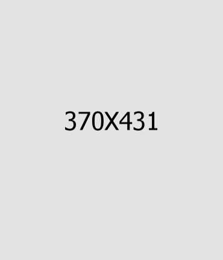
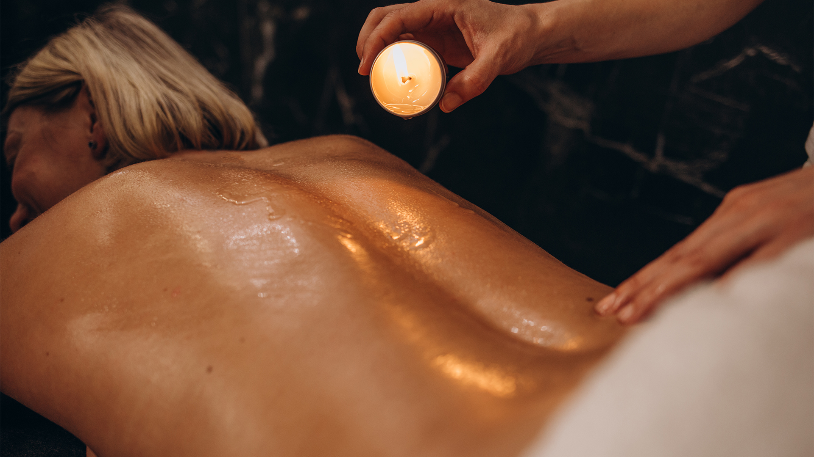
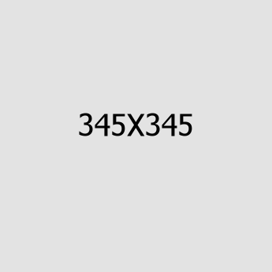
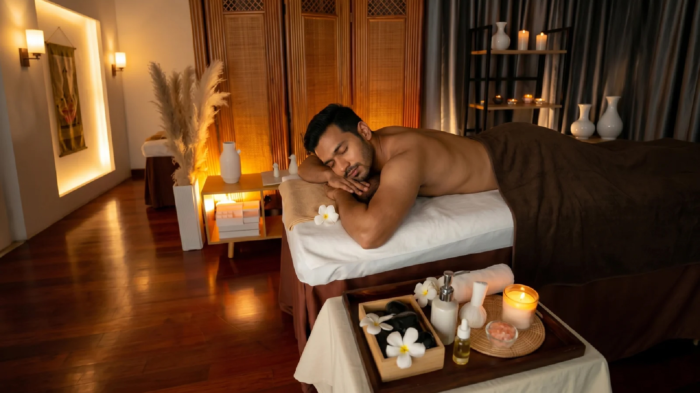
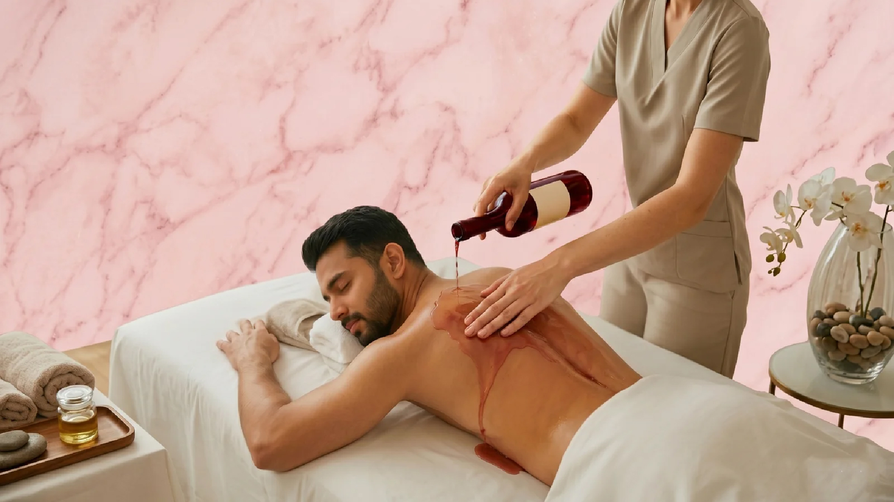

# Refresh D Thai Spa - Codebase Documentation (Part 2: Service Pages)

This document contains source codes for all individual service detail pages (14 files).

## 📂 Directory Structure
```text
Refresh-D-Salon-and-Spa/
├── README.md
├── assets/
│   ├── css/
│   │   └── refresh-d-thai-spa.css
│   ├── js/
│   │   └── refresh-d-thai-spa.js
│   └── inc/
│       └── sendemail.php
├── contact.html
├── index.html
├── index-dark.html
├── services.html
└── service-d-*.html (14 individual service detail pages)
```

---

## 📄 Part 2 Source Code Files

### 🌐 File: `service-d-aroma.html`

```html
<!DOCTYPE html>
<html lang="en">

<head>
    <meta charset="UTF-8" />
    <meta name="viewport" content="width=device-width, initial-scale=1.0" />
    <title>Aromatherapy Massage | Refresh D Thai Spa Marathahalli, Bengaluru</title>
    <!-- favicons Icons -->
    <link rel="apple-touch-icon" sizes="180x180" href="assets/images/favicons/apple-touch-icon.png" />
    <link rel="icon" type="image/png" sizes="32x32" href="assets/images/favicons/favicon-32x32.png" />
    <link rel="icon" type="image/png" sizes="16x16" href="assets/images/favicons/favicon-16x16.png" />
    <link rel="manifest" href="assets/images/favicons/site.webmanifest" />
    <meta name="description" content="Unwind with a 60, 90, or 120-minute premium Aromatherapy Massage using 100% pure organic essential oils at Refresh D Thai Spa, Marathahalli. Book now, no prepayment required." />

    <!-- fonts -->
    <link rel="preconnect" href="https://fonts.googleapis.com">
    <link rel="preconnect" href="https://fonts.gstatic.com" crossorigin>
    <link href="https://fonts.googleapis.com/css2?family=Alex+Brush&family=Cormorant:ital,wght@0,400;0,500;0,600;0,700;1,400;1,500;1,600;1,700&family=Plus+Jakarta+Sans:ital,wght@0,300;0,400;0,500;0,600;0,700;0,800;1,300;1,400;1,500;1,600;1,700;1,800&display=swap" rel="stylesheet">


    <link rel="stylesheet" href="assets/vendors/bootstrap/css/bootstrap.min.css" />
    <link rel="stylesheet" href="assets/vendors/bootstrap-select/bootstrap-select.min.css" />
    <link rel="stylesheet" href="assets/vendors/animate/animate.min.css" />
    <link rel="stylesheet" href="assets/vendors/fontawesome/css/all.min.css" />
    <link rel="stylesheet" href="assets/vendors/jquery-ui/jquery-ui.css" />
    <link rel="stylesheet" href="assets/vendors/jarallax/jarallax.css" />
    <link rel="stylesheet" href="assets/vendors/jquery-magnific-popup/jquery.magnific-popup.css" />
    <link rel="stylesheet" href="assets/vendors/nouislider/nouislider.min.css" />
    <link rel="stylesheet" href="assets/vendors/nouislider/nouislider.pips.css" />
    <link rel="stylesheet" href="assets/vendors/tiny-slider/tiny-slider.css" />
    <link rel="stylesheet" href="assets/vendors/refresh-d-thai-spa-icons/style.css" />
    <link rel="stylesheet" href="assets/vendors/owl-carousel/css/owl.carousel.min.css" />
    <link rel="stylesheet" href="assets/vendors/owl-carousel/css/owl.theme.default.min.css" />

    <!-- template styles -->
    <link rel="stylesheet" href="assets/refresh-d-thai-spa.css" />
    <style>
        .page-header__bg {
            background-image: url(assets/spa-pictures/aroma_massage.jpg) !important;
        }
        @media (max-width: 767px) {
            .page-header__bg {
                background-image: url(assets/spa-pictures/aroma_massage_mobile.jpg) !important;
            }
        }
    </style>
</head>

<body class="custom-cursor">

    <div class="custom-cursor__cursor"></div>
    <div class="custom-cursor__cursor-two"></div>

    <div class="preloader">
        <div class="preloader__image" style="background-image: url(assets/images/loader.png);"></div>
    </div>
    <!-- /.preloader -->
    <div class="page-wrapper">
        <div class="topbar-one">
            <div class="container-fluid">
                <div class="topbar-one__inner">
                    <ul class="list-unstyled topbar-one__info">
                        <li class="topbar-one__info__item">
                            <i class="fas fa-envelope topbar-one__info__icon"></i>
                            <a href="mailto:customer.refresh@gmail.com">customer.refresh@gmail.com</a>
                        </li>
                        <li class="topbar-one__info__item">
                            <i class="fas fa-phone topbar-one__info__icon"></i>
                            <a href="tel:+918310805129">+91 83108 05129</a>
                        </li>
                    </ul><!-- /.list-unstyled topbar-one__info -->
                    <div class="topbar-one__right">
                        <p class="topbar-one__text">Monday to Sunday: 10:00 AM – 8:00 PM Sun: Closed</p><!-- /.topbar-one__text -->
                        <div class="topbar-one__social">
                            <a href="https://twitter.com">
                                <i class="fab fa-twitter" aria-hidden="true"></i>
                                <span class="sr-only">Twitter</span>
                            </a>
                            <a href="https://facebook.com">
                                <i class="fab fa-facebook" aria-hidden="true"></i>
                                <span class="sr-only">Facebook</span>
                            </a>
                            <a href="https://pinterest.com">
                                <i class="fab fa-pinterest-p" aria-hidden="true"></i>
                                <span class="sr-only">Pinterest</span>
                            </a>
                            <a href="https://instagram.com">
                                <i class="fab fa-instagram" aria-hidden="true"></i>
                                <span class="sr-only">Instagram</span>
                            </a>
                        </div><!-- /.topbar-one__social -->
                    </div><!-- /.topbar-one__right -->
                </div><!-- /.topbar-one__inner -->
            </div><!-- /.container-fluid -->
        </div><!-- /.topbar-one -->


        <header class="main-header sticky-header sticky-header--normal">
            <div class="container-fluid">
                <div class="main-header__inner">
                    <div class="main-header__logo">
                        <a href="index.html">
                            
                        </a>
                    </div><!-- /.main-header__logo -->

                    <nav class="main-header__nav main-menu">
                        <ul class="main-menu__list">


                            <li class="megamenu megamenu-clickable megamenu-clickable--toggler">
                                <a href="index.html">Demos</a>
                                <ul>
                                    <li>
                                        <div class="megamenu-popup">
                                            <a href="#" class="megamenu-clickable--close"><span class="icon-close"></span></a>
                                            <!-- /.megamenu-clickable--close -->
                                            <div class="megamenu-popup__content">
                                                <div class="demo-one">
                                                    <div class="container">
                                                        <div class="row">
                                                            <div class="col-md-6 col-lg-4">
                                                                <div class="demo-one__card">
                                                                    <div class="demo-one__image">
                                                                        
                                                                        <div class="demo-one__btns">
                                                                            <a href="index-5.html" class="refresh-d-thai-spa-btn demo-one__btn">
                                                                                <span>Multi Page</span>
                                                                            </a><!-- /.thm-btn demo-one__btn -->
                                                                            <a href="index-5-one-page.html" class="refresh-d-thai-spa-btn demo-one__btn">
                                                                                <span>One Page</span>
                                                                            </a><!-- /.thm-btn demo-one__btn -->
                                                                            <a href="index-5-dark.html" class="refresh-d-thai-spa-btn demo-one__btn">
                                                                                <span>Dark Page</span>
                                                                            </a><!-- /.thm-btn demo-one__btn -->
                                                                        </div><!-- /.demo-one__btns -->
                                                                    </div><!-- /.demo-one__image -->
                                                                    <div class="demo-one__content">
                                                                        <h3 class="demo-one__title">
                                                                            <a href="index-5.html">Home Page 05</a>
                                                                        </h3><!-- /.demo-one__title -->
                                                                    </div><!-- /.demo-one__content -->
                                                                </div><!-- /.demo-one__card -->
                                                            </div><!-- /.col-md-6 col-lg-3 -->
                                                            <div class="col-md-6 col-lg-4">
                                                                <div class="demo-one__card">
                                                                    <div class="demo-one__image">
                                                                        
                                                                        <div class="demo-one__btns">
                                                                            <a href="index-4.html" class="refresh-d-thai-spa-btn demo-one__btn">
                                                                                <span>Multi Page</span>
                                                                            </a><!-- /.thm-btn demo-one__btn -->
                                                                            <a href="index-4-one-page.html" class="refresh-d-thai-spa-btn demo-one__btn">
                                                                                <span>One Page</span>
                                                                            </a><!-- /.thm-btn demo-one__btn -->
                                                                            <a href="index-4-dark.html" class="refresh-d-thai-spa-btn demo-one__btn">
                                                                                <span>Dark Page</span>
                                                                            </a><!-- /.thm-btn demo-one__btn -->
                                                                        </div><!-- /.demo-one__btns -->
                                                                    </div><!-- /.demo-one__image -->
                                                                    <div class="demo-one__content">
                                                                        <h3 class="demo-one__title">
                                                                            <a href="index-4.html">Home Page 04</a>
                                                                        </h3><!-- /.demo-one__title -->
                                                                    </div><!-- /.demo-one__content -->
                                                                </div><!-- /.demo-one__card -->
                                                            </div><!-- /.col-md-6 col-lg-3 -->
                                                            <div class="col-md-6 col-lg-4">
                                                                <div class="demo-one__card">
                                                                    <div class="demo-one__image">
                                                                        
                                                                        <div class="demo-one__btns">
                                                                            <a href="index.html" class="refresh-d-thai-spa-btn demo-one__btn">
                                                                                <span>Multi Page</span>
                                                                            </a><!-- /.thm-btn demo-one__btn -->
                                                                            <a href="index-one-page.html" class="refresh-d-thai-spa-btn demo-one__btn">
                                                                                <span>One Page</span>
                                                                            </a><!-- /.thm-btn demo-one__btn -->
                                                                            <a href="index-dark.html" class="refresh-d-thai-spa-btn demo-one__btn">
                                                                                <span>Dark Page</span>
                                                                            </a><!-- /.thm-btn demo-one__btn -->
                                                                        </div><!-- /.demo-one__btns -->
                                                                    </div><!-- /.demo-one__image -->
                                                                    <div class="demo-one__content">
                                                                        <h3 class="demo-one__title">
                                                                            <a href="index.html">Home Page 01</a>
                                                                        </h3><!-- /.demo-one__title -->
                                                                    </div><!-- /.demo-one__content -->
                                                                </div><!-- /.demo-one__card -->
                                                            </div><!-- /.col-md-6 col-lg-3 -->
                                                            <div class="col-md-6 col-lg-4">
                                                                <div class="demo-one__card">
                                                                    <div class="demo-one__image">
                                                                        
                                                                        <div class="demo-one__btns">
                                                                            <a href="index-2.html" class="refresh-d-thai-spa-btn demo-one__btn">
                                                                                <span>Multi Page</span>
                                                                            </a><!-- /.thm-btn demo-one__btn -->
                                                                            <a href="index-2-one-page.html" class="refresh-d-thai-spa-btn demo-one__btn">
                                                                                <span>One Page</span>
                                                                            </a><!-- /.thm-btn demo-one__btn -->
                                                                            <a href="index-2-dark.html" class="refresh-d-thai-spa-btn demo-one__btn">
                                                                                <span>Dark Page</span>
                                                                            </a><!-- /.thm-btn demo-one__btn -->
                                                                        </div><!-- /.demo-one__btns -->
                                                                    </div><!-- /.demo-one__image -->
                                                                    <div class="demo-one__content">
                                                                        <h3 class="demo-one__title">
                                                                            <a href="index-2.html">Home Page 02</a>
                                                                        </h3><!-- /.demo-one__title -->
                                                                    </div><!-- /.demo-one__content -->
                                                                </div><!-- /.demo-one__card -->
                                                            </div><!-- /.col-md-6 col-lg-3 -->
                                                            <div class="col-md-6 col-lg-4">
                                                                <div class="demo-one__card">
                                                                    <div class="demo-one__image">
                                                                        
                                                                        <div class="demo-one__btns">
                                                                            <a href="index-3.html" class="refresh-d-thai-spa-btn demo-one__btn">
                                                                                <span>Multi Page</span>
                                                                            </a><!-- /.thm-btn demo-one__btn -->
                                                                            <a href="index-3-one-page.html" class="refresh-d-thai-spa-btn demo-one__btn">
                                                                                <span>One Page</span>
                                                                            </a><!-- /.thm-btn demo-one__btn -->
                                                                            <a href="index-3-dark.html" class="refresh-d-thai-spa-btn demo-one__btn">
                                                                                <span>Dark Page</span>
                                                                            </a><!-- /.thm-btn demo-one__btn -->
                                                                        </div><!-- /.demo-one__btns -->
                                                                    </div><!-- /.demo-one__image -->
                                                                    <div class="demo-one__content">
                                                                        <h3 class="demo-one__title">
                                                                            <a href="index-3.html">Home Page 03</a>
                                                                        </h3><!-- /.demo-one__title -->
                                                                    </div><!-- /.demo-one__content -->
                                                                </div><!-- /.demo-one__card -->
                                                            </div><!-- /.col-md-6 col-lg-3 -->
                                                            <div class="col-md-6 col-lg-4">
                                                                <div class="demo-one__card">
                                                                    <div class="demo-one__image">
                                                                        
                                                                        <div class="demo-one__btns">
                                                                            <a href="index-boxed.html" class="refresh-d-thai-spa-btn demo-one__btn">
                                                                                <span>View Page</span>
                                                                            </a><!-- /.thm-btn demo-one__btn -->
                                                                        </div><!-- /.demo-one__btns -->
                                                                    </div><!-- /.demo-one__image -->
                                                                    <div class="demo-one__content">
                                                                        <h3 class="demo-one__title">
                                                                            <a href="index-boxed.html">Home Boxed</a>
                                                                        </h3><!-- /.demo-one__title -->
                                                                    </div><!-- /.demo-one__content -->
                                                                </div><!-- /.demo-one__card -->
                                                            </div><!-- /.col-md-6 col-lg-3 -->
                                                            <div class="col-md-6 col-lg-4">
                                                                <div class="demo-one__card">
                                                                    <div class="demo-one__image">
                                                                        
                                                                        <div class="demo-one__btns">
                                                                            <a href="index-rtl.html#googtrans(en%7car)" class="refresh-d-thai-spa-btn demo-one__btn">
                                                                                <span>View Page</span>
                                                                            </a><!-- /.thm-btn demo-one__btn -->
                                                                        </div><!-- /.demo-one__btns -->
                                                                    </div><!-- /.demo-one__image -->
                                                                    <div class="demo-one__content">
                                                                        <h3 class="demo-one__title">
                                                                            <a href="index-rtl.html#googtrans(en%7car)">Home RTL</a>
                                                                        </h3><!-- /.demo-one__title -->
                                                                    </div><!-- /.demo-one__content -->
                                                                </div><!-- /.demo-one__card -->
                                                            </div><!-- /.col-md-6 col-lg-3 -->
                                                        </div><!-- /.row -->
                                                    </div><!-- /.container -->
                                                </div><!-- /.demos-one -->
                                            </div><!-- /.megamenu-popup__content -->
                                        </div><!-- /.megamenu-popup -->
                                    </li>
                                </ul>
                            </li>


                            <li>
                                <a href="about.html">About</a>
                            </li>
                            <li class="dropdown">
                                <a href="#">Pages</a>
                                <ul>
                                    <li><a href="team.html">Our Experts</a></li>
                                    <li><a href="team-carousel.html">Experts Carousel</a></li>
                                    <li><a href="team-details.html">Expert Details</a></li>
                                    <li><a href="gift-cards.html">Gift Cards</a></li>
                                    <li><a href="gift-cards-carousel.html">Gift Cards Carousel</a></li>
                                    <li><a href="reviews.html">Reviews</a></li>
                                    <li><a href="reviews-carousel.html">Reviews Carousel</a></li>
                                    <li><a href="memberships.html">Memberships</a></li>
                                    <li><a href="packages.html">Packages</a></li>
                                    <li><a href="packages-carousel.html">Packages Carousel</a></li>
                                    <li>
                                        <a href="gallery.html">Gallery</a>
                                        <ul>
                                            <li><a href="gallery.html">Gallery masonry</a></li>
                                            <li><a href="gallery-filter.html">Gallery filter</a></li>
                                            <li><a href="gallery-grid.html">Gallery Grid</a></li>
                                            <li><a href="gallery-carousel.html">Gallery Carousel</a></li>
                                        </ul>
                                    </li>
                                    <li><a href="faq.html">FAQs</a></li>
                                    <li><a href="login.html">Login</a></li>
                                    <li><a href="404.html">404 Error</a></li>
                                </ul>
                            </li>
                            <li class="dropdown">
                                <a href="#">Services</a>
                                <ul>
                                    <li><a href="services.html">Services</a></li>
                                    <li><a href="services-grid.html">Services Grid</a></li>
                                    <li><a href="services-carousel.html">Services Carousel</a></li>
                                    <li><a href="service-d-salt.html">Salt Therapy</a></li>
                                    <li><a href="service-d-aroma.html">Aroma Therapy</a></li>
                                    <li><a href="service-d-hydro-therapy.html">Hydro Therapy</a></li>
                                    <li><a href="service-d-reflexology.html">Reflexology</a></li>
                                    <li> <a href="service-d-sauna.html">Sauna Relax</a></li>
                                    <li><a href="service-d-thermo-stone.html">Thermo Stone</a></li>
                                </ul>
                            </li>

                            <li class="dropdown">
                                <a href="#">Shop</a>
                                <ul class="sub-menu">
                                    <li class="dropdown">
                                        <a href="#">Products</a>
                                        <ul class="sub-menu">
                                            <li><a href="products.html">No sidebar</a></li>
                                            <li><a href="products-left.html">Left sidebar</a></li>
                                            <li><a href="products-right.html">Right sidebar</a></li>
                                        </ul>
                                    </li>
                                    <li><a href="products-carousel.html">Products carousel</a></li>
                                    <li><a href="product-details.html">Product details</a></li>
                                    <li><a href="cart.html">Cart</a></li>
                                    <li><a href="checkout.html">Checkout</a></li>
                                </ul>
                            </li>
                            <li class="dropdown">
                                <a href="#">News</a>
                                <ul class="sub-menu">
                                    <li class="dropdown">
                                        <a href="#">News grid</a>
                                        <ul class="sub-menu">
                                            <li><a href="blog-grid.html">No sidebar</a></li>
                                            <li><a href="blog-grid-left.html">Left sidebar</a></li>
                                            <li><a href="blog-grid-right.html">Right sidebar</a></li>
                                        </ul>
                                    </li>
                                    <li class="dropdown">
                                        <a href="#">News list</a>
                                        <ul class="sub-menu">
                                            <li><a href="blog-list.html">No sidebar</a></li>
                                            <li><a href="blog-list-left.html">Left sidebar</a></li>
                                            <li><a href="blog-list-right.html">Right sidebar</a></li>
                                        </ul>
                                    </li>
                                    <li><a href="blog-carousel.html">News carousel</a></li>
                                    <li class="dropdown">
                                        <a href="#">News details</a>
                                        <ul class="sub-menu">
                                            <li><a href="blog-details.html">No sidebar</a></li>
                                            <li><a href="blog-details-left.html">Left sidebar</a></li>
                                            <li><a href="blog-details-right.html">Right sidebar</a></li>
                                        </ul>
                                    </li>
                                </ul>
                            </li>
                            <li>
                                <a href="contact.html">Contact</a>
                            </li>
                        </ul>
                    </nav><!-- /.main-header__nav -->
                    <div class="main-header__right">
                        <div class="mobile-nav__btn mobile-nav__toggler">
                            <span></span>
                            <span></span>
                            <span></span>
                        </div><!-- /.mobile-nav__toggler -->
                        <a href="#" class="search-toggler main-header__search">
                            <i class="icon-magnifying-glass" aria-hidden="true"></i>
                            <span class="sr-only">Search</span>
                        </a><!-- /.search-toggler -->
                        <a href="cart.html" class="main-header__cart">
                            <i class="icon-shopping-cart" aria-hidden="true"></i>
                            <span class="sr-only">Search</span>
                        </a><!-- /.search-toggler -->
                        <a href="contact.html" class="refresh-d-thai-spa-btn main-header__btn">
                            <span>Book now</span>
                        </a><!-- /.thm-btn main-header__btn -->
                    </div><!-- /.main-header__right -->
                </div><!-- /.main-header__inner -->
            </div><!-- /.container-fluid -->
        </header><!-- /.main-header -->
                        <section class="page-header" style="padding-top: 130px; padding-bottom: 230px; position: relative;">
            <div class="page-header__bg"></div>
            <div class="container" style="position: relative; z-index: 10;">
                <div class="row align-items-center">
                    <div class="col-xl-7 text-start wow fadeInLeft" data-wow-delay="100ms">
                        <div class="main-slider-one__content" style="text-align: left; padding-right: 35px;">
                            <h5 class="main-slider-one__sub-title" style="justify-content: flex-start; margin-bottom: 25px;">Aromatherapy Massage in Marathahalli </h5>
                            <h2 class="page-header__title" style="font-size: 68px; font-family: 'Cormorant', serif; text-transform: uppercase; letter-spacing: 0.15em; color: #ffffff; line-height: 1.15; font-weight: 500; margin-bottom: 20px;">Best Aromatherapy Massage<br><em style="font-family: 'Cormorant', serif; font-style: italic; color: #c99374; font-weight: 400; text-transform: none;">in Marathahalli, Bengaluru.</em></h2>
                            <p class="main-slider-one__text" style="color: rgba(234, 229, 226, 0.85); font-size: 16px; margin: 15px 0 25px; line-height: 1.7; font-family: 'Plus Jakarta Sans', sans-serif; max-width: 550px;">Let pure essential oils do what stress has undone. A full-body aromatherapy massage that calms the mind, releases the body, and restores your inner quiet &mdash; steps from Chinmaya Mission Hospital, Marathahalli.</p>
                        </div>
                    </div>
                    <div class="col-xl-5 text-start">
                        <div class="hero-booking-card wow fadeInRight" data-wow-delay="300ms">
                            <form id="booking-form" class="contact__form contact-form-validated" action="inc/sendemail.php">
                                <div class="sec-title text-center" style="margin-bottom: 20px;">
                                    
                                    <h6 class="sec-title__tagline" style="font-size: 11px; letter-spacing: 0.15em; text-transform: uppercase; color: #c99374; margin-bottom: 2px;">Refresh D Thai Spa</h6>
                                    <h3 class="sec-title__title" style="color: #fff !important; font-size: 24px; font-family: 'Cormorant', serif; font-weight: 600; margin-top: 2px; text-transform: none; letter-spacing: 0;">Book Appointment</h3>
                                </div>
                                <div class="row">
                                    <div class="col-md-6 col-sm-12">
                                        <div class="contact__input-box" style="margin-bottom: 12px;">
                                            <input type="text" placeholder="Your name" name="name" required >
                                        </div>
                                    </div>
                                    <div class="col-md-6 col-sm-12">
                                        <div class="contact__input-box style-two" style="margin-bottom: 12px;">
                                            <input type="text" placeholder="Phone number" name="phone" required >
                                        </div>
                                    </div>
                                    <div class="col-md-6 col-sm-12">
                                        <div class="contact__input-box" style="margin-bottom: 12px;">
                                            <select class="booking-form-select hero-booking-select" name="service" aria-label="Select Service" required >
                                                <option value="">Select service</option>
                                                <option value="Aroma Massage" selected>Aroma Therapy</option>
                                                <option value="Balinese Massage">Balinese Massage</option>
                                                <option value="Couple Massage">Couple Massage</option>
                                                <option value="Deep Tissue Massage">Deep Tissue Massage</option>
                                                <option value="Four-Hand Massage">Four-Hand Massage</option>
                                                <option value="Hydro Therapy">Hydro Therapy</option>
                                                <option value="Reflexology therapy">Reflexology Therapy</option>
                                                <option value="Salt therapy">Salt Therapy</option>
                                                <option value="Sauna therapy">Sauna Therapy</option>
                                                <option value="Stone Massage">Stone Massage</option>
                                                <option value="Swedish Massage">Swedish Massage</option>
                                                <option value="Thai Massage">Thai Massage</option>
                                                <option value="Thermo Stone">Thermo Stone Massage</option>
                                                <option value="VIP Massage">VIP Massage</option>
                                            </select>
                                        </div>
                                    </div>
                                    <div class="col-md-6 col-sm-12">
                                        <div class="contact__input-box" style="margin-bottom: 12px;">
                                            <input type="text" placeholder="Coupon code" name="coupon" >
                                        </div>
                                    </div>
                                    <div class="col-md-6 col-sm-12">
                                        <div class="contact__input-box" style="margin-bottom: 12px; position: relative;">
                                            <input class="refresh-d-thai-spa-datepicker" type="text" name="date" placeholder="Select date" required >
                                            <i class="fa fa-calendar-alt" style="position: absolute; right: 15px; top: 18px; color: #c99374; font-size: 13px; pointer-events: none;"></i>
                                        </div>
                                    </div>
                                    <div class="col-md-6 col-sm-12">
                                        <div class="contact__input-box" style="margin-bottom: 12px; position: relative;">
                                            <input type="text" list="available-times" name="time" placeholder="Select time" required >
                                            <i class="fa fa-clock" style="position: absolute; right: 15px; top: 18px; color: #c99374; font-size: 13px; pointer-events: none;"></i>
                                        </div>
                                    </div>
                                    <div class="col-md-12 contact__btn-box text-center" style="margin-top: 20px;">
                                        <button type="submit" class="refresh-d-thai-spa-btn refresh-d-thai-spa-btn--base"><span>Reserve Your Session</span></button>
                                        <div style="margin-top: 16px; font-size: 11px; color: rgba(234, 229, 226, 0.45); font-family: 'Plus Jakarta Sans', sans-serif; text-align: center; line-height: 1.5;">No prepayment required &bull; Free cancellation &bull; Save 10% &mdash; Code: PTS10</div>
                                    </div>
                                </div>
                            </form>
                        </div>
                    </div>
                </div>
            </div>
        </section>
        <!-- page-header-end -->
                <!-- Duration Pricing Section Start -->
        <section class="duration-pricing-section" style="padding: 100px 0; background: linear-gradient(180deg, #141215 0%, #0e0c0f 100%); position: relative; overflow: hidden;">
            <!-- Decorative background circle -->
            <div style="position: absolute; top: -120px; right: -120px; width: 500px; height: 500px; border-radius: 50%; background: radial-gradient(circle, rgba(201,147,116,0.06) 0%, transparent 70%); pointer-events: none;"></div>
            <div class="container" style="position: relative; z-index: 1;">
                <!-- Section Header -->
                <div class="row justify-content-center" style="margin-bottom: 60px;">
                    <div class="col-lg-7 text-center">
                        <p style="font-family: 'Plus Jakarta Sans', sans-serif; font-size: 11px; text-transform: uppercase; letter-spacing: 0.3em; color: #c99374; margin-bottom: 16px; display: flex; align-items: center; justify-content: center; gap: 12px;">
                            <span style="display: inline-block; width: 32px; height: 1px; background: #c99374;"></span>
                            Investment
                            <span style="display: inline-block; width: 32px; height: 1px; background: #c99374;"></span>
                        </p>
                        <h2 style="font-family: 'Cormorant', serif; font-size: 52px; font-weight: 600; color: #fff; line-height: 1.05; margin-bottom: 16px;">
                            Choose Your <em style="font-family: 'Cormorant', serif; font-style: italic; color: #c99374; font-weight: 400;">Duration</em>
                        </h2>
                        <p style="font-family: 'Plus Jakarta Sans', sans-serif; font-size: 14px; color: rgba(234,229,226,0.55); max-width: 420px; margin: 0 auto; line-height: 1.7;">Select the session that suits your schedule. Every duration delivers the full Refresh D Thai Spa experience.</p>
                    </div>
                </div>

                <!-- Cards -->
                <div class="row justify-content-center gutter-y-30">

                    <!-- Card 1: 60 Minutes -->
                    <div class="col-lg-4 col-md-6">
                        <div class="dur-card" style="position: relative; background: rgba(255,255,255,0.03); border: 1px solid rgba(201,147,116,0.15); border-radius: 24px; padding: 44px 36px 36px; text-align: center; transition: all 0.4s ease; backdrop-filter: blur(12px);">
                            <!-- Duration pill -->
                            <div style="display: inline-block; background: rgba(201,147,116,0.1); border: 1px solid rgba(201,147,116,0.25); border-radius: 30px; padding: 6px 20px; margin-bottom: 24px;">
                                <span style="font-family: 'Plus Jakarta Sans', sans-serif; font-size: 11px; font-weight: 700; text-transform: uppercase; letter-spacing: 0.15em; color: #c99374;">60 Minutes</span>
                            </div>
                            <div style="font-family: 'Cormorant', serif; font-size: 54px; font-weight: 700; color: #fff; line-height: 1; margin-bottom: 4px;">&#8377;2,399</div>
                            <div style="font-family: 'Plus Jakarta Sans', sans-serif; font-size: 13px; color: rgba(234,229,226,0.35); text-decoration: line-through; margin-bottom: 28px;">&#8377;2,665</div>
                            <div style="border-top: 1px solid rgba(201,147,116,0.1); padding-top: 24px; margin-bottom: 24px;">
                                <div style="font-family: 'Plus Jakarta Sans', sans-serif; font-size: 12px; color: rgba(234,229,226,0.5); line-height: 1.8;">
                                    <span>&#10003;&nbsp; No prepayment required</span><br>
                                    <span>&#10003;&nbsp; Free cancellation</span><br>
                                    <span>&#10003;&nbsp; Certified therapists</span>
                                </div>
                            </div>
                            <a href="#booking-form" style="display: block; width: 100%; padding: 14px; border-radius: 8px; background: transparent; border: 1px solid #c99374; color: #c99374; font-family: 'Plus Jakarta Sans', sans-serif; font-size: 12px; font-weight: 700; text-transform: uppercase; letter-spacing: 0.12em; text-decoration: none; transition: all 0.3s;">Book This Session</a>
                            <div style="margin-top: 16px; font-size: 11px; color: #c99374; font-family: 'Plus Jakarta Sans', sans-serif; opacity: 0.7;">Save 10% &bull; Code: PTS10</div>
                        </div>
                    </div>

                    <!-- Card 2: 90 Minutes (Most Popular) -->
                    <div class="col-lg-4 col-md-6">
                        <div class="dur-card" style="position: relative; background: linear-gradient(135deg, #1a3028 0%, #0f1e16 100%); border: 2px solid #c99374; border-radius: 24px; padding: 44px 36px 36px; text-align: center; transition: all 0.4s ease; box-shadow: 0 24px 60px rgba(0,0,0,0.5), 0 0 0 1px rgba(201,147,116,0.2); transform: translateY(-8px);">
                            <!-- Popular badge -->
                            <div style="position: absolute; top: -16px; left: 50%; transform: translateX(-50%); background: linear-gradient(90deg, #c99374, #e8b48a); color: #0e0c0f; font-family: 'Plus Jakarta Sans', sans-serif; font-size: 10px; font-weight: 800; text-transform: uppercase; letter-spacing: 0.12em; padding: 6px 20px; border-radius: 30px; white-space: nowrap; box-shadow: 0 4px 16px rgba(201,147,116,0.4);">&#9733; Most Popular</div>
                            <!-- Duration pill -->
                            <div style="display: inline-block; background: rgba(201,147,116,0.2); border: 1px solid rgba(201,147,116,0.4); border-radius: 30px; padding: 6px 20px; margin-bottom: 24px; margin-top: 8px;">
                                <span style="font-family: 'Plus Jakarta Sans', sans-serif; font-size: 11px; font-weight: 700; text-transform: uppercase; letter-spacing: 0.15em; color: #c99374;">90 Minutes</span>
                            </div>
                            <div style="font-family: 'Cormorant', serif; font-size: 54px; font-weight: 700; color: #fff; line-height: 1; margin-bottom: 4px;">&#8377;3,499</div>
                            <div style="font-family: 'Plus Jakarta Sans', sans-serif; font-size: 13px; color: rgba(234,229,226,0.35); text-decoration: line-through; margin-bottom: 28px;">&#8377;3,888</div>
                            <div style="border-top: 1px solid rgba(201,147,116,0.2); padding-top: 24px; margin-bottom: 24px;">
                                <div style="font-family: 'Plus Jakarta Sans', sans-serif; font-size: 12px; color: rgba(234,229,226,0.6); line-height: 1.8;">
                                    <span>&#10003;&nbsp; No prepayment required</span><br>
                                    <span>&#10003;&nbsp; Free cancellation</span><br>
                                    <span>&#10003;&nbsp; Certified therapists</span>
                                </div>
                            </div>
                            <a href="#booking-form" style="display: block; width: 100%; padding: 14px; border-radius: 8px; background: linear-gradient(90deg, #c99374, #e8b48a); border: none; color: #0e0c0f; font-family: 'Plus Jakarta Sans', sans-serif; font-size: 12px; font-weight: 800; text-transform: uppercase; letter-spacing: 0.12em; text-decoration: none; box-shadow: 0 8px 20px rgba(201,147,116,0.35);">Book This Session</a>
                            <div style="margin-top: 16px; font-size: 11px; color: #c99374; font-family: 'Plus Jakarta Sans', sans-serif; opacity: 0.85;">Save 10% &bull; Code: PTS10</div>
                        </div>
                    </div>

                    <!-- Card 3: 120 Minutes -->
                    <div class="col-lg-4 col-md-6">
                        <div class="dur-card" style="position: relative; background: rgba(255,255,255,0.03); border: 1px solid rgba(201,147,116,0.15); border-radius: 24px; padding: 44px 36px 36px; text-align: center; transition: all 0.4s ease; backdrop-filter: blur(12px);">
                            <!-- Duration pill -->
                            <div style="display: inline-block; background: rgba(201,147,116,0.1); border: 1px solid rgba(201,147,116,0.25); border-radius: 30px; padding: 6px 20px; margin-bottom: 24px;">
                                <span style="font-family: 'Plus Jakarta Sans', sans-serif; font-size: 11px; font-weight: 700; text-transform: uppercase; letter-spacing: 0.15em; color: #c99374;">120 Minutes</span>
                            </div>
                            <div style="font-family: 'Cormorant', serif; font-size: 54px; font-weight: 700; color: #fff; line-height: 1; margin-bottom: 4px;">&#8377;4,499</div>
                            <div style="font-family: 'Plus Jakarta Sans', sans-serif; font-size: 13px; color: rgba(234,229,226,0.35); text-decoration: line-through; margin-bottom: 28px;">&#8377;4,999</div>
                            <div style="border-top: 1px solid rgba(201,147,116,0.1); padding-top: 24px; margin-bottom: 24px;">
                                <div style="font-family: 'Plus Jakarta Sans', sans-serif; font-size: 12px; color: rgba(234,229,226,0.5); line-height: 1.8;">
                                    <span>&#10003;&nbsp; No prepayment required</span><br>
                                    <span>&#10003;&nbsp; Free cancellation</span><br>
                                    <span>&#10003;&nbsp; Certified therapists</span>
                                </div>
                            </div>
                            <a href="#booking-form" style="display: block; width: 100%; padding: 14px; border-radius: 8px; background: transparent; border: 1px solid #c99374; color: #c99374; font-family: 'Plus Jakarta Sans', sans-serif; font-size: 12px; font-weight: 700; text-transform: uppercase; letter-spacing: 0.12em; text-decoration: none; transition: all 0.3s;">Book This Session</a>
                            <div style="margin-top: 16px; font-size: 11px; color: #c99374; font-family: 'Plus Jakarta Sans', sans-serif; opacity: 0.7;">Save 10% &bull; Code: PTS10</div>
                        </div>
                    </div>

                </div>
            </div>
        </section>
        <!-- Duration Pricing Section End -->

<!-- Sensory Service Description Section Start -->
        <section class="sensory-description-section" style="padding: 110px 0; background: #0e0c0f; position: relative; overflow: hidden; border-top: 1px solid rgba(201,147,116,0.12);">
            <!-- Ambient glows -->
            <div style="position: absolute; top: -100px; right: -100px; width: 400px; height: 400px; border-radius: 50%; background: radial-gradient(circle, rgba(201,147,116,0.05) 0%, transparent 70%); pointer-events: none;"></div>
            
            <div class="container" style="position: relative; z-index: 2;">
                <div class="row align-items-center gutter-y-40">
                    
                    <!-- Left: Header Details -->
                    <div class="col-lg-5">
                        <p style="font-family: 'Plus Jakarta Sans', sans-serif; font-size: 11px; font-weight: 700; text-transform: uppercase; letter-spacing: 0.35em; color: #c99374; margin-bottom: 18px; display: flex; align-items: center; gap: 12px;">
                            <span style="display: inline-block; width: 28px; height: 1px; background: #c99374;"></span>The Treatment
                        </p>
                        <h2 style="font-family: 'Cormorant', serif; font-size: 56px; font-weight: 600; color: #fff; line-height: 1.08; margin-bottom: 20px;">
                            Scent. Touch.<br><em style="font-family: 'Cormorant', serif; font-style: italic; color: #c99374; font-weight: 400;">Stillness.</em>
                        </h2>
                        <div style="width: 40px; height: 2px; background: linear-gradient(90deg, #c99374, transparent); margin-bottom: 24px;"></div>
                    </div>
                    
                    <!-- Right: Sensory Description Body Copy -->
                    <div class="col-lg-7">
                        <div style="display: flex; flex-direction: column; gap: 20px;">
                            <p style="font-family: 'Plus Jakarta Sans', sans-serif; font-size: 14.5px; color: rgba(234, 229, 226, 0.75); line-height: 1.9; margin: 0;">
                                The session begins the moment you arrive. A warm cup of organic herbal tea signals to your nervous system that something different is about to happen. No rushing. No noise. No performance.
                            </p>
                            <p style="font-family: 'Plus Jakarta Sans', sans-serif; font-size: 14.5px; color: rgba(234, 229, 226, 0.75); line-height: 1.9; margin: 0;">
                                Your certified therapist takes a quiet moment to understand you &mdash; where you carry your stress, what your body needs today. Then the ritual begins.
                            </p>
                            <p style="font-family: 'Plus Jakarta Sans', sans-serif; font-size: 14.5px; color: rgba(234, 229, 226, 0.75); line-height: 1.9; margin: 0;">
                                Warm, 100% certified essential oils are drawn across your skin in long, deliberate strokes. The scent reaches you before the pressure does &mdash; calming your mind as your muscles are coaxed open. Ancient Thai energy line techniques guide every movement, releasing the tension that accumulates silently in your neck, shoulders, and lower back over weeks of ordinary life.
                            </p>
                            <p style="font-family: 'Plus Jakarta Sans', sans-serif; font-size: 14.5px; color: rgba(234, 229, 226, 0.75); line-height: 1.9; margin: 0;">
                                By the time your closing cup of herbal tea is placed in your hands, you will not merely feel relaxed. You will feel reset.
                            </p>
                            
                            <!-- Oils list -->
                            <div style="margin-top: 15px; border-top: 1px solid rgba(201,147,116,0.12); padding-top: 20px;">
                                <p style="font-family: 'Plus Jakarta Sans', sans-serif; font-size: 13.5px; font-weight: 700; color: #fff; margin-bottom: 12px;">Oils used in this treatment:</p>
                                <div style="display: flex; flex-direction: column; gap: 10px;">
                                    <div style="display: flex; align-items: flex-start; gap: 12px;">
                                        <div style="color: #c99374; font-size: 13px; font-weight: bold; margin-top: 2px;">&#10003;</div>
                                        <p style="font-family: 'Plus Jakarta Sans', sans-serif; font-size: 13.5px; color: rgba(234,229,226,0.7); margin: 0; line-height: 1.5;"><strong>Lavender</strong> &mdash; calms the central nervous system, lowers cortisol, prepares deep sleep</p>
                                    </div>
                                    <div style="display: flex; align-items: flex-start; gap: 12px;">
                                        <div style="color: #c99374; font-size: 13px; font-weight: bold; margin-top: 2px;">&#10003;</div>
                                        <p style="font-family: 'Plus Jakarta Sans', sans-serif; font-size: 13.5px; color: rgba(234,229,226,0.7); margin: 0; line-height: 1.5;"><strong>Eucalyptus</strong> &mdash; clears mental fog and eases muscular inflammation</p>
                                    </div>
                                    <div style="display: flex; align-items: flex-start; gap: 12px;">
                                        <div style="color: #c99374; font-size: 13px; font-weight: bold; margin-top: 2px;">&#10003;</div>
                                        <p style="font-family: 'Plus Jakarta Sans', sans-serif; font-size: 13.5px; color: rgba(234,229,226,0.7); margin: 0; line-height: 1.5;"><strong>Lemongrass</strong> &mdash; invigorates circulation and grounds the mind</p>
                                    </div>
                                    <div style="display: flex; align-items: flex-start; gap: 12px;">
                                        <div style="color: #c99374; font-size: 13px; font-weight: bold; margin-top: 2px;">&#10003;</div>
                                        <p style="font-family: 'Plus Jakarta Sans', sans-serif; font-size: 13.5px; color: rgba(234,229,226,0.7); margin: 0; line-height: 1.5;"><strong>Ylang Ylang</strong> &mdash; releases anxiety held in the chest and jaw</p>
                                    </div>
                                    <div style="display: flex; align-items: flex-start; gap: 12px;">
                                        <div style="color: #c99374; font-size: 13px; font-weight: bold; margin-top: 2px;">&#10003;</div>
                                        <p style="font-family: 'Plus Jakarta Sans', sans-serif; font-size: 13.5px; color: rgba(234,229,226,0.7); margin: 0; line-height: 1.5;"><strong>Sweet Almond</strong> &mdash; the carrier oil; deeply nourishing, safe for all skin types</p>
                                    </div>
                                </div>
                            </div>
                        </div>
                    </div>
                    
                </div>
            </div>
        </section>
<!-- Sensory Service Description Section End -->


        <!-- What to Expect Section Start -->
        <section class="what-to-expect-section" style="padding: 110px 0; background: #0e0c0f; position: relative; overflow: hidden;">
            <!-- Decorative background radial glow -->
            <div style="position: absolute; bottom: -80px; left: -80px; width: 400px; height: 400px; border-radius: 50%; background: radial-gradient(circle, rgba(201,147,116,0.05) 0%, transparent 70%); pointer-events: none;"></div>
            
            <div class="container" style="position: relative; z-index: 1;">
                <div class="row align-items-start gutter-y-40">

                    <!-- Left: Heading -->
                    <div class="col-lg-4">
                        <div style="position: sticky; top: 100px;">
                            <p style="font-family: 'Plus Jakarta Sans', sans-serif; font-size: 11px; text-transform: uppercase; letter-spacing: 0.35em; color: #c99374; margin-bottom: 18px; display: flex; align-items: center; gap: 12px;">
                                <span style="display: inline-block; width: 28px; height: 1px; background: #c99374;"></span>Your Journey
                            </p>
                            <h2 style="font-family: 'Cormorant', serif; font-size: 52px; font-weight: 600; color: #fff; line-height: 1.08; margin-bottom: 20px;">
                                What to<br><em style="font-family: 'Cormorant', serif; font-style: italic; color: #c99374; font-weight: 400;">Expect</em>
                            </h2>
                            <div style="width: 40px; height: 2px; background: linear-gradient(90deg, #c99374, transparent); margin-bottom: 24px;"></div>
                            <p style="font-family: 'Plus Jakarta Sans', sans-serif; font-size: 14px; color: rgba(234,229,226,0.5); line-height: 1.8; margin: 0;">From the moment you walk in, every detail is designed to dissolve tension and bring you back to stillness.</p>
                        </div>
                    </div>

                    <!-- Right: Steps -->
                    <div class="col-lg-8">
                        <div style="display: flex; flex-direction: column; gap: 16px;">

                            <!-- Step 01 -->
                            <div style="display: flex; align-items: stretch; gap: 0; background: rgba(255,255,255,0.03); border: 1px solid rgba(201,147,116,0.12); border-radius: 18px; overflow: hidden; transition: border-color 0.3s, transform 0.3s;">
                                <div style="flex-shrink: 0; width: 90px; display: flex; align-items: center; justify-content: center; background: rgba(201,147,116,0.06); border-right: 1px solid rgba(201,147,116,0.1);">
                                     <span style="font-family: 'Cormorant', serif; font-size: 38px; font-weight: 700; color: #c99374; line-height: 1;">01</span>
                                </div>
                                <div style="padding: 28px 32px; flex: 1;">
                                    <h4 style="font-family: 'Plus Jakarta Sans', sans-serif; font-size: 17px; font-weight: 700; color: #fff; margin: 0 0 8px; letter-spacing: 0.01em;">Welcome Herbal Tea</h4>
                                    <p style="font-family: 'Plus Jakarta Sans', sans-serif; font-size: 13px; color: rgba(234,229,226,0.65); margin: 0; line-height: 1.7;">Arrive five minutes early and settle in with a warm, organic welcome drink. It is the first quiet instruction your body receives: slow down.</p>
                                </div>
                            </div>

                            <!-- Step 02 -->
                            <div style="display: flex; align-items: stretch; gap: 0; background: rgba(255,255,255,0.03); border: 1px solid rgba(201,147,116,0.12); border-radius: 18px; overflow: hidden; transition: border-color 0.3s, transform 0.3s;">
                                <div style="flex-shrink: 0; width: 90px; display: flex; align-items: center; justify-content: center; background: rgba(201,147,116,0.06); border-right: 1px solid rgba(201,147,116,0.1);">
                                     <span style="font-family: 'Cormorant', serif; font-size: 38px; font-weight: 700; color: #c99374; line-height: 1;">02</span>
                                </div>
                                <div style="padding: 28px 32px; flex: 1;">
                                    <h4 style="font-family: 'Plus Jakarta Sans', sans-serif; font-size: 17px; font-weight: 700; color: #fff; margin: 0 0 8px; letter-spacing: 0.01em;">Brief Consultation</h4>
                                    <p style="font-family: 'Plus Jakarta Sans', sans-serif; font-size: 13px; color: rgba(234,229,226,0.65); margin: 0; line-height: 1.7;">Your therapist listens &mdash; not briefly, but properly. Pain points, tension areas, any areas to avoid. The treatment that follows is built around what you share here.</p>
                                </div>
                            </div>

                            <!-- Step 03 -->
                            <div style="display: flex; align-items: stretch; gap: 0; background: rgba(201,147,116,0.06); border: 1px solid rgba(201,147,116,0.25); border-radius: 18px; overflow: hidden; transition: border-color 0.3s, transform 0.3s;">
                                <div style="flex-shrink: 0; width: 90px; display: flex; align-items: center; justify-content: center; background: rgba(201,147,116,0.12); border-right: 1px solid rgba(201,147,116,0.2);">
                                     <span style="font-family: 'Cormorant', serif; font-size: 38px; font-weight: 700; color: #c99374; line-height: 1;">03</span>
                                </div>
                                <div style="padding: 28px 32px; flex: 1;">
                                    <h4 style="font-family: 'Plus Jakarta Sans', sans-serif; font-size: 17px; font-weight: 700; color: #fff; margin: 0 0 8px; letter-spacing: 0.01em;">Aromatherapy Massage <span style="font-size: 11px; font-weight: 600; color: #c99374; background: rgba(201,147,116,0.12); padding: 3px 10px; border-radius: 20px; vertical-align: middle; margin-left: 6px;">Signature</span></h4>
                                    <p style="font-family: 'Plus Jakarta Sans', sans-serif; font-size: 13px; color: rgba(234,229,226,0.65); margin: 0; line-height: 1.7;">Pure essential oils, flowing Thai strokes, and deliberate pressure along your body's natural energy lines. Every movement has a purpose. Nothing is decorative.</p>
                                </div>
                            </div>

                            <!-- Step 04 -->
                            <div style="display: flex; align-items: stretch; gap: 0; background: rgba(255,255,255,0.03); border: 1px solid rgba(201,147,116,0.12); border-radius: 18px; overflow: hidden; transition: border-color 0.3s, transform 0.3s;">
                                <div style="flex-shrink: 0; width: 90px; display: flex; align-items: center; justify-content: center; background: rgba(201,147,116,0.06); border-right: 1px solid rgba(201,147,116,0.1);">
                                     <span style="font-family: 'Cormorant', serif; font-size: 38px; font-weight: 700; color: #c99374; line-height: 1;">04</span>
                                </div>
                                <div style="padding: 28px 32px; flex: 1;">
                                    <h4 style="font-family: 'Plus Jakarta Sans', sans-serif; font-size: 17px; font-weight: 700; color: #fff; margin: 0 0 8px; letter-spacing: 0.01em;">Post-Massage Herbal Tea</h4>
                                    <p style="font-family: 'Plus Jakarta Sans', sans-serif; font-size: 13px; color: rgba(234,229,226,0.65); margin: 0; line-height: 1.7;">The ritual closes gently. A calming herbal tea gives your body time to absorb what just happened before you return to the world outside.</p>
                                </div>
                            </div>

                        </div>
                    </div>

                </div><!-- /.row -->

                <!-- Benefits List (Aromatherapy Benefits Grid) -->
                <div style="margin-top: 70px; border-top: 1px solid rgba(201,147,116,0.12); padding-top: 60px;">
                    <div class="row align-items-center justify-content-between">
                        <div class="col-lg-4" style="margin-bottom: 24px;">
                            <span style="font-family: 'Plus Jakarta Sans', sans-serif; font-size: 10px; font-weight: 800; text-transform: uppercase; color: #c99374; margin: 0 0 12px; letter-spacing: 0.08em; display: block;">Signature Benefits</span>
                            <h3 style="font-family: 'Cormorant', serif; font-size: 40px; font-weight: 600; color: #fff; line-height: 1.15; margin: 0;">How It <em style="font-family: 'Cormorant', serif; font-style: italic; color: #c99374; font-weight: 400;">Heals</em></h3>
                        </div>
                        <div class="col-lg-8">
                            <div class="row gy-3">
                                <!-- Col 1 -->
                                <div class="col-md-6">
                                    <div style="display: flex; align-items: flex-start; gap: 12px;">
                                        <div style="color: #c99374; font-size: 14px; font-weight: bold; margin-top: 2px;">&#10003;</div>
                                        <p style="font-family: 'Plus Jakarta Sans', sans-serif; font-size: 13.5px; color: rgba(234,229,226,0.7); margin: 0; line-height: 1.6;">Deep release of chronic tension in the neck, shoulders, and lower back</p>
                                    </div>
                                </div>
                                <div class="col-md-6">
                                    <div style="display: flex; align-items: flex-start; gap: 12px;">
                                        <div style="color: #c99374; font-size: 14px; font-weight: bold; margin-top: 2px;">&#10003;</div>
                                        <p style="font-family: 'Plus Jakarta Sans', sans-serif; font-size: 13.5px; color: rgba(234,229,226,0.7); margin: 0; line-height: 1.6;">Measurable reduction in cortisol and physical stress response</p>
                                    </div>
                                </div>
                                <div class="col-md-6">
                                    <div style="display: flex; align-items: flex-start; gap: 12px;">
                                        <div style="color: #c99374; font-size: 14px; font-weight: bold; margin-top: 2px;">&#10003;</div>
                                        <p style="font-family: 'Plus Jakarta Sans', sans-serif; font-size: 13.5px; color: rgba(234,229,226,0.7); margin: 0; line-height: 1.6;">Improved blood circulation and reduced heaviness in overworked limbs</p>
                                    </div>
                                </div>
                                <div class="col-md-6">
                                    <div style="display: flex; align-items: flex-start; gap: 12px;">
                                        <div style="color: #c99374; font-size: 14px; font-weight: bold; margin-top: 2px;">&#10003;</div>
                                        <p style="font-family: 'Plus Jakarta Sans', sans-serif; font-size: 13.5px; color: rgba(234,229,226,0.7); margin: 0; line-height: 1.6;">Deeper, longer sleep the same night</p>
                                    </div>
                                </div>
                                <div class="col-md-6">
                                    <div style="display: flex; align-items: flex-start; gap: 12px;">
                                        <div style="color: #c99374; font-size: 14px; font-weight: bold; margin-top: 2px;">&#10003;</div>
                                        <p style="font-family: 'Plus Jakarta Sans', sans-serif; font-size: 13.5px; color: rgba(234,229,226,0.7); margin: 0; line-height: 1.6;">Genuine skin hydration from pure carrier and essential oils &mdash; no synthetics</p>
                                    </div>
                                </div>
                                <div class="col-md-6">
                                    <div style="display: flex; align-items: flex-start; gap: 12px;">
                                        <div style="color: #c99374; font-size: 14px; font-weight: bold; margin-top: 2px;">&#10003;</div>
                                        <p style="font-family: 'Plus Jakarta Sans', sans-serif; font-size: 13.5px; color: rgba(234,229,226,0.7); margin: 0; line-height: 1.6;">Mental quiet &mdash; thoughts slowed, perspective restored</p>
                                    </div>
                                </div>
                            </div>
                        </div>
                    </div>
                </div>

            </div>
        </section>
<!-- What to Expect Section End -->
<!-- FAQ Section Start -->
        <section class="faq-section" style="padding: 100px 0; background: #141215; position: relative; overflow: hidden;">

            <!-- Subtle grid texture overlay -->
            <div style="position: absolute; inset: 0; background-image: linear-gradient(rgba(201,147,116,0.03) 1px, transparent 1px), linear-gradient(90deg, rgba(201,147,116,0.03) 1px, transparent 1px); background-size: 60px 60px; pointer-events: none;"></div>

            <div class="container" style="position: relative; z-index: 1;">

                <!-- Centered Header -->
                <div class="row justify-content-center" style="margin-bottom: 64px;">
                    <div class="col-lg-6 text-center">
                        <p style="font-family: 'Plus Jakarta Sans', sans-serif; font-size: 11px; text-transform: uppercase; letter-spacing: 0.3em; color: #c99374; margin-bottom: 18px; display: flex; align-items: center; justify-content: center; gap: 12px;">
                            <span style="display: inline-block; width: 32px; height: 1px; background: #c99374;"></span>
                            Got Questions
                            <span style="display: inline-block; width: 32px; height: 1px; background: #c99374;"></span>
                        </p>
                        <h2 style="font-family: 'Cormorant', serif; font-size: 52px; font-weight: 600; color: #fff; line-height: 1.08; margin-bottom: 20px;">
                            Frequently <em style="font-family: 'Cormorant', serif; font-style: italic; color: #c99374; font-weight: 400;">Asked</em>
                        </h2>
                        <div style="width: 40px; height: 2px; background: linear-gradient(90deg, #c99374, transparent); margin-bottom: 24px; margin-left: auto; margin-right: auto;"></div>
                        <p style="font-family: 'Plus Jakarta Sans', sans-serif; font-size: 14px; color: rgba(234,229,226,0.5); line-height: 1.8; margin: 0; max-width: 480px; margin-left: auto; margin-right: auto;">Everything you need to know before your visit &mdash; answered simply and clearly.</p>
                    </div>
                </div>

                <!-- Full-Width Accordion (2-col on desktop) -->
                <div class="row gutter-y-0">
                    <div class="col-lg-6">

                        <!-- FAQ 1 -->
                        <div class="faq2-item" onclick="toggleFaq2(this)" style="border-left: 3px solid rgba(201,147,116,0.2); padding: 28px 32px; margin-bottom: 2px; cursor: pointer; transition: all 0.3s; background: rgba(255,255,255,0.015);">
                            <div style="display: flex; align-items: center; justify-content: space-between; gap: 16px; margin-bottom: 0;">
                                <div style="display: flex; align-items: center; gap: 16px;">
                                    <span style="font-family: 'Plus Jakarta Sans', sans-serif; font-size: 11px; font-weight: 800; color: rgba(201,147,116,0.4); letter-spacing: 0.1em; flex-shrink: 0;">01</span>
                                    <span class="faq2-q" style="font-family: 'Plus Jakarta Sans', sans-serif; font-size: 15px; font-weight: 700; color: #fff;">Do I need an appointment for an aromatherapy massage at Refresh D Thai Spa?</span>
                                </div>
                                <span class="faq2-icon" style="flex-shrink: 0; color: #c99374; font-size: 22px; line-height: 1; transition: transform 0.3s;">+</span>
                            </div>
                            <div class="faq2-body" style="display: none; padding-top: 16px; padding-left: 31px;">
                                <p style="font-family: 'Plus Jakarta Sans', sans-serif; font-size: 13px; color: rgba(234,229,226,0.6); margin: 0; line-height: 1.8;">No prior appointment is mandatory &mdash; walk-ins are welcome and bookings are typically confirmed within 30 minutes. That said, we recommend reserving a slot in advance on weekends and public holidays, as our therapists fill quickly. Booking requires no prepayment and cancellation is always free.</p>
                            </div>
                        </div>

                        <!-- FAQ 2 -->
                        <div class="faq2-item" onclick="toggleFaq2(this)" style="border-left: 3px solid rgba(201,147,116,0.2); padding: 28px 32px; margin-bottom: 2px; cursor: pointer; transition: all 0.3s; background: rgba(255,255,255,0.015);">
                            <div style="display: flex; align-items: center; justify-content: space-between; gap: 16px; margin-bottom: 0;">
                                <div style="display: flex; align-items: center; gap: 16px;">
                                    <span style="font-family: 'Plus Jakarta Sans', sans-serif; font-size: 11px; font-weight: 800; color: rgba(201,147,116,0.4); letter-spacing: 0.1em; flex-shrink: 0;">02</span>
                                    <span class="faq2-q" style="font-family: 'Plus Jakarta Sans', sans-serif; font-size: 15px; font-weight: 700; color: #fff;">Is aromatherapy massage safe if I have sensitive skin or allergies?</span>
                                </div>
                                <span class="faq2-icon" style="flex-shrink: 0; color: #c99374; font-size: 22px; line-height: 1; transition: transform 0.3s;">+</span>
                            </div>
                            <div class="faq2-body" style="display: none; padding-top: 16px; padding-left: 31px;">
                                <p style="font-family: 'Plus Jakarta Sans', sans-serif; font-size: 13px; color: rgba(234,229,226,0.6); margin: 0; line-height: 1.8;">Yes, with a simple disclosure during your pre-session consultation. We use 100% certified organic essential oils &mdash; no synthetics, no harsh chemicals &mdash; with sweet almond as the base carrier. If you have a known allergy to any oil or tree nut, mention it during your consultation and we will substitute at no extra charge.</p>
                            </div>
                        </div>

                        <!-- FAQ 3 -->
                        <div class="faq2-item" onclick="toggleFaq2(this)" style="border-left: 3px solid rgba(201,147,116,0.2); padding: 28px 32px; margin-bottom: 2px; cursor: pointer; transition: all 0.3s; background: rgba(255,255,255,0.015);">
                            <div style="display: flex; align-items: center; justify-content: space-between; gap: 16px; margin-bottom: 0;">
                                <div style="display: flex; align-items: center; gap: 16px;">
                                    <span style="font-family: 'Plus Jakarta Sans', sans-serif; font-size: 11px; font-weight: 800; color: rgba(201,147,116,0.4); letter-spacing: 0.1em; flex-shrink: 0;">03</span>
                                    <span class="faq2-q" style="font-family: 'Plus Jakarta Sans', sans-serif; font-size: 15px; font-weight: 700; color: #fff;">What is the difference between a 60-minute and 90-minute aromatherapy session?</span>
                                </div>
                                <span class="faq2-icon" style="flex-shrink: 0; color: #c99374; font-size: 22px; line-height: 1; transition: transform 0.3s;">+</span>
                            </div>
                            <div class="faq2-body" style="display: none; padding-top: 16px; padding-left: 31px;">
                                <p style="font-family: 'Plus Jakarta Sans', sans-serif; font-size: 13px; color: rgba(234, 229, 226, 0.6); margin: 0; line-height: 1.8;">The core ritual is the same across all durations &mdash; welcome tea, consultation, signature massage, and closing tea are all included. The difference is depth and coverage. A 60-minute session focuses on your primary tension areas: back, shoulders, and neck. The 90-minute session extends to the legs, feet, and arms for a full-body release. The 90-minute session is our most popular choice, especially for first-time guests.</p>
                            </div>
                        </div>

                    </div>
                    <div class="col-lg-6">

                        <!-- FAQ 4 -->
                        <div class="faq2-item" onclick="toggleFaq2(this)" style="border-left: 3px solid rgba(201,147,116,0.2); padding: 28px 32px; margin-bottom: 2px; cursor: pointer; transition: all 0.3s; background: rgba(255,255,255,0.015);">
                            <div style="display: flex; align-items: center; justify-content: space-between; gap: 16px; margin-bottom: 0;">
                                <div style="display: flex; align-items: center; gap: 16px;">
                                    <span style="font-family: 'Plus Jakarta Sans', sans-serif; font-size: 11px; font-weight: 800; color: rgba(201,147,116,0.4); letter-spacing: 0.1em; flex-shrink: 0;">04</span>
                                    <span class="faq2-q" style="font-family: 'Plus Jakarta Sans', sans-serif; font-size: 15px; font-weight: 700; color: #fff;">How often should I get an aromatherapy massage for lasting results?</span>
                                </div>
                                <span class="faq2-icon" style="flex-shrink: 0; color: #c99374; font-size: 22px; line-height: 1; transition: transform 0.3s;">+</span>
                            </div>
                            <div class="faq2-body" style="display: none; padding-top: 16px; padding-left: 31px;">
                                <p style="font-family: 'Plus Jakarta Sans', sans-serif; font-size: 13px; color: rgba(234, 229, 226, 0.6); margin: 0; line-height: 1.8;">Once every two to four weeks is the recommended frequency for cumulative therapeutic benefit &mdash; stress reduction, improved sleep, and muscular recovery compound with regularity. For those managing chronic tension or high-pressure work, a bi-weekly session is often the turning point. A single session, however, produces immediate and noticeable effects on its own.</p>
                            </div>
                        </div>

                        <!-- FAQ 5 -->
                        <div class="faq2-item" onclick="toggleFaq2(this)" style="border-left: 3px solid rgba(201,147,116,0.2); padding: 28px 32px; margin-bottom: 2px; cursor: pointer; transition: all 0.3s; background: rgba(255,255,255,0.015);">
                            <div style="display: flex; align-items: center; justify-content: space-between; gap: 16px; margin-bottom: 0;">
                                <div style="display: flex; align-items: center; gap: 16px;">
                                    <span style="font-family: 'Plus Jakarta Sans', sans-serif; font-size: 11px; font-weight: 800; color: rgba(201,147,116,0.4); letter-spacing: 0.1em; flex-shrink: 0;">05</span>
                                    <span class="faq2-q" style="font-family: 'Plus Jakarta Sans', sans-serif; font-size: 15px; font-weight: 700; color: #fff;">Can I book an aromatherapy massage without paying in advance?</span>
                                </div>
                                <span class="faq2-icon" style="flex-shrink: 0; color: #c99374; font-size: 22px; line-height: 1; transition: transform 0.3s;">+</span>
                            </div>
                            <div class="faq2-body" style="display: none; padding-top: 16px; padding-left: 31px;">
                                <p style="font-family: 'Plus Jakarta Sans', sans-serif; font-size: 13px; color: rgba(234, 229, 226, 0.6); margin: 0; line-height: 1.8;">Yes &mdash; no prepayment is required. You pay only after your session, in full, at the spa. Free cancellation applies to all bookings. Use code <strong>PTS10</strong> at checkout for 10% off any session duration.</p>
                            </div>
                        </div>

                    </div>
                </div>

                <!-- Call to Action Banner -->
                <div style="margin-top: 55px; background: rgba(201,147,116,0.04); border: 1.5px dashed rgba(201,147,116,0.25); border-radius: 20px; padding: 36px; text-align: center;">
                    <p style="font-family: 'Plus Jakarta Sans', sans-serif; font-size: 15px; color: rgba(234,229,226,0.8); margin: 0 0 16px;">Still have questions? Our team is ready to help &mdash; reach out anytime.</p>
                    <a href="contact.html" class="refresh-d-thai-spa-btn refresh-d-thai-spa-btn--base" style="border-radius: 4px; padding: 12px 36px; font-size: 11px; letter-spacing: 0.08em; height: auto;"><span>GET IN TOUCH &rarr;</span></a>
                </div>

            </div>
        </section>
<!-- FAQ Section End -->

        <!-- Why Choose Section Start -->
        <section class="why-choose-section" style="padding: 130px 0; background: #0b090c; position: relative; overflow: hidden; border-top: 1px solid rgba(201,147,116,0.15);">
            
            <!-- Shared SVG Gradients Definition -->
            <svg style="width:0; height:0; position:absolute;" aria-hidden="true" focusable="false">
                <defs>
                    <linearGradient id="goldGradient" x1="0%" y1="0%" x2="100%" y2="100%">
                        <stop offset="0%" stop-color="#c99374" />
                        <stop offset="100%" stop-color="#f5d6c4" />
                    </linearGradient>
                    <linearGradient id="goldGradientHover" x1="100%" y1="100%" x2="0%" y2="0%">
                        <stop offset="0%" stop-color="#c99374" />
                        <stop offset="100%" stop-color="#ffffff" />
                    </linearGradient>
                    <linearGradient id="textGoldGradient" x1="0%" y1="0%" x2="100%" y2="0%">
                        <stop offset="0%" stop-color="#c99374" />
                        <stop offset="50%" stop-color="#e8b48a" />
                        <stop offset="100%" stop-color="#c99374" />
                    </linearGradient>
                </defs>
            </svg>

            <!-- Premium Ambient Radial Glows -->
            <div style="position: absolute; top: -200px; left: -100px; width: 600px; height: 600px; border-radius: 50%; background: radial-gradient(circle, rgba(201,147,116,0.08) 0%, transparent 70%); pointer-events: none; filter: blur(60px);"></div>
            <div style="position: absolute; bottom: -250px; right: -100px; width: 700px; height: 700px; border-radius: 50%; background: radial-gradient(circle, rgba(201,147,116,0.05) 0%, transparent 70%); pointer-events: none; filter: blur(60px);"></div>
            
            <!-- Fine Vertical Luxury Lines Background -->
            <div style="position: absolute; inset: 0; background-image: linear-gradient(to right, rgba(201, 147, 116, 0.03) 1px, transparent 1px); background-size: 12.5% 100%; opacity: 0.7; pointer-events: none;"></div>

            <div class="container" style="position: relative; z-index: 2;">

                <!-- Premium Header -->
                <div class="row align-items-end justify-content-between" style="margin-bottom: 75px;">
                    <div class="col-lg-6">
                        <span style="font-family: 'Plus Jakarta Sans', sans-serif; font-size: 11px; font-weight: 700; text-transform: uppercase; letter-spacing: 0.35em; color: #c99374; display: inline-block; margin-bottom: 18px; padding: 6px 16px; background: rgba(201,147,116,0.05); border: 1px solid rgba(201,147,116,0.15); border-radius: 30px; box-shadow: 0 4px 20px rgba(0,0,0,0.15);">
                            Our Philosophy
                        </span>
                        <h2 style="font-family: 'Cormorant', serif; font-size: 58px; font-weight: 600; color: #fff; line-height: 1.05; margin: 0;">
                            Why Choose <em style="font-family: 'Cormorant', serif; font-style: italic; color: #c99374; font-weight: 400;">Refresh D Thai Spa</em>
                        </h2>
                    </div>
                    <div class="col-lg-5">
                        <p style="font-family: 'Plus Jakarta Sans', sans-serif; font-size: 14.5px; color: rgba(234,229,226,0.55); line-height: 1.85; margin: 0; border-left: 2px solid #c99374; padding-left: 24px;">
                            We have elevated every detail of the traditional spa experience, establishing a premium therapeutic sanctuary designed for absolute sensory bliss and deep, lasting rejuvenation.
                        </p>
                    </div>
                </div>

                <!-- Interactive Premium Feature Cards Grid -->
                <div class="row gutter-y-30">

                    <!-- Card 1 -->
                    <div class="col-lg-4 col-md-6">
                        <div class="why-premium-card" style="background: linear-gradient(145deg, rgba(255,255,255,0.03) 0%, rgba(255,255,255,0.005) 100%); border: 1px solid rgba(201,147,116,0.12); border-radius: 24px; padding: 48px 40px; height: 100%; position: relative; transition: all 0.45s cubic-bezier(0.16, 1, 0.3, 1); overflow: hidden; backdrop-filter: blur(12px); box-shadow: 0 10px 30px rgba(0,0,0,0.15);">
                            <!-- Top subtle line hover effect -->
                            <div class="card-accent" style="position: absolute; top: 0; left: 0; width: 100%; height: 3px; background: linear-gradient(90deg, #c99374, #f5d6c4); opacity: 0; transition: opacity 0.4s ease;"></div>
                            
                            <!-- Big elegant serial number -->
                            <div class="card-num" style="position: absolute; top: 24px; right: 36px; font-family: 'Cormorant', serif; font-size: 48px; font-weight: 700; color: rgba(201,147,116,0.05); user-select: none; transition: color 0.4s ease;">01</div>
                            
                            <!-- Icon -->
                            <div class="icon-container" style="width: 60px; height: 60px; border-radius: 20px; background: rgba(201,147,116,0.05); border: 1px solid rgba(201,147,116,0.18); display: flex; align-items: center; justify-content: center; margin-bottom: 30px; transition: all 0.4s ease; box-shadow: inset 0 0 12px rgba(201,147,116,0.15);">
                                <svg width="24" height="24" viewBox="0 0 24 24" fill="none" stroke="url(#goldGradient)" stroke-width="1.8" stroke-linecap="round" stroke-linejoin="round" style="transition: stroke 0.4s ease;"><path d="M12 22s8-4 8-10V5l-8-3-8 3v7c0 6 8 10 8 10z"/></svg>
                            </div>
                            
                            <!-- Heading -->
                            <h4 style="font-family: 'Plus Jakarta Sans', sans-serif; font-size: 19px; font-weight: 700; color: #fff; margin: 0 0 14px; letter-spacing: -0.01em;">
                                Authentic <span style="color: #c99374; transition: color 0.4s ease;">Thai Healing</span>
                            </h4>
                            <!-- Description -->
                            <p style="font-family: 'Plus Jakarta Sans', sans-serif; font-size: 13.5px; color: rgba(234,229,226,0.6); margin: 0; line-height: 1.85;">
                                Traditional Thai acupressure, energy line therapy, and assisted stretching — delivering genuine therapeutic results, not just basic relaxation.
                            </p>
                        </div>
                    </div>

                    <!-- Card 2 -->
                    <div class="col-lg-4 col-md-6">
                        <div class="why-premium-card" style="background: linear-gradient(145deg, rgba(255,255,255,0.03) 0%, rgba(255,255,255,0.005) 100%); border: 1px solid rgba(201,147,116,0.12); border-radius: 24px; padding: 48px 40px; height: 100%; position: relative; transition: all 0.45s cubic-bezier(0.16, 1, 0.3, 1); overflow: hidden; backdrop-filter: blur(12px); box-shadow: 0 10px 30px rgba(0,0,0,0.15);">
                            <div class="card-accent" style="position: absolute; top: 0; left: 0; width: 100%; height: 3px; background: linear-gradient(90deg, #c99374, #f5d6c4); opacity: 0; transition: opacity 0.4s ease;"></div>
                            <div class="card-num" style="position: absolute; top: 24px; right: 36px; font-family: 'Cormorant', serif; font-size: 48px; font-weight: 700; color: rgba(201,147,116,0.05); user-select: none; transition: color 0.4s ease;">02</div>
                            
                            <div class="icon-container" style="width: 60px; height: 60px; border-radius: 20px; background: rgba(201,147,116,0.05); border: 1px solid rgba(201,147,116,0.18); display: flex; align-items: center; justify-content: center; margin-bottom: 30px; transition: all 0.4s ease; box-shadow: inset 0 0 12px rgba(201,147,116,0.15);">
                                <svg width="24" height="24" viewBox="0 0 24 24" fill="none" stroke="url(#goldGradient)" stroke-width="1.8" stroke-linecap="round" stroke-linejoin="round" style="transition: stroke 0.4s ease;"><path d="M17 21v-2a4 4 0 0 0-4-4H5a4 4 0 0 0-4 4v2"/><circle cx="9" cy="7" r="4"/><path d="M23 21v-2a4 4 0 0 0-3-3.87"/><path d="M16 3.13a4 4 0 0 1 0 7.75"/></svg>
                            </div>
                            
                            <h4 style="font-family: 'Plus Jakarta Sans', sans-serif; font-size: 19px; font-weight: 700; color: #fff; margin: 0 0 14px; letter-spacing: -0.01em;">
                                Certified <span style="color: #c99374; transition: color 0.4s ease;">Therapists</span>
                            </h4>
                            <p style="font-family: 'Plus Jakarta Sans', sans-serif; font-size: 13.5px; color: rgba(234,229,226,0.6); margin: 0; line-height: 1.85;">
                                Professionally trained and certified therapists ensuring expert care, consistent pressure, and a deeply personalised experience every single visit.
                            </p>
                        </div>
                    </div>

                    <!-- Card 3 -->
                    <div class="col-lg-4 col-md-6">
                        <div class="why-premium-card" style="background: linear-gradient(145deg, rgba(255,255,255,0.03) 0%, rgba(255,255,255,0.005) 100%); border: 1px solid rgba(201,147,116,0.12); border-radius: 24px; padding: 48px 40px; height: 100%; position: relative; transition: all 0.45s cubic-bezier(0.16, 1, 0.3, 1); overflow: hidden; backdrop-filter: blur(12px); box-shadow: 0 10px 30px rgba(0,0,0,0.15);">
                            <div class="card-accent" style="position: absolute; top: 0; left: 0; width: 100%; height: 3px; background: linear-gradient(90deg, #c99374, #f5d6c4); opacity: 0; transition: opacity 0.4s ease;"></div>
                            <div class="card-num" style="position: absolute; top: 24px; right: 36px; font-family: 'Cormorant', serif; font-size: 48px; font-weight: 700; color: rgba(201,147,116,0.05); user-select: none; transition: color 0.4s ease;">03</div>
                            
                            <div class="icon-container" style="width: 60px; height: 60px; border-radius: 20px; background: rgba(201,147,116,0.05); border: 1px solid rgba(201,147,116,0.18); display: flex; align-items: center; justify-content: center; margin-bottom: 30px; transition: all 0.4s ease; box-shadow: inset 0 0 12px rgba(201,147,116,0.15);">
                                <svg width="24" height="24" viewBox="0 0 24 24" fill="none" stroke="url(#goldGradient)" stroke-width="1.8" stroke-linecap="round" stroke-linejoin="round" style="transition: stroke 0.4s ease;"><polyline points="22 12 18 12 15 21 9 3 6 12 2 12"/></svg>
                            </div>
                            
                            <h4 style="font-family: 'Plus Jakarta Sans', sans-serif; font-size: 19px; font-weight: 700; color: #fff; margin: 0 0 14px; letter-spacing: -0.01em;">
                                Hygiene <span style="color: #c99374; transition: color 0.4s ease;">First Protocol</span>
                            </h4>
                            <p style="font-family: 'Plus Jakarta Sans', sans-serif; font-size: 13.5px; color: rgba(234,229,226,0.6); margin: 0; line-height: 1.85;">
                                Medical-grade sanitisation after every session. Fresh linen, sterilised tools and single-use organic products for absolute peace of mind.
                            </p>
                        </div>
                    </div>

                    <!-- Card 4 -->
                    <div class="col-lg-4 col-md-6">
                        <div class="why-premium-card" style="background: linear-gradient(145deg, rgba(255,255,255,0.03) 0%, rgba(255,255,255,0.005) 100%); border: 1px solid rgba(201,147,116,0.12); border-radius: 24px; padding: 48px 40px; height: 100%; position: relative; transition: all 0.45s cubic-bezier(0.16, 1, 0.3, 1); overflow: hidden; backdrop-filter: blur(12px); box-shadow: 0 10px 30px rgba(0,0,0,0.15);">
                            <div class="card-accent" style="position: absolute; top: 0; left: 0; width: 100%; height: 3px; background: linear-gradient(90deg, #c99374, #f5d6c4); opacity: 0; transition: opacity 0.4s ease;"></div>
                            <div class="card-num" style="position: absolute; top: 24px; right: 36px; font-family: 'Cormorant', serif; font-size: 48px; font-weight: 700; color: rgba(201,147,116,0.05); user-select: none; transition: color 0.4s ease;">04</div>
                            
                            <div class="icon-container" style="width: 60px; height: 60px; border-radius: 20px; background: rgba(201,147,116,0.05); border: 1px solid rgba(201,147,116,0.18); display: flex; align-items: center; justify-content: center; margin-bottom: 30px; transition: all 0.4s ease; box-shadow: inset 0 0 12px rgba(201,147,116,0.15);">
                                <svg width="24" height="24" viewBox="0 0 24 24" fill="none" stroke="url(#goldGradient)" stroke-width="1.8" stroke-linecap="round" stroke-linejoin="round" style="transition: stroke 0.4s ease;"><circle cx="12" cy="12" r="10"/><polyline points="12 6 12 12 16 14"/></svg>
                            </div>
                            
                            <h4 style="font-family: 'Plus Jakarta Sans', sans-serif; font-size: 19px; font-weight: 700; color: #fff; margin: 0 0 14px; letter-spacing: -0.01em;">
                                Open <span style="color: #c99374; transition: color 0.4s ease;">Every Single Day</span>
                            </h4>
                            <p style="font-family: 'Plus Jakarta Sans', sans-serif; font-size: 13.5px; color: rgba(234,229,226,0.6); margin: 0; line-height: 1.85;">
                                7 days a week, 10 AM to 10 PM. Offering complete convenience to fit your busy lifestyle, with guaranteed same-day bookings.
                            </p>
                        </div>
                    </div>

                    <!-- Card 5 -->
                    <div class="col-lg-4 col-md-6">
                        <div class="why-premium-card" style="background: linear-gradient(145deg, rgba(255,255,255,0.03) 0%, rgba(255,255,255,0.005) 100%); border: 1px solid rgba(201,147,116,0.12); border-radius: 24px; padding: 48px 40px; height: 100%; position: relative; transition: all 0.45s cubic-bezier(0.16, 1, 0.3, 1); overflow: hidden; backdrop-filter: blur(12px); box-shadow: 0 10px 30px rgba(0,0,0,0.15);">
                            <div class="card-accent" style="position: absolute; top: 0; left: 0; width: 100%; height: 3px; background: linear-gradient(90deg, #c99374, #f5d6c4); opacity: 0; transition: opacity 0.4s ease;"></div>
                            <div class="card-num" style="position: absolute; top: 24px; right: 36px; font-family: 'Cormorant', serif; font-size: 48px; font-weight: 700; color: rgba(201,147,116,0.05); user-select: none; transition: color 0.4s ease;">05</div>
                            
                            <div class="icon-container" style="width: 60px; height: 60px; border-radius: 20px; background: rgba(201,147,116,0.05); border: 1px solid rgba(201,147,116,0.18); display: flex; align-items: center; justify-content: center; margin-bottom: 30px; transition: all 0.4s ease; box-shadow: inset 0 0 12px rgba(201,147,116,0.15);">
                                <svg width="24" height="24" viewBox="0 0 24 24" fill="none" stroke="url(#goldGradient)" stroke-width="1.8" stroke-linecap="round" stroke-linejoin="round" style="transition: stroke 0.4s ease;"><path d="M20.84 4.61a5.5 5.5 0 0 0-7.78 0L12 5.67l-1.06-1.06a5.5 5.5 0 0 0-7.78 7.78l1.06 1.06L12 21.23l7.78-7.78 1.06-1.06a5.5 5.5 0 0 0 0-7.78z"/></svg>
                            </div>
                            
                            <h4 style="font-family: 'Plus Jakarta Sans', sans-serif; font-size: 19px; font-weight: 700; color: #fff; margin: 0 0 14px; letter-spacing: -0.01em;">
                                100% <span style="color: #c99374; transition: color 0.4s ease;">Organic Oils</span>
                            </h4>
                            <p style="font-family: 'Plus Jakarta Sans', sans-serif; font-size: 13.5px; color: rgba(234,229,226,0.6); margin: 0; line-height: 1.85;">
                                Pure, organic, and toxin-free essential oils blended specifically to nurture your skin, soothe muscles, and deliver aromatherapic excellence.
                            </p>
                        </div>
                    </div>

                    <!-- Card 6 -->
                    <div class="col-lg-4 col-md-6">
                        <div class="why-premium-card" style="background: linear-gradient(145deg, rgba(255,255,255,0.03) 0%, rgba(255,255,255,0.005) 100%); border: 1px solid rgba(201,147,116,0.12); border-radius: 24px; padding: 48px 40px; height: 100%; position: relative; transition: all 0.45s cubic-bezier(0.16, 1, 0.3, 1); overflow: hidden; backdrop-filter: blur(12px); box-shadow: 0 10px 30px rgba(0,0,0,0.15);">
                            <div class="card-accent" style="position: absolute; top: 0; left: 0; width: 100%; height: 3px; background: linear-gradient(90deg, #c99374, #f5d6c4); opacity: 0; transition: opacity 0.4s ease;"></div>
                            <div class="card-num" style="position: absolute; top: 24px; right: 36px; font-family: 'Cormorant', serif; font-size: 48px; font-weight: 700; color: rgba(201,147,116,0.05); user-select: none; transition: color 0.4s ease;">06</div>
                            
                            <div class="icon-container" style="width: 60px; height: 60px; border-radius: 20px; background: rgba(201,147,116,0.05); border: 1px solid rgba(201,147,116,0.18); display: flex; align-items: center; justify-content: center; margin-bottom: 30px; transition: all 0.4s ease; box-shadow: inset 0 0 12px rgba(201,147,116,0.15);">
                                <svg width="24" height="24" viewBox="0 0 24 24" fill="none" stroke="url(#goldGradient)" stroke-width="1.8" stroke-linecap="round" stroke-linejoin="round" style="transition: stroke 0.4s ease;"><path d="M3 9l9-7 9 7v11a2 2 0 0 1-2 2H5a2 2 0 0 1-2-2z"/><polyline points="9 22 9 12 15 12 15 22"/></svg>
                            </div>
                            
                            <h4 style="font-family: 'Plus Jakarta Sans', sans-serif; font-size: 19px; font-weight: 700; color: #fff; margin: 0 0 14px; letter-spacing: -0.01em;">
                                Serene <span style="color: #c99374; transition: color 0.4s ease;">Sanctuary</span>
                            </h4>
                            <p style="font-family: 'Plus Jakarta Sans', sans-serif; font-size: 13.5px; color: rgba(234,229,226,0.6); margin: 0; line-height: 1.85;">
                                Exquisite sound isolation, warm amber lighting, luxury single-guest rooms, and high-end aesthetics that quiet the mind instantly.
                            </p>
                        </div>
                    </div>

                </div><!-- /.row -->

                <!-- Stats Bar Redesigned as a Premium Floating Panel -->
                <div style="margin-top: 85px; background: linear-gradient(135deg, rgba(255,255,255,0.02) 0%, rgba(255,255,255,0.005) 100%); border: 1px solid rgba(201,147,116,0.15); border-radius: 30px; padding: 45px 30px; box-shadow: 0 30px 60px rgba(0,0,0,0.4); backdrop-filter: blur(15px);">
                    <div class="row align-items-center justify-content-center text-center gy-4">

                        <!-- Stat 1 -->
                        <div class="col-lg-2 col-md-4 col-6">
                            <div class="stat-number" style="font-family: 'Cormorant', serif; font-size: 52px; font-weight: 700; line-height: 1; margin-bottom: 8px; background: linear-gradient(135deg, #c99374 0%, #f5d6c4 100%); -webkit-background-clip: text; -webkit-text-fill-color: transparent;">4.9</div>
                            <div style="font-family: 'Plus Jakarta Sans', sans-serif; font-size: 12px; font-weight: 700; color: #fff; letter-spacing: 0.05em; text-transform: uppercase;">Google Rating</div>
                            <div style="font-family: 'Plus Jakarta Sans', sans-serif; font-size: 11px; color: rgba(234,229,226,0.45); margin-top: 4px;">200+ Verified Reviews</div>
                        </div>

                        <!-- Divider -->
                        <div class="col-lg-1 d-none d-lg-block" style="max-width: 1px; padding: 0;">
                            <div style="width: 1px; height: 60px; background: rgba(201,147,116,0.15); margin: 0 auto;"></div>
                        </div>

                        <!-- Stat 2 -->
                        <div class="col-lg-2 col-md-4 col-6">
                            <div class="stat-number" style="font-family: 'Cormorant', serif; font-size: 52px; font-weight: 700; line-height: 1; margin-bottom: 8px; background: linear-gradient(135deg, #c99374 0%, #f5d6c4 100%); -webkit-background-clip: text; -webkit-text-fill-color: transparent;">100%</div>
                            <div style="font-family: 'Plus Jakarta Sans', sans-serif; font-size: 12px; font-weight: 700; color: #fff; letter-spacing: 0.05em; text-transform: uppercase;">Certified</div>
                            <div style="font-family: 'Plus Jakarta Sans', sans-serif; font-size: 11px; color: rgba(234,229,226,0.45); margin-top: 4px;">Professionally Trained</div>
                        </div>

                        <!-- Divider -->
                        <div class="col-lg-1 d-none d-lg-block" style="max-width: 1px; padding: 0;">
                            <div style="width: 1px; height: 60px; background: rgba(201,147,116,0.15); margin: 0 auto;"></div>
                        </div>

                        <!-- Stat 3 -->
                        <div class="col-lg-2 col-md-4 col-6">
                            <div class="stat-number" style="font-family: 'Cormorant', serif; font-size: 52px; font-weight: 700; line-height: 1; margin-bottom: 8px; background: linear-gradient(135deg, #c99374 0%, #f5d6c4 100%); -webkit-background-clip: text; -webkit-text-fill-color: transparent;">100%</div>
                            <div style="font-family: 'Plus Jakarta Sans', sans-serif; font-size: 12px; font-weight: 700; color: #fff; letter-spacing: 0.05em; text-transform: uppercase;">Organic</div>
                            <div style="font-family: 'Plus Jakarta Sans', sans-serif; font-size: 11px; color: rgba(234,229,226,0.45); margin-top: 4px;">Premium Pure Oils Only</div>
                        </div>

                        <!-- Divider -->
                        <div class="col-lg-1 d-none d-lg-block" style="max-width: 1px; padding: 0;">
                            <div style="width: 1px; height: 60px; background: rgba(201,147,116,0.15); margin: 0 auto;"></div>
                        </div>

                        <!-- Stat 4 -->
                        <div class="col-lg-2 col-md-4 col-6">
                            <div class="stat-number" style="font-family: 'Cormorant', serif; font-size: 52px; font-weight: 700; line-height: 1; margin-bottom: 8px; background: linear-gradient(135deg, #c99374 0%, #f5d6c4 100%); -webkit-background-clip: text; -webkit-text-fill-color: transparent;">0hr</div>
                            <div style="font-family: 'Plus Jakarta Sans', sans-serif; font-size: 12px; font-weight: 700; color: #fff; letter-spacing: 0.05em; text-transform: uppercase;">Hygiene</div>
                            <div style="font-family: 'Plus Jakarta Sans', sans-serif; font-size: 11px; color: rgba(234,229,226,0.45); margin-top: 4px;">Sanitised After Every Guest</div>
                        </div>

                    </div>
                </div>

            </div>

            <!-- CSS Hover Micro-animations and Shadow Glows -->
            <style>
                .why-premium-card {
                    cursor: pointer;
                }
                .why-premium-card:hover {
                    border-color: rgba(201,147,116,0.45) !important;
                    background: linear-gradient(145deg, rgba(255,255,255,0.06) 0%, rgba(255,255,255,0.01) 100%) !important;
                    transform: translateY(-8px);
                    box-shadow: 0 25px 60px rgba(0, 0, 0, 0.55), 0 0 30px rgba(201,147,116,0.06) !important;
                }
                .why-premium-card:hover .card-accent {
                    opacity: 1 !important;
                }
                .why-premium-card:hover .card-num {
                    color: rgba(201,147,116,0.18) !important;
                }
                .why-premium-card:hover .icon-container {
                    background: rgba(201,147,116,0.15) !important;
                    border-color: rgba(201,147,116,0.4) !important;
                    box-shadow: 0 0 20px rgba(201,147,116,0.15) !important;
                    transform: scale(1.05);
                }
                .why-premium-card:hover .icon-container svg {
                    stroke: url(#goldGradientHover) !important;
                }
            </style>
        </section>
        <!-- Why Choose Section End -->

        <!-- Guest Reviews Section Start -->
        <section class="guest-reviews-section" style="padding: 110px 0; background: #0c0a0d; position: relative; overflow: hidden; border-top: 1px solid rgba(201,147,116,0.15); border-bottom: 1px solid rgba(201,147,116,0.15);">
            <!-- Subtle elegant radial ambient glow -->
            <div style="position: absolute; top: -150px; left: -100px; width: 500px; height: 500px; border-radius: 50%; background: radial-gradient(circle, rgba(201,147,116,0.06) 0%, transparent 70%); pointer-events: none; filter: blur(50px);"></div>
            <div style="position: absolute; bottom: -200px; right: -100px; width: 600px; height: 600px; border-radius: 50%; background: radial-gradient(circle, rgba(201,147,116,0.04) 0%, transparent 70%); pointer-events: none; filter: blur(50px);"></div>

            <!-- Fine Vertical Luxury Lines Background -->
            <div style="position: absolute; inset: 0; background-image: linear-gradient(to right, rgba(201, 147, 116, 0.03) 1px, transparent 1px); background-size: 12.5% 100%; opacity: 0.7; pointer-events: none;"></div>

            <div class="container" style="position: relative; z-index: 2;">
                
                <!-- Tagline & Header -->
                <div style="margin-bottom: 50px;">
                    <p style="font-family: 'Plus Jakarta Sans', sans-serif; font-size: 11px; font-weight: 700; text-transform: uppercase; letter-spacing: 0.35em; color: #c99374; margin-bottom: 16px; display: flex; align-items: center; gap: 12px;">
                        <span style="display: inline-block; width: 28px; height: 1px; background: #c99374;"></span>Guest Reviews
                    </p>
                    <h2 style="font-family: 'Cormorant', serif; font-size: 54px; font-weight: 600; color: #fff; line-height: 1.08; margin-bottom: 14px;">
                        What People Say About <em style="font-family: 'Cormorant', serif; font-style: italic; color: #c99374; font-weight: 400;">Refresh D Thai Spa, Marathahalli</em>
                    </h2>
                    <div style="width: 40px; height: 2px; background: #c99374; margin-top: 18px;"></div>
                </div>

                <!-- Google Rating Summary Bar in Premium Glassmorphism -->
                <div style="background: linear-gradient(135deg, rgba(255,255,255,0.02) 0%, rgba(255,255,255,0.005) 100%); border: 1px solid rgba(201,147,116,0.18); border-radius: 16px; padding: 28px 36px; box-shadow: 0 20px 50px rgba(0,0,0,0.3); backdrop-filter: blur(15px); margin-bottom: 45px; display: flex; align-items: center; justify-content: space-between; flex-wrap: wrap; gap: 24px;">
                    <!-- Google Score Left -->
                    <div style="display: flex; align-items: center; gap: 16px;">
                        <span style="font-family: 'Plus Jakarta Sans', sans-serif; font-weight: 700; font-size: 22px; letter-spacing: -0.5px; user-select: none;">
                            <span style="color:#4285F4">G</span><span style="color:#EA4335">o</span><span style="color:#FBBC05">o</span><span style="color:#4285F4">g</span><span style="color:#34A853">l</span><span style="color:#EA4335">e</span>
                        </span>
                        <div style="width: 1px; height: 36px; background: rgba(201,147,116,0.2);"></div>
                        <div style="font-family: 'Cormorant', serif; font-size: 34px; font-weight: 700; color: #fff; line-height: 1;">4.9</div>
                        <div>
                            <div style="color: #f2a829; font-size: 13px; letter-spacing: 1px; margin-bottom: 2px;">★★★★★</div>
                            <div style="font-family: 'Plus Jakarta Sans', sans-serif; font-size: 10px; font-weight: 600; color: rgba(234,229,226,0.45); text-transform: uppercase; letter-spacing: 0.05em;">Based on 200+ Reviews</div>
                        </div>
                    </div>

                    <!-- Stats Badges Right -->
                    <div style="display: flex; align-items: center; gap: 16px; flex-wrap: wrap; flex-grow: 1; justify-content: flex-end;">
                        <!-- Badge 1 -->
                        <div style="background: rgba(255,255,255,0.015); border: 1px solid rgba(201,147,116,0.15); border-radius: 8px; padding: 10px 20px; text-align: center; min-width: 110px;">
                            <div style="font-family: 'Cormorant', serif; font-size: 22px; font-weight: 700; color: #c99374; line-height: 1; margin-bottom: 2px;">500+</div>
                            <div style="font-family: 'Plus Jakarta Sans', sans-serif; font-size: 8.5px; font-weight: 700; color: rgba(234,229,226,0.5); text-transform: uppercase; letter-spacing: 0.08em;">Happy Clients</div>
                        </div>
                        <!-- Badge 2 -->
                        <div style="background: rgba(255,255,255,0.015); border: 1px solid rgba(201,147,116,0.15); border-radius: 8px; padding: 10px 20px; text-align: center; min-width: 110px;">
                            <div style="font-family: 'Cormorant', serif; font-size: 22px; font-weight: 700; color: #c99374; line-height: 1; margin-bottom: 2px;">98%</div>
                            <div style="font-family: 'Plus Jakarta Sans', sans-serif; font-size: 8.5px; font-weight: 700; color: rgba(234,229,226,0.5); text-transform: uppercase; letter-spacing: 0.08em;">5-Star Reviews</div>
                        </div>
                        <!-- Badge 3 -->
                        <div style="background: rgba(255,255,255,0.015); border: 1px solid rgba(201,147,116,0.15); border-radius: 8px; padding: 10px 20px; text-align: center; min-width: 110px;">
                            <div style="font-family: 'Cormorant', serif; font-size: 22px; font-weight: 700; color: #c99374; line-height: 1; margin-bottom: 2px;">3+</div>
                            <div style="font-family: 'Plus Jakarta Sans', sans-serif; font-size: 8.5px; font-weight: 700; color: rgba(234,229,226,0.5); text-transform: uppercase; letter-spacing: 0.08em;">Years Trusted</div>
                        </div>
                        <!-- Badge 4 -->
                        <div style="background: rgba(255,255,255,0.015); border: 1px solid rgba(201,147,116,0.15); border-radius: 8px; padding: 10px 20px; text-align: center; min-width: 130px;">
                            <div style="font-family: 'Cormorant', serif; font-size: 22px; font-weight: 700; color: #c99374; line-height: 1; margin-bottom: 2px;">#1</div>
                            <div style="font-family: 'Plus Jakarta Sans', sans-serif; font-size: 8.5px; font-weight: 700; color: rgba(234,229,226,0.5); text-transform: uppercase; letter-spacing: 0.08em;">Thai Spa Marathahalli</div>
                        </div>
                    </div>
                </div>

                <!-- Reviews Grid -->
                <div class="row gutter-y-30">
                    
                    <!-- Card 1: Rahul Sharma -->
                    <div class="col-lg-4 col-md-6">
                        <div class="guest-review-card" style="background: linear-gradient(145deg, rgba(255,255,255,0.03) 0%, rgba(255,255,255,0.005) 100%); border: 1px solid rgba(201,147,116,0.12); border-radius: 16px; padding: 36px 32px; height: 100%; display: flex; flex-direction: column; justify-content: space-between; box-shadow: 0 10px 30px rgba(0,0,0,0.15); backdrop-filter: blur(12px); transition: all 0.4s ease;">
                            <div>
                                <!-- Card Header -->
                                <div style="display: flex; align-items: center; justify-content: space-between; margin-bottom: 18px;">
                                    <div style="display: flex; align-items: center; gap: 14px;">
                                        <div style="width: 44px; height: 44px; border-radius: 50%; background: #f2a829; color: #fff; font-family: 'Plus Jakarta Sans', sans-serif; font-weight: 700; font-size: 15px; display: flex; align-items: center; justify-content: center; box-shadow: 0 4px 10px rgba(242,168,41,0.25);">
                                            R
                                        </div>
                                        <div>
                                            <h5 style="font-family: 'Plus Jakarta Sans', sans-serif; font-size: 14.5px; font-weight: 700; color: #fff; margin: 0 0 2px;">Rahul Sharma</h5>
                                            <span style="font-family: 'Plus Jakarta Sans', sans-serif; font-size: 11px; color: rgba(234,229,226,0.4);">2 days ago</span>
                                        </div>
                                    </div>
                                    <!-- Google Badge Icon -->
                                    <div style="width: 20px; height: 20px; border-radius: 50%; border: 1px solid rgba(66, 133, 244, 0.2); display: flex; align-items: center; justify-content: center; background: rgba(66, 133, 244, 0.05);">
                                        <svg width="10" height="10" viewBox="0 0 24 24" fill="#4285F4"><path d="M22.56 12.25c0-.78-.07-1.53-.2-2.25H12v4.26h5.92c-.26 1.37-1.04 2.53-2.21 3.31v2.77h3.57c2.08-1.92 3.28-4.74 3.28-8.09z" /><path d="M12 23c2.97 0 5.46-.98 7.28-2.66l-3.57-2.77c-.98.66-2.23 1.06-3.71 1.06-2.86 0-5.29-1.93-6.16-4.53H2.18v2.84C3.99 20.53 7.7 23 12 23z" /><path d="M5.84 14.09c-.22-.66-.35-1.36-.35-2.09s.13-1.43.35-2.09V7.06H2.18C1.43 8.55 1 10.22 1 12s.43 3.45 1.18 4.94l2.85-2.22.81-.63z" /><path d="M12 5.38c1.62 0 3.06.56 4.21 1.64l3.15-3.15C17.45 2.09 14.97 1 12 1 7.7 1 3.99 3.47 2.18 7.06l3.66 2.84c.87-2.6 3.3-4.52 6.16-4.52z" /></svg>
                                    </div>
                                </div>
                                <!-- Stars -->
                                <div style="color: #f2a829; font-size: 13px; letter-spacing: 1px; margin-bottom: 12px;">★★★★★</div>
                                <!-- Review Text -->
                                <p style="font-family: 'Plus Jakarta Sans', sans-serif; font-size: 13px; color: rgba(234,229,226,0.65); line-height: 1.8; margin: 0;">
                                    Absolutely the best Thai spa in Marathahalli. Incredibly professional therapists and a truly divine ambiance. My go-to spa every single week without fail!
                                </p>
                            </div>
                            <!-- Verified Label -->
                            <div style="display: flex; align-items: center; gap: 6px; font-family: 'Plus Jakarta Sans', sans-serif; font-size: 10.5px; font-weight: 600; color: #48bb78; margin-top: 24px; text-transform: uppercase; letter-spacing: 0.03em;">
                                <svg width="12" height="12" viewBox="0 0 24 24" fill="none" stroke="#48bb78" stroke-width="2.8" stroke-linecap="round" stroke-linejoin="round"><polyline points="20 6 9 17 4 12"/></svg>
                                Verified Google Review
                            </div>
                        </div>
                    </div>

                    <!-- Card 2: Priya Nair -->
                    <div class="col-lg-4 col-md-6">
                        <div class="guest-review-card" style="background: linear-gradient(145deg, rgba(255,255,255,0.03) 0%, rgba(255,255,255,0.005) 100%); border: 1px solid rgba(201,147,116,0.12); border-radius: 16px; padding: 36px 32px; height: 100%; display: flex; flex-direction: column; justify-content: space-between; box-shadow: 0 10px 30px rgba(0,0,0,0.15); backdrop-filter: blur(12px); transition: all 0.4s ease;">
                            <div>
                                <div style="display: flex; align-items: center; justify-content: space-between; margin-bottom: 18px;">
                                    <div style="display: flex; align-items: center; gap: 14px;">
                                        <div style="width: 44px; height: 44px; border-radius: 50%; background: #48bb78; color: #fff; font-family: 'Plus Jakarta Sans', sans-serif; font-weight: 700; font-size: 15px; display: flex; align-items: center; justify-content: center; box-shadow: 0 4px 10px rgba(72,187,120,0.25);">
                                            P
                                        </div>
                                        <div>
                                            <h5 style="font-family: 'Plus Jakarta Sans', sans-serif; font-size: 14.5px; font-weight: 700; color: #fff; margin: 0 0 2px;">Priya Nair</h5>
                                            <span style="font-family: 'Plus Jakarta Sans', sans-serif; font-size: 11px; color: rgba(234,229,226,0.4);">1 week ago</span>
                                        </div>
                                    </div>
                                    <div style="width: 20px; height: 20px; border-radius: 50%; border: 1px solid rgba(66, 133, 244, 0.2); display: flex; align-items: center; justify-content: center; background: rgba(66, 133, 244, 0.05);">
                                        <svg width="10" height="10" viewBox="0 0 24 24" fill="#4285F4"><path d="M22.56 12.25c0-.78-.07-1.53-.2-2.25H12v4.26h5.92c-.26 1.37-1.04 2.53-2.21 3.31v2.77h3.57c2.08-1.92 3.28-4.74 3.28-8.09z" /><path d="M12 23c2.97 0 5.46-.98 7.28-2.66l-3.57-2.77c-.98.66-2.23 1.06-3.71 1.06-2.86 0-5.29-1.93-6.16-4.53H2.18v2.84C3.99 20.53 7.7 23 12 23z" /><path d="M5.84 14.09c-.22-.66-.35-1.36-.35-2.09s.13-1.43.35-2.09V7.06H2.18C1.43 8.55 1 10.22 1 12s.43 3.45 1.18 4.94l2.85-2.22.81-.63z" /><path d="M12 5.38c1.62 0 3.06.56 4.21 1.64l3.15-3.15C17.45 2.09 14.97 1 12 1 7.7 1 3.99 3.47 2.18 7.06l3.66 2.84c.87-2.6 3.3-4.52 6.16-4.52z" /></svg>
                                    </div>
                                </div>
                                <div style="color: #f2a829; font-size: 13px; letter-spacing: 1px; margin-bottom: 12px;">★★★★★</div>
                                <p style="font-family: 'Plus Jakarta Sans', sans-serif; font-size: 13px; color: rgba(234,229,226,0.65); line-height: 1.8; margin: 0;">
                                    Beautiful interiors and immaculate cleanliness. Their Deep Tissue massage left me completely rejuvenated. Easily the best spa experience I've had in Bengaluru!
                                </p>
                            </div>
                            <div style="display: flex; align-items: center; gap: 6px; font-family: 'Plus Jakarta Sans', sans-serif; font-size: 10.5px; font-weight: 600; color: #48bb78; margin-top: 24px; text-transform: uppercase; letter-spacing: 0.03em;">
                                <svg width="12" height="12" viewBox="0 0 24 24" fill="none" stroke="#48bb78" stroke-width="2.8" stroke-linecap="round" stroke-linejoin="round"><polyline points="20 6 9 17 4 12"/></svg>
                                Verified Google Review
                            </div>
                        </div>
                    </div>

                    <!-- Card 3: Anjali Gupta -->
                    <div class="col-lg-4 col-md-6">
                        <div class="guest-review-card" style="background: linear-gradient(145deg, rgba(255,255,255,0.03) 0%, rgba(255,255,255,0.005) 100%); border: 1px solid rgba(201,147,116,0.12); border-radius: 16px; padding: 36px 32px; height: 100%; display: flex; flex-direction: column; justify-content: space-between; box-shadow: 0 10px 30px rgba(0,0,0,0.15); backdrop-filter: blur(12px); transition: all 0.4s ease;">
                            <div>
                                <div style="display: flex; align-items: center; justify-content: space-between; margin-bottom: 18px;">
                                    <div style="display: flex; align-items: center; gap: 14px;">
                                        <div style="width: 44px; height: 44px; border-radius: 50%; background: #9f7aea; color: #fff; font-family: 'Plus Jakarta Sans', sans-serif; font-weight: 700; font-size: 15px; display: flex; align-items: center; justify-content: center; box-shadow: 0 4px 10px rgba(159,122,234,0.25);">
                                            A
                                        </div>
                                        <div>
                                            <h5 style="font-family: 'Plus Jakarta Sans', sans-serif; font-size: 14.5px; font-weight: 700; color: #fff; margin: 0 0 2px;">Anjali Gupta</h5>
                                            <span style="font-family: 'Plus Jakarta Sans', sans-serif; font-size: 11px; color: rgba(234,229,226,0.4);">3 days ago</span>
                                        </div>
                                    </div>
                                    <div style="width: 20px; height: 20px; border-radius: 50%; border: 1px solid rgba(66, 133, 244, 0.2); display: flex; align-items: center; justify-content: center; background: rgba(66, 133, 244, 0.05);">
                                        <svg width="10" height="10" viewBox="0 0 24 24" fill="#4285F4"><path d="M22.56 12.25c0-.78-.07-1.53-.2-2.25H12v4.26h5.92c-.26 1.37-1.04 2.53-2.21 3.31v2.77h3.57c2.08-1.92 3.28-4.74 3.28-8.09z" /><path d="M12 23c2.97 0 5.46-.98 7.28-2.66l-3.57-2.77c-.98.66-2.23 1.06-3.71 1.06-2.86 0-5.29-1.93-6.16-4.53H2.18v2.84C3.99 20.53 7.7 23 12 23z" /><path d="M5.84 14.09c-.22-.66-.35-1.36-.35-2.09s.13-1.43.35-2.09V7.06H2.18C1.43 8.55 1 10.22 1 12s.43 3.45 1.18 4.94l2.85-2.22.81-.63z" /><path d="M12 5.38c1.62 0 3.06.56 4.21 1.64l3.15-3.15C17.45 2.09 14.97 1 12 1 7.7 1 3.99 3.47 2.18 7.06l3.66 2.84c.87-2.6 3.3-4.52 6.16-4.52z" /></svg>
                                    </div>
                                </div>
                                <div style="color: #f2a829; font-size: 13px; letter-spacing: 1px; margin-bottom: 12px;">★★★★★</div>
                                <p style="font-family: 'Plus Jakarta Sans', sans-serif; font-size: 13px; color: rgba(234,229,226,0.65); line-height: 1.8; margin: 0;">
                                    The aromatherapy session was exceptional. Very polite and skilled staff throughout. Totally worth every rupee — I recommend Refresh D Thai Spa to everyone!
                                </p>
                            </div>
                            <div style="display: flex; align-items: center; gap: 6px; font-family: 'Plus Jakarta Sans', sans-serif; font-size: 10.5px; font-weight: 600; color: #48bb78; margin-top: 24px; text-transform: uppercase; letter-spacing: 0.03em;">
                                <svg width="12" height="12" viewBox="0 0 24 24" fill="none" stroke="#48bb78" stroke-width="2.8" stroke-linecap="round" stroke-linejoin="round"><polyline points="20 6 9 17 4 12"/></svg>
                                Verified Google Review
                            </div>
                        </div>
                    </div>

                    <!-- Card 4: Karan Singh -->
                    <div class="col-lg-4 col-md-6">
                        <div class="guest-review-card" style="background: linear-gradient(145deg, rgba(255,255,255,0.03) 0%, rgba(255,255,255,0.005) 100%); border: 1px solid rgba(201,147,116,0.12); border-radius: 16px; padding: 36px 32px; height: 100%; display: flex; flex-direction: column; justify-content: space-between; box-shadow: 0 10px 30px rgba(0,0,0,0.15); backdrop-filter: blur(12px); transition: all 0.4s ease;">
                            <div>
                                <div style="display: flex; align-items: center; justify-content: space-between; margin-bottom: 18px;">
                                    <div style="display: flex; align-items: center; gap: 14px;">
                                        <div style="width: 44px; height: 44px; border-radius: 50%; background: #f687b3; color: #fff; font-family: 'Plus Jakarta Sans', sans-serif; font-weight: 700; font-size: 15px; display: flex; align-items: center; justify-content: center; box-shadow: 0 4px 10px rgba(246,135,179,0.25);">
                                            K
                                        </div>
                                        <div>
                                            <h5 style="font-family: 'Plus Jakarta Sans', sans-serif; font-size: 14.5px; font-weight: 700; color: #fff; margin: 0 0 2px;">Karan Singh</h5>
                                            <span style="font-family: 'Plus Jakarta Sans', sans-serif; font-size: 11px; color: rgba(234,229,226,0.4);">1 day ago</span>
                                        </div>
                                    </div>
                                    <div style="width: 20px; height: 20px; border-radius: 50%; border: 1px solid rgba(66, 133, 244, 0.2); display: flex; align-items: center; justify-content: center; background: rgba(66, 133, 244, 0.05);">
                                        <svg width="10" height="10" viewBox="0 0 24 24" fill="#4285F4"><path d="M22.56 12.25c0-.78-.07-1.53-.2-2.25H12v4.26h5.92c-.26 1.37-1.04 2.53-2.21 3.31v2.77h3.57c2.08-1.92 3.28-4.74 3.28-8.09z" /><path d="M12 23c2.97 0 5.46-.98 7.28-2.66l-3.57-2.77c-.98.66-2.23 1.06-3.71 1.06-2.86 0-5.29-1.93-6.16-4.53H2.18v2.84C3.99 20.53 7.7 23 12 23z" /><path d="M5.84 14.09c-.22-.66-.35-1.36-.35-2.09s.13-1.43.35-2.09V7.06H2.18C1.43 8.55 1 10.22 1 12s.43 3.45 1.18 4.94l2.85-2.22.81-.63z" /><path d="M12 5.38c1.62 0 3.06.56 4.21 1.64l3.15-3.15C17.45 2.09 14.97 1 12 1 7.7 1 3.99 3.47 2.18 7.06l3.66 2.84c.87-2.6 3.3-4.52 6.16-4.52z" /></svg>
                                    </div>
                                </div>
                                <div style="color: #f2a829; font-size: 13px; letter-spacing: 1px; margin-bottom: 12px;">★★★★★</div>
                                <p style="font-family: 'Plus Jakarta Sans', sans-serif; font-size: 13px; color: rgba(234,229,226,0.65); line-height: 1.8; margin: 0;">
                                    High quality service at very fair prices. Consistent experience every visit. Refresh D Thai Spa stands out from every other spa I've tried in Marathahalli.
                                </p>
                            </div>
                            <div style="display: flex; align-items: center; gap: 6px; font-family: 'Plus Jakarta Sans', sans-serif; font-size: 10.5px; font-weight: 600; color: #48bb78; margin-top: 24px; text-transform: uppercase; letter-spacing: 0.03em;">
                                <svg width="12" height="12" viewBox="0 0 24 24" fill="none" stroke="#48bb78" stroke-width="2.8" stroke-linecap="round" stroke-linejoin="round"><polyline points="20 6 9 17 4 12"/></svg>
                                Verified Google Review
                            </div>
                        </div>
                    </div>

                    <!-- Card 5: Meera Reddy -->
                    <div class="col-lg-4 col-md-6">
                        <div class="guest-review-card" style="background: linear-gradient(145deg, rgba(255,255,255,0.03) 0%, rgba(255,255,255,0.005) 100%); border: 1px solid rgba(201,147,116,0.12); border-radius: 16px; padding: 36px 32px; height: 100%; display: flex; flex-direction: column; justify-content: space-between; box-shadow: 0 10px 30px rgba(0,0,0,0.15); backdrop-filter: blur(12px); transition: all 0.4s ease;">
                            <div>
                                <div style="display: flex; align-items: center; justify-content: space-between; margin-bottom: 18px;">
                                    <div style="display: flex; align-items: center; gap: 14px;">
                                        <div style="width: 44px; height: 44px; border-radius: 50%; background: #4299e1; color: #fff; font-family: 'Plus Jakarta Sans', sans-serif; font-weight: 700; font-size: 15px; display: flex; align-items: center; justify-content: center; box-shadow: 0 4px 10px rgba(66,153,225,0.25);">
                                            M
                                        </div>
                                        <div>
                                            <h5 style="font-family: 'Plus Jakarta Sans', sans-serif; font-size: 14.5px; font-weight: 700; color: #fff; margin: 0 0 2px;">Meera Reddy</h5>
                                            <span style="font-family: 'Plus Jakarta Sans', sans-serif; font-size: 11px; color: rgba(234,229,226,0.4);">2 weeks ago</span>
                                        </div>
                                    </div>
                                    <div style="width: 20px; height: 20px; border-radius: 50%; border: 1px solid rgba(66, 133, 244, 0.2); display: flex; align-items: center; justify-content: center; background: rgba(66, 133, 244, 0.05);">
                                        <svg width="10" height="10" viewBox="0 0 24 24" fill="#4285F4"><path d="M22.56 12.25c0-.78-.07-1.53-.2-2.25H12v4.26h5.92c-.26 1.37-1.04 2.53-2.21 3.31v2.77h3.57c2.08-1.92(3.28-4.74 3.28-8.09z" /><path d="M12 23c2.97 0 5.46-.98 7.28-2.66l-3.57-2.77c-.98.66-2.23 1.06-3.71 1.06-2.86 0-5.29-1.93-6.16-4.53H2.18v2.84C3.99 20.53 7.7 23 12 23z" /><path d="M5.84 14.09c-.22-.66-.35-1.36-.35-2.09s.13-1.43.35-2.09V7.06H2.18C1.43 8.55 1 10.22 1 12s.43 3.45 1.18 4.94l2.85-2.22.81-.63z" /><path d="M12 5.38c1.62 0 3.06.56 4.21 1.64l3.15-3.15C17.45 2.09 14.97 1 12 1 7.7 1 3.99 3.47 2.18 7.06l3.66 2.84c.87-2.6 3.3-4.52 6.16-4.52z" /></svg>
                                    </div>
                                </div>
                                <div style="color: #f2a829; font-size: 13px; letter-spacing: 1px; margin-bottom: 12px;">★★★★★</div>
                                <p style="font-family: 'Plus Jakarta Sans', sans-serif; font-size: 13px; color: rgba(234,229,226,0.65); line-height: 1.8; margin: 0;">
                                    The Turkish Hammam is authentic and left my skin absolutely glowing. Peaceful ambiance, professional therapists. Perfect weekend escape in Marathahalli!
                                </p>
                            </div>
                            <div style="display: flex; align-items: center; gap: 6px; font-family: 'Plus Jakarta Sans', sans-serif; font-size: 10.5px; font-weight: 600; color: #48bb78; margin-top: 24px; text-transform: uppercase; letter-spacing: 0.03em;">
                                <svg width="12" height="12" viewBox="0 0 24 24" fill="none" stroke="#48bb78" stroke-width="2.8" stroke-linecap="round" stroke-linejoin="round"><polyline points="20 6 9 17 4 12"/></svg>
                                Verified Google Review
                            </div>
                        </div>
                    </div>

                    <!-- Card 6: Vikram Roy -->
                    <div class="col-lg-4 col-md-6">
                        <div class="guest-review-card" style="background: linear-gradient(145deg, rgba(255,255,255,0.03) 0%, rgba(255,255,255,0.005) 100%); border: 1px solid rgba(201,147,116,0.12); border-radius: 16px; padding: 36px 32px; height: 100%; display: flex; flex-direction: column; justify-content: space-between; box-shadow: 0 10px 30px rgba(0,0,0,0.15); backdrop-filter: blur(12px); transition: all 0.4s ease;">
                            <div>
                                <div style="display: flex; align-items: center; justify-content: space-between; margin-bottom: 18px;">
                                    <div style="display: flex; align-items: center; gap: 14px;">
                                        <div style="width: 44px; height: 44px; border-radius: 50%; background: #38b2ac; color: #fff; font-family: 'Plus Jakarta Sans', sans-serif; font-weight: 700; font-size: 15px; display: flex; align-items: center; justify-content: center; box-shadow: 0 4px 10px rgba(56,178,172,0.25);">
                                            V
                                        </div>
                                        <div>
                                            <h5 style="font-family: 'Plus Jakarta Sans', sans-serif; font-size: 14.5px; font-weight: 700; color: #fff; margin: 0 0 2px;">Vikram Roy</h5>
                                            <span style="font-family: 'Plus Jakarta Sans', sans-serif; font-size: 11px; color: rgba(234,229,226,0.4);">6 days ago</span>
                                        </div>
                                    </div>
                                    <div style="width: 20px; height: 20px; border-radius: 50%; border: 1px solid rgba(66, 133, 244, 0.2); display: flex; align-items: center; justify-content: center; background: rgba(66, 133, 244, 0.05);">
                                        <svg width="10" height="10" viewBox="0 0 24 24" fill="#4285F4"><path d="M22.56 12.25c0-.78-.07-1.53-.2-2.25H12v4.26h5.92c-.26 1.37-1.04 2.53-2.21 3.31v2.77h3.57c2.08-1.92 3.28-4.74 3.28-8.09z" /><path d="M12 23c2.97 0 5.46-.98 7.28-2.66l-3.57-2.77c-.98.66-2.23 1.06-3.71 1.06-2.86 0-5.29-1.93-6.16-4.53H2.18v2.84C3.99 20.53 7.7 23 12 23z" /><path d="M5.84 14.09c-.22-.66-.35-1.36-.35-2.09s.13-1.43.35-2.09V7.06H2.18C1.43 8.55 1 10.22 1 12s.43 3.45 1.18 4.94l2.85-2.22.81-.63z" /><path d="M12 5.38c1.62 0 3.06.56 4.21 1.64l3.15-3.15C17.45 2.09 14.97 1 12 1 7.7 1 3.99 3.47 2.18 7.06l3.66 2.84c.87-2.6 3.3-4.52 6.16-4.52z" /></svg>
                                    </div>
                                </div>
                                <div style="color: #f2a829; font-size: 13px; letter-spacing: 1px; margin-bottom: 12px;">★★★★★</div>
                                <p style="font-family: 'Plus Jakarta Sans', sans-serif; font-size: 13px; color: rgba(234,229,226,0.65); line-height: 1.8; margin: 0;">
                                    Searched 'spa near me Marathahalli' and found an absolute gem. From the welcome drink to the post-massage herbal tea — completely flawless experience.
                                </p>
                            </div>
                            <div style="display: flex; align-items: center; gap: 6px; font-family: 'Plus Jakarta Sans', sans-serif; font-size: 10.5px; font-weight: 600; color: #48bb78; margin-top: 24px; text-transform: uppercase; letter-spacing: 0.03em;">
                                <svg width="12" height="12" viewBox="0 0 24 24" fill="none" stroke="#48bb78" stroke-width="2.8" stroke-linecap="round" stroke-linejoin="round"><polyline points="20 6 9 17 4 12"/></svg>
                                Verified Google Review
                            </div>
                        </div>
                    </div>

                </div><!-- /.row -->

            </div>

            <!-- CSS Hover Micro-animations and Shadow Glows for Guest Reviews -->
            <style>
                .guest-review-card:hover {
                    border-color: rgba(201,147,116,0.45) !important;
                    background: linear-gradient(145deg, rgba(255,255,255,0.06) 0%, rgba(255,255,255,0.01) 100%) !important;
                    transform: translateY(-5px);
                    box-shadow: 0 20px 50px rgba(0,0,0,0.5), 0 0 30px rgba(201,147,116,0.06) !important;
                }
            </style>
        </section>
        <!-- Guest Reviews Section End -->

        <!-- Our Location Section Start -->
        <section class="our-location-section" style="padding: 110px 0; background: #0c0a0d; position: relative; overflow: hidden; border-bottom: 1px solid rgba(201,147,116,0.15);">
            <!-- Subtle background dot pattern -->
            <div style="position: absolute; top: -150px; left: -100px; width: 500px; height: 500px; border-radius: 50%; background: radial-gradient(circle, rgba(201,147,116,0.06) 0%, transparent 70%); pointer-events: none; filter: blur(50px);"></div>
            <div style="position: absolute; bottom: -200px; right: -100px; width: 600px; height: 600px; border-radius: 50%; background: radial-gradient(circle, rgba(201,147,116,0.04) 0%, transparent 70%); pointer-events: none; filter: blur(50px);"></div>

            <!-- Fine Vertical Luxury Lines Background -->
            <div style="position: absolute; inset: 0; background-image: linear-gradient(to right, rgba(201, 147, 116, 0.03) 1px, transparent 1px); background-size: 12.5% 100%; opacity: 0.7; pointer-events: none;"></div>

            <div class="container" style="position: relative; z-index: 2;">
                
                <!-- Tagline & Header -->
                <div style="margin-bottom: 50px;">
                    <p style="font-family: 'Plus Jakarta Sans', sans-serif; font-size: 11px; font-weight: 700; text-transform: uppercase; letter-spacing: 0.35em; color: #c99374; margin-bottom: 16px; display: flex; align-items: center; gap: 12px;">
                        <span style="display: inline-block; width: 28px; height: 1px; background: #c99374;"></span>Our Location
                    </p>
                    <h2 style="font-family: 'Cormorant', serif; font-size: 54px; font-weight: 600; color: #fff; line-height: 1.08; margin-bottom: 14px;">
                        Find Us in <em style="font-family: 'Cormorant', serif; font-style: italic; color: #c99374; font-weight: 400;">Marathahalli, Bengaluru</em>
                    </h2>
                    <div style="width: 40px; height: 2px; background: #c99374; margin-top: 18px;"></div>
                </div>

                <div class="row align-items-stretch gutter-y-40">
                    
                    <!-- Left: Location Details Panel in Dark Glassmorphism -->
                    <div class="col-lg-5">
                        <div style="background: linear-gradient(135deg, rgba(255,255,255,0.02) 0%, rgba(255,255,255,0.005) 100%); border: 1px solid rgba(201,147,116,0.18); border-radius: 16px; padding: 40px 36px; box-shadow: 0 20px 50px rgba(0,0,0,0.3); backdrop-filter: blur(15px); height: 100%; display: flex; flex-direction: column; justify-content: space-between;">
                            <div>
                                <!-- Header -->
                                <h4 style="font-family: 'Plus Jakarta Sans', sans-serif; font-size: 20px; font-weight: 700; color: #fff; margin: 0 0 10px;">Refresh D Thai Spa &mdash; Marathahalli</h4>
                                <p style="font-family: 'Plus Jakarta Sans', sans-serif; font-size: 13px; color: rgba(234,229,226,0.65); line-height: 1.7; margin: 0 0 30px;">
                                    24, Chinmaya Mission Hospital Rd, Stage 2, Hoysala Nagar, Marathahalli, Bengaluru, Karnataka &mdash; 560038
                                </p>

                                <!-- Details Rows -->
                                <div style="display: flex; flex-direction: column; gap: 20px; margin-bottom: 30px;">
                                    <!-- Row 1: Hours -->
                                    <div style="display: flex; align-items: flex-start; gap: 14px;">
                                        <div style="width: 32px; height: 32px; border-radius: 50%; background: rgba(201,147,116,0.1); display: flex; align-items: center; justify-content: center; flex-shrink: 0; margin-top: 2px; border: 1px solid rgba(201,147,116,0.15);">
                                            <svg width="15" height="15" viewBox="0 0 24 24" fill="none" stroke="#c99374" stroke-width="2" stroke-linecap="round" stroke-linejoin="round"><circle cx="12" cy="12" r="10"/><polyline points="12 6 12 12 16 14"/></svg>
                                        </div>
                                        <div>
                                            <h6 style="font-family: 'Plus Jakarta Sans', sans-serif; font-size: 11px; font-weight: 800; text-transform: uppercase; color: #c99374; margin: 0 0 4px; letter-spacing: 0.05em;">Open Hours</h6>
                                            <p style="font-family: 'Plus Jakarta Sans', sans-serif; font-size: 12.5px; color: rgba(234,229,226,0.75); margin: 0; line-height: 1.5;">Monday to Sunday: 10:00 AM &ndash; 8:00 PM <span style="color: #c99374; font-weight: 600;">&bull; Open Daily</span></p>
                                        </div>
                                    </div>

                                    <!-- Row 2: Phone -->
                                    <div style="display: flex; align-items: flex-start; gap: 14px;">
                                        <div style="width: 32px; height: 32px; border-radius: 50%; background: rgba(201,147,116,0.1); display: flex; align-items: center; justify-content: center; flex-shrink: 0; margin-top: 2px; border: 1px solid rgba(201,147,116,0.15);">
                                            <svg width="15" height="15" viewBox="0 0 24 24" fill="none" stroke="#c99374" stroke-width="2" stroke-linecap="round" stroke-linejoin="round"><path d="M22 16.92v3a2 2 0 0 1-2.18 2 19.79 19.79 0 0 1-8.63-3.07 19.5 19.5 0 0 1-6-6 19.79 19.79 0 0 1-3.07-8.67A2 2 0 0 1 4.11 2h3a2 2 0 0 1 2 1.72 12.84 12.84 0 0 0 .7 2.81 2 2 0 0 1-.45 2.11L8.09 9.91a16 16 0 0 0 6 6l1.27-1.27a2 2 0 0 1 2.11-.45 12.84 12.84 0 0 0 2.81.7A2 2 0 0 1 22 16.92z"/></svg>
                                        </div>
                                        <div>
                                            <h6 style="font-family: 'Plus Jakarta Sans', sans-serif; font-size: 11px; font-weight: 800; text-transform: uppercase; color: #c99374; margin: 0 0 4px; letter-spacing: 0.05em;">Phone</h6>
                                            <p style="font-family: 'Plus Jakarta Sans', sans-serif; font-size: 13px; color: #fff; margin: 0; font-weight: 700;">+91 83108 05129</p>
                                        </div>
                                    </div>

                                    <!-- Row 3: Email -->
                                    <div style="display: flex; align-items: flex-start; gap: 14px;">
                                        <div style="width: 32px; height: 32px; border-radius: 50%; background: rgba(201,147,116,0.1); display: flex; align-items: center; justify-content: center; flex-shrink: 0; margin-top: 2px; border: 1px solid rgba(201,147,116,0.15);">
                                            <svg width="15" height="15" viewBox="0 0 24 24" fill="none" stroke="#c99374" stroke-width="2" stroke-linecap="round" stroke-linejoin="round"><path d="M4 4h16c1.1 0 2 .9 2 2v12c0 1.1-.9 2-2 2H4c-1.1 0-2-.9-2-2V6c0-1.1.9-2 2-2z"/><polyline points="22,6 12,13 2,6"/></svg>
                                        </div>
                                        <div>
                                            <h6 style="font-family: 'Plus Jakarta Sans', sans-serif; font-size: 11px; font-weight: 800; text-transform: uppercase; color: #c99374; margin: 0 0 4px; letter-spacing: 0.05em;">Email</h6>
                                            <p style="font-family: 'Plus Jakarta Sans', sans-serif; font-size: 12.5px; color: rgba(234,229,226,0.75); margin: 0;"><a href="mailto:customersupport.spa@gmail.com" style="color: rgba(234,229,226,0.75); text-decoration: none;">customersupport.spa@gmail.com</a></p>
                                        </div>
                                    </div>

                                    <!-- Row 4: Nearby -->
                                    <div style="display: flex; align-items: flex-start; gap: 14px;">
                                        <div style="width: 32px; height: 32px; border-radius: 50%; background: rgba(201,147,116,0.1); display: flex; align-items: center; justify-content: center; flex-shrink: 0; margin-top: 2px; border: 1px solid rgba(201,147,116,0.15);">
                                            <svg width="15" height="15" viewBox="0 0 24 24" fill="none" stroke="#c99374" stroke-width="2" stroke-linecap="round" stroke-linejoin="round"><path d="M21 10c0 7-9 13-9 13s-9-6-9-13a9 9 0 0 1 18 0z"/><circle cx="12" cy="10" r="3"/></svg>
                                        </div>
                                        <div>
                                            <h6 style="font-family: 'Plus Jakarta Sans', sans-serif; font-size: 11px; font-weight: 800; text-transform: uppercase; color: #c99374; margin: 0 0 4px; letter-spacing: 0.05em;">Nearby Landmarks</h6>
                                            <p style="font-family: 'Plus Jakarta Sans', sans-serif; font-size: 12.5px; color: rgba(234,229,226,0.75); margin: 0; line-height: 1.5;">Next to Indian Oil Petrol Bunk &bull; Main Road &bull; Marathahalli</p>
                                        </div>
                                    </div>
                                </div>

                                <!-- Facilities Available in Premium Dark Badges -->
                                <div style="margin-bottom: 35px;">
                                    <h6 style="font-family: 'Plus Jakarta Sans', sans-serif; font-size: 10px; font-weight: 800; text-transform: uppercase; color: #c99374; margin: 0 0 12px; letter-spacing: 0.08em;">Facilities Available</h6>
                                    <div style="display: flex; flex-wrap: wrap; gap: 6px;">
                                        <span style="background: rgba(201,147,116,0.06); border: 1px solid rgba(201,147,116,0.2); color: #c99374; font-family: 'Plus Jakarta Sans', sans-serif; font-size: 10px; font-weight: 700; padding: 5px 12px; border-radius: 4px;">Single Rooms</span>
                                        <span style="background: rgba(201,147,116,0.06); border: 1px solid rgba(201,147,116,0.2); color: #c99374; font-family: 'Plus Jakarta Sans', sans-serif; font-size: 10px; font-weight: 700; padding: 5px 12px; border-radius: 4px;">Couples Suite</span>
                                        <span style="background: rgba(201,147,116,0.06); border: 1px solid rgba(201,147,116,0.2); color: #c99374; font-family: 'Plus Jakarta Sans', sans-serif; font-size: 10px; font-weight: 700; padding: 5px 12px; border-radius: 4px;">Steam Room</span>
                                        <span style="background: rgba(201,147,116,0.06); border: 1px solid rgba(201,147,116,0.2); color: #c99374; font-family: 'Plus Jakarta Sans', sans-serif; font-size: 10px; font-weight: 700; padding: 5px 12px; border-radius: 4px;">Shower</span>
                                        <span style="background: rgba(201,147,116,0.06); border: 1px solid rgba(201,147,116,0.2); color: #c99374; font-family: 'Plus Jakarta Sans', sans-serif; font-size: 10px; font-weight: 700; padding: 5px 12px; border-radius: 4px;">Organic Oils</span>
                                        <span style="background: rgba(201,147,116,0.06); border: 1px solid rgba(201,147,116,0.2); color: #c99374; font-family: 'Plus Jakarta Sans', sans-serif; font-size: 10px; font-weight: 700; padding: 5px 12px; border-radius: 4px;">Welcome Lounge</span>
                                    </div>
                                </div>
                            </div>

                            <!-- CTA Buttons Row in Dark Mode Styles -->
                            <div style="display: flex; gap: 10px; flex-wrap: wrap; margin-top: 15px;">
                                <a href="#booking-form" class="refresh-d-thai-spa-btn refresh-d-thai-spa-btn--base" style="border-radius: 4px; padding: 12px 20px; font-size: 11px; letter-spacing: 0.08em; height: auto; display: inline-flex; align-items: center; justify-content: center; background: linear-gradient(90deg, #c99374, #e8b48a); border: none; color: #0e0c0f; font-weight: 800; flex-grow: 2; min-width: 140px; box-shadow: 0 4px 15px rgba(201,147,116,0.25);">
                                    <svg width="12" height="12" viewBox="0 0 24 24" fill="none" stroke="currentColor" stroke-width="2.5" stroke-linecap="round" stroke-linejoin="round" style="margin-right: 6px;"><rect x="3" y="4" width="18" height="18" rx="2" ry="2"/><line x1="16" y1="2" x2="16" y2="6"/><line x1="8" y1="2" x2="8" y2="6"/><line x1="3" y1="10" x2="21" y2="10"/></svg>Book Appointment
                                </a>
                                <a href="tel:+918310805129" style="border: 1px solid rgba(201,147,116,0.3); color: #fff; background: rgba(255,255,255,0.02); border-radius: 4px; padding: 12px 20px; font-family: 'Plus Jakarta Sans', sans-serif; font-size: 11px; font-weight: 800; letter-spacing: 0.08em; text-transform: uppercase; text-decoration: none; display: inline-flex; align-items: center; justify-content: center; flex-grow: 1; min-width: 80px; transition: all 0.3s ease;">
                                    <svg width="12" height="12" viewBox="0 0 24 24" fill="none" stroke="currentColor" stroke-width="2.5" stroke-linecap="round" stroke-linejoin="round" style="margin-right: 6px;"><path d="M22 16.92v3a2 2 0 0 1-2.18 2 19.79 19.79 0 0 1-8.63-3.07 19.5 19.5 0 0 1-6-6 19.79 19.79 0 0 1-3.07-8.67A2 2 0 0 1 4.11 2h3a2 2 0 0 1 2 1.72 12.84 12.84 0 0 0 .7 2.81 2 2 0 0 1-.45 2.11L8.09 9.91a16 16 0 0 0 6 6l1.27-1.27a2 2 0 0 1 2.11-.45 12.84 12.84 0 0 0 2.81.7A2 2 0 0 1 22 16.92z"/></svg>Call
                                </a>
                                <a href="https://wa.me/918310805129" target="_blank" style="border: 1px solid rgba(37,211,102,0.3); color: #fff; background: rgba(255,255,255,0.02); border-radius: 4px; padding: 12px 20px; font-family: 'Plus Jakarta Sans', sans-serif; font-size: 11px; font-weight: 800; letter-spacing: 0.08em; text-transform: uppercase; text-decoration: none; display: inline-flex; align-items: center; justify-content: center; flex-grow: 1; min-width: 100px; transition: all 0.3s ease;">
                                    <svg width="12" height="12" viewBox="0 0 24 24" fill="currentColor" style="margin-right: 6px; color: #25d366;"><path d="M.057 24l1.687-6.163c-1.041-1.804-1.588-3.849-1.587-5.946C.06 5.348 5.397.01 12.008.01c3.202.001 6.212 1.246 8.477 3.514 2.266 2.268 3.507 5.28 3.505 8.484-.004 6.657-5.34 11.997-11.953 11.997-2.005-.001-3.973-.502-5.724-1.455L0 24zm6.59-4.846c1.6.95 3.188 1.449 4.825 1.451 5.436 0 9.86-4.42 9.864-9.864.002-2.637-1.03-5.114-2.905-6.99C16.557 1.876 14.079.843 11.45.841c-5.437 0-9.863 4.421-9.863 9.865-.001 1.83.488 3.619 1.417 5.176L1.92 21.003l5.06-1.328c1.2.66 2.4 1 3.6 1z"/></svg>WhatsApp
                                </a>
                            </div>
                        </div>
                    </div>

                    <!-- Right: Google Map Iframe Container with Premium Dark filter -->
                    <div class="col-lg-7">
                        <div style="background: linear-gradient(135deg, rgba(255,255,255,0.02) 0%, rgba(255,255,255,0.005) 100%); border: 1px solid rgba(201,147,116,0.18); border-radius: 16px; padding: 12px; box-shadow: 0 20px 50px rgba(0,0,0,0.3); height: 100%; min-height: 480px; display: flex; align-items: stretch; justify-content: stretch; overflow: hidden;">
                            <iframe 
                                title="Refresh D Thai Spa Location Map" 
                                src="https://maps.google.com/maps?q=21/2,%20Main%20Road,%20Next%20to%20Indian%20Oil%20Petrol%20Bunk,%20Marathahalli,%20Bengaluru,%20KA%20560037&t=&z=16&ie=UTF8&iwloc=&output=embed" 
                                style="border: 0; width: 100%; height: 100%; border-radius: 8px; min-height: 460px; filter: invert(90%) hue-rotate(180deg) contrast(120%) grayscale(10%);" 
                                allowfullscreen="" 
                                loading="lazy" 
                                referrerpolicy="no-referrer-when-downgrade">
                            </iframe>
                        </div>
                    </div>

                </div><!-- /.row -->

            </div>
        </section>
        <!-- Our Location Section End -->


        <script>
        function toggleFaq2(item) {
            var body = item.querySelector('.faq2-body');
            var icon = item.querySelector('.faq2-icon');
            var allItems = document.querySelectorAll('.faq2-item');
            allItems.forEach(function(el) {
                if (el !== item) {
                    el.querySelector('.faq2-body').style.display = 'none';
                    el.querySelector('.faq2-icon').textContent = '+';
                    el.style.borderLeftColor = 'rgba(201,147,116,0.2)';
                    el.style.background = 'rgba(255,255,255,0.015)';
                }
            });
            if (body.style.display === 'none' || body.style.display === '') {
                body.style.display = 'block';
                icon.textContent = '\u2212';
                item.style.borderLeftColor = '#c99374';
                item.style.background = 'rgba(201,147,116,0.04)';
            } else {
                body.style.display = 'none';
                icon.textContent = '+';
                item.style.borderLeftColor = 'rgba(201,147,116,0.2)';
                item.style.background = 'rgba(255,255,255,0.015)';
            }
        }
        </script>

        <script>
        function toggleFaq(btn) {
            var item = btn.closest('.faq-item');
            var body = item.querySelector('.faq-body');
            var icon = btn.querySelector('.faq-icon');
            var allItems = document.querySelectorAll('.faq-item');
            allItems.forEach(function(el) {
                if (el !== item) {
                    el.querySelector('.faq-body').style.display = 'none';
                    el.querySelector('.faq-icon').textContent = '+';
                    el.querySelector('.faq-icon').style.transform = 'rotate(0deg)';
                    el.style.borderColor = 'rgba(201,147,116,0.15)';
                }
            });
            if (body.style.display === 'none' || body.style.display === '') {
                body.style.display = 'block';
                icon.textContent = '−';
                icon.style.transform = 'rotate(0deg)';
                item.style.borderColor = 'rgba(201,147,116,0.4)';
            } else {
                body.style.display = 'none';
                icon.textContent = '+';
                icon.style.transform = 'rotate(0deg)';
                item.style.borderColor = 'rgba(201,147,116,0.15)';
            }
        }
        </script>


        <footer class="main-footer background-black">
            <div class="main-footer__bg background-black" style="background-image: url(assets/images/shapes/footer-bg-1-1.png);"></div>
            <!-- /.main-footer__bg -->
            <div class="main-footer__top">
                <div class="container">
                    <div class="row">
                        <div class="col-md-6 col-xl-4">
                            <div class="footer-widget footer-widget--about">
                                <a href="index.html" class="footer-widget__logo">
                                    
                                </a>
<form action="#" data-url="MAILCHIMP_FORM_URL" class="footer-widget__newsletter mc-form">
                                    <input type="text" name="EMAIL" placeholder="Email address">
                                    <button type="submit" class="fas fa-paper-plane">
                                        <span class="sr-only">submit</span><!-- /.sr-only -->
                                    </button>
                                </form><!-- /.footer-widget__newsletter mc-form -->
                                <div class="mc-form__response"></div><!-- /.mc-form__response -->
                            </div><!-- /.footer-widget -->
                        </div><!-- /.col-md-6 -->
                        <div class="col-md-6 col-xl-2">
                            <div class="footer-widget footer-widget--links">
                                <h2 class="footer-widget__title">Links</h2><!-- /.footer-widget__title -->
                                <ul class="list-unstyled footer-widget__links">
                                    <li><a href="about.html">About</a></li>
                                    <li><a href="memberships.html">Pricing Plans</a></li>
                                    <li><a href="gift-cards.html">Promotions</a></li>
                                    <li><a href="contact.html">Contact</a></li>
                                </ul><!-- /.list-unstyled footer-widget__links -->
                            </div><!-- /.footer-widget -->
                        </div><!-- /.col-md-6 -->
                        <div class="col-md-6 col-xl-3">
                            <div class="footer-widget footer-widget--contact">
                                <h2 class="footer-widget__title">Contact</h2><!-- /.footer-widget__title -->
                                <ul class="list-unstyled footer-widget__info">
                                    <li> <a href="tel:+918310805129">+91 83108 05129</a></li>
                                    <li> <a href="mailto:customer.refresh@gmail.com">customer.refresh@gmail.com</a></li>
                                    <li> <a href="https://maps.google.com/maps?q=21/2,%20Main%20Road,%20Next%20to%20Indian%20Oil%20Petrol%20Bunk,%20Marathahalli,%20Bengaluru,%20KA%20560037&t=&z=16&ie=UTF8&iwloc=&output=embed">21/2, Main Road, Next to Indian Oil Petrol Bunk, Marathahalli, Bengaluru, KA 560037</a></li>
                                </ul><!-- /.list-unstyled -->
                            </div><!-- /.footer-widget -->
                        </div><!-- /.col-md-6 -->
                        <div class="col-md-6 col-xl-3">
                            <div class="footer-widget footer-widget--time">
                                <h2 class="footer-widget__title">Timing</h2><!-- /.footer-widget__title -->
                                <p class="footer-widget__text">Monday to Sunday: 10:00 AM – 8:00 PM</p>
                                <!-- /.footer-widget__text -->
                                <div class="footer-widget__social">
                                    <a href="https://twitter.com">
                                        <i class="fab fa-twitter" aria-hidden="true"></i>
                                        <span class="sr-only">Twitter</span>
                                    </a>
                                    <a href="https://facebook.com">
                                        <i class="fab fa-facebook" aria-hidden="true"></i>
                                        <span class="sr-only">Facebook</span>
                                    </a>
                                    <a href="https://pinterest.com">
                                        <i class="fab fa-pinterest-p" aria-hidden="true"></i>
                                        <span class="sr-only">Pinterest</span>
                                    </a>
                                    <a href="https://instagram.com">
                                        <i class="fab fa-instagram" aria-hidden="true"></i>
                                        <span class="sr-only">Instagram</span>
                                    </a>
                                </div><!-- /.footer-widget__social -->
                            </div><!-- /.footer-widget -->
                        </div><!-- /.col-md-6 -->
                    </div><!-- /.row -->
                </div><!-- /.container -->
            </div><!-- /.main-footer__top -->
            <div class="main-footer__bottom">
                <div class="container">
                    <div class="main-footer__bottom__inner">
                        <p class="main-footer__copyright">
                            &copy; Copyright <span class="dynamic-year"></span> by Refresh D Thai Spa.
                        </p>
                    </div><!-- /.main-footer__inner -->
                </div><!-- /.container -->
            </div><!-- /.main-footer__bottom -->
        </footer><!-- /.main-footer -->

    </div><!-- /.page-wrapper -->


    <div class="mobile-nav__wrapper">
        <div class="mobile-nav__overlay mobile-nav__toggler"></div>
        <!-- /.mobile-nav__overlay -->
        <div class="mobile-nav__content">
            <span class="mobile-nav__close mobile-nav__toggler"><i class="fa fa-times"></i></span>

            <div class="logo-box">
                <a href="index.html" aria-label="logo image"></a>
            </div>
            <!-- /.logo-box -->
            <div class="mobile-nav__container"></div>
            <!-- /.mobile-nav__container -->

            <ul class="mobile-nav__contact list-unstyled">
                <li>
                    <i class="fa fa-envelope"></i>
                    <a href="mailto:customer.refresh@gmail.com">customer.refresh@gmail.com</a>
                </li>
                <li>
                    <i class="fa fa-phone-alt"></i>
                    <a href="tel:666-888-0000">666 888 0000</a>
                </li>
            </ul><!-- /.mobile-nav__contact -->
            <div class="mobile-nav__social">
                <a href="https://twitter.com">
                    <i class="fab fa-twitter" aria-hidden="true"></i>
                    <span class="sr-only">Twitter</span>
                </a>
                <a href="https://facebook.com">
                    <i class="fab fa-facebook" aria-hidden="true"></i>
                    <span class="sr-only">Facebook</span>
                </a>
                <a href="https://pinterest.com">
                    <i class="fab fa-pinterest-p" aria-hidden="true"></i>
                    <span class="sr-only">Pinterest</span>
                </a>
                <a href="https://instagram.com">
                    <i class="fab fa-instagram" aria-hidden="true"></i>
                    <span class="sr-only">Instagram</span>
                </a>
            </div><!-- /.mobile-nav__social -->
        </div>
        <!-- /.mobile-nav__content -->
    </div>
    <!-- /.mobile-nav__wrapper -->
    <div class="search-popup">
        <div class="search-popup__overlay search-toggler"></div>
        <!-- /.search-popup__overlay -->
        <div class="search-popup__content">
            <form role="search" method="get" class="search-popup__form" action="#">
                <input type="text" id="search" placeholder="Search Here..." />
                <button type="submit" aria-label="search submit" class="refresh-d-thai-spa-btn refresh-d-thai-spa-btn--base">
                    <span><i class="icon-magnifying-glass"></i></span>
                </button>
            </form>
        </div>
        <!-- /.search-popup__content -->
    </div>
    <!-- /.search-popup -->

    <a href="#" data-target="html" class="scroll-to-target scroll-to-top">
        <span class="scroll-to-top__text">back top</span>
        <span class="scroll-to-top__wrapper"><span class="scroll-to-top__inner"></span></span>
    </a>


    <script src="assets/vendors/jquery/jquery-3.7.0.min.js"></script>
    <script src="assets/vendors/bootstrap/js/bootstrap.bundle.min.js"></script>
    <script src="assets/vendors/bootstrap-select/bootstrap-select.min.js"></script>
    <script src="assets/vendors/jarallax/jarallax.min.js"></script>
    <script src="assets/vendors/jquery-ui/jquery-ui.js"></script>
    <script src="assets/vendors/jquery-ajaxchimp/jquery.ajaxchimp.min.js"></script>
    <script src="assets/vendors/jquery-appear/jquery.appear.min.js"></script>
    <script src="assets/vendors/jquery-circle-progress/jquery.circle-progress.min.js"></script>
    <script src="assets/vendors/jquery-magnific-popup/jquery.magnific-popup.min.js"></script>
    <script src="assets/vendors/jquery-validate/jquery.validate.min.js"></script>
    <script src="assets/vendors/nouislider/nouislider.min.js"></script>
    <script src="assets/vendors/tiny-slider/tiny-slider.js"></script>
    <script src="assets/vendors/wnumb/wNumb.min.js"></script>
    <script src="assets/vendors/owl-carousel/js/owl.carousel.min.js"></script>
    <script src="assets/vendors/wow/wow.js"></script>
    <script src="assets/vendors/imagesloaded/imagesloaded.min.js"></script>
    <script src="assets/vendors/isotope/isotope.js"></script>
    <script src="assets/vendors/countdown/countdown.min.js"></script>
    <script src="assets/vendors/jquery-circleType/jquery.circleType.js"></script>
    <script src="assets/vendors/jquery-lettering/jquery.lettering.min.js"></script>
    <!-- template js -->
    <script src="assets/refresh-d-thai-spa.js"></script>
<!-- Mobile Sticky Booking Bar -->
    <div class="mobile-sticky-booking-bar" style="position: fixed; bottom: 0; left: 0; width: 100%; z-index: 9999; background: rgba(12, 10, 13, 0.95); backdrop-filter: blur(15px); border-top: 1.5px solid #c99374; box-shadow: 0 -10px 40px rgba(0,0,0,0.5); padding: 14px 24px; display: none; align-items: center; justify-content: space-between; transition: all 0.3s ease;">
        <div style="text-align: left;">
            <span style="font-family: 'Plus Jakarta Sans', sans-serif; font-size: 10px; font-weight: 700; color: #c99374; text-transform: uppercase; letter-spacing: 0.1em; display: block; margin-bottom: 2px;">Bespoke Healing</span>
            <span style="font-family: 'Cormorant', serif; font-size: 18px; font-weight: 700; color: #fff; line-height: 1.1;">Aroma Therapy</span>
        </div>
        <a href="#booking-form" class="refresh-d-thai-spa-btn refresh-d-thai-spa-btn--base" style="border-radius: 4px; padding: 10px 24px; font-size: 11px; letter-spacing: 0.08em; height: auto; display: inline-flex; align-items: center; justify-content: center; background: linear-gradient(90deg, #c99374, #e8b48a); border: none; color: #0e0c0f; font-weight: 800;">
            <span>Book now</span>
        </a>
    </div>

    <style>
        @media (max-width: 991px) {
            .mobile-sticky-booking-bar {
                display: flex !important;
            }
            body {
                padding-bottom: 80px !important;
            }
        }
    </style>

</body>

</html>
```

---

### 🌐 File: `service-d-balinese.html`

```html
<!DOCTYPE html>
<html lang="en">

<head>
    <meta charset="UTF-8" />
    <meta name="viewport" content="width=device-width, initial-scale=1.0" />
    <title>Balinese Massage | Refresh D Thai Spa Marathahalli, Bengaluru</title>
    <!-- favicons Icons -->
    <link rel="apple-touch-icon" sizes="180x180" href="assets/images/favicons/apple-touch-icon.png" />
    <link rel="icon" type="image/png" sizes="32x32" href="assets/images/favicons/favicon-32x32.png" />
    <link rel="icon" type="image/png" sizes="16x16" href="assets/images/favicons/favicon-16x16.png" />
    <link rel="manifest" href="assets/images/favicons/site.webmanifest" />
    <meta name="description" content="Experience active healing with traditional Balinese massage combining acupressure, gentle stretching, and warm organic spice-infused oils at Refresh D Thai Spa." />

    <!-- fonts -->
    <link rel="preconnect" href="https://fonts.googleapis.com">
    <link rel="preconnect" href="https://fonts.gstatic.com" crossorigin>
    <link href="https://fonts.googleapis.com/css2?family=Alex+Brush&family=Cormorant:ital,wght@0,400;0,500;0,600;0,700;1,400;1,500;1,600;1,700&family=Plus+Jakarta+Sans:ital,wght@0,300;0,400;0,500;0,600;0,700;0,800;1,300;1,400;1,500;1,600;1,700;1,800&display=swap" rel="stylesheet">


    <link rel="stylesheet" href="assets/vendors/bootstrap/css/bootstrap.min.css" />
    <link rel="stylesheet" href="assets/vendors/bootstrap-select/bootstrap-select.min.css" />
    <link rel="stylesheet" href="assets/vendors/animate/animate.min.css" />
    <link rel="stylesheet" href="assets/vendors/fontawesome/css/all.min.css" />
    <link rel="stylesheet" href="assets/vendors/jquery-ui/jquery-ui.css" />
    <link rel="stylesheet" href="assets/vendors/jarallax/jarallax.css" />
    <link rel="stylesheet" href="assets/vendors/jquery-magnific-popup/jquery.magnific-popup.css" />
    <link rel="stylesheet" href="assets/vendors/nouislider/nouislider.min.css" />
    <link rel="stylesheet" href="assets/vendors/nouislider/nouislider.pips.css" />
    <link rel="stylesheet" href="assets/vendors/tiny-slider/tiny-slider.css" />
    <link rel="stylesheet" href="assets/vendors/refresh-d-thai-spa-icons/style.css" />
    <link rel="stylesheet" href="assets/vendors/owl-carousel/css/owl.carousel.min.css" />
    <link rel="stylesheet" href="assets/vendors/owl-carousel/css/owl.theme.default.min.css" />

    <!-- template styles -->
    <link rel="stylesheet" href="assets/refresh-d-thai-spa.css" />
    <style>
        .page-header__bg {
            background-image: url(assets/spa-pictures/balinese_massage.jpg);
        }
        @media (max-width: 767px) {
            .page-header__bg {
                background-image: url(assets/spa-pictures/balinese_massage_mobile.jpg);
            }
        }
    </style>
</head>

<body class="custom-cursor">

    <div class="custom-cursor__cursor"></div>
    <div class="custom-cursor__cursor-two"></div>

    <div class="preloader">
        <div class="preloader__image" style="background-image: url(assets/images/loader.png);"></div>
    </div>
    <!-- /.preloader -->
    <div class="page-wrapper">
        <div class="topbar-one">
            <div class="container-fluid">
                <div class="topbar-one__inner">
                    <ul class="list-unstyled topbar-one__info">
                        <li class="topbar-one__info__item">
                            <i class="fas fa-envelope topbar-one__info__icon"></i>
                            <a href="mailto:info@refreshdthaispa.com">info@refreshdthaispa.com</a>
                        </li>
                        <li class="topbar-one__info__item">
                            <i class="fas fa-phone topbar-one__info__icon"></i>
                            <a href="tel:+91 88009 850">+91 83108 05129</a>
                        </li>
                    </ul><!-- /.list-unstyled topbar-one__info -->
                    <div class="topbar-one__right">
                        <p class="topbar-one__text">Monday to Sunday: 10:00 AM – 8:00 PM Sun: Closed</p><!-- /.topbar-one__text -->
                        <div class="topbar-one__social">
                            <a href="https://twitter.com">
                                <i class="fab fa-twitter" aria-hidden="true"></i>
                                <span class="sr-only">Twitter</span>
                            </a>
                            <a href="https://facebook.com">
                                <i class="fab fa-facebook" aria-hidden="true"></i>
                                <span class="sr-only">Facebook</span>
                            </a>
                            <a href="https://pinterest.com">
                                <i class="fab fa-pinterest-p" aria-hidden="true"></i>
                                <span class="sr-only">Pinterest</span>
                            </a>
                            <a href="https://instagram.com">
                                <i class="fab fa-instagram" aria-hidden="true"></i>
                                <span class="sr-only">Instagram</span>
                            </a>
                        </div><!-- /.topbar-one__social -->
                    </div><!-- /.topbar-one__right -->
                </div><!-- /.topbar-one__inner -->
            </div><!-- /.container-fluid -->
        </div><!-- /.topbar-one -->


        <header class="main-header sticky-header sticky-header--normal">
            <div class="container-fluid">
                <div class="main-header__inner">
                    <div class="main-header__logo">
                        <a href="index.html">
                            
                        </a>
                    </div><!-- /.main-header__logo -->

                                                            <nav class="main-header__nav main-menu">
                        <ul class="main-menu__list">
                            <li><a href="index.html">Home</a></li>
                            <li><a href="index.html#benefits">Benefits</a></li>
                            <li class="dropdown">
                                <a href="#">Services</a>
                                <ul>
                                    <li><a href="services.html">All Services</a></li>
                                    <li><a href="service-d-aroma.html">Aroma Therapy</a></li>
                                    <li><a href="service-d-balinese.html">Balinese Massage</a></li>
                                    <li><a href="service-d-couple.html">Couple Massage</a></li>
                                    <li><a href="service-d-deep-tissue.html">Deep Tissue Massage</a></li>
                                    <li><a href="service-d-four-hand.html">Four-Hand Massage</a></li>
                                    <li><a href="service-d-turkish.html">Full Body Turkish Massage & Hammam</a></li>
                                    <li><a href="service-d-lomi-lomi.html">Hawaiian Lomi Lomi Massage</a></li>
                                    <li><a href="service-d-candle.html">Premium Candle Massage</a></li>
                                    <li><a href="service-d-wine.html">Rejuvenating Wine Massage</a></li>
                                    <li><a href="service-d-stone.html">Stone Massage</a></li>
                                    <li><a href="service-d-swedish.html">Swedish Massage</a></li>
                                    <li><a href="service-d-thai.html">Traditional Thai Massage</a></li>
                                    <li><a href="service-d-vvip.html">Ultra-Luxury VVIP Massage</a></li>
                                    <li><a href="service-d-vip.html">VIP Massage</a></li>
                                </ul>
                            </li>
                            <li><a href="index.html#expect">What to Expect</a></li>
                            <li><a href="index.html#why-choose">Why Us</a></li>
                            <li><a href="index.html#faq">FAQ</a></li>
                            <li><a href="contact.html">Contact</a></li>
                        </ul>
                    </nav>
                    <div class="main-header__right">
                        <div class="mobile-nav__btn mobile-nav__toggler">
                            <span></span>
                            <span></span>
                            <span></span>
                        </div><!-- /.mobile-nav__toggler -->
                        <a href="#" class="search-toggler main-header__search">
                            <i class="icon-magnifying-glass" aria-hidden="true"></i>
                            <span class="sr-only">Search</span>
                        </a><!-- /.search-toggler -->
                        <a href="cart.html" class="main-header__cart">
                            <i class="icon-shopping-cart" aria-hidden="true"></i>
                            <span class="sr-only">Search</span>
                        </a><!-- /.search-toggler -->
                        <a href="contact.html" class="refresh-d-thai-spa-btn main-header__btn">
                            <span>Book now</span>
                        </a><!-- /.thm-btn main-header__btn -->
                    </div><!-- /.main-header__right -->
                </div><!-- /.main-header__inner -->
            </div><!-- /.container-fluid -->
        </header><!-- /.main-header -->
                <!-- page-header-start -->
        <section class="page-header" style="padding-top: 130px; padding-bottom: 230px; position: relative;">
            <div class="page-header__bg"></div>
            <div class="container" style="position: relative; z-index: 10;">
                <div class="row align-items-center">
                    <div class="col-xl-7 text-start wow fadeInLeft" data-wow-delay="100ms">
                        <div class="main-slider-one__content" style="text-align: left; padding-right: 35px;">
                            <h5 class="main-slider-one__sub-title" style="justify-content: flex-start; margin-bottom: 25px;">Get true wellness </h5>
                            <h2 class="page-header__title" style="font-size: 68px; font-family: 'Cormorant', serif; text-transform: uppercase; letter-spacing: 0.15em; color: #ffffff; line-height: 1.15; font-weight: 500; margin-bottom: 20px;">The World Can Wait.<br><em style="font-family: 'Cormorant', serif; font-style: italic; color: #c99374; font-weight: 400; text-transform: none;">This Hour Is Yours.</em></h2>
                            <p class="main-slider-one__text" style="color: rgba(234, 229, 226, 0.85); font-size: 16px; margin: 15px 0 25px; line-height: 1.7; font-family: 'Plus Jakarta Sans', sans-serif; max-width: 550px;">A Balinese massage rooted in ancient healing &mdash; long, flowing strokes, warm aromatic oils, and rhythmic pressure that quiet the nervous system and restore the body from the inside out.</p>
                        </div>
                    </div>
                    <div class="col-xl-5 text-start">
                        <div class="hero-booking-card wow fadeInRight" data-wow-delay="300ms">
                            <form id="booking-form" class="contact__form contact-form-validated" action="inc/sendemail.php">
                                <div class="sec-title text-center" style="margin-bottom: 20px;">
                                    
                                    <h6 class="sec-title__tagline" style="font-size: 11px; letter-spacing: 0.15em; text-transform: uppercase; color: #c99374; margin-bottom: 2px;">Refresh D Thai Spa</h6>
                                    <h3 class="sec-title__title" style="color: #fff !important; font-size: 24px; font-family: 'Cormorant', serif; font-weight: 600; margin-top: 2px; text-transform: none; letter-spacing: 0;">Book Appointment</h3>
                                </div>
                                <div class="row">
                                    <div class="col-md-6 col-sm-12">
                                        <div class="contact__input-box" style="margin-bottom: 12px;">
                                            <input type="text" placeholder="Your name" name="name" required >
                                        </div>
                                    </div>
                                    <div class="col-md-6 col-sm-12">
                                        <div class="contact__input-box style-two" style="margin-bottom: 12px;">
                                            <input type="text" placeholder="Phone number" name="phone" required >
                                        </div>
                                    </div>
                                    <div class="col-md-6 col-sm-12">
                                        <div class="contact__input-box" style="margin-bottom: 12px;">
                                            <select class="booking-form-select hero-booking-select" name="service" aria-label="Select Service" required >
                                                <option value="">Select service</option>
                                                <option value="Aroma Massage">Aroma Therapy</option>
                                                <option value="Balinese Massage" selected>Balinese Massage</option>
                                                <option value="Couple Massage">Couple Massage</option>
                                                <option value="Deep Tissue Massage">Deep Tissue Massage</option>
                                                <option value="Four-Hand Massage">Four-Hand Massage</option>
                                                <option value="Turkish Massage">Full Body Turkish Massage & Hammam</option>
                                                <option value="Lomi Lomi Massage">Hawaiian Lomi Lomi Massage</option>
                                                <option value="Candle Massage">Premium Candle Massage</option>
                                                <option value="Wine Massage">Rejuvenating Wine Massage</option>
                                                <option value="Stone Massage">Stone Massage</option>
                                                <option value="Swedish Massage">Swedish Massage</option>
                                                <option value="Thai Massage">Traditional Thai Massage</option>
                                                <option value="VVIP Massage">Ultra-Luxury VVIP Massage</option>
                                                <option value="VIP Massage">VIP Massage</option>
</select>
                                        </div>
                                    </div>
                                    <div class="col-md-6 col-sm-12">
                                        <div class="contact__input-box" style="margin-bottom: 12px;">
                                            <input type="text" placeholder="Coupon code" name="coupon" >
                                        </div>
                                    </div>
                                    <div class="col-md-6 col-sm-12">
                                        <div class="contact__input-box" style="margin-bottom: 12px; position: relative;">
                                            <input class="refresh-d-thai-spa-datepicker" type="text" name="date" placeholder="Select date" required >
                                            <i class="fa fa-calendar-alt" style="position: absolute; right: 15px; top: 18px; color: #c99374; font-size: 13px; pointer-events: none;"></i>
                                        </div>
                                    </div>
                                    <div class="col-md-6 col-sm-12">
                                        <div class="contact__input-box" style="margin-bottom: 12px; position: relative;">
                                            <input type="text" list="available-times" name="time" placeholder="Select time" required >
                                            <i class="fa fa-clock" style="position: absolute; right: 15px; top: 18px; color: #c99374; font-size: 13px; pointer-events: none;"></i>
                                        </div>
                                    </div>
                                    <div class="col-md-12 contact__btn-box text-center" style="margin-top: 20px;">
                                        <button type="submit" class="refresh-d-thai-spa-btn refresh-d-thai-spa-btn--base"><span>Book Your Session &rarr;</span></button>
                                        <div style="margin-top: 16px; font-size: 11px; color: rgba(234, 229, 226, 0.45); font-family: \'Plus Jakarta Sans\', sans-serif; text-align: center; line-height: 1.5;">No prepayment required &bull; Free cancellation &bull; Save 10% &mdash; Code: PTS10</div></div>
                                </div>
                            </form>
                        </div>
                    </div>
                </div>
            </div>
        </section>
        <!-- page-header-end -->

        

        <!-- Duration Pricing Section Start -->
        <section class="duration-pricing-section" style="padding: 100px 0; background: linear-gradient(180deg, #141215 0%, #0e0c0f 100%); position: relative; overflow: hidden;">
            <!-- Decorative background circle -->
            <div style="position: absolute; top: -120px; right: -120px; width: 500px; height: 500px; border-radius: 50%; background: radial-gradient(circle, rgba(201,147,116,0.06) 0%, transparent 70%); pointer-events: none;"></div>
            <div class="container" style="position: relative; z-index: 1;">
                <!-- Section Header -->
                <div class="row justify-content-center" style="margin-bottom: 60px;">
                    <div class="col-lg-7 text-center">
                        <p style="font-family: 'Plus Jakarta Sans', sans-serif; font-size: 11px; text-transform: uppercase; letter-spacing: 0.3em; color: #c99374; margin-bottom: 16px; display: flex; align-items: center; justify-content: center; gap: 12px;">
                            <span style="display: inline-block; width: 32px; height: 1px; background: #c99374;"></span>
                            Investment
                            <span style="display: inline-block; width: 32px; height: 1px; background: #c99374;"></span>
                        </p>
                        <h2 style="font-family: 'Cormorant', serif; font-size: 52px; font-weight: 600; color: #fff; line-height: 1.05; margin-bottom: 16px;">
                            Choose Your <em style="font-family: 'Cormorant', serif; font-style: italic; color: #c99374; font-weight: 400;">Duration</em>
                        </h2>
                        <p style="font-family: 'Plus Jakarta Sans', sans-serif; font-size: 14px; color: rgba(234,229,226,0.55); max-width: 420px; margin: 0 auto; line-height: 1.7;">Select the session that suits your schedule. Every duration delivers the full Refresh D Thai Spa experience.</p>
                    </div>
                </div>

                <!-- Cards -->
                <div class="row justify-content-center gutter-y-30">

                    <!-- Card 1: 60 Minutes -->
                    <div class="col-lg-4 col-md-6">
                        <div class="dur-card" style="position: relative; background: rgba(255,255,255,0.03); border: 1px solid rgba(201,147,116,0.15); border-radius: 24px; padding: 44px 36px 36px; text-align: center; transition: all 0.4s ease; backdrop-filter: blur(12px);">
                            <!-- Duration pill -->
                            <div style="display: inline-block; background: rgba(201,147,116,0.1); border: 1px solid rgba(201,147,116,0.25); border-radius: 30px; padding: 6px 20px; margin-bottom: 24px;">
                                <span style="font-family: 'Plus Jakarta Sans', sans-serif; font-size: 11px; font-weight: 700; text-transform: uppercase; letter-spacing: 0.15em; color: #c99374;">60 Minutes</span>
                            </div>
                            <div style="font-family: 'Cormorant', serif; font-size: 54px; font-weight: 700; color: #fff; line-height: 1; margin-bottom: 4px;">&#8377;2,399</div>
                            <div style="font-family: 'Plus Jakarta Sans', sans-serif; font-size: 13px; color: rgba(234,229,226,0.35); text-decoration: line-through; margin-bottom: 28px;">&#8377;2,665</div>
                            <div style="border-top: 1px solid rgba(201,147,116,0.1); padding-top: 24px; margin-bottom: 24px;">
                                <div style="font-family: 'Plus Jakarta Sans', sans-serif; font-size: 12px; color: rgba(234,229,226,0.5); line-height: 1.8;">
                                    <span>&#10003;&nbsp; No prepayment required</span><br>
                                    <span>&#10003;&nbsp; Free cancellation</span><br>
                                    <span>&#10003;&nbsp; Certified therapists</span>
                                </div>
                            </div>
                            <a href="#booking-form" style="display: block; width: 100%; padding: 14px; border-radius: 8px; background: transparent; border: 1px solid #c99374; color: #c99374; font-family: 'Plus Jakarta Sans', sans-serif; font-size: 12px; font-weight: 700; text-transform: uppercase; letter-spacing: 0.12em; text-decoration: none; transition: all 0.3s;">Book This Session</a>
                            <div style="margin-top: 16px; font-size: 11px; color: #c99374; font-family: 'Plus Jakarta Sans', sans-serif; opacity: 0.7;">Save 10% &bull; Code: PTS10</div>
                        </div>
                    </div>

                    <!-- Card 2: 90 Minutes (Most Popular) -->
                    <div class="col-lg-4 col-md-6">
                        <div class="dur-card" style="position: relative; background: linear-gradient(135deg, #1a3028 0%, #0f1e16 100%); border: 2px solid #c99374; border-radius: 24px; padding: 44px 36px 36px; text-align: center; transition: all 0.4s ease; box-shadow: 0 24px 60px rgba(0,0,0,0.5), 0 0 0 1px rgba(201,147,116,0.2); transform: translateY(-8px);">
                            <!-- Popular badge -->
                            <div style="position: absolute; top: -16px; left: 50%; transform: translateX(-50%); background: linear-gradient(90deg, #c99374, #e8b48a); color: #0e0c0f; font-family: 'Plus Jakarta Sans', sans-serif; font-size: 10px; font-weight: 800; text-transform: uppercase; letter-spacing: 0.12em; padding: 6px 20px; border-radius: 30px; white-space: nowrap; box-shadow: 0 4px 16px rgba(201,147,116,0.4);">&#9733; Most Popular</div>
                            <!-- Duration pill -->
                            <div style="display: inline-block; background: rgba(201,147,116,0.2); border: 1px solid rgba(201,147,116,0.4); border-radius: 30px; padding: 6px 20px; margin-bottom: 24px; margin-top: 8px;">
                                <span style="font-family: 'Plus Jakarta Sans', sans-serif; font-size: 11px; font-weight: 700; text-transform: uppercase; letter-spacing: 0.15em; color: #c99374;">90 Minutes</span>
                            </div>
                            <div style="font-family: 'Cormorant', serif; font-size: 54px; font-weight: 700; color: #fff; line-height: 1; margin-bottom: 4px;">&#8377;3,499</div>
                            <div style="font-family: 'Plus Jakarta Sans', sans-serif; font-size: 13px; color: rgba(234,229,226,0.35); text-decoration: line-through; margin-bottom: 28px;">&#8377;3,888</div>
                            <div style="border-top: 1px solid rgba(201,147,116,0.2); padding-top: 24px; margin-bottom: 24px;">
                                <div style="font-family: 'Plus Jakarta Sans', sans-serif; font-size: 12px; color: rgba(234,229,226,0.6); line-height: 1.8;">
                                    <span>&#10003;&nbsp; No prepayment required</span><br>
                                    <span>&#10003;&nbsp; Free cancellation</span><br>
                                    <span>&#10003;&nbsp; Certified therapists</span>
                                </div>
                            </div>
                            <a href="#booking-form" style="display: block; width: 100%; padding: 14px; border-radius: 8px; background: linear-gradient(90deg, #c99374, #e8b48a); border: none; color: #0e0c0f; font-family: 'Plus Jakarta Sans', sans-serif; font-size: 12px; font-weight: 800; text-transform: uppercase; letter-spacing: 0.12em; text-decoration: none; box-shadow: 0 8px 20px rgba(201,147,116,0.35);">Book This Session</a>
                            <div style="margin-top: 16px; font-size: 11px; color: #c99374; font-family: 'Plus Jakarta Sans', sans-serif; opacity: 0.85;">Save 10% &bull; Code: PTS10</div>
                        </div>
                    </div>

                    <!-- Card 3: 120 Minutes -->
                    <div class="col-lg-4 col-md-6">
                        <div class="dur-card" style="position: relative; background: rgba(255,255,255,0.03); border: 1px solid rgba(201,147,116,0.15); border-radius: 24px; padding: 44px 36px 36px; text-align: center; transition: all 0.4s ease; backdrop-filter: blur(12px);">
                            <!-- Duration pill -->
                            <div style="display: inline-block; background: rgba(201,147,116,0.1); border: 1px solid rgba(201,147,116,0.25); border-radius: 30px; padding: 6px 20px; margin-bottom: 24px;">
                                <span style="font-family: 'Plus Jakarta Sans', sans-serif; font-size: 11px; font-weight: 700; text-transform: uppercase; letter-spacing: 0.15em; color: #c99374;">120 Minutes</span>
                            </div>
                            <div style="font-family: 'Cormorant', serif; font-size: 54px; font-weight: 700; color: #fff; line-height: 1; margin-bottom: 4px;">&#8377;4,499</div>
                            <div style="font-family: 'Plus Jakarta Sans', sans-serif; font-size: 13px; color: rgba(234,229,226,0.35); text-decoration: line-through; margin-bottom: 28px;">&#8377;4,999</div>
                            <div style="border-top: 1px solid rgba(201,147,116,0.1); padding-top: 24px; margin-bottom: 24px;">
                                <div style="font-family: 'Plus Jakarta Sans', sans-serif; font-size: 12px; color: rgba(234,229,226,0.5); line-height: 1.8;">
                                    <span>&#10003;&nbsp; No prepayment required</span><br>
                                    <span>&#10003;&nbsp; Free cancellation</span><br>
                                    <span>&#10003;&nbsp; Certified therapists</span>
                                </div>
                            </div>
                            <a href="#booking-form" style="display: block; width: 100%; padding: 14px; border-radius: 8px; background: transparent; border: 1px solid #c99374; color: #c99374; font-family: 'Plus Jakarta Sans', sans-serif; font-size: 12px; font-weight: 700; text-transform: uppercase; letter-spacing: 0.12em; text-decoration: none; transition: all 0.3s;">Book This Session</a>
                            <div style="margin-top: 16px; font-size: 11px; color: #c99374; font-family: 'Plus Jakarta Sans', sans-serif; opacity: 0.7;">Save 10% &bull; Code: PTS10</div>
                        </div>
                    </div>

                </div>
            </div>
        </section>
        <!-- Duration Pricing Section End -->

<!-- Sensory Service Description Section Start -->
        <section class="sensory-description-section" style="padding: 110px 0; background: #0e0c0f; position: relative; overflow: hidden; border-top: 1px solid rgba(201,147,116,0.12);">
            <!-- Ambient glows -->
            <div style="position: absolute; top: -100px; right: -100px; width: 400px; height: 400px; border-radius: 50%; background: radial-gradient(circle, rgba(201,147,116,0.05) 0%, transparent 70%); pointer-events: none;"></div>
            
            <div class="container" style="position: relative; z-index: 2;">
                <div class="row align-items-center gutter-y-40">
                    
                    <!-- Left: Header Details -->
                    <div class="col-lg-5">
                        <p style="font-family: 'Plus Jakarta Sans', sans-serif; font-size: 11px; font-weight: 700; text-transform: uppercase; letter-spacing: 0.35em; color: #c99374; margin-bottom: 18px; display: flex; align-items: center; gap: 12px;">
                            <span style="display: inline-block; width: 28px; height: 1px; background: #c99374;"></span>The Treatment
                        </p>
                        <h2 style="font-family: 'Cormorant', serif; font-size: 56px; font-weight: 600; color: #fff; line-height: 1.08; margin-bottom: 20px;">
                            What Is<br><em style="font-family: 'Cormorant', serif; font-style: italic; color: #c99374; font-weight: 400; text-transform: none;">Balinese Massage?</em>
                        </h2>
                        <div style="width: 40px; height: 2px; background: linear-gradient(90deg, #c99374, transparent); margin-bottom: 24px;"></div>
                        <p style="font-family: 'Plus Jakarta Sans', sans-serif; font-size: 14px; font-style: italic; color: rgba(234, 229, 226, 0.7); line-height: 1.8; margin: 0 0 24px;">
                            Born on the island of Bali, this is one of the world's most complete full-body therapies &mdash; and one of the least understood.
                        </p>
                    </div>
                    
                    <!-- Right: Sensory Description Body Copy -->
                    <div class="col-lg-7">
                        <div style="display: flex; flex-direction: column; gap: 20px;">
                            <p style="font-family: 'Plus Jakarta Sans', sans-serif; font-size: 14.5px; color: rgba(234, 229, 226, 0.75); line-height: 1.9; margin: 0;">
                                Unlike a standard relaxation massage, Balinese technique works on multiple levels simultaneously. Your therapist uses long, sweeping effleurage strokes to warm the tissue, firm acupressure on the body's energy pathways to release deep-seated tension, and gentle passive stretching to restore range of motion that stress and stillness steal over time. Warm organic essential oils are applied throughout &mdash; absorbed into the skin as the treatment progresses, leaving the body soft, the mind quiet, and the nervous system genuinely reset.
                            </p>
                            <p style="font-family: 'Plus Jakarta Sans', sans-serif; font-size: 14.5px; color: rgba(234, 229, 226, 0.75); line-height: 1.9; margin: 0;">
                                The result is not simply relaxation. It is the particular kind of stillness that comes when the body stops bracing against itself.
                            </p>
                            
                            <!-- Benefits Checklist (Effective For) -->
                            <div style="margin-top: 15px; border-top: 1px solid rgba(201,147,116,0.12); padding-top: 20px;">
                                <p style="font-family: 'Plus Jakarta Sans', sans-serif; font-size: 13.5px; font-weight: 700; color: #fff; margin-bottom: 12px;">This treatment is especially effective for:</p>
                                <div style="display: flex; flex-direction: column; gap: 10px;">
                                    <div style="display: flex; align-items: flex-start; gap: 12px;">
                                        <div style="color: #c99374; font-size: 13px; font-weight: bold; margin-top: 2px;">&#10003;</div>
                                        <p style="font-family: 'Plus Jakarta Sans', sans-serif; font-size: 13.5px; color: rgba(234,229,226,0.7); margin: 0; line-height: 1.5;">Chronic muscle tension held in the shoulders, neck, and lower back</p>
                                    </div>
                                    <div style="display: flex; align-items: flex-start; gap: 12px;">
                                        <div style="color: #c99374; font-size: 13px; font-weight: bold; margin-top: 2px;">&#10003;</div>
                                        <p style="font-family: 'Plus Jakarta Sans', sans-serif; font-size: 13.5px; color: rgba(234,229,226,0.7); margin: 0; line-height: 1.5;">Disrupted sleep caused by accumulated stress</p>
                                    </div>
                                    <div style="display: flex; align-items: flex-start; gap: 12px;">
                                        <div style="color: #c99374; font-size: 13px; font-weight: bold; margin-top: 2px;">&#10003;</div>
                                        <p style="font-family: 'Plus Jakarta Sans', sans-serif; font-size: 13.5px; color: rgba(234,229,226,0.7); margin: 0; line-height: 1.5;">Fatigue that rest alone does not fix</p>
                                    </div>
                                    <div style="display: flex; align-items: flex-start; gap: 12px;">
                                        <div style="color: #c99374; font-size: 13px; font-weight: bold; margin-top: 2px;">&#10003;</div>
                                        <p style="font-family: 'Plus Jakarta Sans', sans-serif; font-size: 13.5px; color: rgba(234,229,226,0.7); margin: 0; line-height: 1.5;">Poor circulation and a general feeling of heaviness in the body</p>
                                    </div>
                                    <div style="display: flex; align-items: flex-start; gap: 12px;">
                                        <div style="color: #c99374; font-size: 13px; font-weight: bold; margin-top: 2px;">&#10003;</div>
                                        <p style="font-family: 'Plus Jakarta Sans', sans-serif; font-size: 13.5px; color: rgba(234,229,226,0.7); margin: 0; line-height: 1.5;">Mental overload that makes switching off feel impossible</p>
                                    </div>
                                </div>
                            </div>

                            <div style="background: rgba(201, 147, 116, 0.05); border-left: 2px solid #c99374; padding: 20px 24px; border-radius: 0 12px 12px 0; margin-top: 15px;">
                                <p style="font-family: 'Plus Jakarta Sans', sans-serif; font-size: 13.5px; font-style: italic; color: #c99374; line-height: 1.7; margin: 0;">
                                    Every session at Refresh D Thai Spa uses 100% certified organic essential oils. No synthetics. No mineral oils. Safe for all skin types.
                                </p>
                            </div>
                        </div>
                    </div>
                    
                </div>
            </div>
        </section>
        <!-- Sensory Service Description Section End -->


        <!-- What to Expect Section Start -->
        <section class="what-to-expect-section" style="padding: 110px 0; background: #0e0c0f; position: relative; overflow: hidden;">
            <!-- Decorative background radial glow -->
            <div style="position: absolute; bottom: -80px; left: -80px; width: 400px; height: 400px; border-radius: 50%; background: radial-gradient(circle, rgba(201,147,116,0.05) 0%, transparent 70%); pointer-events: none;"></div>
            
            <div class="container" style="position: relative; z-index: 1;">
                <div class="row align-items-start gutter-y-40">

                    <!-- Left: Heading -->
                    <div class="col-lg-4">
                        <div style="position: sticky; top: 100px;">
                            <p style="font-family: 'Plus Jakarta Sans', sans-serif; font-size: 11px; text-transform: uppercase; letter-spacing: 0.35em; color: #c99374; margin-bottom: 18px; display: flex; align-items: center; gap: 12px;">
                                <span style="display: inline-block; width: 28px; height: 1px; background: #c99374;"></span>Your Journey
                            </p>
                            <h2 style="font-family: 'Cormorant', serif; font-size: 52px; font-weight: 600; color: #fff; line-height: 1.08; margin-bottom: 20px;">
                                What to<br><em style="font-family: 'Cormorant', serif; font-style: italic; color: #c99374; font-weight: 400;">Expect</em>
                            </h2>
                            <div style="width: 40px; height: 2px; background: linear-gradient(90deg, #c99374, transparent); margin-bottom: 24px;"></div>
                            <p style="font-family: 'Plus Jakarta Sans', sans-serif; font-size: 14px; color: rgba(234,229,226,0.5); line-height: 1.8; margin: 0;">From the moment you walk in, every detail is designed to dissolve tension and bring you back to stillness.</p>
                        </div>
                    </div>

                    <!-- Right: Steps -->
                    <div class="col-lg-8">
                        <div style="display: flex; flex-direction: column; gap: 16px;">

                            <!-- Step 01 -->
                            <div style="display: flex; align-items: stretch; gap: 0; background: rgba(255,255,255,0.03); border: 1px solid rgba(201,147,116,0.12); border-radius: 18px; overflow: hidden; transition: border-color 0.3s, transform 0.3s;">
                                <div style="flex-shrink: 0; width: 90px; display: flex; align-items: center; justify-content: center; background: rgba(201,147,116,0.06); border-right: 1px solid rgba(201,147,116,0.1);">
                                    <span style="font-family: 'Cormorant', serif; font-size: 38px; font-weight: 700; color: #c99374; line-height: 1;">01</span>
                                </div>
                                <div style="padding: 28px 32px; flex: 1;">
                                    <h4 style="font-family: 'Plus Jakarta Sans', sans-serif; font-size: 17px; font-weight: 700; color: #fff; margin: 0 0 8px; letter-spacing: 0.01em;">Welcome Herbal Tea</h4>
                                    <p style="font-family: 'Plus Jakarta Sans', sans-serif; font-size: 13px; color: rgba(234,229,226,0.65); margin: 0; line-height: 1.7;">Arrive five minutes early. Settle in with a warm, organic welcome drink &mdash; your body's first signal that the outside world has paused.</p>
                                </div>
                            </div>

                            <!-- Step 02 -->
                            <div style="display: flex; align-items: stretch; gap: 0; background: rgba(255,255,255,0.03); border: 1px solid rgba(201,147,116,0.12); border-radius: 18px; overflow: hidden; transition: border-color 0.3s, transform 0.3s;">
                                <div style="flex-shrink: 0; width: 90px; display: flex; align-items: center; justify-content: center; background: rgba(201,147,116,0.06); border-right: 1px solid rgba(201,147,116,0.1);">
                                    <span style="font-family: 'Cormorant', serif; font-size: 38px; font-weight: 700; color: #c99374; line-height: 1;">02</span>
                                </div>
                                <div style="padding: 28px 32px; flex: 1;">
                                    <h4 style="font-family: 'Plus Jakarta Sans', sans-serif; font-size: 17px; font-weight: 700; color: #fff; margin: 0 0 8px; letter-spacing: 0.01em;">Brief Consultation</h4>
                                    <p style="font-family: 'Plus Jakarta Sans', sans-serif; font-size: 13px; color: rgba(234,229,226,0.65); margin: 0; line-height: 1.7;">Your therapist takes a few quiet minutes to understand where you're holding tension, your pressure preference, and any areas needing special attention.</p>
                                </div>
                            </div>

                            <!-- Step 03 -->
                            <div style="display: flex; align-items: stretch; gap: 0; background: rgba(201,147,116,0.06); border: 1px solid rgba(201,147,116,0.25); border-radius: 18px; overflow: hidden; transition: border-color 0.3s, transform 0.3s;">
                                <div style="flex-shrink: 0; width: 90px; display: flex; align-items: center; justify-content: center; background: rgba(201,147,116,0.12); border-right: 1px solid rgba(201,147,116,0.2);">
                                    <span style="font-family: 'Cormorant', serif; font-size: 38px; font-weight: 700; color: #c99374; line-height: 1;">03</span>
                                </div>
                                <div style="padding: 28px 32px; flex: 1;">
                                    <h4 style="font-family: 'Plus Jakarta Sans', sans-serif; font-size: 17px; font-weight: 700; color: #fff; margin: 0 0 8px; letter-spacing: 0.01em;">Balinese Full-Body Massage <span style="font-size: 11px; font-weight: 600; color: #c99374; background: rgba(201,147,116,0.12); padding: 3px 10px; border-radius: 20px; vertical-align: middle; margin-left: 6px;">Signature</span></h4>
                                    <p style="font-family: 'Plus Jakarta Sans', sans-serif; font-size: 13px; color: rgba(234,229,226,0.65); margin: 0; line-height: 1.7;">A deeply rhythmic combination of long effleurage strokes, palm and thumb pressure on energy meridians, and passive stretching &mdash; all performed with warm, pure essential oils chosen for your body's needs that session.</p>
                                </div>
                            </div>

                            <!-- Step 04 -->
                            <div style="display: flex; align-items: stretch; gap: 0; background: rgba(255,255,255,0.03); border: 1px solid rgba(201,147,116,0.12); border-radius: 18px; overflow: hidden; transition: border-color 0.3s, transform 0.3s;">
                                <div style="flex-shrink: 0; width: 90px; display: flex; align-items: center; justify-content: center; background: rgba(201,147,116,0.06); border-right: 1px solid rgba(201,147,116,0.1);">
                                    <span style="font-family: 'Cormorant', serif; font-size: 38px; font-weight: 700; color: #c99374; line-height: 1;">04</span>
                                </div>
                                <div style="padding: 28px 32px; flex: 1;">
                                    <h4 style="font-family: 'Plus Jakarta Sans', sans-serif; font-size: 17px; font-weight: 700; color: #fff; margin: 0 0 8px; letter-spacing: 0.01em;">Post-Massage Herbal Tea</h4>
                                    <p style="font-family: 'Plus Jakarta Sans', sans-serif; font-size: 13px; color: rgba(234,229,226,0.65); margin: 0; line-height: 1.7;">Conclude in calm. A final cup of herbal tea lets your nervous system absorb the full benefit of the treatment before you step back into the world.</p>
                                </div>
                            </div>

                        </div>
                    </div>

                </div><!-- /.row -->

            </div>
        </section>
        <!-- What to Expect Section End -->

        <!-- FAQ Section Start -->
        <section class="faq-section" style="padding: 100px 0; background: #141215; position: relative; overflow: hidden;">

            <!-- Subtle grid texture overlay -->
            <div style="position: absolute; inset: 0; background-image: linear-gradient(rgba(201,147,116,0.03) 1px, transparent 1px), linear-gradient(90deg, rgba(201,147,116,0.03) 1px, transparent 1px); background-size: 60px 60px; pointer-events: none;"></div>

            <div class="container" style="position: relative; z-index: 1;">

                <!-- Centered Header -->
                <div class="row justify-content-center" style="margin-bottom: 64px;">
                    <div class="col-lg-6 text-center">
                        <p style="font-family: 'Plus Jakarta Sans', sans-serif; font-size: 11px; text-transform: uppercase; letter-spacing: 0.3em; color: #c99374; margin-bottom: 18px; display: flex; align-items: center; justify-content: center; gap: 12px;">
                            <span style="display: inline-block; width: 32px; height: 1px; background: #c99374;"></span>
                            Got Questions
                            <span style="display: inline-block; width: 32px; height: 1px; background: #c99374;"></span>
                        </p>
                        <h2 style="font-family: 'Cormorant', serif; font-size: 52px; font-weight: 600; color: #fff; line-height: 1.08; margin-bottom: 20px;">
                            Frequently <em style="font-family: 'Cormorant', serif; font-style: italic; color: #c99374; font-weight: 400;">Asked</em>
                        </h2>
                        <div style="width: 40px; height: 2px; background: linear-gradient(90deg, #c99374, transparent); margin-bottom: 24px; margin-left: auto; margin-right: auto;"></div>
                        <p style="font-family: 'Plus Jakarta Sans', sans-serif; font-size: 14px; color: rgba(234,229,226,0.5); line-height: 1.8; margin: 0; max-width: 480px; margin-left: auto; margin-right: auto;">Everything you need to know before your visit &mdash; answered simply and clearly.</p>
                    </div>
                </div>

                <!-- Full-Width Accordion (2-col on desktop) -->
                <div class="row gutter-y-0">
                    <div class="col-lg-6">

                        <!-- FAQ 1 -->
                        <div class="faq2-item" onclick="toggleFaq2(this)" style="border-left: 3px solid rgba(201,147,116,0.2); padding: 28px 32px; margin-bottom: 2px; cursor: pointer; transition: all 0.3s; background: rgba(255,255,255,0.015);">
                            <div style="display: flex; align-items: center; justify-content: space-between; gap: 16px; margin-bottom: 0;">
                                <div style="display: flex; align-items: center; gap: 16px;">
                                    <span style="font-family: 'Plus Jakarta Sans', sans-serif; font-size: 11px; font-weight: 800; color: rgba(201,147,116,0.4); letter-spacing: 0.1em; flex-shrink: 0;">01</span>
                                    <span class="faq2-q" style="font-family: 'Plus Jakarta Sans', sans-serif; font-size: 15px; font-weight: 700; color: #fff;">Do I need to book a Balinese massage in advance at Refresh D Thai Spa?</span>
                                </div>
                                <span class="faq2-icon" style="flex-shrink: 0; color: #c99374; font-size: 22px; line-height: 1; transition: transform 0.3s;">+</span>
                            </div>
                            <div class="faq2-body" style="display: none; padding-top: 16px; padding-left: 31px;">
                                <p style="font-family: 'Plus Jakarta Sans', sans-serif; font-size: 13px; color: rgba(234,229,226,0.6); margin: 0; line-height: 1.8;">No &mdash; walk-ins are welcome. That said, booking ahead guarantees your preferred time slot and therapist, with confirmation in under 30 minutes. You can book through this page with no prepayment required.</p>
                            </div>
                        </div>

                        <!-- FAQ 2 -->
                        <div class="faq2-item" onclick="toggleFaq2(this)" style="border-left: 3px solid rgba(201,147,116,0.2); padding: 28px 32px; margin-bottom: 2px; cursor: pointer; transition: all 0.3s; background: rgba(255,255,255,0.015);">
                            <div style="display: flex; align-items: center; justify-content: space-between; gap: 16px; margin-bottom: 0;">
                                <div style="display: flex; align-items: center; gap: 16px;">
                                    <span style="font-family: 'Plus Jakarta Sans', sans-serif; font-size: 11px; font-weight: 800; color: rgba(201,147,116,0.4); letter-spacing: 0.1em; flex-shrink: 0;">02</span>
                                    <span class="faq2-q" style="font-family: 'Plus Jakarta Sans', sans-serif; font-size: 15px; font-weight: 700; color: #fff;">What oils are used in the Balinese massage?</span>
                                </div>
                                <span class="faq2-icon" style="flex-shrink: 0; color: #c99374; font-size: 22px; line-height: 1; transition: transform 0.3s;">+</span>
                            </div>
                            <div class="faq2-body" style="display: none; padding-top: 16px; padding-left: 31px;">
                                <p style="font-family: 'Plus Jakarta Sans', sans-serif; font-size: 13px; color: rgba(234,229,226,0.6); margin: 0; line-height: 1.8;">Only 100% certified organic essential oils &mdash; no synthetics, no mineral oils, no harsh chemicals. Your therapist selects a blend suited to your session based on the brief consultation. Every product is safe for all skin types.</p>
                            </div>
                        </div>

                    </div>
                    <div class="col-lg-6">

                        <!-- FAQ 3 -->
                        <div class="faq2-item" onclick="toggleFaq2(this)" style="border-left: 3px solid rgba(201,147,116,0.2); padding: 28px 32px; margin-bottom: 2px; cursor: pointer; transition: all 0.3s; background: rgba(255,255,255,0.015);">
                            <div style="display: flex; align-items: center; justify-content: space-between; gap: 16px; margin-bottom: 0;">
                                <div style="display: flex; align-items: center; gap: 16px;">
                                    <span style="font-family: 'Plus Jakarta Sans', sans-serif; font-size: 11px; font-weight: 800; color: rgba(201,147,116,0.4); letter-spacing: 0.1em; flex-shrink: 0;">03</span>
                                    <span class="faq2-q" style="font-family: 'Plus Jakarta Sans', sans-serif; font-size: 15px; font-weight: 700; color: #fff;">Is a Balinese massage suitable if I have back pain or muscle stiffness?</span>
                                </div>
                                <span class="faq2-icon" style="flex-shrink: 0; color: #c99374; font-size: 22px; line-height: 1; transition: transform 0.3s;">+</span>
                            </div>
                            <div class="faq2-body" style="display: none; padding-top: 16px; padding-left: 31px;">
                                <p style="font-family: 'Plus Jakarta Sans', sans-serif; font-size: 13px; color: rgba(234, 229, 226, 0.6); margin: 0; line-height: 1.8;">Yes, in most cases. Balinese massage uses long gliding strokes and targeted pressure on energy lines that is particularly effective for chronic muscle tension and lower-back stiffness. During your consultation, inform your therapist of any specific conditions so the treatment can be safely adapted for you.</p>
                            </div>
                        </div>

                        <!-- FAQ 4 -->
                        <div class="faq2-item" onclick="toggleFaq2(this)" style="border-left: 3px solid rgba(201,147,116,0.2); padding: 28px 32px; margin-bottom: 2px; cursor: pointer; transition: all 0.3s; background: rgba(255,255,255,0.015);">
                            <div style="display: flex; align-items: center; justify-content: space-between; gap: 16px; margin-bottom: 0;">
                                <div style="display: flex; align-items: center; gap: 16px;">
                                    <span style="font-family: 'Plus Jakarta Sans', sans-serif; font-size: 11px; font-weight: 800; color: rgba(201,147,116,0.4); letter-spacing: 0.1em; flex-shrink: 0;">04</span>
                                    <span class="faq2-q" style="font-family: 'Plus Jakarta Sans', sans-serif; font-size: 15px; font-weight: 700; color: #fff;">How does the PTS10 discount code work at Refresh D Thai Spa?</span>
                                </div>
                                <span class="faq2-icon" style="flex-shrink: 0; color: #c99374; font-size: 22px; line-height: 1; transition: transform 0.3s;">+</span>
                            </div>
                            <div class="faq2-body" style="display: none; padding-top: 16px; padding-left: 31px;">
                                <p style="font-family: 'Plus Jakarta Sans', sans-serif; font-size: 13px; color: rgba(234, 229, 226, 0.6); margin: 0; line-height: 1.8;">Simply enter code PTS10 at checkout when booking online to receive 10% off your session &mdash; applicable across all durations (60, 90, and 120 minutes). The discount applies automatically with no minimum spend required.</p>
                            </div>
                        </div>

                    </div>
                </div>

                <!-- Call to Action Banner -->
                <div style="margin-top: 55px; background: rgba(201,147,116,0.04); border: 1.5px dashed rgba(201,147,116,0.25); border-radius: 20px; padding: 36px; text-align: center;">
                    <p style="font-family: 'Plus Jakarta Sans', sans-serif; font-size: 15px; color: rgba(234,229,226,0.8); margin: 0 0 16px;">Still have questions? Our team is ready to help &mdash; reach out anytime.</p>
                    <a href="contact.html" class="refresh-d-thai-spa-btn refresh-d-thai-spa-btn--base" style="border-radius: 4px; padding: 12px 36px; font-size: 11px; letter-spacing: 0.08em; height: auto;"><span>GET IN TOUCH &rarr;</span></a>
                </div>

            </div>
        </section>
        <!-- FAQ Section End -->

        <!-- Why Choose Section Start -->
        <section class="why-choose-section" style="padding: 130px 0; background: #0b090c; position: relative; overflow: hidden; border-top: 1px solid rgba(201,147,116,0.15);">
            
            <!-- Shared SVG Gradients Definition -->
            <svg style="width:0; height:0; position:absolute;" aria-hidden="true" focusable="false">
                <defs>
                    <linearGradient id="goldGradient" x1="0%" y1="0%" x2="100%" y2="100%">
                        <stop offset="0%" stop-color="#c99374" />
                        <stop offset="100%" stop-color="#f5d6c4" />
                    </linearGradient>
                    <linearGradient id="goldGradientHover" x1="100%" y1="100%" x2="0%" y2="0%">
                        <stop offset="0%" stop-color="#c99374" />
                        <stop offset="100%" stop-color="#ffffff" />
                    </linearGradient>
                    <linearGradient id="textGoldGradient" x1="0%" y1="0%" x2="100%" y2="0%">
                        <stop offset="0%" stop-color="#c99374" />
                        <stop offset="50%" stop-color="#e8b48a" />
                        <stop offset="100%" stop-color="#c99374" />
                    </linearGradient>
                </defs>
            </svg>

            <!-- Premium Ambient Radial Glows -->
            <div style="position: absolute; top: -200px; left: -100px; width: 600px; height: 600px; border-radius: 50%; background: radial-gradient(circle, rgba(201,147,116,0.08) 0%, transparent 70%); pointer-events: none; filter: blur(60px);"></div>
            <div style="position: absolute; bottom: -250px; right: -100px; width: 700px; height: 700px; border-radius: 50%; background: radial-gradient(circle, rgba(201,147,116,0.05) 0%, transparent 70%); pointer-events: none; filter: blur(60px);"></div>
            
            <!-- Fine Vertical Luxury Lines Background -->
            <div style="position: absolute; inset: 0; background-image: linear-gradient(to right, rgba(201, 147, 116, 0.03) 1px, transparent 1px); background-size: 12.5% 100%; opacity: 0.7; pointer-events: none;"></div>

            <div class="container" style="position: relative; z-index: 2;">

                <!-- Premium Header -->
                <div class="row align-items-end justify-content-between" style="margin-bottom: 75px;">
                    <div class="col-lg-6">
                        <span style="font-family: 'Plus Jakarta Sans', sans-serif; font-size: 11px; font-weight: 700; text-transform: uppercase; letter-spacing: 0.35em; color: #c99374; display: inline-block; margin-bottom: 18px; padding: 6px 16px; background: rgba(201,147,116,0.05); border: 1px solid rgba(201,147,116,0.15); border-radius: 30px; box-shadow: 0 4px 20px rgba(0,0,0,0.15);">
                            Our Philosophy
                        </span>
                        <h2 style="font-family: 'Cormorant', serif; font-size: 58px; font-weight: 600; color: #fff; line-height: 1.05; margin: 0;">
                            Why Choose <em style="font-family: 'Cormorant', serif; font-style: italic; color: #c99374; font-weight: 400;">Refresh D Thai Spa</em>
                        </h2>
                    </div>
                    <div class="col-lg-5">
                        <p style="font-family: 'Plus Jakarta Sans', sans-serif; font-size: 14.5px; color: rgba(234,229,226,0.55); line-height: 1.85; margin: 0; border-left: 2px solid #c99374; padding-left: 24px;">
                            We have elevated every detail of the traditional spa experience, establishing a premium therapeutic sanctuary designed for absolute sensory bliss and deep, lasting rejuvenation.
                        </p>
                    </div>
                </div>

                <!-- Interactive Premium Feature Cards Grid -->
                <div class="row gutter-y-30">

                    <!-- Card 1 -->
                    <div class="col-lg-4 col-md-6">
                        <div class="why-premium-card" style="background: linear-gradient(145deg, rgba(255,255,255,0.03) 0%, rgba(255,255,255,0.005) 100%); border: 1px solid rgba(201,147,116,0.12); border-radius: 24px; padding: 48px 40px; height: 100%; position: relative; transition: all 0.45s cubic-bezier(0.16, 1, 0.3, 1); overflow: hidden; backdrop-filter: blur(12px); box-shadow: 0 10px 30px rgba(0,0,0,0.15);">
                            <!-- Top subtle line hover effect -->
                            <div class="card-accent" style="position: absolute; top: 0; left: 0; width: 100%; height: 3px; background: linear-gradient(90deg, #c99374, #f5d6c4); opacity: 0; transition: opacity 0.4s ease;"></div>
                            
                            <!-- Big elegant serial number -->
                            <div class="card-num" style="position: absolute; top: 24px; right: 36px; font-family: 'Cormorant', serif; font-size: 48px; font-weight: 700; color: rgba(201,147,116,0.05); user-select: none; transition: color 0.4s ease;">01</div>
                            
                            <!-- Icon -->
                            <div class="icon-container" style="width: 60px; height: 60px; border-radius: 20px; background: rgba(201,147,116,0.05); border: 1px solid rgba(201,147,116,0.18); display: flex; align-items: center; justify-content: center; margin-bottom: 30px; transition: all 0.4s ease; box-shadow: inset 0 0 12px rgba(201,147,116,0.15);">
                                <svg width="24" height="24" viewBox="0 0 24 24" fill="none" stroke="url(#goldGradient)" stroke-width="1.8" stroke-linecap="round" stroke-linejoin="round" style="transition: stroke 0.4s ease;"><path d="M12 22s8-4 8-10V5l-8-3-8 3v7c0 6 8 10 8 10z"/></svg>
                            </div>
                            
                            <!-- Heading -->
                            <h4 style="font-family: 'Plus Jakarta Sans', sans-serif; font-size: 19px; font-weight: 700; color: #fff; margin: 0 0 14px; letter-spacing: -0.01em;">
                                Authentic <span style="color: #c99374; transition: color 0.4s ease;">Thai Healing</span>
                            </h4>
                            <!-- Description -->
                            <p style="font-family: 'Plus Jakarta Sans', sans-serif; font-size: 13.5px; color: rgba(234,229,226,0.6); margin: 0; line-height: 1.85;">
                                Traditional Thai acupressure, energy line therapy, and assisted stretching — delivering genuine therapeutic results, not just basic relaxation.
                            </p>
                        </div>
                    </div>

                    <!-- Card 2 -->
                    <div class="col-lg-4 col-md-6">
                        <div class="why-premium-card" style="background: linear-gradient(145deg, rgba(255,255,255,0.03) 0%, rgba(255,255,255,0.005) 100%); border: 1px solid rgba(201,147,116,0.12); border-radius: 24px; padding: 48px 40px; height: 100%; position: relative; transition: all 0.45s cubic-bezier(0.16, 1, 0.3, 1); overflow: hidden; backdrop-filter: blur(12px); box-shadow: 0 10px 30px rgba(0,0,0,0.15);">
                            <div class="card-accent" style="position: absolute; top: 0; left: 0; width: 100%; height: 3px; background: linear-gradient(90deg, #c99374, #f5d6c4); opacity: 0; transition: opacity 0.4s ease;"></div>
                            <div class="card-num" style="position: absolute; top: 24px; right: 36px; font-family: 'Cormorant', serif; font-size: 48px; font-weight: 700; color: rgba(201,147,116,0.05); user-select: none; transition: color 0.4s ease;">02</div>
                            
                            <div class="icon-container" style="width: 60px; height: 60px; border-radius: 20px; background: rgba(201,147,116,0.05); border: 1px solid rgba(201,147,116,0.18); display: flex; align-items: center; justify-content: center; margin-bottom: 30px; transition: all 0.4s ease; box-shadow: inset 0 0 12px rgba(201,147,116,0.15);">
                                <svg width="24" height="24" viewBox="0 0 24 24" fill="none" stroke="url(#goldGradient)" stroke-width="1.8" stroke-linecap="round" stroke-linejoin="round" style="transition: stroke 0.4s ease;"><path d="M17 21v-2a4 4 0 0 0-4-4H5a4 4 0 0 0-4 4v2"/><circle cx="9" cy="7" r="4"/><path d="M23 21v-2a4 4 0 0 0-3-3.87"/><path d="M16 3.13a4 4 0 0 1 0 7.75"/></svg>
                            </div>
                            
                            <h4 style="font-family: 'Plus Jakarta Sans', sans-serif; font-size: 19px; font-weight: 700; color: #fff; margin: 0 0 14px; letter-spacing: -0.01em;">
                                Certified <span style="color: #c99374; transition: color 0.4s ease;">Therapists</span>
                            </h4>
                            <p style="font-family: 'Plus Jakarta Sans', sans-serif; font-size: 13.5px; color: rgba(234,229,226,0.6); margin: 0; line-height: 1.85;">
                                Professionally trained and certified therapists ensuring expert care, consistent pressure, and a deeply personalised experience every single visit.
                            </p>
                        </div>
                    </div>

                    <!-- Card 3 -->
                    <div class="col-lg-4 col-md-6">
                        <div class="why-premium-card" style="background: linear-gradient(145deg, rgba(255,255,255,0.03) 0%, rgba(255,255,255,0.005) 100%); border: 1px solid rgba(201,147,116,0.12); border-radius: 24px; padding: 48px 40px; height: 100%; position: relative; transition: all 0.45s cubic-bezier(0.16, 1, 0.3, 1); overflow: hidden; backdrop-filter: blur(12px); box-shadow: 0 10px 30px rgba(0,0,0,0.15);">
                            <div class="card-accent" style="position: absolute; top: 0; left: 0; width: 100%; height: 3px; background: linear-gradient(90deg, #c99374, #f5d6c4); opacity: 0; transition: opacity 0.4s ease;"></div>
                            <div class="card-num" style="position: absolute; top: 24px; right: 36px; font-family: 'Cormorant', serif; font-size: 48px; font-weight: 700; color: rgba(201,147,116,0.05); user-select: none; transition: color 0.4s ease;">03</div>
                            
                            <div class="icon-container" style="width: 60px; height: 60px; border-radius: 20px; background: rgba(201,147,116,0.05); border: 1px solid rgba(201,147,116,0.18); display: flex; align-items: center; justify-content: center; margin-bottom: 30px; transition: all 0.4s ease; box-shadow: inset 0 0 12px rgba(201,147,116,0.15);">
                                <svg width="24" height="24" viewBox="0 0 24 24" fill="none" stroke="url(#goldGradient)" stroke-width="1.8" stroke-linecap="round" stroke-linejoin="round" style="transition: stroke 0.4s ease;"><polyline points="22 12 18 12 15 21 9 3 6 12 2 12"/></svg>
                            </div>
                            
                            <h4 style="font-family: 'Plus Jakarta Sans', sans-serif; font-size: 19px; font-weight: 700; color: #fff; margin: 0 0 14px; letter-spacing: -0.01em;">
                                Hygiene <span style="color: #c99374; transition: color 0.4s ease;">First Protocol</span>
                            </h4>
                            <p style="font-family: 'Plus Jakarta Sans', sans-serif; font-size: 13.5px; color: rgba(234,229,226,0.6); margin: 0; line-height: 1.85;">
                                Medical-grade sanitisation after every session. Fresh linen, sterilised tools and single-use organic products for absolute peace of mind.
                            </p>
                        </div>
                    </div>

                    <!-- Card 4 -->
                    <div class="col-lg-4 col-md-6">
                        <div class="why-premium-card" style="background: linear-gradient(145deg, rgba(255,255,255,0.03) 0%, rgba(255,255,255,0.005) 100%); border: 1px solid rgba(201,147,116,0.12); border-radius: 24px; padding: 48px 40px; height: 100%; position: relative; transition: all 0.45s cubic-bezier(0.16, 1, 0.3, 1); overflow: hidden; backdrop-filter: blur(12px); box-shadow: 0 10px 30px rgba(0,0,0,0.15);">
                            <div class="card-accent" style="position: absolute; top: 0; left: 0; width: 100%; height: 3px; background: linear-gradient(90deg, #c99374, #f5d6c4); opacity: 0; transition: opacity 0.4s ease;"></div>
                            <div class="card-num" style="position: absolute; top: 24px; right: 36px; font-family: 'Cormorant', serif; font-size: 48px; font-weight: 700; color: rgba(201,147,116,0.05); user-select: none; transition: color 0.4s ease;">04</div>
                            
                            <div class="icon-container" style="width: 60px; height: 60px; border-radius: 20px; background: rgba(201,147,116,0.05); border: 1px solid rgba(201,147,116,0.18); display: flex; align-items: center; justify-content: center; margin-bottom: 30px; transition: all 0.4s ease; box-shadow: inset 0 0 12px rgba(201,147,116,0.15);">
                                <svg width="24" height="24" viewBox="0 0 24 24" fill="none" stroke="url(#goldGradient)" stroke-width="1.8" stroke-linecap="round" stroke-linejoin="round" style="transition: stroke 0.4s ease;"><circle cx="12" cy="12" r="10"/><polyline points="12 6 12 12 16 14"/></svg>
                            </div>
                            
                            <h4 style="font-family: 'Plus Jakarta Sans', sans-serif; font-size: 19px; font-weight: 700; color: #fff; margin: 0 0 14px; letter-spacing: -0.01em;">
                                Open <span style="color: #c99374; transition: color 0.4s ease;">Every Single Day</span>
                            </h4>
                            <p style="font-family: 'Plus Jakarta Sans', sans-serif; font-size: 13.5px; color: rgba(234,229,226,0.6); margin: 0; line-height: 1.85;">
                                7 days a week, 10 AM to 10 PM. Offering complete convenience to fit your busy lifestyle, with guaranteed same-day bookings.
                            </p>
                        </div>
                    </div>

                    <!-- Card 5 -->
                    <div class="col-lg-4 col-md-6">
                        <div class="why-premium-card" style="background: linear-gradient(145deg, rgba(255,255,255,0.03) 0%, rgba(255,255,255,0.005) 100%); border: 1px solid rgba(201,147,116,0.12); border-radius: 24px; padding: 48px 40px; height: 100%; position: relative; transition: all 0.45s cubic-bezier(0.16, 1, 0.3, 1); overflow: hidden; backdrop-filter: blur(12px); box-shadow: 0 10px 30px rgba(0,0,0,0.15);">
                            <div class="card-accent" style="position: absolute; top: 0; left: 0; width: 100%; height: 3px; background: linear-gradient(90deg, #c99374, #f5d6c4); opacity: 0; transition: opacity 0.4s ease;"></div>
                            <div class="card-num" style="position: absolute; top: 24px; right: 36px; font-family: 'Cormorant', serif; font-size: 48px; font-weight: 700; color: rgba(201,147,116,0.05); user-select: none; transition: color 0.4s ease;">05</div>
                            
                            <div class="icon-container" style="width: 60px; height: 60px; border-radius: 20px; background: rgba(201,147,116,0.05); border: 1px solid rgba(201,147,116,0.18); display: flex; align-items: center; justify-content: center; margin-bottom: 30px; transition: all 0.4s ease; box-shadow: inset 0 0 12px rgba(201,147,116,0.15);">
                                <svg width="24" height="24" viewBox="0 0 24 24" fill="none" stroke="url(#goldGradient)" stroke-width="1.8" stroke-linecap="round" stroke-linejoin="round" style="transition: stroke 0.4s ease;"><path d="M20.84 4.61a5.5 5.5 0 0 0-7.78 0L12 5.67l-1.06-1.06a5.5 5.5 0 0 0-7.78 7.78l1.06 1.06L12 21.23l7.78-7.78 1.06-1.06a5.5 5.5 0 0 0 0-7.78z"/></svg>
                            </div>
                            
                            <h4 style="font-family: 'Plus Jakarta Sans', sans-serif; font-size: 19px; font-weight: 700; color: #fff; margin: 0 0 14px; letter-spacing: -0.01em;">
                                100% <span style="color: #c99374; transition: color 0.4s ease;">Organic Oils</span>
                            </h4>
                            <p style="font-family: 'Plus Jakarta Sans', sans-serif; font-size: 13.5px; color: rgba(234,229,226,0.6); margin: 0; line-height: 1.85;">
                                Pure, organic, and toxin-free essential oils blended specifically to nurture your skin, soothe muscles, and deliver therapeutic excellence.
                            </p>
                        </div>
                    </div>

                    <!-- Card 6 -->
                    <div class="col-lg-4 col-md-6">
                        <div class="why-premium-card" style="background: linear-gradient(145deg, rgba(255,255,255,0.03) 0%, rgba(255,255,255,0.005) 100%); border: 1px solid rgba(201,147,116,0.12); border-radius: 24px; padding: 48px 40px; height: 100%; position: relative; transition: all 0.45s cubic-bezier(0.16, 1, 0.3, 1); overflow: hidden; backdrop-filter: blur(12px); box-shadow: 0 10px 30px rgba(0,0,0,0.15);">
                            <div class="card-accent" style="position: absolute; top: 0; left: 0; width: 100%; height: 3px; background: linear-gradient(90deg, #c99374, #f5d6c4); opacity: 0; transition: opacity 0.4s ease;"></div>
                            <div class="card-num" style="position: absolute; top: 24px; right: 36px; font-family: 'Cormorant', serif; font-size: 48px; font-weight: 700; color: rgba(201,147,116,0.05); user-select: none; transition: color 0.4s ease;">06</div>
                            
                            <div class="icon-container" style="width: 60px; height: 60px; border-radius: 20px; background: rgba(201,147,116,0.05); border: 1px solid rgba(201,147,116,0.18); display: flex; align-items: center; justify-content: center; margin-bottom: 30px; transition: all 0.4s ease; box-shadow: inset 0 0 12px rgba(201,147,116,0.15);">
                                <svg width="24" height="24" viewBox="0 0 24 24" fill="none" stroke="url(#goldGradient)" stroke-width="1.8" stroke-linecap="round" stroke-linejoin="round" style="transition: stroke 0.4s ease;"><path d="M3 9l9-7 9 7v11a2 2 0 0 1-2 2H5a2 2 0 0 1-2-2z"/><polyline points="9 22 9 12 15 12 15 22"/></svg>
                            </div>
                            
                            <h4 style="font-family: 'Plus Jakarta Sans', sans-serif; font-size: 19px; font-weight: 700; color: #fff; margin: 0 0 14px; letter-spacing: -0.01em;">
                                Serene <span style="color: #c99374; transition: color 0.4s ease;">Sanctuary</span>
                            </h4>
                            <p style="font-family: 'Plus Jakarta Sans', sans-serif; font-size: 13.5px; color: rgba(234,229,226,0.6); margin: 0; line-height: 1.85;">
                                Exquisite sound isolation, warm amber lighting, luxury single-guest rooms, and high-end aesthetics that quiet the mind instantly.
                            </p>
                        </div>
                    </div>

                </div><!-- /.row -->

                <!-- Stats Bar Redesigned as a Premium Floating Panel -->
                <div style="margin-top: 85px; background: linear-gradient(135deg, rgba(255,255,255,0.02) 0%, rgba(255,255,255,0.005) 100%); border: 1px solid rgba(201,147,116,0.15); border-radius: 30px; padding: 45px 30px; box-shadow: 0 30px 60px rgba(0,0,0,0.4); backdrop-filter: blur(15px);">
                    <div class="row align-items-center justify-content-center text-center gy-4">

                        <!-- Stat 1 -->
                        <div class="col-lg-2 col-md-4 col-6">
                            <div class="stat-number" style="font-family: 'Cormorant', serif; font-size: 52px; font-weight: 700; line-height: 1; margin-bottom: 8px; background: linear-gradient(135deg, #c99374 0%, #f5d6c4 100%); -webkit-background-clip: text; -webkit-text-fill-color: transparent;">4.9</div>
                            <div style="font-family: 'Plus Jakarta Sans', sans-serif; font-size: 12px; font-weight: 700; color: #fff; letter-spacing: 0.05em; text-transform: uppercase;">Google Rating</div>
                            <div style="font-family: 'Plus Jakarta Sans', sans-serif; font-size: 11px; color: rgba(234,229,226,0.45); margin-top: 4px;">200+ Verified Reviews</div>
                        </div>

                        <!-- Divider -->
                        <div class="col-lg-1 d-none d-lg-block" style="max-width: 1px; padding: 0;">
                            <div style="width: 1px; height: 60px; background: rgba(201,147,116,0.15); margin: 0 auto;"></div>
                        </div>

                        <!-- Stat 2 -->
                        <div class="col-lg-2 col-md-4 col-6">
                            <div class="stat-number" style="font-family: 'Cormorant', serif; font-size: 52px; font-weight: 700; line-height: 1; margin-bottom: 8px; background: linear-gradient(135deg, #c99374 0%, #f5d6c4 100%); -webkit-background-clip: text; -webkit-text-fill-color: transparent;">100%</div>
                            <div style="font-family: 'Plus Jakarta Sans', sans-serif; font-size: 12px; font-weight: 700; color: #fff; letter-spacing: 0.05em; text-transform: uppercase;">Certified</div>
                            <div style="font-family: 'Plus Jakarta Sans', sans-serif; font-size: 11px; color: rgba(234,229,226,0.45); margin-top: 4px;">Professionally Trained</div>
                        </div>

                        <!-- Divider -->
                        <div class="col-lg-1 d-none d-lg-block" style="max-width: 1px; padding: 0;">
                            <div style="width: 1px; height: 60px; background: rgba(201,147,116,0.15); margin: 0 auto;"></div>
                        </div>

                        <!-- Stat 3 -->
                        <div class="col-lg-2 col-md-4 col-6">
                            <div class="stat-number" style="font-family: 'Cormorant', serif; font-size: 52px; font-weight: 700; line-height: 1; margin-bottom: 8px; background: linear-gradient(135deg, #c99374 0%, #f5d6c4 100%); -webkit-background-clip: text; -webkit-text-fill-color: transparent;">100%</div>
                            <div style="font-family: 'Plus Jakarta Sans', sans-serif; font-size: 12px; font-weight: 700; color: #fff; letter-spacing: 0.05em; text-transform: uppercase;">Organic</div>
                            <div style="font-family: 'Plus Jakarta Sans', sans-serif; font-size: 11px; color: rgba(234,229,226,0.45); margin-top: 4px;">Premium Pure Oils Only</div>
                        </div>

                        <!-- Divider -->
                        <div class="col-lg-1 d-none d-lg-block" style="max-width: 1px; padding: 0;">
                            <div style="width: 1px; height: 60px; background: rgba(201,147,116,0.15); margin: 0 auto;"></div>
                        </div>

                        <!-- Stat 4 -->
                        <div class="col-lg-2 col-md-4 col-6">
                            <div class="stat-number" style="font-family: 'Cormorant', serif; font-size: 52px; font-weight: 700; line-height: 1; margin-bottom: 8px; background: linear-gradient(135deg, #c99374 0%, #f5d6c4 100%); -webkit-background-clip: text; -webkit-text-fill-color: transparent;">0hr</div>
                            <div style="font-family: 'Plus Jakarta Sans', sans-serif; font-size: 12px; font-weight: 700; color: #fff; letter-spacing: 0.05em; text-transform: uppercase;">Hygiene</div>
                            <div style="font-family: 'Plus Jakarta Sans', sans-serif; font-size: 11px; color: rgba(234,229,226,0.45); margin-top: 4px;">Sanitised After Every Guest</div>
                        </div>

                    </div>
                </div>

            </div>

            <!-- CSS Hover Micro-animations and Shadow Glows -->
            <style>
                .why-premium-card {
                    cursor: pointer;
                }
                .why-premium-card:hover {
                    border-color: rgba(201,147,116,0.45) !important;
                    background: linear-gradient(145deg, rgba(255,255,255,0.06) 0%, rgba(255,255,255,0.01) 100%) !important;
                    transform: translateY(-8px);
                    box-shadow: 0 25px 60px rgba(0, 0, 0, 0.55), 0 0 30px rgba(201,147,116,0.06) !important;
                }
                .why-premium-card:hover .card-accent {
                    opacity: 1 !important;
                }
                .why-premium-card:hover .card-num {
                    color: rgba(201,147,116,0.18) !important;
                }
                .why-premium-card:hover .icon-container {
                    background: rgba(201,147,116,0.15) !important;
                    border-color: rgba(201,147,116,0.4) !important;
                    box-shadow: 0 0 20px rgba(201,147,116,0.15) !important;
                    transform: scale(1.05);
                }
                .why-premium-card:hover .icon-container svg {
                    stroke: url(#goldGradientHover) !important;
                }
            </style>
        </section>
        <!-- Why Choose Section End -->

<!-- Guest Reviews Section Start -->
        <section class="guest-reviews-section" style="padding: 110px 0; background: #0c0a0d; position: relative; overflow: hidden; border-top: 1px solid rgba(201,147,116,0.15); border-bottom: 1px solid rgba(201,147,116,0.15);">
            <!-- Subtle elegant radial ambient glow -->
            <div style="position: absolute; top: -150px; left: -100px; width: 500px; height: 500px; border-radius: 50%; background: radial-gradient(circle, rgba(201,147,116,0.06) 0%, transparent 70%); pointer-events: none; filter: blur(50px);"></div>
            <div style="position: absolute; bottom: -200px; right: -100px; width: 600px; height: 600px; border-radius: 50%; background: radial-gradient(circle, rgba(201,147,116,0.04) 0%, transparent 70%); pointer-events: none; filter: blur(50px);"></div>

            <!-- Fine Vertical Luxury Lines Background -->
            <div style="position: absolute; inset: 0; background-image: linear-gradient(to right, rgba(201, 147, 116, 0.03) 1px, transparent 1px); background-size: 12.5% 100%; opacity: 0.7; pointer-events: none;"></div>

            <div class="container" style="position: relative; z-index: 2;">
                
                <!-- Tagline & Header -->
                <div style="margin-bottom: 50px;">
                    <p style="font-family: 'Plus Jakarta Sans', sans-serif; font-size: 11px; font-weight: 700; text-transform: uppercase; letter-spacing: 0.35em; color: #c99374; margin-bottom: 16px; display: flex; align-items: center; gap: 12px;">
                        <span style="display: inline-block; width: 28px; height: 1px; background: #c99374;"></span>Guest Reviews
                    </p>
                    <h2 style="font-family: 'Cormorant', serif; font-size: 54px; font-weight: 600; color: #fff; line-height: 1.08; margin-bottom: 14px;">
                        What People Say About <em style="font-family: 'Cormorant', serif; font-style: italic; color: #c99374; font-weight: 400;">Refresh D Thai Spa, Marathahalli</em>
                    </h2>
                    <div style="width: 40px; height: 2px; background: #c99374; margin-top: 18px;"></div>
                </div>

                <!-- Google Rating Summary Bar in Premium Glassmorphism -->
                <div style="background: linear-gradient(135deg, rgba(255,255,255,0.02) 0%, rgba(255,255,255,0.005) 100%); border: 1px solid rgba(201,147,116,0.18); border-radius: 16px; padding: 28px 36px; box-shadow: 0 20px 50px rgba(0,0,0,0.3); backdrop-filter: blur(15px); margin-bottom: 45px; display: flex; align-items: center; justify-content: space-between; flex-wrap: wrap; gap: 24px;">
                    <!-- Google Score Left -->
                    <div style="display: flex; align-items: center; gap: 16px;">
                        <span style="font-family: 'Plus Jakarta Sans', sans-serif; font-weight: 700; font-size: 22px; letter-spacing: -0.5px; user-select: none;">
                            <span style="color:#4285F4">G</span><span style="color:#EA4335">o</span><span style="color:#FBBC05">o</span><span style="color:#4285F4">g</span><span style="color:#34A853">l</span><span style="color:#EA4335">e</span>
                        </span>
                        <div style="width: 1px; height: 36px; background: rgba(201,147,116,0.2);"></div>
                        <div style="font-family: 'Cormorant', serif; font-size: 34px; font-weight: 700; color: #fff; line-height: 1;">4.9</div>
                        <div>
                            <div style="color: #f2a829; font-size: 13px; letter-spacing: 1px; margin-bottom: 2px;">★★★★★</div>
                            <div style="font-family: 'Plus Jakarta Sans', sans-serif; font-size: 10px; font-weight: 600; color: rgba(234,229,226,0.45); text-transform: uppercase; letter-spacing: 0.05em;">Based on 200+ Reviews</div>
                        </div>
                    </div>

                    <!-- Stats Badges Right -->
                    <div style="display: flex; align-items: center; gap: 16px; flex-wrap: wrap; flex-grow: 1; justify-content: flex-end;">
                        <!-- Badge 1 -->
                        <div style="background: rgba(255,255,255,0.015); border: 1px solid rgba(201,147,116,0.15); border-radius: 8px; padding: 10px 20px; text-align: center; min-width: 110px;">
                            <div style="font-family: 'Cormorant', serif; font-size: 22px; font-weight: 700; color: #c99374; line-height: 1; margin-bottom: 2px;">500+</div>
                            <div style="font-family: 'Plus Jakarta Sans', sans-serif; font-size: 8.5px; font-weight: 700; color: rgba(234,229,226,0.5); text-transform: uppercase; letter-spacing: 0.08em;">Happy Clients</div>
                        </div>
                        <!-- Badge 2 -->
                        <div style="background: rgba(255,255,255,0.015); border: 1px solid rgba(201,147,116,0.15); border-radius: 8px; padding: 10px 20px; text-align: center; min-width: 110px;">
                            <div style="font-family: 'Cormorant', serif; font-size: 22px; font-weight: 700; color: #c99374; line-height: 1; margin-bottom: 2px;">98%</div>
                            <div style="font-family: 'Plus Jakarta Sans', sans-serif; font-size: 8.5px; font-weight: 700; color: rgba(234,229,226,0.5); text-transform: uppercase; letter-spacing: 0.08em;">5-Star Reviews</div>
                        </div>
                        <!-- Badge 3 -->
                        <div style="background: rgba(255,255,255,0.015); border: 1px solid rgba(201,147,116,0.15); border-radius: 8px; padding: 10px 20px; text-align: center; min-width: 110px;">
                            <div style="font-family: 'Cormorant', serif; font-size: 22px; font-weight: 700; color: #c99374; line-height: 1; margin-bottom: 2px;">3+</div>
                            <div style="font-family: 'Plus Jakarta Sans', sans-serif; font-size: 8.5px; font-weight: 700; color: rgba(234,229,226,0.5); text-transform: uppercase; letter-spacing: 0.08em;">Years Trusted</div>
                        </div>
                        <!-- Badge 4 -->
                        <div style="background: rgba(255,255,255,0.015); border: 1px solid rgba(201,147,116,0.15); border-radius: 8px; padding: 10px 20px; text-align: center; min-width: 130px;">
                            <div style="font-family: 'Cormorant', serif; font-size: 22px; font-weight: 700; color: #c99374; line-height: 1; margin-bottom: 2px;">#1</div>
                            <div style="font-family: 'Plus Jakarta Sans', sans-serif; font-size: 8.5px; font-weight: 700; color: rgba(234,229,226,0.5); text-transform: uppercase; letter-spacing: 0.08em;">Thai Spa Marathahalli</div>
                        </div>
                    </div>
                </div>

                <!-- Reviews Grid -->
                <div class="row gutter-y-30">
                    
                    <!-- Card 1: Rahul Sharma -->
                    <div class="col-lg-4 col-md-6">
                        <div class="guest-review-card" style="background: linear-gradient(145deg, rgba(255,255,255,0.03) 0%, rgba(255,255,255,0.005) 100%); border: 1px solid rgba(201,147,116,0.12); border-radius: 16px; padding: 36px 32px; height: 100%; display: flex; flex-direction: column; justify-content: space-between; box-shadow: 0 10px 30px rgba(0,0,0,0.15); backdrop-filter: blur(12px); transition: all 0.4s ease;">
                            <div>
                                <!-- Card Header -->
                                <div style="display: flex; align-items: center; justify-content: space-between; margin-bottom: 18px;">
                                    <div style="display: flex; align-items: center; gap: 14px;">
                                        <div style="width: 44px; height: 44px; border-radius: 50%; background: #f2a829; color: #fff; font-family: 'Plus Jakarta Sans', sans-serif; font-weight: 700; font-size: 15px; display: flex; align-items: center; justify-content: center; box-shadow: 0 4px 10px rgba(242,168,41,0.25);">
                                            R
                                        </div>
                                        <div>
                                            <h5 style="font-family: 'Plus Jakarta Sans', sans-serif; font-size: 14.5px; font-weight: 700; color: #fff; margin: 0 0 2px;">Rahul Sharma</h5>
                                            <span style="font-family: 'Plus Jakarta Sans', sans-serif; font-size: 11px; color: rgba(234,229,226,0.4);">2 days ago</span>
                                        </div>
                                    </div>
                                    <!-- Google Badge Icon -->
                                    <div style="width: 20px; height: 20px; border-radius: 50%; border: 1px solid rgba(66, 133, 244, 0.2); display: flex; align-items: center; justify-content: center; background: rgba(66, 133, 244, 0.05);">
                                        <svg width="10" height="10" viewBox="0 0 24 24" fill="#4285F4"><path d="M22.56 12.25c0-.78-.07-1.53-.2-2.25H12v4.26h5.92c-.26 1.37-1.04 2.53-2.21 3.31v2.77h3.57c2.08-1.92 3.28-4.74 3.28-8.09z" /><path d="M12 23c2.97 0 5.46-.98 7.28-2.66l-3.57-2.77c-.98.66-2.23 1.06-3.71 1.06-2.86 0-5.29-1.93-6.16-4.53H2.18v2.84C3.99 20.53 7.7 23 12 23z" /><path d="M5.84 14.09c-.22-.66-.35-1.36-.35-2.09s.13-1.43.35-2.09V7.06H2.18C1.43 8.55 1 10.22 1 12s.43 3.45 1.18 4.94l2.85-2.22.81-.63z" /><path d="M12 5.38c1.62 0 3.06.56 4.21 1.64l3.15-3.15C17.45 2.09 14.97 1 12 1 7.7 1 3.99 3.47 2.18 7.06l3.66 2.84c.87-2.6 3.3-4.52 6.16-4.52z" /></svg>
                                    </div>
                                </div>
                                <!-- Stars -->
                                <div style="color: #f2a829; font-size: 13px; letter-spacing: 1px; margin-bottom: 12px;">★★★★★</div>
                                <!-- Review Text -->
                                <p style="font-family: 'Plus Jakarta Sans', sans-serif; font-size: 13px; color: rgba(234,229,226,0.65); line-height: 1.8; margin: 0;">
                                    Absolutely the best Thai spa in Marathahalli. Incredibly professional therapists and a truly divine ambiance. My go-to spa every single week without fail!
                                </p>
                            </div>
                            <!-- Verified Label -->
                            <div style="display: flex; align-items: center; gap: 6px; font-family: 'Plus Jakarta Sans', sans-serif; font-size: 10.5px; font-weight: 600; color: #48bb78; margin-top: 24px; text-transform: uppercase; letter-spacing: 0.03em;">
                                <svg width="12" height="12" viewBox="0 0 24 24" fill="none" stroke="#48bb78" stroke-width="2.8" stroke-linecap="round" stroke-linejoin="round"><polyline points="20 6 9 17 4 12"/></svg>
                                Verified Google Review
                            </div>
                        </div>
                    </div>

                    <!-- Card 2: Priya Nair -->
                    <div class="col-lg-4 col-md-6">
                        <div class="guest-review-card" style="background: linear-gradient(145deg, rgba(255,255,255,0.03) 0%, rgba(255,255,255,0.005) 100%); border: 1px solid rgba(201,147,116,0.12); border-radius: 16px; padding: 36px 32px; height: 100%; display: flex; flex-direction: column; justify-content: space-between; box-shadow: 0 10px 30px rgba(0,0,0,0.15); backdrop-filter: blur(12px); transition: all 0.4s ease;">
                            <div>
                                <div style="display: flex; align-items: center; justify-content: space-between; margin-bottom: 18px;">
                                    <div style="display: flex; align-items: center; gap: 14px;">
                                        <div style="width: 44px; height: 44px; border-radius: 50%; background: #48bb78; color: #fff; font-family: 'Plus Jakarta Sans', sans-serif; font-weight: 700; font-size: 15px; display: flex; align-items: center; justify-content: center; box-shadow: 0 4px 10px rgba(72,187,120,0.25);">
                                            P
                                        </div>
                                        <div>
                                            <h5 style="font-family: 'Plus Jakarta Sans', sans-serif; font-size: 14.5px; font-weight: 700; color: #fff; margin: 0 0 2px;">Priya Nair</h5>
                                            <span style="font-family: 'Plus Jakarta Sans', sans-serif; font-size: 11px; color: rgba(234,229,226,0.4);">1 week ago</span>
                                        </div>
                                    </div>
                                    <div style="width: 20px; height: 20px; border-radius: 50%; border: 1px solid rgba(66, 133, 244, 0.2); display: flex; align-items: center; justify-content: center; background: rgba(66, 133, 244, 0.05);">
                                        <svg width="10" height="10" viewBox="0 0 24 24" fill="#4285F4"><path d="M22.56 12.25c0-.78-.07-1.53-.2-2.25H12v4.26h5.92c-.26 1.37-1.04 2.53-2.21 3.31v2.77h3.57c2.08-1.92 3.28-4.74 3.28-8.09z" /><path d="M12 23c2.97 0 5.46-.98 7.28-2.66l-3.57-2.77c-.98.66-2.23 1.06-3.71 1.06-2.86 0-5.29-1.93-6.16-4.53H2.18v2.84C3.99 20.53 7.7 23 12 23z" /><path d="M5.84 14.09c-.22-.66-.35-1.36-.35-2.09s.13-1.43.35-2.09V7.06H2.18C1.43 8.55 1 10.22 1 12s.43 3.45 1.18 4.94l2.85-2.22.81-.63z" /><path d="M12 5.38c1.62 0 3.06.56 4.21 1.64l3.15-3.15C17.45 2.09 14.97 1 12 1 7.7 1 3.99 3.47 2.18 7.06l3.66 2.84c.87-2.6 3.3-4.52 6.16-4.52z" /></svg>
                                    </div>
                                </div>
                                <div style="color: #f2a829; font-size: 13px; letter-spacing: 1px; margin-bottom: 12px;">★★★★★</div>
                                <p style="font-family: 'Plus Jakarta Sans', sans-serif; font-size: 13px; color: rgba(234,229,226,0.65); line-height: 1.8; margin: 0;">
                                    Beautiful interiors and immaculate cleanliness. Their Deep Tissue massage left me completely rejuvenated. Easily the best spa experience I've had in Bengaluru!
                                </p>
                            </div>
                            <div style="display: flex; align-items: center; gap: 6px; font-family: 'Plus Jakarta Sans', sans-serif; font-size: 10.5px; font-weight: 600; color: #48bb78; margin-top: 24px; text-transform: uppercase; letter-spacing: 0.03em;">
                                <svg width="12" height="12" viewBox="0 0 24 24" fill="none" stroke="#48bb78" stroke-width="2.8" stroke-linecap="round" stroke-linejoin="round"><polyline points="20 6 9 17 4 12"/></svg>
                                Verified Google Review
                            </div>
                        </div>
                    </div>

                    <!-- Card 3: Anjali Gupta -->
                    <div class="col-lg-4 col-md-6">
                        <div class="guest-review-card" style="background: linear-gradient(145deg, rgba(255,255,255,0.03) 0%, rgba(255,255,255,0.005) 100%); border: 1px solid rgba(201,147,116,0.12); border-radius: 16px; padding: 36px 32px; height: 100%; display: flex; flex-direction: column; justify-content: space-between; box-shadow: 0 10px 30px rgba(0,0,0,0.15); backdrop-filter: blur(12px); transition: all 0.4s ease;">
                            <div>
                                <div style="display: flex; align-items: center; justify-content: space-between; margin-bottom: 18px;">
                                    <div style="display: flex; align-items: center; gap: 14px;">
                                        <div style="width: 44px; height: 44px; border-radius: 50%; background: #9f7aea; color: #fff; font-family: 'Plus Jakarta Sans', sans-serif; font-weight: 700; font-size: 15px; display: flex; align-items: center; justify-content: center; box-shadow: 0 4px 10px rgba(159,122,234,0.25);">
                                            A
                                        </div>
                                        <div>
                                            <h5 style="font-family: 'Plus Jakarta Sans', sans-serif; font-size: 14.5px; font-weight: 700; color: #fff; margin: 0 0 2px;">Anjali Gupta</h5>
                                            <span style="font-family: 'Plus Jakarta Sans', sans-serif; font-size: 11px; color: rgba(234,229,226,0.4);">3 days ago</span>
                                        </div>
                                    </div>
                                    <div style="width: 20px; height: 20px; border-radius: 50%; border: 1px solid rgba(66, 133, 244, 0.2); display: flex; align-items: center; justify-content: center; background: rgba(66, 133, 244, 0.05);">
                                        <svg width="10" height="10" viewBox="0 0 24 24" fill="#4285F4"><path d="M22.56 12.25c0-.78-.07-1.53-.2-2.25H12v4.26h5.92c-.26 1.37-1.04 2.53-2.21 3.31v2.77h3.57c2.08-1.92 3.28-4.74 3.28-8.09z" /><path d="M12 23c2.97 0 5.46-.98 7.28-2.66l-3.57-2.77c-.98.66-2.23 1.06-3.71 1.06-2.86 0-5.29-1.93-6.16-4.53H2.18v2.84C3.99 20.53 7.7 23 12 23z" /><path d="M5.84 14.09c-.22-.66-.35-1.36-.35-2.09s.13-1.43.35-2.09V7.06H2.18C1.43 8.55 1 10.22 1 12s.43 3.45 1.18 4.94l2.85-2.22.81-.63z" /><path d="M12 5.38c1.62 0 3.06.56 4.21 1.64l3.15-3.15C17.45 2.09 14.97 1 12 1 7.7 1 3.99 3.47 2.18 7.06l3.66 2.84c.87-2.6 3.3-4.52 6.16-4.52z" /></svg>
                                    </div>
                                </div>
                                <div style="color: #f2a829; font-size: 13px; letter-spacing: 1px; margin-bottom: 12px;">★★★★★</div>
                                <p style="font-family: 'Plus Jakarta Sans', sans-serif; font-size: 13px; color: rgba(234,229,226,0.65); line-height: 1.8; margin: 0;">
                                    The aromatherapy session was exceptional. Very polite and skilled staff throughout. Totally worth every rupee — I recommend Refresh D Thai Spa to everyone!
                                </p>
                            </div>
                            <div style="display: flex; align-items: center; gap: 6px; font-family: 'Plus Jakarta Sans', sans-serif; font-size: 10.5px; font-weight: 600; color: #48bb78; margin-top: 24px; text-transform: uppercase; letter-spacing: 0.03em;">
                                <svg width="12" height="12" viewBox="0 0 24 24" fill="none" stroke="#48bb78" stroke-width="2.8" stroke-linecap="round" stroke-linejoin="round"><polyline points="20 6 9 17 4 12"/></svg>
                                Verified Google Review
                            </div>
                        </div>
                    </div>

                    <!-- Card 4: Karan Singh -->
                    <div class="col-lg-4 col-md-6">
                        <div class="guest-review-card" style="background: linear-gradient(145deg, rgba(255,255,255,0.03) 0%, rgba(255,255,255,0.005) 100%); border: 1px solid rgba(201,147,116,0.12); border-radius: 16px; padding: 36px 32px; height: 100%; display: flex; flex-direction: column; justify-content: space-between; box-shadow: 0 10px 30px rgba(0,0,0,0.15); backdrop-filter: blur(12px); transition: all 0.4s ease;">
                            <div>
                                <div style="display: flex; align-items: center; justify-content: space-between; margin-bottom: 18px;">
                                    <div style="display: flex; align-items: center; gap: 14px;">
                                        <div style="width: 44px; height: 44px; border-radius: 50%; background: #f687b3; color: #fff; font-family: 'Plus Jakarta Sans', sans-serif; font-weight: 700; font-size: 15px; display: flex; align-items: center; justify-content: center; box-shadow: 0 4px 10px rgba(246,135,179,0.25);">
                                            K
                                        </div>
                                        <div>
                                            <h5 style="font-family: 'Plus Jakarta Sans', sans-serif; font-size: 14.5px; font-weight: 700; color: #fff; margin: 0 0 2px;">Karan Singh</h5>
                                            <span style="font-family: 'Plus Jakarta Sans', sans-serif; font-size: 11px; color: rgba(234,229,226,0.4);">1 day ago</span>
                                        </div>
                                    </div>
                                    <div style="width: 20px; height: 20px; border-radius: 50%; border: 1px solid rgba(66, 133, 244, 0.2); display: flex; align-items: center; justify-content: center; background: rgba(66, 133, 244, 0.05);">
                                        <svg width="10" height="10" viewBox="0 0 24 24" fill="#4285F4"><path d="M22.56 12.25c0-.78-.07-1.53-.2-2.25H12v4.26h5.92c-.26 1.37-1.04 2.53-2.21 3.31v2.77h3.57c2.08-1.92 3.28-4.74 3.28-8.09z" /><path d="M12 23c2.97 0 5.46-.98 7.28-2.66l-3.57-2.77c-.98.66-2.23 1.06-3.71 1.06-2.86 0-5.29-1.93-6.16-4.53H2.18v2.84C3.99 20.53 7.7 23 12 23z" /><path d="M5.84 14.09c-.22-.66-.35-1.36-.35-2.09s.13-1.43.35-2.09V7.06H2.18C1.43 8.55 1 10.22 1 12s.43 3.45 1.18 4.94l2.85-2.22.81-.63z" /><path d="M12 5.38c1.62 0 3.06.56 4.21 1.64l3.15-3.15C17.45 2.09 14.97 1 12 1 7.7 1 3.99 3.47 2.18 7.06l3.66 2.84c.87-2.6 3.3-4.52 6.16-4.52z" /></svg>
                                    </div>
                                </div>
                                <div style="color: #f2a829; font-size: 13px; letter-spacing: 1px; margin-bottom: 12px;">★★★★★</div>
                                <p style="font-family: 'Plus Jakarta Sans', sans-serif; font-size: 13px; color: rgba(234,229,226,0.65); line-height: 1.8; margin: 0;">
                                    High quality service at very fair prices. Consistent experience every visit. Refresh D Thai Spa stands out from every other spa I've tried in Marathahalli.
                                </p>
                            </div>
                            <div style="display: flex; align-items: center; gap: 6px; font-family: 'Plus Jakarta Sans', sans-serif; font-size: 10.5px; font-weight: 600; color: #48bb78; margin-top: 24px; text-transform: uppercase; letter-spacing: 0.03em;">
                                <svg width="12" height="12" viewBox="0 0 24 24" fill="none" stroke="#48bb78" stroke-width="2.8" stroke-linecap="round" stroke-linejoin="round"><polyline points="20 6 9 17 4 12"/></svg>
                                Verified Google Review
                            </div>
                        </div>
                    </div>

                    <!-- Card 5: Meera Reddy -->
                    <div class="col-lg-4 col-md-6">
                        <div class="guest-review-card" style="background: linear-gradient(145deg, rgba(255,255,255,0.03) 0%, rgba(255,255,255,0.005) 100%); border: 1px solid rgba(201,147,116,0.12); border-radius: 16px; padding: 36px 32px; height: 100%; display: flex; flex-direction: column; justify-content: space-between; box-shadow: 0 10px 30px rgba(0,0,0,0.15); backdrop-filter: blur(12px); transition: all 0.4s ease;">
                            <div>
                                <div style="display: flex; align-items: center; justify-content: space-between; margin-bottom: 18px;">
                                    <div style="display: flex; align-items: center; gap: 14px;">
                                        <div style="width: 44px; height: 44px; border-radius: 50%; background: #4299e1; color: #fff; font-family: 'Plus Jakarta Sans', sans-serif; font-weight: 700; font-size: 15px; display: flex; align-items: center; justify-content: center; box-shadow: 0 4px 10px rgba(66,153,225,0.25);">
                                            M
                                        </div>
                                        <div>
                                            <h5 style="font-family: 'Plus Jakarta Sans', sans-serif; font-size: 14.5px; font-weight: 700; color: #fff; margin: 0 0 2px;">Meera Reddy</h5>
                                            <span style="font-family: 'Plus Jakarta Sans', sans-serif; font-size: 11px; color: rgba(234,229,226,0.4);">2 weeks ago</span>
                                        </div>
                                    </div>
                                    <div style="width: 20px; height: 20px; border-radius: 50%; border: 1px solid rgba(66, 133, 244, 0.2); display: flex; align-items: center; justify-content: center; background: rgba(66, 133, 244, 0.05);">
                                        <svg width="10" height="10" viewBox="0 0 24 24" fill="#4285F4"><path d="M22.56 12.25c0-.78-.07-1.53-.2-2.25H12v4.26h5.92c-.26 1.37-1.04 2.53-2.21 3.31v2.77h3.57c2.08-1.92(3.28-4.74 3.28-8.09z" /><path d="M12 23c2.97 0 5.46-.98 7.28-2.66l-3.57-2.77c-.98.66-2.23 1.06-3.71 1.06-2.86 0-5.29-1.93-6.16-4.53H2.18v2.84C3.99 20.53 7.7 23 12 23z" /><path d="M5.84 14.09c-.22-.66-.35-1.36-.35-2.09s.13-1.43.35-2.09V7.06H2.18C1.43 8.55 1 10.22 1 12s.43 3.45 1.18 4.94l2.85-2.22.81-.63z" /><path d="M12 5.38c1.62 0 3.06.56 4.21 1.64l3.15-3.15C17.45 2.09 14.97 1 12 1 7.7 1 3.99 3.47 2.18 7.06l3.66 2.84c.87-2.6 3.3-4.52 6.16-4.52z" /></svg>
                                    </div>
                                </div>
                                <div style="color: #f2a829; font-size: 13px; letter-spacing: 1px; margin-bottom: 12px;">★★★★★</div>
                                <p style="font-family: 'Plus Jakarta Sans', sans-serif; font-size: 13px; color: rgba(234,229,226,0.65); line-height: 1.8; margin: 0;">
                                    The Turkish Hammam is authentic and left my skin absolutely glowing. Peaceful ambiance, professional therapists. Perfect weekend escape in Marathahalli!
                                </p>
                            </div>
                            <div style="display: flex; align-items: center; gap: 6px; font-family: 'Plus Jakarta Sans', sans-serif; font-size: 10.5px; font-weight: 600; color: #48bb78; margin-top: 24px; text-transform: uppercase; letter-spacing: 0.03em;">
                                <svg width="12" height="12" viewBox="0 0 24 24" fill="none" stroke="#48bb78" stroke-width="2.8" stroke-linecap="round" stroke-linejoin="round"><polyline points="20 6 9 17 4 12"/></svg>
                                Verified Google Review
                            </div>
                        </div>
                    </div>

                    <!-- Card 6: Vikram Roy -->
                    <div class="col-lg-4 col-md-6">
                        <div class="guest-review-card" style="background: linear-gradient(145deg, rgba(255,255,255,0.03) 0%, rgba(255,255,255,0.005) 100%); border: 1px solid rgba(201,147,116,0.12); border-radius: 16px; padding: 36px 32px; height: 100%; display: flex; flex-direction: column; justify-content: space-between; box-shadow: 0 10px 30px rgba(0,0,0,0.15); backdrop-filter: blur(12px); transition: all 0.4s ease;">
                            <div>
                                <div style="display: flex; align-items: center; justify-content: space-between; margin-bottom: 18px;">
                                    <div style="display: flex; align-items: center; gap: 14px;">
                                        <div style="width: 44px; height: 44px; border-radius: 50%; background: #38b2ac; color: #fff; font-family: 'Plus Jakarta Sans', sans-serif; font-weight: 700; font-size: 15px; display: flex; align-items: center; justify-content: center; box-shadow: 0 4px 10px rgba(56,178,172,0.25);">
                                            V
                                        </div>
                                        <div>
                                            <h5 style="font-family: 'Plus Jakarta Sans', sans-serif; font-size: 14.5px; font-weight: 700; color: #fff; margin: 0 0 2px;">Vikram Roy</h5>
                                            <span style="font-family: 'Plus Jakarta Sans', sans-serif; font-size: 11px; color: rgba(234,229,226,0.4);">6 days ago</span>
                                        </div>
                                    </div>
                                    <div style="width: 20px; height: 20px; border-radius: 50%; border: 1px solid rgba(66, 133, 244, 0.2); display: flex; align-items: center; justify-content: center; background: rgba(66, 133, 244, 0.05);">
                                        <svg width="10" height="10" viewBox="0 0 24 24" fill="#4285F4"><path d="M22.56 12.25c0-.78-.07-1.53-.2-2.25H12v4.26h5.92c-.26 1.37-1.04 2.53-2.21 3.31v2.77h3.57c2.08-1.92 3.28-4.74 3.28-8.09z" /><path d="M12 23c2.97 0 5.46-.98 7.28-2.66l-3.57-2.77c-.98.66-2.23 1.06-3.71 1.06-2.86 0-5.29-1.93-6.16-4.53H2.18v2.84C3.99 20.53 7.7 23 12 23z" /><path d="M5.84 14.09c-.22-.66-.35-1.36-.35-2.09s.13-1.43.35-2.09V7.06H2.18C1.43 8.55 1 10.22 1 12s.43 3.45 1.18 4.94l2.85-2.22.81-.63z" /><path d="M12 5.38c1.62 0 3.06.56 4.21 1.64l3.15-3.15C17.45 2.09 14.97 1 12 1 7.7 1 3.99 3.47 2.18 7.06l3.66 2.84c.87-2.6 3.3-4.52 6.16-4.52z" /></svg>
                                    </div>
                                </div>
                                <div style="color: #f2a829; font-size: 13px; letter-spacing: 1px; margin-bottom: 12px;">★★★★★</div>
                                <p style="font-family: 'Plus Jakarta Sans', sans-serif; font-size: 13px; color: rgba(234,229,226,0.65); line-height: 1.8; margin: 0;">
                                    Searched 'spa near me Marathahalli' and found an absolute gem. From the welcome drink to the post-massage herbal tea — completely flawless experience.
                                </p>
                            </div>
                            <div style="display: flex; align-items: center; gap: 6px; font-family: 'Plus Jakarta Sans', sans-serif; font-size: 10.5px; font-weight: 600; color: #48bb78; margin-top: 24px; text-transform: uppercase; letter-spacing: 0.03em;">
                                <svg width="12" height="12" viewBox="0 0 24 24" fill="none" stroke="#48bb78" stroke-width="2.8" stroke-linecap="round" stroke-linejoin="round"><polyline points="20 6 9 17 4 12"/></svg>
                                Verified Google Review
                            </div>
                        </div>
                    </div>

                </div><!-- /.row -->

            </div>

            <!-- CSS Hover Micro-animations and Shadow Glows for Guest Reviews -->
            <style>
                .guest-review-card:hover {
                    border-color: rgba(201,147,116,0.45) !important;
                    background: linear-gradient(145deg, rgba(255,255,255,0.06) 0%, rgba(255,255,255,0.01) 100%) !important;
                    transform: translateY(-5px);
                    box-shadow: 0 20px 50px rgba(0,0,0,0.5), 0 0 30px rgba(201,147,116,0.06) !important;
                }
            </style>
        </section>
        <!-- Guest Reviews Section End -->

<!-- Our Location Section Start -->
        <section class="our-location-section" style="padding: 110px 0; background: #0c0a0d; position: relative; overflow: hidden; border-bottom: 1px solid rgba(201,147,116,0.15);">
            <!-- Subtle background dot pattern -->
            <div style="position: absolute; top: -150px; left: -100px; width: 500px; height: 500px; border-radius: 50%; background: radial-gradient(circle, rgba(201,147,116,0.06) 0%, transparent 70%); pointer-events: none; filter: blur(50px);"></div>
            <div style="position: absolute; bottom: -200px; right: -100px; width: 600px; height: 600px; border-radius: 50%; background: radial-gradient(circle, rgba(201,147,116,0.04) 0%, transparent 70%); pointer-events: none; filter: blur(50px);"></div>

            <!-- Fine Vertical Luxury Lines Background -->
            <div style="position: absolute; inset: 0; background-image: linear-gradient(to right, rgba(201, 147, 116, 0.03) 1px, transparent 1px); background-size: 12.5% 100%; opacity: 0.7; pointer-events: none;"></div>

            <div class="container" style="position: relative; z-index: 2;">
                
                <!-- Tagline & Header -->
                <div style="margin-bottom: 50px;">
                    <p style="font-family: 'Plus Jakarta Sans', sans-serif; font-size: 11px; font-weight: 700; text-transform: uppercase; letter-spacing: 0.35em; color: #c99374; margin-bottom: 16px; display: flex; align-items: center; gap: 12px;">
                        <span style="display: inline-block; width: 28px; height: 1px; background: #c99374;"></span>Our Location
                    </p>
                    <h2 style="font-family: 'Cormorant', serif; font-size: 54px; font-weight: 600; color: #fff; line-height: 1.08; margin-bottom: 14px;">
                        Find Us in <em style="font-family: 'Cormorant', serif; font-style: italic; color: #c99374; font-weight: 400;">Marathahalli, Bengaluru</em>
                    </h2>
                    <div style="width: 40px; height: 2px; background: #c99374; margin-top: 18px;"></div>
                </div>

                <div class="row align-items-stretch gutter-y-40">
                    
                    <!-- Left: Location Details Panel in Dark Glassmorphism -->
                    <div class="col-lg-5">
                        <div style="background: linear-gradient(135deg, rgba(255,255,255,0.02) 0%, rgba(255,255,255,0.005) 100%); border: 1px solid rgba(201,147,116,0.18); border-radius: 16px; padding: 40px 36px; box-shadow: 0 20px 50px rgba(0,0,0,0.3); backdrop-filter: blur(15px); height: 100%; display: flex; flex-direction: column; justify-content: space-between;">
                            <div>
                                <!-- Header -->
                                <h4 style="font-family: 'Plus Jakarta Sans', sans-serif; font-size: 20px; font-weight: 700; color: #fff; margin: 0 0 10px;">Refresh D Thai Spa &mdash; Marathahalli</h4>
                                <p style="font-family: 'Plus Jakarta Sans', sans-serif; font-size: 13px; color: rgba(234,229,226,0.65); line-height: 1.7; margin: 0 0 30px;">
                                    24, Chinmaya Mission Hospital Rd, Stage 2, Hoysala Nagar, Marathahalli, Bengaluru, Karnataka &mdash; 560038
                                </p>

                                <!-- Details Rows -->
                                <div style="display: flex; flex-direction: column; gap: 20px; margin-bottom: 30px;">
                                    <!-- Row 1: Hours -->
                                    <div style="display: flex; align-items: flex-start; gap: 14px;">
                                        <div style="width: 32px; height: 32px; border-radius: 50%; background: rgba(201,147,116,0.1); display: flex; align-items: center; justify-content: center; flex-shrink: 0; margin-top: 2px; border: 1px solid rgba(201,147,116,0.15);">
                                            <svg width="15" height="15" viewBox="0 0 24 24" fill="none" stroke="#c99374" stroke-width="2" stroke-linecap="round" stroke-linejoin="round"><circle cx="12" cy="12" r="10"/><polyline points="12 6 12 12 16 14"/></svg>
                                        </div>
                                        <div>
                                            <h6 style="font-family: 'Plus Jakarta Sans', sans-serif; font-size: 11px; font-weight: 800; text-transform: uppercase; color: #c99374; margin: 0 0 4px; letter-spacing: 0.05em;">Open Hours</h6>
                                            <p style="font-family: 'Plus Jakarta Sans', sans-serif; font-size: 12.5px; color: rgba(234,229,226,0.75); margin: 0; line-height: 1.5;">Monday to Sunday: 10:00 AM &ndash; 8:00 PM <span style="color: #c99374; font-weight: 600;">&bull; Open Daily</span></p>
                                        </div>
                                    </div>

                                    <!-- Row 2: Phone -->
                                    <div style="display: flex; align-items: flex-start; gap: 14px;">
                                        <div style="width: 32px; height: 32px; border-radius: 50%; background: rgba(201,147,116,0.1); display: flex; align-items: center; justify-content: center; flex-shrink: 0; margin-top: 2px; border: 1px solid rgba(201,147,116,0.15);">
                                            <svg width="15" height="15" viewBox="0 0 24 24" fill="none" stroke="#c99374" stroke-width="2" stroke-linecap="round" stroke-linejoin="round"><path d="M22 16.92v3a2 2 0 0 1-2.18 2 19.79 19.79 0 0 1-8.63-3.07 19.5 19.5 0 0 1-6-6 19.79 19.79 0 0 1-3.07-8.67A2 2 0 0 1 4.11 2h3a2 2 0 0 1 2 1.72 12.84 12.84 0 0 0 .7 2.81 2 2 0 0 1-.45 2.11L8.09 9.91a16 16 0 0 0 6 6l1.27-1.27a2 2 0 0 1 2.11-.45 12.84 12.84 0 0 0 2.81.7A2 2 0 0 1 22 16.92z"/></svg>
                                        </div>
                                        <div>
                                            <h6 style="font-family: 'Plus Jakarta Sans', sans-serif; font-size: 11px; font-weight: 800; text-transform: uppercase; color: #c99374; margin: 0 0 4px; letter-spacing: 0.05em;">Phone</h6>
                                            <p style="font-family: 'Plus Jakarta Sans', sans-serif; font-size: 13px; color: #fff; margin: 0; font-weight: 700;">+91 83108 05129</p>
                                        </div>
                                    </div>

                                    <!-- Row 3: Email -->
                                    <div style="display: flex; align-items: flex-start; gap: 14px;">
                                        <div style="width: 32px; height: 32px; border-radius: 50%; background: rgba(201,147,116,0.1); display: flex; align-items: center; justify-content: center; flex-shrink: 0; margin-top: 2px; border: 1px solid rgba(201,147,116,0.15);">
                                            <svg width="15" height="15" viewBox="0 0 24 24" fill="none" stroke="#c99374" stroke-width="2" stroke-linecap="round" stroke-linejoin="round"><path d="M4 4h16c1.1 0 2 .9 2 2v12c0 1.1-.9 2-2 2H4c-1.1 0-2-.9-2-2V6c0-1.1.9-2 2-2z"/><polyline points="22,6 12,13 2,6"/></svg>
                                        </div>
                                        <div>
                                            <h6 style="font-family: 'Plus Jakarta Sans', sans-serif; font-size: 11px; font-weight: 800; text-transform: uppercase; color: #c99374; margin: 0 0 4px; letter-spacing: 0.05em;">Email</h6>
                                            <p style="font-family: 'Plus Jakarta Sans', sans-serif; font-size: 12.5px; color: rgba(234,229,226,0.75); margin: 0;"><a href="mailto:customersupport.spa@gmail.com" style="color: rgba(234,229,226,0.75); text-decoration: none;">customersupport.spa@gmail.com</a></p>
                                        </div>
                                    </div>

                                    <!-- Row 4: Nearby -->
                                    <div style="display: flex; align-items: flex-start; gap: 14px;">
                                        <div style="width: 32px; height: 32px; border-radius: 50%; background: rgba(201,147,116,0.1); display: flex; align-items: center; justify-content: center; flex-shrink: 0; margin-top: 2px; border: 1px solid rgba(201,147,116,0.15);">
                                            <svg width="15" height="15" viewBox="0 0 24 24" fill="none" stroke="#c99374" stroke-width="2" stroke-linecap="round" stroke-linejoin="round"><path d="M21 10c0 7-9 13-9 13s-9-6-9-13a9 9 0 0 1 18 0z"/><circle cx="12" cy="10" r="3"/></svg>
                                        </div>
                                        <div>
                                            <h6 style="font-family: 'Plus Jakarta Sans', sans-serif; font-size: 11px; font-weight: 800; text-transform: uppercase; color: #c99374; margin: 0 0 4px; letter-spacing: 0.05em;">Nearby Landmarks</h6>
                                            <p style="font-family: 'Plus Jakarta Sans', sans-serif; font-size: 12.5px; color: rgba(234,229,226,0.75); margin: 0; line-height: 1.5;">Next to Indian Oil Petrol Bunk &bull; Main Road &bull; Marathahalli</p>
                                        </div>
                                    </div>
                                </div>

                                <!-- Facilities Available in Premium Dark Badges -->
                                <div style="margin-bottom: 35px;">
                                    <h6 style="font-family: 'Plus Jakarta Sans', sans-serif; font-size: 10px; font-weight: 800; text-transform: uppercase; color: #c99374; margin: 0 0 12px; letter-spacing: 0.08em;">Facilities Available</h6>
                                    <div style="display: flex; flex-wrap: wrap; gap: 6px;">
                                        <span style="background: rgba(201,147,116,0.06); border: 1px solid rgba(201,147,116,0.2); color: #c99374; font-family: 'Plus Jakarta Sans', sans-serif; font-size: 10px; font-weight: 700; padding: 5px 12px; border-radius: 4px;">Single Rooms</span>
                                        <span style="background: rgba(201,147,116,0.06); border: 1px solid rgba(201,147,116,0.2); color: #c99374; font-family: 'Plus Jakarta Sans', sans-serif; font-size: 10px; font-weight: 700; padding: 5px 12px; border-radius: 4px;">Couples Suite</span>
                                        <span style="background: rgba(201,147,116,0.06); border: 1px solid rgba(201,147,116,0.2); color: #c99374; font-family: 'Plus Jakarta Sans', sans-serif; font-size: 10px; font-weight: 700; padding: 5px 12px; border-radius: 4px;">Steam Room</span>
                                        <span style="background: rgba(201,147,116,0.06); border: 1px solid rgba(201,147,116,0.2); color: #c99374; font-family: 'Plus Jakarta Sans', sans-serif; font-size: 10px; font-weight: 700; padding: 5px 12px; border-radius: 4px;">Shower</span>
                                        <span style="background: rgba(201,147,116,0.06); border: 1px solid rgba(201,147,116,0.2); color: #c99374; font-family: 'Plus Jakarta Sans', sans-serif; font-size: 10px; font-weight: 700; padding: 5px 12px; border-radius: 4px;">Organic Oils</span>
                                        <span style="background: rgba(201,147,116,0.06); border: 1px solid rgba(201,147,116,0.2); color: #c99374; font-family: 'Plus Jakarta Sans', sans-serif; font-size: 10px; font-weight: 700; padding: 5px 12px; border-radius: 4px;">Welcome Lounge</span>
                                    </div>
                                </div>
                            </div>

                            <!-- CTA Buttons Row in Dark Mode Styles -->
                            <div style="display: flex; gap: 10px; flex-wrap: wrap; margin-top: 15px;">
                                <a href="#booking-form" class="refresh-d-thai-spa-btn refresh-d-thai-spa-btn--base" style="border-radius: 4px; padding: 12px 20px; font-size: 11px; letter-spacing: 0.08em; height: auto; display: inline-flex; align-items: center; justify-content: center; background: linear-gradient(90deg, #c99374, #e8b48a); border: none; color: #0e0c0f; font-weight: 800; flex-grow: 2; min-width: 140px; box-shadow: 0 4px 15px rgba(201,147,116,0.25);">
                                    <svg width="12" height="12" viewBox="0 0 24 24" fill="none" stroke="currentColor" stroke-width="2.5" stroke-linecap="round" stroke-linejoin="round" style="margin-right: 6px;"><rect x="3" y="4" width="18" height="18" rx="2" ry="2"/><line x1="16" y1="2" x2="16" y2="6"/><line x1="8" y1="2" x2="8" y2="6"/><line x1="3" y1="10" x2="21" y2="10"/></svg>Book Appointment
                                </a>
                                <a href="tel:+918310805129" style="border: 1px solid rgba(201,147,116,0.3); color: #fff; background: rgba(255,255,255,0.02); border-radius: 4px; padding: 12px 20px; font-family: 'Plus Jakarta Sans', sans-serif; font-size: 11px; font-weight: 800; letter-spacing: 0.08em; text-transform: uppercase; text-decoration: none; display: inline-flex; align-items: center; justify-content: center; flex-grow: 1; min-width: 80px; transition: all 0.3s ease;">
                                    <svg width="12" height="12" viewBox="0 0 24 24" fill="none" stroke="currentColor" stroke-width="2.5" stroke-linecap="round" stroke-linejoin="round" style="margin-right: 6px;"><path d="M22 16.92v3a2 2 0 0 1-2.18 2 19.79 19.79 0 0 1-8.63-3.07 19.5 19.5 0 0 1-6-6 19.79 19.79 0 0 1-3.07-8.67A2 2 0 0 1 4.11 2h3a2 2 0 0 1 2 1.72 12.84 12.84 0 0 0 .7 2.81 2 2 0 0 1-.45 2.11L8.09 9.91a16 16 0 0 0 6 6l1.27-1.27a2 2 0 0 1 2.11-.45 12.84 12.84 0 0 0 2.81.7A2 2 0 0 1 22 16.92z"/></svg>Call
                                </a>
                                <a href="https://wa.me/918310805129" target="_blank" style="border: 1px solid rgba(37,211,102,0.3); color: #fff; background: rgba(255,255,255,0.02); border-radius: 4px; padding: 12px 20px; font-family: 'Plus Jakarta Sans', sans-serif; font-size: 11px; font-weight: 800; letter-spacing: 0.08em; text-transform: uppercase; text-decoration: none; display: inline-flex; align-items: center; justify-content: center; flex-grow: 1; min-width: 100px; transition: all 0.3s ease;">
                                    <svg width="12" height="12" viewBox="0 0 24 24" fill="currentColor" style="margin-right: 6px; color: #25d366;"><path d="M.057 24l1.687-6.163c-1.041-1.804-1.588-3.849-1.587-5.946C.06 5.348 5.397.01 12.008.01c3.202.001 6.212 1.246 8.477 3.514 2.266 2.268 3.507 5.28 3.505 8.484-.004 6.657-5.34 11.997-11.953 11.997-2.005-.001-3.973-.502-5.724-1.455L0 24zm6.59-4.846c1.6.95 3.188 1.449 4.825 1.451 5.436 0 9.86-4.42 9.864-9.864.002-2.637-1.03-5.114-2.905-6.99C16.557 1.876 14.079.843 11.45.841c-5.437 0-9.863 4.421-9.863 9.865-.001 1.83.488 3.619 1.417 5.176L1.92 21.003l5.06-1.328c1.2.66 2.4 1 3.6 1z"/></svg>WhatsApp
                                </a>
                            </div>
                        </div>
                    </div>

                    <!-- Right: Google Map Iframe Container with Premium Dark filter -->
                    <div class="col-lg-7">
                        <div style="background: linear-gradient(135deg, rgba(255,255,255,0.02) 0%, rgba(255,255,255,0.005) 100%); border: 1px solid rgba(201,147,116,0.18); border-radius: 16px; padding: 12px; box-shadow: 0 20px 50px rgba(0,0,0,0.3); height: 100%; min-height: 480px; display: flex; align-items: stretch; justify-content: stretch; overflow: hidden;">
                            <iframe 
                                title="Refresh D Thai Spa Location Map" 
                                src="https://maps.google.com/maps?q=21/2,%20Main%20Road,%20Next%20to%20Indian%20Oil%20Petrol%20Bunk,%20Marathahalli,%20Bengaluru,%20KA%20560037&t=&z=16&ie=UTF8&iwloc=&output=embed" 
                                style="border: 0; width: 100%; height: 100%; border-radius: 8px; min-height: 460px; filter: invert(90%) hue-rotate(180deg) contrast(120%) grayscale(10%);" 
                                allowfullscreen="" 
                                loading="lazy" 
                                referrerpolicy="no-referrer-when-downgrade">
                            </iframe>
                        </div>
                    </div>

                </div><!-- /.row -->

            </div>
        </section>
        <!-- Our Location Section End -->


        <script>
        function toggleFaq2(item) {
            var body = item.querySelector('.faq2-body');
            var icon = item.querySelector('.faq2-icon');
            var allItems = document.querySelectorAll('.faq2-item');
            allItems.forEach(function(el) {
                if (el !== item) {
                    el.querySelector('.faq2-body').style.display = 'none';
                    el.querySelector('.faq2-icon').textContent = '+';
                    el.style.borderLeftColor = 'rgba(201,147,116,0.2)';
                    el.style.background = 'rgba(255,255,255,0.015)';
                }
            });
            if (body.style.display === 'none' || body.style.display === '') {
                body.style.display = 'block';
                icon.textContent = '\u2212';
                item.style.borderLeftColor = '#c99374';
                item.style.background = 'rgba(201,147,116,0.04)';
            } else {
                body.style.display = 'none';
                icon.textContent = '+';
                item.style.borderLeftColor = 'rgba(201,147,116,0.2)';
                item.style.background = 'rgba(255,255,255,0.015)';
            }
        }
        </script>

        <script>
        function toggleFaq(btn) {
            var item = btn.closest('.faq-item');
            var body = item.querySelector('.faq-body');
            var icon = btn.querySelector('.faq-icon');
            var allItems = document.querySelectorAll('.faq-item');
            allItems.forEach(function(el) {
                if (el !== item) {
                    el.querySelector('.faq-body').style.display = 'none';
                    el.querySelector('.faq-icon').textContent = '+';
                    el.querySelector('.faq-icon').style.transform = 'rotate(0deg)';
                    el.style.borderColor = 'rgba(201,147,116,0.15)';
                }
            });
            if (body.style.display === 'none' || body.style.display === '') {
                body.style.display = 'block';
                icon.textContent = '−';
                icon.style.transform = 'rotate(0deg)';
                item.style.borderColor = 'rgba(201,147,116,0.4)';
            } else {
                body.style.display = 'none';
                icon.textContent = '+';
                icon.style.transform = 'rotate(0deg)';
                item.style.borderColor = 'rgba(201,147,116,0.15)';
            }
        }
        </script>


        <footer class="main-footer background-black">
            <div class="main-footer__bg background-black" style="background-image: url(assets/images/shapes/footer-bg-1-1.png);"></div>
            <!-- /.main-footer__bg -->
            <div class="main-footer__top">
                <div class="container">
                    <div class="row">
                        <div class="col-md-6 col-xl-4">
                            <div class="footer-widget footer-widget--about">
                                <a href="index.html" class="footer-widget__logo">
                                    
                                </a>
                                <form action="#" data-url="MAILCHIMP_FORM_URL" class="footer-widget__newsletter mc-form">
                                    <input type="text" name="EMAIL" placeholder="Email address">
                                    <button type="submit" class="fas fa-paper-plane">
                                        <span class="sr-only">submit</span><!-- /.sr-only -->
                                    </button>
                                </form><!-- /.footer-widget__newsletter mc-form -->
                                <div class="mc-form__response"></div><!-- /.mc-form__response -->
                            </div><!-- /.footer-widget -->
                        </div><!-- /.col-md-6 -->
                        <div class="col-md-6 col-xl-2">
                            <div class="footer-widget footer-widget--links">
                                <h2 class="footer-widget__title">Links</h2><!-- /.footer-widget__title -->
                                <ul class="list-unstyled footer-widget__links">
                                    <li><a href="about.html">About</a></li>
                                    <li><a href="memberships.html">Pricing Plans</a></li>
                                    <li><a href="gift-cards.html">Promotions</a></li>
                                    <li><a href="contact.html">Contact</a></li>
                                </ul><!-- /.list-unstyled footer-widget__links -->
                            </div><!-- /.footer-widget -->
                        </div><!-- /.col-md-6 -->
                        <div class="col-md-6 col-xl-3">
                            <div class="footer-widget footer-widget--contact">
                                <h2 class="footer-widget__title">Contact</h2><!-- /.footer-widget__title -->
                                <ul class="list-unstyled footer-widget__info">
                                    <li> <a href="tel:+91 88009 850">+91 83108 05129</a></li>
                                    <li> <a href="mailto:info@refreshdthaispa.com">info@refreshdthaispa.com</a></li>
                                    <li> <a href="https://maps.google.com/maps?q=21/2,%20Main%20Road,%20Next%20to%20Indian%20Oil%20Petrol%20Bunk,%20Marathahalli,%20Bengaluru,%20KA%20560037&t=&z=16&ie=UTF8&iwloc=&output=embed">21/2, Main Road, Next to Indian Oil Petrol Bunk, Marathahalli, Bengaluru, KA 560037</a></li>
                                </ul><!-- /.list-unstyled -->
                            </div><!-- /.footer-widget -->
                        </div><!-- /.col-md-6 -->
                        <div class="col-md-6 col-xl-3">
                            <div class="footer-widget footer-widget--time">
                                <h2 class="footer-widget__title">Timing</h2><!-- /.footer-widget__title -->
                                <p class="footer-widget__text">Monday to Sunday: 10:00 AM – 8:00 PM</p>
                                <!-- /.footer-widget__text -->
                                <div class="footer-widget__social">
                                    <a href="https://twitter.com">
                                        <i class="fab fa-twitter" aria-hidden="true"></i>
                                        <span class="sr-only">Twitter</span>
                                    </a>
                                    <a href="https://facebook.com">
                                        <i class="fab fa-facebook" aria-hidden="true"></i>
                                        <span class="sr-only">Facebook</span>
                                    </a>
                                    <a href="https://pinterest.com">
                                        <i class="fab fa-pinterest-p" aria-hidden="true"></i>
                                        <span class="sr-only">Pinterest</span>
                                    </a>
                                    <a href="https://instagram.com">
                                        <i class="fab fa-instagram" aria-hidden="true"></i>
                                        <span class="sr-only">Instagram</span>
                                    </a>
                                </div><!-- /.footer-widget__social -->
                            </div><!-- /.footer-widget -->
                        </div><!-- /.col-md-6 -->
                    </div><!-- /.row -->
                </div><!-- /.container -->
            </div><!-- /.main-footer__top -->
            <div class="main-footer__bottom">
                <div class="container">
                    <div class="main-footer__bottom__inner">
                        <p class="main-footer__copyright">
                            &copy; Copyright <span class="dynamic-year"></span> by Refresh D Thai Spa.
                        </p>
                    </div><!-- /.main-footer__inner -->
                </div><!-- /.container -->
            </div><!-- /.main-footer__bottom -->
        </footer><!-- /.main-footer -->

    </div><!-- /.page-wrapper -->


    <div class="mobile-nav__wrapper">
        <div class="mobile-nav__overlay mobile-nav__toggler"></div>
        <!-- /.mobile-nav__overlay -->
        <div class="mobile-nav__content">
            <span class="mobile-nav__close mobile-nav__toggler"><i class="fa fa-times"></i></span>

            <div class="logo-box">
                <a href="index.html" aria-label="logo image"></a>
            </div>
            <!-- /.logo-box -->
            <div class="mobile-nav__container"></div>
            <!-- /.mobile-nav__container -->

            <ul class="mobile-nav__contact list-unstyled">
                <li>
                    <i class="fa fa-envelope"></i>
                    <a href="mailto:info@refreshdthaispa.com">info@refreshdthaispa.com</a>
                </li>
                <li>
                    <i class="fa fa-phone-alt"></i>
                    <a href="tel:666-888-0000">+91 88009 850</a>
                </li>
            </ul><!-- /.mobile-nav__contact -->
            <div class="mobile-nav__social">
                <a href="https://twitter.com">
                    <i class="fab fa-twitter" aria-hidden="true"></i>
                    <span class="sr-only">Twitter</span>
                </a>
                <a href="https://facebook.com">
                    <i class="fab fa-facebook" aria-hidden="true"></i>
                    <span class="sr-only">Facebook</span>
                </a>
                <a href="https://pinterest.com">
                    <i class="fab fa-pinterest-p" aria-hidden="true"></i>
                    <span class="sr-only">Pinterest</span>
                </a>
                <a href="https://instagram.com">
                    <i class="fab fa-instagram" aria-hidden="true"></i>
                    <span class="sr-only">Instagram</span>
                </a>
            </div><!-- /.mobile-nav__social -->
        </div>
        <!-- /.mobile-nav__content -->
    </div>
    <!-- /.mobile-nav__wrapper -->
    <div class="search-popup">
        <div class="search-popup__overlay search-toggler"></div>
        <!-- /.search-popup__overlay -->
        <div class="search-popup__content">
            <form role="search" method="get" class="search-popup__form" action="#">
                <input type="text" id="search" placeholder="Search Here..." />
                <button type="submit" aria-label="search submit" class="refresh-d-thai-spa-btn refresh-d-thai-spa-btn--base">
                    <span><i class="icon-magnifying-glass"></i></span>
                </button>
            </form>
        </div>
        <!-- /.search-popup__content -->
    </div>
    <!-- /.search-popup -->

    <a href="#" data-target="html" class="scroll-to-target scroll-to-top">
        <span class="scroll-to-top__text">back top</span>
        <span class="scroll-to-top__wrapper"><span class="scroll-to-top__inner"></span></span>
    </a>


    <script src="assets/vendors/jquery/jquery-3.7.0.min.js"></script>
    <script src="assets/vendors/bootstrap/js/bootstrap.bundle.min.js"></script>
    <script src="assets/vendors/bootstrap-select/bootstrap-select.min.js"></script>
    <script src="assets/vendors/jarallax/jarallax.min.js"></script>
    <script src="assets/vendors/jquery-ui/jquery-ui.js"></script>
    <script src="assets/vendors/jquery-ajaxchimp/jquery.ajaxchimp.min.js"></script>
    <script src="assets/vendors/jquery-appear/jquery.appear.min.js"></script>
    <script src="assets/vendors/jquery-circle-progress/jquery.circle-progress.min.js"></script>
    <script src="assets/vendors/jquery-magnific-popup/jquery.magnific-popup.min.js"></script>
    <script src="assets/vendors/jquery-validate/jquery.validate.min.js"></script>
    <script src="assets/vendors/nouislider/nouislider.min.js"></script>
    <script src="assets/vendors/tiny-slider/tiny-slider.js"></script>
    <script src="assets/vendors/wnumb/wNumb.min.js"></script>
    <script src="assets/vendors/owl-carousel/js/owl.carousel.min.js"></script>
    <script src="assets/vendors/wow/wow.js"></script>
    <script src="assets/vendors/imagesloaded/imagesloaded.min.js"></script>
    <script src="assets/vendors/isotope/isotope.js"></script>
    <script src="assets/vendors/countdown/countdown.min.js"></script>
    <script src="assets/vendors/jquery-circleType/jquery.circleType.js"></script>
    <script src="assets/vendors/jquery-lettering/jquery.lettering.min.js"></script>
    <!-- template js -->
    <script src="assets/refresh-d-thai-spa.js"></script>
    <!-- Available times datalist -->
    <datalist id="available-times">
        <option value="09:00 AM"></option>
        <option value="09:30 AM"></option>
        <option value="10:00 AM"></option>
        <option value="10:30 AM"></option>
        <option value="11:00 AM"></option>
        <option value="11:30 AM"></option>
        <option value="12:00 PM"></option>
        <option value="12:30 PM"></option>
        <option value="01:00 PM"></option>
        <option value="01:30 PM"></option>
        <option value="02:00 PM"></option>
        <option value="02:30 PM"></option>
        <option value="03:00 PM"></option>
        <option value="03:30 PM"></option>
        <option value="04:00 PM"></option>
        <option value="04:30 PM"></option>
        <option value="05:00 PM"></option>
        <option value="05:30 PM"></option>
        <option value="06:00 PM"></option>
    </datalist>
<!-- Mobile Sticky Booking Bar -->
    <div class="mobile-sticky-booking-bar" style="position: fixed; bottom: 0; left: 0; width: 100%; z-index: 9999; background: rgba(12, 10, 13, 0.95); backdrop-filter: blur(15px); border-top: 1.5px solid #c99374; box-shadow: 0 -10px 40px rgba(0,0,0,0.5); padding: 14px 24px; display: none; align-items: center; justify-content: space-between; transition: all 0.3s ease;">
        <div style="text-align: left;">
            <span style="font-family: 'Plus Jakarta Sans', sans-serif; font-size: 10px; font-weight: 700; color: #c99374; text-transform: uppercase; letter-spacing: 0.1em; display: block; margin-bottom: 2px;">Bespoke Healing</span>
            <span style="font-family: 'Cormorant', serif; font-size: 18px; font-weight: 700; color: #fff; line-height: 1.1;">Balinese Massage</span>
        </div>
        <a href="#booking-form" class="refresh-d-thai-spa-btn refresh-d-thai-spa-btn--base" style="border-radius: 4px; padding: 10px 24px; font-size: 11px; letter-spacing: 0.08em; height: auto; display: inline-flex; align-items: center; justify-content: center; background: linear-gradient(90deg, #c99374, #e8b48a); border: none; color: #0e0c0f; font-weight: 800;">
            <span>Book now</span>
        </a>
    </div>

    <style>
        @media (max-width: 991px) {
            .mobile-sticky-booking-bar {
                display: flex !important;
            }
            body {
                padding-bottom: 80px !important;
            }
        }
    </style>

</body>

</html>
```

---

### 🌐 File: `service-d-candle.html`

```html
<!DOCTYPE html>
<html lang="en">

<head>
    <meta charset="UTF-8" />
    <meta name="viewport" content="width=device-width, initial-scale=1.0" />
    <title>Premium Candle Massage | Refresh D Thai Spa Marathahalli</title>
    <!-- favicons Icons -->
    <link rel="apple-touch-icon" sizes="180x180" href="assets/images/favicons/apple-touch-icon.png" />
    <link rel="icon" type="image/png" sizes="32x32" href="assets/images/favicons/favicon-32x32.png" />
    <link rel="icon" type="image/png" sizes="16x16" href="assets/images/favicons/favicon-16x16.png" />
    <link rel="manifest" href="assets/images/favicons/site.webmanifest" />
    <meta name="description" content="Experience the melting warmth of custom aromatherapy wax, slowly poured and massaged to ease tension, soothe the mind, and nourish the skin." />

    <!-- fonts -->
    <link rel="preconnect" href="https://fonts.googleapis.com">
    <link rel="preconnect" href="https://fonts.gstatic.com" crossorigin>
    <link href="https://fonts.googleapis.com/css2?family=Alex+Brush&family=Cormorant:ital,wght@0,400;0,500;0,600;0,700;1,400;1,500;1,600;1,700&family=Plus+Jakarta+Sans:ital,wght@0,300;0,400;0,500;0,600;0,700;0,800;1,300;1,400;1,500;1,600;1,700;1,800&display=swap" rel="stylesheet">


    <link rel="stylesheet" href="assets/vendors/bootstrap/css/bootstrap.min.css" />
    <link rel="stylesheet" href="assets/vendors/bootstrap-select/bootstrap-select.min.css" />
    <link rel="stylesheet" href="assets/vendors/animate/animate.min.css" />
    <link rel="stylesheet" href="assets/vendors/fontawesome/css/all.min.css" />
    <link rel="stylesheet" href="assets/vendors/jquery-ui/jquery-ui.css" />
    <link rel="stylesheet" href="assets/vendors/jarallax/jarallax.css" />
    <link rel="stylesheet" href="assets/vendors/jquery-magnific-popup/jquery.magnific-popup.css" />
    <link rel="stylesheet" href="assets/vendors/nouislider/nouislider.min.css" />
    <link rel="stylesheet" href="assets/vendors/nouislider/nouislider.pips.css" />
    <link rel="stylesheet" href="assets/vendors/tiny-slider/tiny-slider.css" />
    <link rel="stylesheet" href="assets/vendors/refresh-d-thai-spa-icons/style.css" />
    <link rel="stylesheet" href="assets/vendors/owl-carousel/css/owl.carousel.min.css" />
    <link rel="stylesheet" href="assets/vendors/owl-carousel/css/owl.theme.default.min.css" />

    <!-- template styles -->
    <link rel="stylesheet" href="assets/refresh-d-thai-spa.css" />
    <style>
        .page-header__bg {
            background-image: url(assets/spa-pictures/candle_massage.jpg);
        }
        @media (max-width: 767px) {
            .page-header__bg {
                background-image: url(assets/spa-pictures/candle_massage_mobile.jpg);
            }
        }
    </style>
</head>

<body class="custom-cursor">

    <div class="custom-cursor__cursor"></div>
    <div class="custom-cursor__cursor-two"></div>

    <div class="preloader">
        <div class="preloader__image" style="background-image: url(assets/images/loader.png);"></div>
    </div>
    <!-- /.preloader -->
    <div class="page-wrapper">
        <div class="topbar-one">
            <div class="container-fluid">
                <div class="topbar-one__inner">
                    <ul class="list-unstyled topbar-one__info">
                        <li class="topbar-one__info__item">
                            <i class="fas fa-envelope topbar-one__info__icon"></i>
                            <a href="mailto:customer.refresh@gmail.com">customer.refresh@gmail.com</a>
                        </li>
                        <li class="topbar-one__info__item">
                            <i class="fas fa-phone topbar-one__info__icon"></i>
                            <a href="tel:+918310805129">+91 83108 05129</a>
                        </li>
                    </ul><!-- /.list-unstyled topbar-one__info -->
                    <div class="topbar-one__right">
                        <p class="topbar-one__text">Monday to Sunday: 10:00 AM – 8:00 PM Sun: Closed</p><!-- /.topbar-one__text -->
                        <div class="topbar-one__social">
                            <a href="https://twitter.com">
                                <i class="fab fa-twitter" aria-hidden="true"></i>
                                <span class="sr-only">Twitter</span>
                            </a>
                            <a href="https://facebook.com">
                                <i class="fab fa-facebook" aria-hidden="true"></i>
                                <span class="sr-only">Facebook</span>
                            </a>
                            <a href="https://pinterest.com">
                                <i class="fab fa-pinterest-p" aria-hidden="true"></i>
                                <span class="sr-only">Pinterest</span>
                            </a>
                            <a href="https://instagram.com">
                                <i class="fab fa-instagram" aria-hidden="true"></i>
                                <span class="sr-only">Instagram</span>
                            </a>
                        </div><!-- /.topbar-one__social -->
                    </div><!-- /.topbar-one__right -->
                </div><!-- /.topbar-one__inner -->
            </div><!-- /.container-fluid -->
        </div><!-- /.topbar-one -->


        <header class="main-header sticky-header sticky-header--normal">
            <div class="container-fluid">
                <div class="main-header__inner">
                    <div class="main-header__logo">
                        <a href="index.html">
                            
                        </a>
                    </div><!-- /.main-header__logo -->

                                        <nav class="main-header__nav main-menu">
                        <ul class="main-menu__list">
                            <li><a href="index.html">Home</a></li>
                            <li><a href="index.html#benefits">Benefits</a></li>
                            <li class="dropdown">
                                <a href="#">Services</a>
                                <ul>
                                    <li><a href="services.html">All Services</a></li>
                                    <li><a href="service-d-aroma.html">Aroma Therapy</a></li>
                                    <li><a href="service-d-balinese.html">Balinese Massage</a></li>
                                    <li><a href="service-d-couple.html">Couple Massage</a></li>
                                    <li><a href="service-d-deep-tissue.html">Deep Tissue Massage</a></li>
                                    <li><a href="service-d-four-hand.html">Four-Hand Massage</a></li>
                                    <li><a href="service-d-turkish.html">Full Body Turkish Massage & Hammam</a></li>
                                    <li><a href="service-d-lomi-lomi.html">Hawaiian Lomi Lomi Massage</a></li>
                                    <li><a href="service-d-candle.html">Premium Candle Massage</a></li>
                                    <li><a href="service-d-wine.html">Rejuvenating Wine Massage</a></li>
                                    <li><a href="service-d-stone.html">Stone Massage</a></li>
                                    <li><a href="service-d-swedish.html">Swedish Massage</a></li>
                                    <li><a href="service-d-thai.html">Traditional Thai Massage</a></li>
                                    <li><a href="service-d-vvip.html">Ultra-Luxury VVIP Massage</a></li>
                                    <li><a href="service-d-vip.html">VIP Massage</a></li>
                                </ul>
                            </li>
                            <li><a href="index.html#expect">What to Expect</a></li>
                            <li><a href="index.html#why-choose">Why Us</a></li>
                            <li><a href="index.html#faq">FAQ</a></li>
                            <li><a href="contact.html">Contact</a></li>
                        </ul>
                    </nav>
                    <div class="main-header__right">
                        <div class="mobile-nav__btn mobile-nav__toggler">
                            <span></span>
                            <span></span>
                            <span></span>
                        </div><!-- /.mobile-nav__toggler -->
                        <a href="#" class="search-toggler main-header__search">
                            <i class="icon-magnifying-glass" aria-hidden="true"></i>
                            <span class="sr-only">Search</span>
                        </a><!-- /.search-toggler -->
                        <a href="cart.html" class="main-header__cart">
                            <i class="icon-shopping-cart" aria-hidden="true"></i>
                            <span class="sr-only">Search</span>
                        </a><!-- /.search-toggler -->
                        <a href="contact.html" class="refresh-d-thai-spa-btn main-header__btn">
                            <span>Book now</span>
                        </a><!-- /.thm-btn main-header__btn -->
                    </div><!-- /.main-header__right -->
                </div><!-- /.main-header__inner -->
            </div><!-- /.container-fluid -->
        </header><!-- /.main-header -->
        <section class="page-header" style="padding-top: 130px; padding-bottom: 230px; position: relative;">
            <div class="page-header__bg"></div>
            <div class="container" style="position: relative; z-index: 10;">
                <div class="row align-items-center">
                    <div class="col-xl-7 text-start wow fadeInLeft" data-wow-delay="100ms">
                        <div class="main-slider-one__content" style="text-align: left; padding-right: 35px;">
                            <h5 class="main-slider-one__sub-title" style="justify-content: flex-start; margin-bottom: 25px;">Get true wellness </h5>
                            <h2 class="page-header__title" style="font-size: 68px; font-family: 'Cormorant', serif; text-transform: uppercase; letter-spacing: 0.1em; color: #ffffff; line-height: 1.15; font-weight: 500; margin-bottom: 20px;">Candle Massage</h2>
                            <p class="main-slider-one__text" style="color: rgba(234, 229, 226, 0.85); font-size: 16px; margin: 15px 0 25px; line-height: 1.7; font-family: 'Plus Jakarta Sans', sans-serif; max-width: 550px;">
                                Experience the ultimate melting warmth. Custom aromatherapy wax is slowly poured and massaged into your muscles to ease chronic tension, soothe the mind, and deeply nourish the skin.
                            </p>
                        </div>
                    </div>
                    <div class="col-xl-5 text-start">
                        <div class="hero-booking-card wow fadeInRight" data-wow-delay="300ms">
                            <form id="booking-form" class="contact__form contact-form-validated" action="inc/sendemail.php">
                                <div class="sec-title text-center" style="margin-bottom: 20px;">
                                    
                                    <h6 class="sec-title__tagline" style="font-size: 11px; letter-spacing: 0.15em; text-transform: uppercase; color: #c99374; margin-bottom: 2px;">Refresh D Thai Spa</h6>
                                    <h3 class="sec-title__title" style="color: #fff !important; font-size: 24px; font-family: 'Cormorant', serif; font-weight: 600; margin-top: 2px; text-transform: none; letter-spacing: 0;">Book Appointment</h3>
                                </div>
                                <div class="row">
                                    <div class="col-md-6 col-sm-12">
                                        <div class="contact__input-box" style="margin-bottom: 12px;">
                                            <input type="text" placeholder="Your name" name="name" required >
                                        </div>
                                    </div>
                                    <div class="col-md-6 col-sm-12">
                                        <div class="contact__input-box style-two" style="margin-bottom: 12px;">
                                            <input type="text" placeholder="Phone number" name="phone" required >
                                        </div>
                                    </div>
                                    <div class="col-md-6 col-sm-12">
                                        <div class="contact__input-box" style="margin-bottom: 12px;">
                                            <select class="booking-form-select hero-booking-select" name="service" aria-label="Select Service" required >
                                                <option value="">Select service</option>
                                                <option value="Aroma Massage">Aroma Therapy</option>
                                                <option value="Balinese Massage">Balinese Massage</option>
                                                <option value="Couple Massage">Couple Massage</option>
                                                <option value="Deep Tissue Massage">Deep Tissue Massage</option>
                                                <option value="Four-Hand Massage">Four-Hand Massage</option>
                                                <option value="Turkish Massage">Full Body Turkish Massage & Hammam</option>
                                                <option value="Lomi Lomi Massage">Hawaiian Lomi Lomi Massage</option>
                                                <option value="Candle Massage" selected>Premium Candle Massage</option>
                                                <option value="Wine Massage">Rejuvenating Wine Massage</option>
                                                <option value="Stone Massage">Stone Massage</option>
                                                <option value="Swedish Massage">Swedish Massage</option>
                                                <option value="Thai Massage">Traditional Thai Massage</option>
                                                <option value="VVIP Massage">Ultra-Luxury VVIP Massage</option>
                                                <option value="VIP Massage">VIP Massage</option>
</select>
                                        </div>
                                    </div>
                                    <div class="col-md-6 col-sm-12">
                                        <div class="contact__input-box" style="margin-bottom: 12px;">
                                            <input type="text" placeholder="Coupon code" name="coupon" >
                                        </div>
                                    </div>
                                    <div class="col-md-6 col-sm-12">
                                        <div class="contact__input-box" style="margin-bottom: 12px; position: relative;">
                                            <input class="refresh-d-thai-spa-datepicker" type="text" name="date" placeholder="Select date" required >
                                            <i class="fa fa-calendar-alt" style="position: absolute; right: 15px; top: 18px; color: #c99374; font-size: 13px; pointer-events: none;"></i>
                                        </div>
                                    </div>
                                    <div class="col-md-6 col-sm-12">
                                        <div class="contact__input-box" style="margin-bottom: 12px; position: relative;">
                                            <input type="text" list="available-times" name="time" placeholder="Select time" required >
                                            <i class="fa fa-clock" style="position: absolute; right: 15px; top: 18px; color: #c99374; font-size: 13px; pointer-events: none;"></i>
                                        </div>
                                    </div>
                                    <div class="col-md-12 contact__btn-box text-center" style="margin-top: 20px;">
                                        <button type="submit" class="refresh-d-thai-spa-btn refresh-d-thai-spa-btn--base"><span>Book now</span></button>
                                    </div>
                                </div>
                            </form>
                        </div>
                    </div>
                </div>
            </div>
        </section>
        <!-- page-header-end -->

        <section class="service-details">
            <div class="container">
                <div class="row gutter-y-30">
                    <div class="col-md-12 col-lg-4">
                        <div class="service-sidebar">
                            <div class="service-sidebar__single">
                                <h3 class="service-sidebar__title background-base">Therapies</h3><!-- /.service-sidebar__title -->
                                <ul class="list-unstyled service-sidebar__nav">
                                    <li><a href="service-d-aroma.html">Aroma Massage</a></li>
                                    <li><a href="service-d-balinese.html">Balinese Massage</a></li>
                                    <li><a href="service-d-candle.html">Candle Massage</a></li>
                                    <li><a href="service-d-couple.html">Couple Massage</a></li>
                                    <li><a href="service-d-deep-tissue.html">Deep Tissue Massage</a></li>
                                    <li><a href="service-d-four-hand.html">Four-Hand Massage</a></li>
                                    <li><a href="service-d-lomi-lomi.html">Lomi Lomi Massage</a></li>
                                    <li><a href="service-d-stone.html">Stone Massage</a></li>
                                    <li><a href="service-d-swedish.html">Swedish Massage</a></li>
                                    <li><a href="service-d-thai.html">Thai Massage</a></li>
                                    <li><a href="service-d-turkish.html">Turkish Massage</a></li>
                                    <li><a href="service-d-vip.html">VIP Massage</a></li>
                                    <li><a href="service-d-vvip.html">VVIP Massage</a></li>
                                    <li><a href="service-d-wine.html">Wine Massage</a></li>
                                </ul><!-- /.list-unstyled service-sidebar__nav -->
                            </div><!-- /.service-sidebar__single -->
                            <div class="service-sidebar__single">
                                <div class="service-sidebar__discount background-gray" style="background-image: url(assets/images/shapes/service-discount-bg-1-1.png);">
                                    <div class="service-sidebar__discount__image">
                                        
                                    </div><!-- /.service-sidebar__discount__image -->
                                    <div class="service-sidebar__discount__content">
                                        <h4 class="service-sidebar__discount__tagline">
                                            Special
                                        </h4><!-- /.service-sidebar__discount__tagline -->
                                        <h3 class="service-sidebar__discount__title">
                                            Discount
                                        </h3><!-- /.service-sidebar__discount__title -->
                                        
                                        <p class="service-sidebar__discount__text">Lorem ipsum dolor amet consectetur adipiscing elit do eiusmod
                                            tempor
                                            incid
                                            idunt ut labore.</p><!-- /.service-sidebar__discount__text -->
                                        <a href="contact.html" class="refresh-d-thai-spa-btn refresh-d-thai-spa-btn--base service-sidebar__discount__link">
                                            <span>Book now</span>
                                        </a><!-- /.blog-card__link -->
                                    </div><!-- /.service-sidebar__discount__content -->
                                </div><!-- /.service-sidebar__discount -->
                            </div><!-- /.service-sidebar__single -->
                            <div class="service-sidebar__single ">
                                <div class="service-sidebar__contact background-base text-center" style="background-image: url(assets/images/shapes/service-contact-bg-1-1.png);">
                                    <div class="service-sidebar__contact__icon">
                                        <i class="icon-phone-call"></i>
                                    </div><!-- /.service-sidebar__contact__icon -->
                                    <h3 class="service-sidebar__contact__title">Looking for
                                        Spa & Beauty
                                        service?</h3><!-- /.service-sidebar__contact__title -->
                                    <p class="service-sidebar__contact__number">
                                        <span>Call anytime</span> <br>
                                        <a href="tel:+9288009850"> +92 (8800) - 9850</a>
                                    </p><!-- /.service-sidebar__contact__number -->
                                </div><!-- /.service-sidebar__contact -->
                            </div>
                        </div><!-- /.sidebar -->
                    </div><!-- /.col-md-12 col-lg-4 -->
                    <div class="col-md-12 col-lg-8">
                        <div class="service-details__content">
                            <div class="service-details__thumbnail" style="border-radius: 14px; overflow: hidden; max-height: 480px;">
                                
                            </div><!-- /.service-details__thumbnail -->
                            <h3 class="service-details__title">Candle Massage</h3><!-- /.service-details__title -->
                            <p class="service-details__text">Lorem ipsum is simply free text used by copytyping refreshing. Neque porro est qui
                                dolorem ipsum quia quaed inventore veritatis et quasi architecto beatae vitae dicta sunt explicabo. Aelltes port
                                lacus quis enim var sed efficitur turpis gilla sed sit amet finibus eros. Lorem Ipsum is simply dummy text of
                                the printing and typesetting industry. Lorem Ipsum has been the ndustry standard dummy text ever since the
                                1500s, when an unknown printer took a galley. It has survived not only five centuries.</p>
                            <!-- /.service-details__text -->
                            <p class="service-details__text">When an unknown printer took a galley of type and scrambled it to make a type
                                specimen book. It has survived not only five centuries, but also the leap into electronic typesetting, remaining
                                essentially unchanged not finished yet again. </p><!-- /.service-details__text -->
                            <h3 class="service-details__title">What are the benefits?</h3><!-- /.service-details__title -->
                            <p class="service-details__text">Lorem Ipsum is simply dummy text of the printing and typesetting industry. Lorem
                                Ipsum has been the ndustry standard dummy text ever since the 1500s, when an unknown printer took a galley. It
                                has survived not only five centuries.</p><!-- /.service-details__text -->
                            <ul class="list-unstyled service-details__list">
                                <li>
                                    <i class="fa fa-check-circle"></i>
                                    Nemo enim ipsam voluptatem quia voluptas.
                                </li>
                                <li>
                                    <i class="fa fa-check-circle"></i>
                                    Accusamus et iusto odio dignissimos ducimus.
                                </li>
                                <li>
                                    <i class="fa fa-check-circle"></i>
                                    Nam libero tempore, cum soluta nobis est eligend.
                                </li>
                                <li>
                                    <i class="fa fa-check-circle"></i>
                                    Accusamus et iusto odio dignissimos ducimus.
                                </li>
                            </ul><!-- /.list-unstyled team-details__list -->
                            <h3 class="service-details__title">How it works</h3><!-- /.service-details__title -->
                            <ul class="list-unstyled service-details__process">
                                <li>
                                    <div class="service-details__process__top">
                                        <i class="service-details__process__icon icon-tick"></i>
                                        <h4 class="service-details__process__title">Prepration</h4><!-- /.service-details__process__title -->
                                    </div><!-- /.service-details__process__top -->
                                    <p class="service-details__process__text">Quis autem vel eum iure epen qui in ea voluptate velit.</p>
                                    <!-- /.service-details__process__text -->
                                </li>
                                <li>
                                    <div class="service-details__process__top">
                                        <i class="service-details__process__icon icon-tick"></i>
                                        <h4 class="service-details__process__title">Process</h4><!-- /.service-details__process__title -->
                                    </div><!-- /.service-details__process__top -->
                                    <p class="service-details__process__text">Quis autem vel eum iure epen qui in ea voluptate velit.</p>
                                    <!-- /.service-details__process__text -->
                                </li>
                                <li>
                                    <div class="service-details__process__top">
                                        <i class="service-details__process__icon icon-tick"></i>
                                        <h4 class="service-details__process__title">Treatment</h4><!-- /.service-details__process__title -->
                                    </div><!-- /.service-details__process__top -->
                                    <p class="service-details__process__text">Quis autem vel eum iure epen qui in ea voluptate velit.</p>
                                    <!-- /.service-details__process__text -->
                                </li>
                            </ul><!-- /.list-unstyled service-details__process -->
                            <div class="row gutter-y-30 align-items-center">
                                <div class="col-md-6">
                                    <div class="service-details__image__circle">
                                        
                                    </div><!-- /.service-details__image__circle -->
                                </div><!-- /.col-md-6 -->
                                <div class="col-md-6">
                                    <h4 class="service-details__sub-title">Tips & Tricks</h4><!-- /.service-details__sub-title -->
                                    <ul class="list-unstyled service-details__post">
                                        <li>
                                            <p class="service-details__post__date">23 July, 2023</p><!-- /.service-details__post__date -->
                                            <p class="service-details__post__title"><a href="blog-details-right.html">Shower before your spa
                                                    treatments</a></p>
                                            <!-- /.service-details__post__title -->
                                        </li>
                                        <li>
                                            <p class="service-details__post__date">23 July, 2023</p><!-- /.service-details__post__date -->
                                            <p class="service-details__post__title"><a href="blog-details-right.html">Remove skincare
                                                    products</a></p>
                                            <!-- /.service-details__post__title -->
                                        </li>
                                        <li>
                                            <p class="service-details__post__date">23 July, 2023</p><!-- /.service-details__post__date -->
                                            <p class="service-details__post__title"><a href="blog-details-right.html">Contact the spa about any
                                                    allergies</a></p>
                                            <!-- /.service-details__post__title -->
                                        </li>
                                    </ul><!-- /.list-unstyled service-details__post -->
                                </div><!-- /.col-md-6 -->
                            </div><!-- /.row -->
                            <div class="service-details__info">
                                <h4 class="service-details__info__title">Available Appointments</h4><!-- /.service-details__info__title -->
                                <ul class="list-unstyled service-details__info__list">
                                    <li>
                                        <div class="service-details__info__list__date">
                                            <i class="icon-clock"></i>
                                            8:00 am – 9:00 am
                                        </div><!-- /.service-details__info__list__date -->
                                        <div class="service-details__info__list__space">3 Spaces available</div>
                                        <!-- /.service-details__info__space -->
                                        <div class="service-details__info__list__btns"><a href="contact.html" class="refresh-d-thai-spa-btn refresh-d-thai-spa-btn--base service-details__info__list__btn"><span>Book
                                                    appointment</span></a>
                                        </div><!-- /.service-details__info__list__space -->
                                    </li>
                                    <li>
                                        <div class="service-details__info__list__date">
                                            <i class="icon-clock"></i>
                                            9:00 am – 10:00 am
                                        </div><!-- /.service-details__info__list__date -->
                                        <div class="service-details__info__list__space">3 Spaces available</div>
                                        <!-- /.service-details__info__space -->
                                        <div class="service-details__info__list__btns"><a href="contact.html" class="refresh-d-thai-spa-btn refresh-d-thai-spa-btn--base service-details__info__list__btn"><span>Book
                                                    appointment</span></a>
                                        </div><!-- /.service-details__info__list__space -->
                                    </li>
                                    <li>
                                        <div class="service-details__info__list__date">
                                            <i class="icon-clock"></i>
                                            10:00 am – 12:00 am
                                        </div><!-- /.service-details__info__list__date -->
                                        <div class="service-details__info__list__space">3 Spaces available</div>
                                        <!-- /.service-details__info__space -->
                                        <div class="service-details__info__list__btns"><a href="contact.html" class="refresh-d-thai-spa-btn refresh-d-thai-spa-btn--base service-details__info__list__btn"><span>Book
                                                    appointment</span></a>
                                        </div><!-- /.service-details__info__list__space -->
                                    </li>
                                    <li>
                                        <div class="service-details__info__list__date">
                                            <i class="icon-clock"></i>
                                            12:00 am – 2:00 am
                                        </div><!-- /.service-details__info__list__date -->
                                        <div class="service-details__info__list__space">3 Spaces available</div>
                                        <!-- /.service-details__info__space -->
                                        <div class="service-details__info__list__btns"><a href="contact.html" class="refresh-d-thai-spa-btn refresh-d-thai-spa-btn--base service-details__info__list__btn"><span>Book
                                                    appointment</span></a>
                                        </div><!-- /.service-details__info__list__space -->
                                    </li>
                                </ul><!-- /.list-unstyled service-details__info__list -->
                            </div><!-- /.service-details__info -->
                        </div><!-- /.service-details__content -->
                    </div><!-- /.col-md-12 col-lg-8 -->
                </div><!-- /.row -->
            </div><!-- /.container -->
        </section><!-- /.service-details -->

        <!-- Duration Pricing Section Start -->
        <section class="duration-pricing-section" style="padding: 100px 0; background: linear-gradient(180deg, #141215 0%, #0e0c0f 100%); position: relative; overflow: hidden;">
            <!-- Decorative background circle -->
            <div style="position: absolute; top: -120px; right: -120px; width: 500px; height: 500px; border-radius: 50%; background: radial-gradient(circle, rgba(201,147,116,0.06) 0%, transparent 70%); pointer-events: none;"></div>
            <div class="container" style="position: relative; z-index: 1;">
                <!-- Section Header -->
                <div class="row justify-content-center" style="margin-bottom: 60px;">
                    <div class="col-lg-7 text-center">
                        <p style="font-family: 'Plus Jakarta Sans', sans-serif; font-size: 11px; text-transform: uppercase; letter-spacing: 0.3em; color: #c99374; margin-bottom: 16px; display: flex; align-items: center; justify-content: center; gap: 12px;">
                            <span style="display: inline-block; width: 32px; height: 1px; background: #c99374;"></span>
                            Investment
                            <span style="display: inline-block; width: 32px; height: 1px; background: #c99374;"></span>
                        </p>
                        <h2 style="font-family: 'Cormorant', serif; font-size: 52px; font-weight: 600; color: #fff; line-height: 1.05; margin-bottom: 16px;">
                            Choose Your <em style="font-family: 'Cormorant', serif; font-style: italic; color: #c99374; font-weight: 400;">Duration</em>
                        </h2>
                        <p style="font-family: 'Plus Jakarta Sans', sans-serif; font-size: 14px; color: rgba(234,229,226,0.55); max-width: 420px; margin: 0 auto; line-height: 1.7;">Select the session that suits your schedule. Every duration delivers the full Refresh D Thai Spa experience.</p>
                    </div>
                </div>

                <!-- Cards -->
                <div class="row justify-content-center gutter-y-30">

                    <!-- Card 1: 60 Minutes -->
                    <div class="col-lg-4 col-md-6">
                        <div class="dur-card" style="position: relative; background: rgba(255,255,255,0.03); border: 1px solid rgba(201,147,116,0.15); border-radius: 24px; padding: 44px 36px 36px; text-align: center; transition: all 0.4s ease; backdrop-filter: blur(12px);">
                            <!-- Duration pill -->
                            <div style="display: inline-block; background: rgba(201,147,116,0.1); border: 1px solid rgba(201,147,116,0.25); border-radius: 30px; padding: 6px 20px; margin-bottom: 24px;">
                                <span style="font-family: 'Plus Jakarta Sans', sans-serif; font-size: 11px; font-weight: 700; text-transform: uppercase; letter-spacing: 0.15em; color: #c99374;">60 Minutes</span>
                            </div>
                            <div style="font-family: 'Cormorant', serif; font-size: 54px; font-weight: 700; color: #fff; line-height: 1; margin-bottom: 4px;">&#8377;2,399</div>
                            <div style="font-family: 'Plus Jakarta Sans', sans-serif; font-size: 13px; color: rgba(234,229,226,0.35); text-decoration: line-through; margin-bottom: 28px;">&#8377;2,665</div>
                            <div style="border-top: 1px solid rgba(201,147,116,0.1); padding-top: 24px; margin-bottom: 24px;">
                                <div style="font-family: 'Plus Jakarta Sans', sans-serif; font-size: 12px; color: rgba(234,229,226,0.5); line-height: 1.8;">
                                    <span>&#10003;&nbsp; No prepayment required</span><br>
                                    <span>&#10003;&nbsp; Free cancellation</span><br>
                                    <span>&#10003;&nbsp; Certified therapists</span>
                                </div>
                            </div>
                            <a href="#booking-form" style="display: block; width: 100%; padding: 14px; border-radius: 8px; background: transparent; border: 1px solid #c99374; color: #c99374; font-family: 'Plus Jakarta Sans', sans-serif; font-size: 12px; font-weight: 700; text-transform: uppercase; letter-spacing: 0.12em; text-decoration: none; transition: all 0.3s;">Book This Session</a>
                            <div style="margin-top: 16px; font-size: 11px; color: #c99374; font-family: 'Plus Jakarta Sans', sans-serif; opacity: 0.7;">Save 10% &bull; Code: PTS10</div>
                        </div>
                    </div>

                    <!-- Card 2: 90 Minutes (Most Popular) -->
                    <div class="col-lg-4 col-md-6">
                        <div class="dur-card" style="position: relative; background: linear-gradient(135deg, #1a3028 0%, #0f1e16 100%); border: 2px solid #c99374; border-radius: 24px; padding: 44px 36px 36px; text-align: center; transition: all 0.4s ease; box-shadow: 0 24px 60px rgba(0,0,0,0.5), 0 0 0 1px rgba(201,147,116,0.2); transform: translateY(-8px);">
                            <!-- Popular badge -->
                            <div style="position: absolute; top: -16px; left: 50%; transform: translateX(-50%); background: linear-gradient(90deg, #c99374, #e8b48a); color: #0e0c0f; font-family: 'Plus Jakarta Sans', sans-serif; font-size: 10px; font-weight: 800; text-transform: uppercase; letter-spacing: 0.12em; padding: 6px 20px; border-radius: 30px; white-space: nowrap; box-shadow: 0 4px 16px rgba(201,147,116,0.4);">&#9733; Most Popular</div>
                            <!-- Duration pill -->
                            <div style="display: inline-block; background: rgba(201,147,116,0.2); border: 1px solid rgba(201,147,116,0.4); border-radius: 30px; padding: 6px 20px; margin-bottom: 24px; margin-top: 8px;">
                                <span style="font-family: 'Plus Jakarta Sans', sans-serif; font-size: 11px; font-weight: 700; text-transform: uppercase; letter-spacing: 0.15em; color: #c99374;">90 Minutes</span>
                            </div>
                            <div style="font-family: 'Cormorant', serif; font-size: 54px; font-weight: 700; color: #fff; line-height: 1; margin-bottom: 4px;">&#8377;3,499</div>
                            <div style="font-family: 'Plus Jakarta Sans', sans-serif; font-size: 13px; color: rgba(234,229,226,0.35); text-decoration: line-through; margin-bottom: 28px;">&#8377;3,888</div>
                            <div style="border-top: 1px solid rgba(201,147,116,0.2); padding-top: 24px; margin-bottom: 24px;">
                                <div style="font-family: 'Plus Jakarta Sans', sans-serif; font-size: 12px; color: rgba(234,229,226,0.6); line-height: 1.8;">
                                    <span>&#10003;&nbsp; No prepayment required</span><br>
                                    <span>&#10003;&nbsp; Free cancellation</span><br>
                                    <span>&#10003;&nbsp; Certified therapists</span>
                                </div>
                            </div>
                            <a href="#booking-form" style="display: block; width: 100%; padding: 14px; border-radius: 8px; background: linear-gradient(90deg, #c99374, #e8b48a); border: none; color: #0e0c0f; font-family: 'Plus Jakarta Sans', sans-serif; font-size: 12px; font-weight: 800; text-transform: uppercase; letter-spacing: 0.12em; text-decoration: none; box-shadow: 0 8px 20px rgba(201,147,116,0.35);">Book This Session</a>
                            <div style="margin-top: 16px; font-size: 11px; color: #c99374; font-family: 'Plus Jakarta Sans', sans-serif; opacity: 0.85;">Save 10% &bull; Code: PTS10</div>
                        </div>
                    </div>

                    <!-- Card 3: 120 Minutes -->
                    <div class="col-lg-4 col-md-6">
                        <div class="dur-card" style="position: relative; background: rgba(255,255,255,0.03); border: 1px solid rgba(201,147,116,0.15); border-radius: 24px; padding: 44px 36px 36px; text-align: center; transition: all 0.4s ease; backdrop-filter: blur(12px);">
                            <!-- Duration pill -->
                            <div style="display: inline-block; background: rgba(201,147,116,0.1); border: 1px solid rgba(201,147,116,0.25); border-radius: 30px; padding: 6px 20px; margin-bottom: 24px;">
                                <span style="font-family: 'Plus Jakarta Sans', sans-serif; font-size: 11px; font-weight: 700; text-transform: uppercase; letter-spacing: 0.15em; color: #c99374;">120 Minutes</span>
                            </div>
                            <div style="font-family: 'Cormorant', serif; font-size: 54px; font-weight: 700; color: #fff; line-height: 1; margin-bottom: 4px;">&#8377;4,499</div>
                            <div style="font-family: 'Plus Jakarta Sans', sans-serif; font-size: 13px; color: rgba(234,229,226,0.35); text-decoration: line-through; margin-bottom: 28px;">&#8377;4,999</div>
                            <div style="border-top: 1px solid rgba(201,147,116,0.1); padding-top: 24px; margin-bottom: 24px;">
                                <div style="font-family: 'Plus Jakarta Sans', sans-serif; font-size: 12px; color: rgba(234,229,226,0.5); line-height: 1.8;">
                                    <span>&#10003;&nbsp; No prepayment required</span><br>
                                    <span>&#10003;&nbsp; Free cancellation</span><br>
                                    <span>&#10003;&nbsp; Certified therapists</span>
                                </div>
                            </div>
                            <a href="#booking-form" style="display: block; width: 100%; padding: 14px; border-radius: 8px; background: transparent; border: 1px solid #c99374; color: #c99374; font-family: 'Plus Jakarta Sans', sans-serif; font-size: 12px; font-weight: 700; text-transform: uppercase; letter-spacing: 0.12em; text-decoration: none; transition: all 0.3s;">Book This Session</a>
                            <div style="margin-top: 16px; font-size: 11px; color: #c99374; font-family: 'Plus Jakarta Sans', sans-serif; opacity: 0.7;">Save 10% &bull; Code: PTS10</div>
                        </div>
                    </div>

                </div>
            </div>
        </section>
        <!-- Duration Pricing Section End -->

        <!-- What to Expect Section Start -->
        <section class="what-to-expect-section" style="padding: 100px 0; background: #0e0c0f; position: relative; overflow: hidden;">
            <!-- Decorative -->
            <div style="position: absolute; bottom: -80px; left: -80px; width: 400px; height: 400px; border-radius: 50%; background: radial-gradient(circle, rgba(201,147,116,0.05) 0%, transparent 70%); pointer-events: none;"></div>
            <div class="container" style="position: relative; z-index: 1;">
                <div class="row align-items-start gutter-y-40">

                    <!-- Left: Heading -->
                    <div class="col-lg-4">
                        <div style="position: sticky; top: 100px;">
                            <p style="font-family: 'Plus Jakarta Sans', sans-serif; font-size: 11px; text-transform: uppercase; letter-spacing: 0.3em; color: #c99374; margin-bottom: 18px; display: flex; align-items: center; gap: 12px;">
                                <span style="display: inline-block; width: 28px; height: 1px; background: #c99374;"></span>Your Journey
                            </p>
                            <h2 style="font-family: 'Cormorant', serif; font-size: 52px; font-weight: 600; color: #fff; line-height: 1.08; margin-bottom: 20px;">
                                What to<br><em style="font-family: 'Cormorant', serif; font-style: italic; color: #c99374; font-weight: 400;">Expect</em>
                            </h2>
                            <div style="width: 40px; height: 2px; background: linear-gradient(90deg, #c99374, transparent); margin-bottom: 24px;"></div>
                            <p style="font-family: 'Plus Jakarta Sans', sans-serif; font-size: 14px; color: rgba(234,229,226,0.5); line-height: 1.8; margin: 0;">From the moment you walk in, every detail is designed to melt away stress and restore your inner calm.</p>
                        </div>
                    </div>

                    <!-- Right: Steps -->
                    <div class="col-lg-8">
                        <div style="display: flex; flex-direction: column; gap: 16px;">

                            <!-- Step 01 -->
                            <div style="display: flex; align-items: stretch; gap: 0; background: rgba(255,255,255,0.03); border: 1px solid rgba(201,147,116,0.12); border-radius: 18px; overflow: hidden; transition: border-color 0.3s, transform 0.3s;">
                                <div style="flex-shrink: 0; width: 90px; display: flex; align-items: center; justify-content: center; background: rgba(201,147,116,0.06); border-right: 1px solid rgba(201,147,116,0.1);">
                                    <span style="font-family: 'Cormorant', serif; font-size: 38px; font-weight: 700; color: #c99374; line-height: 1;">01</span>
                                </div>
                                <div style="padding: 28px 32px; flex: 1;">
                                    <h4 style="font-family: 'Plus Jakarta Sans', sans-serif; font-size: 17px; font-weight: 700; color: #fff; margin: 0 0 8px; letter-spacing: 0.01em;">Welcome Herbal Tea</h4>
                                    <p style="font-family: 'Plus Jakarta Sans', sans-serif; font-size: 13px; color: rgba(234,229,226,0.6); margin: 0; line-height: 1.7;">Arrive 5 minutes early to relax with a warm, organic welcome drink, setting the tone for your ritual.</p>
                                </div>
                            </div>

                            <!-- Step 02 -->
                            <div style="display: flex; align-items: stretch; gap: 0; background: rgba(255,255,255,0.03); border: 1px solid rgba(201,147,116,0.12); border-radius: 18px; overflow: hidden; transition: border-color 0.3s, transform 0.3s;">
                                <div style="flex-shrink: 0; width: 90px; display: flex; align-items: center; justify-content: center; background: rgba(201,147,116,0.06); border-right: 1px solid rgba(201,147,116,0.1);">
                                    <span style="font-family: 'Cormorant', serif; font-size: 38px; font-weight: 700; color: #c99374; line-height: 1;">02</span>
                                </div>
                                <div style="padding: 28px 32px; flex: 1;">
                                    <h4 style="font-family: 'Plus Jakarta Sans', sans-serif; font-size: 17px; font-weight: 700; color: #fff; margin: 0 0 8px; letter-spacing: 0.01em;">Brief Consultation</h4>
                                    <p style="font-family: 'Plus Jakarta Sans', sans-serif; font-size: 13px; color: rgba(234,229,226,0.6); margin: 0; line-height: 1.7;">Your therapist listens carefully to understand any pain points or areas you want to focus on.</p>
                                </div>
                            </div>

                            <!-- Step 03 -->
                            <div style="display: flex; align-items: stretch; gap: 0; background: rgba(201,147,116,0.06); border: 1px solid rgba(201,147,116,0.25); border-radius: 18px; overflow: hidden; transition: border-color 0.3s, transform 0.3s;">
                                <div style="flex-shrink: 0; width: 90px; display: flex; align-items: center; justify-content: center; background: rgba(201,147,116,0.12); border-right: 1px solid rgba(201,147,116,0.2);">
                                    <span style="font-family: 'Cormorant', serif; font-size: 38px; font-weight: 700; color: #c99374; line-height: 1;">03</span>
                                </div>
                                <div style="padding: 28px 32px; flex: 1;">
                                    <h4 style="font-family: 'Plus Jakarta Sans', sans-serif; font-size: 17px; font-weight: 700; color: #fff; margin: 0 0 8px; letter-spacing: 0.01em;">Candle Massage <span style="font-size: 11px; font-weight: 600; color: #c99374; background: rgba(201,147,116,0.12); padding: 3px 10px; border-radius: 20px; vertical-align: middle; margin-left: 6px;">Signature</span></h4>
                                    <p style="font-family: 'Plus Jakarta Sans', sans-serif; font-size: 13px; color: rgba(234,229,226,0.6); margin: 0; line-height: 1.7;">Warm, melted aromatherapy wax is gently massaged into the body using flowing, deeply relaxing strokes.</p>
                                </div>
                            </div>

                            <!-- Step 04 -->
                            <div style="display: flex; align-items: stretch; gap: 0; background: rgba(255,255,255,0.03); border: 1px solid rgba(201,147,116,0.12); border-radius: 18px; overflow: hidden; transition: border-color 0.3s, transform 0.3s;">
                                <div style="flex-shrink: 0; width: 90px; display: flex; align-items: center; justify-content: center; background: rgba(201,147,116,0.06); border-right: 1px solid rgba(201,147,116,0.1);">
                                    <span style="font-family: 'Cormorant', serif; font-size: 38px; font-weight: 700; color: #c99374; line-height: 1;">04</span>
                                </div>
                                <div style="padding: 28px 32px; flex: 1;">
                                    <h4 style="font-family: 'Plus Jakarta Sans', sans-serif; font-size: 17px; font-weight: 700; color: #fff; margin: 0 0 8px; letter-spacing: 0.01em;">Post-Massage Herbal Tea</h4>
                                    <p style="font-family: 'Plus Jakarta Sans', sans-serif; font-size: 13px; color: rgba(234,229,226,0.6); margin: 0; line-height: 1.7;">Conclude your journey with calming herbal tea, giving your body the time it needs to fully rehydrate.</p>
                                </div>
                            </div>

                        </div>
                    </div>

                </div>
            </div>
        </section>
        <!-- What to Expect Section End -->

        <!-- FAQ Section Start -->
        <section class="faq-section" style="padding: 100px 0; background: #141215; position: relative; overflow: hidden;">

            <!-- Subtle grid texture overlay -->
            <div style="position: absolute; inset: 0; background-image: linear-gradient(rgba(201,147,116,0.03) 1px, transparent 1px), linear-gradient(90deg, rgba(201,147,116,0.03) 1px, transparent 1px); background-size: 60px 60px; pointer-events: none;"></div>

            <div class="container" style="position: relative; z-index: 1;">

                <!-- Centered Header -->
                <div class="row justify-content-center" style="margin-bottom: 64px;">
                    <div class="col-lg-6 text-center">
                        <p style="font-family: 'Plus Jakarta Sans', sans-serif; font-size: 11px; text-transform: uppercase; letter-spacing: 0.3em; color: #c99374; margin-bottom: 18px; display: flex; align-items: center; justify-content: center; gap: 12px;">
                            <span style="display: inline-block; width: 32px; height: 1px; background: #c99374;"></span>
                            Got Questions
                            <span style="display: inline-block; width: 32px; height: 1px; background: #c99374;"></span>
                        </p>
                        <h2 style="font-family: 'Cormorant', serif; font-size: 52px; font-weight: 600; color: #fff; line-height: 1.08; margin-bottom: 16px;">
                            Frequently <em style="font-family: 'Cormorant', serif; font-style: italic; color: #c99374; font-weight: 400;">Asked</em>
                        </h2>
                        <p style="font-family: 'Plus Jakarta Sans', sans-serif; font-size: 14px; color: rgba(234,229,226,0.5); line-height: 1.8; max-width: 400px; margin: 0 auto;">Everything you need to know before your visit — answered simply and clearly.</p>
                    </div>
                </div>

                <!-- Full-Width Accordion (2-col on desktop) -->
                <div class="row gutter-y-0">
                    <div class="col-lg-6">

                        <!-- FAQ 1 -->
                        <div class="faq2-item" onclick="toggleFaq2(this)" style="border-left: 3px solid rgba(201,147,116,0.2); padding: 28px 32px; margin-bottom: 2px; cursor: pointer; transition: all 0.3s; background: rgba(255,255,255,0.015);">
                            <div style="display: flex; align-items: center; justify-content: space-between; gap: 16px; margin-bottom: 0;">
                                <div style="display: flex; align-items: center; gap: 16px;">
                                    <span style="font-family: 'Plus Jakarta Sans', sans-serif; font-size: 11px; font-weight: 800; color: rgba(201,147,116,0.4); letter-spacing: 0.1em; flex-shrink: 0;">01</span>
                                    <span class="faq2-q" style="font-family: 'Plus Jakarta Sans', sans-serif; font-size: 15px; font-weight: 700; color: #fff;">Do I need a prior appointment?</span>
                                </div>
                                <span class="faq2-icon" style="flex-shrink: 0; color: #c99374; font-size: 22px; line-height: 1; transition: transform 0.3s;">+</span>
                            </div>
                            <div class="faq2-body" style="display: none; padding-top: 16px; padding-left: 31px;">
                                <p style="font-family: 'Plus Jakarta Sans', sans-serif; font-size: 13px; color: rgba(234,229,226,0.6); margin: 0; line-height: 1.8;">Walk-ins are welcome based on availability, but we strongly recommend booking ahead to guarantee your preferred time slot and therapist.</p>
                            </div>
                        </div>

                        <!-- FAQ 2 -->
                        <div class="faq2-item" onclick="toggleFaq2(this)" style="border-left: 3px solid rgba(201,147,116,0.2); padding: 28px 32px; margin-bottom: 2px; cursor: pointer; transition: all 0.3s; background: rgba(255,255,255,0.015);">
                            <div style="display: flex; align-items: center; justify-content: space-between; gap: 16px; margin-bottom: 0;">
                                <div style="display: flex; align-items: center; gap: 16px;">
                                    <span style="font-family: 'Plus Jakarta Sans', sans-serif; font-size: 11px; font-weight: 800; color: rgba(201,147,116,0.4); letter-spacing: 0.1em; flex-shrink: 0;">02</span>
                                    <span class="faq2-q" style="font-family: 'Plus Jakarta Sans', sans-serif; font-size: 15px; font-weight: 700; color: #fff;">What should I wear during the massage?</span>
                                </div>
                                <span class="faq2-icon" style="flex-shrink: 0; color: #c99374; font-size: 22px; line-height: 1; transition: transform 0.3s;">+</span>
                            </div>
                            <div class="faq2-body" style="display: none; padding-top: 16px; padding-left: 31px;">
                                <p style="font-family: 'Plus Jakarta Sans', sans-serif; font-size: 13px; color: rgba(234,229,226,0.6); margin: 0; line-height: 1.8;">We provide comfortable spa attire. For oil massages, you will be professionally draped at all times to ensure your privacy and comfort.</p>
                            </div>
                        </div>

                        <!-- FAQ 3 -->
                        <div class="faq2-item" onclick="toggleFaq2(this)" style="border-left: 3px solid rgba(201,147,116,0.2); padding: 28px 32px; margin-bottom: 2px; cursor: pointer; transition: all 0.3s; background: rgba(255,255,255,0.015);">
                            <div style="display: flex; align-items: center; justify-content: space-between; gap: 16px; margin-bottom: 0;">
                                <div style="display: flex; align-items: center; gap: 16px;">
                                    <span style="font-family: 'Plus Jakarta Sans', sans-serif; font-size: 11px; font-weight: 800; color: rgba(201,147,116,0.4); letter-spacing: 0.1em; flex-shrink: 0;">03</span>
                                    <span class="faq2-q" style="font-family: 'Plus Jakarta Sans', sans-serif; font-size: 15px; font-weight: 700; color: #fff;">Is there a cancellation policy?</span>
                                </div>
                                <span class="faq2-icon" style="flex-shrink: 0; color: #c99374; font-size: 22px; line-height: 1; transition: transform 0.3s;">+</span>
                            </div>
                            <div class="faq2-body" style="display: none; padding-top: 16px; padding-left: 31px;">
                                <p style="font-family: 'Plus Jakarta Sans', sans-serif; font-size: 13px; color: rgba(234,229,226,0.6); margin: 0; line-height: 1.8;">Free cancellation up to 2 hours before your appointment. No prepayment is required at the time of booking.</p>
                            </div>
                        </div>

                    </div>
                    <div class="col-lg-6">

                        <!-- FAQ 4 -->
                        <div class="faq2-item" onclick="toggleFaq2(this)" style="border-left: 3px solid rgba(201,147,116,0.2); padding: 28px 32px; margin-bottom: 2px; cursor: pointer; transition: all 0.3s; background: rgba(255,255,255,0.015);">
                            <div style="display: flex; align-items: center; justify-content: space-between; gap: 16px; margin-bottom: 0;">
                                <div style="display: flex; align-items: center; gap: 16px;">
                                    <span style="font-family: 'Plus Jakarta Sans', sans-serif; font-size: 11px; font-weight: 800; color: rgba(201,147,116,0.4); letter-spacing: 0.1em; flex-shrink: 0;">04</span>
                                    <span class="faq2-q" style="font-family: 'Plus Jakarta Sans', sans-serif; font-size: 15px; font-weight: 700; color: #fff;">Can I request a specific therapist?</span>
                                </div>
                                <span class="faq2-icon" style="flex-shrink: 0; color: #c99374; font-size: 22px; line-height: 1; transition: transform 0.3s;">+</span>
                            </div>
                            <div class="faq2-body" style="display: none; padding-top: 16px; padding-left: 31px;">
                                <p style="font-family: 'Plus Jakarta Sans', sans-serif; font-size: 13px; color: rgba(234,229,226,0.6); margin: 0; line-height: 1.8;">Yes! Mention your preferred therapist when booking and we will do our best to accommodate based on availability.</p>
                            </div>
                        </div>

                        <!-- FAQ 5 -->
                        <div class="faq2-item" onclick="toggleFaq2(this)" style="border-left: 3px solid rgba(201,147,116,0.2); padding: 28px 32px; margin-bottom: 2px; cursor: pointer; transition: all 0.3s; background: rgba(255,255,255,0.015);">
                            <div style="display: flex; align-items: center; justify-content: space-between; gap: 16px; margin-bottom: 0;">
                                <div style="display: flex; align-items: center; gap: 16px;">
                                    <span style="font-family: 'Plus Jakarta Sans', sans-serif; font-size: 11px; font-weight: 800; color: rgba(201,147,116,0.4); letter-spacing: 0.1em; flex-shrink: 0;">05</span>
                                    <span class="faq2-q" style="font-family: 'Plus Jakarta Sans', sans-serif; font-size: 15px; font-weight: 700; color: #fff;">Are there health conditions to be aware of?</span>
                                </div>
                                <span class="faq2-icon" style="flex-shrink: 0; color: #c99374; font-size: 22px; line-height: 1; transition: transform 0.3s;">+</span>
                            </div>
                            <div class="faq2-body" style="display: none; padding-top: 16px; padding-left: 31px;">
                                <p style="font-family: 'Plus Jakarta Sans', sans-serif; font-size: 13px; color: rgba(234,229,226,0.6); margin: 0; line-height: 1.8;">Certain conditions like skin infections or recent surgeries may be contraindicated. Please inform our team during consultation — we will find the safest treatment for you.</p>
                            </div>
                        </div>

                        <!-- FAQ 6 -->
                        <div class="faq2-item" onclick="toggleFaq2(this)" style="border-left: 3px solid rgba(201,147,116,0.2); padding: 28px 32px; margin-bottom: 2px; cursor: pointer; transition: all 0.3s; background: rgba(255,255,255,0.015);">
                            <div style="display: flex; align-items: center; justify-content: space-between; gap: 16px; margin-bottom: 0;">
                                <div style="display: flex; align-items: center; gap: 16px;">
                                    <span style="font-family: 'Plus Jakarta Sans', sans-serif; font-size: 11px; font-weight: 800; color: rgba(201,147,116,0.4); letter-spacing: 0.1em; flex-shrink: 0;">06</span>
                                    <span class="faq2-q" style="font-family: 'Plus Jakarta Sans', sans-serif; font-size: 15px; font-weight: 700; color: #fff;">How do I apply the PTS10 discount code?</span>
                                </div>
                                <span class="faq2-icon" style="flex-shrink: 0; color: #c99374; font-size: 22px; line-height: 1; transition: transform 0.3s;">+</span>
                            </div>
                            <div class="faq2-body" style="display: none; padding-top: 16px; padding-left: 31px;">
                                <p style="font-family: 'Plus Jakarta Sans', sans-serif; font-size: 13px; color: rgba(234,229,226,0.6); margin: 0; line-height: 1.8;">Enter <strong style="color: #c99374;">PTS10</strong> in the coupon field of the booking form to instantly save 10% on any session duration.</p>
                            </div>
                        </div>

                    </div>
                </div>

                <!-- Bottom CTA Banner -->
                <div class="row" style="margin-top: 60px;">
                    <div class="col-12">
                        <div style="background: linear-gradient(135deg, rgba(201,147,116,0.08) 0%, rgba(201,147,116,0.03) 100%); border: 1px solid rgba(201,147,116,0.2); border-radius: 20px; padding: 40px 48px; display: flex; align-items: center; justify-content: space-between; gap: 24px; flex-wrap: wrap;">
                            <div>
                                <h4 style="font-family: 'Cormorant', serif; font-size: 28px; font-weight: 600; color: #fff; margin: 0 0 6px;">Still have questions?</h4>
                                <p style="font-family: 'Plus Jakarta Sans', sans-serif; font-size: 13px; color: rgba(234,229,226,0.55); margin: 0;">Our team is ready to help — reach out anytime.</p>
                            </div>
                            <a href="contact.html" style="flex-shrink: 0; display: inline-flex; align-items: center; gap: 10px; padding: 15px 32px; border-radius: 8px; background: #c99374; color: #0e0c0f; font-family: 'Plus Jakarta Sans', sans-serif; font-size: 12px; font-weight: 800; text-transform: uppercase; letter-spacing: 0.12em; text-decoration: none; box-shadow: 0 8px 24px rgba(201,147,116,0.3);">
                                Get in Touch &nbsp;&rarr;
                            </a>
                        </div>
                    </div>
                </div>

            </div>
        </section>
        <!-- FAQ Section End -->

        <!-- Why Choose Section Start -->
        <section class="why-choose-section" style="padding: 130px 0; background: #0b090c; position: relative; overflow: hidden; border-top: 1px solid rgba(201,147,116,0.15);">
            
            <!-- Shared SVG Gradients Definition -->
            <svg style="width:0; height:0; position:absolute;" aria-hidden="true" focusable="false">
                <defs>
                    <linearGradient id="goldGradient" x1="0%" y1="0%" x2="100%" y2="100%">
                        <stop offset="0%" stop-color="#c99374" />
                        <stop offset="100%" stop-color="#f5d6c4" />
                    </linearGradient>
                    <linearGradient id="goldGradientHover" x1="100%" y1="100%" x2="0%" y2="0%">
                        <stop offset="0%" stop-color="#c99374" />
                        <stop offset="100%" stop-color="#ffffff" />
                    </linearGradient>
                    <linearGradient id="textGoldGradient" x1="0%" y1="0%" x2="100%" y2="0%">
                        <stop offset="0%" stop-color="#c99374" />
                        <stop offset="50%" stop-color="#e8b48a" />
                        <stop offset="100%" stop-color="#c99374" />
                    </linearGradient>
                </defs>
            </svg>

            <!-- Premium Ambient Radial Glows -->
            <div style="position: absolute; top: -200px; left: -100px; width: 600px; height: 600px; border-radius: 50%; background: radial-gradient(circle, rgba(201,147,116,0.08) 0%, transparent 70%); pointer-events: none; filter: blur(60px);"></div>
            <div style="position: absolute; bottom: -250px; right: -100px; width: 700px; height: 700px; border-radius: 50%; background: radial-gradient(circle, rgba(201,147,116,0.05) 0%, transparent 70%); pointer-events: none; filter: blur(60px);"></div>
            
            <!-- Fine Vertical Luxury Lines Background -->
            <div style="position: absolute; inset: 0; background-image: linear-gradient(to right, rgba(201, 147, 116, 0.03) 1px, transparent 1px); background-size: 12.5% 100%; opacity: 0.7; pointer-events: none;"></div>

            <div class="container" style="position: relative; z-index: 2;">

                <!-- Premium Header -->
                <div class="row align-items-end justify-content-between" style="margin-bottom: 75px;">
                    <div class="col-lg-6">
                        <span style="font-family: 'Plus Jakarta Sans', sans-serif; font-size: 11px; font-weight: 700; text-transform: uppercase; letter-spacing: 0.35em; color: #c99374; display: inline-block; margin-bottom: 18px; padding: 6px 16px; background: rgba(201,147,116,0.05); border: 1px solid rgba(201,147,116,0.15); border-radius: 30px; box-shadow: 0 4px 20px rgba(0,0,0,0.15);">
                            Our Philosophy
                        </span>
                        <h2 style="font-family: 'Cormorant', serif; font-size: 58px; font-weight: 600; color: #fff; line-height: 1.05; margin: 0;">
                            Why Choose <em style="font-family: 'Cormorant', serif; font-style: italic; color: #c99374; font-weight: 400;">Refresh D Thai Spa</em>
                        </h2>
                    </div>
                    <div class="col-lg-5">
                        <p style="font-family: 'Plus Jakarta Sans', sans-serif; font-size: 14.5px; color: rgba(234,229,226,0.55); line-height: 1.85; margin: 0; border-left: 2px solid #c99374; padding-left: 24px;">
                            We have elevated every detail of the traditional spa experience, establishing a premium therapeutic sanctuary designed for absolute sensory bliss and deep, lasting rejuvenation.
                        </p>
                    </div>
                </div>

                <!-- Interactive Premium Feature Cards Grid -->
                <div class="row gutter-y-30">

                    <!-- Card 1 -->
                    <div class="col-lg-4 col-md-6">
                        <div class="why-premium-card" style="background: linear-gradient(145deg, rgba(255,255,255,0.03) 0%, rgba(255,255,255,0.005) 100%); border: 1px solid rgba(201,147,116,0.12); border-radius: 24px; padding: 48px 40px; height: 100%; position: relative; transition: all 0.45s cubic-bezier(0.16, 1, 0.3, 1); overflow: hidden; backdrop-filter: blur(12px); box-shadow: 0 10px 30px rgba(0,0,0,0.15);">
                            <!-- Top subtle line hover effect -->
                            <div class="card-accent" style="position: absolute; top: 0; left: 0; width: 100%; height: 3px; background: linear-gradient(90deg, #c99374, #f5d6c4); opacity: 0; transition: opacity 0.4s ease;"></div>
                            
                            <!-- Big elegant serial number -->
                            <div class="card-num" style="position: absolute; top: 24px; right: 36px; font-family: 'Cormorant', serif; font-size: 48px; font-weight: 700; color: rgba(201,147,116,0.05); user-select: none; transition: color 0.4s ease;">01</div>
                            
                            <!-- Icon -->
                            <div class="icon-container" style="width: 60px; height: 60px; border-radius: 20px; background: rgba(201,147,116,0.05); border: 1px solid rgba(201,147,116,0.18); display: flex; align-items: center; justify-content: center; margin-bottom: 30px; transition: all 0.4s ease; box-shadow: inset 0 0 12px rgba(201,147,116,0.15);">
                                <svg width="24" height="24" viewBox="0 0 24 24" fill="none" stroke="url(#goldGradient)" stroke-width="1.8" stroke-linecap="round" stroke-linejoin="round" style="transition: stroke 0.4s ease;"><path d="M12 22s8-4 8-10V5l-8-3-8 3v7c0 6 8 10 8 10z"/></svg>
                            </div>
                            
                            <!-- Heading -->
                            <h4 style="font-family: 'Plus Jakarta Sans', sans-serif; font-size: 19px; font-weight: 700; color: #fff; margin: 0 0 14px; letter-spacing: -0.01em;">
                                Authentic <span style="color: #c99374; transition: color 0.4s ease;">Thai Healing</span>
                            </h4>
                            <!-- Description -->
                            <p style="font-family: 'Plus Jakarta Sans', sans-serif; font-size: 13.5px; color: rgba(234,229,226,0.6); margin: 0; line-height: 1.85;">
                                Traditional Thai acupressure, energy line therapy, and assisted stretching — delivering genuine therapeutic results, not just basic relaxation.
                            </p>
                        </div>
                    </div>

                    <!-- Card 2 -->
                    <div class="col-lg-4 col-md-6">
                        <div class="why-premium-card" style="background: linear-gradient(145deg, rgba(255,255,255,0.03) 0%, rgba(255,255,255,0.005) 100%); border: 1px solid rgba(201,147,116,0.12); border-radius: 24px; padding: 48px 40px; height: 100%; position: relative; transition: all 0.45s cubic-bezier(0.16, 1, 0.3, 1); overflow: hidden; backdrop-filter: blur(12px); box-shadow: 0 10px 30px rgba(0,0,0,0.15);">
                            <div class="card-accent" style="position: absolute; top: 0; left: 0; width: 100%; height: 3px; background: linear-gradient(90deg, #c99374, #f5d6c4); opacity: 0; transition: opacity 0.4s ease;"></div>
                            <div class="card-num" style="position: absolute; top: 24px; right: 36px; font-family: 'Cormorant', serif; font-size: 48px; font-weight: 700; color: rgba(201,147,116,0.05); user-select: none; transition: color 0.4s ease;">02</div>
                            
                            <div class="icon-container" style="width: 60px; height: 60px; border-radius: 20px; background: rgba(201,147,116,0.05); border: 1px solid rgba(201,147,116,0.18); display: flex; align-items: center; justify-content: center; margin-bottom: 30px; transition: all 0.4s ease; box-shadow: inset 0 0 12px rgba(201,147,116,0.15);">
                                <svg width="24" height="24" viewBox="0 0 24 24" fill="none" stroke="url(#goldGradient)" stroke-width="1.8" stroke-linecap="round" stroke-linejoin="round" style="transition: stroke 0.4s ease;"><path d="M17 21v-2a4 4 0 0 0-4-4H5a4 4 0 0 0-4 4v2"/><circle cx="9" cy="7" r="4"/><path d="M23 21v-2a4 4 0 0 0-3-3.87"/><path d="M16 3.13a4 4 0 0 1 0 7.75"/></svg>
                            </div>
                            
                            <h4 style="font-family: 'Plus Jakarta Sans', sans-serif; font-size: 19px; font-weight: 700; color: #fff; margin: 0 0 14px; letter-spacing: -0.01em;">
                                Certified <span style="color: #c99374; transition: color 0.4s ease;">Therapists</span>
                            </h4>
                            <p style="font-family: 'Plus Jakarta Sans', sans-serif; font-size: 13.5px; color: rgba(234,229,226,0.6); margin: 0; line-height: 1.85;">
                                Professionally trained and certified therapists ensuring expert care, consistent pressure, and a deeply personalised experience every single visit.
                            </p>
                        </div>
                    </div>

                    <!-- Card 3 -->
                    <div class="col-lg-4 col-md-6">
                        <div class="why-premium-card" style="background: linear-gradient(145deg, rgba(255,255,255,0.03) 0%, rgba(255,255,255,0.005) 100%); border: 1px solid rgba(201,147,116,0.12); border-radius: 24px; padding: 48px 40px; height: 100%; position: relative; transition: all 0.45s cubic-bezier(0.16, 1, 0.3, 1); overflow: hidden; backdrop-filter: blur(12px); box-shadow: 0 10px 30px rgba(0,0,0,0.15);">
                            <div class="card-accent" style="position: absolute; top: 0; left: 0; width: 100%; height: 3px; background: linear-gradient(90deg, #c99374, #f5d6c4); opacity: 0; transition: opacity 0.4s ease;"></div>
                            <div class="card-num" style="position: absolute; top: 24px; right: 36px; font-family: 'Cormorant', serif; font-size: 48px; font-weight: 700; color: rgba(201,147,116,0.05); user-select: none; transition: color 0.4s ease;">03</div>
                            
                            <div class="icon-container" style="width: 60px; height: 60px; border-radius: 20px; background: rgba(201,147,116,0.05); border: 1px solid rgba(201,147,116,0.18); display: flex; align-items: center; justify-content: center; margin-bottom: 30px; transition: all 0.4s ease; box-shadow: inset 0 0 12px rgba(201,147,116,0.15);">
                                <svg width="24" height="24" viewBox="0 0 24 24" fill="none" stroke="url(#goldGradient)" stroke-width="1.8" stroke-linecap="round" stroke-linejoin="round" style="transition: stroke 0.4s ease;"><polyline points="22 12 18 12 15 21 9 3 6 12 2 12"/></svg>
                            </div>
                            
                            <h4 style="font-family: 'Plus Jakarta Sans', sans-serif; font-size: 19px; font-weight: 700; color: #fff; margin: 0 0 14px; letter-spacing: -0.01em;">
                                Hygiene <span style="color: #c99374; transition: color 0.4s ease;">First Protocol</span>
                            </h4>
                            <p style="font-family: 'Plus Jakarta Sans', sans-serif; font-size: 13.5px; color: rgba(234,229,226,0.6); margin: 0; line-height: 1.85;">
                                Medical-grade sanitisation after every session. Fresh linen, sterilised tools and single-use organic products for absolute peace of mind.
                            </p>
                        </div>
                    </div>

                    <!-- Card 4 -->
                    <div class="col-lg-4 col-md-6">
                        <div class="why-premium-card" style="background: linear-gradient(145deg, rgba(255,255,255,0.03) 0%, rgba(255,255,255,0.005) 100%); border: 1px solid rgba(201,147,116,0.12); border-radius: 24px; padding: 48px 40px; height: 100%; position: relative; transition: all 0.45s cubic-bezier(0.16, 1, 0.3, 1); overflow: hidden; backdrop-filter: blur(12px); box-shadow: 0 10px 30px rgba(0,0,0,0.15);">
                            <div class="card-accent" style="position: absolute; top: 0; left: 0; width: 100%; height: 3px; background: linear-gradient(90deg, #c99374, #f5d6c4); opacity: 0; transition: opacity 0.4s ease;"></div>
                            <div class="card-num" style="position: absolute; top: 24px; right: 36px; font-family: 'Cormorant', serif; font-size: 48px; font-weight: 700; color: rgba(201,147,116,0.05); user-select: none; transition: color 0.4s ease;">04</div>
                            
                            <div class="icon-container" style="width: 60px; height: 60px; border-radius: 20px; background: rgba(201,147,116,0.05); border: 1px solid rgba(201,147,116,0.18); display: flex; align-items: center; justify-content: center; margin-bottom: 30px; transition: all 0.4s ease; box-shadow: inset 0 0 12px rgba(201,147,116,0.15);">
                                <svg width="24" height="24" viewBox="0 0 24 24" fill="none" stroke="url(#goldGradient)" stroke-width="1.8" stroke-linecap="round" stroke-linejoin="round" style="transition: stroke 0.4s ease;"><circle cx="12" cy="12" r="10"/><polyline points="12 6 12 12 16 14"/></svg>
                            </div>
                            
                            <h4 style="font-family: 'Plus Jakarta Sans', sans-serif; font-size: 19px; font-weight: 700; color: #fff; margin: 0 0 14px; letter-spacing: -0.01em;">
                                Open <span style="color: #c99374; transition: color 0.4s ease;">Every Single Day</span>
                            </h4>
                            <p style="font-family: 'Plus Jakarta Sans', sans-serif; font-size: 13.5px; color: rgba(234,229,226,0.6); margin: 0; line-height: 1.85;">
                                7 days a week, 10 AM to 10 PM. Offering complete convenience to fit your busy lifestyle, with guaranteed same-day bookings.
                            </p>
                        </div>
                    </div>

                    <!-- Card 5 -->
                    <div class="col-lg-4 col-md-6">
                        <div class="why-premium-card" style="background: linear-gradient(145deg, rgba(255,255,255,0.03) 0%, rgba(255,255,255,0.005) 100%); border: 1px solid rgba(201,147,116,0.12); border-radius: 24px; padding: 48px 40px; height: 100%; position: relative; transition: all 0.45s cubic-bezier(0.16, 1, 0.3, 1); overflow: hidden; backdrop-filter: blur(12px); box-shadow: 0 10px 30px rgba(0,0,0,0.15);">
                            <div class="card-accent" style="position: absolute; top: 0; left: 0; width: 100%; height: 3px; background: linear-gradient(90deg, #c99374, #f5d6c4); opacity: 0; transition: opacity 0.4s ease;"></div>
                            <div class="card-num" style="position: absolute; top: 24px; right: 36px; font-family: 'Cormorant', serif; font-size: 48px; font-weight: 700; color: rgba(201,147,116,0.05); user-select: none; transition: color 0.4s ease;">05</div>
                            
                            <div class="icon-container" style="width: 60px; height: 60px; border-radius: 20px; background: rgba(201,147,116,0.05); border: 1px solid rgba(201,147,116,0.18); display: flex; align-items: center; justify-content: center; margin-bottom: 30px; transition: all 0.4s ease; box-shadow: inset 0 0 12px rgba(201,147,116,0.15);">
                                <svg width="24" height="24" viewBox="0 0 24 24" fill="none" stroke="url(#goldGradient)" stroke-width="1.8" stroke-linecap="round" stroke-linejoin="round" style="transition: stroke 0.4s ease;"><path d="M20.84 4.61a5.5 5.5 0 0 0-7.78 0L12 5.67l-1.06-1.06a5.5 5.5 0 0 0-7.78 7.78l1.06 1.06L12 21.23l7.78-7.78 1.06-1.06a5.5 5.5 0 0 0 0-7.78z"/></svg>
                            </div>
                            
                            <h4 style="font-family: 'Plus Jakarta Sans', sans-serif; font-size: 19px; font-weight: 700; color: #fff; margin: 0 0 14px; letter-spacing: -0.01em;">
                                100% <span style="color: #c99374; transition: color 0.4s ease;">Organic Oils</span>
                            </h4>
                            <p style="font-family: 'Plus Jakarta Sans', sans-serif; font-size: 13.5px; color: rgba(234,229,226,0.6); margin: 0; line-height: 1.85;">
                                Pure, organic, and toxin-free essential oils blended specifically to nurture your skin, soothe muscles, and deliver therapeutic excellence.
                            </p>
                        </div>
                    </div>

                    <!-- Card 6 -->
                    <div class="col-lg-4 col-md-6">
                        <div class="why-premium-card" style="background: linear-gradient(145deg, rgba(255,255,255,0.03) 0%, rgba(255,255,255,0.005) 100%); border: 1px solid rgba(201,147,116,0.12); border-radius: 24px; padding: 48px 40px; height: 100%; position: relative; transition: all 0.45s cubic-bezier(0.16, 1, 0.3, 1); overflow: hidden; backdrop-filter: blur(12px); box-shadow: 0 10px 30px rgba(0,0,0,0.15);">
                            <div class="card-accent" style="position: absolute; top: 0; left: 0; width: 100%; height: 3px; background: linear-gradient(90deg, #c99374, #f5d6c4); opacity: 0; transition: opacity 0.4s ease;"></div>
                            <div class="card-num" style="position: absolute; top: 24px; right: 36px; font-family: 'Cormorant', serif; font-size: 48px; font-weight: 700; color: rgba(201,147,116,0.05); user-select: none; transition: color 0.4s ease;">06</div>
                            
                            <div class="icon-container" style="width: 60px; height: 60px; border-radius: 20px; background: rgba(201,147,116,0.05); border: 1px solid rgba(201,147,116,0.18); display: flex; align-items: center; justify-content: center; margin-bottom: 30px; transition: all 0.4s ease; box-shadow: inset 0 0 12px rgba(201,147,116,0.15);">
                                <svg width="24" height="24" viewBox="0 0 24 24" fill="none" stroke="url(#goldGradient)" stroke-width="1.8" stroke-linecap="round" stroke-linejoin="round" style="transition: stroke 0.4s ease;"><path d="M3 9l9-7 9 7v11a2 2 0 0 1-2 2H5a2 2 0 0 1-2-2z"/><polyline points="9 22 9 12 15 12 15 22"/></svg>
                            </div>
                            
                            <h4 style="font-family: 'Plus Jakarta Sans', sans-serif; font-size: 19px; font-weight: 700; color: #fff; margin: 0 0 14px; letter-spacing: -0.01em;">
                                Serene <span style="color: #c99374; transition: color 0.4s ease;">Sanctuary</span>
                            </h4>
                            <p style="font-family: 'Plus Jakarta Sans', sans-serif; font-size: 13.5px; color: rgba(234,229,226,0.6); margin: 0; line-height: 1.85;">
                                Exquisite sound isolation, warm amber lighting, luxury single-guest rooms, and high-end aesthetics that quiet the mind instantly.
                            </p>
                        </div>
                    </div>

                </div><!-- /.row -->

                <!-- Stats Bar Redesigned as a Premium Floating Panel -->
                <div style="margin-top: 85px; background: linear-gradient(135deg, rgba(255,255,255,0.02) 0%, rgba(255,255,255,0.005) 100%); border: 1px solid rgba(201,147,116,0.15); border-radius: 30px; padding: 45px 30px; box-shadow: 0 30px 60px rgba(0,0,0,0.4); backdrop-filter: blur(15px);">
                    <div class="row align-items-center justify-content-center text-center gy-4">

                        <!-- Stat 1 -->
                        <div class="col-lg-2 col-md-4 col-6">
                            <div class="stat-number" style="font-family: 'Cormorant', serif; font-size: 52px; font-weight: 700; line-height: 1; margin-bottom: 8px; background: linear-gradient(135deg, #c99374 0%, #f5d6c4 100%); -webkit-background-clip: text; -webkit-text-fill-color: transparent;">4.9</div>
                            <div style="font-family: 'Plus Jakarta Sans', sans-serif; font-size: 12px; font-weight: 700; color: #fff; letter-spacing: 0.05em; text-transform: uppercase;">Google Rating</div>
                            <div style="font-family: 'Plus Jakarta Sans', sans-serif; font-size: 11px; color: rgba(234,229,226,0.45); margin-top: 4px;">200+ Verified Reviews</div>
                        </div>

                        <!-- Divider -->
                        <div class="col-lg-1 d-none d-lg-block" style="max-width: 1px; padding: 0;">
                            <div style="width: 1px; height: 60px; background: rgba(201,147,116,0.15); margin: 0 auto;"></div>
                        </div>

                        <!-- Stat 2 -->
                        <div class="col-lg-2 col-md-4 col-6">
                            <div class="stat-number" style="font-family: 'Cormorant', serif; font-size: 52px; font-weight: 700; line-height: 1; margin-bottom: 8px; background: linear-gradient(135deg, #c99374 0%, #f5d6c4 100%); -webkit-background-clip: text; -webkit-text-fill-color: transparent;">100%</div>
                            <div style="font-family: 'Plus Jakarta Sans', sans-serif; font-size: 12px; font-weight: 700; color: #fff; letter-spacing: 0.05em; text-transform: uppercase;">Certified</div>
                            <div style="font-family: 'Plus Jakarta Sans', sans-serif; font-size: 11px; color: rgba(234,229,226,0.45); margin-top: 4px;">Professionally Trained</div>
                        </div>

                        <!-- Divider -->
                        <div class="col-lg-1 d-none d-lg-block" style="max-width: 1px; padding: 0;">
                            <div style="width: 1px; height: 60px; background: rgba(201,147,116,0.15); margin: 0 auto;"></div>
                        </div>

                        <!-- Stat 3 -->
                        <div class="col-lg-2 col-md-4 col-6">
                            <div class="stat-number" style="font-family: 'Cormorant', serif; font-size: 52px; font-weight: 700; line-height: 1; margin-bottom: 8px; background: linear-gradient(135deg, #c99374 0%, #f5d6c4 100%); -webkit-background-clip: text; -webkit-text-fill-color: transparent;">100%</div>
                            <div style="font-family: 'Plus Jakarta Sans', sans-serif; font-size: 12px; font-weight: 700; color: #fff; letter-spacing: 0.05em; text-transform: uppercase;">Organic</div>
                            <div style="font-family: 'Plus Jakarta Sans', sans-serif; font-size: 11px; color: rgba(234,229,226,0.45); margin-top: 4px;">Premium Pure Oils Only</div>
                        </div>

                        <!-- Divider -->
                        <div class="col-lg-1 d-none d-lg-block" style="max-width: 1px; padding: 0;">
                            <div style="width: 1px; height: 60px; background: rgba(201,147,116,0.15); margin: 0 auto;"></div>
                        </div>

                        <!-- Stat 4 -->
                        <div class="col-lg-2 col-md-4 col-6">
                            <div class="stat-number" style="font-family: 'Cormorant', serif; font-size: 52px; font-weight: 700; line-height: 1; margin-bottom: 8px; background: linear-gradient(135deg, #c99374 0%, #f5d6c4 100%); -webkit-background-clip: text; -webkit-text-fill-color: transparent;">0hr</div>
                            <div style="font-family: 'Plus Jakarta Sans', sans-serif; font-size: 12px; font-weight: 700; color: #fff; letter-spacing: 0.05em; text-transform: uppercase;">Hygiene</div>
                            <div style="font-family: 'Plus Jakarta Sans', sans-serif; font-size: 11px; color: rgba(234,229,226,0.45); margin-top: 4px;">Sanitised After Every Guest</div>
                        </div>

                    </div>
                </div>

            </div>

            <!-- CSS Hover Micro-animations and Shadow Glows -->
            <style>
                .why-premium-card {
                    cursor: pointer;
                }
                .why-premium-card:hover {
                    border-color: rgba(201,147,116,0.45) !important;
                    background: linear-gradient(145deg, rgba(255,255,255,0.06) 0%, rgba(255,255,255,0.01) 100%) !important;
                    transform: translateY(-8px);
                    box-shadow: 0 25px 60px rgba(0, 0, 0, 0.55), 0 0 30px rgba(201,147,116,0.06) !important;
                }
                .why-premium-card:hover .card-accent {
                    opacity: 1 !important;
                }
                .why-premium-card:hover .card-num {
                    color: rgba(201,147,116,0.18) !important;
                }
                .why-premium-card:hover .icon-container {
                    background: rgba(201,147,116,0.15) !important;
                    border-color: rgba(201,147,116,0.4) !important;
                    box-shadow: 0 0 20px rgba(201,147,116,0.15) !important;
                    transform: scale(1.05);
                }
                .why-premium-card:hover .icon-container svg {
                    stroke: url(#goldGradientHover) !important;
                }
            </style>
        </section>
        <!-- Why Choose Section End -->

<!-- Guest Reviews Section Start -->
        <section class="guest-reviews-section" style="padding: 110px 0; background: #0c0a0d; position: relative; overflow: hidden; border-top: 1px solid rgba(201,147,116,0.15); border-bottom: 1px solid rgba(201,147,116,0.15);">
            <!-- Subtle elegant radial ambient glow -->
            <div style="position: absolute; top: -150px; left: -100px; width: 500px; height: 500px; border-radius: 50%; background: radial-gradient(circle, rgba(201,147,116,0.06) 0%, transparent 70%); pointer-events: none; filter: blur(50px);"></div>
            <div style="position: absolute; bottom: -200px; right: -100px; width: 600px; height: 600px; border-radius: 50%; background: radial-gradient(circle, rgba(201,147,116,0.04) 0%, transparent 70%); pointer-events: none; filter: blur(50px);"></div>

            <!-- Fine Vertical Luxury Lines Background -->
            <div style="position: absolute; inset: 0; background-image: linear-gradient(to right, rgba(201, 147, 116, 0.03) 1px, transparent 1px); background-size: 12.5% 100%; opacity: 0.7; pointer-events: none;"></div>

            <div class="container" style="position: relative; z-index: 2;">
                
                <!-- Tagline & Header -->
                <div style="margin-bottom: 50px;">
                    <p style="font-family: 'Plus Jakarta Sans', sans-serif; font-size: 11px; font-weight: 700; text-transform: uppercase; letter-spacing: 0.35em; color: #c99374; margin-bottom: 16px; display: flex; align-items: center; gap: 12px;">
                        <span style="display: inline-block; width: 28px; height: 1px; background: #c99374;"></span>Guest Reviews
                    </p>
                    <h2 style="font-family: 'Cormorant', serif; font-size: 54px; font-weight: 600; color: #fff; line-height: 1.08; margin-bottom: 14px;">
                        What People Say About <em style="font-family: 'Cormorant', serif; font-style: italic; color: #c99374; font-weight: 400;">Refresh D Thai Spa, Marathahalli</em>
                    </h2>
                    <div style="width: 40px; height: 2px; background: #c99374; margin-top: 18px;"></div>
                </div>

                <!-- Google Rating Summary Bar in Premium Glassmorphism -->
                <div style="background: linear-gradient(135deg, rgba(255,255,255,0.02) 0%, rgba(255,255,255,0.005) 100%); border: 1px solid rgba(201,147,116,0.18); border-radius: 16px; padding: 28px 36px; box-shadow: 0 20px 50px rgba(0,0,0,0.3); backdrop-filter: blur(15px); margin-bottom: 45px; display: flex; align-items: center; justify-content: space-between; flex-wrap: wrap; gap: 24px;">
                    <!-- Google Score Left -->
                    <div style="display: flex; align-items: center; gap: 16px;">
                        <span style="font-family: 'Plus Jakarta Sans', sans-serif; font-weight: 700; font-size: 22px; letter-spacing: -0.5px; user-select: none;">
                            <span style="color:#4285F4">G</span><span style="color:#EA4335">o</span><span style="color:#FBBC05">o</span><span style="color:#4285F4">g</span><span style="color:#34A853">l</span><span style="color:#EA4335">e</span>
                        </span>
                        <div style="width: 1px; height: 36px; background: rgba(201,147,116,0.2);"></div>
                        <div style="font-family: 'Cormorant', serif; font-size: 34px; font-weight: 700; color: #fff; line-height: 1;">4.9</div>
                        <div>
                            <div style="color: #f2a829; font-size: 13px; letter-spacing: 1px; margin-bottom: 2px;">★★★★★</div>
                            <div style="font-family: 'Plus Jakarta Sans', sans-serif; font-size: 10px; font-weight: 600; color: rgba(234,229,226,0.45); text-transform: uppercase; letter-spacing: 0.05em;">Based on 200+ Reviews</div>
                        </div>
                    </div>

                    <!-- Stats Badges Right -->
                    <div style="display: flex; align-items: center; gap: 16px; flex-wrap: wrap; flex-grow: 1; justify-content: flex-end;">
                        <!-- Badge 1 -->
                        <div style="background: rgba(255,255,255,0.015); border: 1px solid rgba(201,147,116,0.15); border-radius: 8px; padding: 10px 20px; text-align: center; min-width: 110px;">
                            <div style="font-family: 'Cormorant', serif; font-size: 22px; font-weight: 700; color: #c99374; line-height: 1; margin-bottom: 2px;">500+</div>
                            <div style="font-family: 'Plus Jakarta Sans', sans-serif; font-size: 8.5px; font-weight: 700; color: rgba(234,229,226,0.5); text-transform: uppercase; letter-spacing: 0.08em;">Happy Clients</div>
                        </div>
                        <!-- Badge 2 -->
                        <div style="background: rgba(255,255,255,0.015); border: 1px solid rgba(201,147,116,0.15); border-radius: 8px; padding: 10px 20px; text-align: center; min-width: 110px;">
                            <div style="font-family: 'Cormorant', serif; font-size: 22px; font-weight: 700; color: #c99374; line-height: 1; margin-bottom: 2px;">98%</div>
                            <div style="font-family: 'Plus Jakarta Sans', sans-serif; font-size: 8.5px; font-weight: 700; color: rgba(234,229,226,0.5); text-transform: uppercase; letter-spacing: 0.08em;">5-Star Reviews</div>
                        </div>
                        <!-- Badge 3 -->
                        <div style="background: rgba(255,255,255,0.015); border: 1px solid rgba(201,147,116,0.15); border-radius: 8px; padding: 10px 20px; text-align: center; min-width: 110px;">
                            <div style="font-family: 'Cormorant', serif; font-size: 22px; font-weight: 700; color: #c99374; line-height: 1; margin-bottom: 2px;">3+</div>
                            <div style="font-family: 'Plus Jakarta Sans', sans-serif; font-size: 8.5px; font-weight: 700; color: rgba(234,229,226,0.5); text-transform: uppercase; letter-spacing: 0.08em;">Years Trusted</div>
                        </div>
                        <!-- Badge 4 -->
                        <div style="background: rgba(255,255,255,0.015); border: 1px solid rgba(201,147,116,0.15); border-radius: 8px; padding: 10px 20px; text-align: center; min-width: 130px;">
                            <div style="font-family: 'Cormorant', serif; font-size: 22px; font-weight: 700; color: #c99374; line-height: 1; margin-bottom: 2px;">#1</div>
                            <div style="font-family: 'Plus Jakarta Sans', sans-serif; font-size: 8.5px; font-weight: 700; color: rgba(234,229,226,0.5); text-transform: uppercase; letter-spacing: 0.08em;">Thai Spa Marathahalli</div>
                        </div>
                    </div>
                </div>

                <!-- Reviews Grid -->
                <div class="row gutter-y-30">
                    
                    <!-- Card 1: Rahul Sharma -->
                    <div class="col-lg-4 col-md-6">
                        <div class="guest-review-card" style="background: linear-gradient(145deg, rgba(255,255,255,0.03) 0%, rgba(255,255,255,0.005) 100%); border: 1px solid rgba(201,147,116,0.12); border-radius: 16px; padding: 36px 32px; height: 100%; display: flex; flex-direction: column; justify-content: space-between; box-shadow: 0 10px 30px rgba(0,0,0,0.15); backdrop-filter: blur(12px); transition: all 0.4s ease;">
                            <div>
                                <!-- Card Header -->
                                <div style="display: flex; align-items: center; justify-content: space-between; margin-bottom: 18px;">
                                    <div style="display: flex; align-items: center; gap: 14px;">
                                        <div style="width: 44px; height: 44px; border-radius: 50%; background: #f2a829; color: #fff; font-family: 'Plus Jakarta Sans', sans-serif; font-weight: 700; font-size: 15px; display: flex; align-items: center; justify-content: center; box-shadow: 0 4px 10px rgba(242,168,41,0.25);">
                                            R
                                        </div>
                                        <div>
                                            <h5 style="font-family: 'Plus Jakarta Sans', sans-serif; font-size: 14.5px; font-weight: 700; color: #fff; margin: 0 0 2px;">Rahul Sharma</h5>
                                            <span style="font-family: 'Plus Jakarta Sans', sans-serif; font-size: 11px; color: rgba(234,229,226,0.4);">2 days ago</span>
                                        </div>
                                    </div>
                                    <!-- Google Badge Icon -->
                                    <div style="width: 20px; height: 20px; border-radius: 50%; border: 1px solid rgba(66, 133, 244, 0.2); display: flex; align-items: center; justify-content: center; background: rgba(66, 133, 244, 0.05);">
                                        <svg width="10" height="10" viewBox="0 0 24 24" fill="#4285F4"><path d="M22.56 12.25c0-.78-.07-1.53-.2-2.25H12v4.26h5.92c-.26 1.37-1.04 2.53-2.21 3.31v2.77h3.57c2.08-1.92 3.28-4.74 3.28-8.09z" /><path d="M12 23c2.97 0 5.46-.98 7.28-2.66l-3.57-2.77c-.98.66-2.23 1.06-3.71 1.06-2.86 0-5.29-1.93-6.16-4.53H2.18v2.84C3.99 20.53 7.7 23 12 23z" /><path d="M5.84 14.09c-.22-.66-.35-1.36-.35-2.09s.13-1.43.35-2.09V7.06H2.18C1.43 8.55 1 10.22 1 12s.43 3.45 1.18 4.94l2.85-2.22.81-.63z" /><path d="M12 5.38c1.62 0 3.06.56 4.21 1.64l3.15-3.15C17.45 2.09 14.97 1 12 1 7.7 1 3.99 3.47 2.18 7.06l3.66 2.84c.87-2.6 3.3-4.52 6.16-4.52z" /></svg>
                                    </div>
                                </div>
                                <!-- Stars -->
                                <div style="color: #f2a829; font-size: 13px; letter-spacing: 1px; margin-bottom: 12px;">★★★★★</div>
                                <!-- Review Text -->
                                <p style="font-family: 'Plus Jakarta Sans', sans-serif; font-size: 13px; color: rgba(234,229,226,0.65); line-height: 1.8; margin: 0;">
                                    Absolutely the best Thai spa in Marathahalli. Incredibly professional therapists and a truly divine ambiance. My go-to spa every single week without fail!
                                </p>
                            </div>
                            <!-- Verified Label -->
                            <div style="display: flex; align-items: center; gap: 6px; font-family: 'Plus Jakarta Sans', sans-serif; font-size: 10.5px; font-weight: 600; color: #48bb78; margin-top: 24px; text-transform: uppercase; letter-spacing: 0.03em;">
                                <svg width="12" height="12" viewBox="0 0 24 24" fill="none" stroke="#48bb78" stroke-width="2.8" stroke-linecap="round" stroke-linejoin="round"><polyline points="20 6 9 17 4 12"/></svg>
                                Verified Google Review
                            </div>
                        </div>
                    </div>

                    <!-- Card 2: Priya Nair -->
                    <div class="col-lg-4 col-md-6">
                        <div class="guest-review-card" style="background: linear-gradient(145deg, rgba(255,255,255,0.03) 0%, rgba(255,255,255,0.005) 100%); border: 1px solid rgba(201,147,116,0.12); border-radius: 16px; padding: 36px 32px; height: 100%; display: flex; flex-direction: column; justify-content: space-between; box-shadow: 0 10px 30px rgba(0,0,0,0.15); backdrop-filter: blur(12px); transition: all 0.4s ease;">
                            <div>
                                <div style="display: flex; align-items: center; justify-content: space-between; margin-bottom: 18px;">
                                    <div style="display: flex; align-items: center; gap: 14px;">
                                        <div style="width: 44px; height: 44px; border-radius: 50%; background: #48bb78; color: #fff; font-family: 'Plus Jakarta Sans', sans-serif; font-weight: 700; font-size: 15px; display: flex; align-items: center; justify-content: center; box-shadow: 0 4px 10px rgba(72,187,120,0.25);">
                                            P
                                        </div>
                                        <div>
                                            <h5 style="font-family: 'Plus Jakarta Sans', sans-serif; font-size: 14.5px; font-weight: 700; color: #fff; margin: 0 0 2px;">Priya Nair</h5>
                                            <span style="font-family: 'Plus Jakarta Sans', sans-serif; font-size: 11px; color: rgba(234,229,226,0.4);">1 week ago</span>
                                        </div>
                                    </div>
                                    <div style="width: 20px; height: 20px; border-radius: 50%; border: 1px solid rgba(66, 133, 244, 0.2); display: flex; align-items: center; justify-content: center; background: rgba(66, 133, 244, 0.05);">
                                        <svg width="10" height="10" viewBox="0 0 24 24" fill="#4285F4"><path d="M22.56 12.25c0-.78-.07-1.53-.2-2.25H12v4.26h5.92c-.26 1.37-1.04 2.53-2.21 3.31v2.77h3.57c2.08-1.92 3.28-4.74 3.28-8.09z" /><path d="M12 23c2.97 0 5.46-.98 7.28-2.66l-3.57-2.77c-.98.66-2.23 1.06-3.71 1.06-2.86 0-5.29-1.93-6.16-4.53H2.18v2.84C3.99 20.53 7.7 23 12 23z" /><path d="M5.84 14.09c-.22-.66-.35-1.36-.35-2.09s.13-1.43.35-2.09V7.06H2.18C1.43 8.55 1 10.22 1 12s.43 3.45 1.18 4.94l2.85-2.22.81-.63z" /><path d="M12 5.38c1.62 0 3.06.56 4.21 1.64l3.15-3.15C17.45 2.09 14.97 1 12 1 7.7 1 3.99 3.47 2.18 7.06l3.66 2.84c.87-2.6 3.3-4.52 6.16-4.52z" /></svg>
                                    </div>
                                </div>
                                <div style="color: #f2a829; font-size: 13px; letter-spacing: 1px; margin-bottom: 12px;">★★★★★</div>
                                <p style="font-family: 'Plus Jakarta Sans', sans-serif; font-size: 13px; color: rgba(234,229,226,0.65); line-height: 1.8; margin: 0;">
                                    Beautiful interiors and immaculate cleanliness. Their Deep Tissue massage left me completely rejuvenated. Easily the best spa experience I've had in Bengaluru!
                                </p>
                            </div>
                            <div style="display: flex; align-items: center; gap: 6px; font-family: 'Plus Jakarta Sans', sans-serif; font-size: 10.5px; font-weight: 600; color: #48bb78; margin-top: 24px; text-transform: uppercase; letter-spacing: 0.03em;">
                                <svg width="12" height="12" viewBox="0 0 24 24" fill="none" stroke="#48bb78" stroke-width="2.8" stroke-linecap="round" stroke-linejoin="round"><polyline points="20 6 9 17 4 12"/></svg>
                                Verified Google Review
                            </div>
                        </div>
                    </div>

                    <!-- Card 3: Anjali Gupta -->
                    <div class="col-lg-4 col-md-6">
                        <div class="guest-review-card" style="background: linear-gradient(145deg, rgba(255,255,255,0.03) 0%, rgba(255,255,255,0.005) 100%); border: 1px solid rgba(201,147,116,0.12); border-radius: 16px; padding: 36px 32px; height: 100%; display: flex; flex-direction: column; justify-content: space-between; box-shadow: 0 10px 30px rgba(0,0,0,0.15); backdrop-filter: blur(12px); transition: all 0.4s ease;">
                            <div>
                                <div style="display: flex; align-items: center; justify-content: space-between; margin-bottom: 18px;">
                                    <div style="display: flex; align-items: center; gap: 14px;">
                                        <div style="width: 44px; height: 44px; border-radius: 50%; background: #9f7aea; color: #fff; font-family: 'Plus Jakarta Sans', sans-serif; font-weight: 700; font-size: 15px; display: flex; align-items: center; justify-content: center; box-shadow: 0 4px 10px rgba(159,122,234,0.25);">
                                            A
                                        </div>
                                        <div>
                                            <h5 style="font-family: 'Plus Jakarta Sans', sans-serif; font-size: 14.5px; font-weight: 700; color: #fff; margin: 0 0 2px;">Anjali Gupta</h5>
                                            <span style="font-family: 'Plus Jakarta Sans', sans-serif; font-size: 11px; color: rgba(234,229,226,0.4);">3 days ago</span>
                                        </div>
                                    </div>
                                    <div style="width: 20px; height: 20px; border-radius: 50%; border: 1px solid rgba(66, 133, 244, 0.2); display: flex; align-items: center; justify-content: center; background: rgba(66, 133, 244, 0.05);">
                                        <svg width="10" height="10" viewBox="0 0 24 24" fill="#4285F4"><path d="M22.56 12.25c0-.78-.07-1.53-.2-2.25H12v4.26h5.92c-.26 1.37-1.04 2.53-2.21 3.31v2.77h3.57c2.08-1.92 3.28-4.74 3.28-8.09z" /><path d="M12 23c2.97 0 5.46-.98 7.28-2.66l-3.57-2.77c-.98.66-2.23 1.06-3.71 1.06-2.86 0-5.29-1.93-6.16-4.53H2.18v2.84C3.99 20.53 7.7 23 12 23z" /><path d="M5.84 14.09c-.22-.66-.35-1.36-.35-2.09s.13-1.43.35-2.09V7.06H2.18C1.43 8.55 1 10.22 1 12s.43 3.45 1.18 4.94l2.85-2.22.81-.63z" /><path d="M12 5.38c1.62 0 3.06.56 4.21 1.64l3.15-3.15C17.45 2.09 14.97 1 12 1 7.7 1 3.99 3.47 2.18 7.06l3.66 2.84c.87-2.6 3.3-4.52 6.16-4.52z" /></svg>
                                    </div>
                                </div>
                                <div style="color: #f2a829; font-size: 13px; letter-spacing: 1px; margin-bottom: 12px;">★★★★★</div>
                                <p style="font-family: 'Plus Jakarta Sans', sans-serif; font-size: 13px; color: rgba(234,229,226,0.65); line-height: 1.8; margin: 0;">
                                    The aromatherapy session was exceptional. Very polite and skilled staff throughout. Totally worth every rupee — I recommend Refresh D Thai Spa to everyone!
                                </p>
                            </div>
                            <div style="display: flex; align-items: center; gap: 6px; font-family: 'Plus Jakarta Sans', sans-serif; font-size: 10.5px; font-weight: 600; color: #48bb78; margin-top: 24px; text-transform: uppercase; letter-spacing: 0.03em;">
                                <svg width="12" height="12" viewBox="0 0 24 24" fill="none" stroke="#48bb78" stroke-width="2.8" stroke-linecap="round" stroke-linejoin="round"><polyline points="20 6 9 17 4 12"/></svg>
                                Verified Google Review
                            </div>
                        </div>
                    </div>

                    <!-- Card 4: Karan Singh -->
                    <div class="col-lg-4 col-md-6">
                        <div class="guest-review-card" style="background: linear-gradient(145deg, rgba(255,255,255,0.03) 0%, rgba(255,255,255,0.005) 100%); border: 1px solid rgba(201,147,116,0.12); border-radius: 16px; padding: 36px 32px; height: 100%; display: flex; flex-direction: column; justify-content: space-between; box-shadow: 0 10px 30px rgba(0,0,0,0.15); backdrop-filter: blur(12px); transition: all 0.4s ease;">
                            <div>
                                <div style="display: flex; align-items: center; justify-content: space-between; margin-bottom: 18px;">
                                    <div style="display: flex; align-items: center; gap: 14px;">
                                        <div style="width: 44px; height: 44px; border-radius: 50%; background: #f687b3; color: #fff; font-family: 'Plus Jakarta Sans', sans-serif; font-weight: 700; font-size: 15px; display: flex; align-items: center; justify-content: center; box-shadow: 0 4px 10px rgba(246,135,179,0.25);">
                                            K
                                        </div>
                                        <div>
                                            <h5 style="font-family: 'Plus Jakarta Sans', sans-serif; font-size: 14.5px; font-weight: 700; color: #fff; margin: 0 0 2px;">Karan Singh</h5>
                                            <span style="font-family: 'Plus Jakarta Sans', sans-serif; font-size: 11px; color: rgba(234,229,226,0.4);">1 day ago</span>
                                        </div>
                                    </div>
                                    <div style="width: 20px; height: 20px; border-radius: 50%; border: 1px solid rgba(66, 133, 244, 0.2); display: flex; align-items: center; justify-content: center; background: rgba(66, 133, 244, 0.05);">
                                        <svg width="10" height="10" viewBox="0 0 24 24" fill="#4285F4"><path d="M22.56 12.25c0-.78-.07-1.53-.2-2.25H12v4.26h5.92c-.26 1.37-1.04 2.53-2.21 3.31v2.77h3.57c2.08-1.92 3.28-4.74 3.28-8.09z" /><path d="M12 23c2.97 0 5.46-.98 7.28-2.66l-3.57-2.77c-.98.66-2.23 1.06-3.71 1.06-2.86 0-5.29-1.93-6.16-4.53H2.18v2.84C3.99 20.53 7.7 23 12 23z" /><path d="M5.84 14.09c-.22-.66-.35-1.36-.35-2.09s.13-1.43.35-2.09V7.06H2.18C1.43 8.55 1 10.22 1 12s.43 3.45 1.18 4.94l2.85-2.22.81-.63z" /><path d="M12 5.38c1.62 0 3.06.56 4.21 1.64l3.15-3.15C17.45 2.09 14.97 1 12 1 7.7 1 3.99 3.47 2.18 7.06l3.66 2.84c.87-2.6 3.3-4.52 6.16-4.52z" /></svg>
                                    </div>
                                </div>
                                <div style="color: #f2a829; font-size: 13px; letter-spacing: 1px; margin-bottom: 12px;">★★★★★</div>
                                <p style="font-family: 'Plus Jakarta Sans', sans-serif; font-size: 13px; color: rgba(234,229,226,0.65); line-height: 1.8; margin: 0;">
                                    High quality service at very fair prices. Consistent experience every visit. Refresh D Thai Spa stands out from every other spa I've tried in Marathahalli.
                                </p>
                            </div>
                            <div style="display: flex; align-items: center; gap: 6px; font-family: 'Plus Jakarta Sans', sans-serif; font-size: 10.5px; font-weight: 600; color: #48bb78; margin-top: 24px; text-transform: uppercase; letter-spacing: 0.03em;">
                                <svg width="12" height="12" viewBox="0 0 24 24" fill="none" stroke="#48bb78" stroke-width="2.8" stroke-linecap="round" stroke-linejoin="round"><polyline points="20 6 9 17 4 12"/></svg>
                                Verified Google Review
                            </div>
                        </div>
                    </div>

                    <!-- Card 5: Meera Reddy -->
                    <div class="col-lg-4 col-md-6">
                        <div class="guest-review-card" style="background: linear-gradient(145deg, rgba(255,255,255,0.03) 0%, rgba(255,255,255,0.005) 100%); border: 1px solid rgba(201,147,116,0.12); border-radius: 16px; padding: 36px 32px; height: 100%; display: flex; flex-direction: column; justify-content: space-between; box-shadow: 0 10px 30px rgba(0,0,0,0.15); backdrop-filter: blur(12px); transition: all 0.4s ease;">
                            <div>
                                <div style="display: flex; align-items: center; justify-content: space-between; margin-bottom: 18px;">
                                    <div style="display: flex; align-items: center; gap: 14px;">
                                        <div style="width: 44px; height: 44px; border-radius: 50%; background: #4299e1; color: #fff; font-family: 'Plus Jakarta Sans', sans-serif; font-weight: 700; font-size: 15px; display: flex; align-items: center; justify-content: center; box-shadow: 0 4px 10px rgba(66,153,225,0.25);">
                                            M
                                        </div>
                                        <div>
                                            <h5 style="font-family: 'Plus Jakarta Sans', sans-serif; font-size: 14.5px; font-weight: 700; color: #fff; margin: 0 0 2px;">Meera Reddy</h5>
                                            <span style="font-family: 'Plus Jakarta Sans', sans-serif; font-size: 11px; color: rgba(234,229,226,0.4);">2 weeks ago</span>
                                        </div>
                                    </div>
                                    <div style="width: 20px; height: 20px; border-radius: 50%; border: 1px solid rgba(66, 133, 244, 0.2); display: flex; align-items: center; justify-content: center; background: rgba(66, 133, 244, 0.05);">
                                        <svg width="10" height="10" viewBox="0 0 24 24" fill="#4285F4"><path d="M22.56 12.25c0-.78-.07-1.53-.2-2.25H12v4.26h5.92c-.26 1.37-1.04 2.53-2.21 3.31v2.77h3.57c2.08-1.92(3.28-4.74 3.28-8.09z" /><path d="M12 23c2.97 0 5.46-.98 7.28-2.66l-3.57-2.77c-.98.66-2.23 1.06-3.71 1.06-2.86 0-5.29-1.93-6.16-4.53H2.18v2.84C3.99 20.53 7.7 23 12 23z" /><path d="M5.84 14.09c-.22-.66-.35-1.36-.35-2.09s.13-1.43.35-2.09V7.06H2.18C1.43 8.55 1 10.22 1 12s.43 3.45 1.18 4.94l2.85-2.22.81-.63z" /><path d="M12 5.38c1.62 0 3.06.56 4.21 1.64l3.15-3.15C17.45 2.09 14.97 1 12 1 7.7 1 3.99 3.47 2.18 7.06l3.66 2.84c.87-2.6 3.3-4.52 6.16-4.52z" /></svg>
                                    </div>
                                </div>
                                <div style="color: #f2a829; font-size: 13px; letter-spacing: 1px; margin-bottom: 12px;">★★★★★</div>
                                <p style="font-family: 'Plus Jakarta Sans', sans-serif; font-size: 13px; color: rgba(234,229,226,0.65); line-height: 1.8; margin: 0;">
                                    The Turkish Hammam is authentic and left my skin absolutely glowing. Peaceful ambiance, professional therapists. Perfect weekend escape in Marathahalli!
                                </p>
                            </div>
                            <div style="display: flex; align-items: center; gap: 6px; font-family: 'Plus Jakarta Sans', sans-serif; font-size: 10.5px; font-weight: 600; color: #48bb78; margin-top: 24px; text-transform: uppercase; letter-spacing: 0.03em;">
                                <svg width="12" height="12" viewBox="0 0 24 24" fill="none" stroke="#48bb78" stroke-width="2.8" stroke-linecap="round" stroke-linejoin="round"><polyline points="20 6 9 17 4 12"/></svg>
                                Verified Google Review
                            </div>
                        </div>
                    </div>

                    <!-- Card 6: Vikram Roy -->
                    <div class="col-lg-4 col-md-6">
                        <div class="guest-review-card" style="background: linear-gradient(145deg, rgba(255,255,255,0.03) 0%, rgba(255,255,255,0.005) 100%); border: 1px solid rgba(201,147,116,0.12); border-radius: 16px; padding: 36px 32px; height: 100%; display: flex; flex-direction: column; justify-content: space-between; box-shadow: 0 10px 30px rgba(0,0,0,0.15); backdrop-filter: blur(12px); transition: all 0.4s ease;">
                            <div>
                                <div style="display: flex; align-items: center; justify-content: space-between; margin-bottom: 18px;">
                                    <div style="display: flex; align-items: center; gap: 14px;">
                                        <div style="width: 44px; height: 44px; border-radius: 50%; background: #38b2ac; color: #fff; font-family: 'Plus Jakarta Sans', sans-serif; font-weight: 700; font-size: 15px; display: flex; align-items: center; justify-content: center; box-shadow: 0 4px 10px rgba(56,178,172,0.25);">
                                            V
                                        </div>
                                        <div>
                                            <h5 style="font-family: 'Plus Jakarta Sans', sans-serif; font-size: 14.5px; font-weight: 700; color: #fff; margin: 0 0 2px;">Vikram Roy</h5>
                                            <span style="font-family: 'Plus Jakarta Sans', sans-serif; font-size: 11px; color: rgba(234,229,226,0.4);">6 days ago</span>
                                        </div>
                                    </div>
                                    <div style="width: 20px; height: 20px; border-radius: 50%; border: 1px solid rgba(66, 133, 244, 0.2); display: flex; align-items: center; justify-content: center; background: rgba(66, 133, 244, 0.05);">
                                        <svg width="10" height="10" viewBox="0 0 24 24" fill="#4285F4"><path d="M22.56 12.25c0-.78-.07-1.53-.2-2.25H12v4.26h5.92c-.26 1.37-1.04 2.53-2.21 3.31v2.77h3.57c2.08-1.92 3.28-4.74 3.28-8.09z" /><path d="M12 23c2.97 0 5.46-.98 7.28-2.66l-3.57-2.77c-.98.66-2.23 1.06-3.71 1.06-2.86 0-5.29-1.93-6.16-4.53H2.18v2.84C3.99 20.53 7.7 23 12 23z" /><path d="M5.84 14.09c-.22-.66-.35-1.36-.35-2.09s.13-1.43.35-2.09V7.06H2.18C1.43 8.55 1 10.22 1 12s.43 3.45 1.18 4.94l2.85-2.22.81-.63z" /><path d="M12 5.38c1.62 0 3.06.56 4.21 1.64l3.15-3.15C17.45 2.09 14.97 1 12 1 7.7 1 3.99 3.47 2.18 7.06l3.66 2.84c.87-2.6 3.3-4.52 6.16-4.52z" /></svg>
                                    </div>
                                </div>
                                <div style="color: #f2a829; font-size: 13px; letter-spacing: 1px; margin-bottom: 12px;">★★★★★</div>
                                <p style="font-family: 'Plus Jakarta Sans', sans-serif; font-size: 13px; color: rgba(234,229,226,0.65); line-height: 1.8; margin: 0;">
                                    Searched 'spa near me Marathahalli' and found an absolute gem. From the welcome drink to the post-massage herbal tea — completely flawless experience.
                                </p>
                            </div>
                            <div style="display: flex; align-items: center; gap: 6px; font-family: 'Plus Jakarta Sans', sans-serif; font-size: 10.5px; font-weight: 600; color: #48bb78; margin-top: 24px; text-transform: uppercase; letter-spacing: 0.03em;">
                                <svg width="12" height="12" viewBox="0 0 24 24" fill="none" stroke="#48bb78" stroke-width="2.8" stroke-linecap="round" stroke-linejoin="round"><polyline points="20 6 9 17 4 12"/></svg>
                                Verified Google Review
                            </div>
                        </div>
                    </div>

                </div><!-- /.row -->

            </div>

            <!-- CSS Hover Micro-animations and Shadow Glows for Guest Reviews -->
            <style>
                .guest-review-card:hover {
                    border-color: rgba(201,147,116,0.45) !important;
                    background: linear-gradient(145deg, rgba(255,255,255,0.06) 0%, rgba(255,255,255,0.01) 100%) !important;
                    transform: translateY(-5px);
                    box-shadow: 0 20px 50px rgba(0,0,0,0.5), 0 0 30px rgba(201,147,116,0.06) !important;
                }
            </style>
        </section>
        <!-- Guest Reviews Section End -->

<!-- Our Location Section Start -->
        <section class="our-location-section" style="padding: 110px 0; background: #0c0a0d; position: relative; overflow: hidden; border-bottom: 1px solid rgba(201,147,116,0.15);">
            <!-- Subtle background dot pattern -->
            <div style="position: absolute; top: -150px; left: -100px; width: 500px; height: 500px; border-radius: 50%; background: radial-gradient(circle, rgba(201,147,116,0.06) 0%, transparent 70%); pointer-events: none; filter: blur(50px);"></div>
            <div style="position: absolute; bottom: -200px; right: -100px; width: 600px; height: 600px; border-radius: 50%; background: radial-gradient(circle, rgba(201,147,116,0.04) 0%, transparent 70%); pointer-events: none; filter: blur(50px);"></div>

            <!-- Fine Vertical Luxury Lines Background -->
            <div style="position: absolute; inset: 0; background-image: linear-gradient(to right, rgba(201, 147, 116, 0.03) 1px, transparent 1px); background-size: 12.5% 100%; opacity: 0.7; pointer-events: none;"></div>

            <div class="container" style="position: relative; z-index: 2;">
                
                <!-- Tagline & Header -->
                <div style="margin-bottom: 50px;">
                    <p style="font-family: 'Plus Jakarta Sans', sans-serif; font-size: 11px; font-weight: 700; text-transform: uppercase; letter-spacing: 0.35em; color: #c99374; margin-bottom: 16px; display: flex; align-items: center; gap: 12px;">
                        <span style="display: inline-block; width: 28px; height: 1px; background: #c99374;"></span>Our Location
                    </p>
                    <h2 style="font-family: 'Cormorant', serif; font-size: 54px; font-weight: 600; color: #fff; line-height: 1.08; margin-bottom: 14px;">
                        Find Us in <em style="font-family: 'Cormorant', serif; font-style: italic; color: #c99374; font-weight: 400;">Marathahalli, Bengaluru</em>
                    </h2>
                    <div style="width: 40px; height: 2px; background: #c99374; margin-top: 18px;"></div>
                </div>

                <div class="row align-items-stretch gutter-y-40">
                    
                    <!-- Left: Location Details Panel in Dark Glassmorphism -->
                    <div class="col-lg-5">
                        <div style="background: linear-gradient(135deg, rgba(255,255,255,0.02) 0%, rgba(255,255,255,0.005) 100%); border: 1px solid rgba(201,147,116,0.18); border-radius: 16px; padding: 40px 36px; box-shadow: 0 20px 50px rgba(0,0,0,0.3); backdrop-filter: blur(15px); height: 100%; display: flex; flex-direction: column; justify-content: space-between;">
                            <div>
                                <!-- Header -->
                                <h4 style="font-family: 'Plus Jakarta Sans', sans-serif; font-size: 20px; font-weight: 700; color: #fff; margin: 0 0 10px;">Refresh D Thai Spa &mdash; Marathahalli</h4>
                                <p style="font-family: 'Plus Jakarta Sans', sans-serif; font-size: 13px; color: rgba(234,229,226,0.65); line-height: 1.7; margin: 0 0 30px;">
                                    24, Chinmaya Mission Hospital Rd, Stage 2, Hoysala Nagar, Marathahalli, Bengaluru, Karnataka &mdash; 560038
                                </p>

                                <!-- Details Rows -->
                                <div style="display: flex; flex-direction: column; gap: 20px; margin-bottom: 30px;">
                                    <!-- Row 1: Hours -->
                                    <div style="display: flex; align-items: flex-start; gap: 14px;">
                                        <div style="width: 32px; height: 32px; border-radius: 50%; background: rgba(201,147,116,0.1); display: flex; align-items: center; justify-content: center; flex-shrink: 0; margin-top: 2px; border: 1px solid rgba(201,147,116,0.15);">
                                            <svg width="15" height="15" viewBox="0 0 24 24" fill="none" stroke="#c99374" stroke-width="2" stroke-linecap="round" stroke-linejoin="round"><circle cx="12" cy="12" r="10"/><polyline points="12 6 12 12 16 14"/></svg>
                                        </div>
                                        <div>
                                            <h6 style="font-family: 'Plus Jakarta Sans', sans-serif; font-size: 11px; font-weight: 800; text-transform: uppercase; color: #c99374; margin: 0 0 4px; letter-spacing: 0.05em;">Open Hours</h6>
                                            <p style="font-family: 'Plus Jakarta Sans', sans-serif; font-size: 12.5px; color: rgba(234,229,226,0.75); margin: 0; line-height: 1.5;">Monday to Sunday: 10:00 AM &ndash; 8:00 PM <span style="color: #c99374; font-weight: 600;">&bull; Open Daily</span></p>
                                        </div>
                                    </div>

                                    <!-- Row 2: Phone -->
                                    <div style="display: flex; align-items: flex-start; gap: 14px;">
                                        <div style="width: 32px; height: 32px; border-radius: 50%; background: rgba(201,147,116,0.1); display: flex; align-items: center; justify-content: center; flex-shrink: 0; margin-top: 2px; border: 1px solid rgba(201,147,116,0.15);">
                                            <svg width="15" height="15" viewBox="0 0 24 24" fill="none" stroke="#c99374" stroke-width="2" stroke-linecap="round" stroke-linejoin="round"><path d="M22 16.92v3a2 2 0 0 1-2.18 2 19.79 19.79 0 0 1-8.63-3.07 19.5 19.5 0 0 1-6-6 19.79 19.79 0 0 1-3.07-8.67A2 2 0 0 1 4.11 2h3a2 2 0 0 1 2 1.72 12.84 12.84 0 0 0 .7 2.81 2 2 0 0 1-.45 2.11L8.09 9.91a16 16 0 0 0 6 6l1.27-1.27a2 2 0 0 1 2.11-.45 12.84 12.84 0 0 0 2.81.7A2 2 0 0 1 22 16.92z"/></svg>
                                        </div>
                                        <div>
                                            <h6 style="font-family: 'Plus Jakarta Sans', sans-serif; font-size: 11px; font-weight: 800; text-transform: uppercase; color: #c99374; margin: 0 0 4px; letter-spacing: 0.05em;">Phone</h6>
                                            <p style="font-family: 'Plus Jakarta Sans', sans-serif; font-size: 13px; color: #fff; margin: 0; font-weight: 700;">+91 83108 05129</p>
                                        </div>
                                    </div>

                                    <!-- Row 3: Email -->
                                    <div style="display: flex; align-items: flex-start; gap: 14px;">
                                        <div style="width: 32px; height: 32px; border-radius: 50%; background: rgba(201,147,116,0.1); display: flex; align-items: center; justify-content: center; flex-shrink: 0; margin-top: 2px; border: 1px solid rgba(201,147,116,0.15);">
                                            <svg width="15" height="15" viewBox="0 0 24 24" fill="none" stroke="#c99374" stroke-width="2" stroke-linecap="round" stroke-linejoin="round"><path d="M4 4h16c1.1 0 2 .9 2 2v12c0 1.1-.9 2-2 2H4c-1.1 0-2-.9-2-2V6c0-1.1.9-2 2-2z"/><polyline points="22,6 12,13 2,6"/></svg>
                                        </div>
                                        <div>
                                            <h6 style="font-family: 'Plus Jakarta Sans', sans-serif; font-size: 11px; font-weight: 800; text-transform: uppercase; color: #c99374; margin: 0 0 4px; letter-spacing: 0.05em;">Email</h6>
                                            <p style="font-family: 'Plus Jakarta Sans', sans-serif; font-size: 12.5px; color: rgba(234,229,226,0.75); margin: 0;"><a href="mailto:customersupport.spa@gmail.com" style="color: rgba(234,229,226,0.75); text-decoration: none;">customersupport.spa@gmail.com</a></p>
                                        </div>
                                    </div>

                                    <!-- Row 4: Nearby -->
                                    <div style="display: flex; align-items: flex-start; gap: 14px;">
                                        <div style="width: 32px; height: 32px; border-radius: 50%; background: rgba(201,147,116,0.1); display: flex; align-items: center; justify-content: center; flex-shrink: 0; margin-top: 2px; border: 1px solid rgba(201,147,116,0.15);">
                                            <svg width="15" height="15" viewBox="0 0 24 24" fill="none" stroke="#c99374" stroke-width="2" stroke-linecap="round" stroke-linejoin="round"><path d="M21 10c0 7-9 13-9 13s-9-6-9-13a9 9 0 0 1 18 0z"/><circle cx="12" cy="10" r="3"/></svg>
                                        </div>
                                        <div>
                                            <h6 style="font-family: 'Plus Jakarta Sans', sans-serif; font-size: 11px; font-weight: 800; text-transform: uppercase; color: #c99374; margin: 0 0 4px; letter-spacing: 0.05em;">Nearby Landmarks</h6>
                                            <p style="font-family: 'Plus Jakarta Sans', sans-serif; font-size: 12.5px; color: rgba(234,229,226,0.75); margin: 0; line-height: 1.5;">Next to Indian Oil Petrol Bunk &bull; Main Road &bull; Marathahalli</p>
                                        </div>
                                    </div>
                                </div>

                                <!-- Facilities Available in Premium Dark Badges -->
                                <div style="margin-bottom: 35px;">
                                    <h6 style="font-family: 'Plus Jakarta Sans', sans-serif; font-size: 10px; font-weight: 800; text-transform: uppercase; color: #c99374; margin: 0 0 12px; letter-spacing: 0.08em;">Facilities Available</h6>
                                    <div style="display: flex; flex-wrap: wrap; gap: 6px;">
                                        <span style="background: rgba(201,147,116,0.06); border: 1px solid rgba(201,147,116,0.2); color: #c99374; font-family: 'Plus Jakarta Sans', sans-serif; font-size: 10px; font-weight: 700; padding: 5px 12px; border-radius: 4px;">Single Rooms</span>
                                        <span style="background: rgba(201,147,116,0.06); border: 1px solid rgba(201,147,116,0.2); color: #c99374; font-family: 'Plus Jakarta Sans', sans-serif; font-size: 10px; font-weight: 700; padding: 5px 12px; border-radius: 4px;">Couples Suite</span>
                                        <span style="background: rgba(201,147,116,0.06); border: 1px solid rgba(201,147,116,0.2); color: #c99374; font-family: 'Plus Jakarta Sans', sans-serif; font-size: 10px; font-weight: 700; padding: 5px 12px; border-radius: 4px;">Steam Room</span>
                                        <span style="background: rgba(201,147,116,0.06); border: 1px solid rgba(201,147,116,0.2); color: #c99374; font-family: 'Plus Jakarta Sans', sans-serif; font-size: 10px; font-weight: 700; padding: 5px 12px; border-radius: 4px;">Shower</span>
                                        <span style="background: rgba(201,147,116,0.06); border: 1px solid rgba(201,147,116,0.2); color: #c99374; font-family: 'Plus Jakarta Sans', sans-serif; font-size: 10px; font-weight: 700; padding: 5px 12px; border-radius: 4px;">Organic Oils</span>
                                        <span style="background: rgba(201,147,116,0.06); border: 1px solid rgba(201,147,116,0.2); color: #c99374; font-family: 'Plus Jakarta Sans', sans-serif; font-size: 10px; font-weight: 700; padding: 5px 12px; border-radius: 4px;">Welcome Lounge</span>
                                    </div>
                                </div>
                            </div>

                            <!-- CTA Buttons Row in Dark Mode Styles -->
                            <div style="display: flex; gap: 10px; flex-wrap: wrap; margin-top: 15px;">
                                <a href="#booking-form" class="refresh-d-thai-spa-btn refresh-d-thai-spa-btn--base" style="border-radius: 4px; padding: 12px 20px; font-size: 11px; letter-spacing: 0.08em; height: auto; display: inline-flex; align-items: center; justify-content: center; background: linear-gradient(90deg, #c99374, #e8b48a); border: none; color: #0e0c0f; font-weight: 800; flex-grow: 2; min-width: 140px; box-shadow: 0 4px 15px rgba(201,147,116,0.25);">
                                    <svg width="12" height="12" viewBox="0 0 24 24" fill="none" stroke="currentColor" stroke-width="2.5" stroke-linecap="round" stroke-linejoin="round" style="margin-right: 6px;"><rect x="3" y="4" width="18" height="18" rx="2" ry="2"/><line x1="16" y1="2" x2="16" y2="6"/><line x1="8" y1="2" x2="8" y2="6"/><line x1="3" y1="10" x2="21" y2="10"/></svg>Book Appointment
                                </a>
                                <a href="tel:+918310805129" style="border: 1px solid rgba(201,147,116,0.3); color: #fff; background: rgba(255,255,255,0.02); border-radius: 4px; padding: 12px 20px; font-family: 'Plus Jakarta Sans', sans-serif; font-size: 11px; font-weight: 800; letter-spacing: 0.08em; text-transform: uppercase; text-decoration: none; display: inline-flex; align-items: center; justify-content: center; flex-grow: 1; min-width: 80px; transition: all 0.3s ease;">
                                    <svg width="12" height="12" viewBox="0 0 24 24" fill="none" stroke="currentColor" stroke-width="2.5" stroke-linecap="round" stroke-linejoin="round" style="margin-right: 6px;"><path d="M22 16.92v3a2 2 0 0 1-2.18 2 19.79 19.79 0 0 1-8.63-3.07 19.5 19.5 0 0 1-6-6 19.79 19.79 0 0 1-3.07-8.67A2 2 0 0 1 4.11 2h3a2 2 0 0 1 2 1.72 12.84 12.84 0 0 0 .7 2.81 2 2 0 0 1-.45 2.11L8.09 9.91a16 16 0 0 0 6 6l1.27-1.27a2 2 0 0 1 2.11-.45 12.84 12.84 0 0 0 2.81.7A2 2 0 0 1 22 16.92z"/></svg>Call
                                </a>
                                <a href="https://wa.me/918310805129" target="_blank" style="border: 1px solid rgba(37,211,102,0.3); color: #fff; background: rgba(255,255,255,0.02); border-radius: 4px; padding: 12px 20px; font-family: 'Plus Jakarta Sans', sans-serif; font-size: 11px; font-weight: 800; letter-spacing: 0.08em; text-transform: uppercase; text-decoration: none; display: inline-flex; align-items: center; justify-content: center; flex-grow: 1; min-width: 100px; transition: all 0.3s ease;">
                                    <svg width="12" height="12" viewBox="0 0 24 24" fill="currentColor" style="margin-right: 6px; color: #25d366;"><path d="M.057 24l1.687-6.163c-1.041-1.804-1.588-3.849-1.587-5.946C.06 5.348 5.397.01 12.008.01c3.202.001 6.212 1.246 8.477 3.514 2.266 2.268 3.507 5.28 3.505 8.484-.004 6.657-5.34 11.997-11.953 11.997-2.005-.001-3.973-.502-5.724-1.455L0 24zm6.59-4.846c1.6.95 3.188 1.449 4.825 1.451 5.436 0 9.86-4.42 9.864-9.864.002-2.637-1.03-5.114-2.905-6.99C16.557 1.876 14.079.843 11.45.841c-5.437 0-9.863 4.421-9.863 9.865-.001 1.83.488 3.619 1.417 5.176L1.92 21.003l5.06-1.328c1.2.66 2.4 1 3.6 1z"/></svg>WhatsApp
                                </a>
                            </div>
                        </div>
                    </div>

                    <!-- Right: Google Map Iframe Container with Premium Dark filter -->
                    <div class="col-lg-7">
                        <div style="background: linear-gradient(135deg, rgba(255,255,255,0.02) 0%, rgba(255,255,255,0.005) 100%); border: 1px solid rgba(201,147,116,0.18); border-radius: 16px; padding: 12px; box-shadow: 0 20px 50px rgba(0,0,0,0.3); height: 100%; min-height: 480px; display: flex; align-items: stretch; justify-content: stretch; overflow: hidden;">
                            <iframe 
                                title="Refresh D Thai Spa Location Map" 
                                src="https://maps.google.com/maps?q=21/2,%20Main%20Road,%20Next%20to%20Indian%20Oil%20Petrol%20Bunk,%20Marathahalli,%20Bengaluru,%20KA%20560037&t=&z=16&ie=UTF8&iwloc=&output=embed" 
                                style="border: 0; width: 100%; height: 100%; border-radius: 8px; min-height: 460px; filter: invert(90%) hue-rotate(180deg) contrast(120%) grayscale(10%);" 
                                allowfullscreen="" 
                                loading="lazy" 
                                referrerpolicy="no-referrer-when-downgrade">
                            </iframe>
                        </div>
                    </div>

                </div><!-- /.row -->

            </div>
        </section>
        <!-- Our Location Section End -->


        <script>
        function toggleFaq2(item) {
            var body = item.querySelector('.faq2-body');
            var icon = item.querySelector('.faq2-icon');
            var allItems = document.querySelectorAll('.faq2-item');
            allItems.forEach(function(el) {
                if (el !== item) {
                    el.querySelector('.faq2-body').style.display = 'none';
                    el.querySelector('.faq2-icon').textContent = '+';
                    el.style.borderLeftColor = 'rgba(201,147,116,0.2)';
                    el.style.background = 'rgba(255,255,255,0.015)';
                }
            });
            if (body.style.display === 'none' || body.style.display === '') {
                body.style.display = 'block';
                icon.textContent = '\u2212';
                item.style.borderLeftColor = '#c99374';
                item.style.background = 'rgba(201,147,116,0.04)';
            } else {
                body.style.display = 'none';
                icon.textContent = '+';
                item.style.borderLeftColor = 'rgba(201,147,116,0.2)';
                item.style.background = 'rgba(255,255,255,0.015)';
            }
        }
        </script>

        <script>
        function toggleFaq(btn) {
            var item = btn.closest('.faq-item');
            var body = item.querySelector('.faq-body');
            var icon = btn.querySelector('.faq-icon');
            var allItems = document.querySelectorAll('.faq-item');
            allItems.forEach(function(el) {
                if (el !== item) {
                    el.querySelector('.faq-body').style.display = 'none';
                    el.querySelector('.faq-icon').textContent = '+';
                    el.querySelector('.faq-icon').style.transform = 'rotate(0deg)';
                    el.style.borderColor = 'rgba(201,147,116,0.15)';
                }
            });
            if (body.style.display === 'none' || body.style.display === '') {
                body.style.display = 'block';
                icon.textContent = '−';
                icon.style.transform = 'rotate(0deg)';
                item.style.borderColor = 'rgba(201,147,116,0.4)';
            } else {
                body.style.display = 'none';
                icon.textContent = '+';
                icon.style.transform = 'rotate(0deg)';
                item.style.borderColor = 'rgba(201,147,116,0.15)';
            }
        }
        </script>


        <footer class="main-footer background-black">
            <div class="main-footer__bg background-black" style="background-image: url(assets/images/shapes/footer-bg-1-1.png);"></div>
            <!-- /.main-footer__bg -->
            <div class="main-footer__top">
                <div class="container">
                    <div class="row">
                        <div class="col-md-6 col-xl-4">
                            <div class="footer-widget footer-widget--about">
                                <a href="index.html" class="footer-widget__logo">
                                    
                                </a>
                                <form action="#" data-url="MAILCHIMP_FORM_URL" class="footer-widget__newsletter mc-form">
                                    <input type="text" name="EMAIL" placeholder="Email address">
                                    <button type="submit" class="fas fa-paper-plane">
                                        <span class="sr-only">submit</span><!-- /.sr-only -->
                                    </button>
                                </form><!-- /.footer-widget__newsletter mc-form -->
                                <div class="mc-form__response"></div><!-- /.mc-form__response -->
                            </div><!-- /.footer-widget -->
                        </div><!-- /.col-md-6 -->
                        <div class="col-md-6 col-xl-2">
                            <div class="footer-widget footer-widget--links">
                                <h2 class="footer-widget__title">Links</h2><!-- /.footer-widget__title -->
                                <ul class="list-unstyled footer-widget__links">
                                    <li><a href="about.html">About</a></li>
                                    <li><a href="memberships.html">Pricing Plans</a></li>
                                    <li><a href="gift-cards.html">Promotions</a></li>
                                    <li><a href="contact.html">Contact</a></li>
                                </ul><!-- /.list-unstyled footer-widget__links -->
                            </div><!-- /.footer-widget -->
                        </div><!-- /.col-md-6 -->
                        <div class="col-md-6 col-xl-3">
                            <div class="footer-widget footer-widget--contact">
                                <h2 class="footer-widget__title">Contact</h2><!-- /.footer-widget__title -->
                                <ul class="list-unstyled footer-widget__info">
                                    <li> <a href="tel:+918310805129">+91 83108 05129</a></li>
                                    <li> <a href="mailto:customer.refresh@gmail.com">customer.refresh@gmail.com</a></li>
                                    <li> <a href="https://maps.google.com/maps?q=21/2,%20Main%20Road,%20Next%20to%20Indian%20Oil%20Petrol%20Bunk,%20Marathahalli,%20Bengaluru,%20KA%20560037&t=&z=16&ie=UTF8&iwloc=&output=embed">21/2, Main Road, Next to Indian Oil Petrol Bunk, Marathahalli, Bengaluru, KA 560037</a></li>
                                </ul><!-- /.list-unstyled -->
                            </div><!-- /.footer-widget -->
                        </div><!-- /.col-md-6 -->
                        <div class="col-md-6 col-xl-3">
                            <div class="footer-widget footer-widget--time">
                                <h2 class="footer-widget__title">Timing</h2><!-- /.footer-widget__title -->
                                <p class="footer-widget__text">Monday to Sunday: 10:00 AM – 8:00 PM</p>
                                <!-- /.footer-widget__text -->
                                <div class="footer-widget__social">
                                    <a href="https://twitter.com">
                                        <i class="fab fa-twitter" aria-hidden="true"></i>
                                        <span class="sr-only">Twitter</span>
                                    </a>
                                    <a href="https://facebook.com">
                                        <i class="fab fa-facebook" aria-hidden="true"></i>
                                        <span class="sr-only">Facebook</span>
                                    </a>
                                    <a href="https://pinterest.com">
                                        <i class="fab fa-pinterest-p" aria-hidden="true"></i>
                                        <span class="sr-only">Pinterest</span>
                                    </a>
                                    <a href="https://instagram.com">
                                        <i class="fab fa-instagram" aria-hidden="true"></i>
                                        <span class="sr-only">Instagram</span>
                                    </a>
                                </div><!-- /.footer-widget__social -->
                            </div><!-- /.footer-widget -->
                        </div><!-- /.col-md-6 -->
                    </div><!-- /.row -->
                </div><!-- /.container -->
            </div><!-- /.main-footer__top -->
            <div class="main-footer__bottom">
                <div class="container">
                    <div class="main-footer__bottom__inner">
                        <p class="main-footer__copyright">
                            &copy; Copyright <span class="dynamic-year"></span> by Refresh D Thai Spa.
                        </p>
                    </div><!-- /.main-footer__inner -->
                </div><!-- /.container -->
            </div><!-- /.main-footer__bottom -->
        </footer><!-- /.main-footer -->

    </div><!-- /.page-wrapper -->


    <div class="mobile-nav__wrapper">
        <div class="mobile-nav__overlay mobile-nav__toggler"></div>
        <!-- /.mobile-nav__overlay -->
        <div class="mobile-nav__content">
            <span class="mobile-nav__close mobile-nav__toggler"><i class="fa fa-times"></i></span>

            <div class="logo-box">
                <a href="index.html" aria-label="logo image"></a>
            </div>
            <!-- /.logo-box -->
            <div class="mobile-nav__container"></div>
            <!-- /.mobile-nav__container -->

            <ul class="mobile-nav__contact list-unstyled">
                <li>
                    <i class="fa fa-envelope"></i>
                    <a href="mailto:customer.refresh@gmail.com">customer.refresh@gmail.com</a>
                </li>
                <li>
                    <i class="fa fa-phone-alt"></i>
                    <a href="tel:666-888-0000">666 888 0000</a>
                </li>
            </ul><!-- /.mobile-nav__contact -->
            <div class="mobile-nav__social">
                <a href="https://twitter.com">
                    <i class="fab fa-twitter" aria-hidden="true"></i>
                    <span class="sr-only">Twitter</span>
                </a>
                <a href="https://facebook.com">
                    <i class="fab fa-facebook" aria-hidden="true"></i>
                    <span class="sr-only">Facebook</span>
                </a>
                <a href="https://pinterest.com">
                    <i class="fab fa-pinterest-p" aria-hidden="true"></i>
                    <span class="sr-only">Pinterest</span>
                </a>
                <a href="https://instagram.com">
                    <i class="fab fa-instagram" aria-hidden="true"></i>
                    <span class="sr-only">Instagram</span>
                </a>
            </div><!-- /.mobile-nav__social -->
        </div>
        <!-- /.mobile-nav__content -->
    </div>
    <!-- /.mobile-nav__wrapper -->
    <div class="search-popup">
        <div class="search-popup__overlay search-toggler"></div>
        <!-- /.search-popup__overlay -->
        <div class="search-popup__content">
            <form role="search" method="get" class="search-popup__form" action="#">
                <input type="text" id="search" placeholder="Search Here..." />
                <button type="submit" aria-label="search submit" class="refresh-d-thai-spa-btn refresh-d-thai-spa-btn--base">
                    <span><i class="icon-magnifying-glass"></i></span>
                </button>
            </form>
        </div>
        <!-- /.search-popup__content -->
    </div>
    <!-- /.search-popup -->

    <a href="#" data-target="html" class="scroll-to-target scroll-to-top">
        <span class="scroll-to-top__text">back top</span>
        <span class="scroll-to-top__wrapper"><span class="scroll-to-top__inner"></span></span>
    </a>


    <script src="assets/vendors/jquery/jquery-3.7.0.min.js"></script>
    <script src="assets/vendors/bootstrap/js/bootstrap.bundle.min.js"></script>
    <script src="assets/vendors/bootstrap-select/bootstrap-select.min.js"></script>
    <script src="assets/vendors/jarallax/jarallax.min.js"></script>
    <script src="assets/vendors/jquery-ui/jquery-ui.js"></script>
    <script src="assets/vendors/jquery-ajaxchimp/jquery.ajaxchimp.min.js"></script>
    <script src="assets/vendors/jquery-appear/jquery.appear.min.js"></script>
    <script src="assets/vendors/jquery-circle-progress/jquery.circle-progress.min.js"></script>
    <script src="assets/vendors/jquery-magnific-popup/jquery.magnific-popup.min.js"></script>
    <script src="assets/vendors/jquery-validate/jquery.validate.min.js"></script>
    <script src="assets/vendors/nouislider/nouislider.min.js"></script>
    <script src="assets/vendors/tiny-slider/tiny-slider.js"></script>
    <script src="assets/vendors/wnumb/wNumb.min.js"></script>
    <script src="assets/vendors/owl-carousel/js/owl.carousel.min.js"></script>
    <script src="assets/vendors/wow/wow.js"></script>
    <script src="assets/vendors/imagesloaded/imagesloaded.min.js"></script>
    <script src="assets/vendors/isotope/isotope.js"></script>
    <script src="assets/vendors/countdown/countdown.min.js"></script>
    <script src="assets/vendors/jquery-circleType/jquery.circleType.js"></script>
    <script src="assets/vendors/jquery-lettering/jquery.lettering.min.js"></script>
    <!-- template js -->
    <script src="assets/refresh-d-thai-spa.js"></script>
<!-- Mobile Sticky Booking Bar -->
    <div class="mobile-sticky-booking-bar" style="position: fixed; bottom: 0; left: 0; width: 100%; z-index: 9999; background: rgba(12, 10, 13, 0.95); backdrop-filter: blur(15px); border-top: 1.5px solid #c99374; box-shadow: 0 -10px 40px rgba(0,0,0,0.5); padding: 14px 24px; display: none; align-items: center; justify-content: space-between; transition: all 0.3s ease;">
        <div style="text-align: left;">
            <span style="font-family: 'Plus Jakarta Sans', sans-serif; font-size: 10px; font-weight: 700; color: #c99374; text-transform: uppercase; letter-spacing: 0.1em; display: block; margin-bottom: 2px;">Bespoke Healing</span>
            <span style="font-family: 'Cormorant', serif; font-size: 18px; font-weight: 700; color: #fff; line-height: 1.1;">Candle Massage</span>
        </div>
        <a href="#booking-form" class="refresh-d-thai-spa-btn refresh-d-thai-spa-btn--base" style="border-radius: 4px; padding: 10px 24px; font-size: 11px; letter-spacing: 0.08em; height: auto; display: inline-flex; align-items: center; justify-content: center; background: linear-gradient(90deg, #c99374, #e8b48a); border: none; color: #0e0c0f; font-weight: 800;">
            <span>Book now</span>
        </a>
    </div>

    <style>
        @media (max-width: 991px) {
            .mobile-sticky-booking-bar {
                display: flex !important;
            }
            body {
                padding-bottom: 80px !important;
            }
        }
    </style>

</body>

</html>
```

---

### 🌐 File: `service-d-couple.html`

```html
<!DOCTYPE html>
<html lang="en">

<head>
    <meta charset="UTF-8" />
    <meta name="viewport" content="width=device-width, initial-scale=1.0" />
    <title>Luxury Couple Massage | Refresh D Thai Spa Marathahalli, Bengaluru</title>
    <!-- favicons Icons -->
    <link rel="apple-touch-icon" sizes="180x180" href="assets/images/favicons/apple-touch-icon.png" />
    <link rel="icon" type="image/png" sizes="32x32" href="assets/images/favicons/favicon-32x32.png" />
    <link rel="icon" type="image/png" sizes="16x16" href="assets/images/favicons/favicon-16x16.png" />
    <link rel="manifest" href="assets/images/favicons/site.webmanifest" />
    <meta name="description" content="Share a sanctuary of deep relaxation side-by-side. Book our custom luxury Couple Massage package in private suites with certified senior therapists." />

    <!-- fonts -->
    <link rel="preconnect" href="https://fonts.googleapis.com">
    <link rel="preconnect" href="https://fonts.gstatic.com" crossorigin>
    <link href="https://fonts.googleapis.com/css2?family=Alex+Brush&family=Cormorant:ital,wght@0,400;0,500;0,600;0,700;1,400;1,500;1,600;1,700&family=Plus+Jakarta+Sans:ital,wght@0,300;0,400;0,500;0,600;0,700;0,800;1,300;1,400;1,500;1,600;1,700;1,800&display=swap" rel="stylesheet">


    <link rel="stylesheet" href="assets/vendors/bootstrap/css/bootstrap.min.css" />
    <link rel="stylesheet" href="assets/vendors/bootstrap-select/bootstrap-select.min.css" />
    <link rel="stylesheet" href="assets/vendors/animate/animate.min.css" />
    <link rel="stylesheet" href="assets/vendors/fontawesome/css/all.min.css" />
    <link rel="stylesheet" href="assets/vendors/jquery-ui/jquery-ui.css" />
    <link rel="stylesheet" href="assets/vendors/jarallax/jarallax.css" />
    <link rel="stylesheet" href="assets/vendors/jquery-magnific-popup/jquery.magnific-popup.css" />
    <link rel="stylesheet" href="assets/vendors/nouislider/nouislider.min.css" />
    <link rel="stylesheet" href="assets/vendors/nouislider/nouislider.pips.css" />
    <link rel="stylesheet" href="assets/vendors/tiny-slider/tiny-slider.css" />
    <link rel="stylesheet" href="assets/vendors/refresh-d-thai-spa-icons/style.css" />
    <link rel="stylesheet" href="assets/vendors/owl-carousel/css/owl.carousel.min.css" />
    <link rel="stylesheet" href="assets/vendors/owl-carousel/css/owl.theme.default.min.css" />

    <!-- template styles -->
    <link rel="stylesheet" href="assets/refresh-d-thai-spa.css" />
    <style>
        .page-header__bg {
            background-image: url(assets/spa-pictures/couple_massage.jpg);
        }
        @media (max-width: 767px) {
            .page-header__bg {
                background-image: url(assets/spa-pictures/couple_massage_mobile.jpg);
            }
        }
    </style>
</head>

<body class="custom-cursor">

    <div class="custom-cursor__cursor"></div>
    <div class="custom-cursor__cursor-two"></div>

    <div class="preloader">
        <div class="preloader__image" style="background-image: url(assets/images/loader.png);"></div>
    </div>
    <!-- /.preloader -->
    <div class="page-wrapper">
        <div class="topbar-one">
            <div class="container-fluid">
                <div class="topbar-one__inner">
                    <ul class="list-unstyled topbar-one__info">
                        <li class="topbar-one__info__item">
                            <i class="fas fa-envelope topbar-one__info__icon"></i>
                            <a href="mailto:info@refreshdthaispa.com">info@refreshdthaispa.com</a>
                        </li>
                        <li class="topbar-one__info__item">
                            <i class="fas fa-phone topbar-one__info__icon"></i>
                            <a href="tel:+91 88009 850">+91 83108 05129</a>
                        </li>
                    </ul><!-- /.list-unstyled topbar-one__info -->
                    <div class="topbar-one__right">
                        <p class="topbar-one__text">Monday to Sunday: 10:00 AM – 8:00 PM Sun: Closed</p><!-- /.topbar-one__text -->
                        <div class="topbar-one__social">
                            <a href="https://twitter.com">
                                <i class="fab fa-twitter" aria-hidden="true"></i>
                                <span class="sr-only">Twitter</span>
                            </a>
                            <a href="https://facebook.com">
                                <i class="fab fa-facebook" aria-hidden="true"></i>
                                <span class="sr-only">Facebook</span>
                            </a>
                            <a href="https://pinterest.com">
                                <i class="fab fa-pinterest-p" aria-hidden="true"></i>
                                <span class="sr-only">Pinterest</span>
                            </a>
                            <a href="https://instagram.com">
                                <i class="fab fa-instagram" aria-hidden="true"></i>
                                <span class="sr-only">Instagram</span>
                            </a>
                        </div><!-- /.topbar-one__social -->
                    </div><!-- /.topbar-one__right -->
                </div><!-- /.topbar-one__inner -->
            </div><!-- /.container-fluid -->
        </div><!-- /.topbar-one -->


        <header class="main-header sticky-header sticky-header--normal">
            <div class="container-fluid">
                <div class="main-header__inner">
                    <div class="main-header__logo">
                        <a href="index.html">
                            
                        </a>
                    </div><!-- /.main-header__logo -->

                                                            <nav class="main-header__nav main-menu">
                        <ul class="main-menu__list">
                            <li><a href="index.html">Home</a></li>
                            <li><a href="index.html#benefits">Benefits</a></li>
                            <li class="dropdown">
                                <a href="#">Services</a>
                                <ul>
                                    <li><a href="services.html">All Services</a></li>
                                    <li><a href="service-d-aroma.html">Aroma Therapy</a></li>
                                    <li><a href="service-d-balinese.html">Balinese Massage</a></li>
                                    <li><a href="service-d-couple.html">Couple Massage</a></li>
                                    <li><a href="service-d-deep-tissue.html">Deep Tissue Massage</a></li>
                                    <li><a href="service-d-four-hand.html">Four-Hand Massage</a></li>
                                    <li><a href="service-d-turkish.html">Full Body Turkish Massage & Hammam</a></li>
                                    <li><a href="service-d-lomi-lomi.html">Hawaiian Lomi Lomi Massage</a></li>
                                    <li><a href="service-d-candle.html">Premium Candle Massage</a></li>
                                    <li><a href="service-d-wine.html">Rejuvenating Wine Massage</a></li>
                                    <li><a href="service-d-stone.html">Stone Massage</a></li>
                                    <li><a href="service-d-swedish.html">Swedish Massage</a></li>
                                    <li><a href="service-d-thai.html">Traditional Thai Massage</a></li>
                                    <li><a href="service-d-vvip.html">Ultra-Luxury VVIP Massage</a></li>
                                    <li><a href="service-d-vip.html">VIP Massage</a></li>
                                </ul>
                            </li>
                            <li><a href="index.html#expect">What to Expect</a></li>
                            <li><a href="index.html#why-choose">Why Us</a></li>
                            <li><a href="index.html#faq">FAQ</a></li>
                            <li><a href="contact.html">Contact</a></li>
                        </ul>
                    </nav>
                    <div class="main-header__right">
                        <div class="mobile-nav__btn mobile-nav__toggler">
                            <span></span>
                            <span></span>
                            <span></span>
                        </div><!-- /.mobile-nav__toggler -->
                        <a href="#" class="search-toggler main-header__search">
                            <i class="icon-magnifying-glass" aria-hidden="true"></i>
                            <span class="sr-only">Search</span>
                        </a><!-- /.search-toggler -->
                        <a href="cart.html" class="main-header__cart">
                            <i class="icon-shopping-cart" aria-hidden="true"></i>
                            <span class="sr-only">Search</span>
                        </a><!-- /.search-toggler -->
                        <a href="contact.html" class="refresh-d-thai-spa-btn main-header__btn">
                            <span>Book now</span>
                        </a><!-- /.thm-btn main-header__btn -->
                    </div><!-- /.main-header__right -->
                </div><!-- /.main-header__inner -->
            </div><!-- /.container-fluid -->
        </header><!-- /.main-header -->
                <!-- page-header-start -->
        <section class="page-header" style="padding-top: 130px; padding-bottom: 230px; position: relative;">
            <div class="page-header__bg"></div>
            <div class="container" style="position: relative; z-index: 10;">
                <div class="row align-items-center">
                    <div class="col-xl-7 text-start wow fadeInLeft" data-wow-delay="100ms">
                        <div class="main-slider-one__content" style="text-align: left; padding-right: 35px;">
                            <h5 class="main-slider-one__sub-title" style="justify-content: flex-start; margin-bottom: 25px;">Couples Massage in Marathahalli </h5>
                            <h2 class="page-header__title" style="font-size: 68px; font-family: 'Cormorant', serif; text-transform: uppercase; letter-spacing: 0.1em; color: #ffffff; line-height: 1.15; font-weight: 500; margin-bottom: 20px;">Best Couples Massage<br><em style="font-family: 'Cormorant', serif; font-style: italic; color: #c99374; font-weight: 400; text-transform: none;">in Marathahalli, Bengaluru.</em></h2>
                            <p class="main-slider-one__text" style="color: rgba(234, 229, 226, 0.85); font-size: 16px; margin: 15px 0 25px; line-height: 1.7; font-family: 'Plus Jakarta Sans', sans-serif; max-width: 550px;">
                                Share more than a room. A private suite, two dedicated therapists, and one unhurried experience designed for two &mdash; the most thoughtful way to spend time together in Marathahalli, Bengaluru.
                            </p>
                        </div>
                    </div>
                    <div class="col-xl-5 text-start">
                        <div class="hero-booking-card wow fadeInRight" data-wow-delay="300ms">
                            <form id="booking-form" class="contact__form contact-form-validated" action="inc/sendemail.php">
                                <div class="sec-title text-center" style="margin-bottom: 20px;">
                                    
                                    <h6 class="sec-title__tagline" style="font-size: 11px; letter-spacing: 0.15em; text-transform: uppercase; color: #c99374; margin-bottom: 2px;">Refresh D Thai Spa</h6>
                                    <h3 class="sec-title__title" style="color: #fff !important; font-size: 24px; font-family: 'Cormorant', serif; font-weight: 600; margin-top: 2px; text-transform: none; letter-spacing: 0;">Book Appointment</h3>
                                </div>
                                <div class="row">
                                    <div class="col-md-6 col-sm-12">
                                        <div class="contact__input-box" style="margin-bottom: 12px;">
                                            <input type="text" placeholder="Your name" name="name" required >
                                        </div>
                                    </div>
                                    <div class="col-md-6 col-sm-12">
                                        <div class="contact__input-box style-two" style="margin-bottom: 12px;">
                                            <input type="text" placeholder="Phone number" name="phone" required >
                                        </div>
                                    </div>
                                    <div class="col-md-6 col-sm-12">
                                        <div class="contact__input-box" style="margin-bottom: 12px;">
                                            <select class="booking-form-select hero-booking-select" name="service" aria-label="Select Service" required >
                                                <option value="">Select service</option>
                                                <option value="Aroma Massage">Aroma Therapy</option>
                                                <option value="Balinese Massage">Balinese Massage</option>
                                                <option value="Couple Massage" selected>Couple Massage</option>
                                                <option value="Deep Tissue Massage">Deep Tissue Massage</option>
                                                <option value="Four-Hand Massage">Four-Hand Massage</option>
                                                <option value="Turkish Massage">Full Body Turkish Massage & Hammam</option>
                                                <option value="Lomi Lomi Massage">Hawaiian Lomi Lomi Massage</option>
                                                <option value="Candle Massage">Premium Candle Massage</option>
                                                <option value="Wine Massage">Rejuvenating Wine Massage</option>
                                                <option value="Stone Massage">Stone Massage</option>
                                                <option value="Swedish Massage">Swedish Massage</option>
                                                <option value="Thai Massage">Traditional Thai Massage</option>
                                                <option value="VVIP Massage">Ultra-Luxury VVIP Massage</option>
                                                <option value="VIP Massage">VIP Massage</option>
</select>
                                        </div>
                                    </div>
                                    <div class="col-md-6 col-sm-12">
                                        <div class="contact__input-box" style="margin-bottom: 12px;">
                                            <input type="text" placeholder="Coupon code" name="coupon" >
                                        </div>
                                    </div>
                                    <div class="col-md-6 col-sm-12">
                                        <div class="contact__input-box" style="margin-bottom: 12px; position: relative;">
                                            <input class="refresh-d-thai-spa-datepicker" type="text" name="date" placeholder="Select date" required >
                                            <i class="fa fa-calendar-alt" style="position: absolute; right: 15px; top: 18px; color: #c99374; font-size: 13px; pointer-events: none;"></i>
                                        </div>
                                    </div>
                                    <div class="col-md-6 col-sm-12">
                                        <div class="contact__input-box" style="margin-bottom: 12px; position: relative;">
                                            <input type="text" list="available-times" name="time" placeholder="Select time" required >
                                            <i class="fa fa-clock" style="position: absolute; right: 15px; top: 18px; color: #c99374; font-size: 13px; pointer-events: none;"></i>
                                        </div>
                                    </div>
                                    <div class="col-md-12 contact__btn-box text-center" style="margin-top: 20px;">
                                        <button type="submit" class="refresh-d-thai-spa-btn refresh-d-thai-spa-btn--base"><span>Reserve Your Couples Experience</span></button>
                                        <div style="margin-top: 16px; font-size: 11px; color: rgba(234, 229, 226, 0.45); font-family: 'Plus Jakarta Sans', sans-serif; text-align: center; line-height: 1.5;">No prepayment required &bull; Free cancellation &bull; Save 10% &mdash; Code: PTS10</div>
                                    </div>
                                </div>
                            </form>
                        </div>
                    </div>
                </div>
            </div>
        </section>
        <!-- page-header-end -->

        

        <!-- Duration Pricing Section Start -->
        <section class="duration-pricing-section" style="padding: 100px 0; background: linear-gradient(180deg, #141215 0%, #0e0c0f 100%); position: relative; overflow: hidden;">
            <!-- Decorative background circle -->
            <div style="position: absolute; top: -120px; right: -120px; width: 500px; height: 500px; border-radius: 50%; background: radial-gradient(circle, rgba(201,147,116,0.06) 0%, transparent 70%); pointer-events: none;"></div>
            <div class="container" style="position: relative; z-index: 1;">
                <!-- Section Header -->
                <div class="row justify-content-center" style="margin-bottom: 60px;">
                    <div class="col-lg-7 text-center">
                        <p style="font-family: 'Plus Jakarta Sans', sans-serif; font-size: 11px; text-transform: uppercase; letter-spacing: 0.3em; color: #c99374; margin-bottom: 16px; display: flex; align-items: center; justify-content: center; gap: 12px;">
                            <span style="display: inline-block; width: 32px; height: 1px; background: #c99374;"></span>
                            Investment
                            <span style="display: inline-block; width: 32px; height: 1px; background: #c99374;"></span>
                        </p>
                        <h2 style="font-family: 'Cormorant', serif; font-size: 52px; font-weight: 600; color: #fff; line-height: 1.05; margin-bottom: 16px;">
                            Choose Your <em style="font-family: 'Cormorant', serif; font-style: italic; color: #c99374; font-weight: 400;">Duration</em>
                        </h2>
                        <p style="font-family: 'Plus Jakarta Sans', sans-serif; font-size: 14px; color: rgba(234,229,226,0.55); max-width: 420px; margin: 0 auto; line-height: 1.7;">Select the session that suits your schedule. Every duration delivers the full Refresh D Thai Spa experience.</p>
                    </div>
                </div>

                <!-- Cards -->
                <div class="row justify-content-center gutter-y-30">

                    <!-- Card 1: 60 Minutes -->
                    <div class="col-lg-4 col-md-6">
                        <div class="dur-card" style="position: relative; background: rgba(255,255,255,0.03); border: 1px solid rgba(201,147,116,0.15); border-radius: 24px; padding: 44px 36px 36px; text-align: center; transition: all 0.4s ease; backdrop-filter: blur(12px);">
                            <!-- Duration pill -->
                            <div style="display: inline-block; background: rgba(201,147,116,0.1); border: 1px solid rgba(201,147,116,0.25); border-radius: 30px; padding: 6px 20px; margin-bottom: 24px;">
                                <span style="font-family: 'Plus Jakarta Sans', sans-serif; font-size: 11px; font-weight: 700; text-transform: uppercase; letter-spacing: 0.15em; color: #c99374;">60 Minutes</span>
                            </div>
                            <div style="font-family: 'Cormorant', serif; font-size: 54px; font-weight: 700; color: #fff; line-height: 1; margin-bottom: 4px;">&#8377;2,399</div>
                            <div style="font-family: 'Plus Jakarta Sans', sans-serif; font-size: 13px; color: rgba(234,229,226,0.35); text-decoration: line-through; margin-bottom: 28px;">&#8377;2,665</div>
                            <div style="border-top: 1px solid rgba(201,147,116,0.1); padding-top: 24px; margin-bottom: 24px;">
                                <div style="font-family: 'Plus Jakarta Sans', sans-serif; font-size: 12px; color: rgba(234,229,226,0.5); line-height: 1.8;">
                                    <span>&#10003;&nbsp; No prepayment required</span><br>
                                    <span>&#10003;&nbsp; Free cancellation</span><br>
                                    <span>&#10003;&nbsp; Certified therapists</span>
                                </div>
                            </div>
                            <a href="#booking-form" style="display: block; width: 100%; padding: 14px; border-radius: 8px; background: transparent; border: 1px solid #c99374; color: #c99374; font-family: 'Plus Jakarta Sans', sans-serif; font-size: 12px; font-weight: 700; text-transform: uppercase; letter-spacing: 0.12em; text-decoration: none; transition: all 0.3s;">Book This Session</a>
                            <div style="margin-top: 16px; font-size: 11px; color: #c99374; font-family: 'Plus Jakarta Sans', sans-serif; opacity: 0.7;">Save 10% &bull; Code: PTS10</div>
                        </div>
                    </div>

                    <!-- Card 2: 90 Minutes (Most Popular) -->
                    <div class="col-lg-4 col-md-6">
                        <div class="dur-card" style="position: relative; background: linear-gradient(135deg, #1a3028 0%, #0f1e16 100%); border: 2px solid #c99374; border-radius: 24px; padding: 44px 36px 36px; text-align: center; transition: all 0.4s ease; box-shadow: 0 24px 60px rgba(0,0,0,0.5), 0 0 0 1px rgba(201,147,116,0.2); transform: translateY(-8px);">
                            <!-- Popular badge -->
                            <div style="position: absolute; top: -16px; left: 50%; transform: translateX(-50%); background: linear-gradient(90deg, #c99374, #e8b48a); color: #0e0c0f; font-family: 'Plus Jakarta Sans', sans-serif; font-size: 10px; font-weight: 800; text-transform: uppercase; letter-spacing: 0.12em; padding: 6px 20px; border-radius: 30px; white-space: nowrap; box-shadow: 0 4px 16px rgba(201,147,116,0.4);">&#9733; Most Popular</div>
                            <!-- Duration pill -->
                            <div style="display: inline-block; background: rgba(201,147,116,0.2); border: 1px solid rgba(201,147,116,0.4); border-radius: 30px; padding: 6px 20px; margin-bottom: 24px; margin-top: 8px;">
                                <span style="font-family: 'Plus Jakarta Sans', sans-serif; font-size: 11px; font-weight: 700; text-transform: uppercase; letter-spacing: 0.15em; color: #c99374;">90 Minutes</span>
                            </div>
                            <div style="font-family: 'Cormorant', serif; font-size: 54px; font-weight: 700; color: #fff; line-height: 1; margin-bottom: 4px;">&#8377;3,499</div>
                            <div style="font-family: 'Plus Jakarta Sans', sans-serif; font-size: 13px; color: rgba(234,229,226,0.35); text-decoration: line-through; margin-bottom: 28px;">&#8377;3,888</div>
                            <div style="border-top: 1px solid rgba(201,147,116,0.2); padding-top: 24px; margin-bottom: 24px;">
                                <div style="font-family: 'Plus Jakarta Sans', sans-serif; font-size: 12px; color: rgba(234,229,226,0.6); line-height: 1.8;">
                                    <span>&#10003;&nbsp; No prepayment required</span><br>
                                    <span>&#10003;&nbsp; Free cancellation</span><br>
                                    <span>&#10003;&nbsp; Certified therapists</span>
                                </div>
                            </div>
                            <a href="#booking-form" style="display: block; width: 100%; padding: 14px; border-radius: 8px; background: linear-gradient(90deg, #c99374, #e8b48a); border: none; color: #0e0c0f; font-family: 'Plus Jakarta Sans', sans-serif; font-size: 12px; font-weight: 800; text-transform: uppercase; letter-spacing: 0.12em; text-decoration: none; box-shadow: 0 8px 20px rgba(201,147,116,0.35);">Book This Session</a>
                            <div style="margin-top: 16px; font-size: 11px; color: #c99374; font-family: 'Plus Jakarta Sans', sans-serif; opacity: 0.85;">Save 10% &bull; Code: PTS10</div>
                        </div>
                    </div>

                    <!-- Card 3: 120 Minutes -->
                    <div class="col-lg-4 col-md-6">
                        <div class="dur-card" style="position: relative; background: rgba(255,255,255,0.03); border: 1px solid rgba(201,147,116,0.15); border-radius: 24px; padding: 44px 36px 36px; text-align: center; transition: all 0.4s ease; backdrop-filter: blur(12px);">
                            <!-- Duration pill -->
                            <div style="display: inline-block; background: rgba(201,147,116,0.1); border: 1px solid rgba(201,147,116,0.25); border-radius: 30px; padding: 6px 20px; margin-bottom: 24px;">
                                <span style="font-family: 'Plus Jakarta Sans', sans-serif; font-size: 11px; font-weight: 700; text-transform: uppercase; letter-spacing: 0.15em; color: #c99374;">120 Minutes</span>
                            </div>
                            <div style="font-family: 'Cormorant', serif; font-size: 54px; font-weight: 700; color: #fff; line-height: 1; margin-bottom: 4px;">&#8377;4,499</div>
                            <div style="font-family: 'Plus Jakarta Sans', sans-serif; font-size: 13px; color: rgba(234,229,226,0.35); text-decoration: line-through; margin-bottom: 28px;">&#8377;4,999</div>
                            <div style="border-top: 1px solid rgba(201,147,116,0.1); padding-top: 24px; margin-bottom: 24px;">
                                <div style="font-family: 'Plus Jakarta Sans', sans-serif; font-size: 12px; color: rgba(234,229,226,0.5); line-height: 1.8;">
                                    <span>&#10003;&nbsp; No prepayment required</span><br>
                                    <span>&#10003;&nbsp; Free cancellation</span><br>
                                    <span>&#10003;&nbsp; Certified therapists</span>
                                </div>
                            </div>
                            <a href="#booking-form" style="display: block; width: 100%; padding: 14px; border-radius: 8px; background: transparent; border: 1px solid #c99374; color: #c99374; font-family: 'Plus Jakarta Sans', sans-serif; font-size: 12px; font-weight: 700; text-transform: uppercase; letter-spacing: 0.12em; text-decoration: none; transition: all 0.3s;">Book This Session</a>
                            <div style="margin-top: 16px; font-size: 11px; color: #c99374; font-family: 'Plus Jakarta Sans', sans-serif; opacity: 0.7;">Save 10% &bull; Code: PTS10</div>
                        </div>
                    </div>

                </div>
            </div>
        </section>
        <!-- Duration Pricing Section End -->

<!-- Sensory Service Description Section Start -->
        <section class="sensory-description-section" style="padding: 110px 0; background: #0e0c0f; position: relative; overflow: hidden; border-top: 1px solid rgba(201,147,116,0.12);">
            <!-- Ambient glows -->
            <div style="position: absolute; top: -100px; right: -100px; width: 400px; height: 400px; border-radius: 50%; background: radial-gradient(circle, rgba(201,147,116,0.05) 0%, transparent 70%); pointer-events: none;"></div>
            
            <div class="container" style="position: relative; z-index: 2;">
                <div class="row align-items-center gutter-y-40">
                    
                    <!-- Left: Header Details -->
                    <div class="col-lg-5">
                        <p style="font-family: 'Plus Jakarta Sans', sans-serif; font-size: 11px; font-weight: 700; text-transform: uppercase; letter-spacing: 0.35em; color: #c99374; margin-bottom: 18px; display: flex; align-items: center; gap: 12px;">
                            <span style="display: inline-block; width: 28px; height: 1px; background: #c99374;"></span>The Treatment
                        </p>
                        <h2 style="font-family: 'Cormorant', serif; font-size: 56px; font-weight: 600; color: #fff; line-height: 1.08; margin-bottom: 20px;">
                            Shared<br><em style="font-family: 'Cormorant', serif; font-style: italic; color: #c99374; font-weight: 400; text-transform: none;">Stillness.</em>
                        </h2>
                        <div style="width: 40px; height: 2px; background: linear-gradient(90deg, #c99374, transparent); margin-bottom: 24px;"></div>
                        <p style="font-family: 'Plus Jakarta Sans', sans-serif; font-size: 14px; font-style: italic; color: rgba(234, 229, 226, 0.7); line-height: 1.8; margin: 0 0 24px;">
                            There is something quietly powerful about choosing to be present with someone &mdash; side by side, giving your bodies permission to rest.
                        </p>
                    </div>
                    
                    <!-- Right: Sensory Description Body Copy -->
                    <div class="col-lg-7">
                        <div style="display: flex; flex-direction: column; gap: 20px;">
                            <p style="font-family: 'Plus Jakarta Sans', sans-serif; font-size: 14.5px; color: rgba(234, 229, 226, 0.75); line-height: 1.9; margin: 0;">
                                There is something quietly powerful about choosing to be present with someone &mdash; not over a meal, not through a screen, not filling silence with conversation &mdash; but simply side by side, in the same room, giving your bodies permission to rest at the same time.
                            </p>
                            <p style="font-family: 'Plus Jakarta Sans', sans-serif; font-size: 14.5px; color: rgba(234, 229, 226, 0.75); line-height: 1.9; margin: 0;">
                                The couples massage at Refresh D Thai Spa takes place in a private, exclusively reserved suite. Two therapists. Two treatment beds, positioned together. One room that belongs entirely to you for the duration of your session.
                            </p>
                            <p style="font-family: 'Plus Jakarta Sans', sans-serif; font-size: 14.5px; color: rgba(234, 229, 226, 0.75); line-height: 1.9; margin: 0;">
                                You each receive a full therapeutic massage simultaneously &mdash; tailored individually to what each body needs. One of you may need deeper pressure along the shoulders and lower back. The other may need a gentler, more restorative touch across tired legs and a restless mind. Your therapists consult with each of you separately before the session begins, so the treatment each person receives is entirely their own &mdash; while the experience of receiving it is completely shared.
                            </p>
                            <p style="font-family: 'Plus Jakarta Sans', sans-serif; font-size: 14.5px; color: rgba(234, 229, 226, 0.75); line-height: 1.9; margin: 0;">
                                The suite is prepared before you arrive. Warm lighting. A curated essential oil diffusing quietly in the corner. Two welcome herbal teas. The temperature set so that neither of you reaches for a blanket or wishes for cooler air.
                            </p>
                            <p style="font-family: 'Plus Jakarta Sans', sans-serif; font-size: 14.5px; color: rgba(234, 229, 226, 0.75); line-height: 1.9; margin: 0;">
                                The session unfolds in near silence &mdash; punctuated only by the sound of hands moving across skin, the distant hum of ambient sound, and the occasional awareness of the person beside you releasing something they have been holding for too long.
                            </p>
                            <p style="font-family: 'Plus Jakarta Sans', sans-serif; font-size: 14.5px; color: rgba(234, 229, 226, 0.75); line-height: 1.9; margin: 0;">
                                When it ends, you are given private time in the suite together &mdash; unhurried, uninterrupted &mdash; before your closing teas arrive. Most couples spend this time in a particular kind of quiet that daily life rarely offers. No agenda. Nothing left to do. Just the room, and each other.
                            </p>
                            <p style="font-family: 'Plus Jakarta Sans', sans-serif; font-size: 14.5px; color: rgba(234, 229, 226, 0.75); line-height: 1.9; margin: 0;">
                                <strong>It is, for many guests, the most connected they have felt in months.</strong>
                            </p>
                        </div>
                    </div>
                    
                </div>
            </div>
        </section>
<!-- Sensory Service Description Section End -->

        <!-- What to Expect Section Start -->
        <section class="what-to-expect-section" style="padding: 110px 0; background: #0e0c0f; position: relative; overflow: hidden;">
            <!-- Decorative background radial glow -->
            <div style="position: absolute; bottom: -80px; left: -80px; width: 400px; height: 400px; border-radius: 50%; background: radial-gradient(circle, rgba(201,147,116,0.05) 0%, transparent 70%); pointer-events: none;"></div>
            
            <div class="container" style="position: relative; z-index: 1;">
                <div class="row align-items-start gutter-y-40">

                    <!-- Left: Heading -->
                    <div class="col-lg-4">
                        <div style="position: sticky; top: 100px;">
                            <p style="font-family: 'Plus Jakarta Sans', sans-serif; font-size: 11px; text-transform: uppercase; letter-spacing: 0.35em; color: #c99374; margin-bottom: 18px; display: flex; align-items: center; gap: 12px;">
                                <span style="display: inline-block; width: 28px; height: 1px; background: #c99374;"></span>Your Journey
                            </p>
                            <h2 style="font-family: 'Cormorant', serif; font-size: 52px; font-weight: 600; color: #fff; line-height: 1.08; margin-bottom: 20px;">
                                Your <em style="font-family: 'Cormorant', serif; font-style: italic; color: #c99374; font-weight: 400;">Journey</em>
                            </h2>
                            <div style="width: 40px; height: 2px; background: linear-gradient(90deg, #c99374, transparent); margin-bottom: 24px;"></div>
                            <p style="font-family: 'Plus Jakarta Sans', sans-serif; font-size: 14px; color: rgba(234,229,226,0.5); line-height: 1.8; margin: 0;">From the moment you walk in, every detail is designed to dissolve tension and bring you back to stillness.</p>
                        </div>
                    </div>

                    <!-- Right: Steps -->
                    <div class="col-lg-8">
                        <div style="display: flex; flex-direction: column; gap: 16px;">

                            <!-- Step 01 -->
                            <div style="display: flex; align-items: stretch; gap: 0; background: rgba(255,255,255,0.03); border: 1px solid rgba(201,147,116,0.12); border-radius: 18px; overflow: hidden; transition: border-color 0.3s, transform 0.3s;">
                                <div style="flex-shrink: 0; width: 90px; display: flex; align-items: center; justify-content: center; background: rgba(201,147,116,0.06); border-right: 1px solid rgba(201,147,116,0.1);">
                                     <span style="font-family: 'Cormorant', serif; font-size: 38px; font-weight: 700; color: #c99374; line-height: 1;">01</span>
                                </div>
                                <div style="padding: 28px 32px; flex: 1;">
                                     <h4 style="font-family: 'Plus Jakarta Sans', sans-serif; font-size: 17px; font-weight: 700; color: #fff; margin: 0 0 8px; letter-spacing: 0.01em;">Private Suite Arrival</h4>
                                     <p style="font-family: 'Plus Jakarta Sans', sans-serif; font-size: 13px; color: rgba(234,229,226,0.65); margin: 0; line-height: 1.7;">You arrive together to a suite prepared exclusively for you. Two welcome herbal teas are waiting. The room is already set &mdash; lighting, scent, temperature. There is nothing to arrange. You simply arrive.</p>
                                </div>
                            </div>

                            <!-- Step 02 -->
                            <div style="display: flex; align-items: stretch; gap: 0; background: rgba(255,255,255,0.03); border: 1px solid rgba(201,147,116,0.12); border-radius: 18px; overflow: hidden; transition: border-color 0.3s, transform 0.3s;">
                                <div style="flex-shrink: 0; width: 90px; display: flex; align-items: center; justify-content: center; background: rgba(201,147,116,0.06); border-right: 1px solid rgba(201,147,116,0.1);">
                                     <span style="font-family: 'Cormorant', serif; font-size: 38px; font-weight: 700; color: #c99374; line-height: 1;">02</span>
                                </div>
                                <div style="padding: 28px 32px; flex: 1;">
                                     <h4 style="font-family: 'Plus Jakarta Sans', sans-serif; font-size: 17px; font-weight: 700; color: #fff; margin: 0 0 8px; letter-spacing: 0.01em;">Individual Consultations</h4>
                                     <p style="font-family: 'Plus Jakarta Sans', sans-serif; font-size: 13px; color: rgba(234,229,226,0.65); margin: 0; line-height: 1.7;">Each person speaks briefly with their dedicated therapist &mdash; separately, without pressure. Tension areas, pressure preferences, any areas to avoid. The treatment each of you receives is built around your individual body, not a shared template.</p>
                                </div>
                            </div>

                            <!-- Step 03 -->
                            <div style="display: flex; align-items: stretch; gap: 0; background: rgba(201,147,116,0.06); border: 1px solid rgba(201,147,116,0.25); border-radius: 18px; overflow: hidden; transition: border-color 0.3s, transform 0.3s;">
                                <div style="flex-shrink: 0; width: 90px; display: flex; align-items: center; justify-content: center; background: rgba(201,147,116,0.12); border-right: 1px solid rgba(201,147,116,0.2);">
                                     <span style="font-family: 'Cormorant', serif; font-size: 38px; font-weight: 700; color: #c99374; line-height: 1;">03</span>
                                </div>
                                <div style="padding: 28px 32px; flex: 1;">
                                     <h4 style="font-family: 'Plus Jakarta Sans', sans-serif; font-size: 17px; font-weight: 700; color: #fff; margin: 0 0 8px; letter-spacing: 0.01em;">Simultaneous Full Body Massage <span style="font-size: 11px; font-weight: 600; color: #c99374; background: rgba(201,147,116,0.12); padding: 3px 10px; border-radius: 20px; vertical-align: middle; margin-left: 6px;">Couples Signature</span></h4>
                                     <p style="font-family: 'Plus Jakarta Sans', sans-serif; font-size: 13px; color: rgba(234,229,226,0.65); margin: 0; line-height: 1.7;">Both therapists begin at the same moment. You each receive a complete therapeutic massage &mdash; technique chosen per person &mdash; while sharing the same room, the same ambient sound, the same unhurried pace. You are together, and you are each being taken care of.</p>
                                </div>
                            </div>

                            <!-- Step 04 -->
                            <div style="display: flex; align-items: stretch; gap: 0; background: rgba(255,255,255,0.03); border: 1px solid rgba(201,147,116,0.12); border-radius: 18px; overflow: hidden; transition: border-color 0.3s, transform 0.3s;">
                                <div style="flex-shrink: 0; width: 90px; display: flex; align-items: center; justify-content: center; background: rgba(201,147,116,0.06); border-right: 1px solid rgba(201,147,116,0.1);">
                                     <span style="font-family: 'Cormorant', serif; font-size: 38px; font-weight: 700; color: #c99374; line-height: 1;">04</span>
                                </div>
                                <div style="padding: 28px 32px; flex: 1;">
                                     <h4 style="font-family: 'Plus Jakarta Sans', sans-serif; font-size: 17px; font-weight: 700; color: #fff; margin: 0 0 8px; letter-spacing: 0.01em;">Post-Massage Private Time</h4>
                                     <p style="font-family: 'Plus Jakarta Sans', sans-serif; font-size: 13px; color: rgba(234,229,226,0.65); margin: 0; line-height: 1.7;">When the massage concludes, your therapists quietly leave the suite. The room remains yours. No one knocks. No one rushes you. You have private time together before your closing teas are brought in.</p>
                                </div>
                            </div>

                            <!-- Step 05 -->
                            <div style="display: flex; align-items: stretch; gap: 0; background: rgba(255,255,255,0.03); border: 1px solid rgba(201,147,116,0.12); border-radius: 18px; overflow: hidden; transition: border-color 0.3s, transform 0.3s;">
                                <div style="flex-shrink: 0; width: 90px; display: flex; align-items: center; justify-content: center; background: rgba(201,147,116,0.06); border-right: 1px solid rgba(201,147,116,0.1);">
                                     <span style="font-family: 'Cormorant', serif; font-size: 38px; font-weight: 700; color: #c99374; line-height: 1;">05</span>
                                </div>
                                <div style="padding: 28px 32px; flex: 1;">
                                     <h4 style="font-family: 'Plus Jakarta Sans', sans-serif; font-size: 17px; font-weight: 700; color: #fff; margin: 0 0 8px; letter-spacing: 0.01em;">Closing Herbal Tea &mdash; Together</h4>
                                     <p style="font-family: 'Plus Jakarta Sans', sans-serif; font-size: 13px; color: rgba(234,229,226,0.65); margin: 0; line-height: 1.7;">Your session ends with warm herbal tea served in the suite. A quiet, unhurried close to an experience that most couples describe as one of the better decisions they have made together.</p>
                                </div>
                            </div>

                        </div>
                    </div>

                </div><!-- /.row -->

                <!-- Benefits List (Couple Benefits Grid) -->
                <div style="margin-top: 70px; border-top: 1px solid rgba(201,147,116,0.12); padding-top: 60px;">
                    <div class="row align-items-center justify-content-between">
                        <div class="col-lg-4" style="margin-bottom: 24px;">
                            <span style="font-family: 'Plus Jakarta Sans', sans-serif; font-size: 10px; font-weight: 800; text-transform: uppercase; color: #c99374; margin: 0 0 12px; letter-spacing: 0.08em; display: block;">Signature Benefits</span>
                            <h3 style="font-family: 'Cormorant', serif; font-size: 40px; font-weight: 600; color: #fff; line-height: 1.15; margin: 0;">How It <em style="font-family: 'Cormorant', serif; font-style: italic; color: #c99374; font-weight: 400;">Heals</em></h3>
                        </div>
                        <div class="col-lg-8">
                            <div class="row gy-3">
                                <!-- Col 1 -->
                                <div class="col-md-6">
                                    <div style="display: flex; align-items: flex-start; gap: 12px;">
                                        <div style="color: #c99374; font-size: 14px; font-weight: bold; margin-top: 2px;">&#10003;</div>
                                        <p style="font-family: 'Plus Jakarta Sans', sans-serif; font-size: 13.5px; color: rgba(234,229,226,0.7); margin: 0; line-height: 1.6;">Deep individual therapeutic relief for both people simultaneously &mdash; no compromise on the quality of either treatment</p>
                                    </div>
                                </div>
                                <div class="col-md-6">
                                    <div style="display: flex; align-items: flex-start; gap: 12px;">
                                        <div style="color: #c99374; font-size: 14px; font-weight: bold; margin-top: 2px;">&#10003;</div>
                                        <p style="font-family: 'Plus Jakarta Sans', sans-serif; font-size: 13.5px; color: rgba(234,229,226,0.7); margin: 0; line-height: 1.6;">A shared state of calm that is qualitatively different from relaxation experienced alone &mdash; the nervous system responds to the presence of a trusted person at rest</p>
                                    </div>
                                </div>
                                <div class="col-md-6">
                                    <div style="display: flex; align-items: flex-start; gap: 12px;">
                                        <div style="color: #c99374; font-size: 14px; font-weight: bold; margin-top: 2px;">&#10003;</div>
                                        <p style="font-family: 'Plus Jakarta Sans', sans-serif; font-size: 13.5px; color: rgba(234,229,226,0.7); margin: 0; line-height: 1.6;">Reconnection without effort or performance &mdash; no conversation required, no activity to navigate, simply presence</p>
                                    </div>
                                </div>
                                <div class="col-md-6">
                                    <div style="display: flex; align-items: flex-start; gap: 12px;">
                                        <div style="color: #c99374; font-size: 14px; font-weight: bold; margin-top: 2px;">&#10003;</div>
                                        <p style="font-family: 'Plus Jakarta Sans', sans-serif; font-size: 13.5px; color: rgba(234,229,226,0.7); margin: 0; line-height: 1.6;">Reduction in relationship tension that accumulates from the pace of shared daily life &mdash; couples consistently report feeling closer after a shared session than before it</p>
                                    </div>
                                </div>
                                <div class="col-md-6">
                                    <div style="display: flex; align-items: flex-start; gap: 12px;">
                                        <div style="color: #c99374; font-size: 14px; font-weight: bold; margin-top: 2px;">&#10003;</div>
                                        <p style="font-family: 'Plus Jakarta Sans', sans-serif; font-size: 13.5px; color: rgba(234,229,226,0.7); margin: 0; line-height: 1.6;">Each person receives a treatment fully tailored to their body &mdash; different pressures, different focus areas, same room</p>
                                    </div>
                                </div>
                                <div class="col-md-6">
                                    <div style="display: flex; align-items: flex-start; gap: 12px;">
                                        <div style="color: #c99374; font-size: 14px; font-weight: bold; margin-top: 2px;">&#10003;</div>
                                        <p style="font-family: 'Plus Jakarta Sans', sans-serif; font-size: 13.5px; color: rgba(234,229,226,0.7); margin: 0; line-height: 1.6;">A genuinely rare experience of being cared for at the same time as someone you care for</p>
                                    </div>
                                </div>
                                <div class="col-md-12" style="border-top: 1px solid rgba(201,147,116,0.08); padding-top: 16px; margin-top: 8px;">
                                    <div style="display: flex; align-items: flex-start; gap: 12px;">
                                        <div style="color: #c99374; font-size: 14px; font-weight: bold; margin-top: 2px;">&#10003;</div>
                                        <p style="font-family: 'Plus Jakarta Sans', sans-serif; font-size: 13.5px; color: rgba(234,229,226,0.7); margin: 0; line-height: 1.6;">Mental stillness that extends beyond the session &mdash; the shared calm tends to carry into the rest of the day together</p>
                                    </div>
                                </div>
                                <div class="col-md-12" style="border-top: 1px solid rgba(201,147,116,0.08); padding-top: 16px; margin-top: 8px;">
                                    <div style="display: flex; align-items: flex-start; gap: 12px;">
                                        <div style="color: #c99374; font-size: 14px; font-weight: bold; margin-top: 2px;">&#10003;</div>
                                        <p style="font-family: 'Plus Jakarta Sans', sans-serif; font-size: 13.5px; color: rgba(234,229,226,0.7); margin: 0; line-height: 1.6;">An anniversary, celebration, or ordinary Tuesday made genuinely memorable</p>
                                    </div>
                                </div>
                            </div>
                        </div>
                    </div>
                </div>

            </div>
        </section>
<!-- What to Expect Section End -->

        <!-- FAQ Section Start -->
        <section class="faq-section" style="padding: 100px 0; background: #141215; position: relative; overflow: hidden;">

            <!-- Subtle grid texture overlay -->
            <div style="position: absolute; inset: 0; background-image: linear-gradient(rgba(201,147,116,0.03) 1px, transparent 1px), linear-gradient(90deg, rgba(201,147,116,0.03) 1px, transparent 1px); background-size: 60px 60px; pointer-events: none;"></div>

            <div class="container" style="position: relative; z-index: 1;">

                <!-- Centered Header -->
                <div class="row justify-content-center" style="margin-bottom: 64px;">
                    <div class="col-lg-6 text-center">
                        <p style="font-family: 'Plus Jakarta Sans', sans-serif; font-size: 11px; text-transform: uppercase; letter-spacing: 0.3em; color: #c99374; margin-bottom: 18px; display: flex; align-items: center; justify-content: center; gap: 12px;">
                            <span style="display: inline-block; width: 32px; height: 1px; background: #c99374;"></span>
                            Got Questions
                            <span style="display: inline-block; width: 32px; height: 1px; background: #c99374;"></span>
                        </p>
                        <h2 style="font-family: 'Cormorant', serif; font-size: 52px; font-weight: 600; color: #fff; line-height: 1.08; margin-bottom: 16px;">
                            Frequently <em style="font-family: 'Cormorant', serif; font-style: italic; color: #c99374; font-weight: 400;">Asked</em>
                        </h2>
                        <p style="font-family: 'Plus Jakarta Sans', sans-serif; font-size: 14px; color: rgba(234,229,226,0.5); line-height: 1.8; max-width: 400px; margin: 0 auto;">Everything you need to know before your visit — answered simply and clearly.</p>
                    </div>
                </div>

                <!-- Full-Width Accordion (2-col on desktop) -->
                <div class="row gutter-y-0">
                    <div class="col-lg-6">

                        <!-- FAQ 1 -->
                        <div class="faq2-item" onclick="toggleFaq2(this)" style="border-left: 3px solid rgba(201,147,116,0.2); padding: 28px 32px; margin-bottom: 2px; cursor: pointer; transition: all 0.3s; background: rgba(255,255,255,0.015);">
                            <div style="display: flex; align-items: center; justify-content: space-between; gap: 16px; margin-bottom: 0;">
                                <div style="display: flex; align-items: center; gap: 16px;">
                                    <span style="font-family: 'Plus Jakarta Sans', sans-serif; font-size: 11px; font-weight: 800; color: rgba(201,147,116,0.4); letter-spacing: 0.1em; flex-shrink: 0;">01</span>
                                    <span class="faq2-q" style="font-family: 'Plus Jakarta Sans', sans-serif; font-size: 15px; font-weight: 700; color: #fff;">Do both people receive the same massage in a couples session?</span>
                                </div>
                                <span class="faq2-icon" style="flex-shrink: 0; color: #c99374; font-size: 22px; line-height: 1; transition: transform 0.3s;">+</span>
                            </div>
                            <div class="faq2-body" style="display: none; padding-top: 16px; padding-left: 31px;">
                                <p style="font-family: 'Plus Jakarta Sans', sans-serif; font-size: 13px; color: rgba(234, 229, 226, 0.6); margin: 0; line-height: 1.8;">No &mdash; and this is important. Each person's treatment is individually tailored during separate pre-session consultations with their dedicated therapist. One person may receive a deep tissue focused session while the other receives a gentler aromatherapy treatment. The only thing shared is the room, the timing, and the experience of being there together. The quality and customisation of each individual massage is identical to what you would receive in a solo session.</p>
                            </div>
                        </div>

                        <!-- FAQ 2 -->
                        <div class="faq2-item" onclick="toggleFaq2(this)" style="border-left: 3px solid rgba(201,147,116,0.2); padding: 28px 32px; margin-bottom: 2px; cursor: pointer; transition: all 0.3s; background: rgba(255,255,255,0.015);">
                            <div style="display: flex; align-items: center; justify-content: space-between; gap: 16px; margin-bottom: 0;">
                                <div style="display: flex; align-items: center; gap: 16px;">
                                    <span style="font-family: 'Plus Jakarta Sans', sans-serif; font-size: 11px; font-weight: 800; color: rgba(201,147,116,0.4); letter-spacing: 0.1em; flex-shrink: 0;">02</span>
                                    <span class="faq2-q" style="font-family: 'Plus Jakarta Sans', sans-serif; font-size: 15px; font-weight: 700; color: #fff;">Is a couples massage only for romantic partners?</span>
                                </div>
                                <span class="faq2-icon" style="flex-shrink: 0; color: #c99374; font-size: 22px; line-height: 1; transition: transform 0.3s;">+</span>
                            </div>
                            <div class="faq2-body" style="display: none; padding-top: 16px; padding-left: 31px;">
                                <p style="font-family: 'Plus Jakarta Sans', sans-serif; font-size: 13px; color: rgba(234, 229, 226, 0.6); margin: 0; line-height: 1.8;">No &mdash; a couples massage is for any two people who want to share the experience. Guests book this treatment with a partner, a close friend, a mother and daughter, two sisters, or a parent and adult child. The suite is private, the treatment is therapeutic, and the experience is meaningful regardless of the relationship. If you want to share something genuinely restorative with someone important to you, this is the right choice.</p>
                            </div>
                        </div>

                        <!-- FAQ 3 -->
                        <div class="faq2-item" onclick="toggleFaq2(this)" style="border-left: 3px solid rgba(201,147,116,0.2); padding: 28px 32px; margin-bottom: 2px; cursor: pointer; transition: all 0.3s; background: rgba(255,255,255,0.015);">
                            <div style="display: flex; align-items: center; justify-content: space-between; gap: 16px; margin-bottom: 0;">
                                <div style="display: flex; align-items: center; gap: 16px;">
                                    <span style="font-family: 'Plus Jakarta Sans', sans-serif; font-size: 11px; font-weight: 800; color: rgba(201,147,116,0.4); letter-spacing: 0.1em; flex-shrink: 0;">03</span>
                                    <span class="faq2-q" style="font-family: 'Plus Jakarta Sans', sans-serif; font-size: 15px; font-weight: 700; color: #fff;">Can we choose different massage techniques from each other?</span>
                                </div>
                                <span class="faq2-icon" style="flex-shrink: 0; color: #c99374; font-size: 22px; line-height: 1; transition: transform 0.3s;">+</span>
                            </div>
                            <div class="faq2-body" style="display: none; padding-top: 16px; padding-left: 31px;">
                                <p style="font-family: 'Plus Jakarta Sans', sans-serif; font-size: 13px; color: rgba(234, 229, 226, 0.6); margin: 0; line-height: 1.8;">Yes &mdash; entirely. During your individual consultations, each person selects their preferred technique and pressure independently. One person can choose a Swedish massage while the other receives a Thai massage or aromatherapy treatment. Your therapists are trained across all modalities and will coordinate timing so that both sessions begin and end simultaneously, regardless of which techniques are chosen.</p>
                            </div>
                        </div>

                    </div>
                    <div class="col-lg-6">

                        <!-- FAQ 4 -->
                        <div class="faq2-item" onclick="toggleFaq2(this)" style="border-left: 3px solid rgba(201,147,116,0.2); padding: 28px 32px; margin-bottom: 2px; cursor: pointer; transition: all 0.3s; background: rgba(255,255,255,0.015);">
                            <div style="display: flex; align-items: center; justify-content: space-between; gap: 16px; margin-bottom: 0;">
                                <div style="display: flex; align-items: center; gap: 16px;">
                                    <span style="font-family: 'Plus Jakarta Sans', sans-serif; font-size: 11px; font-weight: 800; color: rgba(201,147,116,0.4); letter-spacing: 0.1em; flex-shrink: 0;">04</span>
                                    <span class="faq2-q" style="font-family: 'Plus Jakarta Sans', sans-serif; font-size: 15px; font-weight: 700; color: #fff;">Is the couples suite completely private?</span>
                                </div>
                                <span class="faq2-icon" style="flex-shrink: 0; color: #c99374; font-size: 22px; line-height: 1; transition: transform 0.3s;">+</span>
                            </div>
                            <div class="faq2-body" style="display: none; padding-top: 16px; padding-left: 31px;">
                                <p style="font-family: 'Plus Jakarta Sans', sans-serif; font-size: 13px; color: rgba(234, 229, 226, 0.6); margin: 0; line-height: 1.8;">Yes &mdash; the suite is reserved exclusively for you for the entire duration of your booking. No other guests share the space. Your therapists knock before entering and give you complete privacy during your post-massage time together. The suite is not a partitioned section of a larger room &mdash; it is a dedicated, self-contained space with its own entrance, its own ambient setup, and its own closing ritual.</p>
                            </div>
                        </div>

                        <!-- FAQ 5 -->
                        <div class="faq2-item" onclick="toggleFaq2(this)" style="border-left: 3px solid rgba(201,147,116,0.2); padding: 28px 32px; margin-bottom: 2px; cursor: pointer; transition: all 0.3s; background: rgba(255,255,255,0.015);">
                            <div style="display: flex; align-items: center; justify-content: space-between; gap: 16px; margin-bottom: 0;">
                                <div style="display: flex; align-items: center; gap: 16px;">
                                    <span style="font-family: 'Plus Jakarta Sans', sans-serif; font-size: 11px; font-weight: 800; color: rgba(201,147,116,0.4); letter-spacing: 0.1em; flex-shrink: 0;">05</span>
                                    <span class="faq2-q" style="font-family: 'Plus Jakarta Sans', sans-serif; font-size: 15px; font-weight: 700; color: #fff;">How far in advance should we book a couples massage?</span>
                                </div>
                                <span class="faq2-icon" style="flex-shrink: 0; color: #c99374; font-size: 22px; line-height: 1; transition: transform 0.3s;">+</span>
                            </div>
                            <div class="faq2-body" style="display: none; padding-top: 16px; padding-left: 31px;">
                                <p style="font-family: 'Plus Jakarta Sans', sans-serif; font-size: 13px; color: rgba(234, 229, 226, 0.6); margin: 0; line-height: 1.8;">We recommend booking at least 48 hours in advance, as the couples suite is our most requested space and fills quickly &mdash; particularly on weekends, public holidays, and around occasions such as anniversaries and Valentine's Day. For special dates, booking a week or more ahead ensures availability. No prepayment is required to hold your reservation, and cancellation is always free. Use code <strong style="color: #c99374;">PTS10</strong> at checkout for 10% off your session.</p>
                            </div>
                        </div>

                    </div>
                </div>

                <!-- Bottom CTA Banner -->
                <div class="row" style="margin-top: 60px;">
                    <div class="col-12">
                        <div style="background: linear-gradient(135deg, rgba(201,147,116,0.08) 0%, rgba(201,147,116,0.03) 100%); border: 1px solid rgba(201,147,116,0.2); border-radius: 20px; padding: 40px 48px; display: flex; align-items: center; justify-content: space-between; gap: 24px; flex-wrap: wrap;">
                            <div>
                                <h4 style="font-family: 'Cormorant', serif; font-size: 28px; font-weight: 600; color: #fff; margin: 0 0 6px;">Still have questions?</h4>
                                <p style="font-family: 'Plus Jakarta Sans', sans-serif; font-size: 13px; color: rgba(234,229,226,0.55); margin: 0;">Our team is ready to help — reach out anytime.</p>
                            </div>
                            <a href="contact.html" style="flex-shrink: 0; display: inline-flex; align-items: center; gap: 10px; padding: 15px 32px; border-radius: 8px; background: #c99374; color: #0e0c0f; font-family: 'Plus Jakarta Sans', sans-serif; font-size: 12px; font-weight: 800; text-transform: uppercase; letter-spacing: 0.12em; text-decoration: none; box-shadow: 0 8px 24px rgba(201,147,116,0.3);">
                                Get in Touch &nbsp;&rarr;
                            </a>
                        </div>
                    </div>
                </div>

            </div>
        </section>
        <!-- FAQ Section End -->

        <!-- Why Choose Section Start -->
        <section class="why-choose-section" style="padding: 130px 0; background: #0b090c; position: relative; overflow: hidden; border-top: 1px solid rgba(201,147,116,0.15);">
            
            <!-- Shared SVG Gradients Definition -->
            <svg style="width:0; height:0; position:absolute;" aria-hidden="true" focusable="false">
                <defs>
                    <linearGradient id="goldGradient" x1="0%" y1="0%" x2="100%" y2="100%">
                        <stop offset="0%" stop-color="#c99374" />
                        <stop offset="100%" stop-color="#f5d6c4" />
                    </linearGradient>
                    <linearGradient id="goldGradientHover" x1="100%" y1="100%" x2="0%" y2="0%">
                        <stop offset="0%" stop-color="#c99374" />
                        <stop offset="100%" stop-color="#ffffff" />
                    </linearGradient>
                    <linearGradient id="textGoldGradient" x1="0%" y1="0%" x2="100%" y2="0%">
                        <stop offset="0%" stop-color="#c99374" />
                        <stop offset="50%" stop-color="#e8b48a" />
                        <stop offset="100%" stop-color="#c99374" />
                    </linearGradient>
                </defs>
            </svg>

            <!-- Premium Ambient Radial Glows -->
            <div style="position: absolute; top: -200px; left: -100px; width: 600px; height: 600px; border-radius: 50%; background: radial-gradient(circle, rgba(201,147,116,0.08) 0%, transparent 70%); pointer-events: none; filter: blur(60px);"></div>
            <div style="position: absolute; bottom: -250px; right: -100px; width: 700px; height: 700px; border-radius: 50%; background: radial-gradient(circle, rgba(201,147,116,0.05) 0%, transparent 70%); pointer-events: none; filter: blur(60px);"></div>
            
            <!-- Fine Vertical Luxury Lines Background -->
            <div style="position: absolute; inset: 0; background-image: linear-gradient(to right, rgba(201, 147, 116, 0.03) 1px, transparent 1px); background-size: 12.5% 100%; opacity: 0.7; pointer-events: none;"></div>

            <div class="container" style="position: relative; z-index: 2;">

                <!-- Premium Header -->
                <div class="row align-items-end justify-content-between" style="margin-bottom: 75px;">
                    <div class="col-lg-6">
                        <span style="font-family: 'Plus Jakarta Sans', sans-serif; font-size: 11px; font-weight: 700; text-transform: uppercase; letter-spacing: 0.35em; color: #c99374; display: inline-block; margin-bottom: 18px; padding: 6px 16px; background: rgba(201,147,116,0.05); border: 1px solid rgba(201,147,116,0.15); border-radius: 30px; box-shadow: 0 4px 20px rgba(0,0,0,0.15);">
                            Our Philosophy
                        </span>
                        <h2 style="font-family: 'Cormorant', serif; font-size: 58px; font-weight: 600; color: #fff; line-height: 1.05; margin: 0;">
                            Why Choose <em style="font-family: 'Cormorant', serif; font-style: italic; color: #c99374; font-weight: 400;">Refresh D Thai Spa</em>
                        </h2>
                    </div>
                    <div class="col-lg-5">
                        <p style="font-family: 'Plus Jakarta Sans', sans-serif; font-size: 14.5px; color: rgba(234,229,226,0.55); line-height: 1.85; margin: 0; border-left: 2px solid #c99374; padding-left: 24px;">
                            We have elevated every detail of the traditional spa experience, establishing a premium therapeutic sanctuary designed for absolute sensory bliss and deep, lasting rejuvenation.
                        </p>
                    </div>
                </div>

                <!-- Interactive Premium Feature Cards Grid -->
                <div class="row gutter-y-30">

                    <!-- Card 1 -->
                    <div class="col-lg-4 col-md-6">
                        <div class="why-premium-card" style="background: linear-gradient(145deg, rgba(255,255,255,0.03) 0%, rgba(255,255,255,0.005) 100%); border: 1px solid rgba(201,147,116,0.12); border-radius: 24px; padding: 48px 40px; height: 100%; position: relative; transition: all 0.45s cubic-bezier(0.16, 1, 0.3, 1); overflow: hidden; backdrop-filter: blur(12px); box-shadow: 0 10px 30px rgba(0,0,0,0.15);">
                            <!-- Top subtle line hover effect -->
                            <div class="card-accent" style="position: absolute; top: 0; left: 0; width: 100%; height: 3px; background: linear-gradient(90deg, #c99374, #f5d6c4); opacity: 0; transition: opacity 0.4s ease;"></div>
                            
                            <!-- Big elegant serial number -->
                            <div class="card-num" style="position: absolute; top: 24px; right: 36px; font-family: 'Cormorant', serif; font-size: 48px; font-weight: 700; color: rgba(201,147,116,0.05); user-select: none; transition: color 0.4s ease;">01</div>
                            
                            <!-- Icon -->
                            <div class="icon-container" style="width: 60px; height: 60px; border-radius: 20px; background: rgba(201,147,116,0.05); border: 1px solid rgba(201,147,116,0.18); display: flex; align-items: center; justify-content: center; margin-bottom: 30px; transition: all 0.4s ease; box-shadow: inset 0 0 12px rgba(201,147,116,0.15);">
                                <svg width="24" height="24" viewBox="0 0 24 24" fill="none" stroke="url(#goldGradient)" stroke-width="1.8" stroke-linecap="round" stroke-linejoin="round" style="transition: stroke 0.4s ease;"><path d="M12 22s8-4 8-10V5l-8-3-8 3v7c0 6 8 10 8 10z"/></svg>
                            </div>
                            
                            <!-- Heading -->
                            <h4 style="font-family: 'Plus Jakarta Sans', sans-serif; font-size: 19px; font-weight: 700; color: #fff; margin: 0 0 14px; letter-spacing: -0.01em;">
                                Authentic <span style="color: #c99374; transition: color 0.4s ease;">Thai Healing</span>
                            </h4>
                            <!-- Description -->
                            <p style="font-family: 'Plus Jakarta Sans', sans-serif; font-size: 13.5px; color: rgba(234,229,226,0.6); margin: 0; line-height: 1.85;">
                                Traditional Thai acupressure, energy line therapy, and assisted stretching — delivering genuine therapeutic results, not just basic relaxation.
                            </p>
                        </div>
                    </div>

                    <!-- Card 2 -->
                    <div class="col-lg-4 col-md-6">
                        <div class="why-premium-card" style="background: linear-gradient(145deg, rgba(255,255,255,0.03) 0%, rgba(255,255,255,0.005) 100%); border: 1px solid rgba(201,147,116,0.12); border-radius: 24px; padding: 48px 40px; height: 100%; position: relative; transition: all 0.45s cubic-bezier(0.16, 1, 0.3, 1); overflow: hidden; backdrop-filter: blur(12px); box-shadow: 0 10px 30px rgba(0,0,0,0.15);">
                            <div class="card-accent" style="position: absolute; top: 0; left: 0; width: 100%; height: 3px; background: linear-gradient(90deg, #c99374, #f5d6c4); opacity: 0; transition: opacity 0.4s ease;"></div>
                            <div class="card-num" style="position: absolute; top: 24px; right: 36px; font-family: 'Cormorant', serif; font-size: 48px; font-weight: 700; color: rgba(201,147,116,0.05); user-select: none; transition: color 0.4s ease;">02</div>
                            
                            <div class="icon-container" style="width: 60px; height: 60px; border-radius: 20px; background: rgba(201,147,116,0.05); border: 1px solid rgba(201,147,116,0.18); display: flex; align-items: center; justify-content: center; margin-bottom: 30px; transition: all 0.4s ease; box-shadow: inset 0 0 12px rgba(201,147,116,0.15);">
                                <svg width="24" height="24" viewBox="0 0 24 24" fill="none" stroke="url(#goldGradient)" stroke-width="1.8" stroke-linecap="round" stroke-linejoin="round" style="transition: stroke 0.4s ease;"><path d="M17 21v-2a4 4 0 0 0-4-4H5a4 4 0 0 0-4 4v2"/><circle cx="9" cy="7" r="4"/><path d="M23 21v-2a4 4 0 0 0-3-3.87"/><path d="M16 3.13a4 4 0 0 1 0 7.75"/></svg>
                            </div>
                            
                            <h4 style="font-family: 'Plus Jakarta Sans', sans-serif; font-size: 19px; font-weight: 700; color: #fff; margin: 0 0 14px; letter-spacing: -0.01em;">
                                Certified <span style="color: #c99374; transition: color 0.4s ease;">Therapists</span>
                            </h4>
                            <p style="font-family: 'Plus Jakarta Sans', sans-serif; font-size: 13.5px; color: rgba(234,229,226,0.6); margin: 0; line-height: 1.85;">
                                Professionally trained and certified therapists ensuring expert care, consistent pressure, and a deeply personalised experience every single visit.
                            </p>
                        </div>
                    </div>

                    <!-- Card 3 -->
                    <div class="col-lg-4 col-md-6">
                        <div class="why-premium-card" style="background: linear-gradient(145deg, rgba(255,255,255,0.03) 0%, rgba(255,255,255,0.005) 100%); border: 1px solid rgba(201,147,116,0.12); border-radius: 24px; padding: 48px 40px; height: 100%; position: relative; transition: all 0.45s cubic-bezier(0.16, 1, 0.3, 1); overflow: hidden; backdrop-filter: blur(12px); box-shadow: 0 10px 30px rgba(0,0,0,0.15);">
                            <div class="card-accent" style="position: absolute; top: 0; left: 0; width: 100%; height: 3px; background: linear-gradient(90deg, #c99374, #f5d6c4); opacity: 0; transition: opacity 0.4s ease;"></div>
                            <div class="card-num" style="position: absolute; top: 24px; right: 36px; font-family: 'Cormorant', serif; font-size: 48px; font-weight: 700; color: rgba(201,147,116,0.05); user-select: none; transition: color 0.4s ease;">03</div>
                            
                            <div class="icon-container" style="width: 60px; height: 60px; border-radius: 20px; background: rgba(201,147,116,0.05); border: 1px solid rgba(201,147,116,0.18); display: flex; align-items: center; justify-content: center; margin-bottom: 30px; transition: all 0.4s ease; box-shadow: inset 0 0 12px rgba(201,147,116,0.15);">
                                <svg width="24" height="24" viewBox="0 0 24 24" fill="none" stroke="url(#goldGradient)" stroke-width="1.8" stroke-linecap="round" stroke-linejoin="round" style="transition: stroke 0.4s ease;"><polyline points="22 12 18 12 15 21 9 3 6 12 2 12"/></svg>
                            </div>
                            
                            <h4 style="font-family: 'Plus Jakarta Sans', sans-serif; font-size: 19px; font-weight: 700; color: #fff; margin: 0 0 14px; letter-spacing: -0.01em;">
                                Hygiene <span style="color: #c99374; transition: color 0.4s ease;">First Protocol</span>
                            </h4>
                            <p style="font-family: 'Plus Jakarta Sans', sans-serif; font-size: 13.5px; color: rgba(234,229,226,0.6); margin: 0; line-height: 1.85;">
                                Medical-grade sanitisation after every session. Fresh linen, sterilised tools and single-use organic products for absolute peace of mind.
                            </p>
                        </div>
                    </div>

                    <!-- Card 4 -->
                    <div class="col-lg-4 col-md-6">
                        <div class="why-premium-card" style="background: linear-gradient(145deg, rgba(255,255,255,0.03) 0%, rgba(255,255,255,0.005) 100%); border: 1px solid rgba(201,147,116,0.12); border-radius: 24px; padding: 48px 40px; height: 100%; position: relative; transition: all 0.45s cubic-bezier(0.16, 1, 0.3, 1); overflow: hidden; backdrop-filter: blur(12px); box-shadow: 0 10px 30px rgba(0,0,0,0.15);">
                            <div class="card-accent" style="position: absolute; top: 0; left: 0; width: 100%; height: 3px; background: linear-gradient(90deg, #c99374, #f5d6c4); opacity: 0; transition: opacity 0.4s ease;"></div>
                            <div class="card-num" style="position: absolute; top: 24px; right: 36px; font-family: 'Cormorant', serif; font-size: 48px; font-weight: 700; color: rgba(201,147,116,0.05); user-select: none; transition: color 0.4s ease;">04</div>
                            
                            <div class="icon-container" style="width: 60px; height: 60px; border-radius: 20px; background: rgba(201,147,116,0.05); border: 1px solid rgba(201,147,116,0.18); display: flex; align-items: center; justify-content: center; margin-bottom: 30px; transition: all 0.4s ease; box-shadow: inset 0 0 12px rgba(201,147,116,0.15);">
                                <svg width="24" height="24" viewBox="0 0 24 24" fill="none" stroke="url(#goldGradient)" stroke-width="1.8" stroke-linecap="round" stroke-linejoin="round" style="transition: stroke 0.4s ease;"><circle cx="12" cy="12" r="10"/><polyline points="12 6 12 12 16 14"/></svg>
                            </div>
                            
                            <h4 style="font-family: 'Plus Jakarta Sans', sans-serif; font-size: 19px; font-weight: 700; color: #fff; margin: 0 0 14px; letter-spacing: -0.01em;">
                                Open <span style="color: #c99374; transition: color 0.4s ease;">Every Single Day</span>
                            </h4>
                            <p style="font-family: 'Plus Jakarta Sans', sans-serif; font-size: 13.5px; color: rgba(234,229,226,0.6); margin: 0; line-height: 1.85;">
                                7 days a week, 10 AM to 10 PM. Offering complete convenience to fit your busy lifestyle, with guaranteed same-day bookings.
                            </p>
                        </div>
                    </div>

                    <!-- Card 5 -->
                    <div class="col-lg-4 col-md-6">
                        <div class="why-premium-card" style="background: linear-gradient(145deg, rgba(255,255,255,0.03) 0%, rgba(255,255,255,0.005) 100%); border: 1px solid rgba(201,147,116,0.12); border-radius: 24px; padding: 48px 40px; height: 100%; position: relative; transition: all 0.45s cubic-bezier(0.16, 1, 0.3, 1); overflow: hidden; backdrop-filter: blur(12px); box-shadow: 0 10px 30px rgba(0,0,0,0.15);">
                            <div class="card-accent" style="position: absolute; top: 0; left: 0; width: 100%; height: 3px; background: linear-gradient(90deg, #c99374, #f5d6c4); opacity: 0; transition: opacity 0.4s ease;"></div>
                            <div class="card-num" style="position: absolute; top: 24px; right: 36px; font-family: 'Cormorant', serif; font-size: 48px; font-weight: 700; color: rgba(201,147,116,0.05); user-select: none; transition: color 0.4s ease;">05</div>
                            
                            <div class="icon-container" style="width: 60px; height: 60px; border-radius: 20px; background: rgba(201,147,116,0.05); border: 1px solid rgba(201,147,116,0.18); display: flex; align-items: center; justify-content: center; margin-bottom: 30px; transition: all 0.4s ease; box-shadow: inset 0 0 12px rgba(201,147,116,0.15);">
                                <svg width="24" height="24" viewBox="0 0 24 24" fill="none" stroke="url(#goldGradient)" stroke-width="1.8" stroke-linecap="round" stroke-linejoin="round" style="transition: stroke 0.4s ease;"><path d="M20.84 4.61a5.5 5.5 0 0 0-7.78 0L12 5.67l-1.06-1.06a5.5 5.5 0 0 0-7.78 7.78l1.06 1.06L12 21.23l7.78-7.78 1.06-1.06a5.5 5.5 0 0 0 0-7.78z"/></svg>
                            </div>
                            
                            <h4 style="font-family: 'Plus Jakarta Sans', sans-serif; font-size: 19px; font-weight: 700; color: #fff; margin: 0 0 14px; letter-spacing: -0.01em;">
                                100% <span style="color: #c99374; transition: color 0.4s ease;">Organic Oils</span>
                            </h4>
                            <p style="font-family: 'Plus Jakarta Sans', sans-serif; font-size: 13.5px; color: rgba(234,229,226,0.6); margin: 0; line-height: 1.85;">
                                Pure, organic, and toxin-free essential oils blended specifically to nurture your skin, soothe muscles, and deliver therapeutic excellence.
                            </p>
                        </div>
                    </div>

                    <!-- Card 6 -->
                    <div class="col-lg-4 col-md-6">
                        <div class="why-premium-card" style="background: linear-gradient(145deg, rgba(255,255,255,0.03) 0%, rgba(255,255,255,0.005) 100%); border: 1px solid rgba(201,147,116,0.12); border-radius: 24px; padding: 48px 40px; height: 100%; position: relative; transition: all 0.45s cubic-bezier(0.16, 1, 0.3, 1); overflow: hidden; backdrop-filter: blur(12px); box-shadow: 0 10px 30px rgba(0,0,0,0.15);">
                            <div class="card-accent" style="position: absolute; top: 0; left: 0; width: 100%; height: 3px; background: linear-gradient(90deg, #c99374, #f5d6c4); opacity: 0; transition: opacity 0.4s ease;"></div>
                            <div class="card-num" style="position: absolute; top: 24px; right: 36px; font-family: 'Cormorant', serif; font-size: 48px; font-weight: 700; color: rgba(201,147,116,0.05); user-select: none; transition: color 0.4s ease;">06</div>
                            
                            <div class="icon-container" style="width: 60px; height: 60px; border-radius: 20px; background: rgba(201,147,116,0.05); border: 1px solid rgba(201,147,116,0.18); display: flex; align-items: center; justify-content: center; margin-bottom: 30px; transition: all 0.4s ease; box-shadow: inset 0 0 12px rgba(201,147,116,0.15);">
                                <svg width="24" height="24" viewBox="0 0 24 24" fill="none" stroke="url(#goldGradient)" stroke-width="1.8" stroke-linecap="round" stroke-linejoin="round" style="transition: stroke 0.4s ease;"><path d="M3 9l9-7 9 7v11a2 2 0 0 1-2 2H5a2 2 0 0 1-2-2z"/><polyline points="9 22 9 12 15 12 15 22"/></svg>
                            </div>
                            
                            <h4 style="font-family: 'Plus Jakarta Sans', sans-serif; font-size: 19px; font-weight: 700; color: #fff; margin: 0 0 14px; letter-spacing: -0.01em;">
                                Serene <span style="color: #c99374; transition: color 0.4s ease;">Sanctuary</span>
                            </h4>
                            <p style="font-family: 'Plus Jakarta Sans', sans-serif; font-size: 13.5px; color: rgba(234,229,226,0.6); margin: 0; line-height: 1.85;">
                                Exquisite sound isolation, warm amber lighting, luxury single-guest rooms, and high-end aesthetics that quiet the mind instantly.
                            </p>
                        </div>
                    </div>

                </div><!-- /.row -->

                <!-- Stats Bar Redesigned as a Premium Floating Panel -->
                <div style="margin-top: 85px; background: linear-gradient(135deg, rgba(255,255,255,0.02) 0%, rgba(255,255,255,0.005) 100%); border: 1px solid rgba(201,147,116,0.15); border-radius: 30px; padding: 45px 30px; box-shadow: 0 30px 60px rgba(0,0,0,0.4); backdrop-filter: blur(15px);">
                    <div class="row align-items-center justify-content-center text-center gy-4">

                        <!-- Stat 1 -->
                        <div class="col-lg-2 col-md-4 col-6">
                            <div class="stat-number" style="font-family: 'Cormorant', serif; font-size: 52px; font-weight: 700; line-height: 1; margin-bottom: 8px; background: linear-gradient(135deg, #c99374 0%, #f5d6c4 100%); -webkit-background-clip: text; -webkit-text-fill-color: transparent;">4.9</div>
                            <div style="font-family: 'Plus Jakarta Sans', sans-serif; font-size: 12px; font-weight: 700; color: #fff; letter-spacing: 0.05em; text-transform: uppercase;">Google Rating</div>
                            <div style="font-family: 'Plus Jakarta Sans', sans-serif; font-size: 11px; color: rgba(234,229,226,0.45); margin-top: 4px;">200+ Verified Reviews</div>
                        </div>

                        <!-- Divider -->
                        <div class="col-lg-1 d-none d-lg-block" style="max-width: 1px; padding: 0;">
                            <div style="width: 1px; height: 60px; background: rgba(201,147,116,0.15); margin: 0 auto;"></div>
                        </div>

                        <!-- Stat 2 -->
                        <div class="col-lg-2 col-md-4 col-6">
                            <div class="stat-number" style="font-family: 'Cormorant', serif; font-size: 52px; font-weight: 700; line-height: 1; margin-bottom: 8px; background: linear-gradient(135deg, #c99374 0%, #f5d6c4 100%); -webkit-background-clip: text; -webkit-text-fill-color: transparent;">100%</div>
                            <div style="font-family: 'Plus Jakarta Sans', sans-serif; font-size: 12px; font-weight: 700; color: #fff; letter-spacing: 0.05em; text-transform: uppercase;">Certified</div>
                            <div style="font-family: 'Plus Jakarta Sans', sans-serif; font-size: 11px; color: rgba(234,229,226,0.45); margin-top: 4px;">Professionally Trained</div>
                        </div>

                        <!-- Divider -->
                        <div class="col-lg-1 d-none d-lg-block" style="max-width: 1px; padding: 0;">
                            <div style="width: 1px; height: 60px; background: rgba(201,147,116,0.15); margin: 0 auto;"></div>
                        </div>

                        <!-- Stat 3 -->
                        <div class="col-lg-2 col-md-4 col-6">
                            <div class="stat-number" style="font-family: 'Cormorant', serif; font-size: 52px; font-weight: 700; line-height: 1; margin-bottom: 8px; background: linear-gradient(135deg, #c99374 0%, #f5d6c4 100%); -webkit-background-clip: text; -webkit-text-fill-color: transparent;">100%</div>
                            <div style="font-family: 'Plus Jakarta Sans', sans-serif; font-size: 12px; font-weight: 700; color: #fff; letter-spacing: 0.05em; text-transform: uppercase;">Organic</div>
                            <div style="font-family: 'Plus Jakarta Sans', sans-serif; font-size: 11px; color: rgba(234,229,226,0.45); margin-top: 4px;">Premium Pure Oils Only</div>
                        </div>

                        <!-- Divider -->
                        <div class="col-lg-1 d-none d-lg-block" style="max-width: 1px; padding: 0;">
                            <div style="width: 1px; height: 60px; background: rgba(201,147,116,0.15); margin: 0 auto;"></div>
                        </div>

                        <!-- Stat 4 -->
                        <div class="col-lg-2 col-md-4 col-6">
                            <div class="stat-number" style="font-family: 'Cormorant', serif; font-size: 52px; font-weight: 700; line-height: 1; margin-bottom: 8px; background: linear-gradient(135deg, #c99374 0%, #f5d6c4 100%); -webkit-background-clip: text; -webkit-text-fill-color: transparent;">0hr</div>
                            <div style="font-family: 'Plus Jakarta Sans', sans-serif; font-size: 12px; font-weight: 700; color: #fff; letter-spacing: 0.05em; text-transform: uppercase;">Hygiene</div>
                            <div style="font-family: 'Plus Jakarta Sans', sans-serif; font-size: 11px; color: rgba(234,229,226,0.45); margin-top: 4px;">Sanitised After Every Guest</div>
                        </div>

                    </div>
                </div>

            </div>

            <!-- CSS Hover Micro-animations and Shadow Glows -->
            <style>
                .why-premium-card {
                    cursor: pointer;
                }
                .why-premium-card:hover {
                    border-color: rgba(201,147,116,0.45) !important;
                    background: linear-gradient(145deg, rgba(255,255,255,0.06) 0%, rgba(255,255,255,0.01) 100%) !important;
                    transform: translateY(-8px);
                    box-shadow: 0 25px 60px rgba(0, 0, 0, 0.55), 0 0 30px rgba(201,147,116,0.06) !important;
                }
                .why-premium-card:hover .card-accent {
                    opacity: 1 !important;
                }
                .why-premium-card:hover .card-num {
                    color: rgba(201,147,116,0.18) !important;
                }
                .why-premium-card:hover .icon-container {
                    background: rgba(201,147,116,0.15) !important;
                    border-color: rgba(201,147,116,0.4) !important;
                    box-shadow: 0 0 20px rgba(201,147,116,0.15) !important;
                    transform: scale(1.05);
                }
                .why-premium-card:hover .icon-container svg {
                    stroke: url(#goldGradientHover) !important;
                }
            </style>
        </section>
        <!-- Why Choose Section End -->

<!-- Guest Reviews Section Start -->
        <section class="guest-reviews-section" style="padding: 110px 0; background: #0c0a0d; position: relative; overflow: hidden; border-top: 1px solid rgba(201,147,116,0.15); border-bottom: 1px solid rgba(201,147,116,0.15);">
            <!-- Subtle elegant radial ambient glow -->
            <div style="position: absolute; top: -150px; left: -100px; width: 500px; height: 500px; border-radius: 50%; background: radial-gradient(circle, rgba(201,147,116,0.06) 0%, transparent 70%); pointer-events: none; filter: blur(50px);"></div>
            <div style="position: absolute; bottom: -200px; right: -100px; width: 600px; height: 600px; border-radius: 50%; background: radial-gradient(circle, rgba(201,147,116,0.04) 0%, transparent 70%); pointer-events: none; filter: blur(50px);"></div>

            <!-- Fine Vertical Luxury Lines Background -->
            <div style="position: absolute; inset: 0; background-image: linear-gradient(to right, rgba(201, 147, 116, 0.03) 1px, transparent 1px); background-size: 12.5% 100%; opacity: 0.7; pointer-events: none;"></div>

            <div class="container" style="position: relative; z-index: 2;">
                
                <!-- Tagline & Header -->
                <div style="margin-bottom: 50px;">
                    <p style="font-family: 'Plus Jakarta Sans', sans-serif; font-size: 11px; font-weight: 700; text-transform: uppercase; letter-spacing: 0.35em; color: #c99374; margin-bottom: 16px; display: flex; align-items: center; gap: 12px;">
                        <span style="display: inline-block; width: 28px; height: 1px; background: #c99374;"></span>Guest Reviews
                    </p>
                    <h2 style="font-family: 'Cormorant', serif; font-size: 54px; font-weight: 600; color: #fff; line-height: 1.08; margin-bottom: 14px;">
                        What People Say About <em style="font-family: 'Cormorant', serif; font-style: italic; color: #c99374; font-weight: 400;">Refresh D Thai Spa, Marathahalli</em>
                    </h2>
                    <div style="width: 40px; height: 2px; background: #c99374; margin-top: 18px;"></div>
                </div>

                <!-- Google Rating Summary Bar in Premium Glassmorphism -->
                <div style="background: linear-gradient(135deg, rgba(255,255,255,0.02) 0%, rgba(255,255,255,0.005) 100%); border: 1px solid rgba(201,147,116,0.18); border-radius: 16px; padding: 28px 36px; box-shadow: 0 20px 50px rgba(0,0,0,0.3); backdrop-filter: blur(15px); margin-bottom: 45px; display: flex; align-items: center; justify-content: space-between; flex-wrap: wrap; gap: 24px;">
                    <!-- Google Score Left -->
                    <div style="display: flex; align-items: center; gap: 16px;">
                        <span style="font-family: 'Plus Jakarta Sans', sans-serif; font-weight: 700; font-size: 22px; letter-spacing: -0.5px; user-select: none;">
                            <span style="color:#4285F4">G</span><span style="color:#EA4335">o</span><span style="color:#FBBC05">o</span><span style="color:#4285F4">g</span><span style="color:#34A853">l</span><span style="color:#EA4335">e</span>
                        </span>
                        <div style="width: 1px; height: 36px; background: rgba(201,147,116,0.2);"></div>
                        <div style="font-family: 'Cormorant', serif; font-size: 34px; font-weight: 700; color: #fff; line-height: 1;">4.9</div>
                        <div>
                            <div style="color: #f2a829; font-size: 13px; letter-spacing: 1px; margin-bottom: 2px;">★★★★★</div>
                            <div style="font-family: 'Plus Jakarta Sans', sans-serif; font-size: 10px; font-weight: 600; color: rgba(234,229,226,0.45); text-transform: uppercase; letter-spacing: 0.05em;">Based on 200+ Reviews</div>
                        </div>
                    </div>

                    <!-- Stats Badges Right -->
                    <div style="display: flex; align-items: center; gap: 16px; flex-wrap: wrap; flex-grow: 1; justify-content: flex-end;">
                        <!-- Badge 1 -->
                        <div style="background: rgba(255,255,255,0.015); border: 1px solid rgba(201,147,116,0.15); border-radius: 8px; padding: 10px 20px; text-align: center; min-width: 110px;">
                            <div style="font-family: 'Cormorant', serif; font-size: 22px; font-weight: 700; color: #c99374; line-height: 1; margin-bottom: 2px;">500+</div>
                            <div style="font-family: 'Plus Jakarta Sans', sans-serif; font-size: 8.5px; font-weight: 700; color: rgba(234,229,226,0.5); text-transform: uppercase; letter-spacing: 0.08em;">Happy Clients</div>
                        </div>
                        <!-- Badge 2 -->
                        <div style="background: rgba(255,255,255,0.015); border: 1px solid rgba(201,147,116,0.15); border-radius: 8px; padding: 10px 20px; text-align: center; min-width: 110px;">
                            <div style="font-family: 'Cormorant', serif; font-size: 22px; font-weight: 700; color: #c99374; line-height: 1; margin-bottom: 2px;">98%</div>
                            <div style="font-family: 'Plus Jakarta Sans', sans-serif; font-size: 8.5px; font-weight: 700; color: rgba(234,229,226,0.5); text-transform: uppercase; letter-spacing: 0.08em;">5-Star Reviews</div>
                        </div>
                        <!-- Badge 3 -->
                        <div style="background: rgba(255,255,255,0.015); border: 1px solid rgba(201,147,116,0.15); border-radius: 8px; padding: 10px 20px; text-align: center; min-width: 110px;">
                            <div style="font-family: 'Cormorant', serif; font-size: 22px; font-weight: 700; color: #c99374; line-height: 1; margin-bottom: 2px;">3+</div>
                            <div style="font-family: 'Plus Jakarta Sans', sans-serif; font-size: 8.5px; font-weight: 700; color: rgba(234,229,226,0.5); text-transform: uppercase; letter-spacing: 0.08em;">Years Trusted</div>
                        </div>
                        <!-- Badge 4 -->
                        <div style="background: rgba(255,255,255,0.015); border: 1px solid rgba(201,147,116,0.15); border-radius: 8px; padding: 10px 20px; text-align: center; min-width: 130px;">
                            <div style="font-family: 'Cormorant', serif; font-size: 22px; font-weight: 700; color: #c99374; line-height: 1; margin-bottom: 2px;">#1</div>
                            <div style="font-family: 'Plus Jakarta Sans', sans-serif; font-size: 8.5px; font-weight: 700; color: rgba(234,229,226,0.5); text-transform: uppercase; letter-spacing: 0.08em;">Thai Spa Marathahalli</div>
                        </div>
                    </div>
                </div>

                <!-- Reviews Grid -->
                <div class="row gutter-y-30">
                    
                    <!-- Card 1: Rahul Sharma -->
                    <div class="col-lg-4 col-md-6">
                        <div class="guest-review-card" style="background: linear-gradient(145deg, rgba(255,255,255,0.03) 0%, rgba(255,255,255,0.005) 100%); border: 1px solid rgba(201,147,116,0.12); border-radius: 16px; padding: 36px 32px; height: 100%; display: flex; flex-direction: column; justify-content: space-between; box-shadow: 0 10px 30px rgba(0,0,0,0.15); backdrop-filter: blur(12px); transition: all 0.4s ease;">
                            <div>
                                <!-- Card Header -->
                                <div style="display: flex; align-items: center; justify-content: space-between; margin-bottom: 18px;">
                                    <div style="display: flex; align-items: center; gap: 14px;">
                                        <div style="width: 44px; height: 44px; border-radius: 50%; background: #f2a829; color: #fff; font-family: 'Plus Jakarta Sans', sans-serif; font-weight: 700; font-size: 15px; display: flex; align-items: center; justify-content: center; box-shadow: 0 4px 10px rgba(242,168,41,0.25);">
                                            R
                                        </div>
                                        <div>
                                            <h5 style="font-family: 'Plus Jakarta Sans', sans-serif; font-size: 14.5px; font-weight: 700; color: #fff; margin: 0 0 2px;">Rahul Sharma</h5>
                                            <span style="font-family: 'Plus Jakarta Sans', sans-serif; font-size: 11px; color: rgba(234,229,226,0.4);">2 days ago</span>
                                        </div>
                                    </div>
                                    <!-- Google Badge Icon -->
                                    <div style="width: 20px; height: 20px; border-radius: 50%; border: 1px solid rgba(66, 133, 244, 0.2); display: flex; align-items: center; justify-content: center; background: rgba(66, 133, 244, 0.05);">
                                        <svg width="10" height="10" viewBox="0 0 24 24" fill="#4285F4"><path d="M22.56 12.25c0-.78-.07-1.53-.2-2.25H12v4.26h5.92c-.26 1.37-1.04 2.53-2.21 3.31v2.77h3.57c2.08-1.92 3.28-4.74 3.28-8.09z" /><path d="M12 23c2.97 0 5.46-.98 7.28-2.66l-3.57-2.77c-.98.66-2.23 1.06-3.71 1.06-2.86 0-5.29-1.93-6.16-4.53H2.18v2.84C3.99 20.53 7.7 23 12 23z" /><path d="M5.84 14.09c-.22-.66-.35-1.36-.35-2.09s.13-1.43.35-2.09V7.06H2.18C1.43 8.55 1 10.22 1 12s.43 3.45 1.18 4.94l2.85-2.22.81-.63z" /><path d="M12 5.38c1.62 0 3.06.56 4.21 1.64l3.15-3.15C17.45 2.09 14.97 1 12 1 7.7 1 3.99 3.47 2.18 7.06l3.66 2.84c.87-2.6 3.3-4.52 6.16-4.52z" /></svg>
                                    </div>
                                </div>
                                <!-- Stars -->
                                <div style="color: #f2a829; font-size: 13px; letter-spacing: 1px; margin-bottom: 12px;">★★★★★</div>
                                <!-- Review Text -->
                                <p style="font-family: 'Plus Jakarta Sans', sans-serif; font-size: 13px; color: rgba(234,229,226,0.65); line-height: 1.8; margin: 0;">
                                    Absolutely the best Thai spa in Marathahalli. Incredibly professional therapists and a truly divine ambiance. My go-to spa every single week without fail!
                                </p>
                            </div>
                            <!-- Verified Label -->
                            <div style="display: flex; align-items: center; gap: 6px; font-family: 'Plus Jakarta Sans', sans-serif; font-size: 10.5px; font-weight: 600; color: #48bb78; margin-top: 24px; text-transform: uppercase; letter-spacing: 0.03em;">
                                <svg width="12" height="12" viewBox="0 0 24 24" fill="none" stroke="#48bb78" stroke-width="2.8" stroke-linecap="round" stroke-linejoin="round"><polyline points="20 6 9 17 4 12"/></svg>
                                Verified Google Review
                            </div>
                        </div>
                    </div>

                    <!-- Card 2: Priya Nair -->
                    <div class="col-lg-4 col-md-6">
                        <div class="guest-review-card" style="background: linear-gradient(145deg, rgba(255,255,255,0.03) 0%, rgba(255,255,255,0.005) 100%); border: 1px solid rgba(201,147,116,0.12); border-radius: 16px; padding: 36px 32px; height: 100%; display: flex; flex-direction: column; justify-content: space-between; box-shadow: 0 10px 30px rgba(0,0,0,0.15); backdrop-filter: blur(12px); transition: all 0.4s ease;">
                            <div>
                                <div style="display: flex; align-items: center; justify-content: space-between; margin-bottom: 18px;">
                                    <div style="display: flex; align-items: center; gap: 14px;">
                                        <div style="width: 44px; height: 44px; border-radius: 50%; background: #48bb78; color: #fff; font-family: 'Plus Jakarta Sans', sans-serif; font-weight: 700; font-size: 15px; display: flex; align-items: center; justify-content: center; box-shadow: 0 4px 10px rgba(72,187,120,0.25);">
                                            P
                                        </div>
                                        <div>
                                            <h5 style="font-family: 'Plus Jakarta Sans', sans-serif; font-size: 14.5px; font-weight: 700; color: #fff; margin: 0 0 2px;">Priya Nair</h5>
                                            <span style="font-family: 'Plus Jakarta Sans', sans-serif; font-size: 11px; color: rgba(234,229,226,0.4);">1 week ago</span>
                                        </div>
                                    </div>
                                    <div style="width: 20px; height: 20px; border-radius: 50%; border: 1px solid rgba(66, 133, 244, 0.2); display: flex; align-items: center; justify-content: center; background: rgba(66, 133, 244, 0.05);">
                                        <svg width="10" height="10" viewBox="0 0 24 24" fill="#4285F4"><path d="M22.56 12.25c0-.78-.07-1.53-.2-2.25H12v4.26h5.92c-.26 1.37-1.04 2.53-2.21 3.31v2.77h3.57c2.08-1.92 3.28-4.74 3.28-8.09z" /><path d="M12 23c2.97 0 5.46-.98 7.28-2.66l-3.57-2.77c-.98.66-2.23 1.06-3.71 1.06-2.86 0-5.29-1.93-6.16-4.53H2.18v2.84C3.99 20.53 7.7 23 12 23z" /><path d="M5.84 14.09c-.22-.66-.35-1.36-.35-2.09s.13-1.43.35-2.09V7.06H2.18C1.43 8.55 1 10.22 1 12s.43 3.45 1.18 4.94l2.85-2.22.81-.63z" /><path d="M12 5.38c1.62 0 3.06.56 4.21 1.64l3.15-3.15C17.45 2.09 14.97 1 12 1 7.7 1 3.99 3.47 2.18 7.06l3.66 2.84c.87-2.6 3.3-4.52 6.16-4.52z" /></svg>
                                    </div>
                                </div>
                                <div style="color: #f2a829; font-size: 13px; letter-spacing: 1px; margin-bottom: 12px;">★★★★★</div>
                                <p style="font-family: 'Plus Jakarta Sans', sans-serif; font-size: 13px; color: rgba(234,229,226,0.65); line-height: 1.8; margin: 0;">
                                    Beautiful interiors and immaculate cleanliness. Their Deep Tissue massage left me completely rejuvenated. Easily the best spa experience I've had in Bengaluru!
                                </p>
                            </div>
                            <div style="display: flex; align-items: center; gap: 6px; font-family: 'Plus Jakarta Sans', sans-serif; font-size: 10.5px; font-weight: 600; color: #48bb78; margin-top: 24px; text-transform: uppercase; letter-spacing: 0.03em;">
                                <svg width="12" height="12" viewBox="0 0 24 24" fill="none" stroke="#48bb78" stroke-width="2.8" stroke-linecap="round" stroke-linejoin="round"><polyline points="20 6 9 17 4 12"/></svg>
                                Verified Google Review
                            </div>
                        </div>
                    </div>

                    <!-- Card 3: Anjali Gupta -->
                    <div class="col-lg-4 col-md-6">
                        <div class="guest-review-card" style="background: linear-gradient(145deg, rgba(255,255,255,0.03) 0%, rgba(255,255,255,0.005) 100%); border: 1px solid rgba(201,147,116,0.12); border-radius: 16px; padding: 36px 32px; height: 100%; display: flex; flex-direction: column; justify-content: space-between; box-shadow: 0 10px 30px rgba(0,0,0,0.15); backdrop-filter: blur(12px); transition: all 0.4s ease;">
                            <div>
                                <div style="display: flex; align-items: center; justify-content: space-between; margin-bottom: 18px;">
                                    <div style="display: flex; align-items: center; gap: 14px;">
                                        <div style="width: 44px; height: 44px; border-radius: 50%; background: #9f7aea; color: #fff; font-family: 'Plus Jakarta Sans', sans-serif; font-weight: 700; font-size: 15px; display: flex; align-items: center; justify-content: center; box-shadow: 0 4px 10px rgba(159,122,234,0.25);">
                                            A
                                        </div>
                                        <div>
                                            <h5 style="font-family: 'Plus Jakarta Sans', sans-serif; font-size: 14.5px; font-weight: 700; color: #fff; margin: 0 0 2px;">Anjali Gupta</h5>
                                            <span style="font-family: 'Plus Jakarta Sans', sans-serif; font-size: 11px; color: rgba(234,229,226,0.4);">3 days ago</span>
                                        </div>
                                    </div>
                                    <div style="width: 20px; height: 20px; border-radius: 50%; border: 1px solid rgba(66, 133, 244, 0.2); display: flex; align-items: center; justify-content: center; background: rgba(66, 133, 244, 0.05);">
                                        <svg width="10" height="10" viewBox="0 0 24 24" fill="#4285F4"><path d="M22.56 12.25c0-.78-.07-1.53-.2-2.25H12v4.26h5.92c-.26 1.37-1.04 2.53-2.21 3.31v2.77h3.57c2.08-1.92 3.28-4.74 3.28-8.09z" /><path d="M12 23c2.97 0 5.46-.98 7.28-2.66l-3.57-2.77c-.98.66-2.23 1.06-3.71 1.06-2.86 0-5.29-1.93-6.16-4.53H2.18v2.84C3.99 20.53 7.7 23 12 23z" /><path d="M5.84 14.09c-.22-.66-.35-1.36-.35-2.09s.13-1.43.35-2.09V7.06H2.18C1.43 8.55 1 10.22 1 12s.43 3.45 1.18 4.94l2.85-2.22.81-.63z" /><path d="M12 5.38c1.62 0 3.06.56 4.21 1.64l3.15-3.15C17.45 2.09 14.97 1 12 1 7.7 1 3.99 3.47 2.18 7.06l3.66 2.84c.87-2.6 3.3-4.52 6.16-4.52z" /></svg>
                                    </div>
                                </div>
                                <div style="color: #f2a829; font-size: 13px; letter-spacing: 1px; margin-bottom: 12px;">★★★★★</div>
                                <p style="font-family: 'Plus Jakarta Sans', sans-serif; font-size: 13px; color: rgba(234,229,226,0.65); line-height: 1.8; margin: 0;">
                                    The aromatherapy session was exceptional. Very polite and skilled staff throughout. Totally worth every rupee — I recommend Refresh D Thai Spa to everyone!
                                </p>
                            </div>
                            <div style="display: flex; align-items: center; gap: 6px; font-family: 'Plus Jakarta Sans', sans-serif; font-size: 10.5px; font-weight: 600; color: #48bb78; margin-top: 24px; text-transform: uppercase; letter-spacing: 0.03em;">
                                <svg width="12" height="12" viewBox="0 0 24 24" fill="none" stroke="#48bb78" stroke-width="2.8" stroke-linecap="round" stroke-linejoin="round"><polyline points="20 6 9 17 4 12"/></svg>
                                Verified Google Review
                            </div>
                        </div>
                    </div>

                    <!-- Card 4: Karan Singh -->
                    <div class="col-lg-4 col-md-6">
                        <div class="guest-review-card" style="background: linear-gradient(145deg, rgba(255,255,255,0.03) 0%, rgba(255,255,255,0.005) 100%); border: 1px solid rgba(201,147,116,0.12); border-radius: 16px; padding: 36px 32px; height: 100%; display: flex; flex-direction: column; justify-content: space-between; box-shadow: 0 10px 30px rgba(0,0,0,0.15); backdrop-filter: blur(12px); transition: all 0.4s ease;">
                            <div>
                                <div style="display: flex; align-items: center; justify-content: space-between; margin-bottom: 18px;">
                                    <div style="display: flex; align-items: center; gap: 14px;">
                                        <div style="width: 44px; height: 44px; border-radius: 50%; background: #f687b3; color: #fff; font-family: 'Plus Jakarta Sans', sans-serif; font-weight: 700; font-size: 15px; display: flex; align-items: center; justify-content: center; box-shadow: 0 4px 10px rgba(246,135,179,0.25);">
                                            K
                                        </div>
                                        <div>
                                            <h5 style="font-family: 'Plus Jakarta Sans', sans-serif; font-size: 14.5px; font-weight: 700; color: #fff; margin: 0 0 2px;">Karan Singh</h5>
                                            <span style="font-family: 'Plus Jakarta Sans', sans-serif; font-size: 11px; color: rgba(234,229,226,0.4);">1 day ago</span>
                                        </div>
                                    </div>
                                    <div style="width: 20px; height: 20px; border-radius: 50%; border: 1px solid rgba(66, 133, 244, 0.2); display: flex; align-items: center; justify-content: center; background: rgba(66, 133, 244, 0.05);">
                                        <svg width="10" height="10" viewBox="0 0 24 24" fill="#4285F4"><path d="M22.56 12.25c0-.78-.07-1.53-.2-2.25H12v4.26h5.92c-.26 1.37-1.04 2.53-2.21 3.31v2.77h3.57c2.08-1.92 3.28-4.74 3.28-8.09z" /><path d="M12 23c2.97 0 5.46-.98 7.28-2.66l-3.57-2.77c-.98.66-2.23 1.06-3.71 1.06-2.86 0-5.29-1.93-6.16-4.53H2.18v2.84C3.99 20.53 7.7 23 12 23z" /><path d="M5.84 14.09c-.22-.66-.35-1.36-.35-2.09s.13-1.43.35-2.09V7.06H2.18C1.43 8.55 1 10.22 1 12s.43 3.45 1.18 4.94l2.85-2.22.81-.63z" /><path d="M12 5.38c1.62 0 3.06.56 4.21 1.64l3.15-3.15C17.45 2.09 14.97 1 12 1 7.7 1 3.99 3.47 2.18 7.06l3.66 2.84c.87-2.6 3.3-4.52 6.16-4.52z" /></svg>
                                    </div>
                                </div>
                                <div style="color: #f2a829; font-size: 13px; letter-spacing: 1px; margin-bottom: 12px;">★★★★★</div>
                                <p style="font-family: 'Plus Jakarta Sans', sans-serif; font-size: 13px; color: rgba(234,229,226,0.65); line-height: 1.8; margin: 0;">
                                    High quality service at very fair prices. Consistent experience every visit. Refresh D Thai Spa stands out from every other spa I've tried in Marathahalli.
                                </p>
                            </div>
                            <div style="display: flex; align-items: center; gap: 6px; font-family: 'Plus Jakarta Sans', sans-serif; font-size: 10.5px; font-weight: 600; color: #48bb78; margin-top: 24px; text-transform: uppercase; letter-spacing: 0.03em;">
                                <svg width="12" height="12" viewBox="0 0 24 24" fill="none" stroke="#48bb78" stroke-width="2.8" stroke-linecap="round" stroke-linejoin="round"><polyline points="20 6 9 17 4 12"/></svg>
                                Verified Google Review
                            </div>
                        </div>
                    </div>

                    <!-- Card 5: Meera Reddy -->
                    <div class="col-lg-4 col-md-6">
                        <div class="guest-review-card" style="background: linear-gradient(145deg, rgba(255,255,255,0.03) 0%, rgba(255,255,255,0.005) 100%); border: 1px solid rgba(201,147,116,0.12); border-radius: 16px; padding: 36px 32px; height: 100%; display: flex; flex-direction: column; justify-content: space-between; box-shadow: 0 10px 30px rgba(0,0,0,0.15); backdrop-filter: blur(12px); transition: all 0.4s ease;">
                            <div>
                                <div style="display: flex; align-items: center; justify-content: space-between; margin-bottom: 18px;">
                                    <div style="display: flex; align-items: center; gap: 14px;">
                                        <div style="width: 44px; height: 44px; border-radius: 50%; background: #4299e1; color: #fff; font-family: 'Plus Jakarta Sans', sans-serif; font-weight: 700; font-size: 15px; display: flex; align-items: center; justify-content: center; box-shadow: 0 4px 10px rgba(66,153,225,0.25);">
                                            M
                                        </div>
                                        <div>
                                            <h5 style="font-family: 'Plus Jakarta Sans', sans-serif; font-size: 14.5px; font-weight: 700; color: #fff; margin: 0 0 2px;">Meera Reddy</h5>
                                            <span style="font-family: 'Plus Jakarta Sans', sans-serif; font-size: 11px; color: rgba(234,229,226,0.4);">2 weeks ago</span>
                                        </div>
                                    </div>
                                    <div style="width: 20px; height: 20px; border-radius: 50%; border: 1px solid rgba(66, 133, 244, 0.2); display: flex; align-items: center; justify-content: center; background: rgba(66, 133, 244, 0.05);">
                                        <svg width="10" height="10" viewBox="0 0 24 24" fill="#4285F4"><path d="M22.56 12.25c0-.78-.07-1.53-.2-2.25H12v4.26h5.92c-.26 1.37-1.04 2.53-2.21 3.31v2.77h3.57c2.08-1.92(3.28-4.74 3.28-8.09z" /><path d="M12 23c2.97 0 5.46-.98 7.28-2.66l-3.57-2.77c-.98.66-2.23 1.06-3.71 1.06-2.86 0-5.29-1.93-6.16-4.53H2.18v2.84C3.99 20.53 7.7 23 12 23z" /><path d="M5.84 14.09c-.22-.66-.35-1.36-.35-2.09s.13-1.43.35-2.09V7.06H2.18C1.43 8.55 1 10.22 1 12s.43 3.45 1.18 4.94l2.85-2.22.81-.63z" /><path d="M12 5.38c1.62 0 3.06.56 4.21 1.64l3.15-3.15C17.45 2.09 14.97 1 12 1 7.7 1 3.99 3.47 2.18 7.06l3.66 2.84c.87-2.6 3.3-4.52 6.16-4.52z" /></svg>
                                    </div>
                                </div>
                                <div style="color: #f2a829; font-size: 13px; letter-spacing: 1px; margin-bottom: 12px;">★★★★★</div>
                                <p style="font-family: 'Plus Jakarta Sans', sans-serif; font-size: 13px; color: rgba(234,229,226,0.65); line-height: 1.8; margin: 0;">
                                    The Turkish Hammam is authentic and left my skin absolutely glowing. Peaceful ambiance, professional therapists. Perfect weekend escape in Marathahalli!
                                </p>
                            </div>
                            <div style="display: flex; align-items: center; gap: 6px; font-family: 'Plus Jakarta Sans', sans-serif; font-size: 10.5px; font-weight: 600; color: #48bb78; margin-top: 24px; text-transform: uppercase; letter-spacing: 0.03em;">
                                <svg width="12" height="12" viewBox="0 0 24 24" fill="none" stroke="#48bb78" stroke-width="2.8" stroke-linecap="round" stroke-linejoin="round"><polyline points="20 6 9 17 4 12"/></svg>
                                Verified Google Review
                            </div>
                        </div>
                    </div>

                    <!-- Card 6: Vikram Roy -->
                    <div class="col-lg-4 col-md-6">
                        <div class="guest-review-card" style="background: linear-gradient(145deg, rgba(255,255,255,0.03) 0%, rgba(255,255,255,0.005) 100%); border: 1px solid rgba(201,147,116,0.12); border-radius: 16px; padding: 36px 32px; height: 100%; display: flex; flex-direction: column; justify-content: space-between; box-shadow: 0 10px 30px rgba(0,0,0,0.15); backdrop-filter: blur(12px); transition: all 0.4s ease;">
                            <div>
                                <div style="display: flex; align-items: center; justify-content: space-between; margin-bottom: 18px;">
                                    <div style="display: flex; align-items: center; gap: 14px;">
                                        <div style="width: 44px; height: 44px; border-radius: 50%; background: #38b2ac; color: #fff; font-family: 'Plus Jakarta Sans', sans-serif; font-weight: 700; font-size: 15px; display: flex; align-items: center; justify-content: center; box-shadow: 0 4px 10px rgba(56,178,172,0.25);">
                                            V
                                        </div>
                                        <div>
                                            <h5 style="font-family: 'Plus Jakarta Sans', sans-serif; font-size: 14.5px; font-weight: 700; color: #fff; margin: 0 0 2px;">Vikram Roy</h5>
                                            <span style="font-family: 'Plus Jakarta Sans', sans-serif; font-size: 11px; color: rgba(234,229,226,0.4);">6 days ago</span>
                                        </div>
                                    </div>
                                    <div style="width: 20px; height: 20px; border-radius: 50%; border: 1px solid rgba(66, 133, 244, 0.2); display: flex; align-items: center; justify-content: center; background: rgba(66, 133, 244, 0.05);">
                                        <svg width="10" height="10" viewBox="0 0 24 24" fill="#4285F4"><path d="M22.56 12.25c0-.78-.07-1.53-.2-2.25H12v4.26h5.92c-.26 1.37-1.04 2.53-2.21 3.31v2.77h3.57c2.08-1.92 3.28-4.74 3.28-8.09z" /><path d="M12 23c2.97 0 5.46-.98 7.28-2.66l-3.57-2.77c-.98.66-2.23 1.06-3.71 1.06-2.86 0-5.29-1.93-6.16-4.53H2.18v2.84C3.99 20.53 7.7 23 12 23z" /><path d="M5.84 14.09c-.22-.66-.35-1.36-.35-2.09s.13-1.43.35-2.09V7.06H2.18C1.43 8.55 1 10.22 1 12s.43 3.45 1.18 4.94l2.85-2.22.81-.63z" /><path d="M12 5.38c1.62 0 3.06.56 4.21 1.64l3.15-3.15C17.45 2.09 14.97 1 12 1 7.7 1 3.99 3.47 2.18 7.06l3.66 2.84c.87-2.6 3.3-4.52 6.16-4.52z" /></svg>
                                    </div>
                                </div>
                                <div style="color: #f2a829; font-size: 13px; letter-spacing: 1px; margin-bottom: 12px;">★★★★★</div>
                                <p style="font-family: 'Plus Jakarta Sans', sans-serif; font-size: 13px; color: rgba(234,229,226,0.65); line-height: 1.8; margin: 0;">
                                    Searched 'spa near me Marathahalli' and found an absolute gem. From the welcome drink to the post-massage herbal tea — completely flawless experience.
                                </p>
                            </div>
                            <div style="display: flex; align-items: center; gap: 6px; font-family: 'Plus Jakarta Sans', sans-serif; font-size: 10.5px; font-weight: 600; color: #48bb78; margin-top: 24px; text-transform: uppercase; letter-spacing: 0.03em;">
                                <svg width="12" height="12" viewBox="0 0 24 24" fill="none" stroke="#48bb78" stroke-width="2.8" stroke-linecap="round" stroke-linejoin="round"><polyline points="20 6 9 17 4 12"/></svg>
                                Verified Google Review
                            </div>
                        </div>
                    </div>

                </div><!-- /.row -->

            </div>

            <!-- CSS Hover Micro-animations and Shadow Glows for Guest Reviews -->
            <style>
                .guest-review-card:hover {
                    border-color: rgba(201,147,116,0.45) !important;
                    background: linear-gradient(145deg, rgba(255,255,255,0.06) 0%, rgba(255,255,255,0.01) 100%) !important;
                    transform: translateY(-5px);
                    box-shadow: 0 20px 50px rgba(0,0,0,0.5), 0 0 30px rgba(201,147,116,0.06) !important;
                }
            </style>
        </section>
        <!-- Guest Reviews Section End -->

<!-- Our Location Section Start -->
        <section class="our-location-section" style="padding: 110px 0; background: #0c0a0d; position: relative; overflow: hidden; border-bottom: 1px solid rgba(201,147,116,0.15);">
            <!-- Subtle background dot pattern -->
            <div style="position: absolute; top: -150px; left: -100px; width: 500px; height: 500px; border-radius: 50%; background: radial-gradient(circle, rgba(201,147,116,0.06) 0%, transparent 70%); pointer-events: none; filter: blur(50px);"></div>
            <div style="position: absolute; bottom: -200px; right: -100px; width: 600px; height: 600px; border-radius: 50%; background: radial-gradient(circle, rgba(201,147,116,0.04) 0%, transparent 70%); pointer-events: none; filter: blur(50px);"></div>

            <!-- Fine Vertical Luxury Lines Background -->
            <div style="position: absolute; inset: 0; background-image: linear-gradient(to right, rgba(201, 147, 116, 0.03) 1px, transparent 1px); background-size: 12.5% 100%; opacity: 0.7; pointer-events: none;"></div>

            <div class="container" style="position: relative; z-index: 2;">
                
                <!-- Tagline & Header -->
                <div style="margin-bottom: 50px;">
                    <p style="font-family: 'Plus Jakarta Sans', sans-serif; font-size: 11px; font-weight: 700; text-transform: uppercase; letter-spacing: 0.35em; color: #c99374; margin-bottom: 16px; display: flex; align-items: center; gap: 12px;">
                        <span style="display: inline-block; width: 28px; height: 1px; background: #c99374;"></span>Our Location
                    </p>
                    <h2 style="font-family: 'Cormorant', serif; font-size: 54px; font-weight: 600; color: #fff; line-height: 1.08; margin-bottom: 14px;">
                        Find Us in <em style="font-family: 'Cormorant', serif; font-style: italic; color: #c99374; font-weight: 400;">Marathahalli, Bengaluru</em>
                    </h2>
                    <div style="width: 40px; height: 2px; background: #c99374; margin-top: 18px;"></div>
                </div>

                <div class="row align-items-stretch gutter-y-40">
                    
                    <!-- Left: Location Details Panel in Dark Glassmorphism -->
                    <div class="col-lg-5">
                        <div style="background: linear-gradient(135deg, rgba(255,255,255,0.02) 0%, rgba(255,255,255,0.005) 100%); border: 1px solid rgba(201,147,116,0.18); border-radius: 16px; padding: 40px 36px; box-shadow: 0 20px 50px rgba(0,0,0,0.3); backdrop-filter: blur(15px); height: 100%; display: flex; flex-direction: column; justify-content: space-between;">
                            <div>
                                <!-- Header -->
                                <h4 style="font-family: 'Plus Jakarta Sans', sans-serif; font-size: 20px; font-weight: 700; color: #fff; margin: 0 0 10px;">Refresh D Thai Spa &mdash; Marathahalli</h4>
                                <p style="font-family: 'Plus Jakarta Sans', sans-serif; font-size: 13px; color: rgba(234,229,226,0.65); line-height: 1.7; margin: 0 0 30px;">
                                    24, Chinmaya Mission Hospital Rd, Stage 2, Hoysala Nagar, Marathahalli, Bengaluru, Karnataka &mdash; 560038
                                </p>

                                <!-- Details Rows -->
                                <div style="display: flex; flex-direction: column; gap: 20px; margin-bottom: 30px;">
                                    <!-- Row 1: Hours -->
                                    <div style="display: flex; align-items: flex-start; gap: 14px;">
                                        <div style="width: 32px; height: 32px; border-radius: 50%; background: rgba(201,147,116,0.1); display: flex; align-items: center; justify-content: center; flex-shrink: 0; margin-top: 2px; border: 1px solid rgba(201,147,116,0.15);">
                                            <svg width="15" height="15" viewBox="0 0 24 24" fill="none" stroke="#c99374" stroke-width="2" stroke-linecap="round" stroke-linejoin="round"><circle cx="12" cy="12" r="10"/><polyline points="12 6 12 12 16 14"/></svg>
                                        </div>
                                        <div>
                                            <h6 style="font-family: 'Plus Jakarta Sans', sans-serif; font-size: 11px; font-weight: 800; text-transform: uppercase; color: #c99374; margin: 0 0 4px; letter-spacing: 0.05em;">Open Hours</h6>
                                            <p style="font-family: 'Plus Jakarta Sans', sans-serif; font-size: 12.5px; color: rgba(234,229,226,0.75); margin: 0; line-height: 1.5;">Monday to Sunday: 10:00 AM &ndash; 8:00 PM <span style="color: #c99374; font-weight: 600;">&bull; Open Daily</span></p>
                                        </div>
                                    </div>

                                    <!-- Row 2: Phone -->
                                    <div style="display: flex; align-items: flex-start; gap: 14px;">
                                        <div style="width: 32px; height: 32px; border-radius: 50%; background: rgba(201,147,116,0.1); display: flex; align-items: center; justify-content: center; flex-shrink: 0; margin-top: 2px; border: 1px solid rgba(201,147,116,0.15);">
                                            <svg width="15" height="15" viewBox="0 0 24 24" fill="none" stroke="#c99374" stroke-width="2" stroke-linecap="round" stroke-linejoin="round"><path d="M22 16.92v3a2 2 0 0 1-2.18 2 19.79 19.79 0 0 1-8.63-3.07 19.5 19.5 0 0 1-6-6 19.79 19.79 0 0 1-3.07-8.67A2 2 0 0 1 4.11 2h3a2 2 0 0 1 2 1.72 12.84 12.84 0 0 0 .7 2.81 2 2 0 0 1-.45 2.11L8.09 9.91a16 16 0 0 0 6 6l1.27-1.27a2 2 0 0 1 2.11-.45 12.84 12.84 0 0 0 2.81.7A2 2 0 0 1 22 16.92z"/></svg>
                                        </div>
                                        <div>
                                            <h6 style="font-family: 'Plus Jakarta Sans', sans-serif; font-size: 11px; font-weight: 800; text-transform: uppercase; color: #c99374; margin: 0 0 4px; letter-spacing: 0.05em;">Phone</h6>
                                            <p style="font-family: 'Plus Jakarta Sans', sans-serif; font-size: 13px; color: #fff; margin: 0; font-weight: 700;">+91 83108 05129</p>
                                        </div>
                                    </div>

                                    <!-- Row 3: Email -->
                                    <div style="display: flex; align-items: flex-start; gap: 14px;">
                                        <div style="width: 32px; height: 32px; border-radius: 50%; background: rgba(201,147,116,0.1); display: flex; align-items: center; justify-content: center; flex-shrink: 0; margin-top: 2px; border: 1px solid rgba(201,147,116,0.15);">
                                            <svg width="15" height="15" viewBox="0 0 24 24" fill="none" stroke="#c99374" stroke-width="2" stroke-linecap="round" stroke-linejoin="round"><path d="M4 4h16c1.1 0 2 .9 2 2v12c0 1.1-.9 2-2 2H4c-1.1 0-2-.9-2-2V6c0-1.1.9-2 2-2z"/><polyline points="22,6 12,13 2,6"/></svg>
                                        </div>
                                        <div>
                                            <h6 style="font-family: 'Plus Jakarta Sans', sans-serif; font-size: 11px; font-weight: 800; text-transform: uppercase; color: #c99374; margin: 0 0 4px; letter-spacing: 0.05em;">Email</h6>
                                            <p style="font-family: 'Plus Jakarta Sans', sans-serif; font-size: 12.5px; color: rgba(234,229,226,0.75); margin: 0;"><a href="mailto:customersupport.spa@gmail.com" style="color: rgba(234,229,226,0.75); text-decoration: none;">customersupport.spa@gmail.com</a></p>
                                        </div>
                                    </div>

                                    <!-- Row 4: Nearby -->
                                    <div style="display: flex; align-items: flex-start; gap: 14px;">
                                        <div style="width: 32px; height: 32px; border-radius: 50%; background: rgba(201,147,116,0.1); display: flex; align-items: center; justify-content: center; flex-shrink: 0; margin-top: 2px; border: 1px solid rgba(201,147,116,0.15);">
                                            <svg width="15" height="15" viewBox="0 0 24 24" fill="none" stroke="#c99374" stroke-width="2" stroke-linecap="round" stroke-linejoin="round"><path d="M21 10c0 7-9 13-9 13s-9-6-9-13a9 9 0 0 1 18 0z"/><circle cx="12" cy="10" r="3"/></svg>
                                        </div>
                                        <div>
                                            <h6 style="font-family: 'Plus Jakarta Sans', sans-serif; font-size: 11px; font-weight: 800; text-transform: uppercase; color: #c99374; margin: 0 0 4px; letter-spacing: 0.05em;">Nearby Landmarks</h6>
                                            <p style="font-family: 'Plus Jakarta Sans', sans-serif; font-size: 12.5px; color: rgba(234,229,226,0.75); margin: 0; line-height: 1.5;">Next to Indian Oil Petrol Bunk &bull; Main Road &bull; Marathahalli</p>
                                        </div>
                                    </div>
                                </div>

                                <!-- Facilities Available in Premium Dark Badges -->
                                <div style="margin-bottom: 35px;">
                                    <h6 style="font-family: 'Plus Jakarta Sans', sans-serif; font-size: 10px; font-weight: 800; text-transform: uppercase; color: #c99374; margin: 0 0 12px; letter-spacing: 0.08em;">Facilities Available</h6>
                                    <div style="display: flex; flex-wrap: wrap; gap: 6px;">
                                        <span style="background: rgba(201,147,116,0.06); border: 1px solid rgba(201,147,116,0.2); color: #c99374; font-family: 'Plus Jakarta Sans', sans-serif; font-size: 10px; font-weight: 700; padding: 5px 12px; border-radius: 4px;">Single Rooms</span>
                                        <span style="background: rgba(201,147,116,0.06); border: 1px solid rgba(201,147,116,0.2); color: #c99374; font-family: 'Plus Jakarta Sans', sans-serif; font-size: 10px; font-weight: 700; padding: 5px 12px; border-radius: 4px;">Couples Suite</span>
                                        <span style="background: rgba(201,147,116,0.06); border: 1px solid rgba(201,147,116,0.2); color: #c99374; font-family: 'Plus Jakarta Sans', sans-serif; font-size: 10px; font-weight: 700; padding: 5px 12px; border-radius: 4px;">Steam Room</span>
                                        <span style="background: rgba(201,147,116,0.06); border: 1px solid rgba(201,147,116,0.2); color: #c99374; font-family: 'Plus Jakarta Sans', sans-serif; font-size: 10px; font-weight: 700; padding: 5px 12px; border-radius: 4px;">Shower</span>
                                        <span style="background: rgba(201,147,116,0.06); border: 1px solid rgba(201,147,116,0.2); color: #c99374; font-family: 'Plus Jakarta Sans', sans-serif; font-size: 10px; font-weight: 700; padding: 5px 12px; border-radius: 4px;">Organic Oils</span>
                                        <span style="background: rgba(201,147,116,0.06); border: 1px solid rgba(201,147,116,0.2); color: #c99374; font-family: 'Plus Jakarta Sans', sans-serif; font-size: 10px; font-weight: 700; padding: 5px 12px; border-radius: 4px;">Welcome Lounge</span>
                                    </div>
                                </div>
                            </div>

                            <!-- CTA Buttons Row in Dark Mode Styles -->
                            <div style="display: flex; gap: 10px; flex-wrap: wrap; margin-top: 15px;">
                                <a href="#booking-form" class="refresh-d-thai-spa-btn refresh-d-thai-spa-btn--base" style="border-radius: 4px; padding: 12px 20px; font-size: 11px; letter-spacing: 0.08em; height: auto; display: inline-flex; align-items: center; justify-content: center; background: linear-gradient(90deg, #c99374, #e8b48a); border: none; color: #0e0c0f; font-weight: 800; flex-grow: 2; min-width: 140px; box-shadow: 0 4px 15px rgba(201,147,116,0.25);">
                                    <svg width="12" height="12" viewBox="0 0 24 24" fill="none" stroke="currentColor" stroke-width="2.5" stroke-linecap="round" stroke-linejoin="round" style="margin-right: 6px;"><rect x="3" y="4" width="18" height="18" rx="2" ry="2"/><line x1="16" y1="2" x2="16" y2="6"/><line x1="8" y1="2" x2="8" y2="6"/><line x1="3" y1="10" x2="21" y2="10"/></svg>Book Appointment
                                </a>
                                <a href="tel:+918310805129" style="border: 1px solid rgba(201,147,116,0.3); color: #fff; background: rgba(255,255,255,0.02); border-radius: 4px; padding: 12px 20px; font-family: 'Plus Jakarta Sans', sans-serif; font-size: 11px; font-weight: 800; letter-spacing: 0.08em; text-transform: uppercase; text-decoration: none; display: inline-flex; align-items: center; justify-content: center; flex-grow: 1; min-width: 80px; transition: all 0.3s ease;">
                                    <svg width="12" height="12" viewBox="0 0 24 24" fill="none" stroke="currentColor" stroke-width="2.5" stroke-linecap="round" stroke-linejoin="round" style="margin-right: 6px;"><path d="M22 16.92v3a2 2 0 0 1-2.18 2 19.79 19.79 0 0 1-8.63-3.07 19.5 19.5 0 0 1-6-6 19.79 19.79 0 0 1-3.07-8.67A2 2 0 0 1 4.11 2h3a2 2 0 0 1 2 1.72 12.84 12.84 0 0 0 .7 2.81 2 2 0 0 1-.45 2.11L8.09 9.91a16 16 0 0 0 6 6l1.27-1.27a2 2 0 0 1 2.11-.45 12.84 12.84 0 0 0 2.81.7A2 2 0 0 1 22 16.92z"/></svg>Call
                                </a>
                                <a href="https://wa.me/918310805129" target="_blank" style="border: 1px solid rgba(37,211,102,0.3); color: #fff; background: rgba(255,255,255,0.02); border-radius: 4px; padding: 12px 20px; font-family: 'Plus Jakarta Sans', sans-serif; font-size: 11px; font-weight: 800; letter-spacing: 0.08em; text-transform: uppercase; text-decoration: none; display: inline-flex; align-items: center; justify-content: center; flex-grow: 1; min-width: 100px; transition: all 0.3s ease;">
                                    <svg width="12" height="12" viewBox="0 0 24 24" fill="currentColor" style="margin-right: 6px; color: #25d366;"><path d="M.057 24l1.687-6.163c-1.041-1.804-1.588-3.849-1.587-5.946C.06 5.348 5.397.01 12.008.01c3.202.001 6.212 1.246 8.477 3.514 2.266 2.268 3.507 5.28 3.505 8.484-.004 6.657-5.34 11.997-11.953 11.997-2.005-.001-3.973-.502-5.724-1.455L0 24zm6.59-4.846c1.6.95 3.188 1.449 4.825 1.451 5.436 0 9.86-4.42 9.864-9.864.002-2.637-1.03-5.114-2.905-6.99C16.557 1.876 14.079.843 11.45.841c-5.437 0-9.863 4.421-9.863 9.865-.001 1.83.488 3.619 1.417 5.176L1.92 21.003l5.06-1.328c1.2.66 2.4 1 3.6 1z"/></svg>WhatsApp
                                </a>
                            </div>
                        </div>
                    </div>

                    <!-- Right: Google Map Iframe Container with Premium Dark filter -->
                    <div class="col-lg-7">
                        <div style="background: linear-gradient(135deg, rgba(255,255,255,0.02) 0%, rgba(255,255,255,0.005) 100%); border: 1px solid rgba(201,147,116,0.18); border-radius: 16px; padding: 12px; box-shadow: 0 20px 50px rgba(0,0,0,0.3); height: 100%; min-height: 480px; display: flex; align-items: stretch; justify-content: stretch; overflow: hidden;">
                            <iframe 
                                title="Refresh D Thai Spa Location Map" 
                                src="https://maps.google.com/maps?q=21/2,%20Main%20Road,%20Next%20to%20Indian%20Oil%20Petrol%20Bunk,%20Marathahalli,%20Bengaluru,%20KA%20560037&t=&z=16&ie=UTF8&iwloc=&output=embed" 
                                style="border: 0; width: 100%; height: 100%; border-radius: 8px; min-height: 460px; filter: invert(90%) hue-rotate(180deg) contrast(120%) grayscale(10%);" 
                                allowfullscreen="" 
                                loading="lazy" 
                                referrerpolicy="no-referrer-when-downgrade">
                            </iframe>
                        </div>
                    </div>

                </div><!-- /.row -->

            </div>
        </section>
        <!-- Our Location Section End -->


        <script>
        function toggleFaq2(item) {
            var body = item.querySelector('.faq2-body');
            var icon = item.querySelector('.faq2-icon');
            var allItems = document.querySelectorAll('.faq2-item');
            allItems.forEach(function(el) {
                if (el !== item) {
                    el.querySelector('.faq2-body').style.display = 'none';
                    el.querySelector('.faq2-icon').textContent = '+';
                    el.style.borderLeftColor = 'rgba(201,147,116,0.2)';
                    el.style.background = 'rgba(255,255,255,0.015)';
                }
            });
            if (body.style.display === 'none' || body.style.display === '') {
                body.style.display = 'block';
                icon.textContent = '\u2212';
                item.style.borderLeftColor = '#c99374';
                item.style.background = 'rgba(201,147,116,0.04)';
            } else {
                body.style.display = 'none';
                icon.textContent = '+';
                item.style.borderLeftColor = 'rgba(201,147,116,0.2)';
                item.style.background = 'rgba(255,255,255,0.015)';
            }
        }
        </script>

        <script>
        function toggleFaq(btn) {
            var item = btn.closest('.faq-item');
            var body = item.querySelector('.faq-body');
            var icon = btn.querySelector('.faq-icon');
            var allItems = document.querySelectorAll('.faq-item');
            allItems.forEach(function(el) {
                if (el !== item) {
                    el.querySelector('.faq-body').style.display = 'none';
                    el.querySelector('.faq-icon').textContent = '+';
                    el.querySelector('.faq-icon').style.transform = 'rotate(0deg)';
                    el.style.borderColor = 'rgba(201,147,116,0.15)';
                }
            });
            if (body.style.display === 'none' || body.style.display === '') {
                body.style.display = 'block';
                icon.textContent = '−';
                icon.style.transform = 'rotate(0deg)';
                item.style.borderColor = 'rgba(201,147,116,0.4)';
            } else {
                body.style.display = 'none';
                icon.textContent = '+';
                icon.style.transform = 'rotate(0deg)';
                item.style.borderColor = 'rgba(201,147,116,0.15)';
            }
        }
        </script>


        <footer class="main-footer background-black">
            <div class="main-footer__bg background-black" style="background-image: url(assets/images/shapes/footer-bg-1-1.png);"></div>
            <!-- /.main-footer__bg -->
            <div class="main-footer__top">
                <div class="container">
                    <div class="row">
                        <div class="col-md-6 col-xl-4">
                            <div class="footer-widget footer-widget--about">
                                <a href="index.html" class="footer-widget__logo">
                                    
                                </a>
                                <form action="#" data-url="MAILCHIMP_FORM_URL" class="footer-widget__newsletter mc-form">
                                    <input type="text" name="EMAIL" placeholder="Email address">
                                    <button type="submit" class="fas fa-paper-plane">
                                        <span class="sr-only">submit</span><!-- /.sr-only -->
                                    </button>
                                </form><!-- /.footer-widget__newsletter mc-form -->
                                <div class="mc-form__response"></div><!-- /.mc-form__response -->
                            </div><!-- /.footer-widget -->
                        </div><!-- /.col-md-6 -->
                        <div class="col-md-6 col-xl-2">
                            <div class="footer-widget footer-widget--links">
                                <h2 class="footer-widget__title">Links</h2><!-- /.footer-widget__title -->
                                <ul class="list-unstyled footer-widget__links">
                                    <li><a href="about.html">About</a></li>
                                    <li><a href="memberships.html">Pricing Plans</a></li>
                                    <li><a href="gift-cards.html">Promotions</a></li>
                                    <li><a href="contact.html">Contact</a></li>
                                </ul><!-- /.list-unstyled footer-widget__links -->
                            </div><!-- /.footer-widget -->
                        </div><!-- /.col-md-6 -->
                        <div class="col-md-6 col-xl-3">
                            <div class="footer-widget footer-widget--contact">
                                <h2 class="footer-widget__title">Contact</h2><!-- /.footer-widget__title -->
                                <ul class="list-unstyled footer-widget__info">
                                    <li> <a href="tel:+91 88009 850">+91 83108 05129</a></li>
                                    <li> <a href="mailto:info@refreshdthaispa.com">info@refreshdthaispa.com</a></li>
                                    <li> <a href="https://maps.google.com/maps?q=21/2,%20Main%20Road,%20Next%20to%20Indian%20Oil%20Petrol%20Bunk,%20Marathahalli,%20Bengaluru,%20KA%20560037&t=&z=16&ie=UTF8&iwloc=&output=embed">21/2, Main Road, Next to Indian Oil Petrol Bunk, Marathahalli, Bengaluru, KA 560037</a></li>
                                </ul><!-- /.list-unstyled -->
                            </div><!-- /.footer-widget -->
                        </div><!-- /.col-md-6 -->
                        <div class="col-md-6 col-xl-3">
                            <div class="footer-widget footer-widget--time">
                                <h2 class="footer-widget__title">Timing</h2><!-- /.footer-widget__title -->
                                <p class="footer-widget__text">Monday to Sunday: 10:00 AM – 8:00 PM</p>
                                <!-- /.footer-widget__text -->
                                <div class="footer-widget__social">
                                    <a href="https://twitter.com">
                                        <i class="fab fa-twitter" aria-hidden="true"></i>
                                        <span class="sr-only">Twitter</span>
                                    </a>
                                    <a href="https://facebook.com">
                                        <i class="fab fa-facebook" aria-hidden="true"></i>
                                        <span class="sr-only">Facebook</span>
                                    </a>
                                    <a href="https://pinterest.com">
                                        <i class="fab fa-pinterest-p" aria-hidden="true"></i>
                                        <span class="sr-only">Pinterest</span>
                                    </a>
                                    <a href="https://instagram.com">
                                        <i class="fab fa-instagram" aria-hidden="true"></i>
                                        <span class="sr-only">Instagram</span>
                                    </a>
                                </div><!-- /.footer-widget__social -->
                            </div><!-- /.footer-widget -->
                        </div><!-- /.col-md-6 -->
                    </div><!-- /.row -->
                </div><!-- /.container -->
            </div><!-- /.main-footer__top -->
            <div class="main-footer__bottom">
                <div class="container">
                    <div class="main-footer__bottom__inner">
                        <p class="main-footer__copyright">
                            &copy; Copyright <span class="dynamic-year"></span> by Refresh D Thai Spa.
                        </p>
                    </div><!-- /.main-footer__inner -->
                </div><!-- /.container -->
            </div><!-- /.main-footer__bottom -->
        </footer><!-- /.main-footer -->

    </div><!-- /.page-wrapper -->


    <div class="mobile-nav__wrapper">
        <div class="mobile-nav__overlay mobile-nav__toggler"></div>
        <!-- /.mobile-nav__overlay -->
        <div class="mobile-nav__content">
            <span class="mobile-nav__close mobile-nav__toggler"><i class="fa fa-times"></i></span>

            <div class="logo-box">
                <a href="index.html" aria-label="logo image"></a>
            </div>
            <!-- /.logo-box -->
            <div class="mobile-nav__container"></div>
            <!-- /.mobile-nav__container -->

            <ul class="mobile-nav__contact list-unstyled">
                <li>
                    <i class="fa fa-envelope"></i>
                    <a href="mailto:info@refreshdthaispa.com">info@refreshdthaispa.com</a>
                </li>
                <li>
                    <i class="fa fa-phone-alt"></i>
                    <a href="tel:666-888-0000">+91 88009 850</a>
                </li>
            </ul><!-- /.mobile-nav__contact -->
            <div class="mobile-nav__social">
                <a href="https://twitter.com">
                    <i class="fab fa-twitter" aria-hidden="true"></i>
                    <span class="sr-only">Twitter</span>
                </a>
                <a href="https://facebook.com">
                    <i class="fab fa-facebook" aria-hidden="true"></i>
                    <span class="sr-only">Facebook</span>
                </a>
                <a href="https://pinterest.com">
                    <i class="fab fa-pinterest-p" aria-hidden="true"></i>
                    <span class="sr-only">Pinterest</span>
                </a>
                <a href="https://instagram.com">
                    <i class="fab fa-instagram" aria-hidden="true"></i>
                    <span class="sr-only">Instagram</span>
                </a>
            </div><!-- /.mobile-nav__social -->
        </div>
        <!-- /.mobile-nav__content -->
    </div>
    <!-- /.mobile-nav__wrapper -->
    <div class="search-popup">
        <div class="search-popup__overlay search-toggler"></div>
        <!-- /.search-popup__overlay -->
        <div class="search-popup__content">
            <form role="search" method="get" class="search-popup__form" action="#">
                <input type="text" id="search" placeholder="Search Here..." />
                <button type="submit" aria-label="search submit" class="refresh-d-thai-spa-btn refresh-d-thai-spa-btn--base">
                    <span><i class="icon-magnifying-glass"></i></span>
                </button>
            </form>
        </div>
        <!-- /.search-popup__content -->
    </div>
    <!-- /.search-popup -->

    <a href="#" data-target="html" class="scroll-to-target scroll-to-top">
        <span class="scroll-to-top__text">back top</span>
        <span class="scroll-to-top__wrapper"><span class="scroll-to-top__inner"></span></span>
    </a>


    <script src="assets/vendors/jquery/jquery-3.7.0.min.js"></script>
    <script src="assets/vendors/bootstrap/js/bootstrap.bundle.min.js"></script>
    <script src="assets/vendors/bootstrap-select/bootstrap-select.min.js"></script>
    <script src="assets/vendors/jarallax/jarallax.min.js"></script>
    <script src="assets/vendors/jquery-ui/jquery-ui.js"></script>
    <script src="assets/vendors/jquery-ajaxchimp/jquery.ajaxchimp.min.js"></script>
    <script src="assets/vendors/jquery-appear/jquery.appear.min.js"></script>
    <script src="assets/vendors/jquery-circle-progress/jquery.circle-progress.min.js"></script>
    <script src="assets/vendors/jquery-magnific-popup/jquery.magnific-popup.min.js"></script>
    <script src="assets/vendors/jquery-validate/jquery.validate.min.js"></script>
    <script src="assets/vendors/nouislider/nouislider.min.js"></script>
    <script src="assets/vendors/tiny-slider/tiny-slider.js"></script>
    <script src="assets/vendors/wnumb/wNumb.min.js"></script>
    <script src="assets/vendors/owl-carousel/js/owl.carousel.min.js"></script>
    <script src="assets/vendors/wow/wow.js"></script>
    <script src="assets/vendors/imagesloaded/imagesloaded.min.js"></script>
    <script src="assets/vendors/isotope/isotope.js"></script>
    <script src="assets/vendors/countdown/countdown.min.js"></script>
    <script src="assets/vendors/jquery-circleType/jquery.circleType.js"></script>
    <script src="assets/vendors/jquery-lettering/jquery.lettering.min.js"></script>
    <!-- template js -->
    <script src="assets/refresh-d-thai-spa.js"></script>
    <!-- Available times datalist -->
    <datalist id="available-times">
        <option value="09:00 AM"></option>
        <option value="09:30 AM"></option>
        <option value="10:00 AM"></option>
        <option value="10:30 AM"></option>
        <option value="11:00 AM"></option>
        <option value="11:30 AM"></option>
        <option value="12:00 PM"></option>
        <option value="12:30 PM"></option>
        <option value="01:00 PM"></option>
        <option value="01:30 PM"></option>
        <option value="02:00 PM"></option>
        <option value="02:30 PM"></option>
        <option value="03:00 PM"></option>
        <option value="03:30 PM"></option>
        <option value="04:00 PM"></option>
        <option value="04:30 PM"></option>
        <option value="05:00 PM"></option>
        <option value="05:30 PM"></option>
        <option value="06:00 PM"></option>
    </datalist>
<!-- Mobile Sticky Booking Bar -->
    <div class="mobile-sticky-booking-bar" style="position: fixed; bottom: 0; left: 0; width: 100%; z-index: 9999; background: rgba(12, 10, 13, 0.95); backdrop-filter: blur(15px); border-top: 1.5px solid #c99374; box-shadow: 0 -10px 40px rgba(0,0,0,0.5); padding: 14px 24px; display: none; align-items: center; justify-content: space-between; transition: all 0.3s ease;">
        <div style="text-align: left;">
            <span style="font-family: 'Plus Jakarta Sans', sans-serif; font-size: 10px; font-weight: 700; color: #c99374; text-transform: uppercase; letter-spacing: 0.1em; display: block; margin-bottom: 2px;">Bespoke Healing</span>
            <span style="font-family: 'Cormorant', serif; font-size: 18px; font-weight: 700; color: #fff; line-height: 1.1;">Couple Massage</span>
        </div>
        <a href="#booking-form" class="refresh-d-thai-spa-btn refresh-d-thai-spa-btn--base" style="border-radius: 4px; padding: 10px 24px; font-size: 11px; letter-spacing: 0.08em; height: auto; display: inline-flex; align-items: center; justify-content: center; background: linear-gradient(90deg, #c99374, #e8b48a); border: none; color: #0e0c0f; font-weight: 800;">
            <span>Book now</span>
        </a>
    </div>

    <style>
        @media (max-width: 991px) {
            .mobile-sticky-booking-bar {
                display: flex !important;
            }
            body {
                padding-bottom: 80px !important;
            }
        }
    </style>

</body>

</html>
```

---

### 🌐 File: `service-d-deep-tissue.html`

```html
<!DOCTYPE html>
<html lang="en">

<head>
    <meta charset="UTF-8" />
    <meta name="viewport" content="width=device-width, initial-scale=1.0" />
    <title>Deep Tissue Massage | Refresh D Thai Spa Marathahalli, Bengaluru</title>
    <!-- favicons Icons -->
    <link rel="apple-touch-icon" sizes="180x180" href="assets/images/favicons/apple-touch-icon.png" />
    <link rel="icon" type="image/png" sizes="32x32" href="assets/images/favicons/favicon-32x32.png" />
    <link rel="icon" type="image/png" sizes="16x16" href="assets/images/favicons/favicon-16x16.png" />
    <link rel="manifest" href="assets/images/favicons/site.webmanifest" />
    <meta name="description" content="Release chronic muscle tension and stress with our targeted Deep Tissue Massage. Certified therapists using deliberate strokes and custom organic oils." />

    <!-- fonts -->
    <link rel="preconnect" href="https://fonts.googleapis.com">
    <link rel="preconnect" href="https://fonts.gstatic.com" crossorigin>
    <link href="https://fonts.googleapis.com/css2?family=Alex+Brush&family=Cormorant:ital,wght@0,400;0,500;0,600;0,700;1,400;1,500;1,600;1,700&family=Plus+Jakarta+Sans:ital,wght@0,300;0,400;0,500;0,600;0,700;0,800;1,300;1,400;1,500;1,600;1,700;1,800&display=swap" rel="stylesheet">


    <link rel="stylesheet" href="assets/vendors/bootstrap/css/bootstrap.min.css" />
    <link rel="stylesheet" href="assets/vendors/bootstrap-select/bootstrap-select.min.css" />
    <link rel="stylesheet" href="assets/vendors/animate/animate.min.css" />
    <link rel="stylesheet" href="assets/vendors/fontawesome/css/all.min.css" />
    <link rel="stylesheet" href="assets/vendors/jquery-ui/jquery-ui.css" />
    <link rel="stylesheet" href="assets/vendors/jarallax/jarallax.css" />
    <link rel="stylesheet" href="assets/vendors/jquery-magnific-popup/jquery.magnific-popup.css" />
    <link rel="stylesheet" href="assets/vendors/nouislider/nouislider.min.css" />
    <link rel="stylesheet" href="assets/vendors/nouislider/nouislider.pips.css" />
    <link rel="stylesheet" href="assets/vendors/tiny-slider/tiny-slider.css" />
    <link rel="stylesheet" href="assets/vendors/refresh-d-thai-spa-icons/style.css" />
    <link rel="stylesheet" href="assets/vendors/owl-carousel/css/owl.carousel.min.css" />
    <link rel="stylesheet" href="assets/vendors/owl-carousel/css/owl.theme.default.min.css" />

    <!-- template styles -->
    <link rel="stylesheet" href="assets/refresh-d-thai-spa.css" />
    <style>
        .page-header__bg {
            background-image: url(assets/spa-pictures/deep_tissue_massage.jpg);
        }
        @media (max-width: 767px) {
            .page-header__bg {
                background-image: url(assets/spa-pictures/deep_tissue_massage_mobile.jpg);
            }
        }
    </style>
</head>

<body class="custom-cursor">

    <div class="custom-cursor__cursor"></div>
    <div class="custom-cursor__cursor-two"></div>

    <div class="preloader">
        <div class="preloader__image" style="background-image: url(assets/images/loader.png);"></div>
    </div>
    <!-- /.preloader -->
    <div class="page-wrapper">
        <div class="topbar-one">
            <div class="container-fluid">
                <div class="topbar-one__inner">
                    <ul class="list-unstyled topbar-one__info">
                        <li class="topbar-one__info__item">
                            <i class="fas fa-envelope topbar-one__info__icon"></i>
                            <a href="mailto:info@refreshdthaispa.com">info@refreshdthaispa.com</a>
                        </li>
                        <li class="topbar-one__info__item">
                            <i class="fas fa-phone topbar-one__info__icon"></i>
                            <a href="tel:+91 88009 850">+91 83108 05129</a>
                        </li>
                    </ul><!-- /.list-unstyled topbar-one__info -->
                    <div class="topbar-one__right">
                        <p class="topbar-one__text">Monday to Sunday: 10:00 AM – 8:00 PM Sun: Closed</p><!-- /.topbar-one__text -->
                        <div class="topbar-one__social">
                            <a href="https://twitter.com">
                                <i class="fab fa-twitter" aria-hidden="true"></i>
                                <span class="sr-only">Twitter</span>
                            </a>
                            <a href="https://facebook.com">
                                <i class="fab fa-facebook" aria-hidden="true"></i>
                                <span class="sr-only">Facebook</span>
                            </a>
                            <a href="https://pinterest.com">
                                <i class="fab fa-pinterest-p" aria-hidden="true"></i>
                                <span class="sr-only">Pinterest</span>
                            </a>
                            <a href="https://instagram.com">
                                <i class="fab fa-instagram" aria-hidden="true"></i>
                                <span class="sr-only">Instagram</span>
                            </a>
                        </div><!-- /.topbar-one__social -->
                    </div><!-- /.topbar-one__right -->
                </div><!-- /.topbar-one__inner -->
            </div><!-- /.container-fluid -->
        </div><!-- /.topbar-one -->


        <header class="main-header sticky-header sticky-header--normal">
            <div class="container-fluid">
                <div class="main-header__inner">
                    <div class="main-header__logo">
                        <a href="index.html">
                            
                        </a>
                    </div><!-- /.main-header__logo -->

                                                            <nav class="main-header__nav main-menu">
                        <ul class="main-menu__list">
                            <li><a href="index.html">Home</a></li>
                            <li><a href="index.html#benefits">Benefits</a></li>
                            <li class="dropdown">
                                <a href="#">Services</a>
                                <ul>
                                    <li><a href="services.html">All Services</a></li>
                                    <li><a href="service-d-aroma.html">Aroma Therapy</a></li>
                                    <li><a href="service-d-balinese.html">Balinese Massage</a></li>
                                    <li><a href="service-d-couple.html">Couple Massage</a></li>
                                    <li><a href="service-d-deep-tissue.html">Deep Tissue Massage</a></li>
                                    <li><a href="service-d-four-hand.html">Four-Hand Massage</a></li>
                                    <li><a href="service-d-turkish.html">Full Body Turkish Massage & Hammam</a></li>
                                    <li><a href="service-d-lomi-lomi.html">Hawaiian Lomi Lomi Massage</a></li>
                                    <li><a href="service-d-candle.html">Premium Candle Massage</a></li>
                                    <li><a href="service-d-wine.html">Rejuvenating Wine Massage</a></li>
                                    <li><a href="service-d-stone.html">Stone Massage</a></li>
                                    <li><a href="service-d-swedish.html">Swedish Massage</a></li>
                                    <li><a href="service-d-thai.html">Traditional Thai Massage</a></li>
                                    <li><a href="service-d-vvip.html">Ultra-Luxury VVIP Massage</a></li>
                                    <li><a href="service-d-vip.html">VIP Massage</a></li>
                                </ul>
                            </li>
                            <li><a href="index.html#expect">What to Expect</a></li>
                            <li><a href="index.html#why-choose">Why Us</a></li>
                            <li><a href="index.html#faq">FAQ</a></li>
                            <li><a href="contact.html">Contact</a></li>
                        </ul>
                    </nav>
                    <div class="main-header__right">
                        <div class="mobile-nav__btn mobile-nav__toggler">
                            <span></span>
                            <span></span>
                            <span></span>
                        </div><!-- /.mobile-nav__toggler -->
                        <a href="#" class="search-toggler main-header__search">
                            <i class="icon-magnifying-glass" aria-hidden="true"></i>
                            <span class="sr-only">Search</span>
                        </a><!-- /.search-toggler -->
                        <a href="cart.html" class="main-header__cart">
                            <i class="icon-shopping-cart" aria-hidden="true"></i>
                            <span class="sr-only">Search</span>
                        </a><!-- /.search-toggler -->
                        <a href="contact.html" class="refresh-d-thai-spa-btn main-header__btn">
                            <span>Book now</span>
                        </a><!-- /.thm-btn main-header__btn -->
                    </div><!-- /.main-header__right -->
                </div><!-- /.main-header__inner -->
            </div><!-- /.container-fluid -->
        </header><!-- /.main-header -->
                <!-- page-header-start -->
        <section class="page-header" style="padding-top: 130px; padding-bottom: 230px; position: relative;">
            <div class="page-header__bg"></div>
            <div class="container" style="position: relative; z-index: 10;">
                <div class="row align-items-center">
                    <div class="col-xl-7 text-start wow fadeInLeft" data-wow-delay="100ms">
                        <div class="main-slider-one__content" style="text-align: left; padding-right: 35px;">
                            <h5 class="main-slider-one__sub-title" style="justify-content: flex-start; margin-bottom: 25px;">Get true wellness </h5>
                            <h2 class="page-header__title" style="font-size: 68px; font-family: 'Cormorant', serif; text-transform: uppercase; letter-spacing: 0.15em; color: #ffffff; line-height: 1.15; font-weight: 500; margin-bottom: 20px;">Every Knot Has a Story.<br><em style="font-family: 'Cormorant', serif; font-style: italic; color: #c99374; font-weight: 400; text-transform: none;">We End It Here.</em></h2>
                            <p class="main-slider-one__text" style="color: rgba(234, 229, 226, 0.85); font-size: 16px; margin: 15px 0 25px; line-height: 1.7; font-family: 'Plus Jakarta Sans', sans-serif; max-width: 550px;">Our Deep Tissue Massage targets the layers beneath &mdash; releasing chronic tension, correcting muscle stiffness, and leaving you feeling structurally lighter. Not just relaxed. Restored.</p>
                        </div>
                    </div>
                    <div class="col-xl-5 text-start">
                        <div class="hero-booking-card wow fadeInRight" data-wow-delay="300ms">
                            <form id="booking-form" class="contact__form contact-form-validated" action="inc/sendemail.php">
                                <div class="sec-title text-center" style="margin-bottom: 20px;">
                                    
                                    <h6 class="sec-title__tagline" style="font-size: 11px; letter-spacing: 0.15em; text-transform: uppercase; color: #c99374; margin-bottom: 2px;">Refresh D Thai Spa</h6>
                                    <h3 class="sec-title__title" style="color: #fff !important; font-size: 24px; font-family: 'Cormorant', serif; font-weight: 600; margin-top: 2px; text-transform: none; letter-spacing: 0;">Book Appointment</h3>
                                </div>
                                <div class="row">
                                    <div class="col-md-6 col-sm-12">
                                        <div class="contact__input-box" style="margin-bottom: 12px;">
                                            <input type="text" placeholder="Your name" name="name" required >
                                        </div>
                                    </div>
                                    <div class="col-md-6 col-sm-12">
                                        <div class="contact__input-box style-two" style="margin-bottom: 12px;">
                                            <input type="text" placeholder="Phone number" name="phone" required >
                                        </div>
                                    </div>
                                    <div class="col-md-6 col-sm-12">
                                        <div class="contact__input-box" style="margin-bottom: 12px;">
                                            <select class="booking-form-select hero-booking-select" name="service" aria-label="Select Service" required >
                                                <option value="">Select service</option>
                                                <option value="Aroma Massage">Aroma Therapy</option>
                                                <option value="Balinese Massage">Balinese Massage</option>
                                                <option value="Couple Massage">Couple Massage</option>
                                                <option value="Deep Tissue Massage" selected>Deep Tissue Massage</option>
                                                <option value="Four-Hand Massage">Four-Hand Massage</option>
                                                <option value="Turkish Massage">Full Body Turkish Massage & Hammam</option>
                                                <option value="Lomi Lomi Massage">Hawaiian Lomi Lomi Massage</option>
                                                <option value="Candle Massage">Premium Candle Massage</option>
                                                <option value="Wine Massage">Rejuvenating Wine Massage</option>
                                                <option value="Stone Massage">Stone Massage</option>
                                                <option value="Swedish Massage">Swedish Massage</option>
                                                <option value="Thai Massage">Traditional Thai Massage</option>
                                                <option value="VVIP Massage">Ultra-Luxury VVIP Massage</option>
                                                <option value="VIP Massage">VIP Massage</option>
</select>
                                        </div>
                                    </div>
                                    <div class="col-md-6 col-sm-12">
                                        <div class="contact__input-box" style="margin-bottom: 12px;">
                                            <input type="text" placeholder="Coupon code" name="coupon" >
                                        </div>
                                    </div>
                                    <div class="col-md-6 col-sm-12">
                                        <div class="contact__input-box" style="margin-bottom: 12px; position: relative;">
                                            <input class="refresh-d-thai-spa-datepicker" type="text" name="date" placeholder="Select date" required >
                                            <i class="fa fa-calendar-alt" style="position: absolute; right: 15px; top: 18px; color: #c99374; font-size: 13px; pointer-events: none;"></i>
                                        </div>
                                    </div>
                                    <div class="col-md-6 col-sm-12">
                                        <div class="contact__input-box" style="margin-bottom: 12px; position: relative;">
                                            <input type="text" list="available-times" name="time" placeholder="Select time" required >
                                            <i class="fa fa-clock" style="position: absolute; right: 15px; top: 18px; color: #c99374; font-size: 13px; pointer-events: none;"></i>
                                        </div>
                                    </div>
                                    <div class="col-md-12 contact__btn-box text-center" style="margin-top: 20px;">
                                        <button type="submit" class="refresh-d-thai-spa-btn refresh-d-thai-spa-btn--base"><span>Book Your Session &mdash; No Prepayment Required</span></button>
                                    </div>
                                </div>
                            </form>
                        </div>
                    </div>
                </div>
            </div>
        </section>
        <!-- page-header-end -->

        

        <!-- Duration Pricing Section Start -->
        <section class="duration-pricing-section" style="padding: 100px 0; background: linear-gradient(180deg, #141215 0%, #0e0c0f 100%); position: relative; overflow: hidden;">
            <!-- Decorative background circle -->
            <div style="position: absolute; top: -120px; right: -120px; width: 500px; height: 500px; border-radius: 50%; background: radial-gradient(circle, rgba(201,147,116,0.06) 0%, transparent 70%); pointer-events: none;"></div>
            <div class="container" style="position: relative; z-index: 1;">
                <!-- Section Header -->
                <div class="row justify-content-center" style="margin-bottom: 60px;">
                    <div class="col-lg-7 text-center">
                        <p style="font-family: 'Plus Jakarta Sans', sans-serif; font-size: 11px; text-transform: uppercase; letter-spacing: 0.3em; color: #c99374; margin-bottom: 16px; display: flex; align-items: center; justify-content: center; gap: 12px;">
                            <span style="display: inline-block; width: 32px; height: 1px; background: #c99374;"></span>
                            Investment
                            <span style="display: inline-block; width: 32px; height: 1px; background: #c99374;"></span>
                        </p>
                        <h2 style="font-family: 'Cormorant', serif; font-size: 52px; font-weight: 600; color: #fff; line-height: 1.05; margin-bottom: 16px;">
                            Choose Your <em style="font-family: 'Cormorant', serif; font-style: italic; color: #c99374; font-weight: 400;">Duration</em>
                        </h2>
                        <p style="font-family: 'Plus Jakarta Sans', sans-serif; font-size: 14px; color: rgba(234,229,226,0.55); max-width: 420px; margin: 0 auto; line-height: 1.7;">Select the session that suits your schedule. Every duration delivers the full Refresh D Thai Spa experience.</p>
                    </div>
                </div>

                <!-- Cards -->
                <div class="row justify-content-center gutter-y-30">

                    <!-- Card 1: 60 Minutes -->
                    <div class="col-lg-4 col-md-6">
                        <div class="dur-card" style="position: relative; background: rgba(255,255,255,0.03); border: 1px solid rgba(201,147,116,0.15); border-radius: 24px; padding: 44px 36px 36px; text-align: center; transition: all 0.4s ease; backdrop-filter: blur(12px);">
                            <!-- Duration pill -->
                            <div style="display: inline-block; background: rgba(201,147,116,0.1); border: 1px solid rgba(201,147,116,0.25); border-radius: 30px; padding: 6px 20px; margin-bottom: 24px;">
                                <span style="font-family: 'Plus Jakarta Sans', sans-serif; font-size: 11px; font-weight: 700; text-transform: uppercase; letter-spacing: 0.15em; color: #c99374;">60 Minutes</span>
                            </div>
                            <div style="font-family: 'Cormorant', serif; font-size: 54px; font-weight: 700; color: #fff; line-height: 1; margin-bottom: 4px;">&#8377;2,399</div>
                            <div style="font-family: 'Plus Jakarta Sans', sans-serif; font-size: 13px; color: rgba(234,229,226,0.35); text-decoration: line-through; margin-bottom: 28px;">&#8377;2,665</div>
                            <div style="border-top: 1px solid rgba(201,147,116,0.1); padding-top: 24px; margin-bottom: 24px;">
                                <div style="font-family: 'Plus Jakarta Sans', sans-serif; font-size: 12px; color: rgba(234,229,226,0.5); line-height: 1.8;">
                                    <span>&#10003;&nbsp; No prepayment required</span><br>
                                    <span>&#10003;&nbsp; Free cancellation</span><br>
                                    <span>&#10003;&nbsp; Certified therapists</span>
                                </div>
                            </div>
                            <a href="#booking-form" style="display: block; width: 100%; padding: 14px; border-radius: 8px; background: transparent; border: 1px solid #c99374; color: #c99374; font-family: 'Plus Jakarta Sans', sans-serif; font-size: 12px; font-weight: 700; text-transform: uppercase; letter-spacing: 0.12em; text-decoration: none; transition: all 0.3s;">Book This Session</a>
                            <div style="margin-top: 16px; font-size: 11px; color: #c99374; font-family: 'Plus Jakarta Sans', sans-serif; opacity: 0.7;">Save 10% &bull; Code: PTS10</div>
                        </div>
                    </div>

                    <!-- Card 2: 90 Minutes (Most Popular) -->
                    <div class="col-lg-4 col-md-6">
                        <div class="dur-card" style="position: relative; background: linear-gradient(135deg, #1a3028 0%, #0f1e16 100%); border: 2px solid #c99374; border-radius: 24px; padding: 44px 36px 36px; text-align: center; transition: all 0.4s ease; box-shadow: 0 24px 60px rgba(0,0,0,0.5), 0 0 0 1px rgba(201,147,116,0.2); transform: translateY(-8px);">
                            <!-- Popular badge -->
                            <div style="position: absolute; top: -16px; left: 50%; transform: translateX(-50%); background: linear-gradient(90deg, #c99374, #e8b48a); color: #0e0c0f; font-family: 'Plus Jakarta Sans', sans-serif; font-size: 10px; font-weight: 800; text-transform: uppercase; letter-spacing: 0.12em; padding: 6px 20px; border-radius: 30px; white-space: nowrap; box-shadow: 0 4px 16px rgba(201,147,116,0.4);">&#9733; Most Popular</div>
                            <!-- Duration pill -->
                            <div style="display: inline-block; background: rgba(201,147,116,0.2); border: 1px solid rgba(201,147,116,0.4); border-radius: 30px; padding: 6px 20px; margin-bottom: 24px; margin-top: 8px;">
                                <span style="font-family: 'Plus Jakarta Sans', sans-serif; font-size: 11px; font-weight: 700; text-transform: uppercase; letter-spacing: 0.15em; color: #c99374;">90 Minutes</span>
                            </div>
                            <div style="font-family: 'Cormorant', serif; font-size: 54px; font-weight: 700; color: #fff; line-height: 1; margin-bottom: 4px;">&#8377;3,499</div>
                            <div style="font-family: 'Plus Jakarta Sans', sans-serif; font-size: 13px; color: rgba(234,229,226,0.35); text-decoration: line-through; margin-bottom: 28px;">&#8377;3,888</div>
                            <div style="border-top: 1px solid rgba(201,147,116,0.2); padding-top: 24px; margin-bottom: 24px;">
                                <div style="font-family: 'Plus Jakarta Sans', sans-serif; font-size: 12px; color: rgba(234,229,226,0.6); line-height: 1.8;">
                                    <span>&#10003;&nbsp; No prepayment required</span><br>
                                    <span>&#10003;&nbsp; Free cancellation</span><br>
                                    <span>&#10003;&nbsp; Certified therapists</span>
                                </div>
                            </div>
                            <a href="#booking-form" style="display: block; width: 100%; padding: 14px; border-radius: 8px; background: linear-gradient(90deg, #c99374, #e8b48a); border: none; color: #0e0c0f; font-family: 'Plus Jakarta Sans', sans-serif; font-size: 12px; font-weight: 800; text-transform: uppercase; letter-spacing: 0.12em; text-decoration: none; box-shadow: 0 8px 20px rgba(201,147,116,0.35);">Book This Session</a>
                            <div style="margin-top: 16px; font-size: 11px; color: #c99374; font-family: 'Plus Jakarta Sans', sans-serif; opacity: 0.85;">Save 10% &bull; Code: PTS10</div>
                        </div>
                    </div>

                    <!-- Card 3: 120 Minutes -->
                    <div class="col-lg-4 col-md-6">
                        <div class="dur-card" style="position: relative; background: rgba(255,255,255,0.03); border: 1px solid rgba(201,147,116,0.15); border-radius: 24px; padding: 44px 36px 36px; text-align: center; transition: all 0.4s ease; backdrop-filter: blur(12px);">
                            <!-- Duration pill -->
                            <div style="display: inline-block; background: rgba(201,147,116,0.1); border: 1px solid rgba(201,147,116,0.25); border-radius: 30px; padding: 6px 20px; margin-bottom: 24px;">
                                <span style="font-family: 'Plus Jakarta Sans', sans-serif; font-size: 11px; font-weight: 700; text-transform: uppercase; letter-spacing: 0.15em; color: #c99374;">120 Minutes</span>
                            </div>
                            <div style="font-family: 'Cormorant', serif; font-size: 54px; font-weight: 700; color: #fff; line-height: 1; margin-bottom: 4px;">&#8377;4,499</div>
                            <div style="font-family: 'Plus Jakarta Sans', sans-serif; font-size: 13px; color: rgba(234,229,226,0.35); text-decoration: line-through; margin-bottom: 28px;">&#8377;4,999</div>
                            <div style="border-top: 1px solid rgba(201,147,116,0.1); padding-top: 24px; margin-bottom: 24px;">
                                <div style="font-family: 'Plus Jakarta Sans', sans-serif; font-size: 12px; color: rgba(234,229,226,0.5); line-height: 1.8;">
                                    <span>&#10003;&nbsp; No prepayment required</span><br>
                                    <span>&#10003;&nbsp; Free cancellation</span><br>
                                    <span>&#10003;&nbsp; Certified therapists</span>
                                </div>
                            </div>
                            <a href="#booking-form" style="display: block; width: 100%; padding: 14px; border-radius: 8px; background: transparent; border: 1px solid #c99374; color: #c99374; font-family: 'Plus Jakarta Sans', sans-serif; font-size: 12px; font-weight: 700; text-transform: uppercase; letter-spacing: 0.12em; text-decoration: none; transition: all 0.3s;">Book This Session</a>
                            <div style="margin-top: 16px; font-size: 11px; color: #c99374; font-family: 'Plus Jakarta Sans', sans-serif; opacity: 0.7;">Save 10% &bull; Code: PTS10</div>
                        </div>
                    </div>

                </div>
            </div>
        </section>
        <!-- Duration Pricing Section End -->

<!-- Sensory Service Description Section Start -->
        <section class="sensory-description-section" style="padding: 110px 0; background: #0e0c0f; position: relative; overflow: hidden; border-top: 1px solid rgba(201,147,116,0.12);">
            <!-- Ambient glows -->
            <div style="position: absolute; top: -100px; right: -100px; width: 400px; height: 400px; border-radius: 50%; background: radial-gradient(circle, rgba(201,147,116,0.05) 0%, transparent 70%); pointer-events: none;"></div>
            
            <div class="container" style="position: relative; z-index: 2;">
                <div class="row align-items-center gutter-y-40">
                    
                    <!-- Left: Header Details -->
                    <div class="col-lg-5">
                        <p style="font-family: 'Plus Jakarta Sans', sans-serif; font-size: 11px; font-weight: 700; text-transform: uppercase; letter-spacing: 0.35em; color: #c99374; margin-bottom: 18px; display: flex; align-items: center; gap: 12px;">
                            <span style="display: inline-block; width: 28px; height: 1px; background: #c99374;"></span>The Treatment
                        </p>
                        <h2 style="font-family: 'Cormorant', serif; font-size: 56px; font-weight: 600; color: #fff; line-height: 1.08; margin-bottom: 20px;">
                            Pressure That Actually<br><em style="font-family: 'Cormorant', serif; font-style: italic; color: #c99374; font-weight: 400; text-transform: none;">Goes Somewhere</em>
                        </h2>
                        <div style="width: 40px; height: 2px; background: linear-gradient(90deg, #c99374, transparent); margin-bottom: 24px;"></div>
                    </div>
                    
                    <!-- Right: Sensory Description Body Copy -->
                    <div class="col-lg-7">
                        <div style="display: flex; flex-direction: column; gap: 20px;">
                            <p style="font-family: 'Plus Jakarta Sans', sans-serif; font-size: 14.5px; color: rgba(234, 229, 226, 0.75); line-height: 1.9; margin: 0;">
                                Chronic tension doesn't live on the surface. It settles deep &mdash; in the muscles you've been holding tight for months without realising it. The shoulders that carry your inbox. The lower back that absorbs every long hour at a desk.
                            </p>
                            <p style="font-family: 'Plus Jakarta Sans', sans-serif; font-size: 14.5px; color: rgba(234, 229, 226, 0.75); line-height: 1.9; margin: 0;">
                                Our Deep Tissue Massage is designed to reach those layers deliberately. Your therapist works with slow, sustained strokes and calibrated pressure &mdash; moving along the grain of the muscle, then against it &mdash; to break down adhesions, improve circulation, and release the kind of tightness that stretching alone never quite fixes.
                            </p>
                            <div style="background: rgba(201, 147, 116, 0.05); border-left: 2px solid #c99374; padding: 20px 24px; border-radius: 0 12px 12px 0; margin: 10px 0;">
                                <p style="font-family: 'Plus Jakarta Sans', sans-serif; font-size: 14px; font-style: italic; color: #c99374; line-height: 1.8; margin: 0;">
                                    "We use 100% certified organic oils throughout &mdash; no synthetics, no harsh chemicals. Warm to the skin, absorbed cleanly, chosen specifically for their anti-inflammatory and restorative properties."
                                </p>
                            </div>
                            <p style="font-family: 'Plus Jakarta Sans', sans-serif; font-size: 14.5px; color: rgba(234, 229, 226, 0.75); line-height: 1.9; margin: 0;">
                                The session begins with a brief consultation so your therapist understands exactly where you carry tension and how deep is appropriate for you. Nothing is assumed. Everything is intentional.
                            </p>
                            <p style="font-family: 'Plus Jakarta Sans', sans-serif; font-size: 14.5px; color: rgba(234, 229, 226, 0.75); line-height: 1.9; margin: 0;">
                                By the time you leave, your muscles won't just feel looser &mdash; they'll move differently.
                            </p>
                        </div>
                    </div>
                    
                </div>
            </div>
        </section>
        <!-- Sensory Service Description Section End -->


        <!-- What to Expect Section Start -->
        <section class="what-to-expect-section" style="padding: 110px 0; background: #0e0c0f; position: relative; overflow: hidden;">
            <!-- Decorative background radial glow -->
            <div style="position: absolute; bottom: -80px; left: -80px; width: 400px; height: 400px; border-radius: 50%; background: radial-gradient(circle, rgba(201,147,116,0.05) 0%, transparent 70%); pointer-events: none;"></div>
            
            <div class="container" style="position: relative; z-index: 1;">
                <div class="row align-items-start gutter-y-40">

                    <!-- Left: Heading -->
                    <div class="col-lg-4">
                        <div style="position: sticky; top: 100px;">
                            <p style="font-family: 'Plus Jakarta Sans', sans-serif; font-size: 11px; text-transform: uppercase; letter-spacing: 0.35em; color: #c99374; margin-bottom: 18px; display: flex; align-items: center; gap: 12px;">
                                <span style="display: inline-block; width: 28px; height: 1px; background: #c99374;"></span>Your Journey
                            </p>
                            <h2 style="font-family: 'Cormorant', serif; font-size: 52px; font-weight: 600; color: #fff; line-height: 1.08; margin-bottom: 20px;">
                                What to<br><em style="font-family: 'Cormorant', serif; font-style: italic; color: #c99374; font-weight: 400;">Expect</em>
                            </h2>
                            <div style="width: 40px; height: 2px; background: linear-gradient(90deg, #c99374, transparent); margin-bottom: 24px;"></div>
                            <p style="font-family: 'Plus Jakarta Sans', sans-serif; font-size: 14px; color: rgba(234,229,226,0.5); line-height: 1.8; margin: 0;">From the moment you walk in, every detail is designed to melt away stress and restore your inner calm.</p>
                        </div>
                    </div>

                    <!-- Right: Steps -->
                    <div class="col-lg-8">
                        <div style="display: flex; flex-direction: column; gap: 16px;">

                            <!-- Step 01 -->
                            <div style="display: flex; align-items: stretch; gap: 0; background: rgba(255,255,255,0.03); border: 1px solid rgba(201,147,116,0.12); border-radius: 18px; overflow: hidden; transition: border-color 0.3s, transform 0.3s;">
                                <div style="flex-shrink: 0; width: 90px; display: flex; align-items: center; justify-content: center; background: rgba(201,147,116,0.06); border-right: 1px solid rgba(201,147,116,0.1);">
                                    <span style="font-family: 'Cormorant', serif; font-size: 38px; font-weight: 700; color: #c99374; line-height: 1;">01</span>
                                </div>
                                <div style="padding: 28px 32px; flex: 1;">
                                    <h4 style="font-family: 'Plus Jakarta Sans', sans-serif; font-size: 17px; font-weight: 700; color: #fff; margin: 0 0 8px; letter-spacing: 0.01em;">Welcome Herbal Tea</h4>
                                    <p style="font-family: 'Plus Jakarta Sans', sans-serif; font-size: 13px; color: rgba(234,229,226,0.65); margin: 0; line-height: 1.7;">Arrive five minutes early. A warm, organic herbal drink is waiting &mdash; not a formality, but a signal to your nervous system that the session has already begun.</p>
                                </div>
                            </div>

                            <!-- Step 02 -->
                            <div style="display: flex; align-items: stretch; gap: 0; background: rgba(255,255,255,0.03); border: 1px solid rgba(201,147,116,0.12); border-radius: 18px; overflow: hidden; transition: border-color 0.3s, transform 0.3s;">
                                <div style="flex-shrink: 0; width: 90px; display: flex; align-items: center; justify-content: center; background: rgba(201,147,116,0.06); border-right: 1px solid rgba(201,147,116,0.1);">
                                    <span style="font-family: 'Cormorant', serif; font-size: 38px; font-weight: 700; color: #c99374; line-height: 1;">02</span>
                                </div>
                                <div style="padding: 28px 32px; flex: 1;">
                                    <h4 style="font-family: 'Plus Jakarta Sans', sans-serif; font-size: 17px; font-weight: 700; color: #fff; margin: 0 0 8px; letter-spacing: 0.01em;">Brief Consultation</h4>
                                    <p style="font-family: 'Plus Jakarta Sans', sans-serif; font-size: 13px; color: rgba(234,229,226,0.65); margin: 0; line-height: 1.7;">Your therapist listens first. Pain points, pressure preference, areas to avoid. This two-minute conversation shapes the entire session.</p>
                                </div>
                            </div>

                            <!-- Step 03 -->
                            <div style="display: flex; align-items: stretch; gap: 0; background: rgba(201,147,116,0.06); border: 1px solid rgba(201,147,116,0.25); border-radius: 18px; overflow: hidden; transition: border-color 0.3s, transform 0.3s;">
                                <div style="flex-shrink: 0; width: 90px; display: flex; align-items: center; justify-content: center; background: rgba(201,147,116,0.12); border-right: 1px solid rgba(201,147,116,0.2);">
                                    <span style="font-family: 'Cormorant', serif; font-size: 38px; font-weight: 700; color: #c99374; line-height: 1;">03</span>
                                </div>
                                <div style="padding: 28px 32px; flex: 1;">
                                    <h4 style="font-family: 'Plus Jakarta Sans', sans-serif; font-size: 17px; font-weight: 700; color: #fff; margin: 0 0 8px; letter-spacing: 0.01em;">Deep Tissue Massage <span style="font-size: 11px; font-weight: 600; color: #c99374; background: rgba(201,147,116,0.12); padding: 3px 10px; border-radius: 20px; vertical-align: middle; margin-left: 6px;">Signature</span></h4>
                                    <p style="font-family: 'Plus Jakarta Sans', sans-serif; font-size: 13px; color: rgba(234,229,226,0.65); margin: 0; line-height: 1.7;">Slow, intentional strokes using certified organic oils. Your therapist works deep into muscle tissue &mdash; releasing adhesions, improving blood flow, and addressing the specific areas of chronic tension identified in your consultation.</p>
                                </div>
                            </div>

                            <!-- Step 04 -->
                            <div style="display: flex; align-items: stretch; gap: 0; background: rgba(255,255,255,0.03); border: 1px solid rgba(201,147,116,0.12); border-radius: 18px; overflow: hidden; transition: border-color 0.3s, transform 0.3s;">
                                <div style="flex-shrink: 0; width: 90px; display: flex; align-items: center; justify-content: center; background: rgba(201,147,116,0.06); border-right: 1px solid rgba(201,147,116,0.1);">
                                    <span style="font-family: 'Cormorant', serif; font-size: 38px; font-weight: 700; color: #c99374; line-height: 1;">04</span>
                                </div>
                                <div style="padding: 28px 32px; flex: 1;">
                                    <h4 style="font-family: 'Plus Jakarta Sans', sans-serif; font-size: 17px; font-weight: 700; color: #fff; margin: 0 0 8px; letter-spacing: 0.01em;">Post-Massage Herbal Tea</h4>
                                    <p style="font-family: 'Plus Jakarta Sans', sans-serif; font-size: 13px; color: rgba(234,229,226,0.65); margin: 0; line-height: 1.7;">The session closes with calming herbal tea. Your body needs ten minutes before it returns to the world. We give you that time, without hurry.</p>
                                </div>
                            </div>

                        </div>
                    </div>

                </div><!-- /.row -->

                <!-- Benefits List (Deep Tissue Benefits Grid) -->
                <div style="margin-top: 70px; border-top: 1px solid rgba(201,147,116,0.12); padding-top: 60px;">
                    <div class="row align-items-center justify-content-between">
                        <div class="col-lg-4" style="margin-bottom: 24px;">
                            <span style="font-family: 'Plus Jakarta Sans', sans-serif; font-size: 10px; font-weight: 800; text-transform: uppercase; color: #c99374; margin: 0 0 12px; letter-spacing: 0.08em; display: block;">Signature Benefits</span>
                            <h3 style="font-family: 'Cormorant', serif; font-size: 40px; font-weight: 600; color: #fff; line-height: 1.15; margin: 0;">How It <em style="font-family: 'Cormorant', serif; font-style: italic; color: #c99374; font-weight: 400;">Heals</em></h3>
                        </div>
                        <div class="col-lg-8">
                            <div class="row gy-3">
                                <!-- Col 1 -->
                                <div class="col-md-6">
                                    <div style="display: flex; align-items: flex-start; gap: 12px;">
                                        <div style="color: #c99374; font-size: 14px; font-weight: bold; margin-top: 2px;">&#10003;</div>
                                        <p style="font-family: 'Plus Jakarta Sans', sans-serif; font-size: 13.5px; color: rgba(234,229,226,0.7); margin: 0; line-height: 1.6;">Immediate reduction in muscle tightness and chronic soreness</p>
                                    </div>
                                </div>
                                <div class="col-md-6">
                                    <div style="display: flex; align-items: flex-start; gap: 12px;">
                                        <div style="color: #c99374; font-size: 14px; font-weight: bold; margin-top: 2px;">&#10003;</div>
                                        <p style="font-family: 'Plus Jakarta Sans', sans-serif; font-size: 13.5px; color: rgba(234,229,226,0.7); margin: 0; line-height: 1.6;">Improved range of motion in the neck, shoulders, and lower back</p>
                                    </div>
                                </div>
                                <div class="col-md-6">
                                    <div style="display: flex; align-items: flex-start; gap: 12px;">
                                        <div style="color: #c99374; font-size: 14px; font-weight: bold; margin-top: 2px;">&#10003;</div>
                                        <p style="font-family: 'Plus Jakarta Sans', sans-serif; font-size: 13.5px; color: rgba(234,229,226,0.7); margin: 0; line-height: 1.6;">Deeper, uninterrupted sleep the night after your session</p>
                                    </div>
                                </div>
                                <div class="col-md-6">
                                    <div style="display: flex; align-items: flex-start; gap: 12px;">
                                        <div style="color: #c99374; font-size: 14px; font-weight: bold; margin-top: 2px;">&#10003;</div>
                                        <p style="font-family: 'Plus Jakarta Sans', sans-serif; font-size: 13.5px; color: rgba(234,229,226,0.7); margin: 0; line-height: 1.6;">Reduced stress hormone levels &mdash; the kind of calm that lasts past the door</p>
                                    </div>
                                </div>
                                <div class="col-md-6">
                                    <div style="display: flex; align-items: flex-start; gap: 12px;">
                                        <div style="color: #c99374; font-size: 14px; font-weight: bold; margin-top: 2px;">&#10003;</div>
                                        <p style="font-family: 'Plus Jakarta Sans', sans-serif; font-size: 13.5px; color: rgba(234,229,226,0.7); margin: 0; line-height: 1.6;">Better posture as muscle knots and adhesions release over 24&ndash;48 hours</p>
                                    </div>
                                </div>
                                <div class="col-md-6">
                                    <div style="display: flex; align-items: flex-start; gap: 12px;">
                                        <div style="color: #c99374; font-size: 14px; font-weight: bold; margin-top: 2px;">&#10003;</div>
                                        <p style="font-family: 'Plus Jakarta Sans', sans-serif; font-size: 13.5px; color: rgba(234,229,226,0.7); margin: 0; line-height: 1.6;">Long-term relief when combined with regular sessions &mdash; not just a one-day fix</p>
                                    </div>
                                </div>
                                <div class="col-md-12" style="border-top: 1px solid rgba(201,147,116,0.08); padding-top: 16px; margin-top: 8px;">
                                    <div style="display: flex; align-items: flex-start; gap: 12px;">
                                        <div style="color: #c99374; font-size: 14px; font-weight: bold; margin-top: 2px;">&#10003;</div>
                                        <p style="font-family: 'Plus Jakarta Sans', sans-serif; font-size: 13.5px; font-weight: 700; color: #c99374; margin: 0; line-height: 1.6;">Zero synthetic products ever used on your skin</p>
                                    </div>
                                </div>
                            </div>
                        </div>
                    </div>
                </div>

            </div>
        </section>
        <!-- What to Expect Section End -->

        <!-- FAQ Section Start -->
        <section class="faq-section" style="padding: 100px 0; background: #141215; position: relative; overflow: hidden;">

            <!-- Subtle grid texture overlay -->
            <div style="position: absolute; inset: 0; background-image: linear-gradient(rgba(201,147,116,0.03) 1px, transparent 1px), linear-gradient(90deg, rgba(201,147,116,0.03) 1px, transparent 1px); background-size: 60px 60px; pointer-events: none;"></div>

            <div class="container" style="position: relative; z-index: 1;">

                <!-- Centered Header -->
                <div class="row justify-content-center" style="margin-bottom: 64px;">
                    <div class="col-lg-6 text-center">
                        <p style="font-family: 'Plus Jakarta Sans', sans-serif; font-size: 11px; text-transform: uppercase; letter-spacing: 0.3em; color: #c99374; margin-bottom: 18px; display: flex; align-items: center; justify-content: center; gap: 12px;">
                            <span style="display: inline-block; width: 32px; height: 1px; background: #c99374;"></span>
                            Got Questions
                            <span style="display: inline-block; width: 32px; height: 1px; background: #c99374;"></span>
                        </p>
                        <h2 style="font-family: 'Cormorant', serif; font-size: 52px; font-weight: 600; color: #fff; line-height: 1.08; margin-bottom: 20px;">
                            Frequently <em style="font-family: 'Cormorant', serif; font-style: italic; color: #c99374; font-weight: 400;">Asked</em>
                        </h2>
                        <div style="width: 40px; height: 2px; background: linear-gradient(90deg, #c99374, transparent); margin-bottom: 24px; margin-left: auto; margin-right: auto;"></div>
                        <p style="font-family: 'Plus Jakarta Sans', sans-serif; font-size: 14px; color: rgba(234,229,226,0.5); line-height: 1.8; margin: 0; max-width: 480px; margin-left: auto; margin-right: auto;">Everything you need to know before your visit &mdash; answered simply and clearly.</p>
                    </div>
                </div>

                <!-- Full-Width Accordion (2-col on desktop) -->
                <div class="row gutter-y-0">
                    <div class="col-lg-6">

                        <!-- FAQ 1 -->
                        <div class="faq2-item" onclick="toggleFaq2(this)" style="border-left: 3px solid rgba(201,147,116,0.2); padding: 28px 32px; margin-bottom: 2px; cursor: pointer; transition: all 0.3s; background: rgba(255,255,255,0.015);">
                            <div style="display: flex; align-items: center; justify-content: space-between; gap: 16px; margin-bottom: 0;">
                                <div style="display: flex; align-items: center; gap: 16px;">
                                    <span style="font-family: 'Plus Jakarta Sans', sans-serif; font-size: 11px; font-weight: 800; color: rgba(201,147,116,0.4); letter-spacing: 0.1em; flex-shrink: 0;">01</span>
                                    <span class="faq2-q" style="font-family: 'Plus Jakarta Sans', sans-serif; font-size: 15px; font-weight: 700; color: #fff;">Do I need to book a Deep Tissue Massage in advance in Mumbai?</span>
                                </div>
                                <span class="faq2-icon" style="flex-shrink: 0; color: #c99374; font-size: 22px; line-height: 1; transition: transform 0.3s;">+</span>
                            </div>
                            <div class="faq2-body" style="display: none; padding-top: 16px; padding-left: 31px;">
                                <p style="font-family: 'Plus Jakarta Sans', sans-serif; font-size: 13px; color: rgba(234,229,226,0.6); margin: 0; line-height: 1.8;">Yes, booking in advance is recommended &mdash; though walk-ins are welcome and confirmed within 30 minutes. To guarantee your preferred time slot and therapist, booking ahead through our website ensures your session is ready the moment you arrive.</p>
                            </div>
                        </div>

                        <!-- FAQ 2 -->
                        <div class="faq2-item" onclick="toggleFaq2(this)" style="border-left: 3px solid rgba(201,147,116,0.2); padding: 28px 32px; margin-bottom: 2px; cursor: pointer; transition: all 0.3s; background: rgba(255,255,255,0.015);">
                            <div style="display: flex; align-items: center; justify-content: space-between; gap: 16px; margin-bottom: 0;">
                                <div style="display: flex; align-items: center; gap: 16px;">
                                    <span style="font-family: 'Plus Jakarta Sans', sans-serif; font-size: 11px; font-weight: 800; color: rgba(201,147,116,0.4); letter-spacing: 0.1em; flex-shrink: 0;">02</span>
                                    <span class="faq2-q" style="font-family: 'Plus Jakarta Sans', sans-serif; font-size: 15px; font-weight: 700; color: #fff;">Is Deep Tissue Massage painful?</span>
                                </div>
                                <span class="faq2-icon" style="flex-shrink: 0; color: #c99374; font-size: 22px; line-height: 1; transition: transform 0.3s;">+</span>
                            </div>
                            <div class="faq2-body" style="display: none; padding-top: 16px; padding-left: 31px;">
                                <p style="font-family: 'Plus Jakarta Sans', sans-serif; font-size: 13px; color: rgba(234,229,226,0.6); margin: 0; line-height: 1.8;">No &mdash; not at Refresh D Thai Spa. Deep tissue work should never be sharp or bruising. Our therapists are trained to work with therapeutic pressure that is firm and penetrating, but always within your comfort range. You will feel intensity in areas of tension, and that is normal. Pain is not part of the process &mdash; communication is. You can adjust pressure at any point during the session.</p>
                            </div>
                        </div>

                    </div>
                    <div class="col-lg-6">

                        <!-- FAQ 3 -->
                        <div class="faq2-item" onclick="toggleFaq2(this)" style="border-left: 3px solid rgba(201,147,116,0.2); padding: 28px 32px; margin-bottom: 2px; cursor: pointer; transition: all 0.3s; background: rgba(255,255,255,0.015);">
                            <div style="display: flex; align-items: center; justify-content: space-between; gap: 16px; margin-bottom: 0;">
                                <div style="display: flex; align-items: center; gap: 16px;">
                                    <span style="font-family: 'Plus Jakarta Sans', sans-serif; font-size: 11px; font-weight: 800; color: rgba(201,147,116,0.4); letter-spacing: 0.1em; flex-shrink: 0;">03</span>
                                    <span class="faq2-q" style="font-family: 'Plus Jakarta Sans', sans-serif; font-size: 15px; font-weight: 700; color: #fff;">How is Deep Tissue Massage different from a Swedish or Relaxation Massage?</span>
                                </div>
                                <span class="faq2-icon" style="flex-shrink: 0; color: #c99374; font-size: 22px; line-height: 1; transition: transform 0.3s;">+</span>
                            </div>
                            <div class="faq2-body" style="display: none; padding-top: 16px; padding-left: 31px;">
                                <p style="font-family: 'Plus Jakarta Sans', sans-serif; font-size: 13px; color: rgba(234, 229, 226, 0.6); margin: 0; line-height: 1.8;">Deep tissue massage targets the deeper layers of muscle and connective tissue using slower, more concentrated strokes &mdash; specifically designed to address chronic tension, restricted movement, and muscle adhesions. A Swedish or relaxation massage works on the surface layers to induce general calm. If you carry persistent stiffness in the neck, back, or shoulders, deep tissue is the more effective choice.</p>
                            </div>
                        </div>

                        <!-- FAQ 4 -->
                        <div class="faq2-item" onclick="toggleFaq2(this)" style="border-left: 3px solid rgba(201,147,116,0.2); padding: 28px 32px; margin-bottom: 2px; cursor: pointer; transition: all 0.3s; background: rgba(255,255,255,0.015);">
                            <div style="display: flex; align-items: center; justify-content: space-between; gap: 16px; margin-bottom: 0;">
                                <div style="display: flex; align-items: center; gap: 16px;">
                                    <span style="font-family: 'Plus Jakarta Sans', sans-serif; font-size: 11px; font-weight: 800; color: rgba(201,147,116,0.4); letter-spacing: 0.1em; flex-shrink: 0;">04</span>
                                    <span class="faq2-q" style="font-family: 'Plus Jakarta Sans', sans-serif; font-size: 15px; font-weight: 700; color: #fff;">Are there any health conditions where Deep Tissue Massage is not advisable?</span>
                                </div>
                                <span class="faq2-icon" style="flex-shrink: 0; color: #c99374; font-size: 22px; line-height: 1; transition: transform 0.3s;">+</span>
                            </div>
                            <div class="faq2-body" style="display: none; padding-top: 16px; padding-left: 31px;">
                                <p style="font-family: 'Plus Jakarta Sans', sans-serif; font-size: 13px; color: rgba(234, 229, 226, 0.6); margin: 0; line-height: 1.8;">Yes, there are certain conditions where deep tissue massage should be avoided or modified &mdash; including recent surgery, blood clotting disorders, active inflammation, open wounds, or severe osteoporosis. During your consultation, your therapist will ask the relevant questions to ensure the treatment is safe and appropriate for you. If you have any medical concerns, we recommend checking with your doctor before booking.</p>
                            </div>
                        </div>

                    </div>
                </div>

                <!-- Call to Action Banner -->
                <div style="margin-top: 55px; background: rgba(201,147,116,0.04); border: 1.5px dashed rgba(201,147,116,0.25); border-radius: 20px; padding: 36px; text-align: center;">
                    <p style="font-family: 'Plus Jakarta Sans', sans-serif; font-size: 15px; color: rgba(234,229,226,0.8); margin: 0 0 16px;">Still have questions? Our team is ready to help &mdash; reach out anytime.</p>
                    <a href="contact.html" class="refresh-d-thai-spa-btn refresh-d-thai-spa-btn--base" style="border-radius: 4px; padding: 12px 36px; font-size: 11px; letter-spacing: 0.08em; height: auto;"><span>GET IN TOUCH &rarr;</span></a>
                </div>

            </div>
        </section>
        <!-- FAQ Section End -->

        <!-- Why Choose Section Start -->
        <section class="why-choose-section" style="padding: 130px 0; background: #0b090c; position: relative; overflow: hidden; border-top: 1px solid rgba(201,147,116,0.15);">
            
            <!-- Shared SVG Gradients Definition -->
            <svg style="width:0; height:0; position:absolute;" aria-hidden="true" focusable="false">
                <defs>
                    <linearGradient id="goldGradient" x1="0%" y1="0%" x2="100%" y2="100%">
                        <stop offset="0%" stop-color="#c99374" />
                        <stop offset="100%" stop-color="#f5d6c4" />
                    </linearGradient>
                    <linearGradient id="goldGradientHover" x1="100%" y1="100%" x2="0%" y2="0%">
                        <stop offset="0%" stop-color="#c99374" />
                        <stop offset="100%" stop-color="#ffffff" />
                    </linearGradient>
                    <linearGradient id="textGoldGradient" x1="0%" y1="0%" x2="100%" y2="0%">
                        <stop offset="0%" stop-color="#c99374" />
                        <stop offset="50%" stop-color="#e8b48a" />
                        <stop offset="100%" stop-color="#c99374" />
                    </linearGradient>
                </defs>
            </svg>

            <!-- Premium Ambient Radial Glows -->
            <div style="position: absolute; top: -200px; left: -100px; width: 600px; height: 600px; border-radius: 50%; background: radial-gradient(circle, rgba(201,147,116,0.08) 0%, transparent 70%); pointer-events: none; filter: blur(60px);"></div>
            <div style="position: absolute; bottom: -250px; right: -100px; width: 700px; height: 700px; border-radius: 50%; background: radial-gradient(circle, rgba(201,147,116,0.05) 0%, transparent 70%); pointer-events: none; filter: blur(60px);"></div>
            
            <!-- Fine Vertical Luxury Lines Background -->
            <div style="position: absolute; inset: 0; background-image: linear-gradient(to right, rgba(201, 147, 116, 0.03) 1px, transparent 1px); background-size: 12.5% 100%; opacity: 0.7; pointer-events: none;"></div>

            <div class="container" style="position: relative; z-index: 2;">

                <!-- Premium Header -->
                <div class="row align-items-end justify-content-between" style="margin-bottom: 75px;">
                    <div class="col-lg-6">
                        <span style="font-family: 'Plus Jakarta Sans', sans-serif; font-size: 11px; font-weight: 700; text-transform: uppercase; letter-spacing: 0.35em; color: #c99374; display: inline-block; margin-bottom: 18px; padding: 6px 16px; background: rgba(201,147,116,0.05); border: 1px solid rgba(201,147,116,0.15); border-radius: 30px; box-shadow: 0 4px 20px rgba(0,0,0,0.15);">
                            Our Philosophy
                        </span>
                        <h2 style="font-family: 'Cormorant', serif; font-size: 58px; font-weight: 600; color: #fff; line-height: 1.05; margin: 0;">
                            Why Choose <em style="font-family: 'Cormorant', serif; font-style: italic; color: #c99374; font-weight: 400;">Refresh D Thai Spa</em>
                        </h2>
                    </div>
                    <div class="col-lg-5">
                        <p style="font-family: 'Plus Jakarta Sans', sans-serif; font-size: 14.5px; color: rgba(234,229,226,0.55); line-height: 1.85; margin: 0; border-left: 2px solid #c99374; padding-left: 24px;">
                            We have elevated every detail of the traditional spa experience, establishing a premium therapeutic sanctuary designed for absolute sensory bliss and deep, lasting rejuvenation.
                        </p>
                    </div>
                </div>

                <!-- Interactive Premium Feature Cards Grid -->
                <div class="row gutter-y-30">

                    <!-- Card 1 -->
                    <div class="col-lg-4 col-md-6">
                        <div class="why-premium-card" style="background: linear-gradient(145deg, rgba(255,255,255,0.03) 0%, rgba(255,255,255,0.005) 100%); border: 1px solid rgba(201,147,116,0.12); border-radius: 24px; padding: 48px 40px; height: 100%; position: relative; transition: all 0.45s cubic-bezier(0.16, 1, 0.3, 1); overflow: hidden; backdrop-filter: blur(12px); box-shadow: 0 10px 30px rgba(0,0,0,0.15);">
                            <!-- Top subtle line hover effect -->
                            <div class="card-accent" style="position: absolute; top: 0; left: 0; width: 100%; height: 3px; background: linear-gradient(90deg, #c99374, #f5d6c4); opacity: 0; transition: opacity 0.4s ease;"></div>
                            
                            <!-- Big elegant serial number -->
                            <div class="card-num" style="position: absolute; top: 24px; right: 36px; font-family: 'Cormorant', serif; font-size: 48px; font-weight: 700; color: rgba(201,147,116,0.05); user-select: none; transition: color 0.4s ease;">01</div>
                            
                            <!-- Icon -->
                            <div class="icon-container" style="width: 60px; height: 60px; border-radius: 20px; background: rgba(201,147,116,0.05); border: 1px solid rgba(201,147,116,0.18); display: flex; align-items: center; justify-content: center; margin-bottom: 30px; transition: all 0.4s ease; box-shadow: inset 0 0 12px rgba(201,147,116,0.15);">
                                <svg width="24" height="24" viewBox="0 0 24 24" fill="none" stroke="url(#goldGradient)" stroke-width="1.8" stroke-linecap="round" stroke-linejoin="round" style="transition: stroke 0.4s ease;"><path d="M12 22s8-4 8-10V5l-8-3-8 3v7c0 6 8 10 8 10z"/></svg>
                            </div>
                            
                            <!-- Heading -->
                            <h4 style="font-family: 'Plus Jakarta Sans', sans-serif; font-size: 19px; font-weight: 700; color: #fff; margin: 0 0 14px; letter-spacing: -0.01em;">
                                Authentic <span style="color: #c99374; transition: color 0.4s ease;">Thai Healing</span>
                            </h4>
                            <!-- Description -->
                            <p style="font-family: 'Plus Jakarta Sans', sans-serif; font-size: 13.5px; color: rgba(234,229,226,0.6); margin: 0; line-height: 1.85;">
                                Traditional Thai acupressure, energy line therapy, and assisted stretching — delivering genuine therapeutic results, not just basic relaxation.
                            </p>
                        </div>
                    </div>

                    <!-- Card 2 -->
                    <div class="col-lg-4 col-md-6">
                        <div class="why-premium-card" style="background: linear-gradient(145deg, rgba(255,255,255,0.03) 0%, rgba(255,255,255,0.005) 100%); border: 1px solid rgba(201,147,116,0.12); border-radius: 24px; padding: 48px 40px; height: 100%; position: relative; transition: all 0.45s cubic-bezier(0.16, 1, 0.3, 1); overflow: hidden; backdrop-filter: blur(12px); box-shadow: 0 10px 30px rgba(0,0,0,0.15);">
                            <div class="card-accent" style="position: absolute; top: 0; left: 0; width: 100%; height: 3px; background: linear-gradient(90deg, #c99374, #f5d6c4); opacity: 0; transition: opacity 0.4s ease;"></div>
                            <div class="card-num" style="position: absolute; top: 24px; right: 36px; font-family: 'Cormorant', serif; font-size: 48px; font-weight: 700; color: rgba(201,147,116,0.05); user-select: none; transition: color 0.4s ease;">02</div>
                            
                            <div class="icon-container" style="width: 60px; height: 60px; border-radius: 20px; background: rgba(201,147,116,0.05); border: 1px solid rgba(201,147,116,0.18); display: flex; align-items: center; justify-content: center; margin-bottom: 30px; transition: all 0.4s ease; box-shadow: inset 0 0 12px rgba(201,147,116,0.15);">
                                <svg width="24" height="24" viewBox="0 0 24 24" fill="none" stroke="url(#goldGradient)" stroke-width="1.8" stroke-linecap="round" stroke-linejoin="round" style="transition: stroke 0.4s ease;"><path d="M17 21v-2a4 4 0 0 0-4-4H5a4 4 0 0 0-4 4v2"/><circle cx="9" cy="7" r="4"/><path d="M23 21v-2a4 4 0 0 0-3-3.87"/><path d="M16 3.13a4 4 0 0 1 0 7.75"/></svg>
                            </div>
                            
                            <h4 style="font-family: 'Plus Jakarta Sans', sans-serif; font-size: 19px; font-weight: 700; color: #fff; margin: 0 0 14px; letter-spacing: -0.01em;">
                                Certified <span style="color: #c99374; transition: color 0.4s ease;">Therapists</span>
                            </h4>
                            <p style="font-family: 'Plus Jakarta Sans', sans-serif; font-size: 13.5px; color: rgba(234,229,226,0.6); margin: 0; line-height: 1.85;">
                                Professionally trained and certified therapists ensuring expert care, consistent pressure, and a deeply personalised experience every single visit.
                            </p>
                        </div>
                    </div>

                    <!-- Card 3 -->
                    <div class="col-lg-4 col-md-6">
                        <div class="why-premium-card" style="background: linear-gradient(145deg, rgba(255,255,255,0.03) 0%, rgba(255,255,255,0.005) 100%); border: 1px solid rgba(201,147,116,0.12); border-radius: 24px; padding: 48px 40px; height: 100%; position: relative; transition: all 0.45s cubic-bezier(0.16, 1, 0.3, 1); overflow: hidden; backdrop-filter: blur(12px); box-shadow: 0 10px 30px rgba(0,0,0,0.15);">
                            <div class="card-accent" style="position: absolute; top: 0; left: 0; width: 100%; height: 3px; background: linear-gradient(90deg, #c99374, #f5d6c4); opacity: 0; transition: opacity 0.4s ease;"></div>
                            <div class="card-num" style="position: absolute; top: 24px; right: 36px; font-family: 'Cormorant', serif; font-size: 48px; font-weight: 700; color: rgba(201,147,116,0.05); user-select: none; transition: color 0.4s ease;">03</div>
                            
                            <div class="icon-container" style="width: 60px; height: 60px; border-radius: 20px; background: rgba(201,147,116,0.05); border: 1px solid rgba(201,147,116,0.18); display: flex; align-items: center; justify-content: center; margin-bottom: 30px; transition: all 0.4s ease; box-shadow: inset 0 0 12px rgba(201,147,116,0.15);">
                                <svg width="24" height="24" viewBox="0 0 24 24" fill="none" stroke="url(#goldGradient)" stroke-width="1.8" stroke-linecap="round" stroke-linejoin="round" style="transition: stroke 0.4s ease;"><polyline points="22 12 18 12 15 21 9 3 6 12 2 12"/></svg>
                            </div>
                            
                            <h4 style="font-family: 'Plus Jakarta Sans', sans-serif; font-size: 19px; font-weight: 700; color: #fff; margin: 0 0 14px; letter-spacing: -0.01em;">
                                Hygiene <span style="color: #c99374; transition: color 0.4s ease;">First Protocol</span>
                            </h4>
                            <p style="font-family: 'Plus Jakarta Sans', sans-serif; font-size: 13.5px; color: rgba(234,229,226,0.6); margin: 0; line-height: 1.85;">
                                Medical-grade sanitisation after every session. Fresh linen, sterilised tools and single-use organic products for absolute peace of mind.
                            </p>
                        </div>
                    </div>

                    <!-- Card 4 -->
                    <div class="col-lg-4 col-md-6">
                        <div class="why-premium-card" style="background: linear-gradient(145deg, rgba(255,255,255,0.03) 0%, rgba(255,255,255,0.005) 100%); border: 1px solid rgba(201,147,116,0.12); border-radius: 24px; padding: 48px 40px; height: 100%; position: relative; transition: all 0.45s cubic-bezier(0.16, 1, 0.3, 1); overflow: hidden; backdrop-filter: blur(12px); box-shadow: 0 10px 30px rgba(0,0,0,0.15);">
                            <div class="card-accent" style="position: absolute; top: 0; left: 0; width: 100%; height: 3px; background: linear-gradient(90deg, #c99374, #f5d6c4); opacity: 0; transition: opacity 0.4s ease;"></div>
                            <div class="card-num" style="position: absolute; top: 24px; right: 36px; font-family: 'Cormorant', serif; font-size: 48px; font-weight: 700; color: rgba(201,147,116,0.05); user-select: none; transition: color 0.4s ease;">04</div>
                            
                            <div class="icon-container" style="width: 60px; height: 60px; border-radius: 20px; background: rgba(201,147,116,0.05); border: 1px solid rgba(201,147,116,0.18); display: flex; align-items: center; justify-content: center; margin-bottom: 30px; transition: all 0.4s ease; box-shadow: inset 0 0 12px rgba(201,147,116,0.15);">
                                <svg width="24" height="24" viewBox="0 0 24 24" fill="none" stroke="url(#goldGradient)" stroke-width="1.8" stroke-linecap="round" stroke-linejoin="round" style="transition: stroke 0.4s ease;"><circle cx="12" cy="12" r="10"/><polyline points="12 6 12 12 16 14"/></svg>
                            </div>
                            
                            <h4 style="font-family: 'Plus Jakarta Sans', sans-serif; font-size: 19px; font-weight: 700; color: #fff; margin: 0 0 14px; letter-spacing: -0.01em;">
                                Open <span style="color: #c99374; transition: color 0.4s ease;">Every Single Day</span>
                            </h4>
                            <p style="font-family: 'Plus Jakarta Sans', sans-serif; font-size: 13.5px; color: rgba(234,229,226,0.6); margin: 0; line-height: 1.85;">
                                7 days a week, 10 AM to 10 PM. Offering complete convenience to fit your busy lifestyle, with guaranteed same-day bookings.
                            </p>
                        </div>
                    </div>

                    <!-- Card 5 -->
                    <div class="col-lg-4 col-md-6">
                        <div class="why-premium-card" style="background: linear-gradient(145deg, rgba(255,255,255,0.03) 0%, rgba(255,255,255,0.005) 100%); border: 1px solid rgba(201,147,116,0.12); border-radius: 24px; padding: 48px 40px; height: 100%; position: relative; transition: all 0.45s cubic-bezier(0.16, 1, 0.3, 1); overflow: hidden; backdrop-filter: blur(12px); box-shadow: 0 10px 30px rgba(0,0,0,0.15);">
                            <div class="card-accent" style="position: absolute; top: 0; left: 0; width: 100%; height: 3px; background: linear-gradient(90deg, #c99374, #f5d6c4); opacity: 0; transition: opacity 0.4s ease;"></div>
                            <div class="card-num" style="position: absolute; top: 24px; right: 36px; font-family: 'Cormorant', serif; font-size: 48px; font-weight: 700; color: rgba(201,147,116,0.05); user-select: none; transition: color 0.4s ease;">05</div>
                            
                            <div class="icon-container" style="width: 60px; height: 60px; border-radius: 20px; background: rgba(201,147,116,0.05); border: 1px solid rgba(201,147,116,0.18); display: flex; align-items: center; justify-content: center; margin-bottom: 30px; transition: all 0.4s ease; box-shadow: inset 0 0 12px rgba(201,147,116,0.15);">
                                <svg width="24" height="24" viewBox="0 0 24 24" fill="none" stroke="url(#goldGradient)" stroke-width="1.8" stroke-linecap="round" stroke-linejoin="round" style="transition: stroke 0.4s ease;"><path d="M20.84 4.61a5.5 5.5 0 0 0-7.78 0L12 5.67l-1.06-1.06a5.5 5.5 0 0 0-7.78 7.78l1.06 1.06L12 21.23l7.78-7.78 1.06-1.06a5.5 5.5 0 0 0 0-7.78z"/></svg>
                            </div>
                            
                            <h4 style="font-family: 'Plus Jakarta Sans', sans-serif; font-size: 19px; font-weight: 700; color: #fff; margin: 0 0 14px; letter-spacing: -0.01em;">
                                100% <span style="color: #c99374; transition: color 0.4s ease;">Organic Oils</span>
                            </h4>
                            <p style="font-family: 'Plus Jakarta Sans', sans-serif; font-size: 13.5px; color: rgba(234,229,226,0.6); margin: 0; line-height: 1.85;">
                                Pure, organic, and toxin-free essential oils blended specifically to nurture your skin, soothe muscles, and deliver therapeutic excellence.
                            </p>
                        </div>
                    </div>

                    <!-- Card 6 -->
                    <div class="col-lg-4 col-md-6">
                        <div class="why-premium-card" style="background: linear-gradient(145deg, rgba(255,255,255,0.03) 0%, rgba(255,255,255,0.005) 100%); border: 1px solid rgba(201,147,116,0.12); border-radius: 24px; padding: 48px 40px; height: 100%; position: relative; transition: all 0.45s cubic-bezier(0.16, 1, 0.3, 1); overflow: hidden; backdrop-filter: blur(12px); box-shadow: 0 10px 30px rgba(0,0,0,0.15);">
                            <div class="card-accent" style="position: absolute; top: 0; left: 0; width: 100%; height: 3px; background: linear-gradient(90deg, #c99374, #f5d6c4); opacity: 0; transition: opacity 0.4s ease;"></div>
                            <div class="card-num" style="position: absolute; top: 24px; right: 36px; font-family: 'Cormorant', serif; font-size: 48px; font-weight: 700; color: rgba(201,147,116,0.05); user-select: none; transition: color 0.4s ease;">06</div>
                            
                            <div class="icon-container" style="width: 60px; height: 60px; border-radius: 20px; background: rgba(201,147,116,0.05); border: 1px solid rgba(201,147,116,0.18); display: flex; align-items: center; justify-content: center; margin-bottom: 30px; transition: all 0.4s ease; box-shadow: inset 0 0 12px rgba(201,147,116,0.15);">
                                <svg width="24" height="24" viewBox="0 0 24 24" fill="none" stroke="url(#goldGradient)" stroke-width="1.8" stroke-linecap="round" stroke-linejoin="round" style="transition: stroke 0.4s ease;"><path d="M3 9l9-7 9 7v11a2 2 0 0 1-2 2H5a2 2 0 0 1-2-2z"/><polyline points="9 22 9 12 15 12 15 22"/></svg>
                            </div>
                            
                            <h4 style="font-family: 'Plus Jakarta Sans', sans-serif; font-size: 19px; font-weight: 700; color: #fff; margin: 0 0 14px; letter-spacing: -0.01em;">
                                Serene <span style="color: #c99374; transition: color 0.4s ease;">Sanctuary</span>
                            </h4>
                            <p style="font-family: 'Plus Jakarta Sans', sans-serif; font-size: 13.5px; color: rgba(234,229,226,0.6); margin: 0; line-height: 1.85;">
                                Exquisite sound isolation, warm amber lighting, luxury single-guest rooms, and high-end aesthetics that quiet the mind instantly.
                            </p>
                        </div>
                    </div>

                </div><!-- /.row -->

                <!-- Stats Bar Redesigned as a Premium Floating Panel -->
                <div style="margin-top: 85px; background: linear-gradient(135deg, rgba(255,255,255,0.02) 0%, rgba(255,255,255,0.005) 100%); border: 1px solid rgba(201,147,116,0.15); border-radius: 30px; padding: 45px 30px; box-shadow: 0 30px 60px rgba(0,0,0,0.4); backdrop-filter: blur(15px);">
                    <div class="row align-items-center justify-content-center text-center gy-4">

                        <!-- Stat 1 -->
                        <div class="col-lg-2 col-md-4 col-6">
                            <div class="stat-number" style="font-family: 'Cormorant', serif; font-size: 52px; font-weight: 700; line-height: 1; margin-bottom: 8px; background: linear-gradient(135deg, #c99374 0%, #f5d6c4 100%); -webkit-background-clip: text; -webkit-text-fill-color: transparent;">4.9</div>
                            <div style="font-family: 'Plus Jakarta Sans', sans-serif; font-size: 12px; font-weight: 700; color: #fff; letter-spacing: 0.05em; text-transform: uppercase;">Google Rating</div>
                            <div style="font-family: 'Plus Jakarta Sans', sans-serif; font-size: 11px; color: rgba(234,229,226,0.45); margin-top: 4px;">200+ Verified Reviews</div>
                        </div>

                        <!-- Divider -->
                        <div class="col-lg-1 d-none d-lg-block" style="max-width: 1px; padding: 0;">
                            <div style="width: 1px; height: 60px; background: rgba(201,147,116,0.15); margin: 0 auto;"></div>
                        </div>

                        <!-- Stat 2 -->
                        <div class="col-lg-2 col-md-4 col-6">
                            <div class="stat-number" style="font-family: 'Cormorant', serif; font-size: 52px; font-weight: 700; line-height: 1; margin-bottom: 8px; background: linear-gradient(135deg, #c99374 0%, #f5d6c4 100%); -webkit-background-clip: text; -webkit-text-fill-color: transparent;">100%</div>
                            <div style="font-family: 'Plus Jakarta Sans', sans-serif; font-size: 12px; font-weight: 700; color: #fff; letter-spacing: 0.05em; text-transform: uppercase;">Certified</div>
                            <div style="font-family: 'Plus Jakarta Sans', sans-serif; font-size: 11px; color: rgba(234,229,226,0.45); margin-top: 4px;">Professionally Trained</div>
                        </div>

                        <!-- Divider -->
                        <div class="col-lg-1 d-none d-lg-block" style="max-width: 1px; padding: 0;">
                            <div style="width: 1px; height: 60px; background: rgba(201,147,116,0.15); margin: 0 auto;"></div>
                        </div>

                        <!-- Stat 3 -->
                        <div class="col-lg-2 col-md-4 col-6">
                            <div class="stat-number" style="font-family: 'Cormorant', serif; font-size: 52px; font-weight: 700; line-height: 1; margin-bottom: 8px; background: linear-gradient(135deg, #c99374 0%, #f5d6c4 100%); -webkit-background-clip: text; -webkit-text-fill-color: transparent;">100%</div>
                            <div style="font-family: 'Plus Jakarta Sans', sans-serif; font-size: 12px; font-weight: 700; color: #fff; letter-spacing: 0.05em; text-transform: uppercase;">Organic</div>
                            <div style="font-family: 'Plus Jakarta Sans', sans-serif; font-size: 11px; color: rgba(234,229,226,0.45); margin-top: 4px;">Premium Pure Oils Only</div>
                        </div>

                        <!-- Divider -->
                        <div class="col-lg-1 d-none d-lg-block" style="max-width: 1px; padding: 0;">
                            <div style="width: 1px; height: 60px; background: rgba(201,147,116,0.15); margin: 0 auto;"></div>
                        </div>

                        <!-- Stat 4 -->
                        <div class="col-lg-2 col-md-4 col-6">
                            <div class="stat-number" style="font-family: 'Cormorant', serif; font-size: 52px; font-weight: 700; line-height: 1; margin-bottom: 8px; background: linear-gradient(135deg, #c99374 0%, #f5d6c4 100%); -webkit-background-clip: text; -webkit-text-fill-color: transparent;">0hr</div>
                            <div style="font-family: 'Plus Jakarta Sans', sans-serif; font-size: 12px; font-weight: 700; color: #fff; letter-spacing: 0.05em; text-transform: uppercase;">Hygiene</div>
                            <div style="font-family: 'Plus Jakarta Sans', sans-serif; font-size: 11px; color: rgba(234,229,226,0.45); margin-top: 4px;">Sanitised After Every Guest</div>
                        </div>

                    </div>
                </div>

            </div>

            <!-- CSS Hover Micro-animations and Shadow Glows -->
            <style>
                .why-premium-card {
                    cursor: pointer;
                }
                .why-premium-card:hover {
                    border-color: rgba(201,147,116,0.45) !important;
                    background: linear-gradient(145deg, rgba(255,255,255,0.06) 0%, rgba(255,255,255,0.01) 100%) !important;
                    transform: translateY(-8px);
                    box-shadow: 0 25px 60px rgba(0, 0, 0, 0.55), 0 0 30px rgba(201,147,116,0.06) !important;
                }
                .why-premium-card:hover .card-accent {
                    opacity: 1 !important;
                }
                .why-premium-card:hover .card-num {
                    color: rgba(201,147,116,0.18) !important;
                }
                .why-premium-card:hover .icon-container {
                    background: rgba(201,147,116,0.15) !important;
                    border-color: rgba(201,147,116,0.4) !important;
                    box-shadow: 0 0 20px rgba(201,147,116,0.15) !important;
                    transform: scale(1.05);
                }
                .why-premium-card:hover .icon-container svg {
                    stroke: url(#goldGradientHover) !important;
                }
            </style>
        </section>
        <!-- Why Choose Section End -->

<!-- Guest Reviews Section Start -->
        <section class="guest-reviews-section" style="padding: 110px 0; background: #0c0a0d; position: relative; overflow: hidden; border-top: 1px solid rgba(201,147,116,0.15); border-bottom: 1px solid rgba(201,147,116,0.15);">
            <!-- Subtle elegant radial ambient glow -->
            <div style="position: absolute; top: -150px; left: -100px; width: 500px; height: 500px; border-radius: 50%; background: radial-gradient(circle, rgba(201,147,116,0.06) 0%, transparent 70%); pointer-events: none; filter: blur(50px);"></div>
            <div style="position: absolute; bottom: -200px; right: -100px; width: 600px; height: 600px; border-radius: 50%; background: radial-gradient(circle, rgba(201,147,116,0.04) 0%, transparent 70%); pointer-events: none; filter: blur(50px);"></div>

            <!-- Fine Vertical Luxury Lines Background -->
            <div style="position: absolute; inset: 0; background-image: linear-gradient(to right, rgba(201, 147, 116, 0.03) 1px, transparent 1px); background-size: 12.5% 100%; opacity: 0.7; pointer-events: none;"></div>

            <div class="container" style="position: relative; z-index: 2;">
                
                <!-- Tagline & Header -->
                <div style="margin-bottom: 50px;">
                    <p style="font-family: 'Plus Jakarta Sans', sans-serif; font-size: 11px; font-weight: 700; text-transform: uppercase; letter-spacing: 0.35em; color: #c99374; margin-bottom: 16px; display: flex; align-items: center; gap: 12px;">
                        <span style="display: inline-block; width: 28px; height: 1px; background: #c99374;"></span>Guest Reviews
                    </p>
                    <h2 style="font-family: 'Cormorant', serif; font-size: 54px; font-weight: 600; color: #fff; line-height: 1.08; margin-bottom: 14px;">
                        What People Say About <em style="font-family: 'Cormorant', serif; font-style: italic; color: #c99374; font-weight: 400;">Refresh D Thai Spa, Marathahalli</em>
                    </h2>
                    <div style="width: 40px; height: 2px; background: #c99374; margin-top: 18px;"></div>
                </div>

                <!-- Google Rating Summary Bar in Premium Glassmorphism -->
                <div style="background: linear-gradient(135deg, rgba(255,255,255,0.02) 0%, rgba(255,255,255,0.005) 100%); border: 1px solid rgba(201,147,116,0.18); border-radius: 16px; padding: 28px 36px; box-shadow: 0 20px 50px rgba(0,0,0,0.3); backdrop-filter: blur(15px); margin-bottom: 45px; display: flex; align-items: center; justify-content: space-between; flex-wrap: wrap; gap: 24px;">
                    <!-- Google Score Left -->
                    <div style="display: flex; align-items: center; gap: 16px;">
                        <span style="font-family: 'Plus Jakarta Sans', sans-serif; font-weight: 700; font-size: 22px; letter-spacing: -0.5px; user-select: none;">
                            <span style="color:#4285F4">G</span><span style="color:#EA4335">o</span><span style="color:#FBBC05">o</span><span style="color:#4285F4">g</span><span style="color:#34A853">l</span><span style="color:#EA4335">e</span>
                        </span>
                        <div style="width: 1px; height: 36px; background: rgba(201,147,116,0.2);"></div>
                        <div style="font-family: 'Cormorant', serif; font-size: 34px; font-weight: 700; color: #fff; line-height: 1;">4.9</div>
                        <div>
                            <div style="color: #f2a829; font-size: 13px; letter-spacing: 1px; margin-bottom: 2px;">★★★★★</div>
                            <div style="font-family: 'Plus Jakarta Sans', sans-serif; font-size: 10px; font-weight: 600; color: rgba(234,229,226,0.45); text-transform: uppercase; letter-spacing: 0.05em;">Based on 200+ Reviews</div>
                        </div>
                    </div>

                    <!-- Stats Badges Right -->
                    <div style="display: flex; align-items: center; gap: 16px; flex-wrap: wrap; flex-grow: 1; justify-content: flex-end;">
                        <!-- Badge 1 -->
                        <div style="background: rgba(255,255,255,0.015); border: 1px solid rgba(201,147,116,0.15); border-radius: 8px; padding: 10px 20px; text-align: center; min-width: 110px;">
                            <div style="font-family: 'Cormorant', serif; font-size: 22px; font-weight: 700; color: #c99374; line-height: 1; margin-bottom: 2px;">500+</div>
                            <div style="font-family: 'Plus Jakarta Sans', sans-serif; font-size: 8.5px; font-weight: 700; color: rgba(234,229,226,0.5); text-transform: uppercase; letter-spacing: 0.08em;">Happy Clients</div>
                        </div>
                        <!-- Badge 2 -->
                        <div style="background: rgba(255,255,255,0.015); border: 1px solid rgba(201,147,116,0.15); border-radius: 8px; padding: 10px 20px; text-align: center; min-width: 110px;">
                            <div style="font-family: 'Cormorant', serif; font-size: 22px; font-weight: 700; color: #c99374; line-height: 1; margin-bottom: 2px;">98%</div>
                            <div style="font-family: 'Plus Jakarta Sans', sans-serif; font-size: 8.5px; font-weight: 700; color: rgba(234,229,226,0.5); text-transform: uppercase; letter-spacing: 0.08em;">5-Star Reviews</div>
                        </div>
                        <!-- Badge 3 -->
                        <div style="background: rgba(255,255,255,0.015); border: 1px solid rgba(201,147,116,0.15); border-radius: 8px; padding: 10px 20px; text-align: center; min-width: 110px;">
                            <div style="font-family: 'Cormorant', serif; font-size: 22px; font-weight: 700; color: #c99374; line-height: 1; margin-bottom: 2px;">3+</div>
                            <div style="font-family: 'Plus Jakarta Sans', sans-serif; font-size: 8.5px; font-weight: 700; color: rgba(234,229,226,0.5); text-transform: uppercase; letter-spacing: 0.08em;">Years Trusted</div>
                        </div>
                        <!-- Badge 4 -->
                        <div style="background: rgba(255,255,255,0.015); border: 1px solid rgba(201,147,116,0.15); border-radius: 8px; padding: 10px 20px; text-align: center; min-width: 130px;">
                            <div style="font-family: 'Cormorant', serif; font-size: 22px; font-weight: 700; color: #c99374; line-height: 1; margin-bottom: 2px;">#1</div>
                            <div style="font-family: 'Plus Jakarta Sans', sans-serif; font-size: 8.5px; font-weight: 700; color: rgba(234,229,226,0.5); text-transform: uppercase; letter-spacing: 0.08em;">Thai Spa Marathahalli</div>
                        </div>
                    </div>
                </div>

                <!-- Reviews Grid -->
                <div class="row gutter-y-30">
                    
                    <!-- Card 1: Rahul Sharma -->
                    <div class="col-lg-4 col-md-6">
                        <div class="guest-review-card" style="background: linear-gradient(145deg, rgba(255,255,255,0.03) 0%, rgba(255,255,255,0.005) 100%); border: 1px solid rgba(201,147,116,0.12); border-radius: 16px; padding: 36px 32px; height: 100%; display: flex; flex-direction: column; justify-content: space-between; box-shadow: 0 10px 30px rgba(0,0,0,0.15); backdrop-filter: blur(12px); transition: all 0.4s ease;">
                            <div>
                                <!-- Card Header -->
                                <div style="display: flex; align-items: center; justify-content: space-between; margin-bottom: 18px;">
                                    <div style="display: flex; align-items: center; gap: 14px;">
                                        <div style="width: 44px; height: 44px; border-radius: 50%; background: #f2a829; color: #fff; font-family: 'Plus Jakarta Sans', sans-serif; font-weight: 700; font-size: 15px; display: flex; align-items: center; justify-content: center; box-shadow: 0 4px 10px rgba(242,168,41,0.25);">
                                            R
                                        </div>
                                        <div>
                                            <h5 style="font-family: 'Plus Jakarta Sans', sans-serif; font-size: 14.5px; font-weight: 700; color: #fff; margin: 0 0 2px;">Rahul Sharma</h5>
                                            <span style="font-family: 'Plus Jakarta Sans', sans-serif; font-size: 11px; color: rgba(234,229,226,0.4);">2 days ago</span>
                                        </div>
                                    </div>
                                    <!-- Google Badge Icon -->
                                    <div style="width: 20px; height: 20px; border-radius: 50%; border: 1px solid rgba(66, 133, 244, 0.2); display: flex; align-items: center; justify-content: center; background: rgba(66, 133, 244, 0.05);">
                                        <svg width="10" height="10" viewBox="0 0 24 24" fill="#4285F4"><path d="M22.56 12.25c0-.78-.07-1.53-.2-2.25H12v4.26h5.92c-.26 1.37-1.04 2.53-2.21 3.31v2.77h3.57c2.08-1.92 3.28-4.74 3.28-8.09z" /><path d="M12 23c2.97 0 5.46-.98 7.28-2.66l-3.57-2.77c-.98.66-2.23 1.06-3.71 1.06-2.86 0-5.29-1.93-6.16-4.53H2.18v2.84C3.99 20.53 7.7 23 12 23z" /><path d="M5.84 14.09c-.22-.66-.35-1.36-.35-2.09s.13-1.43.35-2.09V7.06H2.18C1.43 8.55 1 10.22 1 12s.43 3.45 1.18 4.94l2.85-2.22.81-.63z" /><path d="M12 5.38c1.62 0 3.06.56 4.21 1.64l3.15-3.15C17.45 2.09 14.97 1 12 1 7.7 1 3.99 3.47 2.18 7.06l3.66 2.84c.87-2.6 3.3-4.52 6.16-4.52z" /></svg>
                                    </div>
                                </div>
                                <!-- Stars -->
                                <div style="color: #f2a829; font-size: 13px; letter-spacing: 1px; margin-bottom: 12px;">★★★★★</div>
                                <!-- Review Text -->
                                <p style="font-family: 'Plus Jakarta Sans', sans-serif; font-size: 13px; color: rgba(234,229,226,0.65); line-height: 1.8; margin: 0;">
                                    Absolutely the best Thai spa in Marathahalli. Incredibly professional therapists and a truly divine ambiance. My go-to spa every single week without fail!
                                </p>
                            </div>
                            <!-- Verified Label -->
                            <div style="display: flex; align-items: center; gap: 6px; font-family: 'Plus Jakarta Sans', sans-serif; font-size: 10.5px; font-weight: 600; color: #48bb78; margin-top: 24px; text-transform: uppercase; letter-spacing: 0.03em;">
                                <svg width="12" height="12" viewBox="0 0 24 24" fill="none" stroke="#48bb78" stroke-width="2.8" stroke-linecap="round" stroke-linejoin="round"><polyline points="20 6 9 17 4 12"/></svg>
                                Verified Google Review
                            </div>
                        </div>
                    </div>

                    <!-- Card 2: Priya Nair -->
                    <div class="col-lg-4 col-md-6">
                        <div class="guest-review-card" style="background: linear-gradient(145deg, rgba(255,255,255,0.03) 0%, rgba(255,255,255,0.005) 100%); border: 1px solid rgba(201,147,116,0.12); border-radius: 16px; padding: 36px 32px; height: 100%; display: flex; flex-direction: column; justify-content: space-between; box-shadow: 0 10px 30px rgba(0,0,0,0.15); backdrop-filter: blur(12px); transition: all 0.4s ease;">
                            <div>
                                <div style="display: flex; align-items: center; justify-content: space-between; margin-bottom: 18px;">
                                    <div style="display: flex; align-items: center; gap: 14px;">
                                        <div style="width: 44px; height: 44px; border-radius: 50%; background: #48bb78; color: #fff; font-family: 'Plus Jakarta Sans', sans-serif; font-weight: 700; font-size: 15px; display: flex; align-items: center; justify-content: center; box-shadow: 0 4px 10px rgba(72,187,120,0.25);">
                                            P
                                        </div>
                                        <div>
                                            <h5 style="font-family: 'Plus Jakarta Sans', sans-serif; font-size: 14.5px; font-weight: 700; color: #fff; margin: 0 0 2px;">Priya Nair</h5>
                                            <span style="font-family: 'Plus Jakarta Sans', sans-serif; font-size: 11px; color: rgba(234,229,226,0.4);">1 week ago</span>
                                        </div>
                                    </div>
                                    <div style="width: 20px; height: 20px; border-radius: 50%; border: 1px solid rgba(66, 133, 244, 0.2); display: flex; align-items: center; justify-content: center; background: rgba(66, 133, 244, 0.05);">
                                        <svg width="10" height="10" viewBox="0 0 24 24" fill="#4285F4"><path d="M22.56 12.25c0-.78-.07-1.53-.2-2.25H12v4.26h5.92c-.26 1.37-1.04 2.53-2.21 3.31v2.77h3.57c2.08-1.92 3.28-4.74 3.28-8.09z" /><path d="M12 23c2.97 0 5.46-.98 7.28-2.66l-3.57-2.77c-.98.66-2.23 1.06-3.71 1.06-2.86 0-5.29-1.93-6.16-4.53H2.18v2.84C3.99 20.53 7.7 23 12 23z" /><path d="M5.84 14.09c-.22-.66-.35-1.36-.35-2.09s.13-1.43.35-2.09V7.06H2.18C1.43 8.55 1 10.22 1 12s.43 3.45 1.18 4.94l2.85-2.22.81-.63z" /><path d="M12 5.38c1.62 0 3.06.56 4.21 1.64l3.15-3.15C17.45 2.09 14.97 1 12 1 7.7 1 3.99 3.47 2.18 7.06l3.66 2.84c.87-2.6 3.3-4.52 6.16-4.52z" /></svg>
                                    </div>
                                </div>
                                <div style="color: #f2a829; font-size: 13px; letter-spacing: 1px; margin-bottom: 12px;">★★★★★</div>
                                <p style="font-family: 'Plus Jakarta Sans', sans-serif; font-size: 13px; color: rgba(234,229,226,0.65); line-height: 1.8; margin: 0;">
                                    Beautiful interiors and immaculate cleanliness. Their Deep Tissue massage left me completely rejuvenated. Easily the best spa experience I've had in Bengaluru!
                                </p>
                            </div>
                            <div style="display: flex; align-items: center; gap: 6px; font-family: 'Plus Jakarta Sans', sans-serif; font-size: 10.5px; font-weight: 600; color: #48bb78; margin-top: 24px; text-transform: uppercase; letter-spacing: 0.03em;">
                                <svg width="12" height="12" viewBox="0 0 24 24" fill="none" stroke="#48bb78" stroke-width="2.8" stroke-linecap="round" stroke-linejoin="round"><polyline points="20 6 9 17 4 12"/></svg>
                                Verified Google Review
                            </div>
                        </div>
                    </div>

                    <!-- Card 3: Anjali Gupta -->
                    <div class="col-lg-4 col-md-6">
                        <div class="guest-review-card" style="background: linear-gradient(145deg, rgba(255,255,255,0.03) 0%, rgba(255,255,255,0.005) 100%); border: 1px solid rgba(201,147,116,0.12); border-radius: 16px; padding: 36px 32px; height: 100%; display: flex; flex-direction: column; justify-content: space-between; box-shadow: 0 10px 30px rgba(0,0,0,0.15); backdrop-filter: blur(12px); transition: all 0.4s ease;">
                            <div>
                                <div style="display: flex; align-items: center; justify-content: space-between; margin-bottom: 18px;">
                                    <div style="display: flex; align-items: center; gap: 14px;">
                                        <div style="width: 44px; height: 44px; border-radius: 50%; background: #9f7aea; color: #fff; font-family: 'Plus Jakarta Sans', sans-serif; font-weight: 700; font-size: 15px; display: flex; align-items: center; justify-content: center; box-shadow: 0 4px 10px rgba(159,122,234,0.25);">
                                            A
                                        </div>
                                        <div>
                                            <h5 style="font-family: 'Plus Jakarta Sans', sans-serif; font-size: 14.5px; font-weight: 700; color: #fff; margin: 0 0 2px;">Anjali Gupta</h5>
                                            <span style="font-family: 'Plus Jakarta Sans', sans-serif; font-size: 11px; color: rgba(234,229,226,0.4);">3 days ago</span>
                                        </div>
                                    </div>
                                    <div style="width: 20px; height: 20px; border-radius: 50%; border: 1px solid rgba(66, 133, 244, 0.2); display: flex; align-items: center; justify-content: center; background: rgba(66, 133, 244, 0.05);">
                                        <svg width="10" height="10" viewBox="0 0 24 24" fill="#4285F4"><path d="M22.56 12.25c0-.78-.07-1.53-.2-2.25H12v4.26h5.92c-.26 1.37-1.04 2.53-2.21 3.31v2.77h3.57c2.08-1.92 3.28-4.74 3.28-8.09z" /><path d="M12 23c2.97 0 5.46-.98 7.28-2.66l-3.57-2.77c-.98.66-2.23 1.06-3.71 1.06-2.86 0-5.29-1.93-6.16-4.53H2.18v2.84C3.99 20.53 7.7 23 12 23z" /><path d="M5.84 14.09c-.22-.66-.35-1.36-.35-2.09s.13-1.43.35-2.09V7.06H2.18C1.43 8.55 1 10.22 1 12s.43 3.45 1.18 4.94l2.85-2.22.81-.63z" /><path d="M12 5.38c1.62 0 3.06.56 4.21 1.64l3.15-3.15C17.45 2.09 14.97 1 12 1 7.7 1 3.99 3.47 2.18 7.06l3.66 2.84c.87-2.6 3.3-4.52 6.16-4.52z" /></svg>
                                    </div>
                                </div>
                                <div style="color: #f2a829; font-size: 13px; letter-spacing: 1px; margin-bottom: 12px;">★★★★★</div>
                                <p style="font-family: 'Plus Jakarta Sans', sans-serif; font-size: 13px; color: rgba(234,229,226,0.65); line-height: 1.8; margin: 0;">
                                    The aromatherapy session was exceptional. Very polite and skilled staff throughout. Totally worth every rupee — I recommend Refresh D Thai Spa to everyone!
                                </p>
                            </div>
                            <div style="display: flex; align-items: center; gap: 6px; font-family: 'Plus Jakarta Sans', sans-serif; font-size: 10.5px; font-weight: 600; color: #48bb78; margin-top: 24px; text-transform: uppercase; letter-spacing: 0.03em;">
                                <svg width="12" height="12" viewBox="0 0 24 24" fill="none" stroke="#48bb78" stroke-width="2.8" stroke-linecap="round" stroke-linejoin="round"><polyline points="20 6 9 17 4 12"/></svg>
                                Verified Google Review
                            </div>
                        </div>
                    </div>

                    <!-- Card 4: Karan Singh -->
                    <div class="col-lg-4 col-md-6">
                        <div class="guest-review-card" style="background: linear-gradient(145deg, rgba(255,255,255,0.03) 0%, rgba(255,255,255,0.005) 100%); border: 1px solid rgba(201,147,116,0.12); border-radius: 16px; padding: 36px 32px; height: 100%; display: flex; flex-direction: column; justify-content: space-between; box-shadow: 0 10px 30px rgba(0,0,0,0.15); backdrop-filter: blur(12px); transition: all 0.4s ease;">
                            <div>
                                <div style="display: flex; align-items: center; justify-content: space-between; margin-bottom: 18px;">
                                    <div style="display: flex; align-items: center; gap: 14px;">
                                        <div style="width: 44px; height: 44px; border-radius: 50%; background: #f687b3; color: #fff; font-family: 'Plus Jakarta Sans', sans-serif; font-weight: 700; font-size: 15px; display: flex; align-items: center; justify-content: center; box-shadow: 0 4px 10px rgba(246,135,179,0.25);">
                                            K
                                        </div>
                                        <div>
                                            <h5 style="font-family: 'Plus Jakarta Sans', sans-serif; font-size: 14.5px; font-weight: 700; color: #fff; margin: 0 0 2px;">Karan Singh</h5>
                                            <span style="font-family: 'Plus Jakarta Sans', sans-serif; font-size: 11px; color: rgba(234,229,226,0.4);">1 day ago</span>
                                        </div>
                                    </div>
                                    <div style="width: 20px; height: 20px; border-radius: 50%; border: 1px solid rgba(66, 133, 244, 0.2); display: flex; align-items: center; justify-content: center; background: rgba(66, 133, 244, 0.05);">
                                        <svg width="10" height="10" viewBox="0 0 24 24" fill="#4285F4"><path d="M22.56 12.25c0-.78-.07-1.53-.2-2.25H12v4.26h5.92c-.26 1.37-1.04 2.53-2.21 3.31v2.77h3.57c2.08-1.92 3.28-4.74 3.28-8.09z" /><path d="M12 23c2.97 0 5.46-.98 7.28-2.66l-3.57-2.77c-.98.66-2.23 1.06-3.71 1.06-2.86 0-5.29-1.93-6.16-4.53H2.18v2.84C3.99 20.53 7.7 23 12 23z" /><path d="M5.84 14.09c-.22-.66-.35-1.36-.35-2.09s.13-1.43.35-2.09V7.06H2.18C1.43 8.55 1 10.22 1 12s.43 3.45 1.18 4.94l2.85-2.22.81-.63z" /><path d="M12 5.38c1.62 0 3.06.56 4.21 1.64l3.15-3.15C17.45 2.09 14.97 1 12 1 7.7 1 3.99 3.47 2.18 7.06l3.66 2.84c.87-2.6 3.3-4.52 6.16-4.52z" /></svg>
                                    </div>
                                </div>
                                <div style="color: #f2a829; font-size: 13px; letter-spacing: 1px; margin-bottom: 12px;">★★★★★</div>
                                <p style="font-family: 'Plus Jakarta Sans', sans-serif; font-size: 13px; color: rgba(234,229,226,0.65); line-height: 1.8; margin: 0;">
                                    High quality service at very fair prices. Consistent experience every visit. Refresh D Thai Spa stands out from every other spa I've tried in Marathahalli.
                                </p>
                            </div>
                            <div style="display: flex; align-items: center; gap: 6px; font-family: 'Plus Jakarta Sans', sans-serif; font-size: 10.5px; font-weight: 600; color: #48bb78; margin-top: 24px; text-transform: uppercase; letter-spacing: 0.03em;">
                                <svg width="12" height="12" viewBox="0 0 24 24" fill="none" stroke="#48bb78" stroke-width="2.8" stroke-linecap="round" stroke-linejoin="round"><polyline points="20 6 9 17 4 12"/></svg>
                                Verified Google Review
                            </div>
                        </div>
                    </div>

                    <!-- Card 5: Meera Reddy -->
                    <div class="col-lg-4 col-md-6">
                        <div class="guest-review-card" style="background: linear-gradient(145deg, rgba(255,255,255,0.03) 0%, rgba(255,255,255,0.005) 100%); border: 1px solid rgba(201,147,116,0.12); border-radius: 16px; padding: 36px 32px; height: 100%; display: flex; flex-direction: column; justify-content: space-between; box-shadow: 0 10px 30px rgba(0,0,0,0.15); backdrop-filter: blur(12px); transition: all 0.4s ease;">
                            <div>
                                <div style="display: flex; align-items: center; justify-content: space-between; margin-bottom: 18px;">
                                    <div style="display: flex; align-items: center; gap: 14px;">
                                        <div style="width: 44px; height: 44px; border-radius: 50%; background: #4299e1; color: #fff; font-family: 'Plus Jakarta Sans', sans-serif; font-weight: 700; font-size: 15px; display: flex; align-items: center; justify-content: center; box-shadow: 0 4px 10px rgba(66,153,225,0.25);">
                                            M
                                        </div>
                                        <div>
                                            <h5 style="font-family: 'Plus Jakarta Sans', sans-serif; font-size: 14.5px; font-weight: 700; color: #fff; margin: 0 0 2px;">Meera Reddy</h5>
                                            <span style="font-family: 'Plus Jakarta Sans', sans-serif; font-size: 11px; color: rgba(234,229,226,0.4);">2 weeks ago</span>
                                        </div>
                                    </div>
                                    <div style="width: 20px; height: 20px; border-radius: 50%; border: 1px solid rgba(66, 133, 244, 0.2); display: flex; align-items: center; justify-content: center; background: rgba(66, 133, 244, 0.05);">
                                        <svg width="10" height="10" viewBox="0 0 24 24" fill="#4285F4"><path d="M22.56 12.25c0-.78-.07-1.53-.2-2.25H12v4.26h5.92c-.26 1.37-1.04 2.53-2.21 3.31v2.77h3.57c2.08-1.92(3.28-4.74 3.28-8.09z" /><path d="M12 23c2.97 0 5.46-.98 7.28-2.66l-3.57-2.77c-.98.66-2.23 1.06-3.71 1.06-2.86 0-5.29-1.93-6.16-4.53H2.18v2.84C3.99 20.53 7.7 23 12 23z" /><path d="M5.84 14.09c-.22-.66-.35-1.36-.35-2.09s.13-1.43.35-2.09V7.06H2.18C1.43 8.55 1 10.22 1 12s.43 3.45 1.18 4.94l2.85-2.22.81-.63z" /><path d="M12 5.38c1.62 0 3.06.56 4.21 1.64l3.15-3.15C17.45 2.09 14.97 1 12 1 7.7 1 3.99 3.47 2.18 7.06l3.66 2.84c.87-2.6 3.3-4.52 6.16-4.52z" /></svg>
                                    </div>
                                </div>
                                <div style="color: #f2a829; font-size: 13px; letter-spacing: 1px; margin-bottom: 12px;">★★★★★</div>
                                <p style="font-family: 'Plus Jakarta Sans', sans-serif; font-size: 13px; color: rgba(234,229,226,0.65); line-height: 1.8; margin: 0;">
                                    The Turkish Hammam is authentic and left my skin absolutely glowing. Peaceful ambiance, professional therapists. Perfect weekend escape in Marathahalli!
                                </p>
                            </div>
                            <div style="display: flex; align-items: center; gap: 6px; font-family: 'Plus Jakarta Sans', sans-serif; font-size: 10.5px; font-weight: 600; color: #48bb78; margin-top: 24px; text-transform: uppercase; letter-spacing: 0.03em;">
                                <svg width="12" height="12" viewBox="0 0 24 24" fill="none" stroke="#48bb78" stroke-width="2.8" stroke-linecap="round" stroke-linejoin="round"><polyline points="20 6 9 17 4 12"/></svg>
                                Verified Google Review
                            </div>
                        </div>
                    </div>

                    <!-- Card 6: Vikram Roy -->
                    <div class="col-lg-4 col-md-6">
                        <div class="guest-review-card" style="background: linear-gradient(145deg, rgba(255,255,255,0.03) 0%, rgba(255,255,255,0.005) 100%); border: 1px solid rgba(201,147,116,0.12); border-radius: 16px; padding: 36px 32px; height: 100%; display: flex; flex-direction: column; justify-content: space-between; box-shadow: 0 10px 30px rgba(0,0,0,0.15); backdrop-filter: blur(12px); transition: all 0.4s ease;">
                            <div>
                                <div style="display: flex; align-items: center; justify-content: space-between; margin-bottom: 18px;">
                                    <div style="display: flex; align-items: center; gap: 14px;">
                                        <div style="width: 44px; height: 44px; border-radius: 50%; background: #38b2ac; color: #fff; font-family: 'Plus Jakarta Sans', sans-serif; font-weight: 700; font-size: 15px; display: flex; align-items: center; justify-content: center; box-shadow: 0 4px 10px rgba(56,178,172,0.25);">
                                            V
                                        </div>
                                        <div>
                                            <h5 style="font-family: 'Plus Jakarta Sans', sans-serif; font-size: 14.5px; font-weight: 700; color: #fff; margin: 0 0 2px;">Vikram Roy</h5>
                                            <span style="font-family: 'Plus Jakarta Sans', sans-serif; font-size: 11px; color: rgba(234,229,226,0.4);">6 days ago</span>
                                        </div>
                                    </div>
                                    <div style="width: 20px; height: 20px; border-radius: 50%; border: 1px solid rgba(66, 133, 244, 0.2); display: flex; align-items: center; justify-content: center; background: rgba(66, 133, 244, 0.05);">
                                        <svg width="10" height="10" viewBox="0 0 24 24" fill="#4285F4"><path d="M22.56 12.25c0-.78-.07-1.53-.2-2.25H12v4.26h5.92c-.26 1.37-1.04 2.53-2.21 3.31v2.77h3.57c2.08-1.92 3.28-4.74 3.28-8.09z" /><path d="M12 23c2.97 0 5.46-.98 7.28-2.66l-3.57-2.77c-.98.66-2.23 1.06-3.71 1.06-2.86 0-5.29-1.93-6.16-4.53H2.18v2.84C3.99 20.53 7.7 23 12 23z" /><path d="M5.84 14.09c-.22-.66-.35-1.36-.35-2.09s.13-1.43.35-2.09V7.06H2.18C1.43 8.55 1 10.22 1 12s.43 3.45 1.18 4.94l2.85-2.22.81-.63z" /><path d="M12 5.38c1.62 0 3.06.56 4.21 1.64l3.15-3.15C17.45 2.09 14.97 1 12 1 7.7 1 3.99 3.47 2.18 7.06l3.66 2.84c.87-2.6 3.3-4.52 6.16-4.52z" /></svg>
                                    </div>
                                </div>
                                <div style="color: #f2a829; font-size: 13px; letter-spacing: 1px; margin-bottom: 12px;">★★★★★</div>
                                <p style="font-family: 'Plus Jakarta Sans', sans-serif; font-size: 13px; color: rgba(234,229,226,0.65); line-height: 1.8; margin: 0;">
                                    Searched 'spa near me Marathahalli' and found an absolute gem. From the welcome drink to the post-massage herbal tea — completely flawless experience.
                                </p>
                            </div>
                            <div style="display: flex; align-items: center; gap: 6px; font-family: 'Plus Jakarta Sans', sans-serif; font-size: 10.5px; font-weight: 600; color: #48bb78; margin-top: 24px; text-transform: uppercase; letter-spacing: 0.03em;">
                                <svg width="12" height="12" viewBox="0 0 24 24" fill="none" stroke="#48bb78" stroke-width="2.8" stroke-linecap="round" stroke-linejoin="round"><polyline points="20 6 9 17 4 12"/></svg>
                                Verified Google Review
                            </div>
                        </div>
                    </div>

                </div><!-- /.row -->

            </div>

            <!-- CSS Hover Micro-animations and Shadow Glows for Guest Reviews -->
            <style>
                .guest-review-card:hover {
                    border-color: rgba(201,147,116,0.45) !important;
                    background: linear-gradient(145deg, rgba(255,255,255,0.06) 0%, rgba(255,255,255,0.01) 100%) !important;
                    transform: translateY(-5px);
                    box-shadow: 0 20px 50px rgba(0,0,0,0.5), 0 0 30px rgba(201,147,116,0.06) !important;
                }
            </style>
        </section>
        <!-- Guest Reviews Section End -->

<!-- Our Location Section Start -->
        <section class="our-location-section" style="padding: 110px 0; background: #0c0a0d; position: relative; overflow: hidden; border-bottom: 1px solid rgba(201,147,116,0.15);">
            <!-- Subtle background dot pattern -->
            <div style="position: absolute; top: -150px; left: -100px; width: 500px; height: 500px; border-radius: 50%; background: radial-gradient(circle, rgba(201,147,116,0.06) 0%, transparent 70%); pointer-events: none; filter: blur(50px);"></div>
            <div style="position: absolute; bottom: -200px; right: -100px; width: 600px; height: 600px; border-radius: 50%; background: radial-gradient(circle, rgba(201,147,116,0.04) 0%, transparent 70%); pointer-events: none; filter: blur(50px);"></div>

            <!-- Fine Vertical Luxury Lines Background -->
            <div style="position: absolute; inset: 0; background-image: linear-gradient(to right, rgba(201, 147, 116, 0.03) 1px, transparent 1px); background-size: 12.5% 100%; opacity: 0.7; pointer-events: none;"></div>

            <div class="container" style="position: relative; z-index: 2;">
                
                <!-- Tagline & Header -->
                <div style="margin-bottom: 50px;">
                    <p style="font-family: 'Plus Jakarta Sans', sans-serif; font-size: 11px; font-weight: 700; text-transform: uppercase; letter-spacing: 0.35em; color: #c99374; margin-bottom: 16px; display: flex; align-items: center; gap: 12px;">
                        <span style="display: inline-block; width: 28px; height: 1px; background: #c99374;"></span>Our Location
                    </p>
                    <h2 style="font-family: 'Cormorant', serif; font-size: 54px; font-weight: 600; color: #fff; line-height: 1.08; margin-bottom: 14px;">
                        Find Us in <em style="font-family: 'Cormorant', serif; font-style: italic; color: #c99374; font-weight: 400;">Marathahalli, Bengaluru</em>
                    </h2>
                    <div style="width: 40px; height: 2px; background: #c99374; margin-top: 18px;"></div>
                </div>

                <div class="row align-items-stretch gutter-y-40">
                    
                    <!-- Left: Location Details Panel in Dark Glassmorphism -->
                    <div class="col-lg-5">
                        <div style="background: linear-gradient(135deg, rgba(255,255,255,0.02) 0%, rgba(255,255,255,0.005) 100%); border: 1px solid rgba(201,147,116,0.18); border-radius: 16px; padding: 40px 36px; box-shadow: 0 20px 50px rgba(0,0,0,0.3); backdrop-filter: blur(15px); height: 100%; display: flex; flex-direction: column; justify-content: space-between;">
                            <div>
                                <!-- Header -->
                                <h4 style="font-family: 'Plus Jakarta Sans', sans-serif; font-size: 20px; font-weight: 700; color: #fff; margin: 0 0 10px;">Refresh D Thai Spa &mdash; Marathahalli</h4>
                                <p style="font-family: 'Plus Jakarta Sans', sans-serif; font-size: 13px; color: rgba(234,229,226,0.65); line-height: 1.7; margin: 0 0 30px;">
                                    24, Chinmaya Mission Hospital Rd, Stage 2, Hoysala Nagar, Marathahalli, Bengaluru, Karnataka &mdash; 560038
                                </p>

                                <!-- Details Rows -->
                                <div style="display: flex; flex-direction: column; gap: 20px; margin-bottom: 30px;">
                                    <!-- Row 1: Hours -->
                                    <div style="display: flex; align-items: flex-start; gap: 14px;">
                                        <div style="width: 32px; height: 32px; border-radius: 50%; background: rgba(201,147,116,0.1); display: flex; align-items: center; justify-content: center; flex-shrink: 0; margin-top: 2px; border: 1px solid rgba(201,147,116,0.15);">
                                            <svg width="15" height="15" viewBox="0 0 24 24" fill="none" stroke="#c99374" stroke-width="2" stroke-linecap="round" stroke-linejoin="round"><circle cx="12" cy="12" r="10"/><polyline points="12 6 12 12 16 14"/></svg>
                                        </div>
                                        <div>
                                            <h6 style="font-family: 'Plus Jakarta Sans', sans-serif; font-size: 11px; font-weight: 800; text-transform: uppercase; color: #c99374; margin: 0 0 4px; letter-spacing: 0.05em;">Open Hours</h6>
                                            <p style="font-family: 'Plus Jakarta Sans', sans-serif; font-size: 12.5px; color: rgba(234,229,226,0.75); margin: 0; line-height: 1.5;">Monday to Sunday: 10:00 AM &ndash; 8:00 PM <span style="color: #c99374; font-weight: 600;">&bull; Open Daily</span></p>
                                        </div>
                                    </div>

                                    <!-- Row 2: Phone -->
                                    <div style="display: flex; align-items: flex-start; gap: 14px;">
                                        <div style="width: 32px; height: 32px; border-radius: 50%; background: rgba(201,147,116,0.1); display: flex; align-items: center; justify-content: center; flex-shrink: 0; margin-top: 2px; border: 1px solid rgba(201,147,116,0.15);">
                                            <svg width="15" height="15" viewBox="0 0 24 24" fill="none" stroke="#c99374" stroke-width="2" stroke-linecap="round" stroke-linejoin="round"><path d="M22 16.92v3a2 2 0 0 1-2.18 2 19.79 19.79 0 0 1-8.63-3.07 19.5 19.5 0 0 1-6-6 19.79 19.79 0 0 1-3.07-8.67A2 2 0 0 1 4.11 2h3a2 2 0 0 1 2 1.72 12.84 12.84 0 0 0 .7 2.81 2 2 0 0 1-.45 2.11L8.09 9.91a16 16 0 0 0 6 6l1.27-1.27a2 2 0 0 1 2.11-.45 12.84 12.84 0 0 0 2.81.7A2 2 0 0 1 22 16.92z"/></svg>
                                        </div>
                                        <div>
                                            <h6 style="font-family: 'Plus Jakarta Sans', sans-serif; font-size: 11px; font-weight: 800; text-transform: uppercase; color: #c99374; margin: 0 0 4px; letter-spacing: 0.05em;">Phone</h6>
                                            <p style="font-family: 'Plus Jakarta Sans', sans-serif; font-size: 13px; color: #fff; margin: 0; font-weight: 700;">+91 83108 05129</p>
                                        </div>
                                    </div>

                                    <!-- Row 3: Email -->
                                    <div style="display: flex; align-items: flex-start; gap: 14px;">
                                        <div style="width: 32px; height: 32px; border-radius: 50%; background: rgba(201,147,116,0.1); display: flex; align-items: center; justify-content: center; flex-shrink: 0; margin-top: 2px; border: 1px solid rgba(201,147,116,0.15);">
                                            <svg width="15" height="15" viewBox="0 0 24 24" fill="none" stroke="#c99374" stroke-width="2" stroke-linecap="round" stroke-linejoin="round"><path d="M4 4h16c1.1 0 2 .9 2 2v12c0 1.1-.9 2-2 2H4c-1.1 0-2-.9-2-2V6c0-1.1.9-2 2-2z"/><polyline points="22,6 12,13 2,6"/></svg>
                                        </div>
                                        <div>
                                            <h6 style="font-family: 'Plus Jakarta Sans', sans-serif; font-size: 11px; font-weight: 800; text-transform: uppercase; color: #c99374; margin: 0 0 4px; letter-spacing: 0.05em;">Email</h6>
                                            <p style="font-family: 'Plus Jakarta Sans', sans-serif; font-size: 12.5px; color: rgba(234,229,226,0.75); margin: 0;"><a href="mailto:customersupport.spa@gmail.com" style="color: rgba(234,229,226,0.75); text-decoration: none;">customersupport.spa@gmail.com</a></p>
                                        </div>
                                    </div>

                                    <!-- Row 4: Nearby -->
                                    <div style="display: flex; align-items: flex-start; gap: 14px;">
                                        <div style="width: 32px; height: 32px; border-radius: 50%; background: rgba(201,147,116,0.1); display: flex; align-items: center; justify-content: center; flex-shrink: 0; margin-top: 2px; border: 1px solid rgba(201,147,116,0.15);">
                                            <svg width="15" height="15" viewBox="0 0 24 24" fill="none" stroke="#c99374" stroke-width="2" stroke-linecap="round" stroke-linejoin="round"><path d="M21 10c0 7-9 13-9 13s-9-6-9-13a9 9 0 0 1 18 0z"/><circle cx="12" cy="10" r="3"/></svg>
                                        </div>
                                        <div>
                                            <h6 style="font-family: 'Plus Jakarta Sans', sans-serif; font-size: 11px; font-weight: 800; text-transform: uppercase; color: #c99374; margin: 0 0 4px; letter-spacing: 0.05em;">Nearby Landmarks</h6>
                                            <p style="font-family: 'Plus Jakarta Sans', sans-serif; font-size: 12.5px; color: rgba(234,229,226,0.75); margin: 0; line-height: 1.5;">Next to Indian Oil Petrol Bunk &bull; Main Road &bull; Marathahalli</p>
                                        </div>
                                    </div>
                                </div>

                                <!-- Facilities Available in Premium Dark Badges -->
                                <div style="margin-bottom: 35px;">
                                    <h6 style="font-family: 'Plus Jakarta Sans', sans-serif; font-size: 10px; font-weight: 800; text-transform: uppercase; color: #c99374; margin: 0 0 12px; letter-spacing: 0.08em;">Facilities Available</h6>
                                    <div style="display: flex; flex-wrap: wrap; gap: 6px;">
                                        <span style="background: rgba(201,147,116,0.06); border: 1px solid rgba(201,147,116,0.2); color: #c99374; font-family: 'Plus Jakarta Sans', sans-serif; font-size: 10px; font-weight: 700; padding: 5px 12px; border-radius: 4px;">Single Rooms</span>
                                        <span style="background: rgba(201,147,116,0.06); border: 1px solid rgba(201,147,116,0.2); color: #c99374; font-family: 'Plus Jakarta Sans', sans-serif; font-size: 10px; font-weight: 700; padding: 5px 12px; border-radius: 4px;">Couples Suite</span>
                                        <span style="background: rgba(201,147,116,0.06); border: 1px solid rgba(201,147,116,0.2); color: #c99374; font-family: 'Plus Jakarta Sans', sans-serif; font-size: 10px; font-weight: 700; padding: 5px 12px; border-radius: 4px;">Steam Room</span>
                                        <span style="background: rgba(201,147,116,0.06); border: 1px solid rgba(201,147,116,0.2); color: #c99374; font-family: 'Plus Jakarta Sans', sans-serif; font-size: 10px; font-weight: 700; padding: 5px 12px; border-radius: 4px;">Shower</span>
                                        <span style="background: rgba(201,147,116,0.06); border: 1px solid rgba(201,147,116,0.2); color: #c99374; font-family: 'Plus Jakarta Sans', sans-serif; font-size: 10px; font-weight: 700; padding: 5px 12px; border-radius: 4px;">Organic Oils</span>
                                        <span style="background: rgba(201,147,116,0.06); border: 1px solid rgba(201,147,116,0.2); color: #c99374; font-family: 'Plus Jakarta Sans', sans-serif; font-size: 10px; font-weight: 700; padding: 5px 12px; border-radius: 4px;">Welcome Lounge</span>
                                    </div>
                                </div>
                            </div>

                            <!-- CTA Buttons Row in Dark Mode Styles -->
                            <div style="display: flex; gap: 10px; flex-wrap: wrap; margin-top: 15px;">
                                <a href="#booking-form" class="refresh-d-thai-spa-btn refresh-d-thai-spa-btn--base" style="border-radius: 4px; padding: 12px 20px; font-size: 11px; letter-spacing: 0.08em; height: auto; display: inline-flex; align-items: center; justify-content: center; background: linear-gradient(90deg, #c99374, #e8b48a); border: none; color: #0e0c0f; font-weight: 800; flex-grow: 2; min-width: 140px; box-shadow: 0 4px 15px rgba(201,147,116,0.25);">
                                    <svg width="12" height="12" viewBox="0 0 24 24" fill="none" stroke="currentColor" stroke-width="2.5" stroke-linecap="round" stroke-linejoin="round" style="margin-right: 6px;"><rect x="3" y="4" width="18" height="18" rx="2" ry="2"/><line x1="16" y1="2" x2="16" y2="6"/><line x1="8" y1="2" x2="8" y2="6"/><line x1="3" y1="10" x2="21" y2="10"/></svg>Book Appointment
                                </a>
                                <a href="tel:+918310805129" style="border: 1px solid rgba(201,147,116,0.3); color: #fff; background: rgba(255,255,255,0.02); border-radius: 4px; padding: 12px 20px; font-family: 'Plus Jakarta Sans', sans-serif; font-size: 11px; font-weight: 800; letter-spacing: 0.08em; text-transform: uppercase; text-decoration: none; display: inline-flex; align-items: center; justify-content: center; flex-grow: 1; min-width: 80px; transition: all 0.3s ease;">
                                    <svg width="12" height="12" viewBox="0 0 24 24" fill="none" stroke="currentColor" stroke-width="2.5" stroke-linecap="round" stroke-linejoin="round" style="margin-right: 6px;"><path d="M22 16.92v3a2 2 0 0 1-2.18 2 19.79 19.79 0 0 1-8.63-3.07 19.5 19.5 0 0 1-6-6 19.79 19.79 0 0 1-3.07-8.67A2 2 0 0 1 4.11 2h3a2 2 0 0 1 2 1.72 12.84 12.84 0 0 0 .7 2.81 2 2 0 0 1-.45 2.11L8.09 9.91a16 16 0 0 0 6 6l1.27-1.27a2 2 0 0 1 2.11-.45 12.84 12.84 0 0 0 2.81.7A2 2 0 0 1 22 16.92z"/></svg>Call
                                </a>
                                <a href="https://wa.me/918310805129" target="_blank" style="border: 1px solid rgba(37,211,102,0.3); color: #fff; background: rgba(255,255,255,0.02); border-radius: 4px; padding: 12px 20px; font-family: 'Plus Jakarta Sans', sans-serif; font-size: 11px; font-weight: 800; letter-spacing: 0.08em; text-transform: uppercase; text-decoration: none; display: inline-flex; align-items: center; justify-content: center; flex-grow: 1; min-width: 100px; transition: all 0.3s ease;">
                                    <svg width="12" height="12" viewBox="0 0 24 24" fill="currentColor" style="margin-right: 6px; color: #25d366;"><path d="M.057 24l1.687-6.163c-1.041-1.804-1.588-3.849-1.587-5.946C.06 5.348 5.397.01 12.008.01c3.202.001 6.212 1.246 8.477 3.514 2.266 2.268 3.507 5.28 3.505 8.484-.004 6.657-5.34 11.997-11.953 11.997-2.005-.001-3.973-.502-5.724-1.455L0 24zm6.59-4.846c1.6.95 3.188 1.449 4.825 1.451 5.436 0 9.86-4.42 9.864-9.864.002-2.637-1.03-5.114-2.905-6.99C16.557 1.876 14.079.843 11.45.841c-5.437 0-9.863 4.421-9.863 9.865-.001 1.83.488 3.619 1.417 5.176L1.92 21.003l5.06-1.328c1.2.66 2.4 1 3.6 1z"/></svg>WhatsApp
                                </a>
                            </div>
                        </div>
                    </div>

                    <!-- Right: Google Map Iframe Container with Premium Dark filter -->
                    <div class="col-lg-7">
                        <div style="background: linear-gradient(135deg, rgba(255,255,255,0.02) 0%, rgba(255,255,255,0.005) 100%); border: 1px solid rgba(201,147,116,0.18); border-radius: 16px; padding: 12px; box-shadow: 0 20px 50px rgba(0,0,0,0.3); height: 100%; min-height: 480px; display: flex; align-items: stretch; justify-content: stretch; overflow: hidden;">
                            <iframe 
                                title="Refresh D Thai Spa Location Map" 
                                src="https://maps.google.com/maps?q=21/2,%20Main%20Road,%20Next%20to%20Indian%20Oil%20Petrol%20Bunk,%20Marathahalli,%20Bengaluru,%20KA%20560037&t=&z=16&ie=UTF8&iwloc=&output=embed" 
                                style="border: 0; width: 100%; height: 100%; border-radius: 8px; min-height: 460px; filter: invert(90%) hue-rotate(180deg) contrast(120%) grayscale(10%);" 
                                allowfullscreen="" 
                                loading="lazy" 
                                referrerpolicy="no-referrer-when-downgrade">
                            </iframe>
                        </div>
                    </div>

                </div><!-- /.row -->

            </div>
        </section>
        <!-- Our Location Section End -->


        <script>
        function toggleFaq2(item) {
            var body = item.querySelector('.faq2-body');
            var icon = item.querySelector('.faq2-icon');
            var allItems = document.querySelectorAll('.faq2-item');
            allItems.forEach(function(el) {
                if (el !== item) {
                    el.querySelector('.faq2-body').style.display = 'none';
                    el.querySelector('.faq2-icon').textContent = '+';
                    el.style.borderLeftColor = 'rgba(201,147,116,0.2)';
                    el.style.background = 'rgba(255,255,255,0.015)';
                }
            });
            if (body.style.display === 'none' || body.style.display === '') {
                body.style.display = 'block';
                icon.textContent = '\u2212';
                item.style.borderLeftColor = '#c99374';
                item.style.background = 'rgba(201,147,116,0.04)';
            } else {
                body.style.display = 'none';
                icon.textContent = '+';
                item.style.borderLeftColor = 'rgba(201,147,116,0.2)';
                item.style.background = 'rgba(255,255,255,0.015)';
            }
        }
        </script>

        <script>
        function toggleFaq(btn) {
            var item = btn.closest('.faq-item');
            var body = item.querySelector('.faq-body');
            var icon = btn.querySelector('.faq-icon');
            var allItems = document.querySelectorAll('.faq-item');
            allItems.forEach(function(el) {
                if (el !== item) {
                    el.querySelector('.faq-body').style.display = 'none';
                    el.querySelector('.faq-icon').textContent = '+';
                    el.querySelector('.faq-icon').style.transform = 'rotate(0deg)';
                    el.style.borderColor = 'rgba(201,147,116,0.15)';
                }
            });
            if (body.style.display === 'none' || body.style.display === '') {
                body.style.display = 'block';
                icon.textContent = '−';
                icon.style.transform = 'rotate(0deg)';
                item.style.borderColor = 'rgba(201,147,116,0.4)';
            } else {
                body.style.display = 'none';
                icon.textContent = '+';
                icon.style.transform = 'rotate(0deg)';
                item.style.borderColor = 'rgba(201,147,116,0.15)';
            }
        }
        </script>


        <footer class="main-footer background-black">
            <div class="main-footer__bg background-black" style="background-image: url(assets/images/shapes/footer-bg-1-1.png);"></div>
            <!-- /.main-footer__bg -->
            <div class="main-footer__top">
                <div class="container">
                    <div class="row">
                        <div class="col-md-6 col-xl-4">
                            <div class="footer-widget footer-widget--about">
                                <a href="index.html" class="footer-widget__logo">
                                    
                                </a>
                                <form action="#" data-url="MAILCHIMP_FORM_URL" class="footer-widget__newsletter mc-form">
                                    <input type="text" name="EMAIL" placeholder="Email address">
                                    <button type="submit" class="fas fa-paper-plane">
                                        <span class="sr-only">submit</span><!-- /.sr-only -->
                                    </button>
                                </form><!-- /.footer-widget__newsletter mc-form -->
                                <div class="mc-form__response"></div><!-- /.mc-form__response -->
                            </div><!-- /.footer-widget -->
                        </div><!-- /.col-md-6 -->
                        <div class="col-md-6 col-xl-2">
                            <div class="footer-widget footer-widget--links">
                                <h2 class="footer-widget__title">Links</h2><!-- /.footer-widget__title -->
                                <ul class="list-unstyled footer-widget__links">
                                    <li><a href="about.html">About</a></li>
                                    <li><a href="memberships.html">Pricing Plans</a></li>
                                    <li><a href="gift-cards.html">Promotions</a></li>
                                    <li><a href="contact.html">Contact</a></li>
                                </ul><!-- /.list-unstyled footer-widget__links -->
                            </div><!-- /.footer-widget -->
                        </div><!-- /.col-md-6 -->
                        <div class="col-md-6 col-xl-3">
                            <div class="footer-widget footer-widget--contact">
                                <h2 class="footer-widget__title">Contact</h2><!-- /.footer-widget__title -->
                                <ul class="list-unstyled footer-widget__info">
                                    <li> <a href="tel:+91 88009 850">+91 83108 05129</a></li>
                                    <li> <a href="mailto:info@refreshdthaispa.com">info@refreshdthaispa.com</a></li>
                                    <li> <a href="https://maps.google.com/maps?q=21/2,%20Main%20Road,%20Next%20to%20Indian%20Oil%20Petrol%20Bunk,%20Marathahalli,%20Bengaluru,%20KA%20560037&t=&z=16&ie=UTF8&iwloc=&output=embed">21/2, Main Road, Next to Indian Oil Petrol Bunk, Marathahalli, Bengaluru, KA 560037</a></li>
                                </ul><!-- /.list-unstyled -->
                            </div><!-- /.footer-widget -->
                        </div><!-- /.col-md-6 -->
                        <div class="col-md-6 col-xl-3">
                            <div class="footer-widget footer-widget--time">
                                <h2 class="footer-widget__title">Timing</h2><!-- /.footer-widget__title -->
                                <p class="footer-widget__text">Monday to Sunday: 10:00 AM – 8:00 PM</p>
                                <!-- /.footer-widget__text -->
                                <div class="footer-widget__social">
                                    <a href="https://twitter.com">
                                        <i class="fab fa-twitter" aria-hidden="true"></i>
                                        <span class="sr-only">Twitter</span>
                                    </a>
                                    <a href="https://facebook.com">
                                        <i class="fab fa-facebook" aria-hidden="true"></i>
                                        <span class="sr-only">Facebook</span>
                                    </a>
                                    <a href="https://pinterest.com">
                                        <i class="fab fa-pinterest-p" aria-hidden="true"></i>
                                        <span class="sr-only">Pinterest</span>
                                    </a>
                                    <a href="https://instagram.com">
                                        <i class="fab fa-instagram" aria-hidden="true"></i>
                                        <span class="sr-only">Instagram</span>
                                    </a>
                                </div><!-- /.footer-widget__social -->
                            </div><!-- /.footer-widget -->
                        </div><!-- /.col-md-6 -->
                    </div><!-- /.row -->
                </div><!-- /.container -->
            </div><!-- /.main-footer__top -->
            <div class="main-footer__bottom">
                <div class="container">
                    <div class="main-footer__bottom__inner">
                        <p class="main-footer__copyright">
                            &copy; Copyright <span class="dynamic-year"></span> by Refresh D Thai Spa.
                        </p>
                    </div><!-- /.main-footer__inner -->
                </div><!-- /.container -->
            </div><!-- /.main-footer__bottom -->
        </footer><!-- /.main-footer -->

    </div><!-- /.page-wrapper -->


    <div class="mobile-nav__wrapper">
        <div class="mobile-nav__overlay mobile-nav__toggler"></div>
        <!-- /.mobile-nav__overlay -->
        <div class="mobile-nav__content">
            <span class="mobile-nav__close mobile-nav__toggler"><i class="fa fa-times"></i></span>

            <div class="logo-box">
                <a href="index.html" aria-label="logo image"></a>
            </div>
            <!-- /.logo-box -->
            <div class="mobile-nav__container"></div>
            <!-- /.mobile-nav__container -->

            <ul class="mobile-nav__contact list-unstyled">
                <li>
                    <i class="fa fa-envelope"></i>
                    <a href="mailto:info@refreshdthaispa.com">info@refreshdthaispa.com</a>
                </li>
                <li>
                    <i class="fa fa-phone-alt"></i>
                    <a href="tel:666-888-0000">+91 88009 850</a>
                </li>
            </ul><!-- /.mobile-nav__contact -->
            <div class="mobile-nav__social">
                <a href="https://twitter.com">
                    <i class="fab fa-twitter" aria-hidden="true"></i>
                    <span class="sr-only">Twitter</span>
                </a>
                <a href="https://facebook.com">
                    <i class="fab fa-facebook" aria-hidden="true"></i>
                    <span class="sr-only">Facebook</span>
                </a>
                <a href="https://pinterest.com">
                    <i class="fab fa-pinterest-p" aria-hidden="true"></i>
                    <span class="sr-only">Pinterest</span>
                </a>
                <a href="https://instagram.com">
                    <i class="fab fa-instagram" aria-hidden="true"></i>
                    <span class="sr-only">Instagram</span>
                </a>
            </div><!-- /.mobile-nav__social -->
        </div>
        <!-- /.mobile-nav__content -->
    </div>
    <!-- /.mobile-nav__wrapper -->
    <div class="search-popup">
        <div class="search-popup__overlay search-toggler"></div>
        <!-- /.search-popup__overlay -->
        <div class="search-popup__content">
            <form role="search" method="get" class="search-popup__form" action="#">
                <input type="text" id="search" placeholder="Search Here..." />
                <button type="submit" aria-label="search submit" class="refresh-d-thai-spa-btn refresh-d-thai-spa-btn--base">
                    <span><i class="icon-magnifying-glass"></i></span>
                </button>
            </form>
        </div>
        <!-- /.search-popup__content -->
    </div>
    <!-- /.search-popup -->

    <a href="#" data-target="html" class="scroll-to-target scroll-to-top">
        <span class="scroll-to-top__text">back top</span>
        <span class="scroll-to-top__wrapper"><span class="scroll-to-top__inner"></span></span>
    </a>


    <script src="assets/vendors/jquery/jquery-3.7.0.min.js"></script>
    <script src="assets/vendors/bootstrap/js/bootstrap.bundle.min.js"></script>
    <script src="assets/vendors/bootstrap-select/bootstrap-select.min.js"></script>
    <script src="assets/vendors/jarallax/jarallax.min.js"></script>
    <script src="assets/vendors/jquery-ui/jquery-ui.js"></script>
    <script src="assets/vendors/jquery-ajaxchimp/jquery.ajaxchimp.min.js"></script>
    <script src="assets/vendors/jquery-appear/jquery.appear.min.js"></script>
    <script src="assets/vendors/jquery-circle-progress/jquery.circle-progress.min.js"></script>
    <script src="assets/vendors/jquery-magnific-popup/jquery.magnific-popup.min.js"></script>
    <script src="assets/vendors/jquery-validate/jquery.validate.min.js"></script>
    <script src="assets/vendors/nouislider/nouislider.min.js"></script>
    <script src="assets/vendors/tiny-slider/tiny-slider.js"></script>
    <script src="assets/vendors/wnumb/wNumb.min.js"></script>
    <script src="assets/vendors/owl-carousel/js/owl.carousel.min.js"></script>
    <script src="assets/vendors/wow/wow.js"></script>
    <script src="assets/vendors/imagesloaded/imagesloaded.min.js"></script>
    <script src="assets/vendors/isotope/isotope.js"></script>
    <script src="assets/vendors/countdown/countdown.min.js"></script>
    <script src="assets/vendors/jquery-circleType/jquery.circleType.js"></script>
    <script src="assets/vendors/jquery-lettering/jquery.lettering.min.js"></script>
    <!-- template js -->
    <script src="assets/refresh-d-thai-spa.js"></script>
    <!-- Available times datalist -->
    <datalist id="available-times">
        <option value="09:00 AM"></option>
        <option value="09:30 AM"></option>
        <option value="10:00 AM"></option>
        <option value="10:30 AM"></option>
        <option value="11:00 AM"></option>
        <option value="11:30 AM"></option>
        <option value="12:00 PM"></option>
        <option value="12:30 PM"></option>
        <option value="01:00 PM"></option>
        <option value="01:30 PM"></option>
        <option value="02:00 PM"></option>
        <option value="02:30 PM"></option>
        <option value="03:00 PM"></option>
        <option value="03:30 PM"></option>
        <option value="04:00 PM"></option>
        <option value="04:30 PM"></option>
        <option value="05:00 PM"></option>
        <option value="05:30 PM"></option>
        <option value="06:00 PM"></option>
    </datalist>
<!-- Mobile Sticky Booking Bar -->
    <div class="mobile-sticky-booking-bar" style="position: fixed; bottom: 0; left: 0; width: 100%; z-index: 9999; background: rgba(12, 10, 13, 0.95); backdrop-filter: blur(15px); border-top: 1.5px solid #c99374; box-shadow: 0 -10px 40px rgba(0,0,0,0.5); padding: 14px 24px; display: none; align-items: center; justify-content: space-between; transition: all 0.3s ease;">
        <div style="text-align: left;">
            <span style="font-family: 'Plus Jakarta Sans', sans-serif; font-size: 10px; font-weight: 700; color: #c99374; text-transform: uppercase; letter-spacing: 0.1em; display: block; margin-bottom: 2px;">Bespoke Healing</span>
            <span style="font-family: 'Cormorant', serif; font-size: 18px; font-weight: 700; color: #fff; line-height: 1.1;">Deep Tissue Massage</span>
        </div>
        <a href="#booking-form" class="refresh-d-thai-spa-btn refresh-d-thai-spa-btn--base" style="border-radius: 4px; padding: 10px 24px; font-size: 11px; letter-spacing: 0.08em; height: auto; display: inline-flex; align-items: center; justify-content: center; background: linear-gradient(90deg, #c99374, #e8b48a); border: none; color: #0e0c0f; font-weight: 800;">
            <span>Book now</span>
        </a>
    </div>

    <style>
        @media (max-width: 991px) {
            .mobile-sticky-booking-bar {
                display: flex !important;
            }
            body {
                padding-bottom: 80px !important;
            }
        }
    </style>

</body>

</html>
```

---

### 🌐 File: `service-d-four-hand.html`

```html
<!DOCTYPE html>
<html lang="en">

<head>
    <meta charset="UTF-8" />
    <meta name="viewport" content="width=device-width, initial-scale=1.0" />
    <title>Synchronized Four-Hand Massage | Refresh D Thai Spa Marathahalli</title>
    <!-- favicons Icons -->
    <link rel="apple-touch-icon" sizes="180x180" href="assets/images/favicons/apple-touch-icon.png" />
    <link rel="icon" type="image/png" sizes="32x32" href="assets/images/favicons/favicon-32x32.png" />
    <link rel="icon" type="image/png" sizes="16x16" href="assets/images/favicons/favicon-16x16.png" />
    <link rel="manifest" href="assets/images/favicons/site.webmanifest" />
    <meta name="description" content="Double the therapeutic benefits with our choreographic Four-Hand Massage, where two senior therapists work in perfect harmony to soothe your nervous system." />

    <!-- fonts -->
    <link rel="preconnect" href="https://fonts.googleapis.com">
    <link rel="preconnect" href="https://fonts.gstatic.com" crossorigin>
    <link href="https://fonts.googleapis.com/css2?family=Alex+Brush&family=Cormorant:ital,wght@0,400;0,500;0,600;0,700;1,400;1,500;1,600;1,700&family=Plus+Jakarta+Sans:ital,wght@0,300;0,400;0,500;0,600;0,700;0,800;1,300;1,400;1,500;1,600;1,700;1,800&display=swap" rel="stylesheet">


    <link rel="stylesheet" href="assets/vendors/bootstrap/css/bootstrap.min.css" />
    <link rel="stylesheet" href="assets/vendors/bootstrap-select/bootstrap-select.min.css" />
    <link rel="stylesheet" href="assets/vendors/animate/animate.min.css" />
    <link rel="stylesheet" href="assets/vendors/fontawesome/css/all.min.css" />
    <link rel="stylesheet" href="assets/vendors/jquery-ui/jquery-ui.css" />
    <link rel="stylesheet" href="assets/vendors/jarallax/jarallax.css" />
    <link rel="stylesheet" href="assets/vendors/jquery-magnific-popup/jquery.magnific-popup.css" />
    <link rel="stylesheet" href="assets/vendors/nouislider/nouislider.min.css" />
    <link rel="stylesheet" href="assets/vendors/nouislider/nouislider.pips.css" />
    <link rel="stylesheet" href="assets/vendors/tiny-slider/tiny-slider.css" />
    <link rel="stylesheet" href="assets/vendors/refresh-d-thai-spa-icons/style.css" />
    <link rel="stylesheet" href="assets/vendors/owl-carousel/css/owl.carousel.min.css" />
    <link rel="stylesheet" href="assets/vendors/owl-carousel/css/owl.theme.default.min.css" />

    <!-- template styles -->
    <link rel="stylesheet" href="assets/refresh-d-thai-spa.css" />
    <style>
        .page-header__bg {
            background-image: url(assets/spa-pictures/four_hand_massage.jpg);
        }
        @media (max-width: 767px) {
            .page-header__bg {
                background-image: url(assets/spa-pictures/four_hand_massage_mobile.jpg);
            }
        }
    </style>
</head>

<body class="custom-cursor">

    <div class="custom-cursor__cursor"></div>
    <div class="custom-cursor__cursor-two"></div>

    <div class="preloader">
        <div class="preloader__image" style="background-image: url(assets/images/loader.png);"></div>
    </div>
    <!-- /.preloader -->
    <div class="page-wrapper">
        <div class="topbar-one">
            <div class="container-fluid">
                <div class="topbar-one__inner">
                    <ul class="list-unstyled topbar-one__info">
                        <li class="topbar-one__info__item">
                            <i class="fas fa-envelope topbar-one__info__icon"></i>
                            <a href="mailto:info@refreshdthaispa.com">info@refreshdthaispa.com</a>
                        </li>
                        <li class="topbar-one__info__item">
                            <i class="fas fa-phone topbar-one__info__icon"></i>
                            <a href="tel:+91 88009 850">+91 83108 05129</a>
                        </li>
                    </ul><!-- /.list-unstyled topbar-one__info -->
                    <div class="topbar-one__right">
                        <p class="topbar-one__text">Monday to Sunday: 10:00 AM – 8:00 PM Sun: Closed</p><!-- /.topbar-one__text -->
                        <div class="topbar-one__social">
                            <a href="https://twitter.com">
                                <i class="fab fa-twitter" aria-hidden="true"></i>
                                <span class="sr-only">Twitter</span>
                            </a>
                            <a href="https://facebook.com">
                                <i class="fab fa-facebook" aria-hidden="true"></i>
                                <span class="sr-only">Facebook</span>
                            </a>
                            <a href="https://pinterest.com">
                                <i class="fab fa-pinterest-p" aria-hidden="true"></i>
                                <span class="sr-only">Pinterest</span>
                            </a>
                            <a href="https://instagram.com">
                                <i class="fab fa-instagram" aria-hidden="true"></i>
                                <span class="sr-only">Instagram</span>
                            </a>
                        </div><!-- /.topbar-one__social -->
                    </div><!-- /.topbar-one__right -->
                </div><!-- /.topbar-one__inner -->
            </div><!-- /.container-fluid -->
        </div><!-- /.topbar-one -->


        <header class="main-header sticky-header sticky-header--normal">
            <div class="container-fluid">
                <div class="main-header__inner">
                    <div class="main-header__logo">
                        <a href="index.html">
                            
                        </a>
                    </div><!-- /.main-header__logo -->

                                                            <nav class="main-header__nav main-menu">
                        <ul class="main-menu__list">
                            <li><a href="index.html">Home</a></li>
                            <li><a href="index.html#benefits">Benefits</a></li>
                            <li class="dropdown">
                                <a href="#">Services</a>
                                <ul>
                                    <li><a href="services.html">All Services</a></li>
                                    <li><a href="service-d-aroma.html">Aroma Therapy</a></li>
                                    <li><a href="service-d-balinese.html">Balinese Massage</a></li>
                                    <li><a href="service-d-couple.html">Couple Massage</a></li>
                                    <li><a href="service-d-deep-tissue.html">Deep Tissue Massage</a></li>
                                    <li><a href="service-d-four-hand.html">Four-Hand Massage</a></li>
                                    <li><a href="service-d-turkish.html">Full Body Turkish Massage & Hammam</a></li>
                                    <li><a href="service-d-lomi-lomi.html">Hawaiian Lomi Lomi Massage</a></li>
                                    <li><a href="service-d-candle.html">Premium Candle Massage</a></li>
                                    <li><a href="service-d-wine.html">Rejuvenating Wine Massage</a></li>
                                    <li><a href="service-d-stone.html">Stone Massage</a></li>
                                    <li><a href="service-d-swedish.html">Swedish Massage</a></li>
                                    <li><a href="service-d-thai.html">Traditional Thai Massage</a></li>
                                    <li><a href="service-d-vvip.html">Ultra-Luxury VVIP Massage</a></li>
                                    <li><a href="service-d-vip.html">VIP Massage</a></li>
                                </ul>
                            </li>
                            <li><a href="index.html#expect">What to Expect</a></li>
                            <li><a href="index.html#why-choose">Why Us</a></li>
                            <li><a href="index.html#faq">FAQ</a></li>
                            <li><a href="contact.html">Contact</a></li>
                        </ul>
                    </nav>
                    <div class="main-header__right">
                        <div class="mobile-nav__btn mobile-nav__toggler">
                            <span></span>
                            <span></span>
                            <span></span>
                        </div><!-- /.mobile-nav__toggler -->
                        <a href="#" class="search-toggler main-header__search">
                            <i class="icon-magnifying-glass" aria-hidden="true"></i>
                            <span class="sr-only">Search</span>
                        </a><!-- /.search-toggler -->
                        <a href="cart.html" class="main-header__cart">
                            <i class="icon-shopping-cart" aria-hidden="true"></i>
                            <span class="sr-only">Search</span>
                        </a><!-- /.search-toggler -->
                        <a href="contact.html" class="refresh-d-thai-spa-btn main-header__btn">
                            <span>Book now</span>
                        </a><!-- /.thm-btn main-header__btn -->
                    </div><!-- /.main-header__right -->
                </div><!-- /.main-header__inner -->
            </div><!-- /.container-fluid -->
        </header><!-- /.main-header -->
                <!-- page-header-start -->
        <section class="page-header" style="padding-top: 130px; padding-bottom: 230px; position: relative;">
            <div class="page-header__bg"></div>
            <div class="container" style="position: relative; z-index: 10;">
                <div class="row align-items-center">
                    <div class="col-xl-7 text-start wow fadeInLeft" data-wow-delay="100ms">
                        <div class="main-slider-one__content" style="text-align: left; padding-right: 35px;">
                            <h5 class="main-slider-one__sub-title" style="justify-content: flex-start; margin-bottom: 25px;">Get true wellness </h5>
                            <h2 class="page-header__title" style="font-size: 68px; font-family: 'Cormorant', serif; text-transform: uppercase; letter-spacing: 0.1em; color: #ffffff; line-height: 1.15; font-weight: 500; margin-bottom: 20px;">Four-Hand Massage</h2>
                            <p class="main-slider-one__text" style="color: rgba(234, 229, 226, 0.85); font-size: 16px; margin: 15px 0 25px; line-height: 1.7; font-family: 'Plus Jakarta Sans', sans-serif; max-width: 550px;">
                                The ultimate luxurious escape. Two certified therapists work in absolute choreographic harmony, using synchronized strokes and medium-to-deep pressure to double the therapeutic benefits and lull your nervous system into complete serenity.
                            </p>
                        </div>
                    </div>
                    <div class="col-xl-5 text-start">
                        <div class="hero-booking-card wow fadeInRight" data-wow-delay="300ms">
                            <form id="booking-form" class="contact__form contact-form-validated" action="inc/sendemail.php">
                                <div class="sec-title text-center" style="margin-bottom: 20px;">
                                    
                                    <h6 class="sec-title__tagline" style="font-size: 11px; letter-spacing: 0.15em; text-transform: uppercase; color: #c99374; margin-bottom: 2px;">Refresh D Thai Spa</h6>
                                    <h3 class="sec-title__title" style="color: #fff !important; font-size: 24px; font-family: 'Cormorant', serif; font-weight: 600; margin-top: 2px; text-transform: none; letter-spacing: 0;">Book Appointment</h3>
                                </div>
                                <div class="row">
                                    <div class="col-md-6 col-sm-12">
                                        <div class="contact__input-box" style="margin-bottom: 12px;">
                                            <input type="text" placeholder="Your name" name="name" required >
                                        </div>
                                    </div>
                                    <div class="col-md-6 col-sm-12">
                                        <div class="contact__input-box style-two" style="margin-bottom: 12px;">
                                            <input type="text" placeholder="Phone number" name="phone" required >
                                        </div>
                                    </div>
                                    <div class="col-md-6 col-sm-12">
                                        <div class="contact__input-box" style="margin-bottom: 12px;">
                                            <select class="booking-form-select hero-booking-select" name="service" aria-label="Select Service" required >
                                                <option value="">Select service</option>
                                                <option value="Aroma Massage">Aroma Therapy</option>
                                                <option value="Balinese Massage">Balinese Massage</option>
                                                <option value="Couple Massage">Couple Massage</option>
                                                <option value="Deep Tissue Massage">Deep Tissue Massage</option>
                                                <option value="Four-Hand Massage" selected>Four-Hand Massage</option>
                                                <option value="Turkish Massage">Full Body Turkish Massage & Hammam</option>
                                                <option value="Lomi Lomi Massage">Hawaiian Lomi Lomi Massage</option>
                                                <option value="Candle Massage">Premium Candle Massage</option>
                                                <option value="Wine Massage">Rejuvenating Wine Massage</option>
                                                <option value="Stone Massage">Stone Massage</option>
                                                <option value="Swedish Massage">Swedish Massage</option>
                                                <option value="Thai Massage">Traditional Thai Massage</option>
                                                <option value="VVIP Massage">Ultra-Luxury VVIP Massage</option>
                                                <option value="VIP Massage">VIP Massage</option>
</select>
                                        </div>
                                    </div>
                                    <div class="col-md-6 col-sm-12">
                                        <div class="contact__input-box" style="margin-bottom: 12px;">
                                            <input type="text" placeholder="Coupon code" name="coupon" >
                                        </div>
                                    </div>
                                    <div class="col-md-6 col-sm-12">
                                        <div class="contact__input-box" style="margin-bottom: 12px; position: relative;">
                                            <input class="refresh-d-thai-spa-datepicker" type="text" name="date" placeholder="Select date" required >
                                            <i class="fa fa-calendar-alt" style="position: absolute; right: 15px; top: 18px; color: #c99374; font-size: 13px; pointer-events: none;"></i>
                                        </div>
                                    </div>
                                    <div class="col-md-6 col-sm-12">
                                        <div class="contact__input-box" style="margin-bottom: 12px; position: relative;">
                                            <input type="text" list="available-times" name="time" placeholder="Select time" required >
                                            <i class="fa fa-clock" style="position: absolute; right: 15px; top: 18px; color: #c99374; font-size: 13px; pointer-events: none;"></i>
                                        </div>
                                    </div>
                                    <div class="col-md-12 contact__btn-box text-center" style="margin-top: 20px;">
                                        <button type="submit" class="refresh-d-thai-spa-btn refresh-d-thai-spa-btn--base"><span>Book now</span></button>
                                    </div>
                                </div>
                            </form>
                        </div>
                    </div>
                </div>
            </div>
        </section>
        <!-- page-header-end -->

        

        <!-- Duration Pricing Section Start -->
        <section class="duration-pricing-section" style="padding: 100px 0; background: linear-gradient(180deg, #141215 0%, #0e0c0f 100%); position: relative; overflow: hidden;">
            <!-- Decorative background circle -->
            <div style="position: absolute; top: -120px; right: -120px; width: 500px; height: 500px; border-radius: 50%; background: radial-gradient(circle, rgba(201,147,116,0.06) 0%, transparent 70%); pointer-events: none;"></div>
            <div class="container" style="position: relative; z-index: 1;">
                <!-- Section Header -->
                <div class="row justify-content-center" style="margin-bottom: 60px;">
                    <div class="col-lg-7 text-center">
                        <p style="font-family: 'Plus Jakarta Sans', sans-serif; font-size: 11px; text-transform: uppercase; letter-spacing: 0.3em; color: #c99374; margin-bottom: 16px; display: flex; align-items: center; justify-content: center; gap: 12px;">
                            <span style="display: inline-block; width: 32px; height: 1px; background: #c99374;"></span>
                            Investment
                            <span style="display: inline-block; width: 32px; height: 1px; background: #c99374;"></span>
                        </p>
                        <h2 style="font-family: 'Cormorant', serif; font-size: 52px; font-weight: 600; color: #fff; line-height: 1.05; margin-bottom: 16px;">
                            Choose Your <em style="font-family: 'Cormorant', serif; font-style: italic; color: #c99374; font-weight: 400;">Duration</em>
                        </h2>
                        <p style="font-family: 'Plus Jakarta Sans', sans-serif; font-size: 14px; color: rgba(234,229,226,0.55); max-width: 420px; margin: 0 auto; line-height: 1.7;">Select the session that suits your schedule. Every duration delivers the full Refresh D Thai Spa experience.</p>
                    </div>
                </div>

                <!-- Cards -->
                <div class="row justify-content-center gutter-y-30">

                    <!-- Card 1: 60 Minutes -->
                    <div class="col-lg-4 col-md-6">
                        <div class="dur-card" style="position: relative; background: rgba(255,255,255,0.03); border: 1px solid rgba(201,147,116,0.15); border-radius: 24px; padding: 44px 36px 36px; text-align: center; transition: all 0.4s ease; backdrop-filter: blur(12px);">
                            <!-- Duration pill -->
                            <div style="display: inline-block; background: rgba(201,147,116,0.1); border: 1px solid rgba(201,147,116,0.25); border-radius: 30px; padding: 6px 20px; margin-bottom: 24px;">
                                <span style="font-family: 'Plus Jakarta Sans', sans-serif; font-size: 11px; font-weight: 700; text-transform: uppercase; letter-spacing: 0.15em; color: #c99374;">60 Minutes</span>
                            </div>
                            <div style="font-family: 'Cormorant', serif; font-size: 54px; font-weight: 700; color: #fff; line-height: 1; margin-bottom: 4px;">&#8377;2,399</div>
                            <div style="font-family: 'Plus Jakarta Sans', sans-serif; font-size: 13px; color: rgba(234,229,226,0.35); text-decoration: line-through; margin-bottom: 28px;">&#8377;2,665</div>
                            <div style="border-top: 1px solid rgba(201,147,116,0.1); padding-top: 24px; margin-bottom: 24px;">
                                <div style="font-family: 'Plus Jakarta Sans', sans-serif; font-size: 12px; color: rgba(234,229,226,0.5); line-height: 1.8;">
                                    <span>&#10003;&nbsp; No prepayment required</span><br>
                                    <span>&#10003;&nbsp; Free cancellation</span><br>
                                    <span>&#10003;&nbsp; Certified therapists</span>
                                </div>
                            </div>
                            <a href="#booking-form" style="display: block; width: 100%; padding: 14px; border-radius: 8px; background: transparent; border: 1px solid #c99374; color: #c99374; font-family: 'Plus Jakarta Sans', sans-serif; font-size: 12px; font-weight: 700; text-transform: uppercase; letter-spacing: 0.12em; text-decoration: none; transition: all 0.3s;">Book This Session</a>
                            <div style="margin-top: 16px; font-size: 11px; color: #c99374; font-family: 'Plus Jakarta Sans', sans-serif; opacity: 0.7;">Save 10% &bull; Code: PTS10</div>
                        </div>
                    </div>

                    <!-- Card 2: 90 Minutes (Most Popular) -->
                    <div class="col-lg-4 col-md-6">
                        <div class="dur-card" style="position: relative; background: linear-gradient(135deg, #1a3028 0%, #0f1e16 100%); border: 2px solid #c99374; border-radius: 24px; padding: 44px 36px 36px; text-align: center; transition: all 0.4s ease; box-shadow: 0 24px 60px rgba(0,0,0,0.5), 0 0 0 1px rgba(201,147,116,0.2); transform: translateY(-8px);">
                            <!-- Popular badge -->
                            <div style="position: absolute; top: -16px; left: 50%; transform: translateX(-50%); background: linear-gradient(90deg, #c99374, #e8b48a); color: #0e0c0f; font-family: 'Plus Jakarta Sans', sans-serif; font-size: 10px; font-weight: 800; text-transform: uppercase; letter-spacing: 0.12em; padding: 6px 20px; border-radius: 30px; white-space: nowrap; box-shadow: 0 4px 16px rgba(201,147,116,0.4);">&#9733; Most Popular</div>
                            <!-- Duration pill -->
                            <div style="display: inline-block; background: rgba(201,147,116,0.2); border: 1px solid rgba(201,147,116,0.4); border-radius: 30px; padding: 6px 20px; margin-bottom: 24px; margin-top: 8px;">
                                <span style="font-family: 'Plus Jakarta Sans', sans-serif; font-size: 11px; font-weight: 700; text-transform: uppercase; letter-spacing: 0.15em; color: #c99374;">90 Minutes</span>
                            </div>
                            <div style="font-family: 'Cormorant', serif; font-size: 54px; font-weight: 700; color: #fff; line-height: 1; margin-bottom: 4px;">&#8377;3,499</div>
                            <div style="font-family: 'Plus Jakarta Sans', sans-serif; font-size: 13px; color: rgba(234,229,226,0.35); text-decoration: line-through; margin-bottom: 28px;">&#8377;3,888</div>
                            <div style="border-top: 1px solid rgba(201,147,116,0.2); padding-top: 24px; margin-bottom: 24px;">
                                <div style="font-family: 'Plus Jakarta Sans', sans-serif; font-size: 12px; color: rgba(234,229,226,0.6); line-height: 1.8;">
                                    <span>&#10003;&nbsp; No prepayment required</span><br>
                                    <span>&#10003;&nbsp; Free cancellation</span><br>
                                    <span>&#10003;&nbsp; Certified therapists</span>
                                </div>
                            </div>
                            <a href="#booking-form" style="display: block; width: 100%; padding: 14px; border-radius: 8px; background: linear-gradient(90deg, #c99374, #e8b48a); border: none; color: #0e0c0f; font-family: 'Plus Jakarta Sans', sans-serif; font-size: 12px; font-weight: 800; text-transform: uppercase; letter-spacing: 0.12em; text-decoration: none; box-shadow: 0 8px 20px rgba(201,147,116,0.35);">Book This Session</a>
                            <div style="margin-top: 16px; font-size: 11px; color: #c99374; font-family: 'Plus Jakarta Sans', sans-serif; opacity: 0.85;">Save 10% &bull; Code: PTS10</div>
                        </div>
                    </div>

                    <!-- Card 3: 120 Minutes -->
                    <div class="col-lg-4 col-md-6">
                        <div class="dur-card" style="position: relative; background: rgba(255,255,255,0.03); border: 1px solid rgba(201,147,116,0.15); border-radius: 24px; padding: 44px 36px 36px; text-align: center; transition: all 0.4s ease; backdrop-filter: blur(12px);">
                            <!-- Duration pill -->
                            <div style="display: inline-block; background: rgba(201,147,116,0.1); border: 1px solid rgba(201,147,116,0.25); border-radius: 30px; padding: 6px 20px; margin-bottom: 24px;">
                                <span style="font-family: 'Plus Jakarta Sans', sans-serif; font-size: 11px; font-weight: 700; text-transform: uppercase; letter-spacing: 0.15em; color: #c99374;">120 Minutes</span>
                            </div>
                            <div style="font-family: 'Cormorant', serif; font-size: 54px; font-weight: 700; color: #fff; line-height: 1; margin-bottom: 4px;">&#8377;4,499</div>
                            <div style="font-family: 'Plus Jakarta Sans', sans-serif; font-size: 13px; color: rgba(234,229,226,0.35); text-decoration: line-through; margin-bottom: 28px;">&#8377;4,999</div>
                            <div style="border-top: 1px solid rgba(201,147,116,0.1); padding-top: 24px; margin-bottom: 24px;">
                                <div style="font-family: 'Plus Jakarta Sans', sans-serif; font-size: 12px; color: rgba(234,229,226,0.5); line-height: 1.8;">
                                    <span>&#10003;&nbsp; No prepayment required</span><br>
                                    <span>&#10003;&nbsp; Free cancellation</span><br>
                                    <span>&#10003;&nbsp; Certified therapists</span>
                                </div>
                            </div>
                            <a href="#booking-form" style="display: block; width: 100%; padding: 14px; border-radius: 8px; background: transparent; border: 1px solid #c99374; color: #c99374; font-family: 'Plus Jakarta Sans', sans-serif; font-size: 12px; font-weight: 700; text-transform: uppercase; letter-spacing: 0.12em; text-decoration: none; transition: all 0.3s;">Book This Session</a>
                            <div style="margin-top: 16px; font-size: 11px; color: #c99374; font-family: 'Plus Jakarta Sans', sans-serif; opacity: 0.7;">Save 10% &bull; Code: PTS10</div>
                        </div>
                    </div>

                </div>
            </div>
        </section>
        <!-- Duration Pricing Section End -->

        <!-- What to Expect Section Start -->
        <section class="what-to-expect-section" style="padding: 100px 0; background: #0e0c0f; position: relative; overflow: hidden;">
            <!-- Decorative -->
            <div style="position: absolute; bottom: -80px; left: -80px; width: 400px; height: 400px; border-radius: 50%; background: radial-gradient(circle, rgba(201,147,116,0.05) 0%, transparent 70%); pointer-events: none;"></div>
            <div class="container" style="position: relative; z-index: 1;">
                <div class="row align-items-start gutter-y-40">

                    <!-- Left: Heading -->
                    <div class="col-lg-4">
                        <div style="position: sticky; top: 100px;">
                            <p style="font-family: 'Plus Jakarta Sans', sans-serif; font-size: 11px; text-transform: uppercase; letter-spacing: 0.3em; color: #c99374; margin-bottom: 18px; display: flex; align-items: center; gap: 12px;">
                                <span style="display: inline-block; width: 28px; height: 1px; background: #c99374;"></span>Your Journey
                            </p>
                            <h2 style="font-family: 'Cormorant', serif; font-size: 52px; font-weight: 600; color: #fff; line-height: 1.08; margin-bottom: 20px;">
                                What to<br><em style="font-family: 'Cormorant', serif; font-style: italic; color: #c99374; font-weight: 400;">Expect</em>
                            </h2>
                            <div style="width: 40px; height: 2px; background: linear-gradient(90deg, #c99374, transparent); margin-bottom: 24px;"></div>
                            <p style="font-family: 'Plus Jakarta Sans', sans-serif; font-size: 14px; color: rgba(234,229,226,0.5); line-height: 1.8; margin: 0;">From the moment you walk in, every detail is designed to melt away stress and restore your inner calm.</p>
                        </div>
                    </div>

                    <!-- Right: Steps -->
                    <div class="col-lg-8">
                        <div style="display: flex; flex-direction: column; gap: 16px;">

                            <!-- Step 01 -->
                            <div style="display: flex; align-items: stretch; gap: 0; background: rgba(255,255,255,0.03); border: 1px solid rgba(201,147,116,0.12); border-radius: 18px; overflow: hidden; transition: border-color 0.3s, transform 0.3s;">
                                <div style="flex-shrink: 0; width: 90px; display: flex; align-items: center; justify-content: center; background: rgba(201,147,116,0.06); border-right: 1px solid rgba(201,147,116,0.1);">
                                    <span style="font-family: 'Cormorant', serif; font-size: 38px; font-weight: 700; color: #c99374; line-height: 1;">01</span>
                                </div>
                                <div style="padding: 28px 32px; flex: 1;">
                                    <h4 style="font-family: 'Plus Jakarta Sans', sans-serif; font-size: 17px; font-weight: 700; color: #fff; margin: 0 0 8px; letter-spacing: 0.01em;">Welcome Herbal Tea</h4>
                                    <p style="font-family: 'Plus Jakarta Sans', sans-serif; font-size: 13px; color: rgba(234,229,226,0.6); margin: 0; line-height: 1.7;">Arrive 5 minutes early to relax with a warm, organic welcome drink, setting the tone for your ritual.</p>
                                </div>
                            </div>

                            <!-- Step 02 -->
                            <div style="display: flex; align-items: stretch; gap: 0; background: rgba(255,255,255,0.03); border: 1px solid rgba(201,147,116,0.12); border-radius: 18px; overflow: hidden; transition: border-color 0.3s, transform 0.3s;">
                                <div style="flex-shrink: 0; width: 90px; display: flex; align-items: center; justify-content: center; background: rgba(201,147,116,0.06); border-right: 1px solid rgba(201,147,116,0.1);">
                                    <span style="font-family: 'Cormorant', serif; font-size: 38px; font-weight: 700; color: #c99374; line-height: 1;">02</span>
                                </div>
                                <div style="padding: 28px 32px; flex: 1;">
                                    <h4 style="font-family: 'Plus Jakarta Sans', sans-serif; font-size: 17px; font-weight: 700; color: #fff; margin: 0 0 8px; letter-spacing: 0.01em;">Brief Consultation</h4>
                                    <p style="font-family: 'Plus Jakarta Sans', sans-serif; font-size: 13px; color: rgba(234,229,226,0.6); margin: 0; line-height: 1.7;">Your therapist listens carefully to understand any pain points or areas you want to focus on.</p>
                                </div>
                            </div>

                            <!-- Step 03 -->
                            <div style="display: flex; align-items: stretch; gap: 0; background: rgba(201,147,116,0.06); border: 1px solid rgba(201,147,116,0.25); border-radius: 18px; overflow: hidden; transition: border-color 0.3s, transform 0.3s;">
                                <div style="flex-shrink: 0; width: 90px; display: flex; align-items: center; justify-content: center; background: rgba(201,147,116,0.12); border-right: 1px solid rgba(201,147,116,0.2);">
                                    <span style="font-family: 'Cormorant', serif; font-size: 38px; font-weight: 700; color: #c99374; line-height: 1;">03</span>
                                </div>
                                <div style="padding: 28px 32px; flex: 1;">
                                    <h4 style="font-family: 'Plus Jakarta Sans', sans-serif; font-size: 17px; font-weight: 700; color: #fff; margin: 0 0 8px; letter-spacing: 0.01em;">Four-Hand <span style="font-size: 11px; font-weight: 600; color: #c99374; background: rgba(201,147,116,0.12); padding: 3px 10px; border-radius: 20px; vertical-align: middle; margin-left: 6px;">Signature</span></h4>
                                    <p style="font-family: 'Plus Jakarta Sans', sans-serif; font-size: 13px; color: rgba(234,229,226,0.6); margin: 0; line-height: 1.7;">Immerse in pure essential oils as our therapists use flowing strokes to release tension and restore balance.</p>
                                </div>
                            </div>

                            <!-- Step 04 -->
                            <div style="display: flex; align-items: stretch; gap: 0; background: rgba(255,255,255,0.03); border: 1px solid rgba(201,147,116,0.12); border-radius: 18px; overflow: hidden; transition: border-color 0.3s, transform 0.3s;">
                                <div style="flex-shrink: 0; width: 90px; display: flex; align-items: center; justify-content: center; background: rgba(201,147,116,0.06); border-right: 1px solid rgba(201,147,116,0.1);">
                                    <span style="font-family: 'Cormorant', serif; font-size: 38px; font-weight: 700; color: #c99374; line-height: 1;">04</span>
                                </div>
                                <div style="padding: 28px 32px; flex: 1;">
                                    <h4 style="font-family: 'Plus Jakarta Sans', sans-serif; font-size: 17px; font-weight: 700; color: #fff; margin: 0 0 8px; letter-spacing: 0.01em;">Post-Massage Herbal Tea</h4>
                                    <p style="font-family: 'Plus Jakarta Sans', sans-serif; font-size: 13px; color: rgba(234,229,226,0.6); margin: 0; line-height: 1.7;">Conclude your journey with calming herbal tea, giving your body the time it needs to fully rehydrate.</p>
                                </div>
                            </div>

                        </div>
                    </div>

                </div>
            </div>
        </section>
        <!-- What to Expect Section End -->

        <!-- FAQ Section Start -->
        <section class="faq-section" style="padding: 100px 0; background: #141215; position: relative; overflow: hidden;">

            <!-- Subtle grid texture overlay -->
            <div style="position: absolute; inset: 0; background-image: linear-gradient(rgba(201,147,116,0.03) 1px, transparent 1px), linear-gradient(90deg, rgba(201,147,116,0.03) 1px, transparent 1px); background-size: 60px 60px; pointer-events: none;"></div>

            <div class="container" style="position: relative; z-index: 1;">

                <!-- Centered Header -->
                <div class="row justify-content-center" style="margin-bottom: 64px;">
                    <div class="col-lg-6 text-center">
                        <p style="font-family: 'Plus Jakarta Sans', sans-serif; font-size: 11px; text-transform: uppercase; letter-spacing: 0.3em; color: #c99374; margin-bottom: 18px; display: flex; align-items: center; justify-content: center; gap: 12px;">
                            <span style="display: inline-block; width: 32px; height: 1px; background: #c99374;"></span>
                            Got Questions
                            <span style="display: inline-block; width: 32px; height: 1px; background: #c99374;"></span>
                        </p>
                        <h2 style="font-family: 'Cormorant', serif; font-size: 52px; font-weight: 600; color: #fff; line-height: 1.08; margin-bottom: 16px;">
                            Frequently <em style="font-family: 'Cormorant', serif; font-style: italic; color: #c99374; font-weight: 400;">Asked</em>
                        </h2>
                        <p style="font-family: 'Plus Jakarta Sans', sans-serif; font-size: 14px; color: rgba(234,229,226,0.5); line-height: 1.8; max-width: 400px; margin: 0 auto;">Everything you need to know before your visit — answered simply and clearly.</p>
                    </div>
                </div>

                <!-- Full-Width Accordion (2-col on desktop) -->
                <div class="row gutter-y-0">
                    <div class="col-lg-6">

                        <!-- FAQ 1 -->
                        <div class="faq2-item" onclick="toggleFaq2(this)" style="border-left: 3px solid rgba(201,147,116,0.2); padding: 28px 32px; margin-bottom: 2px; cursor: pointer; transition: all 0.3s; background: rgba(255,255,255,0.015);">
                            <div style="display: flex; align-items: center; justify-content: space-between; gap: 16px; margin-bottom: 0;">
                                <div style="display: flex; align-items: center; gap: 16px;">
                                    <span style="font-family: 'Plus Jakarta Sans', sans-serif; font-size: 11px; font-weight: 800; color: rgba(201,147,116,0.4); letter-spacing: 0.1em; flex-shrink: 0;">01</span>
                                    <span class="faq2-q" style="font-family: 'Plus Jakarta Sans', sans-serif; font-size: 15px; font-weight: 700; color: #fff;">Do I need a prior appointment?</span>
                                </div>
                                <span class="faq2-icon" style="flex-shrink: 0; color: #c99374; font-size: 22px; line-height: 1; transition: transform 0.3s;">+</span>
                            </div>
                            <div class="faq2-body" style="display: none; padding-top: 16px; padding-left: 31px;">
                                <p style="font-family: 'Plus Jakarta Sans', sans-serif; font-size: 13px; color: rgba(234,229,226,0.6); margin: 0; line-height: 1.8;">Walk-ins are welcome based on availability, but we strongly recommend booking ahead to guarantee your preferred time slot and therapist.</p>
                            </div>
                        </div>

                        <!-- FAQ 2 -->
                        <div class="faq2-item" onclick="toggleFaq2(this)" style="border-left: 3px solid rgba(201,147,116,0.2); padding: 28px 32px; margin-bottom: 2px; cursor: pointer; transition: all 0.3s; background: rgba(255,255,255,0.015);">
                            <div style="display: flex; align-items: center; justify-content: space-between; gap: 16px; margin-bottom: 0;">
                                <div style="display: flex; align-items: center; gap: 16px;">
                                    <span style="font-family: 'Plus Jakarta Sans', sans-serif; font-size: 11px; font-weight: 800; color: rgba(201,147,116,0.4); letter-spacing: 0.1em; flex-shrink: 0;">02</span>
                                    <span class="faq2-q" style="font-family: 'Plus Jakarta Sans', sans-serif; font-size: 15px; font-weight: 700; color: #fff;">What should I wear during the massage?</span>
                                </div>
                                <span class="faq2-icon" style="flex-shrink: 0; color: #c99374; font-size: 22px; line-height: 1; transition: transform 0.3s;">+</span>
                            </div>
                            <div class="faq2-body" style="display: none; padding-top: 16px; padding-left: 31px;">
                                <p style="font-family: 'Plus Jakarta Sans', sans-serif; font-size: 13px; color: rgba(234,229,226,0.6); margin: 0; line-height: 1.8;">We provide comfortable spa attire. For oil massages, you will be professionally draped at all times to ensure your privacy and comfort.</p>
                            </div>
                        </div>

                        <!-- FAQ 3 -->
                        <div class="faq2-item" onclick="toggleFaq2(this)" style="border-left: 3px solid rgba(201,147,116,0.2); padding: 28px 32px; margin-bottom: 2px; cursor: pointer; transition: all 0.3s; background: rgba(255,255,255,0.015);">
                            <div style="display: flex; align-items: center; justify-content: space-between; gap: 16px; margin-bottom: 0;">
                                <div style="display: flex; align-items: center; gap: 16px;">
                                    <span style="font-family: 'Plus Jakarta Sans', sans-serif; font-size: 11px; font-weight: 800; color: rgba(201,147,116,0.4); letter-spacing: 0.1em; flex-shrink: 0;">03</span>
                                    <span class="faq2-q" style="font-family: 'Plus Jakarta Sans', sans-serif; font-size: 15px; font-weight: 700; color: #fff;">Is there a cancellation policy?</span>
                                </div>
                                <span class="faq2-icon" style="flex-shrink: 0; color: #c99374; font-size: 22px; line-height: 1; transition: transform 0.3s;">+</span>
                            </div>
                            <div class="faq2-body" style="display: none; padding-top: 16px; padding-left: 31px;">
                                <p style="font-family: 'Plus Jakarta Sans', sans-serif; font-size: 13px; color: rgba(234,229,226,0.6); margin: 0; line-height: 1.8;">Free cancellation up to 2 hours before your appointment. No prepayment is required at the time of booking.</p>
                            </div>
                        </div>

                    </div>
                    <div class="col-lg-6">

                        <!-- FAQ 4 -->
                        <div class="faq2-item" onclick="toggleFaq2(this)" style="border-left: 3px solid rgba(201,147,116,0.2); padding: 28px 32px; margin-bottom: 2px; cursor: pointer; transition: all 0.3s; background: rgba(255,255,255,0.015);">
                            <div style="display: flex; align-items: center; justify-content: space-between; gap: 16px; margin-bottom: 0;">
                                <div style="display: flex; align-items: center; gap: 16px;">
                                    <span style="font-family: 'Plus Jakarta Sans', sans-serif; font-size: 11px; font-weight: 800; color: rgba(201,147,116,0.4); letter-spacing: 0.1em; flex-shrink: 0;">04</span>
                                    <span class="faq2-q" style="font-family: 'Plus Jakarta Sans', sans-serif; font-size: 15px; font-weight: 700; color: #fff;">Can I request a specific therapist?</span>
                                </div>
                                <span class="faq2-icon" style="flex-shrink: 0; color: #c99374; font-size: 22px; line-height: 1; transition: transform 0.3s;">+</span>
                            </div>
                            <div class="faq2-body" style="display: none; padding-top: 16px; padding-left: 31px;">
                                <p style="font-family: 'Plus Jakarta Sans', sans-serif; font-size: 13px; color: rgba(234,229,226,0.6); margin: 0; line-height: 1.8;">Yes! Mention your preferred therapist when booking and we will do our best to accommodate based on availability.</p>
                            </div>
                        </div>

                        <!-- FAQ 5 -->
                        <div class="faq2-item" onclick="toggleFaq2(this)" style="border-left: 3px solid rgba(201,147,116,0.2); padding: 28px 32px; margin-bottom: 2px; cursor: pointer; transition: all 0.3s; background: rgba(255,255,255,0.015);">
                            <div style="display: flex; align-items: center; justify-content: space-between; gap: 16px; margin-bottom: 0;">
                                <div style="display: flex; align-items: center; gap: 16px;">
                                    <span style="font-family: 'Plus Jakarta Sans', sans-serif; font-size: 11px; font-weight: 800; color: rgba(201,147,116,0.4); letter-spacing: 0.1em; flex-shrink: 0;">05</span>
                                    <span class="faq2-q" style="font-family: 'Plus Jakarta Sans', sans-serif; font-size: 15px; font-weight: 700; color: #fff;">Are there health conditions to be aware of?</span>
                                </div>
                                <span class="faq2-icon" style="flex-shrink: 0; color: #c99374; font-size: 22px; line-height: 1; transition: transform 0.3s;">+</span>
                            </div>
                            <div class="faq2-body" style="display: none; padding-top: 16px; padding-left: 31px;">
                                <p style="font-family: 'Plus Jakarta Sans', sans-serif; font-size: 13px; color: rgba(234,229,226,0.6); margin: 0; line-height: 1.8;">Certain conditions like skin infections or recent surgeries may be contraindicated. Please inform our team during consultation — we will find the safest treatment for you.</p>
                            </div>
                        </div>

                        <!-- FAQ 6 -->
                        <div class="faq2-item" onclick="toggleFaq2(this)" style="border-left: 3px solid rgba(201,147,116,0.2); padding: 28px 32px; margin-bottom: 2px; cursor: pointer; transition: all 0.3s; background: rgba(255,255,255,0.015);">
                            <div style="display: flex; align-items: center; justify-content: space-between; gap: 16px; margin-bottom: 0;">
                                <div style="display: flex; align-items: center; gap: 16px;">
                                    <span style="font-family: 'Plus Jakarta Sans', sans-serif; font-size: 11px; font-weight: 800; color: rgba(201,147,116,0.4); letter-spacing: 0.1em; flex-shrink: 0;">06</span>
                                    <span class="faq2-q" style="font-family: 'Plus Jakarta Sans', sans-serif; font-size: 15px; font-weight: 700; color: #fff;">How do I apply the PTS10 discount code?</span>
                                </div>
                                <span class="faq2-icon" style="flex-shrink: 0; color: #c99374; font-size: 22px; line-height: 1; transition: transform 0.3s;">+</span>
                            </div>
                            <div class="faq2-body" style="display: none; padding-top: 16px; padding-left: 31px;">
                                <p style="font-family: 'Plus Jakarta Sans', sans-serif; font-size: 13px; color: rgba(234,229,226,0.6); margin: 0; line-height: 1.8;">Enter <strong style="color: #c99374;">PTS10</strong> in the coupon field of the booking form to instantly save 10% on any session duration.</p>
                            </div>
                        </div>

                    </div>
                </div>

                <!-- Bottom CTA Banner -->
                <div class="row" style="margin-top: 60px;">
                    <div class="col-12">
                        <div style="background: linear-gradient(135deg, rgba(201,147,116,0.08) 0%, rgba(201,147,116,0.03) 100%); border: 1px solid rgba(201,147,116,0.2); border-radius: 20px; padding: 40px 48px; display: flex; align-items: center; justify-content: space-between; gap: 24px; flex-wrap: wrap;">
                            <div>
                                <h4 style="font-family: 'Cormorant', serif; font-size: 28px; font-weight: 600; color: #fff; margin: 0 0 6px;">Still have questions?</h4>
                                <p style="font-family: 'Plus Jakarta Sans', sans-serif; font-size: 13px; color: rgba(234,229,226,0.55); margin: 0;">Our team is ready to help — reach out anytime.</p>
                            </div>
                            <a href="contact.html" style="flex-shrink: 0; display: inline-flex; align-items: center; gap: 10px; padding: 15px 32px; border-radius: 8px; background: #c99374; color: #0e0c0f; font-family: 'Plus Jakarta Sans', sans-serif; font-size: 12px; font-weight: 800; text-transform: uppercase; letter-spacing: 0.12em; text-decoration: none; box-shadow: 0 8px 24px rgba(201,147,116,0.3);">
                                Get in Touch &nbsp;&rarr;
                            </a>
                        </div>
                    </div>
                </div>

            </div>
        </section>
        <!-- FAQ Section End -->

        <!-- Why Choose Section Start -->
        <section class="why-choose-section" style="padding: 130px 0; background: #0b090c; position: relative; overflow: hidden; border-top: 1px solid rgba(201,147,116,0.15);">
            
            <!-- Shared SVG Gradients Definition -->
            <svg style="width:0; height:0; position:absolute;" aria-hidden="true" focusable="false">
                <defs>
                    <linearGradient id="goldGradient" x1="0%" y1="0%" x2="100%" y2="100%">
                        <stop offset="0%" stop-color="#c99374" />
                        <stop offset="100%" stop-color="#f5d6c4" />
                    </linearGradient>
                    <linearGradient id="goldGradientHover" x1="100%" y1="100%" x2="0%" y2="0%">
                        <stop offset="0%" stop-color="#c99374" />
                        <stop offset="100%" stop-color="#ffffff" />
                    </linearGradient>
                    <linearGradient id="textGoldGradient" x1="0%" y1="0%" x2="100%" y2="0%">
                        <stop offset="0%" stop-color="#c99374" />
                        <stop offset="50%" stop-color="#e8b48a" />
                        <stop offset="100%" stop-color="#c99374" />
                    </linearGradient>
                </defs>
            </svg>

            <!-- Premium Ambient Radial Glows -->
            <div style="position: absolute; top: -200px; left: -100px; width: 600px; height: 600px; border-radius: 50%; background: radial-gradient(circle, rgba(201,147,116,0.08) 0%, transparent 70%); pointer-events: none; filter: blur(60px);"></div>
            <div style="position: absolute; bottom: -250px; right: -100px; width: 700px; height: 700px; border-radius: 50%; background: radial-gradient(circle, rgba(201,147,116,0.05) 0%, transparent 70%); pointer-events: none; filter: blur(60px);"></div>
            
            <!-- Fine Vertical Luxury Lines Background -->
            <div style="position: absolute; inset: 0; background-image: linear-gradient(to right, rgba(201, 147, 116, 0.03) 1px, transparent 1px); background-size: 12.5% 100%; opacity: 0.7; pointer-events: none;"></div>

            <div class="container" style="position: relative; z-index: 2;">

                <!-- Premium Header -->
                <div class="row align-items-end justify-content-between" style="margin-bottom: 75px;">
                    <div class="col-lg-6">
                        <span style="font-family: 'Plus Jakarta Sans', sans-serif; font-size: 11px; font-weight: 700; text-transform: uppercase; letter-spacing: 0.35em; color: #c99374; display: inline-block; margin-bottom: 18px; padding: 6px 16px; background: rgba(201,147,116,0.05); border: 1px solid rgba(201,147,116,0.15); border-radius: 30px; box-shadow: 0 4px 20px rgba(0,0,0,0.15);">
                            Our Philosophy
                        </span>
                        <h2 style="font-family: 'Cormorant', serif; font-size: 58px; font-weight: 600; color: #fff; line-height: 1.05; margin: 0;">
                            Why Choose <em style="font-family: 'Cormorant', serif; font-style: italic; color: #c99374; font-weight: 400;">Refresh D Thai Spa</em>
                        </h2>
                    </div>
                    <div class="col-lg-5">
                        <p style="font-family: 'Plus Jakarta Sans', sans-serif; font-size: 14.5px; color: rgba(234,229,226,0.55); line-height: 1.85; margin: 0; border-left: 2px solid #c99374; padding-left: 24px;">
                            We have elevated every detail of the traditional spa experience, establishing a premium therapeutic sanctuary designed for absolute sensory bliss and deep, lasting rejuvenation.
                        </p>
                    </div>
                </div>

                <!-- Interactive Premium Feature Cards Grid -->
                <div class="row gutter-y-30">

                    <!-- Card 1 -->
                    <div class="col-lg-4 col-md-6">
                        <div class="why-premium-card" style="background: linear-gradient(145deg, rgba(255,255,255,0.03) 0%, rgba(255,255,255,0.005) 100%); border: 1px solid rgba(201,147,116,0.12); border-radius: 24px; padding: 48px 40px; height: 100%; position: relative; transition: all 0.45s cubic-bezier(0.16, 1, 0.3, 1); overflow: hidden; backdrop-filter: blur(12px); box-shadow: 0 10px 30px rgba(0,0,0,0.15);">
                            <!-- Top subtle line hover effect -->
                            <div class="card-accent" style="position: absolute; top: 0; left: 0; width: 100%; height: 3px; background: linear-gradient(90deg, #c99374, #f5d6c4); opacity: 0; transition: opacity 0.4s ease;"></div>
                            
                            <!-- Big elegant serial number -->
                            <div class="card-num" style="position: absolute; top: 24px; right: 36px; font-family: 'Cormorant', serif; font-size: 48px; font-weight: 700; color: rgba(201,147,116,0.05); user-select: none; transition: color 0.4s ease;">01</div>
                            
                            <!-- Icon -->
                            <div class="icon-container" style="width: 60px; height: 60px; border-radius: 20px; background: rgba(201,147,116,0.05); border: 1px solid rgba(201,147,116,0.18); display: flex; align-items: center; justify-content: center; margin-bottom: 30px; transition: all 0.4s ease; box-shadow: inset 0 0 12px rgba(201,147,116,0.15);">
                                <svg width="24" height="24" viewBox="0 0 24 24" fill="none" stroke="url(#goldGradient)" stroke-width="1.8" stroke-linecap="round" stroke-linejoin="round" style="transition: stroke 0.4s ease;"><path d="M12 22s8-4 8-10V5l-8-3-8 3v7c0 6 8 10 8 10z"/></svg>
                            </div>
                            
                            <!-- Heading -->
                            <h4 style="font-family: 'Plus Jakarta Sans', sans-serif; font-size: 19px; font-weight: 700; color: #fff; margin: 0 0 14px; letter-spacing: -0.01em;">
                                Authentic <span style="color: #c99374; transition: color 0.4s ease;">Thai Healing</span>
                            </h4>
                            <!-- Description -->
                            <p style="font-family: 'Plus Jakarta Sans', sans-serif; font-size: 13.5px; color: rgba(234,229,226,0.6); margin: 0; line-height: 1.85;">
                                Traditional Thai acupressure, energy line therapy, and assisted stretching — delivering genuine therapeutic results, not just basic relaxation.
                            </p>
                        </div>
                    </div>

                    <!-- Card 2 -->
                    <div class="col-lg-4 col-md-6">
                        <div class="why-premium-card" style="background: linear-gradient(145deg, rgba(255,255,255,0.03) 0%, rgba(255,255,255,0.005) 100%); border: 1px solid rgba(201,147,116,0.12); border-radius: 24px; padding: 48px 40px; height: 100%; position: relative; transition: all 0.45s cubic-bezier(0.16, 1, 0.3, 1); overflow: hidden; backdrop-filter: blur(12px); box-shadow: 0 10px 30px rgba(0,0,0,0.15);">
                            <div class="card-accent" style="position: absolute; top: 0; left: 0; width: 100%; height: 3px; background: linear-gradient(90deg, #c99374, #f5d6c4); opacity: 0; transition: opacity 0.4s ease;"></div>
                            <div class="card-num" style="position: absolute; top: 24px; right: 36px; font-family: 'Cormorant', serif; font-size: 48px; font-weight: 700; color: rgba(201,147,116,0.05); user-select: none; transition: color 0.4s ease;">02</div>
                            
                            <div class="icon-container" style="width: 60px; height: 60px; border-radius: 20px; background: rgba(201,147,116,0.05); border: 1px solid rgba(201,147,116,0.18); display: flex; align-items: center; justify-content: center; margin-bottom: 30px; transition: all 0.4s ease; box-shadow: inset 0 0 12px rgba(201,147,116,0.15);">
                                <svg width="24" height="24" viewBox="0 0 24 24" fill="none" stroke="url(#goldGradient)" stroke-width="1.8" stroke-linecap="round" stroke-linejoin="round" style="transition: stroke 0.4s ease;"><path d="M17 21v-2a4 4 0 0 0-4-4H5a4 4 0 0 0-4 4v2"/><circle cx="9" cy="7" r="4"/><path d="M23 21v-2a4 4 0 0 0-3-3.87"/><path d="M16 3.13a4 4 0 0 1 0 7.75"/></svg>
                            </div>
                            
                            <h4 style="font-family: 'Plus Jakarta Sans', sans-serif; font-size: 19px; font-weight: 700; color: #fff; margin: 0 0 14px; letter-spacing: -0.01em;">
                                Certified <span style="color: #c99374; transition: color 0.4s ease;">Therapists</span>
                            </h4>
                            <p style="font-family: 'Plus Jakarta Sans', sans-serif; font-size: 13.5px; color: rgba(234,229,226,0.6); margin: 0; line-height: 1.85;">
                                Professionally trained and certified therapists ensuring expert care, consistent pressure, and a deeply personalised experience every single visit.
                            </p>
                        </div>
                    </div>

                    <!-- Card 3 -->
                    <div class="col-lg-4 col-md-6">
                        <div class="why-premium-card" style="background: linear-gradient(145deg, rgba(255,255,255,0.03) 0%, rgba(255,255,255,0.005) 100%); border: 1px solid rgba(201,147,116,0.12); border-radius: 24px; padding: 48px 40px; height: 100%; position: relative; transition: all 0.45s cubic-bezier(0.16, 1, 0.3, 1); overflow: hidden; backdrop-filter: blur(12px); box-shadow: 0 10px 30px rgba(0,0,0,0.15);">
                            <div class="card-accent" style="position: absolute; top: 0; left: 0; width: 100%; height: 3px; background: linear-gradient(90deg, #c99374, #f5d6c4); opacity: 0; transition: opacity 0.4s ease;"></div>
                            <div class="card-num" style="position: absolute; top: 24px; right: 36px; font-family: 'Cormorant', serif; font-size: 48px; font-weight: 700; color: rgba(201,147,116,0.05); user-select: none; transition: color 0.4s ease;">03</div>
                            
                            <div class="icon-container" style="width: 60px; height: 60px; border-radius: 20px; background: rgba(201,147,116,0.05); border: 1px solid rgba(201,147,116,0.18); display: flex; align-items: center; justify-content: center; margin-bottom: 30px; transition: all 0.4s ease; box-shadow: inset 0 0 12px rgba(201,147,116,0.15);">
                                <svg width="24" height="24" viewBox="0 0 24 24" fill="none" stroke="url(#goldGradient)" stroke-width="1.8" stroke-linecap="round" stroke-linejoin="round" style="transition: stroke 0.4s ease;"><polyline points="22 12 18 12 15 21 9 3 6 12 2 12"/></svg>
                            </div>
                            
                            <h4 style="font-family: 'Plus Jakarta Sans', sans-serif; font-size: 19px; font-weight: 700; color: #fff; margin: 0 0 14px; letter-spacing: -0.01em;">
                                Hygiene <span style="color: #c99374; transition: color 0.4s ease;">First Protocol</span>
                            </h4>
                            <p style="font-family: 'Plus Jakarta Sans', sans-serif; font-size: 13.5px; color: rgba(234,229,226,0.6); margin: 0; line-height: 1.85;">
                                Medical-grade sanitisation after every session. Fresh linen, sterilised tools and single-use organic products for absolute peace of mind.
                            </p>
                        </div>
                    </div>

                    <!-- Card 4 -->
                    <div class="col-lg-4 col-md-6">
                        <div class="why-premium-card" style="background: linear-gradient(145deg, rgba(255,255,255,0.03) 0%, rgba(255,255,255,0.005) 100%); border: 1px solid rgba(201,147,116,0.12); border-radius: 24px; padding: 48px 40px; height: 100%; position: relative; transition: all 0.45s cubic-bezier(0.16, 1, 0.3, 1); overflow: hidden; backdrop-filter: blur(12px); box-shadow: 0 10px 30px rgba(0,0,0,0.15);">
                            <div class="card-accent" style="position: absolute; top: 0; left: 0; width: 100%; height: 3px; background: linear-gradient(90deg, #c99374, #f5d6c4); opacity: 0; transition: opacity 0.4s ease;"></div>
                            <div class="card-num" style="position: absolute; top: 24px; right: 36px; font-family: 'Cormorant', serif; font-size: 48px; font-weight: 700; color: rgba(201,147,116,0.05); user-select: none; transition: color 0.4s ease;">04</div>
                            
                            <div class="icon-container" style="width: 60px; height: 60px; border-radius: 20px; background: rgba(201,147,116,0.05); border: 1px solid rgba(201,147,116,0.18); display: flex; align-items: center; justify-content: center; margin-bottom: 30px; transition: all 0.4s ease; box-shadow: inset 0 0 12px rgba(201,147,116,0.15);">
                                <svg width="24" height="24" viewBox="0 0 24 24" fill="none" stroke="url(#goldGradient)" stroke-width="1.8" stroke-linecap="round" stroke-linejoin="round" style="transition: stroke 0.4s ease;"><circle cx="12" cy="12" r="10"/><polyline points="12 6 12 12 16 14"/></svg>
                            </div>
                            
                            <h4 style="font-family: 'Plus Jakarta Sans', sans-serif; font-size: 19px; font-weight: 700; color: #fff; margin: 0 0 14px; letter-spacing: -0.01em;">
                                Open <span style="color: #c99374; transition: color 0.4s ease;">Every Single Day</span>
                            </h4>
                            <p style="font-family: 'Plus Jakarta Sans', sans-serif; font-size: 13.5px; color: rgba(234,229,226,0.6); margin: 0; line-height: 1.85;">
                                7 days a week, 10 AM to 10 PM. Offering complete convenience to fit your busy lifestyle, with guaranteed same-day bookings.
                            </p>
                        </div>
                    </div>

                    <!-- Card 5 -->
                    <div class="col-lg-4 col-md-6">
                        <div class="why-premium-card" style="background: linear-gradient(145deg, rgba(255,255,255,0.03) 0%, rgba(255,255,255,0.005) 100%); border: 1px solid rgba(201,147,116,0.12); border-radius: 24px; padding: 48px 40px; height: 100%; position: relative; transition: all 0.45s cubic-bezier(0.16, 1, 0.3, 1); overflow: hidden; backdrop-filter: blur(12px); box-shadow: 0 10px 30px rgba(0,0,0,0.15);">
                            <div class="card-accent" style="position: absolute; top: 0; left: 0; width: 100%; height: 3px; background: linear-gradient(90deg, #c99374, #f5d6c4); opacity: 0; transition: opacity 0.4s ease;"></div>
                            <div class="card-num" style="position: absolute; top: 24px; right: 36px; font-family: 'Cormorant', serif; font-size: 48px; font-weight: 700; color: rgba(201,147,116,0.05); user-select: none; transition: color 0.4s ease;">05</div>
                            
                            <div class="icon-container" style="width: 60px; height: 60px; border-radius: 20px; background: rgba(201,147,116,0.05); border: 1px solid rgba(201,147,116,0.18); display: flex; align-items: center; justify-content: center; margin-bottom: 30px; transition: all 0.4s ease; box-shadow: inset 0 0 12px rgba(201,147,116,0.15);">
                                <svg width="24" height="24" viewBox="0 0 24 24" fill="none" stroke="url(#goldGradient)" stroke-width="1.8" stroke-linecap="round" stroke-linejoin="round" style="transition: stroke 0.4s ease;"><path d="M20.84 4.61a5.5 5.5 0 0 0-7.78 0L12 5.67l-1.06-1.06a5.5 5.5 0 0 0-7.78 7.78l1.06 1.06L12 21.23l7.78-7.78 1.06-1.06a5.5 5.5 0 0 0 0-7.78z"/></svg>
                            </div>
                            
                            <h4 style="font-family: 'Plus Jakarta Sans', sans-serif; font-size: 19px; font-weight: 700; color: #fff; margin: 0 0 14px; letter-spacing: -0.01em;">
                                100% <span style="color: #c99374; transition: color 0.4s ease;">Organic Oils</span>
                            </h4>
                            <p style="font-family: 'Plus Jakarta Sans', sans-serif; font-size: 13.5px; color: rgba(234,229,226,0.6); margin: 0; line-height: 1.85;">
                                Pure, organic, and toxin-free essential oils blended specifically to nurture your skin, soothe muscles, and deliver therapeutic excellence.
                            </p>
                        </div>
                    </div>

                    <!-- Card 6 -->
                    <div class="col-lg-4 col-md-6">
                        <div class="why-premium-card" style="background: linear-gradient(145deg, rgba(255,255,255,0.03) 0%, rgba(255,255,255,0.005) 100%); border: 1px solid rgba(201,147,116,0.12); border-radius: 24px; padding: 48px 40px; height: 100%; position: relative; transition: all 0.45s cubic-bezier(0.16, 1, 0.3, 1); overflow: hidden; backdrop-filter: blur(12px); box-shadow: 0 10px 30px rgba(0,0,0,0.15);">
                            <div class="card-accent" style="position: absolute; top: 0; left: 0; width: 100%; height: 3px; background: linear-gradient(90deg, #c99374, #f5d6c4); opacity: 0; transition: opacity 0.4s ease;"></div>
                            <div class="card-num" style="position: absolute; top: 24px; right: 36px; font-family: 'Cormorant', serif; font-size: 48px; font-weight: 700; color: rgba(201,147,116,0.05); user-select: none; transition: color 0.4s ease;">06</div>
                            
                            <div class="icon-container" style="width: 60px; height: 60px; border-radius: 20px; background: rgba(201,147,116,0.05); border: 1px solid rgba(201,147,116,0.18); display: flex; align-items: center; justify-content: center; margin-bottom: 30px; transition: all 0.4s ease; box-shadow: inset 0 0 12px rgba(201,147,116,0.15);">
                                <svg width="24" height="24" viewBox="0 0 24 24" fill="none" stroke="url(#goldGradient)" stroke-width="1.8" stroke-linecap="round" stroke-linejoin="round" style="transition: stroke 0.4s ease;"><path d="M3 9l9-7 9 7v11a2 2 0 0 1-2 2H5a2 2 0 0 1-2-2z"/><polyline points="9 22 9 12 15 12 15 22"/></svg>
                            </div>
                            
                            <h4 style="font-family: 'Plus Jakarta Sans', sans-serif; font-size: 19px; font-weight: 700; color: #fff; margin: 0 0 14px; letter-spacing: -0.01em;">
                                Serene <span style="color: #c99374; transition: color 0.4s ease;">Sanctuary</span>
                            </h4>
                            <p style="font-family: 'Plus Jakarta Sans', sans-serif; font-size: 13.5px; color: rgba(234,229,226,0.6); margin: 0; line-height: 1.85;">
                                Exquisite sound isolation, warm amber lighting, luxury single-guest rooms, and high-end aesthetics that quiet the mind instantly.
                            </p>
                        </div>
                    </div>

                </div><!-- /.row -->

                <!-- Stats Bar Redesigned as a Premium Floating Panel -->
                <div style="margin-top: 85px; background: linear-gradient(135deg, rgba(255,255,255,0.02) 0%, rgba(255,255,255,0.005) 100%); border: 1px solid rgba(201,147,116,0.15); border-radius: 30px; padding: 45px 30px; box-shadow: 0 30px 60px rgba(0,0,0,0.4); backdrop-filter: blur(15px);">
                    <div class="row align-items-center justify-content-center text-center gy-4">

                        <!-- Stat 1 -->
                        <div class="col-lg-2 col-md-4 col-6">
                            <div class="stat-number" style="font-family: 'Cormorant', serif; font-size: 52px; font-weight: 700; line-height: 1; margin-bottom: 8px; background: linear-gradient(135deg, #c99374 0%, #f5d6c4 100%); -webkit-background-clip: text; -webkit-text-fill-color: transparent;">4.9</div>
                            <div style="font-family: 'Plus Jakarta Sans', sans-serif; font-size: 12px; font-weight: 700; color: #fff; letter-spacing: 0.05em; text-transform: uppercase;">Google Rating</div>
                            <div style="font-family: 'Plus Jakarta Sans', sans-serif; font-size: 11px; color: rgba(234,229,226,0.45); margin-top: 4px;">200+ Verified Reviews</div>
                        </div>

                        <!-- Divider -->
                        <div class="col-lg-1 d-none d-lg-block" style="max-width: 1px; padding: 0;">
                            <div style="width: 1px; height: 60px; background: rgba(201,147,116,0.15); margin: 0 auto;"></div>
                        </div>

                        <!-- Stat 2 -->
                        <div class="col-lg-2 col-md-4 col-6">
                            <div class="stat-number" style="font-family: 'Cormorant', serif; font-size: 52px; font-weight: 700; line-height: 1; margin-bottom: 8px; background: linear-gradient(135deg, #c99374 0%, #f5d6c4 100%); -webkit-background-clip: text; -webkit-text-fill-color: transparent;">100%</div>
                            <div style="font-family: 'Plus Jakarta Sans', sans-serif; font-size: 12px; font-weight: 700; color: #fff; letter-spacing: 0.05em; text-transform: uppercase;">Certified</div>
                            <div style="font-family: 'Plus Jakarta Sans', sans-serif; font-size: 11px; color: rgba(234,229,226,0.45); margin-top: 4px;">Professionally Trained</div>
                        </div>

                        <!-- Divider -->
                        <div class="col-lg-1 d-none d-lg-block" style="max-width: 1px; padding: 0;">
                            <div style="width: 1px; height: 60px; background: rgba(201,147,116,0.15); margin: 0 auto;"></div>
                        </div>

                        <!-- Stat 3 -->
                        <div class="col-lg-2 col-md-4 col-6">
                            <div class="stat-number" style="font-family: 'Cormorant', serif; font-size: 52px; font-weight: 700; line-height: 1; margin-bottom: 8px; background: linear-gradient(135deg, #c99374 0%, #f5d6c4 100%); -webkit-background-clip: text; -webkit-text-fill-color: transparent;">100%</div>
                            <div style="font-family: 'Plus Jakarta Sans', sans-serif; font-size: 12px; font-weight: 700; color: #fff; letter-spacing: 0.05em; text-transform: uppercase;">Organic</div>
                            <div style="font-family: 'Plus Jakarta Sans', sans-serif; font-size: 11px; color: rgba(234,229,226,0.45); margin-top: 4px;">Premium Pure Oils Only</div>
                        </div>

                        <!-- Divider -->
                        <div class="col-lg-1 d-none d-lg-block" style="max-width: 1px; padding: 0;">
                            <div style="width: 1px; height: 60px; background: rgba(201,147,116,0.15); margin: 0 auto;"></div>
                        </div>

                        <!-- Stat 4 -->
                        <div class="col-lg-2 col-md-4 col-6">
                            <div class="stat-number" style="font-family: 'Cormorant', serif; font-size: 52px; font-weight: 700; line-height: 1; margin-bottom: 8px; background: linear-gradient(135deg, #c99374 0%, #f5d6c4 100%); -webkit-background-clip: text; -webkit-text-fill-color: transparent;">0hr</div>
                            <div style="font-family: 'Plus Jakarta Sans', sans-serif; font-size: 12px; font-weight: 700; color: #fff; letter-spacing: 0.05em; text-transform: uppercase;">Hygiene</div>
                            <div style="font-family: 'Plus Jakarta Sans', sans-serif; font-size: 11px; color: rgba(234,229,226,0.45); margin-top: 4px;">Sanitised After Every Guest</div>
                        </div>

                    </div>
                </div>

            </div>

            <!-- CSS Hover Micro-animations and Shadow Glows -->
            <style>
                .why-premium-card {
                    cursor: pointer;
                }
                .why-premium-card:hover {
                    border-color: rgba(201,147,116,0.45) !important;
                    background: linear-gradient(145deg, rgba(255,255,255,0.06) 0%, rgba(255,255,255,0.01) 100%) !important;
                    transform: translateY(-8px);
                    box-shadow: 0 25px 60px rgba(0, 0, 0, 0.55), 0 0 30px rgba(201,147,116,0.06) !important;
                }
                .why-premium-card:hover .card-accent {
                    opacity: 1 !important;
                }
                .why-premium-card:hover .card-num {
                    color: rgba(201,147,116,0.18) !important;
                }
                .why-premium-card:hover .icon-container {
                    background: rgba(201,147,116,0.15) !important;
                    border-color: rgba(201,147,116,0.4) !important;
                    box-shadow: 0 0 20px rgba(201,147,116,0.15) !important;
                    transform: scale(1.05);
                }
                .why-premium-card:hover .icon-container svg {
                    stroke: url(#goldGradientHover) !important;
                }
            </style>
        </section>
        <!-- Why Choose Section End -->

<!-- Guest Reviews Section Start -->
        <section class="guest-reviews-section" style="padding: 110px 0; background: #0c0a0d; position: relative; overflow: hidden; border-top: 1px solid rgba(201,147,116,0.15); border-bottom: 1px solid rgba(201,147,116,0.15);">
            <!-- Subtle elegant radial ambient glow -->
            <div style="position: absolute; top: -150px; left: -100px; width: 500px; height: 500px; border-radius: 50%; background: radial-gradient(circle, rgba(201,147,116,0.06) 0%, transparent 70%); pointer-events: none; filter: blur(50px);"></div>
            <div style="position: absolute; bottom: -200px; right: -100px; width: 600px; height: 600px; border-radius: 50%; background: radial-gradient(circle, rgba(201,147,116,0.04) 0%, transparent 70%); pointer-events: none; filter: blur(50px);"></div>

            <!-- Fine Vertical Luxury Lines Background -->
            <div style="position: absolute; inset: 0; background-image: linear-gradient(to right, rgba(201, 147, 116, 0.03) 1px, transparent 1px); background-size: 12.5% 100%; opacity: 0.7; pointer-events: none;"></div>

            <div class="container" style="position: relative; z-index: 2;">
                
                <!-- Tagline & Header -->
                <div style="margin-bottom: 50px;">
                    <p style="font-family: 'Plus Jakarta Sans', sans-serif; font-size: 11px; font-weight: 700; text-transform: uppercase; letter-spacing: 0.35em; color: #c99374; margin-bottom: 16px; display: flex; align-items: center; gap: 12px;">
                        <span style="display: inline-block; width: 28px; height: 1px; background: #c99374;"></span>Guest Reviews
                    </p>
                    <h2 style="font-family: 'Cormorant', serif; font-size: 54px; font-weight: 600; color: #fff; line-height: 1.08; margin-bottom: 14px;">
                        What People Say About <em style="font-family: 'Cormorant', serif; font-style: italic; color: #c99374; font-weight: 400;">Refresh D Thai Spa, Marathahalli</em>
                    </h2>
                    <div style="width: 40px; height: 2px; background: #c99374; margin-top: 18px;"></div>
                </div>

                <!-- Google Rating Summary Bar in Premium Glassmorphism -->
                <div style="background: linear-gradient(135deg, rgba(255,255,255,0.02) 0%, rgba(255,255,255,0.005) 100%); border: 1px solid rgba(201,147,116,0.18); border-radius: 16px; padding: 28px 36px; box-shadow: 0 20px 50px rgba(0,0,0,0.3); backdrop-filter: blur(15px); margin-bottom: 45px; display: flex; align-items: center; justify-content: space-between; flex-wrap: wrap; gap: 24px;">
                    <!-- Google Score Left -->
                    <div style="display: flex; align-items: center; gap: 16px;">
                        <span style="font-family: 'Plus Jakarta Sans', sans-serif; font-weight: 700; font-size: 22px; letter-spacing: -0.5px; user-select: none;">
                            <span style="color:#4285F4">G</span><span style="color:#EA4335">o</span><span style="color:#FBBC05">o</span><span style="color:#4285F4">g</span><span style="color:#34A853">l</span><span style="color:#EA4335">e</span>
                        </span>
                        <div style="width: 1px; height: 36px; background: rgba(201,147,116,0.2);"></div>
                        <div style="font-family: 'Cormorant', serif; font-size: 34px; font-weight: 700; color: #fff; line-height: 1;">4.9</div>
                        <div>
                            <div style="color: #f2a829; font-size: 13px; letter-spacing: 1px; margin-bottom: 2px;">★★★★★</div>
                            <div style="font-family: 'Plus Jakarta Sans', sans-serif; font-size: 10px; font-weight: 600; color: rgba(234,229,226,0.45); text-transform: uppercase; letter-spacing: 0.05em;">Based on 200+ Reviews</div>
                        </div>
                    </div>

                    <!-- Stats Badges Right -->
                    <div style="display: flex; align-items: center; gap: 16px; flex-wrap: wrap; flex-grow: 1; justify-content: flex-end;">
                        <!-- Badge 1 -->
                        <div style="background: rgba(255,255,255,0.015); border: 1px solid rgba(201,147,116,0.15); border-radius: 8px; padding: 10px 20px; text-align: center; min-width: 110px;">
                            <div style="font-family: 'Cormorant', serif; font-size: 22px; font-weight: 700; color: #c99374; line-height: 1; margin-bottom: 2px;">500+</div>
                            <div style="font-family: 'Plus Jakarta Sans', sans-serif; font-size: 8.5px; font-weight: 700; color: rgba(234,229,226,0.5); text-transform: uppercase; letter-spacing: 0.08em;">Happy Clients</div>
                        </div>
                        <!-- Badge 2 -->
                        <div style="background: rgba(255,255,255,0.015); border: 1px solid rgba(201,147,116,0.15); border-radius: 8px; padding: 10px 20px; text-align: center; min-width: 110px;">
                            <div style="font-family: 'Cormorant', serif; font-size: 22px; font-weight: 700; color: #c99374; line-height: 1; margin-bottom: 2px;">98%</div>
                            <div style="font-family: 'Plus Jakarta Sans', sans-serif; font-size: 8.5px; font-weight: 700; color: rgba(234,229,226,0.5); text-transform: uppercase; letter-spacing: 0.08em;">5-Star Reviews</div>
                        </div>
                        <!-- Badge 3 -->
                        <div style="background: rgba(255,255,255,0.015); border: 1px solid rgba(201,147,116,0.15); border-radius: 8px; padding: 10px 20px; text-align: center; min-width: 110px;">
                            <div style="font-family: 'Cormorant', serif; font-size: 22px; font-weight: 700; color: #c99374; line-height: 1; margin-bottom: 2px;">3+</div>
                            <div style="font-family: 'Plus Jakarta Sans', sans-serif; font-size: 8.5px; font-weight: 700; color: rgba(234,229,226,0.5); text-transform: uppercase; letter-spacing: 0.08em;">Years Trusted</div>
                        </div>
                        <!-- Badge 4 -->
                        <div style="background: rgba(255,255,255,0.015); border: 1px solid rgba(201,147,116,0.15); border-radius: 8px; padding: 10px 20px; text-align: center; min-width: 130px;">
                            <div style="font-family: 'Cormorant', serif; font-size: 22px; font-weight: 700; color: #c99374; line-height: 1; margin-bottom: 2px;">#1</div>
                            <div style="font-family: 'Plus Jakarta Sans', sans-serif; font-size: 8.5px; font-weight: 700; color: rgba(234,229,226,0.5); text-transform: uppercase; letter-spacing: 0.08em;">Thai Spa Marathahalli</div>
                        </div>
                    </div>
                </div>

                <!-- Reviews Grid -->
                <div class="row gutter-y-30">
                    
                    <!-- Card 1: Rahul Sharma -->
                    <div class="col-lg-4 col-md-6">
                        <div class="guest-review-card" style="background: linear-gradient(145deg, rgba(255,255,255,0.03) 0%, rgba(255,255,255,0.005) 100%); border: 1px solid rgba(201,147,116,0.12); border-radius: 16px; padding: 36px 32px; height: 100%; display: flex; flex-direction: column; justify-content: space-between; box-shadow: 0 10px 30px rgba(0,0,0,0.15); backdrop-filter: blur(12px); transition: all 0.4s ease;">
                            <div>
                                <!-- Card Header -->
                                <div style="display: flex; align-items: center; justify-content: space-between; margin-bottom: 18px;">
                                    <div style="display: flex; align-items: center; gap: 14px;">
                                        <div style="width: 44px; height: 44px; border-radius: 50%; background: #f2a829; color: #fff; font-family: 'Plus Jakarta Sans', sans-serif; font-weight: 700; font-size: 15px; display: flex; align-items: center; justify-content: center; box-shadow: 0 4px 10px rgba(242,168,41,0.25);">
                                            R
                                        </div>
                                        <div>
                                            <h5 style="font-family: 'Plus Jakarta Sans', sans-serif; font-size: 14.5px; font-weight: 700; color: #fff; margin: 0 0 2px;">Rahul Sharma</h5>
                                            <span style="font-family: 'Plus Jakarta Sans', sans-serif; font-size: 11px; color: rgba(234,229,226,0.4);">2 days ago</span>
                                        </div>
                                    </div>
                                    <!-- Google Badge Icon -->
                                    <div style="width: 20px; height: 20px; border-radius: 50%; border: 1px solid rgba(66, 133, 244, 0.2); display: flex; align-items: center; justify-content: center; background: rgba(66, 133, 244, 0.05);">
                                        <svg width="10" height="10" viewBox="0 0 24 24" fill="#4285F4"><path d="M22.56 12.25c0-.78-.07-1.53-.2-2.25H12v4.26h5.92c-.26 1.37-1.04 2.53-2.21 3.31v2.77h3.57c2.08-1.92 3.28-4.74 3.28-8.09z" /><path d="M12 23c2.97 0 5.46-.98 7.28-2.66l-3.57-2.77c-.98.66-2.23 1.06-3.71 1.06-2.86 0-5.29-1.93-6.16-4.53H2.18v2.84C3.99 20.53 7.7 23 12 23z" /><path d="M5.84 14.09c-.22-.66-.35-1.36-.35-2.09s.13-1.43.35-2.09V7.06H2.18C1.43 8.55 1 10.22 1 12s.43 3.45 1.18 4.94l2.85-2.22.81-.63z" /><path d="M12 5.38c1.62 0 3.06.56 4.21 1.64l3.15-3.15C17.45 2.09 14.97 1 12 1 7.7 1 3.99 3.47 2.18 7.06l3.66 2.84c.87-2.6 3.3-4.52 6.16-4.52z" /></svg>
                                    </div>
                                </div>
                                <!-- Stars -->
                                <div style="color: #f2a829; font-size: 13px; letter-spacing: 1px; margin-bottom: 12px;">★★★★★</div>
                                <!-- Review Text -->
                                <p style="font-family: 'Plus Jakarta Sans', sans-serif; font-size: 13px; color: rgba(234,229,226,0.65); line-height: 1.8; margin: 0;">
                                    Absolutely the best Thai spa in Marathahalli. Incredibly professional therapists and a truly divine ambiance. My go-to spa every single week without fail!
                                </p>
                            </div>
                            <!-- Verified Label -->
                            <div style="display: flex; align-items: center; gap: 6px; font-family: 'Plus Jakarta Sans', sans-serif; font-size: 10.5px; font-weight: 600; color: #48bb78; margin-top: 24px; text-transform: uppercase; letter-spacing: 0.03em;">
                                <svg width="12" height="12" viewBox="0 0 24 24" fill="none" stroke="#48bb78" stroke-width="2.8" stroke-linecap="round" stroke-linejoin="round"><polyline points="20 6 9 17 4 12"/></svg>
                                Verified Google Review
                            </div>
                        </div>
                    </div>

                    <!-- Card 2: Priya Nair -->
                    <div class="col-lg-4 col-md-6">
                        <div class="guest-review-card" style="background: linear-gradient(145deg, rgba(255,255,255,0.03) 0%, rgba(255,255,255,0.005) 100%); border: 1px solid rgba(201,147,116,0.12); border-radius: 16px; padding: 36px 32px; height: 100%; display: flex; flex-direction: column; justify-content: space-between; box-shadow: 0 10px 30px rgba(0,0,0,0.15); backdrop-filter: blur(12px); transition: all 0.4s ease;">
                            <div>
                                <div style="display: flex; align-items: center; justify-content: space-between; margin-bottom: 18px;">
                                    <div style="display: flex; align-items: center; gap: 14px;">
                                        <div style="width: 44px; height: 44px; border-radius: 50%; background: #48bb78; color: #fff; font-family: 'Plus Jakarta Sans', sans-serif; font-weight: 700; font-size: 15px; display: flex; align-items: center; justify-content: center; box-shadow: 0 4px 10px rgba(72,187,120,0.25);">
                                            P
                                        </div>
                                        <div>
                                            <h5 style="font-family: 'Plus Jakarta Sans', sans-serif; font-size: 14.5px; font-weight: 700; color: #fff; margin: 0 0 2px;">Priya Nair</h5>
                                            <span style="font-family: 'Plus Jakarta Sans', sans-serif; font-size: 11px; color: rgba(234,229,226,0.4);">1 week ago</span>
                                        </div>
                                    </div>
                                    <div style="width: 20px; height: 20px; border-radius: 50%; border: 1px solid rgba(66, 133, 244, 0.2); display: flex; align-items: center; justify-content: center; background: rgba(66, 133, 244, 0.05);">
                                        <svg width="10" height="10" viewBox="0 0 24 24" fill="#4285F4"><path d="M22.56 12.25c0-.78-.07-1.53-.2-2.25H12v4.26h5.92c-.26 1.37-1.04 2.53-2.21 3.31v2.77h3.57c2.08-1.92 3.28-4.74 3.28-8.09z" /><path d="M12 23c2.97 0 5.46-.98 7.28-2.66l-3.57-2.77c-.98.66-2.23 1.06-3.71 1.06-2.86 0-5.29-1.93-6.16-4.53H2.18v2.84C3.99 20.53 7.7 23 12 23z" /><path d="M5.84 14.09c-.22-.66-.35-1.36-.35-2.09s.13-1.43.35-2.09V7.06H2.18C1.43 8.55 1 10.22 1 12s.43 3.45 1.18 4.94l2.85-2.22.81-.63z" /><path d="M12 5.38c1.62 0 3.06.56 4.21 1.64l3.15-3.15C17.45 2.09 14.97 1 12 1 7.7 1 3.99 3.47 2.18 7.06l3.66 2.84c.87-2.6 3.3-4.52 6.16-4.52z" /></svg>
                                    </div>
                                </div>
                                <div style="color: #f2a829; font-size: 13px; letter-spacing: 1px; margin-bottom: 12px;">★★★★★</div>
                                <p style="font-family: 'Plus Jakarta Sans', sans-serif; font-size: 13px; color: rgba(234,229,226,0.65); line-height: 1.8; margin: 0;">
                                    Beautiful interiors and immaculate cleanliness. Their Deep Tissue massage left me completely rejuvenated. Easily the best spa experience I've had in Bengaluru!
                                </p>
                            </div>
                            <div style="display: flex; align-items: center; gap: 6px; font-family: 'Plus Jakarta Sans', sans-serif; font-size: 10.5px; font-weight: 600; color: #48bb78; margin-top: 24px; text-transform: uppercase; letter-spacing: 0.03em;">
                                <svg width="12" height="12" viewBox="0 0 24 24" fill="none" stroke="#48bb78" stroke-width="2.8" stroke-linecap="round" stroke-linejoin="round"><polyline points="20 6 9 17 4 12"/></svg>
                                Verified Google Review
                            </div>
                        </div>
                    </div>

                    <!-- Card 3: Anjali Gupta -->
                    <div class="col-lg-4 col-md-6">
                        <div class="guest-review-card" style="background: linear-gradient(145deg, rgba(255,255,255,0.03) 0%, rgba(255,255,255,0.005) 100%); border: 1px solid rgba(201,147,116,0.12); border-radius: 16px; padding: 36px 32px; height: 100%; display: flex; flex-direction: column; justify-content: space-between; box-shadow: 0 10px 30px rgba(0,0,0,0.15); backdrop-filter: blur(12px); transition: all 0.4s ease;">
                            <div>
                                <div style="display: flex; align-items: center; justify-content: space-between; margin-bottom: 18px;">
                                    <div style="display: flex; align-items: center; gap: 14px;">
                                        <div style="width: 44px; height: 44px; border-radius: 50%; background: #9f7aea; color: #fff; font-family: 'Plus Jakarta Sans', sans-serif; font-weight: 700; font-size: 15px; display: flex; align-items: center; justify-content: center; box-shadow: 0 4px 10px rgba(159,122,234,0.25);">
                                            A
                                        </div>
                                        <div>
                                            <h5 style="font-family: 'Plus Jakarta Sans', sans-serif; font-size: 14.5px; font-weight: 700; color: #fff; margin: 0 0 2px;">Anjali Gupta</h5>
                                            <span style="font-family: 'Plus Jakarta Sans', sans-serif; font-size: 11px; color: rgba(234,229,226,0.4);">3 days ago</span>
                                        </div>
                                    </div>
                                    <div style="width: 20px; height: 20px; border-radius: 50%; border: 1px solid rgba(66, 133, 244, 0.2); display: flex; align-items: center; justify-content: center; background: rgba(66, 133, 244, 0.05);">
                                        <svg width="10" height="10" viewBox="0 0 24 24" fill="#4285F4"><path d="M22.56 12.25c0-.78-.07-1.53-.2-2.25H12v4.26h5.92c-.26 1.37-1.04 2.53-2.21 3.31v2.77h3.57c2.08-1.92 3.28-4.74 3.28-8.09z" /><path d="M12 23c2.97 0 5.46-.98 7.28-2.66l-3.57-2.77c-.98.66-2.23 1.06-3.71 1.06-2.86 0-5.29-1.93-6.16-4.53H2.18v2.84C3.99 20.53 7.7 23 12 23z" /><path d="M5.84 14.09c-.22-.66-.35-1.36-.35-2.09s.13-1.43.35-2.09V7.06H2.18C1.43 8.55 1 10.22 1 12s.43 3.45 1.18 4.94l2.85-2.22.81-.63z" /><path d="M12 5.38c1.62 0 3.06.56 4.21 1.64l3.15-3.15C17.45 2.09 14.97 1 12 1 7.7 1 3.99 3.47 2.18 7.06l3.66 2.84c.87-2.6 3.3-4.52 6.16-4.52z" /></svg>
                                    </div>
                                </div>
                                <div style="color: #f2a829; font-size: 13px; letter-spacing: 1px; margin-bottom: 12px;">★★★★★</div>
                                <p style="font-family: 'Plus Jakarta Sans', sans-serif; font-size: 13px; color: rgba(234,229,226,0.65); line-height: 1.8; margin: 0;">
                                    The aromatherapy session was exceptional. Very polite and skilled staff throughout. Totally worth every rupee — I recommend Refresh D Thai Spa to everyone!
                                </p>
                            </div>
                            <div style="display: flex; align-items: center; gap: 6px; font-family: 'Plus Jakarta Sans', sans-serif; font-size: 10.5px; font-weight: 600; color: #48bb78; margin-top: 24px; text-transform: uppercase; letter-spacing: 0.03em;">
                                <svg width="12" height="12" viewBox="0 0 24 24" fill="none" stroke="#48bb78" stroke-width="2.8" stroke-linecap="round" stroke-linejoin="round"><polyline points="20 6 9 17 4 12"/></svg>
                                Verified Google Review
                            </div>
                        </div>
                    </div>

                    <!-- Card 4: Karan Singh -->
                    <div class="col-lg-4 col-md-6">
                        <div class="guest-review-card" style="background: linear-gradient(145deg, rgba(255,255,255,0.03) 0%, rgba(255,255,255,0.005) 100%); border: 1px solid rgba(201,147,116,0.12); border-radius: 16px; padding: 36px 32px; height: 100%; display: flex; flex-direction: column; justify-content: space-between; box-shadow: 0 10px 30px rgba(0,0,0,0.15); backdrop-filter: blur(12px); transition: all 0.4s ease;">
                            <div>
                                <div style="display: flex; align-items: center; justify-content: space-between; margin-bottom: 18px;">
                                    <div style="display: flex; align-items: center; gap: 14px;">
                                        <div style="width: 44px; height: 44px; border-radius: 50%; background: #f687b3; color: #fff; font-family: 'Plus Jakarta Sans', sans-serif; font-weight: 700; font-size: 15px; display: flex; align-items: center; justify-content: center; box-shadow: 0 4px 10px rgba(246,135,179,0.25);">
                                            K
                                        </div>
                                        <div>
                                            <h5 style="font-family: 'Plus Jakarta Sans', sans-serif; font-size: 14.5px; font-weight: 700; color: #fff; margin: 0 0 2px;">Karan Singh</h5>
                                            <span style="font-family: 'Plus Jakarta Sans', sans-serif; font-size: 11px; color: rgba(234,229,226,0.4);">1 day ago</span>
                                        </div>
                                    </div>
                                    <div style="width: 20px; height: 20px; border-radius: 50%; border: 1px solid rgba(66, 133, 244, 0.2); display: flex; align-items: center; justify-content: center; background: rgba(66, 133, 244, 0.05);">
                                        <svg width="10" height="10" viewBox="0 0 24 24" fill="#4285F4"><path d="M22.56 12.25c0-.78-.07-1.53-.2-2.25H12v4.26h5.92c-.26 1.37-1.04 2.53-2.21 3.31v2.77h3.57c2.08-1.92 3.28-4.74 3.28-8.09z" /><path d="M12 23c2.97 0 5.46-.98 7.28-2.66l-3.57-2.77c-.98.66-2.23 1.06-3.71 1.06-2.86 0-5.29-1.93-6.16-4.53H2.18v2.84C3.99 20.53 7.7 23 12 23z" /><path d="M5.84 14.09c-.22-.66-.35-1.36-.35-2.09s.13-1.43.35-2.09V7.06H2.18C1.43 8.55 1 10.22 1 12s.43 3.45 1.18 4.94l2.85-2.22.81-.63z" /><path d="M12 5.38c1.62 0 3.06.56 4.21 1.64l3.15-3.15C17.45 2.09 14.97 1 12 1 7.7 1 3.99 3.47 2.18 7.06l3.66 2.84c.87-2.6 3.3-4.52 6.16-4.52z" /></svg>
                                    </div>
                                </div>
                                <div style="color: #f2a829; font-size: 13px; letter-spacing: 1px; margin-bottom: 12px;">★★★★★</div>
                                <p style="font-family: 'Plus Jakarta Sans', sans-serif; font-size: 13px; color: rgba(234,229,226,0.65); line-height: 1.8; margin: 0;">
                                    High quality service at very fair prices. Consistent experience every visit. Refresh D Thai Spa stands out from every other spa I've tried in Marathahalli.
                                </p>
                            </div>
                            <div style="display: flex; align-items: center; gap: 6px; font-family: 'Plus Jakarta Sans', sans-serif; font-size: 10.5px; font-weight: 600; color: #48bb78; margin-top: 24px; text-transform: uppercase; letter-spacing: 0.03em;">
                                <svg width="12" height="12" viewBox="0 0 24 24" fill="none" stroke="#48bb78" stroke-width="2.8" stroke-linecap="round" stroke-linejoin="round"><polyline points="20 6 9 17 4 12"/></svg>
                                Verified Google Review
                            </div>
                        </div>
                    </div>

                    <!-- Card 5: Meera Reddy -->
                    <div class="col-lg-4 col-md-6">
                        <div class="guest-review-card" style="background: linear-gradient(145deg, rgba(255,255,255,0.03) 0%, rgba(255,255,255,0.005) 100%); border: 1px solid rgba(201,147,116,0.12); border-radius: 16px; padding: 36px 32px; height: 100%; display: flex; flex-direction: column; justify-content: space-between; box-shadow: 0 10px 30px rgba(0,0,0,0.15); backdrop-filter: blur(12px); transition: all 0.4s ease;">
                            <div>
                                <div style="display: flex; align-items: center; justify-content: space-between; margin-bottom: 18px;">
                                    <div style="display: flex; align-items: center; gap: 14px;">
                                        <div style="width: 44px; height: 44px; border-radius: 50%; background: #4299e1; color: #fff; font-family: 'Plus Jakarta Sans', sans-serif; font-weight: 700; font-size: 15px; display: flex; align-items: center; justify-content: center; box-shadow: 0 4px 10px rgba(66,153,225,0.25);">
                                            M
                                        </div>
                                        <div>
                                            <h5 style="font-family: 'Plus Jakarta Sans', sans-serif; font-size: 14.5px; font-weight: 700; color: #fff; margin: 0 0 2px;">Meera Reddy</h5>
                                            <span style="font-family: 'Plus Jakarta Sans', sans-serif; font-size: 11px; color: rgba(234,229,226,0.4);">2 weeks ago</span>
                                        </div>
                                    </div>
                                    <div style="width: 20px; height: 20px; border-radius: 50%; border: 1px solid rgba(66, 133, 244, 0.2); display: flex; align-items: center; justify-content: center; background: rgba(66, 133, 244, 0.05);">
                                        <svg width="10" height="10" viewBox="0 0 24 24" fill="#4285F4"><path d="M22.56 12.25c0-.78-.07-1.53-.2-2.25H12v4.26h5.92c-.26 1.37-1.04 2.53-2.21 3.31v2.77h3.57c2.08-1.92(3.28-4.74 3.28-8.09z" /><path d="M12 23c2.97 0 5.46-.98 7.28-2.66l-3.57-2.77c-.98.66-2.23 1.06-3.71 1.06-2.86 0-5.29-1.93-6.16-4.53H2.18v2.84C3.99 20.53 7.7 23 12 23z" /><path d="M5.84 14.09c-.22-.66-.35-1.36-.35-2.09s.13-1.43.35-2.09V7.06H2.18C1.43 8.55 1 10.22 1 12s.43 3.45 1.18 4.94l2.85-2.22.81-.63z" /><path d="M12 5.38c1.62 0 3.06.56 4.21 1.64l3.15-3.15C17.45 2.09 14.97 1 12 1 7.7 1 3.99 3.47 2.18 7.06l3.66 2.84c.87-2.6 3.3-4.52 6.16-4.52z" /></svg>
                                    </div>
                                </div>
                                <div style="color: #f2a829; font-size: 13px; letter-spacing: 1px; margin-bottom: 12px;">★★★★★</div>
                                <p style="font-family: 'Plus Jakarta Sans', sans-serif; font-size: 13px; color: rgba(234,229,226,0.65); line-height: 1.8; margin: 0;">
                                    The Turkish Hammam is authentic and left my skin absolutely glowing. Peaceful ambiance, professional therapists. Perfect weekend escape in Marathahalli!
                                </p>
                            </div>
                            <div style="display: flex; align-items: center; gap: 6px; font-family: 'Plus Jakarta Sans', sans-serif; font-size: 10.5px; font-weight: 600; color: #48bb78; margin-top: 24px; text-transform: uppercase; letter-spacing: 0.03em;">
                                <svg width="12" height="12" viewBox="0 0 24 24" fill="none" stroke="#48bb78" stroke-width="2.8" stroke-linecap="round" stroke-linejoin="round"><polyline points="20 6 9 17 4 12"/></svg>
                                Verified Google Review
                            </div>
                        </div>
                    </div>

                    <!-- Card 6: Vikram Roy -->
                    <div class="col-lg-4 col-md-6">
                        <div class="guest-review-card" style="background: linear-gradient(145deg, rgba(255,255,255,0.03) 0%, rgba(255,255,255,0.005) 100%); border: 1px solid rgba(201,147,116,0.12); border-radius: 16px; padding: 36px 32px; height: 100%; display: flex; flex-direction: column; justify-content: space-between; box-shadow: 0 10px 30px rgba(0,0,0,0.15); backdrop-filter: blur(12px); transition: all 0.4s ease;">
                            <div>
                                <div style="display: flex; align-items: center; justify-content: space-between; margin-bottom: 18px;">
                                    <div style="display: flex; align-items: center; gap: 14px;">
                                        <div style="width: 44px; height: 44px; border-radius: 50%; background: #38b2ac; color: #fff; font-family: 'Plus Jakarta Sans', sans-serif; font-weight: 700; font-size: 15px; display: flex; align-items: center; justify-content: center; box-shadow: 0 4px 10px rgba(56,178,172,0.25);">
                                            V
                                        </div>
                                        <div>
                                            <h5 style="font-family: 'Plus Jakarta Sans', sans-serif; font-size: 14.5px; font-weight: 700; color: #fff; margin: 0 0 2px;">Vikram Roy</h5>
                                            <span style="font-family: 'Plus Jakarta Sans', sans-serif; font-size: 11px; color: rgba(234,229,226,0.4);">6 days ago</span>
                                        </div>
                                    </div>
                                    <div style="width: 20px; height: 20px; border-radius: 50%; border: 1px solid rgba(66, 133, 244, 0.2); display: flex; align-items: center; justify-content: center; background: rgba(66, 133, 244, 0.05);">
                                        <svg width="10" height="10" viewBox="0 0 24 24" fill="#4285F4"><path d="M22.56 12.25c0-.78-.07-1.53-.2-2.25H12v4.26h5.92c-.26 1.37-1.04 2.53-2.21 3.31v2.77h3.57c2.08-1.92 3.28-4.74 3.28-8.09z" /><path d="M12 23c2.97 0 5.46-.98 7.28-2.66l-3.57-2.77c-.98.66-2.23 1.06-3.71 1.06-2.86 0-5.29-1.93-6.16-4.53H2.18v2.84C3.99 20.53 7.7 23 12 23z" /><path d="M5.84 14.09c-.22-.66-.35-1.36-.35-2.09s.13-1.43.35-2.09V7.06H2.18C1.43 8.55 1 10.22 1 12s.43 3.45 1.18 4.94l2.85-2.22.81-.63z" /><path d="M12 5.38c1.62 0 3.06.56 4.21 1.64l3.15-3.15C17.45 2.09 14.97 1 12 1 7.7 1 3.99 3.47 2.18 7.06l3.66 2.84c.87-2.6 3.3-4.52 6.16-4.52z" /></svg>
                                    </div>
                                </div>
                                <div style="color: #f2a829; font-size: 13px; letter-spacing: 1px; margin-bottom: 12px;">★★★★★</div>
                                <p style="font-family: 'Plus Jakarta Sans', sans-serif; font-size: 13px; color: rgba(234,229,226,0.65); line-height: 1.8; margin: 0;">
                                    Searched 'spa near me Marathahalli' and found an absolute gem. From the welcome drink to the post-massage herbal tea — completely flawless experience.
                                </p>
                            </div>
                            <div style="display: flex; align-items: center; gap: 6px; font-family: 'Plus Jakarta Sans', sans-serif; font-size: 10.5px; font-weight: 600; color: #48bb78; margin-top: 24px; text-transform: uppercase; letter-spacing: 0.03em;">
                                <svg width="12" height="12" viewBox="0 0 24 24" fill="none" stroke="#48bb78" stroke-width="2.8" stroke-linecap="round" stroke-linejoin="round"><polyline points="20 6 9 17 4 12"/></svg>
                                Verified Google Review
                            </div>
                        </div>
                    </div>

                </div><!-- /.row -->

            </div>

            <!-- CSS Hover Micro-animations and Shadow Glows for Guest Reviews -->
            <style>
                .guest-review-card:hover {
                    border-color: rgba(201,147,116,0.45) !important;
                    background: linear-gradient(145deg, rgba(255,255,255,0.06) 0%, rgba(255,255,255,0.01) 100%) !important;
                    transform: translateY(-5px);
                    box-shadow: 0 20px 50px rgba(0,0,0,0.5), 0 0 30px rgba(201,147,116,0.06) !important;
                }
            </style>
        </section>
        <!-- Guest Reviews Section End -->

<!-- Our Location Section Start -->
        <section class="our-location-section" style="padding: 110px 0; background: #0c0a0d; position: relative; overflow: hidden; border-bottom: 1px solid rgba(201,147,116,0.15);">
            <!-- Subtle background dot pattern -->
            <div style="position: absolute; top: -150px; left: -100px; width: 500px; height: 500px; border-radius: 50%; background: radial-gradient(circle, rgba(201,147,116,0.06) 0%, transparent 70%); pointer-events: none; filter: blur(50px);"></div>
            <div style="position: absolute; bottom: -200px; right: -100px; width: 600px; height: 600px; border-radius: 50%; background: radial-gradient(circle, rgba(201,147,116,0.04) 0%, transparent 70%); pointer-events: none; filter: blur(50px);"></div>

            <!-- Fine Vertical Luxury Lines Background -->
            <div style="position: absolute; inset: 0; background-image: linear-gradient(to right, rgba(201, 147, 116, 0.03) 1px, transparent 1px); background-size: 12.5% 100%; opacity: 0.7; pointer-events: none;"></div>

            <div class="container" style="position: relative; z-index: 2;">
                
                <!-- Tagline & Header -->
                <div style="margin-bottom: 50px;">
                    <p style="font-family: 'Plus Jakarta Sans', sans-serif; font-size: 11px; font-weight: 700; text-transform: uppercase; letter-spacing: 0.35em; color: #c99374; margin-bottom: 16px; display: flex; align-items: center; gap: 12px;">
                        <span style="display: inline-block; width: 28px; height: 1px; background: #c99374;"></span>Our Location
                    </p>
                    <h2 style="font-family: 'Cormorant', serif; font-size: 54px; font-weight: 600; color: #fff; line-height: 1.08; margin-bottom: 14px;">
                        Find Us in <em style="font-family: 'Cormorant', serif; font-style: italic; color: #c99374; font-weight: 400;">Marathahalli, Bengaluru</em>
                    </h2>
                    <div style="width: 40px; height: 2px; background: #c99374; margin-top: 18px;"></div>
                </div>

                <div class="row align-items-stretch gutter-y-40">
                    
                    <!-- Left: Location Details Panel in Dark Glassmorphism -->
                    <div class="col-lg-5">
                        <div style="background: linear-gradient(135deg, rgba(255,255,255,0.02) 0%, rgba(255,255,255,0.005) 100%); border: 1px solid rgba(201,147,116,0.18); border-radius: 16px; padding: 40px 36px; box-shadow: 0 20px 50px rgba(0,0,0,0.3); backdrop-filter: blur(15px); height: 100%; display: flex; flex-direction: column; justify-content: space-between;">
                            <div>
                                <!-- Header -->
                                <h4 style="font-family: 'Plus Jakarta Sans', sans-serif; font-size: 20px; font-weight: 700; color: #fff; margin: 0 0 10px;">Refresh D Thai Spa &mdash; Marathahalli</h4>
                                <p style="font-family: 'Plus Jakarta Sans', sans-serif; font-size: 13px; color: rgba(234,229,226,0.65); line-height: 1.7; margin: 0 0 30px;">
                                    24, Chinmaya Mission Hospital Rd, Stage 2, Hoysala Nagar, Marathahalli, Bengaluru, Karnataka &mdash; 560038
                                </p>

                                <!-- Details Rows -->
                                <div style="display: flex; flex-direction: column; gap: 20px; margin-bottom: 30px;">
                                    <!-- Row 1: Hours -->
                                    <div style="display: flex; align-items: flex-start; gap: 14px;">
                                        <div style="width: 32px; height: 32px; border-radius: 50%; background: rgba(201,147,116,0.1); display: flex; align-items: center; justify-content: center; flex-shrink: 0; margin-top: 2px; border: 1px solid rgba(201,147,116,0.15);">
                                            <svg width="15" height="15" viewBox="0 0 24 24" fill="none" stroke="#c99374" stroke-width="2" stroke-linecap="round" stroke-linejoin="round"><circle cx="12" cy="12" r="10"/><polyline points="12 6 12 12 16 14"/></svg>
                                        </div>
                                        <div>
                                            <h6 style="font-family: 'Plus Jakarta Sans', sans-serif; font-size: 11px; font-weight: 800; text-transform: uppercase; color: #c99374; margin: 0 0 4px; letter-spacing: 0.05em;">Open Hours</h6>
                                            <p style="font-family: 'Plus Jakarta Sans', sans-serif; font-size: 12.5px; color: rgba(234,229,226,0.75); margin: 0; line-height: 1.5;">Monday to Sunday: 10:00 AM &ndash; 8:00 PM <span style="color: #c99374; font-weight: 600;">&bull; Open Daily</span></p>
                                        </div>
                                    </div>

                                    <!-- Row 2: Phone -->
                                    <div style="display: flex; align-items: flex-start; gap: 14px;">
                                        <div style="width: 32px; height: 32px; border-radius: 50%; background: rgba(201,147,116,0.1); display: flex; align-items: center; justify-content: center; flex-shrink: 0; margin-top: 2px; border: 1px solid rgba(201,147,116,0.15);">
                                            <svg width="15" height="15" viewBox="0 0 24 24" fill="none" stroke="#c99374" stroke-width="2" stroke-linecap="round" stroke-linejoin="round"><path d="M22 16.92v3a2 2 0 0 1-2.18 2 19.79 19.79 0 0 1-8.63-3.07 19.5 19.5 0 0 1-6-6 19.79 19.79 0 0 1-3.07-8.67A2 2 0 0 1 4.11 2h3a2 2 0 0 1 2 1.72 12.84 12.84 0 0 0 .7 2.81 2 2 0 0 1-.45 2.11L8.09 9.91a16 16 0 0 0 6 6l1.27-1.27a2 2 0 0 1 2.11-.45 12.84 12.84 0 0 0 2.81.7A2 2 0 0 1 22 16.92z"/></svg>
                                        </div>
                                        <div>
                                            <h6 style="font-family: 'Plus Jakarta Sans', sans-serif; font-size: 11px; font-weight: 800; text-transform: uppercase; color: #c99374; margin: 0 0 4px; letter-spacing: 0.05em;">Phone</h6>
                                            <p style="font-family: 'Plus Jakarta Sans', sans-serif; font-size: 13px; color: #fff; margin: 0; font-weight: 700;">+91 83108 05129</p>
                                        </div>
                                    </div>

                                    <!-- Row 3: Email -->
                                    <div style="display: flex; align-items: flex-start; gap: 14px;">
                                        <div style="width: 32px; height: 32px; border-radius: 50%; background: rgba(201,147,116,0.1); display: flex; align-items: center; justify-content: center; flex-shrink: 0; margin-top: 2px; border: 1px solid rgba(201,147,116,0.15);">
                                            <svg width="15" height="15" viewBox="0 0 24 24" fill="none" stroke="#c99374" stroke-width="2" stroke-linecap="round" stroke-linejoin="round"><path d="M4 4h16c1.1 0 2 .9 2 2v12c0 1.1-.9 2-2 2H4c-1.1 0-2-.9-2-2V6c0-1.1.9-2 2-2z"/><polyline points="22,6 12,13 2,6"/></svg>
                                        </div>
                                        <div>
                                            <h6 style="font-family: 'Plus Jakarta Sans', sans-serif; font-size: 11px; font-weight: 800; text-transform: uppercase; color: #c99374; margin: 0 0 4px; letter-spacing: 0.05em;">Email</h6>
                                            <p style="font-family: 'Plus Jakarta Sans', sans-serif; font-size: 12.5px; color: rgba(234,229,226,0.75); margin: 0;"><a href="mailto:customersupport.spa@gmail.com" style="color: rgba(234,229,226,0.75); text-decoration: none;">customersupport.spa@gmail.com</a></p>
                                        </div>
                                    </div>

                                    <!-- Row 4: Nearby -->
                                    <div style="display: flex; align-items: flex-start; gap: 14px;">
                                        <div style="width: 32px; height: 32px; border-radius: 50%; background: rgba(201,147,116,0.1); display: flex; align-items: center; justify-content: center; flex-shrink: 0; margin-top: 2px; border: 1px solid rgba(201,147,116,0.15);">
                                            <svg width="15" height="15" viewBox="0 0 24 24" fill="none" stroke="#c99374" stroke-width="2" stroke-linecap="round" stroke-linejoin="round"><path d="M21 10c0 7-9 13-9 13s-9-6-9-13a9 9 0 0 1 18 0z"/><circle cx="12" cy="10" r="3"/></svg>
                                        </div>
                                        <div>
                                            <h6 style="font-family: 'Plus Jakarta Sans', sans-serif; font-size: 11px; font-weight: 800; text-transform: uppercase; color: #c99374; margin: 0 0 4px; letter-spacing: 0.05em;">Nearby Landmarks</h6>
                                            <p style="font-family: 'Plus Jakarta Sans', sans-serif; font-size: 12.5px; color: rgba(234,229,226,0.75); margin: 0; line-height: 1.5;">Next to Indian Oil Petrol Bunk &bull; Main Road &bull; Marathahalli</p>
                                        </div>
                                    </div>
                                </div>

                                <!-- Facilities Available in Premium Dark Badges -->
                                <div style="margin-bottom: 35px;">
                                    <h6 style="font-family: 'Plus Jakarta Sans', sans-serif; font-size: 10px; font-weight: 800; text-transform: uppercase; color: #c99374; margin: 0 0 12px; letter-spacing: 0.08em;">Facilities Available</h6>
                                    <div style="display: flex; flex-wrap: wrap; gap: 6px;">
                                        <span style="background: rgba(201,147,116,0.06); border: 1px solid rgba(201,147,116,0.2); color: #c99374; font-family: 'Plus Jakarta Sans', sans-serif; font-size: 10px; font-weight: 700; padding: 5px 12px; border-radius: 4px;">Single Rooms</span>
                                        <span style="background: rgba(201,147,116,0.06); border: 1px solid rgba(201,147,116,0.2); color: #c99374; font-family: 'Plus Jakarta Sans', sans-serif; font-size: 10px; font-weight: 700; padding: 5px 12px; border-radius: 4px;">Couples Suite</span>
                                        <span style="background: rgba(201,147,116,0.06); border: 1px solid rgba(201,147,116,0.2); color: #c99374; font-family: 'Plus Jakarta Sans', sans-serif; font-size: 10px; font-weight: 700; padding: 5px 12px; border-radius: 4px;">Steam Room</span>
                                        <span style="background: rgba(201,147,116,0.06); border: 1px solid rgba(201,147,116,0.2); color: #c99374; font-family: 'Plus Jakarta Sans', sans-serif; font-size: 10px; font-weight: 700; padding: 5px 12px; border-radius: 4px;">Shower</span>
                                        <span style="background: rgba(201,147,116,0.06); border: 1px solid rgba(201,147,116,0.2); color: #c99374; font-family: 'Plus Jakarta Sans', sans-serif; font-size: 10px; font-weight: 700; padding: 5px 12px; border-radius: 4px;">Organic Oils</span>
                                        <span style="background: rgba(201,147,116,0.06); border: 1px solid rgba(201,147,116,0.2); color: #c99374; font-family: 'Plus Jakarta Sans', sans-serif; font-size: 10px; font-weight: 700; padding: 5px 12px; border-radius: 4px;">Welcome Lounge</span>
                                    </div>
                                </div>
                            </div>

                            <!-- CTA Buttons Row in Dark Mode Styles -->
                            <div style="display: flex; gap: 10px; flex-wrap: wrap; margin-top: 15px;">
                                <a href="#booking-form" class="refresh-d-thai-spa-btn refresh-d-thai-spa-btn--base" style="border-radius: 4px; padding: 12px 20px; font-size: 11px; letter-spacing: 0.08em; height: auto; display: inline-flex; align-items: center; justify-content: center; background: linear-gradient(90deg, #c99374, #e8b48a); border: none; color: #0e0c0f; font-weight: 800; flex-grow: 2; min-width: 140px; box-shadow: 0 4px 15px rgba(201,147,116,0.25);">
                                    <svg width="12" height="12" viewBox="0 0 24 24" fill="none" stroke="currentColor" stroke-width="2.5" stroke-linecap="round" stroke-linejoin="round" style="margin-right: 6px;"><rect x="3" y="4" width="18" height="18" rx="2" ry="2"/><line x1="16" y1="2" x2="16" y2="6"/><line x1="8" y1="2" x2="8" y2="6"/><line x1="3" y1="10" x2="21" y2="10"/></svg>Book Appointment
                                </a>
                                <a href="tel:+918310805129" style="border: 1px solid rgba(201,147,116,0.3); color: #fff; background: rgba(255,255,255,0.02); border-radius: 4px; padding: 12px 20px; font-family: 'Plus Jakarta Sans', sans-serif; font-size: 11px; font-weight: 800; letter-spacing: 0.08em; text-transform: uppercase; text-decoration: none; display: inline-flex; align-items: center; justify-content: center; flex-grow: 1; min-width: 80px; transition: all 0.3s ease;">
                                    <svg width="12" height="12" viewBox="0 0 24 24" fill="none" stroke="currentColor" stroke-width="2.5" stroke-linecap="round" stroke-linejoin="round" style="margin-right: 6px;"><path d="M22 16.92v3a2 2 0 0 1-2.18 2 19.79 19.79 0 0 1-8.63-3.07 19.5 19.5 0 0 1-6-6 19.79 19.79 0 0 1-3.07-8.67A2 2 0 0 1 4.11 2h3a2 2 0 0 1 2 1.72 12.84 12.84 0 0 0 .7 2.81 2 2 0 0 1-.45 2.11L8.09 9.91a16 16 0 0 0 6 6l1.27-1.27a2 2 0 0 1 2.11-.45 12.84 12.84 0 0 0 2.81.7A2 2 0 0 1 22 16.92z"/></svg>Call
                                </a>
                                <a href="https://wa.me/918310805129" target="_blank" style="border: 1px solid rgba(37,211,102,0.3); color: #fff; background: rgba(255,255,255,0.02); border-radius: 4px; padding: 12px 20px; font-family: 'Plus Jakarta Sans', sans-serif; font-size: 11px; font-weight: 800; letter-spacing: 0.08em; text-transform: uppercase; text-decoration: none; display: inline-flex; align-items: center; justify-content: center; flex-grow: 1; min-width: 100px; transition: all 0.3s ease;">
                                    <svg width="12" height="12" viewBox="0 0 24 24" fill="currentColor" style="margin-right: 6px; color: #25d366;"><path d="M.057 24l1.687-6.163c-1.041-1.804-1.588-3.849-1.587-5.946C.06 5.348 5.397.01 12.008.01c3.202.001 6.212 1.246 8.477 3.514 2.266 2.268 3.507 5.28 3.505 8.484-.004 6.657-5.34 11.997-11.953 11.997-2.005-.001-3.973-.502-5.724-1.455L0 24zm6.59-4.846c1.6.95 3.188 1.449 4.825 1.451 5.436 0 9.86-4.42 9.864-9.864.002-2.637-1.03-5.114-2.905-6.99C16.557 1.876 14.079.843 11.45.841c-5.437 0-9.863 4.421-9.863 9.865-.001 1.83.488 3.619 1.417 5.176L1.92 21.003l5.06-1.328c1.2.66 2.4 1 3.6 1z"/></svg>WhatsApp
                                </a>
                            </div>
                        </div>
                    </div>

                    <!-- Right: Google Map Iframe Container with Premium Dark filter -->
                    <div class="col-lg-7">
                        <div style="background: linear-gradient(135deg, rgba(255,255,255,0.02) 0%, rgba(255,255,255,0.005) 100%); border: 1px solid rgba(201,147,116,0.18); border-radius: 16px; padding: 12px; box-shadow: 0 20px 50px rgba(0,0,0,0.3); height: 100%; min-height: 480px; display: flex; align-items: stretch; justify-content: stretch; overflow: hidden;">
                            <iframe 
                                title="Refresh D Thai Spa Location Map" 
                                src="https://maps.google.com/maps?q=21/2,%20Main%20Road,%20Next%20to%20Indian%20Oil%20Petrol%20Bunk,%20Marathahalli,%20Bengaluru,%20KA%20560037&t=&z=16&ie=UTF8&iwloc=&output=embed" 
                                style="border: 0; width: 100%; height: 100%; border-radius: 8px; min-height: 460px; filter: invert(90%) hue-rotate(180deg) contrast(120%) grayscale(10%);" 
                                allowfullscreen="" 
                                loading="lazy" 
                                referrerpolicy="no-referrer-when-downgrade">
                            </iframe>
                        </div>
                    </div>

                </div><!-- /.row -->

            </div>
        </section>
        <!-- Our Location Section End -->


        <script>
        function toggleFaq2(item) {
            var body = item.querySelector('.faq2-body');
            var icon = item.querySelector('.faq2-icon');
            var allItems = document.querySelectorAll('.faq2-item');
            allItems.forEach(function(el) {
                if (el !== item) {
                    el.querySelector('.faq2-body').style.display = 'none';
                    el.querySelector('.faq2-icon').textContent = '+';
                    el.style.borderLeftColor = 'rgba(201,147,116,0.2)';
                    el.style.background = 'rgba(255,255,255,0.015)';
                }
            });
            if (body.style.display === 'none' || body.style.display === '') {
                body.style.display = 'block';
                icon.textContent = '\u2212';
                item.style.borderLeftColor = '#c99374';
                item.style.background = 'rgba(201,147,116,0.04)';
            } else {
                body.style.display = 'none';
                icon.textContent = '+';
                item.style.borderLeftColor = 'rgba(201,147,116,0.2)';
                item.style.background = 'rgba(255,255,255,0.015)';
            }
        }
        </script>

        <script>
        function toggleFaq(btn) {
            var item = btn.closest('.faq-item');
            var body = item.querySelector('.faq-body');
            var icon = btn.querySelector('.faq-icon');
            var allItems = document.querySelectorAll('.faq-item');
            allItems.forEach(function(el) {
                if (el !== item) {
                    el.querySelector('.faq-body').style.display = 'none';
                    el.querySelector('.faq-icon').textContent = '+';
                    el.querySelector('.faq-icon').style.transform = 'rotate(0deg)';
                    el.style.borderColor = 'rgba(201,147,116,0.15)';
                }
            });
            if (body.style.display === 'none' || body.style.display === '') {
                body.style.display = 'block';
                icon.textContent = '−';
                icon.style.transform = 'rotate(0deg)';
                item.style.borderColor = 'rgba(201,147,116,0.4)';
            } else {
                body.style.display = 'none';
                icon.textContent = '+';
                icon.style.transform = 'rotate(0deg)';
                item.style.borderColor = 'rgba(201,147,116,0.15)';
            }
        }
        </script>


        <footer class="main-footer background-black">
            <div class="main-footer__bg background-black" style="background-image: url(assets/images/shapes/footer-bg-1-1.png);"></div>
            <!-- /.main-footer__bg -->
            <div class="main-footer__top">
                <div class="container">
                    <div class="row">
                        <div class="col-md-6 col-xl-4">
                            <div class="footer-widget footer-widget--about">
                                <a href="index.html" class="footer-widget__logo">
                                    
                                </a>
                                <form action="#" data-url="MAILCHIMP_FORM_URL" class="footer-widget__newsletter mc-form">
                                    <input type="text" name="EMAIL" placeholder="Email address">
                                    <button type="submit" class="fas fa-paper-plane">
                                        <span class="sr-only">submit</span><!-- /.sr-only -->
                                    </button>
                                </form><!-- /.footer-widget__newsletter mc-form -->
                                <div class="mc-form__response"></div><!-- /.mc-form__response -->
                            </div><!-- /.footer-widget -->
                        </div><!-- /.col-md-6 -->
                        <div class="col-md-6 col-xl-2">
                            <div class="footer-widget footer-widget--links">
                                <h2 class="footer-widget__title">Links</h2><!-- /.footer-widget__title -->
                                <ul class="list-unstyled footer-widget__links">
                                    <li><a href="about.html">About</a></li>
                                    <li><a href="memberships.html">Pricing Plans</a></li>
                                    <li><a href="gift-cards.html">Promotions</a></li>
                                    <li><a href="contact.html">Contact</a></li>
                                </ul><!-- /.list-unstyled footer-widget__links -->
                            </div><!-- /.footer-widget -->
                        </div><!-- /.col-md-6 -->
                        <div class="col-md-6 col-xl-3">
                            <div class="footer-widget footer-widget--contact">
                                <h2 class="footer-widget__title">Contact</h2><!-- /.footer-widget__title -->
                                <ul class="list-unstyled footer-widget__info">
                                    <li> <a href="tel:+91 88009 850">+91 83108 05129</a></li>
                                    <li> <a href="mailto:info@refreshdthaispa.com">info@refreshdthaispa.com</a></li>
                                    <li> <a href="https://maps.google.com/maps?q=21/2,%20Main%20Road,%20Next%20to%20Indian%20Oil%20Petrol%20Bunk,%20Marathahalli,%20Bengaluru,%20KA%20560037&t=&z=16&ie=UTF8&iwloc=&output=embed">21/2, Main Road, Next to Indian Oil Petrol Bunk, Marathahalli, Bengaluru, KA 560037</a></li>
                                </ul><!-- /.list-unstyled -->
                            </div><!-- /.footer-widget -->
                        </div><!-- /.col-md-6 -->
                        <div class="col-md-6 col-xl-3">
                            <div class="footer-widget footer-widget--time">
                                <h2 class="footer-widget__title">Timing</h2><!-- /.footer-widget__title -->
                                <p class="footer-widget__text">Monday to Sunday: 10:00 AM – 8:00 PM</p>
                                <!-- /.footer-widget__text -->
                                <div class="footer-widget__social">
                                    <a href="https://twitter.com">
                                        <i class="fab fa-twitter" aria-hidden="true"></i>
                                        <span class="sr-only">Twitter</span>
                                    </a>
                                    <a href="https://facebook.com">
                                        <i class="fab fa-facebook" aria-hidden="true"></i>
                                        <span class="sr-only">Facebook</span>
                                    </a>
                                    <a href="https://pinterest.com">
                                        <i class="fab fa-pinterest-p" aria-hidden="true"></i>
                                        <span class="sr-only">Pinterest</span>
                                    </a>
                                    <a href="https://instagram.com">
                                        <i class="fab fa-instagram" aria-hidden="true"></i>
                                        <span class="sr-only">Instagram</span>
                                    </a>
                                </div><!-- /.footer-widget__social -->
                            </div><!-- /.footer-widget -->
                        </div><!-- /.col-md-6 -->
                    </div><!-- /.row -->
                </div><!-- /.container -->
            </div><!-- /.main-footer__top -->
            <div class="main-footer__bottom">
                <div class="container">
                    <div class="main-footer__bottom__inner">
                        <p class="main-footer__copyright">
                            &copy; Copyright <span class="dynamic-year"></span> by Refresh D Thai Spa.
                        </p>
                    </div><!-- /.main-footer__inner -->
                </div><!-- /.container -->
            </div><!-- /.main-footer__bottom -->
        </footer><!-- /.main-footer -->

    </div><!-- /.page-wrapper -->


    <div class="mobile-nav__wrapper">
        <div class="mobile-nav__overlay mobile-nav__toggler"></div>
        <!-- /.mobile-nav__overlay -->
        <div class="mobile-nav__content">
            <span class="mobile-nav__close mobile-nav__toggler"><i class="fa fa-times"></i></span>

            <div class="logo-box">
                <a href="index.html" aria-label="logo image"></a>
            </div>
            <!-- /.logo-box -->
            <div class="mobile-nav__container"></div>
            <!-- /.mobile-nav__container -->

            <ul class="mobile-nav__contact list-unstyled">
                <li>
                    <i class="fa fa-envelope"></i>
                    <a href="mailto:info@refreshdthaispa.com">info@refreshdthaispa.com</a>
                </li>
                <li>
                    <i class="fa fa-phone-alt"></i>
                    <a href="tel:666-888-0000">+91 88009 850</a>
                </li>
            </ul><!-- /.mobile-nav__contact -->
            <div class="mobile-nav__social">
                <a href="https://twitter.com">
                    <i class="fab fa-twitter" aria-hidden="true"></i>
                    <span class="sr-only">Twitter</span>
                </a>
                <a href="https://facebook.com">
                    <i class="fab fa-facebook" aria-hidden="true"></i>
                    <span class="sr-only">Facebook</span>
                </a>
                <a href="https://pinterest.com">
                    <i class="fab fa-pinterest-p" aria-hidden="true"></i>
                    <span class="sr-only">Pinterest</span>
                </a>
                <a href="https://instagram.com">
                    <i class="fab fa-instagram" aria-hidden="true"></i>
                    <span class="sr-only">Instagram</span>
                </a>
            </div><!-- /.mobile-nav__social -->
        </div>
        <!-- /.mobile-nav__content -->
    </div>
    <!-- /.mobile-nav__wrapper -->
    <div class="search-popup">
        <div class="search-popup__overlay search-toggler"></div>
        <!-- /.search-popup__overlay -->
        <div class="search-popup__content">
            <form role="search" method="get" class="search-popup__form" action="#">
                <input type="text" id="search" placeholder="Search Here..." />
                <button type="submit" aria-label="search submit" class="refresh-d-thai-spa-btn refresh-d-thai-spa-btn--base">
                    <span><i class="icon-magnifying-glass"></i></span>
                </button>
            </form>
        </div>
        <!-- /.search-popup__content -->
    </div>
    <!-- /.search-popup -->

    <a href="#" data-target="html" class="scroll-to-target scroll-to-top">
        <span class="scroll-to-top__text">back top</span>
        <span class="scroll-to-top__wrapper"><span class="scroll-to-top__inner"></span></span>
    </a>


    <script src="assets/vendors/jquery/jquery-3.7.0.min.js"></script>
    <script src="assets/vendors/bootstrap/js/bootstrap.bundle.min.js"></script>
    <script src="assets/vendors/bootstrap-select/bootstrap-select.min.js"></script>
    <script src="assets/vendors/jarallax/jarallax.min.js"></script>
    <script src="assets/vendors/jquery-ui/jquery-ui.js"></script>
    <script src="assets/vendors/jquery-ajaxchimp/jquery.ajaxchimp.min.js"></script>
    <script src="assets/vendors/jquery-appear/jquery.appear.min.js"></script>
    <script src="assets/vendors/jquery-circle-progress/jquery.circle-progress.min.js"></script>
    <script src="assets/vendors/jquery-magnific-popup/jquery.magnific-popup.min.js"></script>
    <script src="assets/vendors/jquery-validate/jquery.validate.min.js"></script>
    <script src="assets/vendors/nouislider/nouislider.min.js"></script>
    <script src="assets/vendors/tiny-slider/tiny-slider.js"></script>
    <script src="assets/vendors/wnumb/wNumb.min.js"></script>
    <script src="assets/vendors/owl-carousel/js/owl.carousel.min.js"></script>
    <script src="assets/vendors/wow/wow.js"></script>
    <script src="assets/vendors/imagesloaded/imagesloaded.min.js"></script>
    <script src="assets/vendors/isotope/isotope.js"></script>
    <script src="assets/vendors/countdown/countdown.min.js"></script>
    <script src="assets/vendors/jquery-circleType/jquery.circleType.js"></script>
    <script src="assets/vendors/jquery-lettering/jquery.lettering.min.js"></script>
    <!-- template js -->
    <script src="assets/refresh-d-thai-spa.js"></script>
    <!-- Available times datalist -->
    <datalist id="available-times">
        <option value="09:00 AM"></option>
        <option value="09:30 AM"></option>
        <option value="10:00 AM"></option>
        <option value="10:30 AM"></option>
        <option value="11:00 AM"></option>
        <option value="11:30 AM"></option>
        <option value="12:00 PM"></option>
        <option value="12:30 PM"></option>
        <option value="01:00 PM"></option>
        <option value="01:30 PM"></option>
        <option value="02:00 PM"></option>
        <option value="02:30 PM"></option>
        <option value="03:00 PM"></option>
        <option value="03:30 PM"></option>
        <option value="04:00 PM"></option>
        <option value="04:30 PM"></option>
        <option value="05:00 PM"></option>
        <option value="05:30 PM"></option>
        <option value="06:00 PM"></option>
    </datalist>
<!-- Mobile Sticky Booking Bar -->
    <div class="mobile-sticky-booking-bar" style="position: fixed; bottom: 0; left: 0; width: 100%; z-index: 9999; background: rgba(12, 10, 13, 0.95); backdrop-filter: blur(15px); border-top: 1.5px solid #c99374; box-shadow: 0 -10px 40px rgba(0,0,0,0.5); padding: 14px 24px; display: none; align-items: center; justify-content: space-between; transition: all 0.3s ease;">
        <div style="text-align: left;">
            <span style="font-family: 'Plus Jakarta Sans', sans-serif; font-size: 10px; font-weight: 700; color: #c99374; text-transform: uppercase; letter-spacing: 0.1em; display: block; margin-bottom: 2px;">Bespoke Healing</span>
            <span style="font-family: 'Cormorant', serif; font-size: 18px; font-weight: 700; color: #fff; line-height: 1.1;">Four-Hand Massage</span>
        </div>
        <a href="#booking-form" class="refresh-d-thai-spa-btn refresh-d-thai-spa-btn--base" style="border-radius: 4px; padding: 10px 24px; font-size: 11px; letter-spacing: 0.08em; height: auto; display: inline-flex; align-items: center; justify-content: center; background: linear-gradient(90deg, #c99374, #e8b48a); border: none; color: #0e0c0f; font-weight: 800;">
            <span>Book now</span>
        </a>
    </div>

    <style>
        @media (max-width: 991px) {
            .mobile-sticky-booking-bar {
                display: flex !important;
            }
            body {
                padding-bottom: 80px !important;
            }
        }
    </style>

</body>

</html>
```

---

### 🌐 File: `service-d-lomi-lomi.html`

```html
<!DOCTYPE html>
<html lang="en">

<head>
    <meta charset="UTF-8" />
    <meta name="viewport" content="width=device-width, initial-scale=1.0" />
    <title>Hawaiian Lomi Lomi Massage | Refresh D Thai Spa Marathahalli</title>
    <!-- favicons Icons -->
    <link rel="apple-touch-icon" sizes="180x180" href="assets/images/favicons/apple-touch-icon.png" />
    <link rel="icon" type="image/png" sizes="32x32" href="assets/images/favicons/favicon-32x32.png" />
    <link rel="icon" type="image/png" sizes="16x16" href="assets/images/favicons/favicon-16x16.png" />
    <link rel="manifest" href="assets/images/favicons/site.webmanifest" />
    <meta name="description" content="Experience the flowing, wave-like strokes of Hawaiian Lomi Lomi massage at Refresh D Thai Spa, designed to release tension and restore harmony to mind and body." />

    <!-- fonts -->
    <link rel="preconnect" href="https://fonts.googleapis.com">
    <link rel="preconnect" href="https://fonts.gstatic.com" crossorigin>
    <link href="https://fonts.googleapis.com/css2?family=Alex+Brush&family=Cormorant:ital,wght@0,400;0,500;0,600;0,700;1,400;1,500;1,600;1,700&family=Plus+Jakarta+Sans:ital,wght@0,300;0,400;0,500;0,600;0,700;0,800;1,300;1,400;1,500;1,600;1,700;1,800&display=swap" rel="stylesheet">


    <link rel="stylesheet" href="assets/vendors/bootstrap/css/bootstrap.min.css" />
    <link rel="stylesheet" href="assets/vendors/bootstrap-select/bootstrap-select.min.css" />
    <link rel="stylesheet" href="assets/vendors/animate/animate.min.css" />
    <link rel="stylesheet" href="assets/vendors/fontawesome/css/all.min.css" />
    <link rel="stylesheet" href="assets/vendors/jquery-ui/jquery-ui.css" />
    <link rel="stylesheet" href="assets/vendors/jarallax/jarallax.css" />
    <link rel="stylesheet" href="assets/vendors/jquery-magnific-popup/jquery.magnific-popup.css" />
    <link rel="stylesheet" href="assets/vendors/nouislider/nouislider.min.css" />
    <link rel="stylesheet" href="assets/vendors/nouislider/nouislider.pips.css" />
    <link rel="stylesheet" href="assets/vendors/tiny-slider/tiny-slider.css" />
    <link rel="stylesheet" href="assets/vendors/refresh-d-thai-spa-icons/style.css" />
    <link rel="stylesheet" href="assets/vendors/owl-carousel/css/owl.carousel.min.css" />
    <link rel="stylesheet" href="assets/vendors/owl-carousel/css/owl.theme.default.min.css" />

    <!-- template styles -->
    <link rel="stylesheet" href="assets/refresh-d-thai-spa.css" />
    <style>
        .page-header__bg {
            background-image: url(assets/spa-pictures/lomi_lomi_massage.jpg);
        }
        @media (max-width: 767px) {
            .page-header__bg {
                background-image: url(assets/spa-pictures/lomi_lomi_massage_mobile.jpg);
            }
        }
    </style>
</head>

<body class="custom-cursor">

    <div class="custom-cursor__cursor"></div>
    <div class="custom-cursor__cursor-two"></div>

    <div class="preloader">
        <div class="preloader__image" style="background-image: url(assets/images/loader.png);"></div>
    </div>
    <!-- /.preloader -->
    <div class="page-wrapper">
        <div class="topbar-one">
            <div class="container-fluid">
                <div class="topbar-one__inner">
                    <ul class="list-unstyled topbar-one__info">
                        <li class="topbar-one__info__item">
                            <i class="fas fa-envelope topbar-one__info__icon"></i>
                            <a href="mailto:customer.refresh@gmail.com">customer.refresh@gmail.com</a>
                        </li>
                        <li class="topbar-one__info__item">
                            <i class="fas fa-phone topbar-one__info__icon"></i>
                            <a href="tel:+918310805129">+91 83108 05129</a>
                        </li>
                    </ul><!-- /.list-unstyled topbar-one__info -->
                    <div class="topbar-one__right">
                        <p class="topbar-one__text">Monday to Sunday: 10:00 AM – 8:00 PM Sun: Closed</p><!-- /.topbar-one__text -->
                        <div class="topbar-one__social">
                            <a href="https://twitter.com">
                                <i class="fab fa-twitter" aria-hidden="true"></i>
                                <span class="sr-only">Twitter</span>
                            </a>
                            <a href="https://facebook.com">
                                <i class="fab fa-facebook" aria-hidden="true"></i>
                                <span class="sr-only">Facebook</span>
                            </a>
                            <a href="https://pinterest.com">
                                <i class="fab fa-pinterest-p" aria-hidden="true"></i>
                                <span class="sr-only">Pinterest</span>
                            </a>
                            <a href="https://instagram.com">
                                <i class="fab fa-instagram" aria-hidden="true"></i>
                                <span class="sr-only">Instagram</span>
                            </a>
                        </div><!-- /.topbar-one__social -->
                    </div><!-- /.topbar-one__right -->
                </div><!-- /.topbar-one__inner -->
            </div><!-- /.container-fluid -->
        </div><!-- /.topbar-one -->


        <header class="main-header sticky-header sticky-header--normal">
            <div class="container-fluid">
                <div class="main-header__inner">
                    <div class="main-header__logo">
                        <a href="index.html">
                            
                        </a>
                    </div><!-- /.main-header__logo -->

                                        <nav class="main-header__nav main-menu">
                        <ul class="main-menu__list">
                            <li><a href="index.html">Home</a></li>
                            <li><a href="index.html#benefits">Benefits</a></li>
                            <li class="dropdown">
                                <a href="#">Services</a>
                                <ul>
                                    <li><a href="services.html">All Services</a></li>
                                    <li><a href="service-d-aroma.html">Aroma Therapy</a></li>
                                    <li><a href="service-d-balinese.html">Balinese Massage</a></li>
                                    <li><a href="service-d-couple.html">Couple Massage</a></li>
                                    <li><a href="service-d-deep-tissue.html">Deep Tissue Massage</a></li>
                                    <li><a href="service-d-four-hand.html">Four-Hand Massage</a></li>
                                    <li><a href="service-d-turkish.html">Full Body Turkish Massage & Hammam</a></li>
                                    <li><a href="service-d-lomi-lomi.html">Hawaiian Lomi Lomi Massage</a></li>
                                    <li><a href="service-d-candle.html">Premium Candle Massage</a></li>
                                    <li><a href="service-d-wine.html">Rejuvenating Wine Massage</a></li>
                                    <li><a href="service-d-stone.html">Stone Massage</a></li>
                                    <li><a href="service-d-swedish.html">Swedish Massage</a></li>
                                    <li><a href="service-d-thai.html">Traditional Thai Massage</a></li>
                                    <li><a href="service-d-vvip.html">Ultra-Luxury VVIP Massage</a></li>
                                    <li><a href="service-d-vip.html">VIP Massage</a></li>
                                </ul>
                            </li>
                            <li><a href="index.html#expect">What to Expect</a></li>
                            <li><a href="index.html#why-choose">Why Us</a></li>
                            <li><a href="index.html#faq">FAQ</a></li>
                            <li><a href="contact.html">Contact</a></li>
                        </ul>
                    </nav>
                    <div class="main-header__right">
                        <div class="mobile-nav__btn mobile-nav__toggler">
                            <span></span>
                            <span></span>
                            <span></span>
                        </div><!-- /.mobile-nav__toggler -->
                        <a href="#" class="search-toggler main-header__search">
                            <i class="icon-magnifying-glass" aria-hidden="true"></i>
                            <span class="sr-only">Search</span>
                        </a><!-- /.search-toggler -->
                        <a href="cart.html" class="main-header__cart">
                            <i class="icon-shopping-cart" aria-hidden="true"></i>
                            <span class="sr-only">Search</span>
                        </a><!-- /.search-toggler -->
                        <a href="contact.html" class="refresh-d-thai-spa-btn main-header__btn">
                            <span>Book now</span>
                        </a><!-- /.thm-btn main-header__btn -->
                    </div><!-- /.main-header__right -->
                </div><!-- /.main-header__inner -->
            </div><!-- /.container-fluid -->
        </header><!-- /.main-header -->
        <section class="page-header" style="padding-top: 130px; padding-bottom: 230px; position: relative;">
            <div class="page-header__bg"></div>
            <div class="container" style="position: relative; z-index: 10;">
                <div class="row align-items-center">
                    <div class="col-xl-7 text-start wow fadeInLeft" data-wow-delay="100ms">
                        <div class="main-slider-one__content" style="text-align: left; padding-right: 35px;">
                            <h5 class="main-slider-one__sub-title" style="justify-content: flex-start; margin-bottom: 25px;">Get true wellness </h5>
                            <h2 class="page-header__title" style="font-size: 68px; font-family: 'Cormorant', serif; text-transform: uppercase; letter-spacing: 0.1em; color: #ffffff; line-height: 1.15; font-weight: 500; margin-bottom: 20px;">Lomi Lomi Massage</h2>
                            <p class="main-slider-one__text" style="color: rgba(234, 229, 226, 0.85); font-size: 16px; margin: 15px 0 25px; line-height: 1.7; font-family: 'Plus Jakarta Sans', sans-serif; max-width: 550px;">
                                Experience the spirit of Aloha. This traditional Hawaiian healing massage uses continuous, long, fluid strokes with hands and forearms, simulating gentle ocean waves to dissolve mental and physical tension.
                            </p>
                        </div>
                    </div>
                    <div class="col-xl-5 text-start">
                        <div class="hero-booking-card wow fadeInRight" data-wow-delay="300ms">
                            <form id="booking-form" class="contact__form contact-form-validated" action="inc/sendemail.php">
                                <div class="sec-title text-center" style="margin-bottom: 20px;">
                                    
                                    <h6 class="sec-title__tagline" style="font-size: 11px; letter-spacing: 0.15em; text-transform: uppercase; color: #c99374; margin-bottom: 2px;">Refresh D Thai Spa</h6>
                                    <h3 class="sec-title__title" style="color: #fff !important; font-size: 24px; font-family: 'Cormorant', serif; font-weight: 600; margin-top: 2px; text-transform: none; letter-spacing: 0;">Book Appointment</h3>
                                </div>
                                <div class="row">
                                    <div class="col-md-6 col-sm-12">
                                        <div class="contact__input-box" style="margin-bottom: 12px;">
                                            <input type="text" placeholder="Your name" name="name" required >
                                        </div>
                                    </div>
                                    <div class="col-md-6 col-sm-12">
                                        <div class="contact__input-box style-two" style="margin-bottom: 12px;">
                                            <input type="text" placeholder="Phone number" name="phone" required >
                                        </div>
                                    </div>
                                    <div class="col-md-6 col-sm-12">
                                        <div class="contact__input-box" style="margin-bottom: 12px;">
                                            <select class="booking-form-select hero-booking-select" name="service" aria-label="Select Service" required >
                                                <option value="">Select service</option>
                                                <option value="Aroma Massage">Aroma Therapy</option>
                                                <option value="Balinese Massage">Balinese Massage</option>
                                                <option value="Couple Massage">Couple Massage</option>
                                                <option value="Deep Tissue Massage">Deep Tissue Massage</option>
                                                <option value="Four-Hand Massage">Four-Hand Massage</option>
                                                <option value="Turkish Massage">Full Body Turkish Massage & Hammam</option>
                                                <option value="Lomi Lomi Massage" selected>Hawaiian Lomi Lomi Massage</option>
                                                <option value="Candle Massage">Premium Candle Massage</option>
                                                <option value="Wine Massage">Rejuvenating Wine Massage</option>
                                                <option value="Stone Massage">Stone Massage</option>
                                                <option value="Swedish Massage">Swedish Massage</option>
                                                <option value="Thai Massage">Traditional Thai Massage</option>
                                                <option value="VVIP Massage">Ultra-Luxury VVIP Massage</option>
                                                <option value="VIP Massage">VIP Massage</option>
</select>
                                        </div>
                                    </div>
                                    <div class="col-md-6 col-sm-12">
                                        <div class="contact__input-box" style="margin-bottom: 12px;">
                                            <input type="text" placeholder="Coupon code" name="coupon" >
                                        </div>
                                    </div>
                                    <div class="col-md-6 col-sm-12">
                                        <div class="contact__input-box" style="margin-bottom: 12px; position: relative;">
                                            <input class="refresh-d-thai-spa-datepicker" type="text" name="date" placeholder="Select date" required >
                                            <i class="fa fa-calendar-alt" style="position: absolute; right: 15px; top: 18px; color: #c99374; font-size: 13px; pointer-events: none;"></i>
                                        </div>
                                    </div>
                                    <div class="col-md-6 col-sm-12">
                                        <div class="contact__input-box" style="margin-bottom: 12px; position: relative;">
                                            <input type="text" list="available-times" name="time" placeholder="Select time" required >
                                            <i class="fa fa-clock" style="position: absolute; right: 15px; top: 18px; color: #c99374; font-size: 13px; pointer-events: none;"></i>
                                        </div>
                                    </div>
                                    <div class="col-md-12 contact__btn-box text-center" style="margin-top: 20px;">
                                        <button type="submit" class="refresh-d-thai-spa-btn refresh-d-thai-spa-btn--base"><span>Book now</span></button>
                                    </div>
                                </div>
                            </form>
                        </div>
                    </div>
                </div>
            </div>
        </section>
        <!-- page-header-end -->

        <section class="service-details">
            <div class="container">
                <div class="row gutter-y-30">
                    <div class="col-md-12 col-lg-4">
                        <div class="service-sidebar">
                            <div class="service-sidebar__single">
                                <h3 class="service-sidebar__title background-base">Therapies</h3><!-- /.service-sidebar__title -->
                                <ul class="list-unstyled service-sidebar__nav">
                                    <li><a href="service-d-aroma.html">Aroma Massage</a></li>
                                    <li><a href="service-d-balinese.html">Balinese Massage</a></li>
                                    <li><a href="service-d-candle.html">Candle Massage</a></li>
                                    <li><a href="service-d-couple.html">Couple Massage</a></li>
                                    <li><a href="service-d-deep-tissue.html">Deep Tissue Massage</a></li>
                                    <li><a href="service-d-four-hand.html">Four-Hand Massage</a></li>
                                    <li><a href="service-d-lomi-lomi.html">Lomi Lomi Massage</a></li>
                                    <li><a href="service-d-stone.html">Stone Massage</a></li>
                                    <li><a href="service-d-swedish.html">Swedish Massage</a></li>
                                    <li><a href="service-d-thai.html">Thai Massage</a></li>
                                    <li><a href="service-d-turkish.html">Turkish Massage</a></li>
                                    <li><a href="service-d-vip.html">VIP Massage</a></li>
                                    <li><a href="service-d-vvip.html">VVIP Massage</a></li>
                                    <li><a href="service-d-wine.html">Wine Massage</a></li>
                                </ul><!-- /.list-unstyled service-sidebar__nav -->
                            </div><!-- /.service-sidebar__single -->
                            <div class="service-sidebar__single">
                                <div class="service-sidebar__discount background-gray" style="background-image: url(assets/images/shapes/service-discount-bg-1-1.png);">
                                    <div class="service-sidebar__discount__image">
                                        
                                    </div><!-- /.service-sidebar__discount__image -->
                                    <div class="service-sidebar__discount__content">
                                        <h4 class="service-sidebar__discount__tagline">
                                            Special
                                        </h4><!-- /.service-sidebar__discount__tagline -->
                                        <h3 class="service-sidebar__discount__title">
                                            Discount
                                        </h3><!-- /.service-sidebar__discount__title -->
                                        
                                        <p class="service-sidebar__discount__text">Lorem ipsum dolor amet consectetur adipiscing elit do eiusmod
                                            tempor
                                            incid
                                            idunt ut labore.</p><!-- /.service-sidebar__discount__text -->
                                        <a href="contact.html" class="refresh-d-thai-spa-btn refresh-d-thai-spa-btn--base service-sidebar__discount__link">
                                            <span>Book now</span>
                                        </a><!-- /.blog-card__link -->
                                    </div><!-- /.service-sidebar__discount__content -->
                                </div><!-- /.service-sidebar__discount -->
                            </div><!-- /.service-sidebar__single -->
                            <div class="service-sidebar__single ">
                                <div class="service-sidebar__contact background-base text-center" style="background-image: url(assets/images/shapes/service-contact-bg-1-1.png);">
                                    <div class="service-sidebar__contact__icon">
                                        <i class="icon-phone-call"></i>
                                    </div><!-- /.service-sidebar__contact__icon -->
                                    <h3 class="service-sidebar__contact__title">Looking for
                                        Spa & Beauty
                                        service?</h3><!-- /.service-sidebar__contact__title -->
                                    <p class="service-sidebar__contact__number">
                                        <span>Call anytime</span> <br>
                                        <a href="tel:+9288009850"> +92 (8800) - 9850</a>
                                    </p><!-- /.service-sidebar__contact__number -->
                                </div><!-- /.service-sidebar__contact -->
                            </div>
                        </div><!-- /.sidebar -->
                    </div><!-- /.col-md-12 col-lg-4 -->
                    <div class="col-md-12 col-lg-8">
                        <div class="service-details__content">
                            <div class="service-details__thumbnail" style="border-radius: 14px; overflow: hidden; max-height: 480px;">
                                
                            </div><!-- /.service-details__thumbnail -->
                            <h3 class="service-details__title">Lomi Lomi Massage</h3><!-- /.service-details__title -->
                            <p class="service-details__text">Lorem ipsum is simply free text used by copytyping refreshing. Neque porro est qui
                                dolorem ipsum quia quaed inventore veritatis et quasi architecto beatae vitae dicta sunt explicabo. Aelltes port
                                lacus quis enim var sed efficitur turpis gilla sed sit amet finibus eros. Lorem Ipsum is simply dummy text of
                                the printing and typesetting industry. Lorem Ipsum has been the ndustry standard dummy text ever since the
                                1500s, when an unknown printer took a galley. It has survived not only five centuries.</p>
                            <!-- /.service-details__text -->
                            <p class="service-details__text">When an unknown printer took a galley of type and scrambled it to make a type
                                specimen book. It has survived not only five centuries, but also the leap into electronic typesetting, remaining
                                essentially unchanged not finished yet again. </p><!-- /.service-details__text -->
                            <h3 class="service-details__title">What are the benefits?</h3><!-- /.service-details__title -->
                            <p class="service-details__text">Lorem Ipsum is simply dummy text of the printing and typesetting industry. Lorem
                                Ipsum has been the ndustry standard dummy text ever since the 1500s, when an unknown printer took a galley. It
                                has survived not only five centuries.</p><!-- /.service-details__text -->
                            <ul class="list-unstyled service-details__list">
                                <li>
                                    <i class="fa fa-check-circle"></i>
                                    Nemo enim ipsam voluptatem quia voluptas.
                                </li>
                                <li>
                                    <i class="fa fa-check-circle"></i>
                                    Accusamus et iusto odio dignissimos ducimus.
                                </li>
                                <li>
                                    <i class="fa fa-check-circle"></i>
                                    Nam libero tempore, cum soluta nobis est eligend.
                                </li>
                                <li>
                                    <i class="fa fa-check-circle"></i>
                                    Accusamus et iusto odio dignissimos ducimus.
                                </li>
                            </ul><!-- /.list-unstyled team-details__list -->
                            <h3 class="service-details__title">How it works</h3><!-- /.service-details__title -->
                            <ul class="list-unstyled service-details__process">
                                <li>
                                    <div class="service-details__process__top">
                                        <i class="service-details__process__icon icon-tick"></i>
                                        <h4 class="service-details__process__title">Prepration</h4><!-- /.service-details__process__title -->
                                    </div><!-- /.service-details__process__top -->
                                    <p class="service-details__process__text">Quis autem vel eum iure epen qui in ea voluptate velit.</p>
                                    <!-- /.service-details__process__text -->
                                </li>
                                <li>
                                    <div class="service-details__process__top">
                                        <i class="service-details__process__icon icon-tick"></i>
                                        <h4 class="service-details__process__title">Process</h4><!-- /.service-details__process__title -->
                                    </div><!-- /.service-details__process__top -->
                                    <p class="service-details__process__text">Quis autem vel eum iure epen qui in ea voluptate velit.</p>
                                    <!-- /.service-details__process__text -->
                                </li>
                                <li>
                                    <div class="service-details__process__top">
                                        <i class="service-details__process__icon icon-tick"></i>
                                        <h4 class="service-details__process__title">Treatment</h4><!-- /.service-details__process__title -->
                                    </div><!-- /.service-details__process__top -->
                                    <p class="service-details__process__text">Quis autem vel eum iure epen qui in ea voluptate velit.</p>
                                    <!-- /.service-details__process__text -->
                                </li>
                            </ul><!-- /.list-unstyled service-details__process -->
                            <div class="row gutter-y-30 align-items-center">
                                <div class="col-md-6">
                                    <div class="service-details__image__circle">
                                        
                                    </div><!-- /.service-details__image__circle -->
                                </div><!-- /.col-md-6 -->
                                <div class="col-md-6">
                                    <h4 class="service-details__sub-title">Tips & Tricks</h4><!-- /.service-details__sub-title -->
                                    <ul class="list-unstyled service-details__post">
                                        <li>
                                            <p class="service-details__post__date">23 July, 2023</p><!-- /.service-details__post__date -->
                                            <p class="service-details__post__title"><a href="blog-details-right.html">Shower before your spa
                                                    treatments</a></p>
                                            <!-- /.service-details__post__title -->
                                        </li>
                                        <li>
                                            <p class="service-details__post__date">23 July, 2023</p><!-- /.service-details__post__date -->
                                            <p class="service-details__post__title"><a href="blog-details-right.html">Remove skincare
                                                    products</a></p>
                                            <!-- /.service-details__post__title -->
                                        </li>
                                        <li>
                                            <p class="service-details__post__date">23 July, 2023</p><!-- /.service-details__post__date -->
                                            <p class="service-details__post__title"><a href="blog-details-right.html">Contact the spa about any
                                                    allergies</a></p>
                                            <!-- /.service-details__post__title -->
                                        </li>
                                    </ul><!-- /.list-unstyled service-details__post -->
                                </div><!-- /.col-md-6 -->
                            </div><!-- /.row -->
                            <div class="service-details__info">
                                <h4 class="service-details__info__title">Available Appointments</h4><!-- /.service-details__info__title -->
                                <ul class="list-unstyled service-details__info__list">
                                    <li>
                                        <div class="service-details__info__list__date">
                                            <i class="icon-clock"></i>
                                            8:00 am – 9:00 am
                                        </div><!-- /.service-details__info__list__date -->
                                        <div class="service-details__info__list__space">3 Spaces available</div>
                                        <!-- /.service-details__info__space -->
                                        <div class="service-details__info__list__btns"><a href="contact.html" class="refresh-d-thai-spa-btn refresh-d-thai-spa-btn--base service-details__info__list__btn"><span>Book
                                                    appointment</span></a>
                                        </div><!-- /.service-details__info__list__space -->
                                    </li>
                                    <li>
                                        <div class="service-details__info__list__date">
                                            <i class="icon-clock"></i>
                                            9:00 am – 10:00 am
                                        </div><!-- /.service-details__info__list__date -->
                                        <div class="service-details__info__list__space">3 Spaces available</div>
                                        <!-- /.service-details__info__space -->
                                        <div class="service-details__info__list__btns"><a href="contact.html" class="refresh-d-thai-spa-btn refresh-d-thai-spa-btn--base service-details__info__list__btn"><span>Book
                                                    appointment</span></a>
                                        </div><!-- /.service-details__info__list__space -->
                                    </li>
                                    <li>
                                        <div class="service-details__info__list__date">
                                            <i class="icon-clock"></i>
                                            10:00 am – 12:00 am
                                        </div><!-- /.service-details__info__list__date -->
                                        <div class="service-details__info__list__space">3 Spaces available</div>
                                        <!-- /.service-details__info__space -->
                                        <div class="service-details__info__list__btns"><a href="contact.html" class="refresh-d-thai-spa-btn refresh-d-thai-spa-btn--base service-details__info__list__btn"><span>Book
                                                    appointment</span></a>
                                        </div><!-- /.service-details__info__list__space -->
                                    </li>
                                    <li>
                                        <div class="service-details__info__list__date">
                                            <i class="icon-clock"></i>
                                            12:00 am – 2:00 am
                                        </div><!-- /.service-details__info__list__date -->
                                        <div class="service-details__info__list__space">3 Spaces available</div>
                                        <!-- /.service-details__info__space -->
                                        <div class="service-details__info__list__btns"><a href="contact.html" class="refresh-d-thai-spa-btn refresh-d-thai-spa-btn--base service-details__info__list__btn"><span>Book
                                                    appointment</span></a>
                                        </div><!-- /.service-details__info__list__space -->
                                    </li>
                                </ul><!-- /.list-unstyled service-details__info__list -->
                            </div><!-- /.service-details__info -->
                        </div><!-- /.service-details__content -->
                    </div><!-- /.col-md-12 col-lg-8 -->
                </div><!-- /.row -->
            </div><!-- /.container -->
        </section><!-- /.service-details -->

        <!-- Duration Pricing Section Start -->
        <section class="duration-pricing-section" style="padding: 100px 0; background: linear-gradient(180deg, #141215 0%, #0e0c0f 100%); position: relative; overflow: hidden;">
            <!-- Decorative background circle -->
            <div style="position: absolute; top: -120px; right: -120px; width: 500px; height: 500px; border-radius: 50%; background: radial-gradient(circle, rgba(201,147,116,0.06) 0%, transparent 70%); pointer-events: none;"></div>
            <div class="container" style="position: relative; z-index: 1;">
                <!-- Section Header -->
                <div class="row justify-content-center" style="margin-bottom: 60px;">
                    <div class="col-lg-7 text-center">
                        <p style="font-family: 'Plus Jakarta Sans', sans-serif; font-size: 11px; text-transform: uppercase; letter-spacing: 0.3em; color: #c99374; margin-bottom: 16px; display: flex; align-items: center; justify-content: center; gap: 12px;">
                            <span style="display: inline-block; width: 32px; height: 1px; background: #c99374;"></span>
                            Investment
                            <span style="display: inline-block; width: 32px; height: 1px; background: #c99374;"></span>
                        </p>
                        <h2 style="font-family: 'Cormorant', serif; font-size: 52px; font-weight: 600; color: #fff; line-height: 1.05; margin-bottom: 16px;">
                            Choose Your <em style="font-family: 'Cormorant', serif; font-style: italic; color: #c99374; font-weight: 400;">Duration</em>
                        </h2>
                        <p style="font-family: 'Plus Jakarta Sans', sans-serif; font-size: 14px; color: rgba(234,229,226,0.55); max-width: 420px; margin: 0 auto; line-height: 1.7;">Select the session that suits your schedule. Every duration delivers the full Refresh D Thai Spa experience.</p>
                    </div>
                </div>

                <!-- Cards -->
                <div class="row justify-content-center gutter-y-30">

                    <!-- Card 1: 60 Minutes -->
                    <div class="col-lg-4 col-md-6">
                        <div class="dur-card" style="position: relative; background: rgba(255,255,255,0.03); border: 1px solid rgba(201,147,116,0.15); border-radius: 24px; padding: 44px 36px 36px; text-align: center; transition: all 0.4s ease; backdrop-filter: blur(12px);">
                            <!-- Duration pill -->
                            <div style="display: inline-block; background: rgba(201,147,116,0.1); border: 1px solid rgba(201,147,116,0.25); border-radius: 30px; padding: 6px 20px; margin-bottom: 24px;">
                                <span style="font-family: 'Plus Jakarta Sans', sans-serif; font-size: 11px; font-weight: 700; text-transform: uppercase; letter-spacing: 0.15em; color: #c99374;">60 Minutes</span>
                            </div>
                            <div style="font-family: 'Cormorant', serif; font-size: 54px; font-weight: 700; color: #fff; line-height: 1; margin-bottom: 4px;">&#8377;2,399</div>
                            <div style="font-family: 'Plus Jakarta Sans', sans-serif; font-size: 13px; color: rgba(234,229,226,0.35); text-decoration: line-through; margin-bottom: 28px;">&#8377;2,665</div>
                            <div style="border-top: 1px solid rgba(201,147,116,0.1); padding-top: 24px; margin-bottom: 24px;">
                                <div style="font-family: 'Plus Jakarta Sans', sans-serif; font-size: 12px; color: rgba(234,229,226,0.5); line-height: 1.8;">
                                    <span>&#10003;&nbsp; No prepayment required</span><br>
                                    <span>&#10003;&nbsp; Free cancellation</span><br>
                                    <span>&#10003;&nbsp; Certified therapists</span>
                                </div>
                            </div>
                            <a href="#booking-form" style="display: block; width: 100%; padding: 14px; border-radius: 8px; background: transparent; border: 1px solid #c99374; color: #c99374; font-family: 'Plus Jakarta Sans', sans-serif; font-size: 12px; font-weight: 700; text-transform: uppercase; letter-spacing: 0.12em; text-decoration: none; transition: all 0.3s;">Book This Session</a>
                            <div style="margin-top: 16px; font-size: 11px; color: #c99374; font-family: 'Plus Jakarta Sans', sans-serif; opacity: 0.7;">Save 10% &bull; Code: PTS10</div>
                        </div>
                    </div>

                    <!-- Card 2: 90 Minutes (Most Popular) -->
                    <div class="col-lg-4 col-md-6">
                        <div class="dur-card" style="position: relative; background: linear-gradient(135deg, #1a3028 0%, #0f1e16 100%); border: 2px solid #c99374; border-radius: 24px; padding: 44px 36px 36px; text-align: center; transition: all 0.4s ease; box-shadow: 0 24px 60px rgba(0,0,0,0.5), 0 0 0 1px rgba(201,147,116,0.2); transform: translateY(-8px);">
                            <!-- Popular badge -->
                            <div style="position: absolute; top: -16px; left: 50%; transform: translateX(-50%); background: linear-gradient(90deg, #c99374, #e8b48a); color: #0e0c0f; font-family: 'Plus Jakarta Sans', sans-serif; font-size: 10px; font-weight: 800; text-transform: uppercase; letter-spacing: 0.12em; padding: 6px 20px; border-radius: 30px; white-space: nowrap; box-shadow: 0 4px 16px rgba(201,147,116,0.4);">&#9733; Most Popular</div>
                            <!-- Duration pill -->
                            <div style="display: inline-block; background: rgba(201,147,116,0.2); border: 1px solid rgba(201,147,116,0.4); border-radius: 30px; padding: 6px 20px; margin-bottom: 24px; margin-top: 8px;">
                                <span style="font-family: 'Plus Jakarta Sans', sans-serif; font-size: 11px; font-weight: 700; text-transform: uppercase; letter-spacing: 0.15em; color: #c99374;">90 Minutes</span>
                            </div>
                            <div style="font-family: 'Cormorant', serif; font-size: 54px; font-weight: 700; color: #fff; line-height: 1; margin-bottom: 4px;">&#8377;3,499</div>
                            <div style="font-family: 'Plus Jakarta Sans', sans-serif; font-size: 13px; color: rgba(234,229,226,0.35); text-decoration: line-through; margin-bottom: 28px;">&#8377;3,888</div>
                            <div style="border-top: 1px solid rgba(201,147,116,0.2); padding-top: 24px; margin-bottom: 24px;">
                                <div style="font-family: 'Plus Jakarta Sans', sans-serif; font-size: 12px; color: rgba(234,229,226,0.6); line-height: 1.8;">
                                    <span>&#10003;&nbsp; No prepayment required</span><br>
                                    <span>&#10003;&nbsp; Free cancellation</span><br>
                                    <span>&#10003;&nbsp; Certified therapists</span>
                                </div>
                            </div>
                            <a href="#booking-form" style="display: block; width: 100%; padding: 14px; border-radius: 8px; background: linear-gradient(90deg, #c99374, #e8b48a); border: none; color: #0e0c0f; font-family: 'Plus Jakarta Sans', sans-serif; font-size: 12px; font-weight: 800; text-transform: uppercase; letter-spacing: 0.12em; text-decoration: none; box-shadow: 0 8px 20px rgba(201,147,116,0.35);">Book This Session</a>
                            <div style="margin-top: 16px; font-size: 11px; color: #c99374; font-family: 'Plus Jakarta Sans', sans-serif; opacity: 0.85;">Save 10% &bull; Code: PTS10</div>
                        </div>
                    </div>

                    <!-- Card 3: 120 Minutes -->
                    <div class="col-lg-4 col-md-6">
                        <div class="dur-card" style="position: relative; background: rgba(255,255,255,0.03); border: 1px solid rgba(201,147,116,0.15); border-radius: 24px; padding: 44px 36px 36px; text-align: center; transition: all 0.4s ease; backdrop-filter: blur(12px);">
                            <!-- Duration pill -->
                            <div style="display: inline-block; background: rgba(201,147,116,0.1); border: 1px solid rgba(201,147,116,0.25); border-radius: 30px; padding: 6px 20px; margin-bottom: 24px;">
                                <span style="font-family: 'Plus Jakarta Sans', sans-serif; font-size: 11px; font-weight: 700; text-transform: uppercase; letter-spacing: 0.15em; color: #c99374;">120 Minutes</span>
                            </div>
                            <div style="font-family: 'Cormorant', serif; font-size: 54px; font-weight: 700; color: #fff; line-height: 1; margin-bottom: 4px;">&#8377;4,499</div>
                            <div style="font-family: 'Plus Jakarta Sans', sans-serif; font-size: 13px; color: rgba(234,229,226,0.35); text-decoration: line-through; margin-bottom: 28px;">&#8377;4,999</div>
                            <div style="border-top: 1px solid rgba(201,147,116,0.1); padding-top: 24px; margin-bottom: 24px;">
                                <div style="font-family: 'Plus Jakarta Sans', sans-serif; font-size: 12px; color: rgba(234,229,226,0.5); line-height: 1.8;">
                                    <span>&#10003;&nbsp; No prepayment required</span><br>
                                    <span>&#10003;&nbsp; Free cancellation</span><br>
                                    <span>&#10003;&nbsp; Certified therapists</span>
                                </div>
                            </div>
                            <a href="#booking-form" style="display: block; width: 100%; padding: 14px; border-radius: 8px; background: transparent; border: 1px solid #c99374; color: #c99374; font-family: 'Plus Jakarta Sans', sans-serif; font-size: 12px; font-weight: 700; text-transform: uppercase; letter-spacing: 0.12em; text-decoration: none; transition: all 0.3s;">Book This Session</a>
                            <div style="margin-top: 16px; font-size: 11px; color: #c99374; font-family: 'Plus Jakarta Sans', sans-serif; opacity: 0.7;">Save 10% &bull; Code: PTS10</div>
                        </div>
                    </div>

                </div>
            </div>
        </section>
        <!-- Duration Pricing Section End -->

        <!-- What to Expect Section Start -->
        <section class="what-to-expect-section" style="padding: 100px 0; background: #0e0c0f; position: relative; overflow: hidden;">
            <!-- Decorative -->
            <div style="position: absolute; bottom: -80px; left: -80px; width: 400px; height: 400px; border-radius: 50%; background: radial-gradient(circle, rgba(201,147,116,0.05) 0%, transparent 70%); pointer-events: none;"></div>
            <div class="container" style="position: relative; z-index: 1;">
                <div class="row align-items-start gutter-y-40">

                    <!-- Left: Heading -->
                    <div class="col-lg-4">
                        <div style="position: sticky; top: 100px;">
                            <p style="font-family: 'Plus Jakarta Sans', sans-serif; font-size: 11px; text-transform: uppercase; letter-spacing: 0.3em; color: #c99374; margin-bottom: 18px; display: flex; align-items: center; gap: 12px;">
                                <span style="display: inline-block; width: 28px; height: 1px; background: #c99374;"></span>Your Journey
                            </p>
                            <h2 style="font-family: 'Cormorant', serif; font-size: 52px; font-weight: 600; color: #fff; line-height: 1.08; margin-bottom: 20px;">
                                What to<br><em style="font-family: 'Cormorant', serif; font-style: italic; color: #c99374; font-weight: 400;">Expect</em>
                            </h2>
                            <div style="width: 40px; height: 2px; background: linear-gradient(90deg, #c99374, transparent); margin-bottom: 24px;"></div>
                            <p style="font-family: 'Plus Jakarta Sans', sans-serif; font-size: 14px; color: rgba(234,229,226,0.5); line-height: 1.8; margin: 0;">From the moment you walk in, every detail is designed to melt away stress and restore your inner calm.</p>
                        </div>
                    </div>

                    <!-- Right: Steps -->
                    <div class="col-lg-8">
                        <div style="display: flex; flex-direction: column; gap: 16px;">

                            <!-- Step 01 -->
                            <div style="display: flex; align-items: stretch; gap: 0; background: rgba(255,255,255,0.03); border: 1px solid rgba(201,147,116,0.12); border-radius: 18px; overflow: hidden; transition: border-color 0.3s, transform 0.3s;">
                                <div style="flex-shrink: 0; width: 90px; display: flex; align-items: center; justify-content: center; background: rgba(201,147,116,0.06); border-right: 1px solid rgba(201,147,116,0.1);">
                                    <span style="font-family: 'Cormorant', serif; font-size: 38px; font-weight: 700; color: #c99374; line-height: 1;">01</span>
                                </div>
                                <div style="padding: 28px 32px; flex: 1;">
                                    <h4 style="font-family: 'Plus Jakarta Sans', sans-serif; font-size: 17px; font-weight: 700; color: #fff; margin: 0 0 8px; letter-spacing: 0.01em;">Welcome Herbal Tea</h4>
                                    <p style="font-family: 'Plus Jakarta Sans', sans-serif; font-size: 13px; color: rgba(234,229,226,0.6); margin: 0; line-height: 1.7;">Arrive 5 minutes early to relax with a warm, organic welcome drink, setting the tone for your ritual.</p>
                                </div>
                            </div>

                            <!-- Step 02 -->
                            <div style="display: flex; align-items: stretch; gap: 0; background: rgba(255,255,255,0.03); border: 1px solid rgba(201,147,116,0.12); border-radius: 18px; overflow: hidden; transition: border-color 0.3s, transform 0.3s;">
                                <div style="flex-shrink: 0; width: 90px; display: flex; align-items: center; justify-content: center; background: rgba(201,147,116,0.06); border-right: 1px solid rgba(201,147,116,0.1);">
                                    <span style="font-family: 'Cormorant', serif; font-size: 38px; font-weight: 700; color: #c99374; line-height: 1;">02</span>
                                </div>
                                <div style="padding: 28px 32px; flex: 1;">
                                    <h4 style="font-family: 'Plus Jakarta Sans', sans-serif; font-size: 17px; font-weight: 700; color: #fff; margin: 0 0 8px; letter-spacing: 0.01em;">Brief Consultation</h4>
                                    <p style="font-family: 'Plus Jakarta Sans', sans-serif; font-size: 13px; color: rgba(234,229,226,0.6); margin: 0; line-height: 1.7;">Your therapist listens carefully to understand any pain points or areas you want to focus on.</p>
                                </div>
                            </div>

                            <!-- Step 03 -->
                            <div style="display: flex; align-items: stretch; gap: 0; background: rgba(201,147,116,0.06); border: 1px solid rgba(201,147,116,0.25); border-radius: 18px; overflow: hidden; transition: border-color 0.3s, transform 0.3s;">
                                <div style="flex-shrink: 0; width: 90px; display: flex; align-items: center; justify-content: center; background: rgba(201,147,116,0.12); border-right: 1px solid rgba(201,147,116,0.2);">
                                    <span style="font-family: 'Cormorant', serif; font-size: 38px; font-weight: 700; color: #c99374; line-height: 1;">03</span>
                                </div>
                                <div style="padding: 28px 32px; flex: 1;">
                                    <h4 style="font-family: 'Plus Jakarta Sans', sans-serif; font-size: 17px; font-weight: 700; color: #fff; margin: 0 0 8px; letter-spacing: 0.01em;">Lomi Lomi Massage <span style="font-size: 11px; font-weight: 600; color: #c99374; background: rgba(201,147,116,0.12); padding: 3px 10px; border-radius: 20px; vertical-align: middle; margin-left: 6px;">Signature</span></h4>
                                    <p style="font-family: 'Plus Jakarta Sans', sans-serif; font-size: 13px; color: rgba(234,229,226,0.6); margin: 0; line-height: 1.7;">Continuous fluid strokes from your therapist's hands and forearms work synchronously to soothe the nervous system.</p>
                                </div>
                            </div>

                            <!-- Step 04 -->
                            <div style="display: flex; align-items: stretch; gap: 0; background: rgba(255,255,255,0.03); border: 1px solid rgba(201,147,116,0.12); border-radius: 18px; overflow: hidden; transition: border-color 0.3s, transform 0.3s;">
                                <div style="flex-shrink: 0; width: 90px; display: flex; align-items: center; justify-content: center; background: rgba(201,147,116,0.06); border-right: 1px solid rgba(201,147,116,0.1);">
                                    <span style="font-family: 'Cormorant', serif; font-size: 38px; font-weight: 700; color: #c99374; line-height: 1;">04</span>
                                </div>
                                <div style="padding: 28px 32px; flex: 1;">
                                    <h4 style="font-family: 'Plus Jakarta Sans', sans-serif; font-size: 17px; font-weight: 700; color: #fff; margin: 0 0 8px; letter-spacing: 0.01em;">Post-Massage Herbal Tea</h4>
                                    <p style="font-family: 'Plus Jakarta Sans', sans-serif; font-size: 13px; color: rgba(234,229,226,0.6); margin: 0; line-height: 1.7;">Conclude your journey with calming herbal tea, giving your body the time it needs to fully rehydrate.</p>
                                </div>
                            </div>

                        </div>
                    </div>

                </div>
            </div>
        </section>
        <!-- What to Expect Section End -->

        <!-- FAQ Section Start -->
        <section class="faq-section" style="padding: 100px 0; background: #141215; position: relative; overflow: hidden;">

            <!-- Subtle grid texture overlay -->
            <div style="position: absolute; inset: 0; background-image: linear-gradient(rgba(201,147,116,0.03) 1px, transparent 1px), linear-gradient(90deg, rgba(201,147,116,0.03) 1px, transparent 1px); background-size: 60px 60px; pointer-events: none;"></div>

            <div class="container" style="position: relative; z-index: 1;">

                <!-- Centered Header -->
                <div class="row justify-content-center" style="margin-bottom: 64px;">
                    <div class="col-lg-6 text-center">
                        <p style="font-family: 'Plus Jakarta Sans', sans-serif; font-size: 11px; text-transform: uppercase; letter-spacing: 0.3em; color: #c99374; margin-bottom: 18px; display: flex; align-items: center; justify-content: center; gap: 12px;">
                            <span style="display: inline-block; width: 32px; height: 1px; background: #c99374;"></span>
                            Got Questions
                            <span style="display: inline-block; width: 32px; height: 1px; background: #c99374;"></span>
                        </p>
                        <h2 style="font-family: 'Cormorant', serif; font-size: 52px; font-weight: 600; color: #fff; line-height: 1.08; margin-bottom: 16px;">
                            Frequently <em style="font-family: 'Cormorant', serif; font-style: italic; color: #c99374; font-weight: 400;">Asked</em>
                        </h2>
                        <p style="font-family: 'Plus Jakarta Sans', sans-serif; font-size: 14px; color: rgba(234,229,226,0.5); line-height: 1.8; max-width: 400px; margin: 0 auto;">Everything you need to know before your visit — answered simply and clearly.</p>
                    </div>
                </div>

                <!-- Full-Width Accordion (2-col on desktop) -->
                <div class="row gutter-y-0">
                    <div class="col-lg-6">

                        <!-- FAQ 1 -->
                        <div class="faq2-item" onclick="toggleFaq2(this)" style="border-left: 3px solid rgba(201,147,116,0.2); padding: 28px 32px; margin-bottom: 2px; cursor: pointer; transition: all 0.3s; background: rgba(255,255,255,0.015);">
                            <div style="display: flex; align-items: center; justify-content: space-between; gap: 16px; margin-bottom: 0;">
                                <div style="display: flex; align-items: center; gap: 16px;">
                                    <span style="font-family: 'Plus Jakarta Sans', sans-serif; font-size: 11px; font-weight: 800; color: rgba(201,147,116,0.4); letter-spacing: 0.1em; flex-shrink: 0;">01</span>
                                    <span class="faq2-q" style="font-family: 'Plus Jakarta Sans', sans-serif; font-size: 15px; font-weight: 700; color: #fff;">Do I need a prior appointment?</span>
                                </div>
                                <span class="faq2-icon" style="flex-shrink: 0; color: #c99374; font-size: 22px; line-height: 1; transition: transform 0.3s;">+</span>
                            </div>
                            <div class="faq2-body" style="display: none; padding-top: 16px; padding-left: 31px;">
                                <p style="font-family: 'Plus Jakarta Sans', sans-serif; font-size: 13px; color: rgba(234,229,226,0.6); margin: 0; line-height: 1.8;">Walk-ins are welcome based on availability, but we strongly recommend booking ahead to guarantee your preferred time slot and therapist.</p>
                            </div>
                        </div>

                        <!-- FAQ 2 -->
                        <div class="faq2-item" onclick="toggleFaq2(this)" style="border-left: 3px solid rgba(201,147,116,0.2); padding: 28px 32px; margin-bottom: 2px; cursor: pointer; transition: all 0.3s; background: rgba(255,255,255,0.015);">
                            <div style="display: flex; align-items: center; justify-content: space-between; gap: 16px; margin-bottom: 0;">
                                <div style="display: flex; align-items: center; gap: 16px;">
                                    <span style="font-family: 'Plus Jakarta Sans', sans-serif; font-size: 11px; font-weight: 800; color: rgba(201,147,116,0.4); letter-spacing: 0.1em; flex-shrink: 0;">02</span>
                                    <span class="faq2-q" style="font-family: 'Plus Jakarta Sans', sans-serif; font-size: 15px; font-weight: 700; color: #fff;">What should I wear during the massage?</span>
                                </div>
                                <span class="faq2-icon" style="flex-shrink: 0; color: #c99374; font-size: 22px; line-height: 1; transition: transform 0.3s;">+</span>
                            </div>
                            <div class="faq2-body" style="display: none; padding-top: 16px; padding-left: 31px;">
                                <p style="font-family: 'Plus Jakarta Sans', sans-serif; font-size: 13px; color: rgba(234,229,226,0.6); margin: 0; line-height: 1.8;">We provide comfortable spa attire. For oil massages, you will be professionally draped at all times to ensure your privacy and comfort.</p>
                            </div>
                        </div>

                        <!-- FAQ 3 -->
                        <div class="faq2-item" onclick="toggleFaq2(this)" style="border-left: 3px solid rgba(201,147,116,0.2); padding: 28px 32px; margin-bottom: 2px; cursor: pointer; transition: all 0.3s; background: rgba(255,255,255,0.015);">
                            <div style="display: flex; align-items: center; justify-content: space-between; gap: 16px; margin-bottom: 0;">
                                <div style="display: flex; align-items: center; gap: 16px;">
                                    <span style="font-family: 'Plus Jakarta Sans', sans-serif; font-size: 11px; font-weight: 800; color: rgba(201,147,116,0.4); letter-spacing: 0.1em; flex-shrink: 0;">03</span>
                                    <span class="faq2-q" style="font-family: 'Plus Jakarta Sans', sans-serif; font-size: 15px; font-weight: 700; color: #fff;">Is there a cancellation policy?</span>
                                </div>
                                <span class="faq2-icon" style="flex-shrink: 0; color: #c99374; font-size: 22px; line-height: 1; transition: transform 0.3s;">+</span>
                            </div>
                            <div class="faq2-body" style="display: none; padding-top: 16px; padding-left: 31px;">
                                <p style="font-family: 'Plus Jakarta Sans', sans-serif; font-size: 13px; color: rgba(234,229,226,0.6); margin: 0; line-height: 1.8;">Free cancellation up to 2 hours before your appointment. No prepayment is required at the time of booking.</p>
                            </div>
                        </div>

                    </div>
                    <div class="col-lg-6">

                        <!-- FAQ 4 -->
                        <div class="faq2-item" onclick="toggleFaq2(this)" style="border-left: 3px solid rgba(201,147,116,0.2); padding: 28px 32px; margin-bottom: 2px; cursor: pointer; transition: all 0.3s; background: rgba(255,255,255,0.015);">
                            <div style="display: flex; align-items: center; justify-content: space-between; gap: 16px; margin-bottom: 0;">
                                <div style="display: flex; align-items: center; gap: 16px;">
                                    <span style="font-family: 'Plus Jakarta Sans', sans-serif; font-size: 11px; font-weight: 800; color: rgba(201,147,116,0.4); letter-spacing: 0.1em; flex-shrink: 0;">04</span>
                                    <span class="faq2-q" style="font-family: 'Plus Jakarta Sans', sans-serif; font-size: 15px; font-weight: 700; color: #fff;">Can I request a specific therapist?</span>
                                </div>
                                <span class="faq2-icon" style="flex-shrink: 0; color: #c99374; font-size: 22px; line-height: 1; transition: transform 0.3s;">+</span>
                            </div>
                            <div class="faq2-body" style="display: none; padding-top: 16px; padding-left: 31px;">
                                <p style="font-family: 'Plus Jakarta Sans', sans-serif; font-size: 13px; color: rgba(234,229,226,0.6); margin: 0; line-height: 1.8;">Yes! Mention your preferred therapist when booking and we will do our best to accommodate based on availability.</p>
                            </div>
                        </div>

                        <!-- FAQ 5 -->
                        <div class="faq2-item" onclick="toggleFaq2(this)" style="border-left: 3px solid rgba(201,147,116,0.2); padding: 28px 32px; margin-bottom: 2px; cursor: pointer; transition: all 0.3s; background: rgba(255,255,255,0.015);">
                            <div style="display: flex; align-items: center; justify-content: space-between; gap: 16px; margin-bottom: 0;">
                                <div style="display: flex; align-items: center; gap: 16px;">
                                    <span style="font-family: 'Plus Jakarta Sans', sans-serif; font-size: 11px; font-weight: 800; color: rgba(201,147,116,0.4); letter-spacing: 0.1em; flex-shrink: 0;">05</span>
                                    <span class="faq2-q" style="font-family: 'Plus Jakarta Sans', sans-serif; font-size: 15px; font-weight: 700; color: #fff;">Are there health conditions to be aware of?</span>
                                </div>
                                <span class="faq2-icon" style="flex-shrink: 0; color: #c99374; font-size: 22px; line-height: 1; transition: transform 0.3s;">+</span>
                            </div>
                            <div class="faq2-body" style="display: none; padding-top: 16px; padding-left: 31px;">
                                <p style="font-family: 'Plus Jakarta Sans', sans-serif; font-size: 13px; color: rgba(234,229,226,0.6); margin: 0; line-height: 1.8;">Certain conditions like skin infections or recent surgeries may be contraindicated. Please inform our team during consultation — we will find the safest treatment for you.</p>
                            </div>
                        </div>

                        <!-- FAQ 6 -->
                        <div class="faq2-item" onclick="toggleFaq2(this)" style="border-left: 3px solid rgba(201,147,116,0.2); padding: 28px 32px; margin-bottom: 2px; cursor: pointer; transition: all 0.3s; background: rgba(255,255,255,0.015);">
                            <div style="display: flex; align-items: center; justify-content: space-between; gap: 16px; margin-bottom: 0;">
                                <div style="display: flex; align-items: center; gap: 16px;">
                                    <span style="font-family: 'Plus Jakarta Sans', sans-serif; font-size: 11px; font-weight: 800; color: rgba(201,147,116,0.4); letter-spacing: 0.1em; flex-shrink: 0;">06</span>
                                    <span class="faq2-q" style="font-family: 'Plus Jakarta Sans', sans-serif; font-size: 15px; font-weight: 700; color: #fff;">How do I apply the PTS10 discount code?</span>
                                </div>
                                <span class="faq2-icon" style="flex-shrink: 0; color: #c99374; font-size: 22px; line-height: 1; transition: transform 0.3s;">+</span>
                            </div>
                            <div class="faq2-body" style="display: none; padding-top: 16px; padding-left: 31px;">
                                <p style="font-family: 'Plus Jakarta Sans', sans-serif; font-size: 13px; color: rgba(234,229,226,0.6); margin: 0; line-height: 1.8;">Enter <strong style="color: #c99374;">PTS10</strong> in the coupon field of the booking form to instantly save 10% on any session duration.</p>
                            </div>
                        </div>

                    </div>
                </div>

                <!-- Bottom CTA Banner -->
                <div class="row" style="margin-top: 60px;">
                    <div class="col-12">
                        <div style="background: linear-gradient(135deg, rgba(201,147,116,0.08) 0%, rgba(201,147,116,0.03) 100%); border: 1px solid rgba(201,147,116,0.2); border-radius: 20px; padding: 40px 48px; display: flex; align-items: center; justify-content: space-between; gap: 24px; flex-wrap: wrap;">
                            <div>
                                <h4 style="font-family: 'Cormorant', serif; font-size: 28px; font-weight: 600; color: #fff; margin: 0 0 6px;">Still have questions?</h4>
                                <p style="font-family: 'Plus Jakarta Sans', sans-serif; font-size: 13px; color: rgba(234,229,226,0.55); margin: 0;">Our team is ready to help — reach out anytime.</p>
                            </div>
                            <a href="contact.html" style="flex-shrink: 0; display: inline-flex; align-items: center; gap: 10px; padding: 15px 32px; border-radius: 8px; background: #c99374; color: #0e0c0f; font-family: 'Plus Jakarta Sans', sans-serif; font-size: 12px; font-weight: 800; text-transform: uppercase; letter-spacing: 0.12em; text-decoration: none; box-shadow: 0 8px 24px rgba(201,147,116,0.3);">
                                Get in Touch &nbsp;&rarr;
                            </a>
                        </div>
                    </div>
                </div>

            </div>
        </section>
        <!-- FAQ Section End -->

        <!-- Why Choose Section Start -->
        <section class="why-choose-section" style="padding: 130px 0; background: #0b090c; position: relative; overflow: hidden; border-top: 1px solid rgba(201,147,116,0.15);">
            
            <!-- Shared SVG Gradients Definition -->
            <svg style="width:0; height:0; position:absolute;" aria-hidden="true" focusable="false">
                <defs>
                    <linearGradient id="goldGradient" x1="0%" y1="0%" x2="100%" y2="100%">
                        <stop offset="0%" stop-color="#c99374" />
                        <stop offset="100%" stop-color="#f5d6c4" />
                    </linearGradient>
                    <linearGradient id="goldGradientHover" x1="100%" y1="100%" x2="0%" y2="0%">
                        <stop offset="0%" stop-color="#c99374" />
                        <stop offset="100%" stop-color="#ffffff" />
                    </linearGradient>
                    <linearGradient id="textGoldGradient" x1="0%" y1="0%" x2="100%" y2="0%">
                        <stop offset="0%" stop-color="#c99374" />
                        <stop offset="50%" stop-color="#e8b48a" />
                        <stop offset="100%" stop-color="#c99374" />
                    </linearGradient>
                </defs>
            </svg>

            <!-- Premium Ambient Radial Glows -->
            <div style="position: absolute; top: -200px; left: -100px; width: 600px; height: 600px; border-radius: 50%; background: radial-gradient(circle, rgba(201,147,116,0.08) 0%, transparent 70%); pointer-events: none; filter: blur(60px);"></div>
            <div style="position: absolute; bottom: -250px; right: -100px; width: 700px; height: 700px; border-radius: 50%; background: radial-gradient(circle, rgba(201,147,116,0.05) 0%, transparent 70%); pointer-events: none; filter: blur(60px);"></div>
            
            <!-- Fine Vertical Luxury Lines Background -->
            <div style="position: absolute; inset: 0; background-image: linear-gradient(to right, rgba(201, 147, 116, 0.03) 1px, transparent 1px); background-size: 12.5% 100%; opacity: 0.7; pointer-events: none;"></div>

            <div class="container" style="position: relative; z-index: 2;">

                <!-- Premium Header -->
                <div class="row align-items-end justify-content-between" style="margin-bottom: 75px;">
                    <div class="col-lg-6">
                        <span style="font-family: 'Plus Jakarta Sans', sans-serif; font-size: 11px; font-weight: 700; text-transform: uppercase; letter-spacing: 0.35em; color: #c99374; display: inline-block; margin-bottom: 18px; padding: 6px 16px; background: rgba(201,147,116,0.05); border: 1px solid rgba(201,147,116,0.15); border-radius: 30px; box-shadow: 0 4px 20px rgba(0,0,0,0.15);">
                            Our Philosophy
                        </span>
                        <h2 style="font-family: 'Cormorant', serif; font-size: 58px; font-weight: 600; color: #fff; line-height: 1.05; margin: 0;">
                            Why Choose <em style="font-family: 'Cormorant', serif; font-style: italic; color: #c99374; font-weight: 400;">Refresh D Thai Spa</em>
                        </h2>
                    </div>
                    <div class="col-lg-5">
                        <p style="font-family: 'Plus Jakarta Sans', sans-serif; font-size: 14.5px; color: rgba(234,229,226,0.55); line-height: 1.85; margin: 0; border-left: 2px solid #c99374; padding-left: 24px;">
                            We have elevated every detail of the traditional spa experience, establishing a premium therapeutic sanctuary designed for absolute sensory bliss and deep, lasting rejuvenation.
                        </p>
                    </div>
                </div>

                <!-- Interactive Premium Feature Cards Grid -->
                <div class="row gutter-y-30">

                    <!-- Card 1 -->
                    <div class="col-lg-4 col-md-6">
                        <div class="why-premium-card" style="background: linear-gradient(145deg, rgba(255,255,255,0.03) 0%, rgba(255,255,255,0.005) 100%); border: 1px solid rgba(201,147,116,0.12); border-radius: 24px; padding: 48px 40px; height: 100%; position: relative; transition: all 0.45s cubic-bezier(0.16, 1, 0.3, 1); overflow: hidden; backdrop-filter: blur(12px); box-shadow: 0 10px 30px rgba(0,0,0,0.15);">
                            <!-- Top subtle line hover effect -->
                            <div class="card-accent" style="position: absolute; top: 0; left: 0; width: 100%; height: 3px; background: linear-gradient(90deg, #c99374, #f5d6c4); opacity: 0; transition: opacity 0.4s ease;"></div>
                            
                            <!-- Big elegant serial number -->
                            <div class="card-num" style="position: absolute; top: 24px; right: 36px; font-family: 'Cormorant', serif; font-size: 48px; font-weight: 700; color: rgba(201,147,116,0.05); user-select: none; transition: color 0.4s ease;">01</div>
                            
                            <!-- Icon -->
                            <div class="icon-container" style="width: 60px; height: 60px; border-radius: 20px; background: rgba(201,147,116,0.05); border: 1px solid rgba(201,147,116,0.18); display: flex; align-items: center; justify-content: center; margin-bottom: 30px; transition: all 0.4s ease; box-shadow: inset 0 0 12px rgba(201,147,116,0.15);">
                                <svg width="24" height="24" viewBox="0 0 24 24" fill="none" stroke="url(#goldGradient)" stroke-width="1.8" stroke-linecap="round" stroke-linejoin="round" style="transition: stroke 0.4s ease;"><path d="M12 22s8-4 8-10V5l-8-3-8 3v7c0 6 8 10 8 10z"/></svg>
                            </div>
                            
                            <!-- Heading -->
                            <h4 style="font-family: 'Plus Jakarta Sans', sans-serif; font-size: 19px; font-weight: 700; color: #fff; margin: 0 0 14px; letter-spacing: -0.01em;">
                                Authentic <span style="color: #c99374; transition: color 0.4s ease;">Thai Healing</span>
                            </h4>
                            <!-- Description -->
                            <p style="font-family: 'Plus Jakarta Sans', sans-serif; font-size: 13.5px; color: rgba(234,229,226,0.6); margin: 0; line-height: 1.85;">
                                Traditional Thai acupressure, energy line therapy, and assisted stretching — delivering genuine therapeutic results, not just basic relaxation.
                            </p>
                        </div>
                    </div>

                    <!-- Card 2 -->
                    <div class="col-lg-4 col-md-6">
                        <div class="why-premium-card" style="background: linear-gradient(145deg, rgba(255,255,255,0.03) 0%, rgba(255,255,255,0.005) 100%); border: 1px solid rgba(201,147,116,0.12); border-radius: 24px; padding: 48px 40px; height: 100%; position: relative; transition: all 0.45s cubic-bezier(0.16, 1, 0.3, 1); overflow: hidden; backdrop-filter: blur(12px); box-shadow: 0 10px 30px rgba(0,0,0,0.15);">
                            <div class="card-accent" style="position: absolute; top: 0; left: 0; width: 100%; height: 3px; background: linear-gradient(90deg, #c99374, #f5d6c4); opacity: 0; transition: opacity 0.4s ease;"></div>
                            <div class="card-num" style="position: absolute; top: 24px; right: 36px; font-family: 'Cormorant', serif; font-size: 48px; font-weight: 700; color: rgba(201,147,116,0.05); user-select: none; transition: color 0.4s ease;">02</div>
                            
                            <div class="icon-container" style="width: 60px; height: 60px; border-radius: 20px; background: rgba(201,147,116,0.05); border: 1px solid rgba(201,147,116,0.18); display: flex; align-items: center; justify-content: center; margin-bottom: 30px; transition: all 0.4s ease; box-shadow: inset 0 0 12px rgba(201,147,116,0.15);">
                                <svg width="24" height="24" viewBox="0 0 24 24" fill="none" stroke="url(#goldGradient)" stroke-width="1.8" stroke-linecap="round" stroke-linejoin="round" style="transition: stroke 0.4s ease;"><path d="M17 21v-2a4 4 0 0 0-4-4H5a4 4 0 0 0-4 4v2"/><circle cx="9" cy="7" r="4"/><path d="M23 21v-2a4 4 0 0 0-3-3.87"/><path d="M16 3.13a4 4 0 0 1 0 7.75"/></svg>
                            </div>
                            
                            <h4 style="font-family: 'Plus Jakarta Sans', sans-serif; font-size: 19px; font-weight: 700; color: #fff; margin: 0 0 14px; letter-spacing: -0.01em;">
                                Certified <span style="color: #c99374; transition: color 0.4s ease;">Therapists</span>
                            </h4>
                            <p style="font-family: 'Plus Jakarta Sans', sans-serif; font-size: 13.5px; color: rgba(234,229,226,0.6); margin: 0; line-height: 1.85;">
                                Professionally trained and certified therapists ensuring expert care, consistent pressure, and a deeply personalised experience every single visit.
                            </p>
                        </div>
                    </div>

                    <!-- Card 3 -->
                    <div class="col-lg-4 col-md-6">
                        <div class="why-premium-card" style="background: linear-gradient(145deg, rgba(255,255,255,0.03) 0%, rgba(255,255,255,0.005) 100%); border: 1px solid rgba(201,147,116,0.12); border-radius: 24px; padding: 48px 40px; height: 100%; position: relative; transition: all 0.45s cubic-bezier(0.16, 1, 0.3, 1); overflow: hidden; backdrop-filter: blur(12px); box-shadow: 0 10px 30px rgba(0,0,0,0.15);">
                            <div class="card-accent" style="position: absolute; top: 0; left: 0; width: 100%; height: 3px; background: linear-gradient(90deg, #c99374, #f5d6c4); opacity: 0; transition: opacity 0.4s ease;"></div>
                            <div class="card-num" style="position: absolute; top: 24px; right: 36px; font-family: 'Cormorant', serif; font-size: 48px; font-weight: 700; color: rgba(201,147,116,0.05); user-select: none; transition: color 0.4s ease;">03</div>
                            
                            <div class="icon-container" style="width: 60px; height: 60px; border-radius: 20px; background: rgba(201,147,116,0.05); border: 1px solid rgba(201,147,116,0.18); display: flex; align-items: center; justify-content: center; margin-bottom: 30px; transition: all 0.4s ease; box-shadow: inset 0 0 12px rgba(201,147,116,0.15);">
                                <svg width="24" height="24" viewBox="0 0 24 24" fill="none" stroke="url(#goldGradient)" stroke-width="1.8" stroke-linecap="round" stroke-linejoin="round" style="transition: stroke 0.4s ease;"><polyline points="22 12 18 12 15 21 9 3 6 12 2 12"/></svg>
                            </div>
                            
                            <h4 style="font-family: 'Plus Jakarta Sans', sans-serif; font-size: 19px; font-weight: 700; color: #fff; margin: 0 0 14px; letter-spacing: -0.01em;">
                                Hygiene <span style="color: #c99374; transition: color 0.4s ease;">First Protocol</span>
                            </h4>
                            <p style="font-family: 'Plus Jakarta Sans', sans-serif; font-size: 13.5px; color: rgba(234,229,226,0.6); margin: 0; line-height: 1.85;">
                                Medical-grade sanitisation after every session. Fresh linen, sterilised tools and single-use organic products for absolute peace of mind.
                            </p>
                        </div>
                    </div>

                    <!-- Card 4 -->
                    <div class="col-lg-4 col-md-6">
                        <div class="why-premium-card" style="background: linear-gradient(145deg, rgba(255,255,255,0.03) 0%, rgba(255,255,255,0.005) 100%); border: 1px solid rgba(201,147,116,0.12); border-radius: 24px; padding: 48px 40px; height: 100%; position: relative; transition: all 0.45s cubic-bezier(0.16, 1, 0.3, 1); overflow: hidden; backdrop-filter: blur(12px); box-shadow: 0 10px 30px rgba(0,0,0,0.15);">
                            <div class="card-accent" style="position: absolute; top: 0; left: 0; width: 100%; height: 3px; background: linear-gradient(90deg, #c99374, #f5d6c4); opacity: 0; transition: opacity 0.4s ease;"></div>
                            <div class="card-num" style="position: absolute; top: 24px; right: 36px; font-family: 'Cormorant', serif; font-size: 48px; font-weight: 700; color: rgba(201,147,116,0.05); user-select: none; transition: color 0.4s ease;">04</div>
                            
                            <div class="icon-container" style="width: 60px; height: 60px; border-radius: 20px; background: rgba(201,147,116,0.05); border: 1px solid rgba(201,147,116,0.18); display: flex; align-items: center; justify-content: center; margin-bottom: 30px; transition: all 0.4s ease; box-shadow: inset 0 0 12px rgba(201,147,116,0.15);">
                                <svg width="24" height="24" viewBox="0 0 24 24" fill="none" stroke="url(#goldGradient)" stroke-width="1.8" stroke-linecap="round" stroke-linejoin="round" style="transition: stroke 0.4s ease;"><circle cx="12" cy="12" r="10"/><polyline points="12 6 12 12 16 14"/></svg>
                            </div>
                            
                            <h4 style="font-family: 'Plus Jakarta Sans', sans-serif; font-size: 19px; font-weight: 700; color: #fff; margin: 0 0 14px; letter-spacing: -0.01em;">
                                Open <span style="color: #c99374; transition: color 0.4s ease;">Every Single Day</span>
                            </h4>
                            <p style="font-family: 'Plus Jakarta Sans', sans-serif; font-size: 13.5px; color: rgba(234,229,226,0.6); margin: 0; line-height: 1.85;">
                                7 days a week, 10 AM to 10 PM. Offering complete convenience to fit your busy lifestyle, with guaranteed same-day bookings.
                            </p>
                        </div>
                    </div>

                    <!-- Card 5 -->
                    <div class="col-lg-4 col-md-6">
                        <div class="why-premium-card" style="background: linear-gradient(145deg, rgba(255,255,255,0.03) 0%, rgba(255,255,255,0.005) 100%); border: 1px solid rgba(201,147,116,0.12); border-radius: 24px; padding: 48px 40px; height: 100%; position: relative; transition: all 0.45s cubic-bezier(0.16, 1, 0.3, 1); overflow: hidden; backdrop-filter: blur(12px); box-shadow: 0 10px 30px rgba(0,0,0,0.15);">
                            <div class="card-accent" style="position: absolute; top: 0; left: 0; width: 100%; height: 3px; background: linear-gradient(90deg, #c99374, #f5d6c4); opacity: 0; transition: opacity 0.4s ease;"></div>
                            <div class="card-num" style="position: absolute; top: 24px; right: 36px; font-family: 'Cormorant', serif; font-size: 48px; font-weight: 700; color: rgba(201,147,116,0.05); user-select: none; transition: color 0.4s ease;">05</div>
                            
                            <div class="icon-container" style="width: 60px; height: 60px; border-radius: 20px; background: rgba(201,147,116,0.05); border: 1px solid rgba(201,147,116,0.18); display: flex; align-items: center; justify-content: center; margin-bottom: 30px; transition: all 0.4s ease; box-shadow: inset 0 0 12px rgba(201,147,116,0.15);">
                                <svg width="24" height="24" viewBox="0 0 24 24" fill="none" stroke="url(#goldGradient)" stroke-width="1.8" stroke-linecap="round" stroke-linejoin="round" style="transition: stroke 0.4s ease;"><path d="M20.84 4.61a5.5 5.5 0 0 0-7.78 0L12 5.67l-1.06-1.06a5.5 5.5 0 0 0-7.78 7.78l1.06 1.06L12 21.23l7.78-7.78 1.06-1.06a5.5 5.5 0 0 0 0-7.78z"/></svg>
                            </div>
                            
                            <h4 style="font-family: 'Plus Jakarta Sans', sans-serif; font-size: 19px; font-weight: 700; color: #fff; margin: 0 0 14px; letter-spacing: -0.01em;">
                                100% <span style="color: #c99374; transition: color 0.4s ease;">Organic Oils</span>
                            </h4>
                            <p style="font-family: 'Plus Jakarta Sans', sans-serif; font-size: 13.5px; color: rgba(234,229,226,0.6); margin: 0; line-height: 1.85;">
                                Pure, organic, and toxin-free essential oils blended specifically to nurture your skin, soothe muscles, and deliver therapeutic excellence.
                            </p>
                        </div>
                    </div>

                    <!-- Card 6 -->
                    <div class="col-lg-4 col-md-6">
                        <div class="why-premium-card" style="background: linear-gradient(145deg, rgba(255,255,255,0.03) 0%, rgba(255,255,255,0.005) 100%); border: 1px solid rgba(201,147,116,0.12); border-radius: 24px; padding: 48px 40px; height: 100%; position: relative; transition: all 0.45s cubic-bezier(0.16, 1, 0.3, 1); overflow: hidden; backdrop-filter: blur(12px); box-shadow: 0 10px 30px rgba(0,0,0,0.15);">
                            <div class="card-accent" style="position: absolute; top: 0; left: 0; width: 100%; height: 3px; background: linear-gradient(90deg, #c99374, #f5d6c4); opacity: 0; transition: opacity 0.4s ease;"></div>
                            <div class="card-num" style="position: absolute; top: 24px; right: 36px; font-family: 'Cormorant', serif; font-size: 48px; font-weight: 700; color: rgba(201,147,116,0.05); user-select: none; transition: color 0.4s ease;">06</div>
                            
                            <div class="icon-container" style="width: 60px; height: 60px; border-radius: 20px; background: rgba(201,147,116,0.05); border: 1px solid rgba(201,147,116,0.18); display: flex; align-items: center; justify-content: center; margin-bottom: 30px; transition: all 0.4s ease; box-shadow: inset 0 0 12px rgba(201,147,116,0.15);">
                                <svg width="24" height="24" viewBox="0 0 24 24" fill="none" stroke="url(#goldGradient)" stroke-width="1.8" stroke-linecap="round" stroke-linejoin="round" style="transition: stroke 0.4s ease;"><path d="M3 9l9-7 9 7v11a2 2 0 0 1-2 2H5a2 2 0 0 1-2-2z"/><polyline points="9 22 9 12 15 12 15 22"/></svg>
                            </div>
                            
                            <h4 style="font-family: 'Plus Jakarta Sans', sans-serif; font-size: 19px; font-weight: 700; color: #fff; margin: 0 0 14px; letter-spacing: -0.01em;">
                                Serene <span style="color: #c99374; transition: color 0.4s ease;">Sanctuary</span>
                            </h4>
                            <p style="font-family: 'Plus Jakarta Sans', sans-serif; font-size: 13.5px; color: rgba(234,229,226,0.6); margin: 0; line-height: 1.85;">
                                Exquisite sound isolation, warm amber lighting, luxury single-guest rooms, and high-end aesthetics that quiet the mind instantly.
                            </p>
                        </div>
                    </div>

                </div><!-- /.row -->

                <!-- Stats Bar Redesigned as a Premium Floating Panel -->
                <div style="margin-top: 85px; background: linear-gradient(135deg, rgba(255,255,255,0.02) 0%, rgba(255,255,255,0.005) 100%); border: 1px solid rgba(201,147,116,0.15); border-radius: 30px; padding: 45px 30px; box-shadow: 0 30px 60px rgba(0,0,0,0.4); backdrop-filter: blur(15px);">
                    <div class="row align-items-center justify-content-center text-center gy-4">

                        <!-- Stat 1 -->
                        <div class="col-lg-2 col-md-4 col-6">
                            <div class="stat-number" style="font-family: 'Cormorant', serif; font-size: 52px; font-weight: 700; line-height: 1; margin-bottom: 8px; background: linear-gradient(135deg, #c99374 0%, #f5d6c4 100%); -webkit-background-clip: text; -webkit-text-fill-color: transparent;">4.9</div>
                            <div style="font-family: 'Plus Jakarta Sans', sans-serif; font-size: 12px; font-weight: 700; color: #fff; letter-spacing: 0.05em; text-transform: uppercase;">Google Rating</div>
                            <div style="font-family: 'Plus Jakarta Sans', sans-serif; font-size: 11px; color: rgba(234,229,226,0.45); margin-top: 4px;">200+ Verified Reviews</div>
                        </div>

                        <!-- Divider -->
                        <div class="col-lg-1 d-none d-lg-block" style="max-width: 1px; padding: 0;">
                            <div style="width: 1px; height: 60px; background: rgba(201,147,116,0.15); margin: 0 auto;"></div>
                        </div>

                        <!-- Stat 2 -->
                        <div class="col-lg-2 col-md-4 col-6">
                            <div class="stat-number" style="font-family: 'Cormorant', serif; font-size: 52px; font-weight: 700; line-height: 1; margin-bottom: 8px; background: linear-gradient(135deg, #c99374 0%, #f5d6c4 100%); -webkit-background-clip: text; -webkit-text-fill-color: transparent;">100%</div>
                            <div style="font-family: 'Plus Jakarta Sans', sans-serif; font-size: 12px; font-weight: 700; color: #fff; letter-spacing: 0.05em; text-transform: uppercase;">Certified</div>
                            <div style="font-family: 'Plus Jakarta Sans', sans-serif; font-size: 11px; color: rgba(234,229,226,0.45); margin-top: 4px;">Professionally Trained</div>
                        </div>

                        <!-- Divider -->
                        <div class="col-lg-1 d-none d-lg-block" style="max-width: 1px; padding: 0;">
                            <div style="width: 1px; height: 60px; background: rgba(201,147,116,0.15); margin: 0 auto;"></div>
                        </div>

                        <!-- Stat 3 -->
                        <div class="col-lg-2 col-md-4 col-6">
                            <div class="stat-number" style="font-family: 'Cormorant', serif; font-size: 52px; font-weight: 700; line-height: 1; margin-bottom: 8px; background: linear-gradient(135deg, #c99374 0%, #f5d6c4 100%); -webkit-background-clip: text; -webkit-text-fill-color: transparent;">100%</div>
                            <div style="font-family: 'Plus Jakarta Sans', sans-serif; font-size: 12px; font-weight: 700; color: #fff; letter-spacing: 0.05em; text-transform: uppercase;">Organic</div>
                            <div style="font-family: 'Plus Jakarta Sans', sans-serif; font-size: 11px; color: rgba(234,229,226,0.45); margin-top: 4px;">Premium Pure Oils Only</div>
                        </div>

                        <!-- Divider -->
                        <div class="col-lg-1 d-none d-lg-block" style="max-width: 1px; padding: 0;">
                            <div style="width: 1px; height: 60px; background: rgba(201,147,116,0.15); margin: 0 auto;"></div>
                        </div>

                        <!-- Stat 4 -->
                        <div class="col-lg-2 col-md-4 col-6">
                            <div class="stat-number" style="font-family: 'Cormorant', serif; font-size: 52px; font-weight: 700; line-height: 1; margin-bottom: 8px; background: linear-gradient(135deg, #c99374 0%, #f5d6c4 100%); -webkit-background-clip: text; -webkit-text-fill-color: transparent;">0hr</div>
                            <div style="font-family: 'Plus Jakarta Sans', sans-serif; font-size: 12px; font-weight: 700; color: #fff; letter-spacing: 0.05em; text-transform: uppercase;">Hygiene</div>
                            <div style="font-family: 'Plus Jakarta Sans', sans-serif; font-size: 11px; color: rgba(234,229,226,0.45); margin-top: 4px;">Sanitised After Every Guest</div>
                        </div>

                    </div>
                </div>

            </div>

            <!-- CSS Hover Micro-animations and Shadow Glows -->
            <style>
                .why-premium-card {
                    cursor: pointer;
                }
                .why-premium-card:hover {
                    border-color: rgba(201,147,116,0.45) !important;
                    background: linear-gradient(145deg, rgba(255,255,255,0.06) 0%, rgba(255,255,255,0.01) 100%) !important;
                    transform: translateY(-8px);
                    box-shadow: 0 25px 60px rgba(0, 0, 0, 0.55), 0 0 30px rgba(201,147,116,0.06) !important;
                }
                .why-premium-card:hover .card-accent {
                    opacity: 1 !important;
                }
                .why-premium-card:hover .card-num {
                    color: rgba(201,147,116,0.18) !important;
                }
                .why-premium-card:hover .icon-container {
                    background: rgba(201,147,116,0.15) !important;
                    border-color: rgba(201,147,116,0.4) !important;
                    box-shadow: 0 0 20px rgba(201,147,116,0.15) !important;
                    transform: scale(1.05);
                }
                .why-premium-card:hover .icon-container svg {
                    stroke: url(#goldGradientHover) !important;
                }
            </style>
        </section>
        <!-- Why Choose Section End -->

<!-- Guest Reviews Section Start -->
        <section class="guest-reviews-section" style="padding: 110px 0; background: #0c0a0d; position: relative; overflow: hidden; border-top: 1px solid rgba(201,147,116,0.15); border-bottom: 1px solid rgba(201,147,116,0.15);">
            <!-- Subtle elegant radial ambient glow -->
            <div style="position: absolute; top: -150px; left: -100px; width: 500px; height: 500px; border-radius: 50%; background: radial-gradient(circle, rgba(201,147,116,0.06) 0%, transparent 70%); pointer-events: none; filter: blur(50px);"></div>
            <div style="position: absolute; bottom: -200px; right: -100px; width: 600px; height: 600px; border-radius: 50%; background: radial-gradient(circle, rgba(201,147,116,0.04) 0%, transparent 70%); pointer-events: none; filter: blur(50px);"></div>

            <!-- Fine Vertical Luxury Lines Background -->
            <div style="position: absolute; inset: 0; background-image: linear-gradient(to right, rgba(201, 147, 116, 0.03) 1px, transparent 1px); background-size: 12.5% 100%; opacity: 0.7; pointer-events: none;"></div>

            <div class="container" style="position: relative; z-index: 2;">
                
                <!-- Tagline & Header -->
                <div style="margin-bottom: 50px;">
                    <p style="font-family: 'Plus Jakarta Sans', sans-serif; font-size: 11px; font-weight: 700; text-transform: uppercase; letter-spacing: 0.35em; color: #c99374; margin-bottom: 16px; display: flex; align-items: center; gap: 12px;">
                        <span style="display: inline-block; width: 28px; height: 1px; background: #c99374;"></span>Guest Reviews
                    </p>
                    <h2 style="font-family: 'Cormorant', serif; font-size: 54px; font-weight: 600; color: #fff; line-height: 1.08; margin-bottom: 14px;">
                        What People Say About <em style="font-family: 'Cormorant', serif; font-style: italic; color: #c99374; font-weight: 400;">Refresh D Thai Spa, Marathahalli</em>
                    </h2>
                    <div style="width: 40px; height: 2px; background: #c99374; margin-top: 18px;"></div>
                </div>

                <!-- Google Rating Summary Bar in Premium Glassmorphism -->
                <div style="background: linear-gradient(135deg, rgba(255,255,255,0.02) 0%, rgba(255,255,255,0.005) 100%); border: 1px solid rgba(201,147,116,0.18); border-radius: 16px; padding: 28px 36px; box-shadow: 0 20px 50px rgba(0,0,0,0.3); backdrop-filter: blur(15px); margin-bottom: 45px; display: flex; align-items: center; justify-content: space-between; flex-wrap: wrap; gap: 24px;">
                    <!-- Google Score Left -->
                    <div style="display: flex; align-items: center; gap: 16px;">
                        <span style="font-family: 'Plus Jakarta Sans', sans-serif; font-weight: 700; font-size: 22px; letter-spacing: -0.5px; user-select: none;">
                            <span style="color:#4285F4">G</span><span style="color:#EA4335">o</span><span style="color:#FBBC05">o</span><span style="color:#4285F4">g</span><span style="color:#34A853">l</span><span style="color:#EA4335">e</span>
                        </span>
                        <div style="width: 1px; height: 36px; background: rgba(201,147,116,0.2);"></div>
                        <div style="font-family: 'Cormorant', serif; font-size: 34px; font-weight: 700; color: #fff; line-height: 1;">4.9</div>
                        <div>
                            <div style="color: #f2a829; font-size: 13px; letter-spacing: 1px; margin-bottom: 2px;">★★★★★</div>
                            <div style="font-family: 'Plus Jakarta Sans', sans-serif; font-size: 10px; font-weight: 600; color: rgba(234,229,226,0.45); text-transform: uppercase; letter-spacing: 0.05em;">Based on 200+ Reviews</div>
                        </div>
                    </div>

                    <!-- Stats Badges Right -->
                    <div style="display: flex; align-items: center; gap: 16px; flex-wrap: wrap; flex-grow: 1; justify-content: flex-end;">
                        <!-- Badge 1 -->
                        <div style="background: rgba(255,255,255,0.015); border: 1px solid rgba(201,147,116,0.15); border-radius: 8px; padding: 10px 20px; text-align: center; min-width: 110px;">
                            <div style="font-family: 'Cormorant', serif; font-size: 22px; font-weight: 700; color: #c99374; line-height: 1; margin-bottom: 2px;">500+</div>
                            <div style="font-family: 'Plus Jakarta Sans', sans-serif; font-size: 8.5px; font-weight: 700; color: rgba(234,229,226,0.5); text-transform: uppercase; letter-spacing: 0.08em;">Happy Clients</div>
                        </div>
                        <!-- Badge 2 -->
                        <div style="background: rgba(255,255,255,0.015); border: 1px solid rgba(201,147,116,0.15); border-radius: 8px; padding: 10px 20px; text-align: center; min-width: 110px;">
                            <div style="font-family: 'Cormorant', serif; font-size: 22px; font-weight: 700; color: #c99374; line-height: 1; margin-bottom: 2px;">98%</div>
                            <div style="font-family: 'Plus Jakarta Sans', sans-serif; font-size: 8.5px; font-weight: 700; color: rgba(234,229,226,0.5); text-transform: uppercase; letter-spacing: 0.08em;">5-Star Reviews</div>
                        </div>
                        <!-- Badge 3 -->
                        <div style="background: rgba(255,255,255,0.015); border: 1px solid rgba(201,147,116,0.15); border-radius: 8px; padding: 10px 20px; text-align: center; min-width: 110px;">
                            <div style="font-family: 'Cormorant', serif; font-size: 22px; font-weight: 700; color: #c99374; line-height: 1; margin-bottom: 2px;">3+</div>
                            <div style="font-family: 'Plus Jakarta Sans', sans-serif; font-size: 8.5px; font-weight: 700; color: rgba(234,229,226,0.5); text-transform: uppercase; letter-spacing: 0.08em;">Years Trusted</div>
                        </div>
                        <!-- Badge 4 -->
                        <div style="background: rgba(255,255,255,0.015); border: 1px solid rgba(201,147,116,0.15); border-radius: 8px; padding: 10px 20px; text-align: center; min-width: 130px;">
                            <div style="font-family: 'Cormorant', serif; font-size: 22px; font-weight: 700; color: #c99374; line-height: 1; margin-bottom: 2px;">#1</div>
                            <div style="font-family: 'Plus Jakarta Sans', sans-serif; font-size: 8.5px; font-weight: 700; color: rgba(234,229,226,0.5); text-transform: uppercase; letter-spacing: 0.08em;">Thai Spa Marathahalli</div>
                        </div>
                    </div>
                </div>

                <!-- Reviews Grid -->
                <div class="row gutter-y-30">
                    
                    <!-- Card 1: Rahul Sharma -->
                    <div class="col-lg-4 col-md-6">
                        <div class="guest-review-card" style="background: linear-gradient(145deg, rgba(255,255,255,0.03) 0%, rgba(255,255,255,0.005) 100%); border: 1px solid rgba(201,147,116,0.12); border-radius: 16px; padding: 36px 32px; height: 100%; display: flex; flex-direction: column; justify-content: space-between; box-shadow: 0 10px 30px rgba(0,0,0,0.15); backdrop-filter: blur(12px); transition: all 0.4s ease;">
                            <div>
                                <!-- Card Header -->
                                <div style="display: flex; align-items: center; justify-content: space-between; margin-bottom: 18px;">
                                    <div style="display: flex; align-items: center; gap: 14px;">
                                        <div style="width: 44px; height: 44px; border-radius: 50%; background: #f2a829; color: #fff; font-family: 'Plus Jakarta Sans', sans-serif; font-weight: 700; font-size: 15px; display: flex; align-items: center; justify-content: center; box-shadow: 0 4px 10px rgba(242,168,41,0.25);">
                                            R
                                        </div>
                                        <div>
                                            <h5 style="font-family: 'Plus Jakarta Sans', sans-serif; font-size: 14.5px; font-weight: 700; color: #fff; margin: 0 0 2px;">Rahul Sharma</h5>
                                            <span style="font-family: 'Plus Jakarta Sans', sans-serif; font-size: 11px; color: rgba(234,229,226,0.4);">2 days ago</span>
                                        </div>
                                    </div>
                                    <!-- Google Badge Icon -->
                                    <div style="width: 20px; height: 20px; border-radius: 50%; border: 1px solid rgba(66, 133, 244, 0.2); display: flex; align-items: center; justify-content: center; background: rgba(66, 133, 244, 0.05);">
                                        <svg width="10" height="10" viewBox="0 0 24 24" fill="#4285F4"><path d="M22.56 12.25c0-.78-.07-1.53-.2-2.25H12v4.26h5.92c-.26 1.37-1.04 2.53-2.21 3.31v2.77h3.57c2.08-1.92 3.28-4.74 3.28-8.09z" /><path d="M12 23c2.97 0 5.46-.98 7.28-2.66l-3.57-2.77c-.98.66-2.23 1.06-3.71 1.06-2.86 0-5.29-1.93-6.16-4.53H2.18v2.84C3.99 20.53 7.7 23 12 23z" /><path d="M5.84 14.09c-.22-.66-.35-1.36-.35-2.09s.13-1.43.35-2.09V7.06H2.18C1.43 8.55 1 10.22 1 12s.43 3.45 1.18 4.94l2.85-2.22.81-.63z" /><path d="M12 5.38c1.62 0 3.06.56 4.21 1.64l3.15-3.15C17.45 2.09 14.97 1 12 1 7.7 1 3.99 3.47 2.18 7.06l3.66 2.84c.87-2.6 3.3-4.52 6.16-4.52z" /></svg>
                                    </div>
                                </div>
                                <!-- Stars -->
                                <div style="color: #f2a829; font-size: 13px; letter-spacing: 1px; margin-bottom: 12px;">★★★★★</div>
                                <!-- Review Text -->
                                <p style="font-family: 'Plus Jakarta Sans', sans-serif; font-size: 13px; color: rgba(234,229,226,0.65); line-height: 1.8; margin: 0;">
                                    Absolutely the best Thai spa in Marathahalli. Incredibly professional therapists and a truly divine ambiance. My go-to spa every single week without fail!
                                </p>
                            </div>
                            <!-- Verified Label -->
                            <div style="display: flex; align-items: center; gap: 6px; font-family: 'Plus Jakarta Sans', sans-serif; font-size: 10.5px; font-weight: 600; color: #48bb78; margin-top: 24px; text-transform: uppercase; letter-spacing: 0.03em;">
                                <svg width="12" height="12" viewBox="0 0 24 24" fill="none" stroke="#48bb78" stroke-width="2.8" stroke-linecap="round" stroke-linejoin="round"><polyline points="20 6 9 17 4 12"/></svg>
                                Verified Google Review
                            </div>
                        </div>
                    </div>

                    <!-- Card 2: Priya Nair -->
                    <div class="col-lg-4 col-md-6">
                        <div class="guest-review-card" style="background: linear-gradient(145deg, rgba(255,255,255,0.03) 0%, rgba(255,255,255,0.005) 100%); border: 1px solid rgba(201,147,116,0.12); border-radius: 16px; padding: 36px 32px; height: 100%; display: flex; flex-direction: column; justify-content: space-between; box-shadow: 0 10px 30px rgba(0,0,0,0.15); backdrop-filter: blur(12px); transition: all 0.4s ease;">
                            <div>
                                <div style="display: flex; align-items: center; justify-content: space-between; margin-bottom: 18px;">
                                    <div style="display: flex; align-items: center; gap: 14px;">
                                        <div style="width: 44px; height: 44px; border-radius: 50%; background: #48bb78; color: #fff; font-family: 'Plus Jakarta Sans', sans-serif; font-weight: 700; font-size: 15px; display: flex; align-items: center; justify-content: center; box-shadow: 0 4px 10px rgba(72,187,120,0.25);">
                                            P
                                        </div>
                                        <div>
                                            <h5 style="font-family: 'Plus Jakarta Sans', sans-serif; font-size: 14.5px; font-weight: 700; color: #fff; margin: 0 0 2px;">Priya Nair</h5>
                                            <span style="font-family: 'Plus Jakarta Sans', sans-serif; font-size: 11px; color: rgba(234,229,226,0.4);">1 week ago</span>
                                        </div>
                                    </div>
                                    <div style="width: 20px; height: 20px; border-radius: 50%; border: 1px solid rgba(66, 133, 244, 0.2); display: flex; align-items: center; justify-content: center; background: rgba(66, 133, 244, 0.05);">
                                        <svg width="10" height="10" viewBox="0 0 24 24" fill="#4285F4"><path d="M22.56 12.25c0-.78-.07-1.53-.2-2.25H12v4.26h5.92c-.26 1.37-1.04 2.53-2.21 3.31v2.77h3.57c2.08-1.92 3.28-4.74 3.28-8.09z" /><path d="M12 23c2.97 0 5.46-.98 7.28-2.66l-3.57-2.77c-.98.66-2.23 1.06-3.71 1.06-2.86 0-5.29-1.93-6.16-4.53H2.18v2.84C3.99 20.53 7.7 23 12 23z" /><path d="M5.84 14.09c-.22-.66-.35-1.36-.35-2.09s.13-1.43.35-2.09V7.06H2.18C1.43 8.55 1 10.22 1 12s.43 3.45 1.18 4.94l2.85-2.22.81-.63z" /><path d="M12 5.38c1.62 0 3.06.56 4.21 1.64l3.15-3.15C17.45 2.09 14.97 1 12 1 7.7 1 3.99 3.47 2.18 7.06l3.66 2.84c.87-2.6 3.3-4.52 6.16-4.52z" /></svg>
                                    </div>
                                </div>
                                <div style="color: #f2a829; font-size: 13px; letter-spacing: 1px; margin-bottom: 12px;">★★★★★</div>
                                <p style="font-family: 'Plus Jakarta Sans', sans-serif; font-size: 13px; color: rgba(234,229,226,0.65); line-height: 1.8; margin: 0;">
                                    Beautiful interiors and immaculate cleanliness. Their Deep Tissue massage left me completely rejuvenated. Easily the best spa experience I've had in Bengaluru!
                                </p>
                            </div>
                            <div style="display: flex; align-items: center; gap: 6px; font-family: 'Plus Jakarta Sans', sans-serif; font-size: 10.5px; font-weight: 600; color: #48bb78; margin-top: 24px; text-transform: uppercase; letter-spacing: 0.03em;">
                                <svg width="12" height="12" viewBox="0 0 24 24" fill="none" stroke="#48bb78" stroke-width="2.8" stroke-linecap="round" stroke-linejoin="round"><polyline points="20 6 9 17 4 12"/></svg>
                                Verified Google Review
                            </div>
                        </div>
                    </div>

                    <!-- Card 3: Anjali Gupta -->
                    <div class="col-lg-4 col-md-6">
                        <div class="guest-review-card" style="background: linear-gradient(145deg, rgba(255,255,255,0.03) 0%, rgba(255,255,255,0.005) 100%); border: 1px solid rgba(201,147,116,0.12); border-radius: 16px; padding: 36px 32px; height: 100%; display: flex; flex-direction: column; justify-content: space-between; box-shadow: 0 10px 30px rgba(0,0,0,0.15); backdrop-filter: blur(12px); transition: all 0.4s ease;">
                            <div>
                                <div style="display: flex; align-items: center; justify-content: space-between; margin-bottom: 18px;">
                                    <div style="display: flex; align-items: center; gap: 14px;">
                                        <div style="width: 44px; height: 44px; border-radius: 50%; background: #9f7aea; color: #fff; font-family: 'Plus Jakarta Sans', sans-serif; font-weight: 700; font-size: 15px; display: flex; align-items: center; justify-content: center; box-shadow: 0 4px 10px rgba(159,122,234,0.25);">
                                            A
                                        </div>
                                        <div>
                                            <h5 style="font-family: 'Plus Jakarta Sans', sans-serif; font-size: 14.5px; font-weight: 700; color: #fff; margin: 0 0 2px;">Anjali Gupta</h5>
                                            <span style="font-family: 'Plus Jakarta Sans', sans-serif; font-size: 11px; color: rgba(234,229,226,0.4);">3 days ago</span>
                                        </div>
                                    </div>
                                    <div style="width: 20px; height: 20px; border-radius: 50%; border: 1px solid rgba(66, 133, 244, 0.2); display: flex; align-items: center; justify-content: center; background: rgba(66, 133, 244, 0.05);">
                                        <svg width="10" height="10" viewBox="0 0 24 24" fill="#4285F4"><path d="M22.56 12.25c0-.78-.07-1.53-.2-2.25H12v4.26h5.92c-.26 1.37-1.04 2.53-2.21 3.31v2.77h3.57c2.08-1.92 3.28-4.74 3.28-8.09z" /><path d="M12 23c2.97 0 5.46-.98 7.28-2.66l-3.57-2.77c-.98.66-2.23 1.06-3.71 1.06-2.86 0-5.29-1.93-6.16-4.53H2.18v2.84C3.99 20.53 7.7 23 12 23z" /><path d="M5.84 14.09c-.22-.66-.35-1.36-.35-2.09s.13-1.43.35-2.09V7.06H2.18C1.43 8.55 1 10.22 1 12s.43 3.45 1.18 4.94l2.85-2.22.81-.63z" /><path d="M12 5.38c1.62 0 3.06.56 4.21 1.64l3.15-3.15C17.45 2.09 14.97 1 12 1 7.7 1 3.99 3.47 2.18 7.06l3.66 2.84c.87-2.6 3.3-4.52 6.16-4.52z" /></svg>
                                    </div>
                                </div>
                                <div style="color: #f2a829; font-size: 13px; letter-spacing: 1px; margin-bottom: 12px;">★★★★★</div>
                                <p style="font-family: 'Plus Jakarta Sans', sans-serif; font-size: 13px; color: rgba(234,229,226,0.65); line-height: 1.8; margin: 0;">
                                    The aromatherapy session was exceptional. Very polite and skilled staff throughout. Totally worth every rupee — I recommend Refresh D Thai Spa to everyone!
                                </p>
                            </div>
                            <div style="display: flex; align-items: center; gap: 6px; font-family: 'Plus Jakarta Sans', sans-serif; font-size: 10.5px; font-weight: 600; color: #48bb78; margin-top: 24px; text-transform: uppercase; letter-spacing: 0.03em;">
                                <svg width="12" height="12" viewBox="0 0 24 24" fill="none" stroke="#48bb78" stroke-width="2.8" stroke-linecap="round" stroke-linejoin="round"><polyline points="20 6 9 17 4 12"/></svg>
                                Verified Google Review
                            </div>
                        </div>
                    </div>

                    <!-- Card 4: Karan Singh -->
                    <div class="col-lg-4 col-md-6">
                        <div class="guest-review-card" style="background: linear-gradient(145deg, rgba(255,255,255,0.03) 0%, rgba(255,255,255,0.005) 100%); border: 1px solid rgba(201,147,116,0.12); border-radius: 16px; padding: 36px 32px; height: 100%; display: flex; flex-direction: column; justify-content: space-between; box-shadow: 0 10px 30px rgba(0,0,0,0.15); backdrop-filter: blur(12px); transition: all 0.4s ease;">
                            <div>
                                <div style="display: flex; align-items: center; justify-content: space-between; margin-bottom: 18px;">
                                    <div style="display: flex; align-items: center; gap: 14px;">
                                        <div style="width: 44px; height: 44px; border-radius: 50%; background: #f687b3; color: #fff; font-family: 'Plus Jakarta Sans', sans-serif; font-weight: 700; font-size: 15px; display: flex; align-items: center; justify-content: center; box-shadow: 0 4px 10px rgba(246,135,179,0.25);">
                                            K
                                        </div>
                                        <div>
                                            <h5 style="font-family: 'Plus Jakarta Sans', sans-serif; font-size: 14.5px; font-weight: 700; color: #fff; margin: 0 0 2px;">Karan Singh</h5>
                                            <span style="font-family: 'Plus Jakarta Sans', sans-serif; font-size: 11px; color: rgba(234,229,226,0.4);">1 day ago</span>
                                        </div>
                                    </div>
                                    <div style="width: 20px; height: 20px; border-radius: 50%; border: 1px solid rgba(66, 133, 244, 0.2); display: flex; align-items: center; justify-content: center; background: rgba(66, 133, 244, 0.05);">
                                        <svg width="10" height="10" viewBox="0 0 24 24" fill="#4285F4"><path d="M22.56 12.25c0-.78-.07-1.53-.2-2.25H12v4.26h5.92c-.26 1.37-1.04 2.53-2.21 3.31v2.77h3.57c2.08-1.92 3.28-4.74 3.28-8.09z" /><path d="M12 23c2.97 0 5.46-.98 7.28-2.66l-3.57-2.77c-.98.66-2.23 1.06-3.71 1.06-2.86 0-5.29-1.93-6.16-4.53H2.18v2.84C3.99 20.53 7.7 23 12 23z" /><path d="M5.84 14.09c-.22-.66-.35-1.36-.35-2.09s.13-1.43.35-2.09V7.06H2.18C1.43 8.55 1 10.22 1 12s.43 3.45 1.18 4.94l2.85-2.22.81-.63z" /><path d="M12 5.38c1.62 0 3.06.56 4.21 1.64l3.15-3.15C17.45 2.09 14.97 1 12 1 7.7 1 3.99 3.47 2.18 7.06l3.66 2.84c.87-2.6 3.3-4.52 6.16-4.52z" /></svg>
                                    </div>
                                </div>
                                <div style="color: #f2a829; font-size: 13px; letter-spacing: 1px; margin-bottom: 12px;">★★★★★</div>
                                <p style="font-family: 'Plus Jakarta Sans', sans-serif; font-size: 13px; color: rgba(234,229,226,0.65); line-height: 1.8; margin: 0;">
                                    High quality service at very fair prices. Consistent experience every visit. Refresh D Thai Spa stands out from every other spa I've tried in Marathahalli.
                                </p>
                            </div>
                            <div style="display: flex; align-items: center; gap: 6px; font-family: 'Plus Jakarta Sans', sans-serif; font-size: 10.5px; font-weight: 600; color: #48bb78; margin-top: 24px; text-transform: uppercase; letter-spacing: 0.03em;">
                                <svg width="12" height="12" viewBox="0 0 24 24" fill="none" stroke="#48bb78" stroke-width="2.8" stroke-linecap="round" stroke-linejoin="round"><polyline points="20 6 9 17 4 12"/></svg>
                                Verified Google Review
                            </div>
                        </div>
                    </div>

                    <!-- Card 5: Meera Reddy -->
                    <div class="col-lg-4 col-md-6">
                        <div class="guest-review-card" style="background: linear-gradient(145deg, rgba(255,255,255,0.03) 0%, rgba(255,255,255,0.005) 100%); border: 1px solid rgba(201,147,116,0.12); border-radius: 16px; padding: 36px 32px; height: 100%; display: flex; flex-direction: column; justify-content: space-between; box-shadow: 0 10px 30px rgba(0,0,0,0.15); backdrop-filter: blur(12px); transition: all 0.4s ease;">
                            <div>
                                <div style="display: flex; align-items: center; justify-content: space-between; margin-bottom: 18px;">
                                    <div style="display: flex; align-items: center; gap: 14px;">
                                        <div style="width: 44px; height: 44px; border-radius: 50%; background: #4299e1; color: #fff; font-family: 'Plus Jakarta Sans', sans-serif; font-weight: 700; font-size: 15px; display: flex; align-items: center; justify-content: center; box-shadow: 0 4px 10px rgba(66,153,225,0.25);">
                                            M
                                        </div>
                                        <div>
                                            <h5 style="font-family: 'Plus Jakarta Sans', sans-serif; font-size: 14.5px; font-weight: 700; color: #fff; margin: 0 0 2px;">Meera Reddy</h5>
                                            <span style="font-family: 'Plus Jakarta Sans', sans-serif; font-size: 11px; color: rgba(234,229,226,0.4);">2 weeks ago</span>
                                        </div>
                                    </div>
                                    <div style="width: 20px; height: 20px; border-radius: 50%; border: 1px solid rgba(66, 133, 244, 0.2); display: flex; align-items: center; justify-content: center; background: rgba(66, 133, 244, 0.05);">
                                        <svg width="10" height="10" viewBox="0 0 24 24" fill="#4285F4"><path d="M22.56 12.25c0-.78-.07-1.53-.2-2.25H12v4.26h5.92c-.26 1.37-1.04 2.53-2.21 3.31v2.77h3.57c2.08-1.92(3.28-4.74 3.28-8.09z" /><path d="M12 23c2.97 0 5.46-.98 7.28-2.66l-3.57-2.77c-.98.66-2.23 1.06-3.71 1.06-2.86 0-5.29-1.93-6.16-4.53H2.18v2.84C3.99 20.53 7.7 23 12 23z" /><path d="M5.84 14.09c-.22-.66-.35-1.36-.35-2.09s.13-1.43.35-2.09V7.06H2.18C1.43 8.55 1 10.22 1 12s.43 3.45 1.18 4.94l2.85-2.22.81-.63z" /><path d="M12 5.38c1.62 0 3.06.56 4.21 1.64l3.15-3.15C17.45 2.09 14.97 1 12 1 7.7 1 3.99 3.47 2.18 7.06l3.66 2.84c.87-2.6 3.3-4.52 6.16-4.52z" /></svg>
                                    </div>
                                </div>
                                <div style="color: #f2a829; font-size: 13px; letter-spacing: 1px; margin-bottom: 12px;">★★★★★</div>
                                <p style="font-family: 'Plus Jakarta Sans', sans-serif; font-size: 13px; color: rgba(234,229,226,0.65); line-height: 1.8; margin: 0;">
                                    The Turkish Hammam is authentic and left my skin absolutely glowing. Peaceful ambiance, professional therapists. Perfect weekend escape in Marathahalli!
                                </p>
                            </div>
                            <div style="display: flex; align-items: center; gap: 6px; font-family: 'Plus Jakarta Sans', sans-serif; font-size: 10.5px; font-weight: 600; color: #48bb78; margin-top: 24px; text-transform: uppercase; letter-spacing: 0.03em;">
                                <svg width="12" height="12" viewBox="0 0 24 24" fill="none" stroke="#48bb78" stroke-width="2.8" stroke-linecap="round" stroke-linejoin="round"><polyline points="20 6 9 17 4 12"/></svg>
                                Verified Google Review
                            </div>
                        </div>
                    </div>

                    <!-- Card 6: Vikram Roy -->
                    <div class="col-lg-4 col-md-6">
                        <div class="guest-review-card" style="background: linear-gradient(145deg, rgba(255,255,255,0.03) 0%, rgba(255,255,255,0.005) 100%); border: 1px solid rgba(201,147,116,0.12); border-radius: 16px; padding: 36px 32px; height: 100%; display: flex; flex-direction: column; justify-content: space-between; box-shadow: 0 10px 30px rgba(0,0,0,0.15); backdrop-filter: blur(12px); transition: all 0.4s ease;">
                            <div>
                                <div style="display: flex; align-items: center; justify-content: space-between; margin-bottom: 18px;">
                                    <div style="display: flex; align-items: center; gap: 14px;">
                                        <div style="width: 44px; height: 44px; border-radius: 50%; background: #38b2ac; color: #fff; font-family: 'Plus Jakarta Sans', sans-serif; font-weight: 700; font-size: 15px; display: flex; align-items: center; justify-content: center; box-shadow: 0 4px 10px rgba(56,178,172,0.25);">
                                            V
                                        </div>
                                        <div>
                                            <h5 style="font-family: 'Plus Jakarta Sans', sans-serif; font-size: 14.5px; font-weight: 700; color: #fff; margin: 0 0 2px;">Vikram Roy</h5>
                                            <span style="font-family: 'Plus Jakarta Sans', sans-serif; font-size: 11px; color: rgba(234,229,226,0.4);">6 days ago</span>
                                        </div>
                                    </div>
                                    <div style="width: 20px; height: 20px; border-radius: 50%; border: 1px solid rgba(66, 133, 244, 0.2); display: flex; align-items: center; justify-content: center; background: rgba(66, 133, 244, 0.05);">
                                        <svg width="10" height="10" viewBox="0 0 24 24" fill="#4285F4"><path d="M22.56 12.25c0-.78-.07-1.53-.2-2.25H12v4.26h5.92c-.26 1.37-1.04 2.53-2.21 3.31v2.77h3.57c2.08-1.92 3.28-4.74 3.28-8.09z" /><path d="M12 23c2.97 0 5.46-.98 7.28-2.66l-3.57-2.77c-.98.66-2.23 1.06-3.71 1.06-2.86 0-5.29-1.93-6.16-4.53H2.18v2.84C3.99 20.53 7.7 23 12 23z" /><path d="M5.84 14.09c-.22-.66-.35-1.36-.35-2.09s.13-1.43.35-2.09V7.06H2.18C1.43 8.55 1 10.22 1 12s.43 3.45 1.18 4.94l2.85-2.22.81-.63z" /><path d="M12 5.38c1.62 0 3.06.56 4.21 1.64l3.15-3.15C17.45 2.09 14.97 1 12 1 7.7 1 3.99 3.47 2.18 7.06l3.66 2.84c.87-2.6 3.3-4.52 6.16-4.52z" /></svg>
                                    </div>
                                </div>
                                <div style="color: #f2a829; font-size: 13px; letter-spacing: 1px; margin-bottom: 12px;">★★★★★</div>
                                <p style="font-family: 'Plus Jakarta Sans', sans-serif; font-size: 13px; color: rgba(234,229,226,0.65); line-height: 1.8; margin: 0;">
                                    Searched 'spa near me Marathahalli' and found an absolute gem. From the welcome drink to the post-massage herbal tea — completely flawless experience.
                                </p>
                            </div>
                            <div style="display: flex; align-items: center; gap: 6px; font-family: 'Plus Jakarta Sans', sans-serif; font-size: 10.5px; font-weight: 600; color: #48bb78; margin-top: 24px; text-transform: uppercase; letter-spacing: 0.03em;">
                                <svg width="12" height="12" viewBox="0 0 24 24" fill="none" stroke="#48bb78" stroke-width="2.8" stroke-linecap="round" stroke-linejoin="round"><polyline points="20 6 9 17 4 12"/></svg>
                                Verified Google Review
                            </div>
                        </div>
                    </div>

                </div><!-- /.row -->

            </div>

            <!-- CSS Hover Micro-animations and Shadow Glows for Guest Reviews -->
            <style>
                .guest-review-card:hover {
                    border-color: rgba(201,147,116,0.45) !important;
                    background: linear-gradient(145deg, rgba(255,255,255,0.06) 0%, rgba(255,255,255,0.01) 100%) !important;
                    transform: translateY(-5px);
                    box-shadow: 0 20px 50px rgba(0,0,0,0.5), 0 0 30px rgba(201,147,116,0.06) !important;
                }
            </style>
        </section>
        <!-- Guest Reviews Section End -->

<!-- Our Location Section Start -->
        <section class="our-location-section" style="padding: 110px 0; background: #0c0a0d; position: relative; overflow: hidden; border-bottom: 1px solid rgba(201,147,116,0.15);">
            <!-- Subtle background dot pattern -->
            <div style="position: absolute; top: -150px; left: -100px; width: 500px; height: 500px; border-radius: 50%; background: radial-gradient(circle, rgba(201,147,116,0.06) 0%, transparent 70%); pointer-events: none; filter: blur(50px);"></div>
            <div style="position: absolute; bottom: -200px; right: -100px; width: 600px; height: 600px; border-radius: 50%; background: radial-gradient(circle, rgba(201,147,116,0.04) 0%, transparent 70%); pointer-events: none; filter: blur(50px);"></div>

            <!-- Fine Vertical Luxury Lines Background -->
            <div style="position: absolute; inset: 0; background-image: linear-gradient(to right, rgba(201, 147, 116, 0.03) 1px, transparent 1px); background-size: 12.5% 100%; opacity: 0.7; pointer-events: none;"></div>

            <div class="container" style="position: relative; z-index: 2;">
                
                <!-- Tagline & Header -->
                <div style="margin-bottom: 50px;">
                    <p style="font-family: 'Plus Jakarta Sans', sans-serif; font-size: 11px; font-weight: 700; text-transform: uppercase; letter-spacing: 0.35em; color: #c99374; margin-bottom: 16px; display: flex; align-items: center; gap: 12px;">
                        <span style="display: inline-block; width: 28px; height: 1px; background: #c99374;"></span>Our Location
                    </p>
                    <h2 style="font-family: 'Cormorant', serif; font-size: 54px; font-weight: 600; color: #fff; line-height: 1.08; margin-bottom: 14px;">
                        Find Us in <em style="font-family: 'Cormorant', serif; font-style: italic; color: #c99374; font-weight: 400;">Marathahalli, Bengaluru</em>
                    </h2>
                    <div style="width: 40px; height: 2px; background: #c99374; margin-top: 18px;"></div>
                </div>

                <div class="row align-items-stretch gutter-y-40">
                    
                    <!-- Left: Location Details Panel in Dark Glassmorphism -->
                    <div class="col-lg-5">
                        <div style="background: linear-gradient(135deg, rgba(255,255,255,0.02) 0%, rgba(255,255,255,0.005) 100%); border: 1px solid rgba(201,147,116,0.18); border-radius: 16px; padding: 40px 36px; box-shadow: 0 20px 50px rgba(0,0,0,0.3); backdrop-filter: blur(15px); height: 100%; display: flex; flex-direction: column; justify-content: space-between;">
                            <div>
                                <!-- Header -->
                                <h4 style="font-family: 'Plus Jakarta Sans', sans-serif; font-size: 20px; font-weight: 700; color: #fff; margin: 0 0 10px;">Refresh D Thai Spa &mdash; Marathahalli</h4>
                                <p style="font-family: 'Plus Jakarta Sans', sans-serif; font-size: 13px; color: rgba(234,229,226,0.65); line-height: 1.7; margin: 0 0 30px;">
                                    24, Chinmaya Mission Hospital Rd, Stage 2, Hoysala Nagar, Marathahalli, Bengaluru, Karnataka &mdash; 560038
                                </p>

                                <!-- Details Rows -->
                                <div style="display: flex; flex-direction: column; gap: 20px; margin-bottom: 30px;">
                                    <!-- Row 1: Hours -->
                                    <div style="display: flex; align-items: flex-start; gap: 14px;">
                                        <div style="width: 32px; height: 32px; border-radius: 50%; background: rgba(201,147,116,0.1); display: flex; align-items: center; justify-content: center; flex-shrink: 0; margin-top: 2px; border: 1px solid rgba(201,147,116,0.15);">
                                            <svg width="15" height="15" viewBox="0 0 24 24" fill="none" stroke="#c99374" stroke-width="2" stroke-linecap="round" stroke-linejoin="round"><circle cx="12" cy="12" r="10"/><polyline points="12 6 12 12 16 14"/></svg>
                                        </div>
                                        <div>
                                            <h6 style="font-family: 'Plus Jakarta Sans', sans-serif; font-size: 11px; font-weight: 800; text-transform: uppercase; color: #c99374; margin: 0 0 4px; letter-spacing: 0.05em;">Open Hours</h6>
                                            <p style="font-family: 'Plus Jakarta Sans', sans-serif; font-size: 12.5px; color: rgba(234,229,226,0.75); margin: 0; line-height: 1.5;">Monday to Sunday: 10:00 AM &ndash; 8:00 PM <span style="color: #c99374; font-weight: 600;">&bull; Open Daily</span></p>
                                        </div>
                                    </div>

                                    <!-- Row 2: Phone -->
                                    <div style="display: flex; align-items: flex-start; gap: 14px;">
                                        <div style="width: 32px; height: 32px; border-radius: 50%; background: rgba(201,147,116,0.1); display: flex; align-items: center; justify-content: center; flex-shrink: 0; margin-top: 2px; border: 1px solid rgba(201,147,116,0.15);">
                                            <svg width="15" height="15" viewBox="0 0 24 24" fill="none" stroke="#c99374" stroke-width="2" stroke-linecap="round" stroke-linejoin="round"><path d="M22 16.92v3a2 2 0 0 1-2.18 2 19.79 19.79 0 0 1-8.63-3.07 19.5 19.5 0 0 1-6-6 19.79 19.79 0 0 1-3.07-8.67A2 2 0 0 1 4.11 2h3a2 2 0 0 1 2 1.72 12.84 12.84 0 0 0 .7 2.81 2 2 0 0 1-.45 2.11L8.09 9.91a16 16 0 0 0 6 6l1.27-1.27a2 2 0 0 1 2.11-.45 12.84 12.84 0 0 0 2.81.7A2 2 0 0 1 22 16.92z"/></svg>
                                        </div>
                                        <div>
                                            <h6 style="font-family: 'Plus Jakarta Sans', sans-serif; font-size: 11px; font-weight: 800; text-transform: uppercase; color: #c99374; margin: 0 0 4px; letter-spacing: 0.05em;">Phone</h6>
                                            <p style="font-family: 'Plus Jakarta Sans', sans-serif; font-size: 13px; color: #fff; margin: 0; font-weight: 700;">+91 83108 05129</p>
                                        </div>
                                    </div>

                                    <!-- Row 3: Email -->
                                    <div style="display: flex; align-items: flex-start; gap: 14px;">
                                        <div style="width: 32px; height: 32px; border-radius: 50%; background: rgba(201,147,116,0.1); display: flex; align-items: center; justify-content: center; flex-shrink: 0; margin-top: 2px; border: 1px solid rgba(201,147,116,0.15);">
                                            <svg width="15" height="15" viewBox="0 0 24 24" fill="none" stroke="#c99374" stroke-width="2" stroke-linecap="round" stroke-linejoin="round"><path d="M4 4h16c1.1 0 2 .9 2 2v12c0 1.1-.9 2-2 2H4c-1.1 0-2-.9-2-2V6c0-1.1.9-2 2-2z"/><polyline points="22,6 12,13 2,6"/></svg>
                                        </div>
                                        <div>
                                            <h6 style="font-family: 'Plus Jakarta Sans', sans-serif; font-size: 11px; font-weight: 800; text-transform: uppercase; color: #c99374; margin: 0 0 4px; letter-spacing: 0.05em;">Email</h6>
                                            <p style="font-family: 'Plus Jakarta Sans', sans-serif; font-size: 12.5px; color: rgba(234,229,226,0.75); margin: 0;"><a href="mailto:customersupport.spa@gmail.com" style="color: rgba(234,229,226,0.75); text-decoration: none;">customersupport.spa@gmail.com</a></p>
                                        </div>
                                    </div>

                                    <!-- Row 4: Nearby -->
                                    <div style="display: flex; align-items: flex-start; gap: 14px;">
                                        <div style="width: 32px; height: 32px; border-radius: 50%; background: rgba(201,147,116,0.1); display: flex; align-items: center; justify-content: center; flex-shrink: 0; margin-top: 2px; border: 1px solid rgba(201,147,116,0.15);">
                                            <svg width="15" height="15" viewBox="0 0 24 24" fill="none" stroke="#c99374" stroke-width="2" stroke-linecap="round" stroke-linejoin="round"><path d="M21 10c0 7-9 13-9 13s-9-6-9-13a9 9 0 0 1 18 0z"/><circle cx="12" cy="10" r="3"/></svg>
                                        </div>
                                        <div>
                                            <h6 style="font-family: 'Plus Jakarta Sans', sans-serif; font-size: 11px; font-weight: 800; text-transform: uppercase; color: #c99374; margin: 0 0 4px; letter-spacing: 0.05em;">Nearby Landmarks</h6>
                                            <p style="font-family: 'Plus Jakarta Sans', sans-serif; font-size: 12.5px; color: rgba(234,229,226,0.75); margin: 0; line-height: 1.5;">Next to Indian Oil Petrol Bunk &bull; Main Road &bull; Marathahalli</p>
                                        </div>
                                    </div>
                                </div>

                                <!-- Facilities Available in Premium Dark Badges -->
                                <div style="margin-bottom: 35px;">
                                    <h6 style="font-family: 'Plus Jakarta Sans', sans-serif; font-size: 10px; font-weight: 800; text-transform: uppercase; color: #c99374; margin: 0 0 12px; letter-spacing: 0.08em;">Facilities Available</h6>
                                    <div style="display: flex; flex-wrap: wrap; gap: 6px;">
                                        <span style="background: rgba(201,147,116,0.06); border: 1px solid rgba(201,147,116,0.2); color: #c99374; font-family: 'Plus Jakarta Sans', sans-serif; font-size: 10px; font-weight: 700; padding: 5px 12px; border-radius: 4px;">Single Rooms</span>
                                        <span style="background: rgba(201,147,116,0.06); border: 1px solid rgba(201,147,116,0.2); color: #c99374; font-family: 'Plus Jakarta Sans', sans-serif; font-size: 10px; font-weight: 700; padding: 5px 12px; border-radius: 4px;">Couples Suite</span>
                                        <span style="background: rgba(201,147,116,0.06); border: 1px solid rgba(201,147,116,0.2); color: #c99374; font-family: 'Plus Jakarta Sans', sans-serif; font-size: 10px; font-weight: 700; padding: 5px 12px; border-radius: 4px;">Steam Room</span>
                                        <span style="background: rgba(201,147,116,0.06); border: 1px solid rgba(201,147,116,0.2); color: #c99374; font-family: 'Plus Jakarta Sans', sans-serif; font-size: 10px; font-weight: 700; padding: 5px 12px; border-radius: 4px;">Shower</span>
                                        <span style="background: rgba(201,147,116,0.06); border: 1px solid rgba(201,147,116,0.2); color: #c99374; font-family: 'Plus Jakarta Sans', sans-serif; font-size: 10px; font-weight: 700; padding: 5px 12px; border-radius: 4px;">Organic Oils</span>
                                        <span style="background: rgba(201,147,116,0.06); border: 1px solid rgba(201,147,116,0.2); color: #c99374; font-family: 'Plus Jakarta Sans', sans-serif; font-size: 10px; font-weight: 700; padding: 5px 12px; border-radius: 4px;">Welcome Lounge</span>
                                    </div>
                                </div>
                            </div>

                            <!-- CTA Buttons Row in Dark Mode Styles -->
                            <div style="display: flex; gap: 10px; flex-wrap: wrap; margin-top: 15px;">
                                <a href="#booking-form" class="refresh-d-thai-spa-btn refresh-d-thai-spa-btn--base" style="border-radius: 4px; padding: 12px 20px; font-size: 11px; letter-spacing: 0.08em; height: auto; display: inline-flex; align-items: center; justify-content: center; background: linear-gradient(90deg, #c99374, #e8b48a); border: none; color: #0e0c0f; font-weight: 800; flex-grow: 2; min-width: 140px; box-shadow: 0 4px 15px rgba(201,147,116,0.25);">
                                    <svg width="12" height="12" viewBox="0 0 24 24" fill="none" stroke="currentColor" stroke-width="2.5" stroke-linecap="round" stroke-linejoin="round" style="margin-right: 6px;"><rect x="3" y="4" width="18" height="18" rx="2" ry="2"/><line x1="16" y1="2" x2="16" y2="6"/><line x1="8" y1="2" x2="8" y2="6"/><line x1="3" y1="10" x2="21" y2="10"/></svg>Book Appointment
                                </a>
                                <a href="tel:+918310805129" style="border: 1px solid rgba(201,147,116,0.3); color: #fff; background: rgba(255,255,255,0.02); border-radius: 4px; padding: 12px 20px; font-family: 'Plus Jakarta Sans', sans-serif; font-size: 11px; font-weight: 800; letter-spacing: 0.08em; text-transform: uppercase; text-decoration: none; display: inline-flex; align-items: center; justify-content: center; flex-grow: 1; min-width: 80px; transition: all 0.3s ease;">
                                    <svg width="12" height="12" viewBox="0 0 24 24" fill="none" stroke="currentColor" stroke-width="2.5" stroke-linecap="round" stroke-linejoin="round" style="margin-right: 6px;"><path d="M22 16.92v3a2 2 0 0 1-2.18 2 19.79 19.79 0 0 1-8.63-3.07 19.5 19.5 0 0 1-6-6 19.79 19.79 0 0 1-3.07-8.67A2 2 0 0 1 4.11 2h3a2 2 0 0 1 2 1.72 12.84 12.84 0 0 0 .7 2.81 2 2 0 0 1-.45 2.11L8.09 9.91a16 16 0 0 0 6 6l1.27-1.27a2 2 0 0 1 2.11-.45 12.84 12.84 0 0 0 2.81.7A2 2 0 0 1 22 16.92z"/></svg>Call
                                </a>
                                <a href="https://wa.me/918310805129" target="_blank" style="border: 1px solid rgba(37,211,102,0.3); color: #fff; background: rgba(255,255,255,0.02); border-radius: 4px; padding: 12px 20px; font-family: 'Plus Jakarta Sans', sans-serif; font-size: 11px; font-weight: 800; letter-spacing: 0.08em; text-transform: uppercase; text-decoration: none; display: inline-flex; align-items: center; justify-content: center; flex-grow: 1; min-width: 100px; transition: all 0.3s ease;">
                                    <svg width="12" height="12" viewBox="0 0 24 24" fill="currentColor" style="margin-right: 6px; color: #25d366;"><path d="M.057 24l1.687-6.163c-1.041-1.804-1.588-3.849-1.587-5.946C.06 5.348 5.397.01 12.008.01c3.202.001 6.212 1.246 8.477 3.514 2.266 2.268 3.507 5.28 3.505 8.484-.004 6.657-5.34 11.997-11.953 11.997-2.005-.001-3.973-.502-5.724-1.455L0 24zm6.59-4.846c1.6.95 3.188 1.449 4.825 1.451 5.436 0 9.86-4.42 9.864-9.864.002-2.637-1.03-5.114-2.905-6.99C16.557 1.876 14.079.843 11.45.841c-5.437 0-9.863 4.421-9.863 9.865-.001 1.83.488 3.619 1.417 5.176L1.92 21.003l5.06-1.328c1.2.66 2.4 1 3.6 1z"/></svg>WhatsApp
                                </a>
                            </div>
                        </div>
                    </div>

                    <!-- Right: Google Map Iframe Container with Premium Dark filter -->
                    <div class="col-lg-7">
                        <div style="background: linear-gradient(135deg, rgba(255,255,255,0.02) 0%, rgba(255,255,255,0.005) 100%); border: 1px solid rgba(201,147,116,0.18); border-radius: 16px; padding: 12px; box-shadow: 0 20px 50px rgba(0,0,0,0.3); height: 100%; min-height: 480px; display: flex; align-items: stretch; justify-content: stretch; overflow: hidden;">
                            <iframe 
                                title="Refresh D Thai Spa Location Map" 
                                src="https://maps.google.com/maps?q=21/2,%20Main%20Road,%20Next%20to%20Indian%20Oil%20Petrol%20Bunk,%20Marathahalli,%20Bengaluru,%20KA%20560037&t=&z=16&ie=UTF8&iwloc=&output=embed" 
                                style="border: 0; width: 100%; height: 100%; border-radius: 8px; min-height: 460px; filter: invert(90%) hue-rotate(180deg) contrast(120%) grayscale(10%);" 
                                allowfullscreen="" 
                                loading="lazy" 
                                referrerpolicy="no-referrer-when-downgrade">
                            </iframe>
                        </div>
                    </div>

                </div><!-- /.row -->

            </div>
        </section>
        <!-- Our Location Section End -->


        <script>
        function toggleFaq2(item) {
            var body = item.querySelector('.faq2-body');
            var icon = item.querySelector('.faq2-icon');
            var allItems = document.querySelectorAll('.faq2-item');
            allItems.forEach(function(el) {
                if (el !== item) {
                    el.querySelector('.faq2-body').style.display = 'none';
                    el.querySelector('.faq2-icon').textContent = '+';
                    el.style.borderLeftColor = 'rgba(201,147,116,0.2)';
                    el.style.background = 'rgba(255,255,255,0.015)';
                }
            });
            if (body.style.display === 'none' || body.style.display === '') {
                body.style.display = 'block';
                icon.textContent = '\u2212';
                item.style.borderLeftColor = '#c99374';
                item.style.background = 'rgba(201,147,116,0.04)';
            } else {
                body.style.display = 'none';
                icon.textContent = '+';
                item.style.borderLeftColor = 'rgba(201,147,116,0.2)';
                item.style.background = 'rgba(255,255,255,0.015)';
            }
        }
        </script>

        <script>
        function toggleFaq(btn) {
            var item = btn.closest('.faq-item');
            var body = item.querySelector('.faq-body');
            var icon = btn.querySelector('.faq-icon');
            var allItems = document.querySelectorAll('.faq-item');
            allItems.forEach(function(el) {
                if (el !== item) {
                    el.querySelector('.faq-body').style.display = 'none';
                    el.querySelector('.faq-icon').textContent = '+';
                    el.querySelector('.faq-icon').style.transform = 'rotate(0deg)';
                    el.style.borderColor = 'rgba(201,147,116,0.15)';
                }
            });
            if (body.style.display === 'none' || body.style.display === '') {
                body.style.display = 'block';
                icon.textContent = '−';
                icon.style.transform = 'rotate(0deg)';
                item.style.borderColor = 'rgba(201,147,116,0.4)';
            } else {
                body.style.display = 'none';
                icon.textContent = '+';
                icon.style.transform = 'rotate(0deg)';
                item.style.borderColor = 'rgba(201,147,116,0.15)';
            }
        }
        </script>


        <footer class="main-footer background-black">
            <div class="main-footer__bg background-black" style="background-image: url(assets/images/shapes/footer-bg-1-1.png);"></div>
            <!-- /.main-footer__bg -->
            <div class="main-footer__top">
                <div class="container">
                    <div class="row">
                        <div class="col-md-6 col-xl-4">
                            <div class="footer-widget footer-widget--about">
                                <a href="index.html" class="footer-widget__logo">
                                    
                                </a>
                                <form action="#" data-url="MAILCHIMP_FORM_URL" class="footer-widget__newsletter mc-form">
                                    <input type="text" name="EMAIL" placeholder="Email address">
                                    <button type="submit" class="fas fa-paper-plane">
                                        <span class="sr-only">submit</span><!-- /.sr-only -->
                                    </button>
                                </form><!-- /.footer-widget__newsletter mc-form -->
                                <div class="mc-form__response"></div><!-- /.mc-form__response -->
                            </div><!-- /.footer-widget -->
                        </div><!-- /.col-md-6 -->
                        <div class="col-md-6 col-xl-2">
                            <div class="footer-widget footer-widget--links">
                                <h2 class="footer-widget__title">Links</h2><!-- /.footer-widget__title -->
                                <ul class="list-unstyled footer-widget__links">
                                    <li><a href="about.html">About</a></li>
                                    <li><a href="memberships.html">Pricing Plans</a></li>
                                    <li><a href="gift-cards.html">Promotions</a></li>
                                    <li><a href="contact.html">Contact</a></li>
                                </ul><!-- /.list-unstyled footer-widget__links -->
                            </div><!-- /.footer-widget -->
                        </div><!-- /.col-md-6 -->
                        <div class="col-md-6 col-xl-3">
                            <div class="footer-widget footer-widget--contact">
                                <h2 class="footer-widget__title">Contact</h2><!-- /.footer-widget__title -->
                                <ul class="list-unstyled footer-widget__info">
                                    <li> <a href="tel:+918310805129">+91 83108 05129</a></li>
                                    <li> <a href="mailto:customer.refresh@gmail.com">customer.refresh@gmail.com</a></li>
                                    <li> <a href="https://maps.google.com/maps?q=21/2,%20Main%20Road,%20Next%20to%20Indian%20Oil%20Petrol%20Bunk,%20Marathahalli,%20Bengaluru,%20KA%20560037&t=&z=16&ie=UTF8&iwloc=&output=embed">21/2, Main Road, Next to Indian Oil Petrol Bunk, Marathahalli, Bengaluru, KA 560037</a></li>
                                </ul><!-- /.list-unstyled -->
                            </div><!-- /.footer-widget -->
                        </div><!-- /.col-md-6 -->
                        <div class="col-md-6 col-xl-3">
                            <div class="footer-widget footer-widget--time">
                                <h2 class="footer-widget__title">Timing</h2><!-- /.footer-widget__title -->
                                <p class="footer-widget__text">Monday to Sunday: 10:00 AM – 8:00 PM</p>
                                <!-- /.footer-widget__text -->
                                <div class="footer-widget__social">
                                    <a href="https://twitter.com">
                                        <i class="fab fa-twitter" aria-hidden="true"></i>
                                        <span class="sr-only">Twitter</span>
                                    </a>
                                    <a href="https://facebook.com">
                                        <i class="fab fa-facebook" aria-hidden="true"></i>
                                        <span class="sr-only">Facebook</span>
                                    </a>
                                    <a href="https://pinterest.com">
                                        <i class="fab fa-pinterest-p" aria-hidden="true"></i>
                                        <span class="sr-only">Pinterest</span>
                                    </a>
                                    <a href="https://instagram.com">
                                        <i class="fab fa-instagram" aria-hidden="true"></i>
                                        <span class="sr-only">Instagram</span>
                                    </a>
                                </div><!-- /.footer-widget__social -->
                            </div><!-- /.footer-widget -->
                        </div><!-- /.col-md-6 -->
                    </div><!-- /.row -->
                </div><!-- /.container -->
            </div><!-- /.main-footer__top -->
            <div class="main-footer__bottom">
                <div class="container">
                    <div class="main-footer__bottom__inner">
                        <p class="main-footer__copyright">
                            &copy; Copyright <span class="dynamic-year"></span> by Refresh D Thai Spa.
                        </p>
                    </div><!-- /.main-footer__inner -->
                </div><!-- /.container -->
            </div><!-- /.main-footer__bottom -->
        </footer><!-- /.main-footer -->

    </div><!-- /.page-wrapper -->


    <div class="mobile-nav__wrapper">
        <div class="mobile-nav__overlay mobile-nav__toggler"></div>
        <!-- /.mobile-nav__overlay -->
        <div class="mobile-nav__content">
            <span class="mobile-nav__close mobile-nav__toggler"><i class="fa fa-times"></i></span>

            <div class="logo-box">
                <a href="index.html" aria-label="logo image"></a>
            </div>
            <!-- /.logo-box -->
            <div class="mobile-nav__container"></div>
            <!-- /.mobile-nav__container -->

            <ul class="mobile-nav__contact list-unstyled">
                <li>
                    <i class="fa fa-envelope"></i>
                    <a href="mailto:customer.refresh@gmail.com">customer.refresh@gmail.com</a>
                </li>
                <li>
                    <i class="fa fa-phone-alt"></i>
                    <a href="tel:666-888-0000">666 888 0000</a>
                </li>
            </ul><!-- /.mobile-nav__contact -->
            <div class="mobile-nav__social">
                <a href="https://twitter.com">
                    <i class="fab fa-twitter" aria-hidden="true"></i>
                    <span class="sr-only">Twitter</span>
                </a>
                <a href="https://facebook.com">
                    <i class="fab fa-facebook" aria-hidden="true"></i>
                    <span class="sr-only">Facebook</span>
                </a>
                <a href="https://pinterest.com">
                    <i class="fab fa-pinterest-p" aria-hidden="true"></i>
                    <span class="sr-only">Pinterest</span>
                </a>
                <a href="https://instagram.com">
                    <i class="fab fa-instagram" aria-hidden="true"></i>
                    <span class="sr-only">Instagram</span>
                </a>
            </div><!-- /.mobile-nav__social -->
        </div>
        <!-- /.mobile-nav__content -->
    </div>
    <!-- /.mobile-nav__wrapper -->
    <div class="search-popup">
        <div class="search-popup__overlay search-toggler"></div>
        <!-- /.search-popup__overlay -->
        <div class="search-popup__content">
            <form role="search" method="get" class="search-popup__form" action="#">
                <input type="text" id="search" placeholder="Search Here..." />
                <button type="submit" aria-label="search submit" class="refresh-d-thai-spa-btn refresh-d-thai-spa-btn--base">
                    <span><i class="icon-magnifying-glass"></i></span>
                </button>
            </form>
        </div>
        <!-- /.search-popup__content -->
    </div>
    <!-- /.search-popup -->

    <a href="#" data-target="html" class="scroll-to-target scroll-to-top">
        <span class="scroll-to-top__text">back top</span>
        <span class="scroll-to-top__wrapper"><span class="scroll-to-top__inner"></span></span>
    </a>


    <script src="assets/vendors/jquery/jquery-3.7.0.min.js"></script>
    <script src="assets/vendors/bootstrap/js/bootstrap.bundle.min.js"></script>
    <script src="assets/vendors/bootstrap-select/bootstrap-select.min.js"></script>
    <script src="assets/vendors/jarallax/jarallax.min.js"></script>
    <script src="assets/vendors/jquery-ui/jquery-ui.js"></script>
    <script src="assets/vendors/jquery-ajaxchimp/jquery.ajaxchimp.min.js"></script>
    <script src="assets/vendors/jquery-appear/jquery.appear.min.js"></script>
    <script src="assets/vendors/jquery-circle-progress/jquery.circle-progress.min.js"></script>
    <script src="assets/vendors/jquery-magnific-popup/jquery.magnific-popup.min.js"></script>
    <script src="assets/vendors/jquery-validate/jquery.validate.min.js"></script>
    <script src="assets/vendors/nouislider/nouislider.min.js"></script>
    <script src="assets/vendors/tiny-slider/tiny-slider.js"></script>
    <script src="assets/vendors/wnumb/wNumb.min.js"></script>
    <script src="assets/vendors/owl-carousel/js/owl.carousel.min.js"></script>
    <script src="assets/vendors/wow/wow.js"></script>
    <script src="assets/vendors/imagesloaded/imagesloaded.min.js"></script>
    <script src="assets/vendors/isotope/isotope.js"></script>
    <script src="assets/vendors/countdown/countdown.min.js"></script>
    <script src="assets/vendors/jquery-circleType/jquery.circleType.js"></script>
    <script src="assets/vendors/jquery-lettering/jquery.lettering.min.js"></script>
    <!-- template js -->
    <script src="assets/refresh-d-thai-spa.js"></script>
<!-- Mobile Sticky Booking Bar -->
    <div class="mobile-sticky-booking-bar" style="position: fixed; bottom: 0; left: 0; width: 100%; z-index: 9999; background: rgba(12, 10, 13, 0.95); backdrop-filter: blur(15px); border-top: 1.5px solid #c99374; box-shadow: 0 -10px 40px rgba(0,0,0,0.5); padding: 14px 24px; display: none; align-items: center; justify-content: space-between; transition: all 0.3s ease;">
        <div style="text-align: left;">
            <span style="font-family: 'Plus Jakarta Sans', sans-serif; font-size: 10px; font-weight: 700; color: #c99374; text-transform: uppercase; letter-spacing: 0.1em; display: block; margin-bottom: 2px;">Bespoke Healing</span>
            <span style="font-family: 'Cormorant', serif; font-size: 18px; font-weight: 700; color: #fff; line-height: 1.1;">Lomi Lomi Massage</span>
        </div>
        <a href="#booking-form" class="refresh-d-thai-spa-btn refresh-d-thai-spa-btn--base" style="border-radius: 4px; padding: 10px 24px; font-size: 11px; letter-spacing: 0.08em; height: auto; display: inline-flex; align-items: center; justify-content: center; background: linear-gradient(90deg, #c99374, #e8b48a); border: none; color: #0e0c0f; font-weight: 800;">
            <span>Book now</span>
        </a>
    </div>

    <style>
        @media (max-width: 991px) {
            .mobile-sticky-booking-bar {
                display: flex !important;
            }
            body {
                padding-bottom: 80px !important;
            }
        }
    </style>

</body>

</html>
```

---

### 🌐 File: `service-d-stone.html`

```html
<!DOCTYPE html>
<html lang="en">

<head>
    <meta charset="UTF-8" />
    <meta name="viewport" content="width=device-width, initial-scale=1.0" />
    <title>Hot Stone Massage | Refresh D Thai Spa Marathahalli, Bengaluru</title>
    <!-- favicons Icons -->
    <link rel="apple-touch-icon" sizes="180x180" href="assets/images/favicons/apple-touch-icon.png" />
    <link rel="icon" type="image/png" sizes="32x32" href="assets/images/favicons/favicon-32x32.png" />
    <link rel="icon" type="image/png" sizes="16x16" href="assets/images/favicons/favicon-16x16.png" />
    <link rel="manifest" href="assets/images/favicons/site.webmanifest" />
    <meta name="description" content="Melt deep-seated muscle tension with warm volcanic basalt stones placed on key energy centers during our signature Hot Stone Massage." />

    <!-- fonts -->
    <link rel="preconnect" href="https://fonts.googleapis.com">
    <link rel="preconnect" href="https://fonts.gstatic.com" crossorigin>
    <link href="https://fonts.googleapis.com/css2?family=Alex+Brush&family=Cormorant:ital,wght@0,400;0,500;0,600;0,700;1,400;1,500;1,600;1,700&family=Plus+Jakarta+Sans:ital,wght@0,300;0,400;0,500;0,600;0,700;0,800;1,300;1,400;1,500;1,600;1,700;1,800&display=swap" rel="stylesheet">


    <link rel="stylesheet" href="assets/vendors/bootstrap/css/bootstrap.min.css" />
    <link rel="stylesheet" href="assets/vendors/bootstrap-select/bootstrap-select.min.css" />
    <link rel="stylesheet" href="assets/vendors/animate/animate.min.css" />
    <link rel="stylesheet" href="assets/vendors/fontawesome/css/all.min.css" />
    <link rel="stylesheet" href="assets/vendors/jquery-ui/jquery-ui.css" />
    <link rel="stylesheet" href="assets/vendors/jarallax/jarallax.css" />
    <link rel="stylesheet" href="assets/vendors/jquery-magnific-popup/jquery.magnific-popup.css" />
    <link rel="stylesheet" href="assets/vendors/nouislider/nouislider.min.css" />
    <link rel="stylesheet" href="assets/vendors/nouislider/nouislider.pips.css" />
    <link rel="stylesheet" href="assets/vendors/tiny-slider/tiny-slider.css" />
    <link rel="stylesheet" href="assets/vendors/refresh-d-thai-spa-icons/style.css" />
    <link rel="stylesheet" href="assets/vendors/owl-carousel/css/owl.carousel.min.css" />
    <link rel="stylesheet" href="assets/vendors/owl-carousel/css/owl.theme.default.min.css" />

    <!-- template styles -->
    <link rel="stylesheet" href="assets/refresh-d-thai-spa.css" />
    <style>
        .page-header__bg {
            background-image: url(assets/spa-pictures/potli_massage.jpg);
        }
        @media (max-width: 767px) {
            .page-header__bg {
                background-image: url(assets/spa-pictures/potli_massage_mobile.jpg);
            }
        }
    </style>
</head>

<body class="custom-cursor">

    <div class="custom-cursor__cursor"></div>
    <div class="custom-cursor__cursor-two"></div>

    <div class="preloader">
        <div class="preloader__image" style="background-image: url(assets/images/loader.png);"></div>
    </div>
    <!-- /.preloader -->
    <div class="page-wrapper">
        <div class="topbar-one">
            <div class="container-fluid">
                <div class="topbar-one__inner">
                    <ul class="list-unstyled topbar-one__info">
                        <li class="topbar-one__info__item">
                            <i class="fas fa-envelope topbar-one__info__icon"></i>
                            <a href="mailto:info@refreshdthaispa.com">info@refreshdthaispa.com</a>
                        </li>
                        <li class="topbar-one__info__item">
                            <i class="fas fa-phone topbar-one__info__icon"></i>
                            <a href="tel:+91 88009 850">+91 83108 05129</a>
                        </li>
                    </ul><!-- /.list-unstyled topbar-one__info -->
                    <div class="topbar-one__right">
                        <p class="topbar-one__text">Monday to Sunday: 10:00 AM – 8:00 PM Sun: Closed</p><!-- /.topbar-one__text -->
                        <div class="topbar-one__social">
                            <a href="https://twitter.com">
                                <i class="fab fa-twitter" aria-hidden="true"></i>
                                <span class="sr-only">Twitter</span>
                            </a>
                            <a href="https://facebook.com">
                                <i class="fab fa-facebook" aria-hidden="true"></i>
                                <span class="sr-only">Facebook</span>
                            </a>
                            <a href="https://pinterest.com">
                                <i class="fab fa-pinterest-p" aria-hidden="true"></i>
                                <span class="sr-only">Pinterest</span>
                            </a>
                            <a href="https://instagram.com">
                                <i class="fab fa-instagram" aria-hidden="true"></i>
                                <span class="sr-only">Instagram</span>
                            </a>
                        </div><!-- /.topbar-one__social -->
                    </div><!-- /.topbar-one__right -->
                </div><!-- /.topbar-one__inner -->
            </div><!-- /.container-fluid -->
        </div><!-- /.topbar-one -->


        <header class="main-header sticky-header sticky-header--normal">
            <div class="container-fluid">
                <div class="main-header__inner">
                    <div class="main-header__logo">
                        <a href="index.html">
                            
                        </a>
                    </div><!-- /.main-header__logo -->

                                                            <nav class="main-header__nav main-menu">
                        <ul class="main-menu__list">
                            <li><a href="index.html">Home</a></li>
                            <li><a href="index.html#benefits">Benefits</a></li>
                            <li class="dropdown">
                                <a href="#">Services</a>
                                <ul>
                                    <li><a href="services.html">All Services</a></li>
                                    <li><a href="service-d-aroma.html">Aroma Therapy</a></li>
                                    <li><a href="service-d-balinese.html">Balinese Massage</a></li>
                                    <li><a href="service-d-couple.html">Couple Massage</a></li>
                                    <li><a href="service-d-deep-tissue.html">Deep Tissue Massage</a></li>
                                    <li><a href="service-d-four-hand.html">Four-Hand Massage</a></li>
                                    <li><a href="service-d-turkish.html">Full Body Turkish Massage & Hammam</a></li>
                                    <li><a href="service-d-lomi-lomi.html">Hawaiian Lomi Lomi Massage</a></li>
                                    <li><a href="service-d-candle.html">Premium Candle Massage</a></li>
                                    <li><a href="service-d-wine.html">Rejuvenating Wine Massage</a></li>
                                    <li><a href="service-d-stone.html">Stone Massage</a></li>
                                    <li><a href="service-d-swedish.html">Swedish Massage</a></li>
                                    <li><a href="service-d-thai.html">Traditional Thai Massage</a></li>
                                    <li><a href="service-d-vvip.html">Ultra-Luxury VVIP Massage</a></li>
                                    <li><a href="service-d-vip.html">VIP Massage</a></li>
                                </ul>
                            </li>
                            <li><a href="index.html#expect">What to Expect</a></li>
                            <li><a href="index.html#why-choose">Why Us</a></li>
                            <li><a href="index.html#faq">FAQ</a></li>
                            <li><a href="contact.html">Contact</a></li>
                        </ul>
                    </nav>
                    <div class="main-header__right">
                        <div class="mobile-nav__btn mobile-nav__toggler">
                            <span></span>
                            <span></span>
                            <span></span>
                        </div><!-- /.mobile-nav__toggler -->
                        <a href="#" class="search-toggler main-header__search">
                            <i class="icon-magnifying-glass" aria-hidden="true"></i>
                            <span class="sr-only">Search</span>
                        </a><!-- /.search-toggler -->
                        <a href="cart.html" class="main-header__cart">
                            <i class="icon-shopping-cart" aria-hidden="true"></i>
                            <span class="sr-only">Search</span>
                        </a><!-- /.search-toggler -->
                        <a href="contact.html" class="refresh-d-thai-spa-btn main-header__btn">
                            <span>Book now</span>
                        </a><!-- /.thm-btn main-header__btn -->
                    </div><!-- /.main-header__right -->
                </div><!-- /.main-header__inner -->
            </div><!-- /.container-fluid -->
        </header><!-- /.main-header -->
                <!-- page-header-start -->
        <section class="page-header" style="padding-top: 130px; padding-bottom: 230px; position: relative;">
            <div class="page-header__bg"></div>
            <div class="container" style="position: relative; z-index: 10;">
                <div class="row align-items-center">
                    <div class="col-xl-7 text-start wow fadeInLeft" data-wow-delay="100ms">
                        <div class="main-slider-one__content" style="text-align: left; padding-right: 35px;">
                            <h5 class="main-slider-one__sub-title" style="justify-content: flex-start; margin-bottom: 25px;">Hot Stone Massage in Marathahalli </h5>
                            <h2 class="page-header__title" style="font-size: 68px; font-family: 'Cormorant', serif; text-transform: uppercase; letter-spacing: 0.1em; color: #ffffff; line-height: 1.15; font-weight: 500; margin-bottom: 20px;">Best Hot Stone Massage<br><em style="font-family: 'Cormorant', serif; font-style: italic; color: #c99374; font-weight: 400; text-transform: none;">in Marathahalli, Bengaluru.</em></h2>
                            <p class="main-slider-one__text" style="color: rgba(234, 229, 226, 0.85); font-size: 16px; margin: 15px 0 25px; line-height: 1.7; font-family: 'Plus Jakarta Sans', sans-serif; max-width: 550px;">
                                Feel heat reach the tension that hands alone cannot touch. Smooth heated basalt stones, placed with precision, dissolve chronic muscular tightness from the inside out &mdash; at Refresh D Thai Spa, Marathahalli.
                            </p>
                        </div>
                    </div>
                    <div class="col-xl-5 text-start">
                        <div class="hero-booking-card wow fadeInRight" data-wow-delay="300ms">
                            <form id="booking-form" class="contact__form contact-form-validated" action="inc/sendemail.php">
                                <div class="sec-title text-center" style="margin-bottom: 20px;">
                                    
                                    <h6 class="sec-title__tagline" style="font-size: 11px; letter-spacing: 0.15em; text-transform: uppercase; color: #c99374; margin-bottom: 2px;">Refresh D Thai Spa</h6>
                                    <h3 class="sec-title__title" style="color: #fff !important; font-size: 24px; font-family: 'Cormorant', serif; font-weight: 600; margin-top: 2px; text-transform: none; letter-spacing: 0;">Book Appointment</h3>
                                </div>
                                <div class="row">
                                    <div class="col-md-6 col-sm-12">
                                        <div class="contact__input-box" style="margin-bottom: 12px;">
                                            <input type="text" placeholder="Your name" name="name" required >
                                        </div>
                                    </div>
                                    <div class="col-md-6 col-sm-12">
                                        <div class="contact__input-box style-two" style="margin-bottom: 12px;">
                                            <input type="text" placeholder="Phone number" name="phone" required >
                                        </div>
                                    </div>
                                    <div class="col-md-6 col-sm-12">
                                        <div class="contact__input-box" style="margin-bottom: 12px;">
                                            <select class="booking-form-select hero-booking-select" name="service" aria-label="Select Service" required >
                                                <option value="">Select service</option>
                                                <option value="Aroma Massage">Aroma Therapy</option>
                                                <option value="Balinese Massage">Balinese Massage</option>
                                                <option value="Couple Massage">Couple Massage</option>
                                                <option value="Deep Tissue Massage">Deep Tissue Massage</option>
                                                <option value="Four-Hand Massage">Four-Hand Massage</option>
                                                <option value="Turkish Massage">Full Body Turkish Massage & Hammam</option>
                                                <option value="Lomi Lomi Massage">Hawaiian Lomi Lomi Massage</option>
                                                <option value="Candle Massage">Premium Candle Massage</option>
                                                <option value="Wine Massage">Rejuvenating Wine Massage</option>
                                                <option value="Stone Massage" selected>Stone Massage</option>
                                                <option value="Swedish Massage">Swedish Massage</option>
                                                <option value="Thai Massage">Traditional Thai Massage</option>
                                                <option value="VVIP Massage">Ultra-Luxury VVIP Massage</option>
                                                <option value="VIP Massage">VIP Massage</option>
</select>
                                        </div>
                                    </div>
                                    <div class="col-md-6 col-sm-12">
                                        <div class="contact__input-box" style="margin-bottom: 12px;">
                                            <input type="text" placeholder="Coupon code" name="coupon" >
                                        </div>
                                    </div>
                                    <div class="col-md-6 col-sm-12">
                                        <div class="contact__input-box" style="margin-bottom: 12px; position: relative;">
                                            <input class="refresh-d-thai-spa-datepicker" type="text" name="date" placeholder="Select date" required >
                                            <i class="fa fa-calendar-alt" style="position: absolute; right: 15px; top: 18px; color: #c99374; font-size: 13px; pointer-events: none;"></i>
                                        </div>
                                    </div>
                                    <div class="col-md-6 col-sm-12">
                                        <div class="contact__input-box" style="margin-bottom: 12px; position: relative;">
                                            <input type="text" list="available-times" name="time" placeholder="Select time" required >
                                            <i class="fa fa-clock" style="position: absolute; right: 15px; top: 18px; color: #c99374; font-size: 13px; pointer-events: none;"></i>
                                        </div>
                                    </div>
                                    <div class="col-md-12 contact__btn-box text-center" style="margin-top: 20px;">
                                        <button type="submit" class="refresh-d-thai-spa-btn refresh-d-thai-spa-btn--base"><span>Reserve Your Session</span></button>
                                        <div style="margin-top: 16px; font-size: 11px; color: rgba(234, 229, 226, 0.45); font-family: 'Plus Jakarta Sans', sans-serif; text-align: center; line-height: 1.5;">No prepayment required &bull; Free cancellation &bull; Save 10% &mdash; Code: PTS10</div>
                                    </div>
                                </div>
                            </form>
                        </div>
                    </div>
                </div>
            </div>
        </section>
        <!-- page-header-end -->

        

        <!-- Duration Pricing Section Start -->
        <section class="duration-pricing-section" style="padding: 100px 0; background: linear-gradient(180deg, #141215 0%, #0e0c0f 100%); position: relative; overflow: hidden;">
            <!-- Decorative background circle -->
            <div style="position: absolute; top: -120px; right: -120px; width: 500px; height: 500px; border-radius: 50%; background: radial-gradient(circle, rgba(201,147,116,0.06) 0%, transparent 70%); pointer-events: none;"></div>
            <div class="container" style="position: relative; z-index: 1;">
                <!-- Section Header -->
                <div class="row justify-content-center" style="margin-bottom: 60px;">
                    <div class="col-lg-7 text-center">
                        <p style="font-family: 'Plus Jakarta Sans', sans-serif; font-size: 11px; text-transform: uppercase; letter-spacing: 0.3em; color: #c99374; margin-bottom: 16px; display: flex; align-items: center; justify-content: center; gap: 12px;">
                            <span style="display: inline-block; width: 32px; height: 1px; background: #c99374;"></span>
                            Investment
                            <span style="display: inline-block; width: 32px; height: 1px; background: #c99374;"></span>
                        </p>
                        <h2 style="font-family: 'Cormorant', serif; font-size: 52px; font-weight: 600; color: #fff; line-height: 1.05; margin-bottom: 16px;">
                            Choose Your <em style="font-family: 'Cormorant', serif; font-style: italic; color: #c99374; font-weight: 400;">Duration</em>
                        </h2>
                        <p style="font-family: 'Plus Jakarta Sans', sans-serif; font-size: 14px; color: rgba(234,229,226,0.55); max-width: 420px; margin: 0 auto; line-height: 1.7;">Select the session that suits your schedule. Every duration delivers the full Refresh D Thai Spa experience.</p>
                    </div>
                </div>

                <!-- Cards -->
                <div class="row justify-content-center gutter-y-30">

                    <!-- Card 1: 60 Minutes -->
                    <div class="col-lg-4 col-md-6">
                        <div class="dur-card" style="position: relative; background: rgba(255,255,255,0.03); border: 1px solid rgba(201,147,116,0.15); border-radius: 24px; padding: 44px 36px 36px; text-align: center; transition: all 0.4s ease; backdrop-filter: blur(12px);">
                            <!-- Duration pill -->
                            <div style="display: inline-block; background: rgba(201,147,116,0.1); border: 1px solid rgba(201,147,116,0.25); border-radius: 30px; padding: 6px 20px; margin-bottom: 24px;">
                                <span style="font-family: 'Plus Jakarta Sans', sans-serif; font-size: 11px; font-weight: 700; text-transform: uppercase; letter-spacing: 0.15em; color: #c99374;">60 Minutes</span>
                            </div>
                            <div style="font-family: 'Cormorant', serif; font-size: 54px; font-weight: 700; color: #fff; line-height: 1; margin-bottom: 4px;">&#8377;2,399</div>
                            <div style="font-family: 'Plus Jakarta Sans', sans-serif; font-size: 13px; color: rgba(234,229,226,0.35); text-decoration: line-through; margin-bottom: 28px;">&#8377;2,665</div>
                            <div style="border-top: 1px solid rgba(201,147,116,0.1); padding-top: 24px; margin-bottom: 24px;">
                                <div style="font-family: 'Plus Jakarta Sans', sans-serif; font-size: 12px; color: rgba(234,229,226,0.5); line-height: 1.8;">
                                    <span>&#10003;&nbsp; No prepayment required</span><br>
                                    <span>&#10003;&nbsp; Free cancellation</span><br>
                                    <span>&#10003;&nbsp; Certified therapists</span>
                                </div>
                            </div>
                            <a href="#booking-form" style="display: block; width: 100%; padding: 14px; border-radius: 8px; background: transparent; border: 1px solid #c99374; color: #c99374; font-family: 'Plus Jakarta Sans', sans-serif; font-size: 12px; font-weight: 700; text-transform: uppercase; letter-spacing: 0.12em; text-decoration: none; transition: all 0.3s;">Book This Session</a>
                            <div style="margin-top: 16px; font-size: 11px; color: #c99374; font-family: 'Plus Jakarta Sans', sans-serif; opacity: 0.7;">Save 10% &bull; Code: PTS10</div>
                        </div>
                    </div>

                    <!-- Card 2: 90 Minutes (Most Popular) -->
                    <div class="col-lg-4 col-md-6">
                        <div class="dur-card" style="position: relative; background: linear-gradient(135deg, #1a3028 0%, #0f1e16 100%); border: 2px solid #c99374; border-radius: 24px; padding: 44px 36px 36px; text-align: center; transition: all 0.4s ease; box-shadow: 0 24px 60px rgba(0,0,0,0.5), 0 0 0 1px rgba(201,147,116,0.2); transform: translateY(-8px);">
                            <!-- Popular badge -->
                            <div style="position: absolute; top: -16px; left: 50%; transform: translateX(-50%); background: linear-gradient(90deg, #c99374, #e8b48a); color: #0e0c0f; font-family: 'Plus Jakarta Sans', sans-serif; font-size: 10px; font-weight: 800; text-transform: uppercase; letter-spacing: 0.12em; padding: 6px 20px; border-radius: 30px; white-space: nowrap; box-shadow: 0 4px 16px rgba(201,147,116,0.4);">&#9733; Most Popular</div>
                            <!-- Duration pill -->
                            <div style="display: inline-block; background: rgba(201,147,116,0.2); border: 1px solid rgba(201,147,116,0.4); border-radius: 30px; padding: 6px 20px; margin-bottom: 24px; margin-top: 8px;">
                                <span style="font-family: 'Plus Jakarta Sans', sans-serif; font-size: 11px; font-weight: 700; text-transform: uppercase; letter-spacing: 0.15em; color: #c99374;">90 Minutes</span>
                            </div>
                            <div style="font-family: 'Cormorant', serif; font-size: 54px; font-weight: 700; color: #fff; line-height: 1; margin-bottom: 4px;">&#8377;3,499</div>
                            <div style="font-family: 'Plus Jakarta Sans', sans-serif; font-size: 13px; color: rgba(234,229,226,0.35); text-decoration: line-through; margin-bottom: 28px;">&#8377;3,888</div>
                            <div style="border-top: 1px solid rgba(201,147,116,0.2); padding-top: 24px; margin-bottom: 24px;">
                                <div style="font-family: 'Plus Jakarta Sans', sans-serif; font-size: 12px; color: rgba(234,229,226,0.6); line-height: 1.8;">
                                    <span>&#10003;&nbsp; No prepayment required</span><br>
                                    <span>&#10003;&nbsp; Free cancellation</span><br>
                                    <span>&#10003;&nbsp; Certified therapists</span>
                                </div>
                            </div>
                            <a href="#booking-form" style="display: block; width: 100%; padding: 14px; border-radius: 8px; background: linear-gradient(90deg, #c99374, #e8b48a); border: none; color: #0e0c0f; font-family: 'Plus Jakarta Sans', sans-serif; font-size: 12px; font-weight: 800; text-transform: uppercase; letter-spacing: 0.12em; text-decoration: none; box-shadow: 0 8px 20px rgba(201,147,116,0.35);">Book This Session</a>
                            <div style="margin-top: 16px; font-size: 11px; color: #c99374; font-family: 'Plus Jakarta Sans', sans-serif; opacity: 0.85;">Save 10% &bull; Code: PTS10</div>
                        </div>
                    </div>

                    <!-- Card 3: 120 Minutes -->
                    <div class="col-lg-4 col-md-6">
                        <div class="dur-card" style="position: relative; background: rgba(255,255,255,0.03); border: 1px solid rgba(201,147,116,0.15); border-radius: 24px; padding: 44px 36px 36px; text-align: center; transition: all 0.4s ease; backdrop-filter: blur(12px);">
                            <!-- Duration pill -->
                            <div style="display: inline-block; background: rgba(201,147,116,0.1); border: 1px solid rgba(201,147,116,0.25); border-radius: 30px; padding: 6px 20px; margin-bottom: 24px;">
                                <span style="font-family: 'Plus Jakarta Sans', sans-serif; font-size: 11px; font-weight: 700; text-transform: uppercase; letter-spacing: 0.15em; color: #c99374;">120 Minutes</span>
                            </div>
                            <div style="font-family: 'Cormorant', serif; font-size: 54px; font-weight: 700; color: #fff; line-height: 1; margin-bottom: 4px;">&#8377;4,499</div>
                            <div style="font-family: 'Plus Jakarta Sans', sans-serif; font-size: 13px; color: rgba(234,229,226,0.35); text-decoration: line-through; margin-bottom: 28px;">&#8377;4,999</div>
                            <div style="border-top: 1px solid rgba(201,147,116,0.1); padding-top: 24px; margin-bottom: 24px;">
                                <div style="font-family: 'Plus Jakarta Sans', sans-serif; font-size: 12px; color: rgba(234,229,226,0.5); line-height: 1.8;">
                                    <span>&#10003;&nbsp; No prepayment required</span><br>
                                    <span>&#10003;&nbsp; Free cancellation</span><br>
                                    <span>&#10003;&nbsp; Certified therapists</span>
                                </div>
                            </div>
                            <a href="#booking-form" style="display: block; width: 100%; padding: 14px; border-radius: 8px; background: transparent; border: 1px solid #c99374; color: #c99374; font-family: 'Plus Jakarta Sans', sans-serif; font-size: 12px; font-weight: 700; text-transform: uppercase; letter-spacing: 0.12em; text-decoration: none; transition: all 0.3s;">Book This Session</a>
                            <div style="margin-top: 16px; font-size: 11px; color: #c99374; font-family: 'Plus Jakarta Sans', sans-serif; opacity: 0.7;">Save 10% &bull; Code: PTS10</div>
                        </div>
                    </div>

                </div>
            </div>
        </section>
        <!-- Duration Pricing Section End -->

<!-- Sensory Service Description Section Start -->
        <section class="sensory-description-section" style="padding: 110px 0; background: #0e0c0f; position: relative; overflow: hidden; border-top: 1px solid rgba(201,147,116,0.12);">
            <!-- Ambient glows -->
            <div style="position: absolute; top: -100px; right: -100px; width: 400px; height: 400px; border-radius: 50%; background: radial-gradient(circle, rgba(201,147,116,0.05) 0%, transparent 70%); pointer-events: none;"></div>
            
            <div class="container" style="position: relative; z-index: 2;">
                <div class="row align-items-center gutter-y-40">
                    
                    <!-- Left: Header Details -->
                    <div class="col-lg-5">
                        <p style="font-family: 'Plus Jakarta Sans', sans-serif; font-size: 11px; font-weight: 700; text-transform: uppercase; letter-spacing: 0.35em; color: #c99374; margin-bottom: 18px; display: flex; align-items: center; gap: 12px;">
                            <span style="display: inline-block; width: 28px; height: 1px; background: #c99374;"></span>The Treatment
                        </p>
                        <h2 style="font-family: 'Cormorant', serif; font-size: 56px; font-weight: 600; color: #fff; line-height: 1.08; margin-bottom: 20px;">
                            Heat That<br><em style="font-family: 'Cormorant', serif; font-style: italic; color: #c99374; font-weight: 400; text-transform: none;">Dissolves.</em>
                        </h2>
                        <div style="width: 40px; height: 2px; background: linear-gradient(90deg, #c99374, transparent); margin-bottom: 24px;"></div>
                        <p style="font-family: 'Plus Jakarta Sans', sans-serif; font-size: 14px; font-style: italic; color: rgba(234, 229, 226, 0.7); line-height: 1.8; margin: 0 0 24px;">
                            There is a particular kind of tension that pressure alone cannot touch. It lives in the deeper layers.
                        </p>
                    </div>
                    
                    <!-- Right: Sensory Description Body Copy -->
                    <div class="col-lg-7">
                        <div style="display: flex; flex-direction: column; gap: 20px;">
                            <p style="font-family: 'Plus Jakarta Sans', sans-serif; font-size: 14.5px; color: rgba(234, 229, 226, 0.75); line-height: 1.9; margin: 0;">
                                There is a particular kind of tension that pressure alone cannot touch. It lives in the deeper layers &mdash; in the dense, fibrous tissue around the spine, in the chronically contracted muscles of the hips, in the shoulders that have been raised toward the ears for so long they have forgotten how to drop.
                            </p>
                            <p style="font-family: 'Plus Jakarta Sans', sans-serif; font-size: 14.5px; color: rgba(234, 229, 226, 0.75); line-height: 1.9; margin: 0;">
                                Heat reaches it. The right heat, applied with intention, held with patience.
                            </p>
                            <p style="font-family: 'Plus Jakarta Sans', sans-serif; font-size: 14.5px; color: rgba(234, 229, 226, 0.75); line-height: 1.9; margin: 0;">
                                Hot stone massage at Refresh D Thai Spa uses smooth, hand-selected basalt stones &mdash; a volcanic rock prized for its ability to absorb and retain heat evenly &mdash; warmed to a precise therapeutic temperature before a single one touches your skin. Too cool and the effect is superficial. Too hot and the body recoils. At the right temperature, something different happens entirely. The muscle does not just relax. It opens.
                            </p>
                            <p style="font-family: 'Plus Jakarta Sans', sans-serif; font-size: 14.5px; color: rgba(234, 229, 226, 0.75); line-height: 1.9; margin: 0;">
                                Your therapist begins by placing heated stones along the key meridian points of your back &mdash; the spaces between the vertebrae, across the shoulder blades, along the sacrum. You do not move them. You simply receive them. The weight and warmth do their work while your therapist uses additional stones as tools, gliding them across your legs, arms, and shoulders in long, sweeping strokes that carry heat deep into the tissue with every pass.
                            </p>
                            <p style="font-family: 'Plus Jakarta Sans', sans-serif; font-size: 14.5px; color: rgba(234, 229, 226, 0.75); line-height: 1.9; margin: 0;">
                                Warm massage oil &mdash; selected to complement the heat &mdash; is layered beneath each stroke, allowing the stones to move without resistance across your skin.
                            </p>
                            <p style="font-family: 'Plus Jakarta Sans', sans-serif; font-size: 14.5px; color: rgba(234, 229, 226, 0.75); line-height: 1.9; margin: 0;">
                                The result is not merely relaxation. It is a restructuring. Tissue that has been contracted for months softens in minutes under sustained therapeutic heat. Circulation floods back into areas that have been starved of it. The nervous system &mdash; receiving the consistent, enveloping warmth of stone after stone &mdash; exhales in a way it simply cannot under the hands alone.
                            </p>
                            <p style="font-family: 'Plus Jakarta Sans', sans-serif; font-size: 14.5px; color: rgba(234, 229, 226, 0.75); line-height: 1.9; margin: 0;">
                                <strong>You will feel it in your body for days.</strong>
                            </p>
                        </div>
                    </div>
                    
                </div>
            </div>
        </section>
<!-- Sensory Service Description Section End -->

        <!-- What to Expect Section Start -->
        <section class="what-to-expect-section" style="padding: 110px 0; background: #0e0c0f; position: relative; overflow: hidden;">
            <!-- Decorative background radial glow -->
            <div style="position: absolute; bottom: -80px; left: -80px; width: 400px; height: 400px; border-radius: 50%; background: radial-gradient(circle, rgba(201,147,116,0.05) 0%, transparent 70%); pointer-events: none;"></div>
            
            <div class="container" style="position: relative; z-index: 1;">
                <div class="row align-items-start gutter-y-40">

                    <!-- Left: Heading -->
                    <div class="col-lg-4">
                        <div style="position: sticky; top: 100px;">
                            <p style="font-family: 'Plus Jakarta Sans', sans-serif; font-size: 11px; text-transform: uppercase; letter-spacing: 0.35em; color: #c99374; margin-bottom: 18px; display: flex; align-items: center; gap: 12px;">
                                <span style="display: inline-block; width: 28px; height: 1px; background: #c99374;"></span>Your Journey
                            </p>
                            <h2 style="font-family: 'Cormorant', serif; font-size: 52px; font-weight: 600; color: #fff; line-height: 1.08; margin-bottom: 20px;">
                                Your <em style="font-family: 'Cormorant', serif; font-style: italic; color: #c99374; font-weight: 400;">Journey</em>
                            </h2>
                            <div style="width: 40px; height: 2px; background: linear-gradient(90deg, #c99374, transparent); margin-bottom: 24px;"></div>
                            <p style="font-family: 'Plus Jakarta Sans', sans-serif; font-size: 14px; color: rgba(234,229,226,0.5); line-height: 1.8; margin: 0;">From the moment you walk in, every detail is designed to dissolve tension and bring you back to stillness.</p>
                        </div>
                    </div>

                    <!-- Right: Steps -->
                    <div class="col-lg-8">
                        <div style="display: flex; flex-direction: column; gap: 16px;">

                            <!-- Step 01 -->
                            <div style="display: flex; align-items: stretch; gap: 0; background: rgba(255,255,255,0.03); border: 1px solid rgba(201,147,116,0.12); border-radius: 18px; overflow: hidden; transition: border-color 0.3s, transform 0.3s;">
                                <div style="flex-shrink: 0; width: 90px; display: flex; align-items: center; justify-content: center; background: rgba(201,147,116,0.06); border-right: 1px solid rgba(201,147,116,0.1);">
                                     <span style="font-family: 'Cormorant', serif; font-size: 38px; font-weight: 700; color: #c99374; line-height: 1;">01</span>
                                </div>
                                <div style="padding: 28px 32px; flex: 1;">
                                     <h4 style="font-family: 'Plus Jakarta Sans', sans-serif; font-size: 17px; font-weight: 700; color: #fff; margin: 0 0 8px; letter-spacing: 0.01em;">Welcome Herbal Tea</h4>
                                     <p style="font-family: 'Plus Jakarta Sans', sans-serif; font-size: 13px; color: rgba(234,229,226,0.65); margin: 0; line-height: 1.7;">You arrive and are given time to settle. A warm herbal drink begins the process &mdash; signalling to your body that the next hour belongs entirely to it.</p>
                                </div>
                            </div>

                            <!-- Step 02 -->
                            <div style="display: flex; align-items: stretch; gap: 0; background: rgba(255,255,255,0.03); border: 1px solid rgba(201,147,116,0.12); border-radius: 18px; overflow: hidden; transition: border-color 0.3s, transform 0.3s;">
                                <div style="flex-shrink: 0; width: 90px; display: flex; align-items: center; justify-content: center; background: rgba(201,147,116,0.06); border-right: 1px solid rgba(201,147,116,0.1);">
                                     <span style="font-family: 'Cormorant', serif; font-size: 38px; font-weight: 700; color: #c99374; line-height: 1;">02</span>
                                </div>
                                <div style="padding: 28px 32px; flex: 1;">
                                     <h4 style="font-family: 'Plus Jakarta Sans', sans-serif; font-size: 17px; font-weight: 700; color: #fff; margin: 0 0 8px; letter-spacing: 0.01em;">Consultation</h4>
                                     <p style="font-family: 'Plus Jakarta Sans', sans-serif; font-size: 13px; color: rgba(234,229,226,0.65); margin: 0; line-height: 1.7;">Your therapist notes your areas of chronic tension, any injuries or sensitivities, and your heat tolerance. Stone massage is deeply customisable &mdash; the placement and temperature of stones are adjusted for your body specifically.</p>
                                </div>
                            </div>

                            <!-- Step 03 -->
                            <div style="display: flex; align-items: stretch; gap: 0; background: rgba(201,147,116,0.06); border: 1px solid rgba(201,147,116,0.25); border-radius: 18px; overflow: hidden; transition: border-color 0.3s, transform 0.3s;">
                                <div style="flex-shrink: 0; width: 90px; display: flex; align-items: center; justify-content: center; background: rgba(201,147,116,0.12); border-right: 1px solid rgba(201,147,116,0.2);">
                                     <span style="font-family: 'Cormorant', serif; font-size: 38px; font-weight: 700; color: #c99374; line-height: 1;">03</span>
                                </div>
                                <div style="padding: 28px 32px; flex: 1;">
                                     <h4 style="font-family: 'Plus Jakarta Sans', sans-serif; font-size: 17px; font-weight: 700; color: #fff; margin: 0 0 8px; letter-spacing: 0.01em;">Stone Placement <span style="font-size: 11px; font-weight: 600; color: #c99374; background: rgba(201,147,116,0.12); padding: 3px 10px; border-radius: 20px; vertical-align: middle; margin-left: 6px;">Meridian Points</span></h4>
                                     <p style="font-family: 'Plus Jakarta Sans', sans-serif; font-size: 13px; color: rgba(234,229,226,0.65); margin: 0; line-height: 1.7;">Heated basalt stones are placed with precision along your spine, between the shoulder blades, across the sacrum, and in the palms of your hands. The warmth begins penetrating immediately. You simply lie still and let it happen.</p>
                                </div>
                            </div>

                            <!-- Step 04 -->
                            <div style="display: flex; align-items: stretch; gap: 0; background: rgba(255,255,255,0.03); border: 1px solid rgba(201,147,116,0.12); border-radius: 18px; overflow: hidden; transition: border-color 0.3s, transform 0.3s;">
                                <div style="flex-shrink: 0; width: 90px; display: flex; align-items: center; justify-content: center; background: rgba(201,147,116,0.06); border-right: 1px solid rgba(201,147,116,0.1);">
                                     <span style="font-family: 'Cormorant', serif; font-size: 38px; font-weight: 700; color: #c99374; line-height: 1;">04</span>
                                </div>
                                <div style="padding: 28px 32px; flex: 1;">
                                     <h4 style="font-family: 'Plus Jakarta Sans', sans-serif; font-size: 17px; font-weight: 700; color: #fff; margin: 0 0 8px; letter-spacing: 0.01em;">Hot Stone Massage <span style="font-size: 11px; font-weight: 600; color: #c99374; background: rgba(201,147,116,0.12); padding: 3px 10px; border-radius: 20px; vertical-align: middle; margin-left: 6px;">Full Body</span></h4>
                                     <p style="font-family: 'Plus Jakarta Sans', sans-serif; font-size: 13px; color: rgba(234,229,226,0.65); margin: 0; line-height: 1.7;">Your therapist uses additional heated stones as extensions of their hands &mdash; gliding, pressing, and holding them across your back, legs, shoulders, and neck. The strokes are slower and broader than a conventional massage, because the heat is doing half the work. Every pass carries warmth deep into the muscle belly.</p>
                                </div>
                            </div>

                            <!-- Step 05 -->
                            <div style="display: flex; align-items: stretch; gap: 0; background: rgba(255,255,255,0.03); border: 1px solid rgba(201,147,116,0.12); border-radius: 18px; overflow: hidden; transition: border-color 0.3s, transform 0.3s;">
                                <div style="flex-shrink: 0; width: 90px; display: flex; align-items: center; justify-content: center; background: rgba(201,147,116,0.06); border-right: 1px solid rgba(201,147,116,0.1);">
                                     <span style="font-family: 'Cormorant', serif; font-size: 38px; font-weight: 700; color: #c99374; line-height: 1;">05</span>
                                </div>
                                <div style="padding: 28px 32px; flex: 1;">
                                     <h4 style="font-family: 'Plus Jakarta Sans', sans-serif; font-size: 17px; font-weight: 700; color: #fff; margin: 0 0 8px; letter-spacing: 0.01em;">Targeted Hand Work</h4>
                                     <p style="font-family: 'Plus Jakarta Sans', sans-serif; font-size: 13px; color: rgba(234,229,226,0.65); margin: 0; line-height: 1.7;">Where the stones reveal remaining tension, your therapist works directly with their hands &mdash; using deeper, more precise pressure in the areas the heat has opened and made accessible.</p>
                                </div>
                            </div>

                            <!-- Step 06 -->
                            <div style="display: flex; align-items: stretch; gap: 0; background: rgba(255,255,255,0.03); border: 1px solid rgba(201,147,116,0.12); border-radius: 18px; overflow: hidden; transition: border-color 0.3s, transform 0.3s;">
                                <div style="flex-shrink: 0; width: 90px; display: flex; align-items: center; justify-content: center; background: rgba(201,147,116,0.06); border-right: 1px solid rgba(201,147,116,0.1);">
                                     <span style="font-family: 'Cormorant', serif; font-size: 38px; font-weight: 700; color: #c99374; line-height: 1;">06</span>
                                </div>
                                <div style="padding: 28px 32px; flex: 1;">
                                     <h4 style="font-family: 'Plus Jakarta Sans', sans-serif; font-size: 17px; font-weight: 700; color: #fff; margin: 0 0 8px; letter-spacing: 0.01em;">Closing &amp; Rest</h4>
                                     <p style="font-family: 'Plus Jakarta Sans', sans-serif; font-size: 13px; color: rgba(234,229,226,0.65); margin: 0; line-height: 1.7;">Stones are removed gradually. The session closes with light effleurage strokes that ease your nervous system back toward awareness. A herbal tea follows. The room is yours until you are ready to leave.</p>
                                </div>
                            </div>

                        </div>
                    </div>

                </div><!-- /.row -->

                <!-- Benefits List (Stone Benefits Grid) -->
                <div style="margin-top: 70px; border-top: 1px solid rgba(201,147,116,0.12); padding-top: 60px;">
                    <div class="row align-items-center justify-content-between">
                        <div class="col-lg-4" style="margin-bottom: 24px;">
                            <span style="font-family: 'Plus Jakarta Sans', sans-serif; font-size: 10px; font-weight: 800; text-transform: uppercase; color: #c99374; margin: 0 0 12px; letter-spacing: 0.08em; display: block;">Signature Benefits</span>
                            <h3 style="font-family: 'Cormorant', serif; font-size: 40px; font-weight: 600; color: #fff; line-height: 1.15; margin: 0;">How It <em style="font-family: 'Cormorant', serif; font-style: italic; color: #c99374; font-weight: 400;">Heals</em></h3>
                        </div>
                        <div class="col-lg-8">
                            <div class="row gy-3">
                                <!-- Col 1 -->
                                <div class="col-md-6">
                                    <div style="display: flex; align-items: flex-start; gap: 12px;">
                                        <div style="color: #c99374; font-size: 14px; font-weight: bold; margin-top: 2px;">&#10003;</div>
                                        <p style="font-family: 'Plus Jakarta Sans', sans-serif; font-size: 13.5px; color: rgba(234,229,226,0.7); margin: 0; line-height: 1.6;">Penetrating muscular release in the deep tissue layers &mdash; heat achieves in minutes what pressure alone takes much longer to accomplish</p>
                                    </div>
                                </div>
                                <div class="col-md-6">
                                    <div style="display: flex; align-items: flex-start; gap: 12px;">
                                        <div style="color: #c99374; font-size: 14px; font-weight: bold; margin-top: 2px;">&#10003;</div>
                                        <p style="font-family: 'Plus Jakarta Sans', sans-serif; font-size: 13.5px; color: rgba(234,229,226,0.7); margin: 0; line-height: 1.6;">Spinal decompression and relief from chronic lower back pain through sustained sacral and lumbar heat</p>
                                    </div>
                                </div>
                                <div class="col-md-6">
                                    <div style="display: flex; align-items: flex-start; gap: 12px;">
                                        <div style="color: #c99374; font-size: 14px; font-weight: bold; margin-top: 2px;">&#10003;</div>
                                        <p style="font-family: 'Plus Jakarta Sans', sans-serif; font-size: 13.5px; color: rgba(234,229,226,0.7); margin: 0; line-height: 1.6;">Dramatically improved circulation &mdash; heat causes blood vessels to dilate, flooding oxygen-starved tissue with fresh supply</p>
                                    </div>
                                </div>
                                <div class="col-md-6">
                                    <div style="display: flex; align-items: flex-start; gap: 12px;">
                                        <div style="color: #c99374; font-size: 14px; font-weight: bold; margin-top: 2px;">&#10003;</div>
                                        <p style="font-family: 'Plus Jakarta Sans', sans-serif; font-size: 13.5px; color: rgba(234,229,226,0.7); margin: 0; line-height: 1.6;">Reduction in the physical symptoms of stress &mdash; the sustained warmth activates the parasympathetic nervous system more rapidly than any other massage modality</p>
                                    </div>
                                </div>
                                <div class="col-md-6">
                                    <div style="display: flex; align-items: flex-start; gap: 12px;">
                                        <div style="color: #c99374; font-size: 14px; font-weight: bold; margin-top: 2px;">&#10003;</div>
                                        <p style="font-family: 'Plus Jakarta Sans', sans-serif; font-size: 13.5px; color: rgba(234,229,226,0.7); margin: 0; line-height: 1.6;">Joint pain relief &mdash; particularly effective for guests managing mild arthritis, stiffness, or cold-weather-related joint discomfort</p>
                                    </div>
                                </div>
                                <div class="col-md-6">
                                    <div style="display: flex; align-items: flex-start; gap: 12px;">
                                        <div style="color: #c99374; font-size: 14px; font-weight: bold; margin-top: 2px;">&#10003;</div>
                                        <p style="font-family: 'Plus Jakarta Sans', sans-serif; font-size: 13.5px; color: rgba(234,229,226,0.7); margin: 0; line-height: 1.6;">Improved sleep quality &mdash; the body temperature drop that follows the session is one of the most powerful natural triggers for deep sleep</p>
                                    </div>
                                </div>
                                <div class="col-md-12" style="border-top: 1px solid rgba(201,147,116,0.08); padding-top: 16px; margin-top: 8px;">
                                    <div style="display: flex; align-items: flex-start; gap: 12px;">
                                        <div style="color: #c99374; font-size: 14px; font-weight: bold; margin-top: 2px;">&#10003;</div>
                                        <p style="font-family: 'Plus Jakarta Sans', sans-serif; font-size: 13.5px; color: rgba(234,229,226,0.7); margin: 0; line-height: 1.6;">Full-body sensory calm &mdash; the weight and warmth of placed stones produce a grounding effect that quiets mental restlessness almost immediately</p>
                                    </div>
                                </div>
                                <div class="col-md-12" style="border-top: 1px solid rgba(201,147,116,0.08); padding-top: 16px; margin-top: 8px;">
                                    <div style="display: flex; align-items: flex-start; gap: 12px;">
                                        <div style="color: #c99374; font-size: 14px; font-weight: bold; margin-top: 2px;">&#10003;</div>
                                        <p style="font-family: 'Plus Jakarta Sans', sans-serif; font-size: 13.5px; color: rgba(234,229,226,0.7); margin: 0; line-height: 1.6;">Skin left warm, deeply nourished, and visibly alive from the combination of heat and therapeutic massage oil</p>
                                    </div>
                                </div>
                            </div>
                        </div>
                    </div>
                </div>

            </div>
        </section>
<!-- What to Expect Section End -->

        <!-- FAQ Section Start -->
        <section class="faq-section" style="padding: 100px 0; background: #141215; position: relative; overflow: hidden;">

            <!-- Subtle grid texture overlay -->
            <div style="position: absolute; inset: 0; background-image: linear-gradient(rgba(201,147,116,0.03) 1px, transparent 1px), linear-gradient(90deg, rgba(201,147,116,0.03) 1px, transparent 1px); background-size: 60px 60px; pointer-events: none;"></div>

            <div class="container" style="position: relative; z-index: 1;">

                <!-- Centered Header -->
                <div class="row justify-content-center" style="margin-bottom: 64px;">
                    <div class="col-lg-6 text-center">
                        <p style="font-family: 'Plus Jakarta Sans', sans-serif; font-size: 11px; text-transform: uppercase; letter-spacing: 0.3em; color: #c99374; margin-bottom: 18px; display: flex; align-items: center; justify-content: center; gap: 12px;">
                            <span style="display: inline-block; width: 32px; height: 1px; background: #c99374;"></span>
                            Got Questions
                            <span style="display: inline-block; width: 32px; height: 1px; background: #c99374;"></span>
                        </p>
                        <h2 style="font-family: 'Cormorant', serif; font-size: 52px; font-weight: 600; color: #fff; line-height: 1.08; margin-bottom: 16px;">
                            Frequently <em style="font-family: 'Cormorant', serif; font-style: italic; color: #c99374; font-weight: 400;">Asked</em>
                        </h2>
                        <p style="font-family: 'Plus Jakarta Sans', sans-serif; font-size: 14px; color: rgba(234,229,226,0.5); line-height: 1.8; max-width: 400px; margin: 0 auto;">Everything you need to know before your visit — answered simply and clearly.</p>
                    </div>
                </div>

                <!-- Full-Width Accordion (2-col on desktop) -->
                <div class="row gutter-y-0">
                    <div class="col-lg-6">

                        <!-- FAQ 1 -->
                        <div class="faq2-item" onclick="toggleFaq2(this)" style="border-left: 3px solid rgba(201,147,116,0.2); padding: 28px 32px; margin-bottom: 2px; cursor: pointer; transition: all 0.3s; background: rgba(255,255,255,0.015);">
                            <div style="display: flex; align-items: center; justify-content: space-between; gap: 16px; margin-bottom: 0;">
                                <div style="display: flex; align-items: center; gap: 16px;">
                                    <span style="font-family: 'Plus Jakarta Sans', sans-serif; font-size: 11px; font-weight: 800; color: rgba(201,147,116,0.4); letter-spacing: 0.1em; flex-shrink: 0;">01</span>
                                    <span class="faq2-q" style="font-family: 'Plus Jakarta Sans', sans-serif; font-size: 15px; font-weight: 700; color: #fff;">Is hot stone massage safe for everyone?</span>
                                </div>
                                <span class="faq2-icon" style="flex-shrink: 0; color: #c99374; font-size: 22px; line-height: 1; transition: transform 0.3s;">+</span>
                            </div>
                            <div class="faq2-body" style="display: none; padding-top: 16px; padding-left: 31px;">
                                <p style="font-family: 'Plus Jakarta Sans', sans-serif; font-size: 13px; color: rgba(234, 229, 226, 0.6); margin: 0; line-height: 1.8;">No &mdash; there are specific contraindications that must be disclosed before booking. Hot stone massage is not recommended for guests who are pregnant, have cardiovascular conditions, diabetes, high blood pressure, varicose veins, or any skin condition affecting the areas to be treated. It is also not suitable immediately following sunburn or any inflammatory flare-up. During your pre-session consultation, your therapist will ask the relevant questions and advise you honestly. If there is any uncertainty, we will recommend an alternative treatment that is safe for your condition.</p>
                            </div>
                        </div>

                        <!-- FAQ 2 -->
                        <div class="faq2-item" onclick="toggleFaq2(this)" style="border-left: 3px solid rgba(201,147,116,0.2); padding: 28px 32px; margin-bottom: 2px; cursor: pointer; transition: all 0.3s; background: rgba(255,255,255,0.015);">
                            <div style="display: flex; align-items: center; justify-content: space-between; gap: 16px; margin-bottom: 0;">
                                <div style="display: flex; align-items: center; gap: 16px;">
                                    <span style="font-family: 'Plus Jakarta Sans', sans-serif; font-size: 11px; font-weight: 800; color: rgba(201,147,116,0.4); letter-spacing: 0.1em; flex-shrink: 0;">02</span>
                                    <span class="faq2-q" style="font-family: 'Plus Jakarta Sans', sans-serif; font-size: 15px; font-weight: 700; color: #fff;">Will the stones be too hot? Is there a risk of burning?</span>
                                </div>
                                <span class="faq2-icon" style="flex-shrink: 0; color: #c99374; font-size: 22px; line-height: 1; transition: transform 0.3s;">+</span>
                            </div>
                            <div class="faq2-body" style="display: none; padding-top: 16px; padding-left: 31px;">
                                <p style="font-family: 'Plus Jakarta Sans', sans-serif; font-size: 13px; color: rgba(234, 229, 226, 0.6); margin: 0; line-height: 1.8;">No &mdash; not when the treatment is performed by a trained therapist. Our stones are heated in a professional water bath and monitored to a precise therapeutic temperature range. Your therapist tests each stone before it contacts your skin and reads your body's response continuously throughout the session. You should feel deep, enveloping warmth &mdash; never sharp heat or discomfort. If a stone ever feels too intense, you say so and it is removed immediately. Communication during this treatment is particularly important and always welcomed.</p>
                            </div>
                        </div>

                        <!-- FAQ 3 -->
                        <div class="faq2-item" onclick="toggleFaq2(this)" style="border-left: 3px solid rgba(201,147,116,0.2); padding: 28px 32px; margin-bottom: 2px; cursor: pointer; transition: all 0.3s; background: rgba(255,255,255,0.015);">
                            <div style="display: flex; align-items: center; justify-content: space-between; gap: 16px; margin-bottom: 0;">
                                <div style="display: flex; align-items: center; gap: 16px;">
                                    <span style="font-family: 'Plus Jakarta Sans', sans-serif; font-size: 11px; font-weight: 800; color: rgba(201,147,116,0.4); letter-spacing: 0.1em; flex-shrink: 0;">03</span>
                                    <span class="faq2-q" style="font-family: 'Plus Jakarta Sans', sans-serif; font-size: 15px; font-weight: 700; color: #fff;">What is hot stone massage good for specifically?</span>
                                </div>
                                <span class="faq2-icon" style="flex-shrink: 0; color: #c99374; font-size: 22px; line-height: 1; transition: transform 0.3s;">+</span>
                            </div>
                            <div class="faq2-body" style="display: none; padding-top: 16px; padding-left: 31px;">
                                <p style="font-family: 'Plus Jakarta Sans', sans-serif; font-size: 13px; color: rgba(234, 229, 226, 0.6); margin: 0; line-height: 1.8;">Hot stone massage is particularly effective for chronic lower back pain, muscular stiffness caused by cold weather or sedentary work, stress-related tension held deep in the body, mild joint pain, and poor circulation. It is also exceptionally well-suited to guests who find conventional massage pressure uncomfortable &mdash; the heat does significant therapeutic work before any manual pressure is applied, making the tissue far more receptive and the overall experience far gentler on the body.</p>
                            </div>
                        </div>

                    </div>
                    <div class="col-lg-6">

                        <!-- FAQ 4 -->
                        <div class="faq2-item" onclick="toggleFaq2(this)" style="border-left: 3px solid rgba(201,147,116,0.2); padding: 28px 32px; margin-bottom: 2px; cursor: pointer; transition: all 0.3s; background: rgba(255,255,255,0.015);">
                            <div style="display: flex; align-items: center; justify-content: space-between; gap: 16px; margin-bottom: 0;">
                                <div style="display: flex; align-items: center; gap: 16px;">
                                    <span style="font-family: 'Plus Jakarta Sans', sans-serif; font-size: 11px; font-weight: 800; color: rgba(201,147,116,0.4); letter-spacing: 0.1em; flex-shrink: 0;">04</span>
                                    <span class="faq2-q" style="font-family: 'Plus Jakarta Sans', sans-serif; font-size: 15px; font-weight: 700; color: #fff;">How is hot stone massage different from a regular massage?</span>
                                </div>
                                <span class="faq2-icon" style="flex-shrink: 0; color: #c99374; font-size: 22px; line-height: 1; transition: transform 0.3s;">+</span>
                            </div>
                            <div class="faq2-body" style="display: none; padding-top: 16px; padding-left: 31px;">
                                <p style="font-family: 'Plus Jakarta Sans', sans-serif; font-size: 13px; color: rgba(234, 229, 226, 0.6); margin: 0; line-height: 1.8;">The fundamental difference is penetration depth and speed of release. A conventional massage works mechanically &mdash; pressure applied by hands to muscle tissue. Hot stone massage adds a thermal dimension that reaches deeper layers of tissue passively, without requiring the intensity of pressure that deep tissue massage demands. For guests who need deep release but find deep tissue massage too uncomfortable, hot stone massage often produces comparable results through heat rather than force. It is also a more immersive sensory experience &mdash; the weight, warmth, and silence of the stones create a state of calm that is difficult to achieve through any other means.</p>
                            </div>
                        </div>

                        <!-- FAQ 5 -->
                        <div class="faq2-item" onclick="toggleFaq2(this)" style="border-left: 3px solid rgba(201,147,116,0.2); padding: 28px 32px; margin-bottom: 2px; cursor: pointer; transition: all 0.3s; background: rgba(255,255,255,0.015);">
                            <div style="display: flex; align-items: center; justify-content: space-between; gap: 16px; margin-bottom: 0;">
                                <div style="display: flex; align-items: center; gap: 16px;">
                                    <span style="font-family: 'Plus Jakarta Sans', sans-serif; font-size: 11px; font-weight: 800; color: rgba(201,147,116,0.4); letter-spacing: 0.1em; flex-shrink: 0;">05</span>
                                    <span class="faq2-q" style="font-family: 'Plus Jakarta Sans', sans-serif; font-size: 15px; font-weight: 700; color: #fff;">How long does a hot stone massage session last, and which duration should I choose?</span>
                                </div>
                                <span class="faq2-icon" style="flex-shrink: 0; color: #c99374; font-size: 22px; line-height: 1; transition: transform 0.3s;">+</span>
                            </div>
                            <div class="faq2-body" style="display: none; padding-top: 16px; padding-left: 31px;">
                                <p style="font-family: 'Plus Jakarta Sans', sans-serif; font-size: 13px; color: rgba(234, 229, 226, 0.6); margin: 0; line-height: 1.8;">Hot stone massage is available in 60, 90, and 120-minute sessions. The 60-minute session covers the back, shoulders, and legs &mdash; the primary areas of tension for most guests. The 90-minute session extends to the arms, neck, and face, with additional time for targeted hand work in areas the stones reveal. The 120-minute session is the complete ritual &mdash; unhurried, full-body, with extended stone placement and a closing scalp treatment. For first-time guests, the 90-minute session is our recommendation. The heat needs time to work, and the 90-minute duration allows the treatment to unfold without feeling compressed.</p>
                            </div>
                        </div>

                    </div>
                </div>

                <!-- Bottom CTA Banner -->
                <div class="row" style="margin-top: 60px;">
                    <div class="col-12">
                        <div style="background: linear-gradient(135deg, rgba(201,147,116,0.08) 0%, rgba(201,147,116,0.03) 100%); border: 1px solid rgba(201,147,116,0.2); border-radius: 20px; padding: 40px 48px; display: flex; align-items: center; justify-content: space-between; gap: 24px; flex-wrap: wrap;">
                            <div>
                                <h4 style="font-family: 'Cormorant', serif; font-size: 28px; font-weight: 600; color: #fff; margin: 0 0 6px;">Still have questions?</h4>
                                <p style="font-family: 'Plus Jakarta Sans', sans-serif; font-size: 13px; color: rgba(234,229,226,0.55); margin: 0;">Our team is ready to help — reach out anytime.</p>
                            </div>
                            <a href="contact.html" style="flex-shrink: 0; display: inline-flex; align-items: center; gap: 10px; padding: 15px 32px; border-radius: 8px; background: #c99374; color: #0e0c0f; font-family: 'Plus Jakarta Sans', sans-serif; font-size: 12px; font-weight: 800; text-transform: uppercase; letter-spacing: 0.12em; text-decoration: none; box-shadow: 0 8px 24px rgba(201,147,116,0.3);">
                                Get in Touch &nbsp;&rarr;
                            </a>
                        </div>
                    </div>
                </div>

            </div>
        </section>
        <!-- FAQ Section End -->

        <!-- Why Choose Section Start -->
        <section class="why-choose-section" style="padding: 130px 0; background: #0b090c; position: relative; overflow: hidden; border-top: 1px solid rgba(201,147,116,0.15);">
            
            <!-- Shared SVG Gradients Definition -->
            <svg style="width:0; height:0; position:absolute;" aria-hidden="true" focusable="false">
                <defs>
                    <linearGradient id="goldGradient" x1="0%" y1="0%" x2="100%" y2="100%">
                        <stop offset="0%" stop-color="#c99374" />
                        <stop offset="100%" stop-color="#f5d6c4" />
                    </linearGradient>
                    <linearGradient id="goldGradientHover" x1="100%" y1="100%" x2="0%" y2="0%">
                        <stop offset="0%" stop-color="#c99374" />
                        <stop offset="100%" stop-color="#ffffff" />
                    </linearGradient>
                    <linearGradient id="textGoldGradient" x1="0%" y1="0%" x2="100%" y2="0%">
                        <stop offset="0%" stop-color="#c99374" />
                        <stop offset="50%" stop-color="#e8b48a" />
                        <stop offset="100%" stop-color="#c99374" />
                    </linearGradient>
                </defs>
            </svg>

            <!-- Premium Ambient Radial Glows -->
            <div style="position: absolute; top: -200px; left: -100px; width: 600px; height: 600px; border-radius: 50%; background: radial-gradient(circle, rgba(201,147,116,0.08) 0%, transparent 70%); pointer-events: none; filter: blur(60px);"></div>
            <div style="position: absolute; bottom: -250px; right: -100px; width: 700px; height: 700px; border-radius: 50%; background: radial-gradient(circle, rgba(201,147,116,0.05) 0%, transparent 70%); pointer-events: none; filter: blur(60px);"></div>
            
            <!-- Fine Vertical Luxury Lines Background -->
            <div style="position: absolute; inset: 0; background-image: linear-gradient(to right, rgba(201, 147, 116, 0.03) 1px, transparent 1px); background-size: 12.5% 100%; opacity: 0.7; pointer-events: none;"></div>

            <div class="container" style="position: relative; z-index: 2;">

                <!-- Premium Header -->
                <div class="row align-items-end justify-content-between" style="margin-bottom: 75px;">
                    <div class="col-lg-6">
                        <span style="font-family: 'Plus Jakarta Sans', sans-serif; font-size: 11px; font-weight: 700; text-transform: uppercase; letter-spacing: 0.35em; color: #c99374; display: inline-block; margin-bottom: 18px; padding: 6px 16px; background: rgba(201,147,116,0.05); border: 1px solid rgba(201,147,116,0.15); border-radius: 30px; box-shadow: 0 4px 20px rgba(0,0,0,0.15);">
                            Our Philosophy
                        </span>
                        <h2 style="font-family: 'Cormorant', serif; font-size: 58px; font-weight: 600; color: #fff; line-height: 1.05; margin: 0;">
                            Why Choose <em style="font-family: 'Cormorant', serif; font-style: italic; color: #c99374; font-weight: 400;">Refresh D Thai Spa</em>
                        </h2>
                    </div>
                    <div class="col-lg-5">
                        <p style="font-family: 'Plus Jakarta Sans', sans-serif; font-size: 14.5px; color: rgba(234,229,226,0.55); line-height: 1.85; margin: 0; border-left: 2px solid #c99374; padding-left: 24px;">
                            We have elevated every detail of the traditional spa experience, establishing a premium therapeutic sanctuary designed for absolute sensory bliss and deep, lasting rejuvenation.
                        </p>
                    </div>
                </div>

                <!-- Interactive Premium Feature Cards Grid -->
                <div class="row gutter-y-30">

                    <!-- Card 1 -->
                    <div class="col-lg-4 col-md-6">
                        <div class="why-premium-card" style="background: linear-gradient(145deg, rgba(255,255,255,0.03) 0%, rgba(255,255,255,0.005) 100%); border: 1px solid rgba(201,147,116,0.12); border-radius: 24px; padding: 48px 40px; height: 100%; position: relative; transition: all 0.45s cubic-bezier(0.16, 1, 0.3, 1); overflow: hidden; backdrop-filter: blur(12px); box-shadow: 0 10px 30px rgba(0,0,0,0.15);">
                            <!-- Top subtle line hover effect -->
                            <div class="card-accent" style="position: absolute; top: 0; left: 0; width: 100%; height: 3px; background: linear-gradient(90deg, #c99374, #f5d6c4); opacity: 0; transition: opacity 0.4s ease;"></div>
                            
                            <!-- Big elegant serial number -->
                            <div class="card-num" style="position: absolute; top: 24px; right: 36px; font-family: 'Cormorant', serif; font-size: 48px; font-weight: 700; color: rgba(201,147,116,0.05); user-select: none; transition: color 0.4s ease;">01</div>
                            
                            <!-- Icon -->
                            <div class="icon-container" style="width: 60px; height: 60px; border-radius: 20px; background: rgba(201,147,116,0.05); border: 1px solid rgba(201,147,116,0.18); display: flex; align-items: center; justify-content: center; margin-bottom: 30px; transition: all 0.4s ease; box-shadow: inset 0 0 12px rgba(201,147,116,0.15);">
                                <svg width="24" height="24" viewBox="0 0 24 24" fill="none" stroke="url(#goldGradient)" stroke-width="1.8" stroke-linecap="round" stroke-linejoin="round" style="transition: stroke 0.4s ease;"><path d="M12 22s8-4 8-10V5l-8-3-8 3v7c0 6 8 10 8 10z"/></svg>
                            </div>
                            
                            <!-- Heading -->
                            <h4 style="font-family: 'Plus Jakarta Sans', sans-serif; font-size: 19px; font-weight: 700; color: #fff; margin: 0 0 14px; letter-spacing: -0.01em;">
                                Authentic <span style="color: #c99374; transition: color 0.4s ease;">Thai Healing</span>
                            </h4>
                            <!-- Description -->
                            <p style="font-family: 'Plus Jakarta Sans', sans-serif; font-size: 13.5px; color: rgba(234,229,226,0.6); margin: 0; line-height: 1.85;">
                                Traditional Thai acupressure, energy line therapy, and assisted stretching — delivering genuine therapeutic results, not just basic relaxation.
                            </p>
                        </div>
                    </div>

                    <!-- Card 2 -->
                    <div class="col-lg-4 col-md-6">
                        <div class="why-premium-card" style="background: linear-gradient(145deg, rgba(255,255,255,0.03) 0%, rgba(255,255,255,0.005) 100%); border: 1px solid rgba(201,147,116,0.12); border-radius: 24px; padding: 48px 40px; height: 100%; position: relative; transition: all 0.45s cubic-bezier(0.16, 1, 0.3, 1); overflow: hidden; backdrop-filter: blur(12px); box-shadow: 0 10px 30px rgba(0,0,0,0.15);">
                            <div class="card-accent" style="position: absolute; top: 0; left: 0; width: 100%; height: 3px; background: linear-gradient(90deg, #c99374, #f5d6c4); opacity: 0; transition: opacity 0.4s ease;"></div>
                            <div class="card-num" style="position: absolute; top: 24px; right: 36px; font-family: 'Cormorant', serif; font-size: 48px; font-weight: 700; color: rgba(201,147,116,0.05); user-select: none; transition: color 0.4s ease;">02</div>
                            
                            <div class="icon-container" style="width: 60px; height: 60px; border-radius: 20px; background: rgba(201,147,116,0.05); border: 1px solid rgba(201,147,116,0.18); display: flex; align-items: center; justify-content: center; margin-bottom: 30px; transition: all 0.4s ease; box-shadow: inset 0 0 12px rgba(201,147,116,0.15);">
                                <svg width="24" height="24" viewBox="0 0 24 24" fill="none" stroke="url(#goldGradient)" stroke-width="1.8" stroke-linecap="round" stroke-linejoin="round" style="transition: stroke 0.4s ease;"><path d="M17 21v-2a4 4 0 0 0-4-4H5a4 4 0 0 0-4 4v2"/><circle cx="9" cy="7" r="4"/><path d="M23 21v-2a4 4 0 0 0-3-3.87"/><path d="M16 3.13a4 4 0 0 1 0 7.75"/></svg>
                            </div>
                            
                            <h4 style="font-family: 'Plus Jakarta Sans', sans-serif; font-size: 19px; font-weight: 700; color: #fff; margin: 0 0 14px; letter-spacing: -0.01em;">
                                Certified <span style="color: #c99374; transition: color 0.4s ease;">Therapists</span>
                            </h4>
                            <p style="font-family: 'Plus Jakarta Sans', sans-serif; font-size: 13.5px; color: rgba(234,229,226,0.6); margin: 0; line-height: 1.85;">
                                Professionally trained and certified therapists ensuring expert care, consistent pressure, and a deeply personalised experience every single visit.
                            </p>
                        </div>
                    </div>

                    <!-- Card 3 -->
                    <div class="col-lg-4 col-md-6">
                        <div class="why-premium-card" style="background: linear-gradient(145deg, rgba(255,255,255,0.03) 0%, rgba(255,255,255,0.005) 100%); border: 1px solid rgba(201,147,116,0.12); border-radius: 24px; padding: 48px 40px; height: 100%; position: relative; transition: all 0.45s cubic-bezier(0.16, 1, 0.3, 1); overflow: hidden; backdrop-filter: blur(12px); box-shadow: 0 10px 30px rgba(0,0,0,0.15);">
                            <div class="card-accent" style="position: absolute; top: 0; left: 0; width: 100%; height: 3px; background: linear-gradient(90deg, #c99374, #f5d6c4); opacity: 0; transition: opacity 0.4s ease;"></div>
                            <div class="card-num" style="position: absolute; top: 24px; right: 36px; font-family: 'Cormorant', serif; font-size: 48px; font-weight: 700; color: rgba(201,147,116,0.05); user-select: none; transition: color 0.4s ease;">03</div>
                            
                            <div class="icon-container" style="width: 60px; height: 60px; border-radius: 20px; background: rgba(201,147,116,0.05); border: 1px solid rgba(201,147,116,0.18); display: flex; align-items: center; justify-content: center; margin-bottom: 30px; transition: all 0.4s ease; box-shadow: inset 0 0 12px rgba(201,147,116,0.15);">
                                <svg width="24" height="24" viewBox="0 0 24 24" fill="none" stroke="url(#goldGradient)" stroke-width="1.8" stroke-linecap="round" stroke-linejoin="round" style="transition: stroke 0.4s ease;"><polyline points="22 12 18 12 15 21 9 3 6 12 2 12"/></svg>
                            </div>
                            
                            <h4 style="font-family: 'Plus Jakarta Sans', sans-serif; font-size: 19px; font-weight: 700; color: #fff; margin: 0 0 14px; letter-spacing: -0.01em;">
                                Hygiene <span style="color: #c99374; transition: color 0.4s ease;">First Protocol</span>
                            </h4>
                            <p style="font-family: 'Plus Jakarta Sans', sans-serif; font-size: 13.5px; color: rgba(234,229,226,0.6); margin: 0; line-height: 1.85;">
                                Medical-grade sanitisation after every session. Fresh linen, sterilised tools and single-use organic products for absolute peace of mind.
                            </p>
                        </div>
                    </div>

                    <!-- Card 4 -->
                    <div class="col-lg-4 col-md-6">
                        <div class="why-premium-card" style="background: linear-gradient(145deg, rgba(255,255,255,0.03) 0%, rgba(255,255,255,0.005) 100%); border: 1px solid rgba(201,147,116,0.12); border-radius: 24px; padding: 48px 40px; height: 100%; position: relative; transition: all 0.45s cubic-bezier(0.16, 1, 0.3, 1); overflow: hidden; backdrop-filter: blur(12px); box-shadow: 0 10px 30px rgba(0,0,0,0.15);">
                            <div class="card-accent" style="position: absolute; top: 0; left: 0; width: 100%; height: 3px; background: linear-gradient(90deg, #c99374, #f5d6c4); opacity: 0; transition: opacity 0.4s ease;"></div>
                            <div class="card-num" style="position: absolute; top: 24px; right: 36px; font-family: 'Cormorant', serif; font-size: 48px; font-weight: 700; color: rgba(201,147,116,0.05); user-select: none; transition: color 0.4s ease;">04</div>
                            
                            <div class="icon-container" style="width: 60px; height: 60px; border-radius: 20px; background: rgba(201,147,116,0.05); border: 1px solid rgba(201,147,116,0.18); display: flex; align-items: center; justify-content: center; margin-bottom: 30px; transition: all 0.4s ease; box-shadow: inset 0 0 12px rgba(201,147,116,0.15);">
                                <svg width="24" height="24" viewBox="0 0 24 24" fill="none" stroke="url(#goldGradient)" stroke-width="1.8" stroke-linecap="round" stroke-linejoin="round" style="transition: stroke 0.4s ease;"><circle cx="12" cy="12" r="10"/><polyline points="12 6 12 12 16 14"/></svg>
                            </div>
                            
                            <h4 style="font-family: 'Plus Jakarta Sans', sans-serif; font-size: 19px; font-weight: 700; color: #fff; margin: 0 0 14px; letter-spacing: -0.01em;">
                                Open <span style="color: #c99374; transition: color 0.4s ease;">Every Single Day</span>
                            </h4>
                            <p style="font-family: 'Plus Jakarta Sans', sans-serif; font-size: 13.5px; color: rgba(234,229,226,0.6); margin: 0; line-height: 1.85;">
                                7 days a week, 10 AM to 10 PM. Offering complete convenience to fit your busy lifestyle, with guaranteed same-day bookings.
                            </p>
                        </div>
                    </div>

                    <!-- Card 5 -->
                    <div class="col-lg-4 col-md-6">
                        <div class="why-premium-card" style="background: linear-gradient(145deg, rgba(255,255,255,0.03) 0%, rgba(255,255,255,0.005) 100%); border: 1px solid rgba(201,147,116,0.12); border-radius: 24px; padding: 48px 40px; height: 100%; position: relative; transition: all 0.45s cubic-bezier(0.16, 1, 0.3, 1); overflow: hidden; backdrop-filter: blur(12px); box-shadow: 0 10px 30px rgba(0,0,0,0.15);">
                            <div class="card-accent" style="position: absolute; top: 0; left: 0; width: 100%; height: 3px; background: linear-gradient(90deg, #c99374, #f5d6c4); opacity: 0; transition: opacity 0.4s ease;"></div>
                            <div class="card-num" style="position: absolute; top: 24px; right: 36px; font-family: 'Cormorant', serif; font-size: 48px; font-weight: 700; color: rgba(201,147,116,0.05); user-select: none; transition: color 0.4s ease;">05</div>
                            
                            <div class="icon-container" style="width: 60px; height: 60px; border-radius: 20px; background: rgba(201,147,116,0.05); border: 1px solid rgba(201,147,116,0.18); display: flex; align-items: center; justify-content: center; margin-bottom: 30px; transition: all 0.4s ease; box-shadow: inset 0 0 12px rgba(201,147,116,0.15);">
                                <svg width="24" height="24" viewBox="0 0 24 24" fill="none" stroke="url(#goldGradient)" stroke-width="1.8" stroke-linecap="round" stroke-linejoin="round" style="transition: stroke 0.4s ease;"><path d="M20.84 4.61a5.5 5.5 0 0 0-7.78 0L12 5.67l-1.06-1.06a5.5 5.5 0 0 0-7.78 7.78l1.06 1.06L12 21.23l7.78-7.78 1.06-1.06a5.5 5.5 0 0 0 0-7.78z"/></svg>
                            </div>
                            
                            <h4 style="font-family: 'Plus Jakarta Sans', sans-serif; font-size: 19px; font-weight: 700; color: #fff; margin: 0 0 14px; letter-spacing: -0.01em;">
                                100% <span style="color: #c99374; transition: color 0.4s ease;">Organic Oils</span>
                            </h4>
                            <p style="font-family: 'Plus Jakarta Sans', sans-serif; font-size: 13.5px; color: rgba(234,229,226,0.6); margin: 0; line-height: 1.85;">
                                Pure, organic, and toxin-free essential oils blended specifically to nurture your skin, soothe muscles, and deliver therapeutic excellence.
                            </p>
                        </div>
                    </div>

                    <!-- Card 6 -->
                    <div class="col-lg-4 col-md-6">
                        <div class="why-premium-card" style="background: linear-gradient(145deg, rgba(255,255,255,0.03) 0%, rgba(255,255,255,0.005) 100%); border: 1px solid rgba(201,147,116,0.12); border-radius: 24px; padding: 48px 40px; height: 100%; position: relative; transition: all 0.45s cubic-bezier(0.16, 1, 0.3, 1); overflow: hidden; backdrop-filter: blur(12px); box-shadow: 0 10px 30px rgba(0,0,0,0.15);">
                            <div class="card-accent" style="position: absolute; top: 0; left: 0; width: 100%; height: 3px; background: linear-gradient(90deg, #c99374, #f5d6c4); opacity: 0; transition: opacity 0.4s ease;"></div>
                            <div class="card-num" style="position: absolute; top: 24px; right: 36px; font-family: 'Cormorant', serif; font-size: 48px; font-weight: 700; color: rgba(201,147,116,0.05); user-select: none; transition: color 0.4s ease;">06</div>
                            
                            <div class="icon-container" style="width: 60px; height: 60px; border-radius: 20px; background: rgba(201,147,116,0.05); border: 1px solid rgba(201,147,116,0.18); display: flex; align-items: center; justify-content: center; margin-bottom: 30px; transition: all 0.4s ease; box-shadow: inset 0 0 12px rgba(201,147,116,0.15);">
                                <svg width="24" height="24" viewBox="0 0 24 24" fill="none" stroke="url(#goldGradient)" stroke-width="1.8" stroke-linecap="round" stroke-linejoin="round" style="transition: stroke 0.4s ease;"><path d="M3 9l9-7 9 7v11a2 2 0 0 1-2 2H5a2 2 0 0 1-2-2z"/><polyline points="9 22 9 12 15 12 15 22"/></svg>
                            </div>
                            
                            <h4 style="font-family: 'Plus Jakarta Sans', sans-serif; font-size: 19px; font-weight: 700; color: #fff; margin: 0 0 14px; letter-spacing: -0.01em;">
                                Serene <span style="color: #c99374; transition: color 0.4s ease;">Sanctuary</span>
                            </h4>
                            <p style="font-family: 'Plus Jakarta Sans', sans-serif; font-size: 13.5px; color: rgba(234,229,226,0.6); margin: 0; line-height: 1.85;">
                                Exquisite sound isolation, warm amber lighting, luxury single-guest rooms, and high-end aesthetics that quiet the mind instantly.
                            </p>
                        </div>
                    </div>

                </div><!-- /.row -->

                <!-- Stats Bar Redesigned as a Premium Floating Panel -->
                <div style="margin-top: 85px; background: linear-gradient(135deg, rgba(255,255,255,0.02) 0%, rgba(255,255,255,0.005) 100%); border: 1px solid rgba(201,147,116,0.15); border-radius: 30px; padding: 45px 30px; box-shadow: 0 30px 60px rgba(0,0,0,0.4); backdrop-filter: blur(15px);">
                    <div class="row align-items-center justify-content-center text-center gy-4">

                        <!-- Stat 1 -->
                        <div class="col-lg-2 col-md-4 col-6">
                            <div class="stat-number" style="font-family: 'Cormorant', serif; font-size: 52px; font-weight: 700; line-height: 1; margin-bottom: 8px; background: linear-gradient(135deg, #c99374 0%, #f5d6c4 100%); -webkit-background-clip: text; -webkit-text-fill-color: transparent;">4.9</div>
                            <div style="font-family: 'Plus Jakarta Sans', sans-serif; font-size: 12px; font-weight: 700; color: #fff; letter-spacing: 0.05em; text-transform: uppercase;">Google Rating</div>
                            <div style="font-family: 'Plus Jakarta Sans', sans-serif; font-size: 11px; color: rgba(234,229,226,0.45); margin-top: 4px;">200+ Verified Reviews</div>
                        </div>

                        <!-- Divider -->
                        <div class="col-lg-1 d-none d-lg-block" style="max-width: 1px; padding: 0;">
                            <div style="width: 1px; height: 60px; background: rgba(201,147,116,0.15); margin: 0 auto;"></div>
                        </div>

                        <!-- Stat 2 -->
                        <div class="col-lg-2 col-md-4 col-6">
                            <div class="stat-number" style="font-family: 'Cormorant', serif; font-size: 52px; font-weight: 700; line-height: 1; margin-bottom: 8px; background: linear-gradient(135deg, #c99374 0%, #f5d6c4 100%); -webkit-background-clip: text; -webkit-text-fill-color: transparent;">100%</div>
                            <div style="font-family: 'Plus Jakarta Sans', sans-serif; font-size: 12px; font-weight: 700; color: #fff; letter-spacing: 0.05em; text-transform: uppercase;">Certified</div>
                            <div style="font-family: 'Plus Jakarta Sans', sans-serif; font-size: 11px; color: rgba(234,229,226,0.45); margin-top: 4px;">Professionally Trained</div>
                        </div>

                        <!-- Divider -->
                        <div class="col-lg-1 d-none d-lg-block" style="max-width: 1px; padding: 0;">
                            <div style="width: 1px; height: 60px; background: rgba(201,147,116,0.15); margin: 0 auto;"></div>
                        </div>

                        <!-- Stat 3 -->
                        <div class="col-lg-2 col-md-4 col-6">
                            <div class="stat-number" style="font-family: 'Cormorant', serif; font-size: 52px; font-weight: 700; line-height: 1; margin-bottom: 8px; background: linear-gradient(135deg, #c99374 0%, #f5d6c4 100%); -webkit-background-clip: text; -webkit-text-fill-color: transparent;">100%</div>
                            <div style="font-family: 'Plus Jakarta Sans', sans-serif; font-size: 12px; font-weight: 700; color: #fff; letter-spacing: 0.05em; text-transform: uppercase;">Organic</div>
                            <div style="font-family: 'Plus Jakarta Sans', sans-serif; font-size: 11px; color: rgba(234,229,226,0.45); margin-top: 4px;">Premium Pure Oils Only</div>
                        </div>

                        <!-- Divider -->
                        <div class="col-lg-1 d-none d-lg-block" style="max-width: 1px; padding: 0;">
                            <div style="width: 1px; height: 60px; background: rgba(201,147,116,0.15); margin: 0 auto;"></div>
                        </div>

                        <!-- Stat 4 -->
                        <div class="col-lg-2 col-md-4 col-6">
                            <div class="stat-number" style="font-family: 'Cormorant', serif; font-size: 52px; font-weight: 700; line-height: 1; margin-bottom: 8px; background: linear-gradient(135deg, #c99374 0%, #f5d6c4 100%); -webkit-background-clip: text; -webkit-text-fill-color: transparent;">0hr</div>
                            <div style="font-family: 'Plus Jakarta Sans', sans-serif; font-size: 12px; font-weight: 700; color: #fff; letter-spacing: 0.05em; text-transform: uppercase;">Hygiene</div>
                            <div style="font-family: 'Plus Jakarta Sans', sans-serif; font-size: 11px; color: rgba(234,229,226,0.45); margin-top: 4px;">Sanitised After Every Guest</div>
                        </div>

                    </div>
                </div>

            </div>

            <!-- CSS Hover Micro-animations and Shadow Glows -->
            <style>
                .why-premium-card {
                    cursor: pointer;
                }
                .why-premium-card:hover {
                    border-color: rgba(201,147,116,0.45) !important;
                    background: linear-gradient(145deg, rgba(255,255,255,0.06) 0%, rgba(255,255,255,0.01) 100%) !important;
                    transform: translateY(-8px);
                    box-shadow: 0 25px 60px rgba(0, 0, 0, 0.55), 0 0 30px rgba(201,147,116,0.06) !important;
                }
                .why-premium-card:hover .card-accent {
                    opacity: 1 !important;
                }
                .why-premium-card:hover .card-num {
                    color: rgba(201,147,116,0.18) !important;
                }
                .why-premium-card:hover .icon-container {
                    background: rgba(201,147,116,0.15) !important;
                    border-color: rgba(201,147,116,0.4) !important;
                    box-shadow: 0 0 20px rgba(201,147,116,0.15) !important;
                    transform: scale(1.05);
                }
                .why-premium-card:hover .icon-container svg {
                    stroke: url(#goldGradientHover) !important;
                }
            </style>
        </section>
        <!-- Why Choose Section End -->

<!-- Guest Reviews Section Start -->
        <section class="guest-reviews-section" style="padding: 110px 0; background: #0c0a0d; position: relative; overflow: hidden; border-top: 1px solid rgba(201,147,116,0.15); border-bottom: 1px solid rgba(201,147,116,0.15);">
            <!-- Subtle elegant radial ambient glow -->
            <div style="position: absolute; top: -150px; left: -100px; width: 500px; height: 500px; border-radius: 50%; background: radial-gradient(circle, rgba(201,147,116,0.06) 0%, transparent 70%); pointer-events: none; filter: blur(50px);"></div>
            <div style="position: absolute; bottom: -200px; right: -100px; width: 600px; height: 600px; border-radius: 50%; background: radial-gradient(circle, rgba(201,147,116,0.04) 0%, transparent 70%); pointer-events: none; filter: blur(50px);"></div>

            <!-- Fine Vertical Luxury Lines Background -->
            <div style="position: absolute; inset: 0; background-image: linear-gradient(to right, rgba(201, 147, 116, 0.03) 1px, transparent 1px); background-size: 12.5% 100%; opacity: 0.7; pointer-events: none;"></div>

            <div class="container" style="position: relative; z-index: 2;">
                
                <!-- Tagline & Header -->
                <div style="margin-bottom: 50px;">
                    <p style="font-family: 'Plus Jakarta Sans', sans-serif; font-size: 11px; font-weight: 700; text-transform: uppercase; letter-spacing: 0.35em; color: #c99374; margin-bottom: 16px; display: flex; align-items: center; gap: 12px;">
                        <span style="display: inline-block; width: 28px; height: 1px; background: #c99374;"></span>Guest Reviews
                    </p>
                    <h2 style="font-family: 'Cormorant', serif; font-size: 54px; font-weight: 600; color: #fff; line-height: 1.08; margin-bottom: 14px;">
                        What People Say About <em style="font-family: 'Cormorant', serif; font-style: italic; color: #c99374; font-weight: 400;">Refresh D Thai Spa, Marathahalli</em>
                    </h2>
                    <div style="width: 40px; height: 2px; background: #c99374; margin-top: 18px;"></div>
                </div>

                <!-- Google Rating Summary Bar in Premium Glassmorphism -->
                <div style="background: linear-gradient(135deg, rgba(255,255,255,0.02) 0%, rgba(255,255,255,0.005) 100%); border: 1px solid rgba(201,147,116,0.18); border-radius: 16px; padding: 28px 36px; box-shadow: 0 20px 50px rgba(0,0,0,0.3); backdrop-filter: blur(15px); margin-bottom: 45px; display: flex; align-items: center; justify-content: space-between; flex-wrap: wrap; gap: 24px;">
                    <!-- Google Score Left -->
                    <div style="display: flex; align-items: center; gap: 16px;">
                        <span style="font-family: 'Plus Jakarta Sans', sans-serif; font-weight: 700; font-size: 22px; letter-spacing: -0.5px; user-select: none;">
                            <span style="color:#4285F4">G</span><span style="color:#EA4335">o</span><span style="color:#FBBC05">o</span><span style="color:#4285F4">g</span><span style="color:#34A853">l</span><span style="color:#EA4335">e</span>
                        </span>
                        <div style="width: 1px; height: 36px; background: rgba(201,147,116,0.2);"></div>
                        <div style="font-family: 'Cormorant', serif; font-size: 34px; font-weight: 700; color: #fff; line-height: 1;">4.9</div>
                        <div>
                            <div style="color: #f2a829; font-size: 13px; letter-spacing: 1px; margin-bottom: 2px;">★★★★★</div>
                            <div style="font-family: 'Plus Jakarta Sans', sans-serif; font-size: 10px; font-weight: 600; color: rgba(234,229,226,0.45); text-transform: uppercase; letter-spacing: 0.05em;">Based on 200+ Reviews</div>
                        </div>
                    </div>

                    <!-- Stats Badges Right -->
                    <div style="display: flex; align-items: center; gap: 16px; flex-wrap: wrap; flex-grow: 1; justify-content: flex-end;">
                        <!-- Badge 1 -->
                        <div style="background: rgba(255,255,255,0.015); border: 1px solid rgba(201,147,116,0.15); border-radius: 8px; padding: 10px 20px; text-align: center; min-width: 110px;">
                            <div style="font-family: 'Cormorant', serif; font-size: 22px; font-weight: 700; color: #c99374; line-height: 1; margin-bottom: 2px;">500+</div>
                            <div style="font-family: 'Plus Jakarta Sans', sans-serif; font-size: 8.5px; font-weight: 700; color: rgba(234,229,226,0.5); text-transform: uppercase; letter-spacing: 0.08em;">Happy Clients</div>
                        </div>
                        <!-- Badge 2 -->
                        <div style="background: rgba(255,255,255,0.015); border: 1px solid rgba(201,147,116,0.15); border-radius: 8px; padding: 10px 20px; text-align: center; min-width: 110px;">
                            <div style="font-family: 'Cormorant', serif; font-size: 22px; font-weight: 700; color: #c99374; line-height: 1; margin-bottom: 2px;">98%</div>
                            <div style="font-family: 'Plus Jakarta Sans', sans-serif; font-size: 8.5px; font-weight: 700; color: rgba(234,229,226,0.5); text-transform: uppercase; letter-spacing: 0.08em;">5-Star Reviews</div>
                        </div>
                        <!-- Badge 3 -->
                        <div style="background: rgba(255,255,255,0.015); border: 1px solid rgba(201,147,116,0.15); border-radius: 8px; padding: 10px 20px; text-align: center; min-width: 110px;">
                            <div style="font-family: 'Cormorant', serif; font-size: 22px; font-weight: 700; color: #c99374; line-height: 1; margin-bottom: 2px;">3+</div>
                            <div style="font-family: 'Plus Jakarta Sans', sans-serif; font-size: 8.5px; font-weight: 700; color: rgba(234,229,226,0.5); text-transform: uppercase; letter-spacing: 0.08em;">Years Trusted</div>
                        </div>
                        <!-- Badge 4 -->
                        <div style="background: rgba(255,255,255,0.015); border: 1px solid rgba(201,147,116,0.15); border-radius: 8px; padding: 10px 20px; text-align: center; min-width: 130px;">
                            <div style="font-family: 'Cormorant', serif; font-size: 22px; font-weight: 700; color: #c99374; line-height: 1; margin-bottom: 2px;">#1</div>
                            <div style="font-family: 'Plus Jakarta Sans', sans-serif; font-size: 8.5px; font-weight: 700; color: rgba(234,229,226,0.5); text-transform: uppercase; letter-spacing: 0.08em;">Thai Spa Marathahalli</div>
                        </div>
                    </div>
                </div>

                <!-- Reviews Grid -->
                <div class="row gutter-y-30">
                    
                    <!-- Card 1: Rahul Sharma -->
                    <div class="col-lg-4 col-md-6">
                        <div class="guest-review-card" style="background: linear-gradient(145deg, rgba(255,255,255,0.03) 0%, rgba(255,255,255,0.005) 100%); border: 1px solid rgba(201,147,116,0.12); border-radius: 16px; padding: 36px 32px; height: 100%; display: flex; flex-direction: column; justify-content: space-between; box-shadow: 0 10px 30px rgba(0,0,0,0.15); backdrop-filter: blur(12px); transition: all 0.4s ease;">
                            <div>
                                <!-- Card Header -->
                                <div style="display: flex; align-items: center; justify-content: space-between; margin-bottom: 18px;">
                                    <div style="display: flex; align-items: center; gap: 14px;">
                                        <div style="width: 44px; height: 44px; border-radius: 50%; background: #f2a829; color: #fff; font-family: 'Plus Jakarta Sans', sans-serif; font-weight: 700; font-size: 15px; display: flex; align-items: center; justify-content: center; box-shadow: 0 4px 10px rgba(242,168,41,0.25);">
                                            R
                                        </div>
                                        <div>
                                            <h5 style="font-family: 'Plus Jakarta Sans', sans-serif; font-size: 14.5px; font-weight: 700; color: #fff; margin: 0 0 2px;">Rahul Sharma</h5>
                                            <span style="font-family: 'Plus Jakarta Sans', sans-serif; font-size: 11px; color: rgba(234,229,226,0.4);">2 days ago</span>
                                        </div>
                                    </div>
                                    <!-- Google Badge Icon -->
                                    <div style="width: 20px; height: 20px; border-radius: 50%; border: 1px solid rgba(66, 133, 244, 0.2); display: flex; align-items: center; justify-content: center; background: rgba(66, 133, 244, 0.05);">
                                        <svg width="10" height="10" viewBox="0 0 24 24" fill="#4285F4"><path d="M22.56 12.25c0-.78-.07-1.53-.2-2.25H12v4.26h5.92c-.26 1.37-1.04 2.53-2.21 3.31v2.77h3.57c2.08-1.92 3.28-4.74 3.28-8.09z" /><path d="M12 23c2.97 0 5.46-.98 7.28-2.66l-3.57-2.77c-.98.66-2.23 1.06-3.71 1.06-2.86 0-5.29-1.93-6.16-4.53H2.18v2.84C3.99 20.53 7.7 23 12 23z" /><path d="M5.84 14.09c-.22-.66-.35-1.36-.35-2.09s.13-1.43.35-2.09V7.06H2.18C1.43 8.55 1 10.22 1 12s.43 3.45 1.18 4.94l2.85-2.22.81-.63z" /><path d="M12 5.38c1.62 0 3.06.56 4.21 1.64l3.15-3.15C17.45 2.09 14.97 1 12 1 7.7 1 3.99 3.47 2.18 7.06l3.66 2.84c.87-2.6 3.3-4.52 6.16-4.52z" /></svg>
                                    </div>
                                </div>
                                <!-- Stars -->
                                <div style="color: #f2a829; font-size: 13px; letter-spacing: 1px; margin-bottom: 12px;">★★★★★</div>
                                <!-- Review Text -->
                                <p style="font-family: 'Plus Jakarta Sans', sans-serif; font-size: 13px; color: rgba(234,229,226,0.65); line-height: 1.8; margin: 0;">
                                    Absolutely the best Thai spa in Marathahalli. Incredibly professional therapists and a truly divine ambiance. My go-to spa every single week without fail!
                                </p>
                            </div>
                            <!-- Verified Label -->
                            <div style="display: flex; align-items: center; gap: 6px; font-family: 'Plus Jakarta Sans', sans-serif; font-size: 10.5px; font-weight: 600; color: #48bb78; margin-top: 24px; text-transform: uppercase; letter-spacing: 0.03em;">
                                <svg width="12" height="12" viewBox="0 0 24 24" fill="none" stroke="#48bb78" stroke-width="2.8" stroke-linecap="round" stroke-linejoin="round"><polyline points="20 6 9 17 4 12"/></svg>
                                Verified Google Review
                            </div>
                        </div>
                    </div>

                    <!-- Card 2: Priya Nair -->
                    <div class="col-lg-4 col-md-6">
                        <div class="guest-review-card" style="background: linear-gradient(145deg, rgba(255,255,255,0.03) 0%, rgba(255,255,255,0.005) 100%); border: 1px solid rgba(201,147,116,0.12); border-radius: 16px; padding: 36px 32px; height: 100%; display: flex; flex-direction: column; justify-content: space-between; box-shadow: 0 10px 30px rgba(0,0,0,0.15); backdrop-filter: blur(12px); transition: all 0.4s ease;">
                            <div>
                                <div style="display: flex; align-items: center; justify-content: space-between; margin-bottom: 18px;">
                                    <div style="display: flex; align-items: center; gap: 14px;">
                                        <div style="width: 44px; height: 44px; border-radius: 50%; background: #48bb78; color: #fff; font-family: 'Plus Jakarta Sans', sans-serif; font-weight: 700; font-size: 15px; display: flex; align-items: center; justify-content: center; box-shadow: 0 4px 10px rgba(72,187,120,0.25);">
                                            P
                                        </div>
                                        <div>
                                            <h5 style="font-family: 'Plus Jakarta Sans', sans-serif; font-size: 14.5px; font-weight: 700; color: #fff; margin: 0 0 2px;">Priya Nair</h5>
                                            <span style="font-family: 'Plus Jakarta Sans', sans-serif; font-size: 11px; color: rgba(234,229,226,0.4);">1 week ago</span>
                                        </div>
                                    </div>
                                    <div style="width: 20px; height: 20px; border-radius: 50%; border: 1px solid rgba(66, 133, 244, 0.2); display: flex; align-items: center; justify-content: center; background: rgba(66, 133, 244, 0.05);">
                                        <svg width="10" height="10" viewBox="0 0 24 24" fill="#4285F4"><path d="M22.56 12.25c0-.78-.07-1.53-.2-2.25H12v4.26h5.92c-.26 1.37-1.04 2.53-2.21 3.31v2.77h3.57c2.08-1.92 3.28-4.74 3.28-8.09z" /><path d="M12 23c2.97 0 5.46-.98 7.28-2.66l-3.57-2.77c-.98.66-2.23 1.06-3.71 1.06-2.86 0-5.29-1.93-6.16-4.53H2.18v2.84C3.99 20.53 7.7 23 12 23z" /><path d="M5.84 14.09c-.22-.66-.35-1.36-.35-2.09s.13-1.43.35-2.09V7.06H2.18C1.43 8.55 1 10.22 1 12s.43 3.45 1.18 4.94l2.85-2.22.81-.63z" /><path d="M12 5.38c1.62 0 3.06.56 4.21 1.64l3.15-3.15C17.45 2.09 14.97 1 12 1 7.7 1 3.99 3.47 2.18 7.06l3.66 2.84c.87-2.6 3.3-4.52 6.16-4.52z" /></svg>
                                    </div>
                                </div>
                                <div style="color: #f2a829; font-size: 13px; letter-spacing: 1px; margin-bottom: 12px;">★★★★★</div>
                                <p style="font-family: 'Plus Jakarta Sans', sans-serif; font-size: 13px; color: rgba(234,229,226,0.65); line-height: 1.8; margin: 0;">
                                    Beautiful interiors and immaculate cleanliness. Their Deep Tissue massage left me completely rejuvenated. Easily the best spa experience I've had in Bengaluru!
                                </p>
                            </div>
                            <div style="display: flex; align-items: center; gap: 6px; font-family: 'Plus Jakarta Sans', sans-serif; font-size: 10.5px; font-weight: 600; color: #48bb78; margin-top: 24px; text-transform: uppercase; letter-spacing: 0.03em;">
                                <svg width="12" height="12" viewBox="0 0 24 24" fill="none" stroke="#48bb78" stroke-width="2.8" stroke-linecap="round" stroke-linejoin="round"><polyline points="20 6 9 17 4 12"/></svg>
                                Verified Google Review
                            </div>
                        </div>
                    </div>

                    <!-- Card 3: Anjali Gupta -->
                    <div class="col-lg-4 col-md-6">
                        <div class="guest-review-card" style="background: linear-gradient(145deg, rgba(255,255,255,0.03) 0%, rgba(255,255,255,0.005) 100%); border: 1px solid rgba(201,147,116,0.12); border-radius: 16px; padding: 36px 32px; height: 100%; display: flex; flex-direction: column; justify-content: space-between; box-shadow: 0 10px 30px rgba(0,0,0,0.15); backdrop-filter: blur(12px); transition: all 0.4s ease;">
                            <div>
                                <div style="display: flex; align-items: center; justify-content: space-between; margin-bottom: 18px;">
                                    <div style="display: flex; align-items: center; gap: 14px;">
                                        <div style="width: 44px; height: 44px; border-radius: 50%; background: #9f7aea; color: #fff; font-family: 'Plus Jakarta Sans', sans-serif; font-weight: 700; font-size: 15px; display: flex; align-items: center; justify-content: center; box-shadow: 0 4px 10px rgba(159,122,234,0.25);">
                                            A
                                        </div>
                                        <div>
                                            <h5 style="font-family: 'Plus Jakarta Sans', sans-serif; font-size: 14.5px; font-weight: 700; color: #fff; margin: 0 0 2px;">Anjali Gupta</h5>
                                            <span style="font-family: 'Plus Jakarta Sans', sans-serif; font-size: 11px; color: rgba(234,229,226,0.4);">3 days ago</span>
                                        </div>
                                    </div>
                                    <div style="width: 20px; height: 20px; border-radius: 50%; border: 1px solid rgba(66, 133, 244, 0.2); display: flex; align-items: center; justify-content: center; background: rgba(66, 133, 244, 0.05);">
                                        <svg width="10" height="10" viewBox="0 0 24 24" fill="#4285F4"><path d="M22.56 12.25c0-.78-.07-1.53-.2-2.25H12v4.26h5.92c-.26 1.37-1.04 2.53-2.21 3.31v2.77h3.57c2.08-1.92 3.28-4.74 3.28-8.09z" /><path d="M12 23c2.97 0 5.46-.98 7.28-2.66l-3.57-2.77c-.98.66-2.23 1.06-3.71 1.06-2.86 0-5.29-1.93-6.16-4.53H2.18v2.84C3.99 20.53 7.7 23 12 23z" /><path d="M5.84 14.09c-.22-.66-.35-1.36-.35-2.09s.13-1.43.35-2.09V7.06H2.18C1.43 8.55 1 10.22 1 12s.43 3.45 1.18 4.94l2.85-2.22.81-.63z" /><path d="M12 5.38c1.62 0 3.06.56 4.21 1.64l3.15-3.15C17.45 2.09 14.97 1 12 1 7.7 1 3.99 3.47 2.18 7.06l3.66 2.84c.87-2.6 3.3-4.52 6.16-4.52z" /></svg>
                                    </div>
                                </div>
                                <div style="color: #f2a829; font-size: 13px; letter-spacing: 1px; margin-bottom: 12px;">★★★★★</div>
                                <p style="font-family: 'Plus Jakarta Sans', sans-serif; font-size: 13px; color: rgba(234,229,226,0.65); line-height: 1.8; margin: 0;">
                                    The aromatherapy session was exceptional. Very polite and skilled staff throughout. Totally worth every rupee — I recommend Refresh D Thai Spa to everyone!
                                </p>
                            </div>
                            <div style="display: flex; align-items: center; gap: 6px; font-family: 'Plus Jakarta Sans', sans-serif; font-size: 10.5px; font-weight: 600; color: #48bb78; margin-top: 24px; text-transform: uppercase; letter-spacing: 0.03em;">
                                <svg width="12" height="12" viewBox="0 0 24 24" fill="none" stroke="#48bb78" stroke-width="2.8" stroke-linecap="round" stroke-linejoin="round"><polyline points="20 6 9 17 4 12"/></svg>
                                Verified Google Review
                            </div>
                        </div>
                    </div>

                    <!-- Card 4: Karan Singh -->
                    <div class="col-lg-4 col-md-6">
                        <div class="guest-review-card" style="background: linear-gradient(145deg, rgba(255,255,255,0.03) 0%, rgba(255,255,255,0.005) 100%); border: 1px solid rgba(201,147,116,0.12); border-radius: 16px; padding: 36px 32px; height: 100%; display: flex; flex-direction: column; justify-content: space-between; box-shadow: 0 10px 30px rgba(0,0,0,0.15); backdrop-filter: blur(12px); transition: all 0.4s ease;">
                            <div>
                                <div style="display: flex; align-items: center; justify-content: space-between; margin-bottom: 18px;">
                                    <div style="display: flex; align-items: center; gap: 14px;">
                                        <div style="width: 44px; height: 44px; border-radius: 50%; background: #f687b3; color: #fff; font-family: 'Plus Jakarta Sans', sans-serif; font-weight: 700; font-size: 15px; display: flex; align-items: center; justify-content: center; box-shadow: 0 4px 10px rgba(246,135,179,0.25);">
                                            K
                                        </div>
                                        <div>
                                            <h5 style="font-family: 'Plus Jakarta Sans', sans-serif; font-size: 14.5px; font-weight: 700; color: #fff; margin: 0 0 2px;">Karan Singh</h5>
                                            <span style="font-family: 'Plus Jakarta Sans', sans-serif; font-size: 11px; color: rgba(234,229,226,0.4);">1 day ago</span>
                                        </div>
                                    </div>
                                    <div style="width: 20px; height: 20px; border-radius: 50%; border: 1px solid rgba(66, 133, 244, 0.2); display: flex; align-items: center; justify-content: center; background: rgba(66, 133, 244, 0.05);">
                                        <svg width="10" height="10" viewBox="0 0 24 24" fill="#4285F4"><path d="M22.56 12.25c0-.78-.07-1.53-.2-2.25H12v4.26h5.92c-.26 1.37-1.04 2.53-2.21 3.31v2.77h3.57c2.08-1.92 3.28-4.74 3.28-8.09z" /><path d="M12 23c2.97 0 5.46-.98 7.28-2.66l-3.57-2.77c-.98.66-2.23 1.06-3.71 1.06-2.86 0-5.29-1.93-6.16-4.53H2.18v2.84C3.99 20.53 7.7 23 12 23z" /><path d="M5.84 14.09c-.22-.66-.35-1.36-.35-2.09s.13-1.43.35-2.09V7.06H2.18C1.43 8.55 1 10.22 1 12s.43 3.45 1.18 4.94l2.85-2.22.81-.63z" /><path d="M12 5.38c1.62 0 3.06.56 4.21 1.64l3.15-3.15C17.45 2.09 14.97 1 12 1 7.7 1 3.99 3.47 2.18 7.06l3.66 2.84c.87-2.6 3.3-4.52 6.16-4.52z" /></svg>
                                    </div>
                                </div>
                                <div style="color: #f2a829; font-size: 13px; letter-spacing: 1px; margin-bottom: 12px;">★★★★★</div>
                                <p style="font-family: 'Plus Jakarta Sans', sans-serif; font-size: 13px; color: rgba(234,229,226,0.65); line-height: 1.8; margin: 0;">
                                    High quality service at very fair prices. Consistent experience every visit. Refresh D Thai Spa stands out from every other spa I've tried in Marathahalli.
                                </p>
                            </div>
                            <div style="display: flex; align-items: center; gap: 6px; font-family: 'Plus Jakarta Sans', sans-serif; font-size: 10.5px; font-weight: 600; color: #48bb78; margin-top: 24px; text-transform: uppercase; letter-spacing: 0.03em;">
                                <svg width="12" height="12" viewBox="0 0 24 24" fill="none" stroke="#48bb78" stroke-width="2.8" stroke-linecap="round" stroke-linejoin="round"><polyline points="20 6 9 17 4 12"/></svg>
                                Verified Google Review
                            </div>
                        </div>
                    </div>

                    <!-- Card 5: Meera Reddy -->
                    <div class="col-lg-4 col-md-6">
                        <div class="guest-review-card" style="background: linear-gradient(145deg, rgba(255,255,255,0.03) 0%, rgba(255,255,255,0.005) 100%); border: 1px solid rgba(201,147,116,0.12); border-radius: 16px; padding: 36px 32px; height: 100%; display: flex; flex-direction: column; justify-content: space-between; box-shadow: 0 10px 30px rgba(0,0,0,0.15); backdrop-filter: blur(12px); transition: all 0.4s ease;">
                            <div>
                                <div style="display: flex; align-items: center; justify-content: space-between; margin-bottom: 18px;">
                                    <div style="display: flex; align-items: center; gap: 14px;">
                                        <div style="width: 44px; height: 44px; border-radius: 50%; background: #4299e1; color: #fff; font-family: 'Plus Jakarta Sans', sans-serif; font-weight: 700; font-size: 15px; display: flex; align-items: center; justify-content: center; box-shadow: 0 4px 10px rgba(66,153,225,0.25);">
                                            M
                                        </div>
                                        <div>
                                            <h5 style="font-family: 'Plus Jakarta Sans', sans-serif; font-size: 14.5px; font-weight: 700; color: #fff; margin: 0 0 2px;">Meera Reddy</h5>
                                            <span style="font-family: 'Plus Jakarta Sans', sans-serif; font-size: 11px; color: rgba(234,229,226,0.4);">2 weeks ago</span>
                                        </div>
                                    </div>
                                    <div style="width: 20px; height: 20px; border-radius: 50%; border: 1px solid rgba(66, 133, 244, 0.2); display: flex; align-items: center; justify-content: center; background: rgba(66, 133, 244, 0.05);">
                                        <svg width="10" height="10" viewBox="0 0 24 24" fill="#4285F4"><path d="M22.56 12.25c0-.78-.07-1.53-.2-2.25H12v4.26h5.92c-.26 1.37-1.04 2.53-2.21 3.31v2.77h3.57c2.08-1.92(3.28-4.74 3.28-8.09z" /><path d="M12 23c2.97 0 5.46-.98 7.28-2.66l-3.57-2.77c-.98.66-2.23 1.06-3.71 1.06-2.86 0-5.29-1.93-6.16-4.53H2.18v2.84C3.99 20.53 7.7 23 12 23z" /><path d="M5.84 14.09c-.22-.66-.35-1.36-.35-2.09s.13-1.43.35-2.09V7.06H2.18C1.43 8.55 1 10.22 1 12s.43 3.45 1.18 4.94l2.85-2.22.81-.63z" /><path d="M12 5.38c1.62 0 3.06.56 4.21 1.64l3.15-3.15C17.45 2.09 14.97 1 12 1 7.7 1 3.99 3.47 2.18 7.06l3.66 2.84c.87-2.6 3.3-4.52 6.16-4.52z" /></svg>
                                    </div>
                                </div>
                                <div style="color: #f2a829; font-size: 13px; letter-spacing: 1px; margin-bottom: 12px;">★★★★★</div>
                                <p style="font-family: 'Plus Jakarta Sans', sans-serif; font-size: 13px; color: rgba(234,229,226,0.65); line-height: 1.8; margin: 0;">
                                    The Turkish Hammam is authentic and left my skin absolutely glowing. Peaceful ambiance, professional therapists. Perfect weekend escape in Marathahalli!
                                </p>
                            </div>
                            <div style="display: flex; align-items: center; gap: 6px; font-family: 'Plus Jakarta Sans', sans-serif; font-size: 10.5px; font-weight: 600; color: #48bb78; margin-top: 24px; text-transform: uppercase; letter-spacing: 0.03em;">
                                <svg width="12" height="12" viewBox="0 0 24 24" fill="none" stroke="#48bb78" stroke-width="2.8" stroke-linecap="round" stroke-linejoin="round"><polyline points="20 6 9 17 4 12"/></svg>
                                Verified Google Review
                            </div>
                        </div>
                    </div>

                    <!-- Card 6: Vikram Roy -->
                    <div class="col-lg-4 col-md-6">
                        <div class="guest-review-card" style="background: linear-gradient(145deg, rgba(255,255,255,0.03) 0%, rgba(255,255,255,0.005) 100%); border: 1px solid rgba(201,147,116,0.12); border-radius: 16px; padding: 36px 32px; height: 100%; display: flex; flex-direction: column; justify-content: space-between; box-shadow: 0 10px 30px rgba(0,0,0,0.15); backdrop-filter: blur(12px); transition: all 0.4s ease;">
                            <div>
                                <div style="display: flex; align-items: center; justify-content: space-between; margin-bottom: 18px;">
                                    <div style="display: flex; align-items: center; gap: 14px;">
                                        <div style="width: 44px; height: 44px; border-radius: 50%; background: #38b2ac; color: #fff; font-family: 'Plus Jakarta Sans', sans-serif; font-weight: 700; font-size: 15px; display: flex; align-items: center; justify-content: center; box-shadow: 0 4px 10px rgba(56,178,172,0.25);">
                                            V
                                        </div>
                                        <div>
                                            <h5 style="font-family: 'Plus Jakarta Sans', sans-serif; font-size: 14.5px; font-weight: 700; color: #fff; margin: 0 0 2px;">Vikram Roy</h5>
                                            <span style="font-family: 'Plus Jakarta Sans', sans-serif; font-size: 11px; color: rgba(234,229,226,0.4);">6 days ago</span>
                                        </div>
                                    </div>
                                    <div style="width: 20px; height: 20px; border-radius: 50%; border: 1px solid rgba(66, 133, 244, 0.2); display: flex; align-items: center; justify-content: center; background: rgba(66, 133, 244, 0.05);">
                                        <svg width="10" height="10" viewBox="0 0 24 24" fill="#4285F4"><path d="M22.56 12.25c0-.78-.07-1.53-.2-2.25H12v4.26h5.92c-.26 1.37-1.04 2.53-2.21 3.31v2.77h3.57c2.08-1.92 3.28-4.74 3.28-8.09z" /><path d="M12 23c2.97 0 5.46-.98 7.28-2.66l-3.57-2.77c-.98.66-2.23 1.06-3.71 1.06-2.86 0-5.29-1.93-6.16-4.53H2.18v2.84C3.99 20.53 7.7 23 12 23z" /><path d="M5.84 14.09c-.22-.66-.35-1.36-.35-2.09s.13-1.43.35-2.09V7.06H2.18C1.43 8.55 1 10.22 1 12s.43 3.45 1.18 4.94l2.85-2.22.81-.63z" /><path d="M12 5.38c1.62 0 3.06.56 4.21 1.64l3.15-3.15C17.45 2.09 14.97 1 12 1 7.7 1 3.99 3.47 2.18 7.06l3.66 2.84c.87-2.6 3.3-4.52 6.16-4.52z" /></svg>
                                    </div>
                                </div>
                                <div style="color: #f2a829; font-size: 13px; letter-spacing: 1px; margin-bottom: 12px;">★★★★★</div>
                                <p style="font-family: 'Plus Jakarta Sans', sans-serif; font-size: 13px; color: rgba(234,229,226,0.65); line-height: 1.8; margin: 0;">
                                    Searched 'spa near me Marathahalli' and found an absolute gem. From the welcome drink to the post-massage herbal tea — completely flawless experience.
                                </p>
                            </div>
                            <div style="display: flex; align-items: center; gap: 6px; font-family: 'Plus Jakarta Sans', sans-serif; font-size: 10.5px; font-weight: 600; color: #48bb78; margin-top: 24px; text-transform: uppercase; letter-spacing: 0.03em;">
                                <svg width="12" height="12" viewBox="0 0 24 24" fill="none" stroke="#48bb78" stroke-width="2.8" stroke-linecap="round" stroke-linejoin="round"><polyline points="20 6 9 17 4 12"/></svg>
                                Verified Google Review
                            </div>
                        </div>
                    </div>

                </div><!-- /.row -->

            </div>

            <!-- CSS Hover Micro-animations and Shadow Glows for Guest Reviews -->
            <style>
                .guest-review-card:hover {
                    border-color: rgba(201,147,116,0.45) !important;
                    background: linear-gradient(145deg, rgba(255,255,255,0.06) 0%, rgba(255,255,255,0.01) 100%) !important;
                    transform: translateY(-5px);
                    box-shadow: 0 20px 50px rgba(0,0,0,0.5), 0 0 30px rgba(201,147,116,0.06) !important;
                }
            </style>
        </section>
        <!-- Guest Reviews Section End -->

<!-- Our Location Section Start -->
        <section class="our-location-section" style="padding: 110px 0; background: #0c0a0d; position: relative; overflow: hidden; border-bottom: 1px solid rgba(201,147,116,0.15);">
            <!-- Subtle background dot pattern -->
            <div style="position: absolute; top: -150px; left: -100px; width: 500px; height: 500px; border-radius: 50%; background: radial-gradient(circle, rgba(201,147,116,0.06) 0%, transparent 70%); pointer-events: none; filter: blur(50px);"></div>
            <div style="position: absolute; bottom: -200px; right: -100px; width: 600px; height: 600px; border-radius: 50%; background: radial-gradient(circle, rgba(201,147,116,0.04) 0%, transparent 70%); pointer-events: none; filter: blur(50px);"></div>

            <!-- Fine Vertical Luxury Lines Background -->
            <div style="position: absolute; inset: 0; background-image: linear-gradient(to right, rgba(201, 147, 116, 0.03) 1px, transparent 1px); background-size: 12.5% 100%; opacity: 0.7; pointer-events: none;"></div>

            <div class="container" style="position: relative; z-index: 2;">
                
                <!-- Tagline & Header -->
                <div style="margin-bottom: 50px;">
                    <p style="font-family: 'Plus Jakarta Sans', sans-serif; font-size: 11px; font-weight: 700; text-transform: uppercase; letter-spacing: 0.35em; color: #c99374; margin-bottom: 16px; display: flex; align-items: center; gap: 12px;">
                        <span style="display: inline-block; width: 28px; height: 1px; background: #c99374;"></span>Our Location
                    </p>
                    <h2 style="font-family: 'Cormorant', serif; font-size: 54px; font-weight: 600; color: #fff; line-height: 1.08; margin-bottom: 14px;">
                        Find Us in <em style="font-family: 'Cormorant', serif; font-style: italic; color: #c99374; font-weight: 400;">Marathahalli, Bengaluru</em>
                    </h2>
                    <div style="width: 40px; height: 2px; background: #c99374; margin-top: 18px;"></div>
                </div>

                <div class="row align-items-stretch gutter-y-40">
                    
                    <!-- Left: Location Details Panel in Dark Glassmorphism -->
                    <div class="col-lg-5">
                        <div style="background: linear-gradient(135deg, rgba(255,255,255,0.02) 0%, rgba(255,255,255,0.005) 100%); border: 1px solid rgba(201,147,116,0.18); border-radius: 16px; padding: 40px 36px; box-shadow: 0 20px 50px rgba(0,0,0,0.3); backdrop-filter: blur(15px); height: 100%; display: flex; flex-direction: column; justify-content: space-between;">
                            <div>
                                <!-- Header -->
                                <h4 style="font-family: 'Plus Jakarta Sans', sans-serif; font-size: 20px; font-weight: 700; color: #fff; margin: 0 0 10px;">Refresh D Thai Spa &mdash; Marathahalli</h4>
                                <p style="font-family: 'Plus Jakarta Sans', sans-serif; font-size: 13px; color: rgba(234,229,226,0.65); line-height: 1.7; margin: 0 0 30px;">
                                    24, Chinmaya Mission Hospital Rd, Stage 2, Hoysala Nagar, Marathahalli, Bengaluru, Karnataka &mdash; 560038
                                </p>

                                <!-- Details Rows -->
                                <div style="display: flex; flex-direction: column; gap: 20px; margin-bottom: 30px;">
                                    <!-- Row 1: Hours -->
                                    <div style="display: flex; align-items: flex-start; gap: 14px;">
                                        <div style="width: 32px; height: 32px; border-radius: 50%; background: rgba(201,147,116,0.1); display: flex; align-items: center; justify-content: center; flex-shrink: 0; margin-top: 2px; border: 1px solid rgba(201,147,116,0.15);">
                                            <svg width="15" height="15" viewBox="0 0 24 24" fill="none" stroke="#c99374" stroke-width="2" stroke-linecap="round" stroke-linejoin="round"><circle cx="12" cy="12" r="10"/><polyline points="12 6 12 12 16 14"/></svg>
                                        </div>
                                        <div>
                                            <h6 style="font-family: 'Plus Jakarta Sans', sans-serif; font-size: 11px; font-weight: 800; text-transform: uppercase; color: #c99374; margin: 0 0 4px; letter-spacing: 0.05em;">Open Hours</h6>
                                            <p style="font-family: 'Plus Jakarta Sans', sans-serif; font-size: 12.5px; color: rgba(234,229,226,0.75); margin: 0; line-height: 1.5;">Monday to Sunday: 10:00 AM &ndash; 8:00 PM <span style="color: #c99374; font-weight: 600;">&bull; Open Daily</span></p>
                                        </div>
                                    </div>

                                    <!-- Row 2: Phone -->
                                    <div style="display: flex; align-items: flex-start; gap: 14px;">
                                        <div style="width: 32px; height: 32px; border-radius: 50%; background: rgba(201,147,116,0.1); display: flex; align-items: center; justify-content: center; flex-shrink: 0; margin-top: 2px; border: 1px solid rgba(201,147,116,0.15);">
                                            <svg width="15" height="15" viewBox="0 0 24 24" fill="none" stroke="#c99374" stroke-width="2" stroke-linecap="round" stroke-linejoin="round"><path d="M22 16.92v3a2 2 0 0 1-2.18 2 19.79 19.79 0 0 1-8.63-3.07 19.5 19.5 0 0 1-6-6 19.79 19.79 0 0 1-3.07-8.67A2 2 0 0 1 4.11 2h3a2 2 0 0 1 2 1.72 12.84 12.84 0 0 0 .7 2.81 2 2 0 0 1-.45 2.11L8.09 9.91a16 16 0 0 0 6 6l1.27-1.27a2 2 0 0 1 2.11-.45 12.84 12.84 0 0 0 2.81.7A2 2 0 0 1 22 16.92z"/></svg>
                                        </div>
                                        <div>
                                            <h6 style="font-family: 'Plus Jakarta Sans', sans-serif; font-size: 11px; font-weight: 800; text-transform: uppercase; color: #c99374; margin: 0 0 4px; letter-spacing: 0.05em;">Phone</h6>
                                            <p style="font-family: 'Plus Jakarta Sans', sans-serif; font-size: 13px; color: #fff; margin: 0; font-weight: 700;">+91 83108 05129</p>
                                        </div>
                                    </div>

                                    <!-- Row 3: Email -->
                                    <div style="display: flex; align-items: flex-start; gap: 14px;">
                                        <div style="width: 32px; height: 32px; border-radius: 50%; background: rgba(201,147,116,0.1); display: flex; align-items: center; justify-content: center; flex-shrink: 0; margin-top: 2px; border: 1px solid rgba(201,147,116,0.15);">
                                            <svg width="15" height="15" viewBox="0 0 24 24" fill="none" stroke="#c99374" stroke-width="2" stroke-linecap="round" stroke-linejoin="round"><path d="M4 4h16c1.1 0 2 .9 2 2v12c0 1.1-.9 2-2 2H4c-1.1 0-2-.9-2-2V6c0-1.1.9-2 2-2z"/><polyline points="22,6 12,13 2,6"/></svg>
                                        </div>
                                        <div>
                                            <h6 style="font-family: 'Plus Jakarta Sans', sans-serif; font-size: 11px; font-weight: 800; text-transform: uppercase; color: #c99374; margin: 0 0 4px; letter-spacing: 0.05em;">Email</h6>
                                            <p style="font-family: 'Plus Jakarta Sans', sans-serif; font-size: 12.5px; color: rgba(234,229,226,0.75); margin: 0;"><a href="mailto:customersupport.spa@gmail.com" style="color: rgba(234,229,226,0.75); text-decoration: none;">customersupport.spa@gmail.com</a></p>
                                        </div>
                                    </div>

                                    <!-- Row 4: Nearby -->
                                    <div style="display: flex; align-items: flex-start; gap: 14px;">
                                        <div style="width: 32px; height: 32px; border-radius: 50%; background: rgba(201,147,116,0.1); display: flex; align-items: center; justify-content: center; flex-shrink: 0; margin-top: 2px; border: 1px solid rgba(201,147,116,0.15);">
                                            <svg width="15" height="15" viewBox="0 0 24 24" fill="none" stroke="#c99374" stroke-width="2" stroke-linecap="round" stroke-linejoin="round"><path d="M21 10c0 7-9 13-9 13s-9-6-9-13a9 9 0 0 1 18 0z"/><circle cx="12" cy="10" r="3"/></svg>
                                        </div>
                                        <div>
                                            <h6 style="font-family: 'Plus Jakarta Sans', sans-serif; font-size: 11px; font-weight: 800; text-transform: uppercase; color: #c99374; margin: 0 0 4px; letter-spacing: 0.05em;">Nearby Landmarks</h6>
                                            <p style="font-family: 'Plus Jakarta Sans', sans-serif; font-size: 12.5px; color: rgba(234,229,226,0.75); margin: 0; line-height: 1.5;">Next to Indian Oil Petrol Bunk &bull; Main Road &bull; Marathahalli</p>
                                        </div>
                                    </div>
                                </div>

                                <!-- Facilities Available in Premium Dark Badges -->
                                <div style="margin-bottom: 35px;">
                                    <h6 style="font-family: 'Plus Jakarta Sans', sans-serif; font-size: 10px; font-weight: 800; text-transform: uppercase; color: #c99374; margin: 0 0 12px; letter-spacing: 0.08em;">Facilities Available</h6>
                                    <div style="display: flex; flex-wrap: wrap; gap: 6px;">
                                        <span style="background: rgba(201,147,116,0.06); border: 1px solid rgba(201,147,116,0.2); color: #c99374; font-family: 'Plus Jakarta Sans', sans-serif; font-size: 10px; font-weight: 700; padding: 5px 12px; border-radius: 4px;">Single Rooms</span>
                                        <span style="background: rgba(201,147,116,0.06); border: 1px solid rgba(201,147,116,0.2); color: #c99374; font-family: 'Plus Jakarta Sans', sans-serif; font-size: 10px; font-weight: 700; padding: 5px 12px; border-radius: 4px;">Couples Suite</span>
                                        <span style="background: rgba(201,147,116,0.06); border: 1px solid rgba(201,147,116,0.2); color: #c99374; font-family: 'Plus Jakarta Sans', sans-serif; font-size: 10px; font-weight: 700; padding: 5px 12px; border-radius: 4px;">Steam Room</span>
                                        <span style="background: rgba(201,147,116,0.06); border: 1px solid rgba(201,147,116,0.2); color: #c99374; font-family: 'Plus Jakarta Sans', sans-serif; font-size: 10px; font-weight: 700; padding: 5px 12px; border-radius: 4px;">Shower</span>
                                        <span style="background: rgba(201,147,116,0.06); border: 1px solid rgba(201,147,116,0.2); color: #c99374; font-family: 'Plus Jakarta Sans', sans-serif; font-size: 10px; font-weight: 700; padding: 5px 12px; border-radius: 4px;">Organic Oils</span>
                                        <span style="background: rgba(201,147,116,0.06); border: 1px solid rgba(201,147,116,0.2); color: #c99374; font-family: 'Plus Jakarta Sans', sans-serif; font-size: 10px; font-weight: 700; padding: 5px 12px; border-radius: 4px;">Welcome Lounge</span>
                                    </div>
                                </div>
                            </div>

                            <!-- CTA Buttons Row in Dark Mode Styles -->
                            <div style="display: flex; gap: 10px; flex-wrap: wrap; margin-top: 15px;">
                                <a href="#booking-form" class="refresh-d-thai-spa-btn refresh-d-thai-spa-btn--base" style="border-radius: 4px; padding: 12px 20px; font-size: 11px; letter-spacing: 0.08em; height: auto; display: inline-flex; align-items: center; justify-content: center; background: linear-gradient(90deg, #c99374, #e8b48a); border: none; color: #0e0c0f; font-weight: 800; flex-grow: 2; min-width: 140px; box-shadow: 0 4px 15px rgba(201,147,116,0.25);">
                                    <svg width="12" height="12" viewBox="0 0 24 24" fill="none" stroke="currentColor" stroke-width="2.5" stroke-linecap="round" stroke-linejoin="round" style="margin-right: 6px;"><rect x="3" y="4" width="18" height="18" rx="2" ry="2"/><line x1="16" y1="2" x2="16" y2="6"/><line x1="8" y1="2" x2="8" y2="6"/><line x1="3" y1="10" x2="21" y2="10"/></svg>Book Appointment
                                </a>
                                <a href="tel:+918310805129" style="border: 1px solid rgba(201,147,116,0.3); color: #fff; background: rgba(255,255,255,0.02); border-radius: 4px; padding: 12px 20px; font-family: 'Plus Jakarta Sans', sans-serif; font-size: 11px; font-weight: 800; letter-spacing: 0.08em; text-transform: uppercase; text-decoration: none; display: inline-flex; align-items: center; justify-content: center; flex-grow: 1; min-width: 80px; transition: all 0.3s ease;">
                                    <svg width="12" height="12" viewBox="0 0 24 24" fill="none" stroke="currentColor" stroke-width="2.5" stroke-linecap="round" stroke-linejoin="round" style="margin-right: 6px;"><path d="M22 16.92v3a2 2 0 0 1-2.18 2 19.79 19.79 0 0 1-8.63-3.07 19.5 19.5 0 0 1-6-6 19.79 19.79 0 0 1-3.07-8.67A2 2 0 0 1 4.11 2h3a2 2 0 0 1 2 1.72 12.84 12.84 0 0 0 .7 2.81 2 2 0 0 1-.45 2.11L8.09 9.91a16 16 0 0 0 6 6l1.27-1.27a2 2 0 0 1 2.11-.45 12.84 12.84 0 0 0 2.81.7A2 2 0 0 1 22 16.92z"/></svg>Call
                                </a>
                                <a href="https://wa.me/918310805129" target="_blank" style="border: 1px solid rgba(37,211,102,0.3); color: #fff; background: rgba(255,255,255,0.02); border-radius: 4px; padding: 12px 20px; font-family: 'Plus Jakarta Sans', sans-serif; font-size: 11px; font-weight: 800; letter-spacing: 0.08em; text-transform: uppercase; text-decoration: none; display: inline-flex; align-items: center; justify-content: center; flex-grow: 1; min-width: 100px; transition: all 0.3s ease;">
                                    <svg width="12" height="12" viewBox="0 0 24 24" fill="currentColor" style="margin-right: 6px; color: #25d366;"><path d="M.057 24l1.687-6.163c-1.041-1.804-1.588-3.849-1.587-5.946C.06 5.348 5.397.01 12.008.01c3.202.001 6.212 1.246 8.477 3.514 2.266 2.268 3.507 5.28 3.505 8.484-.004 6.657-5.34 11.997-11.953 11.997-2.005-.001-3.973-.502-5.724-1.455L0 24zm6.59-4.846c1.6.95 3.188 1.449 4.825 1.451 5.436 0 9.86-4.42 9.864-9.864.002-2.637-1.03-5.114-2.905-6.99C16.557 1.876 14.079.843 11.45.841c-5.437 0-9.863 4.421-9.863 9.865-.001 1.83.488 3.619 1.417 5.176L1.92 21.003l5.06-1.328c1.2.66 2.4 1 3.6 1z"/></svg>WhatsApp
                                </a>
                            </div>
                        </div>
                    </div>

                    <!-- Right: Google Map Iframe Container with Premium Dark filter -->
                    <div class="col-lg-7">
                        <div style="background: linear-gradient(135deg, rgba(255,255,255,0.02) 0%, rgba(255,255,255,0.005) 100%); border: 1px solid rgba(201,147,116,0.18); border-radius: 16px; padding: 12px; box-shadow: 0 20px 50px rgba(0,0,0,0.3); height: 100%; min-height: 480px; display: flex; align-items: stretch; justify-content: stretch; overflow: hidden;">
                            <iframe 
                                title="Refresh D Thai Spa Location Map" 
                                src="https://maps.google.com/maps?q=21/2,%20Main%20Road,%20Next%20to%20Indian%20Oil%20Petrol%20Bunk,%20Marathahalli,%20Bengaluru,%20KA%20560037&t=&z=16&ie=UTF8&iwloc=&output=embed" 
                                style="border: 0; width: 100%; height: 100%; border-radius: 8px; min-height: 460px; filter: invert(90%) hue-rotate(180deg) contrast(120%) grayscale(10%);" 
                                allowfullscreen="" 
                                loading="lazy" 
                                referrerpolicy="no-referrer-when-downgrade">
                            </iframe>
                        </div>
                    </div>

                </div><!-- /.row -->

            </div>
        </section>
        <!-- Our Location Section End -->


        <script>
        function toggleFaq2(item) {
            var body = item.querySelector('.faq2-body');
            var icon = item.querySelector('.faq2-icon');
            var allItems = document.querySelectorAll('.faq2-item');
            allItems.forEach(function(el) {
                if (el !== item) {
                    el.querySelector('.faq2-body').style.display = 'none';
                    el.querySelector('.faq2-icon').textContent = '+';
                    el.style.borderLeftColor = 'rgba(201,147,116,0.2)';
                    el.style.background = 'rgba(255,255,255,0.015)';
                }
            });
            if (body.style.display === 'none' || body.style.display === '') {
                body.style.display = 'block';
                icon.textContent = '\u2212';
                item.style.borderLeftColor = '#c99374';
                item.style.background = 'rgba(201,147,116,0.04)';
            } else {
                body.style.display = 'none';
                icon.textContent = '+';
                item.style.borderLeftColor = 'rgba(201,147,116,0.2)';
                item.style.background = 'rgba(255,255,255,0.015)';
            }
        }
        </script>

        <script>
        function toggleFaq(btn) {
            var item = btn.closest('.faq-item');
            var body = item.querySelector('.faq-body');
            var icon = btn.querySelector('.faq-icon');
            var allItems = document.querySelectorAll('.faq-item');
            allItems.forEach(function(el) {
                if (el !== item) {
                    el.querySelector('.faq-body').style.display = 'none';
                    el.querySelector('.faq-icon').textContent = '+';
                    el.querySelector('.faq-icon').style.transform = 'rotate(0deg)';
                    el.style.borderColor = 'rgba(201,147,116,0.15)';
                }
            });
            if (body.style.display === 'none' || body.style.display === '') {
                body.style.display = 'block';
                icon.textContent = '−';
                icon.style.transform = 'rotate(0deg)';
                item.style.borderColor = 'rgba(201,147,116,0.4)';
            } else {
                body.style.display = 'none';
                icon.textContent = '+';
                icon.style.transform = 'rotate(0deg)';
                item.style.borderColor = 'rgba(201,147,116,0.15)';
            }
        }
        </script>


        <footer class="main-footer background-black">
            <div class="main-footer__bg background-black" style="background-image: url(assets/images/shapes/footer-bg-1-1.png);"></div>
            <!-- /.main-footer__bg -->
            <div class="main-footer__top">
                <div class="container">
                    <div class="row">
                        <div class="col-md-6 col-xl-4">
                            <div class="footer-widget footer-widget--about">
                                <a href="index.html" class="footer-widget__logo">
                                    
                                </a>
                                <form action="#" data-url="MAILCHIMP_FORM_URL" class="footer-widget__newsletter mc-form">
                                    <input type="text" name="EMAIL" placeholder="Email address">
                                    <button type="submit" class="fas fa-paper-plane">
                                        <span class="sr-only">submit</span><!-- /.sr-only -->
                                    </button>
                                </form><!-- /.footer-widget__newsletter mc-form -->
                                <div class="mc-form__response"></div><!-- /.mc-form__response -->
                            </div><!-- /.footer-widget -->
                        </div><!-- /.col-md-6 -->
                        <div class="col-md-6 col-xl-2">
                            <div class="footer-widget footer-widget--links">
                                <h2 class="footer-widget__title">Links</h2><!-- /.footer-widget__title -->
                                <ul class="list-unstyled footer-widget__links">
                                    <li><a href="about.html">About</a></li>
                                    <li><a href="memberships.html">Pricing Plans</a></li>
                                    <li><a href="gift-cards.html">Promotions</a></li>
                                    <li><a href="contact.html">Contact</a></li>
                                </ul><!-- /.list-unstyled footer-widget__links -->
                            </div><!-- /.footer-widget -->
                        </div><!-- /.col-md-6 -->
                        <div class="col-md-6 col-xl-3">
                            <div class="footer-widget footer-widget--contact">
                                <h2 class="footer-widget__title">Contact</h2><!-- /.footer-widget__title -->
                                <ul class="list-unstyled footer-widget__info">
                                    <li> <a href="tel:+91 88009 850">+91 83108 05129</a></li>
                                    <li> <a href="mailto:info@refreshdthaispa.com">info@refreshdthaispa.com</a></li>
                                    <li> <a href="https://maps.google.com/maps?q=21/2,%20Main%20Road,%20Next%20to%20Indian%20Oil%20Petrol%20Bunk,%20Marathahalli,%20Bengaluru,%20KA%20560037&t=&z=16&ie=UTF8&iwloc=&output=embed">21/2, Main Road, Next to Indian Oil Petrol Bunk, Marathahalli, Bengaluru, KA 560037</a></li>
                                </ul><!-- /.list-unstyled -->
                            </div><!-- /.footer-widget -->
                        </div><!-- /.col-md-6 -->
                        <div class="col-md-6 col-xl-3">
                            <div class="footer-widget footer-widget--time">
                                <h2 class="footer-widget__title">Timing</h2><!-- /.footer-widget__title -->
                                <p class="footer-widget__text">Monday to Sunday: 10:00 AM – 8:00 PM</p>
                                <!-- /.footer-widget__text -->
                                <div class="footer-widget__social">
                                    <a href="https://twitter.com">
                                        <i class="fab fa-twitter" aria-hidden="true"></i>
                                        <span class="sr-only">Twitter</span>
                                    </a>
                                    <a href="https://facebook.com">
                                        <i class="fab fa-facebook" aria-hidden="true"></i>
                                        <span class="sr-only">Facebook</span>
                                    </a>
                                    <a href="https://pinterest.com">
                                        <i class="fab fa-pinterest-p" aria-hidden="true"></i>
                                        <span class="sr-only">Pinterest</span>
                                    </a>
                                    <a href="https://instagram.com">
                                        <i class="fab fa-instagram" aria-hidden="true"></i>
                                        <span class="sr-only">Instagram</span>
                                    </a>
                                </div><!-- /.footer-widget__social -->
                            </div><!-- /.footer-widget -->
                        </div><!-- /.col-md-6 -->
                    </div><!-- /.row -->
                </div><!-- /.container -->
            </div><!-- /.main-footer__top -->
            <div class="main-footer__bottom">
                <div class="container">
                    <div class="main-footer__bottom__inner">
                        <p class="main-footer__copyright">
                            &copy; Copyright <span class="dynamic-year"></span> by Refresh D Thai Spa.
                        </p>
                    </div><!-- /.main-footer__inner -->
                </div><!-- /.container -->
            </div><!-- /.main-footer__bottom -->
        </footer><!-- /.main-footer -->

    </div><!-- /.page-wrapper -->


    <div class="mobile-nav__wrapper">
        <div class="mobile-nav__overlay mobile-nav__toggler"></div>
        <!-- /.mobile-nav__overlay -->
        <div class="mobile-nav__content">
            <span class="mobile-nav__close mobile-nav__toggler"><i class="fa fa-times"></i></span>

            <div class="logo-box">
                <a href="index.html" aria-label="logo image"></a>
            </div>
            <!-- /.logo-box -->
            <div class="mobile-nav__container"></div>
            <!-- /.mobile-nav__container -->

            <ul class="mobile-nav__contact list-unstyled">
                <li>
                    <i class="fa fa-envelope"></i>
                    <a href="mailto:info@refreshdthaispa.com">info@refreshdthaispa.com</a>
                </li>
                <li>
                    <i class="fa fa-phone-alt"></i>
                    <a href="tel:666-888-0000">+91 88009 850</a>
                </li>
            </ul><!-- /.mobile-nav__contact -->
            <div class="mobile-nav__social">
                <a href="https://twitter.com">
                    <i class="fab fa-twitter" aria-hidden="true"></i>
                    <span class="sr-only">Twitter</span>
                </a>
                <a href="https://facebook.com">
                    <i class="fab fa-facebook" aria-hidden="true"></i>
                    <span class="sr-only">Facebook</span>
                </a>
                <a href="https://pinterest.com">
                    <i class="fab fa-pinterest-p" aria-hidden="true"></i>
                    <span class="sr-only">Pinterest</span>
                </a>
                <a href="https://instagram.com">
                    <i class="fab fa-instagram" aria-hidden="true"></i>
                    <span class="sr-only">Instagram</span>
                </a>
            </div><!-- /.mobile-nav__social -->
        </div>
        <!-- /.mobile-nav__content -->
    </div>
    <!-- /.mobile-nav__wrapper -->
    <div class="search-popup">
        <div class="search-popup__overlay search-toggler"></div>
        <!-- /.search-popup__overlay -->
        <div class="search-popup__content">
            <form role="search" method="get" class="search-popup__form" action="#">
                <input type="text" id="search" placeholder="Search Here..." />
                <button type="submit" aria-label="search submit" class="refresh-d-thai-spa-btn refresh-d-thai-spa-btn--base">
                    <span><i class="icon-magnifying-glass"></i></span>
                </button>
            </form>
        </div>
        <!-- /.search-popup__content -->
    </div>
    <!-- /.search-popup -->

    <a href="#" data-target="html" class="scroll-to-target scroll-to-top">
        <span class="scroll-to-top__text">back top</span>
        <span class="scroll-to-top__wrapper"><span class="scroll-to-top__inner"></span></span>
    </a>


    <script src="assets/vendors/jquery/jquery-3.7.0.min.js"></script>
    <script src="assets/vendors/bootstrap/js/bootstrap.bundle.min.js"></script>
    <script src="assets/vendors/bootstrap-select/bootstrap-select.min.js"></script>
    <script src="assets/vendors/jarallax/jarallax.min.js"></script>
    <script src="assets/vendors/jquery-ui/jquery-ui.js"></script>
    <script src="assets/vendors/jquery-ajaxchimp/jquery.ajaxchimp.min.js"></script>
    <script src="assets/vendors/jquery-appear/jquery.appear.min.js"></script>
    <script src="assets/vendors/jquery-circle-progress/jquery.circle-progress.min.js"></script>
    <script src="assets/vendors/jquery-magnific-popup/jquery.magnific-popup.min.js"></script>
    <script src="assets/vendors/jquery-validate/jquery.validate.min.js"></script>
    <script src="assets/vendors/nouislider/nouislider.min.js"></script>
    <script src="assets/vendors/tiny-slider/tiny-slider.js"></script>
    <script src="assets/vendors/wnumb/wNumb.min.js"></script>
    <script src="assets/vendors/owl-carousel/js/owl.carousel.min.js"></script>
    <script src="assets/vendors/wow/wow.js"></script>
    <script src="assets/vendors/imagesloaded/imagesloaded.min.js"></script>
    <script src="assets/vendors/isotope/isotope.js"></script>
    <script src="assets/vendors/countdown/countdown.min.js"></script>
    <script src="assets/vendors/jquery-circleType/jquery.circleType.js"></script>
    <script src="assets/vendors/jquery-lettering/jquery.lettering.min.js"></script>
    <!-- template js -->
    <script src="assets/refresh-d-thai-spa.js"></script>
    <!-- Available times datalist -->
    <datalist id="available-times">
        <option value="09:00 AM"></option>
        <option value="09:30 AM"></option>
        <option value="10:00 AM"></option>
        <option value="10:30 AM"></option>
        <option value="11:00 AM"></option>
        <option value="11:30 AM"></option>
        <option value="12:00 PM"></option>
        <option value="12:30 PM"></option>
        <option value="01:00 PM"></option>
        <option value="01:30 PM"></option>
        <option value="02:00 PM"></option>
        <option value="02:30 PM"></option>
        <option value="03:00 PM"></option>
        <option value="03:30 PM"></option>
        <option value="04:00 PM"></option>
        <option value="04:30 PM"></option>
        <option value="05:00 PM"></option>
        <option value="05:30 PM"></option>
        <option value="06:00 PM"></option>
    </datalist>
<!-- Mobile Sticky Booking Bar -->
    <div class="mobile-sticky-booking-bar" style="position: fixed; bottom: 0; left: 0; width: 100%; z-index: 9999; background: rgba(12, 10, 13, 0.95); backdrop-filter: blur(15px); border-top: 1.5px solid #c99374; box-shadow: 0 -10px 40px rgba(0,0,0,0.5); padding: 14px 24px; display: none; align-items: center; justify-content: space-between; transition: all 0.3s ease;">
        <div style="text-align: left;">
            <span style="font-family: 'Plus Jakarta Sans', sans-serif; font-size: 10px; font-weight: 700; color: #c99374; text-transform: uppercase; letter-spacing: 0.1em; display: block; margin-bottom: 2px;">Bespoke Healing</span>
            <span style="font-family: 'Cormorant', serif; font-size: 18px; font-weight: 700; color: #fff; line-height: 1.1;">Stone Massage</span>
        </div>
        <a href="#booking-form" class="refresh-d-thai-spa-btn refresh-d-thai-spa-btn--base" style="border-radius: 4px; padding: 10px 24px; font-size: 11px; letter-spacing: 0.08em; height: auto; display: inline-flex; align-items: center; justify-content: center; background: linear-gradient(90deg, #c99374, #e8b48a); border: none; color: #0e0c0f; font-weight: 800;">
            <span>Book now</span>
        </a>
    </div>

    <style>
        @media (max-width: 991px) {
            .mobile-sticky-booking-bar {
                display: flex !important;
            }
            body {
                padding-bottom: 80px !important;
            }
        }
    </style>

</body>

</html>
```

---

### 🌐 File: `service-d-swedish.html`

```html
<!DOCTYPE html>
<html lang="en">

<head>
    <meta charset="UTF-8" />
    <meta name="viewport" content="width=device-width, initial-scale=1.0" />
    <title>Classic Swedish Massage | Refresh D Thai Spa Marathahalli</title>
    <!-- favicons Icons -->
    <link rel="apple-touch-icon" sizes="180x180" href="assets/images/favicons/apple-touch-icon.png" />
    <link rel="icon" type="image/png" sizes="32x32" href="assets/images/favicons/favicon-32x32.png" />
    <link rel="icon" type="image/png" sizes="16x16" href="assets/images/favicons/favicon-16x16.png" />
    <link rel="manifest" href="assets/images/favicons/site.webmanifest" />
    <meta name="description" content="Relieve daily stress and enhance full-body circulation with our classic Swedish massage using organic oils and flowing therapeutic strokes." />

    <!-- fonts -->
    <link rel="preconnect" href="https://fonts.googleapis.com">
    <link rel="preconnect" href="https://fonts.gstatic.com" crossorigin>
    <link href="https://fonts.googleapis.com/css2?family=Alex+Brush&family=Cormorant:ital,wght@0,400;0,500;0,600;0,700;1,400;1,500;1,600;1,700&family=Plus+Jakarta+Sans:ital,wght@0,300;0,400;0,500;0,600;0,700;0,800;1,300;1,400;1,500;1,600;1,700;1,800&display=swap" rel="stylesheet">


    <link rel="stylesheet" href="assets/vendors/bootstrap/css/bootstrap.min.css" />
    <link rel="stylesheet" href="assets/vendors/bootstrap-select/bootstrap-select.min.css" />
    <link rel="stylesheet" href="assets/vendors/animate/animate.min.css" />
    <link rel="stylesheet" href="assets/vendors/fontawesome/css/all.min.css" />
    <link rel="stylesheet" href="assets/vendors/jquery-ui/jquery-ui.css" />
    <link rel="stylesheet" href="assets/vendors/jarallax/jarallax.css" />
    <link rel="stylesheet" href="assets/vendors/jquery-magnific-popup/jquery.magnific-popup.css" />
    <link rel="stylesheet" href="assets/vendors/nouislider/nouislider.min.css" />
    <link rel="stylesheet" href="assets/vendors/nouislider/nouislider.pips.css" />
    <link rel="stylesheet" href="assets/vendors/tiny-slider/tiny-slider.css" />
    <link rel="stylesheet" href="assets/vendors/refresh-d-thai-spa-icons/style.css" />
    <link rel="stylesheet" href="assets/vendors/owl-carousel/css/owl.carousel.min.css" />
    <link rel="stylesheet" href="assets/vendors/owl-carousel/css/owl.theme.default.min.css" />

    <!-- template styles -->
    <link rel="stylesheet" href="assets/refresh-d-thai-spa.css" />
    <style>
        .page-header__bg {
            background-image: url(assets/spa-pictures/classic_swedish_massage.jpg) !important;
        }
        @media (max-width: 767px) {
            .page-header__bg {
                background-image: url(assets/spa-pictures/classic_swedish_massage_mobile.jpg) !important;
            }
        }
    </style>
</head>

<body class="custom-cursor">

    <div class="custom-cursor__cursor"></div>
    <div class="custom-cursor__cursor-two"></div>

    <div class="preloader">
        <div class="preloader__image" style="background-image: url(assets/images/loader.png);"></div>
    </div>
    <!-- /.preloader -->
    <div class="page-wrapper">
        <div class="topbar-one">
            <div class="container-fluid">
                <div class="topbar-one__inner">
                    <ul class="list-unstyled topbar-one__info">
                        <li class="topbar-one__info__item">
                            <i class="fas fa-envelope topbar-one__info__icon"></i>
                            <a href="mailto:info@refreshdthaispa.com">info@refreshdthaispa.com</a>
                        </li>
                        <li class="topbar-one__info__item">
                            <i class="fas fa-phone topbar-one__info__icon"></i>
                            <a href="tel:+91 88009 850">+91 83108 05129</a>
                        </li>
                    </ul><!-- /.list-unstyled topbar-one__info -->
                    <div class="topbar-one__right">
                        <p class="topbar-one__text">Monday to Sunday: 10:00 AM – 8:00 PM Sun: Closed</p><!-- /.topbar-one__text -->
                        <div class="topbar-one__social">
                            <a href="https://twitter.com">
                                <i class="fab fa-twitter" aria-hidden="true"></i>
                                <span class="sr-only">Twitter</span>
                            </a>
                            <a href="https://facebook.com">
                                <i class="fab fa-facebook" aria-hidden="true"></i>
                                <span class="sr-only">Facebook</span>
                            </a>
                            <a href="https://pinterest.com">
                                <i class="fab fa-pinterest-p" aria-hidden="true"></i>
                                <span class="sr-only">Pinterest</span>
                            </a>
                            <a href="https://instagram.com">
                                <i class="fab fa-instagram" aria-hidden="true"></i>
                                <span class="sr-only">Instagram</span>
                            </a>
                        </div><!-- /.topbar-one__social -->
                    </div><!-- /.topbar-one__right -->
                </div><!-- /.topbar-one__inner -->
            </div><!-- /.container-fluid -->
        </div><!-- /.topbar-one -->


        <header class="main-header sticky-header sticky-header--normal">
            <div class="container-fluid">
                <div class="main-header__inner">
                    <div class="main-header__logo">
                        <a href="index.html">
                            
                        </a>
                    </div><!-- /.main-header__logo -->

                                        <nav class="main-header__nav main-menu">
                        <ul class="main-menu__list">
                            <li><a href="index.html">Home</a></li>
                            <li><a href="index.html#benefits">Benefits</a></li>
                            <li class="dropdown">
                                <a href="#">Services</a>
                                <ul>
                                    <li><a href="services.html">All Services</a></li>
                                    <li><a href="service-d-aroma.html">Aroma Massage</a></li>
                                    <li><a href="service-d-deep-tissue.html">Deep Tissue</a></li>
                                    <li><a href="service-d-balinese.html">Balinese Massage</a></li>
                                    <li><a href="service-d-thai.html">Thai Massage</a></li>
                                    <li><a href="service-d-swedish.html">Swedish Massage</a></li>
                                    <li><a href="service-d-vip.html">VIP Massage</a></li>
                                    <li><a href="service-d-stone.html">Stone Massage</a></li>
                                    <li><a href="service-d-couple.html">Couple Massage</a></li>
                                    <li><a href="service-d-four-hand.html">Four-Hand</a></li>
                                </ul>
                            </li>
                            <li><a href="index.html#expect">What to Expect</a></li>
                            <li><a href="index.html#why-choose">Why Us</a></li>
                            <li><a href="index.html#faq">FAQ</a></li>
                        </ul>
                    </nav><!-- /.main-header__nav -->
                    <div class="main-header__right">
                        <div class="mobile-nav__btn mobile-nav__toggler">
                            <span></span>
                            <span></span>
                            <span></span>
                        </div><!-- /.mobile-nav__toggler -->
                        <a href="#" class="search-toggler main-header__search">
                            <i class="icon-magnifying-glass" aria-hidden="true"></i>
                            <span class="sr-only">Search</span>
                        </a><!-- /.search-toggler -->
                        <a href="cart.html" class="main-header__cart">
                            <i class="icon-shopping-cart" aria-hidden="true"></i>
                            <span class="sr-only">Search</span>
                        </a><!-- /.search-toggler -->
                        <a href="contact.html" class="refresh-d-thai-spa-btn main-header__btn">
                            <span>Book now</span>
                        </a><!-- /.thm-btn main-header__btn -->
                    </div><!-- /.main-header__right -->
                </div><!-- /.main-header__inner -->
            </div><!-- /.container-fluid -->
        </header><!-- /.main-header -->
                <!-- page-header-start -->
        <section class="page-header" style="padding-top: 130px; padding-bottom: 230px; position: relative;">
            <div class="page-header__bg"></div>
            <div class="container" style="position: relative; z-index: 10;">
                <div class="row align-items-center">
                    <div class="col-xl-7 text-start wow fadeInLeft" data-wow-delay="100ms">
                        <div class="main-slider-one__content" style="text-align: left; padding-right: 35px;">
                            <h5 class="main-slider-one__sub-title" style="justify-content: flex-start; margin-bottom: 25px;">Swedish Massage in Marathahalli </h5>
                            <h2 class="page-header__title" style="font-size: 68px; font-family: 'Cormorant', serif; text-transform: uppercase; letter-spacing: 0.15em; color: #ffffff; line-height: 1.15; font-weight: 500; margin-bottom: 20px;">Best Swedish Massage<br><em style="font-family: 'Cormorant', serif; font-style: italic; color: #c99374; font-weight: 400; text-transform: none;">in Marathahalli, Bengaluru.</em></h2>
                            <p class="main-slider-one__text" style="color: rgba(234, 229, 226, 0.85); font-size: 16px; margin: 15px 0 25px; line-height: 1.7; font-family: 'Plus Jakarta Sans', sans-serif; max-width: 550px;">
                                Quiet your nervous system. Ease sore muscles. Swedish massage &mdash; the world's most trusted therapeutic bodywork &mdash; delivered with unhurried precision at Refresh D Thai Spa, Marathahalli, Bengaluru.
                            </p>
                        </div>
                    </div>
                    <div class="col-xl-5 text-start">
                        <div class="hero-booking-card wow fadeInRight" data-wow-delay="300ms">
                            <form id="booking-form" class="contact__form contact-form-validated" action="inc/sendemail.php">
                                <div class="sec-title text-center" style="margin-bottom: 20px;">
                                    
                                    <h6 class="sec-title__tagline" style="font-size: 11px; letter-spacing: 0.15em; text-transform: uppercase; color: #c99374; margin-bottom: 2px;">Refresh D Thai Spa</h6>
                                    <h3 class="sec-title__title" style="color: #fff !important; font-size: 24px; font-family: 'Cormorant', serif; font-weight: 600; margin-top: 2px; text-transform: none; letter-spacing: 0;">Book Appointment</h3>
                                </div>
                                <div class="row">
                                    <div class="col-md-6 col-sm-12">
                                        <div class="contact__input-box" style="margin-bottom: 12px;">
                                            <input type="text" placeholder="Your name" name="name" required >
                                        </div>
                                    </div>
                                    <div class="col-md-6 col-sm-12">
                                        <div class="contact__input-box style-two" style="margin-bottom: 12px;">
                                            <input type="text" placeholder="Phone number" name="phone" required >
                                        </div>
                                    </div>
                                    <div class="col-md-6 col-sm-12">
                                        <div class="contact__input-box" style="margin-bottom: 12px;">
                                            <select class="booking-form-select hero-booking-select" name="service" aria-label="Select Service" required >
                                                <option value="">Select service</option>
                                                <option value="Aroma Massage">Aroma Therapy</option>
                                                <option value="Balinese Massage">Balinese Massage</option>
                                                <option value="Couple Massage">Couple Massage</option>
                                                <option value="Deep Tissue Massage">Deep Tissue Massage</option>
                                                <option value="Four-Hand Massage">Four-Hand Massage</option>
                                                <option value="Hydro Therapy">Hydro Therapy</option>
                                                <option value="Reflexology therapy">Reflexology Therapy</option>
                                                <option value="Salt therapy">Salt Therapy</option>
                                                <option value="Sauna therapy">Sauna Therapy</option>
                                                <option value="Stone Massage">Stone Massage</option>
                                                <option value="Swedish Massage" selected>Swedish Massage</option>
                                                <option value="Thai Massage">Thai Massage</option>
                                                <option value="Thermo Stone">Thermo Stone Massage</option>
                                                <option value="VIP Massage">VIP Massage</option>
                                            </select>
                                        </div>
                                    </div>
                                    <div class="col-md-6 col-sm-12">
                                        <div class="contact__input-box" style="margin-bottom: 12px;">
                                            <input type="text" placeholder="Coupon code" name="coupon" >
                                        </div>
                                    </div>
                                    <div class="col-md-6 col-sm-12">
                                        <div class="contact__input-box" style="margin-bottom: 12px; position: relative;">
                                            <input class="refresh-d-thai-spa-datepicker" type="text" name="date" placeholder="Select date" required >
                                            <i class="fa fa-calendar-alt" style="position: absolute; right: 15px; top: 18px; color: #c99374; font-size: 13px; pointer-events: none;"></i>
                                        </div>
                                    </div>
                                    <div class="col-md-6 col-sm-12">
                                        <div class="contact__input-box" style="margin-bottom: 12px; position: relative;">
                                            <input type="text" list="available-times" name="time" placeholder="Select time" required >
                                            <i class="fa fa-clock" style="position: absolute; right: 15px; top: 18px; color: #c99374; font-size: 13px; pointer-events: none;"></i>
                                        </div>
                                    </div>
                                    <div class="col-md-12 contact__btn-box text-center" style="margin-top: 20px;">
                                        <button type="submit" class="refresh-d-thai-spa-btn refresh-d-thai-spa-btn--base"><span>Reserve Your Session</span></button>
                                        <div style="margin-top: 16px; font-size: 11px; color: rgba(234, 229, 226, 0.45); font-family: 'Plus Jakarta Sans', sans-serif; text-align: center; line-height: 1.5;">No prepayment required &bull; Free cancellation &bull; Save 10% &mdash; Code: PTS10</div>
                                    </div>
                                </div>
                            </form>
                        </div>
                    </div>
                </div>
            </div>
        </section>
        <!-- page-header-end -->

        

        <!-- Duration Pricing Section Start -->
        <section class="duration-pricing-section" style="padding: 100px 0; background: linear-gradient(180deg, #141215 0%, #0e0c0f 100%); position: relative; overflow: hidden;">
            <!-- Decorative background circle -->
            <div style="position: absolute; top: -120px; right: -120px; width: 500px; height: 500px; border-radius: 50%; background: radial-gradient(circle, rgba(201,147,116,0.06) 0%, transparent 70%); pointer-events: none;"></div>
            <div class="container" style="position: relative; z-index: 1;">
                <!-- Section Header -->
                <div class="row justify-content-center" style="margin-bottom: 60px;">
                    <div class="col-lg-7 text-center">
                        <p style="font-family: 'Plus Jakarta Sans', sans-serif; font-size: 11px; text-transform: uppercase; letter-spacing: 0.3em; color: #c99374; margin-bottom: 16px; display: flex; align-items: center; justify-content: center; gap: 12px;">
                            <span style="display: inline-block; width: 32px; height: 1px; background: #c99374;"></span>
                            Investment
                            <span style="display: inline-block; width: 32px; height: 1px; background: #c99374;"></span>
                        </p>
                        <h2 style="font-family: 'Cormorant', serif; font-size: 52px; font-weight: 600; color: #fff; line-height: 1.05; margin-bottom: 16px;">
                            Choose Your <em style="font-family: 'Cormorant', serif; font-style: italic; color: #c99374; font-weight: 400;">Duration</em>
                        </h2>
                        <p style="font-family: 'Plus Jakarta Sans', sans-serif; font-size: 14px; color: rgba(234,229,226,0.55); max-width: 420px; margin: 0 auto; line-height: 1.7;">Select the session that suits your schedule. Every duration delivers the full Refresh D Thai Spa experience.</p>
                    </div>
                </div>

                <!-- Cards -->
                <div class="row justify-content-center gutter-y-30">

                    <!-- Card 1: 60 Minutes -->
                    <div class="col-lg-4 col-md-6">
                        <div class="dur-card" style="position: relative; background: rgba(255,255,255,0.03); border: 1px solid rgba(201,147,116,0.15); border-radius: 24px; padding: 44px 36px 36px; text-align: center; transition: all 0.4s ease; backdrop-filter: blur(12px);">
                            <!-- Duration pill -->
                            <div style="display: inline-block; background: rgba(201,147,116,0.1); border: 1px solid rgba(201,147,116,0.25); border-radius: 30px; padding: 6px 20px; margin-bottom: 24px;">
                                <span style="font-family: 'Plus Jakarta Sans', sans-serif; font-size: 11px; font-weight: 700; text-transform: uppercase; letter-spacing: 0.15em; color: #c99374;">60 Minutes</span>
                            </div>
                            <div style="font-family: 'Cormorant', serif; font-size: 54px; font-weight: 700; color: #fff; line-height: 1; margin-bottom: 4px;">&#8377;2,399</div>
                            <div style="font-family: 'Plus Jakarta Sans', sans-serif; font-size: 13px; color: rgba(234,229,226,0.35); text-decoration: line-through; margin-bottom: 28px;">&#8377;2,665</div>
                            <div style="border-top: 1px solid rgba(201,147,116,0.1); padding-top: 24px; margin-bottom: 24px;">
                                <div style="font-family: 'Plus Jakarta Sans', sans-serif; font-size: 12px; color: rgba(234,229,226,0.5); line-height: 1.8;">
                                    <span>&#10003;&nbsp; No prepayment required</span><br>
                                    <span>&#10003;&nbsp; Free cancellation</span><br>
                                    <span>&#10003;&nbsp; Certified therapists</span>
                                </div>
                            </div>
                            <a href="#booking-form" style="display: block; width: 100%; padding: 14px; border-radius: 8px; background: transparent; border: 1px solid #c99374; color: #c99374; font-family: 'Plus Jakarta Sans', sans-serif; font-size: 12px; font-weight: 700; text-transform: uppercase; letter-spacing: 0.12em; text-decoration: none; transition: all 0.3s;">Book This Session</a>
                            <div style="margin-top: 16px; font-size: 11px; color: #c99374; font-family: 'Plus Jakarta Sans', sans-serif; opacity: 0.7;">Save 10% &bull; Code: PTS10</div>
                        </div>
                    </div>

                    <!-- Card 2: 90 Minutes (Most Popular) -->
                    <div class="col-lg-4 col-md-6">
                        <div class="dur-card" style="position: relative; background: linear-gradient(135deg, #1a3028 0%, #0f1e16 100%); border: 2px solid #c99374; border-radius: 24px; padding: 44px 36px 36px; text-align: center; transition: all 0.4s ease; box-shadow: 0 24px 60px rgba(0,0,0,0.5), 0 0 0 1px rgba(201,147,116,0.2); transform: translateY(-8px);">
                            <!-- Popular badge -->
                            <div style="position: absolute; top: -16px; left: 50%; transform: translateX(-50%); background: linear-gradient(90deg, #c99374, #e8b48a); color: #0e0c0f; font-family: 'Plus Jakarta Sans', sans-serif; font-size: 10px; font-weight: 800; text-transform: uppercase; letter-spacing: 0.12em; padding: 6px 20px; border-radius: 30px; white-space: nowrap; box-shadow: 0 4px 16px rgba(201,147,116,0.4);">&#9733; Most Popular</div>
                            <!-- Duration pill -->
                            <div style="display: inline-block; background: rgba(201,147,116,0.2); border: 1px solid rgba(201,147,116,0.4); border-radius: 30px; padding: 6px 20px; margin-bottom: 24px; margin-top: 8px;">
                                <span style="font-family: 'Plus Jakarta Sans', sans-serif; font-size: 11px; font-weight: 700; text-transform: uppercase; letter-spacing: 0.15em; color: #c99374;">90 Minutes</span>
                            </div>
                            <div style="font-family: 'Cormorant', serif; font-size: 54px; font-weight: 700; color: #fff; line-height: 1; margin-bottom: 4px;">&#8377;3,499</div>
                            <div style="font-family: 'Plus Jakarta Sans', sans-serif; font-size: 13px; color: rgba(234,229,226,0.35); text-decoration: line-through; margin-bottom: 28px;">&#8377;3,888</div>
                            <div style="border-top: 1px solid rgba(201,147,116,0.2); padding-top: 24px; margin-bottom: 24px;">
                                <div style="font-family: 'Plus Jakarta Sans', sans-serif; font-size: 12px; color: rgba(234,229,226,0.6); line-height: 1.8;">
                                    <span>&#10003;&nbsp; No prepayment required</span><br>
                                    <span>&#10003;&nbsp; Free cancellation</span><br>
                                    <span>&#10003;&nbsp; Certified therapists</span>
                                </div>
                            </div>
                            <a href="#booking-form" style="display: block; width: 100%; padding: 14px; border-radius: 8px; background: linear-gradient(90deg, #c99374, #e8b48a); border: none; color: #0e0c0f; font-family: 'Plus Jakarta Sans', sans-serif; font-size: 12px; font-weight: 800; text-transform: uppercase; letter-spacing: 0.12em; text-decoration: none; box-shadow: 0 8px 20px rgba(201,147,116,0.35);">Book This Session</a>
                            <div style="margin-top: 16px; font-size: 11px; color: #c99374; font-family: 'Plus Jakarta Sans', sans-serif; opacity: 0.85;">Save 10% &bull; Code: PTS10</div>
                        </div>
                    </div>

                    <!-- Card 3: 120 Minutes -->
                    <div class="col-lg-4 col-md-6">
                        <div class="dur-card" style="position: relative; background: rgba(255,255,255,0.03); border: 1px solid rgba(201,147,116,0.15); border-radius: 24px; padding: 44px 36px 36px; text-align: center; transition: all 0.4s ease; backdrop-filter: blur(12px);">
                            <!-- Duration pill -->
                            <div style="display: inline-block; background: rgba(201,147,116,0.1); border: 1px solid rgba(201,147,116,0.25); border-radius: 30px; padding: 6px 20px; margin-bottom: 24px;">
                                <span style="font-family: 'Plus Jakarta Sans', sans-serif; font-size: 11px; font-weight: 700; text-transform: uppercase; letter-spacing: 0.15em; color: #c99374;">120 Minutes</span>
                            </div>
                            <div style="font-family: 'Cormorant', serif; font-size: 54px; font-weight: 700; color: #fff; line-height: 1; margin-bottom: 4px;">&#8377;4,499</div>
                            <div style="font-family: 'Plus Jakarta Sans', sans-serif; font-size: 13px; color: rgba(234,229,226,0.35); text-decoration: line-through; margin-bottom: 28px;">&#8377;4,999</div>
                            <div style="border-top: 1px solid rgba(201,147,116,0.1); padding-top: 24px; margin-bottom: 24px;">
                                <div style="font-family: 'Plus Jakarta Sans', sans-serif; font-size: 12px; color: rgba(234,229,226,0.5); line-height: 1.8;">
                                    <span>&#10003;&nbsp; No prepayment required</span><br>
                                    <span>&#10003;&nbsp; Free cancellation</span><br>
                                    <span>&#10003;&nbsp; Certified therapists</span>
                                </div>
                            </div>
                            <a href="#booking-form" style="display: block; width: 100%; padding: 14px; border-radius: 8px; background: transparent; border: 1px solid #c99374; color: #c99374; font-family: 'Plus Jakarta Sans', sans-serif; font-size: 12px; font-weight: 700; text-transform: uppercase; letter-spacing: 0.12em; text-decoration: none; transition: all 0.3s;">Book This Session</a>
                            <div style="margin-top: 16px; font-size: 11px; color: #c99374; font-family: 'Plus Jakarta Sans', sans-serif; opacity: 0.7;">Save 10% &bull; Code: PTS10</div>
                        </div>
                    </div>

                </div>
            </div>
        </section>
        <!-- Duration Pricing Section End -->

<!-- Sensory Service Description Section Start -->
        <section class="sensory-description-section" style="padding: 110px 0; background: #0e0c0f; position: relative; overflow: hidden; border-top: 1px solid rgba(201,147,116,0.12);">
            <!-- Ambient glows -->
            <div style="position: absolute; top: -100px; right: -100px; width: 400px; height: 400px; border-radius: 50%; background: radial-gradient(circle, rgba(201,147,116,0.05) 0%, transparent 70%); pointer-events: none;"></div>
            
            <div class="container" style="position: relative; z-index: 2;">
                <div class="row align-items-center gutter-y-40">
                    
                    <!-- Left: Header Details -->
                    <div class="col-lg-5">
                        <p style="font-family: 'Plus Jakarta Sans', sans-serif; font-size: 11px; font-weight: 700; text-transform: uppercase; letter-spacing: 0.35em; color: #c99374; margin-bottom: 18px; display: flex; align-items: center; gap: 12px;">
                            <span style="display: inline-block; width: 28px; height: 1px; background: #c99374;"></span>The Treatment
                        </p>
                        <h2 style="font-family: 'Cormorant', serif; font-size: 56px; font-weight: 600; color: #fff; line-height: 1.08; margin-bottom: 20px;">
                            Classic<br><em style="font-family: 'Cormorant', serif; font-style: italic; color: #c99374; font-weight: 400; text-transform: none;">Restoration.</em>
                        </h2>
                        <div style="width: 40px; height: 2px; background: linear-gradient(90deg, #c99374, transparent); margin-bottom: 24px;"></div>
                        <p style="font-family: 'Plus Jakarta Sans', sans-serif; font-size: 14px; font-style: italic; color: rgba(234, 229, 226, 0.7); line-height: 1.8; margin: 0 0 24px;">
                            There is a reason Swedish massage has endured for nearly two centuries as the foundation of modern therapeutic bodywork.
                        </p>
                    </div>
                    
                    <!-- Right: Sensory Description Body Copy -->
                    <div class="col-lg-7">
                        <div style="display: flex; flex-direction: column; gap: 20px;">
                            <p style="font-family: 'Plus Jakarta Sans', sans-serif; font-size: 14.5px; color: rgba(234, 229, 226, 0.75); line-height: 1.9; margin: 0;">
                                There is a reason Swedish massage has endured for nearly two centuries as the foundation of modern therapeutic bodywork. It works &mdash; not through intensity or pressure alone, but through rhythm, intention, and a precise understanding of how the body releases.
                            </p>
                            <p style="font-family: 'Plus Jakarta Sans', sans-serif; font-size: 14.5px; color: rgba(234, 229, 226, 0.75); line-height: 1.9; margin: 0;">
                                Your therapist begins with effleurage &mdash; long, gliding strokes that warm the tissue and establish trust between their hands and your body. There is no rushing past this stage. The warmth that builds in your muscles during these opening minutes is what makes everything that follows possible.
                            </p>
                            <p style="font-family: 'Plus Jakarta Sans', sans-serif; font-size: 14.5px; color: rgba(234, 229, 226, 0.75); line-height: 1.9; margin: 0;">
                                From there, petrissage takes over &mdash; kneading and lifting the deeper muscle groups, working out the dense, stubborn knots that form in the shoulders, the base of the neck, and along the spine. The pressure is firm but never jarring. Every movement flows into the next without interruption.
                            </p>
                            <p style="font-family: 'Plus Jakarta Sans', sans-serif; font-size: 14.5px; color: rgba(234, 229, 226, 0.75); line-height: 1.9; margin: 0;">
                                Warm, high-quality massage oil &mdash; chosen for your skin type &mdash; carries each stroke smoothly across your skin. The friction generates gentle heat. The heat softens tissue. Softened tissue releases.
                            </p>
                            <p style="font-family: 'Plus Jakarta Sans', sans-serif; font-size: 14.5px; color: rgba(234, 229, 226, 0.75); line-height: 1.9; margin: 0;">
                                By the time your therapist reaches the closing strokes &mdash; light, feathering movements that signal to your nervous system that the work is complete &mdash; your body will have shifted from a state of chronic alertness into something it may not have experienced in weeks: <strong>True rest.</strong>
                            </p>
                        </div>
                    </div>
                    
                </div>
            </div>
        </section>
        <!-- Sensory Service Description Section End -->

        <!-- What to Expect Section Start -->
        <section class="what-to-expect-section" style="padding: 110px 0; background: #0e0c0f; position: relative; overflow: hidden;">
            <!-- Decorative background radial glow -->
            <div style="position: absolute; bottom: -80px; left: -80px; width: 400px; height: 400px; border-radius: 50%; background: radial-gradient(circle, rgba(201,147,116,0.05) 0%, transparent 70%); pointer-events: none;"></div>
            
            <div class="container" style="position: relative; z-index: 1;">
                <div class="row align-items-start gutter-y-40">

                    <!-- Left: Heading -->
                    <div class="col-lg-4">
                        <div style="position: sticky; top: 100px;">
                            <p style="font-family: 'Plus Jakarta Sans', sans-serif; font-size: 11px; text-transform: uppercase; letter-spacing: 0.35em; color: #c99374; margin-bottom: 18px; display: flex; align-items: center; gap: 12px;">
                                <span style="display: inline-block; width: 28px; height: 1px; background: #c99374;"></span>Your Journey
                            </p>
                            <h2 style="font-family: 'Cormorant', serif; font-size: 52px; font-weight: 600; color: #fff; line-height: 1.08; margin-bottom: 20px;">
                                What to<br><em style="font-family: 'Cormorant', serif; font-style: italic; color: #c99374; font-weight: 400;">Expect</em>
                            </h2>
                            <div style="width: 40px; height: 2px; background: linear-gradient(90deg, #c99374, transparent); margin-bottom: 24px;"></div>
                            <p style="font-family: 'Plus Jakarta Sans', sans-serif; font-size: 14px; color: rgba(234,229,226,0.5); line-height: 1.8; margin: 0;">From the moment you walk in, every detail is designed to dissolve tension and bring you back to stillness.</p>
                        </div>
                    </div>

                    <!-- Right: Steps -->
                    <div class="col-lg-8">
                        <div style="display: flex; flex-direction: column; gap: 16px;">

                            <!-- Step 01 -->
                            <div style="display: flex; align-items: stretch; gap: 0; background: rgba(255,255,255,0.03); border: 1px solid rgba(201,147,116,0.12); border-radius: 18px; overflow: hidden; transition: border-color 0.3s, transform 0.3s;">
                                <div style="flex-shrink: 0; width: 90px; display: flex; align-items: center; justify-content: center; background: rgba(201,147,116,0.06); border-right: 1px solid rgba(201,147,116,0.1);">
                                     <span style="font-family: 'Cormorant', serif; font-size: 38px; font-weight: 700; color: #c99374; line-height: 1;">01</span>
                                </div>
                                <div style="padding: 28px 32px; flex: 1;">
                                    <h4 style="font-family: 'Plus Jakarta Sans', sans-serif; font-size: 17px; font-weight: 700; color: #fff; margin: 0 0 8px; letter-spacing: 0.01em;">Welcome &amp; Settling In</h4>
                                    <p style="font-family: 'Plus Jakarta Sans', sans-serif; font-size: 13px; color: rgba(234,229,226,0.65); margin: 0; line-height: 1.7;">You arrive and are given time to decompress before the session begins. A warm herbal drink, a quiet room, and no pressure to be anywhere else.</p>
                                </div>
                            </div>

                            <!-- Step 02 -->
                            <div style="display: flex; align-items: stretch; gap: 0; background: rgba(255,255,255,0.03); border: 1px solid rgba(201,147,116,0.12); border-radius: 18px; overflow: hidden; transition: border-color 0.3s, transform 0.3s;">
                                <div style="flex-shrink: 0; width: 90px; display: flex; align-items: center; justify-content: center; background: rgba(201,147,116,0.06); border-right: 1px solid rgba(201,147,116,0.1);">
                                     <span style="font-family: 'Cormorant', serif; font-size: 38px; font-weight: 700; color: #c99374; line-height: 1;">02</span>
                                </div>
                                <div style="padding: 28px 32px; flex: 1;">
                                    <h4 style="font-family: 'Plus Jakarta Sans', sans-serif; font-size: 17px; font-weight: 700; color: #fff; margin: 0 0 8px; letter-spacing: 0.01em;">Consultation</h4>
                                    <p style="font-family: 'Plus Jakarta Sans', sans-serif; font-size: 13px; color: rgba(234,229,226,0.65); margin: 0; line-height: 1.7;">Your therapist asks where you are holding tension, how much pressure you prefer, and whether there are areas to avoid. Swedish massage is deeply customisable &mdash; this conversation shapes the entire session.</p>
                                </div>
                            </div>

                            <!-- Step 03 -->
                            <div style="display: flex; align-items: stretch; gap: 0; background: rgba(201,147,116,0.06); border: 1px solid rgba(201,147,116,0.25); border-radius: 18px; overflow: hidden; transition: border-color 0.3s, transform 0.3s;">
                                <div style="flex-shrink: 0; width: 90px; display: flex; align-items: center; justify-content: center; background: rgba(201,147,116,0.12); border-right: 1px solid rgba(201,147,116,0.2);">
                                     <span style="font-family: 'Cormorant', serif; font-size: 38px; font-weight: 700; color: #c99374; line-height: 1;">03</span>
                                </div>
                                <div style="padding: 28px 32px; flex: 1;">
                                    <h4 style="font-family: 'Plus Jakarta Sans', sans-serif; font-size: 17px; font-weight: 700; color: #fff; margin: 0 0 8px; letter-spacing: 0.01em;">Swedish Massage <span style="font-size: 11px; font-weight: 600; color: #c99374; background: rgba(201,147,116,0.12); padding: 3px 10px; border-radius: 20px; vertical-align: middle; margin-left: 6px;">Full Body</span></h4>
                                    <p style="font-family: 'Plus Jakarta Sans', sans-serif; font-size: 13px; color: rgba(234,229,226,0.65); margin: 0; line-height: 1.7;">Five classical techniques &mdash; effleurage, petrissage, friction, tapotement, and vibration &mdash; applied in sequence across your back, legs, arms, neck, and shoulders. The session moves in a continuous, unbroken flow. Nothing is rushed. Nothing is skipped.</p>
                                </div>
                            </div>

                            <!-- Step 04 -->
                            <div style="display: flex; align-items: stretch; gap: 0; background: rgba(255,255,255,0.03); border: 1px solid rgba(201,147,116,0.12); border-radius: 18px; overflow: hidden; transition: border-color 0.3s, transform 0.3s;">
                                <div style="flex-shrink: 0; width: 90px; display: flex; align-items: center; justify-content: center; background: rgba(201,147,116,0.06); border-right: 1px solid rgba(201,147,116,0.1);">
                                     <span style="font-family: 'Cormorant', serif; font-size: 38px; font-weight: 700; color: #c99374; line-height: 1;">04</span>
                                </div>
                                <div style="padding: 28px 32px; flex: 1;">
                                    <h4 style="font-family: 'Plus Jakarta Sans', sans-serif; font-size: 17px; font-weight: 700; color: #fff; margin: 0 0 8px; letter-spacing: 0.01em;">Closing &amp; Recovery</h4>
                                    <p style="font-family: 'Plus Jakarta Sans', sans-serif; font-size: 13px; color: rgba(234,229,226,0.65); margin: 0; line-height: 1.7;">The session ends gradually. Your therapist gives you time to return to awareness before you sit up. A warm herbal tea follows &mdash; giving your body the stillness it needs to absorb what just happened.</p>
                                </div>
                            </div>

                        </div>
                    </div>

                </div><!-- /.row -->

                <!-- Benefits List (Swedish Benefits Grid) -->
                <div style="margin-top: 70px; border-top: 1px solid rgba(201,147,116,0.12); padding-top: 60px;">
                    <div class="row align-items-center justify-content-between">
                        <div class="col-lg-4" style="margin-bottom: 24px;">
                            <span style="font-family: 'Plus Jakarta Sans', sans-serif; font-size: 10px; font-weight: 800; text-transform: uppercase; color: #c99374; margin: 0 0 12px; letter-spacing: 0.08em; display: block;">Signature Benefits</span>
                            <h3 style="font-family: 'Cormorant', serif; font-size: 40px; font-weight: 600; color: #fff; line-height: 1.15; margin: 0;">How It <em style="font-family: 'Cormorant', serif; font-style: italic; color: #c99374; font-weight: 400;">Heals</em></h3>
                        </div>
                        <div class="col-lg-8">
                            <div class="row gy-3">
                                <!-- Col 1 -->
                                <div class="col-md-6">
                                    <div style="display: flex; align-items: flex-start; gap: 12px;">
                                        <div style="color: #c99374; font-size: 14px; font-weight: bold; margin-top: 2px;">&#10003;</div>
                                        <p style="font-family: 'Plus Jakarta Sans', sans-serif; font-size: 13.5px; color: rgba(234,229,226,0.7); margin: 0; line-height: 1.6;">Immediate reduction in physical and psychological stress &mdash; cortisol levels measurably drop within a single session</p>
                                    </div>
                                </div>
                                <div class="col-md-6">
                                    <div style="display: flex; align-items: flex-start; gap: 12px;">
                                        <div style="color: #c99374; font-size: 14px; font-weight: bold; margin-top: 2px;">&#10003;</div>
                                        <p style="font-family: 'Plus Jakarta Sans', sans-serif; font-size: 13.5px; color: rgba(234,229,226,0.7); margin: 0; line-height: 1.6;">Relief from muscle soreness caused by exercise, desk posture, or prolonged standing</p>
                                    </div>
                                </div>
                                <div class="col-md-6">
                                    <div style="display: flex; align-items: flex-start; gap: 12px;">
                                        <div style="color: #c99374; font-size: 14px; font-weight: bold; margin-top: 2px;">&#10003;</div>
                                        <p style="font-family: 'Plus Jakarta Sans', sans-serif; font-size: 13.5px; color: rgba(234,229,226,0.7); margin: 0; line-height: 1.6;">Improved lymphatic drainage &mdash; the body clears accumulated waste from tissues more efficiently</p>
                                    </div>
                                </div>
                                <div class="col-md-6">
                                    <div style="display: flex; align-items: flex-start; gap: 12px;">
                                        <div style="color: #c99374; font-size: 14px; font-weight: bold; margin-top: 2px;">&#10003;</div>
                                        <p style="font-family: 'Plus Jakarta Sans', sans-serif; font-size: 13.5px; color: rgba(234,229,226,0.7); margin: 0; line-height: 1.6;">Better quality sleep the same night &mdash; the nervous system downregulation lasts well beyond the session</p>
                                    </div>
                                </div>
                                <div class="col-md-6">
                                    <div style="display: flex; align-items: flex-start; gap: 12px;">
                                        <div style="color: #c99374; font-size: 14px; font-weight: bold; margin-top: 2px;">&#10003;</div>
                                        <p style="font-family: 'Plus Jakarta Sans', sans-serif; font-size: 13.5px; color: rgba(234,229,226,0.7); margin: 0; line-height: 1.6;">Reduced anxiety and mental restlessness through sustained parasympathetic activation</p>
                                    </div>
                                </div>
                                <div class="col-md-6">
                                    <div style="display: flex; align-items: flex-start; gap: 12px;">
                                        <div style="color: #c99374; font-size: 14px; font-weight: bold; margin-top: 2px;">&#10003;</div>
                                        <p style="font-family: 'Plus Jakarta Sans', sans-serif; font-size: 13.5px; color: rgba(234,229,226,0.7); margin: 0; line-height: 1.6;">Increased flexibility and range of motion as chronically tight muscles soften and lengthen</p>
                                    </div>
                                </div>
                                <div class="col-md-12" style="border-top: 1px solid rgba(201,147,116,0.08); padding-top: 16px; margin-top: 8px;">
                                    <div style="display: flex; align-items: flex-start; gap: 12px;">
                                        <div style="color: #c99374; font-size: 14px; font-weight: bold; margin-top: 2px;">&#10003;</div>
                                        <p style="font-family: 'Plus Jakarta Sans', sans-serif; font-size: 13.5px; color: rgba(234,229,226,0.7); margin: 0; line-height: 1.6;">Skin hydration and improved surface circulation from therapeutic-grade massage oils</p>
                                    </div>
                                </div>
                                <div class="col-md-12" style="border-top: 1px solid rgba(201,147,116,0.08); padding-top: 16px; margin-top: 8px;">
                                    <div style="display: flex; align-items: flex-start; gap: 12px;">
                                        <div style="color: #c99374; font-size: 14px; font-weight: bold; margin-top: 2px;">&#10003;</div>
                                        <p style="font-family: 'Plus Jakarta Sans', sans-serif; font-size: 13.5px; color: rgba(234,229,226,0.7); margin: 0; line-height: 1.6;">A genuine sense of mental quiet &mdash; not just physical relaxation, but cognitive stillness</p>
                                    </div>
                                </div>
                            </div>
                        </div>
                    </div>
                </div>

            </div>
        </section>
<!-- What to Expect Section End -->

        <!-- FAQ Section Start -->
        <section class="faq-section" style="padding: 100px 0; background: #141215; position: relative; overflow: hidden;">

            <!-- Subtle grid texture overlay -->
            <div style="position: absolute; inset: 0; background-image: linear-gradient(rgba(201,147,116,0.03) 1px, transparent 1px), linear-gradient(90deg, rgba(201,147,116,0.03) 1px, transparent 1px); background-size: 60px 60px; pointer-events: none;"></div>

            <div class="container" style="position: relative; z-index: 1;">

                <!-- Centered Header -->
                <div class="row justify-content-center" style="margin-bottom: 64px;">
                    <div class="col-lg-6 text-center">
                        <p style="font-family: 'Plus Jakarta Sans', sans-serif; font-size: 11px; text-transform: uppercase; letter-spacing: 0.3em; color: #c99374; margin-bottom: 18px; display: flex; align-items: center; justify-content: center; gap: 12px;">
                            <span style="display: inline-block; width: 32px; height: 1px; background: #c99374;"></span>
                            Got Questions
                            <span style="display: inline-block; width: 32px; height: 1px; background: #c99374;"></span>
                        </p>
                        <h2 style="font-family: 'Cormorant', serif; font-size: 52px; font-weight: 600; color: #fff; line-height: 1.08; margin-bottom: 20px;">
                            Frequently <em style="font-family: 'Cormorant', serif; font-style: italic; color: #c99374; font-weight: 400;">Asked</em>
                        </h2>
                        <div style="width: 40px; height: 2px; background: linear-gradient(90deg, #c99374, transparent); margin-bottom: 24px; margin-left: auto; margin-right: auto;"></div>
                        <p style="font-family: 'Plus Jakarta Sans', sans-serif; font-size: 14px; color: rgba(234,229,226,0.5); line-height: 1.8; margin: 0; max-width: 480px; margin-left: auto; margin-right: auto;">Everything you need to know before your visit &mdash; answered simply and clearly.</p>
                    </div>
                </div>

                <!-- Full-Width Accordion (2-col on desktop) -->
                <div class="row gutter-y-0">
                    <div class="col-lg-6">

                        <!-- FAQ 1 -->
                        <div class="faq2-item" onclick="toggleFaq2(this)" style="border-left: 3px solid rgba(201,147,116,0.2); padding: 28px 32px; margin-bottom: 2px; cursor: pointer; transition: all 0.3s; background: rgba(255,255,255,0.015);">
                            <div style="display: flex; align-items: center; justify-content: space-between; gap: 16px; margin-bottom: 0;">
                                <div style="display: flex; align-items: center; gap: 16px;">
                                    <span style="font-family: 'Plus Jakarta Sans', sans-serif; font-size: 11px; font-weight: 800; color: rgba(201,147,116,0.4); letter-spacing: 0.1em; flex-shrink: 0;">01</span>
                                    <span class="faq2-q" style="font-family: 'Plus Jakarta Sans', sans-serif; font-size: 15px; font-weight: 700; color: #fff;">Is Swedish massage suitable for first-time spa visitors?</span>
                                </div>
                                <span class="faq2-icon" style="flex-shrink: 0; color: #c99374; font-size: 22px; line-height: 1; transition: transform 0.3s;">+</span>
                            </div>
                            <div class="faq2-body" style="display: none; padding-top: 16px; padding-left: 31px;">
                                <p style="font-family: 'Plus Jakarta Sans', sans-serif; font-size: 13px; color: rgba(234,229,226,0.6); margin: 0; line-height: 1.8;">Yes &mdash; Swedish massage is the ideal starting point for anyone new to therapeutic bodywork. The techniques are gentle, the pressure is adjustable, and the entire experience is designed to feel safe and deeply comfortable. There is nothing confrontational about it. If you have never had a professional massage before, this is where to begin.</p>
                            </div>
                        </div>

                        <!-- FAQ 2 -->
                        <div class="faq2-item" onclick="toggleFaq2(this)" style="border-left: 3px solid rgba(201,147,116,0.2); padding: 28px 32px; margin-bottom: 2px; cursor: pointer; transition: all 0.3s; background: rgba(255,255,255,0.015);">
                            <div style="display: flex; align-items: center; justify-content: space-between; gap: 16px; margin-bottom: 0;">
                                <div style="display: flex; align-items: center; gap: 16px;">
                                    <span style="font-family: 'Plus Jakarta Sans', sans-serif; font-size: 11px; font-weight: 800; color: rgba(201,147,116,0.4); letter-spacing: 0.1em; flex-shrink: 0;">02</span>
                                    <span class="faq2-q" style="font-family: 'Plus Jakarta Sans', sans-serif; font-size: 15px; font-weight: 700; color: #fff;">What is the difference between Swedish massage and deep tissue massage?</span>
                                </div>
                                <span class="faq2-icon" style="flex-shrink: 0; color: #c99374; font-size: 22px; line-height: 1; transition: transform 0.3s;">+</span>
                            </div>
                            <div class="faq2-body" style="display: none; padding-top: 16px; padding-left: 31px;">
                                <p style="font-family: 'Plus Jakarta Sans', sans-serif; font-size: 13px; color: rgba(234,229,226,0.6); margin: 0; line-height: 1.8;">Swedish massage works primarily on the superficial muscle layers using long, flowing strokes to promote relaxation and circulation. Deep tissue massage targets the deeper layers of muscle and connective tissue using slower, more concentrated pressure to address chronic pain and structural tension. Swedish massage is broader and more restorative in nature. Deep tissue is more precise and corrective. Many guests begin with Swedish and progress to deep tissue as their body becomes accustomed to regular treatment.</p>
                            </div>
                        </div>

                        <!-- FAQ 3 -->
                        <div class="faq2-item" onclick="toggleFaq2(this)" style="border-left: 3px solid rgba(201,147,116,0.2); padding: 28px 32px; margin-bottom: 2px; cursor: pointer; transition: all 0.3s; background: rgba(255,255,255,0.015);">
                            <div style="display: flex; align-items: center; justify-content: space-between; gap: 16px; margin-bottom: 0;">
                                <div style="display: flex; align-items: center; gap: 16px;">
                                    <span style="font-family: 'Plus Jakarta Sans', sans-serif; font-size: 11px; font-weight: 800; color: rgba(201,147,116,0.4); letter-spacing: 0.1em; flex-shrink: 0;">03</span>
                                    <span class="faq2-q" style="font-family: 'Plus Jakarta Sans', sans-serif; font-size: 15px; font-weight: 700; color: #fff;">How much pressure is used in Swedish massage?</span>
                                </div>
                                <span class="faq2-icon" style="flex-shrink: 0; color: #c99374; font-size: 22px; line-height: 1; transition: transform 0.3s;">+</span>
                            </div>
                            <div class="faq2-body" style="display: none; padding-top: 16px; padding-left: 31px;">
                                <p style="font-family: 'Plus Jakarta Sans', sans-serif; font-size: 13px; color: rgba(234, 229, 226, 0.6); margin: 0; line-height: 1.8;">The pressure is entirely determined by you. Swedish massage spans a wide range &mdash; from light, feathering strokes that are almost meditative, to firm, sustained kneading that addresses genuine muscular tension. During your pre-session consultation, your therapist will ask your preference, and you are encouraged to communicate throughout the session if you want more or less pressure. There is no correct answer &mdash; only what your body needs today.</p>
                            </div>
                        </div>

                    </div>
                    <div class="col-lg-6">

                        <!-- FAQ 4 -->
                        <div class="faq2-item" onclick="toggleFaq2(this)" style="border-left: 3px solid rgba(201,147,116,0.2); padding: 28px 32px; margin-bottom: 2px; cursor: pointer; transition: all 0.3s; background: rgba(255,255,255,0.015);">
                            <div style="display: flex; align-items: center; justify-content: space-between; gap: 16px; margin-bottom: 0;">
                                <div style="display: flex; align-items: center; gap: 16px;">
                                    <span style="font-family: 'Plus Jakarta Sans', sans-serif; font-size: 11px; font-weight: 800; color: rgba(201,147,116,0.4); letter-spacing: 0.1em; flex-shrink: 0;">04</span>
                                    <span class="faq2-q" style="font-family: 'Plus Jakarta Sans', sans-serif; font-size: 15px; font-weight: 700; color: #fff;">Is Swedish massage good for stress and anxiety?</span>
                                </div>
                                <span class="faq2-icon" style="flex-shrink: 0; color: #c99374; font-size: 22px; line-height: 1; transition: transform 0.3s;">+</span>
                            </div>
                            <div class="faq2-body" style="display: none; padding-top: 16px; padding-left: 31px;">
                                <p style="font-family: 'Plus Jakarta Sans', sans-serif; font-size: 13px; color: rgba(234, 229, 226, 0.6); margin: 0; line-height: 1.8;">Yes &mdash; it is among the most clinically supported non-pharmaceutical interventions for both. Swedish massage activates the parasympathetic nervous system &mdash; the physiological state associated with rest, digestion, and recovery &mdash; and suppresses the sympathetic response that keeps the body in a state of chronic alertness. A single session measurably reduces cortisol and increases serotonin and dopamine levels. For guests managing ongoing stress or anxiety, regular sessions compound these effects significantly over time.</p>
                            </div>
                        </div>

                        <!-- FAQ 5 -->
                        <div class="faq2-item" onclick="toggleFaq2(this)" style="border-left: 3px solid rgba(201,147,116,0.2); padding: 28px 32px; margin-bottom: 2px; cursor: pointer; transition: all 0.3s; background: rgba(255,255,255,0.015);">
                            <div style="display: flex; align-items: center; justify-content: space-between; gap: 16px; margin-bottom: 0;">
                                <div style="display: flex; align-items: center; gap: 16px;">
                                    <span style="font-family: 'Plus Jakarta Sans', sans-serif; font-size: 11px; font-weight: 800; color: rgba(201,147,116,0.4); letter-spacing: 0.1em; flex-shrink: 0;">05</span>
                                    <span class="faq2-q" style="font-family: 'Plus Jakarta Sans', sans-serif; font-size: 15px; font-weight: 700; color: #fff;">How often should I get a Swedish massage?</span>
                                </div>
                                <span class="faq2-icon" style="flex-shrink: 0; color: #c99374; font-size: 22px; line-height: 1; transition: transform 0.3s;">+</span>
                            </div>
                            <div class="faq2-body" style="display: none; padding-top: 16px; padding-left: 31px;">
                                <p style="font-family: 'Plus Jakarta Sans', sans-serif; font-size: 13px; color: rgba(234, 229, 226, 0.6); margin: 0; line-height: 1.8;">Once a month is the minimum for sustained benefit. Once every two weeks is where most guests notice a genuine shift &mdash; in sleep quality, stress tolerance, and muscle recovery. If you are currently managing high levels of work stress, physical training, or emotional strain, a weekly session for the first month can recalibrate your baseline entirely. Your therapist can recommend a cadence based on what you share during your consultation.</p>
                            </div>
                        </div>

                    </div>
                </div>

                <!-- Call to Action Banner -->
                <div style="margin-top: 55px; background: rgba(201,147,116,0.04); border: 1.5px dashed rgba(201,147,116,0.25); border-radius: 20px; padding: 36px; text-align: center;">
                    <p style="font-family: 'Plus Jakarta Sans', sans-serif; font-size: 15px; color: rgba(234,229,226,0.8); margin: 0 0 16px;">Still have questions? Our team is ready to help &mdash; reach out anytime.</p>
                    <a href="contact.html" class="refresh-d-thai-spa-btn refresh-d-thai-spa-btn--base" style="border-radius: 4px; padding: 12px 36px; font-size: 11px; letter-spacing: 0.08em; height: auto;"><span>GET IN TOUCH &rarr;</span></a>
                </div>

            </div>
        </section>
        <!-- FAQ Section End -->

        <!-- Why Choose Section Start -->
        <section class="why-choose-section" style="padding: 130px 0; background: #0b090c; position: relative; overflow: hidden; border-top: 1px solid rgba(201,147,116,0.15);">
            
            <!-- Shared SVG Gradients Definition -->
            <svg style="width:0; height:0; position:absolute;" aria-hidden="true" focusable="false">
                <defs>
                    <linearGradient id="goldGradient" x1="0%" y1="0%" x2="100%" y2="100%">
                        <stop offset="0%" stop-color="#c99374" />
                        <stop offset="100%" stop-color="#f5d6c4" />
                    </linearGradient>
                    <linearGradient id="goldGradientHover" x1="100%" y1="100%" x2="0%" y2="0%">
                        <stop offset="0%" stop-color="#c99374" />
                        <stop offset="100%" stop-color="#ffffff" />
                    </linearGradient>
                    <linearGradient id="textGoldGradient" x1="0%" y1="0%" x2="100%" y2="0%">
                        <stop offset="0%" stop-color="#c99374" />
                        <stop offset="50%" stop-color="#e8b48a" />
                        <stop offset="100%" stop-color="#c99374" />
                    </linearGradient>
                </defs>
            </svg>

            <!-- Premium Ambient Radial Glows -->
            <div style="position: absolute; top: -200px; left: -100px; width: 600px; height: 600px; border-radius: 50%; background: radial-gradient(circle, rgba(201,147,116,0.08) 0%, transparent 70%); pointer-events: none; filter: blur(60px);"></div>
            <div style="position: absolute; bottom: -250px; right: -100px; width: 700px; height: 700px; border-radius: 50%; background: radial-gradient(circle, rgba(201,147,116,0.05) 0%, transparent 70%); pointer-events: none; filter: blur(60px);"></div>
            
            <!-- Fine Vertical Luxury Lines Background -->
            <div style="position: absolute; inset: 0; background-image: linear-gradient(to right, rgba(201, 147, 116, 0.03) 1px, transparent 1px); background-size: 12.5% 100%; opacity: 0.7; pointer-events: none;"></div>

            <div class="container" style="position: relative; z-index: 2;">

                <!-- Premium Header -->
                <div class="row align-items-end justify-content-between" style="margin-bottom: 75px;">
                    <div class="col-lg-6">
                        <span style="font-family: 'Plus Jakarta Sans', sans-serif; font-size: 11px; font-weight: 700; text-transform: uppercase; letter-spacing: 0.35em; color: #c99374; display: inline-block; margin-bottom: 18px; padding: 6px 16px; background: rgba(201,147,116,0.05); border: 1px solid rgba(201,147,116,0.15); border-radius: 30px; box-shadow: 0 4px 20px rgba(0,0,0,0.15);">
                            Our Philosophy
                        </span>
                        <h2 style="font-family: 'Cormorant', serif; font-size: 58px; font-weight: 600; color: #fff; line-height: 1.05; margin: 0;">
                            Why Choose <em style="font-family: 'Cormorant', serif; font-style: italic; color: #c99374; font-weight: 400;">Refresh D Thai Spa</em>
                        </h2>
                    </div>
                    <div class="col-lg-5">
                        <p style="font-family: 'Plus Jakarta Sans', sans-serif; font-size: 14.5px; color: rgba(234,229,226,0.55); line-height: 1.85; margin: 0; border-left: 2px solid #c99374; padding-left: 24px;">
                            We have elevated every detail of the traditional spa experience, establishing a premium therapeutic sanctuary designed for absolute sensory bliss and deep, lasting rejuvenation.
                        </p>
                    </div>
                </div>

                <!-- Interactive Premium Feature Cards Grid -->
                <div class="row gutter-y-30">

                    <!-- Card 1 -->
                    <div class="col-lg-4 col-md-6">
                        <div class="why-premium-card" style="background: linear-gradient(145deg, rgba(255,255,255,0.03) 0%, rgba(255,255,255,0.005) 100%); border: 1px solid rgba(201,147,116,0.12); border-radius: 24px; padding: 48px 40px; height: 100%; position: relative; transition: all 0.45s cubic-bezier(0.16, 1, 0.3, 1); overflow: hidden; backdrop-filter: blur(12px); box-shadow: 0 10px 30px rgba(0,0,0,0.15);">
                            <!-- Top subtle line hover effect -->
                            <div class="card-accent" style="position: absolute; top: 0; left: 0; width: 100%; height: 3px; background: linear-gradient(90deg, #c99374, #f5d6c4); opacity: 0; transition: opacity 0.4s ease;"></div>
                            
                            <!-- Big elegant serial number -->
                            <div class="card-num" style="position: absolute; top: 24px; right: 36px; font-family: 'Cormorant', serif; font-size: 48px; font-weight: 700; color: rgba(201,147,116,0.05); user-select: none; transition: color 0.4s ease;">01</div>
                            
                            <!-- Icon -->
                            <div class="icon-container" style="width: 60px; height: 60px; border-radius: 20px; background: rgba(201,147,116,0.05); border: 1px solid rgba(201,147,116,0.18); display: flex; align-items: center; justify-content: center; margin-bottom: 30px; transition: all 0.4s ease; box-shadow: inset 0 0 12px rgba(201,147,116,0.15);">
                                <svg width="24" height="24" viewBox="0 0 24 24" fill="none" stroke="url(#goldGradient)" stroke-width="1.8" stroke-linecap="round" stroke-linejoin="round" style="transition: stroke 0.4s ease;"><path d="M12 22s8-4 8-10V5l-8-3-8 3v7c0 6 8 10 8 10z"/></svg>
                            </div>
                            
                            <!-- Heading -->
                            <h4 style="font-family: 'Plus Jakarta Sans', sans-serif; font-size: 19px; font-weight: 700; color: #fff; margin: 0 0 14px; letter-spacing: -0.01em;">
                                Authentic <span style="color: #c99374; transition: color 0.4s ease;">Thai Healing</span>
                            </h4>
                            <!-- Description -->
                            <p style="font-family: 'Plus Jakarta Sans', sans-serif; font-size: 13.5px; color: rgba(234,229,226,0.6); margin: 0; line-height: 1.85;">
                                Traditional Thai acupressure, energy line therapy, and assisted stretching — delivering genuine therapeutic results, not just basic relaxation.
                            </p>
                        </div>
                    </div>

                    <!-- Card 2 -->
                    <div class="col-lg-4 col-md-6">
                        <div class="why-premium-card" style="background: linear-gradient(145deg, rgba(255,255,255,0.03) 0%, rgba(255,255,255,0.005) 100%); border: 1px solid rgba(201,147,116,0.12); border-radius: 24px; padding: 48px 40px; height: 100%; position: relative; transition: all 0.45s cubic-bezier(0.16, 1, 0.3, 1); overflow: hidden; backdrop-filter: blur(12px); box-shadow: 0 10px 30px rgba(0,0,0,0.15);">
                            <div class="card-accent" style="position: absolute; top: 0; left: 0; width: 100%; height: 3px; background: linear-gradient(90deg, #c99374, #f5d6c4); opacity: 0; transition: opacity 0.4s ease;"></div>
                            <div class="card-num" style="position: absolute; top: 24px; right: 36px; font-family: 'Cormorant', serif; font-size: 48px; font-weight: 700; color: rgba(201,147,116,0.05); user-select: none; transition: color 0.4s ease;">02</div>
                            
                            <div class="icon-container" style="width: 60px; height: 60px; border-radius: 20px; background: rgba(201,147,116,0.05); border: 1px solid rgba(201,147,116,0.18); display: flex; align-items: center; justify-content: center; margin-bottom: 30px; transition: all 0.4s ease; box-shadow: inset 0 0 12px rgba(201,147,116,0.15);">
                                <svg width="24" height="24" viewBox="0 0 24 24" fill="none" stroke="url(#goldGradient)" stroke-width="1.8" stroke-linecap="round" stroke-linejoin="round" style="transition: stroke 0.4s ease;"><path d="M17 21v-2a4 4 0 0 0-4-4H5a4 4 0 0 0-4 4v2"/><circle cx="9" cy="7" r="4"/><path d="M23 21v-2a4 4 0 0 0-3-3.87"/><path d="M16 3.13a4 4 0 0 1 0 7.75"/></svg>
                            </div>
                            
                            <h4 style="font-family: 'Plus Jakarta Sans', sans-serif; font-size: 19px; font-weight: 700; color: #fff; margin: 0 0 14px; letter-spacing: -0.01em;">
                                Certified <span style="color: #c99374; transition: color 0.4s ease;">Therapists</span>
                            </h4>
                            <p style="font-family: 'Plus Jakarta Sans', sans-serif; font-size: 13.5px; color: rgba(234,229,226,0.6); margin: 0; line-height: 1.85;">
                                Professionally trained and certified therapists ensuring expert care, consistent pressure, and a deeply personalised experience every single visit.
                            </p>
                        </div>
                    </div>

                    <!-- Card 3 -->
                    <div class="col-lg-4 col-md-6">
                        <div class="why-premium-card" style="background: linear-gradient(145deg, rgba(255,255,255,0.03) 0%, rgba(255,255,255,0.005) 100%); border: 1px solid rgba(201,147,116,0.12); border-radius: 24px; padding: 48px 40px; height: 100%; position: relative; transition: all 0.45s cubic-bezier(0.16, 1, 0.3, 1); overflow: hidden; backdrop-filter: blur(12px); box-shadow: 0 10px 30px rgba(0,0,0,0.15);">
                            <div class="card-accent" style="position: absolute; top: 0; left: 0; width: 100%; height: 3px; background: linear-gradient(90deg, #c99374, #f5d6c4); opacity: 0; transition: opacity 0.4s ease;"></div>
                            <div class="card-num" style="position: absolute; top: 24px; right: 36px; font-family: 'Cormorant', serif; font-size: 48px; font-weight: 700; color: rgba(201,147,116,0.05); user-select: none; transition: color 0.4s ease;">03</div>
                            
                            <div class="icon-container" style="width: 60px; height: 60px; border-radius: 20px; background: rgba(201,147,116,0.05); border: 1px solid rgba(201,147,116,0.18); display: flex; align-items: center; justify-content: center; margin-bottom: 30px; transition: all 0.4s ease; box-shadow: inset 0 0 12px rgba(201,147,116,0.15);">
                                <svg width="24" height="24" viewBox="0 0 24 24" fill="none" stroke="url(#goldGradient)" stroke-width="1.8" stroke-linecap="round" stroke-linejoin="round" style="transition: stroke 0.4s ease;"><polyline points="22 12 18 12 15 21 9 3 6 12 2 12"/></svg>
                            </div>
                            
                            <h4 style="font-family: 'Plus Jakarta Sans', sans-serif; font-size: 19px; font-weight: 700; color: #fff; margin: 0 0 14px; letter-spacing: -0.01em;">
                                Hygiene <span style="color: #c99374; transition: color 0.4s ease;">First Protocol</span>
                            </h4>
                            <p style="font-family: 'Plus Jakarta Sans', sans-serif; font-size: 13.5px; color: rgba(234,229,226,0.6); margin: 0; line-height: 1.85;">
                                Medical-grade sanitisation after every session. Fresh linen, sterilised tools and single-use organic products for absolute peace of mind.
                            </p>
                        </div>
                    </div>

                    <!-- Card 4 -->
                    <div class="col-lg-4 col-md-6">
                        <div class="why-premium-card" style="background: linear-gradient(145deg, rgba(255,255,255,0.03) 0%, rgba(255,255,255,0.005) 100%); border: 1px solid rgba(201,147,116,0.12); border-radius: 24px; padding: 48px 40px; height: 100%; position: relative; transition: all 0.45s cubic-bezier(0.16, 1, 0.3, 1); overflow: hidden; backdrop-filter: blur(12px); box-shadow: 0 10px 30px rgba(0,0,0,0.15);">
                            <div class="card-accent" style="position: absolute; top: 0; left: 0; width: 100%; height: 3px; background: linear-gradient(90deg, #c99374, #f5d6c4); opacity: 0; transition: opacity 0.4s ease;"></div>
                            <div class="card-num" style="position: absolute; top: 24px; right: 36px; font-family: 'Cormorant', serif; font-size: 48px; font-weight: 700; color: rgba(201,147,116,0.05); user-select: none; transition: color 0.4s ease;">04</div>
                            
                            <div class="icon-container" style="width: 60px; height: 60px; border-radius: 20px; background: rgba(201,147,116,0.05); border: 1px solid rgba(201,147,116,0.18); display: flex; align-items: center; justify-content: center; margin-bottom: 30px; transition: all 0.4s ease; box-shadow: inset 0 0 12px rgba(201,147,116,0.15);">
                                <svg width="24" height="24" viewBox="0 0 24 24" fill="none" stroke="url(#goldGradient)" stroke-width="1.8" stroke-linecap="round" stroke-linejoin="round" style="transition: stroke 0.4s ease;"><circle cx="12" cy="12" r="10"/><polyline points="12 6 12 12 16 14"/></svg>
                            </div>
                            
                            <h4 style="font-family: 'Plus Jakarta Sans', sans-serif; font-size: 19px; font-weight: 700; color: #fff; margin: 0 0 14px; letter-spacing: -0.01em;">
                                Open <span style="color: #c99374; transition: color 0.4s ease;">Every Single Day</span>
                            </h4>
                            <p style="font-family: 'Plus Jakarta Sans', sans-serif; font-size: 13.5px; color: rgba(234,229,226,0.6); margin: 0; line-height: 1.85;">
                                7 days a week, 10 AM to 10 PM. Offering complete convenience to fit your busy lifestyle, with guaranteed same-day bookings.
                            </p>
                        </div>
                    </div>

                    <!-- Card 5 -->
                    <div class="col-lg-4 col-md-6">
                        <div class="why-premium-card" style="background: linear-gradient(145deg, rgba(255,255,255,0.03) 0%, rgba(255,255,255,0.005) 100%); border: 1px solid rgba(201,147,116,0.12); border-radius: 24px; padding: 48px 40px; height: 100%; position: relative; transition: all 0.45s cubic-bezier(0.16, 1, 0.3, 1); overflow: hidden; backdrop-filter: blur(12px); box-shadow: 0 10px 30px rgba(0,0,0,0.15);">
                            <div class="card-accent" style="position: absolute; top: 0; left: 0; width: 100%; height: 3px; background: linear-gradient(90deg, #c99374, #f5d6c4); opacity: 0; transition: opacity 0.4s ease;"></div>
                            <div class="card-num" style="position: absolute; top: 24px; right: 36px; font-family: 'Cormorant', serif; font-size: 48px; font-weight: 700; color: rgba(201,147,116,0.05); user-select: none; transition: color 0.4s ease;">05</div>
                            
                            <div class="icon-container" style="width: 60px; height: 60px; border-radius: 20px; background: rgba(201,147,116,0.05); border: 1px solid rgba(201,147,116,0.18); display: flex; align-items: center; justify-content: center; margin-bottom: 30px; transition: all 0.4s ease; box-shadow: inset 0 0 12px rgba(201,147,116,0.15);">
                                <svg width="24" height="24" viewBox="0 0 24 24" fill="none" stroke="url(#goldGradient)" stroke-width="1.8" stroke-linecap="round" stroke-linejoin="round" style="transition: stroke 0.4s ease;"><path d="M20.84 4.61a5.5 5.5 0 0 0-7.78 0L12 5.67l-1.06-1.06a5.5 5.5 0 0 0-7.78 7.78l1.06 1.06L12 21.23l7.78-7.78 1.06-1.06a5.5 5.5 0 0 0 0-7.78z"/></svg>
                            </div>
                            
                            <h4 style="font-family: 'Plus Jakarta Sans', sans-serif; font-size: 19px; font-weight: 700; color: #fff; margin: 0 0 14px; letter-spacing: -0.01em;">
                                100% <span style="color: #c99374; transition: color 0.4s ease;">Organic Oils</span>
                            </h4>
                            <p style="font-family: 'Plus Jakarta Sans', sans-serif; font-size: 13.5px; color: rgba(234,229,226,0.6); margin: 0; line-height: 1.85;">
                                Pure, organic, and toxin-free essential oils blended specifically to nurture your skin, soothe muscles, and deliver therapeutic excellence.
                            </p>
                        </div>
                    </div>

                    <!-- Card 6 -->
                    <div class="col-lg-4 col-md-6">
                        <div class="why-premium-card" style="background: linear-gradient(145deg, rgba(255,255,255,0.03) 0%, rgba(255,255,255,0.005) 100%); border: 1px solid rgba(201,147,116,0.12); border-radius: 24px; padding: 48px 40px; height: 100%; position: relative; transition: all 0.45s cubic-bezier(0.16, 1, 0.3, 1); overflow: hidden; backdrop-filter: blur(12px); box-shadow: 0 10px 30px rgba(0,0,0,0.15);">
                            <div class="card-accent" style="position: absolute; top: 0; left: 0; width: 100%; height: 3px; background: linear-gradient(90deg, #c99374, #f5d6c4); opacity: 0; transition: opacity 0.4s ease;"></div>
                            <div class="card-num" style="position: absolute; top: 24px; right: 36px; font-family: 'Cormorant', serif; font-size: 48px; font-weight: 700; color: rgba(201,147,116,0.05); user-select: none; transition: color 0.4s ease;">06</div>
                            
                            <div class="icon-container" style="width: 60px; height: 60px; border-radius: 20px; background: rgba(201,147,116,0.05); border: 1px solid rgba(201,147,116,0.18); display: flex; align-items: center; justify-content: center; margin-bottom: 30px; transition: all 0.4s ease; box-shadow: inset 0 0 12px rgba(201,147,116,0.15);">
                                <svg width="24" height="24" viewBox="0 0 24 24" fill="none" stroke="url(#goldGradient)" stroke-width="1.8" stroke-linecap="round" stroke-linejoin="round" style="transition: stroke 0.4s ease;"><path d="M3 9l9-7 9 7v11a2 2 0 0 1-2 2H5a2 2 0 0 1-2-2z"/><polyline points="9 22 9 12 15 12 15 22"/></svg>
                            </div>
                            
                            <h4 style="font-family: 'Plus Jakarta Sans', sans-serif; font-size: 19px; font-weight: 700; color: #fff; margin: 0 0 14px; letter-spacing: -0.01em;">
                                Serene <span style="color: #c99374; transition: color 0.4s ease;">Sanctuary</span>
                            </h4>
                            <p style="font-family: 'Plus Jakarta Sans', sans-serif; font-size: 13.5px; color: rgba(234,229,226,0.6); margin: 0; line-height: 1.85;">
                                Exquisite sound isolation, warm amber lighting, luxury single-guest rooms, and high-end aesthetics that quiet the mind instantly.
                            </p>
                        </div>
                    </div>

                </div><!-- /.row -->

                <!-- Stats Bar Redesigned as a Premium Floating Panel -->
                <div style="margin-top: 85px; background: linear-gradient(135deg, rgba(255,255,255,0.02) 0%, rgba(255,255,255,0.005) 100%); border: 1px solid rgba(201,147,116,0.15); border-radius: 30px; padding: 45px 30px; box-shadow: 0 30px 60px rgba(0,0,0,0.4); backdrop-filter: blur(15px);">
                    <div class="row align-items-center justify-content-center text-center gy-4">

                        <!-- Stat 1 -->
                        <div class="col-lg-2 col-md-4 col-6">
                            <div class="stat-number" style="font-family: 'Cormorant', serif; font-size: 52px; font-weight: 700; line-height: 1; margin-bottom: 8px; background: linear-gradient(135deg, #c99374 0%, #f5d6c4 100%); -webkit-background-clip: text; -webkit-text-fill-color: transparent;">4.9</div>
                            <div style="font-family: 'Plus Jakarta Sans', sans-serif; font-size: 12px; font-weight: 700; color: #fff; letter-spacing: 0.05em; text-transform: uppercase;">Google Rating</div>
                            <div style="font-family: 'Plus Jakarta Sans', sans-serif; font-size: 11px; color: rgba(234,229,226,0.45); margin-top: 4px;">200+ Verified Reviews</div>
                        </div>

                        <!-- Divider -->
                        <div class="col-lg-1 d-none d-lg-block" style="max-width: 1px; padding: 0;">
                            <div style="width: 1px; height: 60px; background: rgba(201,147,116,0.15); margin: 0 auto;"></div>
                        </div>

                        <!-- Stat 2 -->
                        <div class="col-lg-2 col-md-4 col-6">
                            <div class="stat-number" style="font-family: 'Cormorant', serif; font-size: 52px; font-weight: 700; line-height: 1; margin-bottom: 8px; background: linear-gradient(135deg, #c99374 0%, #f5d6c4 100%); -webkit-background-clip: text; -webkit-text-fill-color: transparent;">100%</div>
                            <div style="font-family: 'Plus Jakarta Sans', sans-serif; font-size: 12px; font-weight: 700; color: #fff; letter-spacing: 0.05em; text-transform: uppercase;">Certified</div>
                            <div style="font-family: 'Plus Jakarta Sans', sans-serif; font-size: 11px; color: rgba(234,229,226,0.45); margin-top: 4px;">Professionally Trained</div>
                        </div>

                        <!-- Divider -->
                        <div class="col-lg-1 d-none d-lg-block" style="max-width: 1px; padding: 0;">
                            <div style="width: 1px; height: 60px; background: rgba(201,147,116,0.15); margin: 0 auto;"></div>
                        </div>

                        <!-- Stat 3 -->
                        <div class="col-lg-2 col-md-4 col-6">
                            <div class="stat-number" style="font-family: 'Cormorant', serif; font-size: 52px; font-weight: 700; line-height: 1; margin-bottom: 8px; background: linear-gradient(135deg, #c99374 0%, #f5d6c4 100%); -webkit-background-clip: text; -webkit-text-fill-color: transparent;">100%</div>
                            <div style="font-family: 'Plus Jakarta Sans', sans-serif; font-size: 12px; font-weight: 700; color: #fff; letter-spacing: 0.05em; text-transform: uppercase;">Organic</div>
                            <div style="font-family: 'Plus Jakarta Sans', sans-serif; font-size: 11px; color: rgba(234,229,226,0.45); margin-top: 4px;">Premium Pure Oils Only</div>
                        </div>

                        <!-- Divider -->
                        <div class="col-lg-1 d-none d-lg-block" style="max-width: 1px; padding: 0;">
                            <div style="width: 1px; height: 60px; background: rgba(201,147,116,0.15); margin: 0 auto;"></div>
                        </div>

                        <!-- Stat 4 -->
                        <div class="col-lg-2 col-md-4 col-6">
                            <div class="stat-number" style="font-family: 'Cormorant', serif; font-size: 52px; font-weight: 700; line-height: 1; margin-bottom: 8px; background: linear-gradient(135deg, #c99374 0%, #f5d6c4 100%); -webkit-background-clip: text; -webkit-text-fill-color: transparent;">0hr</div>
                            <div style="font-family: 'Plus Jakarta Sans', sans-serif; font-size: 12px; font-weight: 700; color: #fff; letter-spacing: 0.05em; text-transform: uppercase;">Hygiene</div>
                            <div style="font-family: 'Plus Jakarta Sans', sans-serif; font-size: 11px; color: rgba(234,229,226,0.45); margin-top: 4px;">Sanitised After Every Guest</div>
                        </div>

                    </div>
                </div>

            </div>

            <!-- CSS Hover Micro-animations and Shadow Glows -->
            <style>
                .why-premium-card {
                    cursor: pointer;
                }
                .why-premium-card:hover {
                    border-color: rgba(201,147,116,0.45) !important;
                    background: linear-gradient(145deg, rgba(255,255,255,0.06) 0%, rgba(255,255,255,0.01) 100%) !important;
                    transform: translateY(-8px);
                    box-shadow: 0 25px 60px rgba(0, 0, 0, 0.55), 0 0 30px rgba(201,147,116,0.06) !important;
                }
                .why-premium-card:hover .card-accent {
                    opacity: 1 !important;
                }
                .why-premium-card:hover .card-num {
                    color: rgba(201,147,116,0.18) !important;
                }
                .why-premium-card:hover .icon-container {
                    background: rgba(201,147,116,0.15) !important;
                    border-color: rgba(201,147,116,0.4) !important;
                    box-shadow: 0 0 20px rgba(201,147,116,0.15) !important;
                    transform: scale(1.05);
                }
                .why-premium-card:hover .icon-container svg {
                    stroke: url(#goldGradientHover) !important;
                }
            </style>
        </section>
        <!-- Why Choose Section End -->

<!-- Guest Reviews Section Start -->
        <section class="guest-reviews-section" style="padding: 110px 0; background: #0c0a0d; position: relative; overflow: hidden; border-top: 1px solid rgba(201,147,116,0.15); border-bottom: 1px solid rgba(201,147,116,0.15);">
            <!-- Subtle elegant radial ambient glow -->
            <div style="position: absolute; top: -150px; left: -100px; width: 500px; height: 500px; border-radius: 50%; background: radial-gradient(circle, rgba(201,147,116,0.06) 0%, transparent 70%); pointer-events: none; filter: blur(50px);"></div>
            <div style="position: absolute; bottom: -200px; right: -100px; width: 600px; height: 600px; border-radius: 50%; background: radial-gradient(circle, rgba(201,147,116,0.04) 0%, transparent 70%); pointer-events: none; filter: blur(50px);"></div>

            <!-- Fine Vertical Luxury Lines Background -->
            <div style="position: absolute; inset: 0; background-image: linear-gradient(to right, rgba(201, 147, 116, 0.03) 1px, transparent 1px); background-size: 12.5% 100%; opacity: 0.7; pointer-events: none;"></div>

            <div class="container" style="position: relative; z-index: 2;">
                
                <!-- Tagline & Header -->
                <div style="margin-bottom: 50px;">
                    <p style="font-family: 'Plus Jakarta Sans', sans-serif; font-size: 11px; font-weight: 700; text-transform: uppercase; letter-spacing: 0.35em; color: #c99374; margin-bottom: 16px; display: flex; align-items: center; gap: 12px;">
                        <span style="display: inline-block; width: 28px; height: 1px; background: #c99374;"></span>Guest Reviews
                    </p>
                    <h2 style="font-family: 'Cormorant', serif; font-size: 54px; font-weight: 600; color: #fff; line-height: 1.08; margin-bottom: 14px;">
                        What People Say About <em style="font-family: 'Cormorant', serif; font-style: italic; color: #c99374; font-weight: 400;">Refresh D Thai Spa, Marathahalli</em>
                    </h2>
                    <div style="width: 40px; height: 2px; background: #c99374; margin-top: 18px;"></div>
                </div>

                <!-- Google Rating Summary Bar in Premium Glassmorphism -->
                <div style="background: linear-gradient(135deg, rgba(255,255,255,0.02) 0%, rgba(255,255,255,0.005) 100%); border: 1px solid rgba(201,147,116,0.18); border-radius: 16px; padding: 28px 36px; box-shadow: 0 20px 50px rgba(0,0,0,0.3); backdrop-filter: blur(15px); margin-bottom: 45px; display: flex; align-items: center; justify-content: space-between; flex-wrap: wrap; gap: 24px;">
                    <!-- Google Score Left -->
                    <div style="display: flex; align-items: center; gap: 16px;">
                        <span style="font-family: 'Plus Jakarta Sans', sans-serif; font-weight: 700; font-size: 22px; letter-spacing: -0.5px; user-select: none;">
                            <span style="color:#4285F4">G</span><span style="color:#EA4335">o</span><span style="color:#FBBC05">o</span><span style="color:#4285F4">g</span><span style="color:#34A853">l</span><span style="color:#EA4335">e</span>
                        </span>
                        <div style="width: 1px; height: 36px; background: rgba(201,147,116,0.2);"></div>
                        <div style="font-family: 'Cormorant', serif; font-size: 34px; font-weight: 700; color: #fff; line-height: 1;">4.9</div>
                        <div>
                            <div style="color: #f2a829; font-size: 13px; letter-spacing: 1px; margin-bottom: 2px;">★★★★★</div>
                            <div style="font-family: 'Plus Jakarta Sans', sans-serif; font-size: 10px; font-weight: 600; color: rgba(234,229,226,0.45); text-transform: uppercase; letter-spacing: 0.05em;">Based on 200+ Reviews</div>
                        </div>
                    </div>

                    <!-- Stats Badges Right -->
                    <div style="display: flex; align-items: center; gap: 16px; flex-wrap: wrap; flex-grow: 1; justify-content: flex-end;">
                        <!-- Badge 1 -->
                        <div style="background: rgba(255,255,255,0.015); border: 1px solid rgba(201,147,116,0.15); border-radius: 8px; padding: 10px 20px; text-align: center; min-width: 110px;">
                            <div style="font-family: 'Cormorant', serif; font-size: 22px; font-weight: 700; color: #c99374; line-height: 1; margin-bottom: 2px;">500+</div>
                            <div style="font-family: 'Plus Jakarta Sans', sans-serif; font-size: 8.5px; font-weight: 700; color: rgba(234,229,226,0.5); text-transform: uppercase; letter-spacing: 0.08em;">Happy Clients</div>
                        </div>
                        <!-- Badge 2 -->
                        <div style="background: rgba(255,255,255,0.015); border: 1px solid rgba(201,147,116,0.15); border-radius: 8px; padding: 10px 20px; text-align: center; min-width: 110px;">
                            <div style="font-family: 'Cormorant', serif; font-size: 22px; font-weight: 700; color: #c99374; line-height: 1; margin-bottom: 2px;">98%</div>
                            <div style="font-family: 'Plus Jakarta Sans', sans-serif; font-size: 8.5px; font-weight: 700; color: rgba(234,229,226,0.5); text-transform: uppercase; letter-spacing: 0.08em;">5-Star Reviews</div>
                        </div>
                        <!-- Badge 3 -->
                        <div style="background: rgba(255,255,255,0.015); border: 1px solid rgba(201,147,116,0.15); border-radius: 8px; padding: 10px 20px; text-align: center; min-width: 110px;">
                            <div style="font-family: 'Cormorant', serif; font-size: 22px; font-weight: 700; color: #c99374; line-height: 1; margin-bottom: 2px;">3+</div>
                            <div style="font-family: 'Plus Jakarta Sans', sans-serif; font-size: 8.5px; font-weight: 700; color: rgba(234,229,226,0.5); text-transform: uppercase; letter-spacing: 0.08em;">Years Trusted</div>
                        </div>
                        <!-- Badge 4 -->
                        <div style="background: rgba(255,255,255,0.015); border: 1px solid rgba(201,147,116,0.15); border-radius: 8px; padding: 10px 20px; text-align: center; min-width: 130px;">
                            <div style="font-family: 'Cormorant', serif; font-size: 22px; font-weight: 700; color: #c99374; line-height: 1; margin-bottom: 2px;">#1</div>
                            <div style="font-family: 'Plus Jakarta Sans', sans-serif; font-size: 8.5px; font-weight: 700; color: rgba(234,229,226,0.5); text-transform: uppercase; letter-spacing: 0.08em;">Thai Spa Marathahalli</div>
                        </div>
                    </div>
                </div>

                <!-- Reviews Grid -->
                <div class="row gutter-y-30">
                    
                    <!-- Card 1: Rahul Sharma -->
                    <div class="col-lg-4 col-md-6">
                        <div class="guest-review-card" style="background: linear-gradient(145deg, rgba(255,255,255,0.03) 0%, rgba(255,255,255,0.005) 100%); border: 1px solid rgba(201,147,116,0.12); border-radius: 16px; padding: 36px 32px; height: 100%; display: flex; flex-direction: column; justify-content: space-between; box-shadow: 0 10px 30px rgba(0,0,0,0.15); backdrop-filter: blur(12px); transition: all 0.4s ease;">
                            <div>
                                <!-- Card Header -->
                                <div style="display: flex; align-items: center; justify-content: space-between; margin-bottom: 18px;">
                                    <div style="display: flex; align-items: center; gap: 14px;">
                                        <div style="width: 44px; height: 44px; border-radius: 50%; background: #f2a829; color: #fff; font-family: 'Plus Jakarta Sans', sans-serif; font-weight: 700; font-size: 15px; display: flex; align-items: center; justify-content: center; box-shadow: 0 4px 10px rgba(242,168,41,0.25);">
                                            R
                                        </div>
                                        <div>
                                            <h5 style="font-family: 'Plus Jakarta Sans', sans-serif; font-size: 14.5px; font-weight: 700; color: #fff; margin: 0 0 2px;">Rahul Sharma</h5>
                                            <span style="font-family: 'Plus Jakarta Sans', sans-serif; font-size: 11px; color: rgba(234,229,226,0.4);">2 days ago</span>
                                        </div>
                                    </div>
                                    <!-- Google Badge Icon -->
                                    <div style="width: 20px; height: 20px; border-radius: 50%; border: 1px solid rgba(66, 133, 244, 0.2); display: flex; align-items: center; justify-content: center; background: rgba(66, 133, 244, 0.05);">
                                        <svg width="10" height="10" viewBox="0 0 24 24" fill="#4285F4"><path d="M22.56 12.25c0-.78-.07-1.53-.2-2.25H12v4.26h5.92c-.26 1.37-1.04 2.53-2.21 3.31v2.77h3.57c2.08-1.92 3.28-4.74 3.28-8.09z" /><path d="M12 23c2.97 0 5.46-.98 7.28-2.66l-3.57-2.77c-.98.66-2.23 1.06-3.71 1.06-2.86 0-5.29-1.93-6.16-4.53H2.18v2.84C3.99 20.53 7.7 23 12 23z" /><path d="M5.84 14.09c-.22-.66-.35-1.36-.35-2.09s.13-1.43.35-2.09V7.06H2.18C1.43 8.55 1 10.22 1 12s.43 3.45 1.18 4.94l2.85-2.22.81-.63z" /><path d="M12 5.38c1.62 0 3.06.56 4.21 1.64l3.15-3.15C17.45 2.09 14.97 1 12 1 7.7 1 3.99 3.47 2.18 7.06l3.66 2.84c.87-2.6 3.3-4.52 6.16-4.52z" /></svg>
                                    </div>
                                </div>
                                <!-- Stars -->
                                <div style="color: #f2a829; font-size: 13px; letter-spacing: 1px; margin-bottom: 12px;">★★★★★</div>
                                <!-- Review Text -->
                                <p style="font-family: 'Plus Jakarta Sans', sans-serif; font-size: 13px; color: rgba(234,229,226,0.65); line-height: 1.8; margin: 0;">
                                    Absolutely the best Thai spa in Marathahalli. Incredibly professional therapists and a truly divine ambiance. My go-to spa every single week without fail!
                                </p>
                            </div>
                            <!-- Verified Label -->
                            <div style="display: flex; align-items: center; gap: 6px; font-family: 'Plus Jakarta Sans', sans-serif; font-size: 10.5px; font-weight: 600; color: #48bb78; margin-top: 24px; text-transform: uppercase; letter-spacing: 0.03em;">
                                <svg width="12" height="12" viewBox="0 0 24 24" fill="none" stroke="#48bb78" stroke-width="2.8" stroke-linecap="round" stroke-linejoin="round"><polyline points="20 6 9 17 4 12"/></svg>
                                Verified Google Review
                            </div>
                        </div>
                    </div>

                    <!-- Card 2: Priya Nair -->
                    <div class="col-lg-4 col-md-6">
                        <div class="guest-review-card" style="background: linear-gradient(145deg, rgba(255,255,255,0.03) 0%, rgba(255,255,255,0.005) 100%); border: 1px solid rgba(201,147,116,0.12); border-radius: 16px; padding: 36px 32px; height: 100%; display: flex; flex-direction: column; justify-content: space-between; box-shadow: 0 10px 30px rgba(0,0,0,0.15); backdrop-filter: blur(12px); transition: all 0.4s ease;">
                            <div>
                                <div style="display: flex; align-items: center; justify-content: space-between; margin-bottom: 18px;">
                                    <div style="display: flex; align-items: center; gap: 14px;">
                                        <div style="width: 44px; height: 44px; border-radius: 50%; background: #48bb78; color: #fff; font-family: 'Plus Jakarta Sans', sans-serif; font-weight: 700; font-size: 15px; display: flex; align-items: center; justify-content: center; box-shadow: 0 4px 10px rgba(72,187,120,0.25);">
                                            P
                                        </div>
                                        <div>
                                            <h5 style="font-family: 'Plus Jakarta Sans', sans-serif; font-size: 14.5px; font-weight: 700; color: #fff; margin: 0 0 2px;">Priya Nair</h5>
                                            <span style="font-family: 'Plus Jakarta Sans', sans-serif; font-size: 11px; color: rgba(234,229,226,0.4);">1 week ago</span>
                                        </div>
                                    </div>
                                    <div style="width: 20px; height: 20px; border-radius: 50%; border: 1px solid rgba(66, 133, 244, 0.2); display: flex; align-items: center; justify-content: center; background: rgba(66, 133, 244, 0.05);">
                                        <svg width="10" height="10" viewBox="0 0 24 24" fill="#4285F4"><path d="M22.56 12.25c0-.78-.07-1.53-.2-2.25H12v4.26h5.92c-.26 1.37-1.04 2.53-2.21 3.31v2.77h3.57c2.08-1.92 3.28-4.74 3.28-8.09z" /><path d="M12 23c2.97 0 5.46-.98 7.28-2.66l-3.57-2.77c-.98.66-2.23 1.06-3.71 1.06-2.86 0-5.29-1.93-6.16-4.53H2.18v2.84C3.99 20.53 7.7 23 12 23z" /><path d="M5.84 14.09c-.22-.66-.35-1.36-.35-2.09s.13-1.43.35-2.09V7.06H2.18C1.43 8.55 1 10.22 1 12s.43 3.45 1.18 4.94l2.85-2.22.81-.63z" /><path d="M12 5.38c1.62 0 3.06.56 4.21 1.64l3.15-3.15C17.45 2.09 14.97 1 12 1 7.7 1 3.99 3.47 2.18 7.06l3.66 2.84c.87-2.6 3.3-4.52 6.16-4.52z" /></svg>
                                    </div>
                                </div>
                                <div style="color: #f2a829; font-size: 13px; letter-spacing: 1px; margin-bottom: 12px;">★★★★★</div>
                                <p style="font-family: 'Plus Jakarta Sans', sans-serif; font-size: 13px; color: rgba(234,229,226,0.65); line-height: 1.8; margin: 0;">
                                    Beautiful interiors and immaculate cleanliness. Their Deep Tissue massage left me completely rejuvenated. Easily the best spa experience I've had in Bengaluru!
                                </p>
                            </div>
                            <div style="display: flex; align-items: center; gap: 6px; font-family: 'Plus Jakarta Sans', sans-serif; font-size: 10.5px; font-weight: 600; color: #48bb78; margin-top: 24px; text-transform: uppercase; letter-spacing: 0.03em;">
                                <svg width="12" height="12" viewBox="0 0 24 24" fill="none" stroke="#48bb78" stroke-width="2.8" stroke-linecap="round" stroke-linejoin="round"><polyline points="20 6 9 17 4 12"/></svg>
                                Verified Google Review
                            </div>
                        </div>
                    </div>

                    <!-- Card 3: Anjali Gupta -->
                    <div class="col-lg-4 col-md-6">
                        <div class="guest-review-card" style="background: linear-gradient(145deg, rgba(255,255,255,0.03) 0%, rgba(255,255,255,0.005) 100%); border: 1px solid rgba(201,147,116,0.12); border-radius: 16px; padding: 36px 32px; height: 100%; display: flex; flex-direction: column; justify-content: space-between; box-shadow: 0 10px 30px rgba(0,0,0,0.15); backdrop-filter: blur(12px); transition: all 0.4s ease;">
                            <div>
                                <div style="display: flex; align-items: center; justify-content: space-between; margin-bottom: 18px;">
                                    <div style="display: flex; align-items: center; gap: 14px;">
                                        <div style="width: 44px; height: 44px; border-radius: 50%; background: #9f7aea; color: #fff; font-family: 'Plus Jakarta Sans', sans-serif; font-weight: 700; font-size: 15px; display: flex; align-items: center; justify-content: center; box-shadow: 0 4px 10px rgba(159,122,234,0.25);">
                                            A
                                        </div>
                                        <div>
                                            <h5 style="font-family: 'Plus Jakarta Sans', sans-serif; font-size: 14.5px; font-weight: 700; color: #fff; margin: 0 0 2px;">Anjali Gupta</h5>
                                            <span style="font-family: 'Plus Jakarta Sans', sans-serif; font-size: 11px; color: rgba(234,229,226,0.4);">3 days ago</span>
                                        </div>
                                    </div>
                                    <div style="width: 20px; height: 20px; border-radius: 50%; border: 1px solid rgba(66, 133, 244, 0.2); display: flex; align-items: center; justify-content: center; background: rgba(66, 133, 244, 0.05);">
                                        <svg width="10" height="10" viewBox="0 0 24 24" fill="#4285F4"><path d="M22.56 12.25c0-.78-.07-1.53-.2-2.25H12v4.26h5.92c-.26 1.37-1.04 2.53-2.21 3.31v2.77h3.57c2.08-1.92 3.28-4.74 3.28-8.09z" /><path d="M12 23c2.97 0 5.46-.98 7.28-2.66l-3.57-2.77c-.98.66-2.23 1.06-3.71 1.06-2.86 0-5.29-1.93-6.16-4.53H2.18v2.84C3.99 20.53 7.7 23 12 23z" /><path d="M5.84 14.09c-.22-.66-.35-1.36-.35-2.09s.13-1.43.35-2.09V7.06H2.18C1.43 8.55 1 10.22 1 12s.43 3.45 1.18 4.94l2.85-2.22.81-.63z" /><path d="M12 5.38c1.62 0 3.06.56 4.21 1.64l3.15-3.15C17.45 2.09 14.97 1 12 1 7.7 1 3.99 3.47 2.18 7.06l3.66 2.84c.87-2.6 3.3-4.52 6.16-4.52z" /></svg>
                                    </div>
                                </div>
                                <div style="color: #f2a829; font-size: 13px; letter-spacing: 1px; margin-bottom: 12px;">★★★★★</div>
                                <p style="font-family: 'Plus Jakarta Sans', sans-serif; font-size: 13px; color: rgba(234,229,226,0.65); line-height: 1.8; margin: 0;">
                                    The aromatherapy session was exceptional. Very polite and skilled staff throughout. Totally worth every rupee — I recommend Refresh D Thai Spa to everyone!
                                </p>
                            </div>
                            <div style="display: flex; align-items: center; gap: 6px; font-family: 'Plus Jakarta Sans', sans-serif; font-size: 10.5px; font-weight: 600; color: #48bb78; margin-top: 24px; text-transform: uppercase; letter-spacing: 0.03em;">
                                <svg width="12" height="12" viewBox="0 0 24 24" fill="none" stroke="#48bb78" stroke-width="2.8" stroke-linecap="round" stroke-linejoin="round"><polyline points="20 6 9 17 4 12"/></svg>
                                Verified Google Review
                            </div>
                        </div>
                    </div>

                    <!-- Card 4: Karan Singh -->
                    <div class="col-lg-4 col-md-6">
                        <div class="guest-review-card" style="background: linear-gradient(145deg, rgba(255,255,255,0.03) 0%, rgba(255,255,255,0.005) 100%); border: 1px solid rgba(201,147,116,0.12); border-radius: 16px; padding: 36px 32px; height: 100%; display: flex; flex-direction: column; justify-content: space-between; box-shadow: 0 10px 30px rgba(0,0,0,0.15); backdrop-filter: blur(12px); transition: all 0.4s ease;">
                            <div>
                                <div style="display: flex; align-items: center; justify-content: space-between; margin-bottom: 18px;">
                                    <div style="display: flex; align-items: center; gap: 14px;">
                                        <div style="width: 44px; height: 44px; border-radius: 50%; background: #f687b3; color: #fff; font-family: 'Plus Jakarta Sans', sans-serif; font-weight: 700; font-size: 15px; display: flex; align-items: center; justify-content: center; box-shadow: 0 4px 10px rgba(246,135,179,0.25);">
                                            K
                                        </div>
                                        <div>
                                            <h5 style="font-family: 'Plus Jakarta Sans', sans-serif; font-size: 14.5px; font-weight: 700; color: #fff; margin: 0 0 2px;">Karan Singh</h5>
                                            <span style="font-family: 'Plus Jakarta Sans', sans-serif; font-size: 11px; color: rgba(234,229,226,0.4);">1 day ago</span>
                                        </div>
                                    </div>
                                    <div style="width: 20px; height: 20px; border-radius: 50%; border: 1px solid rgba(66, 133, 244, 0.2); display: flex; align-items: center; justify-content: center; background: rgba(66, 133, 244, 0.05);">
                                        <svg width="10" height="10" viewBox="0 0 24 24" fill="#4285F4"><path d="M22.56 12.25c0-.78-.07-1.53-.2-2.25H12v4.26h5.92c-.26 1.37-1.04 2.53-2.21 3.31v2.77h3.57c2.08-1.92 3.28-4.74 3.28-8.09z" /><path d="M12 23c2.97 0 5.46-.98 7.28-2.66l-3.57-2.77c-.98.66-2.23 1.06-3.71 1.06-2.86 0-5.29-1.93-6.16-4.53H2.18v2.84C3.99 20.53 7.7 23 12 23z" /><path d="M5.84 14.09c-.22-.66-.35-1.36-.35-2.09s.13-1.43.35-2.09V7.06H2.18C1.43 8.55 1 10.22 1 12s.43 3.45 1.18 4.94l2.85-2.22.81-.63z" /><path d="M12 5.38c1.62 0 3.06.56 4.21 1.64l3.15-3.15C17.45 2.09 14.97 1 12 1 7.7 1 3.99 3.47 2.18 7.06l3.66 2.84c.87-2.6 3.3-4.52 6.16-4.52z" /></svg>
                                    </div>
                                </div>
                                <div style="color: #f2a829; font-size: 13px; letter-spacing: 1px; margin-bottom: 12px;">★★★★★</div>
                                <p style="font-family: 'Plus Jakarta Sans', sans-serif; font-size: 13px; color: rgba(234,229,226,0.65); line-height: 1.8; margin: 0;">
                                    High quality service at very fair prices. Consistent experience every visit. Refresh D Thai Spa stands out from every other spa I've tried in Marathahalli.
                                </p>
                            </div>
                            <div style="display: flex; align-items: center; gap: 6px; font-family: 'Plus Jakarta Sans', sans-serif; font-size: 10.5px; font-weight: 600; color: #48bb78; margin-top: 24px; text-transform: uppercase; letter-spacing: 0.03em;">
                                <svg width="12" height="12" viewBox="0 0 24 24" fill="none" stroke="#48bb78" stroke-width="2.8" stroke-linecap="round" stroke-linejoin="round"><polyline points="20 6 9 17 4 12"/></svg>
                                Verified Google Review
                            </div>
                        </div>
                    </div>

                    <!-- Card 5: Meera Reddy -->
                    <div class="col-lg-4 col-md-6">
                        <div class="guest-review-card" style="background: linear-gradient(145deg, rgba(255,255,255,0.03) 0%, rgba(255,255,255,0.005) 100%); border: 1px solid rgba(201,147,116,0.12); border-radius: 16px; padding: 36px 32px; height: 100%; display: flex; flex-direction: column; justify-content: space-between; box-shadow: 0 10px 30px rgba(0,0,0,0.15); backdrop-filter: blur(12px); transition: all 0.4s ease;">
                            <div>
                                <div style="display: flex; align-items: center; justify-content: space-between; margin-bottom: 18px;">
                                    <div style="display: flex; align-items: center; gap: 14px;">
                                        <div style="width: 44px; height: 44px; border-radius: 50%; background: #4299e1; color: #fff; font-family: 'Plus Jakarta Sans', sans-serif; font-weight: 700; font-size: 15px; display: flex; align-items: center; justify-content: center; box-shadow: 0 4px 10px rgba(66,153,225,0.25);">
                                            M
                                        </div>
                                        <div>
                                            <h5 style="font-family: 'Plus Jakarta Sans', sans-serif; font-size: 14.5px; font-weight: 700; color: #fff; margin: 0 0 2px;">Meera Reddy</h5>
                                            <span style="font-family: 'Plus Jakarta Sans', sans-serif; font-size: 11px; color: rgba(234,229,226,0.4);">2 weeks ago</span>
                                        </div>
                                    </div>
                                    <div style="width: 20px; height: 20px; border-radius: 50%; border: 1px solid rgba(66, 133, 244, 0.2); display: flex; align-items: center; justify-content: center; background: rgba(66, 133, 244, 0.05);">
                                        <svg width="10" height="10" viewBox="0 0 24 24" fill="#4285F4"><path d="M22.56 12.25c0-.78-.07-1.53-.2-2.25H12v4.26h5.92c-.26 1.37-1.04 2.53-2.21 3.31v2.77h3.57c2.08-1.92(3.28-4.74 3.28-8.09z" /><path d="M12 23c2.97 0 5.46-.98 7.28-2.66l-3.57-2.77c-.98.66-2.23 1.06-3.71 1.06-2.86 0-5.29-1.93-6.16-4.53H2.18v2.84C3.99 20.53 7.7 23 12 23z" /><path d="M5.84 14.09c-.22-.66-.35-1.36-.35-2.09s.13-1.43.35-2.09V7.06H2.18C1.43 8.55 1 10.22 1 12s.43 3.45 1.18 4.94l2.85-2.22.81-.63z" /><path d="M12 5.38c1.62 0 3.06.56 4.21 1.64l3.15-3.15C17.45 2.09 14.97 1 12 1 7.7 1 3.99 3.47 2.18 7.06l3.66 2.84c.87-2.6 3.3-4.52 6.16-4.52z" /></svg>
                                    </div>
                                </div>
                                <div style="color: #f2a829; font-size: 13px; letter-spacing: 1px; margin-bottom: 12px;">★★★★★</div>
                                <p style="font-family: 'Plus Jakarta Sans', sans-serif; font-size: 13px; color: rgba(234,229,226,0.65); line-height: 1.8; margin: 0;">
                                    The Turkish Hammam is authentic and left my skin absolutely glowing. Peaceful ambiance, professional therapists. Perfect weekend escape in Marathahalli!
                                </p>
                            </div>
                            <div style="display: flex; align-items: center; gap: 6px; font-family: 'Plus Jakarta Sans', sans-serif; font-size: 10.5px; font-weight: 600; color: #48bb78; margin-top: 24px; text-transform: uppercase; letter-spacing: 0.03em;">
                                <svg width="12" height="12" viewBox="0 0 24 24" fill="none" stroke="#48bb78" stroke-width="2.8" stroke-linecap="round" stroke-linejoin="round"><polyline points="20 6 9 17 4 12"/></svg>
                                Verified Google Review
                            </div>
                        </div>
                    </div>

                    <!-- Card 6: Vikram Roy -->
                    <div class="col-lg-4 col-md-6">
                        <div class="guest-review-card" style="background: linear-gradient(145deg, rgba(255,255,255,0.03) 0%, rgba(255,255,255,0.005) 100%); border: 1px solid rgba(201,147,116,0.12); border-radius: 16px; padding: 36px 32px; height: 100%; display: flex; flex-direction: column; justify-content: space-between; box-shadow: 0 10px 30px rgba(0,0,0,0.15); backdrop-filter: blur(12px); transition: all 0.4s ease;">
                            <div>
                                <div style="display: flex; align-items: center; justify-content: space-between; margin-bottom: 18px;">
                                    <div style="display: flex; align-items: center; gap: 14px;">
                                        <div style="width: 44px; height: 44px; border-radius: 50%; background: #38b2ac; color: #fff; font-family: 'Plus Jakarta Sans', sans-serif; font-weight: 700; font-size: 15px; display: flex; align-items: center; justify-content: center; box-shadow: 0 4px 10px rgba(56,178,172,0.25);">
                                            V
                                        </div>
                                        <div>
                                            <h5 style="font-family: 'Plus Jakarta Sans', sans-serif; font-size: 14.5px; font-weight: 700; color: #fff; margin: 0 0 2px;">Vikram Roy</h5>
                                            <span style="font-family: 'Plus Jakarta Sans', sans-serif; font-size: 11px; color: rgba(234,229,226,0.4);">6 days ago</span>
                                        </div>
                                    </div>
                                    <div style="width: 20px; height: 20px; border-radius: 50%; border: 1px solid rgba(66, 133, 244, 0.2); display: flex; align-items: center; justify-content: center; background: rgba(66, 133, 244, 0.05);">
                                        <svg width="10" height="10" viewBox="0 0 24 24" fill="#4285F4"><path d="M22.56 12.25c0-.78-.07-1.53-.2-2.25H12v4.26h5.92c-.26 1.37-1.04 2.53-2.21 3.31v2.77h3.57c2.08-1.92 3.28-4.74 3.28-8.09z" /><path d="M12 23c2.97 0 5.46-.98 7.28-2.66l-3.57-2.77c-.98.66-2.23 1.06-3.71 1.06-2.86 0-5.29-1.93-6.16-4.53H2.18v2.84C3.99 20.53 7.7 23 12 23z" /><path d="M5.84 14.09c-.22-.66-.35-1.36-.35-2.09s.13-1.43.35-2.09V7.06H2.18C1.43 8.55 1 10.22 1 12s.43 3.45 1.18 4.94l2.85-2.22.81-.63z" /><path d="M12 5.38c1.62 0 3.06.56 4.21 1.64l3.15-3.15C17.45 2.09 14.97 1 12 1 7.7 1 3.99 3.47 2.18 7.06l3.66 2.84c.87-2.6 3.3-4.52 6.16-4.52z" /></svg>
                                    </div>
                                </div>
                                <div style="color: #f2a829; font-size: 13px; letter-spacing: 1px; margin-bottom: 12px;">★★★★★</div>
                                <p style="font-family: 'Plus Jakarta Sans', sans-serif; font-size: 13px; color: rgba(234,229,226,0.65); line-height: 1.8; margin: 0;">
                                    Searched 'spa near me Marathahalli' and found an absolute gem. From the welcome drink to the post-massage herbal tea — completely flawless experience.
                                </p>
                            </div>
                            <div style="display: flex; align-items: center; gap: 6px; font-family: 'Plus Jakarta Sans', sans-serif; font-size: 10.5px; font-weight: 600; color: #48bb78; margin-top: 24px; text-transform: uppercase; letter-spacing: 0.03em;">
                                <svg width="12" height="12" viewBox="0 0 24 24" fill="none" stroke="#48bb78" stroke-width="2.8" stroke-linecap="round" stroke-linejoin="round"><polyline points="20 6 9 17 4 12"/></svg>
                                Verified Google Review
                            </div>
                        </div>
                    </div>

                </div><!-- /.row -->

            </div>

            <!-- CSS Hover Micro-animations and Shadow Glows for Guest Reviews -->
            <style>
                .guest-review-card:hover {
                    border-color: rgba(201,147,116,0.45) !important;
                    background: linear-gradient(145deg, rgba(255,255,255,0.06) 0%, rgba(255,255,255,0.01) 100%) !important;
                    transform: translateY(-5px);
                    box-shadow: 0 20px 50px rgba(0,0,0,0.5), 0 0 30px rgba(201,147,116,0.06) !important;
                }
            </style>
        </section>
        <!-- Guest Reviews Section End -->

<!-- Our Location Section Start -->
        <section class="our-location-section" style="padding: 110px 0; background: #0c0a0d; position: relative; overflow: hidden; border-bottom: 1px solid rgba(201,147,116,0.15);">
            <!-- Subtle background dot pattern -->
            <div style="position: absolute; top: -150px; left: -100px; width: 500px; height: 500px; border-radius: 50%; background: radial-gradient(circle, rgba(201,147,116,0.06) 0%, transparent 70%); pointer-events: none; filter: blur(50px);"></div>
            <div style="position: absolute; bottom: -200px; right: -100px; width: 600px; height: 600px; border-radius: 50%; background: radial-gradient(circle, rgba(201,147,116,0.04) 0%, transparent 70%); pointer-events: none; filter: blur(50px);"></div>

            <!-- Fine Vertical Luxury Lines Background -->
            <div style="position: absolute; inset: 0; background-image: linear-gradient(to right, rgba(201, 147, 116, 0.03) 1px, transparent 1px); background-size: 12.5% 100%; opacity: 0.7; pointer-events: none;"></div>

            <div class="container" style="position: relative; z-index: 2;">
                
                <!-- Tagline & Header -->
                <div style="margin-bottom: 50px;">
                    <p style="font-family: 'Plus Jakarta Sans', sans-serif; font-size: 11px; font-weight: 700; text-transform: uppercase; letter-spacing: 0.35em; color: #c99374; margin-bottom: 16px; display: flex; align-items: center; gap: 12px;">
                        <span style="display: inline-block; width: 28px; height: 1px; background: #c99374;"></span>Our Location
                    </p>
                    <h2 style="font-family: 'Cormorant', serif; font-size: 54px; font-weight: 600; color: #fff; line-height: 1.08; margin-bottom: 14px;">
                        Find Us in <em style="font-family: 'Cormorant', serif; font-style: italic; color: #c99374; font-weight: 400;">Marathahalli, Bengaluru</em>
                    </h2>
                    <div style="width: 40px; height: 2px; background: #c99374; margin-top: 18px;"></div>
                </div>

                <div class="row align-items-stretch gutter-y-40">
                    
                    <!-- Left: Location Details Panel in Dark Glassmorphism -->
                    <div class="col-lg-5">
                        <div style="background: linear-gradient(135deg, rgba(255,255,255,0.02) 0%, rgba(255,255,255,0.005) 100%); border: 1px solid rgba(201,147,116,0.18); border-radius: 16px; padding: 40px 36px; box-shadow: 0 20px 50px rgba(0,0,0,0.3); backdrop-filter: blur(15px); height: 100%; display: flex; flex-direction: column; justify-content: space-between;">
                            <div>
                                <!-- Header -->
                                <h4 style="font-family: 'Plus Jakarta Sans', sans-serif; font-size: 20px; font-weight: 700; color: #fff; margin: 0 0 10px;">Refresh D Thai Spa &mdash; Marathahalli</h4>
                                <p style="font-family: 'Plus Jakarta Sans', sans-serif; font-size: 13px; color: rgba(234,229,226,0.65); line-height: 1.7; margin: 0 0 30px;">
                                    24, Chinmaya Mission Hospital Rd, Stage 2, Hoysala Nagar, Marathahalli, Bengaluru, Karnataka &mdash; 560038
                                </p>

                                <!-- Details Rows -->
                                <div style="display: flex; flex-direction: column; gap: 20px; margin-bottom: 30px;">
                                    <!-- Row 1: Hours -->
                                    <div style="display: flex; align-items: flex-start; gap: 14px;">
                                        <div style="width: 32px; height: 32px; border-radius: 50%; background: rgba(201,147,116,0.1); display: flex; align-items: center; justify-content: center; flex-shrink: 0; margin-top: 2px; border: 1px solid rgba(201,147,116,0.15);">
                                            <svg width="15" height="15" viewBox="0 0 24 24" fill="none" stroke="#c99374" stroke-width="2" stroke-linecap="round" stroke-linejoin="round"><circle cx="12" cy="12" r="10"/><polyline points="12 6 12 12 16 14"/></svg>
                                        </div>
                                        <div>
                                            <h6 style="font-family: 'Plus Jakarta Sans', sans-serif; font-size: 11px; font-weight: 800; text-transform: uppercase; color: #c99374; margin: 0 0 4px; letter-spacing: 0.05em;">Open Hours</h6>
                                            <p style="font-family: 'Plus Jakarta Sans', sans-serif; font-size: 12.5px; color: rgba(234,229,226,0.75); margin: 0; line-height: 1.5;">Monday to Sunday: 10:00 AM &ndash; 8:00 PM <span style="color: #c99374; font-weight: 600;">&bull; Open Daily</span></p>
                                        </div>
                                    </div>

                                    <!-- Row 2: Phone -->
                                    <div style="display: flex; align-items: flex-start; gap: 14px;">
                                        <div style="width: 32px; height: 32px; border-radius: 50%; background: rgba(201,147,116,0.1); display: flex; align-items: center; justify-content: center; flex-shrink: 0; margin-top: 2px; border: 1px solid rgba(201,147,116,0.15);">
                                            <svg width="15" height="15" viewBox="0 0 24 24" fill="none" stroke="#c99374" stroke-width="2" stroke-linecap="round" stroke-linejoin="round"><path d="M22 16.92v3a2 2 0 0 1-2.18 2 19.79 19.79 0 0 1-8.63-3.07 19.5 19.5 0 0 1-6-6 19.79 19.79 0 0 1-3.07-8.67A2 2 0 0 1 4.11 2h3a2 2 0 0 1 2 1.72 12.84 12.84 0 0 0 .7 2.81 2 2 0 0 1-.45 2.11L8.09 9.91a16 16 0 0 0 6 6l1.27-1.27a2 2 0 0 1 2.11-.45 12.84 12.84 0 0 0 2.81.7A2 2 0 0 1 22 16.92z"/></svg>
                                        </div>
                                        <div>
                                            <h6 style="font-family: 'Plus Jakarta Sans', sans-serif; font-size: 11px; font-weight: 800; text-transform: uppercase; color: #c99374; margin: 0 0 4px; letter-spacing: 0.05em;">Phone</h6>
                                            <p style="font-family: 'Plus Jakarta Sans', sans-serif; font-size: 13px; color: #fff; margin: 0; font-weight: 700;">+91 83108 05129</p>
                                        </div>
                                    </div>

                                    <!-- Row 3: Email -->
                                    <div style="display: flex; align-items: flex-start; gap: 14px;">
                                        <div style="width: 32px; height: 32px; border-radius: 50%; background: rgba(201,147,116,0.1); display: flex; align-items: center; justify-content: center; flex-shrink: 0; margin-top: 2px; border: 1px solid rgba(201,147,116,0.15);">
                                            <svg width="15" height="15" viewBox="0 0 24 24" fill="none" stroke="#c99374" stroke-width="2" stroke-linecap="round" stroke-linejoin="round"><path d="M4 4h16c1.1 0 2 .9 2 2v12c0 1.1-.9 2-2 2H4c-1.1 0-2-.9-2-2V6c0-1.1.9-2 2-2z"/><polyline points="22,6 12,13 2,6"/></svg>
                                        </div>
                                        <div>
                                            <h6 style="font-family: 'Plus Jakarta Sans', sans-serif; font-size: 11px; font-weight: 800; text-transform: uppercase; color: #c99374; margin: 0 0 4px; letter-spacing: 0.05em;">Email</h6>
                                            <p style="font-family: 'Plus Jakarta Sans', sans-serif; font-size: 12.5px; color: rgba(234,229,226,0.75); margin: 0;"><a href="mailto:customersupport.spa@gmail.com" style="color: rgba(234,229,226,0.75); text-decoration: none;">customersupport.spa@gmail.com</a></p>
                                        </div>
                                    </div>

                                    <!-- Row 4: Nearby -->
                                    <div style="display: flex; align-items: flex-start; gap: 14px;">
                                        <div style="width: 32px; height: 32px; border-radius: 50%; background: rgba(201,147,116,0.1); display: flex; align-items: center; justify-content: center; flex-shrink: 0; margin-top: 2px; border: 1px solid rgba(201,147,116,0.15);">
                                            <svg width="15" height="15" viewBox="0 0 24 24" fill="none" stroke="#c99374" stroke-width="2" stroke-linecap="round" stroke-linejoin="round"><path d="M21 10c0 7-9 13-9 13s-9-6-9-13a9 9 0 0 1 18 0z"/><circle cx="12" cy="10" r="3"/></svg>
                                        </div>
                                        <div>
                                            <h6 style="font-family: 'Plus Jakarta Sans', sans-serif; font-size: 11px; font-weight: 800; text-transform: uppercase; color: #c99374; margin: 0 0 4px; letter-spacing: 0.05em;">Nearby Landmarks</h6>
                                            <p style="font-family: 'Plus Jakarta Sans', sans-serif; font-size: 12.5px; color: rgba(234,229,226,0.75); margin: 0; line-height: 1.5;">Next to Indian Oil Petrol Bunk &bull; Main Road &bull; Marathahalli</p>
                                        </div>
                                    </div>
                                </div>

                                <!-- Facilities Available in Premium Dark Badges -->
                                <div style="margin-bottom: 35px;">
                                    <h6 style="font-family: 'Plus Jakarta Sans', sans-serif; font-size: 10px; font-weight: 800; text-transform: uppercase; color: #c99374; margin: 0 0 12px; letter-spacing: 0.08em;">Facilities Available</h6>
                                    <div style="display: flex; flex-wrap: wrap; gap: 6px;">
                                        <span style="background: rgba(201,147,116,0.06); border: 1px solid rgba(201,147,116,0.2); color: #c99374; font-family: 'Plus Jakarta Sans', sans-serif; font-size: 10px; font-weight: 700; padding: 5px 12px; border-radius: 4px;">Single Rooms</span>
                                        <span style="background: rgba(201,147,116,0.06); border: 1px solid rgba(201,147,116,0.2); color: #c99374; font-family: 'Plus Jakarta Sans', sans-serif; font-size: 10px; font-weight: 700; padding: 5px 12px; border-radius: 4px;">Couples Suite</span>
                                        <span style="background: rgba(201,147,116,0.06); border: 1px solid rgba(201,147,116,0.2); color: #c99374; font-family: 'Plus Jakarta Sans', sans-serif; font-size: 10px; font-weight: 700; padding: 5px 12px; border-radius: 4px;">Steam Room</span>
                                        <span style="background: rgba(201,147,116,0.06); border: 1px solid rgba(201,147,116,0.2); color: #c99374; font-family: 'Plus Jakarta Sans', sans-serif; font-size: 10px; font-weight: 700; padding: 5px 12px; border-radius: 4px;">Shower</span>
                                        <span style="background: rgba(201,147,116,0.06); border: 1px solid rgba(201,147,116,0.2); color: #c99374; font-family: 'Plus Jakarta Sans', sans-serif; font-size: 10px; font-weight: 700; padding: 5px 12px; border-radius: 4px;">Organic Oils</span>
                                        <span style="background: rgba(201,147,116,0.06); border: 1px solid rgba(201,147,116,0.2); color: #c99374; font-family: 'Plus Jakarta Sans', sans-serif; font-size: 10px; font-weight: 700; padding: 5px 12px; border-radius: 4px;">Welcome Lounge</span>
                                    </div>
                                </div>
                            </div>

                            <!-- CTA Buttons Row in Dark Mode Styles -->
                            <div style="display: flex; gap: 10px; flex-wrap: wrap; margin-top: 15px;">
                                <a href="#booking-form" class="refresh-d-thai-spa-btn refresh-d-thai-spa-btn--base" style="border-radius: 4px; padding: 12px 20px; font-size: 11px; letter-spacing: 0.08em; height: auto; display: inline-flex; align-items: center; justify-content: center; background: linear-gradient(90deg, #c99374, #e8b48a); border: none; color: #0e0c0f; font-weight: 800; flex-grow: 2; min-width: 140px; box-shadow: 0 4px 15px rgba(201,147,116,0.25);">
                                    <svg width="12" height="12" viewBox="0 0 24 24" fill="none" stroke="currentColor" stroke-width="2.5" stroke-linecap="round" stroke-linejoin="round" style="margin-right: 6px;"><rect x="3" y="4" width="18" height="18" rx="2" ry="2"/><line x1="16" y1="2" x2="16" y2="6"/><line x1="8" y1="2" x2="8" y2="6"/><line x1="3" y1="10" x2="21" y2="10"/></svg>Book Appointment
                                </a>
                                <a href="tel:+918310805129" style="border: 1px solid rgba(201,147,116,0.3); color: #fff; background: rgba(255,255,255,0.02); border-radius: 4px; padding: 12px 20px; font-family: 'Plus Jakarta Sans', sans-serif; font-size: 11px; font-weight: 800; letter-spacing: 0.08em; text-transform: uppercase; text-decoration: none; display: inline-flex; align-items: center; justify-content: center; flex-grow: 1; min-width: 80px; transition: all 0.3s ease;">
                                    <svg width="12" height="12" viewBox="0 0 24 24" fill="none" stroke="currentColor" stroke-width="2.5" stroke-linecap="round" stroke-linejoin="round" style="margin-right: 6px;"><path d="M22 16.92v3a2 2 0 0 1-2.18 2 19.79 19.79 0 0 1-8.63-3.07 19.5 19.5 0 0 1-6-6 19.79 19.79 0 0 1-3.07-8.67A2 2 0 0 1 4.11 2h3a2 2 0 0 1 2 1.72 12.84 12.84 0 0 0 .7 2.81 2 2 0 0 1-.45 2.11L8.09 9.91a16 16 0 0 0 6 6l1.27-1.27a2 2 0 0 1 2.11-.45 12.84 12.84 0 0 0 2.81.7A2 2 0 0 1 22 16.92z"/></svg>Call
                                </a>
                                <a href="https://wa.me/918310805129" target="_blank" style="border: 1px solid rgba(37,211,102,0.3); color: #fff; background: rgba(255,255,255,0.02); border-radius: 4px; padding: 12px 20px; font-family: 'Plus Jakarta Sans', sans-serif; font-size: 11px; font-weight: 800; letter-spacing: 0.08em; text-transform: uppercase; text-decoration: none; display: inline-flex; align-items: center; justify-content: center; flex-grow: 1; min-width: 100px; transition: all 0.3s ease;">
                                    <svg width="12" height="12" viewBox="0 0 24 24" fill="currentColor" style="margin-right: 6px; color: #25d366;"><path d="M.057 24l1.687-6.163c-1.041-1.804-1.588-3.849-1.587-5.946C.06 5.348 5.397.01 12.008.01c3.202.001 6.212 1.246 8.477 3.514 2.266 2.268 3.507 5.28 3.505 8.484-.004 6.657-5.34 11.997-11.953 11.997-2.005-.001-3.973-.502-5.724-1.455L0 24zm6.59-4.846c1.6.95 3.188 1.449 4.825 1.451 5.436 0 9.86-4.42 9.864-9.864.002-2.637-1.03-5.114-2.905-6.99C16.557 1.876 14.079.843 11.45.841c-5.437 0-9.863 4.421-9.863 9.865-.001 1.83.488 3.619 1.417 5.176L1.92 21.003l5.06-1.328c1.2.66 2.4 1 3.6 1z"/></svg>WhatsApp
                                </a>
                            </div>
                        </div>
                    </div>

                    <!-- Right: Google Map Iframe Container with Premium Dark filter -->
                    <div class="col-lg-7">
                        <div style="background: linear-gradient(135deg, rgba(255,255,255,0.02) 0%, rgba(255,255,255,0.005) 100%); border: 1px solid rgba(201,147,116,0.18); border-radius: 16px; padding: 12px; box-shadow: 0 20px 50px rgba(0,0,0,0.3); height: 100%; min-height: 480px; display: flex; align-items: stretch; justify-content: stretch; overflow: hidden;">
                            <iframe 
                                title="Refresh D Thai Spa Location Map" 
                                src="https://maps.google.com/maps?q=21/2,%20Main%20Road,%20Next%20to%20Indian%20Oil%20Petrol%20Bunk,%20Marathahalli,%20Bengaluru,%20KA%20560037&t=&z=16&ie=UTF8&iwloc=&output=embed" 
                                style="border: 0; width: 100%; height: 100%; border-radius: 8px; min-height: 460px; filter: invert(90%) hue-rotate(180deg) contrast(120%) grayscale(10%);" 
                                allowfullscreen="" 
                                loading="lazy" 
                                referrerpolicy="no-referrer-when-downgrade">
                            </iframe>
                        </div>
                    </div>

                </div><!-- /.row -->

            </div>
        </section>
        <!-- Our Location Section End -->


        <script>
        function toggleFaq2(item) {
            var body = item.querySelector('.faq2-body');
            var icon = item.querySelector('.faq2-icon');
            var allItems = document.querySelectorAll('.faq2-item');
            allItems.forEach(function(el) {
                if (el !== item) {
                    el.querySelector('.faq2-body').style.display = 'none';
                    el.querySelector('.faq2-icon').textContent = '+';
                    el.style.borderLeftColor = 'rgba(201,147,116,0.2)';
                    el.style.background = 'rgba(255,255,255,0.015)';
                }
            });
            if (body.style.display === 'none' || body.style.display === '') {
                body.style.display = 'block';
                icon.textContent = '\u2212';
                item.style.borderLeftColor = '#c99374';
                item.style.background = 'rgba(201,147,116,0.04)';
            } else {
                body.style.display = 'none';
                icon.textContent = '+';
                item.style.borderLeftColor = 'rgba(201,147,116,0.2)';
                item.style.background = 'rgba(255,255,255,0.015)';
            }
        }
        </script>

        <script>
        function toggleFaq(btn) {
            var item = btn.closest('.faq-item');
            var body = item.querySelector('.faq-body');
            var icon = btn.querySelector('.faq-icon');
            var allItems = document.querySelectorAll('.faq-item');
            allItems.forEach(function(el) {
                if (el !== item) {
                    el.querySelector('.faq-body').style.display = 'none';
                    el.querySelector('.faq-icon').textContent = '+';
                    el.querySelector('.faq-icon').style.transform = 'rotate(0deg)';
                    el.style.borderColor = 'rgba(201,147,116,0.15)';
                }
            });
            if (body.style.display === 'none' || body.style.display === '') {
                body.style.display = 'block';
                icon.textContent = '−';
                icon.style.transform = 'rotate(0deg)';
                item.style.borderColor = 'rgba(201,147,116,0.4)';
            } else {
                body.style.display = 'none';
                icon.textContent = '+';
                icon.style.transform = 'rotate(0deg)';
                item.style.borderColor = 'rgba(201,147,116,0.15)';
            }
        }
        </script>


        <footer class="main-footer background-black">
            <div class="main-footer__bg background-black" style="background-image: url(assets/images/shapes/footer-bg-1-1.png);"></div>
            <!-- /.main-footer__bg -->
            <div class="main-footer__top">
                <div class="container">
                    <div class="row">
                        <div class="col-md-6 col-xl-4">
                            <div class="footer-widget footer-widget--about">
                                <a href="index.html" class="footer-widget__logo">
                                    
                                </a>
                                <form action="#" data-url="MAILCHIMP_FORM_URL" class="footer-widget__newsletter mc-form">
                                    <input type="text" name="EMAIL" placeholder="Email address">
                                    <button type="submit" class="fas fa-paper-plane">
                                        <span class="sr-only">submit</span><!-- /.sr-only -->
                                    </button>
                                </form><!-- /.footer-widget__newsletter mc-form -->
                                <div class="mc-form__response"></div><!-- /.mc-form__response -->
                            </div><!-- /.footer-widget -->
                        </div><!-- /.col-md-6 -->
                        <div class="col-md-6 col-xl-2">
                            <div class="footer-widget footer-widget--links">
                                <h2 class="footer-widget__title">Links</h2><!-- /.footer-widget__title -->
                                <ul class="list-unstyled footer-widget__links">
                                    <li><a href="about.html">About</a></li>
                                    <li><a href="memberships.html">Pricing Plans</a></li>
                                    <li><a href="gift-cards.html">Promotions</a></li>
                                    <li><a href="contact.html">Contact</a></li>
                                </ul><!-- /.list-unstyled footer-widget__links -->
                            </div><!-- /.footer-widget -->
                        </div><!-- /.col-md-6 -->
                        <div class="col-md-6 col-xl-3">
                            <div class="footer-widget footer-widget--contact">
                                <h2 class="footer-widget__title">Contact</h2><!-- /.footer-widget__title -->
                                <ul class="list-unstyled footer-widget__info">
                                    <li> <a href="tel:+91 88009 850">+91 83108 05129</a></li>
                                    <li> <a href="mailto:info@refreshdthaispa.com">info@refreshdthaispa.com</a></li>
                                    <li> <a href="https://maps.google.com/maps?q=21/2,%20Main%20Road,%20Next%20to%20Indian%20Oil%20Petrol%20Bunk,%20Marathahalli,%20Bengaluru,%20KA%20560037&t=&z=16&ie=UTF8&iwloc=&output=embed">21/2, Main Road, Next to Indian Oil Petrol Bunk, Marathahalli, Bengaluru, KA 560037</a></li>
                                </ul><!-- /.list-unstyled -->
                            </div><!-- /.footer-widget -->
                        </div><!-- /.col-md-6 -->
                        <div class="col-md-6 col-xl-3">
                            <div class="footer-widget footer-widget--time">
                                <h2 class="footer-widget__title">Timing</h2><!-- /.footer-widget__title -->
                                <p class="footer-widget__text">Monday to Sunday: 10:00 AM – 8:00 PM</p>
                                <!-- /.footer-widget__text -->
                                <div class="footer-widget__social">
                                    <a href="https://twitter.com">
                                        <i class="fab fa-twitter" aria-hidden="true"></i>
                                        <span class="sr-only">Twitter</span>
                                    </a>
                                    <a href="https://facebook.com">
                                        <i class="fab fa-facebook" aria-hidden="true"></i>
                                        <span class="sr-only">Facebook</span>
                                    </a>
                                    <a href="https://pinterest.com">
                                        <i class="fab fa-pinterest-p" aria-hidden="true"></i>
                                        <span class="sr-only">Pinterest</span>
                                    </a>
                                    <a href="https://instagram.com">
                                        <i class="fab fa-instagram" aria-hidden="true"></i>
                                        <span class="sr-only">Instagram</span>
                                    </a>
                                </div><!-- /.footer-widget__social -->
                            </div><!-- /.footer-widget -->
                        </div><!-- /.col-md-6 -->
                    </div><!-- /.row -->
                </div><!-- /.container -->
            </div><!-- /.main-footer__top -->
            <div class="main-footer__bottom">
                <div class="container">
                    <div class="main-footer__bottom__inner">
                        <p class="main-footer__copyright">
                            &copy; Copyright <span class="dynamic-year"></span> by Refresh D Thai Spa.
                        </p>
                    </div><!-- /.main-footer__inner -->
                </div><!-- /.container -->
            </div><!-- /.main-footer__bottom -->
        </footer><!-- /.main-footer -->

    </div><!-- /.page-wrapper -->


    <div class="mobile-nav__wrapper">
        <div class="mobile-nav__overlay mobile-nav__toggler"></div>
        <!-- /.mobile-nav__overlay -->
        <div class="mobile-nav__content">
            <span class="mobile-nav__close mobile-nav__toggler"><i class="fa fa-times"></i></span>

            <div class="logo-box">
                <a href="index.html" aria-label="logo image"></a>
            </div>
            <!-- /.logo-box -->
            <div class="mobile-nav__container"></div>
            <!-- /.mobile-nav__container -->

            <ul class="mobile-nav__contact list-unstyled">
                <li>
                    <i class="fa fa-envelope"></i>
                    <a href="mailto:info@refreshdthaispa.com">info@refreshdthaispa.com</a>
                </li>
                <li>
                    <i class="fa fa-phone-alt"></i>
                    <a href="tel:666-888-0000">+91 88009 850</a>
                </li>
            </ul><!-- /.mobile-nav__contact -->
            <div class="mobile-nav__social">
                <a href="https://twitter.com">
                    <i class="fab fa-twitter" aria-hidden="true"></i>
                    <span class="sr-only">Twitter</span>
                </a>
                <a href="https://facebook.com">
                    <i class="fab fa-facebook" aria-hidden="true"></i>
                    <span class="sr-only">Facebook</span>
                </a>
                <a href="https://pinterest.com">
                    <i class="fab fa-pinterest-p" aria-hidden="true"></i>
                    <span class="sr-only">Pinterest</span>
                </a>
                <a href="https://instagram.com">
                    <i class="fab fa-instagram" aria-hidden="true"></i>
                    <span class="sr-only">Instagram</span>
                </a>
            </div><!-- /.mobile-nav__social -->
        </div>
        <!-- /.mobile-nav__content -->
    </div>
    <!-- /.mobile-nav__wrapper -->
    <div class="search-popup">
        <div class="search-popup__overlay search-toggler"></div>
        <!-- /.search-popup__overlay -->
        <div class="search-popup__content">
            <form role="search" method="get" class="search-popup__form" action="#">
                <input type="text" id="search" placeholder="Search Here..." />
                <button type="submit" aria-label="search submit" class="refresh-d-thai-spa-btn refresh-d-thai-spa-btn--base">
                    <span><i class="icon-magnifying-glass"></i></span>
                </button>
            </form>
        </div>
        <!-- /.search-popup__content -->
    </div>
    <!-- /.search-popup -->

    <a href="#" data-target="html" class="scroll-to-target scroll-to-top">
        <span class="scroll-to-top__text">back top</span>
        <span class="scroll-to-top__wrapper"><span class="scroll-to-top__inner"></span></span>
    </a>


    <script src="assets/vendors/jquery/jquery-3.7.0.min.js"></script>
    <script src="assets/vendors/bootstrap/js/bootstrap.bundle.min.js"></script>
    <script src="assets/vendors/bootstrap-select/bootstrap-select.min.js"></script>
    <script src="assets/vendors/jarallax/jarallax.min.js"></script>
    <script src="assets/vendors/jquery-ui/jquery-ui.js"></script>
    <script src="assets/vendors/jquery-ajaxchimp/jquery.ajaxchimp.min.js"></script>
    <script src="assets/vendors/jquery-appear/jquery.appear.min.js"></script>
    <script src="assets/vendors/jquery-circle-progress/jquery.circle-progress.min.js"></script>
    <script src="assets/vendors/jquery-magnific-popup/jquery.magnific-popup.min.js"></script>
    <script src="assets/vendors/jquery-validate/jquery.validate.min.js"></script>
    <script src="assets/vendors/nouislider/nouislider.min.js"></script>
    <script src="assets/vendors/tiny-slider/tiny-slider.js"></script>
    <script src="assets/vendors/wnumb/wNumb.min.js"></script>
    <script src="assets/vendors/owl-carousel/js/owl.carousel.min.js"></script>
    <script src="assets/vendors/wow/wow.js"></script>
    <script src="assets/vendors/imagesloaded/imagesloaded.min.js"></script>
    <script src="assets/vendors/isotope/isotope.js"></script>
    <script src="assets/vendors/countdown/countdown.min.js"></script>
    <script src="assets/vendors/jquery-circleType/jquery.circleType.js"></script>
    <script src="assets/vendors/jquery-lettering/jquery.lettering.min.js"></script>
    <!-- template js -->
    <script src="assets/refresh-d-thai-spa.js"></script>
    <!-- Available times datalist -->
    <datalist id="available-times">
        <option value="09:00 AM"></option>
        <option value="09:30 AM"></option>
        <option value="10:00 AM"></option>
        <option value="10:30 AM"></option>
        <option value="11:00 AM"></option>
        <option value="11:30 AM"></option>
        <option value="12:00 PM"></option>
        <option value="12:30 PM"></option>
        <option value="01:00 PM"></option>
        <option value="01:30 PM"></option>
        <option value="02:00 PM"></option>
        <option value="02:30 PM"></option>
        <option value="03:00 PM"></option>
        <option value="03:30 PM"></option>
        <option value="04:00 PM"></option>
        <option value="04:30 PM"></option>
        <option value="05:00 PM"></option>
        <option value="05:30 PM"></option>
        <option value="06:00 PM"></option>
    </datalist>
<!-- Mobile Sticky Booking Bar -->
    <div class="mobile-sticky-booking-bar" style="position: fixed; bottom: 0; left: 0; width: 100%; z-index: 9999; background: rgba(12, 10, 13, 0.95); backdrop-filter: blur(15px); border-top: 1.5px solid #c99374; box-shadow: 0 -10px 40px rgba(0,0,0,0.5); padding: 14px 24px; display: none; align-items: center; justify-content: space-between; transition: all 0.3s ease;">
        <div style="text-align: left;">
            <span style="font-family: 'Plus Jakarta Sans', sans-serif; font-size: 10px; font-weight: 700; color: #c99374; text-transform: uppercase; letter-spacing: 0.1em; display: block; margin-bottom: 2px;">Bespoke Healing</span>
            <span style="font-family: 'Cormorant', serif; font-size: 18px; font-weight: 700; color: #fff; line-height: 1.1;">Swedish Massage</span>
        </div>
        <a href="#booking-form" class="refresh-d-thai-spa-btn refresh-d-thai-spa-btn--base" style="border-radius: 4px; padding: 10px 24px; font-size: 11px; letter-spacing: 0.08em; height: auto; display: inline-flex; align-items: center; justify-content: center; background: linear-gradient(90deg, #c99374, #e8b48a); border: none; color: #0e0c0f; font-weight: 800;">
            <span>Book now</span>
        </a>
    </div>

    <style>
        @media (max-width: 991px) {
            .mobile-sticky-booking-bar {
                display: flex !important;
            }
            body {
                padding-bottom: 80px !important;
            }
        }
    </style>

</body>

</html>
```

---

### 🌐 File: `service-d-thai.html`

```html
<!DOCTYPE html>
<html lang="en">

<head>
    <meta charset="UTF-8" />
    <meta name="viewport" content="width=device-width, initial-scale=1.0" />
    <title>Traditional Thai Massage | Refresh D Thai Spa Marathahalli</title>
    <!-- favicons Icons -->
    <link rel="apple-touch-icon" sizes="180x180" href="assets/images/favicons/apple-touch-icon.png" />
    <link rel="icon" type="image/png" sizes="32x32" href="assets/images/favicons/favicon-32x32.png" />
    <link rel="icon" type="image/png" sizes="16x16" href="assets/images/favicons/favicon-16x16.png" />
    <link rel="manifest" href="assets/images/favicons/site.webmanifest" />
    <meta name="description" content="Experience traditional active Thai massage on specialized floor mats, incorporating passive yoga stretching and pressure point compression." />

    <!-- fonts -->
    <link rel="preconnect" href="https://fonts.googleapis.com">
    <link rel="preconnect" href="https://fonts.gstatic.com" crossorigin>
    <link href="https://fonts.googleapis.com/css2?family=Alex+Brush&family=Cormorant:ital,wght@0,400;0,500;0,600;0,700;1,400;1,500;1,600;1,700&family=Plus+Jakarta+Sans:ital,wght@0,300;0,400;0,500;0,600;0,700;0,800;1,300;1,400;1,500;1,600;1,700;1,800&display=swap" rel="stylesheet">


    <link rel="stylesheet" href="assets/vendors/bootstrap/css/bootstrap.min.css" />
    <link rel="stylesheet" href="assets/vendors/bootstrap-select/bootstrap-select.min.css" />
    <link rel="stylesheet" href="assets/vendors/animate/animate.min.css" />
    <link rel="stylesheet" href="assets/vendors/fontawesome/css/all.min.css" />
    <link rel="stylesheet" href="assets/vendors/jquery-ui/jquery-ui.css" />
    <link rel="stylesheet" href="assets/vendors/jarallax/jarallax.css" />
    <link rel="stylesheet" href="assets/vendors/jquery-magnific-popup/jquery.magnific-popup.css" />
    <link rel="stylesheet" href="assets/vendors/nouislider/nouislider.min.css" />
    <link rel="stylesheet" href="assets/vendors/nouislider/nouislider.pips.css" />
    <link rel="stylesheet" href="assets/vendors/tiny-slider/tiny-slider.css" />
    <link rel="stylesheet" href="assets/vendors/refresh-d-thai-spa-icons/style.css" />
    <link rel="stylesheet" href="assets/vendors/owl-carousel/css/owl.carousel.min.css" />
    <link rel="stylesheet" href="assets/vendors/owl-carousel/css/owl.theme.default.min.css" />

    <!-- template styles -->
    <link rel="stylesheet" href="assets/refresh-d-thai-spa.css" />
    <style>
        .page-header__bg {
            background-image: url(assets/spa-pictures/traditional_thai_massage.jpg) !important;
        }
        @media (max-width: 767px) {
            .page-header__bg {
                background-image: url(assets/spa-pictures/traditional_thai_massage_mobile.jpg) !important;
            }
        }
    </style>
</head>

<body class="custom-cursor">

    <div class="custom-cursor__cursor"></div>
    <div class="custom-cursor__cursor-two"></div>

    <div class="preloader">
        <div class="preloader__image" style="background-image: url(assets/images/loader.png);"></div>
    </div>
    <!-- /.preloader -->
    <div class="page-wrapper">
        <div class="topbar-one">
            <div class="container-fluid">
                <div class="topbar-one__inner">
                    <ul class="list-unstyled topbar-one__info">
                        <li class="topbar-one__info__item">
                            <i class="fas fa-envelope topbar-one__info__icon"></i>
                            <a href="mailto:info@refreshdthaispa.com">info@refreshdthaispa.com</a>
                        </li>
                        <li class="topbar-one__info__item">
                            <i class="fas fa-phone topbar-one__info__icon"></i>
                            <a href="tel:+91 88009 850">+91 83108 05129</a>
                        </li>
                    </ul><!-- /.list-unstyled topbar-one__info -->
                    <div class="topbar-one__right">
                        <p class="topbar-one__text">Monday to Sunday: 10:00 AM – 8:00 PM Sun: Closed</p><!-- /.topbar-one__text -->
                        <div class="topbar-one__social">
                            <a href="https://twitter.com">
                                <i class="fab fa-twitter" aria-hidden="true"></i>
                                <span class="sr-only">Twitter</span>
                            </a>
                            <a href="https://facebook.com">
                                <i class="fab fa-facebook" aria-hidden="true"></i>
                                <span class="sr-only">Facebook</span>
                            </a>
                            <a href="https://pinterest.com">
                                <i class="fab fa-pinterest-p" aria-hidden="true"></i>
                                <span class="sr-only">Pinterest</span>
                            </a>
                            <a href="https://instagram.com">
                                <i class="fab fa-instagram" aria-hidden="true"></i>
                                <span class="sr-only">Instagram</span>
                            </a>
                        </div><!-- /.topbar-one__social -->
                    </div><!-- /.topbar-one__right -->
                </div><!-- /.topbar-one__inner -->
            </div><!-- /.container-fluid -->
        </div><!-- /.topbar-one -->


        <header class="main-header sticky-header sticky-header--normal">
            <div class="container-fluid">
                <div class="main-header__inner">
                    <div class="main-header__logo">
                        <a href="index.html">
                            
                        </a>
                    </div><!-- /.main-header__logo -->

                                        <nav class="main-header__nav main-menu">
                        <ul class="main-menu__list">
                            <li><a href="index.html">Home</a></li>
                            <li><a href="index.html#benefits">Benefits</a></li>
                            <li class="dropdown">
                                <a href="#">Services</a>
                                <ul>
                                    <li><a href="services.html">All Services</a></li>
                                    <li><a href="service-d-aroma.html">Aroma Massage</a></li>
                                    <li><a href="service-d-deep-tissue.html">Deep Tissue</a></li>
                                    <li><a href="service-d-balinese.html">Balinese Massage</a></li>
                                    <li><a href="service-d-thai.html">Thai Massage</a></li>
                                    <li><a href="service-d-swedish.html">Swedish Massage</a></li>
                                    <li><a href="service-d-vip.html">VIP Massage</a></li>
                                    <li><a href="service-d-stone.html">Stone Massage</a></li>
                                    <li><a href="service-d-couple.html">Couple Massage</a></li>
                                    <li><a href="service-d-four-hand.html">Four-Hand</a></li>
                                </ul>
                            </li>
                            <li><a href="index.html#expect">What to Expect</a></li>
                            <li><a href="index.html#why-choose">Why Us</a></li>
                            <li><a href="index.html#faq">FAQ</a></li>
                        </ul>
                    </nav><!-- /.main-header__nav -->
                    <div class="main-header__right">
                        <div class="mobile-nav__btn mobile-nav__toggler">
                            <span></span>
                            <span></span>
                            <span></span>
                        </div><!-- /.mobile-nav__toggler -->
                        <a href="#" class="search-toggler main-header__search">
                            <i class="icon-magnifying-glass" aria-hidden="true"></i>
                            <span class="sr-only">Search</span>
                        </a><!-- /.search-toggler -->
                        <a href="cart.html" class="main-header__cart">
                            <i class="icon-shopping-cart" aria-hidden="true"></i>
                            <span class="sr-only">Search</span>
                        </a><!-- /.search-toggler -->
                        <a href="contact.html" class="refresh-d-thai-spa-btn main-header__btn">
                            <span>Book now</span>
                        </a><!-- /.thm-btn main-header__btn -->
                    </div><!-- /.main-header__right -->
                </div><!-- /.main-header__inner -->
            </div><!-- /.container-fluid -->
        </header><!-- /.main-header -->
        <!-- page-header-start -->
        <section class="page-header" style="padding-top: 130px; padding-bottom: 230px; position: relative;">
            <div class="page-header__bg"></div>
            <div class="container" style="position: relative; z-index: 10;">
                <div class="row align-items-center">
                    <div class="col-xl-7 text-start wow fadeInLeft" data-wow-delay="100ms">
                        <div class="main-slider-one__content" style="text-align: left; padding-right: 35px;">
                            <h5 class="main-slider-one__sub-title" style="justify-content: flex-start; margin-bottom: 25px;">Traditional Thai Massage in Marathahalli </h5>
                            <h2 class="page-header__title" style="font-size: 68px; font-family: 'Cormorant', serif; text-transform: uppercase; letter-spacing: 0.1em; color: #ffffff; line-height: 1.15; font-weight: 500; margin-bottom: 20px;">Best Thai Massage<br><em style="font-family: 'Cormorant', serif; font-style: italic; color: #c99374; font-weight: 400; text-transform: none;">in Marathahalli, Bengaluru.</em></h2>
                            <p class="main-slider-one__text" style="color: rgba(234, 229, 226, 0.85); font-size: 16px; margin: 15px 0 25px; line-height: 1.7; font-family: 'Plus Jakarta Sans', sans-serif; max-width: 550px;">
                                Release tension held deep in your body. Experience the therapeutic art of assisted stretching, acupressure, and energy restoration at Refresh D Thai Spa &mdash; on Chinmaya Mission Hospital Road, Marathahalli.
                            </p>
                        </div>
                    </div>
                    <div class="col-xl-5 text-start">
                        <div class="hero-booking-card wow fadeInRight" data-wow-delay="300ms">
                            <form id="booking-form" class="contact__form contact-form-validated" action="inc/sendemail.php">
                                <div class="sec-title text-center" style="margin-bottom: 20px;">
                                    
                                    <h6 class="sec-title__tagline" style="font-size: 11px; letter-spacing: 0.15em; text-transform: uppercase; color: #c99374; margin-bottom: 2px;">Refresh D Thai Spa</h6>
                                    <h3 class="sec-title__title" style="color: #fff !important; font-size: 24px; font-family: 'Cormorant', serif; font-weight: 600; margin-top: 2px; text-transform: none; letter-spacing: 0;">Book Appointment</h3>
                                </div>
                                <div class="row">
                                    <div class="col-md-6 col-sm-12">
                                        <div class="contact__input-box" style="margin-bottom: 12px;">
                                            <input type="text" placeholder="Your name" name="name" required >
                                        </div>
                                    </div>
                                    <div class="col-md-6 col-sm-12">
                                        <div class="contact__input-box style-two" style="margin-bottom: 12px;">
                                            <input type="text" placeholder="Phone number" name="phone" required >
                                        </div>
                                    </div>
                                    <div class="col-md-6 col-sm-12">
                                        <div class="contact__input-box" style="margin-bottom: 12px;">
                                            <select class="booking-form-select hero-booking-select" name="service" aria-label="Select Service" required >
                                                <option value="">Select service</option>
                                                <option value="Aroma Massage">Aroma Therapy</option>
                                                <option value="Balinese Massage">Balinese Massage</option>
                                                <option value="Couple Massage">Couple Massage</option>
                                                <option value="Deep Tissue Massage">Deep Tissue Massage</option>
                                                <option value="Four-Hand Massage">Four-Hand Massage</option>
                                                <option value="Hydro Therapy">Hydro Therapy</option>
                                                <option value="Reflexology therapy">Reflexology Therapy</option>
                                                <option value="Salt therapy">Salt Therapy</option>
                                                <option value="Sauna therapy">Sauna Therapy</option>
                                                <option value="Stone Massage">Stone Massage</option>
                                                <option value="Swedish Massage">Swedish Massage</option>
                                                <option value="Thai Massage" selected>Thai Massage</option>
                                                <option value="Thermo Stone">Thermo Stone Massage</option>
                                                <option value="VIP Massage">VIP Massage</option>
                                            </select>
                                        </div>
                                    </div>
                                    <div class="col-md-6 col-sm-12">
                                        <div class="contact__input-box" style="margin-bottom: 12px;">
                                            <input type="text" placeholder="Coupon code" name="coupon" >
                                        </div>
                                    </div>
                                    <div class="col-md-6 col-sm-12">
                                        <div class="contact__input-box" style="margin-bottom: 12px; position: relative;">
                                            <input class="refresh-d-thai-spa-datepicker" type="text" name="date" placeholder="Select date" required >
                                            <i class="fa fa-calendar-alt" style="position: absolute; right: 15px; top: 18px; color: #c99374; font-size: 13px; pointer-events: none;"></i>
                                        </div>
                                    </div>
                                    <div class="col-md-6 col-sm-12">
                                        <div class="contact__input-box" style="margin-bottom: 12px; position: relative;">
                                            <input type="text" list="available-times" name="time" placeholder="Select time" required >
                                            <i class="fa fa-clock" style="position: absolute; right: 15px; top: 18px; color: #c99374; font-size: 13px; pointer-events: none;"></i>
                                        </div>
                                    </div>
                                    <div class="col-md-12 contact__btn-box text-center" style="margin-top: 20px;">
                                        <button type="submit" class="refresh-d-thai-spa-btn refresh-d-thai-spa-btn--base"><span>Reserve Your Session</span></button>
                                        <div style="margin-top: 16px; font-size: 11px; color: rgba(234, 229, 226, 0.45); font-family: 'Plus Jakarta Sans', sans-serif; text-align: center; line-height: 1.5;">No prepayment required &bull; Free cancellation &bull; Save 10% &mdash; Code: PTS10</div>
                                    </div>
                                </div>
                            </form>
                        </div>
                    </div>
                </div>
            </div>
        </section>
        <!-- page-header-end -->

        

        <!-- Duration Pricing Section Start -->
        <section class="duration-pricing-section" style="padding: 100px 0; background: linear-gradient(180deg, #141215 0%, #0e0c0f 100%); position: relative; overflow: hidden;">
            <!-- Decorative background circle -->
            <div style="position: absolute; top: -120px; right: -120px; width: 500px; height: 500px; border-radius: 50%; background: radial-gradient(circle, rgba(201,147,116,0.06) 0%, transparent 70%); pointer-events: none;"></div>
            <div class="container" style="position: relative; z-index: 1;">
                <!-- Section Header -->
                <div class="row justify-content-center" style="margin-bottom: 60px;">
                    <div class="col-lg-7 text-center">
                        <p style="font-family: 'Plus Jakarta Sans', sans-serif; font-size: 11px; text-transform: uppercase; letter-spacing: 0.3em; color: #c99374; margin-bottom: 16px; display: flex; align-items: center; justify-content: center; gap: 12px;">
                            <span style="display: inline-block; width: 32px; height: 1px; background: #c99374;"></span>
                            Investment
                            <span style="display: inline-block; width: 32px; height: 1px; background: #c99374;"></span>
                        </p>
                        <h2 style="font-family: 'Cormorant', serif; font-size: 52px; font-weight: 600; color: #fff; line-height: 1.05; margin-bottom: 16px;">
                            Choose Your <em style="font-family: 'Cormorant', serif; font-style: italic; color: #c99374; font-weight: 400;">Duration</em>
                        </h2>
                        <p style="font-family: 'Plus Jakarta Sans', sans-serif; font-size: 14px; color: rgba(234,229,226,0.55); max-width: 420px; margin: 0 auto; line-height: 1.7;">Select the session that suits your schedule. Every duration delivers the full Refresh D Thai Spa experience.</p>
                    </div>
                </div>

                <!-- Cards -->
                <div class="row justify-content-center gutter-y-30">

                    <!-- Card 1: 60 Minutes -->
                    <div class="col-lg-4 col-md-6">
                        <div class="dur-card" style="position: relative; background: rgba(255,255,255,0.03); border: 1px solid rgba(201,147,116,0.15); border-radius: 24px; padding: 44px 36px 36px; text-align: center; transition: all 0.4s ease; backdrop-filter: blur(12px);">
                            <!-- Duration pill -->
                            <div style="display: inline-block; background: rgba(201,147,116,0.1); border: 1px solid rgba(201,147,116,0.25); border-radius: 30px; padding: 6px 20px; margin-bottom: 24px;">
                                <span style="font-family: 'Plus Jakarta Sans', sans-serif; font-size: 11px; font-weight: 700; text-transform: uppercase; letter-spacing: 0.15em; color: #c99374;">60 Minutes</span>
                            </div>
                            <div style="font-family: 'Cormorant', serif; font-size: 54px; font-weight: 700; color: #fff; line-height: 1; margin-bottom: 4px;">&#8377;2,399</div>
                            <div style="font-family: 'Plus Jakarta Sans', sans-serif; font-size: 13px; color: rgba(234,229,226,0.35); text-decoration: line-through; margin-bottom: 28px;">&#8377;2,665</div>
                            <div style="border-top: 1px solid rgba(201,147,116,0.1); padding-top: 24px; margin-bottom: 24px;">
                                <div style="font-family: 'Plus Jakarta Sans', sans-serif; font-size: 12px; color: rgba(234,229,226,0.5); line-height: 1.8;">
                                    <span>&#10003;&nbsp; No prepayment required</span><br>
                                    <span>&#10003;&nbsp; Free cancellation</span><br>
                                    <span>&#10003;&nbsp; Certified therapists</span>
                                </div>
                            </div>
                            <a href="#booking-form" style="display: block; width: 100%; padding: 14px; border-radius: 8px; background: transparent; border: 1px solid #c99374; color: #c99374; font-family: 'Plus Jakarta Sans', sans-serif; font-size: 12px; font-weight: 700; text-transform: uppercase; letter-spacing: 0.12em; text-decoration: none; transition: all 0.3s;">Book This Session</a>
                            <div style="margin-top: 16px; font-size: 11px; color: #c99374; font-family: 'Plus Jakarta Sans', sans-serif; opacity: 0.7;">Save 10% &bull; Code: PTS10</div>
                        </div>
                    </div>

                    <!-- Card 2: 90 Minutes (Most Popular) -->
                    <div class="col-lg-4 col-md-6">
                        <div class="dur-card" style="position: relative; background: linear-gradient(135deg, #1a3028 0%, #0f1e16 100%); border: 2px solid #c99374; border-radius: 24px; padding: 44px 36px 36px; text-align: center; transition: all 0.4s ease; box-shadow: 0 24px 60px rgba(0,0,0,0.5), 0 0 0 1px rgba(201,147,116,0.2); transform: translateY(-8px);">
                            <!-- Popular badge -->
                            <div style="position: absolute; top: -16px; left: 50%; transform: translateX(-50%); background: linear-gradient(90deg, #c99374, #e8b48a); color: #0e0c0f; font-family: 'Plus Jakarta Sans', sans-serif; font-size: 10px; font-weight: 800; text-transform: uppercase; letter-spacing: 0.12em; padding: 6px 20px; border-radius: 30px; white-space: nowrap; box-shadow: 0 4px 16px rgba(201,147,116,0.4);">&#9733; Most Popular</div>
                            <!-- Duration pill -->
                            <div style="display: inline-block; background: rgba(201,147,116,0.2); border: 1px solid rgba(201,147,116,0.4); border-radius: 30px; padding: 6px 20px; margin-bottom: 24px; margin-top: 8px;">
                                <span style="font-family: 'Plus Jakarta Sans', sans-serif; font-size: 11px; font-weight: 700; text-transform: uppercase; letter-spacing: 0.15em; color: #c99374;">90 Minutes</span>
                            </div>
                            <div style="font-family: 'Cormorant', serif; font-size: 54px; font-weight: 700; color: #fff; line-height: 1; margin-bottom: 4px;">&#8377;3,499</div>
                            <div style="font-family: 'Plus Jakarta Sans', sans-serif; font-size: 13px; color: rgba(234,229,226,0.35); text-decoration: line-through; margin-bottom: 28px;">&#8377;3,888</div>
                            <div style="border-top: 1px solid rgba(201,147,116,0.2); padding-top: 24px; margin-bottom: 24px;">
                                <div style="font-family: 'Plus Jakarta Sans', sans-serif; font-size: 12px; color: rgba(234,229,226,0.6); line-height: 1.8;">
                                    <span>&#10003;&nbsp; No prepayment required</span><br>
                                    <span>&#10003;&nbsp; Free cancellation</span><br>
                                    <span>&#10003;&nbsp; Certified therapists</span>
                                </div>
                            </div>
                            <a href="#booking-form" style="display: block; width: 100%; padding: 14px; border-radius: 8px; background: linear-gradient(90deg, #c99374, #e8b48a); border: none; color: #0e0c0f; font-family: 'Plus Jakarta Sans', sans-serif; font-size: 12px; font-weight: 800; text-transform: uppercase; letter-spacing: 0.12em; text-decoration: none; box-shadow: 0 8px 20px rgba(201,147,116,0.35);">Book This Session</a>
                            <div style="margin-top: 16px; font-size: 11px; color: #c99374; font-family: 'Plus Jakarta Sans', sans-serif; opacity: 0.85;">Save 10% &bull; Code: PTS10</div>
                        </div>
                    </div>

                    <!-- Card 3: 120 Minutes -->
                    <div class="col-lg-4 col-md-6">
                        <div class="dur-card" style="position: relative; background: rgba(255,255,255,0.03); border: 1px solid rgba(201,147,116,0.15); border-radius: 24px; padding: 44px 36px 36px; text-align: center; transition: all 0.4s ease; backdrop-filter: blur(12px);">
                            <!-- Duration pill -->
                            <div style="display: inline-block; background: rgba(201,147,116,0.1); border: 1px solid rgba(201,147,116,0.25); border-radius: 30px; padding: 6px 20px; margin-bottom: 24px;">
                                <span style="font-family: 'Plus Jakarta Sans', sans-serif; font-size: 11px; font-weight: 700; text-transform: uppercase; letter-spacing: 0.15em; color: #c99374;">120 Minutes</span>
                            </div>
                            <div style="font-family: 'Cormorant', serif; font-size: 54px; font-weight: 700; color: #fff; line-height: 1; margin-bottom: 4px;">&#8377;4,499</div>
                            <div style="font-family: 'Plus Jakarta Sans', sans-serif; font-size: 13px; color: rgba(234,229,226,0.35); text-decoration: line-through; margin-bottom: 28px;">&#8377;4,999</div>
                            <div style="border-top: 1px solid rgba(201,147,116,0.1); padding-top: 24px; margin-bottom: 24px;">
                                <div style="font-family: 'Plus Jakarta Sans', sans-serif; font-size: 12px; color: rgba(234,229,226,0.5); line-height: 1.8;">
                                    <span>&#10003;&nbsp; No prepayment required</span><br>
                                    <span>&#10003;&nbsp; Free cancellation</span><br>
                                    <span>&#10003;&nbsp; Certified therapists</span>
                                </div>
                            </div>
                            <a href="#booking-form" style="display: block; width: 100%; padding: 14px; border-radius: 8px; background: transparent; border: 1px solid #c99374; color: #c99374; font-family: 'Plus Jakarta Sans', sans-serif; font-size: 12px; font-weight: 700; text-transform: uppercase; letter-spacing: 0.12em; text-decoration: none; transition: all 0.3s;">Book This Session</a>
                            <div style="margin-top: 16px; font-size: 11px; color: #c99374; font-family: 'Plus Jakarta Sans', sans-serif; opacity: 0.7;">Save 10% &bull; Code: PTS10</div>
                        </div>
                    </div>

                </div>
            </div>
        </section>
        <!-- Duration Pricing Section End -->

<!-- Sensory Service Description Section Start -->
        <section class="sensory-description-section" style="padding: 110px 0; background: #0e0c0f; position: relative; overflow: hidden; border-top: 1px solid rgba(201,147,116,0.12);">
            <!-- Ambient glows -->
            <div style="position: absolute; top: -100px; right: -100px; width: 400px; height: 400px; border-radius: 50%; background: radial-gradient(circle, rgba(201,147,116,0.05) 0%, transparent 70%); pointer-events: none;"></div>
            
            <div class="container" style="position: relative; z-index: 2;">
                <div class="row align-items-center gutter-y-40">
                    
                    <!-- Left: Header Details -->
                    <div class="col-lg-5">
                        <p style="font-family: 'Plus Jakarta Sans', sans-serif; font-size: 11px; font-weight: 700; text-transform: uppercase; letter-spacing: 0.35em; color: #c99374; margin-bottom: 18px; display: flex; align-items: center; gap: 12px;">
                            <span style="display: inline-block; width: 28px; height: 1px; background: #c99374;"></span>The Treatment
                        </p>
                        <h2 style="font-family: 'Cormorant', serif; font-size: 56px; font-weight: 600; color: #fff; line-height: 1.08; margin-bottom: 20px;">
                            Structural<br><em style="font-family: 'Cormorant', serif; font-style: italic; color: #c99374; font-weight: 400; text-transform: none;">Rehabilitation.</em>
                        </h2>
                        <div style="width: 40px; height: 2px; background: linear-gradient(90deg, #c99374, transparent); margin-bottom: 24px;"></div>
                        <p style="font-family: 'Plus Jakarta Sans', sans-serif; font-size: 14px; font-style: italic; color: rgba(234, 229, 226, 0.7); line-height: 1.8; margin: 0 0 24px;">
                            Most massages work on the surface. Thai massage works on the structure.
                        </p>
                    </div>
                    
                    <!-- Right: Sensory Description Body Copy -->
                    <div class="col-lg-7">
                        <div style="display: flex; flex-direction: column; gap: 20px;">
                            <p style="font-family: 'Plus Jakarta Sans', sans-serif; font-size: 14.5px; color: rgba(234, 229, 226, 0.75); line-height: 1.9; margin: 0;">
                                Developed over 2,500 years in the temples of Thailand, this is not a relaxation ritual &mdash; it is a complete physical rehabilitation performed by trained hands. Your therapist uses their palms, thumbs, elbows, knees, and bodyweight to apply rhythmic pressure along your body's Sen lines &mdash; the energy pathways that Thai medicine has mapped for centuries.
                            </p>
                            <p style="font-family: 'Plus Jakarta Sans', sans-serif; font-size: 14.5px; color: rgba(234, 229, 226, 0.75); line-height: 1.9; margin: 0;">
                                You remain fully clothed in loose, comfortable attire provided by the spa. There are no oils. There is no table performance. Just deliberate, progressive compression and assisted stretching that takes your body through ranges of movement it has forgotten it is capable of.
                            </p>
                            <p style="font-family: 'Plus Jakarta Sans', sans-serif; font-size: 14.5px; color: rgba(234, 229, 226, 0.75); line-height: 1.9; margin: 0;">
                                The session begins at your feet &mdash; grounding you, reading your body's resistance. It moves upward methodically. By the time your therapist reaches your shoulders and neck, your lower body is already open. The stretches that follow &mdash; some reminiscent of assisted yoga &mdash; do not force. They invite. And the body, by then, is ready to respond.
                            </p>
                            <p style="font-family: 'Plus Jakarta Sans', sans-serif; font-size: 14.5px; color: rgba(234, 229, 226, 0.75); line-height: 1.9; margin: 0;">
                                People often describe leaving a Thai massage session feeling taller. That is not imagination. The spine decompresses. The hips release. The chest opens. An hour or ninety minutes of precise, ancient technique does what weeks of stretching alone rarely achieves.
                            </p>
                        </div>
                    </div>
                    
                </div>
            </div>
        </section>
        <!-- Sensory Service Description Section End -->

        <!-- What to Expect Section Start -->
        <section class="what-to-expect-section" style="padding: 110px 0; background: #0e0c0f; position: relative; overflow: hidden;">
            <!-- Decorative background radial glow -->
            <div style="position: absolute; bottom: -80px; left: -80px; width: 400px; height: 400px; border-radius: 50%; background: radial-gradient(circle, rgba(201,147,116,0.05) 0%, transparent 70%); pointer-events: none;"></div>
            
            <div class="container" style="position: relative; z-index: 1;">
                <div class="row align-items-start gutter-y-40">

                    <!-- Left: Heading -->
                    <div class="col-lg-4">
                        <div style="position: sticky; top: 100px;">
                            <p style="font-family: 'Plus Jakarta Sans', sans-serif; font-size: 11px; text-transform: uppercase; letter-spacing: 0.35em; color: #c99374; margin-bottom: 18px; display: flex; align-items: center; gap: 12px;">
                                <span style="display: inline-block; width: 28px; height: 1px; background: #c99374;"></span>Your Journey
                            </p>
                            <h2 style="font-family: 'Cormorant', serif; font-size: 52px; font-weight: 600; color: #fff; line-height: 1.08; margin-bottom: 20px;">
                                What to<br><em style="font-family: 'Cormorant', serif; font-style: italic; color: #c99374; font-weight: 400;">Expect</em>
                            </h2>
                            <div style="width: 40px; height: 2px; background: linear-gradient(90deg, #c99374, transparent); margin-bottom: 24px;"></div>
                            <p style="font-family: 'Plus Jakarta Sans', sans-serif; font-size: 14px; color: rgba(234,229,226,0.5); line-height: 1.8; margin: 0;">From the moment you walk in, every detail is designed to dissolve tension and bring you back to stillness.</p>
                        </div>
                    </div>

                    <!-- Right: Steps -->
                    <div class="col-lg-8">
                        <div style="display: flex; flex-direction: column; gap: 16px;">

                            <!-- Step 01 -->
                            <div style="display: flex; align-items: stretch; gap: 0; background: rgba(255,255,255,0.03); border: 1px solid rgba(201,147,116,0.12); border-radius: 18px; overflow: hidden; transition: border-color 0.3s, transform 0.3s;">
                                <div style="flex-shrink: 0; width: 90px; display: flex; align-items: center; justify-content: center; background: rgba(201,147,116,0.06); border-right: 1px solid rgba(201,147,116,0.1);">
                                     <span style="font-family: 'Cormorant', serif; font-size: 38px; font-weight: 700; color: #c99374; line-height: 1;">01</span>
                                </div>
                                <div style="padding: 28px 32px; flex: 1;">
                                    <h4 style="font-family: 'Plus Jakarta Sans', sans-serif; font-size: 17px; font-weight: 700; color: #fff; margin: 0 0 8px; letter-spacing: 0.01em;">Welcome Herbal Tea</h4>
                                    <p style="font-family: 'Plus Jakarta Sans', sans-serif; font-size: 13px; color: rgba(234,229,226,0.65); margin: 0; line-height: 1.7;">Arrive a few minutes early. A warm herbal drink begins the process of slowing your nervous system before the bodywork does.</p>
                                </div>
                            </div>

                            <!-- Step 02 -->
                            <div style="display: flex; align-items: stretch; gap: 0; background: rgba(255,255,255,0.03); border: 1px solid rgba(201,147,116,0.12); border-radius: 18px; overflow: hidden; transition: border-color 0.3s, transform 0.3s;">
                                <div style="flex-shrink: 0; width: 90px; display: flex; align-items: center; justify-content: center; background: rgba(201,147,116,0.06); border-right: 1px solid rgba(201,147,116,0.1);">
                                     <span style="font-family: 'Cormorant', serif; font-size: 38px; font-weight: 700; color: #c99374; line-height: 1;">02</span>
                                </div>
                                <div style="padding: 28px 32px; flex: 1;">
                                    <h4 style="font-family: 'Plus Jakarta Sans', sans-serif; font-size: 17px; font-weight: 700; color: #fff; margin: 0 0 8px; letter-spacing: 0.01em;">Consultation</h4>
                                    <p style="font-family: 'Plus Jakarta Sans', sans-serif; font-size: 13px; color: rgba(234,229,226,0.65); margin: 0; line-height: 1.7;">Your therapist notes your pain points, injury history, and areas requiring extra attention. The session is then structured around your body specifically &mdash; not a fixed routine.</p>
                                </div>
                            </div>

                            <!-- Step 03 -->
                            <div style="display: flex; align-items: stretch; gap: 0; background: rgba(201,147,116,0.06); border: 1px solid rgba(201,147,116,0.25); border-radius: 18px; overflow: hidden; transition: border-color 0.3s, transform 0.3s;">
                                <div style="flex-shrink: 0; width: 90px; display: flex; align-items: center; justify-content: center; background: rgba(201,147,116,0.12); border-right: 1px solid rgba(201,147,116,0.2);">
                                     <span style="font-family: 'Cormorant', serif; font-size: 38px; font-weight: 700; color: #c99374; line-height: 1;">03</span>
                                </div>
                                <div style="padding: 28px 32px; flex: 1;">
                                    <h4 style="font-family: 'Plus Jakarta Sans', sans-serif; font-size: 17px; font-weight: 700; color: #fff; margin: 0 0 8px; letter-spacing: 0.01em;">Thai Massage <span style="font-size: 11px; font-weight: 600; color: #c99374; background: rgba(201,147,116,0.12); padding: 3px 10px; border-radius: 20px; vertical-align: middle; margin-left: 6px;">Therapeutic</span></h4>
                                    <p style="font-family: 'Plus Jakarta Sans', sans-serif; font-size: 13px; color: rgba(234,229,226,0.65); margin: 0; line-height: 1.7;">Rhythmic compression along energy lines. Passive assisted stretching. Joint mobilisation. Pressure applied through palms, thumbs, and elbows across your back, legs, hips, arms, and neck. You are moved, positioned, and held &mdash; not simply pressed.</p>
                                </div>
                            </div>

                            <!-- Step 04 -->
                            <div style="display: flex; align-items: stretch; gap: 0; background: rgba(255,255,255,0.03); border: 1px solid rgba(201,147,116,0.12); border-radius: 18px; overflow: hidden; transition: border-color 0.3s, transform 0.3s;">
                                <div style="flex-shrink: 0; width: 90px; display: flex; align-items: center; justify-content: center; background: rgba(201,147,116,0.06); border-right: 1px solid rgba(201,147,116,0.1);">
                                     <span style="font-family: 'Cormorant', serif; font-size: 38px; font-weight: 700; color: #c99374; line-height: 1;">04</span>
                                </div>
                                <div style="padding: 28px 32px; flex: 1;">
                                    <h4 style="font-family: 'Plus Jakarta Sans', sans-serif; font-size: 17px; font-weight: 700; color: #fff; margin: 0 0 8px; letter-spacing: 0.01em;">Closing Rest</h4>
                                    <p style="font-family: 'Plus Jakarta Sans', sans-serif; font-size: 13px; color: rgba(234,229,226,0.65); margin: 0; line-height: 1.7;">The session ends with a period of stillness &mdash; allowing your nervous system to register everything that just shifted before you sit up.</p>
                                </div>
                            </div>

                        </div>
                    </div>

                </div><!-- /.row -->

                <!-- Benefits List (Thai Benefits Grid) -->
                <div style="margin-top: 70px; border-top: 1px solid rgba(201,147,116,0.12); padding-top: 60px;">
                    <div class="row align-items-center justify-content-between">
                        <div class="col-lg-4" style="margin-bottom: 24px;">
                            <span style="font-family: 'Plus Jakarta Sans', sans-serif; font-size: 10px; font-weight: 800; text-transform: uppercase; color: #c99374; margin: 0 0 12px; letter-spacing: 0.08em; display: block;">Signature Benefits</span>
                            <h3 style="font-family: 'Cormorant', serif; font-size: 40px; font-weight: 600; color: #fff; line-height: 1.15; margin: 0;">How It <em style="font-family: 'Cormorant', serif; font-style: italic; color: #c99374; font-weight: 400;">Heals</em></h3>
                        </div>
                        <div class="col-lg-8">
                            <div class="row gy-3">
                                <!-- Col 1 -->
                                <div class="col-md-6">
                                    <div style="display: flex; align-items: flex-start; gap: 12px;">
                                        <div style="color: #c99374; font-size: 14px; font-weight: bold; margin-top: 2px;">&#10003;</div>
                                        <p style="font-family: 'Plus Jakarta Sans', sans-serif; font-size: 13.5px; color: rgba(234,229,226,0.7); margin: 0; line-height: 1.6;">Full spinal decompression &mdash; the spine lengthens, posture visibly improves</p>
                                    </div>
                                </div>
                                <div class="col-md-6">
                                    <div style="display: flex; align-items: flex-start; gap: 12px;">
                                        <div style="color: #c99374; font-size: 14px; font-weight: bold; margin-top: 2px;">&#10003;</div>
                                        <p style="font-family: 'Plus Jakarta Sans', sans-serif; font-size: 13.5px; color: rgba(234,229,226,0.7); margin: 0; line-height: 1.6;">Deep release of hip flexors, hamstrings, and shoulders &mdash; the three areas most damaged by desk work and sedentary habits</p>
                                    </div>
                                </div>
                                <div class="col-md-6">
                                    <div style="display: flex; align-items: flex-start; gap: 12px;">
                                        <div style="color: #c99374; font-size: 14px; font-weight: bold; margin-top: 2px;">&#10003;</div>
                                        <p style="font-family: 'Plus Jakarta Sans', sans-serif; font-size: 13.5px; color: rgba(234,229,226,0.7); margin: 0; line-height: 1.6;">Improved joint mobility and flexibility within a single session</p>
                                    </div>
                                </div>
                                <div class="col-md-6">
                                    <div style="display: flex; align-items: flex-start; gap: 12px;">
                                        <div style="color: #c99374; font-size: 14px; font-weight: bold; margin-top: 2px;">&#10003;</div>
                                        <p style="font-family: 'Plus Jakarta Sans', sans-serif; font-size: 13.5px; color: rgba(234,229,226,0.7); margin: 0; line-height: 1.6;">Reduced sciatic and lower back pain through targeted Sen line work</p>
                                    </div>
                                </div>
                                <div class="col-md-6">
                                    <div style="display: flex; align-items: flex-start; gap: 12px;">
                                        <div style="color: #c99374; font-size: 14px; font-weight: bold; margin-top: 2px;">&#10003;</div>
                                        <p style="font-family: 'Plus Jakarta Sans', sans-serif; font-size: 13.5px; color: rgba(234,229,226,0.7); margin: 0; line-height: 1.6;">Increased energy and mental alertness post-session &mdash; unlike oil massage, Thai massage activates rather than sedates</p>
                                    </div>
                                </div>
                                <div class="col-md-6">
                                    <div style="display: flex; align-items: flex-start; gap: 12px;">
                                        <div style="color: #c99374; font-size: 14px; font-weight: bold; margin-top: 2px;">&#10003;</div>
                                        <p style="font-family: 'Plus Jakarta Sans', sans-serif; font-size: 13.5px; color: rgba(234,229,226,0.7); margin: 0; line-height: 1.6;">Relief from chronic headaches caused by neck and upper back tension</p>
                                    </div>
                                </div>
                                <div class="col-md-12" style="border-top: 1px solid rgba(201,147,116,0.08); padding-top: 16px; margin-top: 8px;">
                                    <div style="display: flex; align-items: flex-start; gap: 12px;">
                                        <div style="color: #c99374; font-size: 14px; font-weight: bold; margin-top: 2px;">&#10003;</div>
                                        <p style="font-family: 'Plus Jakarta Sans', sans-serif; font-size: 13.5px; color: rgba(234,229,226,0.7); margin: 0; line-height: 1.6;">Improved circulation without the use of any products &mdash; purely through movement and pressure</p>
                                    </div>
                                </div>
                            </div>
                        </div>
                    </div>
                </div>

            </div>
        </section>
<!-- What to Expect Section End -->

        <!-- FAQ Section Start -->
        <section class="faq-section" style="padding: 100px 0; background: #141215; position: relative; overflow: hidden;">

            <!-- Subtle grid texture overlay -->
            <div style="position: absolute; inset: 0; background-image: linear-gradient(rgba(201,147,116,0.03) 1px, transparent 1px), linear-gradient(90deg, rgba(201,147,116,0.03) 1px, transparent 1px); background-size: 60px 60px; pointer-events: none;"></div>

            <div class="container" style="position: relative; z-index: 1;">

                <!-- Centered Header -->
                <div class="row justify-content-center" style="margin-bottom: 64px;">
                    <div class="col-lg-6 text-center">
                        <p style="font-family: 'Plus Jakarta Sans', sans-serif; font-size: 11px; text-transform: uppercase; letter-spacing: 0.3em; color: #c99374; margin-bottom: 18px; display: flex; align-items: center; justify-content: center; gap: 12px;">
                            <span style="display: inline-block; width: 32px; height: 1px; background: #c99374;"></span>
                            Got Questions
                            <span style="display: inline-block; width: 32px; height: 1px; background: #c99374;"></span>
                        </p>
                        <h2 style="font-family: 'Cormorant', serif; font-size: 52px; font-weight: 600; color: #fff; line-height: 1.08; margin-bottom: 20px;">
                            Frequently <em style="font-family: 'Cormorant', serif; font-style: italic; color: #c99374; font-weight: 400;">Asked</em>
                        </h2>
                        <div style="width: 40px; height: 2px; background: linear-gradient(90deg, #c99374, transparent); margin-bottom: 24px; margin-left: auto; margin-right: auto;"></div>
                        <p style="font-family: 'Plus Jakarta Sans', sans-serif; font-size: 14px; color: rgba(234,229,226,0.5); line-height: 1.8; margin: 0; max-width: 480px; margin-left: auto; margin-right: auto;">Everything you need to know before your visit &mdash; answered simply and clearly.</p>
                    </div>
                </div>

                <!-- Full-Width Accordion (2-col on desktop) -->
                <div class="row gutter-y-0">
                    <div class="col-lg-6">

                        <!-- FAQ 1 -->
                        <div class="faq2-item" onclick="toggleFaq2(this)" style="border-left: 3px solid rgba(201,147,116,0.2); padding: 28px 32px; margin-bottom: 2px; cursor: pointer; transition: all 0.3s; background: rgba(255,255,255,0.015);">
                            <div style="display: flex; align-items: center; justify-content: space-between; gap: 16px; margin-bottom: 0;">
                                <div style="display: flex; align-items: center; gap: 16px;">
                                    <span style="font-family: 'Plus Jakarta Sans', sans-serif; font-size: 11px; font-weight: 800; color: rgba(201,147,116,0.4); letter-spacing: 0.1em; flex-shrink: 0;">01</span>
                                    <span class="faq2-q" style="font-family: 'Plus Jakarta Sans', sans-serif; font-size: 15px; font-weight: 700; color: #fff;">Is Thai massage painful?</span>
                                </div>
                                <span class="faq2-icon" style="flex-shrink: 0; color: #c99374; font-size: 22px; line-height: 1; transition: transform 0.3s;">+</span>
                            </div>
                            <div class="faq2-body" style="display: none; padding-top: 16px; padding-left: 31px;">
                                <p style="font-family: 'Plus Jakarta Sans', sans-serif; font-size: 13px; color: rgba(234,229,226,0.6); margin: 0; line-height: 1.8;">No &mdash; not when performed correctly. You may feel intense pressure at certain points, particularly in the hips, hamstrings, or along the spine, but a skilled therapist reads your body's resistance and works within your tolerance throughout. You should always feel the difference between productive pressure and pain. If at any point something feels wrong, your therapist adjusts immediately. Most guests describe the sensation as deeply uncomfortable in the best possible way &mdash; the kind of discomfort that resolves into profound relief.</p>
                            </div>
                        </div>

                        <!-- FAQ 2 -->
                        <div class="faq2-item" onclick="toggleFaq2(this)" style="border-left: 3px solid rgba(201,147,116,0.2); padding: 28px 32px; margin-bottom: 2px; cursor: pointer; transition: all 0.3s; background: rgba(255,255,255,0.015);">
                            <div style="display: flex; align-items: center; justify-content: space-between; gap: 16px; margin-bottom: 0;">
                                <div style="display: flex; align-items: center; gap: 16px;">
                                    <span style="font-family: 'Plus Jakarta Sans', sans-serif; font-size: 11px; font-weight: 800; color: rgba(201,147,116,0.4); letter-spacing: 0.1em; flex-shrink: 0;">02</span>
                                    <span class="faq2-q" style="font-family: 'Plus Jakarta Sans', sans-serif; font-size: 15px; font-weight: 700; color: #fff;">What should I wear for a Thai massage?</span>
                                </div>
                                <span class="faq2-icon" style="flex-shrink: 0; color: #c99374; font-size: 22px; line-height: 1; transition: transform 0.3s;">+</span>
                            </div>
                            <div class="faq2-body" style="display: none; padding-top: 16px; padding-left: 31px;">
                                <p style="font-family: 'Plus Jakarta Sans', sans-serif; font-size: 13px; color: rgba(234,229,226,0.6); margin: 0; line-height: 1.8;">Wear loose, comfortable clothing &mdash; or simply arrive and we will provide you with spa attire. Unlike oil-based massages, Thai massage is performed fully clothed. Avoid tight jeans, fitted trousers, or restrictive tops, as the treatment involves assisted stretching and your clothing needs to move with your body.</p>
                            </div>
                        </div>

                        <!-- FAQ 3 -->
                        <div class="faq2-item" onclick="toggleFaq2(this)" style="border-left: 3px solid rgba(201,147,116,0.2); padding: 28px 32px; margin-bottom: 2px; cursor: pointer; transition: all 0.3s; background: rgba(255,255,255,0.015);">
                            <div style="display: flex; align-items: center; justify-content: space-between; gap: 16px; margin-bottom: 0;">
                                <div style="display: flex; align-items: center; gap: 16px;">
                                    <span style="font-family: 'Plus Jakarta Sans', sans-serif; font-size: 11px; font-weight: 800; color: rgba(201,147,116,0.4); letter-spacing: 0.1em; flex-shrink: 0;">03</span>
                                    <span class="faq2-q" style="font-family: 'Plus Jakarta Sans', sans-serif; font-size: 15px; font-weight: 700; color: #fff;">What is the difference between Thai massage and regular body massage?</span>
                                </div>
                                <span class="faq2-icon" style="flex-shrink: 0; color: #c99374; font-size: 22px; line-height: 1; transition: transform 0.3s;">+</span>
                            </div>
                            <div class="faq2-body" style="display: none; padding-top: 16px; padding-left: 31px;">
                                <p style="font-family: 'Plus Jakarta Sans', sans-serif; font-size: 13px; color: rgba(234, 229, 226, 0.6); margin: 0; line-height: 1.8;">Thai massage is active, not passive. A regular massage has you lying still while pressure is applied to muscles. Thai massage involves your therapist moving your body &mdash; bending your knees, rotating your hips, stretching your spine, mobilising your joints &mdash; while applying simultaneous compression along energy pathways. It is closer to assisted physical therapy than a conventional spa treatment. The results are accordingly different: structural and lasting, rather than temporary surface relaxation.</p>
                            </div>
                        </div>

                    </div>
                    <div class="col-lg-6">

                        <!-- FAQ 4 -->
                        <div class="faq2-item" onclick="toggleFaq2(this)" style="border-left: 3px solid rgba(201,147,116,0.2); padding: 28px 32px; margin-bottom: 2px; cursor: pointer; transition: all 0.3s; background: rgba(255,255,255,0.015);">
                            <div style="display: flex; align-items: center; justify-content: space-between; gap: 16px; margin-bottom: 0;">
                                <div style="display: flex; align-items: center; gap: 16px;">
                                    <span style="font-family: 'Plus Jakarta Sans', sans-serif; font-size: 11px; font-weight: 800; color: rgba(201,147,116,0.4); letter-spacing: 0.1em; flex-shrink: 0;">04</span>
                                    <span class="faq2-q" style="font-family: 'Plus Jakarta Sans', sans-serif; font-size: 15px; font-weight: 700; color: #fff;">Is Thai massage good for lower back pain?</span>
                                </div>
                                <span class="faq2-icon" style="flex-shrink: 0; color: #c99374; font-size: 22px; line-height: 1; transition: transform 0.3s;">+</span>
                            </div>
                            <div class="faq2-body" style="display: none; padding-top: 16px; padding-left: 31px;">
                                <p style="font-family: 'Plus Jakarta Sans', sans-serif; font-size: 13px; color: rgba(234, 229, 226, 0.6); margin: 0; line-height: 1.8;">Yes &mdash; it is one of the most effective non-medical interventions for chronic lower back pain. The treatment directly addresses the root causes: tight hip flexors pulling on the lumbar spine, compressed discs from prolonged sitting, and knotted glute and hamstring muscles creating referred pain. Multiple peer-reviewed studies support Thai massage as a clinically significant treatment for lower back pain relief, comparable in outcome to standard physical therapy for mild to moderate cases.</p>
                            </div>
                        </div>

                        <!-- FAQ 5 -->
                        <div class="faq2-item" onclick="toggleFaq2(this)" style="border-left: 3px solid rgba(201,147,116,0.2); padding: 28px 32px; margin-bottom: 2px; cursor: pointer; transition: all 0.3s; background: rgba(255,255,255,0.015);">
                            <div style="display: flex; align-items: center; justify-content: space-between; gap: 16px; margin-bottom: 0;">
                                <div style="display: flex; align-items: center; gap: 16px;">
                                    <span style="font-family: 'Plus Jakarta Sans', sans-serif; font-size: 11px; font-weight: 800; color: rgba(201,147,116,0.4); letter-spacing: 0.1em; flex-shrink: 0;">05</span>
                                    <span class="faq2-q" style="font-family: 'Plus Jakarta Sans', sans-serif; font-size: 15px; font-weight: 700; color: #fff;">How long does the effect of a Thai massage last?</span>
                                </div>
                                <span class="faq2-icon" style="flex-shrink: 0; color: #c99374; font-size: 22px; line-height: 1; transition: transform 0.3s;">+</span>
                            </div>
                            <div class="faq2-body" style="display: none; padding-top: 16px; padding-left: 31px;">
                                <p style="font-family: 'Plus Jakarta Sans', sans-serif; font-size: 13px; color: rgba(234, 229, 226, 0.6); margin: 0; line-height: 1.8;">For first-time recipients, the physical openness typically lasts three to five days. With regular sessions &mdash; ideally every two to three weeks &mdash; the improvements become cumulative. Posture corrects gradually. Habitual tension patterns begin to break. Most guests who commit to monthly sessions report that the chronic stiffness they considered permanent quietly disappears within two to three months.</p>
                            </div>
                        </div>

                    </div>
                </div>

                <!-- Call to Action Banner -->
                <div style="margin-top: 55px; background: rgba(201,147,116,0.04); border: 1.5px dashed rgba(201,147,116,0.25); border-radius: 20px; padding: 36px; text-align: center;">
                    <p style="font-family: 'Plus Jakarta Sans', sans-serif; font-size: 15px; color: rgba(234,229,226,0.8); margin: 0 0 16px;">Still have questions? Our team is ready to help &mdash; reach out anytime.</p>
                    <a href="contact.html" class="refresh-d-thai-spa-btn refresh-d-thai-spa-btn--base" style="border-radius: 4px; padding: 12px 36px; font-size: 11px; letter-spacing: 0.08em; height: auto;"><span>GET IN TOUCH &rarr;</span></a>
                </div>

            </div>
        </section>
        <!-- FAQ Section End -->

        <!-- Why Choose Section Start -->
        <section class="why-choose-section" style="padding: 130px 0; background: #0b090c; position: relative; overflow: hidden; border-top: 1px solid rgba(201,147,116,0.15);">
            
            <!-- Shared SVG Gradients Definition -->
            <svg style="width:0; height:0; position:absolute;" aria-hidden="true" focusable="false">
                <defs>
                    <linearGradient id="goldGradient" x1="0%" y1="0%" x2="100%" y2="100%">
                        <stop offset="0%" stop-color="#c99374" />
                        <stop offset="100%" stop-color="#f5d6c4" />
                    </linearGradient>
                    <linearGradient id="goldGradientHover" x1="100%" y1="100%" x2="0%" y2="0%">
                        <stop offset="0%" stop-color="#c99374" />
                        <stop offset="100%" stop-color="#ffffff" />
                    </linearGradient>
                    <linearGradient id="textGoldGradient" x1="0%" y1="0%" x2="100%" y2="0%">
                        <stop offset="0%" stop-color="#c99374" />
                        <stop offset="50%" stop-color="#e8b48a" />
                        <stop offset="100%" stop-color="#c99374" />
                    </linearGradient>
                </defs>
            </svg>

            <!-- Premium Ambient Radial Glows -->
            <div style="position: absolute; top: -200px; left: -100px; width: 600px; height: 600px; border-radius: 50%; background: radial-gradient(circle, rgba(201,147,116,0.08) 0%, transparent 70%); pointer-events: none; filter: blur(60px);"></div>
            <div style="position: absolute; bottom: -250px; right: -100px; width: 700px; height: 700px; border-radius: 50%; background: radial-gradient(circle, rgba(201,147,116,0.05) 0%, transparent 70%); pointer-events: none; filter: blur(60px);"></div>
            
            <!-- Fine Vertical Luxury Lines Background -->
            <div style="position: absolute; inset: 0; background-image: linear-gradient(to right, rgba(201, 147, 116, 0.03) 1px, transparent 1px); background-size: 12.5% 100%; opacity: 0.7; pointer-events: none;"></div>

            <div class="container" style="position: relative; z-index: 2;">

                <!-- Premium Header -->
                <div class="row align-items-end justify-content-between" style="margin-bottom: 75px;">
                    <div class="col-lg-6">
                        <span style="font-family: 'Plus Jakarta Sans', sans-serif; font-size: 11px; font-weight: 700; text-transform: uppercase; letter-spacing: 0.35em; color: #c99374; display: inline-block; margin-bottom: 18px; padding: 6px 16px; background: rgba(201,147,116,0.05); border: 1px solid rgba(201,147,116,0.15); border-radius: 30px; box-shadow: 0 4px 20px rgba(0,0,0,0.15);">
                            Our Philosophy
                        </span>
                        <h2 style="font-family: 'Cormorant', serif; font-size: 58px; font-weight: 600; color: #fff; line-height: 1.05; margin: 0;">
                            Why Choose <em style="font-family: 'Cormorant', serif; font-style: italic; color: #c99374; font-weight: 400;">Refresh D Thai Spa</em>
                        </h2>
                    </div>
                    <div class="col-lg-5">
                        <p style="font-family: 'Plus Jakarta Sans', sans-serif; font-size: 14.5px; color: rgba(234,229,226,0.55); line-height: 1.85; margin: 0; border-left: 2px solid #c99374; padding-left: 24px;">
                            We have elevated every detail of the traditional spa experience, establishing a premium therapeutic sanctuary designed for absolute sensory bliss and deep, lasting rejuvenation.
                        </p>
                    </div>
                </div>

                <!-- Interactive Premium Feature Cards Grid -->
                <div class="row gutter-y-30">

                    <!-- Card 1 -->
                    <div class="col-lg-4 col-md-6">
                        <div class="why-premium-card" style="background: linear-gradient(145deg, rgba(255,255,255,0.03) 0%, rgba(255,255,255,0.005) 100%); border: 1px solid rgba(201,147,116,0.12); border-radius: 24px; padding: 48px 40px; height: 100%; position: relative; transition: all 0.45s cubic-bezier(0.16, 1, 0.3, 1); overflow: hidden; backdrop-filter: blur(12px); box-shadow: 0 10px 30px rgba(0,0,0,0.15);">
                            <!-- Top subtle line hover effect -->
                            <div class="card-accent" style="position: absolute; top: 0; left: 0; width: 100%; height: 3px; background: linear-gradient(90deg, #c99374, #f5d6c4); opacity: 0; transition: opacity 0.4s ease;"></div>
                            
                            <!-- Big elegant serial number -->
                            <div class="card-num" style="position: absolute; top: 24px; right: 36px; font-family: 'Cormorant', serif; font-size: 48px; font-weight: 700; color: rgba(201,147,116,0.05); user-select: none; transition: color 0.4s ease;">01</div>
                            
                            <!-- Icon -->
                            <div class="icon-container" style="width: 60px; height: 60px; border-radius: 20px; background: rgba(201,147,116,0.05); border: 1px solid rgba(201,147,116,0.18); display: flex; align-items: center; justify-content: center; margin-bottom: 30px; transition: all 0.4s ease; box-shadow: inset 0 0 12px rgba(201,147,116,0.15);">
                                <svg width="24" height="24" viewBox="0 0 24 24" fill="none" stroke="url(#goldGradient)" stroke-width="1.8" stroke-linecap="round" stroke-linejoin="round" style="transition: stroke 0.4s ease;"><path d="M12 22s8-4 8-10V5l-8-3-8 3v7c0 6 8 10 8 10z"/></svg>
                            </div>
                            
                            <!-- Heading -->
                            <h4 style="font-family: 'Plus Jakarta Sans', sans-serif; font-size: 19px; font-weight: 700; color: #fff; margin: 0 0 14px; letter-spacing: -0.01em;">
                                Authentic <span style="color: #c99374; transition: color 0.4s ease;">Thai Healing</span>
                            </h4>
                            <!-- Description -->
                            <p style="font-family: 'Plus Jakarta Sans', sans-serif; font-size: 13.5px; color: rgba(234,229,226,0.6); margin: 0; line-height: 1.85;">
                                Traditional Thai acupressure, energy line therapy, and assisted stretching — delivering genuine therapeutic results, not just basic relaxation.
                            </p>
                        </div>
                    </div>

                    <!-- Card 2 -->
                    <div class="col-lg-4 col-md-6">
                        <div class="why-premium-card" style="background: linear-gradient(145deg, rgba(255,255,255,0.03) 0%, rgba(255,255,255,0.005) 100%); border: 1px solid rgba(201,147,116,0.12); border-radius: 24px; padding: 48px 40px; height: 100%; position: relative; transition: all 0.45s cubic-bezier(0.16, 1, 0.3, 1); overflow: hidden; backdrop-filter: blur(12px); box-shadow: 0 10px 30px rgba(0,0,0,0.15);">
                            <div class="card-accent" style="position: absolute; top: 0; left: 0; width: 100%; height: 3px; background: linear-gradient(90deg, #c99374, #f5d6c4); opacity: 0; transition: opacity 0.4s ease;"></div>
                            <div class="card-num" style="position: absolute; top: 24px; right: 36px; font-family: 'Cormorant', serif; font-size: 48px; font-weight: 700; color: rgba(201,147,116,0.05); user-select: none; transition: color 0.4s ease;">02</div>
                            
                            <div class="icon-container" style="width: 60px; height: 60px; border-radius: 20px; background: rgba(201,147,116,0.05); border: 1px solid rgba(201,147,116,0.18); display: flex; align-items: center; justify-content: center; margin-bottom: 30px; transition: all 0.4s ease; box-shadow: inset 0 0 12px rgba(201,147,116,0.15);">
                                <svg width="24" height="24" viewBox="0 0 24 24" fill="none" stroke="url(#goldGradient)" stroke-width="1.8" stroke-linecap="round" stroke-linejoin="round" style="transition: stroke 0.4s ease;"><path d="M17 21v-2a4 4 0 0 0-4-4H5a4 4 0 0 0-4 4v2"/><circle cx="9" cy="7" r="4"/><path d="M23 21v-2a4 4 0 0 0-3-3.87"/><path d="M16 3.13a4 4 0 0 1 0 7.75"/></svg>
                            </div>
                            
                            <h4 style="font-family: 'Plus Jakarta Sans', sans-serif; font-size: 19px; font-weight: 700; color: #fff; margin: 0 0 14px; letter-spacing: -0.01em;">
                                Certified <span style="color: #c99374; transition: color 0.4s ease;">Therapists</span>
                            </h4>
                            <p style="font-family: 'Plus Jakarta Sans', sans-serif; font-size: 13.5px; color: rgba(234,229,226,0.6); margin: 0; line-height: 1.85;">
                                Professionally trained and certified therapists ensuring expert care, consistent pressure, and a deeply personalised experience every single visit.
                            </p>
                        </div>
                    </div>

                    <!-- Card 3 -->
                    <div class="col-lg-4 col-md-6">
                        <div class="why-premium-card" style="background: linear-gradient(145deg, rgba(255,255,255,0.03) 0%, rgba(255,255,255,0.005) 100%); border: 1px solid rgba(201,147,116,0.12); border-radius: 24px; padding: 48px 40px; height: 100%; position: relative; transition: all 0.45s cubic-bezier(0.16, 1, 0.3, 1); overflow: hidden; backdrop-filter: blur(12px); box-shadow: 0 10px 30px rgba(0,0,0,0.15);">
                            <div class="card-accent" style="position: absolute; top: 0; left: 0; width: 100%; height: 3px; background: linear-gradient(90deg, #c99374, #f5d6c4); opacity: 0; transition: opacity 0.4s ease;"></div>
                            <div class="card-num" style="position: absolute; top: 24px; right: 36px; font-family: 'Cormorant', serif; font-size: 48px; font-weight: 700; color: rgba(201,147,116,0.05); user-select: none; transition: color 0.4s ease;">03</div>
                            
                            <div class="icon-container" style="width: 60px; height: 60px; border-radius: 20px; background: rgba(201,147,116,0.05); border: 1px solid rgba(201,147,116,0.18); display: flex; align-items: center; justify-content: center; margin-bottom: 30px; transition: all 0.4s ease; box-shadow: inset 0 0 12px rgba(201,147,116,0.15);">
                                <svg width="24" height="24" viewBox="0 0 24 24" fill="none" stroke="url(#goldGradient)" stroke-width="1.8" stroke-linecap="round" stroke-linejoin="round" style="transition: stroke 0.4s ease;"><polyline points="22 12 18 12 15 21 9 3 6 12 2 12"/></svg>
                            </div>
                            
                            <h4 style="font-family: 'Plus Jakarta Sans', sans-serif; font-size: 19px; font-weight: 700; color: #fff; margin: 0 0 14px; letter-spacing: -0.01em;">
                                Hygiene <span style="color: #c99374; transition: color 0.4s ease;">First Protocol</span>
                            </h4>
                            <p style="font-family: 'Plus Jakarta Sans', sans-serif; font-size: 13.5px; color: rgba(234,229,226,0.6); margin: 0; line-height: 1.85;">
                                Medical-grade sanitisation after every session. Fresh linen, sterilised tools and single-use organic products for absolute peace of mind.
                            </p>
                        </div>
                    </div>

                    <!-- Card 4 -->
                    <div class="col-lg-4 col-md-6">
                        <div class="why-premium-card" style="background: linear-gradient(145deg, rgba(255,255,255,0.03) 0%, rgba(255,255,255,0.005) 100%); border: 1px solid rgba(201,147,116,0.12); border-radius: 24px; padding: 48px 40px; height: 100%; position: relative; transition: all 0.45s cubic-bezier(0.16, 1, 0.3, 1); overflow: hidden; backdrop-filter: blur(12px); box-shadow: 0 10px 30px rgba(0,0,0,0.15);">
                            <div class="card-accent" style="position: absolute; top: 0; left: 0; width: 100%; height: 3px; background: linear-gradient(90deg, #c99374, #f5d6c4); opacity: 0; transition: opacity 0.4s ease;"></div>
                            <div class="card-num" style="position: absolute; top: 24px; right: 36px; font-family: 'Cormorant', serif; font-size: 48px; font-weight: 700; color: rgba(201,147,116,0.05); user-select: none; transition: color 0.4s ease;">04</div>
                            
                            <div class="icon-container" style="width: 60px; height: 60px; border-radius: 20px; background: rgba(201,147,116,0.05); border: 1px solid rgba(201,147,116,0.18); display: flex; align-items: center; justify-content: center; margin-bottom: 30px; transition: all 0.4s ease; box-shadow: inset 0 0 12px rgba(201,147,116,0.15);">
                                <svg width="24" height="24" viewBox="0 0 24 24" fill="none" stroke="url(#goldGradient)" stroke-width="1.8" stroke-linecap="round" stroke-linejoin="round" style="transition: stroke 0.4s ease;"><circle cx="12" cy="12" r="10"/><polyline points="12 6 12 12 16 14"/></svg>
                            </div>
                            
                            <h4 style="font-family: 'Plus Jakarta Sans', sans-serif; font-size: 19px; font-weight: 700; color: #fff; margin: 0 0 14px; letter-spacing: -0.01em;">
                                Open <span style="color: #c99374; transition: color 0.4s ease;">Every Single Day</span>
                            </h4>
                            <p style="font-family: 'Plus Jakarta Sans', sans-serif; font-size: 13.5px; color: rgba(234,229,226,0.6); margin: 0; line-height: 1.85;">
                                7 days a week, 10 AM to 10 PM. Offering complete convenience to fit your busy lifestyle, with guaranteed same-day bookings.
                            </p>
                        </div>
                    </div>

                    <!-- Card 5 -->
                    <div class="col-lg-4 col-md-6">
                        <div class="why-premium-card" style="background: linear-gradient(145deg, rgba(255,255,255,0.03) 0%, rgba(255,255,255,0.005) 100%); border: 1px solid rgba(201,147,116,0.12); border-radius: 24px; padding: 48px 40px; height: 100%; position: relative; transition: all 0.45s cubic-bezier(0.16, 1, 0.3, 1); overflow: hidden; backdrop-filter: blur(12px); box-shadow: 0 10px 30px rgba(0,0,0,0.15);">
                            <div class="card-accent" style="position: absolute; top: 0; left: 0; width: 100%; height: 3px; background: linear-gradient(90deg, #c99374, #f5d6c4); opacity: 0; transition: opacity 0.4s ease;"></div>
                            <div class="card-num" style="position: absolute; top: 24px; right: 36px; font-family: 'Cormorant', serif; font-size: 48px; font-weight: 700; color: rgba(201,147,116,0.05); user-select: none; transition: color 0.4s ease;">05</div>
                            
                            <div class="icon-container" style="width: 60px; height: 60px; border-radius: 20px; background: rgba(201,147,116,0.05); border: 1px solid rgba(201,147,116,0.18); display: flex; align-items: center; justify-content: center; margin-bottom: 30px; transition: all 0.4s ease; box-shadow: inset 0 0 12px rgba(201,147,116,0.15);">
                                <svg width="24" height="24" viewBox="0 0 24 24" fill="none" stroke="url(#goldGradient)" stroke-width="1.8" stroke-linecap="round" stroke-linejoin="round" style="transition: stroke 0.4s ease;"><path d="M20.84 4.61a5.5 5.5 0 0 0-7.78 0L12 5.67l-1.06-1.06a5.5 5.5 0 0 0-7.78 7.78l1.06 1.06L12 21.23l7.78-7.78 1.06-1.06a5.5 5.5 0 0 0 0-7.78z"/></svg>
                            </div>
                            
                            <h4 style="font-family: 'Plus Jakarta Sans', sans-serif; font-size: 19px; font-weight: 700; color: #fff; margin: 0 0 14px; letter-spacing: -0.01em;">
                                100% <span style="color: #c99374; transition: color 0.4s ease;">Organic Oils</span>
                            </h4>
                            <p style="font-family: 'Plus Jakarta Sans', sans-serif; font-size: 13.5px; color: rgba(234,229,226,0.6); margin: 0; line-height: 1.85;">
                                Pure, organic, and toxin-free essential oils blended specifically to nurture your skin, soothe muscles, and deliver therapeutic excellence.
                            </p>
                        </div>
                    </div>

                    <!-- Card 6 -->
                    <div class="col-lg-4 col-md-6">
                        <div class="why-premium-card" style="background: linear-gradient(145deg, rgba(255,255,255,0.03) 0%, rgba(255,255,255,0.005) 100%); border: 1px solid rgba(201,147,116,0.12); border-radius: 24px; padding: 48px 40px; height: 100%; position: relative; transition: all 0.45s cubic-bezier(0.16, 1, 0.3, 1); overflow: hidden; backdrop-filter: blur(12px); box-shadow: 0 10px 30px rgba(0,0,0,0.15);">
                            <div class="card-accent" style="position: absolute; top: 0; left: 0; width: 100%; height: 3px; background: linear-gradient(90deg, #c99374, #f5d6c4); opacity: 0; transition: opacity 0.4s ease;"></div>
                            <div class="card-num" style="position: absolute; top: 24px; right: 36px; font-family: 'Cormorant', serif; font-size: 48px; font-weight: 700; color: rgba(201,147,116,0.05); user-select: none; transition: color 0.4s ease;">06</div>
                            
                            <div class="icon-container" style="width: 60px; height: 60px; border-radius: 20px; background: rgba(201,147,116,0.05); border: 1px solid rgba(201,147,116,0.18); display: flex; align-items: center; justify-content: center; margin-bottom: 30px; transition: all 0.4s ease; box-shadow: inset 0 0 12px rgba(201,147,116,0.15);">
                                <svg width="24" height="24" viewBox="0 0 24 24" fill="none" stroke="url(#goldGradient)" stroke-width="1.8" stroke-linecap="round" stroke-linejoin="round" style="transition: stroke 0.4s ease;"><path d="M3 9l9-7 9 7v11a2 2 0 0 1-2 2H5a2 2 0 0 1-2-2z"/><polyline points="9 22 9 12 15 12 15 22"/></svg>
                            </div>
                            
                            <h4 style="font-family: 'Plus Jakarta Sans', sans-serif; font-size: 19px; font-weight: 700; color: #fff; margin: 0 0 14px; letter-spacing: -0.01em;">
                                Serene <span style="color: #c99374; transition: color 0.4s ease;">Sanctuary</span>
                            </h4>
                            <p style="font-family: 'Plus Jakarta Sans', sans-serif; font-size: 13.5px; color: rgba(234,229,226,0.6); margin: 0; line-height: 1.85;">
                                Exquisite sound isolation, warm amber lighting, luxury single-guest rooms, and high-end aesthetics that quiet the mind instantly.
                            </p>
                        </div>
                    </div>

                </div><!-- /.row -->

                <!-- Stats Bar Redesigned as a Premium Floating Panel -->
                <div style="margin-top: 85px; background: linear-gradient(135deg, rgba(255,255,255,0.02) 0%, rgba(255,255,255,0.005) 100%); border: 1px solid rgba(201,147,116,0.15); border-radius: 30px; padding: 45px 30px; box-shadow: 0 30px 60px rgba(0,0,0,0.4); backdrop-filter: blur(15px);">
                    <div class="row align-items-center justify-content-center text-center gy-4">

                        <!-- Stat 1 -->
                        <div class="col-lg-2 col-md-4 col-6">
                            <div class="stat-number" style="font-family: 'Cormorant', serif; font-size: 52px; font-weight: 700; line-height: 1; margin-bottom: 8px; background: linear-gradient(135deg, #c99374 0%, #f5d6c4 100%); -webkit-background-clip: text; -webkit-text-fill-color: transparent;">4.9</div>
                            <div style="font-family: 'Plus Jakarta Sans', sans-serif; font-size: 12px; font-weight: 700; color: #fff; letter-spacing: 0.05em; text-transform: uppercase;">Google Rating</div>
                            <div style="font-family: 'Plus Jakarta Sans', sans-serif; font-size: 11px; color: rgba(234,229,226,0.45); margin-top: 4px;">200+ Verified Reviews</div>
                        </div>

                        <!-- Divider -->
                        <div class="col-lg-1 d-none d-lg-block" style="max-width: 1px; padding: 0;">
                            <div style="width: 1px; height: 60px; background: rgba(201,147,116,0.15); margin: 0 auto;"></div>
                        </div>

                        <!-- Stat 2 -->
                        <div class="col-lg-2 col-md-4 col-6">
                            <div class="stat-number" style="font-family: 'Cormorant', serif; font-size: 52px; font-weight: 700; line-height: 1; margin-bottom: 8px; background: linear-gradient(135deg, #c99374 0%, #f5d6c4 100%); -webkit-background-clip: text; -webkit-text-fill-color: transparent;">100%</div>
                            <div style="font-family: 'Plus Jakarta Sans', sans-serif; font-size: 12px; font-weight: 700; color: #fff; letter-spacing: 0.05em; text-transform: uppercase;">Certified</div>
                            <div style="font-family: 'Plus Jakarta Sans', sans-serif; font-size: 11px; color: rgba(234,229,226,0.45); margin-top: 4px;">Professionally Trained</div>
                        </div>

                        <!-- Divider -->
                        <div class="col-lg-1 d-none d-lg-block" style="max-width: 1px; padding: 0;">
                            <div style="width: 1px; height: 60px; background: rgba(201,147,116,0.15); margin: 0 auto;"></div>
                        </div>

                        <!-- Stat 3 -->
                        <div class="col-lg-2 col-md-4 col-6">
                            <div class="stat-number" style="font-family: 'Cormorant', serif; font-size: 52px; font-weight: 700; line-height: 1; margin-bottom: 8px; background: linear-gradient(135deg, #c99374 0%, #f5d6c4 100%); -webkit-background-clip: text; -webkit-text-fill-color: transparent;">100%</div>
                            <div style="font-family: 'Plus Jakarta Sans', sans-serif; font-size: 12px; font-weight: 700; color: #fff; letter-spacing: 0.05em; text-transform: uppercase;">Organic</div>
                            <div style="font-family: 'Plus Jakarta Sans', sans-serif; font-size: 11px; color: rgba(234,229,226,0.45); margin-top: 4px;">Premium Pure Oils Only</div>
                        </div>

                        <!-- Divider -->
                        <div class="col-lg-1 d-none d-lg-block" style="max-width: 1px; padding: 0;">
                            <div style="width: 1px; height: 60px; background: rgba(201,147,116,0.15); margin: 0 auto;"></div>
                        </div>

                        <!-- Stat 4 -->
                        <div class="col-lg-2 col-md-4 col-6">
                            <div class="stat-number" style="font-family: 'Cormorant', serif; font-size: 52px; font-weight: 700; line-height: 1; margin-bottom: 8px; background: linear-gradient(135deg, #c99374 0%, #f5d6c4 100%); -webkit-background-clip: text; -webkit-text-fill-color: transparent;">0hr</div>
                            <div style="font-family: 'Plus Jakarta Sans', sans-serif; font-size: 12px; font-weight: 700; color: #fff; letter-spacing: 0.05em; text-transform: uppercase;">Hygiene</div>
                            <div style="font-family: 'Plus Jakarta Sans', sans-serif; font-size: 11px; color: rgba(234,229,226,0.45); margin-top: 4px;">Sanitised After Every Guest</div>
                        </div>

                    </div>
                </div>

            </div>

            <!-- CSS Hover Micro-animations and Shadow Glows -->
            <style>
                .why-premium-card {
                    cursor: pointer;
                }
                .why-premium-card:hover {
                    border-color: rgba(201,147,116,0.45) !important;
                    background: linear-gradient(145deg, rgba(255,255,255,0.06) 0%, rgba(255,255,255,0.01) 100%) !important;
                    transform: translateY(-8px);
                    box-shadow: 0 25px 60px rgba(0, 0, 0, 0.55), 0 0 30px rgba(201,147,116,0.06) !important;
                }
                .why-premium-card:hover .card-accent {
                    opacity: 1 !important;
                }
                .why-premium-card:hover .card-num {
                    color: rgba(201,147,116,0.18) !important;
                }
                .why-premium-card:hover .icon-container {
                    background: rgba(201,147,116,0.15) !important;
                    border-color: rgba(201,147,116,0.4) !important;
                    box-shadow: 0 0 20px rgba(201,147,116,0.15) !important;
                    transform: scale(1.05);
                }
                .why-premium-card:hover .icon-container svg {
                    stroke: url(#goldGradientHover) !important;
                }
            </style>
        </section>
        <!-- Why Choose Section End -->

<!-- Guest Reviews Section Start -->
        <section class="guest-reviews-section" style="padding: 110px 0; background: #0c0a0d; position: relative; overflow: hidden; border-top: 1px solid rgba(201,147,116,0.15); border-bottom: 1px solid rgba(201,147,116,0.15);">
            <!-- Subtle elegant radial ambient glow -->
            <div style="position: absolute; top: -150px; left: -100px; width: 500px; height: 500px; border-radius: 50%; background: radial-gradient(circle, rgba(201,147,116,0.06) 0%, transparent 70%); pointer-events: none; filter: blur(50px);"></div>
            <div style="position: absolute; bottom: -200px; right: -100px; width: 600px; height: 600px; border-radius: 50%; background: radial-gradient(circle, rgba(201,147,116,0.04) 0%, transparent 70%); pointer-events: none; filter: blur(50px);"></div>

            <!-- Fine Vertical Luxury Lines Background -->
            <div style="position: absolute; inset: 0; background-image: linear-gradient(to right, rgba(201, 147, 116, 0.03) 1px, transparent 1px); background-size: 12.5% 100%; opacity: 0.7; pointer-events: none;"></div>

            <div class="container" style="position: relative; z-index: 2;">
                
                <!-- Tagline & Header -->
                <div style="margin-bottom: 50px;">
                    <p style="font-family: 'Plus Jakarta Sans', sans-serif; font-size: 11px; font-weight: 700; text-transform: uppercase; letter-spacing: 0.35em; color: #c99374; margin-bottom: 16px; display: flex; align-items: center; gap: 12px;">
                        <span style="display: inline-block; width: 28px; height: 1px; background: #c99374;"></span>Guest Reviews
                    </p>
                    <h2 style="font-family: 'Cormorant', serif; font-size: 54px; font-weight: 600; color: #fff; line-height: 1.08; margin-bottom: 14px;">
                        What People Say About <em style="font-family: 'Cormorant', serif; font-style: italic; color: #c99374; font-weight: 400;">Refresh D Thai Spa, Marathahalli</em>
                    </h2>
                    <div style="width: 40px; height: 2px; background: #c99374; margin-top: 18px;"></div>
                </div>

                <!-- Google Rating Summary Bar in Premium Glassmorphism -->
                <div style="background: linear-gradient(135deg, rgba(255,255,255,0.02) 0%, rgba(255,255,255,0.005) 100%); border: 1px solid rgba(201,147,116,0.18); border-radius: 16px; padding: 28px 36px; box-shadow: 0 20px 50px rgba(0,0,0,0.3); backdrop-filter: blur(15px); margin-bottom: 45px; display: flex; align-items: center; justify-content: space-between; flex-wrap: wrap; gap: 24px;">
                    <!-- Google Score Left -->
                    <div style="display: flex; align-items: center; gap: 16px;">
                        <span style="font-family: 'Plus Jakarta Sans', sans-serif; font-weight: 700; font-size: 22px; letter-spacing: -0.5px; user-select: none;">
                            <span style="color:#4285F4">G</span><span style="color:#EA4335">o</span><span style="color:#FBBC05">o</span><span style="color:#4285F4">g</span><span style="color:#34A853">l</span><span style="color:#EA4335">e</span>
                        </span>
                        <div style="width: 1px; height: 36px; background: rgba(201,147,116,0.2);"></div>
                        <div style="font-family: 'Cormorant', serif; font-size: 34px; font-weight: 700; color: #fff; line-height: 1;">4.9</div>
                        <div>
                            <div style="color: #f2a829; font-size: 13px; letter-spacing: 1px; margin-bottom: 2px;">★★★★★</div>
                            <div style="font-family: 'Plus Jakarta Sans', sans-serif; font-size: 10px; font-weight: 600; color: rgba(234,229,226,0.45); text-transform: uppercase; letter-spacing: 0.05em;">Based on 200+ Reviews</div>
                        </div>
                    </div>

                    <!-- Stats Badges Right -->
                    <div style="display: flex; align-items: center; gap: 16px; flex-wrap: wrap; flex-grow: 1; justify-content: flex-end;">
                        <!-- Badge 1 -->
                        <div style="background: rgba(255,255,255,0.015); border: 1px solid rgba(201,147,116,0.15); border-radius: 8px; padding: 10px 20px; text-align: center; min-width: 110px;">
                            <div style="font-family: 'Cormorant', serif; font-size: 22px; font-weight: 700; color: #c99374; line-height: 1; margin-bottom: 2px;">500+</div>
                            <div style="font-family: 'Plus Jakarta Sans', sans-serif; font-size: 8.5px; font-weight: 700; color: rgba(234,229,226,0.5); text-transform: uppercase; letter-spacing: 0.08em;">Happy Clients</div>
                        </div>
                        <!-- Badge 2 -->
                        <div style="background: rgba(255,255,255,0.015); border: 1px solid rgba(201,147,116,0.15); border-radius: 8px; padding: 10px 20px; text-align: center; min-width: 110px;">
                            <div style="font-family: 'Cormorant', serif; font-size: 22px; font-weight: 700; color: #c99374; line-height: 1; margin-bottom: 2px;">98%</div>
                            <div style="font-family: 'Plus Jakarta Sans', sans-serif; font-size: 8.5px; font-weight: 700; color: rgba(234,229,226,0.5); text-transform: uppercase; letter-spacing: 0.08em;">5-Star Reviews</div>
                        </div>
                        <!-- Badge 3 -->
                        <div style="background: rgba(255,255,255,0.015); border: 1px solid rgba(201,147,116,0.15); border-radius: 8px; padding: 10px 20px; text-align: center; min-width: 110px;">
                            <div style="font-family: 'Cormorant', serif; font-size: 22px; font-weight: 700; color: #c99374; line-height: 1; margin-bottom: 2px;">3+</div>
                            <div style="font-family: 'Plus Jakarta Sans', sans-serif; font-size: 8.5px; font-weight: 700; color: rgba(234,229,226,0.5); text-transform: uppercase; letter-spacing: 0.08em;">Years Trusted</div>
                        </div>
                        <!-- Badge 4 -->
                        <div style="background: rgba(255,255,255,0.015); border: 1px solid rgba(201,147,116,0.15); border-radius: 8px; padding: 10px 20px; text-align: center; min-width: 130px;">
                            <div style="font-family: 'Cormorant', serif; font-size: 22px; font-weight: 700; color: #c99374; line-height: 1; margin-bottom: 2px;">#1</div>
                            <div style="font-family: 'Plus Jakarta Sans', sans-serif; font-size: 8.5px; font-weight: 700; color: rgba(234,229,226,0.5); text-transform: uppercase; letter-spacing: 0.08em;">Thai Spa Marathahalli</div>
                        </div>
                    </div>
                </div>

                <!-- Reviews Grid -->
                <div class="row gutter-y-30">
                    
                    <!-- Card 1: Rahul Sharma -->
                    <div class="col-lg-4 col-md-6">
                        <div class="guest-review-card" style="background: linear-gradient(145deg, rgba(255,255,255,0.03) 0%, rgba(255,255,255,0.005) 100%); border: 1px solid rgba(201,147,116,0.12); border-radius: 16px; padding: 36px 32px; height: 100%; display: flex; flex-direction: column; justify-content: space-between; box-shadow: 0 10px 30px rgba(0,0,0,0.15); backdrop-filter: blur(12px); transition: all 0.4s ease;">
                            <div>
                                <!-- Card Header -->
                                <div style="display: flex; align-items: center; justify-content: space-between; margin-bottom: 18px;">
                                    <div style="display: flex; align-items: center; gap: 14px;">
                                        <div style="width: 44px; height: 44px; border-radius: 50%; background: #f2a829; color: #fff; font-family: 'Plus Jakarta Sans', sans-serif; font-weight: 700; font-size: 15px; display: flex; align-items: center; justify-content: center; box-shadow: 0 4px 10px rgba(242,168,41,0.25);">
                                            R
                                        </div>
                                        <div>
                                            <h5 style="font-family: 'Plus Jakarta Sans', sans-serif; font-size: 14.5px; font-weight: 700; color: #fff; margin: 0 0 2px;">Rahul Sharma</h5>
                                            <span style="font-family: 'Plus Jakarta Sans', sans-serif; font-size: 11px; color: rgba(234,229,226,0.4);">2 days ago</span>
                                        </div>
                                    </div>
                                    <!-- Google Badge Icon -->
                                    <div style="width: 20px; height: 20px; border-radius: 50%; border: 1px solid rgba(66, 133, 244, 0.2); display: flex; align-items: center; justify-content: center; background: rgba(66, 133, 244, 0.05);">
                                        <svg width="10" height="10" viewBox="0 0 24 24" fill="#4285F4"><path d="M22.56 12.25c0-.78-.07-1.53-.2-2.25H12v4.26h5.92c-.26 1.37-1.04 2.53-2.21 3.31v2.77h3.57c2.08-1.92 3.28-4.74 3.28-8.09z" /><path d="M12 23c2.97 0 5.46-.98 7.28-2.66l-3.57-2.77c-.98.66-2.23 1.06-3.71 1.06-2.86 0-5.29-1.93-6.16-4.53H2.18v2.84C3.99 20.53 7.7 23 12 23z" /><path d="M5.84 14.09c-.22-.66-.35-1.36-.35-2.09s.13-1.43.35-2.09V7.06H2.18C1.43 8.55 1 10.22 1 12s.43 3.45 1.18 4.94l2.85-2.22.81-.63z" /><path d="M12 5.38c1.62 0 3.06.56 4.21 1.64l3.15-3.15C17.45 2.09 14.97 1 12 1 7.7 1 3.99 3.47 2.18 7.06l3.66 2.84c.87-2.6 3.3-4.52 6.16-4.52z" /></svg>
                                    </div>
                                </div>
                                <!-- Stars -->
                                <div style="color: #f2a829; font-size: 13px; letter-spacing: 1px; margin-bottom: 12px;">★★★★★</div>
                                <!-- Review Text -->
                                <p style="font-family: 'Plus Jakarta Sans', sans-serif; font-size: 13px; color: rgba(234,229,226,0.65); line-height: 1.8; margin: 0;">
                                    Absolutely the best Thai spa in Marathahalli. Incredibly professional therapists and a truly divine ambiance. My go-to spa every single week without fail!
                                </p>
                            </div>
                            <!-- Verified Label -->
                            <div style="display: flex; align-items: center; gap: 6px; font-family: 'Plus Jakarta Sans', sans-serif; font-size: 10.5px; font-weight: 600; color: #48bb78; margin-top: 24px; text-transform: uppercase; letter-spacing: 0.03em;">
                                <svg width="12" height="12" viewBox="0 0 24 24" fill="none" stroke="#48bb78" stroke-width="2.8" stroke-linecap="round" stroke-linejoin="round"><polyline points="20 6 9 17 4 12"/></svg>
                                Verified Google Review
                            </div>
                        </div>
                    </div>

                    <!-- Card 2: Priya Nair -->
                    <div class="col-lg-4 col-md-6">
                        <div class="guest-review-card" style="background: linear-gradient(145deg, rgba(255,255,255,0.03) 0%, rgba(255,255,255,0.005) 100%); border: 1px solid rgba(201,147,116,0.12); border-radius: 16px; padding: 36px 32px; height: 100%; display: flex; flex-direction: column; justify-content: space-between; box-shadow: 0 10px 30px rgba(0,0,0,0.15); backdrop-filter: blur(12px); transition: all 0.4s ease;">
                            <div>
                                <div style="display: flex; align-items: center; justify-content: space-between; margin-bottom: 18px;">
                                    <div style="display: flex; align-items: center; gap: 14px;">
                                        <div style="width: 44px; height: 44px; border-radius: 50%; background: #48bb78; color: #fff; font-family: 'Plus Jakarta Sans', sans-serif; font-weight: 700; font-size: 15px; display: flex; align-items: center; justify-content: center; box-shadow: 0 4px 10px rgba(72,187,120,0.25);">
                                            P
                                        </div>
                                        <div>
                                            <h5 style="font-family: 'Plus Jakarta Sans', sans-serif; font-size: 14.5px; font-weight: 700; color: #fff; margin: 0 0 2px;">Priya Nair</h5>
                                            <span style="font-family: 'Plus Jakarta Sans', sans-serif; font-size: 11px; color: rgba(234,229,226,0.4);">1 week ago</span>
                                        </div>
                                    </div>
                                    <div style="width: 20px; height: 20px; border-radius: 50%; border: 1px solid rgba(66, 133, 244, 0.2); display: flex; align-items: center; justify-content: center; background: rgba(66, 133, 244, 0.05);">
                                        <svg width="10" height="10" viewBox="0 0 24 24" fill="#4285F4"><path d="M22.56 12.25c0-.78-.07-1.53-.2-2.25H12v4.26h5.92c-.26 1.37-1.04 2.53-2.21 3.31v2.77h3.57c2.08-1.92 3.28-4.74 3.28-8.09z" /><path d="M12 23c2.97 0 5.46-.98 7.28-2.66l-3.57-2.77c-.98.66-2.23 1.06-3.71 1.06-2.86 0-5.29-1.93-6.16-4.53H2.18v2.84C3.99 20.53 7.7 23 12 23z" /><path d="M5.84 14.09c-.22-.66-.35-1.36-.35-2.09s.13-1.43.35-2.09V7.06H2.18C1.43 8.55 1 10.22 1 12s.43 3.45 1.18 4.94l2.85-2.22.81-.63z" /><path d="M12 5.38c1.62 0 3.06.56 4.21 1.64l3.15-3.15C17.45 2.09 14.97 1 12 1 7.7 1 3.99 3.47 2.18 7.06l3.66 2.84c.87-2.6 3.3-4.52 6.16-4.52z" /></svg>
                                    </div>
                                </div>
                                <div style="color: #f2a829; font-size: 13px; letter-spacing: 1px; margin-bottom: 12px;">★★★★★</div>
                                <p style="font-family: 'Plus Jakarta Sans', sans-serif; font-size: 13px; color: rgba(234,229,226,0.65); line-height: 1.8; margin: 0;">
                                    Beautiful interiors and immaculate cleanliness. Their Deep Tissue massage left me completely rejuvenated. Easily the best spa experience I've had in Bengaluru!
                                </p>
                            </div>
                            <div style="display: flex; align-items: center; gap: 6px; font-family: 'Plus Jakarta Sans', sans-serif; font-size: 10.5px; font-weight: 600; color: #48bb78; margin-top: 24px; text-transform: uppercase; letter-spacing: 0.03em;">
                                <svg width="12" height="12" viewBox="0 0 24 24" fill="none" stroke="#48bb78" stroke-width="2.8" stroke-linecap="round" stroke-linejoin="round"><polyline points="20 6 9 17 4 12"/></svg>
                                Verified Google Review
                            </div>
                        </div>
                    </div>

                    <!-- Card 3: Anjali Gupta -->
                    <div class="col-lg-4 col-md-6">
                        <div class="guest-review-card" style="background: linear-gradient(145deg, rgba(255,255,255,0.03) 0%, rgba(255,255,255,0.005) 100%); border: 1px solid rgba(201,147,116,0.12); border-radius: 16px; padding: 36px 32px; height: 100%; display: flex; flex-direction: column; justify-content: space-between; box-shadow: 0 10px 30px rgba(0,0,0,0.15); backdrop-filter: blur(12px); transition: all 0.4s ease;">
                            <div>
                                <div style="display: flex; align-items: center; justify-content: space-between; margin-bottom: 18px;">
                                    <div style="display: flex; align-items: center; gap: 14px;">
                                        <div style="width: 44px; height: 44px; border-radius: 50%; background: #9f7aea; color: #fff; font-family: 'Plus Jakarta Sans', sans-serif; font-weight: 700; font-size: 15px; display: flex; align-items: center; justify-content: center; box-shadow: 0 4px 10px rgba(159,122,234,0.25);">
                                            A
                                        </div>
                                        <div>
                                            <h5 style="font-family: 'Plus Jakarta Sans', sans-serif; font-size: 14.5px; font-weight: 700; color: #fff; margin: 0 0 2px;">Anjali Gupta</h5>
                                            <span style="font-family: 'Plus Jakarta Sans', sans-serif; font-size: 11px; color: rgba(234,229,226,0.4);">3 days ago</span>
                                        </div>
                                    </div>
                                    <div style="width: 20px; height: 20px; border-radius: 50%; border: 1px solid rgba(66, 133, 244, 0.2); display: flex; align-items: center; justify-content: center; background: rgba(66, 133, 244, 0.05);">
                                        <svg width="10" height="10" viewBox="0 0 24 24" fill="#4285F4"><path d="M22.56 12.25c0-.78-.07-1.53-.2-2.25H12v4.26h5.92c-.26 1.37-1.04 2.53-2.21 3.31v2.77h3.57c2.08-1.92 3.28-4.74 3.28-8.09z" /><path d="M12 23c2.97 0 5.46-.98 7.28-2.66l-3.57-2.77c-.98.66-2.23 1.06-3.71 1.06-2.86 0-5.29-1.93-6.16-4.53H2.18v2.84C3.99 20.53 7.7 23 12 23z" /><path d="M5.84 14.09c-.22-.66-.35-1.36-.35-2.09s.13-1.43.35-2.09V7.06H2.18C1.43 8.55 1 10.22 1 12s.43 3.45 1.18 4.94l2.85-2.22.81-.63z" /><path d="M12 5.38c1.62 0 3.06.56 4.21 1.64l3.15-3.15C17.45 2.09 14.97 1 12 1 7.7 1 3.99 3.47 2.18 7.06l3.66 2.84c.87-2.6 3.3-4.52 6.16-4.52z" /></svg>
                                    </div>
                                </div>
                                <div style="color: #f2a829; font-size: 13px; letter-spacing: 1px; margin-bottom: 12px;">★★★★★</div>
                                <p style="font-family: 'Plus Jakarta Sans', sans-serif; font-size: 13px; color: rgba(234,229,226,0.65); line-height: 1.8; margin: 0;">
                                    The aromatherapy session was exceptional. Very polite and skilled staff throughout. Totally worth every rupee — I recommend Refresh D Thai Spa to everyone!
                                </p>
                            </div>
                            <div style="display: flex; align-items: center; gap: 6px; font-family: 'Plus Jakarta Sans', sans-serif; font-size: 10.5px; font-weight: 600; color: #48bb78; margin-top: 24px; text-transform: uppercase; letter-spacing: 0.03em;">
                                <svg width="12" height="12" viewBox="0 0 24 24" fill="none" stroke="#48bb78" stroke-width="2.8" stroke-linecap="round" stroke-linejoin="round"><polyline points="20 6 9 17 4 12"/></svg>
                                Verified Google Review
                            </div>
                        </div>
                    </div>

                    <!-- Card 4: Karan Singh -->
                    <div class="col-lg-4 col-md-6">
                        <div class="guest-review-card" style="background: linear-gradient(145deg, rgba(255,255,255,0.03) 0%, rgba(255,255,255,0.005) 100%); border: 1px solid rgba(201,147,116,0.12); border-radius: 16px; padding: 36px 32px; height: 100%; display: flex; flex-direction: column; justify-content: space-between; box-shadow: 0 10px 30px rgba(0,0,0,0.15); backdrop-filter: blur(12px); transition: all 0.4s ease;">
                            <div>
                                <div style="display: flex; align-items: center; justify-content: space-between; margin-bottom: 18px;">
                                    <div style="display: flex; align-items: center; gap: 14px;">
                                        <div style="width: 44px; height: 44px; border-radius: 50%; background: #f687b3; color: #fff; font-family: 'Plus Jakarta Sans', sans-serif; font-weight: 700; font-size: 15px; display: flex; align-items: center; justify-content: center; box-shadow: 0 4px 10px rgba(246,135,179,0.25);">
                                            K
                                        </div>
                                        <div>
                                            <h5 style="font-family: 'Plus Jakarta Sans', sans-serif; font-size: 14.5px; font-weight: 700; color: #fff; margin: 0 0 2px;">Karan Singh</h5>
                                            <span style="font-family: 'Plus Jakarta Sans', sans-serif; font-size: 11px; color: rgba(234,229,226,0.4);">1 day ago</span>
                                        </div>
                                    </div>
                                    <div style="width: 20px; height: 20px; border-radius: 50%; border: 1px solid rgba(66, 133, 244, 0.2); display: flex; align-items: center; justify-content: center; background: rgba(66, 133, 244, 0.05);">
                                        <svg width="10" height="10" viewBox="0 0 24 24" fill="#4285F4"><path d="M22.56 12.25c0-.78-.07-1.53-.2-2.25H12v4.26h5.92c-.26 1.37-1.04 2.53-2.21 3.31v2.77h3.57c2.08-1.92 3.28-4.74 3.28-8.09z" /><path d="M12 23c2.97 0 5.46-.98 7.28-2.66l-3.57-2.77c-.98.66-2.23 1.06-3.71 1.06-2.86 0-5.29-1.93-6.16-4.53H2.18v2.84C3.99 20.53 7.7 23 12 23z" /><path d="M5.84 14.09c-.22-.66-.35-1.36-.35-2.09s.13-1.43.35-2.09V7.06H2.18C1.43 8.55 1 10.22 1 12s.43 3.45 1.18 4.94l2.85-2.22.81-.63z" /><path d="M12 5.38c1.62 0 3.06.56 4.21 1.64l3.15-3.15C17.45 2.09 14.97 1 12 1 7.7 1 3.99 3.47 2.18 7.06l3.66 2.84c.87-2.6 3.3-4.52 6.16-4.52z" /></svg>
                                    </div>
                                </div>
                                <div style="color: #f2a829; font-size: 13px; letter-spacing: 1px; margin-bottom: 12px;">★★★★★</div>
                                <p style="font-family: 'Plus Jakarta Sans', sans-serif; font-size: 13px; color: rgba(234,229,226,0.65); line-height: 1.8; margin: 0;">
                                    High quality service at very fair prices. Consistent experience every visit. Refresh D Thai Spa stands out from every other spa I've tried in Marathahalli.
                                </p>
                            </div>
                            <div style="display: flex; align-items: center; gap: 6px; font-family: 'Plus Jakarta Sans', sans-serif; font-size: 10.5px; font-weight: 600; color: #48bb78; margin-top: 24px; text-transform: uppercase; letter-spacing: 0.03em;">
                                <svg width="12" height="12" viewBox="0 0 24 24" fill="none" stroke="#48bb78" stroke-width="2.8" stroke-linecap="round" stroke-linejoin="round"><polyline points="20 6 9 17 4 12"/></svg>
                                Verified Google Review
                            </div>
                        </div>
                    </div>

                    <!-- Card 5: Meera Reddy -->
                    <div class="col-lg-4 col-md-6">
                        <div class="guest-review-card" style="background: linear-gradient(145deg, rgba(255,255,255,0.03) 0%, rgba(255,255,255,0.005) 100%); border: 1px solid rgba(201,147,116,0.12); border-radius: 16px; padding: 36px 32px; height: 100%; display: flex; flex-direction: column; justify-content: space-between; box-shadow: 0 10px 30px rgba(0,0,0,0.15); backdrop-filter: blur(12px); transition: all 0.4s ease;">
                            <div>
                                <div style="display: flex; align-items: center; justify-content: space-between; margin-bottom: 18px;">
                                    <div style="display: flex; align-items: center; gap: 14px;">
                                        <div style="width: 44px; height: 44px; border-radius: 50%; background: #4299e1; color: #fff; font-family: 'Plus Jakarta Sans', sans-serif; font-weight: 700; font-size: 15px; display: flex; align-items: center; justify-content: center; box-shadow: 0 4px 10px rgba(66,153,225,0.25);">
                                            M
                                        </div>
                                        <div>
                                            <h5 style="font-family: 'Plus Jakarta Sans', sans-serif; font-size: 14.5px; font-weight: 700; color: #fff; margin: 0 0 2px;">Meera Reddy</h5>
                                            <span style="font-family: 'Plus Jakarta Sans', sans-serif; font-size: 11px; color: rgba(234,229,226,0.4);">2 weeks ago</span>
                                        </div>
                                    </div>
                                    <div style="width: 20px; height: 20px; border-radius: 50%; border: 1px solid rgba(66, 133, 244, 0.2); display: flex; align-items: center; justify-content: center; background: rgba(66, 133, 244, 0.05);">
                                        <svg width="10" height="10" viewBox="0 0 24 24" fill="#4285F4"><path d="M22.56 12.25c0-.78-.07-1.53-.2-2.25H12v4.26h5.92c-.26 1.37-1.04 2.53-2.21 3.31v2.77h3.57c2.08-1.92(3.28-4.74 3.28-8.09z" /><path d="M12 23c2.97 0 5.46-.98 7.28-2.66l-3.57-2.77c-.98.66-2.23 1.06-3.71 1.06-2.86 0-5.29-1.93-6.16-4.53H2.18v2.84C3.99 20.53 7.7 23 12 23z" /><path d="M5.84 14.09c-.22-.66-.35-1.36-.35-2.09s.13-1.43.35-2.09V7.06H2.18C1.43 8.55 1 10.22 1 12s.43 3.45 1.18 4.94l2.85-2.22.81-.63z" /><path d="M12 5.38c1.62 0 3.06.56 4.21 1.64l3.15-3.15C17.45 2.09 14.97 1 12 1 7.7 1 3.99 3.47 2.18 7.06l3.66 2.84c.87-2.6 3.3-4.52 6.16-4.52z" /></svg>
                                    </div>
                                </div>
                                <div style="color: #f2a829; font-size: 13px; letter-spacing: 1px; margin-bottom: 12px;">★★★★★</div>
                                <p style="font-family: 'Plus Jakarta Sans', sans-serif; font-size: 13px; color: rgba(234,229,226,0.65); line-height: 1.8; margin: 0;">
                                    The Turkish Hammam is authentic and left my skin absolutely glowing. Peaceful ambiance, professional therapists. Perfect weekend escape in Marathahalli!
                                </p>
                            </div>
                            <div style="display: flex; align-items: center; gap: 6px; font-family: 'Plus Jakarta Sans', sans-serif; font-size: 10.5px; font-weight: 600; color: #48bb78; margin-top: 24px; text-transform: uppercase; letter-spacing: 0.03em;">
                                <svg width="12" height="12" viewBox="0 0 24 24" fill="none" stroke="#48bb78" stroke-width="2.8" stroke-linecap="round" stroke-linejoin="round"><polyline points="20 6 9 17 4 12"/></svg>
                                Verified Google Review
                            </div>
                        </div>
                    </div>

                    <!-- Card 6: Vikram Roy -->
                    <div class="col-lg-4 col-md-6">
                        <div class="guest-review-card" style="background: linear-gradient(145deg, rgba(255,255,255,0.03) 0%, rgba(255,255,255,0.005) 100%); border: 1px solid rgba(201,147,116,0.12); border-radius: 16px; padding: 36px 32px; height: 100%; display: flex; flex-direction: column; justify-content: space-between; box-shadow: 0 10px 30px rgba(0,0,0,0.15); backdrop-filter: blur(12px); transition: all 0.4s ease;">
                            <div>
                                <div style="display: flex; align-items: center; justify-content: space-between; margin-bottom: 18px;">
                                    <div style="display: flex; align-items: center; gap: 14px;">
                                        <div style="width: 44px; height: 44px; border-radius: 50%; background: #38b2ac; color: #fff; font-family: 'Plus Jakarta Sans', sans-serif; font-weight: 700; font-size: 15px; display: flex; align-items: center; justify-content: center; box-shadow: 0 4px 10px rgba(56,178,172,0.25);">
                                            V
                                        </div>
                                        <div>
                                            <h5 style="font-family: 'Plus Jakarta Sans', sans-serif; font-size: 14.5px; font-weight: 700; color: #fff; margin: 0 0 2px;">Vikram Roy</h5>
                                            <span style="font-family: 'Plus Jakarta Sans', sans-serif; font-size: 11px; color: rgba(234,229,226,0.4);">6 days ago</span>
                                        </div>
                                    </div>
                                    <div style="width: 20px; height: 20px; border-radius: 50%; border: 1px solid rgba(66, 133, 244, 0.2); display: flex; align-items: center; justify-content: center; background: rgba(66, 133, 244, 0.05);">
                                        <svg width="10" height="10" viewBox="0 0 24 24" fill="#4285F4"><path d="M22.56 12.25c0-.78-.07-1.53-.2-2.25H12v4.26h5.92c-.26 1.37-1.04 2.53-2.21 3.31v2.77h3.57c2.08-1.92 3.28-4.74 3.28-8.09z" /><path d="M12 23c2.97 0 5.46-.98 7.28-2.66l-3.57-2.77c-.98.66-2.23 1.06-3.71 1.06-2.86 0-5.29-1.93-6.16-4.53H2.18v2.84C3.99 20.53 7.7 23 12 23z" /><path d="M5.84 14.09c-.22-.66-.35-1.36-.35-2.09s.13-1.43.35-2.09V7.06H2.18C1.43 8.55 1 10.22 1 12s.43 3.45 1.18 4.94l2.85-2.22.81-.63z" /><path d="M12 5.38c1.62 0 3.06.56 4.21 1.64l3.15-3.15C17.45 2.09 14.97 1 12 1 7.7 1 3.99 3.47 2.18 7.06l3.66 2.84c.87-2.6 3.3-4.52 6.16-4.52z" /></svg>
                                    </div>
                                </div>
                                <div style="color: #f2a829; font-size: 13px; letter-spacing: 1px; margin-bottom: 12px;">★★★★★</div>
                                <p style="font-family: 'Plus Jakarta Sans', sans-serif; font-size: 13px; color: rgba(234,229,226,0.65); line-height: 1.8; margin: 0;">
                                    Searched 'spa near me Marathahalli' and found an absolute gem. From the welcome drink to the post-massage herbal tea — completely flawless experience.
                                </p>
                            </div>
                            <div style="display: flex; align-items: center; gap: 6px; font-family: 'Plus Jakarta Sans', sans-serif; font-size: 10.5px; font-weight: 600; color: #48bb78; margin-top: 24px; text-transform: uppercase; letter-spacing: 0.03em;">
                                <svg width="12" height="12" viewBox="0 0 24 24" fill="none" stroke="#48bb78" stroke-width="2.8" stroke-linecap="round" stroke-linejoin="round"><polyline points="20 6 9 17 4 12"/></svg>
                                Verified Google Review
                            </div>
                        </div>
                    </div>

                </div><!-- /.row -->

            </div>

            <!-- CSS Hover Micro-animations and Shadow Glows for Guest Reviews -->
            <style>
                .guest-review-card:hover {
                    border-color: rgba(201,147,116,0.45) !important;
                    background: linear-gradient(145deg, rgba(255,255,255,0.06) 0%, rgba(255,255,255,0.01) 100%) !important;
                    transform: translateY(-5px);
                    box-shadow: 0 20px 50px rgba(0,0,0,0.5), 0 0 30px rgba(201,147,116,0.06) !important;
                }
            </style>
        </section>
        <!-- Guest Reviews Section End -->

<!-- Our Location Section Start -->
        <section class="our-location-section" style="padding: 110px 0; background: #0c0a0d; position: relative; overflow: hidden; border-bottom: 1px solid rgba(201,147,116,0.15);">
            <!-- Subtle background dot pattern -->
            <div style="position: absolute; top: -150px; left: -100px; width: 500px; height: 500px; border-radius: 50%; background: radial-gradient(circle, rgba(201,147,116,0.06) 0%, transparent 70%); pointer-events: none; filter: blur(50px);"></div>
            <div style="position: absolute; bottom: -200px; right: -100px; width: 600px; height: 600px; border-radius: 50%; background: radial-gradient(circle, rgba(201,147,116,0.04) 0%, transparent 70%); pointer-events: none; filter: blur(50px);"></div>

            <!-- Fine Vertical Luxury Lines Background -->
            <div style="position: absolute; inset: 0; background-image: linear-gradient(to right, rgba(201, 147, 116, 0.03) 1px, transparent 1px); background-size: 12.5% 100%; opacity: 0.7; pointer-events: none;"></div>

            <div class="container" style="position: relative; z-index: 2;">
                
                <!-- Tagline & Header -->
                <div style="margin-bottom: 50px;">
                    <p style="font-family: 'Plus Jakarta Sans', sans-serif; font-size: 11px; font-weight: 700; text-transform: uppercase; letter-spacing: 0.35em; color: #c99374; margin-bottom: 16px; display: flex; align-items: center; gap: 12px;">
                        <span style="display: inline-block; width: 28px; height: 1px; background: #c99374;"></span>Our Location
                    </p>
                    <h2 style="font-family: 'Cormorant', serif; font-size: 54px; font-weight: 600; color: #fff; line-height: 1.08; margin-bottom: 14px;">
                        Find Us in <em style="font-family: 'Cormorant', serif; font-style: italic; color: #c99374; font-weight: 400;">Marathahalli, Bengaluru</em>
                    </h2>
                    <div style="width: 40px; height: 2px; background: #c99374; margin-top: 18px;"></div>
                </div>

                <div class="row align-items-stretch gutter-y-40">
                    
                    <!-- Left: Location Details Panel in Dark Glassmorphism -->
                    <div class="col-lg-5">
                        <div style="background: linear-gradient(135deg, rgba(255,255,255,0.02) 0%, rgba(255,255,255,0.005) 100%); border: 1px solid rgba(201,147,116,0.18); border-radius: 16px; padding: 40px 36px; box-shadow: 0 20px 50px rgba(0,0,0,0.3); backdrop-filter: blur(15px); height: 100%; display: flex; flex-direction: column; justify-content: space-between;">
                            <div>
                                <!-- Header -->
                                <h4 style="font-family: 'Plus Jakarta Sans', sans-serif; font-size: 20px; font-weight: 700; color: #fff; margin: 0 0 10px;">Refresh D Thai Spa &mdash; Marathahalli</h4>
                                <p style="font-family: 'Plus Jakarta Sans', sans-serif; font-size: 13px; color: rgba(234,229,226,0.65); line-height: 1.7; margin: 0 0 30px;">
                                    24, Chinmaya Mission Hospital Rd, Stage 2, Hoysala Nagar, Marathahalli, Bengaluru, Karnataka &mdash; 560038
                                </p>

                                <!-- Details Rows -->
                                <div style="display: flex; flex-direction: column; gap: 20px; margin-bottom: 30px;">
                                    <!-- Row 1: Hours -->
                                    <div style="display: flex; align-items: flex-start; gap: 14px;">
                                        <div style="width: 32px; height: 32px; border-radius: 50%; background: rgba(201,147,116,0.1); display: flex; align-items: center; justify-content: center; flex-shrink: 0; margin-top: 2px; border: 1px solid rgba(201,147,116,0.15);">
                                            <svg width="15" height="15" viewBox="0 0 24 24" fill="none" stroke="#c99374" stroke-width="2" stroke-linecap="round" stroke-linejoin="round"><circle cx="12" cy="12" r="10"/><polyline points="12 6 12 12 16 14"/></svg>
                                        </div>
                                        <div>
                                            <h6 style="font-family: 'Plus Jakarta Sans', sans-serif; font-size: 11px; font-weight: 800; text-transform: uppercase; color: #c99374; margin: 0 0 4px; letter-spacing: 0.05em;">Open Hours</h6>
                                            <p style="font-family: 'Plus Jakarta Sans', sans-serif; font-size: 12.5px; color: rgba(234,229,226,0.75); margin: 0; line-height: 1.5;">Monday to Sunday: 10:00 AM &ndash; 8:00 PM <span style="color: #c99374; font-weight: 600;">&bull; Open Daily</span></p>
                                        </div>
                                    </div>

                                    <!-- Row 2: Phone -->
                                    <div style="display: flex; align-items: flex-start; gap: 14px;">
                                        <div style="width: 32px; height: 32px; border-radius: 50%; background: rgba(201,147,116,0.1); display: flex; align-items: center; justify-content: center; flex-shrink: 0; margin-top: 2px; border: 1px solid rgba(201,147,116,0.15);">
                                            <svg width="15" height="15" viewBox="0 0 24 24" fill="none" stroke="#c99374" stroke-width="2" stroke-linecap="round" stroke-linejoin="round"><path d="M22 16.92v3a2 2 0 0 1-2.18 2 19.79 19.79 0 0 1-8.63-3.07 19.5 19.5 0 0 1-6-6 19.79 19.79 0 0 1-3.07-8.67A2 2 0 0 1 4.11 2h3a2 2 0 0 1 2 1.72 12.84 12.84 0 0 0 .7 2.81 2 2 0 0 1-.45 2.11L8.09 9.91a16 16 0 0 0 6 6l1.27-1.27a2 2 0 0 1 2.11-.45 12.84 12.84 0 0 0 2.81.7A2 2 0 0 1 22 16.92z"/></svg>
                                        </div>
                                        <div>
                                            <h6 style="font-family: 'Plus Jakarta Sans', sans-serif; font-size: 11px; font-weight: 800; text-transform: uppercase; color: #c99374; margin: 0 0 4px; letter-spacing: 0.05em;">Phone</h6>
                                            <p style="font-family: 'Plus Jakarta Sans', sans-serif; font-size: 13px; color: #fff; margin: 0; font-weight: 700;">+91 83108 05129</p>
                                        </div>
                                    </div>

                                    <!-- Row 3: Email -->
                                    <div style="display: flex; align-items: flex-start; gap: 14px;">
                                        <div style="width: 32px; height: 32px; border-radius: 50%; background: rgba(201,147,116,0.1); display: flex; align-items: center; justify-content: center; flex-shrink: 0; margin-top: 2px; border: 1px solid rgba(201,147,116,0.15);">
                                            <svg width="15" height="15" viewBox="0 0 24 24" fill="none" stroke="#c99374" stroke-width="2" stroke-linecap="round" stroke-linejoin="round"><path d="M4 4h16c1.1 0 2 .9 2 2v12c0 1.1-.9 2-2 2H4c-1.1 0-2-.9-2-2V6c0-1.1.9-2 2-2z"/><polyline points="22,6 12,13 2,6"/></svg>
                                        </div>
                                        <div>
                                            <h6 style="font-family: 'Plus Jakarta Sans', sans-serif; font-size: 11px; font-weight: 800; text-transform: uppercase; color: #c99374; margin: 0 0 4px; letter-spacing: 0.05em;">Email</h6>
                                            <p style="font-family: 'Plus Jakarta Sans', sans-serif; font-size: 12.5px; color: rgba(234,229,226,0.75); margin: 0;"><a href="mailto:customersupport.spa@gmail.com" style="color: rgba(234,229,226,0.75); text-decoration: none;">customersupport.spa@gmail.com</a></p>
                                        </div>
                                    </div>

                                    <!-- Row 4: Nearby -->
                                    <div style="display: flex; align-items: flex-start; gap: 14px;">
                                        <div style="width: 32px; height: 32px; border-radius: 50%; background: rgba(201,147,116,0.1); display: flex; align-items: center; justify-content: center; flex-shrink: 0; margin-top: 2px; border: 1px solid rgba(201,147,116,0.15);">
                                            <svg width="15" height="15" viewBox="0 0 24 24" fill="none" stroke="#c99374" stroke-width="2" stroke-linecap="round" stroke-linejoin="round"><path d="M21 10c0 7-9 13-9 13s-9-6-9-13a9 9 0 0 1 18 0z"/><circle cx="12" cy="10" r="3"/></svg>
                                        </div>
                                        <div>
                                            <h6 style="font-family: 'Plus Jakarta Sans', sans-serif; font-size: 11px; font-weight: 800; text-transform: uppercase; color: #c99374; margin: 0 0 4px; letter-spacing: 0.05em;">Nearby Landmarks</h6>
                                            <p style="font-family: 'Plus Jakarta Sans', sans-serif; font-size: 12.5px; color: rgba(234,229,226,0.75); margin: 0; line-height: 1.5;">Next to Indian Oil Petrol Bunk &bull; Main Road &bull; Marathahalli</p>
                                        </div>
                                    </div>
                                </div>

                                <!-- Facilities Available in Premium Dark Badges -->
                                <div style="margin-bottom: 35px;">
                                    <h6 style="font-family: 'Plus Jakarta Sans', sans-serif; font-size: 10px; font-weight: 800; text-transform: uppercase; color: #c99374; margin: 0 0 12px; letter-spacing: 0.08em;">Facilities Available</h6>
                                    <div style="display: flex; flex-wrap: wrap; gap: 6px;">
                                        <span style="background: rgba(201,147,116,0.06); border: 1px solid rgba(201,147,116,0.2); color: #c99374; font-family: 'Plus Jakarta Sans', sans-serif; font-size: 10px; font-weight: 700; padding: 5px 12px; border-radius: 4px;">Single Rooms</span>
                                        <span style="background: rgba(201,147,116,0.06); border: 1px solid rgba(201,147,116,0.2); color: #c99374; font-family: 'Plus Jakarta Sans', sans-serif; font-size: 10px; font-weight: 700; padding: 5px 12px; border-radius: 4px;">Couples Suite</span>
                                        <span style="background: rgba(201,147,116,0.06); border: 1px solid rgba(201,147,116,0.2); color: #c99374; font-family: 'Plus Jakarta Sans', sans-serif; font-size: 10px; font-weight: 700; padding: 5px 12px; border-radius: 4px;">Steam Room</span>
                                        <span style="background: rgba(201,147,116,0.06); border: 1px solid rgba(201,147,116,0.2); color: #c99374; font-family: 'Plus Jakarta Sans', sans-serif; font-size: 10px; font-weight: 700; padding: 5px 12px; border-radius: 4px;">Shower</span>
                                        <span style="background: rgba(201,147,116,0.06); border: 1px solid rgba(201,147,116,0.2); color: #c99374; font-family: 'Plus Jakarta Sans', sans-serif; font-size: 10px; font-weight: 700; padding: 5px 12px; border-radius: 4px;">Organic Oils</span>
                                        <span style="background: rgba(201,147,116,0.06); border: 1px solid rgba(201,147,116,0.2); color: #c99374; font-family: 'Plus Jakarta Sans', sans-serif; font-size: 10px; font-weight: 700; padding: 5px 12px; border-radius: 4px;">Welcome Lounge</span>
                                    </div>
                                </div>
                            </div>

                            <!-- CTA Buttons Row in Dark Mode Styles -->
                            <div style="display: flex; gap: 10px; flex-wrap: wrap; margin-top: 15px;">
                                <a href="#booking-form" class="refresh-d-thai-spa-btn refresh-d-thai-spa-btn--base" style="border-radius: 4px; padding: 12px 20px; font-size: 11px; letter-spacing: 0.08em; height: auto; display: inline-flex; align-items: center; justify-content: center; background: linear-gradient(90deg, #c99374, #e8b48a); border: none; color: #0e0c0f; font-weight: 800; flex-grow: 2; min-width: 140px; box-shadow: 0 4px 15px rgba(201,147,116,0.25);">
                                    <svg width="12" height="12" viewBox="0 0 24 24" fill="none" stroke="currentColor" stroke-width="2.5" stroke-linecap="round" stroke-linejoin="round" style="margin-right: 6px;"><rect x="3" y="4" width="18" height="18" rx="2" ry="2"/><line x1="16" y1="2" x2="16" y2="6"/><line x1="8" y1="2" x2="8" y2="6"/><line x1="3" y1="10" x2="21" y2="10"/></svg>Book Appointment
                                </a>
                                <a href="tel:+918310805129" style="border: 1px solid rgba(201,147,116,0.3); color: #fff; background: rgba(255,255,255,0.02); border-radius: 4px; padding: 12px 20px; font-family: 'Plus Jakarta Sans', sans-serif; font-size: 11px; font-weight: 800; letter-spacing: 0.08em; text-transform: uppercase; text-decoration: none; display: inline-flex; align-items: center; justify-content: center; flex-grow: 1; min-width: 80px; transition: all 0.3s ease;">
                                    <svg width="12" height="12" viewBox="0 0 24 24" fill="none" stroke="currentColor" stroke-width="2.5" stroke-linecap="round" stroke-linejoin="round" style="margin-right: 6px;"><path d="M22 16.92v3a2 2 0 0 1-2.18 2 19.79 19.79 0 0 1-8.63-3.07 19.5 19.5 0 0 1-6-6 19.79 19.79 0 0 1-3.07-8.67A2 2 0 0 1 4.11 2h3a2 2 0 0 1 2 1.72 12.84 12.84 0 0 0 .7 2.81 2 2 0 0 1-.45 2.11L8.09 9.91a16 16 0 0 0 6 6l1.27-1.27a2 2 0 0 1 2.11-.45 12.84 12.84 0 0 0 2.81.7A2 2 0 0 1 22 16.92z"/></svg>Call
                                </a>
                                <a href="https://wa.me/918310805129" target="_blank" style="border: 1px solid rgba(37,211,102,0.3); color: #fff; background: rgba(255,255,255,0.02); border-radius: 4px; padding: 12px 20px; font-family: 'Plus Jakarta Sans', sans-serif; font-size: 11px; font-weight: 800; letter-spacing: 0.08em; text-transform: uppercase; text-decoration: none; display: inline-flex; align-items: center; justify-content: center; flex-grow: 1; min-width: 100px; transition: all 0.3s ease;">
                                    <svg width="12" height="12" viewBox="0 0 24 24" fill="currentColor" style="margin-right: 6px; color: #25d366;"><path d="M.057 24l1.687-6.163c-1.041-1.804-1.588-3.849-1.587-5.946C.06 5.348 5.397.01 12.008.01c3.202.001 6.212 1.246 8.477 3.514 2.266 2.268 3.507 5.28 3.505 8.484-.004 6.657-5.34 11.997-11.953 11.997-2.005-.001-3.973-.502-5.724-1.455L0 24zm6.59-4.846c1.6.95 3.188 1.449 4.825 1.451 5.436 0 9.86-4.42 9.864-9.864.002-2.637-1.03-5.114-2.905-6.99C16.557 1.876 14.079.843 11.45.841c-5.437 0-9.863 4.421-9.863 9.865-.001 1.83.488 3.619 1.417 5.176L1.92 21.003l5.06-1.328c1.2.66 2.4 1 3.6 1z"/></svg>WhatsApp
                                </a>
                            </div>
                        </div>
                    </div>

                    <!-- Right: Google Map Iframe Container with Premium Dark filter -->
                    <div class="col-lg-7">
                        <div style="background: linear-gradient(135deg, rgba(255,255,255,0.02) 0%, rgba(255,255,255,0.005) 100%); border: 1px solid rgba(201,147,116,0.18); border-radius: 16px; padding: 12px; box-shadow: 0 20px 50px rgba(0,0,0,0.3); height: 100%; min-height: 480px; display: flex; align-items: stretch; justify-content: stretch; overflow: hidden;">
                            <iframe 
                                title="Refresh D Thai Spa Location Map" 
                                src="https://maps.google.com/maps?q=21/2,%20Main%20Road,%20Next%20to%20Indian%20Oil%20Petrol%20Bunk,%20Marathahalli,%20Bengaluru,%20KA%20560037&t=&z=16&ie=UTF8&iwloc=&output=embed" 
                                style="border: 0; width: 100%; height: 100%; border-radius: 8px; min-height: 460px; filter: invert(90%) hue-rotate(180deg) contrast(120%) grayscale(10%);" 
                                allowfullscreen="" 
                                loading="lazy" 
                                referrerpolicy="no-referrer-when-downgrade">
                            </iframe>
                        </div>
                    </div>

                </div><!-- /.row -->

            </div>
        </section>
        <!-- Our Location Section End -->


        <script>
        function toggleFaq2(item) {
            var body = item.querySelector('.faq2-body');
            var icon = item.querySelector('.faq2-icon');
            var allItems = document.querySelectorAll('.faq2-item');
            allItems.forEach(function(el) {
                if (el !== item) {
                    el.querySelector('.faq2-body').style.display = 'none';
                    el.querySelector('.faq2-icon').textContent = '+';
                    el.style.borderLeftColor = 'rgba(201,147,116,0.2)';
                    el.style.background = 'rgba(255,255,255,0.015)';
                }
            });
            if (body.style.display === 'none' || body.style.display === '') {
                body.style.display = 'block';
                icon.textContent = '\u2212';
                item.style.borderLeftColor = '#c99374';
                item.style.background = 'rgba(201,147,116,0.04)';
            } else {
                body.style.display = 'none';
                icon.textContent = '+';
                item.style.borderLeftColor = 'rgba(201,147,116,0.2)';
                item.style.background = 'rgba(255,255,255,0.015)';
            }
        }
        </script>

        <script>
        function toggleFaq(btn) {
            var item = btn.closest('.faq-item');
            var body = item.querySelector('.faq-body');
            var icon = btn.querySelector('.faq-icon');
            var allItems = document.querySelectorAll('.faq-item');
            allItems.forEach(function(el) {
                if (el !== item) {
                    el.querySelector('.faq-body').style.display = 'none';
                    el.querySelector('.faq-icon').textContent = '+';
                    el.querySelector('.faq-icon').style.transform = 'rotate(0deg)';
                    el.style.borderColor = 'rgba(201,147,116,0.15)';
                }
            });
            if (body.style.display === 'none' || body.style.display === '') {
                body.style.display = 'block';
                icon.textContent = '−';
                icon.style.transform = 'rotate(0deg)';
                item.style.borderColor = 'rgba(201,147,116,0.4)';
            } else {
                body.style.display = 'none';
                icon.textContent = '+';
                icon.style.transform = 'rotate(0deg)';
                item.style.borderColor = 'rgba(201,147,116,0.15)';
            }
        }
        </script>


        <footer class="main-footer background-black">
            <div class="main-footer__bg background-black" style="background-image: url(assets/images/shapes/footer-bg-1-1.png);"></div>
            <!-- /.main-footer__bg -->
            <div class="main-footer__top">
                <div class="container">
                    <div class="row">
                        <div class="col-md-6 col-xl-4">
                            <div class="footer-widget footer-widget--about">
                                <a href="index.html" class="footer-widget__logo">
                                    
                                </a>
                                <form action="#" data-url="MAILCHIMP_FORM_URL" class="footer-widget__newsletter mc-form">
                                    <input type="text" name="EMAIL" placeholder="Email address">
                                    <button type="submit" class="fas fa-paper-plane">
                                        <span class="sr-only">submit</span><!-- /.sr-only -->
                                    </button>
                                </form><!-- /.footer-widget__newsletter mc-form -->
                                <div class="mc-form__response"></div><!-- /.mc-form__response -->
                            </div><!-- /.footer-widget -->
                        </div><!-- /.col-md-6 -->
                        <div class="col-md-6 col-xl-2">
                            <div class="footer-widget footer-widget--links">
                                <h2 class="footer-widget__title">Links</h2><!-- /.footer-widget__title -->
                                <ul class="list-unstyled footer-widget__links">
                                    <li><a href="about.html">About</a></li>
                                    <li><a href="memberships.html">Pricing Plans</a></li>
                                    <li><a href="gift-cards.html">Promotions</a></li>
                                    <li><a href="contact.html">Contact</a></li>
                                </ul><!-- /.list-unstyled footer-widget__links -->
                            </div><!-- /.footer-widget -->
                        </div><!-- /.col-md-6 -->
                        <div class="col-md-6 col-xl-3">
                            <div class="footer-widget footer-widget--contact">
                                <h2 class="footer-widget__title">Contact</h2><!-- /.footer-widget__title -->
                                <ul class="list-unstyled footer-widget__info">
                                    <li> <a href="tel:+91 88009 850">+91 83108 05129</a></li>
                                    <li> <a href="mailto:info@refreshdthaispa.com">info@refreshdthaispa.com</a></li>
                                    <li> <a href="https://maps.google.com/maps?q=21/2,%20Main%20Road,%20Next%20to%20Indian%20Oil%20Petrol%20Bunk,%20Marathahalli,%20Bengaluru,%20KA%20560037&t=&z=16&ie=UTF8&iwloc=&output=embed">21/2, Main Road, Next to Indian Oil Petrol Bunk, Marathahalli, Bengaluru, KA 560037</a></li>
                                </ul><!-- /.list-unstyled -->
                            </div><!-- /.footer-widget -->
                        </div><!-- /.col-md-6 -->
                        <div class="col-md-6 col-xl-3">
                            <div class="footer-widget footer-widget--time">
                                <h2 class="footer-widget__title">Timing</h2><!-- /.footer-widget__title -->
                                <p class="footer-widget__text">Monday to Sunday: 10:00 AM – 8:00 PM</p>
                                <!-- /.footer-widget__text -->
                                <div class="footer-widget__social">
                                    <a href="https://twitter.com">
                                        <i class="fab fa-twitter" aria-hidden="true"></i>
                                        <span class="sr-only">Twitter</span>
                                    </a>
                                    <a href="https://facebook.com">
                                        <i class="fab fa-facebook" aria-hidden="true"></i>
                                        <span class="sr-only">Facebook</span>
                                    </a>
                                    <a href="https://pinterest.com">
                                        <i class="fab fa-pinterest-p" aria-hidden="true"></i>
                                        <span class="sr-only">Pinterest</span>
                                    </a>
                                    <a href="https://instagram.com">
                                        <i class="fab fa-instagram" aria-hidden="true"></i>
                                        <span class="sr-only">Instagram</span>
                                    </a>
                                </div><!-- /.footer-widget__social -->
                            </div><!-- /.footer-widget -->
                        </div><!-- /.col-md-6 -->
                    </div><!-- /.row -->
                </div><!-- /.container -->
            </div><!-- /.main-footer__top -->
            <div class="main-footer__bottom">
                <div class="container">
                    <div class="main-footer__bottom__inner">
                        <p class="main-footer__copyright">
                            &copy; Copyright <span class="dynamic-year"></span> by Refresh D Thai Spa.
                        </p>
                    </div><!-- /.main-footer__inner -->
                </div><!-- /.container -->
            </div><!-- /.main-footer__bottom -->
        </footer><!-- /.main-footer -->

    </div><!-- /.page-wrapper -->


    <div class="mobile-nav__wrapper">
        <div class="mobile-nav__overlay mobile-nav__toggler"></div>
        <!-- /.mobile-nav__overlay -->
        <div class="mobile-nav__content">
            <span class="mobile-nav__close mobile-nav__toggler"><i class="fa fa-times"></i></span>

            <div class="logo-box">
                <a href="index.html" aria-label="logo image"></a>
            </div>
            <!-- /.logo-box -->
            <div class="mobile-nav__container"></div>
            <!-- /.mobile-nav__container -->

            <ul class="mobile-nav__contact list-unstyled">
                <li>
                    <i class="fa fa-envelope"></i>
                    <a href="mailto:info@refreshdthaispa.com">info@refreshdthaispa.com</a>
                </li>
                <li>
                    <i class="fa fa-phone-alt"></i>
                    <a href="tel:666-888-0000">+91 88009 850</a>
                </li>
            </ul><!-- /.mobile-nav__contact -->
            <div class="mobile-nav__social">
                <a href="https://twitter.com">
                    <i class="fab fa-twitter" aria-hidden="true"></i>
                    <span class="sr-only">Twitter</span>
                </a>
                <a href="https://facebook.com">
                    <i class="fab fa-facebook" aria-hidden="true"></i>
                    <span class="sr-only">Facebook</span>
                </a>
                <a href="https://pinterest.com">
                    <i class="fab fa-pinterest-p" aria-hidden="true"></i>
                    <span class="sr-only">Pinterest</span>
                </a>
                <a href="https://instagram.com">
                    <i class="fab fa-instagram" aria-hidden="true"></i>
                    <span class="sr-only">Instagram</span>
                </a>
            </div><!-- /.mobile-nav__social -->
        </div>
        <!-- /.mobile-nav__content -->
    </div>
    <!-- /.mobile-nav__wrapper -->
    <div class="search-popup">
        <div class="search-popup__overlay search-toggler"></div>
        <!-- /.search-popup__overlay -->
        <div class="search-popup__content">
            <form role="search" method="get" class="search-popup__form" action="#">
                <input type="text" id="search" placeholder="Search Here..." />
                <button type="submit" aria-label="search submit" class="refresh-d-thai-spa-btn refresh-d-thai-spa-btn--base">
                    <span><i class="icon-magnifying-glass"></i></span>
                </button>
            </form>
        </div>
        <!-- /.search-popup__content -->
    </div>
    <!-- /.search-popup -->

    <a href="#" data-target="html" class="scroll-to-target scroll-to-top">
        <span class="scroll-to-top__text">back top</span>
        <span class="scroll-to-top__wrapper"><span class="scroll-to-top__inner"></span></span>
    </a>


    <script src="assets/vendors/jquery/jquery-3.7.0.min.js"></script>
    <script src="assets/vendors/bootstrap/js/bootstrap.bundle.min.js"></script>
    <script src="assets/vendors/bootstrap-select/bootstrap-select.min.js"></script>
    <script src="assets/vendors/jarallax/jarallax.min.js"></script>
    <script src="assets/vendors/jquery-ui/jquery-ui.js"></script>
    <script src="assets/vendors/jquery-ajaxchimp/jquery.ajaxchimp.min.js"></script>
    <script src="assets/vendors/jquery-appear/jquery.appear.min.js"></script>
    <script src="assets/vendors/jquery-circle-progress/jquery.circle-progress.min.js"></script>
    <script src="assets/vendors/jquery-magnific-popup/jquery.magnific-popup.min.js"></script>
    <script src="assets/vendors/jquery-validate/jquery.validate.min.js"></script>
    <script src="assets/vendors/nouislider/nouislider.min.js"></script>
    <script src="assets/vendors/tiny-slider/tiny-slider.js"></script>
    <script src="assets/vendors/wnumb/wNumb.min.js"></script>
    <script src="assets/vendors/owl-carousel/js/owl.carousel.min.js"></script>
    <script src="assets/vendors/wow/wow.js"></script>
    <script src="assets/vendors/imagesloaded/imagesloaded.min.js"></script>
    <script src="assets/vendors/isotope/isotope.js"></script>
    <script src="assets/vendors/countdown/countdown.min.js"></script>
    <script src="assets/vendors/jquery-circleType/jquery.circleType.js"></script>
    <script src="assets/vendors/jquery-lettering/jquery.lettering.min.js"></script>
    <!-- template js -->
    <script src="assets/refresh-d-thai-spa.js"></script>
    <!-- Available times datalist -->
    <datalist id="available-times">
        <option value="09:00 AM"></option>
        <option value="09:30 AM"></option>
        <option value="10:00 AM"></option>
        <option value="10:30 AM"></option>
        <option value="11:00 AM"></option>
        <option value="11:30 AM"></option>
        <option value="12:00 PM"></option>
        <option value="12:30 PM"></option>
        <option value="01:00 PM"></option>
        <option value="01:30 PM"></option>
        <option value="02:00 PM"></option>
        <option value="02:30 PM"></option>
        <option value="03:00 PM"></option>
        <option value="03:30 PM"></option>
        <option value="04:00 PM"></option>
        <option value="04:30 PM"></option>
        <option value="05:00 PM"></option>
        <option value="05:30 PM"></option>
        <option value="06:00 PM"></option>
    </datalist>
<!-- Mobile Sticky Booking Bar -->
    <div class="mobile-sticky-booking-bar" style="position: fixed; bottom: 0; left: 0; width: 100%; z-index: 9999; background: rgba(12, 10, 13, 0.95); backdrop-filter: blur(15px); border-top: 1.5px solid #c99374; box-shadow: 0 -10px 40px rgba(0,0,0,0.5); padding: 14px 24px; display: none; align-items: center; justify-content: space-between; transition: all 0.3s ease;">
        <div style="text-align: left;">
            <span style="font-family: 'Plus Jakarta Sans', sans-serif; font-size: 10px; font-weight: 700; color: #c99374; text-transform: uppercase; letter-spacing: 0.1em; display: block; margin-bottom: 2px;">Bespoke Healing</span>
            <span style="font-family: 'Cormorant', serif; font-size: 18px; font-weight: 700; color: #fff; line-height: 1.1;">Thai Massage</span>
        </div>
        <a href="#booking-form" class="refresh-d-thai-spa-btn refresh-d-thai-spa-btn--base" style="border-radius: 4px; padding: 10px 24px; font-size: 11px; letter-spacing: 0.08em; height: auto; display: inline-flex; align-items: center; justify-content: center; background: linear-gradient(90deg, #c99374, #e8b48a); border: none; color: #0e0c0f; font-weight: 800;">
            <span>Book now</span>
        </a>
    </div>

    <style>
        @media (max-width: 991px) {
            .mobile-sticky-booking-bar {
                display: flex !important;
            }
            body {
                padding-bottom: 80px !important;
            }
        }
    </style>

</body>

</html>
```

---

### 🌐 File: `service-d-turkish.html`

```html
<!DOCTYPE html>
<html lang="en">

<head>
    <meta charset="UTF-8" />
    <meta name="viewport" content="width=device-width, initial-scale=1.0" />
    <title>Full Body Turkish Massage & Hammam | Refresh D Thai Spa Marathahalli</title>
    <!-- favicons Icons -->
    <link rel="apple-touch-icon" sizes="180x180" href="assets/images/favicons/apple-touch-icon.png" />
    <link rel="icon" type="image/png" sizes="32x32" href="assets/images/favicons/favicon-32x32.png" />
    <link rel="icon" type="image/png" sizes="16x16" href="assets/images/favicons/favicon-16x16.png" />
    <link rel="manifest" href="assets/images/favicons/site.webmanifest" />
    <meta name="description" content="Immerse in the authentic Turkish bath tradition. Rejuvenate with deep-cleansing black soap exfoliation, a lavish foam massage, and nourishing oils." />

    <!-- fonts -->
    <link rel="preconnect" href="https://fonts.googleapis.com">
    <link rel="preconnect" href="https://fonts.gstatic.com" crossorigin>
    <link href="https://fonts.googleapis.com/css2?family=Alex+Brush&family=Cormorant:ital,wght@0,400;0,500;0,600;0,700;1,400;1,500;1,600;1,700&family=Plus+Jakarta+Sans:ital,wght@0,300;0,400;0,500;0,600;0,700;0,800;1,300;1,400;1,500;1,600;1,700;1,800&display=swap" rel="stylesheet">


    <link rel="stylesheet" href="assets/vendors/bootstrap/css/bootstrap.min.css" />
    <link rel="stylesheet" href="assets/vendors/bootstrap-select/bootstrap-select.min.css" />
    <link rel="stylesheet" href="assets/vendors/animate/animate.min.css" />
    <link rel="stylesheet" href="assets/vendors/fontawesome/css/all.min.css" />
    <link rel="stylesheet" href="assets/vendors/jquery-ui/jquery-ui.css" />
    <link rel="stylesheet" href="assets/vendors/jarallax/jarallax.css" />
    <link rel="stylesheet" href="assets/vendors/jquery-magnific-popup/jquery.magnific-popup.css" />
    <link rel="stylesheet" href="assets/vendors/nouislider/nouislider.min.css" />
    <link rel="stylesheet" href="assets/vendors/nouislider/nouislider.pips.css" />
    <link rel="stylesheet" href="assets/vendors/tiny-slider/tiny-slider.css" />
    <link rel="stylesheet" href="assets/vendors/refresh-d-thai-spa-icons/style.css" />
    <link rel="stylesheet" href="assets/vendors/owl-carousel/css/owl.carousel.min.css" />
    <link rel="stylesheet" href="assets/vendors/owl-carousel/css/owl.theme.default.min.css" />

    <!-- template styles -->
    <link rel="stylesheet" href="assets/refresh-d-thai-spa.css" />
    <style>
        .page-header__bg {
            background-image: url(assets/spa-pictures/full_body_turkish_massage.jpg);
        }
        @media (max-width: 767px) {
            .page-header__bg {
                background-image: url(assets/spa-pictures/full_body_turkish_massage_mobile.jpg);
            }
        }
    </style>
</head>

<body class="custom-cursor">

    <div class="custom-cursor__cursor"></div>
    <div class="custom-cursor__cursor-two"></div>

    <div class="preloader">
        <div class="preloader__image" style="background-image: url(assets/images/loader.png);"></div>
    </div>
    <!-- /.preloader -->
    <div class="page-wrapper">
        <div class="topbar-one">
            <div class="container-fluid">
                <div class="topbar-one__inner">
                    <ul class="list-unstyled topbar-one__info">
                        <li class="topbar-one__info__item">
                            <i class="fas fa-envelope topbar-one__info__icon"></i>
                            <a href="mailto:customer.refresh@gmail.com">customer.refresh@gmail.com</a>
                        </li>
                        <li class="topbar-one__info__item">
                            <i class="fas fa-phone topbar-one__info__icon"></i>
                            <a href="tel:+918310805129">+91 83108 05129</a>
                        </li>
                    </ul><!-- /.list-unstyled topbar-one__info -->
                    <div class="topbar-one__right">
                        <p class="topbar-one__text">Monday to Sunday: 10:00 AM – 8:00 PM Sun: Closed</p><!-- /.topbar-one__text -->
                        <div class="topbar-one__social">
                            <a href="https://twitter.com">
                                <i class="fab fa-twitter" aria-hidden="true"></i>
                                <span class="sr-only">Twitter</span>
                            </a>
                            <a href="https://facebook.com">
                                <i class="fab fa-facebook" aria-hidden="true"></i>
                                <span class="sr-only">Facebook</span>
                            </a>
                            <a href="https://pinterest.com">
                                <i class="fab fa-pinterest-p" aria-hidden="true"></i>
                                <span class="sr-only">Pinterest</span>
                            </a>
                            <a href="https://instagram.com">
                                <i class="fab fa-instagram" aria-hidden="true"></i>
                                <span class="sr-only">Instagram</span>
                            </a>
                        </div><!-- /.topbar-one__social -->
                    </div><!-- /.topbar-one__right -->
                </div><!-- /.topbar-one__inner -->
            </div><!-- /.container-fluid -->
        </div><!-- /.topbar-one -->


        <header class="main-header sticky-header sticky-header--normal">
            <div class="container-fluid">
                <div class="main-header__inner">
                    <div class="main-header__logo">
                        <a href="index.html">
                            
                        </a>
                    </div><!-- /.main-header__logo -->

                                        <nav class="main-header__nav main-menu">
                        <ul class="main-menu__list">
                            <li><a href="index.html">Home</a></li>
                            <li><a href="index.html#benefits">Benefits</a></li>
                            <li class="dropdown">
                                <a href="#">Services</a>
                                <ul>
                                    <li><a href="services.html">All Services</a></li>
                                    <li><a href="service-d-aroma.html">Aroma Therapy</a></li>
                                    <li><a href="service-d-balinese.html">Balinese Massage</a></li>
                                    <li><a href="service-d-couple.html">Couple Massage</a></li>
                                    <li><a href="service-d-deep-tissue.html">Deep Tissue Massage</a></li>
                                    <li><a href="service-d-four-hand.html">Four-Hand Massage</a></li>
                                    <li><a href="service-d-turkish.html">Full Body Turkish Massage & Hammam</a></li>
                                    <li><a href="service-d-lomi-lomi.html">Hawaiian Lomi Lomi Massage</a></li>
                                    <li><a href="service-d-candle.html">Premium Candle Massage</a></li>
                                    <li><a href="service-d-wine.html">Rejuvenating Wine Massage</a></li>
                                    <li><a href="service-d-stone.html">Stone Massage</a></li>
                                    <li><a href="service-d-swedish.html">Swedish Massage</a></li>
                                    <li><a href="service-d-thai.html">Traditional Thai Massage</a></li>
                                    <li><a href="service-d-vvip.html">Ultra-Luxury VVIP Massage</a></li>
                                    <li><a href="service-d-vip.html">VIP Massage</a></li>
                                </ul>
                            </li>
                            <li><a href="index.html#expect">What to Expect</a></li>
                            <li><a href="index.html#why-choose">Why Us</a></li>
                            <li><a href="index.html#faq">FAQ</a></li>
                            <li><a href="contact.html">Contact</a></li>
                        </ul>
                    </nav>
                    <div class="main-header__right">
                        <div class="mobile-nav__btn mobile-nav__toggler">
                            <span></span>
                            <span></span>
                            <span></span>
                        </div><!-- /.mobile-nav__toggler -->
                        <a href="#" class="search-toggler main-header__search">
                            <i class="icon-magnifying-glass" aria-hidden="true"></i>
                            <span class="sr-only">Search</span>
                        </a><!-- /.search-toggler -->
                        <a href="cart.html" class="main-header__cart">
                            <i class="icon-shopping-cart" aria-hidden="true"></i>
                            <span class="sr-only">Search</span>
                        </a><!-- /.search-toggler -->
                        <a href="contact.html" class="refresh-d-thai-spa-btn main-header__btn">
                            <span>Book now</span>
                        </a><!-- /.thm-btn main-header__btn -->
                    </div><!-- /.main-header__right -->
                </div><!-- /.main-header__inner -->
            </div><!-- /.container-fluid -->
        </header><!-- /.main-header -->
        <section class="page-header" style="padding-top: 130px; padding-bottom: 230px; position: relative;">
            <div class="page-header__bg"></div>
            <div class="container" style="position: relative; z-index: 10;">
                <div class="row align-items-center">
                    <div class="col-xl-7 text-start wow fadeInLeft" data-wow-delay="100ms">
                        <div class="main-slider-one__content" style="text-align: left; padding-right: 35px;">
                            <h5 class="main-slider-one__sub-title" style="justify-content: flex-start; margin-bottom: 25px;">Get true wellness </h5>
                            <h2 class="page-header__title" style="font-size: 68px; font-family: 'Cormorant', serif; text-transform: uppercase; letter-spacing: 0.1em; color: #ffffff; line-height: 1.15; font-weight: 500; margin-bottom: 20px;">Turkish Massage</h2>
                            <p class="main-slider-one__text" style="color: rgba(234, 229, 226, 0.85); font-size: 16px; margin: 15px 0 25px; line-height: 1.7; font-family: 'Plus Jakarta Sans', sans-serif; max-width: 550px;">
                                Step into pure luxury. Experience the authentic Hammam ritual combined with deep body scrubbing, a soothing cloud of soap bubbles, and a highly therapeutic full body oil massage that leaves your skin glowing and muscles fully relaxed.
                            </p>
                        </div>
                    </div>
                    <div class="col-xl-5 text-start">
                        <div class="hero-booking-card wow fadeInRight" data-wow-delay="300ms">
                            <form id="booking-form" class="contact__form contact-form-validated" action="inc/sendemail.php">
                                <div class="sec-title text-center" style="margin-bottom: 20px;">
                                    
                                    <h6 class="sec-title__tagline" style="font-size: 11px; letter-spacing: 0.15em; text-transform: uppercase; color: #c99374; margin-bottom: 2px;">Refresh D Thai Spa</h6>
                                    <h3 class="sec-title__title" style="color: #fff !important; font-size: 24px; font-family: 'Cormorant', serif; font-weight: 600; margin-top: 2px; text-transform: none; letter-spacing: 0;">Book Appointment</h3>
                                </div>
                                <div class="row">
                                    <div class="col-md-6 col-sm-12">
                                        <div class="contact__input-box" style="margin-bottom: 12px;">
                                            <input type="text" placeholder="Your name" name="name" required >
                                        </div>
                                    </div>
                                    <div class="col-md-6 col-sm-12">
                                        <div class="contact__input-box style-two" style="margin-bottom: 12px;">
                                            <input type="text" placeholder="Phone number" name="phone" required >
                                        </div>
                                    </div>
                                    <div class="col-md-6 col-sm-12">
                                        <div class="contact__input-box" style="margin-bottom: 12px;">
                                            <select class="booking-form-select hero-booking-select" name="service" aria-label="Select Service" required >
                                                <option value="">Select service</option>
                                                <option value="Aroma Massage">Aroma Therapy</option>
                                                <option value="Balinese Massage">Balinese Massage</option>
                                                <option value="Couple Massage">Couple Massage</option>
                                                <option value="Deep Tissue Massage">Deep Tissue Massage</option>
                                                <option value="Four-Hand Massage">Four-Hand Massage</option>
                                                <option value="Turkish Massage" selected>Full Body Turkish Massage & Hammam</option>
                                                <option value="Lomi Lomi Massage">Hawaiian Lomi Lomi Massage</option>
                                                <option value="Candle Massage">Premium Candle Massage</option>
                                                <option value="Wine Massage">Rejuvenating Wine Massage</option>
                                                <option value="Stone Massage">Stone Massage</option>
                                                <option value="Swedish Massage">Swedish Massage</option>
                                                <option value="Thai Massage">Traditional Thai Massage</option>
                                                <option value="VVIP Massage">Ultra-Luxury VVIP Massage</option>
                                                <option value="VIP Massage">VIP Massage</option>
</select>
                                        </div>
                                    </div>
                                    <div class="col-md-6 col-sm-12">
                                        <div class="contact__input-box" style="margin-bottom: 12px;">
                                            <input type="text" placeholder="Coupon code" name="coupon" >
                                        </div>
                                    </div>
                                    <div class="col-md-6 col-sm-12">
                                        <div class="contact__input-box" style="margin-bottom: 12px; position: relative;">
                                            <input class="refresh-d-thai-spa-datepicker" type="text" name="date" placeholder="Select date" required >
                                            <i class="fa fa-calendar-alt" style="position: absolute; right: 15px; top: 18px; color: #c99374; font-size: 13px; pointer-events: none;"></i>
                                        </div>
                                    </div>
                                    <div class="col-md-6 col-sm-12">
                                        <div class="contact__input-box" style="margin-bottom: 12px; position: relative;">
                                            <input type="text" list="available-times" name="time" placeholder="Select time" required >
                                            <i class="fa fa-clock" style="position: absolute; right: 15px; top: 18px; color: #c99374; font-size: 13px; pointer-events: none;"></i>
                                        </div>
                                    </div>
                                    <div class="col-md-12 contact__btn-box text-center" style="margin-top: 20px;">
                                        <button type="submit" class="refresh-d-thai-spa-btn refresh-d-thai-spa-btn--base"><span>Book now</span></button>
                                    </div>
                                </div>
                            </form>
                        </div>
                    </div>
                </div>
            </div>
        </section>
        <!-- page-header-end -->

        <section class="service-details">
            <div class="container">
                <div class="row gutter-y-30">
                    <div class="col-md-12 col-lg-4">
                        <div class="service-sidebar">
                            <div class="service-sidebar__single">
                                <h3 class="service-sidebar__title background-base">Therapies</h3><!-- /.service-sidebar__title -->
                                <ul class="list-unstyled service-sidebar__nav">
                                    <li><a href="service-d-aroma.html">Aroma Massage</a></li>
                                    <li><a href="service-d-balinese.html">Balinese Massage</a></li>
                                    <li><a href="service-d-candle.html">Candle Massage</a></li>
                                    <li><a href="service-d-couple.html">Couple Massage</a></li>
                                    <li><a href="service-d-deep-tissue.html">Deep Tissue Massage</a></li>
                                    <li><a href="service-d-four-hand.html">Four-Hand Massage</a></li>
                                    <li><a href="service-d-lomi-lomi.html">Lomi Lomi Massage</a></li>
                                    <li><a href="service-d-stone.html">Stone Massage</a></li>
                                    <li><a href="service-d-swedish.html">Swedish Massage</a></li>
                                    <li><a href="service-d-thai.html">Thai Massage</a></li>
                                    <li><a href="service-d-turkish.html">Turkish Massage</a></li>
                                    <li><a href="service-d-vip.html">VIP Massage</a></li>
                                    <li><a href="service-d-vvip.html">VVIP Massage</a></li>
                                    <li><a href="service-d-wine.html">Wine Massage</a></li>
                                </ul><!-- /.list-unstyled service-sidebar__nav -->
                            </div><!-- /.service-sidebar__single -->
                            <div class="service-sidebar__single">
                                <div class="service-sidebar__discount background-gray" style="background-image: url(assets/images/shapes/service-discount-bg-1-1.png);">
                                    <div class="service-sidebar__discount__image">
                                        
                                    </div><!-- /.service-sidebar__discount__image -->
                                    <div class="service-sidebar__discount__content">
                                        <h4 class="service-sidebar__discount__tagline">
                                            Special
                                        </h4><!-- /.service-sidebar__discount__tagline -->
                                        <h3 class="service-sidebar__discount__title">
                                            Discount
                                        </h3><!-- /.service-sidebar__discount__title -->
                                        
                                        <p class="service-sidebar__discount__text">Lorem ipsum dolor amet consectetur adipiscing elit do eiusmod
                                            tempor
                                            incid
                                            idunt ut labore.</p><!-- /.service-sidebar__discount__text -->
                                        <a href="contact.html" class="refresh-d-thai-spa-btn refresh-d-thai-spa-btn--base service-sidebar__discount__link">
                                            <span>Book now</span>
                                        </a><!-- /.blog-card__link -->
                                    </div><!-- /.service-sidebar__discount__content -->
                                </div><!-- /.service-sidebar__discount -->
                            </div><!-- /.service-sidebar__single -->
                            <div class="service-sidebar__single ">
                                <div class="service-sidebar__contact background-base text-center" style="background-image: url(assets/images/shapes/service-contact-bg-1-1.png);">
                                    <div class="service-sidebar__contact__icon">
                                        <i class="icon-phone-call"></i>
                                    </div><!-- /.service-sidebar__contact__icon -->
                                    <h3 class="service-sidebar__contact__title">Looking for
                                        Spa & Beauty
                                        service?</h3><!-- /.service-sidebar__contact__title -->
                                    <p class="service-sidebar__contact__number">
                                        <span>Call anytime</span> <br>
                                        <a href="tel:+9288009850"> +92 (8800) - 9850</a>
                                    </p><!-- /.service-sidebar__contact__number -->
                                </div><!-- /.service-sidebar__contact -->
                            </div>
                        </div><!-- /.sidebar -->
                    </div><!-- /.col-md-12 col-lg-4 -->
                    <div class="col-md-12 col-lg-8">
                        <div class="service-details__content">
                            <div class="service-details__thumbnail" style="border-radius: 14px; overflow: hidden; max-height: 480px;">
                                
                            </div><!-- /.service-details__thumbnail -->
                            <h3 class="service-details__title">Turkish Massage & Hammam</h3><!-- /.service-details__title -->
                            <p class="service-details__text">Lorem ipsum is simply free text used by copytyping refreshing. Neque porro est qui
                                dolorem ipsum quia quaed inventore veritatis et quasi architecto beatae vitae dicta sunt explicabo. Aelltes port
                                lacus quis enim var sed efficitur turpis gilla sed sit amet finibus eros. Lorem Ipsum is simply dummy text of
                                the printing and typesetting industry. Lorem Ipsum has been the ndustry standard dummy text ever since the
                                1500s, when an unknown printer took a galley. It has survived not only five centuries.</p>
                            <!-- /.service-details__text -->
                            <p class="service-details__text">When an unknown printer took a galley of type and scrambled it to make a type
                                specimen book. It has survived not only five centuries, but also the leap into electronic typesetting, remaining
                                essentially unchanged not finished yet again. </p><!-- /.service-details__text -->
                            <h3 class="service-details__title">What are the benefits?</h3><!-- /.service-details__title -->
                            <p class="service-details__text">Lorem Ipsum is simply dummy text of the printing and typesetting industry. Lorem
                                Ipsum has been the ndustry standard dummy text ever since the 1500s, when an unknown printer took a galley. It
                                has survived not only five centuries.</p><!-- /.service-details__text -->
                            <ul class="list-unstyled service-details__list">
                                <li>
                                    <i class="fa fa-check-circle"></i>
                                    Nemo enim ipsam voluptatem quia voluptas.
                                </li>
                                <li>
                                    <i class="fa fa-check-circle"></i>
                                    Accusamus et iusto odio dignissimos ducimus.
                                </li>
                                <li>
                                    <i class="fa fa-check-circle"></i>
                                    Nam libero tempore, cum soluta nobis est eligend.
                                </li>
                                <li>
                                    <i class="fa fa-check-circle"></i>
                                    Accusamus et iusto odio dignissimos ducimus.
                                </li>
                            </ul><!-- /.list-unstyled team-details__list -->
                            <h3 class="service-details__title">How it works</h3><!-- /.service-details__title -->
                            <ul class="list-unstyled service-details__process">
                                <li>
                                    <div class="service-details__process__top">
                                        <i class="service-details__process__icon icon-tick"></i>
                                        <h4 class="service-details__process__title">Prepration</h4><!-- /.service-details__process__title -->
                                    </div><!-- /.service-details__process__top -->
                                    <p class="service-details__process__text">Quis autem vel eum iure epen qui in ea voluptate velit.</p>
                                    <!-- /.service-details__process__text -->
                                </li>
                                <li>
                                    <div class="service-details__process__top">
                                        <i class="service-details__process__icon icon-tick"></i>
                                        <h4 class="service-details__process__title">Process</h4><!-- /.service-details__process__title -->
                                    </div><!-- /.service-details__process__top -->
                                    <p class="service-details__process__text">Quis autem vel eum iure epen qui in ea voluptate velit.</p>
                                    <!-- /.service-details__process__text -->
                                </li>
                                <li>
                                    <div class="service-details__process__top">
                                        <i class="service-details__process__icon icon-tick"></i>
                                        <h4 class="service-details__process__title">Treatment</h4><!-- /.service-details__process__title -->
                                    </div><!-- /.service-details__process__top -->
                                    <p class="service-details__process__text">Quis autem vel eum iure epen qui in ea voluptate velit.</p>
                                    <!-- /.service-details__process__text -->
                                </li>
                            </ul><!-- /.list-unstyled service-details__process -->
                            <div class="row gutter-y-30 align-items-center">
                                <div class="col-md-6">
                                    <div class="service-details__image__circle">
                                        
                                    </div><!-- /.service-details__image__circle -->
                                </div><!-- /.col-md-6 -->
                                <div class="col-md-6">
                                    <h4 class="service-details__sub-title">Tips & Tricks</h4><!-- /.service-details__sub-title -->
                                    <ul class="list-unstyled service-details__post">
                                        <li>
                                            <p class="service-details__post__date">23 July, 2023</p><!-- /.service-details__post__date -->
                                            <p class="service-details__post__title"><a href="blog-details-right.html">Shower before your spa
                                                    treatments</a></p>
                                            <!-- /.service-details__post__title -->
                                        </li>
                                        <li>
                                            <p class="service-details__post__date">23 July, 2023</p><!-- /.service-details__post__date -->
                                            <p class="service-details__post__title"><a href="blog-details-right.html">Remove skincare
                                                    products</a></p>
                                            <!-- /.service-details__post__title -->
                                        </li>
                                        <li>
                                            <p class="service-details__post__date">23 July, 2023</p><!-- /.service-details__post__date -->
                                            <p class="service-details__post__title"><a href="blog-details-right.html">Contact the spa about any
                                                    allergies</a></p>
                                            <!-- /.service-details__post__title -->
                                        </li>
                                    </ul><!-- /.list-unstyled service-details__post -->
                                </div><!-- /.col-md-6 -->
                            </div><!-- /.row -->
                            <div class="service-details__info">
                                <h4 class="service-details__info__title">Available Appointments</h4><!-- /.service-details__info__title -->
                                <ul class="list-unstyled service-details__info__list">
                                    <li>
                                        <div class="service-details__info__list__date">
                                            <i class="icon-clock"></i>
                                            8:00 am – 9:00 am
                                        </div><!-- /.service-details__info__list__date -->
                                        <div class="service-details__info__list__space">3 Spaces available</div>
                                        <!-- /.service-details__info__space -->
                                        <div class="service-details__info__list__btns"><a href="contact.html" class="refresh-d-thai-spa-btn refresh-d-thai-spa-btn--base service-details__info__list__btn"><span>Book
                                                    appointment</span></a>
                                        </div><!-- /.service-details__info__list__space -->
                                    </li>
                                    <li>
                                        <div class="service-details__info__list__date">
                                            <i class="icon-clock"></i>
                                            9:00 am – 10:00 am
                                        </div><!-- /.service-details__info__list__date -->
                                        <div class="service-details__info__list__space">3 Spaces available</div>
                                        <!-- /.service-details__info__space -->
                                        <div class="service-details__info__list__btns"><a href="contact.html" class="refresh-d-thai-spa-btn refresh-d-thai-spa-btn--base service-details__info__list__btn"><span>Book
                                                    appointment</span></a>
                                        </div><!-- /.service-details__info__list__space -->
                                    </li>
                                    <li>
                                        <div class="service-details__info__list__date">
                                            <i class="icon-clock"></i>
                                            10:00 am – 12:00 am
                                        </div><!-- /.service-details__info__list__date -->
                                        <div class="service-details__info__list__space">3 Spaces available</div>
                                        <!-- /.service-details__info__space -->
                                        <div class="service-details__info__list__btns"><a href="contact.html" class="refresh-d-thai-spa-btn refresh-d-thai-spa-btn--base service-details__info__list__btn"><span>Book
                                                    appointment</span></a>
                                        </div><!-- /.service-details__info__list__space -->
                                    </li>
                                    <li>
                                        <div class="service-details__info__list__date">
                                            <i class="icon-clock"></i>
                                            12:00 am – 2:00 am
                                        </div><!-- /.service-details__info__list__date -->
                                        <div class="service-details__info__list__space">3 Spaces available</div>
                                        <!-- /.service-details__info__space -->
                                        <div class="service-details__info__list__btns"><a href="contact.html" class="refresh-d-thai-spa-btn refresh-d-thai-spa-btn--base service-details__info__list__btn"><span>Book
                                                    appointment</span></a>
                                        </div><!-- /.service-details__info__list__space -->
                                    </li>
                                </ul><!-- /.list-unstyled service-details__info__list -->
                            </div><!-- /.service-details__info -->
                        </div><!-- /.service-details__content -->
                    </div><!-- /.col-md-12 col-lg-8 -->
                </div><!-- /.row -->
            </div><!-- /.container -->
        </section><!-- /.service-details -->

        <!-- Duration Pricing Section Start -->
        <section class="duration-pricing-section" style="padding: 100px 0; background: linear-gradient(180deg, #141215 0%, #0e0c0f 100%); position: relative; overflow: hidden;">
            <!-- Decorative background circle -->
            <div style="position: absolute; top: -120px; right: -120px; width: 500px; height: 500px; border-radius: 50%; background: radial-gradient(circle, rgba(201,147,116,0.06) 0%, transparent 70%); pointer-events: none;"></div>
            <div class="container" style="position: relative; z-index: 1;">
                <!-- Section Header -->
                <div class="row justify-content-center" style="margin-bottom: 60px;">
                    <div class="col-lg-7 text-center">
                        <p style="font-family: 'Plus Jakarta Sans', sans-serif; font-size: 11px; text-transform: uppercase; letter-spacing: 0.3em; color: #c99374; margin-bottom: 16px; display: flex; align-items: center; justify-content: center; gap: 12px;">
                            <span style="display: inline-block; width: 32px; height: 1px; background: #c99374;"></span>
                            Investment
                            <span style="display: inline-block; width: 32px; height: 1px; background: #c99374;"></span>
                        </p>
                        <h2 style="font-family: 'Cormorant', serif; font-size: 52px; font-weight: 600; color: #fff; line-height: 1.05; margin-bottom: 16px;">
                            Choose Your <em style="font-family: 'Cormorant', serif; font-style: italic; color: #c99374; font-weight: 400;">Duration</em>
                        </h2>
                        <p style="font-family: 'Plus Jakarta Sans', sans-serif; font-size: 14px; color: rgba(234,229,226,0.55); max-width: 420px; margin: 0 auto; line-height: 1.7;">Select the session that suits your schedule. Every duration delivers the full Refresh D Thai Spa experience.</p>
                    </div>
                </div>

                <!-- Cards -->
                <div class="row justify-content-center gutter-y-30">

                    <!-- Card 1: 60 Minutes -->
                    <div class="col-lg-4 col-md-6">
                        <div class="dur-card" style="position: relative; background: rgba(255,255,255,0.03); border: 1px solid rgba(201,147,116,0.15); border-radius: 24px; padding: 44px 36px 36px; text-align: center; transition: all 0.4s ease; backdrop-filter: blur(12px);">
                            <!-- Duration pill -->
                            <div style="display: inline-block; background: rgba(201,147,116,0.1); border: 1px solid rgba(201,147,116,0.25); border-radius: 30px; padding: 6px 20px; margin-bottom: 24px;">
                                <span style="font-family: 'Plus Jakarta Sans', sans-serif; font-size: 11px; font-weight: 700; text-transform: uppercase; letter-spacing: 0.15em; color: #c99374;">60 Minutes</span>
                            </div>
                            <div style="font-family: 'Cormorant', serif; font-size: 54px; font-weight: 700; color: #fff; line-height: 1; margin-bottom: 4px;">&#8377;2,399</div>
                            <div style="font-family: 'Plus Jakarta Sans', sans-serif; font-size: 13px; color: rgba(234,229,226,0.35); text-decoration: line-through; margin-bottom: 28px;">&#8377;2,665</div>
                            <div style="border-top: 1px solid rgba(201,147,116,0.1); padding-top: 24px; margin-bottom: 24px;">
                                <div style="font-family: 'Plus Jakarta Sans', sans-serif; font-size: 12px; color: rgba(234,229,226,0.5); line-height: 1.8;">
                                    <span>&#10003;&nbsp; No prepayment required</span><br>
                                    <span>&#10003;&nbsp; Free cancellation</span><br>
                                    <span>&#10003;&nbsp; Certified therapists</span>
                                </div>
                            </div>
                            <a href="#booking-form" style="display: block; width: 100%; padding: 14px; border-radius: 8px; background: transparent; border: 1px solid #c99374; color: #c99374; font-family: 'Plus Jakarta Sans', sans-serif; font-size: 12px; font-weight: 700; text-transform: uppercase; letter-spacing: 0.12em; text-decoration: none; transition: all 0.3s;">Book This Session</a>
                            <div style="margin-top: 16px; font-size: 11px; color: #c99374; font-family: 'Plus Jakarta Sans', sans-serif; opacity: 0.7;">Save 10% &bull; Code: PTS10</div>
                        </div>
                    </div>

                    <!-- Card 2: 90 Minutes (Most Popular) -->
                    <div class="col-lg-4 col-md-6">
                        <div class="dur-card" style="position: relative; background: linear-gradient(135deg, #1a3028 0%, #0f1e16 100%); border: 2px solid #c99374; border-radius: 24px; padding: 44px 36px 36px; text-align: center; transition: all 0.4s ease; box-shadow: 0 24px 60px rgba(0,0,0,0.5), 0 0 0 1px rgba(201,147,116,0.2); transform: translateY(-8px);">
                            <!-- Popular badge -->
                            <div style="position: absolute; top: -16px; left: 50%; transform: translateX(-50%); background: linear-gradient(90deg, #c99374, #e8b48a); color: #0e0c0f; font-family: 'Plus Jakarta Sans', sans-serif; font-size: 10px; font-weight: 800; text-transform: uppercase; letter-spacing: 0.12em; padding: 6px 20px; border-radius: 30px; white-space: nowrap; box-shadow: 0 4px 16px rgba(201,147,116,0.4);">&#9733; Most Popular</div>
                            <!-- Duration pill -->
                            <div style="display: inline-block; background: rgba(201,147,116,0.2); border: 1px solid rgba(201,147,116,0.4); border-radius: 30px; padding: 6px 20px; margin-bottom: 24px; margin-top: 8px;">
                                <span style="font-family: 'Plus Jakarta Sans', sans-serif; font-size: 11px; font-weight: 700; text-transform: uppercase; letter-spacing: 0.15em; color: #c99374;">90 Minutes</span>
                            </div>
                            <div style="font-family: 'Cormorant', serif; font-size: 54px; font-weight: 700; color: #fff; line-height: 1; margin-bottom: 4px;">&#8377;3,499</div>
                            <div style="font-family: 'Plus Jakarta Sans', sans-serif; font-size: 13px; color: rgba(234,229,226,0.35); text-decoration: line-through; margin-bottom: 28px;">&#8377;3,888</div>
                            <div style="border-top: 1px solid rgba(201,147,116,0.2); padding-top: 24px; margin-bottom: 24px;">
                                <div style="font-family: 'Plus Jakarta Sans', sans-serif; font-size: 12px; color: rgba(234,229,226,0.6); line-height: 1.8;">
                                    <span>&#10003;&nbsp; No prepayment required</span><br>
                                    <span>&#10003;&nbsp; Free cancellation</span><br>
                                    <span>&#10003;&nbsp; Certified therapists</span>
                                </div>
                            </div>
                            <a href="#booking-form" style="display: block; width: 100%; padding: 14px; border-radius: 8px; background: linear-gradient(90deg, #c99374, #e8b48a); border: none; color: #0e0c0f; font-family: 'Plus Jakarta Sans', sans-serif; font-size: 12px; font-weight: 800; text-transform: uppercase; letter-spacing: 0.12em; text-decoration: none; box-shadow: 0 8px 20px rgba(201,147,116,0.35);">Book This Session</a>
                            <div style="margin-top: 16px; font-size: 11px; color: #c99374; font-family: 'Plus Jakarta Sans', sans-serif; opacity: 0.85;">Save 10% &bull; Code: PTS10</div>
                        </div>
                    </div>

                    <!-- Card 3: 120 Minutes -->
                    <div class="col-lg-4 col-md-6">
                        <div class="dur-card" style="position: relative; background: rgba(255,255,255,0.03); border: 1px solid rgba(201,147,116,0.15); border-radius: 24px; padding: 44px 36px 36px; text-align: center; transition: all 0.4s ease; backdrop-filter: blur(12px);">
                            <!-- Duration pill -->
                            <div style="display: inline-block; background: rgba(201,147,116,0.1); border: 1px solid rgba(201,147,116,0.25); border-radius: 30px; padding: 6px 20px; margin-bottom: 24px;">
                                <span style="font-family: 'Plus Jakarta Sans', sans-serif; font-size: 11px; font-weight: 700; text-transform: uppercase; letter-spacing: 0.15em; color: #c99374;">120 Minutes</span>
                            </div>
                            <div style="font-family: 'Cormorant', serif; font-size: 54px; font-weight: 700; color: #fff; line-height: 1; margin-bottom: 4px;">&#8377;4,499</div>
                            <div style="font-family: 'Plus Jakarta Sans', sans-serif; font-size: 13px; color: rgba(234,229,226,0.35); text-decoration: line-through; margin-bottom: 28px;">&#8377;4,999</div>
                            <div style="border-top: 1px solid rgba(201,147,116,0.1); padding-top: 24px; margin-bottom: 24px;">
                                <div style="font-family: 'Plus Jakarta Sans', sans-serif; font-size: 12px; color: rgba(234,229,226,0.5); line-height: 1.8;">
                                    <span>&#10003;&nbsp; No prepayment required</span><br>
                                    <span>&#10003;&nbsp; Free cancellation</span><br>
                                    <span>&#10003;&nbsp; Certified therapists</span>
                                </div>
                            </div>
                            <a href="#booking-form" style="display: block; width: 100%; padding: 14px; border-radius: 8px; background: transparent; border: 1px solid #c99374; color: #c99374; font-family: 'Plus Jakarta Sans', sans-serif; font-size: 12px; font-weight: 700; text-transform: uppercase; letter-spacing: 0.12em; text-decoration: none; transition: all 0.3s;">Book This Session</a>
                            <div style="margin-top: 16px; font-size: 11px; color: #c99374; font-family: 'Plus Jakarta Sans', sans-serif; opacity: 0.7;">Save 10% &bull; Code: PTS10</div>
                        </div>
                    </div>

                </div>
            </div>
        </section>
        <!-- Duration Pricing Section End -->

        <!-- What to Expect Section Start -->
        <section class="what-to-expect-section" style="padding: 100px 0; background: #0e0c0f; position: relative; overflow: hidden;">
            <!-- Decorative -->
            <div style="position: absolute; bottom: -80px; left: -80px; width: 400px; height: 400px; border-radius: 50%; background: radial-gradient(circle, rgba(201,147,116,0.05) 0%, transparent 70%); pointer-events: none;"></div>
            <div class="container" style="position: relative; z-index: 1;">
                <div class="row align-items-start gutter-y-40">

                    <!-- Left: Heading -->
                    <div class="col-lg-4">
                        <div style="position: sticky; top: 100px;">
                            <p style="font-family: 'Plus Jakarta Sans', sans-serif; font-size: 11px; text-transform: uppercase; letter-spacing: 0.3em; color: #c99374; margin-bottom: 18px; display: flex; align-items: center; gap: 12px;">
                                <span style="display: inline-block; width: 28px; height: 1px; background: #c99374;"></span>Your Journey
                            </p>
                            <h2 style="font-family: 'Cormorant', serif; font-size: 52px; font-weight: 600; color: #fff; line-height: 1.08; margin-bottom: 20px;">
                                What to<br><em style="font-family: 'Cormorant', serif; font-style: italic; color: #c99374; font-weight: 400;">Expect</em>
                            </h2>
                            <div style="width: 40px; height: 2px; background: linear-gradient(90deg, #c99374, transparent); margin-bottom: 24px;"></div>
                            <p style="font-family: 'Plus Jakarta Sans', sans-serif; font-size: 14px; color: rgba(234,229,226,0.5); line-height: 1.8; margin: 0;">From the moment you walk in, every detail is designed to melt away stress and restore your inner calm.</p>
                        </div>
                    </div>

                    <!-- Right: Steps -->
                    <div class="col-lg-8">
                        <div style="display: flex; flex-direction: column; gap: 16px;">

                            <!-- Step 01 -->
                            <div style="display: flex; align-items: stretch; gap: 0; background: rgba(255,255,255,0.03); border: 1px solid rgba(201,147,116,0.12); border-radius: 18px; overflow: hidden; transition: border-color 0.3s, transform 0.3s;">
                                <div style="flex-shrink: 0; width: 90px; display: flex; align-items: center; justify-content: center; background: rgba(201,147,116,0.06); border-right: 1px solid rgba(201,147,116,0.1);">
                                    <span style="font-family: 'Cormorant', serif; font-size: 38px; font-weight: 700; color: #c99374; line-height: 1;">01</span>
                                </div>
                                <div style="padding: 28px 32px; flex: 1;">
                                    <h4 style="font-family: 'Plus Jakarta Sans', sans-serif; font-size: 17px; font-weight: 700; color: #fff; margin: 0 0 8px; letter-spacing: 0.01em;">Welcome Herbal Tea</h4>
                                    <p style="font-family: 'Plus Jakarta Sans', sans-serif; font-size: 13px; color: rgba(234,229,226,0.6); margin: 0; line-height: 1.7;">Arrive 5 minutes early to relax with a warm, organic welcome drink, setting the tone for your ritual.</p>
                                </div>
                            </div>

                            <!-- Step 02 -->
                            <div style="display: flex; align-items: stretch; gap: 0; background: rgba(255,255,255,0.03); border: 1px solid rgba(201,147,116,0.12); border-radius: 18px; overflow: hidden; transition: border-color 0.3s, transform 0.3s;">
                                <div style="flex-shrink: 0; width: 90px; display: flex; align-items: center; justify-content: center; background: rgba(201,147,116,0.06); border-right: 1px solid rgba(201,147,116,0.1);">
                                    <span style="font-family: 'Cormorant', serif; font-size: 38px; font-weight: 700; color: #c99374; line-height: 1;">02</span>
                                </div>
                                <div style="padding: 28px 32px; flex: 1;">
                                    <h4 style="font-family: 'Plus Jakarta Sans', sans-serif; font-size: 17px; font-weight: 700; color: #fff; margin: 0 0 8px; letter-spacing: 0.01em;">Brief Consultation</h4>
                                    <p style="font-family: 'Plus Jakarta Sans', sans-serif; font-size: 13px; color: rgba(234,229,226,0.6); margin: 0; line-height: 1.7;">Your therapist listens carefully to understand any pain points or areas you want to focus on.</p>
                                </div>
                            </div>

                            <!-- Step 03 -->
                            <div style="display: flex; align-items: stretch; gap: 0; background: rgba(201,147,116,0.06); border: 1px solid rgba(201,147,116,0.25); border-radius: 18px; overflow: hidden; transition: border-color 0.3s, transform 0.3s;">
                                <div style="flex-shrink: 0; width: 90px; display: flex; align-items: center; justify-content: center; background: rgba(201,147,116,0.12); border-right: 1px solid rgba(201,147,116,0.2);">
                                    <span style="font-family: 'Cormorant', serif; font-size: 38px; font-weight: 700; color: #c99374; line-height: 1;">03</span>
                                </div>
                                <div style="padding: 28px 32px; flex: 1;">
                                    <h4 style="font-family: 'Plus Jakarta Sans', sans-serif; font-size: 17px; font-weight: 700; color: #fff; margin: 0 0 8px; letter-spacing: 0.01em;">Turkish Massage <span style="font-size: 11px; font-weight: 600; color: #c99374; background: rgba(201,147,116,0.12); padding: 3px 10px; border-radius: 20px; vertical-align: middle; margin-left: 6px;">Signature</span></h4>
                                    <p style="font-family: 'Plus Jakarta Sans', sans-serif; font-size: 13px; color: rgba(234,229,226,0.6); margin: 0; line-height: 1.7;">A traditional Kese mitt exfoliation followed by a luxurious olive oil soap foam massage and rinse.</p>
                                </div>
                            </div>

                            <!-- Step 04 -->
                            <div style="display: flex; align-items: stretch; gap: 0; background: rgba(255,255,255,0.03); border: 1px solid rgba(201,147,116,0.12); border-radius: 18px; overflow: hidden; transition: border-color 0.3s, transform 0.3s;">
                                <div style="flex-shrink: 0; width: 90px; display: flex; align-items: center; justify-content: center; background: rgba(201,147,116,0.06); border-right: 1px solid rgba(201,147,116,0.1);">
                                    <span style="font-family: 'Cormorant', serif; font-size: 38px; font-weight: 700; color: #c99374; line-height: 1;">04</span>
                                </div>
                                <div style="padding: 28px 32px; flex: 1;">
                                    <h4 style="font-family: 'Plus Jakarta Sans', sans-serif; font-size: 17px; font-weight: 700; color: #fff; margin: 0 0 8px; letter-spacing: 0.01em;">Post-Massage Herbal Tea</h4>
                                    <p style="font-family: 'Plus Jakarta Sans', sans-serif; font-size: 13px; color: rgba(234,229,226,0.6); margin: 0; line-height: 1.7;">Conclude your journey with calming herbal tea, giving your body the time it needs to fully rehydrate.</p>
                                </div>
                            </div>

                        </div>
                    </div>

                </div>
            </div>
        </section>
        <!-- What to Expect Section End -->

        <!-- FAQ Section Start -->
        <section class="faq-section" style="padding: 100px 0; background: #141215; position: relative; overflow: hidden;">

            <!-- Subtle grid texture overlay -->
            <div style="position: absolute; inset: 0; background-image: linear-gradient(rgba(201,147,116,0.03) 1px, transparent 1px), linear-gradient(90deg, rgba(201,147,116,0.03) 1px, transparent 1px); background-size: 60px 60px; pointer-events: none;"></div>

            <div class="container" style="position: relative; z-index: 1;">

                <!-- Centered Header -->
                <div class="row justify-content-center" style="margin-bottom: 64px;">
                    <div class="col-lg-6 text-center">
                        <p style="font-family: 'Plus Jakarta Sans', sans-serif; font-size: 11px; text-transform: uppercase; letter-spacing: 0.3em; color: #c99374; margin-bottom: 18px; display: flex; align-items: center; justify-content: center; gap: 12px;">
                            <span style="display: inline-block; width: 32px; height: 1px; background: #c99374;"></span>
                            Got Questions
                            <span style="display: inline-block; width: 32px; height: 1px; background: #c99374;"></span>
                        </p>
                        <h2 style="font-family: 'Cormorant', serif; font-size: 52px; font-weight: 600; color: #fff; line-height: 1.08; margin-bottom: 16px;">
                            Frequently <em style="font-family: 'Cormorant', serif; font-style: italic; color: #c99374; font-weight: 400;">Asked</em>
                        </h2>
                        <p style="font-family: 'Plus Jakarta Sans', sans-serif; font-size: 14px; color: rgba(234,229,226,0.5); line-height: 1.8; max-width: 400px; margin: 0 auto;">Everything you need to know before your visit — answered simply and clearly.</p>
                    </div>
                </div>

                <!-- Full-Width Accordion (2-col on desktop) -->
                <div class="row gutter-y-0">
                    <div class="col-lg-6">

                        <!-- FAQ 1 -->
                        <div class="faq2-item" onclick="toggleFaq2(this)" style="border-left: 3px solid rgba(201,147,116,0.2); padding: 28px 32px; margin-bottom: 2px; cursor: pointer; transition: all 0.3s; background: rgba(255,255,255,0.015);">
                            <div style="display: flex; align-items: center; justify-content: space-between; gap: 16px; margin-bottom: 0;">
                                <div style="display: flex; align-items: center; gap: 16px;">
                                    <span style="font-family: 'Plus Jakarta Sans', sans-serif; font-size: 11px; font-weight: 800; color: rgba(201,147,116,0.4); letter-spacing: 0.1em; flex-shrink: 0;">01</span>
                                    <span class="faq2-q" style="font-family: 'Plus Jakarta Sans', sans-serif; font-size: 15px; font-weight: 700; color: #fff;">Do I need a prior appointment?</span>
                                </div>
                                <span class="faq2-icon" style="flex-shrink: 0; color: #c99374; font-size: 22px; line-height: 1; transition: transform 0.3s;">+</span>
                            </div>
                            <div class="faq2-body" style="display: none; padding-top: 16px; padding-left: 31px;">
                                <p style="font-family: 'Plus Jakarta Sans', sans-serif; font-size: 13px; color: rgba(234,229,226,0.6); margin: 0; line-height: 1.8;">Walk-ins are welcome based on availability, but we strongly recommend booking ahead to guarantee your preferred time slot and therapist.</p>
                            </div>
                        </div>

                        <!-- FAQ 2 -->
                        <div class="faq2-item" onclick="toggleFaq2(this)" style="border-left: 3px solid rgba(201,147,116,0.2); padding: 28px 32px; margin-bottom: 2px; cursor: pointer; transition: all 0.3s; background: rgba(255,255,255,0.015);">
                            <div style="display: flex; align-items: center; justify-content: space-between; gap: 16px; margin-bottom: 0;">
                                <div style="display: flex; align-items: center; gap: 16px;">
                                    <span style="font-family: 'Plus Jakarta Sans', sans-serif; font-size: 11px; font-weight: 800; color: rgba(201,147,116,0.4); letter-spacing: 0.1em; flex-shrink: 0;">02</span>
                                    <span class="faq2-q" style="font-family: 'Plus Jakarta Sans', sans-serif; font-size: 15px; font-weight: 700; color: #fff;">What should I wear during the massage?</span>
                                </div>
                                <span class="faq2-icon" style="flex-shrink: 0; color: #c99374; font-size: 22px; line-height: 1; transition: transform 0.3s;">+</span>
                            </div>
                            <div class="faq2-body" style="display: none; padding-top: 16px; padding-left: 31px;">
                                <p style="font-family: 'Plus Jakarta Sans', sans-serif; font-size: 13px; color: rgba(234,229,226,0.6); margin: 0; line-height: 1.8;">We provide comfortable spa attire. For oil massages, you will be professionally draped at all times to ensure your privacy and comfort.</p>
                            </div>
                        </div>

                        <!-- FAQ 3 -->
                        <div class="faq2-item" onclick="toggleFaq2(this)" style="border-left: 3px solid rgba(201,147,116,0.2); padding: 28px 32px; margin-bottom: 2px; cursor: pointer; transition: all 0.3s; background: rgba(255,255,255,0.015);">
                            <div style="display: flex; align-items: center; justify-content: space-between; gap: 16px; margin-bottom: 0;">
                                <div style="display: flex; align-items: center; gap: 16px;">
                                    <span style="font-family: 'Plus Jakarta Sans', sans-serif; font-size: 11px; font-weight: 800; color: rgba(201,147,116,0.4); letter-spacing: 0.1em; flex-shrink: 0;">03</span>
                                    <span class="faq2-q" style="font-family: 'Plus Jakarta Sans', sans-serif; font-size: 15px; font-weight: 700; color: #fff;">Is there a cancellation policy?</span>
                                </div>
                                <span class="faq2-icon" style="flex-shrink: 0; color: #c99374; font-size: 22px; line-height: 1; transition: transform 0.3s;">+</span>
                            </div>
                            <div class="faq2-body" style="display: none; padding-top: 16px; padding-left: 31px;">
                                <p style="font-family: 'Plus Jakarta Sans', sans-serif; font-size: 13px; color: rgba(234,229,226,0.6); margin: 0; line-height: 1.8;">Free cancellation up to 2 hours before your appointment. No prepayment is required at the time of booking.</p>
                            </div>
                        </div>

                    </div>
                    <div class="col-lg-6">

                        <!-- FAQ 4 -->
                        <div class="faq2-item" onclick="toggleFaq2(this)" style="border-left: 3px solid rgba(201,147,116,0.2); padding: 28px 32px; margin-bottom: 2px; cursor: pointer; transition: all 0.3s; background: rgba(255,255,255,0.015);">
                            <div style="display: flex; align-items: center; justify-content: space-between; gap: 16px; margin-bottom: 0;">
                                <div style="display: flex; align-items: center; gap: 16px;">
                                    <span style="font-family: 'Plus Jakarta Sans', sans-serif; font-size: 11px; font-weight: 800; color: rgba(201,147,116,0.4); letter-spacing: 0.1em; flex-shrink: 0;">04</span>
                                    <span class="faq2-q" style="font-family: 'Plus Jakarta Sans', sans-serif; font-size: 15px; font-weight: 700; color: #fff;">Can I request a specific therapist?</span>
                                </div>
                                <span class="faq2-icon" style="flex-shrink: 0; color: #c99374; font-size: 22px; line-height: 1; transition: transform 0.3s;">+</span>
                            </div>
                            <div class="faq2-body" style="display: none; padding-top: 16px; padding-left: 31px;">
                                <p style="font-family: 'Plus Jakarta Sans', sans-serif; font-size: 13px; color: rgba(234,229,226,0.6); margin: 0; line-height: 1.8;">Yes! Mention your preferred therapist when booking and we will do our best to accommodate based on availability.</p>
                            </div>
                        </div>

                        <!-- FAQ 5 -->
                        <div class="faq2-item" onclick="toggleFaq2(this)" style="border-left: 3px solid rgba(201,147,116,0.2); padding: 28px 32px; margin-bottom: 2px; cursor: pointer; transition: all 0.3s; background: rgba(255,255,255,0.015);">
                            <div style="display: flex; align-items: center; justify-content: space-between; gap: 16px; margin-bottom: 0;">
                                <div style="display: flex; align-items: center; gap: 16px;">
                                    <span style="font-family: 'Plus Jakarta Sans', sans-serif; font-size: 11px; font-weight: 800; color: rgba(201,147,116,0.4); letter-spacing: 0.1em; flex-shrink: 0;">05</span>
                                    <span class="faq2-q" style="font-family: 'Plus Jakarta Sans', sans-serif; font-size: 15px; font-weight: 700; color: #fff;">Are there health conditions to be aware of?</span>
                                </div>
                                <span class="faq2-icon" style="flex-shrink: 0; color: #c99374; font-size: 22px; line-height: 1; transition: transform 0.3s;">+</span>
                            </div>
                            <div class="faq2-body" style="display: none; padding-top: 16px; padding-left: 31px;">
                                <p style="font-family: 'Plus Jakarta Sans', sans-serif; font-size: 13px; color: rgba(234,229,226,0.6); margin: 0; line-height: 1.8;">Certain conditions like skin infections or recent surgeries may be contraindicated. Please inform our team during consultation — we will find the safest treatment for you.</p>
                            </div>
                        </div>

                        <!-- FAQ 6 -->
                        <div class="faq2-item" onclick="toggleFaq2(this)" style="border-left: 3px solid rgba(201,147,116,0.2); padding: 28px 32px; margin-bottom: 2px; cursor: pointer; transition: all 0.3s; background: rgba(255,255,255,0.015);">
                            <div style="display: flex; align-items: center; justify-content: space-between; gap: 16px; margin-bottom: 0;">
                                <div style="display: flex; align-items: center; gap: 16px;">
                                    <span style="font-family: 'Plus Jakarta Sans', sans-serif; font-size: 11px; font-weight: 800; color: rgba(201,147,116,0.4); letter-spacing: 0.1em; flex-shrink: 0;">06</span>
                                    <span class="faq2-q" style="font-family: 'Plus Jakarta Sans', sans-serif; font-size: 15px; font-weight: 700; color: #fff;">How do I apply the PTS10 discount code?</span>
                                </div>
                                <span class="faq2-icon" style="flex-shrink: 0; color: #c99374; font-size: 22px; line-height: 1; transition: transform 0.3s;">+</span>
                            </div>
                            <div class="faq2-body" style="display: none; padding-top: 16px; padding-left: 31px;">
                                <p style="font-family: 'Plus Jakarta Sans', sans-serif; font-size: 13px; color: rgba(234,229,226,0.6); margin: 0; line-height: 1.8;">Enter <strong style="color: #c99374;">PTS10</strong> in the coupon field of the booking form to instantly save 10% on any session duration.</p>
                            </div>
                        </div>

                    </div>
                </div>

                <!-- Bottom CTA Banner -->
                <div class="row" style="margin-top: 60px;">
                    <div class="col-12">
                        <div style="background: linear-gradient(135deg, rgba(201,147,116,0.08) 0%, rgba(201,147,116,0.03) 100%); border: 1px solid rgba(201,147,116,0.2); border-radius: 20px; padding: 40px 48px; display: flex; align-items: center; justify-content: space-between; gap: 24px; flex-wrap: wrap;">
                            <div>
                                <h4 style="font-family: 'Cormorant', serif; font-size: 28px; font-weight: 600; color: #fff; margin: 0 0 6px;">Still have questions?</h4>
                                <p style="font-family: 'Plus Jakarta Sans', sans-serif; font-size: 13px; color: rgba(234,229,226,0.55); margin: 0;">Our team is ready to help — reach out anytime.</p>
                            </div>
                            <a href="contact.html" style="flex-shrink: 0; display: inline-flex; align-items: center; gap: 10px; padding: 15px 32px; border-radius: 8px; background: #c99374; color: #0e0c0f; font-family: 'Plus Jakarta Sans', sans-serif; font-size: 12px; font-weight: 800; text-transform: uppercase; letter-spacing: 0.12em; text-decoration: none; box-shadow: 0 8px 24px rgba(201,147,116,0.3);">
                                Get in Touch &nbsp;&rarr;
                            </a>
                        </div>
                    </div>
                </div>

            </div>
        </section>
        <!-- FAQ Section End -->

        <!-- Why Choose Section Start -->
        <section class="why-choose-section" style="padding: 130px 0; background: #0b090c; position: relative; overflow: hidden; border-top: 1px solid rgba(201,147,116,0.15);">
            
            <!-- Shared SVG Gradients Definition -->
            <svg style="width:0; height:0; position:absolute;" aria-hidden="true" focusable="false">
                <defs>
                    <linearGradient id="goldGradient" x1="0%" y1="0%" x2="100%" y2="100%">
                        <stop offset="0%" stop-color="#c99374" />
                        <stop offset="100%" stop-color="#f5d6c4" />
                    </linearGradient>
                    <linearGradient id="goldGradientHover" x1="100%" y1="100%" x2="0%" y2="0%">
                        <stop offset="0%" stop-color="#c99374" />
                        <stop offset="100%" stop-color="#ffffff" />
                    </linearGradient>
                    <linearGradient id="textGoldGradient" x1="0%" y1="0%" x2="100%" y2="0%">
                        <stop offset="0%" stop-color="#c99374" />
                        <stop offset="50%" stop-color="#e8b48a" />
                        <stop offset="100%" stop-color="#c99374" />
                    </linearGradient>
                </defs>
            </svg>

            <!-- Premium Ambient Radial Glows -->
            <div style="position: absolute; top: -200px; left: -100px; width: 600px; height: 600px; border-radius: 50%; background: radial-gradient(circle, rgba(201,147,116,0.08) 0%, transparent 70%); pointer-events: none; filter: blur(60px);"></div>
            <div style="position: absolute; bottom: -250px; right: -100px; width: 700px; height: 700px; border-radius: 50%; background: radial-gradient(circle, rgba(201,147,116,0.05) 0%, transparent 70%); pointer-events: none; filter: blur(60px);"></div>
            
            <!-- Fine Vertical Luxury Lines Background -->
            <div style="position: absolute; inset: 0; background-image: linear-gradient(to right, rgba(201, 147, 116, 0.03) 1px, transparent 1px); background-size: 12.5% 100%; opacity: 0.7; pointer-events: none;"></div>

            <div class="container" style="position: relative; z-index: 2;">

                <!-- Premium Header -->
                <div class="row align-items-end justify-content-between" style="margin-bottom: 75px;">
                    <div class="col-lg-6">
                        <span style="font-family: 'Plus Jakarta Sans', sans-serif; font-size: 11px; font-weight: 700; text-transform: uppercase; letter-spacing: 0.35em; color: #c99374; display: inline-block; margin-bottom: 18px; padding: 6px 16px; background: rgba(201,147,116,0.05); border: 1px solid rgba(201,147,116,0.15); border-radius: 30px; box-shadow: 0 4px 20px rgba(0,0,0,0.15);">
                            Our Philosophy
                        </span>
                        <h2 style="font-family: 'Cormorant', serif; font-size: 58px; font-weight: 600; color: #fff; line-height: 1.05; margin: 0;">
                            Why Choose <em style="font-family: 'Cormorant', serif; font-style: italic; color: #c99374; font-weight: 400;">Refresh D Thai Spa</em>
                        </h2>
                    </div>
                    <div class="col-lg-5">
                        <p style="font-family: 'Plus Jakarta Sans', sans-serif; font-size: 14.5px; color: rgba(234,229,226,0.55); line-height: 1.85; margin: 0; border-left: 2px solid #c99374; padding-left: 24px;">
                            We have elevated every detail of the traditional spa experience, establishing a premium therapeutic sanctuary designed for absolute sensory bliss and deep, lasting rejuvenation.
                        </p>
                    </div>
                </div>

                <!-- Interactive Premium Feature Cards Grid -->
                <div class="row gutter-y-30">

                    <!-- Card 1 -->
                    <div class="col-lg-4 col-md-6">
                        <div class="why-premium-card" style="background: linear-gradient(145deg, rgba(255,255,255,0.03) 0%, rgba(255,255,255,0.005) 100%); border: 1px solid rgba(201,147,116,0.12); border-radius: 24px; padding: 48px 40px; height: 100%; position: relative; transition: all 0.45s cubic-bezier(0.16, 1, 0.3, 1); overflow: hidden; backdrop-filter: blur(12px); box-shadow: 0 10px 30px rgba(0,0,0,0.15);">
                            <!-- Top subtle line hover effect -->
                            <div class="card-accent" style="position: absolute; top: 0; left: 0; width: 100%; height: 3px; background: linear-gradient(90deg, #c99374, #f5d6c4); opacity: 0; transition: opacity 0.4s ease;"></div>
                            
                            <!-- Big elegant serial number -->
                            <div class="card-num" style="position: absolute; top: 24px; right: 36px; font-family: 'Cormorant', serif; font-size: 48px; font-weight: 700; color: rgba(201,147,116,0.05); user-select: none; transition: color 0.4s ease;">01</div>
                            
                            <!-- Icon -->
                            <div class="icon-container" style="width: 60px; height: 60px; border-radius: 20px; background: rgba(201,147,116,0.05); border: 1px solid rgba(201,147,116,0.18); display: flex; align-items: center; justify-content: center; margin-bottom: 30px; transition: all 0.4s ease; box-shadow: inset 0 0 12px rgba(201,147,116,0.15);">
                                <svg width="24" height="24" viewBox="0 0 24 24" fill="none" stroke="url(#goldGradient)" stroke-width="1.8" stroke-linecap="round" stroke-linejoin="round" style="transition: stroke 0.4s ease;"><path d="M12 22s8-4 8-10V5l-8-3-8 3v7c0 6 8 10 8 10z"/></svg>
                            </div>
                            
                            <!-- Heading -->
                            <h4 style="font-family: 'Plus Jakarta Sans', sans-serif; font-size: 19px; font-weight: 700; color: #fff; margin: 0 0 14px; letter-spacing: -0.01em;">
                                Authentic <span style="color: #c99374; transition: color 0.4s ease;">Thai Healing</span>
                            </h4>
                            <!-- Description -->
                            <p style="font-family: 'Plus Jakarta Sans', sans-serif; font-size: 13.5px; color: rgba(234,229,226,0.6); margin: 0; line-height: 1.85;">
                                Traditional Thai acupressure, energy line therapy, and assisted stretching — delivering genuine therapeutic results, not just basic relaxation.
                            </p>
                        </div>
                    </div>

                    <!-- Card 2 -->
                    <div class="col-lg-4 col-md-6">
                        <div class="why-premium-card" style="background: linear-gradient(145deg, rgba(255,255,255,0.03) 0%, rgba(255,255,255,0.005) 100%); border: 1px solid rgba(201,147,116,0.12); border-radius: 24px; padding: 48px 40px; height: 100%; position: relative; transition: all 0.45s cubic-bezier(0.16, 1, 0.3, 1); overflow: hidden; backdrop-filter: blur(12px); box-shadow: 0 10px 30px rgba(0,0,0,0.15);">
                            <div class="card-accent" style="position: absolute; top: 0; left: 0; width: 100%; height: 3px; background: linear-gradient(90deg, #c99374, #f5d6c4); opacity: 0; transition: opacity 0.4s ease;"></div>
                            <div class="card-num" style="position: absolute; top: 24px; right: 36px; font-family: 'Cormorant', serif; font-size: 48px; font-weight: 700; color: rgba(201,147,116,0.05); user-select: none; transition: color 0.4s ease;">02</div>
                            
                            <div class="icon-container" style="width: 60px; height: 60px; border-radius: 20px; background: rgba(201,147,116,0.05); border: 1px solid rgba(201,147,116,0.18); display: flex; align-items: center; justify-content: center; margin-bottom: 30px; transition: all 0.4s ease; box-shadow: inset 0 0 12px rgba(201,147,116,0.15);">
                                <svg width="24" height="24" viewBox="0 0 24 24" fill="none" stroke="url(#goldGradient)" stroke-width="1.8" stroke-linecap="round" stroke-linejoin="round" style="transition: stroke 0.4s ease;"><path d="M17 21v-2a4 4 0 0 0-4-4H5a4 4 0 0 0-4 4v2"/><circle cx="9" cy="7" r="4"/><path d="M23 21v-2a4 4 0 0 0-3-3.87"/><path d="M16 3.13a4 4 0 0 1 0 7.75"/></svg>
                            </div>
                            
                            <h4 style="font-family: 'Plus Jakarta Sans', sans-serif; font-size: 19px; font-weight: 700; color: #fff; margin: 0 0 14px; letter-spacing: -0.01em;">
                                Certified <span style="color: #c99374; transition: color 0.4s ease;">Therapists</span>
                            </h4>
                            <p style="font-family: 'Plus Jakarta Sans', sans-serif; font-size: 13.5px; color: rgba(234,229,226,0.6); margin: 0; line-height: 1.85;">
                                Professionally trained and certified therapists ensuring expert care, consistent pressure, and a deeply personalised experience every single visit.
                            </p>
                        </div>
                    </div>

                    <!-- Card 3 -->
                    <div class="col-lg-4 col-md-6">
                        <div class="why-premium-card" style="background: linear-gradient(145deg, rgba(255,255,255,0.03) 0%, rgba(255,255,255,0.005) 100%); border: 1px solid rgba(201,147,116,0.12); border-radius: 24px; padding: 48px 40px; height: 100%; position: relative; transition: all 0.45s cubic-bezier(0.16, 1, 0.3, 1); overflow: hidden; backdrop-filter: blur(12px); box-shadow: 0 10px 30px rgba(0,0,0,0.15);">
                            <div class="card-accent" style="position: absolute; top: 0; left: 0; width: 100%; height: 3px; background: linear-gradient(90deg, #c99374, #f5d6c4); opacity: 0; transition: opacity 0.4s ease;"></div>
                            <div class="card-num" style="position: absolute; top: 24px; right: 36px; font-family: 'Cormorant', serif; font-size: 48px; font-weight: 700; color: rgba(201,147,116,0.05); user-select: none; transition: color 0.4s ease;">03</div>
                            
                            <div class="icon-container" style="width: 60px; height: 60px; border-radius: 20px; background: rgba(201,147,116,0.05); border: 1px solid rgba(201,147,116,0.18); display: flex; align-items: center; justify-content: center; margin-bottom: 30px; transition: all 0.4s ease; box-shadow: inset 0 0 12px rgba(201,147,116,0.15);">
                                <svg width="24" height="24" viewBox="0 0 24 24" fill="none" stroke="url(#goldGradient)" stroke-width="1.8" stroke-linecap="round" stroke-linejoin="round" style="transition: stroke 0.4s ease;"><polyline points="22 12 18 12 15 21 9 3 6 12 2 12"/></svg>
                            </div>
                            
                            <h4 style="font-family: 'Plus Jakarta Sans', sans-serif; font-size: 19px; font-weight: 700; color: #fff; margin: 0 0 14px; letter-spacing: -0.01em;">
                                Hygiene <span style="color: #c99374; transition: color 0.4s ease;">First Protocol</span>
                            </h4>
                            <p style="font-family: 'Plus Jakarta Sans', sans-serif; font-size: 13.5px; color: rgba(234,229,226,0.6); margin: 0; line-height: 1.85;">
                                Medical-grade sanitisation after every session. Fresh linen, sterilised tools and single-use organic products for absolute peace of mind.
                            </p>
                        </div>
                    </div>

                    <!-- Card 4 -->
                    <div class="col-lg-4 col-md-6">
                        <div class="why-premium-card" style="background: linear-gradient(145deg, rgba(255,255,255,0.03) 0%, rgba(255,255,255,0.005) 100%); border: 1px solid rgba(201,147,116,0.12); border-radius: 24px; padding: 48px 40px; height: 100%; position: relative; transition: all 0.45s cubic-bezier(0.16, 1, 0.3, 1); overflow: hidden; backdrop-filter: blur(12px); box-shadow: 0 10px 30px rgba(0,0,0,0.15);">
                            <div class="card-accent" style="position: absolute; top: 0; left: 0; width: 100%; height: 3px; background: linear-gradient(90deg, #c99374, #f5d6c4); opacity: 0; transition: opacity 0.4s ease;"></div>
                            <div class="card-num" style="position: absolute; top: 24px; right: 36px; font-family: 'Cormorant', serif; font-size: 48px; font-weight: 700; color: rgba(201,147,116,0.05); user-select: none; transition: color 0.4s ease;">04</div>
                            
                            <div class="icon-container" style="width: 60px; height: 60px; border-radius: 20px; background: rgba(201,147,116,0.05); border: 1px solid rgba(201,147,116,0.18); display: flex; align-items: center; justify-content: center; margin-bottom: 30px; transition: all 0.4s ease; box-shadow: inset 0 0 12px rgba(201,147,116,0.15);">
                                <svg width="24" height="24" viewBox="0 0 24 24" fill="none" stroke="url(#goldGradient)" stroke-width="1.8" stroke-linecap="round" stroke-linejoin="round" style="transition: stroke 0.4s ease;"><circle cx="12" cy="12" r="10"/><polyline points="12 6 12 12 16 14"/></svg>
                            </div>
                            
                            <h4 style="font-family: 'Plus Jakarta Sans', sans-serif; font-size: 19px; font-weight: 700; color: #fff; margin: 0 0 14px; letter-spacing: -0.01em;">
                                Open <span style="color: #c99374; transition: color 0.4s ease;">Every Single Day</span>
                            </h4>
                            <p style="font-family: 'Plus Jakarta Sans', sans-serif; font-size: 13.5px; color: rgba(234,229,226,0.6); margin: 0; line-height: 1.85;">
                                7 days a week, 10 AM to 10 PM. Offering complete convenience to fit your busy lifestyle, with guaranteed same-day bookings.
                            </p>
                        </div>
                    </div>

                    <!-- Card 5 -->
                    <div class="col-lg-4 col-md-6">
                        <div class="why-premium-card" style="background: linear-gradient(145deg, rgba(255,255,255,0.03) 0%, rgba(255,255,255,0.005) 100%); border: 1px solid rgba(201,147,116,0.12); border-radius: 24px; padding: 48px 40px; height: 100%; position: relative; transition: all 0.45s cubic-bezier(0.16, 1, 0.3, 1); overflow: hidden; backdrop-filter: blur(12px); box-shadow: 0 10px 30px rgba(0,0,0,0.15);">
                            <div class="card-accent" style="position: absolute; top: 0; left: 0; width: 100%; height: 3px; background: linear-gradient(90deg, #c99374, #f5d6c4); opacity: 0; transition: opacity 0.4s ease;"></div>
                            <div class="card-num" style="position: absolute; top: 24px; right: 36px; font-family: 'Cormorant', serif; font-size: 48px; font-weight: 700; color: rgba(201,147,116,0.05); user-select: none; transition: color 0.4s ease;">05</div>
                            
                            <div class="icon-container" style="width: 60px; height: 60px; border-radius: 20px; background: rgba(201,147,116,0.05); border: 1px solid rgba(201,147,116,0.18); display: flex; align-items: center; justify-content: center; margin-bottom: 30px; transition: all 0.4s ease; box-shadow: inset 0 0 12px rgba(201,147,116,0.15);">
                                <svg width="24" height="24" viewBox="0 0 24 24" fill="none" stroke="url(#goldGradient)" stroke-width="1.8" stroke-linecap="round" stroke-linejoin="round" style="transition: stroke 0.4s ease;"><path d="M20.84 4.61a5.5 5.5 0 0 0-7.78 0L12 5.67l-1.06-1.06a5.5 5.5 0 0 0-7.78 7.78l1.06 1.06L12 21.23l7.78-7.78 1.06-1.06a5.5 5.5 0 0 0 0-7.78z"/></svg>
                            </div>
                            
                            <h4 style="font-family: 'Plus Jakarta Sans', sans-serif; font-size: 19px; font-weight: 700; color: #fff; margin: 0 0 14px; letter-spacing: -0.01em;">
                                100% <span style="color: #c99374; transition: color 0.4s ease;">Organic Oils</span>
                            </h4>
                            <p style="font-family: 'Plus Jakarta Sans', sans-serif; font-size: 13.5px; color: rgba(234,229,226,0.6); margin: 0; line-height: 1.85;">
                                Pure, organic, and toxin-free essential oils blended specifically to nurture your skin, soothe muscles, and deliver therapeutic excellence.
                            </p>
                        </div>
                    </div>

                    <!-- Card 6 -->
                    <div class="col-lg-4 col-md-6">
                        <div class="why-premium-card" style="background: linear-gradient(145deg, rgba(255,255,255,0.03) 0%, rgba(255,255,255,0.005) 100%); border: 1px solid rgba(201,147,116,0.12); border-radius: 24px; padding: 48px 40px; height: 100%; position: relative; transition: all 0.45s cubic-bezier(0.16, 1, 0.3, 1); overflow: hidden; backdrop-filter: blur(12px); box-shadow: 0 10px 30px rgba(0,0,0,0.15);">
                            <div class="card-accent" style="position: absolute; top: 0; left: 0; width: 100%; height: 3px; background: linear-gradient(90deg, #c99374, #f5d6c4); opacity: 0; transition: opacity 0.4s ease;"></div>
                            <div class="card-num" style="position: absolute; top: 24px; right: 36px; font-family: 'Cormorant', serif; font-size: 48px; font-weight: 700; color: rgba(201,147,116,0.05); user-select: none; transition: color 0.4s ease;">06</div>
                            
                            <div class="icon-container" style="width: 60px; height: 60px; border-radius: 20px; background: rgba(201,147,116,0.05); border: 1px solid rgba(201,147,116,0.18); display: flex; align-items: center; justify-content: center; margin-bottom: 30px; transition: all 0.4s ease; box-shadow: inset 0 0 12px rgba(201,147,116,0.15);">
                                <svg width="24" height="24" viewBox="0 0 24 24" fill="none" stroke="url(#goldGradient)" stroke-width="1.8" stroke-linecap="round" stroke-linejoin="round" style="transition: stroke 0.4s ease;"><path d="M3 9l9-7 9 7v11a2 2 0 0 1-2 2H5a2 2 0 0 1-2-2z"/><polyline points="9 22 9 12 15 12 15 22"/></svg>
                            </div>
                            
                            <h4 style="font-family: 'Plus Jakarta Sans', sans-serif; font-size: 19px; font-weight: 700; color: #fff; margin: 0 0 14px; letter-spacing: -0.01em;">
                                Serene <span style="color: #c99374; transition: color 0.4s ease;">Sanctuary</span>
                            </h4>
                            <p style="font-family: 'Plus Jakarta Sans', sans-serif; font-size: 13.5px; color: rgba(234,229,226,0.6); margin: 0; line-height: 1.85;">
                                Exquisite sound isolation, warm amber lighting, luxury single-guest rooms, and high-end aesthetics that quiet the mind instantly.
                            </p>
                        </div>
                    </div>

                </div><!-- /.row -->

                <!-- Stats Bar Redesigned as a Premium Floating Panel -->
                <div style="margin-top: 85px; background: linear-gradient(135deg, rgba(255,255,255,0.02) 0%, rgba(255,255,255,0.005) 100%); border: 1px solid rgba(201,147,116,0.15); border-radius: 30px; padding: 45px 30px; box-shadow: 0 30px 60px rgba(0,0,0,0.4); backdrop-filter: blur(15px);">
                    <div class="row align-items-center justify-content-center text-center gy-4">

                        <!-- Stat 1 -->
                        <div class="col-lg-2 col-md-4 col-6">
                            <div class="stat-number" style="font-family: 'Cormorant', serif; font-size: 52px; font-weight: 700; line-height: 1; margin-bottom: 8px; background: linear-gradient(135deg, #c99374 0%, #f5d6c4 100%); -webkit-background-clip: text; -webkit-text-fill-color: transparent;">4.9</div>
                            <div style="font-family: 'Plus Jakarta Sans', sans-serif; font-size: 12px; font-weight: 700; color: #fff; letter-spacing: 0.05em; text-transform: uppercase;">Google Rating</div>
                            <div style="font-family: 'Plus Jakarta Sans', sans-serif; font-size: 11px; color: rgba(234,229,226,0.45); margin-top: 4px;">200+ Verified Reviews</div>
                        </div>

                        <!-- Divider -->
                        <div class="col-lg-1 d-none d-lg-block" style="max-width: 1px; padding: 0;">
                            <div style="width: 1px; height: 60px; background: rgba(201,147,116,0.15); margin: 0 auto;"></div>
                        </div>

                        <!-- Stat 2 -->
                        <div class="col-lg-2 col-md-4 col-6">
                            <div class="stat-number" style="font-family: 'Cormorant', serif; font-size: 52px; font-weight: 700; line-height: 1; margin-bottom: 8px; background: linear-gradient(135deg, #c99374 0%, #f5d6c4 100%); -webkit-background-clip: text; -webkit-text-fill-color: transparent;">100%</div>
                            <div style="font-family: 'Plus Jakarta Sans', sans-serif; font-size: 12px; font-weight: 700; color: #fff; letter-spacing: 0.05em; text-transform: uppercase;">Certified</div>
                            <div style="font-family: 'Plus Jakarta Sans', sans-serif; font-size: 11px; color: rgba(234,229,226,0.45); margin-top: 4px;">Professionally Trained</div>
                        </div>

                        <!-- Divider -->
                        <div class="col-lg-1 d-none d-lg-block" style="max-width: 1px; padding: 0;">
                            <div style="width: 1px; height: 60px; background: rgba(201,147,116,0.15); margin: 0 auto;"></div>
                        </div>

                        <!-- Stat 3 -->
                        <div class="col-lg-2 col-md-4 col-6">
                            <div class="stat-number" style="font-family: 'Cormorant', serif; font-size: 52px; font-weight: 700; line-height: 1; margin-bottom: 8px; background: linear-gradient(135deg, #c99374 0%, #f5d6c4 100%); -webkit-background-clip: text; -webkit-text-fill-color: transparent;">100%</div>
                            <div style="font-family: 'Plus Jakarta Sans', sans-serif; font-size: 12px; font-weight: 700; color: #fff; letter-spacing: 0.05em; text-transform: uppercase;">Organic</div>
                            <div style="font-family: 'Plus Jakarta Sans', sans-serif; font-size: 11px; color: rgba(234,229,226,0.45); margin-top: 4px;">Premium Pure Oils Only</div>
                        </div>

                        <!-- Divider -->
                        <div class="col-lg-1 d-none d-lg-block" style="max-width: 1px; padding: 0;">
                            <div style="width: 1px; height: 60px; background: rgba(201,147,116,0.15); margin: 0 auto;"></div>
                        </div>

                        <!-- Stat 4 -->
                        <div class="col-lg-2 col-md-4 col-6">
                            <div class="stat-number" style="font-family: 'Cormorant', serif; font-size: 52px; font-weight: 700; line-height: 1; margin-bottom: 8px; background: linear-gradient(135deg, #c99374 0%, #f5d6c4 100%); -webkit-background-clip: text; -webkit-text-fill-color: transparent;">0hr</div>
                            <div style="font-family: 'Plus Jakarta Sans', sans-serif; font-size: 12px; font-weight: 700; color: #fff; letter-spacing: 0.05em; text-transform: uppercase;">Hygiene</div>
                            <div style="font-family: 'Plus Jakarta Sans', sans-serif; font-size: 11px; color: rgba(234,229,226,0.45); margin-top: 4px;">Sanitised After Every Guest</div>
                        </div>

                    </div>
                </div>

            </div>

            <!-- CSS Hover Micro-animations and Shadow Glows -->
            <style>
                .why-premium-card {
                    cursor: pointer;
                }
                .why-premium-card:hover {
                    border-color: rgba(201,147,116,0.45) !important;
                    background: linear-gradient(145deg, rgba(255,255,255,0.06) 0%, rgba(255,255,255,0.01) 100%) !important;
                    transform: translateY(-8px);
                    box-shadow: 0 25px 60px rgba(0, 0, 0, 0.55), 0 0 30px rgba(201,147,116,0.06) !important;
                }
                .why-premium-card:hover .card-accent {
                    opacity: 1 !important;
                }
                .why-premium-card:hover .card-num {
                    color: rgba(201,147,116,0.18) !important;
                }
                .why-premium-card:hover .icon-container {
                    background: rgba(201,147,116,0.15) !important;
                    border-color: rgba(201,147,116,0.4) !important;
                    box-shadow: 0 0 20px rgba(201,147,116,0.15) !important;
                    transform: scale(1.05);
                }
                .why-premium-card:hover .icon-container svg {
                    stroke: url(#goldGradientHover) !important;
                }
            </style>
        </section>
        <!-- Why Choose Section End -->

<!-- Guest Reviews Section Start -->
        <section class="guest-reviews-section" style="padding: 110px 0; background: #0c0a0d; position: relative; overflow: hidden; border-top: 1px solid rgba(201,147,116,0.15); border-bottom: 1px solid rgba(201,147,116,0.15);">
            <!-- Subtle elegant radial ambient glow -->
            <div style="position: absolute; top: -150px; left: -100px; width: 500px; height: 500px; border-radius: 50%; background: radial-gradient(circle, rgba(201,147,116,0.06) 0%, transparent 70%); pointer-events: none; filter: blur(50px);"></div>
            <div style="position: absolute; bottom: -200px; right: -100px; width: 600px; height: 600px; border-radius: 50%; background: radial-gradient(circle, rgba(201,147,116,0.04) 0%, transparent 70%); pointer-events: none; filter: blur(50px);"></div>

            <!-- Fine Vertical Luxury Lines Background -->
            <div style="position: absolute; inset: 0; background-image: linear-gradient(to right, rgba(201, 147, 116, 0.03) 1px, transparent 1px); background-size: 12.5% 100%; opacity: 0.7; pointer-events: none;"></div>

            <div class="container" style="position: relative; z-index: 2;">
                
                <!-- Tagline & Header -->
                <div style="margin-bottom: 50px;">
                    <p style="font-family: 'Plus Jakarta Sans', sans-serif; font-size: 11px; font-weight: 700; text-transform: uppercase; letter-spacing: 0.35em; color: #c99374; margin-bottom: 16px; display: flex; align-items: center; gap: 12px;">
                        <span style="display: inline-block; width: 28px; height: 1px; background: #c99374;"></span>Guest Reviews
                    </p>
                    <h2 style="font-family: 'Cormorant', serif; font-size: 54px; font-weight: 600; color: #fff; line-height: 1.08; margin-bottom: 14px;">
                        What People Say About <em style="font-family: 'Cormorant', serif; font-style: italic; color: #c99374; font-weight: 400;">Refresh D Thai Spa, Marathahalli</em>
                    </h2>
                    <div style="width: 40px; height: 2px; background: #c99374; margin-top: 18px;"></div>
                </div>

                <!-- Google Rating Summary Bar in Premium Glassmorphism -->
                <div style="background: linear-gradient(135deg, rgba(255,255,255,0.02) 0%, rgba(255,255,255,0.005) 100%); border: 1px solid rgba(201,147,116,0.18); border-radius: 16px; padding: 28px 36px; box-shadow: 0 20px 50px rgba(0,0,0,0.3); backdrop-filter: blur(15px); margin-bottom: 45px; display: flex; align-items: center; justify-content: space-between; flex-wrap: wrap; gap: 24px;">
                    <!-- Google Score Left -->
                    <div style="display: flex; align-items: center; gap: 16px;">
                        <span style="font-family: 'Plus Jakarta Sans', sans-serif; font-weight: 700; font-size: 22px; letter-spacing: -0.5px; user-select: none;">
                            <span style="color:#4285F4">G</span><span style="color:#EA4335">o</span><span style="color:#FBBC05">o</span><span style="color:#4285F4">g</span><span style="color:#34A853">l</span><span style="color:#EA4335">e</span>
                        </span>
                        <div style="width: 1px; height: 36px; background: rgba(201,147,116,0.2);"></div>
                        <div style="font-family: 'Cormorant', serif; font-size: 34px; font-weight: 700; color: #fff; line-height: 1;">4.9</div>
                        <div>
                            <div style="color: #f2a829; font-size: 13px; letter-spacing: 1px; margin-bottom: 2px;">★★★★★</div>
                            <div style="font-family: 'Plus Jakarta Sans', sans-serif; font-size: 10px; font-weight: 600; color: rgba(234,229,226,0.45); text-transform: uppercase; letter-spacing: 0.05em;">Based on 200+ Reviews</div>
                        </div>
                    </div>

                    <!-- Stats Badges Right -->
                    <div style="display: flex; align-items: center; gap: 16px; flex-wrap: wrap; flex-grow: 1; justify-content: flex-end;">
                        <!-- Badge 1 -->
                        <div style="background: rgba(255,255,255,0.015); border: 1px solid rgba(201,147,116,0.15); border-radius: 8px; padding: 10px 20px; text-align: center; min-width: 110px;">
                            <div style="font-family: 'Cormorant', serif; font-size: 22px; font-weight: 700; color: #c99374; line-height: 1; margin-bottom: 2px;">500+</div>
                            <div style="font-family: 'Plus Jakarta Sans', sans-serif; font-size: 8.5px; font-weight: 700; color: rgba(234,229,226,0.5); text-transform: uppercase; letter-spacing: 0.08em;">Happy Clients</div>
                        </div>
                        <!-- Badge 2 -->
                        <div style="background: rgba(255,255,255,0.015); border: 1px solid rgba(201,147,116,0.15); border-radius: 8px; padding: 10px 20px; text-align: center; min-width: 110px;">
                            <div style="font-family: 'Cormorant', serif; font-size: 22px; font-weight: 700; color: #c99374; line-height: 1; margin-bottom: 2px;">98%</div>
                            <div style="font-family: 'Plus Jakarta Sans', sans-serif; font-size: 8.5px; font-weight: 700; color: rgba(234,229,226,0.5); text-transform: uppercase; letter-spacing: 0.08em;">5-Star Reviews</div>
                        </div>
                        <!-- Badge 3 -->
                        <div style="background: rgba(255,255,255,0.015); border: 1px solid rgba(201,147,116,0.15); border-radius: 8px; padding: 10px 20px; text-align: center; min-width: 110px;">
                            <div style="font-family: 'Cormorant', serif; font-size: 22px; font-weight: 700; color: #c99374; line-height: 1; margin-bottom: 2px;">3+</div>
                            <div style="font-family: 'Plus Jakarta Sans', sans-serif; font-size: 8.5px; font-weight: 700; color: rgba(234,229,226,0.5); text-transform: uppercase; letter-spacing: 0.08em;">Years Trusted</div>
                        </div>
                        <!-- Badge 4 -->
                        <div style="background: rgba(255,255,255,0.015); border: 1px solid rgba(201,147,116,0.15); border-radius: 8px; padding: 10px 20px; text-align: center; min-width: 130px;">
                            <div style="font-family: 'Cormorant', serif; font-size: 22px; font-weight: 700; color: #c99374; line-height: 1; margin-bottom: 2px;">#1</div>
                            <div style="font-family: 'Plus Jakarta Sans', sans-serif; font-size: 8.5px; font-weight: 700; color: rgba(234,229,226,0.5); text-transform: uppercase; letter-spacing: 0.08em;">Thai Spa Marathahalli</div>
                        </div>
                    </div>
                </div>

                <!-- Reviews Grid -->
                <div class="row gutter-y-30">
                    
                    <!-- Card 1: Rahul Sharma -->
                    <div class="col-lg-4 col-md-6">
                        <div class="guest-review-card" style="background: linear-gradient(145deg, rgba(255,255,255,0.03) 0%, rgba(255,255,255,0.005) 100%); border: 1px solid rgba(201,147,116,0.12); border-radius: 16px; padding: 36px 32px; height: 100%; display: flex; flex-direction: column; justify-content: space-between; box-shadow: 0 10px 30px rgba(0,0,0,0.15); backdrop-filter: blur(12px); transition: all 0.4s ease;">
                            <div>
                                <!-- Card Header -->
                                <div style="display: flex; align-items: center; justify-content: space-between; margin-bottom: 18px;">
                                    <div style="display: flex; align-items: center; gap: 14px;">
                                        <div style="width: 44px; height: 44px; border-radius: 50%; background: #f2a829; color: #fff; font-family: 'Plus Jakarta Sans', sans-serif; font-weight: 700; font-size: 15px; display: flex; align-items: center; justify-content: center; box-shadow: 0 4px 10px rgba(242,168,41,0.25);">
                                            R
                                        </div>
                                        <div>
                                            <h5 style="font-family: 'Plus Jakarta Sans', sans-serif; font-size: 14.5px; font-weight: 700; color: #fff; margin: 0 0 2px;">Rahul Sharma</h5>
                                            <span style="font-family: 'Plus Jakarta Sans', sans-serif; font-size: 11px; color: rgba(234,229,226,0.4);">2 days ago</span>
                                        </div>
                                    </div>
                                    <!-- Google Badge Icon -->
                                    <div style="width: 20px; height: 20px; border-radius: 50%; border: 1px solid rgba(66, 133, 244, 0.2); display: flex; align-items: center; justify-content: center; background: rgba(66, 133, 244, 0.05);">
                                        <svg width="10" height="10" viewBox="0 0 24 24" fill="#4285F4"><path d="M22.56 12.25c0-.78-.07-1.53-.2-2.25H12v4.26h5.92c-.26 1.37-1.04 2.53-2.21 3.31v2.77h3.57c2.08-1.92 3.28-4.74 3.28-8.09z" /><path d="M12 23c2.97 0 5.46-.98 7.28-2.66l-3.57-2.77c-.98.66-2.23 1.06-3.71 1.06-2.86 0-5.29-1.93-6.16-4.53H2.18v2.84C3.99 20.53 7.7 23 12 23z" /><path d="M5.84 14.09c-.22-.66-.35-1.36-.35-2.09s.13-1.43.35-2.09V7.06H2.18C1.43 8.55 1 10.22 1 12s.43 3.45 1.18 4.94l2.85-2.22.81-.63z" /><path d="M12 5.38c1.62 0 3.06.56 4.21 1.64l3.15-3.15C17.45 2.09 14.97 1 12 1 7.7 1 3.99 3.47 2.18 7.06l3.66 2.84c.87-2.6 3.3-4.52 6.16-4.52z" /></svg>
                                    </div>
                                </div>
                                <!-- Stars -->
                                <div style="color: #f2a829; font-size: 13px; letter-spacing: 1px; margin-bottom: 12px;">★★★★★</div>
                                <!-- Review Text -->
                                <p style="font-family: 'Plus Jakarta Sans', sans-serif; font-size: 13px; color: rgba(234,229,226,0.65); line-height: 1.8; margin: 0;">
                                    Absolutely the best Thai spa in Marathahalli. Incredibly professional therapists and a truly divine ambiance. My go-to spa every single week without fail!
                                </p>
                            </div>
                            <!-- Verified Label -->
                            <div style="display: flex; align-items: center; gap: 6px; font-family: 'Plus Jakarta Sans', sans-serif; font-size: 10.5px; font-weight: 600; color: #48bb78; margin-top: 24px; text-transform: uppercase; letter-spacing: 0.03em;">
                                <svg width="12" height="12" viewBox="0 0 24 24" fill="none" stroke="#48bb78" stroke-width="2.8" stroke-linecap="round" stroke-linejoin="round"><polyline points="20 6 9 17 4 12"/></svg>
                                Verified Google Review
                            </div>
                        </div>
                    </div>

                    <!-- Card 2: Priya Nair -->
                    <div class="col-lg-4 col-md-6">
                        <div class="guest-review-card" style="background: linear-gradient(145deg, rgba(255,255,255,0.03) 0%, rgba(255,255,255,0.005) 100%); border: 1px solid rgba(201,147,116,0.12); border-radius: 16px; padding: 36px 32px; height: 100%; display: flex; flex-direction: column; justify-content: space-between; box-shadow: 0 10px 30px rgba(0,0,0,0.15); backdrop-filter: blur(12px); transition: all 0.4s ease;">
                            <div>
                                <div style="display: flex; align-items: center; justify-content: space-between; margin-bottom: 18px;">
                                    <div style="display: flex; align-items: center; gap: 14px;">
                                        <div style="width: 44px; height: 44px; border-radius: 50%; background: #48bb78; color: #fff; font-family: 'Plus Jakarta Sans', sans-serif; font-weight: 700; font-size: 15px; display: flex; align-items: center; justify-content: center; box-shadow: 0 4px 10px rgba(72,187,120,0.25);">
                                            P
                                        </div>
                                        <div>
                                            <h5 style="font-family: 'Plus Jakarta Sans', sans-serif; font-size: 14.5px; font-weight: 700; color: #fff; margin: 0 0 2px;">Priya Nair</h5>
                                            <span style="font-family: 'Plus Jakarta Sans', sans-serif; font-size: 11px; color: rgba(234,229,226,0.4);">1 week ago</span>
                                        </div>
                                    </div>
                                    <div style="width: 20px; height: 20px; border-radius: 50%; border: 1px solid rgba(66, 133, 244, 0.2); display: flex; align-items: center; justify-content: center; background: rgba(66, 133, 244, 0.05);">
                                        <svg width="10" height="10" viewBox="0 0 24 24" fill="#4285F4"><path d="M22.56 12.25c0-.78-.07-1.53-.2-2.25H12v4.26h5.92c-.26 1.37-1.04 2.53-2.21 3.31v2.77h3.57c2.08-1.92 3.28-4.74 3.28-8.09z" /><path d="M12 23c2.97 0 5.46-.98 7.28-2.66l-3.57-2.77c-.98.66-2.23 1.06-3.71 1.06-2.86 0-5.29-1.93-6.16-4.53H2.18v2.84C3.99 20.53 7.7 23 12 23z" /><path d="M5.84 14.09c-.22-.66-.35-1.36-.35-2.09s.13-1.43.35-2.09V7.06H2.18C1.43 8.55 1 10.22 1 12s.43 3.45 1.18 4.94l2.85-2.22.81-.63z" /><path d="M12 5.38c1.62 0 3.06.56 4.21 1.64l3.15-3.15C17.45 2.09 14.97 1 12 1 7.7 1 3.99 3.47 2.18 7.06l3.66 2.84c.87-2.6 3.3-4.52 6.16-4.52z" /></svg>
                                    </div>
                                </div>
                                <div style="color: #f2a829; font-size: 13px; letter-spacing: 1px; margin-bottom: 12px;">★★★★★</div>
                                <p style="font-family: 'Plus Jakarta Sans', sans-serif; font-size: 13px; color: rgba(234,229,226,0.65); line-height: 1.8; margin: 0;">
                                    Beautiful interiors and immaculate cleanliness. Their Deep Tissue massage left me completely rejuvenated. Easily the best spa experience I've had in Bengaluru!
                                </p>
                            </div>
                            <div style="display: flex; align-items: center; gap: 6px; font-family: 'Plus Jakarta Sans', sans-serif; font-size: 10.5px; font-weight: 600; color: #48bb78; margin-top: 24px; text-transform: uppercase; letter-spacing: 0.03em;">
                                <svg width="12" height="12" viewBox="0 0 24 24" fill="none" stroke="#48bb78" stroke-width="2.8" stroke-linecap="round" stroke-linejoin="round"><polyline points="20 6 9 17 4 12"/></svg>
                                Verified Google Review
                            </div>
                        </div>
                    </div>

                    <!-- Card 3: Anjali Gupta -->
                    <div class="col-lg-4 col-md-6">
                        <div class="guest-review-card" style="background: linear-gradient(145deg, rgba(255,255,255,0.03) 0%, rgba(255,255,255,0.005) 100%); border: 1px solid rgba(201,147,116,0.12); border-radius: 16px; padding: 36px 32px; height: 100%; display: flex; flex-direction: column; justify-content: space-between; box-shadow: 0 10px 30px rgba(0,0,0,0.15); backdrop-filter: blur(12px); transition: all 0.4s ease;">
                            <div>
                                <div style="display: flex; align-items: center; justify-content: space-between; margin-bottom: 18px;">
                                    <div style="display: flex; align-items: center; gap: 14px;">
                                        <div style="width: 44px; height: 44px; border-radius: 50%; background: #9f7aea; color: #fff; font-family: 'Plus Jakarta Sans', sans-serif; font-weight: 700; font-size: 15px; display: flex; align-items: center; justify-content: center; box-shadow: 0 4px 10px rgba(159,122,234,0.25);">
                                            A
                                        </div>
                                        <div>
                                            <h5 style="font-family: 'Plus Jakarta Sans', sans-serif; font-size: 14.5px; font-weight: 700; color: #fff; margin: 0 0 2px;">Anjali Gupta</h5>
                                            <span style="font-family: 'Plus Jakarta Sans', sans-serif; font-size: 11px; color: rgba(234,229,226,0.4);">3 days ago</span>
                                        </div>
                                    </div>
                                    <div style="width: 20px; height: 20px; border-radius: 50%; border: 1px solid rgba(66, 133, 244, 0.2); display: flex; align-items: center; justify-content: center; background: rgba(66, 133, 244, 0.05);">
                                        <svg width="10" height="10" viewBox="0 0 24 24" fill="#4285F4"><path d="M22.56 12.25c0-.78-.07-1.53-.2-2.25H12v4.26h5.92c-.26 1.37-1.04 2.53-2.21 3.31v2.77h3.57c2.08-1.92 3.28-4.74 3.28-8.09z" /><path d="M12 23c2.97 0 5.46-.98 7.28-2.66l-3.57-2.77c-.98.66-2.23 1.06-3.71 1.06-2.86 0-5.29-1.93-6.16-4.53H2.18v2.84C3.99 20.53 7.7 23 12 23z" /><path d="M5.84 14.09c-.22-.66-.35-1.36-.35-2.09s.13-1.43.35-2.09V7.06H2.18C1.43 8.55 1 10.22 1 12s.43 3.45 1.18 4.94l2.85-2.22.81-.63z" /><path d="M12 5.38c1.62 0 3.06.56 4.21 1.64l3.15-3.15C17.45 2.09 14.97 1 12 1 7.7 1 3.99 3.47 2.18 7.06l3.66 2.84c.87-2.6 3.3-4.52 6.16-4.52z" /></svg>
                                    </div>
                                </div>
                                <div style="color: #f2a829; font-size: 13px; letter-spacing: 1px; margin-bottom: 12px;">★★★★★</div>
                                <p style="font-family: 'Plus Jakarta Sans', sans-serif; font-size: 13px; color: rgba(234,229,226,0.65); line-height: 1.8; margin: 0;">
                                    The aromatherapy session was exceptional. Very polite and skilled staff throughout. Totally worth every rupee — I recommend Refresh D Thai Spa to everyone!
                                </p>
                            </div>
                            <div style="display: flex; align-items: center; gap: 6px; font-family: 'Plus Jakarta Sans', sans-serif; font-size: 10.5px; font-weight: 600; color: #48bb78; margin-top: 24px; text-transform: uppercase; letter-spacing: 0.03em;">
                                <svg width="12" height="12" viewBox="0 0 24 24" fill="none" stroke="#48bb78" stroke-width="2.8" stroke-linecap="round" stroke-linejoin="round"><polyline points="20 6 9 17 4 12"/></svg>
                                Verified Google Review
                            </div>
                        </div>
                    </div>

                    <!-- Card 4: Karan Singh -->
                    <div class="col-lg-4 col-md-6">
                        <div class="guest-review-card" style="background: linear-gradient(145deg, rgba(255,255,255,0.03) 0%, rgba(255,255,255,0.005) 100%); border: 1px solid rgba(201,147,116,0.12); border-radius: 16px; padding: 36px 32px; height: 100%; display: flex; flex-direction: column; justify-content: space-between; box-shadow: 0 10px 30px rgba(0,0,0,0.15); backdrop-filter: blur(12px); transition: all 0.4s ease;">
                            <div>
                                <div style="display: flex; align-items: center; justify-content: space-between; margin-bottom: 18px;">
                                    <div style="display: flex; align-items: center; gap: 14px;">
                                        <div style="width: 44px; height: 44px; border-radius: 50%; background: #f687b3; color: #fff; font-family: 'Plus Jakarta Sans', sans-serif; font-weight: 700; font-size: 15px; display: flex; align-items: center; justify-content: center; box-shadow: 0 4px 10px rgba(246,135,179,0.25);">
                                            K
                                        </div>
                                        <div>
                                            <h5 style="font-family: 'Plus Jakarta Sans', sans-serif; font-size: 14.5px; font-weight: 700; color: #fff; margin: 0 0 2px;">Karan Singh</h5>
                                            <span style="font-family: 'Plus Jakarta Sans', sans-serif; font-size: 11px; color: rgba(234,229,226,0.4);">1 day ago</span>
                                        </div>
                                    </div>
                                    <div style="width: 20px; height: 20px; border-radius: 50%; border: 1px solid rgba(66, 133, 244, 0.2); display: flex; align-items: center; justify-content: center; background: rgba(66, 133, 244, 0.05);">
                                        <svg width="10" height="10" viewBox="0 0 24 24" fill="#4285F4"><path d="M22.56 12.25c0-.78-.07-1.53-.2-2.25H12v4.26h5.92c-.26 1.37-1.04 2.53-2.21 3.31v2.77h3.57c2.08-1.92 3.28-4.74 3.28-8.09z" /><path d="M12 23c2.97 0 5.46-.98 7.28-2.66l-3.57-2.77c-.98.66-2.23 1.06-3.71 1.06-2.86 0-5.29-1.93-6.16-4.53H2.18v2.84C3.99 20.53 7.7 23 12 23z" /><path d="M5.84 14.09c-.22-.66-.35-1.36-.35-2.09s.13-1.43.35-2.09V7.06H2.18C1.43 8.55 1 10.22 1 12s.43 3.45 1.18 4.94l2.85-2.22.81-.63z" /><path d="M12 5.38c1.62 0 3.06.56 4.21 1.64l3.15-3.15C17.45 2.09 14.97 1 12 1 7.7 1 3.99 3.47 2.18 7.06l3.66 2.84c.87-2.6 3.3-4.52 6.16-4.52z" /></svg>
                                    </div>
                                </div>
                                <div style="color: #f2a829; font-size: 13px; letter-spacing: 1px; margin-bottom: 12px;">★★★★★</div>
                                <p style="font-family: 'Plus Jakarta Sans', sans-serif; font-size: 13px; color: rgba(234,229,226,0.65); line-height: 1.8; margin: 0;">
                                    High quality service at very fair prices. Consistent experience every visit. Refresh D Thai Spa stands out from every other spa I've tried in Marathahalli.
                                </p>
                            </div>
                            <div style="display: flex; align-items: center; gap: 6px; font-family: 'Plus Jakarta Sans', sans-serif; font-size: 10.5px; font-weight: 600; color: #48bb78; margin-top: 24px; text-transform: uppercase; letter-spacing: 0.03em;">
                                <svg width="12" height="12" viewBox="0 0 24 24" fill="none" stroke="#48bb78" stroke-width="2.8" stroke-linecap="round" stroke-linejoin="round"><polyline points="20 6 9 17 4 12"/></svg>
                                Verified Google Review
                            </div>
                        </div>
                    </div>

                    <!-- Card 5: Meera Reddy -->
                    <div class="col-lg-4 col-md-6">
                        <div class="guest-review-card" style="background: linear-gradient(145deg, rgba(255,255,255,0.03) 0%, rgba(255,255,255,0.005) 100%); border: 1px solid rgba(201,147,116,0.12); border-radius: 16px; padding: 36px 32px; height: 100%; display: flex; flex-direction: column; justify-content: space-between; box-shadow: 0 10px 30px rgba(0,0,0,0.15); backdrop-filter: blur(12px); transition: all 0.4s ease;">
                            <div>
                                <div style="display: flex; align-items: center; justify-content: space-between; margin-bottom: 18px;">
                                    <div style="display: flex; align-items: center; gap: 14px;">
                                        <div style="width: 44px; height: 44px; border-radius: 50%; background: #4299e1; color: #fff; font-family: 'Plus Jakarta Sans', sans-serif; font-weight: 700; font-size: 15px; display: flex; align-items: center; justify-content: center; box-shadow: 0 4px 10px rgba(66,153,225,0.25);">
                                            M
                                        </div>
                                        <div>
                                            <h5 style="font-family: 'Plus Jakarta Sans', sans-serif; font-size: 14.5px; font-weight: 700; color: #fff; margin: 0 0 2px;">Meera Reddy</h5>
                                            <span style="font-family: 'Plus Jakarta Sans', sans-serif; font-size: 11px; color: rgba(234,229,226,0.4);">2 weeks ago</span>
                                        </div>
                                    </div>
                                    <div style="width: 20px; height: 20px; border-radius: 50%; border: 1px solid rgba(66, 133, 244, 0.2); display: flex; align-items: center; justify-content: center; background: rgba(66, 133, 244, 0.05);">
                                        <svg width="10" height="10" viewBox="0 0 24 24" fill="#4285F4"><path d="M22.56 12.25c0-.78-.07-1.53-.2-2.25H12v4.26h5.92c-.26 1.37-1.04 2.53-2.21 3.31v2.77h3.57c2.08-1.92(3.28-4.74 3.28-8.09z" /><path d="M12 23c2.97 0 5.46-.98 7.28-2.66l-3.57-2.77c-.98.66-2.23 1.06-3.71 1.06-2.86 0-5.29-1.93-6.16-4.53H2.18v2.84C3.99 20.53 7.7 23 12 23z" /><path d="M5.84 14.09c-.22-.66-.35-1.36-.35-2.09s.13-1.43.35-2.09V7.06H2.18C1.43 8.55 1 10.22 1 12s.43 3.45 1.18 4.94l2.85-2.22.81-.63z" /><path d="M12 5.38c1.62 0 3.06.56 4.21 1.64l3.15-3.15C17.45 2.09 14.97 1 12 1 7.7 1 3.99 3.47 2.18 7.06l3.66 2.84c.87-2.6 3.3-4.52 6.16-4.52z" /></svg>
                                    </div>
                                </div>
                                <div style="color: #f2a829; font-size: 13px; letter-spacing: 1px; margin-bottom: 12px;">★★★★★</div>
                                <p style="font-family: 'Plus Jakarta Sans', sans-serif; font-size: 13px; color: rgba(234,229,226,0.65); line-height: 1.8; margin: 0;">
                                    The Turkish Hammam is authentic and left my skin absolutely glowing. Peaceful ambiance, professional therapists. Perfect weekend escape in Marathahalli!
                                </p>
                            </div>
                            <div style="display: flex; align-items: center; gap: 6px; font-family: 'Plus Jakarta Sans', sans-serif; font-size: 10.5px; font-weight: 600; color: #48bb78; margin-top: 24px; text-transform: uppercase; letter-spacing: 0.03em;">
                                <svg width="12" height="12" viewBox="0 0 24 24" fill="none" stroke="#48bb78" stroke-width="2.8" stroke-linecap="round" stroke-linejoin="round"><polyline points="20 6 9 17 4 12"/></svg>
                                Verified Google Review
                            </div>
                        </div>
                    </div>

                    <!-- Card 6: Vikram Roy -->
                    <div class="col-lg-4 col-md-6">
                        <div class="guest-review-card" style="background: linear-gradient(145deg, rgba(255,255,255,0.03) 0%, rgba(255,255,255,0.005) 100%); border: 1px solid rgba(201,147,116,0.12); border-radius: 16px; padding: 36px 32px; height: 100%; display: flex; flex-direction: column; justify-content: space-between; box-shadow: 0 10px 30px rgba(0,0,0,0.15); backdrop-filter: blur(12px); transition: all 0.4s ease;">
                            <div>
                                <div style="display: flex; align-items: center; justify-content: space-between; margin-bottom: 18px;">
                                    <div style="display: flex; align-items: center; gap: 14px;">
                                        <div style="width: 44px; height: 44px; border-radius: 50%; background: #38b2ac; color: #fff; font-family: 'Plus Jakarta Sans', sans-serif; font-weight: 700; font-size: 15px; display: flex; align-items: center; justify-content: center; box-shadow: 0 4px 10px rgba(56,178,172,0.25);">
                                            V
                                        </div>
                                        <div>
                                            <h5 style="font-family: 'Plus Jakarta Sans', sans-serif; font-size: 14.5px; font-weight: 700; color: #fff; margin: 0 0 2px;">Vikram Roy</h5>
                                            <span style="font-family: 'Plus Jakarta Sans', sans-serif; font-size: 11px; color: rgba(234,229,226,0.4);">6 days ago</span>
                                        </div>
                                    </div>
                                    <div style="width: 20px; height: 20px; border-radius: 50%; border: 1px solid rgba(66, 133, 244, 0.2); display: flex; align-items: center; justify-content: center; background: rgba(66, 133, 244, 0.05);">
                                        <svg width="10" height="10" viewBox="0 0 24 24" fill="#4285F4"><path d="M22.56 12.25c0-.78-.07-1.53-.2-2.25H12v4.26h5.92c-.26 1.37-1.04 2.53-2.21 3.31v2.77h3.57c2.08-1.92 3.28-4.74 3.28-8.09z" /><path d="M12 23c2.97 0 5.46-.98 7.28-2.66l-3.57-2.77c-.98.66-2.23 1.06-3.71 1.06-2.86 0-5.29-1.93-6.16-4.53H2.18v2.84C3.99 20.53 7.7 23 12 23z" /><path d="M5.84 14.09c-.22-.66-.35-1.36-.35-2.09s.13-1.43.35-2.09V7.06H2.18C1.43 8.55 1 10.22 1 12s.43 3.45 1.18 4.94l2.85-2.22.81-.63z" /><path d="M12 5.38c1.62 0 3.06.56 4.21 1.64l3.15-3.15C17.45 2.09 14.97 1 12 1 7.7 1 3.99 3.47 2.18 7.06l3.66 2.84c.87-2.6 3.3-4.52 6.16-4.52z" /></svg>
                                    </div>
                                </div>
                                <div style="color: #f2a829; font-size: 13px; letter-spacing: 1px; margin-bottom: 12px;">★★★★★</div>
                                <p style="font-family: 'Plus Jakarta Sans', sans-serif; font-size: 13px; color: rgba(234,229,226,0.65); line-height: 1.8; margin: 0;">
                                    Searched 'spa near me Marathahalli' and found an absolute gem. From the welcome drink to the post-massage herbal tea — completely flawless experience.
                                </p>
                            </div>
                            <div style="display: flex; align-items: center; gap: 6px; font-family: 'Plus Jakarta Sans', sans-serif; font-size: 10.5px; font-weight: 600; color: #48bb78; margin-top: 24px; text-transform: uppercase; letter-spacing: 0.03em;">
                                <svg width="12" height="12" viewBox="0 0 24 24" fill="none" stroke="#48bb78" stroke-width="2.8" stroke-linecap="round" stroke-linejoin="round"><polyline points="20 6 9 17 4 12"/></svg>
                                Verified Google Review
                            </div>
                        </div>
                    </div>

                </div><!-- /.row -->

            </div>

            <!-- CSS Hover Micro-animations and Shadow Glows for Guest Reviews -->
            <style>
                .guest-review-card:hover {
                    border-color: rgba(201,147,116,0.45) !important;
                    background: linear-gradient(145deg, rgba(255,255,255,0.06) 0%, rgba(255,255,255,0.01) 100%) !important;
                    transform: translateY(-5px);
                    box-shadow: 0 20px 50px rgba(0,0,0,0.5), 0 0 30px rgba(201,147,116,0.06) !important;
                }
            </style>
        </section>
        <!-- Guest Reviews Section End -->

<!-- Our Location Section Start -->
        <section class="our-location-section" style="padding: 110px 0; background: #0c0a0d; position: relative; overflow: hidden; border-bottom: 1px solid rgba(201,147,116,0.15);">
            <!-- Subtle background dot pattern -->
            <div style="position: absolute; top: -150px; left: -100px; width: 500px; height: 500px; border-radius: 50%; background: radial-gradient(circle, rgba(201,147,116,0.06) 0%, transparent 70%); pointer-events: none; filter: blur(50px);"></div>
            <div style="position: absolute; bottom: -200px; right: -100px; width: 600px; height: 600px; border-radius: 50%; background: radial-gradient(circle, rgba(201,147,116,0.04) 0%, transparent 70%); pointer-events: none; filter: blur(50px);"></div>

            <!-- Fine Vertical Luxury Lines Background -->
            <div style="position: absolute; inset: 0; background-image: linear-gradient(to right, rgba(201, 147, 116, 0.03) 1px, transparent 1px); background-size: 12.5% 100%; opacity: 0.7; pointer-events: none;"></div>

            <div class="container" style="position: relative; z-index: 2;">
                
                <!-- Tagline & Header -->
                <div style="margin-bottom: 50px;">
                    <p style="font-family: 'Plus Jakarta Sans', sans-serif; font-size: 11px; font-weight: 700; text-transform: uppercase; letter-spacing: 0.35em; color: #c99374; margin-bottom: 16px; display: flex; align-items: center; gap: 12px;">
                        <span style="display: inline-block; width: 28px; height: 1px; background: #c99374;"></span>Our Location
                    </p>
                    <h2 style="font-family: 'Cormorant', serif; font-size: 54px; font-weight: 600; color: #fff; line-height: 1.08; margin-bottom: 14px;">
                        Find Us in <em style="font-family: 'Cormorant', serif; font-style: italic; color: #c99374; font-weight: 400;">Marathahalli, Bengaluru</em>
                    </h2>
                    <div style="width: 40px; height: 2px; background: #c99374; margin-top: 18px;"></div>
                </div>

                <div class="row align-items-stretch gutter-y-40">
                    
                    <!-- Left: Location Details Panel in Dark Glassmorphism -->
                    <div class="col-lg-5">
                        <div style="background: linear-gradient(135deg, rgba(255,255,255,0.02) 0%, rgba(255,255,255,0.005) 100%); border: 1px solid rgba(201,147,116,0.18); border-radius: 16px; padding: 40px 36px; box-shadow: 0 20px 50px rgba(0,0,0,0.3); backdrop-filter: blur(15px); height: 100%; display: flex; flex-direction: column; justify-content: space-between;">
                            <div>
                                <!-- Header -->
                                <h4 style="font-family: 'Plus Jakarta Sans', sans-serif; font-size: 20px; font-weight: 700; color: #fff; margin: 0 0 10px;">Refresh D Thai Spa &mdash; Marathahalli</h4>
                                <p style="font-family: 'Plus Jakarta Sans', sans-serif; font-size: 13px; color: rgba(234,229,226,0.65); line-height: 1.7; margin: 0 0 30px;">
                                    24, Chinmaya Mission Hospital Rd, Stage 2, Hoysala Nagar, Marathahalli, Bengaluru, Karnataka &mdash; 560038
                                </p>

                                <!-- Details Rows -->
                                <div style="display: flex; flex-direction: column; gap: 20px; margin-bottom: 30px;">
                                    <!-- Row 1: Hours -->
                                    <div style="display: flex; align-items: flex-start; gap: 14px;">
                                        <div style="width: 32px; height: 32px; border-radius: 50%; background: rgba(201,147,116,0.1); display: flex; align-items: center; justify-content: center; flex-shrink: 0; margin-top: 2px; border: 1px solid rgba(201,147,116,0.15);">
                                            <svg width="15" height="15" viewBox="0 0 24 24" fill="none" stroke="#c99374" stroke-width="2" stroke-linecap="round" stroke-linejoin="round"><circle cx="12" cy="12" r="10"/><polyline points="12 6 12 12 16 14"/></svg>
                                        </div>
                                        <div>
                                            <h6 style="font-family: 'Plus Jakarta Sans', sans-serif; font-size: 11px; font-weight: 800; text-transform: uppercase; color: #c99374; margin: 0 0 4px; letter-spacing: 0.05em;">Open Hours</h6>
                                            <p style="font-family: 'Plus Jakarta Sans', sans-serif; font-size: 12.5px; color: rgba(234,229,226,0.75); margin: 0; line-height: 1.5;">Monday to Sunday: 10:00 AM &ndash; 8:00 PM <span style="color: #c99374; font-weight: 600;">&bull; Open Daily</span></p>
                                        </div>
                                    </div>

                                    <!-- Row 2: Phone -->
                                    <div style="display: flex; align-items: flex-start; gap: 14px;">
                                        <div style="width: 32px; height: 32px; border-radius: 50%; background: rgba(201,147,116,0.1); display: flex; align-items: center; justify-content: center; flex-shrink: 0; margin-top: 2px; border: 1px solid rgba(201,147,116,0.15);">
                                            <svg width="15" height="15" viewBox="0 0 24 24" fill="none" stroke="#c99374" stroke-width="2" stroke-linecap="round" stroke-linejoin="round"><path d="M22 16.92v3a2 2 0 0 1-2.18 2 19.79 19.79 0 0 1-8.63-3.07 19.5 19.5 0 0 1-6-6 19.79 19.79 0 0 1-3.07-8.67A2 2 0 0 1 4.11 2h3a2 2 0 0 1 2 1.72 12.84 12.84 0 0 0 .7 2.81 2 2 0 0 1-.45 2.11L8.09 9.91a16 16 0 0 0 6 6l1.27-1.27a2 2 0 0 1 2.11-.45 12.84 12.84 0 0 0 2.81.7A2 2 0 0 1 22 16.92z"/></svg>
                                        </div>
                                        <div>
                                            <h6 style="font-family: 'Plus Jakarta Sans', sans-serif; font-size: 11px; font-weight: 800; text-transform: uppercase; color: #c99374; margin: 0 0 4px; letter-spacing: 0.05em;">Phone</h6>
                                            <p style="font-family: 'Plus Jakarta Sans', sans-serif; font-size: 13px; color: #fff; margin: 0; font-weight: 700;">+91 83108 05129</p>
                                        </div>
                                    </div>

                                    <!-- Row 3: Email -->
                                    <div style="display: flex; align-items: flex-start; gap: 14px;">
                                        <div style="width: 32px; height: 32px; border-radius: 50%; background: rgba(201,147,116,0.1); display: flex; align-items: center; justify-content: center; flex-shrink: 0; margin-top: 2px; border: 1px solid rgba(201,147,116,0.15);">
                                            <svg width="15" height="15" viewBox="0 0 24 24" fill="none" stroke="#c99374" stroke-width="2" stroke-linecap="round" stroke-linejoin="round"><path d="M4 4h16c1.1 0 2 .9 2 2v12c0 1.1-.9 2-2 2H4c-1.1 0-2-.9-2-2V6c0-1.1.9-2 2-2z"/><polyline points="22,6 12,13 2,6"/></svg>
                                        </div>
                                        <div>
                                            <h6 style="font-family: 'Plus Jakarta Sans', sans-serif; font-size: 11px; font-weight: 800; text-transform: uppercase; color: #c99374; margin: 0 0 4px; letter-spacing: 0.05em;">Email</h6>
                                            <p style="font-family: 'Plus Jakarta Sans', sans-serif; font-size: 12.5px; color: rgba(234,229,226,0.75); margin: 0;"><a href="mailto:customersupport.spa@gmail.com" style="color: rgba(234,229,226,0.75); text-decoration: none;">customersupport.spa@gmail.com</a></p>
                                        </div>
                                    </div>

                                    <!-- Row 4: Nearby -->
                                    <div style="display: flex; align-items: flex-start; gap: 14px;">
                                        <div style="width: 32px; height: 32px; border-radius: 50%; background: rgba(201,147,116,0.1); display: flex; align-items: center; justify-content: center; flex-shrink: 0; margin-top: 2px; border: 1px solid rgba(201,147,116,0.15);">
                                            <svg width="15" height="15" viewBox="0 0 24 24" fill="none" stroke="#c99374" stroke-width="2" stroke-linecap="round" stroke-linejoin="round"><path d="M21 10c0 7-9 13-9 13s-9-6-9-13a9 9 0 0 1 18 0z"/><circle cx="12" cy="10" r="3"/></svg>
                                        </div>
                                        <div>
                                            <h6 style="font-family: 'Plus Jakarta Sans', sans-serif; font-size: 11px; font-weight: 800; text-transform: uppercase; color: #c99374; margin: 0 0 4px; letter-spacing: 0.05em;">Nearby Landmarks</h6>
                                            <p style="font-family: 'Plus Jakarta Sans', sans-serif; font-size: 12.5px; color: rgba(234,229,226,0.75); margin: 0; line-height: 1.5;">Next to Indian Oil Petrol Bunk &bull; Main Road &bull; Marathahalli</p>
                                        </div>
                                    </div>
                                </div>

                                <!-- Facilities Available in Premium Dark Badges -->
                                <div style="margin-bottom: 35px;">
                                    <h6 style="font-family: 'Plus Jakarta Sans', sans-serif; font-size: 10px; font-weight: 800; text-transform: uppercase; color: #c99374; margin: 0 0 12px; letter-spacing: 0.08em;">Facilities Available</h6>
                                    <div style="display: flex; flex-wrap: wrap; gap: 6px;">
                                        <span style="background: rgba(201,147,116,0.06); border: 1px solid rgba(201,147,116,0.2); color: #c99374; font-family: 'Plus Jakarta Sans', sans-serif; font-size: 10px; font-weight: 700; padding: 5px 12px; border-radius: 4px;">Single Rooms</span>
                                        <span style="background: rgba(201,147,116,0.06); border: 1px solid rgba(201,147,116,0.2); color: #c99374; font-family: 'Plus Jakarta Sans', sans-serif; font-size: 10px; font-weight: 700; padding: 5px 12px; border-radius: 4px;">Couples Suite</span>
                                        <span style="background: rgba(201,147,116,0.06); border: 1px solid rgba(201,147,116,0.2); color: #c99374; font-family: 'Plus Jakarta Sans', sans-serif; font-size: 10px; font-weight: 700; padding: 5px 12px; border-radius: 4px;">Steam Room</span>
                                        <span style="background: rgba(201,147,116,0.06); border: 1px solid rgba(201,147,116,0.2); color: #c99374; font-family: 'Plus Jakarta Sans', sans-serif; font-size: 10px; font-weight: 700; padding: 5px 12px; border-radius: 4px;">Shower</span>
                                        <span style="background: rgba(201,147,116,0.06); border: 1px solid rgba(201,147,116,0.2); color: #c99374; font-family: 'Plus Jakarta Sans', sans-serif; font-size: 10px; font-weight: 700; padding: 5px 12px; border-radius: 4px;">Organic Oils</span>
                                        <span style="background: rgba(201,147,116,0.06); border: 1px solid rgba(201,147,116,0.2); color: #c99374; font-family: 'Plus Jakarta Sans', sans-serif; font-size: 10px; font-weight: 700; padding: 5px 12px; border-radius: 4px;">Welcome Lounge</span>
                                    </div>
                                </div>
                            </div>

                            <!-- CTA Buttons Row in Dark Mode Styles -->
                            <div style="display: flex; gap: 10px; flex-wrap: wrap; margin-top: 15px;">
                                <a href="#booking-form" class="refresh-d-thai-spa-btn refresh-d-thai-spa-btn--base" style="border-radius: 4px; padding: 12px 20px; font-size: 11px; letter-spacing: 0.08em; height: auto; display: inline-flex; align-items: center; justify-content: center; background: linear-gradient(90deg, #c99374, #e8b48a); border: none; color: #0e0c0f; font-weight: 800; flex-grow: 2; min-width: 140px; box-shadow: 0 4px 15px rgba(201,147,116,0.25);">
                                    <svg width="12" height="12" viewBox="0 0 24 24" fill="none" stroke="currentColor" stroke-width="2.5" stroke-linecap="round" stroke-linejoin="round" style="margin-right: 6px;"><rect x="3" y="4" width="18" height="18" rx="2" ry="2"/><line x1="16" y1="2" x2="16" y2="6"/><line x1="8" y1="2" x2="8" y2="6"/><line x1="3" y1="10" x2="21" y2="10"/></svg>Book Appointment
                                </a>
                                <a href="tel:+918310805129" style="border: 1px solid rgba(201,147,116,0.3); color: #fff; background: rgba(255,255,255,0.02); border-radius: 4px; padding: 12px 20px; font-family: 'Plus Jakarta Sans', sans-serif; font-size: 11px; font-weight: 800; letter-spacing: 0.08em; text-transform: uppercase; text-decoration: none; display: inline-flex; align-items: center; justify-content: center; flex-grow: 1; min-width: 80px; transition: all 0.3s ease;">
                                    <svg width="12" height="12" viewBox="0 0 24 24" fill="none" stroke="currentColor" stroke-width="2.5" stroke-linecap="round" stroke-linejoin="round" style="margin-right: 6px;"><path d="M22 16.92v3a2 2 0 0 1-2.18 2 19.79 19.79 0 0 1-8.63-3.07 19.5 19.5 0 0 1-6-6 19.79 19.79 0 0 1-3.07-8.67A2 2 0 0 1 4.11 2h3a2 2 0 0 1 2 1.72 12.84 12.84 0 0 0 .7 2.81 2 2 0 0 1-.45 2.11L8.09 9.91a16 16 0 0 0 6 6l1.27-1.27a2 2 0 0 1 2.11-.45 12.84 12.84 0 0 0 2.81.7A2 2 0 0 1 22 16.92z"/></svg>Call
                                </a>
                                <a href="https://wa.me/918310805129" target="_blank" style="border: 1px solid rgba(37,211,102,0.3); color: #fff; background: rgba(255,255,255,0.02); border-radius: 4px; padding: 12px 20px; font-family: 'Plus Jakarta Sans', sans-serif; font-size: 11px; font-weight: 800; letter-spacing: 0.08em; text-transform: uppercase; text-decoration: none; display: inline-flex; align-items: center; justify-content: center; flex-grow: 1; min-width: 100px; transition: all 0.3s ease;">
                                    <svg width="12" height="12" viewBox="0 0 24 24" fill="currentColor" style="margin-right: 6px; color: #25d366;"><path d="M.057 24l1.687-6.163c-1.041-1.804-1.588-3.849-1.587-5.946C.06 5.348 5.397.01 12.008.01c3.202.001 6.212 1.246 8.477 3.514 2.266 2.268 3.507 5.28 3.505 8.484-.004 6.657-5.34 11.997-11.953 11.997-2.005-.001-3.973-.502-5.724-1.455L0 24zm6.59-4.846c1.6.95 3.188 1.449 4.825 1.451 5.436 0 9.86-4.42 9.864-9.864.002-2.637-1.03-5.114-2.905-6.99C16.557 1.876 14.079.843 11.45.841c-5.437 0-9.863 4.421-9.863 9.865-.001 1.83.488 3.619 1.417 5.176L1.92 21.003l5.06-1.328c1.2.66 2.4 1 3.6 1z"/></svg>WhatsApp
                                </a>
                            </div>
                        </div>
                    </div>

                    <!-- Right: Google Map Iframe Container with Premium Dark filter -->
                    <div class="col-lg-7">
                        <div style="background: linear-gradient(135deg, rgba(255,255,255,0.02) 0%, rgba(255,255,255,0.005) 100%); border: 1px solid rgba(201,147,116,0.18); border-radius: 16px; padding: 12px; box-shadow: 0 20px 50px rgba(0,0,0,0.3); height: 100%; min-height: 480px; display: flex; align-items: stretch; justify-content: stretch; overflow: hidden;">
                            <iframe 
                                title="Refresh D Thai Spa Location Map" 
                                src="https://maps.google.com/maps?q=21/2,%20Main%20Road,%20Next%20to%20Indian%20Oil%20Petrol%20Bunk,%20Marathahalli,%20Bengaluru,%20KA%20560037&t=&z=16&ie=UTF8&iwloc=&output=embed" 
                                style="border: 0; width: 100%; height: 100%; border-radius: 8px; min-height: 460px; filter: invert(90%) hue-rotate(180deg) contrast(120%) grayscale(10%);" 
                                allowfullscreen="" 
                                loading="lazy" 
                                referrerpolicy="no-referrer-when-downgrade">
                            </iframe>
                        </div>
                    </div>

                </div><!-- /.row -->

            </div>
        </section>
        <!-- Our Location Section End -->


        <script>
        function toggleFaq2(item) {
            var body = item.querySelector('.faq2-body');
            var icon = item.querySelector('.faq2-icon');
            var allItems = document.querySelectorAll('.faq2-item');
            allItems.forEach(function(el) {
                if (el !== item) {
                    el.querySelector('.faq2-body').style.display = 'none';
                    el.querySelector('.faq2-icon').textContent = '+';
                    el.style.borderLeftColor = 'rgba(201,147,116,0.2)';
                    el.style.background = 'rgba(255,255,255,0.015)';
                }
            });
            if (body.style.display === 'none' || body.style.display === '') {
                body.style.display = 'block';
                icon.textContent = '\u2212';
                item.style.borderLeftColor = '#c99374';
                item.style.background = 'rgba(201,147,116,0.04)';
            } else {
                body.style.display = 'none';
                icon.textContent = '+';
                item.style.borderLeftColor = 'rgba(201,147,116,0.2)';
                item.style.background = 'rgba(255,255,255,0.015)';
            }
        }
        </script>

        <script>
        function toggleFaq(btn) {
            var item = btn.closest('.faq-item');
            var body = item.querySelector('.faq-body');
            var icon = btn.querySelector('.faq-icon');
            var allItems = document.querySelectorAll('.faq-item');
            allItems.forEach(function(el) {
                if (el !== item) {
                    el.querySelector('.faq-body').style.display = 'none';
                    el.querySelector('.faq-icon').textContent = '+';
                    el.querySelector('.faq-icon').style.transform = 'rotate(0deg)';
                    el.style.borderColor = 'rgba(201,147,116,0.15)';
                }
            });
            if (body.style.display === 'none' || body.style.display === '') {
                body.style.display = 'block';
                icon.textContent = '−';
                icon.style.transform = 'rotate(0deg)';
                item.style.borderColor = 'rgba(201,147,116,0.4)';
            } else {
                body.style.display = 'none';
                icon.textContent = '+';
                icon.style.transform = 'rotate(0deg)';
                item.style.borderColor = 'rgba(201,147,116,0.15)';
            }
        }
        </script>


        <footer class="main-footer background-black">
            <div class="main-footer__bg background-black" style="background-image: url(assets/images/shapes/footer-bg-1-1.png);"></div>
            <!-- /.main-footer__bg -->
            <div class="main-footer__top">
                <div class="container">
                    <div class="row">
                        <div class="col-md-6 col-xl-4">
                            <div class="footer-widget footer-widget--about">
                                <a href="index.html" class="footer-widget__logo">
                                    
                                </a>
                                <form action="#" data-url="MAILCHIMP_FORM_URL" class="footer-widget__newsletter mc-form">
                                    <input type="text" name="EMAIL" placeholder="Email address">
                                    <button type="submit" class="fas fa-paper-plane">
                                        <span class="sr-only">submit</span><!-- /.sr-only -->
                                    </button>
                                </form><!-- /.footer-widget__newsletter mc-form -->
                                <div class="mc-form__response"></div><!-- /.mc-form__response -->
                            </div><!-- /.footer-widget -->
                        </div><!-- /.col-md-6 -->
                        <div class="col-md-6 col-xl-2">
                            <div class="footer-widget footer-widget--links">
                                <h2 class="footer-widget__title">Links</h2><!-- /.footer-widget__title -->
                                <ul class="list-unstyled footer-widget__links">
                                    <li><a href="about.html">About</a></li>
                                    <li><a href="memberships.html">Pricing Plans</a></li>
                                    <li><a href="gift-cards.html">Promotions</a></li>
                                    <li><a href="contact.html">Contact</a></li>
                                </ul><!-- /.list-unstyled footer-widget__links -->
                            </div><!-- /.footer-widget -->
                        </div><!-- /.col-md-6 -->
                        <div class="col-md-6 col-xl-3">
                            <div class="footer-widget footer-widget--contact">
                                <h2 class="footer-widget__title">Contact</h2><!-- /.footer-widget__title -->
                                <ul class="list-unstyled footer-widget__info">
                                    <li> <a href="tel:+918310805129">+91 83108 05129</a></li>
                                    <li> <a href="mailto:customer.refresh@gmail.com">customer.refresh@gmail.com</a></li>
                                    <li> <a href="https://maps.google.com/maps?q=21/2,%20Main%20Road,%20Next%20to%20Indian%20Oil%20Petrol%20Bunk,%20Marathahalli,%20Bengaluru,%20KA%20560037&t=&z=16&ie=UTF8&iwloc=&output=embed">21/2, Main Road, Next to Indian Oil Petrol Bunk, Marathahalli, Bengaluru, KA 560037</a></li>
                                </ul><!-- /.list-unstyled -->
                            </div><!-- /.footer-widget -->
                        </div><!-- /.col-md-6 -->
                        <div class="col-md-6 col-xl-3">
                            <div class="footer-widget footer-widget--time">
                                <h2 class="footer-widget__title">Timing</h2><!-- /.footer-widget__title -->
                                <p class="footer-widget__text">Monday to Sunday: 10:00 AM – 8:00 PM</p>
                                <!-- /.footer-widget__text -->
                                <div class="footer-widget__social">
                                    <a href="https://twitter.com">
                                        <i class="fab fa-twitter" aria-hidden="true"></i>
                                        <span class="sr-only">Twitter</span>
                                    </a>
                                    <a href="https://facebook.com">
                                        <i class="fab fa-facebook" aria-hidden="true"></i>
                                        <span class="sr-only">Facebook</span>
                                    </a>
                                    <a href="https://pinterest.com">
                                        <i class="fab fa-pinterest-p" aria-hidden="true"></i>
                                        <span class="sr-only">Pinterest</span>
                                    </a>
                                    <a href="https://instagram.com">
                                        <i class="fab fa-instagram" aria-hidden="true"></i>
                                        <span class="sr-only">Instagram</span>
                                    </a>
                                </div><!-- /.footer-widget__social -->
                            </div><!-- /.footer-widget -->
                        </div><!-- /.col-md-6 -->
                    </div><!-- /.row -->
                </div><!-- /.container -->
            </div><!-- /.main-footer__top -->
            <div class="main-footer__bottom">
                <div class="container">
                    <div class="main-footer__bottom__inner">
                        <p class="main-footer__copyright">
                            &copy; Copyright <span class="dynamic-year"></span> by Refresh D Thai Spa.
                        </p>
                    </div><!-- /.main-footer__inner -->
                </div><!-- /.container -->
            </div><!-- /.main-footer__bottom -->
        </footer><!-- /.main-footer -->

    </div><!-- /.page-wrapper -->


    <div class="mobile-nav__wrapper">
        <div class="mobile-nav__overlay mobile-nav__toggler"></div>
        <!-- /.mobile-nav__overlay -->
        <div class="mobile-nav__content">
            <span class="mobile-nav__close mobile-nav__toggler"><i class="fa fa-times"></i></span>

            <div class="logo-box">
                <a href="index.html" aria-label="logo image"></a>
            </div>
            <!-- /.logo-box -->
            <div class="mobile-nav__container"></div>
            <!-- /.mobile-nav__container -->

            <ul class="mobile-nav__contact list-unstyled">
                <li>
                    <i class="fa fa-envelope"></i>
                    <a href="mailto:customer.refresh@gmail.com">customer.refresh@gmail.com</a>
                </li>
                <li>
                    <i class="fa fa-phone-alt"></i>
                    <a href="tel:666-888-0000">666 888 0000</a>
                </li>
            </ul><!-- /.mobile-nav__contact -->
            <div class="mobile-nav__social">
                <a href="https://twitter.com">
                    <i class="fab fa-twitter" aria-hidden="true"></i>
                    <span class="sr-only">Twitter</span>
                </a>
                <a href="https://facebook.com">
                    <i class="fab fa-facebook" aria-hidden="true"></i>
                    <span class="sr-only">Facebook</span>
                </a>
                <a href="https://pinterest.com">
                    <i class="fab fa-pinterest-p" aria-hidden="true"></i>
                    <span class="sr-only">Pinterest</span>
                </a>
                <a href="https://instagram.com">
                    <i class="fab fa-instagram" aria-hidden="true"></i>
                    <span class="sr-only">Instagram</span>
                </a>
            </div><!-- /.mobile-nav__social -->
        </div>
        <!-- /.mobile-nav__content -->
    </div>
    <!-- /.mobile-nav__wrapper -->
    <div class="search-popup">
        <div class="search-popup__overlay search-toggler"></div>
        <!-- /.search-popup__overlay -->
        <div class="search-popup__content">
            <form role="search" method="get" class="search-popup__form" action="#">
                <input type="text" id="search" placeholder="Search Here..." />
                <button type="submit" aria-label="search submit" class="refresh-d-thai-spa-btn refresh-d-thai-spa-btn--base">
                    <span><i class="icon-magnifying-glass"></i></span>
                </button>
            </form>
        </div>
        <!-- /.search-popup__content -->
    </div>
    <!-- /.search-popup -->

    <a href="#" data-target="html" class="scroll-to-target scroll-to-top">
        <span class="scroll-to-top__text">back top</span>
        <span class="scroll-to-top__wrapper"><span class="scroll-to-top__inner"></span></span>
    </a>


    <script src="assets/vendors/jquery/jquery-3.7.0.min.js"></script>
    <script src="assets/vendors/bootstrap/js/bootstrap.bundle.min.js"></script>
    <script src="assets/vendors/bootstrap-select/bootstrap-select.min.js"></script>
    <script src="assets/vendors/jarallax/jarallax.min.js"></script>
    <script src="assets/vendors/jquery-ui/jquery-ui.js"></script>
    <script src="assets/vendors/jquery-ajaxchimp/jquery.ajaxchimp.min.js"></script>
    <script src="assets/vendors/jquery-appear/jquery.appear.min.js"></script>
    <script src="assets/vendors/jquery-circle-progress/jquery.circle-progress.min.js"></script>
    <script src="assets/vendors/jquery-magnific-popup/jquery.magnific-popup.min.js"></script>
    <script src="assets/vendors/jquery-validate/jquery.validate.min.js"></script>
    <script src="assets/vendors/nouislider/nouislider.min.js"></script>
    <script src="assets/vendors/tiny-slider/tiny-slider.js"></script>
    <script src="assets/vendors/wnumb/wNumb.min.js"></script>
    <script src="assets/vendors/owl-carousel/js/owl.carousel.min.js"></script>
    <script src="assets/vendors/wow/wow.js"></script>
    <script src="assets/vendors/imagesloaded/imagesloaded.min.js"></script>
    <script src="assets/vendors/isotope/isotope.js"></script>
    <script src="assets/vendors/countdown/countdown.min.js"></script>
    <script src="assets/vendors/jquery-circleType/jquery.circleType.js"></script>
    <script src="assets/vendors/jquery-lettering/jquery.lettering.min.js"></script>
    <!-- template js -->
    <script src="assets/refresh-d-thai-spa.js"></script>
<!-- Mobile Sticky Booking Bar -->
    <div class="mobile-sticky-booking-bar" style="position: fixed; bottom: 0; left: 0; width: 100%; z-index: 9999; background: rgba(12, 10, 13, 0.95); backdrop-filter: blur(15px); border-top: 1.5px solid #c99374; box-shadow: 0 -10px 40px rgba(0,0,0,0.5); padding: 14px 24px; display: none; align-items: center; justify-content: space-between; transition: all 0.3s ease;">
        <div style="text-align: left;">
            <span style="font-family: 'Plus Jakarta Sans', sans-serif; font-size: 10px; font-weight: 700; color: #c99374; text-transform: uppercase; letter-spacing: 0.1em; display: block; margin-bottom: 2px;">Bespoke Healing</span>
            <span style="font-family: 'Cormorant', serif; font-size: 18px; font-weight: 700; color: #fff; line-height: 1.1;">Turkish Massage & Hammam</span>
        </div>
        <a href="#booking-form" class="refresh-d-thai-spa-btn refresh-d-thai-spa-btn--base" style="border-radius: 4px; padding: 10px 24px; font-size: 11px; letter-spacing: 0.08em; height: auto; display: inline-flex; align-items: center; justify-content: center; background: linear-gradient(90deg, #c99374, #e8b48a); border: none; color: #0e0c0f; font-weight: 800;">
            <span>Book now</span>
        </a>
    </div>

    <style>
        @media (max-width: 991px) {
            .mobile-sticky-booking-bar {
                display: flex !important;
            }
            body {
                padding-bottom: 80px !important;
            }
        }
    </style>

</body>

</html>
```

---

### 🌐 File: `service-d-vip.html`

```html
<!DOCTYPE html>
<html lang="en">

<head>
    <meta charset="UTF-8" />
    <meta name="viewport" content="width=device-width, initial-scale=1.0" />
    <title>VIP Gold Suite Massage Experience | Refresh D Thai Spa</title>
    <!-- favicons Icons -->
    <link rel="apple-touch-icon" sizes="180x180" href="assets/images/favicons/apple-touch-icon.png" />
    <link rel="icon" type="image/png" sizes="32x32" href="assets/images/favicons/favicon-32x32.png" />
    <link rel="icon" type="image/png" sizes="16x16" href="assets/images/favicons/favicon-16x16.png" />
    <link rel="manifest" href="assets/images/favicons/site.webmanifest" />
    <meta name="description" content="Host your bespoke luxury healing journey in our exclusive private VIP Gold Suite. Tailored multisensory modalities from senior master therapists." />

    <!-- fonts -->
    <link rel="preconnect" href="https://fonts.googleapis.com">
    <link rel="preconnect" href="https://fonts.gstatic.com" crossorigin>
    <link href="https://fonts.googleapis.com/css2?family=Alex+Brush&family=Cormorant:ital,wght@0,400;0,500;0,600;0,700;1,400;1,500;1,600;1,700&family=Plus+Jakarta+Sans:ital,wght@0,300;0,400;0,500;0,600;0,700;0,800;1,300;1,400;1,500;1,600;1,700;1,800&display=swap" rel="stylesheet">


    <link rel="stylesheet" href="assets/vendors/bootstrap/css/bootstrap.min.css" />
    <link rel="stylesheet" href="assets/vendors/bootstrap-select/bootstrap-select.min.css" />
    <link rel="stylesheet" href="assets/vendors/animate/animate.min.css" />
    <link rel="stylesheet" href="assets/vendors/fontawesome/css/all.min.css" />
    <link rel="stylesheet" href="assets/vendors/jquery-ui/jquery-ui.css" />
    <link rel="stylesheet" href="assets/vendors/jarallax/jarallax.css" />
    <link rel="stylesheet" href="assets/vendors/jquery-magnific-popup/jquery.magnific-popup.css" />
    <link rel="stylesheet" href="assets/vendors/nouislider/nouislider.min.css" />
    <link rel="stylesheet" href="assets/vendors/nouislider/nouislider.pips.css" />
    <link rel="stylesheet" href="assets/vendors/tiny-slider/tiny-slider.css" />
    <link rel="stylesheet" href="assets/vendors/refresh-d-thai-spa-icons/style.css" />
    <link rel="stylesheet" href="assets/vendors/owl-carousel/css/owl.carousel.min.css" />
    <link rel="stylesheet" href="assets/vendors/owl-carousel/css/owl.theme.default.min.css" />

    <!-- template styles -->
    <link rel="stylesheet" href="assets/refresh-d-thai-spa.css" />
    <style>
        .page-header__bg {
            background-image: url(assets/spa-pictures/full_body_vip_massage.jpg);
        }
        @media (max-width: 767px) {
            .page-header__bg {
                background-image: url(assets/spa-pictures/full_body_vip_massage_mobile.jpg);
            }
        }
    </style>
</head>

<body class="custom-cursor">

    <div class="custom-cursor__cursor"></div>
    <div class="custom-cursor__cursor-two"></div>

    <div class="preloader">
        <div class="preloader__image" style="background-image: url(assets/images/loader.png);"></div>
    </div>
    <!-- /.preloader -->
    <div class="page-wrapper">
        <div class="topbar-one">
            <div class="container-fluid">
                <div class="topbar-one__inner">
                    <ul class="list-unstyled topbar-one__info">
                        <li class="topbar-one__info__item">
                            <i class="fas fa-envelope topbar-one__info__icon"></i>
                            <a href="mailto:info@refreshdthaispa.com">info@refreshdthaispa.com</a>
                        </li>
                        <li class="topbar-one__info__item">
                            <i class="fas fa-phone topbar-one__info__icon"></i>
                            <a href="tel:+91 88009 850">+91 83108 05129</a>
                        </li>
                    </ul><!-- /.list-unstyled topbar-one__info -->
                    <div class="topbar-one__right">
                        <p class="topbar-one__text">Monday to Sunday: 10:00 AM – 8:00 PM Sun: Closed</p><!-- /.topbar-one__text -->
                        <div class="topbar-one__social">
                            <a href="https://twitter.com">
                                <i class="fab fa-twitter" aria-hidden="true"></i>
                                <span class="sr-only">Twitter</span>
                            </a>
                            <a href="https://facebook.com">
                                <i class="fab fa-facebook" aria-hidden="true"></i>
                                <span class="sr-only">Facebook</span>
                            </a>
                            <a href="https://pinterest.com">
                                <i class="fab fa-pinterest-p" aria-hidden="true"></i>
                                <span class="sr-only">Pinterest</span>
                            </a>
                            <a href="https://instagram.com">
                                <i class="fab fa-instagram" aria-hidden="true"></i>
                                <span class="sr-only">Instagram</span>
                            </a>
                        </div><!-- /.topbar-one__social -->
                    </div><!-- /.topbar-one__right -->
                </div><!-- /.topbar-one__inner -->
            </div><!-- /.container-fluid -->
        </div><!-- /.topbar-one -->


        <header class="main-header sticky-header sticky-header--normal">
            <div class="container-fluid">
                <div class="main-header__inner">
                    <div class="main-header__logo">
                        <a href="index.html">
                            
                        </a>
                    </div><!-- /.main-header__logo -->

                                                            <nav class="main-header__nav main-menu">
                        <ul class="main-menu__list">
                            <li><a href="index.html">Home</a></li>
                            <li><a href="index.html#benefits">Benefits</a></li>
                            <li class="dropdown">
                                <a href="#">Services</a>
                                <ul>
                                    <li><a href="services.html">All Services</a></li>
                                    <li><a href="service-d-aroma.html">Aroma Therapy</a></li>
                                    <li><a href="service-d-balinese.html">Balinese Massage</a></li>
                                    <li><a href="service-d-couple.html">Couple Massage</a></li>
                                    <li><a href="service-d-deep-tissue.html">Deep Tissue Massage</a></li>
                                    <li><a href="service-d-four-hand.html">Four-Hand Massage</a></li>
                                    <li><a href="service-d-turkish.html">Full Body Turkish Massage & Hammam</a></li>
                                    <li><a href="service-d-lomi-lomi.html">Hawaiian Lomi Lomi Massage</a></li>
                                    <li><a href="service-d-candle.html">Premium Candle Massage</a></li>
                                    <li><a href="service-d-wine.html">Rejuvenating Wine Massage</a></li>
                                    <li><a href="service-d-stone.html">Stone Massage</a></li>
                                    <li><a href="service-d-swedish.html">Swedish Massage</a></li>
                                    <li><a href="service-d-thai.html">Traditional Thai Massage</a></li>
                                    <li><a href="service-d-vvip.html">Ultra-Luxury VVIP Massage</a></li>
                                    <li><a href="service-d-vip.html">VIP Massage</a></li>
                                </ul>
                            </li>
                            <li><a href="index.html#expect">What to Expect</a></li>
                            <li><a href="index.html#why-choose">Why Us</a></li>
                            <li><a href="index.html#faq">FAQ</a></li>
                            <li><a href="contact.html">Contact</a></li>
                        </ul>
                    </nav>
                    <div class="main-header__right">
                        <div class="mobile-nav__btn mobile-nav__toggler">
                            <span></span>
                            <span></span>
                            <span></span>
                        </div><!-- /.mobile-nav__toggler -->
                        <a href="#" class="search-toggler main-header__search">
                            <i class="icon-magnifying-glass" aria-hidden="true"></i>
                            <span class="sr-only">Search</span>
                        </a><!-- /.search-toggler -->
                        <a href="cart.html" class="main-header__cart">
                            <i class="icon-shopping-cart" aria-hidden="true"></i>
                            <span class="sr-only">Search</span>
                        </a><!-- /.search-toggler -->
                        <a href="contact.html" class="refresh-d-thai-spa-btn main-header__btn">
                            <span>Book now</span>
                        </a><!-- /.thm-btn main-header__btn -->
                    </div><!-- /.main-header__right -->
                </div><!-- /.main-header__inner -->
            </div><!-- /.container-fluid -->
        </header><!-- /.main-header -->
                <!-- page-header-start -->
        <section class="page-header" style="padding-top: 130px; padding-bottom: 230px; position: relative;">
            <div class="page-header__bg"></div>
            <div class="container" style="position: relative; z-index: 10;">
                <div class="row align-items-center">
                    <div class="col-xl-7 text-start wow fadeInLeft" data-wow-delay="100ms">
                        <div class="main-slider-one__content" style="text-align: left; padding-right: 35px;">
                            <h5 class="main-slider-one__sub-title" style="justify-content: flex-start; margin-bottom: 25px;">VIP Massage Experience in Marathahalli </h5>
                            <h2 class="page-header__title" style="font-size: 68px; font-family: 'Cormorant', serif; text-transform: uppercase; letter-spacing: 0.1em; color: #ffffff; line-height: 1.15; font-weight: 500; margin-bottom: 20px;">Best VIP Massage<br><em style="font-family: 'Cormorant', serif; font-style: italic; color: #c99374; font-weight: 400; text-transform: none;">in Marathahalli, Bengaluru.</em></h2>
                            <p class="main-slider-one__text" style="color: rgba(234, 229, 226, 0.85); font-size: 16px; margin: 15px 0 25px; line-height: 1.7; font-family: 'Plus Jakarta Sans', sans-serif; max-width: 550px;">
                                No fixed routine. No compromises. A bespoke, full-sensory treatment built entirely around your body &mdash; combining the finest techniques and premium products at Refresh D Thai Spa, Hoysala Nagar, Marathahalli.
                            </p>
                        </div>
                    </div>
                    <div class="col-xl-5 text-start">
                        <div class="hero-booking-card wow fadeInRight" data-wow-delay="300ms">
                            <form id="booking-form" class="contact__form contact-form-validated" action="inc/sendemail.php">
                                <div class="sec-title text-center" style="margin-bottom: 20px;">
                                    
                                    <h6 class="sec-title__tagline" style="font-size: 11px; letter-spacing: 0.15em; text-transform: uppercase; color: #c99374; margin-bottom: 2px;">Refresh D Thai Spa</h6>
                                    <h3 class="sec-title__title" style="color: #fff !important; font-size: 24px; font-family: 'Cormorant', serif; font-weight: 600; margin-top: 2px; text-transform: none; letter-spacing: 0;">Book Appointment</h3>
                                </div>
                                <div class="row">
                                    <div class="col-md-6 col-sm-12">
                                        <div class="contact__input-box" style="margin-bottom: 12px;">
                                            <input type="text" placeholder="Your name" name="name" required >
                                        </div>
                                    </div>
                                    <div class="col-md-6 col-sm-12">
                                        <div class="contact__input-box style-two" style="margin-bottom: 12px;">
                                            <input type="text" placeholder="Phone number" name="phone" required >
                                        </div>
                                    </div>
                                    <div class="col-md-6 col-sm-12">
                                        <div class="contact__input-box" style="margin-bottom: 12px;">
                                            <select class="booking-form-select hero-booking-select" name="service" aria-label="Select Service" required >
                                                <option value="">Select service</option>
                                                <option value="Aroma Massage">Aroma Therapy</option>
                                                <option value="Balinese Massage">Balinese Massage</option>
                                                <option value="Couple Massage">Couple Massage</option>
                                                <option value="Deep Tissue Massage">Deep Tissue Massage</option>
                                                <option value="Four-Hand Massage">Four-Hand Massage</option>
                                                <option value="Turkish Massage">Full Body Turkish Massage & Hammam</option>
                                                <option value="Lomi Lomi Massage">Hawaiian Lomi Lomi Massage</option>
                                                <option value="Candle Massage">Premium Candle Massage</option>
                                                <option value="Wine Massage">Rejuvenating Wine Massage</option>
                                                <option value="Stone Massage">Stone Massage</option>
                                                <option value="Swedish Massage">Swedish Massage</option>
                                                <option value="Thai Massage">Traditional Thai Massage</option>
                                                <option value="VVIP Massage">Ultra-Luxury VVIP Massage</option>
                                                <option value="VIP Massage" selected>VIP Massage</option>
</select>
                                        </div>
                                    </div>
                                    <div class="col-md-6 col-sm-12">
                                        <div class="contact__input-box" style="margin-bottom: 12px;">
                                            <input type="text" placeholder="Coupon code" name="coupon" >
                                        </div>
                                    </div>
                                    <div class="col-md-6 col-sm-12">
                                        <div class="contact__input-box" style="margin-bottom: 12px; position: relative;">
                                            <input class="refresh-d-thai-spa-datepicker" type="text" name="date" placeholder="Select date" required >
                                            <i class="fa fa-calendar-alt" style="position: absolute; right: 15px; top: 18px; color: #c99374; font-size: 13px; pointer-events: none;"></i>
                                        </div>
                                    </div>
                                    <div class="col-md-6 col-sm-12">
                                        <div class="contact__input-box" style="margin-bottom: 12px; position: relative;">
                                            <input type="text" list="available-times" name="time" placeholder="Select time" required >
                                            <i class="fa fa-clock" style="position: absolute; right: 15px; top: 18px; color: #c99374; font-size: 13px; pointer-events: none;"></i>
                                        </div>
                                    </div>
                                    <div class="col-md-12 contact__btn-box text-center" style="margin-top: 20px;">
                                        <button type="submit" class="refresh-d-thai-spa-btn refresh-d-thai-spa-btn--base"><span>Reserve Your VIP Experience</span></button>
                                        <div style="margin-top: 16px; font-size: 11px; color: rgba(234, 229, 226, 0.45); font-family: 'Plus Jakarta Sans', sans-serif; text-align: center; line-height: 1.5;">No prepayment required &bull; Free cancellation &bull; Save 10% &mdash; Code: PTS10</div>
                                    </div>
                                </div>
                            </form>
                        </div>
                    </div>
                </div>
            </div>
        </section>
        <!-- page-header-end -->

        

        <!-- Duration Pricing Section Start -->
        <section class="duration-pricing-section" style="padding: 100px 0; background: linear-gradient(180deg, #141215 0%, #0e0c0f 100%); position: relative; overflow: hidden;">
            <!-- Decorative background circle -->
            <div style="position: absolute; top: -120px; right: -120px; width: 500px; height: 500px; border-radius: 50%; background: radial-gradient(circle, rgba(201,147,116,0.06) 0%, transparent 70%); pointer-events: none;"></div>
            <div class="container" style="position: relative; z-index: 1;">
                <!-- Section Header -->
                <div class="row justify-content-center" style="margin-bottom: 60px;">
                    <div class="col-lg-7 text-center">
                        <p style="font-family: 'Plus Jakarta Sans', sans-serif; font-size: 11px; text-transform: uppercase; letter-spacing: 0.3em; color: #c99374; margin-bottom: 16px; display: flex; align-items: center; justify-content: center; gap: 12px;">
                            <span style="display: inline-block; width: 32px; height: 1px; background: #c99374;"></span>
                            Investment
                            <span style="display: inline-block; width: 32px; height: 1px; background: #c99374;"></span>
                        </p>
                        <h2 style="font-family: 'Cormorant', serif; font-size: 52px; font-weight: 600; color: #fff; line-height: 1.05; margin-bottom: 16px;">
                            Choose Your <em style="font-family: 'Cormorant', serif; font-style: italic; color: #c99374; font-weight: 400;">Duration</em>
                        </h2>
                        <p style="font-family: 'Plus Jakarta Sans', sans-serif; font-size: 14px; color: rgba(234,229,226,0.55); max-width: 420px; margin: 0 auto; line-height: 1.7;">Select the session that suits your schedule. Every duration delivers the full Refresh D Thai Spa experience.</p>
                    </div>
                </div>

                <!-- Cards -->
                <div class="row justify-content-center gutter-y-30">

                    <!-- Card 1: 60 Minutes -->
                    <div class="col-lg-4 col-md-6">
                        <div class="dur-card" style="position: relative; background: rgba(255,255,255,0.03); border: 1px solid rgba(201,147,116,0.15); border-radius: 24px; padding: 44px 36px 36px; text-align: center; transition: all 0.4s ease; backdrop-filter: blur(12px);">
                            <!-- Duration pill -->
                            <div style="display: inline-block; background: rgba(201,147,116,0.1); border: 1px solid rgba(201,147,116,0.25); border-radius: 30px; padding: 6px 20px; margin-bottom: 24px;">
                                <span style="font-family: 'Plus Jakarta Sans', sans-serif; font-size: 11px; font-weight: 700; text-transform: uppercase; letter-spacing: 0.15em; color: #c99374;">60 Minutes</span>
                            </div>
                            <div style="font-family: 'Cormorant', serif; font-size: 54px; font-weight: 700; color: #fff; line-height: 1; margin-bottom: 4px;">&#8377;2,399</div>
                            <div style="font-family: 'Plus Jakarta Sans', sans-serif; font-size: 13px; color: rgba(234,229,226,0.35); text-decoration: line-through; margin-bottom: 28px;">&#8377;2,665</div>
                            <div style="border-top: 1px solid rgba(201,147,116,0.1); padding-top: 24px; margin-bottom: 24px;">
                                <div style="font-family: 'Plus Jakarta Sans', sans-serif; font-size: 12px; color: rgba(234,229,226,0.5); line-height: 1.8;">
                                    <span>&#10003;&nbsp; No prepayment required</span><br>
                                    <span>&#10003;&nbsp; Free cancellation</span><br>
                                    <span>&#10003;&nbsp; Certified therapists</span>
                                </div>
                            </div>
                            <a href="#booking-form" style="display: block; width: 100%; padding: 14px; border-radius: 8px; background: transparent; border: 1px solid #c99374; color: #c99374; font-family: 'Plus Jakarta Sans', sans-serif; font-size: 12px; font-weight: 700; text-transform: uppercase; letter-spacing: 0.12em; text-decoration: none; transition: all 0.3s;">Book This Session</a>
                            <div style="margin-top: 16px; font-size: 11px; color: #c99374; font-family: 'Plus Jakarta Sans', sans-serif; opacity: 0.7;">Save 10% &bull; Code: PTS10</div>
                        </div>
                    </div>

                    <!-- Card 2: 90 Minutes (Most Popular) -->
                    <div class="col-lg-4 col-md-6">
                        <div class="dur-card" style="position: relative; background: linear-gradient(135deg, #1a3028 0%, #0f1e16 100%); border: 2px solid #c99374; border-radius: 24px; padding: 44px 36px 36px; text-align: center; transition: all 0.4s ease; box-shadow: 0 24px 60px rgba(0,0,0,0.5), 0 0 0 1px rgba(201,147,116,0.2); transform: translateY(-8px);">
                            <!-- Popular badge -->
                            <div style="position: absolute; top: -16px; left: 50%; transform: translateX(-50%); background: linear-gradient(90deg, #c99374, #e8b48a); color: #0e0c0f; font-family: 'Plus Jakarta Sans', sans-serif; font-size: 10px; font-weight: 800; text-transform: uppercase; letter-spacing: 0.12em; padding: 6px 20px; border-radius: 30px; white-space: nowrap; box-shadow: 0 4px 16px rgba(201,147,116,0.4);">&#9733; Most Popular</div>
                            <!-- Duration pill -->
                            <div style="display: inline-block; background: rgba(201,147,116,0.2); border: 1px solid rgba(201,147,116,0.4); border-radius: 30px; padding: 6px 20px; margin-bottom: 24px; margin-top: 8px;">
                                <span style="font-family: 'Plus Jakarta Sans', sans-serif; font-size: 11px; font-weight: 700; text-transform: uppercase; letter-spacing: 0.15em; color: #c99374;">90 Minutes</span>
                            </div>
                            <div style="font-family: 'Cormorant', serif; font-size: 54px; font-weight: 700; color: #fff; line-height: 1; margin-bottom: 4px;">&#8377;3,499</div>
                            <div style="font-family: 'Plus Jakarta Sans', sans-serif; font-size: 13px; color: rgba(234,229,226,0.35); text-decoration: line-through; margin-bottom: 28px;">&#8377;3,888</div>
                            <div style="border-top: 1px solid rgba(201,147,116,0.2); padding-top: 24px; margin-bottom: 24px;">
                                <div style="font-family: 'Plus Jakarta Sans', sans-serif; font-size: 12px; color: rgba(234,229,226,0.6); line-height: 1.8;">
                                    <span>&#10003;&nbsp; No prepayment required</span><br>
                                    <span>&#10003;&nbsp; Free cancellation</span><br>
                                    <span>&#10003;&nbsp; Certified therapists</span>
                                </div>
                            </div>
                            <a href="#booking-form" style="display: block; width: 100%; padding: 14px; border-radius: 8px; background: linear-gradient(90deg, #c99374, #e8b48a); border: none; color: #0e0c0f; font-family: 'Plus Jakarta Sans', sans-serif; font-size: 12px; font-weight: 800; text-transform: uppercase; letter-spacing: 0.12em; text-decoration: none; box-shadow: 0 8px 20px rgba(201,147,116,0.35);">Book This Session</a>
                            <div style="margin-top: 16px; font-size: 11px; color: #c99374; font-family: 'Plus Jakarta Sans', sans-serif; opacity: 0.85;">Save 10% &bull; Code: PTS10</div>
                        </div>
                    </div>

                    <!-- Card 3: 120 Minutes -->
                    <div class="col-lg-4 col-md-6">
                        <div class="dur-card" style="position: relative; background: rgba(255,255,255,0.03); border: 1px solid rgba(201,147,116,0.15); border-radius: 24px; padding: 44px 36px 36px; text-align: center; transition: all 0.4s ease; backdrop-filter: blur(12px);">
                            <!-- Duration pill -->
                            <div style="display: inline-block; background: rgba(201,147,116,0.1); border: 1px solid rgba(201,147,116,0.25); border-radius: 30px; padding: 6px 20px; margin-bottom: 24px;">
                                <span style="font-family: 'Plus Jakarta Sans', sans-serif; font-size: 11px; font-weight: 700; text-transform: uppercase; letter-spacing: 0.15em; color: #c99374;">120 Minutes</span>
                            </div>
                            <div style="font-family: 'Cormorant', serif; font-size: 54px; font-weight: 700; color: #fff; line-height: 1; margin-bottom: 4px;">&#8377;4,499</div>
                            <div style="font-family: 'Plus Jakarta Sans', sans-serif; font-size: 13px; color: rgba(234,229,226,0.35); text-decoration: line-through; margin-bottom: 28px;">&#8377;4,999</div>
                            <div style="border-top: 1px solid rgba(201,147,116,0.1); padding-top: 24px; margin-bottom: 24px;">
                                <div style="font-family: 'Plus Jakarta Sans', sans-serif; font-size: 12px; color: rgba(234,229,226,0.5); line-height: 1.8;">
                                    <span>&#10003;&nbsp; No prepayment required</span><br>
                                    <span>&#10003;&nbsp; Free cancellation</span><br>
                                    <span>&#10003;&nbsp; Certified therapists</span>
                                </div>
                            </div>
                            <a href="#booking-form" style="display: block; width: 100%; padding: 14px; border-radius: 8px; background: transparent; border: 1px solid #c99374; color: #c99374; font-family: 'Plus Jakarta Sans', sans-serif; font-size: 12px; font-weight: 700; text-transform: uppercase; letter-spacing: 0.12em; text-decoration: none; transition: all 0.3s;">Book This Session</a>
                            <div style="margin-top: 16px; font-size: 11px; color: #c99374; font-family: 'Plus Jakarta Sans', sans-serif; opacity: 0.7;">Save 10% &bull; Code: PTS10</div>
                        </div>
                    </div>

                </div>
            </div>
        </section>
        <!-- Duration Pricing Section End -->

<!-- Sensory Service Description Section Start -->
        <section class="sensory-description-section" style="padding: 110px 0; background: #0e0c0f; position: relative; overflow: hidden; border-top: 1px solid rgba(201,147,116,0.12);">
            <!-- Ambient glows -->
            <div style="position: absolute; top: -100px; right: -100px; width: 400px; height: 400px; border-radius: 50%; background: radial-gradient(circle, rgba(201,147,116,0.05) 0%, transparent 70%); pointer-events: none;"></div>
            
            <div class="container" style="position: relative; z-index: 2;">
                <div class="row align-items-center gutter-y-40">
                    
                    <!-- Left: Header Details -->
                    <div class="col-lg-5">
                        <p style="font-family: 'Plus Jakarta Sans', sans-serif; font-size: 11px; font-weight: 700; text-transform: uppercase; letter-spacing: 0.35em; color: #c99374; margin-bottom: 18px; display: flex; align-items: center; gap: 12px;">
                            <span style="display: inline-block; width: 28px; height: 1px; background: #c99374;"></span>The Treatment
                        </p>
                        <h2 style="font-family: 'Cormorant', serif; font-size: 56px; font-weight: 600; color: #fff; line-height: 1.08; margin-bottom: 20px;">
                            Bespoke<br><em style="font-family: 'Cormorant', serif; font-style: italic; color: #c99374; font-weight: 400; text-transform: none;">Perfection.</em>
                        </h2>
                        <div style="width: 40px; height: 2px; background: linear-gradient(90deg, #c99374, transparent); margin-bottom: 24px;"></div>
                        <p style="font-family: 'Plus Jakarta Sans', sans-serif; font-size: 14px; font-style: italic; color: rgba(234, 229, 226, 0.7); line-height: 1.8; margin: 0 0 24px;">
                            Most spa experiences are designed around time slots. This one is designed around you.
                        </p>
                    </div>
                    
                    <!-- Right: Sensory Description Body Copy -->
                    <div class="col-lg-7">
                        <div style="display: flex; flex-direction: column; gap: 20px;">
                            <p style="font-family: 'Plus Jakarta Sans', sans-serif; font-size: 14.5px; color: rgba(234, 229, 226, 0.75); line-height: 1.9; margin: 0;">
                                The VIP massage at Refresh D Thai Spa is not a single technique &mdash; it is a curated sequence built from the best of everything we offer. Your therapist draws from Swedish, Thai, and aromatherapy modalities, combining them in a proportion that is determined entirely by what your body presents on the day. No two VIP sessions are identical. That is the point.
                            </p>
                            <p style="font-family: 'Plus Jakarta Sans', sans-serif; font-size: 14.5px; color: rgba(234, 229, 226, 0.75); line-height: 1.9; margin: 0;">
                                You arrive to a privately prepared room. The lighting, the temperature, the oil selection, the ambient sound &mdash; each element is set before you walk in. A dedicated therapist greets you, and the consultation that follows is unhurried. This is not a quick intake form. It is a genuine conversation about where you are &mdash; physically, mentally, how your week has been, what you are carrying.
                            </p>
                            <p style="font-family: 'Plus Jakarta Sans', sans-serif; font-size: 14.5px; color: rgba(234, 229, 226, 0.75); line-height: 1.9; margin: 0;">
                                Then the session begins.
                            </p>
                            <p style="font-family: 'Plus Jakarta Sans', sans-serif; font-size: 14.5px; color: rgba(234, 229, 226, 0.75); line-height: 1.9; margin: 0;">
                                Warm oil is layered onto the skin in the long, reading strokes of Swedish technique &mdash; your therapist learning the map of your tension before the real work starts. From there, the treatment moves fluidly: deep kneading where the muscle demands it, precise Thai pressure along energy lines where the body is blocked, gentle aromatherapy strokes where the nervous system simply needs to be held still.
                            </p>
                            <p style="font-family: 'Plus Jakarta Sans', sans-serif; font-size: 14.5px; color: rgba(234, 229, 226, 0.75); line-height: 1.9; margin: 0;">
                                Hot towel compresses, infused with essential oils, are applied at intervals &mdash; drawing heat into the deeper tissue layers, softening what pressure alone cannot reach.
                            </p>
                            <p style="font-family: 'Plus Jakarta Sans', sans-serif; font-size: 14.5px; color: rgba(234, 229, 226, 0.75); line-height: 1.9; margin: 0;">
                                The session closes with scalp and face work &mdash; an often-neglected area that holds an enormous amount of stress. By the time you receive your final cup of rare herbal tea and your therapist quietly leaves the room, there will be a stillness in your body that ordinary life rarely allows.
                            </p>
                            <p style="font-family: 'Plus Jakarta Sans', sans-serif; font-size: 14.5px; color: rgba(234, 229, 226, 0.75); line-height: 1.9; margin: 0;">
                                <strong>This is what it feels like when nothing has been left out.</strong>
                            </p>
                        </div>
                    </div>
                    
                </div>
            </div>
        </section>
<!-- Sensory Service Description Section End -->

        <!-- What to Expect Section Start -->
        <section class="what-to-expect-section" style="padding: 110px 0; background: #0e0c0f; position: relative; overflow: hidden;">
            <!-- Decorative background radial glow -->
            <div style="position: absolute; bottom: -80px; left: -80px; width: 400px; height: 400px; border-radius: 50%; background: radial-gradient(circle, rgba(201,147,116,0.05) 0%, transparent 70%); pointer-events: none;"></div>
            
            <div class="container" style="position: relative; z-index: 1;">
                <div class="row align-items-start gutter-y-40">

                    <!-- Left: Heading -->
                    <div class="col-lg-4">
                        <div style="position: sticky; top: 100px;">
                            <p style="font-family: 'Plus Jakarta Sans', sans-serif; font-size: 11px; text-transform: uppercase; letter-spacing: 0.35em; color: #c99374; margin-bottom: 18px; display: flex; align-items: center; gap: 12px;">
                                <span style="display: inline-block; width: 28px; height: 1px; background: #c99374;"></span>Your Journey
                            </p>
                            <h2 style="font-family: 'Cormorant', serif; font-size: 52px; font-weight: 600; color: #fff; line-height: 1.08; margin-bottom: 20px;">
                                Your <em style="font-family: 'Cormorant', serif; font-style: italic; color: #c99374; font-weight: 400;">Journey</em>
                            </h2>
                            <div style="width: 40px; height: 2px; background: linear-gradient(90deg, #c99374, transparent); margin-bottom: 24px;"></div>
                            <p style="font-family: 'Plus Jakarta Sans', sans-serif; font-size: 14px; color: rgba(234,229,226,0.5); line-height: 1.8; margin: 0;">From the moment you walk in, every detail is designed to dissolve tension and bring you back to stillness.</p>
                        </div>
                    </div>

                    <!-- Right: Steps -->
                    <div class="col-lg-8">
                        <div style="display: flex; flex-direction: column; gap: 16px;">

                            <!-- Step 01 -->
                            <div style="display: flex; align-items: stretch; gap: 0; background: rgba(255,255,255,0.03); border: 1px solid rgba(201,147,116,0.12); border-radius: 18px; overflow: hidden; transition: border-color 0.3s, transform 0.3s;">
                                <div style="flex-shrink: 0; width: 90px; display: flex; align-items: center; justify-content: center; background: rgba(201,147,116,0.06); border-right: 1px solid rgba(201,147,116,0.1);">
                                     <span style="font-family: 'Cormorant', serif; font-size: 38px; font-weight: 700; color: #c99374; line-height: 1;">01</span>
                                </div>
                                <div style="padding: 28px 32px; flex: 1;">
                                     <h4 style="font-family: 'Plus Jakarta Sans', sans-serif; font-size: 17px; font-weight: 700; color: #fff; margin: 0 0 8px; letter-spacing: 0.01em;">Private Room Preparation</h4>
                                     <p style="font-family: 'Plus Jakarta Sans', sans-serif; font-size: 13px; color: rgba(234,229,226,0.65); margin: 0; line-height: 1.7;">Your room is prepared before you arrive &mdash; ambient temperature, curated essential oil blend, low lighting, and your choice of background sound. You step into an environment that is already working on you.</p>
                                </div>
                            </div>

                            <!-- Step 02 -->
                            <div style="display: flex; align-items: stretch; gap: 0; background: rgba(255,255,255,0.03); border: 1px solid rgba(201,147,116,0.12); border-radius: 18px; overflow: hidden; transition: border-color 0.3s, transform 0.3s;">
                                <div style="flex-shrink: 0; width: 90px; display: flex; align-items: center; justify-content: center; background: rgba(201,147,116,0.06); border-right: 1px solid rgba(201,147,116,0.1);">
                                     <span style="font-family: 'Cormorant', serif; font-size: 38px; font-weight: 700; color: #c99374; line-height: 1;">02</span>
                                </div>
                                <div style="padding: 28px 32px; flex: 1;">
                                     <h4 style="font-family: 'Plus Jakarta Sans', sans-serif; font-size: 17px; font-weight: 700; color: #fff; margin: 0 0 8px; letter-spacing: 0.01em;">Unhurried Consultation</h4>
                                     <p style="font-family: 'Plus Jakarta Sans', sans-serif; font-size: 13px; color: rgba(234,229,226,0.65); margin: 0; line-height: 1.7;">A dedicated therapist sits with you. No clipboard, no rush. A real conversation about your body, your stress, your preferences, and what you need most from the next hour or two.</p>
                                </div>
                            </div>

                            <!-- Step 03 -->
                            <div style="display: flex; align-items: stretch; gap: 0; background: rgba(201,147,116,0.06); border: 1px solid rgba(201,147,116,0.25); border-radius: 18px; overflow: hidden; transition: border-color 0.3s, transform 0.3s;">
                                <div style="flex-shrink: 0; width: 90px; display: flex; align-items: center; justify-content: center; background: rgba(201,147,116,0.12); border-right: 1px solid rgba(201,147,116,0.2);">
                                     <span style="font-family: 'Cormorant', serif; font-size: 38px; font-weight: 700; color: #c99374; line-height: 1;">03</span>
                                </div>
                                <div style="padding: 28px 32px; flex: 1;">
                                     <h4 style="font-family: 'Plus Jakarta Sans', sans-serif; font-size: 17px; font-weight: 700; color: #fff; margin: 0 0 8px; letter-spacing: 0.01em;">Bespoke Multi-Technique Massage <span style="font-size: 11px; font-weight: 600; color: #c99374; background: rgba(201,147,116,0.12); padding: 3px 10px; border-radius: 20px; vertical-align: middle; margin-left: 6px;">VIP Signature</span></h4>
                                     <p style="font-family: 'Plus Jakarta Sans', sans-serif; font-size: 13px; color: rgba(234,229,226,0.65); margin: 0; line-height: 1.7;">A seamless blend of Swedish effleurage, Thai energy line compression, deep tissue kneading, and aromatherapy strokes &mdash; applied in a sequence built around your body's specific needs that day. No fixed routine. No generic protocol.</p>
                                </div>
                            </div>

                            <!-- Step 04 -->
                            <div style="display: flex; align-items: stretch; gap: 0; background: rgba(255,255,255,0.03); border: 1px solid rgba(201,147,116,0.12); border-radius: 18px; overflow: hidden; transition: border-color 0.3s, transform 0.3s;">
                                <div style="flex-shrink: 0; width: 90px; display: flex; align-items: center; justify-content: center; background: rgba(201,147,116,0.06); border-right: 1px solid rgba(201,147,116,0.1);">
                                     <span style="font-family: 'Cormorant', serif; font-size: 38px; font-weight: 700; color: #c99374; line-height: 1;">04</span>
                                </div>
                                <div style="padding: 28px 32px; flex: 1;">
                                     <h4 style="font-family: 'Plus Jakarta Sans', sans-serif; font-size: 17px; font-weight: 700; color: #fff; margin: 0 0 8px; letter-spacing: 0.01em;">Hot Towel Compress Ritual</h4>
                                     <p style="font-family: 'Plus Jakarta Sans', sans-serif; font-size: 13px; color: rgba(234,229,226,0.65); margin: 0; line-height: 1.7;">Warm towels infused with therapeutic essential oils are applied to key areas of tension &mdash; the lower back, shoulders, and feet &mdash; at intervals throughout the session. Heat penetrates where hands alone cannot reach.</p>
                                </div>
                            </div>

                            <!-- Step 05 -->
                            <div style="display: flex; align-items: stretch; gap: 0; background: rgba(255,255,255,0.03); border: 1px solid rgba(201,147,116,0.12); border-radius: 18px; overflow: hidden; transition: border-color 0.3s, transform 0.3s;">
                                <div style="flex-shrink: 0; width: 90px; display: flex; align-items: center; justify-content: center; background: rgba(201,147,116,0.06); border-right: 1px solid rgba(201,147,116,0.1);">
                                     <span style="font-family: 'Cormorant', serif; font-size: 38px; font-weight: 700; color: #c99374; line-height: 1;">05</span>
                                </div>
                                <div style="padding: 28px 32px; flex: 1;">
                                     <h4 style="font-family: 'Plus Jakarta Sans', sans-serif; font-size: 17px; font-weight: 700; color: #fff; margin: 0 0 8px; letter-spacing: 0.01em;">Scalp &amp; Face Massage</h4>
                                     <p style="font-family: 'Plus Jakarta Sans', sans-serif; font-size: 13px; color: rgba(234,229,226,0.65); margin: 0; line-height: 1.7;">The treatment extends to your head, scalp, temples, and face &mdash; areas that accumulate stress invisibly and release it with disproportionate effect on your overall sense of calm.</p>
                                </div>
                            </div>

                            <!-- Step 06 -->
                            <div style="display: flex; align-items: stretch; gap: 0; background: rgba(255,255,255,0.03); border: 1px solid rgba(201,147,116,0.12); border-radius: 18px; overflow: hidden; transition: border-color 0.3s, transform 0.3s;">
                                <div style="flex-shrink: 0; width: 90px; display: flex; align-items: center; justify-content: center; background: rgba(201,147,116,0.06); border-right: 1px solid rgba(201,147,116,0.1);">
                                     <span style="font-family: 'Cormorant', serif; font-size: 38px; font-weight: 700; color: #c99374; line-height: 1;">06</span>
                                </div>
                                <div style="padding: 28px 32px; flex: 1;">
                                     <h4 style="font-family: 'Plus Jakarta Sans', sans-serif; font-size: 17px; font-weight: 700; color: #fff; margin: 0 0 8px; letter-spacing: 0.01em;">Closing Tea &amp; Stillness</h4>
                                     <p style="font-family: 'Plus Jakarta Sans', sans-serif; font-size: 13px; color: rgba(234,229,226,0.65); margin: 0; line-height: 1.7;">A rare herbal tea blend is served as your session concludes. You are given complete privacy to return to yourself before you leave. There is no hurry. The room is yours until you are ready.</p>
                                </div>
                            </div>

                        </div>
                    </div>

                </div><!-- /.row -->

                <!-- Benefits List (VIP Benefits Grid) -->
                <div style="margin-top: 70px; border-top: 1px solid rgba(201,147,116,0.12); padding-top: 60px;">
                    <div class="row align-items-center justify-content-between">
                        <div class="col-lg-4" style="margin-bottom: 24px;">
                            <span style="font-family: 'Plus Jakarta Sans', sans-serif; font-size: 10px; font-weight: 800; text-transform: uppercase; color: #c99374; margin: 0 0 12px; letter-spacing: 0.08em; display: block;">Signature Benefits</span>
                            <h3 style="font-family: 'Cormorant', serif; font-size: 40px; font-weight: 600; color: #fff; line-height: 1.15; margin: 0;">How It <em style="font-family: 'Cormorant', serif; font-style: italic; color: #c99374; font-weight: 400;">Heals</em></h3>
                        </div>
                        <div class="col-lg-8">
                            <div class="row gy-3">
                                <!-- Col 1 -->
                                <div class="col-md-6">
                                    <div style="display: flex; align-items: flex-start; gap: 12px;">
                                        <div style="color: #c99374; font-size: 14px; font-weight: bold; margin-top: 2px;">&#10003;</div>
                                        <p style="font-family: 'Plus Jakarta Sans', sans-serif; font-size: 13.5px; color: rgba(234,229,226,0.7); margin: 0; line-height: 1.6;">Full-body muscular release combining the strengths of three distinct therapeutic modalities</p>
                                    </div>
                                </div>
                                <div class="col-md-6">
                                    <div style="display: flex; align-items: flex-start; gap: 12px;">
                                        <div style="color: #c99374; font-size: 14px; font-weight: bold; margin-top: 2px;">&#10003;</div>
                                        <p style="font-family: 'Plus Jakarta Sans', sans-serif; font-size: 13.5px; color: rgba(234,229,226,0.7); margin: 0; line-height: 1.6;">Nervous system recalibration &mdash; the extended duration allows the body to move through multiple layers of tension, not just the surface</p>
                                    </div>
                                </div>
                                <div class="col-md-6">
                                    <div style="display: flex; align-items: flex-start; gap: 12px;">
                                        <div style="color: #c99374; font-size: 14px; font-weight: bold; margin-top: 2px;">&#10003;</div>
                                        <p style="font-family: 'Plus Jakarta Sans', sans-serif; font-size: 13.5px; color: rgba(234,229,226,0.7); margin: 0; line-height: 1.6;">Deep tissue penetration through heat therapy &mdash; the hot towel compress reaches areas that remain inaccessible through pressure alone</p>
                                    </div>
                                </div>
                                <div class="col-md-6">
                                    <div style="display: flex; align-items: flex-start; gap: 12px;">
                                        <div style="color: #c99374; font-size: 14px; font-weight: bold; margin-top: 2px;">&#10003;</div>
                                        <p style="font-family: 'Plus Jakarta Sans', sans-serif; font-size: 13.5px; color: rgba(234,229,226,0.7); margin: 0; line-height: 1.6;">Scalp and facial tension release &mdash; reduction in tension headaches, jaw clenching, and eye strain</p>
                                    </div>
                                </div>
                                <div class="col-md-6">
                                    <div style="display: flex; align-items: flex-start; gap: 12px;">
                                        <div style="color: #c99374; font-size: 14px; font-weight: bold; margin-top: 2px;">&#10003;</div>
                                        <p style="font-family: 'Plus Jakarta Sans', sans-serif; font-size: 13.5px; color: rgba(234,229,226,0.7); margin: 0; line-height: 1.6;">Skin deeply nourished by premium, curated essential oil blends selected for your skin type</p>
                                    </div>
                                </div>
                                <div class="col-md-6">
                                    <div style="display: flex; align-items: flex-start; gap: 12px;">
                                        <div style="color: #c99374; font-size: 14px; font-weight: bold; margin-top: 2px;">&#10003;</div>
                                        <p style="font-family: 'Plus Jakarta Sans', sans-serif; font-size: 13.5px; color: rgba(234,229,226,0.7); margin: 0; line-height: 1.6;">A measurable shift in mental state &mdash; guests consistently report clarity and emotional lightness that lasts several days</p>
                                    </div>
                                </div>
                                <div class="col-md-12" style="border-top: 1px solid rgba(201,147,116,0.08); padding-top: 16px; margin-top: 8px;">
                                    <div style="display: flex; align-items: flex-start; gap: 12px;">
                                        <div style="color: #c99374; font-size: 14px; font-weight: bold; margin-top: 2px;">&#10003;</div>
                                        <p style="font-family: 'Plus Jakarta Sans', sans-serif; font-size: 13.5px; color: rgba(234,229,226,0.7); margin: 0; line-height: 1.6;">Improved posture and spinal alignment from the combined Thai and deep tissue elements</p>
                                    </div>
                                </div>
                                <div class="col-md-12" style="border-top: 1px solid rgba(201,147,116,0.08); padding-top: 16px; margin-top: 8px;">
                                    <div style="display: flex; align-items: flex-start; gap: 12px;">
                                        <div style="color: #c99374; font-size: 14px; font-weight: bold; margin-top: 2px;">&#10003;</div>
                                        <p style="font-family: 'Plus Jakarta Sans', sans-serif; font-size: 13.5px; color: rgba(234,229,226,0.7); margin: 0; line-height: 1.6;">The rare experience of feeling genuinely cared for &mdash; not processed</p>
                                    </div>
                                </div>
                            </div>
                        </div>
                    </div>
                </div>

            </div>
        </section>
<!-- What to Expect Section End -->

        <!-- FAQ Section Start -->
        <section class="faq-section" style="padding: 100px 0; background: #141215; position: relative; overflow: hidden;">

            <!-- Subtle grid texture overlay -->
            <div style="position: absolute; inset: 0; background-image: linear-gradient(rgba(201,147,116,0.03) 1px, transparent 1px), linear-gradient(90deg, rgba(201,147,116,0.03) 1px, transparent 1px); background-size: 60px 60px; pointer-events: none;"></div>

            <div class="container" style="position: relative; z-index: 1;">

                <!-- Centered Header -->
                <div class="row justify-content-center" style="margin-bottom: 64px;">
                    <div class="col-lg-6 text-center">
                        <p style="font-family: 'Plus Jakarta Sans', sans-serif; font-size: 11px; text-transform: uppercase; letter-spacing: 0.3em; color: #c99374; margin-bottom: 18px; display: flex; align-items: center; justify-content: center; gap: 12px;">
                            <span style="display: inline-block; width: 32px; height: 1px; background: #c99374;"></span>
                            Got Questions
                            <span style="display: inline-block; width: 32px; height: 1px; background: #c99374;"></span>
                        </p>
                        <h2 style="font-family: 'Cormorant', serif; font-size: 52px; font-weight: 600; color: #fff; line-height: 1.08; margin-bottom: 16px;">
                            Frequently <em style="font-family: 'Cormorant', serif; font-style: italic; color: #c99374; font-weight: 400;">Asked</em>
                        </h2>
                        <p style="font-family: 'Plus Jakarta Sans', sans-serif; font-size: 14px; color: rgba(234,229,226,0.5); line-height: 1.8; max-width: 400px; margin: 0 auto;">Everything you need to know before your visit — answered simply and clearly.</p>
                    </div>
                </div>

                <!-- Full-Width Accordion (2-col on desktop) -->
                <div class="row gutter-y-0">
                    <div class="col-lg-6">

                        <!-- FAQ 1 -->
                        <div class="faq2-item" onclick="toggleFaq2(this)" style="border-left: 3px solid rgba(201,147,116,0.2); padding: 28px 32px; margin-bottom: 2px; cursor: pointer; transition: all 0.3s; background: rgba(255,255,255,0.015);">
                            <div style="display: flex; align-items: center; justify-content: space-between; gap: 16px; margin-bottom: 0;">
                                <div style="display: flex; align-items: center; gap: 16px;">
                                    <span style="font-family: 'Plus Jakarta Sans', sans-serif; font-size: 11px; font-weight: 800; color: rgba(201,147,116,0.4); letter-spacing: 0.1em; flex-shrink: 0;">01</span>
                                    <span class="faq2-q" style="font-family: 'Plus Jakarta Sans', sans-serif; font-size: 15px; font-weight: 700; color: #fff;">What makes the VIP massage different from a regular massage session?</span>
                                </div>
                                <span class="faq2-icon" style="flex-shrink: 0; color: #c99374; font-size: 22px; line-height: 1; transition: transform 0.3s;">+</span>
                            </div>
                            <div class="faq2-body" style="display: none; padding-top: 16px; padding-left: 31px;">
                                <p style="font-family: 'Plus Jakarta Sans', sans-serif; font-size: 13px; color: rgba(234,229,226,0.6); margin: 0; line-height: 1.8;">Three things: customisation, duration, and attention. A standard session follows a relatively consistent structure. The VIP experience has no fixed routine &mdash; the technique, pressure, oil selection, and sequence are all determined by your individual needs on the day. The consultation is longer, the session is extended, and you have one dedicated therapist whose sole focus for that entire time is you. Hot towel compress work and scalp massage are also exclusive to the VIP treatment.</p>
                            </div>
                        </div>

                        <!-- FAQ 2 -->
                        <div class="faq2-item" onclick="toggleFaq2(this)" style="border-left: 3px solid rgba(201,147,116,0.2); padding: 28px 32px; margin-bottom: 2px; cursor: pointer; transition: all 0.3s; background: rgba(255,255,255,0.015);">
                            <div style="display: flex; align-items: center; justify-content: space-between; gap: 16px; margin-bottom: 0;">
                                <div style="display: flex; align-items: center; gap: 16px;">
                                    <span style="font-family: 'Plus Jakarta Sans', sans-serif; font-size: 11px; font-weight: 800; color: rgba(201,147,116,0.4); letter-spacing: 0.1em; flex-shrink: 0;">02</span>
                                    <span class="faq2-q" style="font-family: 'Plus Jakarta Sans', sans-serif; font-size: 15px; font-weight: 700; color: #fff;">How long is the VIP massage session?</span>
                                </div>
                                <span class="faq2-icon" style="flex-shrink: 0; color: #c99374; font-size: 22px; line-height: 1; transition: transform 0.3s;">+</span>
                            </div>
                            <div class="faq2-body" style="display: none; padding-top: 16px; padding-left: 31px;">
                                <p style="font-family: 'Plus Jakarta Sans', sans-serif; font-size: 13px; color: rgba(234,229,226,0.6); margin: 0; line-height: 1.8;">The VIP massage is available in 90-minute and 120-minute durations. The 120-minute session is recommended for first-time VIP guests &mdash; it allows the full treatment sequence to unfold without compression. The 90-minute option covers the core multi-technique massage and hot compress work, with a shorter closing ritual. Both include the private room preparation, full consultation, and post-session herbal tea.</p>
                            </div>
                        </div>

                        <!-- FAQ 3 -->
                        <div class="faq2-item" onclick="toggleFaq2(this)" style="border-left: 3px solid rgba(201,147,116,0.2); padding: 28px 32px; margin-bottom: 2px; cursor: pointer; transition: all 0.3s; background: rgba(255,255,255,0.015);">
                            <div style="display: flex; align-items: center; justify-content: space-between; gap: 16px; margin-bottom: 0;">
                                <div style="display: flex; align-items: center; gap: 16px;">
                                    <span style="font-family: 'Plus Jakarta Sans', sans-serif; font-size: 11px; font-weight: 800; color: rgba(201,147,116,0.4); letter-spacing: 0.1em; flex-shrink: 0;">03</span>
                                    <span class="faq2-q" style="font-family: 'Plus Jakarta Sans', sans-serif; font-size: 15px; font-weight: 700; color: #fff;">Can I request specific techniques or areas of focus for my VIP session?</span>
                                </div>
                                <span class="faq2-icon" style="flex-shrink: 0; color: #c99374; font-size: 22px; line-height: 1; transition: transform 0.3s;">+</span>
                            </div>
                            <div class="faq2-body" style="display: none; padding-top: 16px; padding-left: 31px;">
                                <p style="font-family: 'Plus Jakarta Sans', sans-serif; font-size: 13px; color: rgba(234,229,226,0.6); margin: 0; line-height: 1.8;">Yes &mdash; and this is encouraged. The entire premise of the VIP experience is that it is built around your body, not a template. If you want the majority of your session focused on your lower back and hips, that is what happens. If you want equal attention across the full body with particular care around your neck and shoulders, your therapist will structure accordingly. Any combination of preferences is valid and will be respected without question.</p>
                            </div>
                        </div>

                    </div>
                    <div class="col-lg-6">

                        <!-- FAQ 4 -->
                        <div class="faq2-item" onclick="toggleFaq2(this)" style="border-left: 3px solid rgba(201,147,116,0.2); padding: 28px 32px; margin-bottom: 2px; cursor: pointer; transition: all 0.3s; background: rgba(255,255,255,0.015);">
                            <div style="display: flex; align-items: center; justify-content: space-between; gap: 16px; margin-bottom: 0;">
                                <div style="display: flex; align-items: center; gap: 16px;">
                                    <span style="font-family: 'Plus Jakarta Sans', sans-serif; font-size: 11px; font-weight: 800; color: rgba(201,147,116,0.4); letter-spacing: 0.1em; flex-shrink: 0;">04</span>
                                    <span class="faq2-q" style="font-family: 'Plus Jakarta Sans', sans-serif; font-size: 15px; font-weight: 700; color: #fff;">Is the VIP massage suitable as a gift?</span>
                                </div>
                                <span class="faq2-icon" style="flex-shrink: 0; color: #c99374; font-size: 22px; line-height: 1; transition: transform 0.3s;">+</span>
                            </div>
                            <div class="faq2-body" style="display: none; padding-top: 16px; padding-left: 31px;">
                                <p style="font-family: 'Plus Jakarta Sans', sans-serif; font-size: 13px; color: rgba(234,229,226,0.6); margin: 0; line-height: 1.8;">Yes &mdash; it is our most requested gift experience. A VIP session makes a considered, personal gift for someone who carries a great deal &mdash; a partner, a parent, a colleague who never takes time for themselves. Gift vouchers are available for any duration and include a personalised note. The recipient books at a time that suits them, with no expiry pressure.</p>
                            </div>
                        </div>

                        <!-- FAQ 5 -->
                        <div class="faq2-item" onclick="toggleFaq2(this)" style="border-left: 3px solid rgba(201,147,116,0.2); padding: 28px 32px; margin-bottom: 2px; cursor: pointer; transition: all 0.3s; background: rgba(255,255,255,0.015);">
                            <div style="display: flex; align-items: center; justify-content: space-between; gap: 16px; margin-bottom: 0;">
                                <div style="display: flex; align-items: center; gap: 16px;">
                                    <span style="font-family: 'Plus Jakarta Sans', sans-serif; font-size: 11px; font-weight: 800; color: rgba(201,147,116,0.4); letter-spacing: 0.1em; flex-shrink: 0;">05</span>
                                    <span class="faq2-q" style="font-family: 'Plus Jakarta Sans', sans-serif; font-size: 15px; font-weight: 700; color: #fff;">Is prepayment required to reserve a VIP session?</span>
                                </div>
                                <span class="faq2-icon" style="flex-shrink: 0; color: #c99374; font-size: 22px; line-height: 1; transition: transform 0.3s;">+</span>
                            </div>
                            <div class="faq2-body" style="display: none; padding-top: 16px; padding-left: 31px;">
                                <p style="font-family: 'Plus Jakarta Sans', sans-serif; font-size: 13px; color: rgba(234,229,226,0.6); margin: 0; line-height: 1.8;">No prepayment is required to confirm your booking. You pay in full at the spa after your session. Free cancellation applies. Use code <strong style="color: #c99374;">PTS10</strong> at checkout to receive 10% off your VIP experience.</p>
                            </div>
                        </div>

                    </div>
                </div>

                <!-- Bottom CTA Banner -->
                <div class="row" style="margin-top: 60px;">
                    <div class="col-12">
                        <div style="background: linear-gradient(135deg, rgba(201,147,116,0.08) 0%, rgba(201,147,116,0.03) 100%); border: 1px solid rgba(201,147,116,0.2); border-radius: 20px; padding: 40px 48px; display: flex; align-items: center; justify-content: space-between; gap: 24px; flex-wrap: wrap;">
                            <div>
                                <h4 style="font-family: 'Cormorant', serif; font-size: 28px; font-weight: 600; color: #fff; margin: 0 0 6px;">Still have questions?</h4>
                                <p style="font-family: 'Plus Jakarta Sans', sans-serif; font-size: 13px; color: rgba(234,229,226,0.55); margin: 0;">Our team is ready to help — reach out anytime.</p>
                            </div>
                            <a href="contact.html" style="flex-shrink: 0; display: inline-flex; align-items: center; gap: 10px; padding: 15px 32px; border-radius: 8px; background: #c99374; color: #0e0c0f; font-family: 'Plus Jakarta Sans', sans-serif; font-size: 12px; font-weight: 800; text-transform: uppercase; letter-spacing: 0.12em; text-decoration: none; box-shadow: 0 8px 24px rgba(201,147,116,0.3);">
                                Get in Touch &nbsp;&rarr;
                            </a>
                        </div>
                    </div>
                </div>

            </div>
        </section>
        <!-- FAQ Section End -->

        <!-- Why Choose Section Start -->
        <section class="why-choose-section" style="padding: 130px 0; background: #0b090c; position: relative; overflow: hidden; border-top: 1px solid rgba(201,147,116,0.15);">
            
            <!-- Shared SVG Gradients Definition -->
            <svg style="width:0; height:0; position:absolute;" aria-hidden="true" focusable="false">
                <defs>
                    <linearGradient id="goldGradient" x1="0%" y1="0%" x2="100%" y2="100%">
                        <stop offset="0%" stop-color="#c99374" />
                        <stop offset="100%" stop-color="#f5d6c4" />
                    </linearGradient>
                    <linearGradient id="goldGradientHover" x1="100%" y1="100%" x2="0%" y2="0%">
                        <stop offset="0%" stop-color="#c99374" />
                        <stop offset="100%" stop-color="#ffffff" />
                    </linearGradient>
                    <linearGradient id="textGoldGradient" x1="0%" y1="0%" x2="100%" y2="0%">
                        <stop offset="0%" stop-color="#c99374" />
                        <stop offset="50%" stop-color="#e8b48a" />
                        <stop offset="100%" stop-color="#c99374" />
                    </linearGradient>
                </defs>
            </svg>

            <!-- Premium Ambient Radial Glows -->
            <div style="position: absolute; top: -200px; left: -100px; width: 600px; height: 600px; border-radius: 50%; background: radial-gradient(circle, rgba(201,147,116,0.08) 0%, transparent 70%); pointer-events: none; filter: blur(60px);"></div>
            <div style="position: absolute; bottom: -250px; right: -100px; width: 700px; height: 700px; border-radius: 50%; background: radial-gradient(circle, rgba(201,147,116,0.05) 0%, transparent 70%); pointer-events: none; filter: blur(60px);"></div>
            
            <!-- Fine Vertical Luxury Lines Background -->
            <div style="position: absolute; inset: 0; background-image: linear-gradient(to right, rgba(201, 147, 116, 0.03) 1px, transparent 1px); background-size: 12.5% 100%; opacity: 0.7; pointer-events: none;"></div>

            <div class="container" style="position: relative; z-index: 2;">

                <!-- Premium Header -->
                <div class="row align-items-end justify-content-between" style="margin-bottom: 75px;">
                    <div class="col-lg-6">
                        <span style="font-family: 'Plus Jakarta Sans', sans-serif; font-size: 11px; font-weight: 700; text-transform: uppercase; letter-spacing: 0.35em; color: #c99374; display: inline-block; margin-bottom: 18px; padding: 6px 16px; background: rgba(201,147,116,0.05); border: 1px solid rgba(201,147,116,0.15); border-radius: 30px; box-shadow: 0 4px 20px rgba(0,0,0,0.15);">
                            Our Philosophy
                        </span>
                        <h2 style="font-family: 'Cormorant', serif; font-size: 58px; font-weight: 600; color: #fff; line-height: 1.05; margin: 0;">
                            Why Choose <em style="font-family: 'Cormorant', serif; font-style: italic; color: #c99374; font-weight: 400;">Refresh D Thai Spa</em>
                        </h2>
                    </div>
                    <div class="col-lg-5">
                        <p style="font-family: 'Plus Jakarta Sans', sans-serif; font-size: 14.5px; color: rgba(234,229,226,0.55); line-height: 1.85; margin: 0; border-left: 2px solid #c99374; padding-left: 24px;">
                            We have elevated every detail of the traditional spa experience, establishing a premium therapeutic sanctuary designed for absolute sensory bliss and deep, lasting rejuvenation.
                        </p>
                    </div>
                </div>

                <!-- Interactive Premium Feature Cards Grid -->
                <div class="row gutter-y-30">

                    <!-- Card 1 -->
                    <div class="col-lg-4 col-md-6">
                        <div class="why-premium-card" style="background: linear-gradient(145deg, rgba(255,255,255,0.03) 0%, rgba(255,255,255,0.005) 100%); border: 1px solid rgba(201,147,116,0.12); border-radius: 24px; padding: 48px 40px; height: 100%; position: relative; transition: all 0.45s cubic-bezier(0.16, 1, 0.3, 1); overflow: hidden; backdrop-filter: blur(12px); box-shadow: 0 10px 30px rgba(0,0,0,0.15);">
                            <!-- Top subtle line hover effect -->
                            <div class="card-accent" style="position: absolute; top: 0; left: 0; width: 100%; height: 3px; background: linear-gradient(90deg, #c99374, #f5d6c4); opacity: 0; transition: opacity 0.4s ease;"></div>
                            
                            <!-- Big elegant serial number -->
                            <div class="card-num" style="position: absolute; top: 24px; right: 36px; font-family: 'Cormorant', serif; font-size: 48px; font-weight: 700; color: rgba(201,147,116,0.05); user-select: none; transition: color 0.4s ease;">01</div>
                            
                            <!-- Icon -->
                            <div class="icon-container" style="width: 60px; height: 60px; border-radius: 20px; background: rgba(201,147,116,0.05); border: 1px solid rgba(201,147,116,0.18); display: flex; align-items: center; justify-content: center; margin-bottom: 30px; transition: all 0.4s ease; box-shadow: inset 0 0 12px rgba(201,147,116,0.15);">
                                <svg width="24" height="24" viewBox="0 0 24 24" fill="none" stroke="url(#goldGradient)" stroke-width="1.8" stroke-linecap="round" stroke-linejoin="round" style="transition: stroke 0.4s ease;"><path d="M12 22s8-4 8-10V5l-8-3-8 3v7c0 6 8 10 8 10z"/></svg>
                            </div>
                            
                            <!-- Heading -->
                            <h4 style="font-family: 'Plus Jakarta Sans', sans-serif; font-size: 19px; font-weight: 700; color: #fff; margin: 0 0 14px; letter-spacing: -0.01em;">
                                Authentic <span style="color: #c99374; transition: color 0.4s ease;">Thai Healing</span>
                            </h4>
                            <!-- Description -->
                            <p style="font-family: 'Plus Jakarta Sans', sans-serif; font-size: 13.5px; color: rgba(234,229,226,0.6); margin: 0; line-height: 1.85;">
                                Traditional Thai acupressure, energy line therapy, and assisted stretching — delivering genuine therapeutic results, not just basic relaxation.
                            </p>
                        </div>
                    </div>

                    <!-- Card 2 -->
                    <div class="col-lg-4 col-md-6">
                        <div class="why-premium-card" style="background: linear-gradient(145deg, rgba(255,255,255,0.03) 0%, rgba(255,255,255,0.005) 100%); border: 1px solid rgba(201,147,116,0.12); border-radius: 24px; padding: 48px 40px; height: 100%; position: relative; transition: all 0.45s cubic-bezier(0.16, 1, 0.3, 1); overflow: hidden; backdrop-filter: blur(12px); box-shadow: 0 10px 30px rgba(0,0,0,0.15);">
                            <div class="card-accent" style="position: absolute; top: 0; left: 0; width: 100%; height: 3px; background: linear-gradient(90deg, #c99374, #f5d6c4); opacity: 0; transition: opacity 0.4s ease;"></div>
                            <div class="card-num" style="position: absolute; top: 24px; right: 36px; font-family: 'Cormorant', serif; font-size: 48px; font-weight: 700; color: rgba(201,147,116,0.05); user-select: none; transition: color 0.4s ease;">02</div>
                            
                            <div class="icon-container" style="width: 60px; height: 60px; border-radius: 20px; background: rgba(201,147,116,0.05); border: 1px solid rgba(201,147,116,0.18); display: flex; align-items: center; justify-content: center; margin-bottom: 30px; transition: all 0.4s ease; box-shadow: inset 0 0 12px rgba(201,147,116,0.15);">
                                <svg width="24" height="24" viewBox="0 0 24 24" fill="none" stroke="url(#goldGradient)" stroke-width="1.8" stroke-linecap="round" stroke-linejoin="round" style="transition: stroke 0.4s ease;"><path d="M17 21v-2a4 4 0 0 0-4-4H5a4 4 0 0 0-4 4v2"/><circle cx="9" cy="7" r="4"/><path d="M23 21v-2a4 4 0 0 0-3-3.87"/><path d="M16 3.13a4 4 0 0 1 0 7.75"/></svg>
                            </div>
                            
                            <h4 style="font-family: 'Plus Jakarta Sans', sans-serif; font-size: 19px; font-weight: 700; color: #fff; margin: 0 0 14px; letter-spacing: -0.01em;">
                                Certified <span style="color: #c99374; transition: color 0.4s ease;">Therapists</span>
                            </h4>
                            <p style="font-family: 'Plus Jakarta Sans', sans-serif; font-size: 13.5px; color: rgba(234,229,226,0.6); margin: 0; line-height: 1.85;">
                                Professionally trained and certified therapists ensuring expert care, consistent pressure, and a deeply personalised experience every single visit.
                            </p>
                        </div>
                    </div>

                    <!-- Card 3 -->
                    <div class="col-lg-4 col-md-6">
                        <div class="why-premium-card" style="background: linear-gradient(145deg, rgba(255,255,255,0.03) 0%, rgba(255,255,255,0.005) 100%); border: 1px solid rgba(201,147,116,0.12); border-radius: 24px; padding: 48px 40px; height: 100%; position: relative; transition: all 0.45s cubic-bezier(0.16, 1, 0.3, 1); overflow: hidden; backdrop-filter: blur(12px); box-shadow: 0 10px 30px rgba(0,0,0,0.15);">
                            <div class="card-accent" style="position: absolute; top: 0; left: 0; width: 100%; height: 3px; background: linear-gradient(90deg, #c99374, #f5d6c4); opacity: 0; transition: opacity 0.4s ease;"></div>
                            <div class="card-num" style="position: absolute; top: 24px; right: 36px; font-family: 'Cormorant', serif; font-size: 48px; font-weight: 700; color: rgba(201,147,116,0.05); user-select: none; transition: color 0.4s ease;">03</div>
                            
                            <div class="icon-container" style="width: 60px; height: 60px; border-radius: 20px; background: rgba(201,147,116,0.05); border: 1px solid rgba(201,147,116,0.18); display: flex; align-items: center; justify-content: center; margin-bottom: 30px; transition: all 0.4s ease; box-shadow: inset 0 0 12px rgba(201,147,116,0.15);">
                                <svg width="24" height="24" viewBox="0 0 24 24" fill="none" stroke="url(#goldGradient)" stroke-width="1.8" stroke-linecap="round" stroke-linejoin="round" style="transition: stroke 0.4s ease;"><polyline points="22 12 18 12 15 21 9 3 6 12 2 12"/></svg>
                            </div>
                            
                            <h4 style="font-family: 'Plus Jakarta Sans', sans-serif; font-size: 19px; font-weight: 700; color: #fff; margin: 0 0 14px; letter-spacing: -0.01em;">
                                Hygiene <span style="color: #c99374; transition: color 0.4s ease;">First Protocol</span>
                            </h4>
                            <p style="font-family: 'Plus Jakarta Sans', sans-serif; font-size: 13.5px; color: rgba(234,229,226,0.6); margin: 0; line-height: 1.85;">
                                Medical-grade sanitisation after every session. Fresh linen, sterilised tools and single-use organic products for absolute peace of mind.
                            </p>
                        </div>
                    </div>

                    <!-- Card 4 -->
                    <div class="col-lg-4 col-md-6">
                        <div class="why-premium-card" style="background: linear-gradient(145deg, rgba(255,255,255,0.03) 0%, rgba(255,255,255,0.005) 100%); border: 1px solid rgba(201,147,116,0.12); border-radius: 24px; padding: 48px 40px; height: 100%; position: relative; transition: all 0.45s cubic-bezier(0.16, 1, 0.3, 1); overflow: hidden; backdrop-filter: blur(12px); box-shadow: 0 10px 30px rgba(0,0,0,0.15);">
                            <div class="card-accent" style="position: absolute; top: 0; left: 0; width: 100%; height: 3px; background: linear-gradient(90deg, #c99374, #f5d6c4); opacity: 0; transition: opacity 0.4s ease;"></div>
                            <div class="card-num" style="position: absolute; top: 24px; right: 36px; font-family: 'Cormorant', serif; font-size: 48px; font-weight: 700; color: rgba(201,147,116,0.05); user-select: none; transition: color 0.4s ease;">04</div>
                            
                            <div class="icon-container" style="width: 60px; height: 60px; border-radius: 20px; background: rgba(201,147,116,0.05); border: 1px solid rgba(201,147,116,0.18); display: flex; align-items: center; justify-content: center; margin-bottom: 30px; transition: all 0.4s ease; box-shadow: inset 0 0 12px rgba(201,147,116,0.15);">
                                <svg width="24" height="24" viewBox="0 0 24 24" fill="none" stroke="url(#goldGradient)" stroke-width="1.8" stroke-linecap="round" stroke-linejoin="round" style="transition: stroke 0.4s ease;"><circle cx="12" cy="12" r="10"/><polyline points="12 6 12 12 16 14"/></svg>
                            </div>
                            
                            <h4 style="font-family: 'Plus Jakarta Sans', sans-serif; font-size: 19px; font-weight: 700; color: #fff; margin: 0 0 14px; letter-spacing: -0.01em;">
                                Open <span style="color: #c99374; transition: color 0.4s ease;">Every Single Day</span>
                            </h4>
                            <p style="font-family: 'Plus Jakarta Sans', sans-serif; font-size: 13.5px; color: rgba(234,229,226,0.6); margin: 0; line-height: 1.85;">
                                7 days a week, 10 AM to 10 PM. Offering complete convenience to fit your busy lifestyle, with guaranteed same-day bookings.
                            </p>
                        </div>
                    </div>

                    <!-- Card 5 -->
                    <div class="col-lg-4 col-md-6">
                        <div class="why-premium-card" style="background: linear-gradient(145deg, rgba(255,255,255,0.03) 0%, rgba(255,255,255,0.005) 100%); border: 1px solid rgba(201,147,116,0.12); border-radius: 24px; padding: 48px 40px; height: 100%; position: relative; transition: all 0.45s cubic-bezier(0.16, 1, 0.3, 1); overflow: hidden; backdrop-filter: blur(12px); box-shadow: 0 10px 30px rgba(0,0,0,0.15);">
                            <div class="card-accent" style="position: absolute; top: 0; left: 0; width: 100%; height: 3px; background: linear-gradient(90deg, #c99374, #f5d6c4); opacity: 0; transition: opacity 0.4s ease;"></div>
                            <div class="card-num" style="position: absolute; top: 24px; right: 36px; font-family: 'Cormorant', serif; font-size: 48px; font-weight: 700; color: rgba(201,147,116,0.05); user-select: none; transition: color 0.4s ease;">05</div>
                            
                            <div class="icon-container" style="width: 60px; height: 60px; border-radius: 20px; background: rgba(201,147,116,0.05); border: 1px solid rgba(201,147,116,0.18); display: flex; align-items: center; justify-content: center; margin-bottom: 30px; transition: all 0.4s ease; box-shadow: inset 0 0 12px rgba(201,147,116,0.15);">
                                <svg width="24" height="24" viewBox="0 0 24 24" fill="none" stroke="url(#goldGradient)" stroke-width="1.8" stroke-linecap="round" stroke-linejoin="round" style="transition: stroke 0.4s ease;"><path d="M20.84 4.61a5.5 5.5 0 0 0-7.78 0L12 5.67l-1.06-1.06a5.5 5.5 0 0 0-7.78 7.78l1.06 1.06L12 21.23l7.78-7.78 1.06-1.06a5.5 5.5 0 0 0 0-7.78z"/></svg>
                            </div>
                            
                            <h4 style="font-family: 'Plus Jakarta Sans', sans-serif; font-size: 19px; font-weight: 700; color: #fff; margin: 0 0 14px; letter-spacing: -0.01em;">
                                100% <span style="color: #c99374; transition: color 0.4s ease;">Organic Oils</span>
                            </h4>
                            <p style="font-family: 'Plus Jakarta Sans', sans-serif; font-size: 13.5px; color: rgba(234,229,226,0.6); margin: 0; line-height: 1.85;">
                                Pure, organic, and toxin-free essential oils blended specifically to nurture your skin, soothe muscles, and deliver therapeutic excellence.
                            </p>
                        </div>
                    </div>

                    <!-- Card 6 -->
                    <div class="col-lg-4 col-md-6">
                        <div class="why-premium-card" style="background: linear-gradient(145deg, rgba(255,255,255,0.03) 0%, rgba(255,255,255,0.005) 100%); border: 1px solid rgba(201,147,116,0.12); border-radius: 24px; padding: 48px 40px; height: 100%; position: relative; transition: all 0.45s cubic-bezier(0.16, 1, 0.3, 1); overflow: hidden; backdrop-filter: blur(12px); box-shadow: 0 10px 30px rgba(0,0,0,0.15);">
                            <div class="card-accent" style="position: absolute; top: 0; left: 0; width: 100%; height: 3px; background: linear-gradient(90deg, #c99374, #f5d6c4); opacity: 0; transition: opacity 0.4s ease;"></div>
                            <div class="card-num" style="position: absolute; top: 24px; right: 36px; font-family: 'Cormorant', serif; font-size: 48px; font-weight: 700; color: rgba(201,147,116,0.05); user-select: none; transition: color 0.4s ease;">06</div>
                            
                            <div class="icon-container" style="width: 60px; height: 60px; border-radius: 20px; background: rgba(201,147,116,0.05); border: 1px solid rgba(201,147,116,0.18); display: flex; align-items: center; justify-content: center; margin-bottom: 30px; transition: all 0.4s ease; box-shadow: inset 0 0 12px rgba(201,147,116,0.15);">
                                <svg width="24" height="24" viewBox="0 0 24 24" fill="none" stroke="url(#goldGradient)" stroke-width="1.8" stroke-linecap="round" stroke-linejoin="round" style="transition: stroke 0.4s ease;"><path d="M3 9l9-7 9 7v11a2 2 0 0 1-2 2H5a2 2 0 0 1-2-2z"/><polyline points="9 22 9 12 15 12 15 22"/></svg>
                            </div>
                            
                            <h4 style="font-family: 'Plus Jakarta Sans', sans-serif; font-size: 19px; font-weight: 700; color: #fff; margin: 0 0 14px; letter-spacing: -0.01em;">
                                Serene <span style="color: #c99374; transition: color 0.4s ease;">Sanctuary</span>
                            </h4>
                            <p style="font-family: 'Plus Jakarta Sans', sans-serif; font-size: 13.5px; color: rgba(234,229,226,0.6); margin: 0; line-height: 1.85;">
                                Exquisite sound isolation, warm amber lighting, luxury single-guest rooms, and high-end aesthetics that quiet the mind instantly.
                            </p>
                        </div>
                    </div>

                </div><!-- /.row -->

                <!-- Stats Bar Redesigned as a Premium Floating Panel -->
                <div style="margin-top: 85px; background: linear-gradient(135deg, rgba(255,255,255,0.02) 0%, rgba(255,255,255,0.005) 100%); border: 1px solid rgba(201,147,116,0.15); border-radius: 30px; padding: 45px 30px; box-shadow: 0 30px 60px rgba(0,0,0,0.4); backdrop-filter: blur(15px);">
                    <div class="row align-items-center justify-content-center text-center gy-4">

                        <!-- Stat 1 -->
                        <div class="col-lg-2 col-md-4 col-6">
                            <div class="stat-number" style="font-family: 'Cormorant', serif; font-size: 52px; font-weight: 700; line-height: 1; margin-bottom: 8px; background: linear-gradient(135deg, #c99374 0%, #f5d6c4 100%); -webkit-background-clip: text; -webkit-text-fill-color: transparent;">4.9</div>
                            <div style="font-family: 'Plus Jakarta Sans', sans-serif; font-size: 12px; font-weight: 700; color: #fff; letter-spacing: 0.05em; text-transform: uppercase;">Google Rating</div>
                            <div style="font-family: 'Plus Jakarta Sans', sans-serif; font-size: 11px; color: rgba(234,229,226,0.45); margin-top: 4px;">200+ Verified Reviews</div>
                        </div>

                        <!-- Divider -->
                        <div class="col-lg-1 d-none d-lg-block" style="max-width: 1px; padding: 0;">
                            <div style="width: 1px; height: 60px; background: rgba(201,147,116,0.15); margin: 0 auto;"></div>
                        </div>

                        <!-- Stat 2 -->
                        <div class="col-lg-2 col-md-4 col-6">
                            <div class="stat-number" style="font-family: 'Cormorant', serif; font-size: 52px; font-weight: 700; line-height: 1; margin-bottom: 8px; background: linear-gradient(135deg, #c99374 0%, #f5d6c4 100%); -webkit-background-clip: text; -webkit-text-fill-color: transparent;">100%</div>
                            <div style="font-family: 'Plus Jakarta Sans', sans-serif; font-size: 12px; font-weight: 700; color: #fff; letter-spacing: 0.05em; text-transform: uppercase;">Certified</div>
                            <div style="font-family: 'Plus Jakarta Sans', sans-serif; font-size: 11px; color: rgba(234,229,226,0.45); margin-top: 4px;">Professionally Trained</div>
                        </div>

                        <!-- Divider -->
                        <div class="col-lg-1 d-none d-lg-block" style="max-width: 1px; padding: 0;">
                            <div style="width: 1px; height: 60px; background: rgba(201,147,116,0.15); margin: 0 auto;"></div>
                        </div>

                        <!-- Stat 3 -->
                        <div class="col-lg-2 col-md-4 col-6">
                            <div class="stat-number" style="font-family: 'Cormorant', serif; font-size: 52px; font-weight: 700; line-height: 1; margin-bottom: 8px; background: linear-gradient(135deg, #c99374 0%, #f5d6c4 100%); -webkit-background-clip: text; -webkit-text-fill-color: transparent;">100%</div>
                            <div style="font-family: 'Plus Jakarta Sans', sans-serif; font-size: 12px; font-weight: 700; color: #fff; letter-spacing: 0.05em; text-transform: uppercase;">Organic</div>
                            <div style="font-family: 'Plus Jakarta Sans', sans-serif; font-size: 11px; color: rgba(234,229,226,0.45); margin-top: 4px;">Premium Pure Oils Only</div>
                        </div>

                        <!-- Divider -->
                        <div class="col-lg-1 d-none d-lg-block" style="max-width: 1px; padding: 0;">
                            <div style="width: 1px; height: 60px; background: rgba(201,147,116,0.15); margin: 0 auto;"></div>
                        </div>

                        <!-- Stat 4 -->
                        <div class="col-lg-2 col-md-4 col-6">
                            <div class="stat-number" style="font-family: 'Cormorant', serif; font-size: 52px; font-weight: 700; line-height: 1; margin-bottom: 8px; background: linear-gradient(135deg, #c99374 0%, #f5d6c4 100%); -webkit-background-clip: text; -webkit-text-fill-color: transparent;">0hr</div>
                            <div style="font-family: 'Plus Jakarta Sans', sans-serif; font-size: 12px; font-weight: 700; color: #fff; letter-spacing: 0.05em; text-transform: uppercase;">Hygiene</div>
                            <div style="font-family: 'Plus Jakarta Sans', sans-serif; font-size: 11px; color: rgba(234,229,226,0.45); margin-top: 4px;">Sanitised After Every Guest</div>
                        </div>

                    </div>
                </div>

            </div>

            <!-- CSS Hover Micro-animations and Shadow Glows -->
            <style>
                .why-premium-card {
                    cursor: pointer;
                }
                .why-premium-card:hover {
                    border-color: rgba(201,147,116,0.45) !important;
                    background: linear-gradient(145deg, rgba(255,255,255,0.06) 0%, rgba(255,255,255,0.01) 100%) !important;
                    transform: translateY(-8px);
                    box-shadow: 0 25px 60px rgba(0, 0, 0, 0.55), 0 0 30px rgba(201,147,116,0.06) !important;
                }
                .why-premium-card:hover .card-accent {
                    opacity: 1 !important;
                }
                .why-premium-card:hover .card-num {
                    color: rgba(201,147,116,0.18) !important;
                }
                .why-premium-card:hover .icon-container {
                    background: rgba(201,147,116,0.15) !important;
                    border-color: rgba(201,147,116,0.4) !important;
                    box-shadow: 0 0 20px rgba(201,147,116,0.15) !important;
                    transform: scale(1.05);
                }
                .why-premium-card:hover .icon-container svg {
                    stroke: url(#goldGradientHover) !important;
                }
            </style>
        </section>
        <!-- Why Choose Section End -->

<!-- Guest Reviews Section Start -->
        <section class="guest-reviews-section" style="padding: 110px 0; background: #0c0a0d; position: relative; overflow: hidden; border-top: 1px solid rgba(201,147,116,0.15); border-bottom: 1px solid rgba(201,147,116,0.15);">
            <!-- Subtle elegant radial ambient glow -->
            <div style="position: absolute; top: -150px; left: -100px; width: 500px; height: 500px; border-radius: 50%; background: radial-gradient(circle, rgba(201,147,116,0.06) 0%, transparent 70%); pointer-events: none; filter: blur(50px);"></div>
            <div style="position: absolute; bottom: -200px; right: -100px; width: 600px; height: 600px; border-radius: 50%; background: radial-gradient(circle, rgba(201,147,116,0.04) 0%, transparent 70%); pointer-events: none; filter: blur(50px);"></div>

            <!-- Fine Vertical Luxury Lines Background -->
            <div style="position: absolute; inset: 0; background-image: linear-gradient(to right, rgba(201, 147, 116, 0.03) 1px, transparent 1px); background-size: 12.5% 100%; opacity: 0.7; pointer-events: none;"></div>

            <div class="container" style="position: relative; z-index: 2;">
                
                <!-- Tagline & Header -->
                <div style="margin-bottom: 50px;">
                    <p style="font-family: 'Plus Jakarta Sans', sans-serif; font-size: 11px; font-weight: 700; text-transform: uppercase; letter-spacing: 0.35em; color: #c99374; margin-bottom: 16px; display: flex; align-items: center; gap: 12px;">
                        <span style="display: inline-block; width: 28px; height: 1px; background: #c99374;"></span>Guest Reviews
                    </p>
                    <h2 style="font-family: 'Cormorant', serif; font-size: 54px; font-weight: 600; color: #fff; line-height: 1.08; margin-bottom: 14px;">
                        What People Say About <em style="font-family: 'Cormorant', serif; font-style: italic; color: #c99374; font-weight: 400;">Refresh D Thai Spa, Marathahalli</em>
                    </h2>
                    <div style="width: 40px; height: 2px; background: #c99374; margin-top: 18px;"></div>
                </div>

                <!-- Google Rating Summary Bar in Premium Glassmorphism -->
                <div style="background: linear-gradient(135deg, rgba(255,255,255,0.02) 0%, rgba(255,255,255,0.005) 100%); border: 1px solid rgba(201,147,116,0.18); border-radius: 16px; padding: 28px 36px; box-shadow: 0 20px 50px rgba(0,0,0,0.3); backdrop-filter: blur(15px); margin-bottom: 45px; display: flex; align-items: center; justify-content: space-between; flex-wrap: wrap; gap: 24px;">
                    <!-- Google Score Left -->
                    <div style="display: flex; align-items: center; gap: 16px;">
                        <span style="font-family: 'Plus Jakarta Sans', sans-serif; font-weight: 700; font-size: 22px; letter-spacing: -0.5px; user-select: none;">
                            <span style="color:#4285F4">G</span><span style="color:#EA4335">o</span><span style="color:#FBBC05">o</span><span style="color:#4285F4">g</span><span style="color:#34A853">l</span><span style="color:#EA4335">e</span>
                        </span>
                        <div style="width: 1px; height: 36px; background: rgba(201,147,116,0.2);"></div>
                        <div style="font-family: 'Cormorant', serif; font-size: 34px; font-weight: 700; color: #fff; line-height: 1;">4.9</div>
                        <div>
                            <div style="color: #f2a829; font-size: 13px; letter-spacing: 1px; margin-bottom: 2px;">★★★★★</div>
                            <div style="font-family: 'Plus Jakarta Sans', sans-serif; font-size: 10px; font-weight: 600; color: rgba(234,229,226,0.45); text-transform: uppercase; letter-spacing: 0.05em;">Based on 200+ Reviews</div>
                        </div>
                    </div>

                    <!-- Stats Badges Right -->
                    <div style="display: flex; align-items: center; gap: 16px; flex-wrap: wrap; flex-grow: 1; justify-content: flex-end;">
                        <!-- Badge 1 -->
                        <div style="background: rgba(255,255,255,0.015); border: 1px solid rgba(201,147,116,0.15); border-radius: 8px; padding: 10px 20px; text-align: center; min-width: 110px;">
                            <div style="font-family: 'Cormorant', serif; font-size: 22px; font-weight: 700; color: #c99374; line-height: 1; margin-bottom: 2px;">500+</div>
                            <div style="font-family: 'Plus Jakarta Sans', sans-serif; font-size: 8.5px; font-weight: 700; color: rgba(234,229,226,0.5); text-transform: uppercase; letter-spacing: 0.08em;">Happy Clients</div>
                        </div>
                        <!-- Badge 2 -->
                        <div style="background: rgba(255,255,255,0.015); border: 1px solid rgba(201,147,116,0.15); border-radius: 8px; padding: 10px 20px; text-align: center; min-width: 110px;">
                            <div style="font-family: 'Cormorant', serif; font-size: 22px; font-weight: 700; color: #c99374; line-height: 1; margin-bottom: 2px;">98%</div>
                            <div style="font-family: 'Plus Jakarta Sans', sans-serif; font-size: 8.5px; font-weight: 700; color: rgba(234,229,226,0.5); text-transform: uppercase; letter-spacing: 0.08em;">5-Star Reviews</div>
                        </div>
                        <!-- Badge 3 -->
                        <div style="background: rgba(255,255,255,0.015); border: 1px solid rgba(201,147,116,0.15); border-radius: 8px; padding: 10px 20px; text-align: center; min-width: 110px;">
                            <div style="font-family: 'Cormorant', serif; font-size: 22px; font-weight: 700; color: #c99374; line-height: 1; margin-bottom: 2px;">3+</div>
                            <div style="font-family: 'Plus Jakarta Sans', sans-serif; font-size: 8.5px; font-weight: 700; color: rgba(234,229,226,0.5); text-transform: uppercase; letter-spacing: 0.08em;">Years Trusted</div>
                        </div>
                        <!-- Badge 4 -->
                        <div style="background: rgba(255,255,255,0.015); border: 1px solid rgba(201,147,116,0.15); border-radius: 8px; padding: 10px 20px; text-align: center; min-width: 130px;">
                            <div style="font-family: 'Cormorant', serif; font-size: 22px; font-weight: 700; color: #c99374; line-height: 1; margin-bottom: 2px;">#1</div>
                            <div style="font-family: 'Plus Jakarta Sans', sans-serif; font-size: 8.5px; font-weight: 700; color: rgba(234,229,226,0.5); text-transform: uppercase; letter-spacing: 0.08em;">Thai Spa Marathahalli</div>
                        </div>
                    </div>
                </div>

                <!-- Reviews Grid -->
                <div class="row gutter-y-30">
                    
                    <!-- Card 1: Rahul Sharma -->
                    <div class="col-lg-4 col-md-6">
                        <div class="guest-review-card" style="background: linear-gradient(145deg, rgba(255,255,255,0.03) 0%, rgba(255,255,255,0.005) 100%); border: 1px solid rgba(201,147,116,0.12); border-radius: 16px; padding: 36px 32px; height: 100%; display: flex; flex-direction: column; justify-content: space-between; box-shadow: 0 10px 30px rgba(0,0,0,0.15); backdrop-filter: blur(12px); transition: all 0.4s ease;">
                            <div>
                                <!-- Card Header -->
                                <div style="display: flex; align-items: center; justify-content: space-between; margin-bottom: 18px;">
                                    <div style="display: flex; align-items: center; gap: 14px;">
                                        <div style="width: 44px; height: 44px; border-radius: 50%; background: #f2a829; color: #fff; font-family: 'Plus Jakarta Sans', sans-serif; font-weight: 700; font-size: 15px; display: flex; align-items: center; justify-content: center; box-shadow: 0 4px 10px rgba(242,168,41,0.25);">
                                            R
                                        </div>
                                        <div>
                                            <h5 style="font-family: 'Plus Jakarta Sans', sans-serif; font-size: 14.5px; font-weight: 700; color: #fff; margin: 0 0 2px;">Rahul Sharma</h5>
                                            <span style="font-family: 'Plus Jakarta Sans', sans-serif; font-size: 11px; color: rgba(234,229,226,0.4);">2 days ago</span>
                                        </div>
                                    </div>
                                    <!-- Google Badge Icon -->
                                    <div style="width: 20px; height: 20px; border-radius: 50%; border: 1px solid rgba(66, 133, 244, 0.2); display: flex; align-items: center; justify-content: center; background: rgba(66, 133, 244, 0.05);">
                                        <svg width="10" height="10" viewBox="0 0 24 24" fill="#4285F4"><path d="M22.56 12.25c0-.78-.07-1.53-.2-2.25H12v4.26h5.92c-.26 1.37-1.04 2.53-2.21 3.31v2.77h3.57c2.08-1.92 3.28-4.74 3.28-8.09z" /><path d="M12 23c2.97 0 5.46-.98 7.28-2.66l-3.57-2.77c-.98.66-2.23 1.06-3.71 1.06-2.86 0-5.29-1.93-6.16-4.53H2.18v2.84C3.99 20.53 7.7 23 12 23z" /><path d="M5.84 14.09c-.22-.66-.35-1.36-.35-2.09s.13-1.43.35-2.09V7.06H2.18C1.43 8.55 1 10.22 1 12s.43 3.45 1.18 4.94l2.85-2.22.81-.63z" /><path d="M12 5.38c1.62 0 3.06.56 4.21 1.64l3.15-3.15C17.45 2.09 14.97 1 12 1 7.7 1 3.99 3.47 2.18 7.06l3.66 2.84c.87-2.6 3.3-4.52 6.16-4.52z" /></svg>
                                    </div>
                                </div>
                                <!-- Stars -->
                                <div style="color: #f2a829; font-size: 13px; letter-spacing: 1px; margin-bottom: 12px;">★★★★★</div>
                                <!-- Review Text -->
                                <p style="font-family: 'Plus Jakarta Sans', sans-serif; font-size: 13px; color: rgba(234,229,226,0.65); line-height: 1.8; margin: 0;">
                                    Absolutely the best Thai spa in Marathahalli. Incredibly professional therapists and a truly divine ambiance. My go-to spa every single week without fail!
                                </p>
                            </div>
                            <!-- Verified Label -->
                            <div style="display: flex; align-items: center; gap: 6px; font-family: 'Plus Jakarta Sans', sans-serif; font-size: 10.5px; font-weight: 600; color: #48bb78; margin-top: 24px; text-transform: uppercase; letter-spacing: 0.03em;">
                                <svg width="12" height="12" viewBox="0 0 24 24" fill="none" stroke="#48bb78" stroke-width="2.8" stroke-linecap="round" stroke-linejoin="round"><polyline points="20 6 9 17 4 12"/></svg>
                                Verified Google Review
                            </div>
                        </div>
                    </div>

                    <!-- Card 2: Priya Nair -->
                    <div class="col-lg-4 col-md-6">
                        <div class="guest-review-card" style="background: linear-gradient(145deg, rgba(255,255,255,0.03) 0%, rgba(255,255,255,0.005) 100%); border: 1px solid rgba(201,147,116,0.12); border-radius: 16px; padding: 36px 32px; height: 100%; display: flex; flex-direction: column; justify-content: space-between; box-shadow: 0 10px 30px rgba(0,0,0,0.15); backdrop-filter: blur(12px); transition: all 0.4s ease;">
                            <div>
                                <div style="display: flex; align-items: center; justify-content: space-between; margin-bottom: 18px;">
                                    <div style="display: flex; align-items: center; gap: 14px;">
                                        <div style="width: 44px; height: 44px; border-radius: 50%; background: #48bb78; color: #fff; font-family: 'Plus Jakarta Sans', sans-serif; font-weight: 700; font-size: 15px; display: flex; align-items: center; justify-content: center; box-shadow: 0 4px 10px rgba(72,187,120,0.25);">
                                            P
                                        </div>
                                        <div>
                                            <h5 style="font-family: 'Plus Jakarta Sans', sans-serif; font-size: 14.5px; font-weight: 700; color: #fff; margin: 0 0 2px;">Priya Nair</h5>
                                            <span style="font-family: 'Plus Jakarta Sans', sans-serif; font-size: 11px; color: rgba(234,229,226,0.4);">1 week ago</span>
                                        </div>
                                    </div>
                                    <div style="width: 20px; height: 20px; border-radius: 50%; border: 1px solid rgba(66, 133, 244, 0.2); display: flex; align-items: center; justify-content: center; background: rgba(66, 133, 244, 0.05);">
                                        <svg width="10" height="10" viewBox="0 0 24 24" fill="#4285F4"><path d="M22.56 12.25c0-.78-.07-1.53-.2-2.25H12v4.26h5.92c-.26 1.37-1.04 2.53-2.21 3.31v2.77h3.57c2.08-1.92 3.28-4.74 3.28-8.09z" /><path d="M12 23c2.97 0 5.46-.98 7.28-2.66l-3.57-2.77c-.98.66-2.23 1.06-3.71 1.06-2.86 0-5.29-1.93-6.16-4.53H2.18v2.84C3.99 20.53 7.7 23 12 23z" /><path d="M5.84 14.09c-.22-.66-.35-1.36-.35-2.09s.13-1.43.35-2.09V7.06H2.18C1.43 8.55 1 10.22 1 12s.43 3.45 1.18 4.94l2.85-2.22.81-.63z" /><path d="M12 5.38c1.62 0 3.06.56 4.21 1.64l3.15-3.15C17.45 2.09 14.97 1 12 1 7.7 1 3.99 3.47 2.18 7.06l3.66 2.84c.87-2.6 3.3-4.52 6.16-4.52z" /></svg>
                                    </div>
                                </div>
                                <div style="color: #f2a829; font-size: 13px; letter-spacing: 1px; margin-bottom: 12px;">★★★★★</div>
                                <p style="font-family: 'Plus Jakarta Sans', sans-serif; font-size: 13px; color: rgba(234,229,226,0.65); line-height: 1.8; margin: 0;">
                                    Beautiful interiors and immaculate cleanliness. Their Deep Tissue massage left me completely rejuvenated. Easily the best spa experience I've had in Bengaluru!
                                </p>
                            </div>
                            <div style="display: flex; align-items: center; gap: 6px; font-family: 'Plus Jakarta Sans', sans-serif; font-size: 10.5px; font-weight: 600; color: #48bb78; margin-top: 24px; text-transform: uppercase; letter-spacing: 0.03em;">
                                <svg width="12" height="12" viewBox="0 0 24 24" fill="none" stroke="#48bb78" stroke-width="2.8" stroke-linecap="round" stroke-linejoin="round"><polyline points="20 6 9 17 4 12"/></svg>
                                Verified Google Review
                            </div>
                        </div>
                    </div>

                    <!-- Card 3: Anjali Gupta -->
                    <div class="col-lg-4 col-md-6">
                        <div class="guest-review-card" style="background: linear-gradient(145deg, rgba(255,255,255,0.03) 0%, rgba(255,255,255,0.005) 100%); border: 1px solid rgba(201,147,116,0.12); border-radius: 16px; padding: 36px 32px; height: 100%; display: flex; flex-direction: column; justify-content: space-between; box-shadow: 0 10px 30px rgba(0,0,0,0.15); backdrop-filter: blur(12px); transition: all 0.4s ease;">
                            <div>
                                <div style="display: flex; align-items: center; justify-content: space-between; margin-bottom: 18px;">
                                    <div style="display: flex; align-items: center; gap: 14px;">
                                        <div style="width: 44px; height: 44px; border-radius: 50%; background: #9f7aea; color: #fff; font-family: 'Plus Jakarta Sans', sans-serif; font-weight: 700; font-size: 15px; display: flex; align-items: center; justify-content: center; box-shadow: 0 4px 10px rgba(159,122,234,0.25);">
                                            A
                                        </div>
                                        <div>
                                            <h5 style="font-family: 'Plus Jakarta Sans', sans-serif; font-size: 14.5px; font-weight: 700; color: #fff; margin: 0 0 2px;">Anjali Gupta</h5>
                                            <span style="font-family: 'Plus Jakarta Sans', sans-serif; font-size: 11px; color: rgba(234,229,226,0.4);">3 days ago</span>
                                        </div>
                                    </div>
                                    <div style="width: 20px; height: 20px; border-radius: 50%; border: 1px solid rgba(66, 133, 244, 0.2); display: flex; align-items: center; justify-content: center; background: rgba(66, 133, 244, 0.05);">
                                        <svg width="10" height="10" viewBox="0 0 24 24" fill="#4285F4"><path d="M22.56 12.25c0-.78-.07-1.53-.2-2.25H12v4.26h5.92c-.26 1.37-1.04 2.53-2.21 3.31v2.77h3.57c2.08-1.92 3.28-4.74 3.28-8.09z" /><path d="M12 23c2.97 0 5.46-.98 7.28-2.66l-3.57-2.77c-.98.66-2.23 1.06-3.71 1.06-2.86 0-5.29-1.93-6.16-4.53H2.18v2.84C3.99 20.53 7.7 23 12 23z" /><path d="M5.84 14.09c-.22-.66-.35-1.36-.35-2.09s.13-1.43.35-2.09V7.06H2.18C1.43 8.55 1 10.22 1 12s.43 3.45 1.18 4.94l2.85-2.22.81-.63z" /><path d="M12 5.38c1.62 0 3.06.56 4.21 1.64l3.15-3.15C17.45 2.09 14.97 1 12 1 7.7 1 3.99 3.47 2.18 7.06l3.66 2.84c.87-2.6 3.3-4.52 6.16-4.52z" /></svg>
                                    </div>
                                </div>
                                <div style="color: #f2a829; font-size: 13px; letter-spacing: 1px; margin-bottom: 12px;">★★★★★</div>
                                <p style="font-family: 'Plus Jakarta Sans', sans-serif; font-size: 13px; color: rgba(234,229,226,0.65); line-height: 1.8; margin: 0;">
                                    The aromatherapy session was exceptional. Very polite and skilled staff throughout. Totally worth every rupee — I recommend Refresh D Thai Spa to everyone!
                                </p>
                            </div>
                            <div style="display: flex; align-items: center; gap: 6px; font-family: 'Plus Jakarta Sans', sans-serif; font-size: 10.5px; font-weight: 600; color: #48bb78; margin-top: 24px; text-transform: uppercase; letter-spacing: 0.03em;">
                                <svg width="12" height="12" viewBox="0 0 24 24" fill="none" stroke="#48bb78" stroke-width="2.8" stroke-linecap="round" stroke-linejoin="round"><polyline points="20 6 9 17 4 12"/></svg>
                                Verified Google Review
                            </div>
                        </div>
                    </div>

                    <!-- Card 4: Karan Singh -->
                    <div class="col-lg-4 col-md-6">
                        <div class="guest-review-card" style="background: linear-gradient(145deg, rgba(255,255,255,0.03) 0%, rgba(255,255,255,0.005) 100%); border: 1px solid rgba(201,147,116,0.12); border-radius: 16px; padding: 36px 32px; height: 100%; display: flex; flex-direction: column; justify-content: space-between; box-shadow: 0 10px 30px rgba(0,0,0,0.15); backdrop-filter: blur(12px); transition: all 0.4s ease;">
                            <div>
                                <div style="display: flex; align-items: center; justify-content: space-between; margin-bottom: 18px;">
                                    <div style="display: flex; align-items: center; gap: 14px;">
                                        <div style="width: 44px; height: 44px; border-radius: 50%; background: #f687b3; color: #fff; font-family: 'Plus Jakarta Sans', sans-serif; font-weight: 700; font-size: 15px; display: flex; align-items: center; justify-content: center; box-shadow: 0 4px 10px rgba(246,135,179,0.25);">
                                            K
                                        </div>
                                        <div>
                                            <h5 style="font-family: 'Plus Jakarta Sans', sans-serif; font-size: 14.5px; font-weight: 700; color: #fff; margin: 0 0 2px;">Karan Singh</h5>
                                            <span style="font-family: 'Plus Jakarta Sans', sans-serif; font-size: 11px; color: rgba(234,229,226,0.4);">1 day ago</span>
                                        </div>
                                    </div>
                                    <div style="width: 20px; height: 20px; border-radius: 50%; border: 1px solid rgba(66, 133, 244, 0.2); display: flex; align-items: center; justify-content: center; background: rgba(66, 133, 244, 0.05);">
                                        <svg width="10" height="10" viewBox="0 0 24 24" fill="#4285F4"><path d="M22.56 12.25c0-.78-.07-1.53-.2-2.25H12v4.26h5.92c-.26 1.37-1.04 2.53-2.21 3.31v2.77h3.57c2.08-1.92 3.28-4.74 3.28-8.09z" /><path d="M12 23c2.97 0 5.46-.98 7.28-2.66l-3.57-2.77c-.98.66-2.23 1.06-3.71 1.06-2.86 0-5.29-1.93-6.16-4.53H2.18v2.84C3.99 20.53 7.7 23 12 23z" /><path d="M5.84 14.09c-.22-.66-.35-1.36-.35-2.09s.13-1.43.35-2.09V7.06H2.18C1.43 8.55 1 10.22 1 12s.43 3.45 1.18 4.94l2.85-2.22.81-.63z" /><path d="M12 5.38c1.62 0 3.06.56 4.21 1.64l3.15-3.15C17.45 2.09 14.97 1 12 1 7.7 1 3.99 3.47 2.18 7.06l3.66 2.84c.87-2.6 3.3-4.52 6.16-4.52z" /></svg>
                                    </div>
                                </div>
                                <div style="color: #f2a829; font-size: 13px; letter-spacing: 1px; margin-bottom: 12px;">★★★★★</div>
                                <p style="font-family: 'Plus Jakarta Sans', sans-serif; font-size: 13px; color: rgba(234,229,226,0.65); line-height: 1.8; margin: 0;">
                                    High quality service at very fair prices. Consistent experience every visit. Refresh D Thai Spa stands out from every other spa I've tried in Marathahalli.
                                </p>
                            </div>
                            <div style="display: flex; align-items: center; gap: 6px; font-family: 'Plus Jakarta Sans', sans-serif; font-size: 10.5px; font-weight: 600; color: #48bb78; margin-top: 24px; text-transform: uppercase; letter-spacing: 0.03em;">
                                <svg width="12" height="12" viewBox="0 0 24 24" fill="none" stroke="#48bb78" stroke-width="2.8" stroke-linecap="round" stroke-linejoin="round"><polyline points="20 6 9 17 4 12"/></svg>
                                Verified Google Review
                            </div>
                        </div>
                    </div>

                    <!-- Card 5: Meera Reddy -->
                    <div class="col-lg-4 col-md-6">
                        <div class="guest-review-card" style="background: linear-gradient(145deg, rgba(255,255,255,0.03) 0%, rgba(255,255,255,0.005) 100%); border: 1px solid rgba(201,147,116,0.12); border-radius: 16px; padding: 36px 32px; height: 100%; display: flex; flex-direction: column; justify-content: space-between; box-shadow: 0 10px 30px rgba(0,0,0,0.15); backdrop-filter: blur(12px); transition: all 0.4s ease;">
                            <div>
                                <div style="display: flex; align-items: center; justify-content: space-between; margin-bottom: 18px;">
                                    <div style="display: flex; align-items: center; gap: 14px;">
                                        <div style="width: 44px; height: 44px; border-radius: 50%; background: #4299e1; color: #fff; font-family: 'Plus Jakarta Sans', sans-serif; font-weight: 700; font-size: 15px; display: flex; align-items: center; justify-content: center; box-shadow: 0 4px 10px rgba(66,153,225,0.25);">
                                            M
                                        </div>
                                        <div>
                                            <h5 style="font-family: 'Plus Jakarta Sans', sans-serif; font-size: 14.5px; font-weight: 700; color: #fff; margin: 0 0 2px;">Meera Reddy</h5>
                                            <span style="font-family: 'Plus Jakarta Sans', sans-serif; font-size: 11px; color: rgba(234,229,226,0.4);">2 weeks ago</span>
                                        </div>
                                    </div>
                                    <div style="width: 20px; height: 20px; border-radius: 50%; border: 1px solid rgba(66, 133, 244, 0.2); display: flex; align-items: center; justify-content: center; background: rgba(66, 133, 244, 0.05);">
                                        <svg width="10" height="10" viewBox="0 0 24 24" fill="#4285F4"><path d="M22.56 12.25c0-.78-.07-1.53-.2-2.25H12v4.26h5.92c-.26 1.37-1.04 2.53-2.21 3.31v2.77h3.57c2.08-1.92(3.28-4.74 3.28-8.09z" /><path d="M12 23c2.97 0 5.46-.98 7.28-2.66l-3.57-2.77c-.98.66-2.23 1.06-3.71 1.06-2.86 0-5.29-1.93-6.16-4.53H2.18v2.84C3.99 20.53 7.7 23 12 23z" /><path d="M5.84 14.09c-.22-.66-.35-1.36-.35-2.09s.13-1.43.35-2.09V7.06H2.18C1.43 8.55 1 10.22 1 12s.43 3.45 1.18 4.94l2.85-2.22.81-.63z" /><path d="M12 5.38c1.62 0 3.06.56 4.21 1.64l3.15-3.15C17.45 2.09 14.97 1 12 1 7.7 1 3.99 3.47 2.18 7.06l3.66 2.84c.87-2.6 3.3-4.52 6.16-4.52z" /></svg>
                                    </div>
                                </div>
                                <div style="color: #f2a829; font-size: 13px; letter-spacing: 1px; margin-bottom: 12px;">★★★★★</div>
                                <p style="font-family: 'Plus Jakarta Sans', sans-serif; font-size: 13px; color: rgba(234,229,226,0.65); line-height: 1.8; margin: 0;">
                                    The Turkish Hammam is authentic and left my skin absolutely glowing. Peaceful ambiance, professional therapists. Perfect weekend escape in Marathahalli!
                                </p>
                            </div>
                            <div style="display: flex; align-items: center; gap: 6px; font-family: 'Plus Jakarta Sans', sans-serif; font-size: 10.5px; font-weight: 600; color: #48bb78; margin-top: 24px; text-transform: uppercase; letter-spacing: 0.03em;">
                                <svg width="12" height="12" viewBox="0 0 24 24" fill="none" stroke="#48bb78" stroke-width="2.8" stroke-linecap="round" stroke-linejoin="round"><polyline points="20 6 9 17 4 12"/></svg>
                                Verified Google Review
                            </div>
                        </div>
                    </div>

                    <!-- Card 6: Vikram Roy -->
                    <div class="col-lg-4 col-md-6">
                        <div class="guest-review-card" style="background: linear-gradient(145deg, rgba(255,255,255,0.03) 0%, rgba(255,255,255,0.005) 100%); border: 1px solid rgba(201,147,116,0.12); border-radius: 16px; padding: 36px 32px; height: 100%; display: flex; flex-direction: column; justify-content: space-between; box-shadow: 0 10px 30px rgba(0,0,0,0.15); backdrop-filter: blur(12px); transition: all 0.4s ease;">
                            <div>
                                <div style="display: flex; align-items: center; justify-content: space-between; margin-bottom: 18px;">
                                    <div style="display: flex; align-items: center; gap: 14px;">
                                        <div style="width: 44px; height: 44px; border-radius: 50%; background: #38b2ac; color: #fff; font-family: 'Plus Jakarta Sans', sans-serif; font-weight: 700; font-size: 15px; display: flex; align-items: center; justify-content: center; box-shadow: 0 4px 10px rgba(56,178,172,0.25);">
                                            V
                                        </div>
                                        <div>
                                            <h5 style="font-family: 'Plus Jakarta Sans', sans-serif; font-size: 14.5px; font-weight: 700; color: #fff; margin: 0 0 2px;">Vikram Roy</h5>
                                            <span style="font-family: 'Plus Jakarta Sans', sans-serif; font-size: 11px; color: rgba(234,229,226,0.4);">6 days ago</span>
                                        </div>
                                    </div>
                                    <div style="width: 20px; height: 20px; border-radius: 50%; border: 1px solid rgba(66, 133, 244, 0.2); display: flex; align-items: center; justify-content: center; background: rgba(66, 133, 244, 0.05);">
                                        <svg width="10" height="10" viewBox="0 0 24 24" fill="#4285F4"><path d="M22.56 12.25c0-.78-.07-1.53-.2-2.25H12v4.26h5.92c-.26 1.37-1.04 2.53-2.21 3.31v2.77h3.57c2.08-1.92 3.28-4.74 3.28-8.09z" /><path d="M12 23c2.97 0 5.46-.98 7.28-2.66l-3.57-2.77c-.98.66-2.23 1.06-3.71 1.06-2.86 0-5.29-1.93-6.16-4.53H2.18v2.84C3.99 20.53 7.7 23 12 23z" /><path d="M5.84 14.09c-.22-.66-.35-1.36-.35-2.09s.13-1.43.35-2.09V7.06H2.18C1.43 8.55 1 10.22 1 12s.43 3.45 1.18 4.94l2.85-2.22.81-.63z" /><path d="M12 5.38c1.62 0 3.06.56 4.21 1.64l3.15-3.15C17.45 2.09 14.97 1 12 1 7.7 1 3.99 3.47 2.18 7.06l3.66 2.84c.87-2.6 3.3-4.52 6.16-4.52z" /></svg>
                                    </div>
                                </div>
                                <div style="color: #f2a829; font-size: 13px; letter-spacing: 1px; margin-bottom: 12px;">★★★★★</div>
                                <p style="font-family: 'Plus Jakarta Sans', sans-serif; font-size: 13px; color: rgba(234,229,226,0.65); line-height: 1.8; margin: 0;">
                                    Searched 'spa near me Marathahalli' and found an absolute gem. From the welcome drink to the post-massage herbal tea — completely flawless experience.
                                </p>
                            </div>
                            <div style="display: flex; align-items: center; gap: 6px; font-family: 'Plus Jakarta Sans', sans-serif; font-size: 10.5px; font-weight: 600; color: #48bb78; margin-top: 24px; text-transform: uppercase; letter-spacing: 0.03em;">
                                <svg width="12" height="12" viewBox="0 0 24 24" fill="none" stroke="#48bb78" stroke-width="2.8" stroke-linecap="round" stroke-linejoin="round"><polyline points="20 6 9 17 4 12"/></svg>
                                Verified Google Review
                            </div>
                        </div>
                    </div>

                </div><!-- /.row -->

            </div>

            <!-- CSS Hover Micro-animations and Shadow Glows for Guest Reviews -->
            <style>
                .guest-review-card:hover {
                    border-color: rgba(201,147,116,0.45) !important;
                    background: linear-gradient(145deg, rgba(255,255,255,0.06) 0%, rgba(255,255,255,0.01) 100%) !important;
                    transform: translateY(-5px);
                    box-shadow: 0 20px 50px rgba(0,0,0,0.5), 0 0 30px rgba(201,147,116,0.06) !important;
                }
            </style>
        </section>
        <!-- Guest Reviews Section End -->

<!-- Our Location Section Start -->
        <section class="our-location-section" style="padding: 110px 0; background: #0c0a0d; position: relative; overflow: hidden; border-bottom: 1px solid rgba(201,147,116,0.15);">
            <!-- Subtle background dot pattern -->
            <div style="position: absolute; top: -150px; left: -100px; width: 500px; height: 500px; border-radius: 50%; background: radial-gradient(circle, rgba(201,147,116,0.06) 0%, transparent 70%); pointer-events: none; filter: blur(50px);"></div>
            <div style="position: absolute; bottom: -200px; right: -100px; width: 600px; height: 600px; border-radius: 50%; background: radial-gradient(circle, rgba(201,147,116,0.04) 0%, transparent 70%); pointer-events: none; filter: blur(50px);"></div>

            <!-- Fine Vertical Luxury Lines Background -->
            <div style="position: absolute; inset: 0; background-image: linear-gradient(to right, rgba(201, 147, 116, 0.03) 1px, transparent 1px); background-size: 12.5% 100%; opacity: 0.7; pointer-events: none;"></div>

            <div class="container" style="position: relative; z-index: 2;">
                
                <!-- Tagline & Header -->
                <div style="margin-bottom: 50px;">
                    <p style="font-family: 'Plus Jakarta Sans', sans-serif; font-size: 11px; font-weight: 700; text-transform: uppercase; letter-spacing: 0.35em; color: #c99374; margin-bottom: 16px; display: flex; align-items: center; gap: 12px;">
                        <span style="display: inline-block; width: 28px; height: 1px; background: #c99374;"></span>Our Location
                    </p>
                    <h2 style="font-family: 'Cormorant', serif; font-size: 54px; font-weight: 600; color: #fff; line-height: 1.08; margin-bottom: 14px;">
                        Find Us in <em style="font-family: 'Cormorant', serif; font-style: italic; color: #c99374; font-weight: 400;">Marathahalli, Bengaluru</em>
                    </h2>
                    <div style="width: 40px; height: 2px; background: #c99374; margin-top: 18px;"></div>
                </div>

                <div class="row align-items-stretch gutter-y-40">
                    
                    <!-- Left: Location Details Panel in Dark Glassmorphism -->
                    <div class="col-lg-5">
                        <div style="background: linear-gradient(135deg, rgba(255,255,255,0.02) 0%, rgba(255,255,255,0.005) 100%); border: 1px solid rgba(201,147,116,0.18); border-radius: 16px; padding: 40px 36px; box-shadow: 0 20px 50px rgba(0,0,0,0.3); backdrop-filter: blur(15px); height: 100%; display: flex; flex-direction: column; justify-content: space-between;">
                            <div>
                                <!-- Header -->
                                <h4 style="font-family: 'Plus Jakarta Sans', sans-serif; font-size: 20px; font-weight: 700; color: #fff; margin: 0 0 10px;">Refresh D Thai Spa &mdash; Marathahalli</h4>
                                <p style="font-family: 'Plus Jakarta Sans', sans-serif; font-size: 13px; color: rgba(234,229,226,0.65); line-height: 1.7; margin: 0 0 30px;">
                                    24, Chinmaya Mission Hospital Rd, Stage 2, Hoysala Nagar, Marathahalli, Bengaluru, Karnataka &mdash; 560038
                                </p>

                                <!-- Details Rows -->
                                <div style="display: flex; flex-direction: column; gap: 20px; margin-bottom: 30px;">
                                    <!-- Row 1: Hours -->
                                    <div style="display: flex; align-items: flex-start; gap: 14px;">
                                        <div style="width: 32px; height: 32px; border-radius: 50%; background: rgba(201,147,116,0.1); display: flex; align-items: center; justify-content: center; flex-shrink: 0; margin-top: 2px; border: 1px solid rgba(201,147,116,0.15);">
                                            <svg width="15" height="15" viewBox="0 0 24 24" fill="none" stroke="#c99374" stroke-width="2" stroke-linecap="round" stroke-linejoin="round"><circle cx="12" cy="12" r="10"/><polyline points="12 6 12 12 16 14"/></svg>
                                        </div>
                                        <div>
                                            <h6 style="font-family: 'Plus Jakarta Sans', sans-serif; font-size: 11px; font-weight: 800; text-transform: uppercase; color: #c99374; margin: 0 0 4px; letter-spacing: 0.05em;">Open Hours</h6>
                                            <p style="font-family: 'Plus Jakarta Sans', sans-serif; font-size: 12.5px; color: rgba(234,229,226,0.75); margin: 0; line-height: 1.5;">Monday to Sunday: 10:00 AM &ndash; 8:00 PM <span style="color: #c99374; font-weight: 600;">&bull; Open Daily</span></p>
                                        </div>
                                    </div>

                                    <!-- Row 2: Phone -->
                                    <div style="display: flex; align-items: flex-start; gap: 14px;">
                                        <div style="width: 32px; height: 32px; border-radius: 50%; background: rgba(201,147,116,0.1); display: flex; align-items: center; justify-content: center; flex-shrink: 0; margin-top: 2px; border: 1px solid rgba(201,147,116,0.15);">
                                            <svg width="15" height="15" viewBox="0 0 24 24" fill="none" stroke="#c99374" stroke-width="2" stroke-linecap="round" stroke-linejoin="round"><path d="M22 16.92v3a2 2 0 0 1-2.18 2 19.79 19.79 0 0 1-8.63-3.07 19.5 19.5 0 0 1-6-6 19.79 19.79 0 0 1-3.07-8.67A2 2 0 0 1 4.11 2h3a2 2 0 0 1 2 1.72 12.84 12.84 0 0 0 .7 2.81 2 2 0 0 1-.45 2.11L8.09 9.91a16 16 0 0 0 6 6l1.27-1.27a2 2 0 0 1 2.11-.45 12.84 12.84 0 0 0 2.81.7A2 2 0 0 1 22 16.92z"/></svg>
                                        </div>
                                        <div>
                                            <h6 style="font-family: 'Plus Jakarta Sans', sans-serif; font-size: 11px; font-weight: 800; text-transform: uppercase; color: #c99374; margin: 0 0 4px; letter-spacing: 0.05em;">Phone</h6>
                                            <p style="font-family: 'Plus Jakarta Sans', sans-serif; font-size: 13px; color: #fff; margin: 0; font-weight: 700;">+91 83108 05129</p>
                                        </div>
                                    </div>

                                    <!-- Row 3: Email -->
                                    <div style="display: flex; align-items: flex-start; gap: 14px;">
                                        <div style="width: 32px; height: 32px; border-radius: 50%; background: rgba(201,147,116,0.1); display: flex; align-items: center; justify-content: center; flex-shrink: 0; margin-top: 2px; border: 1px solid rgba(201,147,116,0.15);">
                                            <svg width="15" height="15" viewBox="0 0 24 24" fill="none" stroke="#c99374" stroke-width="2" stroke-linecap="round" stroke-linejoin="round"><path d="M4 4h16c1.1 0 2 .9 2 2v12c0 1.1-.9 2-2 2H4c-1.1 0-2-.9-2-2V6c0-1.1.9-2 2-2z"/><polyline points="22,6 12,13 2,6"/></svg>
                                        </div>
                                        <div>
                                            <h6 style="font-family: 'Plus Jakarta Sans', sans-serif; font-size: 11px; font-weight: 800; text-transform: uppercase; color: #c99374; margin: 0 0 4px; letter-spacing: 0.05em;">Email</h6>
                                            <p style="font-family: 'Plus Jakarta Sans', sans-serif; font-size: 12.5px; color: rgba(234,229,226,0.75); margin: 0;"><a href="mailto:customersupport.spa@gmail.com" style="color: rgba(234,229,226,0.75); text-decoration: none;">customersupport.spa@gmail.com</a></p>
                                        </div>
                                    </div>

                                    <!-- Row 4: Nearby -->
                                    <div style="display: flex; align-items: flex-start; gap: 14px;">
                                        <div style="width: 32px; height: 32px; border-radius: 50%; background: rgba(201,147,116,0.1); display: flex; align-items: center; justify-content: center; flex-shrink: 0; margin-top: 2px; border: 1px solid rgba(201,147,116,0.15);">
                                            <svg width="15" height="15" viewBox="0 0 24 24" fill="none" stroke="#c99374" stroke-width="2" stroke-linecap="round" stroke-linejoin="round"><path d="M21 10c0 7-9 13-9 13s-9-6-9-13a9 9 0 0 1 18 0z"/><circle cx="12" cy="10" r="3"/></svg>
                                        </div>
                                        <div>
                                            <h6 style="font-family: 'Plus Jakarta Sans', sans-serif; font-size: 11px; font-weight: 800; text-transform: uppercase; color: #c99374; margin: 0 0 4px; letter-spacing: 0.05em;">Nearby Landmarks</h6>
                                            <p style="font-family: 'Plus Jakarta Sans', sans-serif; font-size: 12.5px; color: rgba(234,229,226,0.75); margin: 0; line-height: 1.5;">Next to Indian Oil Petrol Bunk &bull; Main Road &bull; Marathahalli</p>
                                        </div>
                                    </div>
                                </div>

                                <!-- Facilities Available in Premium Dark Badges -->
                                <div style="margin-bottom: 35px;">
                                    <h6 style="font-family: 'Plus Jakarta Sans', sans-serif; font-size: 10px; font-weight: 800; text-transform: uppercase; color: #c99374; margin: 0 0 12px; letter-spacing: 0.08em;">Facilities Available</h6>
                                    <div style="display: flex; flex-wrap: wrap; gap: 6px;">
                                        <span style="background: rgba(201,147,116,0.06); border: 1px solid rgba(201,147,116,0.2); color: #c99374; font-family: 'Plus Jakarta Sans', sans-serif; font-size: 10px; font-weight: 700; padding: 5px 12px; border-radius: 4px;">Single Rooms</span>
                                        <span style="background: rgba(201,147,116,0.06); border: 1px solid rgba(201,147,116,0.2); color: #c99374; font-family: 'Plus Jakarta Sans', sans-serif; font-size: 10px; font-weight: 700; padding: 5px 12px; border-radius: 4px;">Couples Suite</span>
                                        <span style="background: rgba(201,147,116,0.06); border: 1px solid rgba(201,147,116,0.2); color: #c99374; font-family: 'Plus Jakarta Sans', sans-serif; font-size: 10px; font-weight: 700; padding: 5px 12px; border-radius: 4px;">Steam Room</span>
                                        <span style="background: rgba(201,147,116,0.06); border: 1px solid rgba(201,147,116,0.2); color: #c99374; font-family: 'Plus Jakarta Sans', sans-serif; font-size: 10px; font-weight: 700; padding: 5px 12px; border-radius: 4px;">Shower</span>
                                        <span style="background: rgba(201,147,116,0.06); border: 1px solid rgba(201,147,116,0.2); color: #c99374; font-family: 'Plus Jakarta Sans', sans-serif; font-size: 10px; font-weight: 700; padding: 5px 12px; border-radius: 4px;">Organic Oils</span>
                                        <span style="background: rgba(201,147,116,0.06); border: 1px solid rgba(201,147,116,0.2); color: #c99374; font-family: 'Plus Jakarta Sans', sans-serif; font-size: 10px; font-weight: 700; padding: 5px 12px; border-radius: 4px;">Welcome Lounge</span>
                                    </div>
                                </div>
                            </div>

                            <!-- CTA Buttons Row in Dark Mode Styles -->
                            <div style="display: flex; gap: 10px; flex-wrap: wrap; margin-top: 15px;">
                                <a href="#booking-form" class="refresh-d-thai-spa-btn refresh-d-thai-spa-btn--base" style="border-radius: 4px; padding: 12px 20px; font-size: 11px; letter-spacing: 0.08em; height: auto; display: inline-flex; align-items: center; justify-content: center; background: linear-gradient(90deg, #c99374, #e8b48a); border: none; color: #0e0c0f; font-weight: 800; flex-grow: 2; min-width: 140px; box-shadow: 0 4px 15px rgba(201,147,116,0.25);">
                                    <svg width="12" height="12" viewBox="0 0 24 24" fill="none" stroke="currentColor" stroke-width="2.5" stroke-linecap="round" stroke-linejoin="round" style="margin-right: 6px;"><rect x="3" y="4" width="18" height="18" rx="2" ry="2"/><line x1="16" y1="2" x2="16" y2="6"/><line x1="8" y1="2" x2="8" y2="6"/><line x1="3" y1="10" x2="21" y2="10"/></svg>Book Appointment
                                </a>
                                <a href="tel:+918310805129" style="border: 1px solid rgba(201,147,116,0.3); color: #fff; background: rgba(255,255,255,0.02); border-radius: 4px; padding: 12px 20px; font-family: 'Plus Jakarta Sans', sans-serif; font-size: 11px; font-weight: 800; letter-spacing: 0.08em; text-transform: uppercase; text-decoration: none; display: inline-flex; align-items: center; justify-content: center; flex-grow: 1; min-width: 80px; transition: all 0.3s ease;">
                                    <svg width="12" height="12" viewBox="0 0 24 24" fill="none" stroke="currentColor" stroke-width="2.5" stroke-linecap="round" stroke-linejoin="round" style="margin-right: 6px;"><path d="M22 16.92v3a2 2 0 0 1-2.18 2 19.79 19.79 0 0 1-8.63-3.07 19.5 19.5 0 0 1-6-6 19.79 19.79 0 0 1-3.07-8.67A2 2 0 0 1 4.11 2h3a2 2 0 0 1 2 1.72 12.84 12.84 0 0 0 .7 2.81 2 2 0 0 1-.45 2.11L8.09 9.91a16 16 0 0 0 6 6l1.27-1.27a2 2 0 0 1 2.11-.45 12.84 12.84 0 0 0 2.81.7A2 2 0 0 1 22 16.92z"/></svg>Call
                                </a>
                                <a href="https://wa.me/918310805129" target="_blank" style="border: 1px solid rgba(37,211,102,0.3); color: #fff; background: rgba(255,255,255,0.02); border-radius: 4px; padding: 12px 20px; font-family: 'Plus Jakarta Sans', sans-serif; font-size: 11px; font-weight: 800; letter-spacing: 0.08em; text-transform: uppercase; text-decoration: none; display: inline-flex; align-items: center; justify-content: center; flex-grow: 1; min-width: 100px; transition: all 0.3s ease;">
                                    <svg width="12" height="12" viewBox="0 0 24 24" fill="currentColor" style="margin-right: 6px; color: #25d366;"><path d="M.057 24l1.687-6.163c-1.041-1.804-1.588-3.849-1.587-5.946C.06 5.348 5.397.01 12.008.01c3.202.001 6.212 1.246 8.477 3.514 2.266 2.268 3.507 5.28 3.505 8.484-.004 6.657-5.34 11.997-11.953 11.997-2.005-.001-3.973-.502-5.724-1.455L0 24zm6.59-4.846c1.6.95 3.188 1.449 4.825 1.451 5.436 0 9.86-4.42 9.864-9.864.002-2.637-1.03-5.114-2.905-6.99C16.557 1.876 14.079.843 11.45.841c-5.437 0-9.863 4.421-9.863 9.865-.001 1.83.488 3.619 1.417 5.176L1.92 21.003l5.06-1.328c1.2.66 2.4 1 3.6 1z"/></svg>WhatsApp
                                </a>
                            </div>
                        </div>
                    </div>

                    <!-- Right: Google Map Iframe Container with Premium Dark filter -->
                    <div class="col-lg-7">
                        <div style="background: linear-gradient(135deg, rgba(255,255,255,0.02) 0%, rgba(255,255,255,0.005) 100%); border: 1px solid rgba(201,147,116,0.18); border-radius: 16px; padding: 12px; box-shadow: 0 20px 50px rgba(0,0,0,0.3); height: 100%; min-height: 480px; display: flex; align-items: stretch; justify-content: stretch; overflow: hidden;">
                            <iframe 
                                title="Refresh D Thai Spa Location Map" 
                                src="https://maps.google.com/maps?q=21/2,%20Main%20Road,%20Next%20to%20Indian%20Oil%20Petrol%20Bunk,%20Marathahalli,%20Bengaluru,%20KA%20560037&t=&z=16&ie=UTF8&iwloc=&output=embed" 
                                style="border: 0; width: 100%; height: 100%; border-radius: 8px; min-height: 460px; filter: invert(90%) hue-rotate(180deg) contrast(120%) grayscale(10%);" 
                                allowfullscreen="" 
                                loading="lazy" 
                                referrerpolicy="no-referrer-when-downgrade">
                            </iframe>
                        </div>
                    </div>

                </div><!-- /.row -->

            </div>
        </section>
        <!-- Our Location Section End -->


        <script>
        function toggleFaq2(item) {
            var body = item.querySelector('.faq2-body');
            var icon = item.querySelector('.faq2-icon');
            var allItems = document.querySelectorAll('.faq2-item');
            allItems.forEach(function(el) {
                if (el !== item) {
                    el.querySelector('.faq2-body').style.display = 'none';
                    el.querySelector('.faq2-icon').textContent = '+';
                    el.style.borderLeftColor = 'rgba(201,147,116,0.2)';
                    el.style.background = 'rgba(255,255,255,0.015)';
                }
            });
            if (body.style.display === 'none' || body.style.display === '') {
                body.style.display = 'block';
                icon.textContent = '\u2212';
                item.style.borderLeftColor = '#c99374';
                item.style.background = 'rgba(201,147,116,0.04)';
            } else {
                body.style.display = 'none';
                icon.textContent = '+';
                item.style.borderLeftColor = 'rgba(201,147,116,0.2)';
                item.style.background = 'rgba(255,255,255,0.015)';
            }
        }
        </script>

        <script>
        function toggleFaq(btn) {
            var item = btn.closest('.faq-item');
            var body = item.querySelector('.faq-body');
            var icon = btn.querySelector('.faq-icon');
            var allItems = document.querySelectorAll('.faq-item');
            allItems.forEach(function(el) {
                if (el !== item) {
                    el.querySelector('.faq-body').style.display = 'none';
                    el.querySelector('.faq-icon').textContent = '+';
                    el.querySelector('.faq-icon').style.transform = 'rotate(0deg)';
                    el.style.borderColor = 'rgba(201,147,116,0.15)';
                }
            });
            if (body.style.display === 'none' || body.style.display === '') {
                body.style.display = 'block';
                icon.textContent = '−';
                icon.style.transform = 'rotate(0deg)';
                item.style.borderColor = 'rgba(201,147,116,0.4)';
            } else {
                body.style.display = 'none';
                icon.textContent = '+';
                icon.style.transform = 'rotate(0deg)';
                item.style.borderColor = 'rgba(201,147,116,0.15)';
            }
        }
        </script>


        <footer class="main-footer background-black">
            <div class="main-footer__bg background-black" style="background-image: url(assets/images/shapes/footer-bg-1-1.png);"></div>
            <!-- /.main-footer__bg -->
            <div class="main-footer__top">
                <div class="container">
                    <div class="row">
                        <div class="col-md-6 col-xl-4">
                            <div class="footer-widget footer-widget--about">
                                <a href="index.html" class="footer-widget__logo">
                                    
                                </a>
                                <form action="#" data-url="MAILCHIMP_FORM_URL" class="footer-widget__newsletter mc-form">
                                    <input type="text" name="EMAIL" placeholder="Email address">
                                    <button type="submit" class="fas fa-paper-plane">
                                        <span class="sr-only">submit</span><!-- /.sr-only -->
                                    </button>
                                </form><!-- /.footer-widget__newsletter mc-form -->
                                <div class="mc-form__response"></div><!-- /.mc-form__response -->
                            </div><!-- /.footer-widget -->
                        </div><!-- /.col-md-6 -->
                        <div class="col-md-6 col-xl-2">
                            <div class="footer-widget footer-widget--links">
                                <h2 class="footer-widget__title">Links</h2><!-- /.footer-widget__title -->
                                <ul class="list-unstyled footer-widget__links">
                                    <li><a href="about.html">About</a></li>
                                    <li><a href="memberships.html">Pricing Plans</a></li>
                                    <li><a href="gift-cards.html">Promotions</a></li>
                                    <li><a href="contact.html">Contact</a></li>
                                </ul><!-- /.list-unstyled footer-widget__links -->
                            </div><!-- /.footer-widget -->
                        </div><!-- /.col-md-6 -->
                        <div class="col-md-6 col-xl-3">
                            <div class="footer-widget footer-widget--contact">
                                <h2 class="footer-widget__title">Contact</h2><!-- /.footer-widget__title -->
                                <ul class="list-unstyled footer-widget__info">
                                    <li> <a href="tel:+91 88009 850">+91 83108 05129</a></li>
                                    <li> <a href="mailto:info@refreshdthaispa.com">info@refreshdthaispa.com</a></li>
                                    <li> <a href="https://maps.google.com/maps?q=21/2,%20Main%20Road,%20Next%20to%20Indian%20Oil%20Petrol%20Bunk,%20Marathahalli,%20Bengaluru,%20KA%20560037&t=&z=16&ie=UTF8&iwloc=&output=embed">21/2, Main Road, Next to Indian Oil Petrol Bunk, Marathahalli, Bengaluru, KA 560037</a></li>
                                </ul><!-- /.list-unstyled -->
                            </div><!-- /.footer-widget -->
                        </div><!-- /.col-md-6 -->
                        <div class="col-md-6 col-xl-3">
                            <div class="footer-widget footer-widget--time">
                                <h2 class="footer-widget__title">Timing</h2><!-- /.footer-widget__title -->
                                <p class="footer-widget__text">Monday to Sunday: 10:00 AM – 8:00 PM</p>
                                <!-- /.footer-widget__text -->
                                <div class="footer-widget__social">
                                    <a href="https://twitter.com">
                                        <i class="fab fa-twitter" aria-hidden="true"></i>
                                        <span class="sr-only">Twitter</span>
                                    </a>
                                    <a href="https://facebook.com">
                                        <i class="fab fa-facebook" aria-hidden="true"></i>
                                        <span class="sr-only">Facebook</span>
                                    </a>
                                    <a href="https://pinterest.com">
                                        <i class="fab fa-pinterest-p" aria-hidden="true"></i>
                                        <span class="sr-only">Pinterest</span>
                                    </a>
                                    <a href="https://instagram.com">
                                        <i class="fab fa-instagram" aria-hidden="true"></i>
                                        <span class="sr-only">Instagram</span>
                                    </a>
                                </div><!-- /.footer-widget__social -->
                            </div><!-- /.footer-widget -->
                        </div><!-- /.col-md-6 -->
                    </div><!-- /.row -->
                </div><!-- /.container -->
            </div><!-- /.main-footer__top -->
            <div class="main-footer__bottom">
                <div class="container">
                    <div class="main-footer__bottom__inner">
                        <p class="main-footer__copyright">
                            &copy; Copyright <span class="dynamic-year"></span> by Refresh D Thai Spa.
                        </p>
                    </div><!-- /.main-footer__inner -->
                </div><!-- /.container -->
            </div><!-- /.main-footer__bottom -->
        </footer><!-- /.main-footer -->

    </div><!-- /.page-wrapper -->


    <div class="mobile-nav__wrapper">
        <div class="mobile-nav__overlay mobile-nav__toggler"></div>
        <!-- /.mobile-nav__overlay -->
        <div class="mobile-nav__content">
            <span class="mobile-nav__close mobile-nav__toggler"><i class="fa fa-times"></i></span>

            <div class="logo-box">
                <a href="index.html" aria-label="logo image"></a>
            </div>
            <!-- /.logo-box -->
            <div class="mobile-nav__container"></div>
            <!-- /.mobile-nav__container -->

            <ul class="mobile-nav__contact list-unstyled">
                <li>
                    <i class="fa fa-envelope"></i>
                    <a href="mailto:info@refreshdthaispa.com">info@refreshdthaispa.com</a>
                </li>
                <li>
                    <i class="fa fa-phone-alt"></i>
                    <a href="tel:666-888-0000">+91 88009 850</a>
                </li>
            </ul><!-- /.mobile-nav__contact -->
            <div class="mobile-nav__social">
                <a href="https://twitter.com">
                    <i class="fab fa-twitter" aria-hidden="true"></i>
                    <span class="sr-only">Twitter</span>
                </a>
                <a href="https://facebook.com">
                    <i class="fab fa-facebook" aria-hidden="true"></i>
                    <span class="sr-only">Facebook</span>
                </a>
                <a href="https://pinterest.com">
                    <i class="fab fa-pinterest-p" aria-hidden="true"></i>
                    <span class="sr-only">Pinterest</span>
                </a>
                <a href="https://instagram.com">
                    <i class="fab fa-instagram" aria-hidden="true"></i>
                    <span class="sr-only">Instagram</span>
                </a>
            </div><!-- /.mobile-nav__social -->
        </div>
        <!-- /.mobile-nav__content -->
    </div>
    <!-- /.mobile-nav__wrapper -->
    <div class="search-popup">
        <div class="search-popup__overlay search-toggler"></div>
        <!-- /.search-popup__overlay -->
        <div class="search-popup__content">
            <form role="search" method="get" class="search-popup__form" action="#">
                <input type="text" id="search" placeholder="Search Here..." />
                <button type="submit" aria-label="search submit" class="refresh-d-thai-spa-btn refresh-d-thai-spa-btn--base">
                    <span><i class="icon-magnifying-glass"></i></span>
                </button>
            </form>
        </div>
        <!-- /.search-popup__content -->
    </div>
    <!-- /.search-popup -->

    <a href="#" data-target="html" class="scroll-to-target scroll-to-top">
        <span class="scroll-to-top__text">back top</span>
        <span class="scroll-to-top__wrapper"><span class="scroll-to-top__inner"></span></span>
    </a>


    <script src="assets/vendors/jquery/jquery-3.7.0.min.js"></script>
    <script src="assets/vendors/bootstrap/js/bootstrap.bundle.min.js"></script>
    <script src="assets/vendors/bootstrap-select/bootstrap-select.min.js"></script>
    <script src="assets/vendors/jarallax/jarallax.min.js"></script>
    <script src="assets/vendors/jquery-ui/jquery-ui.js"></script>
    <script src="assets/vendors/jquery-ajaxchimp/jquery.ajaxchimp.min.js"></script>
    <script src="assets/vendors/jquery-appear/jquery.appear.min.js"></script>
    <script src="assets/vendors/jquery-circle-progress/jquery.circle-progress.min.js"></script>
    <script src="assets/vendors/jquery-magnific-popup/jquery.magnific-popup.min.js"></script>
    <script src="assets/vendors/jquery-validate/jquery.validate.min.js"></script>
    <script src="assets/vendors/nouislider/nouislider.min.js"></script>
    <script src="assets/vendors/tiny-slider/tiny-slider.js"></script>
    <script src="assets/vendors/wnumb/wNumb.min.js"></script>
    <script src="assets/vendors/owl-carousel/js/owl.carousel.min.js"></script>
    <script src="assets/vendors/wow/wow.js"></script>
    <script src="assets/vendors/imagesloaded/imagesloaded.min.js"></script>
    <script src="assets/vendors/isotope/isotope.js"></script>
    <script src="assets/vendors/countdown/countdown.min.js"></script>
    <script src="assets/vendors/jquery-circleType/jquery.circleType.js"></script>
    <script src="assets/vendors/jquery-lettering/jquery.lettering.min.js"></script>
    <!-- template js -->
    <script src="assets/refresh-d-thai-spa.js"></script>
    <!-- Available times datalist -->
    <datalist id="available-times">
        <option value="09:00 AM"></option>
        <option value="09:30 AM"></option>
        <option value="10:00 AM"></option>
        <option value="10:30 AM"></option>
        <option value="11:00 AM"></option>
        <option value="11:30 AM"></option>
        <option value="12:00 PM"></option>
        <option value="12:30 PM"></option>
        <option value="01:00 PM"></option>
        <option value="01:30 PM"></option>
        <option value="02:00 PM"></option>
        <option value="02:30 PM"></option>
        <option value="03:00 PM"></option>
        <option value="03:30 PM"></option>
        <option value="04:00 PM"></option>
        <option value="04:30 PM"></option>
        <option value="05:00 PM"></option>
        <option value="05:30 PM"></option>
        <option value="06:00 PM"></option>
    </datalist>
<!-- Mobile Sticky Booking Bar -->
    <div class="mobile-sticky-booking-bar" style="position: fixed; bottom: 0; left: 0; width: 100%; z-index: 9999; background: rgba(12, 10, 13, 0.95); backdrop-filter: blur(15px); border-top: 1.5px solid #c99374; box-shadow: 0 -10px 40px rgba(0,0,0,0.5); padding: 14px 24px; display: none; align-items: center; justify-content: space-between; transition: all 0.3s ease;">
        <div style="text-align: left;">
            <span style="font-family: 'Plus Jakarta Sans', sans-serif; font-size: 10px; font-weight: 700; color: #c99374; text-transform: uppercase; letter-spacing: 0.1em; display: block; margin-bottom: 2px;">Bespoke Healing</span>
            <span style="font-family: 'Cormorant', serif; font-size: 18px; font-weight: 700; color: #fff; line-height: 1.1;">VIP Massage</span>
        </div>
        <a href="#booking-form" class="refresh-d-thai-spa-btn refresh-d-thai-spa-btn--base" style="border-radius: 4px; padding: 10px 24px; font-size: 11px; letter-spacing: 0.08em; height: auto; display: inline-flex; align-items: center; justify-content: center; background: linear-gradient(90deg, #c99374, #e8b48a); border: none; color: #0e0c0f; font-weight: 800;">
            <span>Book now</span>
        </a>
    </div>

    <style>
        @media (max-width: 991px) {
            .mobile-sticky-booking-bar {
                display: flex !important;
            }
            body {
                padding-bottom: 80px !important;
            }
        }
    </style>

</body>

</html>
```

---

### 🌐 File: `service-d-vvip.html`

```html
<!DOCTYPE html>
<html lang="en">

<head>
    <meta charset="UTF-8" />
    <meta name="viewport" content="width=device-width, initial-scale=1.0" />
    <title>Ultra-Luxury VVIP Massage | Refresh D Thai Spa Marathahalli</title>
    <!-- favicons Icons -->
    <link rel="apple-touch-icon" sizes="180x180" href="assets/images/favicons/apple-touch-icon.png" />
    <link rel="icon" type="image/png" sizes="32x32" href="assets/images/favicons/favicon-32x32.png" />
    <link rel="icon" type="image/png" sizes="16x16" href="assets/images/favicons/favicon-16x16.png" />
    <link rel="manifest" href="assets/images/favicons/site.webmanifest" />
    <meta name="description" content="Experience the ultimate premium wellness treatment. Our Ultra-Luxury VVIP Massage combines bespoke techniques and organic oils for supreme physical and mental rejuvenation." />

    <!-- fonts -->
    <link rel="preconnect" href="https://fonts.googleapis.com">
    <link rel="preconnect" href="https://fonts.gstatic.com" crossorigin>
    <link href="https://fonts.googleapis.com/css2?family=Alex+Brush&family=Cormorant:ital,wght@0,400;0,500;0,600;0,700;1,400;1,500;1,600;1,700&family=Plus+Jakarta+Sans:ital,wght@0,300;0,400;0,500;0,600;0,700;0,800;1,300;1,400;1,500;1,600;1,700;1,800&display=swap" rel="stylesheet">


    <link rel="stylesheet" href="assets/vendors/bootstrap/css/bootstrap.min.css" />
    <link rel="stylesheet" href="assets/vendors/bootstrap-select/bootstrap-select.min.css" />
    <link rel="stylesheet" href="assets/vendors/animate/animate.min.css" />
    <link rel="stylesheet" href="assets/vendors/fontawesome/css/all.min.css" />
    <link rel="stylesheet" href="assets/vendors/jquery-ui/jquery-ui.css" />
    <link rel="stylesheet" href="assets/vendors/jarallax/jarallax.css" />
    <link rel="stylesheet" href="assets/vendors/jquery-magnific-popup/jquery.magnific-popup.css" />
    <link rel="stylesheet" href="assets/vendors/nouislider/nouislider.min.css" />
    <link rel="stylesheet" href="assets/vendors/nouislider/nouislider.pips.css" />
    <link rel="stylesheet" href="assets/vendors/tiny-slider/tiny-slider.css" />
    <link rel="stylesheet" href="assets/vendors/refresh-d-thai-spa-icons/style.css" />
    <link rel="stylesheet" href="assets/vendors/owl-carousel/css/owl.carousel.min.css" />
    <link rel="stylesheet" href="assets/vendors/owl-carousel/css/owl.theme.default.min.css" />

    <!-- template styles -->
    <link rel="stylesheet" href="assets/refresh-d-thai-spa.css" />
    <style>
        .page-header__bg {
            background-image: url(assets/spa-pictures/full_body_vvip_massage.jpg);
        }
        @media (max-width: 767px) {
            .page-header__bg {
                background-image: url(assets/spa-pictures/full_body_vvip_massage_mobile.jpg);
            }
        }
    </style>
</head>

<body class="custom-cursor">

    <div class="custom-cursor__cursor"></div>
    <div class="custom-cursor__cursor-two"></div>

    <div class="preloader">
        <div class="preloader__image" style="background-image: url(assets/images/loader.png);"></div>
    </div>
    <!-- /.preloader -->
    <div class="page-wrapper">
        <div class="topbar-one">
            <div class="container-fluid">
                <div class="topbar-one__inner">
                    <ul class="list-unstyled topbar-one__info">
                        <li class="topbar-one__info__item">
                            <i class="fas fa-envelope topbar-one__info__icon"></i>
                            <a href="mailto:customer.refresh@gmail.com">customer.refresh@gmail.com</a>
                        </li>
                        <li class="topbar-one__info__item">
                            <i class="fas fa-phone topbar-one__info__icon"></i>
                            <a href="tel:+918310805129">+91 83108 05129</a>
                        </li>
                    </ul><!-- /.list-unstyled topbar-one__info -->
                    <div class="topbar-one__right">
                        <p class="topbar-one__text">Monday to Sunday: 10:00 AM – 8:00 PM Sun: Closed</p><!-- /.topbar-one__text -->
                        <div class="topbar-one__social">
                            <a href="https://twitter.com">
                                <i class="fab fa-twitter" aria-hidden="true"></i>
                                <span class="sr-only">Twitter</span>
                            </a>
                            <a href="https://facebook.com">
                                <i class="fab fa-facebook" aria-hidden="true"></i>
                                <span class="sr-only">Facebook</span>
                            </a>
                            <a href="https://pinterest.com">
                                <i class="fab fa-pinterest-p" aria-hidden="true"></i>
                                <span class="sr-only">Pinterest</span>
                            </a>
                            <a href="https://instagram.com">
                                <i class="fab fa-instagram" aria-hidden="true"></i>
                                <span class="sr-only">Instagram</span>
                            </a>
                        </div><!-- /.topbar-one__social -->
                    </div><!-- /.topbar-one__right -->
                </div><!-- /.topbar-one__inner -->
            </div><!-- /.container-fluid -->
        </div><!-- /.topbar-one -->


        <header class="main-header sticky-header sticky-header--normal">
            <div class="container-fluid">
                <div class="main-header__inner">
                    <div class="main-header__logo">
                        <a href="index.html">
                            
                        </a>
                    </div><!-- /.main-header__logo -->

                                        <nav class="main-header__nav main-menu">
                        <ul class="main-menu__list">
                            <li><a href="index.html">Home</a></li>
                            <li><a href="index.html#benefits">Benefits</a></li>
                            <li class="dropdown">
                                <a href="#">Services</a>
                                <ul>
                                    <li><a href="services.html">All Services</a></li>
                                    <li><a href="service-d-aroma.html">Aroma Therapy</a></li>
                                    <li><a href="service-d-balinese.html">Balinese Massage</a></li>
                                    <li><a href="service-d-couple.html">Couple Massage</a></li>
                                    <li><a href="service-d-deep-tissue.html">Deep Tissue Massage</a></li>
                                    <li><a href="service-d-four-hand.html">Four-Hand Massage</a></li>
                                    <li><a href="service-d-turkish.html">Full Body Turkish Massage & Hammam</a></li>
                                    <li><a href="service-d-lomi-lomi.html">Hawaiian Lomi Lomi Massage</a></li>
                                    <li><a href="service-d-candle.html">Premium Candle Massage</a></li>
                                    <li><a href="service-d-wine.html">Rejuvenating Wine Massage</a></li>
                                    <li><a href="service-d-stone.html">Stone Massage</a></li>
                                    <li><a href="service-d-swedish.html">Swedish Massage</a></li>
                                    <li><a href="service-d-thai.html">Traditional Thai Massage</a></li>
                                    <li><a href="service-d-vvip.html">Ultra-Luxury VVIP Massage</a></li>
                                    <li><a href="service-d-vip.html">VIP Massage</a></li>
                                </ul>
                            </li>
                            <li><a href="index.html#expect">What to Expect</a></li>
                            <li><a href="index.html#why-choose">Why Us</a></li>
                            <li><a href="index.html#faq">FAQ</a></li>
                            <li><a href="contact.html">Contact</a></li>
                        </ul>
                    </nav>
                    <div class="main-header__right">
                        <div class="mobile-nav__btn mobile-nav__toggler">
                            <span></span>
                            <span></span>
                            <span></span>
                        </div><!-- /.mobile-nav__toggler -->
                        <a href="#" class="search-toggler main-header__search">
                            <i class="icon-magnifying-glass" aria-hidden="true"></i>
                            <span class="sr-only">Search</span>
                        </a><!-- /.search-toggler -->
                        <a href="cart.html" class="main-header__cart">
                            <i class="icon-shopping-cart" aria-hidden="true"></i>
                            <span class="sr-only">Search</span>
                        </a><!-- /.search-toggler -->
                        <a href="contact.html" class="refresh-d-thai-spa-btn main-header__btn">
                            <span>Book now</span>
                        </a><!-- /.thm-btn main-header__btn -->
                    </div><!-- /.main-header__right -->
                </div><!-- /.main-header__inner -->
            </div><!-- /.container-fluid -->
        </header><!-- /.main-header -->
        <section class="page-header" style="padding-top: 130px; padding-bottom: 230px; position: relative;">
            <div class="page-header__bg"></div>
            <div class="container" style="position: relative; z-index: 10;">
                <div class="row align-items-center">
                    <div class="col-xl-7 text-start wow fadeInLeft" data-wow-delay="100ms">
                        <div class="main-slider-one__content" style="text-align: left; padding-right: 35px;">
                            <h5 class="main-slider-one__sub-title" style="justify-content: flex-start; margin-bottom: 25px;">Get true wellness </h5>
                            <h2 class="page-header__title" style="font-size: 68px; font-family: 'Cormorant', serif; text-transform: uppercase; letter-spacing: 0.1em; color: #ffffff; line-height: 1.15; font-weight: 500; margin-bottom: 20px;">VVIP Massage</h2>
                            <p class="main-slider-one__text" style="color: rgba(234, 229, 226, 0.85); font-size: 16px; margin: 15px 0 25px; line-height: 1.7; font-family: 'Plus Jakarta Sans', sans-serif; max-width: 550px;">
                                Experience the pinnacle of luxury. Our Ultra-Luxury VVIP Massage is a bespoke sensory ritual utilizing rare organic oils, custom pressure, and hot towel treatments for absolute physical and mental rejuvenation.
                            </p>
                        </div>
                    </div>
                    <div class="col-xl-5 text-start">
                        <div class="hero-booking-card wow fadeInRight" data-wow-delay="300ms">
                            <form id="booking-form" class="contact__form contact-form-validated" action="inc/sendemail.php">
                                <div class="sec-title text-center" style="margin-bottom: 20px;">
                                    
                                    <h6 class="sec-title__tagline" style="font-size: 11px; letter-spacing: 0.15em; text-transform: uppercase; color: #c99374; margin-bottom: 2px;">Refresh D Thai Spa</h6>
                                    <h3 class="sec-title__title" style="color: #fff !important; font-size: 24px; font-family: 'Cormorant', serif; font-weight: 600; margin-top: 2px; text-transform: none; letter-spacing: 0;">Book Appointment</h3>
                                </div>
                                <div class="row">
                                    <div class="col-md-6 col-sm-12">
                                        <div class="contact__input-box" style="margin-bottom: 12px;">
                                            <input type="text" placeholder="Your name" name="name" required >
                                        </div>
                                    </div>
                                    <div class="col-md-6 col-sm-12">
                                        <div class="contact__input-box style-two" style="margin-bottom: 12px;">
                                            <input type="text" placeholder="Phone number" name="phone" required >
                                        </div>
                                    </div>
                                    <div class="col-md-6 col-sm-12">
                                        <div class="contact__input-box" style="margin-bottom: 12px;">
                                            <select class="booking-form-select hero-booking-select" name="service" aria-label="Select Service" required >
                                                <option value="">Select service</option>
                                                <option value="Aroma Massage">Aroma Therapy</option>
                                                <option value="Balinese Massage">Balinese Massage</option>
                                                <option value="Couple Massage">Couple Massage</option>
                                                <option value="Deep Tissue Massage">Deep Tissue Massage</option>
                                                <option value="Four-Hand Massage">Four-Hand Massage</option>
                                                <option value="Turkish Massage">Full Body Turkish Massage & Hammam</option>
                                                <option value="Lomi Lomi Massage">Hawaiian Lomi Lomi Massage</option>
                                                <option value="Candle Massage">Premium Candle Massage</option>
                                                <option value="Wine Massage">Rejuvenating Wine Massage</option>
                                                <option value="Stone Massage">Stone Massage</option>
                                                <option value="Swedish Massage">Swedish Massage</option>
                                                <option value="Thai Massage">Traditional Thai Massage</option>
                                                <option value="VVIP Massage" selected>Ultra-Luxury VVIP Massage</option>
                                                <option value="VIP Massage">VIP Massage</option>
</select>
                                        </div>
                                    </div>
                                    <div class="col-md-6 col-sm-12">
                                        <div class="contact__input-box" style="margin-bottom: 12px;">
                                            <input type="text" placeholder="Coupon code" name="coupon" >
                                        </div>
                                    </div>
                                    <div class="col-md-6 col-sm-12">
                                        <div class="contact__input-box" style="margin-bottom: 12px; position: relative;">
                                            <input class="refresh-d-thai-spa-datepicker" type="text" name="date" placeholder="Select date" required >
                                            <i class="fa fa-calendar-alt" style="position: absolute; right: 15px; top: 18px; color: #c99374; font-size: 13px; pointer-events: none;"></i>
                                        </div>
                                    </div>
                                    <div class="col-md-6 col-sm-12">
                                        <div class="contact__input-box" style="margin-bottom: 12px; position: relative;">
                                            <input type="text" list="available-times" name="time" placeholder="Select time" required >
                                            <i class="fa fa-clock" style="position: absolute; right: 15px; top: 18px; color: #c99374; font-size: 13px; pointer-events: none;"></i>
                                        </div>
                                    </div>
                                    <div class="col-md-12 contact__btn-box text-center" style="margin-top: 20px;">
                                        <button type="submit" class="refresh-d-thai-spa-btn refresh-d-thai-spa-btn--base"><span>Book now</span></button>
                                    </div>
                                </div>
                            </form>
                        </div>
                    </div>
                </div>
            </div>
        </section>
        <!-- page-header-end -->

        <section class="service-details">
            <div class="container">
                <div class="row gutter-y-30">
                    <div class="col-md-12 col-lg-4">
                        <div class="service-sidebar">
                            <div class="service-sidebar__single">
                                <h3 class="service-sidebar__title background-base">Therapies</h3><!-- /.service-sidebar__title -->
                                <ul class="list-unstyled service-sidebar__nav">
                                    <li><a href="service-d-aroma.html">Aroma Massage</a></li>
                                    <li><a href="service-d-balinese.html">Balinese Massage</a></li>
                                    <li><a href="service-d-candle.html">Candle Massage</a></li>
                                    <li><a href="service-d-couple.html">Couple Massage</a></li>
                                    <li><a href="service-d-deep-tissue.html">Deep Tissue Massage</a></li>
                                    <li><a href="service-d-four-hand.html">Four-Hand Massage</a></li>
                                    <li><a href="service-d-lomi-lomi.html">Lomi Lomi Massage</a></li>
                                    <li><a href="service-d-stone.html">Stone Massage</a></li>
                                    <li><a href="service-d-swedish.html">Swedish Massage</a></li>
                                    <li><a href="service-d-thai.html">Thai Massage</a></li>
                                    <li><a href="service-d-turkish.html">Turkish Massage</a></li>
                                    <li><a href="service-d-vip.html">VIP Massage</a></li>
                                    <li><a href="service-d-vvip.html">VVIP Massage</a></li>
                                    <li><a href="service-d-wine.html">Wine Massage</a></li>
                                </ul><!-- /.list-unstyled service-sidebar__nav -->
                            </div><!-- /.service-sidebar__single -->
                            <div class="service-sidebar__single">
                                <div class="service-sidebar__discount background-gray" style="background-image: url(assets/images/shapes/service-discount-bg-1-1.png);">
                                    <div class="service-sidebar__discount__image">
                                        
                                    </div><!-- /.service-sidebar__discount__image -->
                                    <div class="service-sidebar__discount__content">
                                        <h4 class="service-sidebar__discount__tagline">
                                            Special
                                        </h4><!-- /.service-sidebar__discount__tagline -->
                                        <h3 class="service-sidebar__discount__title">
                                            Discount
                                        </h3><!-- /.service-sidebar__discount__title -->
                                        
                                        <p class="service-sidebar__discount__text">Lorem ipsum dolor amet consectetur adipiscing elit do eiusmod
                                            tempor
                                            incid
                                            idunt ut labore.</p><!-- /.service-sidebar__discount__text -->
                                        <a href="contact.html" class="refresh-d-thai-spa-btn refresh-d-thai-spa-btn--base service-sidebar__discount__link">
                                            <span>Book now</span>
                                        </a><!-- /.blog-card__link -->
                                    </div><!-- /.service-sidebar__discount__content -->
                                </div><!-- /.service-sidebar__discount -->
                            </div><!-- /.service-sidebar__single -->
                            <div class="service-sidebar__single ">
                                <div class="service-sidebar__contact background-base text-center" style="background-image: url(assets/images/shapes/service-contact-bg-1-1.png);">
                                    <div class="service-sidebar__contact__icon">
                                        <i class="icon-phone-call"></i>
                                    </div><!-- /.service-sidebar__contact__icon -->
                                    <h3 class="service-sidebar__contact__title">Looking for
                                        Spa & Beauty
                                        service?</h3><!-- /.service-sidebar__contact__title -->
                                    <p class="service-sidebar__contact__number">
                                        <span>Call anytime</span> <br>
                                        <a href="tel:+9288009850"> +92 (8800) - 9850</a>
                                    </p><!-- /.service-sidebar__contact__number -->
                                </div><!-- /.service-sidebar__contact -->
                            </div>
                        </div><!-- /.sidebar -->
                    </div><!-- /.col-md-12 col-lg-4 -->
                    <div class="col-md-12 col-lg-8">
                        <div class="service-details__content">
                            <div class="service-details__thumbnail" style="border-radius: 14px; overflow: hidden; max-height: 480px;">
                                
                            </div><!-- /.service-details__thumbnail -->
                            <h3 class="service-details__title">Ultra-Luxury VVIP Massage</h3><!-- /.service-details__title -->
                            <p class="service-details__text">Lorem ipsum is simply free text used by copytyping refreshing. Neque porro est qui
                                dolorem ipsum quia quaed inventore veritatis et quasi architecto beatae vitae dicta sunt explicabo. Aelltes port
                                lacus quis enim var sed efficitur turpis gilla sed sit amet finibus eros. Lorem Ipsum is simply dummy text of
                                the printing and typesetting industry. Lorem Ipsum has been the ndustry standard dummy text ever since the
                                1500s, when an unknown printer took a galley. It has survived not only five centuries.</p>
                            <!-- /.service-details__text -->
                            <p class="service-details__text">When an unknown printer took a galley of type and scrambled it to make a type
                                specimen book. It has survived not only five centuries, but also the leap into electronic typesetting, remaining
                                essentially unchanged not finished yet again. </p><!-- /.service-details__text -->
                            <h3 class="service-details__title">What are the benefits?</h3><!-- /.service-details__title -->
                            <p class="service-details__text">Lorem Ipsum is simply dummy text of the printing and typesetting industry. Lorem
                                Ipsum has been the ndustry standard dummy text ever since the 1500s, when an unknown printer took a galley. It
                                has survived not only five centuries.</p><!-- /.service-details__text -->
                            <ul class="list-unstyled service-details__list">
                                <li>
                                    <i class="fa fa-check-circle"></i>
                                    Nemo enim ipsam voluptatem quia voluptas.
                                </li>
                                <li>
                                    <i class="fa fa-check-circle"></i>
                                    Accusamus et iusto odio dignissimos ducimus.
                                </li>
                                <li>
                                    <i class="fa fa-check-circle"></i>
                                    Nam libero tempore, cum soluta nobis est eligend.
                                </li>
                                <li>
                                    <i class="fa fa-check-circle"></i>
                                    Accusamus et iusto odio dignissimos ducimus.
                                </li>
                            </ul><!-- /.list-unstyled team-details__list -->
                            <h3 class="service-details__title">How it works</h3><!-- /.service-details__title -->
                            <ul class="list-unstyled service-details__process">
                                <li>
                                    <div class="service-details__process__top">
                                        <i class="service-details__process__icon icon-tick"></i>
                                        <h4 class="service-details__process__title">Prepration</h4><!-- /.service-details__process__title -->
                                    </div><!-- /.service-details__process__top -->
                                    <p class="service-details__process__text">Quis autem vel eum iure epen qui in ea voluptate velit.</p>
                                    <!-- /.service-details__process__text -->
                                </li>
                                <li>
                                    <div class="service-details__process__top">
                                        <i class="service-details__process__icon icon-tick"></i>
                                        <h4 class="service-details__process__title">Process</h4><!-- /.service-details__process__title -->
                                    </div><!-- /.service-details__process__top -->
                                    <p class="service-details__process__text">Quis autem vel eum iure epen qui in ea voluptate velit.</p>
                                    <!-- /.service-details__process__text -->
                                </li>
                                <li>
                                    <div class="service-details__process__top">
                                        <i class="service-details__process__icon icon-tick"></i>
                                        <h4 class="service-details__process__title">Treatment</h4><!-- /.service-details__process__title -->
                                    </div><!-- /.service-details__process__top -->
                                    <p class="service-details__process__text">Quis autem vel eum iure epen qui in ea voluptate velit.</p>
                                    <!-- /.service-details__process__text -->
                                </li>
                            </ul><!-- /.list-unstyled service-details__process -->
                            <div class="row gutter-y-30 align-items-center">
                                <div class="col-md-6">
                                    <div class="service-details__image__circle">
                                        
                                    </div><!-- /.service-details__image__circle -->
                                </div><!-- /.col-md-6 -->
                                <div class="col-md-6">
                                    <h4 class="service-details__sub-title">Tips & Tricks</h4><!-- /.service-details__sub-title -->
                                    <ul class="list-unstyled service-details__post">
                                        <li>
                                            <p class="service-details__post__date">23 July, 2023</p><!-- /.service-details__post__date -->
                                            <p class="service-details__post__title"><a href="blog-details-right.html">Shower before your spa
                                                    treatments</a></p>
                                            <!-- /.service-details__post__title -->
                                        </li>
                                        <li>
                                            <p class="service-details__post__date">23 July, 2023</p><!-- /.service-details__post__date -->
                                            <p class="service-details__post__title"><a href="blog-details-right.html">Remove skincare
                                                    products</a></p>
                                            <!-- /.service-details__post__title -->
                                        </li>
                                        <li>
                                            <p class="service-details__post__date">23 July, 2023</p><!-- /.service-details__post__date -->
                                            <p class="service-details__post__title"><a href="blog-details-right.html">Contact the spa about any
                                                    allergies</a></p>
                                            <!-- /.service-details__post__title -->
                                        </li>
                                    </ul><!-- /.list-unstyled service-details__post -->
                                </div><!-- /.col-md-6 -->
                            </div><!-- /.row -->
                            <div class="service-details__info">
                                <h4 class="service-details__info__title">Available Appointments</h4><!-- /.service-details__info__title -->
                                <ul class="list-unstyled service-details__info__list">
                                    <li>
                                        <div class="service-details__info__list__date">
                                            <i class="icon-clock"></i>
                                            8:00 am – 9:00 am
                                        </div><!-- /.service-details__info__list__date -->
                                        <div class="service-details__info__list__space">3 Spaces available</div>
                                        <!-- /.service-details__info__space -->
                                        <div class="service-details__info__list__btns"><a href="contact.html" class="refresh-d-thai-spa-btn refresh-d-thai-spa-btn--base service-details__info__list__btn"><span>Book
                                                    appointment</span></a>
                                        </div><!-- /.service-details__info__list__space -->
                                    </li>
                                    <li>
                                        <div class="service-details__info__list__date">
                                            <i class="icon-clock"></i>
                                            9:00 am – 10:00 am
                                        </div><!-- /.service-details__info__list__date -->
                                        <div class="service-details__info__list__space">3 Spaces available</div>
                                        <!-- /.service-details__info__space -->
                                        <div class="service-details__info__list__btns"><a href="contact.html" class="refresh-d-thai-spa-btn refresh-d-thai-spa-btn--base service-details__info__list__btn"><span>Book
                                                    appointment</span></a>
                                        </div><!-- /.service-details__info__list__space -->
                                    </li>
                                    <li>
                                        <div class="service-details__info__list__date">
                                            <i class="icon-clock"></i>
                                            10:00 am – 12:00 am
                                        </div><!-- /.service-details__info__list__date -->
                                        <div class="service-details__info__list__space">3 Spaces available</div>
                                        <!-- /.service-details__info__space -->
                                        <div class="service-details__info__list__btns"><a href="contact.html" class="refresh-d-thai-spa-btn refresh-d-thai-spa-btn--base service-details__info__list__btn"><span>Book
                                                    appointment</span></a>
                                        </div><!-- /.service-details__info__list__space -->
                                    </li>
                                    <li>
                                        <div class="service-details__info__list__date">
                                            <i class="icon-clock"></i>
                                            12:00 am – 2:00 am
                                        </div><!-- /.service-details__info__list__date -->
                                        <div class="service-details__info__list__space">3 Spaces available</div>
                                        <!-- /.service-details__info__space -->
                                        <div class="service-details__info__list__btns"><a href="contact.html" class="refresh-d-thai-spa-btn refresh-d-thai-spa-btn--base service-details__info__list__btn"><span>Book
                                                    appointment</span></a>
                                        </div><!-- /.service-details__info__list__space -->
                                    </li>
                                </ul><!-- /.list-unstyled service-details__info__list -->
                            </div><!-- /.service-details__info -->
                        </div><!-- /.service-details__content -->
                    </div><!-- /.col-md-12 col-lg-8 -->
                </div><!-- /.row -->
            </div><!-- /.container -->
        </section><!-- /.service-details -->

        <!-- Duration Pricing Section Start -->
        <section class="duration-pricing-section" style="padding: 100px 0; background: linear-gradient(180deg, #141215 0%, #0e0c0f 100%); position: relative; overflow: hidden;">
            <!-- Decorative background circle -->
            <div style="position: absolute; top: -120px; right: -120px; width: 500px; height: 500px; border-radius: 50%; background: radial-gradient(circle, rgba(201,147,116,0.06) 0%, transparent 70%); pointer-events: none;"></div>
            <div class="container" style="position: relative; z-index: 1;">
                <!-- Section Header -->
                <div class="row justify-content-center" style="margin-bottom: 60px;">
                    <div class="col-lg-7 text-center">
                        <p style="font-family: 'Plus Jakarta Sans', sans-serif; font-size: 11px; text-transform: uppercase; letter-spacing: 0.3em; color: #c99374; margin-bottom: 16px; display: flex; align-items: center; justify-content: center; gap: 12px;">
                            <span style="display: inline-block; width: 32px; height: 1px; background: #c99374;"></span>
                            Investment
                            <span style="display: inline-block; width: 32px; height: 1px; background: #c99374;"></span>
                        </p>
                        <h2 style="font-family: 'Cormorant', serif; font-size: 52px; font-weight: 600; color: #fff; line-height: 1.05; margin-bottom: 16px;">
                            Choose Your <em style="font-family: 'Cormorant', serif; font-style: italic; color: #c99374; font-weight: 400;">Duration</em>
                        </h2>
                        <p style="font-family: 'Plus Jakarta Sans', sans-serif; font-size: 14px; color: rgba(234,229,226,0.55); max-width: 420px; margin: 0 auto; line-height: 1.7;">Select the session that suits your schedule. Every duration delivers the full Refresh D Thai Spa experience.</p>
                    </div>
                </div>

                <!-- Cards -->
                <div class="row justify-content-center gutter-y-30">

                    <!-- Card 1: 60 Minutes -->
                    <div class="col-lg-4 col-md-6">
                        <div class="dur-card" style="position: relative; background: rgba(255,255,255,0.03); border: 1px solid rgba(201,147,116,0.15); border-radius: 24px; padding: 44px 36px 36px; text-align: center; transition: all 0.4s ease; backdrop-filter: blur(12px);">
                            <!-- Duration pill -->
                            <div style="display: inline-block; background: rgba(201,147,116,0.1); border: 1px solid rgba(201,147,116,0.25); border-radius: 30px; padding: 6px 20px; margin-bottom: 24px;">
                                <span style="font-family: 'Plus Jakarta Sans', sans-serif; font-size: 11px; font-weight: 700; text-transform: uppercase; letter-spacing: 0.15em; color: #c99374;">60 Minutes</span>
                            </div>
                            <div style="font-family: 'Cormorant', serif; font-size: 54px; font-weight: 700; color: #fff; line-height: 1; margin-bottom: 4px;">&#8377;2,399</div>
                            <div style="font-family: 'Plus Jakarta Sans', sans-serif; font-size: 13px; color: rgba(234,229,226,0.35); text-decoration: line-through; margin-bottom: 28px;">&#8377;2,665</div>
                            <div style="border-top: 1px solid rgba(201,147,116,0.1); padding-top: 24px; margin-bottom: 24px;">
                                <div style="font-family: 'Plus Jakarta Sans', sans-serif; font-size: 12px; color: rgba(234,229,226,0.5); line-height: 1.8;">
                                    <span>&#10003;&nbsp; No prepayment required</span><br>
                                    <span>&#10003;&nbsp; Free cancellation</span><br>
                                    <span>&#10003;&nbsp; Certified therapists</span>
                                </div>
                            </div>
                            <a href="#booking-form" style="display: block; width: 100%; padding: 14px; border-radius: 8px; background: transparent; border: 1px solid #c99374; color: #c99374; font-family: 'Plus Jakarta Sans', sans-serif; font-size: 12px; font-weight: 700; text-transform: uppercase; letter-spacing: 0.12em; text-decoration: none; transition: all 0.3s;">Book This Session</a>
                            <div style="margin-top: 16px; font-size: 11px; color: #c99374; font-family: 'Plus Jakarta Sans', sans-serif; opacity: 0.7;">Save 10% &bull; Code: PTS10</div>
                        </div>
                    </div>

                    <!-- Card 2: 90 Minutes (Most Popular) -->
                    <div class="col-lg-4 col-md-6">
                        <div class="dur-card" style="position: relative; background: linear-gradient(135deg, #1a3028 0%, #0f1e16 100%); border: 2px solid #c99374; border-radius: 24px; padding: 44px 36px 36px; text-align: center; transition: all 0.4s ease; box-shadow: 0 24px 60px rgba(0,0,0,0.5), 0 0 0 1px rgba(201,147,116,0.2); transform: translateY(-8px);">
                            <!-- Popular badge -->
                            <div style="position: absolute; top: -16px; left: 50%; transform: translateX(-50%); background: linear-gradient(90deg, #c99374, #e8b48a); color: #0e0c0f; font-family: 'Plus Jakarta Sans', sans-serif; font-size: 10px; font-weight: 800; text-transform: uppercase; letter-spacing: 0.12em; padding: 6px 20px; border-radius: 30px; white-space: nowrap; box-shadow: 0 4px 16px rgba(201,147,116,0.4);">&#9733; Most Popular</div>
                            <!-- Duration pill -->
                            <div style="display: inline-block; background: rgba(201,147,116,0.2); border: 1px solid rgba(201,147,116,0.4); border-radius: 30px; padding: 6px 20px; margin-bottom: 24px; margin-top: 8px;">
                                <span style="font-family: 'Plus Jakarta Sans', sans-serif; font-size: 11px; font-weight: 700; text-transform: uppercase; letter-spacing: 0.15em; color: #c99374;">90 Minutes</span>
                            </div>
                            <div style="font-family: 'Cormorant', serif; font-size: 54px; font-weight: 700; color: #fff; line-height: 1; margin-bottom: 4px;">&#8377;3,499</div>
                            <div style="font-family: 'Plus Jakarta Sans', sans-serif; font-size: 13px; color: rgba(234,229,226,0.35); text-decoration: line-through; margin-bottom: 28px;">&#8377;3,888</div>
                            <div style="border-top: 1px solid rgba(201,147,116,0.2); padding-top: 24px; margin-bottom: 24px;">
                                <div style="font-family: 'Plus Jakarta Sans', sans-serif; font-size: 12px; color: rgba(234,229,226,0.6); line-height: 1.8;">
                                    <span>&#10003;&nbsp; No prepayment required</span><br>
                                    <span>&#10003;&nbsp; Free cancellation</span><br>
                                    <span>&#10003;&nbsp; Certified therapists</span>
                                </div>
                            </div>
                            <a href="#booking-form" style="display: block; width: 100%; padding: 14px; border-radius: 8px; background: linear-gradient(90deg, #c99374, #e8b48a); border: none; color: #0e0c0f; font-family: 'Plus Jakarta Sans', sans-serif; font-size: 12px; font-weight: 800; text-transform: uppercase; letter-spacing: 0.12em; text-decoration: none; box-shadow: 0 8px 20px rgba(201,147,116,0.35);">Book This Session</a>
                            <div style="margin-top: 16px; font-size: 11px; color: #c99374; font-family: 'Plus Jakarta Sans', sans-serif; opacity: 0.85;">Save 10% &bull; Code: PTS10</div>
                        </div>
                    </div>

                    <!-- Card 3: 120 Minutes -->
                    <div class="col-lg-4 col-md-6">
                        <div class="dur-card" style="position: relative; background: rgba(255,255,255,0.03); border: 1px solid rgba(201,147,116,0.15); border-radius: 24px; padding: 44px 36px 36px; text-align: center; transition: all 0.4s ease; backdrop-filter: blur(12px);">
                            <!-- Duration pill -->
                            <div style="display: inline-block; background: rgba(201,147,116,0.1); border: 1px solid rgba(201,147,116,0.25); border-radius: 30px; padding: 6px 20px; margin-bottom: 24px;">
                                <span style="font-family: 'Plus Jakarta Sans', sans-serif; font-size: 11px; font-weight: 700; text-transform: uppercase; letter-spacing: 0.15em; color: #c99374;">120 Minutes</span>
                            </div>
                            <div style="font-family: 'Cormorant', serif; font-size: 54px; font-weight: 700; color: #fff; line-height: 1; margin-bottom: 4px;">&#8377;4,499</div>
                            <div style="font-family: 'Plus Jakarta Sans', sans-serif; font-size: 13px; color: rgba(234,229,226,0.35); text-decoration: line-through; margin-bottom: 28px;">&#8377;4,999</div>
                            <div style="border-top: 1px solid rgba(201,147,116,0.1); padding-top: 24px; margin-bottom: 24px;">
                                <div style="font-family: 'Plus Jakarta Sans', sans-serif; font-size: 12px; color: rgba(234,229,226,0.5); line-height: 1.8;">
                                    <span>&#10003;&nbsp; No prepayment required</span><br>
                                    <span>&#10003;&nbsp; Free cancellation</span><br>
                                    <span>&#10003;&nbsp; Certified therapists</span>
                                </div>
                            </div>
                            <a href="#booking-form" style="display: block; width: 100%; padding: 14px; border-radius: 8px; background: transparent; border: 1px solid #c99374; color: #c99374; font-family: 'Plus Jakarta Sans', sans-serif; font-size: 12px; font-weight: 700; text-transform: uppercase; letter-spacing: 0.12em; text-decoration: none; transition: all 0.3s;">Book This Session</a>
                            <div style="margin-top: 16px; font-size: 11px; color: #c99374; font-family: 'Plus Jakarta Sans', sans-serif; opacity: 0.7;">Save 10% &bull; Code: PTS10</div>
                        </div>
                    </div>

                </div>
            </div>
        </section>
        <!-- Duration Pricing Section End -->

        <!-- What to Expect Section Start -->
        <section class="what-to-expect-section" style="padding: 100px 0; background: #0e0c0f; position: relative; overflow: hidden;">
            <!-- Decorative -->
            <div style="position: absolute; bottom: -80px; left: -80px; width: 400px; height: 400px; border-radius: 50%; background: radial-gradient(circle, rgba(201,147,116,0.05) 0%, transparent 70%); pointer-events: none;"></div>
            <div class="container" style="position: relative; z-index: 1;">
                <div class="row align-items-start gutter-y-40">

                    <!-- Left: Heading -->
                    <div class="col-lg-4">
                        <div style="position: sticky; top: 100px;">
                            <p style="font-family: 'Plus Jakarta Sans', sans-serif; font-size: 11px; text-transform: uppercase; letter-spacing: 0.3em; color: #c99374; margin-bottom: 18px; display: flex; align-items: center; gap: 12px;">
                                <span style="display: inline-block; width: 28px; height: 1px; background: #c99374;"></span>Your Journey
                            </p>
                            <h2 style="font-family: 'Cormorant', serif; font-size: 52px; font-weight: 600; color: #fff; line-height: 1.08; margin-bottom: 20px;">
                                What to<br><em style="font-family: 'Cormorant', serif; font-style: italic; color: #c99374; font-weight: 400;">Expect</em>
                            </h2>
                            <div style="width: 40px; height: 2px; background: linear-gradient(90deg, #c99374, transparent); margin-bottom: 24px;"></div>
                            <p style="font-family: 'Plus Jakarta Sans', sans-serif; font-size: 14px; color: rgba(234,229,226,0.5); line-height: 1.8; margin: 0;">From the moment you walk in, every detail is designed to melt away stress and restore your inner calm.</p>
                        </div>
                    </div>

                    <!-- Right: Steps -->
                    <div class="col-lg-8">
                        <div style="display: flex; flex-direction: column; gap: 16px;">

                            <!-- Step 01 -->
                            <div style="display: flex; align-items: stretch; gap: 0; background: rgba(255,255,255,0.03); border: 1px solid rgba(201,147,116,0.12); border-radius: 18px; overflow: hidden; transition: border-color 0.3s, transform 0.3s;">
                                <div style="flex-shrink: 0; width: 90px; display: flex; align-items: center; justify-content: center; background: rgba(201,147,116,0.06); border-right: 1px solid rgba(201,147,116,0.1);">
                                    <span style="font-family: 'Cormorant', serif; font-size: 38px; font-weight: 700; color: #c99374; line-height: 1;">01</span>
                                </div>
                                <div style="padding: 28px 32px; flex: 1;">
                                    <h4 style="font-family: 'Plus Jakarta Sans', sans-serif; font-size: 17px; font-weight: 700; color: #fff; margin: 0 0 8px; letter-spacing: 0.01em;">Welcome Herbal Tea</h4>
                                    <p style="font-family: 'Plus Jakarta Sans', sans-serif; font-size: 13px; color: rgba(234,229,226,0.6); margin: 0; line-height: 1.7;">Arrive 5 minutes early to relax with a warm, organic welcome drink, setting the tone for your ritual.</p>
                                </div>
                            </div>

                            <!-- Step 02 -->
                            <div style="display: flex; align-items: stretch; gap: 0; background: rgba(255,255,255,0.03); border: 1px solid rgba(201,147,116,0.12); border-radius: 18px; overflow: hidden; transition: border-color 0.3s, transform 0.3s;">
                                <div style="flex-shrink: 0; width: 90px; display: flex; align-items: center; justify-content: center; background: rgba(201,147,116,0.06); border-right: 1px solid rgba(201,147,116,0.1);">
                                    <span style="font-family: 'Cormorant', serif; font-size: 38px; font-weight: 700; color: #c99374; line-height: 1;">02</span>
                                </div>
                                <div style="padding: 28px 32px; flex: 1;">
                                    <h4 style="font-family: 'Plus Jakarta Sans', sans-serif; font-size: 17px; font-weight: 700; color: #fff; margin: 0 0 8px; letter-spacing: 0.01em;">Brief Consultation</h4>
                                    <p style="font-family: 'Plus Jakarta Sans', sans-serif; font-size: 13px; color: rgba(234,229,226,0.6); margin: 0; line-height: 1.7;">Your therapist listens carefully to understand any pain points or areas you want to focus on.</p>
                                </div>
                            </div>

                            <!-- Step 03 -->
                            <div style="display: flex; align-items: stretch; gap: 0; background: rgba(201,147,116,0.06); border: 1px solid rgba(201,147,116,0.25); border-radius: 18px; overflow: hidden; transition: border-color 0.3s, transform 0.3s;">
                                <div style="flex-shrink: 0; width: 90px; display: flex; align-items: center; justify-content: center; background: rgba(201,147,116,0.12); border-right: 1px solid rgba(201,147,116,0.2);">
                                    <span style="font-family: 'Cormorant', serif; font-size: 38px; font-weight: 700; color: #c99374; line-height: 1;">03</span>
                                </div>
                                <div style="padding: 28px 32px; flex: 1;">
                                    <h4 style="font-family: 'Plus Jakarta Sans', sans-serif; font-size: 17px; font-weight: 700; color: #fff; margin: 0 0 8px; letter-spacing: 0.01em;">Hydro Therapy <span style="font-size: 11px; font-weight: 600; color: #c99374; background: rgba(201,147,116,0.12); padding: 3px 10px; border-radius: 20px; vertical-align: middle; margin-left: 6px;">Signature</span></h4>
                                    <p style="font-family: 'Plus Jakarta Sans', sans-serif; font-size: 13px; color: rgba(234,229,226,0.6); margin: 0; line-height: 1.7;">Immerse in pure essential oils as our therapists use flowing strokes to release tension and restore balance.</p>
                                </div>
                            </div>

                            <!-- Step 04 -->
                            <div style="display: flex; align-items: stretch; gap: 0; background: rgba(255,255,255,0.03); border: 1px solid rgba(201,147,116,0.12); border-radius: 18px; overflow: hidden; transition: border-color 0.3s, transform 0.3s;">
                                <div style="flex-shrink: 0; width: 90px; display: flex; align-items: center; justify-content: center; background: rgba(201,147,116,0.06); border-right: 1px solid rgba(201,147,116,0.1);">
                                    <span style="font-family: 'Cormorant', serif; font-size: 38px; font-weight: 700; color: #c99374; line-height: 1;">04</span>
                                </div>
                                <div style="padding: 28px 32px; flex: 1;">
                                    <h4 style="font-family: 'Plus Jakarta Sans', sans-serif; font-size: 17px; font-weight: 700; color: #fff; margin: 0 0 8px; letter-spacing: 0.01em;">Post-Massage Herbal Tea</h4>
                                    <p style="font-family: 'Plus Jakarta Sans', sans-serif; font-size: 13px; color: rgba(234,229,226,0.6); margin: 0; line-height: 1.7;">Conclude your journey with calming herbal tea, giving your body the time it needs to fully rehydrate.</p>
                                </div>
                            </div>

                        </div>
                    </div>

                </div>
            </div>
        </section>
        <!-- What to Expect Section End -->

        <!-- FAQ Section Start -->
        <section class="faq-section" style="padding: 100px 0; background: #141215; position: relative; overflow: hidden;">

            <!-- Subtle grid texture overlay -->
            <div style="position: absolute; inset: 0; background-image: linear-gradient(rgba(201,147,116,0.03) 1px, transparent 1px), linear-gradient(90deg, rgba(201,147,116,0.03) 1px, transparent 1px); background-size: 60px 60px; pointer-events: none;"></div>

            <div class="container" style="position: relative; z-index: 1;">

                <!-- Centered Header -->
                <div class="row justify-content-center" style="margin-bottom: 64px;">
                    <div class="col-lg-6 text-center">
                        <p style="font-family: 'Plus Jakarta Sans', sans-serif; font-size: 11px; text-transform: uppercase; letter-spacing: 0.3em; color: #c99374; margin-bottom: 18px; display: flex; align-items: center; justify-content: center; gap: 12px;">
                            <span style="display: inline-block; width: 32px; height: 1px; background: #c99374;"></span>
                            Got Questions
                            <span style="display: inline-block; width: 32px; height: 1px; background: #c99374;"></span>
                        </p>
                        <h2 style="font-family: 'Cormorant', serif; font-size: 52px; font-weight: 600; color: #fff; line-height: 1.08; margin-bottom: 16px;">
                            Frequently <em style="font-family: 'Cormorant', serif; font-style: italic; color: #c99374; font-weight: 400;">Asked</em>
                        </h2>
                        <p style="font-family: 'Plus Jakarta Sans', sans-serif; font-size: 14px; color: rgba(234,229,226,0.5); line-height: 1.8; max-width: 400px; margin: 0 auto;">Everything you need to know before your visit — answered simply and clearly.</p>
                    </div>
                </div>

                <!-- Full-Width Accordion (2-col on desktop) -->
                <div class="row gutter-y-0">
                    <div class="col-lg-6">

                        <!-- FAQ 1 -->
                        <div class="faq2-item" onclick="toggleFaq2(this)" style="border-left: 3px solid rgba(201,147,116,0.2); padding: 28px 32px; margin-bottom: 2px; cursor: pointer; transition: all 0.3s; background: rgba(255,255,255,0.015);">
                            <div style="display: flex; align-items: center; justify-content: space-between; gap: 16px; margin-bottom: 0;">
                                <div style="display: flex; align-items: center; gap: 16px;">
                                    <span style="font-family: 'Plus Jakarta Sans', sans-serif; font-size: 11px; font-weight: 800; color: rgba(201,147,116,0.4); letter-spacing: 0.1em; flex-shrink: 0;">01</span>
                                    <span class="faq2-q" style="font-family: 'Plus Jakarta Sans', sans-serif; font-size: 15px; font-weight: 700; color: #fff;">Do I need a prior appointment?</span>
                                </div>
                                <span class="faq2-icon" style="flex-shrink: 0; color: #c99374; font-size: 22px; line-height: 1; transition: transform 0.3s;">+</span>
                            </div>
                            <div class="faq2-body" style="display: none; padding-top: 16px; padding-left: 31px;">
                                <p style="font-family: 'Plus Jakarta Sans', sans-serif; font-size: 13px; color: rgba(234,229,226,0.6); margin: 0; line-height: 1.8;">Walk-ins are welcome based on availability, but we strongly recommend booking ahead to guarantee your preferred time slot and therapist.</p>
                            </div>
                        </div>

                        <!-- FAQ 2 -->
                        <div class="faq2-item" onclick="toggleFaq2(this)" style="border-left: 3px solid rgba(201,147,116,0.2); padding: 28px 32px; margin-bottom: 2px; cursor: pointer; transition: all 0.3s; background: rgba(255,255,255,0.015);">
                            <div style="display: flex; align-items: center; justify-content: space-between; gap: 16px; margin-bottom: 0;">
                                <div style="display: flex; align-items: center; gap: 16px;">
                                    <span style="font-family: 'Plus Jakarta Sans', sans-serif; font-size: 11px; font-weight: 800; color: rgba(201,147,116,0.4); letter-spacing: 0.1em; flex-shrink: 0;">02</span>
                                    <span class="faq2-q" style="font-family: 'Plus Jakarta Sans', sans-serif; font-size: 15px; font-weight: 700; color: #fff;">What should I wear during the massage?</span>
                                </div>
                                <span class="faq2-icon" style="flex-shrink: 0; color: #c99374; font-size: 22px; line-height: 1; transition: transform 0.3s;">+</span>
                            </div>
                            <div class="faq2-body" style="display: none; padding-top: 16px; padding-left: 31px;">
                                <p style="font-family: 'Plus Jakarta Sans', sans-serif; font-size: 13px; color: rgba(234,229,226,0.6); margin: 0; line-height: 1.8;">We provide comfortable spa attire. For oil massages, you will be professionally draped at all times to ensure your privacy and comfort.</p>
                            </div>
                        </div>

                        <!-- FAQ 3 -->
                        <div class="faq2-item" onclick="toggleFaq2(this)" style="border-left: 3px solid rgba(201,147,116,0.2); padding: 28px 32px; margin-bottom: 2px; cursor: pointer; transition: all 0.3s; background: rgba(255,255,255,0.015);">
                            <div style="display: flex; align-items: center; justify-content: space-between; gap: 16px; margin-bottom: 0;">
                                <div style="display: flex; align-items: center; gap: 16px;">
                                    <span style="font-family: 'Plus Jakarta Sans', sans-serif; font-size: 11px; font-weight: 800; color: rgba(201,147,116,0.4); letter-spacing: 0.1em; flex-shrink: 0;">03</span>
                                    <span class="faq2-q" style="font-family: 'Plus Jakarta Sans', sans-serif; font-size: 15px; font-weight: 700; color: #fff;">Is there a cancellation policy?</span>
                                </div>
                                <span class="faq2-icon" style="flex-shrink: 0; color: #c99374; font-size: 22px; line-height: 1; transition: transform 0.3s;">+</span>
                            </div>
                            <div class="faq2-body" style="display: none; padding-top: 16px; padding-left: 31px;">
                                <p style="font-family: 'Plus Jakarta Sans', sans-serif; font-size: 13px; color: rgba(234,229,226,0.6); margin: 0; line-height: 1.8;">Free cancellation up to 2 hours before your appointment. No prepayment is required at the time of booking.</p>
                            </div>
                        </div>

                    </div>
                    <div class="col-lg-6">

                        <!-- FAQ 4 -->
                        <div class="faq2-item" onclick="toggleFaq2(this)" style="border-left: 3px solid rgba(201,147,116,0.2); padding: 28px 32px; margin-bottom: 2px; cursor: pointer; transition: all 0.3s; background: rgba(255,255,255,0.015);">
                            <div style="display: flex; align-items: center; justify-content: space-between; gap: 16px; margin-bottom: 0;">
                                <div style="display: flex; align-items: center; gap: 16px;">
                                    <span style="font-family: 'Plus Jakarta Sans', sans-serif; font-size: 11px; font-weight: 800; color: rgba(201,147,116,0.4); letter-spacing: 0.1em; flex-shrink: 0;">04</span>
                                    <span class="faq2-q" style="font-family: 'Plus Jakarta Sans', sans-serif; font-size: 15px; font-weight: 700; color: #fff;">Can I request a specific therapist?</span>
                                </div>
                                <span class="faq2-icon" style="flex-shrink: 0; color: #c99374; font-size: 22px; line-height: 1; transition: transform 0.3s;">+</span>
                            </div>
                            <div class="faq2-body" style="display: none; padding-top: 16px; padding-left: 31px;">
                                <p style="font-family: 'Plus Jakarta Sans', sans-serif; font-size: 13px; color: rgba(234,229,226,0.6); margin: 0; line-height: 1.8;">Yes! Mention your preferred therapist when booking and we will do our best to accommodate based on availability.</p>
                            </div>
                        </div>

                        <!-- FAQ 5 -->
                        <div class="faq2-item" onclick="toggleFaq2(this)" style="border-left: 3px solid rgba(201,147,116,0.2); padding: 28px 32px; margin-bottom: 2px; cursor: pointer; transition: all 0.3s; background: rgba(255,255,255,0.015);">
                            <div style="display: flex; align-items: center; justify-content: space-between; gap: 16px; margin-bottom: 0;">
                                <div style="display: flex; align-items: center; gap: 16px;">
                                    <span style="font-family: 'Plus Jakarta Sans', sans-serif; font-size: 11px; font-weight: 800; color: rgba(201,147,116,0.4); letter-spacing: 0.1em; flex-shrink: 0;">05</span>
                                    <span class="faq2-q" style="font-family: 'Plus Jakarta Sans', sans-serif; font-size: 15px; font-weight: 700; color: #fff;">Are there health conditions to be aware of?</span>
                                </div>
                                <span class="faq2-icon" style="flex-shrink: 0; color: #c99374; font-size: 22px; line-height: 1; transition: transform 0.3s;">+</span>
                            </div>
                            <div class="faq2-body" style="display: none; padding-top: 16px; padding-left: 31px;">
                                <p style="font-family: 'Plus Jakarta Sans', sans-serif; font-size: 13px; color: rgba(234,229,226,0.6); margin: 0; line-height: 1.8;">Certain conditions like skin infections or recent surgeries may be contraindicated. Please inform our team during consultation — we will find the safest treatment for you.</p>
                            </div>
                        </div>

                        <!-- FAQ 6 -->
                        <div class="faq2-item" onclick="toggleFaq2(this)" style="border-left: 3px solid rgba(201,147,116,0.2); padding: 28px 32px; margin-bottom: 2px; cursor: pointer; transition: all 0.3s; background: rgba(255,255,255,0.015);">
                            <div style="display: flex; align-items: center; justify-content: space-between; gap: 16px; margin-bottom: 0;">
                                <div style="display: flex; align-items: center; gap: 16px;">
                                    <span style="font-family: 'Plus Jakarta Sans', sans-serif; font-size: 11px; font-weight: 800; color: rgba(201,147,116,0.4); letter-spacing: 0.1em; flex-shrink: 0;">06</span>
                                    <span class="faq2-q" style="font-family: 'Plus Jakarta Sans', sans-serif; font-size: 15px; font-weight: 700; color: #fff;">How do I apply the PTS10 discount code?</span>
                                </div>
                                <span class="faq2-icon" style="flex-shrink: 0; color: #c99374; font-size: 22px; line-height: 1; transition: transform 0.3s;">+</span>
                            </div>
                            <div class="faq2-body" style="display: none; padding-top: 16px; padding-left: 31px;">
                                <p style="font-family: 'Plus Jakarta Sans', sans-serif; font-size: 13px; color: rgba(234,229,226,0.6); margin: 0; line-height: 1.8;">Enter <strong style="color: #c99374;">PTS10</strong> in the coupon field of the booking form to instantly save 10% on any session duration.</p>
                            </div>
                        </div>

                    </div>
                </div>

                <!-- Bottom CTA Banner -->
                <div class="row" style="margin-top: 60px;">
                    <div class="col-12">
                        <div style="background: linear-gradient(135deg, rgba(201,147,116,0.08) 0%, rgba(201,147,116,0.03) 100%); border: 1px solid rgba(201,147,116,0.2); border-radius: 20px; padding: 40px 48px; display: flex; align-items: center; justify-content: space-between; gap: 24px; flex-wrap: wrap;">
                            <div>
                                <h4 style="font-family: 'Cormorant', serif; font-size: 28px; font-weight: 600; color: #fff; margin: 0 0 6px;">Still have questions?</h4>
                                <p style="font-family: 'Plus Jakarta Sans', sans-serif; font-size: 13px; color: rgba(234,229,226,0.55); margin: 0;">Our team is ready to help — reach out anytime.</p>
                            </div>
                            <a href="contact.html" style="flex-shrink: 0; display: inline-flex; align-items: center; gap: 10px; padding: 15px 32px; border-radius: 8px; background: #c99374; color: #0e0c0f; font-family: 'Plus Jakarta Sans', sans-serif; font-size: 12px; font-weight: 800; text-transform: uppercase; letter-spacing: 0.12em; text-decoration: none; box-shadow: 0 8px 24px rgba(201,147,116,0.3);">
                                Get in Touch &nbsp;&rarr;
                            </a>
                        </div>
                    </div>
                </div>

            </div>
        </section>
        <!-- FAQ Section End -->

        <!-- Why Choose Section Start -->
        <section class="why-choose-section" style="padding: 130px 0; background: #0b090c; position: relative; overflow: hidden; border-top: 1px solid rgba(201,147,116,0.15);">
            
            <!-- Shared SVG Gradients Definition -->
            <svg style="width:0; height:0; position:absolute;" aria-hidden="true" focusable="false">
                <defs>
                    <linearGradient id="goldGradient" x1="0%" y1="0%" x2="100%" y2="100%">
                        <stop offset="0%" stop-color="#c99374" />
                        <stop offset="100%" stop-color="#f5d6c4" />
                    </linearGradient>
                    <linearGradient id="goldGradientHover" x1="100%" y1="100%" x2="0%" y2="0%">
                        <stop offset="0%" stop-color="#c99374" />
                        <stop offset="100%" stop-color="#ffffff" />
                    </linearGradient>
                    <linearGradient id="textGoldGradient" x1="0%" y1="0%" x2="100%" y2="0%">
                        <stop offset="0%" stop-color="#c99374" />
                        <stop offset="50%" stop-color="#e8b48a" />
                        <stop offset="100%" stop-color="#c99374" />
                    </linearGradient>
                </defs>
            </svg>

            <!-- Premium Ambient Radial Glows -->
            <div style="position: absolute; top: -200px; left: -100px; width: 600px; height: 600px; border-radius: 50%; background: radial-gradient(circle, rgba(201,147,116,0.08) 0%, transparent 70%); pointer-events: none; filter: blur(60px);"></div>
            <div style="position: absolute; bottom: -250px; right: -100px; width: 700px; height: 700px; border-radius: 50%; background: radial-gradient(circle, rgba(201,147,116,0.05) 0%, transparent 70%); pointer-events: none; filter: blur(60px);"></div>
            
            <!-- Fine Vertical Luxury Lines Background -->
            <div style="position: absolute; inset: 0; background-image: linear-gradient(to right, rgba(201, 147, 116, 0.03) 1px, transparent 1px); background-size: 12.5% 100%; opacity: 0.7; pointer-events: none;"></div>

            <div class="container" style="position: relative; z-index: 2;">

                <!-- Premium Header -->
                <div class="row align-items-end justify-content-between" style="margin-bottom: 75px;">
                    <div class="col-lg-6">
                        <span style="font-family: 'Plus Jakarta Sans', sans-serif; font-size: 11px; font-weight: 700; text-transform: uppercase; letter-spacing: 0.35em; color: #c99374; display: inline-block; margin-bottom: 18px; padding: 6px 16px; background: rgba(201,147,116,0.05); border: 1px solid rgba(201,147,116,0.15); border-radius: 30px; box-shadow: 0 4px 20px rgba(0,0,0,0.15);">
                            Our Philosophy
                        </span>
                        <h2 style="font-family: 'Cormorant', serif; font-size: 58px; font-weight: 600; color: #fff; line-height: 1.05; margin: 0;">
                            Why Choose <em style="font-family: 'Cormorant', serif; font-style: italic; color: #c99374; font-weight: 400;">Refresh D Thai Spa</em>
                        </h2>
                    </div>
                    <div class="col-lg-5">
                        <p style="font-family: 'Plus Jakarta Sans', sans-serif; font-size: 14.5px; color: rgba(234,229,226,0.55); line-height: 1.85; margin: 0; border-left: 2px solid #c99374; padding-left: 24px;">
                            We have elevated every detail of the traditional spa experience, establishing a premium therapeutic sanctuary designed for absolute sensory bliss and deep, lasting rejuvenation.
                        </p>
                    </div>
                </div>

                <!-- Interactive Premium Feature Cards Grid -->
                <div class="row gutter-y-30">

                    <!-- Card 1 -->
                    <div class="col-lg-4 col-md-6">
                        <div class="why-premium-card" style="background: linear-gradient(145deg, rgba(255,255,255,0.03) 0%, rgba(255,255,255,0.005) 100%); border: 1px solid rgba(201,147,116,0.12); border-radius: 24px; padding: 48px 40px; height: 100%; position: relative; transition: all 0.45s cubic-bezier(0.16, 1, 0.3, 1); overflow: hidden; backdrop-filter: blur(12px); box-shadow: 0 10px 30px rgba(0,0,0,0.15);">
                            <!-- Top subtle line hover effect -->
                            <div class="card-accent" style="position: absolute; top: 0; left: 0; width: 100%; height: 3px; background: linear-gradient(90deg, #c99374, #f5d6c4); opacity: 0; transition: opacity 0.4s ease;"></div>
                            
                            <!-- Big elegant serial number -->
                            <div class="card-num" style="position: absolute; top: 24px; right: 36px; font-family: 'Cormorant', serif; font-size: 48px; font-weight: 700; color: rgba(201,147,116,0.05); user-select: none; transition: color 0.4s ease;">01</div>
                            
                            <!-- Icon -->
                            <div class="icon-container" style="width: 60px; height: 60px; border-radius: 20px; background: rgba(201,147,116,0.05); border: 1px solid rgba(201,147,116,0.18); display: flex; align-items: center; justify-content: center; margin-bottom: 30px; transition: all 0.4s ease; box-shadow: inset 0 0 12px rgba(201,147,116,0.15);">
                                <svg width="24" height="24" viewBox="0 0 24 24" fill="none" stroke="url(#goldGradient)" stroke-width="1.8" stroke-linecap="round" stroke-linejoin="round" style="transition: stroke 0.4s ease;"><path d="M12 22s8-4 8-10V5l-8-3-8 3v7c0 6 8 10 8 10z"/></svg>
                            </div>
                            
                            <!-- Heading -->
                            <h4 style="font-family: 'Plus Jakarta Sans', sans-serif; font-size: 19px; font-weight: 700; color: #fff; margin: 0 0 14px; letter-spacing: -0.01em;">
                                Authentic <span style="color: #c99374; transition: color 0.4s ease;">Thai Healing</span>
                            </h4>
                            <!-- Description -->
                            <p style="font-family: 'Plus Jakarta Sans', sans-serif; font-size: 13.5px; color: rgba(234,229,226,0.6); margin: 0; line-height: 1.85;">
                                Traditional Thai acupressure, energy line therapy, and assisted stretching — delivering genuine therapeutic results, not just basic relaxation.
                            </p>
                        </div>
                    </div>

                    <!-- Card 2 -->
                    <div class="col-lg-4 col-md-6">
                        <div class="why-premium-card" style="background: linear-gradient(145deg, rgba(255,255,255,0.03) 0%, rgba(255,255,255,0.005) 100%); border: 1px solid rgba(201,147,116,0.12); border-radius: 24px; padding: 48px 40px; height: 100%; position: relative; transition: all 0.45s cubic-bezier(0.16, 1, 0.3, 1); overflow: hidden; backdrop-filter: blur(12px); box-shadow: 0 10px 30px rgba(0,0,0,0.15);">
                            <div class="card-accent" style="position: absolute; top: 0; left: 0; width: 100%; height: 3px; background: linear-gradient(90deg, #c99374, #f5d6c4); opacity: 0; transition: opacity 0.4s ease;"></div>
                            <div class="card-num" style="position: absolute; top: 24px; right: 36px; font-family: 'Cormorant', serif; font-size: 48px; font-weight: 700; color: rgba(201,147,116,0.05); user-select: none; transition: color 0.4s ease;">02</div>
                            
                            <div class="icon-container" style="width: 60px; height: 60px; border-radius: 20px; background: rgba(201,147,116,0.05); border: 1px solid rgba(201,147,116,0.18); display: flex; align-items: center; justify-content: center; margin-bottom: 30px; transition: all 0.4s ease; box-shadow: inset 0 0 12px rgba(201,147,116,0.15);">
                                <svg width="24" height="24" viewBox="0 0 24 24" fill="none" stroke="url(#goldGradient)" stroke-width="1.8" stroke-linecap="round" stroke-linejoin="round" style="transition: stroke 0.4s ease;"><path d="M17 21v-2a4 4 0 0 0-4-4H5a4 4 0 0 0-4 4v2"/><circle cx="9" cy="7" r="4"/><path d="M23 21v-2a4 4 0 0 0-3-3.87"/><path d="M16 3.13a4 4 0 0 1 0 7.75"/></svg>
                            </div>
                            
                            <h4 style="font-family: 'Plus Jakarta Sans', sans-serif; font-size: 19px; font-weight: 700; color: #fff; margin: 0 0 14px; letter-spacing: -0.01em;">
                                Certified <span style="color: #c99374; transition: color 0.4s ease;">Therapists</span>
                            </h4>
                            <p style="font-family: 'Plus Jakarta Sans', sans-serif; font-size: 13.5px; color: rgba(234,229,226,0.6); margin: 0; line-height: 1.85;">
                                Professionally trained and certified therapists ensuring expert care, consistent pressure, and a deeply personalised experience every single visit.
                            </p>
                        </div>
                    </div>

                    <!-- Card 3 -->
                    <div class="col-lg-4 col-md-6">
                        <div class="why-premium-card" style="background: linear-gradient(145deg, rgba(255,255,255,0.03) 0%, rgba(255,255,255,0.005) 100%); border: 1px solid rgba(201,147,116,0.12); border-radius: 24px; padding: 48px 40px; height: 100%; position: relative; transition: all 0.45s cubic-bezier(0.16, 1, 0.3, 1); overflow: hidden; backdrop-filter: blur(12px); box-shadow: 0 10px 30px rgba(0,0,0,0.15);">
                            <div class="card-accent" style="position: absolute; top: 0; left: 0; width: 100%; height: 3px; background: linear-gradient(90deg, #c99374, #f5d6c4); opacity: 0; transition: opacity 0.4s ease;"></div>
                            <div class="card-num" style="position: absolute; top: 24px; right: 36px; font-family: 'Cormorant', serif; font-size: 48px; font-weight: 700; color: rgba(201,147,116,0.05); user-select: none; transition: color 0.4s ease;">03</div>
                            
                            <div class="icon-container" style="width: 60px; height: 60px; border-radius: 20px; background: rgba(201,147,116,0.05); border: 1px solid rgba(201,147,116,0.18); display: flex; align-items: center; justify-content: center; margin-bottom: 30px; transition: all 0.4s ease; box-shadow: inset 0 0 12px rgba(201,147,116,0.15);">
                                <svg width="24" height="24" viewBox="0 0 24 24" fill="none" stroke="url(#goldGradient)" stroke-width="1.8" stroke-linecap="round" stroke-linejoin="round" style="transition: stroke 0.4s ease;"><polyline points="22 12 18 12 15 21 9 3 6 12 2 12"/></svg>
                            </div>
                            
                            <h4 style="font-family: 'Plus Jakarta Sans', sans-serif; font-size: 19px; font-weight: 700; color: #fff; margin: 0 0 14px; letter-spacing: -0.01em;">
                                Hygiene <span style="color: #c99374; transition: color 0.4s ease;">First Protocol</span>
                            </h4>
                            <p style="font-family: 'Plus Jakarta Sans', sans-serif; font-size: 13.5px; color: rgba(234,229,226,0.6); margin: 0; line-height: 1.85;">
                                Medical-grade sanitisation after every session. Fresh linen, sterilised tools and single-use organic products for absolute peace of mind.
                            </p>
                        </div>
                    </div>

                    <!-- Card 4 -->
                    <div class="col-lg-4 col-md-6">
                        <div class="why-premium-card" style="background: linear-gradient(145deg, rgba(255,255,255,0.03) 0%, rgba(255,255,255,0.005) 100%); border: 1px solid rgba(201,147,116,0.12); border-radius: 24px; padding: 48px 40px; height: 100%; position: relative; transition: all 0.45s cubic-bezier(0.16, 1, 0.3, 1); overflow: hidden; backdrop-filter: blur(12px); box-shadow: 0 10px 30px rgba(0,0,0,0.15);">
                            <div class="card-accent" style="position: absolute; top: 0; left: 0; width: 100%; height: 3px; background: linear-gradient(90deg, #c99374, #f5d6c4); opacity: 0; transition: opacity 0.4s ease;"></div>
                            <div class="card-num" style="position: absolute; top: 24px; right: 36px; font-family: 'Cormorant', serif; font-size: 48px; font-weight: 700; color: rgba(201,147,116,0.05); user-select: none; transition: color 0.4s ease;">04</div>
                            
                            <div class="icon-container" style="width: 60px; height: 60px; border-radius: 20px; background: rgba(201,147,116,0.05); border: 1px solid rgba(201,147,116,0.18); display: flex; align-items: center; justify-content: center; margin-bottom: 30px; transition: all 0.4s ease; box-shadow: inset 0 0 12px rgba(201,147,116,0.15);">
                                <svg width="24" height="24" viewBox="0 0 24 24" fill="none" stroke="url(#goldGradient)" stroke-width="1.8" stroke-linecap="round" stroke-linejoin="round" style="transition: stroke 0.4s ease;"><circle cx="12" cy="12" r="10"/><polyline points="12 6 12 12 16 14"/></svg>
                            </div>
                            
                            <h4 style="font-family: 'Plus Jakarta Sans', sans-serif; font-size: 19px; font-weight: 700; color: #fff; margin: 0 0 14px; letter-spacing: -0.01em;">
                                Open <span style="color: #c99374; transition: color 0.4s ease;">Every Single Day</span>
                            </h4>
                            <p style="font-family: 'Plus Jakarta Sans', sans-serif; font-size: 13.5px; color: rgba(234,229,226,0.6); margin: 0; line-height: 1.85;">
                                7 days a week, 10 AM to 10 PM. Offering complete convenience to fit your busy lifestyle, with guaranteed same-day bookings.
                            </p>
                        </div>
                    </div>

                    <!-- Card 5 -->
                    <div class="col-lg-4 col-md-6">
                        <div class="why-premium-card" style="background: linear-gradient(145deg, rgba(255,255,255,0.03) 0%, rgba(255,255,255,0.005) 100%); border: 1px solid rgba(201,147,116,0.12); border-radius: 24px; padding: 48px 40px; height: 100%; position: relative; transition: all 0.45s cubic-bezier(0.16, 1, 0.3, 1); overflow: hidden; backdrop-filter: blur(12px); box-shadow: 0 10px 30px rgba(0,0,0,0.15);">
                            <div class="card-accent" style="position: absolute; top: 0; left: 0; width: 100%; height: 3px; background: linear-gradient(90deg, #c99374, #f5d6c4); opacity: 0; transition: opacity 0.4s ease;"></div>
                            <div class="card-num" style="position: absolute; top: 24px; right: 36px; font-family: 'Cormorant', serif; font-size: 48px; font-weight: 700; color: rgba(201,147,116,0.05); user-select: none; transition: color 0.4s ease;">05</div>
                            
                            <div class="icon-container" style="width: 60px; height: 60px; border-radius: 20px; background: rgba(201,147,116,0.05); border: 1px solid rgba(201,147,116,0.18); display: flex; align-items: center; justify-content: center; margin-bottom: 30px; transition: all 0.4s ease; box-shadow: inset 0 0 12px rgba(201,147,116,0.15);">
                                <svg width="24" height="24" viewBox="0 0 24 24" fill="none" stroke="url(#goldGradient)" stroke-width="1.8" stroke-linecap="round" stroke-linejoin="round" style="transition: stroke 0.4s ease;"><path d="M20.84 4.61a5.5 5.5 0 0 0-7.78 0L12 5.67l-1.06-1.06a5.5 5.5 0 0 0-7.78 7.78l1.06 1.06L12 21.23l7.78-7.78 1.06-1.06a5.5 5.5 0 0 0 0-7.78z"/></svg>
                            </div>
                            
                            <h4 style="font-family: 'Plus Jakarta Sans', sans-serif; font-size: 19px; font-weight: 700; color: #fff; margin: 0 0 14px; letter-spacing: -0.01em;">
                                100% <span style="color: #c99374; transition: color 0.4s ease;">Organic Oils</span>
                            </h4>
                            <p style="font-family: 'Plus Jakarta Sans', sans-serif; font-size: 13.5px; color: rgba(234,229,226,0.6); margin: 0; line-height: 1.85;">
                                Pure, organic, and toxin-free essential oils blended specifically to nurture your skin, soothe muscles, and deliver therapeutic excellence.
                            </p>
                        </div>
                    </div>

                    <!-- Card 6 -->
                    <div class="col-lg-4 col-md-6">
                        <div class="why-premium-card" style="background: linear-gradient(145deg, rgba(255,255,255,0.03) 0%, rgba(255,255,255,0.005) 100%); border: 1px solid rgba(201,147,116,0.12); border-radius: 24px; padding: 48px 40px; height: 100%; position: relative; transition: all 0.45s cubic-bezier(0.16, 1, 0.3, 1); overflow: hidden; backdrop-filter: blur(12px); box-shadow: 0 10px 30px rgba(0,0,0,0.15);">
                            <div class="card-accent" style="position: absolute; top: 0; left: 0; width: 100%; height: 3px; background: linear-gradient(90deg, #c99374, #f5d6c4); opacity: 0; transition: opacity 0.4s ease;"></div>
                            <div class="card-num" style="position: absolute; top: 24px; right: 36px; font-family: 'Cormorant', serif; font-size: 48px; font-weight: 700; color: rgba(201,147,116,0.05); user-select: none; transition: color 0.4s ease;">06</div>
                            
                            <div class="icon-container" style="width: 60px; height: 60px; border-radius: 20px; background: rgba(201,147,116,0.05); border: 1px solid rgba(201,147,116,0.18); display: flex; align-items: center; justify-content: center; margin-bottom: 30px; transition: all 0.4s ease; box-shadow: inset 0 0 12px rgba(201,147,116,0.15);">
                                <svg width="24" height="24" viewBox="0 0 24 24" fill="none" stroke="url(#goldGradient)" stroke-width="1.8" stroke-linecap="round" stroke-linejoin="round" style="transition: stroke 0.4s ease;"><path d="M3 9l9-7 9 7v11a2 2 0 0 1-2 2H5a2 2 0 0 1-2-2z"/><polyline points="9 22 9 12 15 12 15 22"/></svg>
                            </div>
                            
                            <h4 style="font-family: 'Plus Jakarta Sans', sans-serif; font-size: 19px; font-weight: 700; color: #fff; margin: 0 0 14px; letter-spacing: -0.01em;">
                                Serene <span style="color: #c99374; transition: color 0.4s ease;">Sanctuary</span>
                            </h4>
                            <p style="font-family: 'Plus Jakarta Sans', sans-serif; font-size: 13.5px; color: rgba(234,229,226,0.6); margin: 0; line-height: 1.85;">
                                Exquisite sound isolation, warm amber lighting, luxury single-guest rooms, and high-end aesthetics that quiet the mind instantly.
                            </p>
                        </div>
                    </div>

                </div><!-- /.row -->

                <!-- Stats Bar Redesigned as a Premium Floating Panel -->
                <div style="margin-top: 85px; background: linear-gradient(135deg, rgba(255,255,255,0.02) 0%, rgba(255,255,255,0.005) 100%); border: 1px solid rgba(201,147,116,0.15); border-radius: 30px; padding: 45px 30px; box-shadow: 0 30px 60px rgba(0,0,0,0.4); backdrop-filter: blur(15px);">
                    <div class="row align-items-center justify-content-center text-center gy-4">

                        <!-- Stat 1 -->
                        <div class="col-lg-2 col-md-4 col-6">
                            <div class="stat-number" style="font-family: 'Cormorant', serif; font-size: 52px; font-weight: 700; line-height: 1; margin-bottom: 8px; background: linear-gradient(135deg, #c99374 0%, #f5d6c4 100%); -webkit-background-clip: text; -webkit-text-fill-color: transparent;">4.9</div>
                            <div style="font-family: 'Plus Jakarta Sans', sans-serif; font-size: 12px; font-weight: 700; color: #fff; letter-spacing: 0.05em; text-transform: uppercase;">Google Rating</div>
                            <div style="font-family: 'Plus Jakarta Sans', sans-serif; font-size: 11px; color: rgba(234,229,226,0.45); margin-top: 4px;">200+ Verified Reviews</div>
                        </div>

                        <!-- Divider -->
                        <div class="col-lg-1 d-none d-lg-block" style="max-width: 1px; padding: 0;">
                            <div style="width: 1px; height: 60px; background: rgba(201,147,116,0.15); margin: 0 auto;"></div>
                        </div>

                        <!-- Stat 2 -->
                        <div class="col-lg-2 col-md-4 col-6">
                            <div class="stat-number" style="font-family: 'Cormorant', serif; font-size: 52px; font-weight: 700; line-height: 1; margin-bottom: 8px; background: linear-gradient(135deg, #c99374 0%, #f5d6c4 100%); -webkit-background-clip: text; -webkit-text-fill-color: transparent;">100%</div>
                            <div style="font-family: 'Plus Jakarta Sans', sans-serif; font-size: 12px; font-weight: 700; color: #fff; letter-spacing: 0.05em; text-transform: uppercase;">Certified</div>
                            <div style="font-family: 'Plus Jakarta Sans', sans-serif; font-size: 11px; color: rgba(234,229,226,0.45); margin-top: 4px;">Professionally Trained</div>
                        </div>

                        <!-- Divider -->
                        <div class="col-lg-1 d-none d-lg-block" style="max-width: 1px; padding: 0;">
                            <div style="width: 1px; height: 60px; background: rgba(201,147,116,0.15); margin: 0 auto;"></div>
                        </div>

                        <!-- Stat 3 -->
                        <div class="col-lg-2 col-md-4 col-6">
                            <div class="stat-number" style="font-family: 'Cormorant', serif; font-size: 52px; font-weight: 700; line-height: 1; margin-bottom: 8px; background: linear-gradient(135deg, #c99374 0%, #f5d6c4 100%); -webkit-background-clip: text; -webkit-text-fill-color: transparent;">100%</div>
                            <div style="font-family: 'Plus Jakarta Sans', sans-serif; font-size: 12px; font-weight: 700; color: #fff; letter-spacing: 0.05em; text-transform: uppercase;">Organic</div>
                            <div style="font-family: 'Plus Jakarta Sans', sans-serif; font-size: 11px; color: rgba(234,229,226,0.45); margin-top: 4px;">Premium Pure Oils Only</div>
                        </div>

                        <!-- Divider -->
                        <div class="col-lg-1 d-none d-lg-block" style="max-width: 1px; padding: 0;">
                            <div style="width: 1px; height: 60px; background: rgba(201,147,116,0.15); margin: 0 auto;"></div>
                        </div>

                        <!-- Stat 4 -->
                        <div class="col-lg-2 col-md-4 col-6">
                            <div class="stat-number" style="font-family: 'Cormorant', serif; font-size: 52px; font-weight: 700; line-height: 1; margin-bottom: 8px; background: linear-gradient(135deg, #c99374 0%, #f5d6c4 100%); -webkit-background-clip: text; -webkit-text-fill-color: transparent;">0hr</div>
                            <div style="font-family: 'Plus Jakarta Sans', sans-serif; font-size: 12px; font-weight: 700; color: #fff; letter-spacing: 0.05em; text-transform: uppercase;">Hygiene</div>
                            <div style="font-family: 'Plus Jakarta Sans', sans-serif; font-size: 11px; color: rgba(234,229,226,0.45); margin-top: 4px;">Sanitised After Every Guest</div>
                        </div>

                    </div>
                </div>

            </div>

            <!-- CSS Hover Micro-animations and Shadow Glows -->
            <style>
                .why-premium-card {
                    cursor: pointer;
                }
                .why-premium-card:hover {
                    border-color: rgba(201,147,116,0.45) !important;
                    background: linear-gradient(145deg, rgba(255,255,255,0.06) 0%, rgba(255,255,255,0.01) 100%) !important;
                    transform: translateY(-8px);
                    box-shadow: 0 25px 60px rgba(0, 0, 0, 0.55), 0 0 30px rgba(201,147,116,0.06) !important;
                }
                .why-premium-card:hover .card-accent {
                    opacity: 1 !important;
                }
                .why-premium-card:hover .card-num {
                    color: rgba(201,147,116,0.18) !important;
                }
                .why-premium-card:hover .icon-container {
                    background: rgba(201,147,116,0.15) !important;
                    border-color: rgba(201,147,116,0.4) !important;
                    box-shadow: 0 0 20px rgba(201,147,116,0.15) !important;
                    transform: scale(1.05);
                }
                .why-premium-card:hover .icon-container svg {
                    stroke: url(#goldGradientHover) !important;
                }
            </style>
        </section>
        <!-- Why Choose Section End -->

<!-- Guest Reviews Section Start -->
        <section class="guest-reviews-section" style="padding: 110px 0; background: #0c0a0d; position: relative; overflow: hidden; border-top: 1px solid rgba(201,147,116,0.15); border-bottom: 1px solid rgba(201,147,116,0.15);">
            <!-- Subtle elegant radial ambient glow -->
            <div style="position: absolute; top: -150px; left: -100px; width: 500px; height: 500px; border-radius: 50%; background: radial-gradient(circle, rgba(201,147,116,0.06) 0%, transparent 70%); pointer-events: none; filter: blur(50px);"></div>
            <div style="position: absolute; bottom: -200px; right: -100px; width: 600px; height: 600px; border-radius: 50%; background: radial-gradient(circle, rgba(201,147,116,0.04) 0%, transparent 70%); pointer-events: none; filter: blur(50px);"></div>

            <!-- Fine Vertical Luxury Lines Background -->
            <div style="position: absolute; inset: 0; background-image: linear-gradient(to right, rgba(201, 147, 116, 0.03) 1px, transparent 1px); background-size: 12.5% 100%; opacity: 0.7; pointer-events: none;"></div>

            <div class="container" style="position: relative; z-index: 2;">
                
                <!-- Tagline & Header -->
                <div style="margin-bottom: 50px;">
                    <p style="font-family: 'Plus Jakarta Sans', sans-serif; font-size: 11px; font-weight: 700; text-transform: uppercase; letter-spacing: 0.35em; color: #c99374; margin-bottom: 16px; display: flex; align-items: center; gap: 12px;">
                        <span style="display: inline-block; width: 28px; height: 1px; background: #c99374;"></span>Guest Reviews
                    </p>
                    <h2 style="font-family: 'Cormorant', serif; font-size: 54px; font-weight: 600; color: #fff; line-height: 1.08; margin-bottom: 14px;">
                        What People Say About <em style="font-family: 'Cormorant', serif; font-style: italic; color: #c99374; font-weight: 400;">Refresh D Thai Spa, Marathahalli</em>
                    </h2>
                    <div style="width: 40px; height: 2px; background: #c99374; margin-top: 18px;"></div>
                </div>

                <!-- Google Rating Summary Bar in Premium Glassmorphism -->
                <div style="background: linear-gradient(135deg, rgba(255,255,255,0.02) 0%, rgba(255,255,255,0.005) 100%); border: 1px solid rgba(201,147,116,0.18); border-radius: 16px; padding: 28px 36px; box-shadow: 0 20px 50px rgba(0,0,0,0.3); backdrop-filter: blur(15px); margin-bottom: 45px; display: flex; align-items: center; justify-content: space-between; flex-wrap: wrap; gap: 24px;">
                    <!-- Google Score Left -->
                    <div style="display: flex; align-items: center; gap: 16px;">
                        <span style="font-family: 'Plus Jakarta Sans', sans-serif; font-weight: 700; font-size: 22px; letter-spacing: -0.5px; user-select: none;">
                            <span style="color:#4285F4">G</span><span style="color:#EA4335">o</span><span style="color:#FBBC05">o</span><span style="color:#4285F4">g</span><span style="color:#34A853">l</span><span style="color:#EA4335">e</span>
                        </span>
                        <div style="width: 1px; height: 36px; background: rgba(201,147,116,0.2);"></div>
                        <div style="font-family: 'Cormorant', serif; font-size: 34px; font-weight: 700; color: #fff; line-height: 1;">4.9</div>
                        <div>
                            <div style="color: #f2a829; font-size: 13px; letter-spacing: 1px; margin-bottom: 2px;">★★★★★</div>
                            <div style="font-family: 'Plus Jakarta Sans', sans-serif; font-size: 10px; font-weight: 600; color: rgba(234,229,226,0.45); text-transform: uppercase; letter-spacing: 0.05em;">Based on 200+ Reviews</div>
                        </div>
                    </div>

                    <!-- Stats Badges Right -->
                    <div style="display: flex; align-items: center; gap: 16px; flex-wrap: wrap; flex-grow: 1; justify-content: flex-end;">
                        <!-- Badge 1 -->
                        <div style="background: rgba(255,255,255,0.015); border: 1px solid rgba(201,147,116,0.15); border-radius: 8px; padding: 10px 20px; text-align: center; min-width: 110px;">
                            <div style="font-family: 'Cormorant', serif; font-size: 22px; font-weight: 700; color: #c99374; line-height: 1; margin-bottom: 2px;">500+</div>
                            <div style="font-family: 'Plus Jakarta Sans', sans-serif; font-size: 8.5px; font-weight: 700; color: rgba(234,229,226,0.5); text-transform: uppercase; letter-spacing: 0.08em;">Happy Clients</div>
                        </div>
                        <!-- Badge 2 -->
                        <div style="background: rgba(255,255,255,0.015); border: 1px solid rgba(201,147,116,0.15); border-radius: 8px; padding: 10px 20px; text-align: center; min-width: 110px;">
                            <div style="font-family: 'Cormorant', serif; font-size: 22px; font-weight: 700; color: #c99374; line-height: 1; margin-bottom: 2px;">98%</div>
                            <div style="font-family: 'Plus Jakarta Sans', sans-serif; font-size: 8.5px; font-weight: 700; color: rgba(234,229,226,0.5); text-transform: uppercase; letter-spacing: 0.08em;">5-Star Reviews</div>
                        </div>
                        <!-- Badge 3 -->
                        <div style="background: rgba(255,255,255,0.015); border: 1px solid rgba(201,147,116,0.15); border-radius: 8px; padding: 10px 20px; text-align: center; min-width: 110px;">
                            <div style="font-family: 'Cormorant', serif; font-size: 22px; font-weight: 700; color: #c99374; line-height: 1; margin-bottom: 2px;">3+</div>
                            <div style="font-family: 'Plus Jakarta Sans', sans-serif; font-size: 8.5px; font-weight: 700; color: rgba(234,229,226,0.5); text-transform: uppercase; letter-spacing: 0.08em;">Years Trusted</div>
                        </div>
                        <!-- Badge 4 -->
                        <div style="background: rgba(255,255,255,0.015); border: 1px solid rgba(201,147,116,0.15); border-radius: 8px; padding: 10px 20px; text-align: center; min-width: 130px;">
                            <div style="font-family: 'Cormorant', serif; font-size: 22px; font-weight: 700; color: #c99374; line-height: 1; margin-bottom: 2px;">#1</div>
                            <div style="font-family: 'Plus Jakarta Sans', sans-serif; font-size: 8.5px; font-weight: 700; color: rgba(234,229,226,0.5); text-transform: uppercase; letter-spacing: 0.08em;">Thai Spa Marathahalli</div>
                        </div>
                    </div>
                </div>

                <!-- Reviews Grid -->
                <div class="row gutter-y-30">
                    
                    <!-- Card 1: Rahul Sharma -->
                    <div class="col-lg-4 col-md-6">
                        <div class="guest-review-card" style="background: linear-gradient(145deg, rgba(255,255,255,0.03) 0%, rgba(255,255,255,0.005) 100%); border: 1px solid rgba(201,147,116,0.12); border-radius: 16px; padding: 36px 32px; height: 100%; display: flex; flex-direction: column; justify-content: space-between; box-shadow: 0 10px 30px rgba(0,0,0,0.15); backdrop-filter: blur(12px); transition: all 0.4s ease;">
                            <div>
                                <!-- Card Header -->
                                <div style="display: flex; align-items: center; justify-content: space-between; margin-bottom: 18px;">
                                    <div style="display: flex; align-items: center; gap: 14px;">
                                        <div style="width: 44px; height: 44px; border-radius: 50%; background: #f2a829; color: #fff; font-family: 'Plus Jakarta Sans', sans-serif; font-weight: 700; font-size: 15px; display: flex; align-items: center; justify-content: center; box-shadow: 0 4px 10px rgba(242,168,41,0.25);">
                                            R
                                        </div>
                                        <div>
                                            <h5 style="font-family: 'Plus Jakarta Sans', sans-serif; font-size: 14.5px; font-weight: 700; color: #fff; margin: 0 0 2px;">Rahul Sharma</h5>
                                            <span style="font-family: 'Plus Jakarta Sans', sans-serif; font-size: 11px; color: rgba(234,229,226,0.4);">2 days ago</span>
                                        </div>
                                    </div>
                                    <!-- Google Badge Icon -->
                                    <div style="width: 20px; height: 20px; border-radius: 50%; border: 1px solid rgba(66, 133, 244, 0.2); display: flex; align-items: center; justify-content: center; background: rgba(66, 133, 244, 0.05);">
                                        <svg width="10" height="10" viewBox="0 0 24 24" fill="#4285F4"><path d="M22.56 12.25c0-.78-.07-1.53-.2-2.25H12v4.26h5.92c-.26 1.37-1.04 2.53-2.21 3.31v2.77h3.57c2.08-1.92 3.28-4.74 3.28-8.09z" /><path d="M12 23c2.97 0 5.46-.98 7.28-2.66l-3.57-2.77c-.98.66-2.23 1.06-3.71 1.06-2.86 0-5.29-1.93-6.16-4.53H2.18v2.84C3.99 20.53 7.7 23 12 23z" /><path d="M5.84 14.09c-.22-.66-.35-1.36-.35-2.09s.13-1.43.35-2.09V7.06H2.18C1.43 8.55 1 10.22 1 12s.43 3.45 1.18 4.94l2.85-2.22.81-.63z" /><path d="M12 5.38c1.62 0 3.06.56 4.21 1.64l3.15-3.15C17.45 2.09 14.97 1 12 1 7.7 1 3.99 3.47 2.18 7.06l3.66 2.84c.87-2.6 3.3-4.52 6.16-4.52z" /></svg>
                                    </div>
                                </div>
                                <!-- Stars -->
                                <div style="color: #f2a829; font-size: 13px; letter-spacing: 1px; margin-bottom: 12px;">★★★★★</div>
                                <!-- Review Text -->
                                <p style="font-family: 'Plus Jakarta Sans', sans-serif; font-size: 13px; color: rgba(234,229,226,0.65); line-height: 1.8; margin: 0;">
                                    Absolutely the best Thai spa in Marathahalli. Incredibly professional therapists and a truly divine ambiance. My go-to spa every single week without fail!
                                </p>
                            </div>
                            <!-- Verified Label -->
                            <div style="display: flex; align-items: center; gap: 6px; font-family: 'Plus Jakarta Sans', sans-serif; font-size: 10.5px; font-weight: 600; color: #48bb78; margin-top: 24px; text-transform: uppercase; letter-spacing: 0.03em;">
                                <svg width="12" height="12" viewBox="0 0 24 24" fill="none" stroke="#48bb78" stroke-width="2.8" stroke-linecap="round" stroke-linejoin="round"><polyline points="20 6 9 17 4 12"/></svg>
                                Verified Google Review
                            </div>
                        </div>
                    </div>

                    <!-- Card 2: Priya Nair -->
                    <div class="col-lg-4 col-md-6">
                        <div class="guest-review-card" style="background: linear-gradient(145deg, rgba(255,255,255,0.03) 0%, rgba(255,255,255,0.005) 100%); border: 1px solid rgba(201,147,116,0.12); border-radius: 16px; padding: 36px 32px; height: 100%; display: flex; flex-direction: column; justify-content: space-between; box-shadow: 0 10px 30px rgba(0,0,0,0.15); backdrop-filter: blur(12px); transition: all 0.4s ease;">
                            <div>
                                <div style="display: flex; align-items: center; justify-content: space-between; margin-bottom: 18px;">
                                    <div style="display: flex; align-items: center; gap: 14px;">
                                        <div style="width: 44px; height: 44px; border-radius: 50%; background: #48bb78; color: #fff; font-family: 'Plus Jakarta Sans', sans-serif; font-weight: 700; font-size: 15px; display: flex; align-items: center; justify-content: center; box-shadow: 0 4px 10px rgba(72,187,120,0.25);">
                                            P
                                        </div>
                                        <div>
                                            <h5 style="font-family: 'Plus Jakarta Sans', sans-serif; font-size: 14.5px; font-weight: 700; color: #fff; margin: 0 0 2px;">Priya Nair</h5>
                                            <span style="font-family: 'Plus Jakarta Sans', sans-serif; font-size: 11px; color: rgba(234,229,226,0.4);">1 week ago</span>
                                        </div>
                                    </div>
                                    <div style="width: 20px; height: 20px; border-radius: 50%; border: 1px solid rgba(66, 133, 244, 0.2); display: flex; align-items: center; justify-content: center; background: rgba(66, 133, 244, 0.05);">
                                        <svg width="10" height="10" viewBox="0 0 24 24" fill="#4285F4"><path d="M22.56 12.25c0-.78-.07-1.53-.2-2.25H12v4.26h5.92c-.26 1.37-1.04 2.53-2.21 3.31v2.77h3.57c2.08-1.92 3.28-4.74 3.28-8.09z" /><path d="M12 23c2.97 0 5.46-.98 7.28-2.66l-3.57-2.77c-.98.66-2.23 1.06-3.71 1.06-2.86 0-5.29-1.93-6.16-4.53H2.18v2.84C3.99 20.53 7.7 23 12 23z" /><path d="M5.84 14.09c-.22-.66-.35-1.36-.35-2.09s.13-1.43.35-2.09V7.06H2.18C1.43 8.55 1 10.22 1 12s.43 3.45 1.18 4.94l2.85-2.22.81-.63z" /><path d="M12 5.38c1.62 0 3.06.56 4.21 1.64l3.15-3.15C17.45 2.09 14.97 1 12 1 7.7 1 3.99 3.47 2.18 7.06l3.66 2.84c.87-2.6 3.3-4.52 6.16-4.52z" /></svg>
                                    </div>
                                </div>
                                <div style="color: #f2a829; font-size: 13px; letter-spacing: 1px; margin-bottom: 12px;">★★★★★</div>
                                <p style="font-family: 'Plus Jakarta Sans', sans-serif; font-size: 13px; color: rgba(234,229,226,0.65); line-height: 1.8; margin: 0;">
                                    Beautiful interiors and immaculate cleanliness. Their Deep Tissue massage left me completely rejuvenated. Easily the best spa experience I've had in Bengaluru!
                                </p>
                            </div>
                            <div style="display: flex; align-items: center; gap: 6px; font-family: 'Plus Jakarta Sans', sans-serif; font-size: 10.5px; font-weight: 600; color: #48bb78; margin-top: 24px; text-transform: uppercase; letter-spacing: 0.03em;">
                                <svg width="12" height="12" viewBox="0 0 24 24" fill="none" stroke="#48bb78" stroke-width="2.8" stroke-linecap="round" stroke-linejoin="round"><polyline points="20 6 9 17 4 12"/></svg>
                                Verified Google Review
                            </div>
                        </div>
                    </div>

                    <!-- Card 3: Anjali Gupta -->
                    <div class="col-lg-4 col-md-6">
                        <div class="guest-review-card" style="background: linear-gradient(145deg, rgba(255,255,255,0.03) 0%, rgba(255,255,255,0.005) 100%); border: 1px solid rgba(201,147,116,0.12); border-radius: 16px; padding: 36px 32px; height: 100%; display: flex; flex-direction: column; justify-content: space-between; box-shadow: 0 10px 30px rgba(0,0,0,0.15); backdrop-filter: blur(12px); transition: all 0.4s ease;">
                            <div>
                                <div style="display: flex; align-items: center; justify-content: space-between; margin-bottom: 18px;">
                                    <div style="display: flex; align-items: center; gap: 14px;">
                                        <div style="width: 44px; height: 44px; border-radius: 50%; background: #9f7aea; color: #fff; font-family: 'Plus Jakarta Sans', sans-serif; font-weight: 700; font-size: 15px; display: flex; align-items: center; justify-content: center; box-shadow: 0 4px 10px rgba(159,122,234,0.25);">
                                            A
                                        </div>
                                        <div>
                                            <h5 style="font-family: 'Plus Jakarta Sans', sans-serif; font-size: 14.5px; font-weight: 700; color: #fff; margin: 0 0 2px;">Anjali Gupta</h5>
                                            <span style="font-family: 'Plus Jakarta Sans', sans-serif; font-size: 11px; color: rgba(234,229,226,0.4);">3 days ago</span>
                                        </div>
                                    </div>
                                    <div style="width: 20px; height: 20px; border-radius: 50%; border: 1px solid rgba(66, 133, 244, 0.2); display: flex; align-items: center; justify-content: center; background: rgba(66, 133, 244, 0.05);">
                                        <svg width="10" height="10" viewBox="0 0 24 24" fill="#4285F4"><path d="M22.56 12.25c0-.78-.07-1.53-.2-2.25H12v4.26h5.92c-.26 1.37-1.04 2.53-2.21 3.31v2.77h3.57c2.08-1.92 3.28-4.74 3.28-8.09z" /><path d="M12 23c2.97 0 5.46-.98 7.28-2.66l-3.57-2.77c-.98.66-2.23 1.06-3.71 1.06-2.86 0-5.29-1.93-6.16-4.53H2.18v2.84C3.99 20.53 7.7 23 12 23z" /><path d="M5.84 14.09c-.22-.66-.35-1.36-.35-2.09s.13-1.43.35-2.09V7.06H2.18C1.43 8.55 1 10.22 1 12s.43 3.45 1.18 4.94l2.85-2.22.81-.63z" /><path d="M12 5.38c1.62 0 3.06.56 4.21 1.64l3.15-3.15C17.45 2.09 14.97 1 12 1 7.7 1 3.99 3.47 2.18 7.06l3.66 2.84c.87-2.6 3.3-4.52 6.16-4.52z" /></svg>
                                    </div>
                                </div>
                                <div style="color: #f2a829; font-size: 13px; letter-spacing: 1px; margin-bottom: 12px;">★★★★★</div>
                                <p style="font-family: 'Plus Jakarta Sans', sans-serif; font-size: 13px; color: rgba(234,229,226,0.65); line-height: 1.8; margin: 0;">
                                    The aromatherapy session was exceptional. Very polite and skilled staff throughout. Totally worth every rupee — I recommend Refresh D Thai Spa to everyone!
                                </p>
                            </div>
                            <div style="display: flex; align-items: center; gap: 6px; font-family: 'Plus Jakarta Sans', sans-serif; font-size: 10.5px; font-weight: 600; color: #48bb78; margin-top: 24px; text-transform: uppercase; letter-spacing: 0.03em;">
                                <svg width="12" height="12" viewBox="0 0 24 24" fill="none" stroke="#48bb78" stroke-width="2.8" stroke-linecap="round" stroke-linejoin="round"><polyline points="20 6 9 17 4 12"/></svg>
                                Verified Google Review
                            </div>
                        </div>
                    </div>

                    <!-- Card 4: Karan Singh -->
                    <div class="col-lg-4 col-md-6">
                        <div class="guest-review-card" style="background: linear-gradient(145deg, rgba(255,255,255,0.03) 0%, rgba(255,255,255,0.005) 100%); border: 1px solid rgba(201,147,116,0.12); border-radius: 16px; padding: 36px 32px; height: 100%; display: flex; flex-direction: column; justify-content: space-between; box-shadow: 0 10px 30px rgba(0,0,0,0.15); backdrop-filter: blur(12px); transition: all 0.4s ease;">
                            <div>
                                <div style="display: flex; align-items: center; justify-content: space-between; margin-bottom: 18px;">
                                    <div style="display: flex; align-items: center; gap: 14px;">
                                        <div style="width: 44px; height: 44px; border-radius: 50%; background: #f687b3; color: #fff; font-family: 'Plus Jakarta Sans', sans-serif; font-weight: 700; font-size: 15px; display: flex; align-items: center; justify-content: center; box-shadow: 0 4px 10px rgba(246,135,179,0.25);">
                                            K
                                        </div>
                                        <div>
                                            <h5 style="font-family: 'Plus Jakarta Sans', sans-serif; font-size: 14.5px; font-weight: 700; color: #fff; margin: 0 0 2px;">Karan Singh</h5>
                                            <span style="font-family: 'Plus Jakarta Sans', sans-serif; font-size: 11px; color: rgba(234,229,226,0.4);">1 day ago</span>
                                        </div>
                                    </div>
                                    <div style="width: 20px; height: 20px; border-radius: 50%; border: 1px solid rgba(66, 133, 244, 0.2); display: flex; align-items: center; justify-content: center; background: rgba(66, 133, 244, 0.05);">
                                        <svg width="10" height="10" viewBox="0 0 24 24" fill="#4285F4"><path d="M22.56 12.25c0-.78-.07-1.53-.2-2.25H12v4.26h5.92c-.26 1.37-1.04 2.53-2.21 3.31v2.77h3.57c2.08-1.92 3.28-4.74 3.28-8.09z" /><path d="M12 23c2.97 0 5.46-.98 7.28-2.66l-3.57-2.77c-.98.66-2.23 1.06-3.71 1.06-2.86 0-5.29-1.93-6.16-4.53H2.18v2.84C3.99 20.53 7.7 23 12 23z" /><path d="M5.84 14.09c-.22-.66-.35-1.36-.35-2.09s.13-1.43.35-2.09V7.06H2.18C1.43 8.55 1 10.22 1 12s.43 3.45 1.18 4.94l2.85-2.22.81-.63z" /><path d="M12 5.38c1.62 0 3.06.56 4.21 1.64l3.15-3.15C17.45 2.09 14.97 1 12 1 7.7 1 3.99 3.47 2.18 7.06l3.66 2.84c.87-2.6 3.3-4.52 6.16-4.52z" /></svg>
                                    </div>
                                </div>
                                <div style="color: #f2a829; font-size: 13px; letter-spacing: 1px; margin-bottom: 12px;">★★★★★</div>
                                <p style="font-family: 'Plus Jakarta Sans', sans-serif; font-size: 13px; color: rgba(234,229,226,0.65); line-height: 1.8; margin: 0;">
                                    High quality service at very fair prices. Consistent experience every visit. Refresh D Thai Spa stands out from every other spa I've tried in Marathahalli.
                                </p>
                            </div>
                            <div style="display: flex; align-items: center; gap: 6px; font-family: 'Plus Jakarta Sans', sans-serif; font-size: 10.5px; font-weight: 600; color: #48bb78; margin-top: 24px; text-transform: uppercase; letter-spacing: 0.03em;">
                                <svg width="12" height="12" viewBox="0 0 24 24" fill="none" stroke="#48bb78" stroke-width="2.8" stroke-linecap="round" stroke-linejoin="round"><polyline points="20 6 9 17 4 12"/></svg>
                                Verified Google Review
                            </div>
                        </div>
                    </div>

                    <!-- Card 5: Meera Reddy -->
                    <div class="col-lg-4 col-md-6">
                        <div class="guest-review-card" style="background: linear-gradient(145deg, rgba(255,255,255,0.03) 0%, rgba(255,255,255,0.005) 100%); border: 1px solid rgba(201,147,116,0.12); border-radius: 16px; padding: 36px 32px; height: 100%; display: flex; flex-direction: column; justify-content: space-between; box-shadow: 0 10px 30px rgba(0,0,0,0.15); backdrop-filter: blur(12px); transition: all 0.4s ease;">
                            <div>
                                <div style="display: flex; align-items: center; justify-content: space-between; margin-bottom: 18px;">
                                    <div style="display: flex; align-items: center; gap: 14px;">
                                        <div style="width: 44px; height: 44px; border-radius: 50%; background: #4299e1; color: #fff; font-family: 'Plus Jakarta Sans', sans-serif; font-weight: 700; font-size: 15px; display: flex; align-items: center; justify-content: center; box-shadow: 0 4px 10px rgba(66,153,225,0.25);">
                                            M
                                        </div>
                                        <div>
                                            <h5 style="font-family: 'Plus Jakarta Sans', sans-serif; font-size: 14.5px; font-weight: 700; color: #fff; margin: 0 0 2px;">Meera Reddy</h5>
                                            <span style="font-family: 'Plus Jakarta Sans', sans-serif; font-size: 11px; color: rgba(234,229,226,0.4);">2 weeks ago</span>
                                        </div>
                                    </div>
                                    <div style="width: 20px; height: 20px; border-radius: 50%; border: 1px solid rgba(66, 133, 244, 0.2); display: flex; align-items: center; justify-content: center; background: rgba(66, 133, 244, 0.05);">
                                        <svg width="10" height="10" viewBox="0 0 24 24" fill="#4285F4"><path d="M22.56 12.25c0-.78-.07-1.53-.2-2.25H12v4.26h5.92c-.26 1.37-1.04 2.53-2.21 3.31v2.77h3.57c2.08-1.92(3.28-4.74 3.28-8.09z" /><path d="M12 23c2.97 0 5.46-.98 7.28-2.66l-3.57-2.77c-.98.66-2.23 1.06-3.71 1.06-2.86 0-5.29-1.93-6.16-4.53H2.18v2.84C3.99 20.53 7.7 23 12 23z" /><path d="M5.84 14.09c-.22-.66-.35-1.36-.35-2.09s.13-1.43.35-2.09V7.06H2.18C1.43 8.55 1 10.22 1 12s.43 3.45 1.18 4.94l2.85-2.22.81-.63z" /><path d="M12 5.38c1.62 0 3.06.56 4.21 1.64l3.15-3.15C17.45 2.09 14.97 1 12 1 7.7 1 3.99 3.47 2.18 7.06l3.66 2.84c.87-2.6 3.3-4.52 6.16-4.52z" /></svg>
                                    </div>
                                </div>
                                <div style="color: #f2a829; font-size: 13px; letter-spacing: 1px; margin-bottom: 12px;">★★★★★</div>
                                <p style="font-family: 'Plus Jakarta Sans', sans-serif; font-size: 13px; color: rgba(234,229,226,0.65); line-height: 1.8; margin: 0;">
                                    The Turkish Hammam is authentic and left my skin absolutely glowing. Peaceful ambiance, professional therapists. Perfect weekend escape in Marathahalli!
                                </p>
                            </div>
                            <div style="display: flex; align-items: center; gap: 6px; font-family: 'Plus Jakarta Sans', sans-serif; font-size: 10.5px; font-weight: 600; color: #48bb78; margin-top: 24px; text-transform: uppercase; letter-spacing: 0.03em;">
                                <svg width="12" height="12" viewBox="0 0 24 24" fill="none" stroke="#48bb78" stroke-width="2.8" stroke-linecap="round" stroke-linejoin="round"><polyline points="20 6 9 17 4 12"/></svg>
                                Verified Google Review
                            </div>
                        </div>
                    </div>

                    <!-- Card 6: Vikram Roy -->
                    <div class="col-lg-4 col-md-6">
                        <div class="guest-review-card" style="background: linear-gradient(145deg, rgba(255,255,255,0.03) 0%, rgba(255,255,255,0.005) 100%); border: 1px solid rgba(201,147,116,0.12); border-radius: 16px; padding: 36px 32px; height: 100%; display: flex; flex-direction: column; justify-content: space-between; box-shadow: 0 10px 30px rgba(0,0,0,0.15); backdrop-filter: blur(12px); transition: all 0.4s ease;">
                            <div>
                                <div style="display: flex; align-items: center; justify-content: space-between; margin-bottom: 18px;">
                                    <div style="display: flex; align-items: center; gap: 14px;">
                                        <div style="width: 44px; height: 44px; border-radius: 50%; background: #38b2ac; color: #fff; font-family: 'Plus Jakarta Sans', sans-serif; font-weight: 700; font-size: 15px; display: flex; align-items: center; justify-content: center; box-shadow: 0 4px 10px rgba(56,178,172,0.25);">
                                            V
                                        </div>
                                        <div>
                                            <h5 style="font-family: 'Plus Jakarta Sans', sans-serif; font-size: 14.5px; font-weight: 700; color: #fff; margin: 0 0 2px;">Vikram Roy</h5>
                                            <span style="font-family: 'Plus Jakarta Sans', sans-serif; font-size: 11px; color: rgba(234,229,226,0.4);">6 days ago</span>
                                        </div>
                                    </div>
                                    <div style="width: 20px; height: 20px; border-radius: 50%; border: 1px solid rgba(66, 133, 244, 0.2); display: flex; align-items: center; justify-content: center; background: rgba(66, 133, 244, 0.05);">
                                        <svg width="10" height="10" viewBox="0 0 24 24" fill="#4285F4"><path d="M22.56 12.25c0-.78-.07-1.53-.2-2.25H12v4.26h5.92c-.26 1.37-1.04 2.53-2.21 3.31v2.77h3.57c2.08-1.92 3.28-4.74 3.28-8.09z" /><path d="M12 23c2.97 0 5.46-.98 7.28-2.66l-3.57-2.77c-.98.66-2.23 1.06-3.71 1.06-2.86 0-5.29-1.93-6.16-4.53H2.18v2.84C3.99 20.53 7.7 23 12 23z" /><path d="M5.84 14.09c-.22-.66-.35-1.36-.35-2.09s.13-1.43.35-2.09V7.06H2.18C1.43 8.55 1 10.22 1 12s.43 3.45 1.18 4.94l2.85-2.22.81-.63z" /><path d="M12 5.38c1.62 0 3.06.56 4.21 1.64l3.15-3.15C17.45 2.09 14.97 1 12 1 7.7 1 3.99 3.47 2.18 7.06l3.66 2.84c.87-2.6 3.3-4.52 6.16-4.52z" /></svg>
                                    </div>
                                </div>
                                <div style="color: #f2a829; font-size: 13px; letter-spacing: 1px; margin-bottom: 12px;">★★★★★</div>
                                <p style="font-family: 'Plus Jakarta Sans', sans-serif; font-size: 13px; color: rgba(234,229,226,0.65); line-height: 1.8; margin: 0;">
                                    Searched 'spa near me Marathahalli' and found an absolute gem. From the welcome drink to the post-massage herbal tea — completely flawless experience.
                                </p>
                            </div>
                            <div style="display: flex; align-items: center; gap: 6px; font-family: 'Plus Jakarta Sans', sans-serif; font-size: 10.5px; font-weight: 600; color: #48bb78; margin-top: 24px; text-transform: uppercase; letter-spacing: 0.03em;">
                                <svg width="12" height="12" viewBox="0 0 24 24" fill="none" stroke="#48bb78" stroke-width="2.8" stroke-linecap="round" stroke-linejoin="round"><polyline points="20 6 9 17 4 12"/></svg>
                                Verified Google Review
                            </div>
                        </div>
                    </div>

                </div><!-- /.row -->

            </div>

            <!-- CSS Hover Micro-animations and Shadow Glows for Guest Reviews -->
            <style>
                .guest-review-card:hover {
                    border-color: rgba(201,147,116,0.45) !important;
                    background: linear-gradient(145deg, rgba(255,255,255,0.06) 0%, rgba(255,255,255,0.01) 100%) !important;
                    transform: translateY(-5px);
                    box-shadow: 0 20px 50px rgba(0,0,0,0.5), 0 0 30px rgba(201,147,116,0.06) !important;
                }
            </style>
        </section>
        <!-- Guest Reviews Section End -->

<!-- Our Location Section Start -->
        <section class="our-location-section" style="padding: 110px 0; background: #0c0a0d; position: relative; overflow: hidden; border-bottom: 1px solid rgba(201,147,116,0.15);">
            <!-- Subtle background dot pattern -->
            <div style="position: absolute; top: -150px; left: -100px; width: 500px; height: 500px; border-radius: 50%; background: radial-gradient(circle, rgba(201,147,116,0.06) 0%, transparent 70%); pointer-events: none; filter: blur(50px);"></div>
            <div style="position: absolute; bottom: -200px; right: -100px; width: 600px; height: 600px; border-radius: 50%; background: radial-gradient(circle, rgba(201,147,116,0.04) 0%, transparent 70%); pointer-events: none; filter: blur(50px);"></div>

            <!-- Fine Vertical Luxury Lines Background -->
            <div style="position: absolute; inset: 0; background-image: linear-gradient(to right, rgba(201, 147, 116, 0.03) 1px, transparent 1px); background-size: 12.5% 100%; opacity: 0.7; pointer-events: none;"></div>

            <div class="container" style="position: relative; z-index: 2;">
                
                <!-- Tagline & Header -->
                <div style="margin-bottom: 50px;">
                    <p style="font-family: 'Plus Jakarta Sans', sans-serif; font-size: 11px; font-weight: 700; text-transform: uppercase; letter-spacing: 0.35em; color: #c99374; margin-bottom: 16px; display: flex; align-items: center; gap: 12px;">
                        <span style="display: inline-block; width: 28px; height: 1px; background: #c99374;"></span>Our Location
                    </p>
                    <h2 style="font-family: 'Cormorant', serif; font-size: 54px; font-weight: 600; color: #fff; line-height: 1.08; margin-bottom: 14px;">
                        Find Us in <em style="font-family: 'Cormorant', serif; font-style: italic; color: #c99374; font-weight: 400;">Marathahalli, Bengaluru</em>
                    </h2>
                    <div style="width: 40px; height: 2px; background: #c99374; margin-top: 18px;"></div>
                </div>

                <div class="row align-items-stretch gutter-y-40">
                    
                    <!-- Left: Location Details Panel in Dark Glassmorphism -->
                    <div class="col-lg-5">
                        <div style="background: linear-gradient(135deg, rgba(255,255,255,0.02) 0%, rgba(255,255,255,0.005) 100%); border: 1px solid rgba(201,147,116,0.18); border-radius: 16px; padding: 40px 36px; box-shadow: 0 20px 50px rgba(0,0,0,0.3); backdrop-filter: blur(15px); height: 100%; display: flex; flex-direction: column; justify-content: space-between;">
                            <div>
                                <!-- Header -->
                                <h4 style="font-family: 'Plus Jakarta Sans', sans-serif; font-size: 20px; font-weight: 700; color: #fff; margin: 0 0 10px;">Refresh D Thai Spa &mdash; Marathahalli</h4>
                                <p style="font-family: 'Plus Jakarta Sans', sans-serif; font-size: 13px; color: rgba(234,229,226,0.65); line-height: 1.7; margin: 0 0 30px;">
                                    24, Chinmaya Mission Hospital Rd, Stage 2, Hoysala Nagar, Marathahalli, Bengaluru, Karnataka &mdash; 560038
                                </p>

                                <!-- Details Rows -->
                                <div style="display: flex; flex-direction: column; gap: 20px; margin-bottom: 30px;">
                                    <!-- Row 1: Hours -->
                                    <div style="display: flex; align-items: flex-start; gap: 14px;">
                                        <div style="width: 32px; height: 32px; border-radius: 50%; background: rgba(201,147,116,0.1); display: flex; align-items: center; justify-content: center; flex-shrink: 0; margin-top: 2px; border: 1px solid rgba(201,147,116,0.15);">
                                            <svg width="15" height="15" viewBox="0 0 24 24" fill="none" stroke="#c99374" stroke-width="2" stroke-linecap="round" stroke-linejoin="round"><circle cx="12" cy="12" r="10"/><polyline points="12 6 12 12 16 14"/></svg>
                                        </div>
                                        <div>
                                            <h6 style="font-family: 'Plus Jakarta Sans', sans-serif; font-size: 11px; font-weight: 800; text-transform: uppercase; color: #c99374; margin: 0 0 4px; letter-spacing: 0.05em;">Open Hours</h6>
                                            <p style="font-family: 'Plus Jakarta Sans', sans-serif; font-size: 12.5px; color: rgba(234,229,226,0.75); margin: 0; line-height: 1.5;">Monday to Sunday: 10:00 AM &ndash; 8:00 PM <span style="color: #c99374; font-weight: 600;">&bull; Open Daily</span></p>
                                        </div>
                                    </div>

                                    <!-- Row 2: Phone -->
                                    <div style="display: flex; align-items: flex-start; gap: 14px;">
                                        <div style="width: 32px; height: 32px; border-radius: 50%; background: rgba(201,147,116,0.1); display: flex; align-items: center; justify-content: center; flex-shrink: 0; margin-top: 2px; border: 1px solid rgba(201,147,116,0.15);">
                                            <svg width="15" height="15" viewBox="0 0 24 24" fill="none" stroke="#c99374" stroke-width="2" stroke-linecap="round" stroke-linejoin="round"><path d="M22 16.92v3a2 2 0 0 1-2.18 2 19.79 19.79 0 0 1-8.63-3.07 19.5 19.5 0 0 1-6-6 19.79 19.79 0 0 1-3.07-8.67A2 2 0 0 1 4.11 2h3a2 2 0 0 1 2 1.72 12.84 12.84 0 0 0 .7 2.81 2 2 0 0 1-.45 2.11L8.09 9.91a16 16 0 0 0 6 6l1.27-1.27a2 2 0 0 1 2.11-.45 12.84 12.84 0 0 0 2.81.7A2 2 0 0 1 22 16.92z"/></svg>
                                        </div>
                                        <div>
                                            <h6 style="font-family: 'Plus Jakarta Sans', sans-serif; font-size: 11px; font-weight: 800; text-transform: uppercase; color: #c99374; margin: 0 0 4px; letter-spacing: 0.05em;">Phone</h6>
                                            <p style="font-family: 'Plus Jakarta Sans', sans-serif; font-size: 13px; color: #fff; margin: 0; font-weight: 700;">+91 83108 05129</p>
                                        </div>
                                    </div>

                                    <!-- Row 3: Email -->
                                    <div style="display: flex; align-items: flex-start; gap: 14px;">
                                        <div style="width: 32px; height: 32px; border-radius: 50%; background: rgba(201,147,116,0.1); display: flex; align-items: center; justify-content: center; flex-shrink: 0; margin-top: 2px; border: 1px solid rgba(201,147,116,0.15);">
                                            <svg width="15" height="15" viewBox="0 0 24 24" fill="none" stroke="#c99374" stroke-width="2" stroke-linecap="round" stroke-linejoin="round"><path d="M4 4h16c1.1 0 2 .9 2 2v12c0 1.1-.9 2-2 2H4c-1.1 0-2-.9-2-2V6c0-1.1.9-2 2-2z"/><polyline points="22,6 12,13 2,6"/></svg>
                                        </div>
                                        <div>
                                            <h6 style="font-family: 'Plus Jakarta Sans', sans-serif; font-size: 11px; font-weight: 800; text-transform: uppercase; color: #c99374; margin: 0 0 4px; letter-spacing: 0.05em;">Email</h6>
                                            <p style="font-family: 'Plus Jakarta Sans', sans-serif; font-size: 12.5px; color: rgba(234,229,226,0.75); margin: 0;"><a href="mailto:customersupport.spa@gmail.com" style="color: rgba(234,229,226,0.75); text-decoration: none;">customersupport.spa@gmail.com</a></p>
                                        </div>
                                    </div>

                                    <!-- Row 4: Nearby -->
                                    <div style="display: flex; align-items: flex-start; gap: 14px;">
                                        <div style="width: 32px; height: 32px; border-radius: 50%; background: rgba(201,147,116,0.1); display: flex; align-items: center; justify-content: center; flex-shrink: 0; margin-top: 2px; border: 1px solid rgba(201,147,116,0.15);">
                                            <svg width="15" height="15" viewBox="0 0 24 24" fill="none" stroke="#c99374" stroke-width="2" stroke-linecap="round" stroke-linejoin="round"><path d="M21 10c0 7-9 13-9 13s-9-6-9-13a9 9 0 0 1 18 0z"/><circle cx="12" cy="10" r="3"/></svg>
                                        </div>
                                        <div>
                                            <h6 style="font-family: 'Plus Jakarta Sans', sans-serif; font-size: 11px; font-weight: 800; text-transform: uppercase; color: #c99374; margin: 0 0 4px; letter-spacing: 0.05em;">Nearby Landmarks</h6>
                                            <p style="font-family: 'Plus Jakarta Sans', sans-serif; font-size: 12.5px; color: rgba(234,229,226,0.75); margin: 0; line-height: 1.5;">Next to Indian Oil Petrol Bunk &bull; Main Road &bull; Marathahalli</p>
                                        </div>
                                    </div>
                                </div>

                                <!-- Facilities Available in Premium Dark Badges -->
                                <div style="margin-bottom: 35px;">
                                    <h6 style="font-family: 'Plus Jakarta Sans', sans-serif; font-size: 10px; font-weight: 800; text-transform: uppercase; color: #c99374; margin: 0 0 12px; letter-spacing: 0.08em;">Facilities Available</h6>
                                    <div style="display: flex; flex-wrap: wrap; gap: 6px;">
                                        <span style="background: rgba(201,147,116,0.06); border: 1px solid rgba(201,147,116,0.2); color: #c99374; font-family: 'Plus Jakarta Sans', sans-serif; font-size: 10px; font-weight: 700; padding: 5px 12px; border-radius: 4px;">Single Rooms</span>
                                        <span style="background: rgba(201,147,116,0.06); border: 1px solid rgba(201,147,116,0.2); color: #c99374; font-family: 'Plus Jakarta Sans', sans-serif; font-size: 10px; font-weight: 700; padding: 5px 12px; border-radius: 4px;">Couples Suite</span>
                                        <span style="background: rgba(201,147,116,0.06); border: 1px solid rgba(201,147,116,0.2); color: #c99374; font-family: 'Plus Jakarta Sans', sans-serif; font-size: 10px; font-weight: 700; padding: 5px 12px; border-radius: 4px;">Steam Room</span>
                                        <span style="background: rgba(201,147,116,0.06); border: 1px solid rgba(201,147,116,0.2); color: #c99374; font-family: 'Plus Jakarta Sans', sans-serif; font-size: 10px; font-weight: 700; padding: 5px 12px; border-radius: 4px;">Shower</span>
                                        <span style="background: rgba(201,147,116,0.06); border: 1px solid rgba(201,147,116,0.2); color: #c99374; font-family: 'Plus Jakarta Sans', sans-serif; font-size: 10px; font-weight: 700; padding: 5px 12px; border-radius: 4px;">Organic Oils</span>
                                        <span style="background: rgba(201,147,116,0.06); border: 1px solid rgba(201,147,116,0.2); color: #c99374; font-family: 'Plus Jakarta Sans', sans-serif; font-size: 10px; font-weight: 700; padding: 5px 12px; border-radius: 4px;">Welcome Lounge</span>
                                    </div>
                                </div>
                            </div>

                            <!-- CTA Buttons Row in Dark Mode Styles -->
                            <div style="display: flex; gap: 10px; flex-wrap: wrap; margin-top: 15px;">
                                <a href="#booking-form" class="refresh-d-thai-spa-btn refresh-d-thai-spa-btn--base" style="border-radius: 4px; padding: 12px 20px; font-size: 11px; letter-spacing: 0.08em; height: auto; display: inline-flex; align-items: center; justify-content: center; background: linear-gradient(90deg, #c99374, #e8b48a); border: none; color: #0e0c0f; font-weight: 800; flex-grow: 2; min-width: 140px; box-shadow: 0 4px 15px rgba(201,147,116,0.25);">
                                    <svg width="12" height="12" viewBox="0 0 24 24" fill="none" stroke="currentColor" stroke-width="2.5" stroke-linecap="round" stroke-linejoin="round" style="margin-right: 6px;"><rect x="3" y="4" width="18" height="18" rx="2" ry="2"/><line x1="16" y1="2" x2="16" y2="6"/><line x1="8" y1="2" x2="8" y2="6"/><line x1="3" y1="10" x2="21" y2="10"/></svg>Book Appointment
                                </a>
                                <a href="tel:+918310805129" style="border: 1px solid rgba(201,147,116,0.3); color: #fff; background: rgba(255,255,255,0.02); border-radius: 4px; padding: 12px 20px; font-family: 'Plus Jakarta Sans', sans-serif; font-size: 11px; font-weight: 800; letter-spacing: 0.08em; text-transform: uppercase; text-decoration: none; display: inline-flex; align-items: center; justify-content: center; flex-grow: 1; min-width: 80px; transition: all 0.3s ease;">
                                    <svg width="12" height="12" viewBox="0 0 24 24" fill="none" stroke="currentColor" stroke-width="2.5" stroke-linecap="round" stroke-linejoin="round" style="margin-right: 6px;"><path d="M22 16.92v3a2 2 0 0 1-2.18 2 19.79 19.79 0 0 1-8.63-3.07 19.5 19.5 0 0 1-6-6 19.79 19.79 0 0 1-3.07-8.67A2 2 0 0 1 4.11 2h3a2 2 0 0 1 2 1.72 12.84 12.84 0 0 0 .7 2.81 2 2 0 0 1-.45 2.11L8.09 9.91a16 16 0 0 0 6 6l1.27-1.27a2 2 0 0 1 2.11-.45 12.84 12.84 0 0 0 2.81.7A2 2 0 0 1 22 16.92z"/></svg>Call
                                </a>
                                <a href="https://wa.me/918310805129" target="_blank" style="border: 1px solid rgba(37,211,102,0.3); color: #fff; background: rgba(255,255,255,0.02); border-radius: 4px; padding: 12px 20px; font-family: 'Plus Jakarta Sans', sans-serif; font-size: 11px; font-weight: 800; letter-spacing: 0.08em; text-transform: uppercase; text-decoration: none; display: inline-flex; align-items: center; justify-content: center; flex-grow: 1; min-width: 100px; transition: all 0.3s ease;">
                                    <svg width="12" height="12" viewBox="0 0 24 24" fill="currentColor" style="margin-right: 6px; color: #25d366;"><path d="M.057 24l1.687-6.163c-1.041-1.804-1.588-3.849-1.587-5.946C.06 5.348 5.397.01 12.008.01c3.202.001 6.212 1.246 8.477 3.514 2.266 2.268 3.507 5.28 3.505 8.484-.004 6.657-5.34 11.997-11.953 11.997-2.005-.001-3.973-.502-5.724-1.455L0 24zm6.59-4.846c1.6.95 3.188 1.449 4.825 1.451 5.436 0 9.86-4.42 9.864-9.864.002-2.637-1.03-5.114-2.905-6.99C16.557 1.876 14.079.843 11.45.841c-5.437 0-9.863 4.421-9.863 9.865-.001 1.83.488 3.619 1.417 5.176L1.92 21.003l5.06-1.328c1.2.66 2.4 1 3.6 1z"/></svg>WhatsApp
                                </a>
                            </div>
                        </div>
                    </div>

                    <!-- Right: Google Map Iframe Container with Premium Dark filter -->
                    <div class="col-lg-7">
                        <div style="background: linear-gradient(135deg, rgba(255,255,255,0.02) 0%, rgba(255,255,255,0.005) 100%); border: 1px solid rgba(201,147,116,0.18); border-radius: 16px; padding: 12px; box-shadow: 0 20px 50px rgba(0,0,0,0.3); height: 100%; min-height: 480px; display: flex; align-items: stretch; justify-content: stretch; overflow: hidden;">
                            <iframe 
                                title="Refresh D Thai Spa Location Map" 
                                src="https://maps.google.com/maps?q=21/2,%20Main%20Road,%20Next%20to%20Indian%20Oil%20Petrol%20Bunk,%20Marathahalli,%20Bengaluru,%20KA%20560037&t=&z=16&ie=UTF8&iwloc=&output=embed" 
                                style="border: 0; width: 100%; height: 100%; border-radius: 8px; min-height: 460px; filter: invert(90%) hue-rotate(180deg) contrast(120%) grayscale(10%);" 
                                allowfullscreen="" 
                                loading="lazy" 
                                referrerpolicy="no-referrer-when-downgrade">
                            </iframe>
                        </div>
                    </div>

                </div><!-- /.row -->

            </div>
        </section>
        <!-- Our Location Section End -->


        <script>
        function toggleFaq2(item) {
            var body = item.querySelector('.faq2-body');
            var icon = item.querySelector('.faq2-icon');
            var allItems = document.querySelectorAll('.faq2-item');
            allItems.forEach(function(el) {
                if (el !== item) {
                    el.querySelector('.faq2-body').style.display = 'none';
                    el.querySelector('.faq2-icon').textContent = '+';
                    el.style.borderLeftColor = 'rgba(201,147,116,0.2)';
                    el.style.background = 'rgba(255,255,255,0.015)';
                }
            });
            if (body.style.display === 'none' || body.style.display === '') {
                body.style.display = 'block';
                icon.textContent = '\u2212';
                item.style.borderLeftColor = '#c99374';
                item.style.background = 'rgba(201,147,116,0.04)';
            } else {
                body.style.display = 'none';
                icon.textContent = '+';
                item.style.borderLeftColor = 'rgba(201,147,116,0.2)';
                item.style.background = 'rgba(255,255,255,0.015)';
            }
        }
        </script>

        <script>
        function toggleFaq(btn) {
            var item = btn.closest('.faq-item');
            var body = item.querySelector('.faq-body');
            var icon = btn.querySelector('.faq-icon');
            var allItems = document.querySelectorAll('.faq-item');
            allItems.forEach(function(el) {
                if (el !== item) {
                    el.querySelector('.faq-body').style.display = 'none';
                    el.querySelector('.faq-icon').textContent = '+';
                    el.querySelector('.faq-icon').style.transform = 'rotate(0deg)';
                    el.style.borderColor = 'rgba(201,147,116,0.15)';
                }
            });
            if (body.style.display === 'none' || body.style.display === '') {
                body.style.display = 'block';
                icon.textContent = '−';
                icon.style.transform = 'rotate(0deg)';
                item.style.borderColor = 'rgba(201,147,116,0.4)';
            } else {
                body.style.display = 'none';
                icon.textContent = '+';
                icon.style.transform = 'rotate(0deg)';
                item.style.borderColor = 'rgba(201,147,116,0.15)';
            }
        }
        </script>


        <footer class="main-footer background-black">
            <div class="main-footer__bg background-black" style="background-image: url(assets/images/shapes/footer-bg-1-1.png);"></div>
            <!-- /.main-footer__bg -->
            <div class="main-footer__top">
                <div class="container">
                    <div class="row">
                        <div class="col-md-6 col-xl-4">
                            <div class="footer-widget footer-widget--about">
                                <a href="index.html" class="footer-widget__logo">
                                    
                                </a>
                                <form action="#" data-url="MAILCHIMP_FORM_URL" class="footer-widget__newsletter mc-form">
                                    <input type="text" name="EMAIL" placeholder="Email address">
                                    <button type="submit" class="fas fa-paper-plane">
                                        <span class="sr-only">submit</span><!-- /.sr-only -->
                                    </button>
                                </form><!-- /.footer-widget__newsletter mc-form -->
                                <div class="mc-form__response"></div><!-- /.mc-form__response -->
                            </div><!-- /.footer-widget -->
                        </div><!-- /.col-md-6 -->
                        <div class="col-md-6 col-xl-2">
                            <div class="footer-widget footer-widget--links">
                                <h2 class="footer-widget__title">Links</h2><!-- /.footer-widget__title -->
                                <ul class="list-unstyled footer-widget__links">
                                    <li><a href="about.html">About</a></li>
                                    <li><a href="memberships.html">Pricing Plans</a></li>
                                    <li><a href="gift-cards.html">Promotions</a></li>
                                    <li><a href="contact.html">Contact</a></li>
                                </ul><!-- /.list-unstyled footer-widget__links -->
                            </div><!-- /.footer-widget -->
                        </div><!-- /.col-md-6 -->
                        <div class="col-md-6 col-xl-3">
                            <div class="footer-widget footer-widget--contact">
                                <h2 class="footer-widget__title">Contact</h2><!-- /.footer-widget__title -->
                                <ul class="list-unstyled footer-widget__info">
                                    <li> <a href="tel:+918310805129">+91 83108 05129</a></li>
                                    <li> <a href="mailto:customer.refresh@gmail.com">customer.refresh@gmail.com</a></li>
                                    <li> <a href="https://maps.google.com/maps?q=21/2,%20Main%20Road,%20Next%20to%20Indian%20Oil%20Petrol%20Bunk,%20Marathahalli,%20Bengaluru,%20KA%20560037&t=&z=16&ie=UTF8&iwloc=&output=embed">21/2, Main Road, Next to Indian Oil Petrol Bunk, Marathahalli, Bengaluru, KA 560037</a></li>
                                </ul><!-- /.list-unstyled -->
                            </div><!-- /.footer-widget -->
                        </div><!-- /.col-md-6 -->
                        <div class="col-md-6 col-xl-3">
                            <div class="footer-widget footer-widget--time">
                                <h2 class="footer-widget__title">Timing</h2><!-- /.footer-widget__title -->
                                <p class="footer-widget__text">Monday to Sunday: 10:00 AM – 8:00 PM</p>
                                <!-- /.footer-widget__text -->
                                <div class="footer-widget__social">
                                    <a href="https://twitter.com">
                                        <i class="fab fa-twitter" aria-hidden="true"></i>
                                        <span class="sr-only">Twitter</span>
                                    </a>
                                    <a href="https://facebook.com">
                                        <i class="fab fa-facebook" aria-hidden="true"></i>
                                        <span class="sr-only">Facebook</span>
                                    </a>
                                    <a href="https://pinterest.com">
                                        <i class="fab fa-pinterest-p" aria-hidden="true"></i>
                                        <span class="sr-only">Pinterest</span>
                                    </a>
                                    <a href="https://instagram.com">
                                        <i class="fab fa-instagram" aria-hidden="true"></i>
                                        <span class="sr-only">Instagram</span>
                                    </a>
                                </div><!-- /.footer-widget__social -->
                            </div><!-- /.footer-widget -->
                        </div><!-- /.col-md-6 -->
                    </div><!-- /.row -->
                </div><!-- /.container -->
            </div><!-- /.main-footer__top -->
            <div class="main-footer__bottom">
                <div class="container">
                    <div class="main-footer__bottom__inner">
                        <p class="main-footer__copyright">
                            &copy; Copyright <span class="dynamic-year"></span> by Refresh D Thai Spa.
                        </p>
                    </div><!-- /.main-footer__inner -->
                </div><!-- /.container -->
            </div><!-- /.main-footer__bottom -->
        </footer><!-- /.main-footer -->

    </div><!-- /.page-wrapper -->


    <div class="mobile-nav__wrapper">
        <div class="mobile-nav__overlay mobile-nav__toggler"></div>
        <!-- /.mobile-nav__overlay -->
        <div class="mobile-nav__content">
            <span class="mobile-nav__close mobile-nav__toggler"><i class="fa fa-times"></i></span>

            <div class="logo-box">
                <a href="index.html" aria-label="logo image"></a>
            </div>
            <!-- /.logo-box -->
            <div class="mobile-nav__container"></div>
            <!-- /.mobile-nav__container -->

            <ul class="mobile-nav__contact list-unstyled">
                <li>
                    <i class="fa fa-envelope"></i>
                    <a href="mailto:customer.refresh@gmail.com">customer.refresh@gmail.com</a>
                </li>
                <li>
                    <i class="fa fa-phone-alt"></i>
                    <a href="tel:666-888-0000">666 888 0000</a>
                </li>
            </ul><!-- /.mobile-nav__contact -->
            <div class="mobile-nav__social">
                <a href="https://twitter.com">
                    <i class="fab fa-twitter" aria-hidden="true"></i>
                    <span class="sr-only">Twitter</span>
                </a>
                <a href="https://facebook.com">
                    <i class="fab fa-facebook" aria-hidden="true"></i>
                    <span class="sr-only">Facebook</span>
                </a>
                <a href="https://pinterest.com">
                    <i class="fab fa-pinterest-p" aria-hidden="true"></i>
                    <span class="sr-only">Pinterest</span>
                </a>
                <a href="https://instagram.com">
                    <i class="fab fa-instagram" aria-hidden="true"></i>
                    <span class="sr-only">Instagram</span>
                </a>
            </div><!-- /.mobile-nav__social -->
        </div>
        <!-- /.mobile-nav__content -->
    </div>
    <!-- /.mobile-nav__wrapper -->
    <div class="search-popup">
        <div class="search-popup__overlay search-toggler"></div>
        <!-- /.search-popup__overlay -->
        <div class="search-popup__content">
            <form role="search" method="get" class="search-popup__form" action="#">
                <input type="text" id="search" placeholder="Search Here..." />
                <button type="submit" aria-label="search submit" class="refresh-d-thai-spa-btn refresh-d-thai-spa-btn--base">
                    <span><i class="icon-magnifying-glass"></i></span>
                </button>
            </form>
        </div>
        <!-- /.search-popup__content -->
    </div>
    <!-- /.search-popup -->

    <a href="#" data-target="html" class="scroll-to-target scroll-to-top">
        <span class="scroll-to-top__text">back top</span>
        <span class="scroll-to-top__wrapper"><span class="scroll-to-top__inner"></span></span>
    </a>


    <script src="assets/vendors/jquery/jquery-3.7.0.min.js"></script>
    <script src="assets/vendors/bootstrap/js/bootstrap.bundle.min.js"></script>
    <script src="assets/vendors/bootstrap-select/bootstrap-select.min.js"></script>
    <script src="assets/vendors/jarallax/jarallax.min.js"></script>
    <script src="assets/vendors/jquery-ui/jquery-ui.js"></script>
    <script src="assets/vendors/jquery-ajaxchimp/jquery.ajaxchimp.min.js"></script>
    <script src="assets/vendors/jquery-appear/jquery.appear.min.js"></script>
    <script src="assets/vendors/jquery-circle-progress/jquery.circle-progress.min.js"></script>
    <script src="assets/vendors/jquery-magnific-popup/jquery.magnific-popup.min.js"></script>
    <script src="assets/vendors/jquery-validate/jquery.validate.min.js"></script>
    <script src="assets/vendors/nouislider/nouislider.min.js"></script>
    <script src="assets/vendors/tiny-slider/tiny-slider.js"></script>
    <script src="assets/vendors/wnumb/wNumb.min.js"></script>
    <script src="assets/vendors/owl-carousel/js/owl.carousel.min.js"></script>
    <script src="assets/vendors/wow/wow.js"></script>
    <script src="assets/vendors/imagesloaded/imagesloaded.min.js"></script>
    <script src="assets/vendors/isotope/isotope.js"></script>
    <script src="assets/vendors/countdown/countdown.min.js"></script>
    <script src="assets/vendors/jquery-circleType/jquery.circleType.js"></script>
    <script src="assets/vendors/jquery-lettering/jquery.lettering.min.js"></script>
    <!-- template js -->
    <script src="assets/refresh-d-thai-spa.js"></script>
<!-- Mobile Sticky Booking Bar -->
    <div class="mobile-sticky-booking-bar" style="position: fixed; bottom: 0; left: 0; width: 100%; z-index: 9999; background: rgba(12, 10, 13, 0.95); backdrop-filter: blur(15px); border-top: 1.5px solid #c99374; box-shadow: 0 -10px 40px rgba(0,0,0,0.5); padding: 14px 24px; display: none; align-items: center; justify-content: space-between; transition: all 0.3s ease;">
        <div style="text-align: left;">
            <span style="font-family: 'Plus Jakarta Sans', sans-serif; font-size: 10px; font-weight: 700; color: #c99374; text-transform: uppercase; letter-spacing: 0.1em; display: block; margin-bottom: 2px;">Bespoke Healing</span>
            <span style="font-family: 'Cormorant', serif; font-size: 18px; font-weight: 700; color: #fff; line-height: 1.1;">Hydro Therapy</span>
        </div>
        <a href="#booking-form" class="refresh-d-thai-spa-btn refresh-d-thai-spa-btn--base" style="border-radius: 4px; padding: 10px 24px; font-size: 11px; letter-spacing: 0.08em; height: auto; display: inline-flex; align-items: center; justify-content: center; background: linear-gradient(90deg, #c99374, #e8b48a); border: none; color: #0e0c0f; font-weight: 800;">
            <span>Book now</span>
        </a>
    </div>

    <style>
        @media (max-width: 991px) {
            .mobile-sticky-booking-bar {
                display: flex !important;
            }
            body {
                padding-bottom: 80px !important;
            }
        }
    </style>

</body>

</html>
```

---

### 🌐 File: `service-d-wine.html`

```html
<!DOCTYPE html>
<html lang="en">

<head>
    <meta charset="UTF-8" />
    <meta name="viewport" content="width=device-width, initial-scale=1.0" />
    <title>Rejuvenating Wine Massage | Refresh D Thai Spa Marathahalli</title>
    <!-- favicons Icons -->
    <link rel="apple-touch-icon" sizes="180x180" href="assets/images/favicons/apple-touch-icon.png" />
    <link rel="icon" type="image/png" sizes="32x32" href="assets/images/favicons/favicon-32x32.png" />
    <link rel="icon" type="image/png" sizes="16x16" href="assets/images/favicons/favicon-16x16.png" />
    <link rel="manifest" href="assets/images/favicons/site.webmanifest" />
    <meta name="description" content="Indulge in antioxidant-rich luxury. Our Rejuvenating Wine Massage uses premium grape seed oils and red wine extracts to combat skin aging, improve blood circulation, and melt away stress." />

    <!-- fonts -->
    <link rel="preconnect" href="https://fonts.googleapis.com">
    <link rel="preconnect" href="https://fonts.gstatic.com" crossorigin>
    <link href="https://fonts.googleapis.com/css2?family=Alex+Brush&family=Cormorant:ital,wght@0,400;0,500;0,600;0,700;1,400;1,500;1,600;1,700&family=Plus+Jakarta+Sans:ital,wght@0,300;0,400;0,500;0,600;0,700;0,800;1,300;1,400;1,500;1,600;1,700;1,800&display=swap" rel="stylesheet">


    <link rel="stylesheet" href="assets/vendors/bootstrap/css/bootstrap.min.css" />
    <link rel="stylesheet" href="assets/vendors/bootstrap-select/bootstrap-select.min.css" />
    <link rel="stylesheet" href="assets/vendors/animate/animate.min.css" />
    <link rel="stylesheet" href="assets/vendors/fontawesome/css/all.min.css" />
    <link rel="stylesheet" href="assets/vendors/jquery-ui/jquery-ui.css" />
    <link rel="stylesheet" href="assets/vendors/jarallax/jarallax.css" />
    <link rel="stylesheet" href="assets/vendors/jquery-magnific-popup/jquery.magnific-popup.css" />
    <link rel="stylesheet" href="assets/vendors/nouislider/nouislider.min.css" />
    <link rel="stylesheet" href="assets/vendors/nouislider/nouislider.pips.css" />
    <link rel="stylesheet" href="assets/vendors/tiny-slider/tiny-slider.css" />
    <link rel="stylesheet" href="assets/vendors/refresh-d-thai-spa-icons/style.css" />
    <link rel="stylesheet" href="assets/vendors/owl-carousel/css/owl.carousel.min.css" />
    <link rel="stylesheet" href="assets/vendors/owl-carousel/css/owl.theme.default.min.css" />

    <!-- template styles -->
    <link rel="stylesheet" href="assets/refresh-d-thai-spa.css" />
    <style>
        .page-header__bg {
            background-image: url(assets/spa-pictures/wine_massage.jpg);
        }
        @media (max-width: 767px) {
            .page-header__bg {
                background-image: url(assets/spa-pictures/wine_massage_mobile.jpg);
            }
        }
    </style>
</head>

<body class="custom-cursor">

    <div class="custom-cursor__cursor"></div>
    <div class="custom-cursor__cursor-two"></div>

    <div class="preloader">
        <div class="preloader__image" style="background-image: url(assets/images/loader.png);"></div>
    </div>
    <!-- /.preloader -->
    <div class="page-wrapper">
        <div class="topbar-one">
            <div class="container-fluid">
                <div class="topbar-one__inner">
                    <ul class="list-unstyled topbar-one__info">
                        <li class="topbar-one__info__item">
                            <i class="fas fa-envelope topbar-one__info__icon"></i>
                            <a href="mailto:customer.refresh@gmail.com">customer.refresh@gmail.com</a>
                        </li>
                        <li class="topbar-one__info__item">
                            <i class="fas fa-phone topbar-one__info__icon"></i>
                            <a href="tel:+918310805129">+91 83108 05129</a>
                        </li>
                    </ul><!-- /.list-unstyled topbar-one__info -->
                    <div class="topbar-one__right">
                        <p class="topbar-one__text">Monday to Sunday: 10:00 AM – 8:00 PM Sun: Closed</p><!-- /.topbar-one__text -->
                        <div class="topbar-one__social">
                            <a href="https://twitter.com">
                                <i class="fab fa-twitter" aria-hidden="true"></i>
                                <span class="sr-only">Twitter</span>
                            </a>
                            <a href="https://facebook.com">
                                <i class="fab fa-facebook" aria-hidden="true"></i>
                                <span class="sr-only">Facebook</span>
                            </a>
                            <a href="https://pinterest.com">
                                <i class="fab fa-pinterest-p" aria-hidden="true"></i>
                                <span class="sr-only">Pinterest</span>
                            </a>
                            <a href="https://instagram.com">
                                <i class="fab fa-instagram" aria-hidden="true"></i>
                                <span class="sr-only">Instagram</span>
                            </a>
                        </div><!-- /.topbar-one__social -->
                    </div><!-- /.topbar-one__right -->
                </div><!-- /.topbar-one__inner -->
            </div><!-- /.container-fluid -->
        </div><!-- /.topbar-one -->


        <header class="main-header sticky-header sticky-header--normal">
            <div class="container-fluid">
                <div class="main-header__inner">
                    <div class="main-header__logo">
                        <a href="index.html">
                            
                        </a>
                    </div><!-- /.main-header__logo -->

                                        <nav class="main-header__nav main-menu">
                        <ul class="main-menu__list">
                            <li><a href="index.html">Home</a></li>
                            <li><a href="index.html#benefits">Benefits</a></li>
                            <li class="dropdown">
                                <a href="#">Services</a>
                                <ul>
                                    <li><a href="services.html">All Services</a></li>
                                    <li><a href="service-d-aroma.html">Aroma Therapy</a></li>
                                    <li><a href="service-d-balinese.html">Balinese Massage</a></li>
                                    <li><a href="service-d-couple.html">Couple Massage</a></li>
                                    <li><a href="service-d-deep-tissue.html">Deep Tissue Massage</a></li>
                                    <li><a href="service-d-four-hand.html">Four-Hand Massage</a></li>
                                    <li><a href="service-d-turkish.html">Full Body Turkish Massage & Hammam</a></li>
                                    <li><a href="service-d-lomi-lomi.html">Hawaiian Lomi Lomi Massage</a></li>
                                    <li><a href="service-d-candle.html">Premium Candle Massage</a></li>
                                    <li><a href="service-d-wine.html">Rejuvenating Wine Massage</a></li>
                                    <li><a href="service-d-stone.html">Stone Massage</a></li>
                                    <li><a href="service-d-swedish.html">Swedish Massage</a></li>
                                    <li><a href="service-d-thai.html">Traditional Thai Massage</a></li>
                                    <li><a href="service-d-vvip.html">Ultra-Luxury VVIP Massage</a></li>
                                    <li><a href="service-d-vip.html">VIP Massage</a></li>
                                </ul>
                            </li>
                            <li><a href="index.html#expect">What to Expect</a></li>
                            <li><a href="index.html#why-choose">Why Us</a></li>
                            <li><a href="index.html#faq">FAQ</a></li>
                            <li><a href="contact.html">Contact</a></li>
                        </ul>
                    </nav>
                    <div class="main-header__right">
                        <div class="mobile-nav__btn mobile-nav__toggler">
                            <span></span>
                            <span></span>
                            <span></span>
                        </div><!-- /.mobile-nav__toggler -->
                        <a href="#" class="search-toggler main-header__search">
                            <i class="icon-magnifying-glass" aria-hidden="true"></i>
                            <span class="sr-only">Search</span>
                        </a><!-- /.search-toggler -->
                        <a href="cart.html" class="main-header__cart">
                            <i class="icon-shopping-cart" aria-hidden="true"></i>
                            <span class="sr-only">Search</span>
                        </a><!-- /.search-toggler -->
                        <a href="contact.html" class="refresh-d-thai-spa-btn main-header__btn">
                            <span>Book now</span>
                        </a><!-- /.thm-btn main-header__btn -->
                    </div><!-- /.main-header__right -->
                </div><!-- /.main-header__inner -->
            </div><!-- /.container-fluid -->
        </header><!-- /.main-header -->
        <section class="page-header" style="padding-top: 130px; padding-bottom: 230px; position: relative;">
            <div class="page-header__bg"></div>
            <div class="container" style="position: relative; z-index: 10;">
                <div class="row align-items-center">
                    <div class="col-xl-7 text-start wow fadeInLeft" data-wow-delay="100ms">
                        <div class="main-slider-one__content" style="text-align: left; padding-right: 35px;">
                            <h5 class="main-slider-one__sub-title" style="justify-content: flex-start; margin-bottom: 25px;">Get true wellness </h5>
                            <h2 class="page-header__title" style="font-size: 68px; font-family: 'Cormorant', serif; text-transform: uppercase; letter-spacing: 0.1em; color: #ffffff; line-height: 1.15; font-weight: 500; margin-bottom: 20px;">Wine Massage</h2>
                            <p class="main-slider-one__text" style="color: rgba(234, 229, 226, 0.85); font-size: 16px; margin: 15px 0 25px; line-height: 1.7; font-family: 'Plus Jakarta Sans', sans-serif; max-width: 550px;">
                                Indulge in antioxidant-rich luxury. Our Rejuvenating Wine Massage uses premium grape seed oils and red wine extracts to combat skin aging, improve blood circulation, and melt away muscular stress, leaving you with a radiant glow.
                            </p>
                        </div>
                    </div>
                    <div class="col-xl-5 text-start">
                        <div class="hero-booking-card wow fadeInRight" data-wow-delay="300ms">
                            <form id="booking-form" class="contact__form contact-form-validated" action="inc/sendemail.php">
                                <div class="sec-title text-center" style="margin-bottom: 20px;">
                                    
                                    <h6 class="sec-title__tagline" style="font-size: 11px; letter-spacing: 0.15em; text-transform: uppercase; color: #c99374; margin-bottom: 2px;">Refresh D Thai Spa</h6>
                                    <h3 class="sec-title__title" style="color: #fff !important; font-size: 24px; font-family: 'Cormorant', serif; font-weight: 600; margin-top: 2px; text-transform: none; letter-spacing: 0;">Book Appointment</h3>
                                </div>
                                <div class="row">
                                    <div class="col-md-6 col-sm-12">
                                        <div class="contact__input-box" style="margin-bottom: 12px;">
                                            <input type="text" placeholder="Your name" name="name" required >
                                        </div>
                                    </div>
                                    <div class="col-md-6 col-sm-12">
                                        <div class="contact__input-box style-two" style="margin-bottom: 12px;">
                                            <input type="text" placeholder="Phone number" name="phone" required >
                                        </div>
                                    </div>
                                    <div class="col-md-6 col-sm-12">
                                        <div class="contact__input-box" style="margin-bottom: 12px;">
                                            <select class="booking-form-select hero-booking-select" name="service" aria-label="Select Service" required >
                                                <option value="">Select service</option>
                                                <option value="Aroma Massage">Aroma Therapy</option>
                                                <option value="Balinese Massage">Balinese Massage</option>
                                                <option value="Couple Massage">Couple Massage</option>
                                                <option value="Deep Tissue Massage">Deep Tissue Massage</option>
                                                <option value="Four-Hand Massage">Four-Hand Massage</option>
                                                <option value="Turkish Massage">Full Body Turkish Massage & Hammam</option>
                                                <option value="Lomi Lomi Massage">Hawaiian Lomi Lomi Massage</option>
                                                <option value="Candle Massage">Premium Candle Massage</option>
                                                <option value="Wine Massage" selected>Rejuvenating Wine Massage</option>
                                                <option value="Stone Massage">Stone Massage</option>
                                                <option value="Swedish Massage">Swedish Massage</option>
                                                <option value="Thai Massage">Traditional Thai Massage</option>
                                                <option value="VVIP Massage">Ultra-Luxury VVIP Massage</option>
                                                <option value="VIP Massage">VIP Massage</option>
</select>
                                        </div>
                                    </div>
                                    <div class="col-md-6 col-sm-12">
                                        <div class="contact__input-box" style="margin-bottom: 12px;">
                                            <input type="text" placeholder="Coupon code" name="coupon" >
                                        </div>
                                    </div>
                                    <div class="col-md-6 col-sm-12">
                                        <div class="contact__input-box" style="margin-bottom: 12px; position: relative;">
                                            <input class="refresh-d-thai-spa-datepicker" type="text" name="date" placeholder="Select date" required >
                                            <i class="fa fa-calendar-alt" style="position: absolute; right: 15px; top: 18px; color: #c99374; font-size: 13px; pointer-events: none;"></i>
                                        </div>
                                    </div>
                                    <div class="col-md-6 col-sm-12">
                                        <div class="contact__input-box" style="margin-bottom: 12px; position: relative;">
                                            <input type="text" list="available-times" name="time" placeholder="Select time" required >
                                            <i class="fa fa-clock" style="position: absolute; right: 15px; top: 18px; color: #c99374; font-size: 13px; pointer-events: none;"></i>
                                        </div>
                                    </div>
                                    <div class="col-md-12 contact__btn-box text-center" style="margin-top: 20px;">
                                        <button type="submit" class="refresh-d-thai-spa-btn refresh-d-thai-spa-btn--base"><span>Book now</span></button>
                                    </div>
                                </div>
                            </form>
                        </div>
                    </div>
                </div>
            </div>
        </section>
        <!-- page-header-end -->

        <section class="service-details">
            <div class="container">
                <div class="row gutter-y-30">
                    <div class="col-md-12 col-lg-4">
                        <div class="service-sidebar">
                            <div class="service-sidebar__single">
                                <h3 class="service-sidebar__title background-base">Therapies</h3><!-- /.service-sidebar__title -->
                                <ul class="list-unstyled service-sidebar__nav">
                                    <li><a href="service-d-aroma.html">Aroma Massage</a></li>
                                    <li><a href="service-d-balinese.html">Balinese Massage</a></li>
                                    <li><a href="service-d-candle.html">Candle Massage</a></li>
                                    <li><a href="service-d-couple.html">Couple Massage</a></li>
                                    <li><a href="service-d-deep-tissue.html">Deep Tissue Massage</a></li>
                                    <li><a href="service-d-four-hand.html">Four-Hand Massage</a></li>
                                    <li><a href="service-d-lomi-lomi.html">Lomi Lomi Massage</a></li>
                                    <li><a href="service-d-stone.html">Stone Massage</a></li>
                                    <li><a href="service-d-swedish.html">Swedish Massage</a></li>
                                    <li><a href="service-d-thai.html">Thai Massage</a></li>
                                    <li><a href="service-d-turkish.html">Turkish Massage</a></li>
                                    <li><a href="service-d-vip.html">VIP Massage</a></li>
                                    <li><a href="service-d-vvip.html">VVIP Massage</a></li>
                                    <li><a href="service-d-wine.html">Wine Massage</a></li>
                                </ul><!-- /.list-unstyled service-sidebar__nav -->
                            </div><!-- /.service-sidebar__single -->
                            <div class="service-sidebar__single">
                                <div class="service-sidebar__discount background-gray" style="background-image: url(assets/images/shapes/service-discount-bg-1-1.png);">
                                    <div class="service-sidebar__discount__image">
                                        
                                    </div><!-- /.service-sidebar__discount__image -->
                                    <div class="service-sidebar__discount__content">
                                        <h4 class="service-sidebar__discount__tagline">
                                            Special
                                        </h4><!-- /.service-sidebar__discount__tagline -->
                                        <h3 class="service-sidebar__discount__title">
                                            Discount
                                        </h3><!-- /.service-sidebar__discount__title -->
                                        
                                        <p class="service-sidebar__discount__text">Lorem ipsum dolor amet consectetur adipiscing elit do eiusmod
                                            tempor
                                            incid
                                            idunt ut labore.</p><!-- /.service-sidebar__discount__text -->
                                        <a href="contact.html" class="refresh-d-thai-spa-btn refresh-d-thai-spa-btn--base service-sidebar__discount__link">
                                            <span>Book now</span>
                                        </a><!-- /.blog-card__link -->
                                    </div><!-- /.service-sidebar__discount__content -->
                                </div><!-- /.service-sidebar__discount -->
                            </div><!-- /.service-sidebar__single -->
                            <div class="service-sidebar__single ">
                                <div class="service-sidebar__contact background-base text-center" style="background-image: url(assets/images/shapes/service-contact-bg-1-1.png);">
                                    <div class="service-sidebar__contact__icon">
                                        <i class="icon-phone-call"></i>
                                    </div><!-- /.service-sidebar__contact__icon -->
                                    <h3 class="service-sidebar__contact__title">Looking for
                                        Spa & Beauty
                                        service?</h3><!-- /.service-sidebar__contact__title -->
                                    <p class="service-sidebar__contact__number">
                                        <span>Call anytime</span> <br>
                                        <a href="tel:+9288009850"> +92 (8800) - 9850</a>
                                    </p><!-- /.service-sidebar__contact__number -->
                                </div><!-- /.service-sidebar__contact -->
                            </div>
                        </div><!-- /.sidebar -->
                    </div><!-- /.col-md-12 col-lg-4 -->
                    <div class="col-md-12 col-lg-8">
                        <div class="service-details__content">
                            <div class="service-details__thumbnail" style="border-radius: 14px; overflow: hidden; max-height: 480px;">
                                
                            </div><!-- /.service-details__thumbnail -->
                            <h3 class="service-details__title">Rejuvenating Wine Massage</h3><!-- /.service-details__title -->
                            <p class="service-details__text">Lorem ipsum is simply free text used by copytyping refreshing. Neque porro est qui
                                dolorem ipsum quia quaed inventore veritatis et quasi architecto beatae vitae dicta sunt explicabo. Aelltes port
                                lacus quis enim var sed efficitur turpis gilla sed sit amet finibus eros. Lorem Ipsum is simply dummy text of
                                the printing and typesetting industry. Lorem Ipsum has been the ndustry standard dummy text ever since the
                                1500s, when an unknown printer took a galley. It has survived not only five centuries.</p>
                            <!-- /.service-details__text -->
                            <p class="service-details__text">When an unknown printer took a galley of type and scrambled it to make a type
                                specimen book. It has survived not only five centuries, but also the leap into electronic typesetting, remaining
                                essentially unchanged not finished yet again. </p><!-- /.service-details__text -->
                            <h3 class="service-details__title">What are the benefits?</h3><!-- /.service-details__title -->
                            <p class="service-details__text">Lorem Ipsum is simply dummy text of the printing and typesetting industry. Lorem
                                Ipsum has been the ndustry standard dummy text ever since the 1500s, when an unknown printer took a galley. It
                                has survived not only five centuries.</p><!-- /.service-details__text -->
                            <ul class="list-unstyled service-details__list">
                                <li>
                                    <i class="fa fa-check-circle"></i>
                                    Nemo enim ipsam voluptatem quia voluptas.
                                </li>
                                <li>
                                    <i class="fa fa-check-circle"></i>
                                    Accusamus et iusto odio dignissimos ducimus.
                                </li>
                                <li>
                                    <i class="fa fa-check-circle"></i>
                                    Nam libero tempore, cum soluta nobis est eligend.
                                </li>
                                <li>
                                    <i class="fa fa-check-circle"></i>
                                    Accusamus et iusto odio dignissimos ducimus.
                                </li>
                            </ul><!-- /.list-unstyled team-details__list -->
                            <h3 class="service-details__title">How it works</h3><!-- /.service-details__title -->
                            <ul class="list-unstyled service-details__process">
                                <li>
                                    <div class="service-details__process__top">
                                        <i class="service-details__process__icon icon-tick"></i>
                                        <h4 class="service-details__process__title">Prepration</h4><!-- /.service-details__process__title -->
                                    </div><!-- /.service-details__process__top -->
                                    <p class="service-details__process__text">Quis autem vel eum iure epen qui in ea voluptate velit.</p>
                                    <!-- /.service-details__process__text -->
                                </li>
                                <li>
                                    <div class="service-details__process__top">
                                        <i class="service-details__process__icon icon-tick"></i>
                                        <h4 class="service-details__process__title">Process</h4><!-- /.service-details__process__title -->
                                    </div><!-- /.service-details__process__top -->
                                    <p class="service-details__process__text">Quis autem vel eum iure epen qui in ea voluptate velit.</p>
                                    <!-- /.service-details__process__text -->
                                </li>
                                <li>
                                    <div class="service-details__process__top">
                                        <i class="service-details__process__icon icon-tick"></i>
                                        <h4 class="service-details__process__title">Treatment</h4><!-- /.service-details__process__title -->
                                    </div><!-- /.service-details__process__top -->
                                    <p class="service-details__process__text">Quis autem vel eum iure epen qui in ea voluptate velit.</p>
                                    <!-- /.service-details__process__text -->
                                </li>
                            </ul><!-- /.list-unstyled service-details__process -->
                            <div class="row gutter-y-30 align-items-center">
                                <div class="col-md-6">
                                    <div class="service-details__image__circle">
                                        
                                    </div><!-- /.service-details__image__circle -->
                                </div><!-- /.col-md-6 -->
                                <div class="col-md-6">
                                    <h4 class="service-details__sub-title">Tips & Tricks</h4><!-- /.service-details__sub-title -->
                                    <ul class="list-unstyled service-details__post">
                                        <li>
                                            <p class="service-details__post__date">23 July, 2023</p><!-- /.service-details__post__date -->
                                            <p class="service-details__post__title"><a href="blog-details-right.html">Shower before your spa
                                                    treatments</a></p>
                                            <!-- /.service-details__post__title -->
                                        </li>
                                        <li>
                                            <p class="service-details__post__date">23 July, 2023</p><!-- /.service-details__post__date -->
                                            <p class="service-details__post__title"><a href="blog-details-right.html">Remove skincare
                                                    products</a></p>
                                            <!-- /.service-details__post__title -->
                                        </li>
                                        <li>
                                            <p class="service-details__post__date">23 July, 2023</p><!-- /.service-details__post__date -->
                                            <p class="service-details__post__title"><a href="blog-details-right.html">Contact the spa about any
                                                    allergies</a></p>
                                            <!-- /.service-details__post__title -->
                                        </li>
                                    </ul><!-- /.list-unstyled service-details__post -->
                                </div><!-- /.col-md-6 -->
                            </div><!-- /.row -->
                            <div class="service-details__info">
                                <h4 class="service-details__info__title">Available Appointments</h4><!-- /.service-details__info__title -->
                                <ul class="list-unstyled service-details__info__list">
                                    <li>
                                        <div class="service-details__info__list__date">
                                            <i class="icon-clock"></i>
                                            8:00 am – 9:00 am
                                        </div><!-- /.service-details__info__list__date -->
                                        <div class="service-details__info__list__space">3 Spaces available</div>
                                        <!-- /.service-details__info__space -->
                                        <div class="service-details__info__list__btns"><a href="contact.html" class="refresh-d-thai-spa-btn refresh-d-thai-spa-btn--base service-details__info__list__btn"><span>Book
                                                    appointment</span></a>
                                        </div><!-- /.service-details__info__list__space -->
                                    </li>
                                    <li>
                                        <div class="service-details__info__list__date">
                                            <i class="icon-clock"></i>
                                            9:00 am – 10:00 am
                                        </div><!-- /.service-details__info__list__date -->
                                        <div class="service-details__info__list__space">3 Spaces available</div>
                                        <!-- /.service-details__info__space -->
                                        <div class="service-details__info__list__btns"><a href="contact.html" class="refresh-d-thai-spa-btn refresh-d-thai-spa-btn--base service-details__info__list__btn"><span>Book
                                                    appointment</span></a>
                                        </div><!-- /.service-details__info__list__space -->
                                    </li>
                                    <li>
                                        <div class="service-details__info__list__date">
                                            <i class="icon-clock"></i>
                                            10:00 am – 12:00 am
                                        </div><!-- /.service-details__info__list__date -->
                                        <div class="service-details__info__list__space">3 Spaces available</div>
                                        <!-- /.service-details__info__space -->
                                        <div class="service-details__info__list__btns"><a href="contact.html" class="refresh-d-thai-spa-btn refresh-d-thai-spa-btn--base service-details__info__list__btn"><span>Book
                                                    appointment</span></a>
                                        </div><!-- /.service-details__info__list__space -->
                                    </li>
                                    <li>
                                        <div class="service-details__info__list__date">
                                            <i class="icon-clock"></i>
                                            12:00 am – 2:00 am
                                        </div><!-- /.service-details__info__list__date -->
                                        <div class="service-details__info__list__space">3 Spaces available</div>
                                        <!-- /.service-details__info__space -->
                                        <div class="service-details__info__list__btns"><a href="contact.html" class="refresh-d-thai-spa-btn refresh-d-thai-spa-btn--base service-details__info__list__btn"><span>Book
                                                    appointment</span></a>
                                        </div><!-- /.service-details__info__list__space -->
                                    </li>
                                </ul><!-- /.list-unstyled service-details__info__list -->
                            </div><!-- /.service-details__info -->
                        </div><!-- /.service-details__content -->
                    </div><!-- /.col-md-12 col-lg-8 -->
                </div><!-- /.row -->
            </div><!-- /.container -->
        </section><!-- /.service-details -->

        <!-- Duration Pricing Section Start -->
        <section class="duration-pricing-section" style="padding: 100px 0; background: linear-gradient(180deg, #141215 0%, #0e0c0f 100%); position: relative; overflow: hidden;">
            <!-- Decorative background circle -->
            <div style="position: absolute; top: -120px; right: -120px; width: 500px; height: 500px; border-radius: 50%; background: radial-gradient(circle, rgba(201,147,116,0.06) 0%, transparent 70%); pointer-events: none;"></div>
            <div class="container" style="position: relative; z-index: 1;">
                <!-- Section Header -->
                <div class="row justify-content-center" style="margin-bottom: 60px;">
                    <div class="col-lg-7 text-center">
                        <p style="font-family: 'Plus Jakarta Sans', sans-serif; font-size: 11px; text-transform: uppercase; letter-spacing: 0.3em; color: #c99374; margin-bottom: 16px; display: flex; align-items: center; justify-content: center; gap: 12px;">
                            <span style="display: inline-block; width: 32px; height: 1px; background: #c99374;"></span>
                            Investment
                            <span style="display: inline-block; width: 32px; height: 1px; background: #c99374;"></span>
                        </p>
                        <h2 style="font-family: 'Cormorant', serif; font-size: 52px; font-weight: 600; color: #fff; line-height: 1.05; margin-bottom: 16px;">
                            Choose Your <em style="font-family: 'Cormorant', serif; font-style: italic; color: #c99374; font-weight: 400;">Duration</em>
                        </h2>
                        <p style="font-family: 'Plus Jakarta Sans', sans-serif; font-size: 14px; color: rgba(234,229,226,0.55); max-width: 420px; margin: 0 auto; line-height: 1.7;">Select the session that suits your schedule. Every duration delivers the full Refresh D Thai Spa experience.</p>
                    </div>
                </div>

                <!-- Cards -->
                <div class="row justify-content-center gutter-y-30">

                    <!-- Card 1: 60 Minutes -->
                    <div class="col-lg-4 col-md-6">
                        <div class="dur-card" style="position: relative; background: rgba(255,255,255,0.03); border: 1px solid rgba(201,147,116,0.15); border-radius: 24px; padding: 44px 36px 36px; text-align: center; transition: all 0.4s ease; backdrop-filter: blur(12px);">
                            <!-- Duration pill -->
                            <div style="display: inline-block; background: rgba(201,147,116,0.1); border: 1px solid rgba(201,147,116,0.25); border-radius: 30px; padding: 6px 20px; margin-bottom: 24px;">
                                <span style="font-family: 'Plus Jakarta Sans', sans-serif; font-size: 11px; font-weight: 700; text-transform: uppercase; letter-spacing: 0.15em; color: #c99374;">60 Minutes</span>
                            </div>
                            <div style="font-family: 'Cormorant', serif; font-size: 54px; font-weight: 700; color: #fff; line-height: 1; margin-bottom: 4px;">&#8377;2,399</div>
                            <div style="font-family: 'Plus Jakarta Sans', sans-serif; font-size: 13px; color: rgba(234,229,226,0.35); text-decoration: line-through; margin-bottom: 28px;">&#8377;2,665</div>
                            <div style="border-top: 1px solid rgba(201,147,116,0.1); padding-top: 24px; margin-bottom: 24px;">
                                <div style="font-family: 'Plus Jakarta Sans', sans-serif; font-size: 12px; color: rgba(234,229,226,0.5); line-height: 1.8;">
                                    <span>&#10003;&nbsp; No prepayment required</span><br>
                                    <span>&#10003;&nbsp; Free cancellation</span><br>
                                    <span>&#10003;&nbsp; Certified therapists</span>
                                </div>
                            </div>
                            <a href="#booking-form" style="display: block; width: 100%; padding: 14px; border-radius: 8px; background: transparent; border: 1px solid #c99374; color: #c99374; font-family: 'Plus Jakarta Sans', sans-serif; font-size: 12px; font-weight: 700; text-transform: uppercase; letter-spacing: 0.12em; text-decoration: none; transition: all 0.3s;">Book This Session</a>
                            <div style="margin-top: 16px; font-size: 11px; color: #c99374; font-family: 'Plus Jakarta Sans', sans-serif; opacity: 0.7;">Save 10% &bull; Code: PTS10</div>
                        </div>
                    </div>

                    <!-- Card 2: 90 Minutes (Most Popular) -->
                    <div class="col-lg-4 col-md-6">
                        <div class="dur-card" style="position: relative; background: linear-gradient(135deg, #1a3028 0%, #0f1e16 100%); border: 2px solid #c99374; border-radius: 24px; padding: 44px 36px 36px; text-align: center; transition: all 0.4s ease; box-shadow: 0 24px 60px rgba(0,0,0,0.5), 0 0 0 1px rgba(201,147,116,0.2); transform: translateY(-8px);">
                            <!-- Popular badge -->
                            <div style="position: absolute; top: -16px; left: 50%; transform: translateX(-50%); background: linear-gradient(90deg, #c99374, #e8b48a); color: #0e0c0f; font-family: 'Plus Jakarta Sans', sans-serif; font-size: 10px; font-weight: 800; text-transform: uppercase; letter-spacing: 0.12em; padding: 6px 20px; border-radius: 30px; white-space: nowrap; box-shadow: 0 4px 16px rgba(201,147,116,0.4);">&#9733; Most Popular</div>
                            <!-- Duration pill -->
                            <div style="display: inline-block; background: rgba(201,147,116,0.2); border: 1px solid rgba(201,147,116,0.4); border-radius: 30px; padding: 6px 20px; margin-bottom: 24px; margin-top: 8px;">
                                <span style="font-family: 'Plus Jakarta Sans', sans-serif; font-size: 11px; font-weight: 700; text-transform: uppercase; letter-spacing: 0.15em; color: #c99374;">90 Minutes</span>
                            </div>
                            <div style="font-family: 'Cormorant', serif; font-size: 54px; font-weight: 700; color: #fff; line-height: 1; margin-bottom: 4px;">&#8377;3,499</div>
                            <div style="font-family: 'Plus Jakarta Sans', sans-serif; font-size: 13px; color: rgba(234,229,226,0.35); text-decoration: line-through; margin-bottom: 28px;">&#8377;3,888</div>
                            <div style="border-top: 1px solid rgba(201,147,116,0.2); padding-top: 24px; margin-bottom: 24px;">
                                <div style="font-family: 'Plus Jakarta Sans', sans-serif; font-size: 12px; color: rgba(234,229,226,0.6); line-height: 1.8;">
                                    <span>&#10003;&nbsp; No prepayment required</span><br>
                                    <span>&#10003;&nbsp; Free cancellation</span><br>
                                    <span>&#10003;&nbsp; Certified therapists</span>
                                </div>
                            </div>
                            <a href="#booking-form" style="display: block; width: 100%; padding: 14px; border-radius: 8px; background: linear-gradient(90deg, #c99374, #e8b48a); border: none; color: #0e0c0f; font-family: 'Plus Jakarta Sans', sans-serif; font-size: 12px; font-weight: 800; text-transform: uppercase; letter-spacing: 0.12em; text-decoration: none; box-shadow: 0 8px 20px rgba(201,147,116,0.35);">Book This Session</a>
                            <div style="margin-top: 16px; font-size: 11px; color: #c99374; font-family: 'Plus Jakarta Sans', sans-serif; opacity: 0.85;">Save 10% &bull; Code: PTS10</div>
                        </div>
                    </div>

                    <!-- Card 3: 120 Minutes -->
                    <div class="col-lg-4 col-md-6">
                        <div class="dur-card" style="position: relative; background: rgba(255,255,255,0.03); border: 1px solid rgba(201,147,116,0.15); border-radius: 24px; padding: 44px 36px 36px; text-align: center; transition: all 0.4s ease; backdrop-filter: blur(12px);">
                            <!-- Duration pill -->
                            <div style="display: inline-block; background: rgba(201,147,116,0.1); border: 1px solid rgba(201,147,116,0.25); border-radius: 30px; padding: 6px 20px; margin-bottom: 24px;">
                                <span style="font-family: 'Plus Jakarta Sans', sans-serif; font-size: 11px; font-weight: 700; text-transform: uppercase; letter-spacing: 0.15em; color: #c99374;">120 Minutes</span>
                            </div>
                            <div style="font-family: 'Cormorant', serif; font-size: 54px; font-weight: 700; color: #fff; line-height: 1; margin-bottom: 4px;">&#8377;4,499</div>
                            <div style="font-family: 'Plus Jakarta Sans', sans-serif; font-size: 13px; color: rgba(234,229,226,0.35); text-decoration: line-through; margin-bottom: 28px;">&#8377;4,999</div>
                            <div style="border-top: 1px solid rgba(201,147,116,0.1); padding-top: 24px; margin-bottom: 24px;">
                                <div style="font-family: 'Plus Jakarta Sans', sans-serif; font-size: 12px; color: rgba(234,229,226,0.5); line-height: 1.8;">
                                    <span>&#10003;&nbsp; No prepayment required</span><br>
                                    <span>&#10003;&nbsp; Free cancellation</span><br>
                                    <span>&#10003;&nbsp; Certified therapists</span>
                                </div>
                            </div>
                            <a href="#booking-form" style="display: block; width: 100%; padding: 14px; border-radius: 8px; background: transparent; border: 1px solid #c99374; color: #c99374; font-family: 'Plus Jakarta Sans', sans-serif; font-size: 12px; font-weight: 700; text-transform: uppercase; letter-spacing: 0.12em; text-decoration: none; transition: all 0.3s;">Book This Session</a>
                            <div style="margin-top: 16px; font-size: 11px; color: #c99374; font-family: 'Plus Jakarta Sans', sans-serif; opacity: 0.7;">Save 10% &bull; Code: PTS10</div>
                        </div>
                    </div>

                </div>
            </div>
        </section>
        <!-- Duration Pricing Section End -->

        <!-- What to Expect Section Start -->
        <section class="what-to-expect-section" style="padding: 100px 0; background: #0e0c0f; position: relative; overflow: hidden;">
            <!-- Decorative -->
            <div style="position: absolute; bottom: -80px; left: -80px; width: 400px; height: 400px; border-radius: 50%; background: radial-gradient(circle, rgba(201,147,116,0.05) 0%, transparent 70%); pointer-events: none;"></div>
            <div class="container" style="position: relative; z-index: 1;">
                <div class="row align-items-start gutter-y-40">

                    <!-- Left: Heading -->
                    <div class="col-lg-4">
                        <div style="position: sticky; top: 100px;">
                            <p style="font-family: 'Plus Jakarta Sans', sans-serif; font-size: 11px; text-transform: uppercase; letter-spacing: 0.3em; color: #c99374; margin-bottom: 18px; display: flex; align-items: center; gap: 12px;">
                                <span style="display: inline-block; width: 28px; height: 1px; background: #c99374;"></span>Your Journey
                            </p>
                            <h2 style="font-family: 'Cormorant', serif; font-size: 52px; font-weight: 600; color: #fff; line-height: 1.08; margin-bottom: 20px;">
                                What to<br><em style="font-family: 'Cormorant', serif; font-style: italic; color: #c99374; font-weight: 400;">Expect</em>
                            </h2>
                            <div style="width: 40px; height: 2px; background: linear-gradient(90deg, #c99374, transparent); margin-bottom: 24px;"></div>
                            <p style="font-family: 'Plus Jakarta Sans', sans-serif; font-size: 14px; color: rgba(234,229,226,0.5); line-height: 1.8; margin: 0;">From the moment you walk in, every detail is designed to melt away stress and restore your inner calm.</p>
                        </div>
                    </div>

                    <!-- Right: Steps -->
                    <div class="col-lg-8">
                        <div style="display: flex; flex-direction: column; gap: 16px;">

                            <!-- Step 01 -->
                            <div style="display: flex; align-items: stretch; gap: 0; background: rgba(255,255,255,0.03); border: 1px solid rgba(201,147,116,0.12); border-radius: 18px; overflow: hidden; transition: border-color 0.3s, transform 0.3s;">
                                <div style="flex-shrink: 0; width: 90px; display: flex; align-items: center; justify-content: center; background: rgba(201,147,116,0.06); border-right: 1px solid rgba(201,147,116,0.1);">
                                    <span style="font-family: 'Cormorant', serif; font-size: 38px; font-weight: 700; color: #c99374; line-height: 1;">01</span>
                                </div>
                                <div style="padding: 28px 32px; flex: 1;">
                                    <h4 style="font-family: 'Plus Jakarta Sans', sans-serif; font-size: 17px; font-weight: 700; color: #fff; margin: 0 0 8px; letter-spacing: 0.01em;">Welcome Herbal Tea</h4>
                                    <p style="font-family: 'Plus Jakarta Sans', sans-serif; font-size: 13px; color: rgba(234,229,226,0.6); margin: 0; line-height: 1.7;">Arrive 5 minutes early to relax with a warm, organic welcome drink, setting the tone for your ritual.</p>
                                </div>
                            </div>

                            <!-- Step 02 -->
                            <div style="display: flex; align-items: stretch; gap: 0; background: rgba(255,255,255,0.03); border: 1px solid rgba(201,147,116,0.12); border-radius: 18px; overflow: hidden; transition: border-color 0.3s, transform 0.3s;">
                                <div style="flex-shrink: 0; width: 90px; display: flex; align-items: center; justify-content: center; background: rgba(201,147,116,0.06); border-right: 1px solid rgba(201,147,116,0.1);">
                                    <span style="font-family: 'Cormorant', serif; font-size: 38px; font-weight: 700; color: #c99374; line-height: 1;">02</span>
                                </div>
                                <div style="padding: 28px 32px; flex: 1;">
                                    <h4 style="font-family: 'Plus Jakarta Sans', sans-serif; font-size: 17px; font-weight: 700; color: #fff; margin: 0 0 8px; letter-spacing: 0.01em;">Brief Consultation</h4>
                                    <p style="font-family: 'Plus Jakarta Sans', sans-serif; font-size: 13px; color: rgba(234,229,226,0.6); margin: 0; line-height: 1.7;">Your therapist listens carefully to understand any pain points or areas you want to focus on.</p>
                                </div>
                            </div>

                            <!-- Step 03 -->
                            <div style="display: flex; align-items: stretch; gap: 0; background: rgba(201,147,116,0.06); border: 1px solid rgba(201,147,116,0.25); border-radius: 18px; overflow: hidden; transition: border-color 0.3s, transform 0.3s;">
                                <div style="flex-shrink: 0; width: 90px; display: flex; align-items: center; justify-content: center; background: rgba(201,147,116,0.12); border-right: 1px solid rgba(201,147,116,0.2);">
                                    <span style="font-family: 'Cormorant', serif; font-size: 38px; font-weight: 700; color: #c99374; line-height: 1;">03</span>
                                </div>
                                <div style="padding: 28px 32px; flex: 1;">
                                    <h4 style="font-family: 'Plus Jakarta Sans', sans-serif; font-size: 17px; font-weight: 700; color: #fff; margin: 0 0 8px; letter-spacing: 0.01em;">Thermo Stone <span style="font-size: 11px; font-weight: 600; color: #c99374; background: rgba(201,147,116,0.12); padding: 3px 10px; border-radius: 20px; vertical-align: middle; margin-left: 6px;">Signature</span></h4>
                                    <p style="font-family: 'Plus Jakarta Sans', sans-serif; font-size: 13px; color: rgba(234,229,226,0.6); margin: 0; line-height: 1.7;">Immerse in pure essential oils as our therapists use flowing strokes to release tension and restore balance.</p>
                                </div>
                            </div>

                            <!-- Step 04 -->
                            <div style="display: flex; align-items: stretch; gap: 0; background: rgba(255,255,255,0.03); border: 1px solid rgba(201,147,116,0.12); border-radius: 18px; overflow: hidden; transition: border-color 0.3s, transform 0.3s;">
                                <div style="flex-shrink: 0; width: 90px; display: flex; align-items: center; justify-content: center; background: rgba(201,147,116,0.06); border-right: 1px solid rgba(201,147,116,0.1);">
                                    <span style="font-family: 'Cormorant', serif; font-size: 38px; font-weight: 700; color: #c99374; line-height: 1;">04</span>
                                </div>
                                <div style="padding: 28px 32px; flex: 1;">
                                    <h4 style="font-family: 'Plus Jakarta Sans', sans-serif; font-size: 17px; font-weight: 700; color: #fff; margin: 0 0 8px; letter-spacing: 0.01em;">Post-Massage Herbal Tea</h4>
                                    <p style="font-family: 'Plus Jakarta Sans', sans-serif; font-size: 13px; color: rgba(234,229,226,0.6); margin: 0; line-height: 1.7;">Conclude your journey with calming herbal tea, giving your body the time it needs to fully rehydrate.</p>
                                </div>
                            </div>

                        </div>
                    </div>

                </div>
            </div>
        </section>
        <!-- What to Expect Section End -->

        <!-- FAQ Section Start -->
        <section class="faq-section" style="padding: 100px 0; background: #141215; position: relative; overflow: hidden;">

            <!-- Subtle grid texture overlay -->
            <div style="position: absolute; inset: 0; background-image: linear-gradient(rgba(201,147,116,0.03) 1px, transparent 1px), linear-gradient(90deg, rgba(201,147,116,0.03) 1px, transparent 1px); background-size: 60px 60px; pointer-events: none;"></div>

            <div class="container" style="position: relative; z-index: 1;">

                <!-- Centered Header -->
                <div class="row justify-content-center" style="margin-bottom: 64px;">
                    <div class="col-lg-6 text-center">
                        <p style="font-family: 'Plus Jakarta Sans', sans-serif; font-size: 11px; text-transform: uppercase; letter-spacing: 0.3em; color: #c99374; margin-bottom: 18px; display: flex; align-items: center; justify-content: center; gap: 12px;">
                            <span style="display: inline-block; width: 32px; height: 1px; background: #c99374;"></span>
                            Got Questions
                            <span style="display: inline-block; width: 32px; height: 1px; background: #c99374;"></span>
                        </p>
                        <h2 style="font-family: 'Cormorant', serif; font-size: 52px; font-weight: 600; color: #fff; line-height: 1.08; margin-bottom: 16px;">
                            Frequently <em style="font-family: 'Cormorant', serif; font-style: italic; color: #c99374; font-weight: 400;">Asked</em>
                        </h2>
                        <p style="font-family: 'Plus Jakarta Sans', sans-serif; font-size: 14px; color: rgba(234,229,226,0.5); line-height: 1.8; max-width: 400px; margin: 0 auto;">Everything you need to know before your visit — answered simply and clearly.</p>
                    </div>
                </div>

                <!-- Full-Width Accordion (2-col on desktop) -->
                <div class="row gutter-y-0">
                    <div class="col-lg-6">

                        <!-- FAQ 1 -->
                        <div class="faq2-item" onclick="toggleFaq2(this)" style="border-left: 3px solid rgba(201,147,116,0.2); padding: 28px 32px; margin-bottom: 2px; cursor: pointer; transition: all 0.3s; background: rgba(255,255,255,0.015);">
                            <div style="display: flex; align-items: center; justify-content: space-between; gap: 16px; margin-bottom: 0;">
                                <div style="display: flex; align-items: center; gap: 16px;">
                                    <span style="font-family: 'Plus Jakarta Sans', sans-serif; font-size: 11px; font-weight: 800; color: rgba(201,147,116,0.4); letter-spacing: 0.1em; flex-shrink: 0;">01</span>
                                    <span class="faq2-q" style="font-family: 'Plus Jakarta Sans', sans-serif; font-size: 15px; font-weight: 700; color: #fff;">Do I need a prior appointment?</span>
                                </div>
                                <span class="faq2-icon" style="flex-shrink: 0; color: #c99374; font-size: 22px; line-height: 1; transition: transform 0.3s;">+</span>
                            </div>
                            <div class="faq2-body" style="display: none; padding-top: 16px; padding-left: 31px;">
                                <p style="font-family: 'Plus Jakarta Sans', sans-serif; font-size: 13px; color: rgba(234,229,226,0.6); margin: 0; line-height: 1.8;">Walk-ins are welcome based on availability, but we strongly recommend booking ahead to guarantee your preferred time slot and therapist.</p>
                            </div>
                        </div>

                        <!-- FAQ 2 -->
                        <div class="faq2-item" onclick="toggleFaq2(this)" style="border-left: 3px solid rgba(201,147,116,0.2); padding: 28px 32px; margin-bottom: 2px; cursor: pointer; transition: all 0.3s; background: rgba(255,255,255,0.015);">
                            <div style="display: flex; align-items: center; justify-content: space-between; gap: 16px; margin-bottom: 0;">
                                <div style="display: flex; align-items: center; gap: 16px;">
                                    <span style="font-family: 'Plus Jakarta Sans', sans-serif; font-size: 11px; font-weight: 800; color: rgba(201,147,116,0.4); letter-spacing: 0.1em; flex-shrink: 0;">02</span>
                                    <span class="faq2-q" style="font-family: 'Plus Jakarta Sans', sans-serif; font-size: 15px; font-weight: 700; color: #fff;">What should I wear during the massage?</span>
                                </div>
                                <span class="faq2-icon" style="flex-shrink: 0; color: #c99374; font-size: 22px; line-height: 1; transition: transform 0.3s;">+</span>
                            </div>
                            <div class="faq2-body" style="display: none; padding-top: 16px; padding-left: 31px;">
                                <p style="font-family: 'Plus Jakarta Sans', sans-serif; font-size: 13px; color: rgba(234,229,226,0.6); margin: 0; line-height: 1.8;">We provide comfortable spa attire. For oil massages, you will be professionally draped at all times to ensure your privacy and comfort.</p>
                            </div>
                        </div>

                        <!-- FAQ 3 -->
                        <div class="faq2-item" onclick="toggleFaq2(this)" style="border-left: 3px solid rgba(201,147,116,0.2); padding: 28px 32px; margin-bottom: 2px; cursor: pointer; transition: all 0.3s; background: rgba(255,255,255,0.015);">
                            <div style="display: flex; align-items: center; justify-content: space-between; gap: 16px; margin-bottom: 0;">
                                <div style="display: flex; align-items: center; gap: 16px;">
                                    <span style="font-family: 'Plus Jakarta Sans', sans-serif; font-size: 11px; font-weight: 800; color: rgba(201,147,116,0.4); letter-spacing: 0.1em; flex-shrink: 0;">03</span>
                                    <span class="faq2-q" style="font-family: 'Plus Jakarta Sans', sans-serif; font-size: 15px; font-weight: 700; color: #fff;">Is there a cancellation policy?</span>
                                </div>
                                <span class="faq2-icon" style="flex-shrink: 0; color: #c99374; font-size: 22px; line-height: 1; transition: transform 0.3s;">+</span>
                            </div>
                            <div class="faq2-body" style="display: none; padding-top: 16px; padding-left: 31px;">
                                <p style="font-family: 'Plus Jakarta Sans', sans-serif; font-size: 13px; color: rgba(234,229,226,0.6); margin: 0; line-height: 1.8;">Free cancellation up to 2 hours before your appointment. No prepayment is required at the time of booking.</p>
                            </div>
                        </div>

                    </div>
                    <div class="col-lg-6">

                        <!-- FAQ 4 -->
                        <div class="faq2-item" onclick="toggleFaq2(this)" style="border-left: 3px solid rgba(201,147,116,0.2); padding: 28px 32px; margin-bottom: 2px; cursor: pointer; transition: all 0.3s; background: rgba(255,255,255,0.015);">
                            <div style="display: flex; align-items: center; justify-content: space-between; gap: 16px; margin-bottom: 0;">
                                <div style="display: flex; align-items: center; gap: 16px;">
                                    <span style="font-family: 'Plus Jakarta Sans', sans-serif; font-size: 11px; font-weight: 800; color: rgba(201,147,116,0.4); letter-spacing: 0.1em; flex-shrink: 0;">04</span>
                                    <span class="faq2-q" style="font-family: 'Plus Jakarta Sans', sans-serif; font-size: 15px; font-weight: 700; color: #fff;">Can I request a specific therapist?</span>
                                </div>
                                <span class="faq2-icon" style="flex-shrink: 0; color: #c99374; font-size: 22px; line-height: 1; transition: transform 0.3s;">+</span>
                            </div>
                            <div class="faq2-body" style="display: none; padding-top: 16px; padding-left: 31px;">
                                <p style="font-family: 'Plus Jakarta Sans', sans-serif; font-size: 13px; color: rgba(234,229,226,0.6); margin: 0; line-height: 1.8;">Yes! Mention your preferred therapist when booking and we will do our best to accommodate based on availability.</p>
                            </div>
                        </div>

                        <!-- FAQ 5 -->
                        <div class="faq2-item" onclick="toggleFaq2(this)" style="border-left: 3px solid rgba(201,147,116,0.2); padding: 28px 32px; margin-bottom: 2px; cursor: pointer; transition: all 0.3s; background: rgba(255,255,255,0.015);">
                            <div style="display: flex; align-items: center; justify-content: space-between; gap: 16px; margin-bottom: 0;">
                                <div style="display: flex; align-items: center; gap: 16px;">
                                    <span style="font-family: 'Plus Jakarta Sans', sans-serif; font-size: 11px; font-weight: 800; color: rgba(201,147,116,0.4); letter-spacing: 0.1em; flex-shrink: 0;">05</span>
                                    <span class="faq2-q" style="font-family: 'Plus Jakarta Sans', sans-serif; font-size: 15px; font-weight: 700; color: #fff;">Are there health conditions to be aware of?</span>
                                </div>
                                <span class="faq2-icon" style="flex-shrink: 0; color: #c99374; font-size: 22px; line-height: 1; transition: transform 0.3s;">+</span>
                            </div>
                            <div class="faq2-body" style="display: none; padding-top: 16px; padding-left: 31px;">
                                <p style="font-family: 'Plus Jakarta Sans', sans-serif; font-size: 13px; color: rgba(234,229,226,0.6); margin: 0; line-height: 1.8;">Certain conditions like skin infections or recent surgeries may be contraindicated. Please inform our team during consultation — we will find the safest treatment for you.</p>
                            </div>
                        </div>

                        <!-- FAQ 6 -->
                        <div class="faq2-item" onclick="toggleFaq2(this)" style="border-left: 3px solid rgba(201,147,116,0.2); padding: 28px 32px; margin-bottom: 2px; cursor: pointer; transition: all 0.3s; background: rgba(255,255,255,0.015);">
                            <div style="display: flex; align-items: center; justify-content: space-between; gap: 16px; margin-bottom: 0;">
                                <div style="display: flex; align-items: center; gap: 16px;">
                                    <span style="font-family: 'Plus Jakarta Sans', sans-serif; font-size: 11px; font-weight: 800; color: rgba(201,147,116,0.4); letter-spacing: 0.1em; flex-shrink: 0;">06</span>
                                    <span class="faq2-q" style="font-family: 'Plus Jakarta Sans', sans-serif; font-size: 15px; font-weight: 700; color: #fff;">How do I apply the PTS10 discount code?</span>
                                </div>
                                <span class="faq2-icon" style="flex-shrink: 0; color: #c99374; font-size: 22px; line-height: 1; transition: transform 0.3s;">+</span>
                            </div>
                            <div class="faq2-body" style="display: none; padding-top: 16px; padding-left: 31px;">
                                <p style="font-family: 'Plus Jakarta Sans', sans-serif; font-size: 13px; color: rgba(234,229,226,0.6); margin: 0; line-height: 1.8;">Enter <strong style="color: #c99374;">PTS10</strong> in the coupon field of the booking form to instantly save 10% on any session duration.</p>
                            </div>
                        </div>

                    </div>
                </div>

                <!-- Bottom CTA Banner -->
                <div class="row" style="margin-top: 60px;">
                    <div class="col-12">
                        <div style="background: linear-gradient(135deg, rgba(201,147,116,0.08) 0%, rgba(201,147,116,0.03) 100%); border: 1px solid rgba(201,147,116,0.2); border-radius: 20px; padding: 40px 48px; display: flex; align-items: center; justify-content: space-between; gap: 24px; flex-wrap: wrap;">
                            <div>
                                <h4 style="font-family: 'Cormorant', serif; font-size: 28px; font-weight: 600; color: #fff; margin: 0 0 6px;">Still have questions?</h4>
                                <p style="font-family: 'Plus Jakarta Sans', sans-serif; font-size: 13px; color: rgba(234,229,226,0.55); margin: 0;">Our team is ready to help — reach out anytime.</p>
                            </div>
                            <a href="contact.html" style="flex-shrink: 0; display: inline-flex; align-items: center; gap: 10px; padding: 15px 32px; border-radius: 8px; background: #c99374; color: #0e0c0f; font-family: 'Plus Jakarta Sans', sans-serif; font-size: 12px; font-weight: 800; text-transform: uppercase; letter-spacing: 0.12em; text-decoration: none; box-shadow: 0 8px 24px rgba(201,147,116,0.3);">
                                Get in Touch &nbsp;&rarr;
                            </a>
                        </div>
                    </div>
                </div>

            </div>
        </section>
        <!-- FAQ Section End -->

        <!-- Why Choose Section Start -->
        <section class="why-choose-section" style="padding: 130px 0; background: #0b090c; position: relative; overflow: hidden; border-top: 1px solid rgba(201,147,116,0.15);">
            
            <!-- Shared SVG Gradients Definition -->
            <svg style="width:0; height:0; position:absolute;" aria-hidden="true" focusable="false">
                <defs>
                    <linearGradient id="goldGradient" x1="0%" y1="0%" x2="100%" y2="100%">
                        <stop offset="0%" stop-color="#c99374" />
                        <stop offset="100%" stop-color="#f5d6c4" />
                    </linearGradient>
                    <linearGradient id="goldGradientHover" x1="100%" y1="100%" x2="0%" y2="0%">
                        <stop offset="0%" stop-color="#c99374" />
                        <stop offset="100%" stop-color="#ffffff" />
                    </linearGradient>
                    <linearGradient id="textGoldGradient" x1="0%" y1="0%" x2="100%" y2="0%">
                        <stop offset="0%" stop-color="#c99374" />
                        <stop offset="50%" stop-color="#e8b48a" />
                        <stop offset="100%" stop-color="#c99374" />
                    </linearGradient>
                </defs>
            </svg>

            <!-- Premium Ambient Radial Glows -->
            <div style="position: absolute; top: -200px; left: -100px; width: 600px; height: 600px; border-radius: 50%; background: radial-gradient(circle, rgba(201,147,116,0.08) 0%, transparent 70%); pointer-events: none; filter: blur(60px);"></div>
            <div style="position: absolute; bottom: -250px; right: -100px; width: 700px; height: 700px; border-radius: 50%; background: radial-gradient(circle, rgba(201,147,116,0.05) 0%, transparent 70%); pointer-events: none; filter: blur(60px);"></div>
            
            <!-- Fine Vertical Luxury Lines Background -->
            <div style="position: absolute; inset: 0; background-image: linear-gradient(to right, rgba(201, 147, 116, 0.03) 1px, transparent 1px); background-size: 12.5% 100%; opacity: 0.7; pointer-events: none;"></div>

            <div class="container" style="position: relative; z-index: 2;">

                <!-- Premium Header -->
                <div class="row align-items-end justify-content-between" style="margin-bottom: 75px;">
                    <div class="col-lg-6">
                        <span style="font-family: 'Plus Jakarta Sans', sans-serif; font-size: 11px; font-weight: 700; text-transform: uppercase; letter-spacing: 0.35em; color: #c99374; display: inline-block; margin-bottom: 18px; padding: 6px 16px; background: rgba(201,147,116,0.05); border: 1px solid rgba(201,147,116,0.15); border-radius: 30px; box-shadow: 0 4px 20px rgba(0,0,0,0.15);">
                            Our Philosophy
                        </span>
                        <h2 style="font-family: 'Cormorant', serif; font-size: 58px; font-weight: 600; color: #fff; line-height: 1.05; margin: 0;">
                            Why Choose <em style="font-family: 'Cormorant', serif; font-style: italic; color: #c99374; font-weight: 400;">Refresh D Thai Spa</em>
                        </h2>
                    </div>
                    <div class="col-lg-5">
                        <p style="font-family: 'Plus Jakarta Sans', sans-serif; font-size: 14.5px; color: rgba(234,229,226,0.55); line-height: 1.85; margin: 0; border-left: 2px solid #c99374; padding-left: 24px;">
                            We have elevated every detail of the traditional spa experience, establishing a premium therapeutic sanctuary designed for absolute sensory bliss and deep, lasting rejuvenation.
                        </p>
                    </div>
                </div>

                <!-- Interactive Premium Feature Cards Grid -->
                <div class="row gutter-y-30">

                    <!-- Card 1 -->
                    <div class="col-lg-4 col-md-6">
                        <div class="why-premium-card" style="background: linear-gradient(145deg, rgba(255,255,255,0.03) 0%, rgba(255,255,255,0.005) 100%); border: 1px solid rgba(201,147,116,0.12); border-radius: 24px; padding: 48px 40px; height: 100%; position: relative; transition: all 0.45s cubic-bezier(0.16, 1, 0.3, 1); overflow: hidden; backdrop-filter: blur(12px); box-shadow: 0 10px 30px rgba(0,0,0,0.15);">
                            <!-- Top subtle line hover effect -->
                            <div class="card-accent" style="position: absolute; top: 0; left: 0; width: 100%; height: 3px; background: linear-gradient(90deg, #c99374, #f5d6c4); opacity: 0; transition: opacity 0.4s ease;"></div>
                            
                            <!-- Big elegant serial number -->
                            <div class="card-num" style="position: absolute; top: 24px; right: 36px; font-family: 'Cormorant', serif; font-size: 48px; font-weight: 700; color: rgba(201,147,116,0.05); user-select: none; transition: color 0.4s ease;">01</div>
                            
                            <!-- Icon -->
                            <div class="icon-container" style="width: 60px; height: 60px; border-radius: 20px; background: rgba(201,147,116,0.05); border: 1px solid rgba(201,147,116,0.18); display: flex; align-items: center; justify-content: center; margin-bottom: 30px; transition: all 0.4s ease; box-shadow: inset 0 0 12px rgba(201,147,116,0.15);">
                                <svg width="24" height="24" viewBox="0 0 24 24" fill="none" stroke="url(#goldGradient)" stroke-width="1.8" stroke-linecap="round" stroke-linejoin="round" style="transition: stroke 0.4s ease;"><path d="M12 22s8-4 8-10V5l-8-3-8 3v7c0 6 8 10 8 10z"/></svg>
                            </div>
                            
                            <!-- Heading -->
                            <h4 style="font-family: 'Plus Jakarta Sans', sans-serif; font-size: 19px; font-weight: 700; color: #fff; margin: 0 0 14px; letter-spacing: -0.01em;">
                                Authentic <span style="color: #c99374; transition: color 0.4s ease;">Thai Healing</span>
                            </h4>
                            <!-- Description -->
                            <p style="font-family: 'Plus Jakarta Sans', sans-serif; font-size: 13.5px; color: rgba(234,229,226,0.6); margin: 0; line-height: 1.85;">
                                Traditional Thai acupressure, energy line therapy, and assisted stretching — delivering genuine therapeutic results, not just basic relaxation.
                            </p>
                        </div>
                    </div>

                    <!-- Card 2 -->
                    <div class="col-lg-4 col-md-6">
                        <div class="why-premium-card" style="background: linear-gradient(145deg, rgba(255,255,255,0.03) 0%, rgba(255,255,255,0.005) 100%); border: 1px solid rgba(201,147,116,0.12); border-radius: 24px; padding: 48px 40px; height: 100%; position: relative; transition: all 0.45s cubic-bezier(0.16, 1, 0.3, 1); overflow: hidden; backdrop-filter: blur(12px); box-shadow: 0 10px 30px rgba(0,0,0,0.15);">
                            <div class="card-accent" style="position: absolute; top: 0; left: 0; width: 100%; height: 3px; background: linear-gradient(90deg, #c99374, #f5d6c4); opacity: 0; transition: opacity 0.4s ease;"></div>
                            <div class="card-num" style="position: absolute; top: 24px; right: 36px; font-family: 'Cormorant', serif; font-size: 48px; font-weight: 700; color: rgba(201,147,116,0.05); user-select: none; transition: color 0.4s ease;">02</div>
                            
                            <div class="icon-container" style="width: 60px; height: 60px; border-radius: 20px; background: rgba(201,147,116,0.05); border: 1px solid rgba(201,147,116,0.18); display: flex; align-items: center; justify-content: center; margin-bottom: 30px; transition: all 0.4s ease; box-shadow: inset 0 0 12px rgba(201,147,116,0.15);">
                                <svg width="24" height="24" viewBox="0 0 24 24" fill="none" stroke="url(#goldGradient)" stroke-width="1.8" stroke-linecap="round" stroke-linejoin="round" style="transition: stroke 0.4s ease;"><path d="M17 21v-2a4 4 0 0 0-4-4H5a4 4 0 0 0-4 4v2"/><circle cx="9" cy="7" r="4"/><path d="M23 21v-2a4 4 0 0 0-3-3.87"/><path d="M16 3.13a4 4 0 0 1 0 7.75"/></svg>
                            </div>
                            
                            <h4 style="font-family: 'Plus Jakarta Sans', sans-serif; font-size: 19px; font-weight: 700; color: #fff; margin: 0 0 14px; letter-spacing: -0.01em;">
                                Certified <span style="color: #c99374; transition: color 0.4s ease;">Therapists</span>
                            </h4>
                            <p style="font-family: 'Plus Jakarta Sans', sans-serif; font-size: 13.5px; color: rgba(234,229,226,0.6); margin: 0; line-height: 1.85;">
                                Professionally trained and certified therapists ensuring expert care, consistent pressure, and a deeply personalised experience every single visit.
                            </p>
                        </div>
                    </div>

                    <!-- Card 3 -->
                    <div class="col-lg-4 col-md-6">
                        <div class="why-premium-card" style="background: linear-gradient(145deg, rgba(255,255,255,0.03) 0%, rgba(255,255,255,0.005) 100%); border: 1px solid rgba(201,147,116,0.12); border-radius: 24px; padding: 48px 40px; height: 100%; position: relative; transition: all 0.45s cubic-bezier(0.16, 1, 0.3, 1); overflow: hidden; backdrop-filter: blur(12px); box-shadow: 0 10px 30px rgba(0,0,0,0.15);">
                            <div class="card-accent" style="position: absolute; top: 0; left: 0; width: 100%; height: 3px; background: linear-gradient(90deg, #c99374, #f5d6c4); opacity: 0; transition: opacity 0.4s ease;"></div>
                            <div class="card-num" style="position: absolute; top: 24px; right: 36px; font-family: 'Cormorant', serif; font-size: 48px; font-weight: 700; color: rgba(201,147,116,0.05); user-select: none; transition: color 0.4s ease;">03</div>
                            
                            <div class="icon-container" style="width: 60px; height: 60px; border-radius: 20px; background: rgba(201,147,116,0.05); border: 1px solid rgba(201,147,116,0.18); display: flex; align-items: center; justify-content: center; margin-bottom: 30px; transition: all 0.4s ease; box-shadow: inset 0 0 12px rgba(201,147,116,0.15);">
                                <svg width="24" height="24" viewBox="0 0 24 24" fill="none" stroke="url(#goldGradient)" stroke-width="1.8" stroke-linecap="round" stroke-linejoin="round" style="transition: stroke 0.4s ease;"><polyline points="22 12 18 12 15 21 9 3 6 12 2 12"/></svg>
                            </div>
                            
                            <h4 style="font-family: 'Plus Jakarta Sans', sans-serif; font-size: 19px; font-weight: 700; color: #fff; margin: 0 0 14px; letter-spacing: -0.01em;">
                                Hygiene <span style="color: #c99374; transition: color 0.4s ease;">First Protocol</span>
                            </h4>
                            <p style="font-family: 'Plus Jakarta Sans', sans-serif; font-size: 13.5px; color: rgba(234,229,226,0.6); margin: 0; line-height: 1.85;">
                                Medical-grade sanitisation after every session. Fresh linen, sterilised tools and single-use organic products for absolute peace of mind.
                            </p>
                        </div>
                    </div>

                    <!-- Card 4 -->
                    <div class="col-lg-4 col-md-6">
                        <div class="why-premium-card" style="background: linear-gradient(145deg, rgba(255,255,255,0.03) 0%, rgba(255,255,255,0.005) 100%); border: 1px solid rgba(201,147,116,0.12); border-radius: 24px; padding: 48px 40px; height: 100%; position: relative; transition: all 0.45s cubic-bezier(0.16, 1, 0.3, 1); overflow: hidden; backdrop-filter: blur(12px); box-shadow: 0 10px 30px rgba(0,0,0,0.15);">
                            <div class="card-accent" style="position: absolute; top: 0; left: 0; width: 100%; height: 3px; background: linear-gradient(90deg, #c99374, #f5d6c4); opacity: 0; transition: opacity 0.4s ease;"></div>
                            <div class="card-num" style="position: absolute; top: 24px; right: 36px; font-family: 'Cormorant', serif; font-size: 48px; font-weight: 700; color: rgba(201,147,116,0.05); user-select: none; transition: color 0.4s ease;">04</div>
                            
                            <div class="icon-container" style="width: 60px; height: 60px; border-radius: 20px; background: rgba(201,147,116,0.05); border: 1px solid rgba(201,147,116,0.18); display: flex; align-items: center; justify-content: center; margin-bottom: 30px; transition: all 0.4s ease; box-shadow: inset 0 0 12px rgba(201,147,116,0.15);">
                                <svg width="24" height="24" viewBox="0 0 24 24" fill="none" stroke="url(#goldGradient)" stroke-width="1.8" stroke-linecap="round" stroke-linejoin="round" style="transition: stroke 0.4s ease;"><circle cx="12" cy="12" r="10"/><polyline points="12 6 12 12 16 14"/></svg>
                            </div>
                            
                            <h4 style="font-family: 'Plus Jakarta Sans', sans-serif; font-size: 19px; font-weight: 700; color: #fff; margin: 0 0 14px; letter-spacing: -0.01em;">
                                Open <span style="color: #c99374; transition: color 0.4s ease;">Every Single Day</span>
                            </h4>
                            <p style="font-family: 'Plus Jakarta Sans', sans-serif; font-size: 13.5px; color: rgba(234,229,226,0.6); margin: 0; line-height: 1.85;">
                                7 days a week, 10 AM to 10 PM. Offering complete convenience to fit your busy lifestyle, with guaranteed same-day bookings.
                            </p>
                        </div>
                    </div>

                    <!-- Card 5 -->
                    <div class="col-lg-4 col-md-6">
                        <div class="why-premium-card" style="background: linear-gradient(145deg, rgba(255,255,255,0.03) 0%, rgba(255,255,255,0.005) 100%); border: 1px solid rgba(201,147,116,0.12); border-radius: 24px; padding: 48px 40px; height: 100%; position: relative; transition: all 0.45s cubic-bezier(0.16, 1, 0.3, 1); overflow: hidden; backdrop-filter: blur(12px); box-shadow: 0 10px 30px rgba(0,0,0,0.15);">
                            <div class="card-accent" style="position: absolute; top: 0; left: 0; width: 100%; height: 3px; background: linear-gradient(90deg, #c99374, #f5d6c4); opacity: 0; transition: opacity 0.4s ease;"></div>
                            <div class="card-num" style="position: absolute; top: 24px; right: 36px; font-family: 'Cormorant', serif; font-size: 48px; font-weight: 700; color: rgba(201,147,116,0.05); user-select: none; transition: color 0.4s ease;">05</div>
                            
                            <div class="icon-container" style="width: 60px; height: 60px; border-radius: 20px; background: rgba(201,147,116,0.05); border: 1px solid rgba(201,147,116,0.18); display: flex; align-items: center; justify-content: center; margin-bottom: 30px; transition: all 0.4s ease; box-shadow: inset 0 0 12px rgba(201,147,116,0.15);">
                                <svg width="24" height="24" viewBox="0 0 24 24" fill="none" stroke="url(#goldGradient)" stroke-width="1.8" stroke-linecap="round" stroke-linejoin="round" style="transition: stroke 0.4s ease;"><path d="M20.84 4.61a5.5 5.5 0 0 0-7.78 0L12 5.67l-1.06-1.06a5.5 5.5 0 0 0-7.78 7.78l1.06 1.06L12 21.23l7.78-7.78 1.06-1.06a5.5 5.5 0 0 0 0-7.78z"/></svg>
                            </div>
                            
                            <h4 style="font-family: 'Plus Jakarta Sans', sans-serif; font-size: 19px; font-weight: 700; color: #fff; margin: 0 0 14px; letter-spacing: -0.01em;">
                                100% <span style="color: #c99374; transition: color 0.4s ease;">Organic Oils</span>
                            </h4>
                            <p style="font-family: 'Plus Jakarta Sans', sans-serif; font-size: 13.5px; color: rgba(234,229,226,0.6); margin: 0; line-height: 1.85;">
                                Pure, organic, and toxin-free essential oils blended specifically to nurture your skin, soothe muscles, and deliver therapeutic excellence.
                            </p>
                        </div>
                    </div>

                    <!-- Card 6 -->
                    <div class="col-lg-4 col-md-6">
                        <div class="why-premium-card" style="background: linear-gradient(145deg, rgba(255,255,255,0.03) 0%, rgba(255,255,255,0.005) 100%); border: 1px solid rgba(201,147,116,0.12); border-radius: 24px; padding: 48px 40px; height: 100%; position: relative; transition: all 0.45s cubic-bezier(0.16, 1, 0.3, 1); overflow: hidden; backdrop-filter: blur(12px); box-shadow: 0 10px 30px rgba(0,0,0,0.15);">
                            <div class="card-accent" style="position: absolute; top: 0; left: 0; width: 100%; height: 3px; background: linear-gradient(90deg, #c99374, #f5d6c4); opacity: 0; transition: opacity 0.4s ease;"></div>
                            <div class="card-num" style="position: absolute; top: 24px; right: 36px; font-family: 'Cormorant', serif; font-size: 48px; font-weight: 700; color: rgba(201,147,116,0.05); user-select: none; transition: color 0.4s ease;">06</div>
                            
                            <div class="icon-container" style="width: 60px; height: 60px; border-radius: 20px; background: rgba(201,147,116,0.05); border: 1px solid rgba(201,147,116,0.18); display: flex; align-items: center; justify-content: center; margin-bottom: 30px; transition: all 0.4s ease; box-shadow: inset 0 0 12px rgba(201,147,116,0.15);">
                                <svg width="24" height="24" viewBox="0 0 24 24" fill="none" stroke="url(#goldGradient)" stroke-width="1.8" stroke-linecap="round" stroke-linejoin="round" style="transition: stroke 0.4s ease;"><path d="M3 9l9-7 9 7v11a2 2 0 0 1-2 2H5a2 2 0 0 1-2-2z"/><polyline points="9 22 9 12 15 12 15 22"/></svg>
                            </div>
                            
                            <h4 style="font-family: 'Plus Jakarta Sans', sans-serif; font-size: 19px; font-weight: 700; color: #fff; margin: 0 0 14px; letter-spacing: -0.01em;">
                                Serene <span style="color: #c99374; transition: color 0.4s ease;">Sanctuary</span>
                            </h4>
                            <p style="font-family: 'Plus Jakarta Sans', sans-serif; font-size: 13.5px; color: rgba(234,229,226,0.6); margin: 0; line-height: 1.85;">
                                Exquisite sound isolation, warm amber lighting, luxury single-guest rooms, and high-end aesthetics that quiet the mind instantly.
                            </p>
                        </div>
                    </div>

                </div><!-- /.row -->

                <!-- Stats Bar Redesigned as a Premium Floating Panel -->
                <div style="margin-top: 85px; background: linear-gradient(135deg, rgba(255,255,255,0.02) 0%, rgba(255,255,255,0.005) 100%); border: 1px solid rgba(201,147,116,0.15); border-radius: 30px; padding: 45px 30px; box-shadow: 0 30px 60px rgba(0,0,0,0.4); backdrop-filter: blur(15px);">
                    <div class="row align-items-center justify-content-center text-center gy-4">

                        <!-- Stat 1 -->
                        <div class="col-lg-2 col-md-4 col-6">
                            <div class="stat-number" style="font-family: 'Cormorant', serif; font-size: 52px; font-weight: 700; line-height: 1; margin-bottom: 8px; background: linear-gradient(135deg, #c99374 0%, #f5d6c4 100%); -webkit-background-clip: text; -webkit-text-fill-color: transparent;">4.9</div>
                            <div style="font-family: 'Plus Jakarta Sans', sans-serif; font-size: 12px; font-weight: 700; color: #fff; letter-spacing: 0.05em; text-transform: uppercase;">Google Rating</div>
                            <div style="font-family: 'Plus Jakarta Sans', sans-serif; font-size: 11px; color: rgba(234,229,226,0.45); margin-top: 4px;">200+ Verified Reviews</div>
                        </div>

                        <!-- Divider -->
                        <div class="col-lg-1 d-none d-lg-block" style="max-width: 1px; padding: 0;">
                            <div style="width: 1px; height: 60px; background: rgba(201,147,116,0.15); margin: 0 auto;"></div>
                        </div>

                        <!-- Stat 2 -->
                        <div class="col-lg-2 col-md-4 col-6">
                            <div class="stat-number" style="font-family: 'Cormorant', serif; font-size: 52px; font-weight: 700; line-height: 1; margin-bottom: 8px; background: linear-gradient(135deg, #c99374 0%, #f5d6c4 100%); -webkit-background-clip: text; -webkit-text-fill-color: transparent;">100%</div>
                            <div style="font-family: 'Plus Jakarta Sans', sans-serif; font-size: 12px; font-weight: 700; color: #fff; letter-spacing: 0.05em; text-transform: uppercase;">Certified</div>
                            <div style="font-family: 'Plus Jakarta Sans', sans-serif; font-size: 11px; color: rgba(234,229,226,0.45); margin-top: 4px;">Professionally Trained</div>
                        </div>

                        <!-- Divider -->
                        <div class="col-lg-1 d-none d-lg-block" style="max-width: 1px; padding: 0;">
                            <div style="width: 1px; height: 60px; background: rgba(201,147,116,0.15); margin: 0 auto;"></div>
                        </div>

                        <!-- Stat 3 -->
                        <div class="col-lg-2 col-md-4 col-6">
                            <div class="stat-number" style="font-family: 'Cormorant', serif; font-size: 52px; font-weight: 700; line-height: 1; margin-bottom: 8px; background: linear-gradient(135deg, #c99374 0%, #f5d6c4 100%); -webkit-background-clip: text; -webkit-text-fill-color: transparent;">100%</div>
                            <div style="font-family: 'Plus Jakarta Sans', sans-serif; font-size: 12px; font-weight: 700; color: #fff; letter-spacing: 0.05em; text-transform: uppercase;">Organic</div>
                            <div style="font-family: 'Plus Jakarta Sans', sans-serif; font-size: 11px; color: rgba(234,229,226,0.45); margin-top: 4px;">Premium Pure Oils Only</div>
                        </div>

                        <!-- Divider -->
                        <div class="col-lg-1 d-none d-lg-block" style="max-width: 1px; padding: 0;">
                            <div style="width: 1px; height: 60px; background: rgba(201,147,116,0.15); margin: 0 auto;"></div>
                        </div>

                        <!-- Stat 4 -->
                        <div class="col-lg-2 col-md-4 col-6">
                            <div class="stat-number" style="font-family: 'Cormorant', serif; font-size: 52px; font-weight: 700; line-height: 1; margin-bottom: 8px; background: linear-gradient(135deg, #c99374 0%, #f5d6c4 100%); -webkit-background-clip: text; -webkit-text-fill-color: transparent;">0hr</div>
                            <div style="font-family: 'Plus Jakarta Sans', sans-serif; font-size: 12px; font-weight: 700; color: #fff; letter-spacing: 0.05em; text-transform: uppercase;">Hygiene</div>
                            <div style="font-family: 'Plus Jakarta Sans', sans-serif; font-size: 11px; color: rgba(234,229,226,0.45); margin-top: 4px;">Sanitised After Every Guest</div>
                        </div>

                    </div>
                </div>

            </div>

            <!-- CSS Hover Micro-animations and Shadow Glows -->
            <style>
                .why-premium-card {
                    cursor: pointer;
                }
                .why-premium-card:hover {
                    border-color: rgba(201,147,116,0.45) !important;
                    background: linear-gradient(145deg, rgba(255,255,255,0.06) 0%, rgba(255,255,255,0.01) 100%) !important;
                    transform: translateY(-8px);
                    box-shadow: 0 25px 60px rgba(0, 0, 0, 0.55), 0 0 30px rgba(201,147,116,0.06) !important;
                }
                .why-premium-card:hover .card-accent {
                    opacity: 1 !important;
                }
                .why-premium-card:hover .card-num {
                    color: rgba(201,147,116,0.18) !important;
                }
                .why-premium-card:hover .icon-container {
                    background: rgba(201,147,116,0.15) !important;
                    border-color: rgba(201,147,116,0.4) !important;
                    box-shadow: 0 0 20px rgba(201,147,116,0.15) !important;
                    transform: scale(1.05);
                }
                .why-premium-card:hover .icon-container svg {
                    stroke: url(#goldGradientHover) !important;
                }
            </style>
        </section>
        <!-- Why Choose Section End -->

<!-- Guest Reviews Section Start -->
        <section class="guest-reviews-section" style="padding: 110px 0; background: #0c0a0d; position: relative; overflow: hidden; border-top: 1px solid rgba(201,147,116,0.15); border-bottom: 1px solid rgba(201,147,116,0.15);">
            <!-- Subtle elegant radial ambient glow -->
            <div style="position: absolute; top: -150px; left: -100px; width: 500px; height: 500px; border-radius: 50%; background: radial-gradient(circle, rgba(201,147,116,0.06) 0%, transparent 70%); pointer-events: none; filter: blur(50px);"></div>
            <div style="position: absolute; bottom: -200px; right: -100px; width: 600px; height: 600px; border-radius: 50%; background: radial-gradient(circle, rgba(201,147,116,0.04) 0%, transparent 70%); pointer-events: none; filter: blur(50px);"></div>

            <!-- Fine Vertical Luxury Lines Background -->
            <div style="position: absolute; inset: 0; background-image: linear-gradient(to right, rgba(201, 147, 116, 0.03) 1px, transparent 1px); background-size: 12.5% 100%; opacity: 0.7; pointer-events: none;"></div>

            <div class="container" style="position: relative; z-index: 2;">
                
                <!-- Tagline & Header -->
                <div style="margin-bottom: 50px;">
                    <p style="font-family: 'Plus Jakarta Sans', sans-serif; font-size: 11px; font-weight: 700; text-transform: uppercase; letter-spacing: 0.35em; color: #c99374; margin-bottom: 16px; display: flex; align-items: center; gap: 12px;">
                        <span style="display: inline-block; width: 28px; height: 1px; background: #c99374;"></span>Guest Reviews
                    </p>
                    <h2 style="font-family: 'Cormorant', serif; font-size: 54px; font-weight: 600; color: #fff; line-height: 1.08; margin-bottom: 14px;">
                        What People Say About <em style="font-family: 'Cormorant', serif; font-style: italic; color: #c99374; font-weight: 400;">Refresh D Thai Spa, Marathahalli</em>
                    </h2>
                    <div style="width: 40px; height: 2px; background: #c99374; margin-top: 18px;"></div>
                </div>

                <!-- Google Rating Summary Bar in Premium Glassmorphism -->
                <div style="background: linear-gradient(135deg, rgba(255,255,255,0.02) 0%, rgba(255,255,255,0.005) 100%); border: 1px solid rgba(201,147,116,0.18); border-radius: 16px; padding: 28px 36px; box-shadow: 0 20px 50px rgba(0,0,0,0.3); backdrop-filter: blur(15px); margin-bottom: 45px; display: flex; align-items: center; justify-content: space-between; flex-wrap: wrap; gap: 24px;">
                    <!-- Google Score Left -->
                    <div style="display: flex; align-items: center; gap: 16px;">
                        <span style="font-family: 'Plus Jakarta Sans', sans-serif; font-weight: 700; font-size: 22px; letter-spacing: -0.5px; user-select: none;">
                            <span style="color:#4285F4">G</span><span style="color:#EA4335">o</span><span style="color:#FBBC05">o</span><span style="color:#4285F4">g</span><span style="color:#34A853">l</span><span style="color:#EA4335">e</span>
                        </span>
                        <div style="width: 1px; height: 36px; background: rgba(201,147,116,0.2);"></div>
                        <div style="font-family: 'Cormorant', serif; font-size: 34px; font-weight: 700; color: #fff; line-height: 1;">4.9</div>
                        <div>
                            <div style="color: #f2a829; font-size: 13px; letter-spacing: 1px; margin-bottom: 2px;">★★★★★</div>
                            <div style="font-family: 'Plus Jakarta Sans', sans-serif; font-size: 10px; font-weight: 600; color: rgba(234,229,226,0.45); text-transform: uppercase; letter-spacing: 0.05em;">Based on 200+ Reviews</div>
                        </div>
                    </div>

                    <!-- Stats Badges Right -->
                    <div style="display: flex; align-items: center; gap: 16px; flex-wrap: wrap; flex-grow: 1; justify-content: flex-end;">
                        <!-- Badge 1 -->
                        <div style="background: rgba(255,255,255,0.015); border: 1px solid rgba(201,147,116,0.15); border-radius: 8px; padding: 10px 20px; text-align: center; min-width: 110px;">
                            <div style="font-family: 'Cormorant', serif; font-size: 22px; font-weight: 700; color: #c99374; line-height: 1; margin-bottom: 2px;">500+</div>
                            <div style="font-family: 'Plus Jakarta Sans', sans-serif; font-size: 8.5px; font-weight: 700; color: rgba(234,229,226,0.5); text-transform: uppercase; letter-spacing: 0.08em;">Happy Clients</div>
                        </div>
                        <!-- Badge 2 -->
                        <div style="background: rgba(255,255,255,0.015); border: 1px solid rgba(201,147,116,0.15); border-radius: 8px; padding: 10px 20px; text-align: center; min-width: 110px;">
                            <div style="font-family: 'Cormorant', serif; font-size: 22px; font-weight: 700; color: #c99374; line-height: 1; margin-bottom: 2px;">98%</div>
                            <div style="font-family: 'Plus Jakarta Sans', sans-serif; font-size: 8.5px; font-weight: 700; color: rgba(234,229,226,0.5); text-transform: uppercase; letter-spacing: 0.08em;">5-Star Reviews</div>
                        </div>
                        <!-- Badge 3 -->
                        <div style="background: rgba(255,255,255,0.015); border: 1px solid rgba(201,147,116,0.15); border-radius: 8px; padding: 10px 20px; text-align: center; min-width: 110px;">
                            <div style="font-family: 'Cormorant', serif; font-size: 22px; font-weight: 700; color: #c99374; line-height: 1; margin-bottom: 2px;">3+</div>
                            <div style="font-family: 'Plus Jakarta Sans', sans-serif; font-size: 8.5px; font-weight: 700; color: rgba(234,229,226,0.5); text-transform: uppercase; letter-spacing: 0.08em;">Years Trusted</div>
                        </div>
                        <!-- Badge 4 -->
                        <div style="background: rgba(255,255,255,0.015); border: 1px solid rgba(201,147,116,0.15); border-radius: 8px; padding: 10px 20px; text-align: center; min-width: 130px;">
                            <div style="font-family: 'Cormorant', serif; font-size: 22px; font-weight: 700; color: #c99374; line-height: 1; margin-bottom: 2px;">#1</div>
                            <div style="font-family: 'Plus Jakarta Sans', sans-serif; font-size: 8.5px; font-weight: 700; color: rgba(234,229,226,0.5); text-transform: uppercase; letter-spacing: 0.08em;">Thai Spa Marathahalli</div>
                        </div>
                    </div>
                </div>

                <!-- Reviews Grid -->
                <div class="row gutter-y-30">
                    
                    <!-- Card 1: Rahul Sharma -->
                    <div class="col-lg-4 col-md-6">
                        <div class="guest-review-card" style="background: linear-gradient(145deg, rgba(255,255,255,0.03) 0%, rgba(255,255,255,0.005) 100%); border: 1px solid rgba(201,147,116,0.12); border-radius: 16px; padding: 36px 32px; height: 100%; display: flex; flex-direction: column; justify-content: space-between; box-shadow: 0 10px 30px rgba(0,0,0,0.15); backdrop-filter: blur(12px); transition: all 0.4s ease;">
                            <div>
                                <!-- Card Header -->
                                <div style="display: flex; align-items: center; justify-content: space-between; margin-bottom: 18px;">
                                    <div style="display: flex; align-items: center; gap: 14px;">
                                        <div style="width: 44px; height: 44px; border-radius: 50%; background: #f2a829; color: #fff; font-family: 'Plus Jakarta Sans', sans-serif; font-weight: 700; font-size: 15px; display: flex; align-items: center; justify-content: center; box-shadow: 0 4px 10px rgba(242,168,41,0.25);">
                                            R
                                        </div>
                                        <div>
                                            <h5 style="font-family: 'Plus Jakarta Sans', sans-serif; font-size: 14.5px; font-weight: 700; color: #fff; margin: 0 0 2px;">Rahul Sharma</h5>
                                            <span style="font-family: 'Plus Jakarta Sans', sans-serif; font-size: 11px; color: rgba(234,229,226,0.4);">2 days ago</span>
                                        </div>
                                    </div>
                                    <!-- Google Badge Icon -->
                                    <div style="width: 20px; height: 20px; border-radius: 50%; border: 1px solid rgba(66, 133, 244, 0.2); display: flex; align-items: center; justify-content: center; background: rgba(66, 133, 244, 0.05);">
                                        <svg width="10" height="10" viewBox="0 0 24 24" fill="#4285F4"><path d="M22.56 12.25c0-.78-.07-1.53-.2-2.25H12v4.26h5.92c-.26 1.37-1.04 2.53-2.21 3.31v2.77h3.57c2.08-1.92 3.28-4.74 3.28-8.09z" /><path d="M12 23c2.97 0 5.46-.98 7.28-2.66l-3.57-2.77c-.98.66-2.23 1.06-3.71 1.06-2.86 0-5.29-1.93-6.16-4.53H2.18v2.84C3.99 20.53 7.7 23 12 23z" /><path d="M5.84 14.09c-.22-.66-.35-1.36-.35-2.09s.13-1.43.35-2.09V7.06H2.18C1.43 8.55 1 10.22 1 12s.43 3.45 1.18 4.94l2.85-2.22.81-.63z" /><path d="M12 5.38c1.62 0 3.06.56 4.21 1.64l3.15-3.15C17.45 2.09 14.97 1 12 1 7.7 1 3.99 3.47 2.18 7.06l3.66 2.84c.87-2.6 3.3-4.52 6.16-4.52z" /></svg>
                                    </div>
                                </div>
                                <!-- Stars -->
                                <div style="color: #f2a829; font-size: 13px; letter-spacing: 1px; margin-bottom: 12px;">★★★★★</div>
                                <!-- Review Text -->
                                <p style="font-family: 'Plus Jakarta Sans', sans-serif; font-size: 13px; color: rgba(234,229,226,0.65); line-height: 1.8; margin: 0;">
                                    Absolutely the best Thai spa in Marathahalli. Incredibly professional therapists and a truly divine ambiance. My go-to spa every single week without fail!
                                </p>
                            </div>
                            <!-- Verified Label -->
                            <div style="display: flex; align-items: center; gap: 6px; font-family: 'Plus Jakarta Sans', sans-serif; font-size: 10.5px; font-weight: 600; color: #48bb78; margin-top: 24px; text-transform: uppercase; letter-spacing: 0.03em;">
                                <svg width="12" height="12" viewBox="0 0 24 24" fill="none" stroke="#48bb78" stroke-width="2.8" stroke-linecap="round" stroke-linejoin="round"><polyline points="20 6 9 17 4 12"/></svg>
                                Verified Google Review
                            </div>
                        </div>
                    </div>

                    <!-- Card 2: Priya Nair -->
                    <div class="col-lg-4 col-md-6">
                        <div class="guest-review-card" style="background: linear-gradient(145deg, rgba(255,255,255,0.03) 0%, rgba(255,255,255,0.005) 100%); border: 1px solid rgba(201,147,116,0.12); border-radius: 16px; padding: 36px 32px; height: 100%; display: flex; flex-direction: column; justify-content: space-between; box-shadow: 0 10px 30px rgba(0,0,0,0.15); backdrop-filter: blur(12px); transition: all 0.4s ease;">
                            <div>
                                <div style="display: flex; align-items: center; justify-content: space-between; margin-bottom: 18px;">
                                    <div style="display: flex; align-items: center; gap: 14px;">
                                        <div style="width: 44px; height: 44px; border-radius: 50%; background: #48bb78; color: #fff; font-family: 'Plus Jakarta Sans', sans-serif; font-weight: 700; font-size: 15px; display: flex; align-items: center; justify-content: center; box-shadow: 0 4px 10px rgba(72,187,120,0.25);">
                                            P
                                        </div>
                                        <div>
                                            <h5 style="font-family: 'Plus Jakarta Sans', sans-serif; font-size: 14.5px; font-weight: 700; color: #fff; margin: 0 0 2px;">Priya Nair</h5>
                                            <span style="font-family: 'Plus Jakarta Sans', sans-serif; font-size: 11px; color: rgba(234,229,226,0.4);">1 week ago</span>
                                        </div>
                                    </div>
                                    <div style="width: 20px; height: 20px; border-radius: 50%; border: 1px solid rgba(66, 133, 244, 0.2); display: flex; align-items: center; justify-content: center; background: rgba(66, 133, 244, 0.05);">
                                        <svg width="10" height="10" viewBox="0 0 24 24" fill="#4285F4"><path d="M22.56 12.25c0-.78-.07-1.53-.2-2.25H12v4.26h5.92c-.26 1.37-1.04 2.53-2.21 3.31v2.77h3.57c2.08-1.92 3.28-4.74 3.28-8.09z" /><path d="M12 23c2.97 0 5.46-.98 7.28-2.66l-3.57-2.77c-.98.66-2.23 1.06-3.71 1.06-2.86 0-5.29-1.93-6.16-4.53H2.18v2.84C3.99 20.53 7.7 23 12 23z" /><path d="M5.84 14.09c-.22-.66-.35-1.36-.35-2.09s.13-1.43.35-2.09V7.06H2.18C1.43 8.55 1 10.22 1 12s.43 3.45 1.18 4.94l2.85-2.22.81-.63z" /><path d="M12 5.38c1.62 0 3.06.56 4.21 1.64l3.15-3.15C17.45 2.09 14.97 1 12 1 7.7 1 3.99 3.47 2.18 7.06l3.66 2.84c.87-2.6 3.3-4.52 6.16-4.52z" /></svg>
                                    </div>
                                </div>
                                <div style="color: #f2a829; font-size: 13px; letter-spacing: 1px; margin-bottom: 12px;">★★★★★</div>
                                <p style="font-family: 'Plus Jakarta Sans', sans-serif; font-size: 13px; color: rgba(234,229,226,0.65); line-height: 1.8; margin: 0;">
                                    Beautiful interiors and immaculate cleanliness. Their Deep Tissue massage left me completely rejuvenated. Easily the best spa experience I've had in Bengaluru!
                                </p>
                            </div>
                            <div style="display: flex; align-items: center; gap: 6px; font-family: 'Plus Jakarta Sans', sans-serif; font-size: 10.5px; font-weight: 600; color: #48bb78; margin-top: 24px; text-transform: uppercase; letter-spacing: 0.03em;">
                                <svg width="12" height="12" viewBox="0 0 24 24" fill="none" stroke="#48bb78" stroke-width="2.8" stroke-linecap="round" stroke-linejoin="round"><polyline points="20 6 9 17 4 12"/></svg>
                                Verified Google Review
                            </div>
                        </div>
                    </div>

                    <!-- Card 3: Anjali Gupta -->
                    <div class="col-lg-4 col-md-6">
                        <div class="guest-review-card" style="background: linear-gradient(145deg, rgba(255,255,255,0.03) 0%, rgba(255,255,255,0.005) 100%); border: 1px solid rgba(201,147,116,0.12); border-radius: 16px; padding: 36px 32px; height: 100%; display: flex; flex-direction: column; justify-content: space-between; box-shadow: 0 10px 30px rgba(0,0,0,0.15); backdrop-filter: blur(12px); transition: all 0.4s ease;">
                            <div>
                                <div style="display: flex; align-items: center; justify-content: space-between; margin-bottom: 18px;">
                                    <div style="display: flex; align-items: center; gap: 14px;">
                                        <div style="width: 44px; height: 44px; border-radius: 50%; background: #9f7aea; color: #fff; font-family: 'Plus Jakarta Sans', sans-serif; font-weight: 700; font-size: 15px; display: flex; align-items: center; justify-content: center; box-shadow: 0 4px 10px rgba(159,122,234,0.25);">
                                            A
                                        </div>
                                        <div>
                                            <h5 style="font-family: 'Plus Jakarta Sans', sans-serif; font-size: 14.5px; font-weight: 700; color: #fff; margin: 0 0 2px;">Anjali Gupta</h5>
                                            <span style="font-family: 'Plus Jakarta Sans', sans-serif; font-size: 11px; color: rgba(234,229,226,0.4);">3 days ago</span>
                                        </div>
                                    </div>
                                    <div style="width: 20px; height: 20px; border-radius: 50%; border: 1px solid rgba(66, 133, 244, 0.2); display: flex; align-items: center; justify-content: center; background: rgba(66, 133, 244, 0.05);">
                                        <svg width="10" height="10" viewBox="0 0 24 24" fill="#4285F4"><path d="M22.56 12.25c0-.78-.07-1.53-.2-2.25H12v4.26h5.92c-.26 1.37-1.04 2.53-2.21 3.31v2.77h3.57c2.08-1.92 3.28-4.74 3.28-8.09z" /><path d="M12 23c2.97 0 5.46-.98 7.28-2.66l-3.57-2.77c-.98.66-2.23 1.06-3.71 1.06-2.86 0-5.29-1.93-6.16-4.53H2.18v2.84C3.99 20.53 7.7 23 12 23z" /><path d="M5.84 14.09c-.22-.66-.35-1.36-.35-2.09s.13-1.43.35-2.09V7.06H2.18C1.43 8.55 1 10.22 1 12s.43 3.45 1.18 4.94l2.85-2.22.81-.63z" /><path d="M12 5.38c1.62 0 3.06.56 4.21 1.64l3.15-3.15C17.45 2.09 14.97 1 12 1 7.7 1 3.99 3.47 2.18 7.06l3.66 2.84c.87-2.6 3.3-4.52 6.16-4.52z" /></svg>
                                    </div>
                                </div>
                                <div style="color: #f2a829; font-size: 13px; letter-spacing: 1px; margin-bottom: 12px;">★★★★★</div>
                                <p style="font-family: 'Plus Jakarta Sans', sans-serif; font-size: 13px; color: rgba(234,229,226,0.65); line-height: 1.8; margin: 0;">
                                    The aromatherapy session was exceptional. Very polite and skilled staff throughout. Totally worth every rupee — I recommend Refresh D Thai Spa to everyone!
                                </p>
                            </div>
                            <div style="display: flex; align-items: center; gap: 6px; font-family: 'Plus Jakarta Sans', sans-serif; font-size: 10.5px; font-weight: 600; color: #48bb78; margin-top: 24px; text-transform: uppercase; letter-spacing: 0.03em;">
                                <svg width="12" height="12" viewBox="0 0 24 24" fill="none" stroke="#48bb78" stroke-width="2.8" stroke-linecap="round" stroke-linejoin="round"><polyline points="20 6 9 17 4 12"/></svg>
                                Verified Google Review
                            </div>
                        </div>
                    </div>

                    <!-- Card 4: Karan Singh -->
                    <div class="col-lg-4 col-md-6">
                        <div class="guest-review-card" style="background: linear-gradient(145deg, rgba(255,255,255,0.03) 0%, rgba(255,255,255,0.005) 100%); border: 1px solid rgba(201,147,116,0.12); border-radius: 16px; padding: 36px 32px; height: 100%; display: flex; flex-direction: column; justify-content: space-between; box-shadow: 0 10px 30px rgba(0,0,0,0.15); backdrop-filter: blur(12px); transition: all 0.4s ease;">
                            <div>
                                <div style="display: flex; align-items: center; justify-content: space-between; margin-bottom: 18px;">
                                    <div style="display: flex; align-items: center; gap: 14px;">
                                        <div style="width: 44px; height: 44px; border-radius: 50%; background: #f687b3; color: #fff; font-family: 'Plus Jakarta Sans', sans-serif; font-weight: 700; font-size: 15px; display: flex; align-items: center; justify-content: center; box-shadow: 0 4px 10px rgba(246,135,179,0.25);">
                                            K
                                        </div>
                                        <div>
                                            <h5 style="font-family: 'Plus Jakarta Sans', sans-serif; font-size: 14.5px; font-weight: 700; color: #fff; margin: 0 0 2px;">Karan Singh</h5>
                                            <span style="font-family: 'Plus Jakarta Sans', sans-serif; font-size: 11px; color: rgba(234,229,226,0.4);">1 day ago</span>
                                        </div>
                                    </div>
                                    <div style="width: 20px; height: 20px; border-radius: 50%; border: 1px solid rgba(66, 133, 244, 0.2); display: flex; align-items: center; justify-content: center; background: rgba(66, 133, 244, 0.05);">
                                        <svg width="10" height="10" viewBox="0 0 24 24" fill="#4285F4"><path d="M22.56 12.25c0-.78-.07-1.53-.2-2.25H12v4.26h5.92c-.26 1.37-1.04 2.53-2.21 3.31v2.77h3.57c2.08-1.92 3.28-4.74 3.28-8.09z" /><path d="M12 23c2.97 0 5.46-.98 7.28-2.66l-3.57-2.77c-.98.66-2.23 1.06-3.71 1.06-2.86 0-5.29-1.93-6.16-4.53H2.18v2.84C3.99 20.53 7.7 23 12 23z" /><path d="M5.84 14.09c-.22-.66-.35-1.36-.35-2.09s.13-1.43.35-2.09V7.06H2.18C1.43 8.55 1 10.22 1 12s.43 3.45 1.18 4.94l2.85-2.22.81-.63z" /><path d="M12 5.38c1.62 0 3.06.56 4.21 1.64l3.15-3.15C17.45 2.09 14.97 1 12 1 7.7 1 3.99 3.47 2.18 7.06l3.66 2.84c.87-2.6 3.3-4.52 6.16-4.52z" /></svg>
                                    </div>
                                </div>
                                <div style="color: #f2a829; font-size: 13px; letter-spacing: 1px; margin-bottom: 12px;">★★★★★</div>
                                <p style="font-family: 'Plus Jakarta Sans', sans-serif; font-size: 13px; color: rgba(234,229,226,0.65); line-height: 1.8; margin: 0;">
                                    High quality service at very fair prices. Consistent experience every visit. Refresh D Thai Spa stands out from every other spa I've tried in Marathahalli.
                                </p>
                            </div>
                            <div style="display: flex; align-items: center; gap: 6px; font-family: 'Plus Jakarta Sans', sans-serif; font-size: 10.5px; font-weight: 600; color: #48bb78; margin-top: 24px; text-transform: uppercase; letter-spacing: 0.03em;">
                                <svg width="12" height="12" viewBox="0 0 24 24" fill="none" stroke="#48bb78" stroke-width="2.8" stroke-linecap="round" stroke-linejoin="round"><polyline points="20 6 9 17 4 12"/></svg>
                                Verified Google Review
                            </div>
                        </div>
                    </div>

                    <!-- Card 5: Meera Reddy -->
                    <div class="col-lg-4 col-md-6">
                        <div class="guest-review-card" style="background: linear-gradient(145deg, rgba(255,255,255,0.03) 0%, rgba(255,255,255,0.005) 100%); border: 1px solid rgba(201,147,116,0.12); border-radius: 16px; padding: 36px 32px; height: 100%; display: flex; flex-direction: column; justify-content: space-between; box-shadow: 0 10px 30px rgba(0,0,0,0.15); backdrop-filter: blur(12px); transition: all 0.4s ease;">
                            <div>
                                <div style="display: flex; align-items: center; justify-content: space-between; margin-bottom: 18px;">
                                    <div style="display: flex; align-items: center; gap: 14px;">
                                        <div style="width: 44px; height: 44px; border-radius: 50%; background: #4299e1; color: #fff; font-family: 'Plus Jakarta Sans', sans-serif; font-weight: 700; font-size: 15px; display: flex; align-items: center; justify-content: center; box-shadow: 0 4px 10px rgba(66,153,225,0.25);">
                                            M
                                        </div>
                                        <div>
                                            <h5 style="font-family: 'Plus Jakarta Sans', sans-serif; font-size: 14.5px; font-weight: 700; color: #fff; margin: 0 0 2px;">Meera Reddy</h5>
                                            <span style="font-family: 'Plus Jakarta Sans', sans-serif; font-size: 11px; color: rgba(234,229,226,0.4);">2 weeks ago</span>
                                        </div>
                                    </div>
                                    <div style="width: 20px; height: 20px; border-radius: 50%; border: 1px solid rgba(66, 133, 244, 0.2); display: flex; align-items: center; justify-content: center; background: rgba(66, 133, 244, 0.05);">
                                        <svg width="10" height="10" viewBox="0 0 24 24" fill="#4285F4"><path d="M22.56 12.25c0-.78-.07-1.53-.2-2.25H12v4.26h5.92c-.26 1.37-1.04 2.53-2.21 3.31v2.77h3.57c2.08-1.92(3.28-4.74 3.28-8.09z" /><path d="M12 23c2.97 0 5.46-.98 7.28-2.66l-3.57-2.77c-.98.66-2.23 1.06-3.71 1.06-2.86 0-5.29-1.93-6.16-4.53H2.18v2.84C3.99 20.53 7.7 23 12 23z" /><path d="M5.84 14.09c-.22-.66-.35-1.36-.35-2.09s.13-1.43.35-2.09V7.06H2.18C1.43 8.55 1 10.22 1 12s.43 3.45 1.18 4.94l2.85-2.22.81-.63z" /><path d="M12 5.38c1.62 0 3.06.56 4.21 1.64l3.15-3.15C17.45 2.09 14.97 1 12 1 7.7 1 3.99 3.47 2.18 7.06l3.66 2.84c.87-2.6 3.3-4.52 6.16-4.52z" /></svg>
                                    </div>
                                </div>
                                <div style="color: #f2a829; font-size: 13px; letter-spacing: 1px; margin-bottom: 12px;">★★★★★</div>
                                <p style="font-family: 'Plus Jakarta Sans', sans-serif; font-size: 13px; color: rgba(234,229,226,0.65); line-height: 1.8; margin: 0;">
                                    The Turkish Hammam is authentic and left my skin absolutely glowing. Peaceful ambiance, professional therapists. Perfect weekend escape in Marathahalli!
                                </p>
                            </div>
                            <div style="display: flex; align-items: center; gap: 6px; font-family: 'Plus Jakarta Sans', sans-serif; font-size: 10.5px; font-weight: 600; color: #48bb78; margin-top: 24px; text-transform: uppercase; letter-spacing: 0.03em;">
                                <svg width="12" height="12" viewBox="0 0 24 24" fill="none" stroke="#48bb78" stroke-width="2.8" stroke-linecap="round" stroke-linejoin="round"><polyline points="20 6 9 17 4 12"/></svg>
                                Verified Google Review
                            </div>
                        </div>
                    </div>

                    <!-- Card 6: Vikram Roy -->
                    <div class="col-lg-4 col-md-6">
                        <div class="guest-review-card" style="background: linear-gradient(145deg, rgba(255,255,255,0.03) 0%, rgba(255,255,255,0.005) 100%); border: 1px solid rgba(201,147,116,0.12); border-radius: 16px; padding: 36px 32px; height: 100%; display: flex; flex-direction: column; justify-content: space-between; box-shadow: 0 10px 30px rgba(0,0,0,0.15); backdrop-filter: blur(12px); transition: all 0.4s ease;">
                            <div>
                                <div style="display: flex; align-items: center; justify-content: space-between; margin-bottom: 18px;">
                                    <div style="display: flex; align-items: center; gap: 14px;">
                                        <div style="width: 44px; height: 44px; border-radius: 50%; background: #38b2ac; color: #fff; font-family: 'Plus Jakarta Sans', sans-serif; font-weight: 700; font-size: 15px; display: flex; align-items: center; justify-content: center; box-shadow: 0 4px 10px rgba(56,178,172,0.25);">
                                            V
                                        </div>
                                        <div>
                                            <h5 style="font-family: 'Plus Jakarta Sans', sans-serif; font-size: 14.5px; font-weight: 700; color: #fff; margin: 0 0 2px;">Vikram Roy</h5>
                                            <span style="font-family: 'Plus Jakarta Sans', sans-serif; font-size: 11px; color: rgba(234,229,226,0.4);">6 days ago</span>
                                        </div>
                                    </div>
                                    <div style="width: 20px; height: 20px; border-radius: 50%; border: 1px solid rgba(66, 133, 244, 0.2); display: flex; align-items: center; justify-content: center; background: rgba(66, 133, 244, 0.05);">
                                        <svg width="10" height="10" viewBox="0 0 24 24" fill="#4285F4"><path d="M22.56 12.25c0-.78-.07-1.53-.2-2.25H12v4.26h5.92c-.26 1.37-1.04 2.53-2.21 3.31v2.77h3.57c2.08-1.92 3.28-4.74 3.28-8.09z" /><path d="M12 23c2.97 0 5.46-.98 7.28-2.66l-3.57-2.77c-.98.66-2.23 1.06-3.71 1.06-2.86 0-5.29-1.93-6.16-4.53H2.18v2.84C3.99 20.53 7.7 23 12 23z" /><path d="M5.84 14.09c-.22-.66-.35-1.36-.35-2.09s.13-1.43.35-2.09V7.06H2.18C1.43 8.55 1 10.22 1 12s.43 3.45 1.18 4.94l2.85-2.22.81-.63z" /><path d="M12 5.38c1.62 0 3.06.56 4.21 1.64l3.15-3.15C17.45 2.09 14.97 1 12 1 7.7 1 3.99 3.47 2.18 7.06l3.66 2.84c.87-2.6 3.3-4.52 6.16-4.52z" /></svg>
                                    </div>
                                </div>
                                <div style="color: #f2a829; font-size: 13px; letter-spacing: 1px; margin-bottom: 12px;">★★★★★</div>
                                <p style="font-family: 'Plus Jakarta Sans', sans-serif; font-size: 13px; color: rgba(234,229,226,0.65); line-height: 1.8; margin: 0;">
                                    Searched 'spa near me Marathahalli' and found an absolute gem. From the welcome drink to the post-massage herbal tea — completely flawless experience.
                                </p>
                            </div>
                            <div style="display: flex; align-items: center; gap: 6px; font-family: 'Plus Jakarta Sans', sans-serif; font-size: 10.5px; font-weight: 600; color: #48bb78; margin-top: 24px; text-transform: uppercase; letter-spacing: 0.03em;">
                                <svg width="12" height="12" viewBox="0 0 24 24" fill="none" stroke="#48bb78" stroke-width="2.8" stroke-linecap="round" stroke-linejoin="round"><polyline points="20 6 9 17 4 12"/></svg>
                                Verified Google Review
                            </div>
                        </div>
                    </div>

                </div><!-- /.row -->

            </div>

            <!-- CSS Hover Micro-animations and Shadow Glows for Guest Reviews -->
            <style>
                .guest-review-card:hover {
                    border-color: rgba(201,147,116,0.45) !important;
                    background: linear-gradient(145deg, rgba(255,255,255,0.06) 0%, rgba(255,255,255,0.01) 100%) !important;
                    transform: translateY(-5px);
                    box-shadow: 0 20px 50px rgba(0,0,0,0.5), 0 0 30px rgba(201,147,116,0.06) !important;
                }
            </style>
        </section>
        <!-- Guest Reviews Section End -->

<!-- Our Location Section Start -->
        <section class="our-location-section" style="padding: 110px 0; background: #0c0a0d; position: relative; overflow: hidden; border-bottom: 1px solid rgba(201,147,116,0.15);">
            <!-- Subtle background dot pattern -->
            <div style="position: absolute; top: -150px; left: -100px; width: 500px; height: 500px; border-radius: 50%; background: radial-gradient(circle, rgba(201,147,116,0.06) 0%, transparent 70%); pointer-events: none; filter: blur(50px);"></div>
            <div style="position: absolute; bottom: -200px; right: -100px; width: 600px; height: 600px; border-radius: 50%; background: radial-gradient(circle, rgba(201,147,116,0.04) 0%, transparent 70%); pointer-events: none; filter: blur(50px);"></div>

            <!-- Fine Vertical Luxury Lines Background -->
            <div style="position: absolute; inset: 0; background-image: linear-gradient(to right, rgba(201, 147, 116, 0.03) 1px, transparent 1px); background-size: 12.5% 100%; opacity: 0.7; pointer-events: none;"></div>

            <div class="container" style="position: relative; z-index: 2;">
                
                <!-- Tagline & Header -->
                <div style="margin-bottom: 50px;">
                    <p style="font-family: 'Plus Jakarta Sans', sans-serif; font-size: 11px; font-weight: 700; text-transform: uppercase; letter-spacing: 0.35em; color: #c99374; margin-bottom: 16px; display: flex; align-items: center; gap: 12px;">
                        <span style="display: inline-block; width: 28px; height: 1px; background: #c99374;"></span>Our Location
                    </p>
                    <h2 style="font-family: 'Cormorant', serif; font-size: 54px; font-weight: 600; color: #fff; line-height: 1.08; margin-bottom: 14px;">
                        Find Us in <em style="font-family: 'Cormorant', serif; font-style: italic; color: #c99374; font-weight: 400;">Marathahalli, Bengaluru</em>
                    </h2>
                    <div style="width: 40px; height: 2px; background: #c99374; margin-top: 18px;"></div>
                </div>

                <div class="row align-items-stretch gutter-y-40">
                    
                    <!-- Left: Location Details Panel in Dark Glassmorphism -->
                    <div class="col-lg-5">
                        <div style="background: linear-gradient(135deg, rgba(255,255,255,0.02) 0%, rgba(255,255,255,0.005) 100%); border: 1px solid rgba(201,147,116,0.18); border-radius: 16px; padding: 40px 36px; box-shadow: 0 20px 50px rgba(0,0,0,0.3); backdrop-filter: blur(15px); height: 100%; display: flex; flex-direction: column; justify-content: space-between;">
                            <div>
                                <!-- Header -->
                                <h4 style="font-family: 'Plus Jakarta Sans', sans-serif; font-size: 20px; font-weight: 700; color: #fff; margin: 0 0 10px;">Refresh D Thai Spa &mdash; Marathahalli</h4>
                                <p style="font-family: 'Plus Jakarta Sans', sans-serif; font-size: 13px; color: rgba(234,229,226,0.65); line-height: 1.7; margin: 0 0 30px;">
                                    24, Chinmaya Mission Hospital Rd, Stage 2, Hoysala Nagar, Marathahalli, Bengaluru, Karnataka &mdash; 560038
                                </p>

                                <!-- Details Rows -->
                                <div style="display: flex; flex-direction: column; gap: 20px; margin-bottom: 30px;">
                                    <!-- Row 1: Hours -->
                                    <div style="display: flex; align-items: flex-start; gap: 14px;">
                                        <div style="width: 32px; height: 32px; border-radius: 50%; background: rgba(201,147,116,0.1); display: flex; align-items: center; justify-content: center; flex-shrink: 0; margin-top: 2px; border: 1px solid rgba(201,147,116,0.15);">
                                            <svg width="15" height="15" viewBox="0 0 24 24" fill="none" stroke="#c99374" stroke-width="2" stroke-linecap="round" stroke-linejoin="round"><circle cx="12" cy="12" r="10"/><polyline points="12 6 12 12 16 14"/></svg>
                                        </div>
                                        <div>
                                            <h6 style="font-family: 'Plus Jakarta Sans', sans-serif; font-size: 11px; font-weight: 800; text-transform: uppercase; color: #c99374; margin: 0 0 4px; letter-spacing: 0.05em;">Open Hours</h6>
                                            <p style="font-family: 'Plus Jakarta Sans', sans-serif; font-size: 12.5px; color: rgba(234,229,226,0.75); margin: 0; line-height: 1.5;">Monday to Sunday: 10:00 AM &ndash; 8:00 PM <span style="color: #c99374; font-weight: 600;">&bull; Open Daily</span></p>
                                        </div>
                                    </div>

                                    <!-- Row 2: Phone -->
                                    <div style="display: flex; align-items: flex-start; gap: 14px;">
                                        <div style="width: 32px; height: 32px; border-radius: 50%; background: rgba(201,147,116,0.1); display: flex; align-items: center; justify-content: center; flex-shrink: 0; margin-top: 2px; border: 1px solid rgba(201,147,116,0.15);">
                                            <svg width="15" height="15" viewBox="0 0 24 24" fill="none" stroke="#c99374" stroke-width="2" stroke-linecap="round" stroke-linejoin="round"><path d="M22 16.92v3a2 2 0 0 1-2.18 2 19.79 19.79 0 0 1-8.63-3.07 19.5 19.5 0 0 1-6-6 19.79 19.79 0 0 1-3.07-8.67A2 2 0 0 1 4.11 2h3a2 2 0 0 1 2 1.72 12.84 12.84 0 0 0 .7 2.81 2 2 0 0 1-.45 2.11L8.09 9.91a16 16 0 0 0 6 6l1.27-1.27a2 2 0 0 1 2.11-.45 12.84 12.84 0 0 0 2.81.7A2 2 0 0 1 22 16.92z"/></svg>
                                        </div>
                                        <div>
                                            <h6 style="font-family: 'Plus Jakarta Sans', sans-serif; font-size: 11px; font-weight: 800; text-transform: uppercase; color: #c99374; margin: 0 0 4px; letter-spacing: 0.05em;">Phone</h6>
                                            <p style="font-family: 'Plus Jakarta Sans', sans-serif; font-size: 13px; color: #fff; margin: 0; font-weight: 700;">+91 83108 05129</p>
                                        </div>
                                    </div>

                                    <!-- Row 3: Email -->
                                    <div style="display: flex; align-items: flex-start; gap: 14px;">
                                        <div style="width: 32px; height: 32px; border-radius: 50%; background: rgba(201,147,116,0.1); display: flex; align-items: center; justify-content: center; flex-shrink: 0; margin-top: 2px; border: 1px solid rgba(201,147,116,0.15);">
                                            <svg width="15" height="15" viewBox="0 0 24 24" fill="none" stroke="#c99374" stroke-width="2" stroke-linecap="round" stroke-linejoin="round"><path d="M4 4h16c1.1 0 2 .9 2 2v12c0 1.1-.9 2-2 2H4c-1.1 0-2-.9-2-2V6c0-1.1.9-2 2-2z"/><polyline points="22,6 12,13 2,6"/></svg>
                                        </div>
                                        <div>
                                            <h6 style="font-family: 'Plus Jakarta Sans', sans-serif; font-size: 11px; font-weight: 800; text-transform: uppercase; color: #c99374; margin: 0 0 4px; letter-spacing: 0.05em;">Email</h6>
                                            <p style="font-family: 'Plus Jakarta Sans', sans-serif; font-size: 12.5px; color: rgba(234,229,226,0.75); margin: 0;"><a href="mailto:customersupport.spa@gmail.com" style="color: rgba(234,229,226,0.75); text-decoration: none;">customersupport.spa@gmail.com</a></p>
                                        </div>
                                    </div>

                                    <!-- Row 4: Nearby -->
                                    <div style="display: flex; align-items: flex-start; gap: 14px;">
                                        <div style="width: 32px; height: 32px; border-radius: 50%; background: rgba(201,147,116,0.1); display: flex; align-items: center; justify-content: center; flex-shrink: 0; margin-top: 2px; border: 1px solid rgba(201,147,116,0.15);">
                                            <svg width="15" height="15" viewBox="0 0 24 24" fill="none" stroke="#c99374" stroke-width="2" stroke-linecap="round" stroke-linejoin="round"><path d="M21 10c0 7-9 13-9 13s-9-6-9-13a9 9 0 0 1 18 0z"/><circle cx="12" cy="10" r="3"/></svg>
                                        </div>
                                        <div>
                                            <h6 style="font-family: 'Plus Jakarta Sans', sans-serif; font-size: 11px; font-weight: 800; text-transform: uppercase; color: #c99374; margin: 0 0 4px; letter-spacing: 0.05em;">Nearby Landmarks</h6>
                                            <p style="font-family: 'Plus Jakarta Sans', sans-serif; font-size: 12.5px; color: rgba(234,229,226,0.75); margin: 0; line-height: 1.5;">Next to Indian Oil Petrol Bunk &bull; Main Road &bull; Marathahalli</p>
                                        </div>
                                    </div>
                                </div>

                                <!-- Facilities Available in Premium Dark Badges -->
                                <div style="margin-bottom: 35px;">
                                    <h6 style="font-family: 'Plus Jakarta Sans', sans-serif; font-size: 10px; font-weight: 800; text-transform: uppercase; color: #c99374; margin: 0 0 12px; letter-spacing: 0.08em;">Facilities Available</h6>
                                    <div style="display: flex; flex-wrap: wrap; gap: 6px;">
                                        <span style="background: rgba(201,147,116,0.06); border: 1px solid rgba(201,147,116,0.2); color: #c99374; font-family: 'Plus Jakarta Sans', sans-serif; font-size: 10px; font-weight: 700; padding: 5px 12px; border-radius: 4px;">Single Rooms</span>
                                        <span style="background: rgba(201,147,116,0.06); border: 1px solid rgba(201,147,116,0.2); color: #c99374; font-family: 'Plus Jakarta Sans', sans-serif; font-size: 10px; font-weight: 700; padding: 5px 12px; border-radius: 4px;">Couples Suite</span>
                                        <span style="background: rgba(201,147,116,0.06); border: 1px solid rgba(201,147,116,0.2); color: #c99374; font-family: 'Plus Jakarta Sans', sans-serif; font-size: 10px; font-weight: 700; padding: 5px 12px; border-radius: 4px;">Steam Room</span>
                                        <span style="background: rgba(201,147,116,0.06); border: 1px solid rgba(201,147,116,0.2); color: #c99374; font-family: 'Plus Jakarta Sans', sans-serif; font-size: 10px; font-weight: 700; padding: 5px 12px; border-radius: 4px;">Shower</span>
                                        <span style="background: rgba(201,147,116,0.06); border: 1px solid rgba(201,147,116,0.2); color: #c99374; font-family: 'Plus Jakarta Sans', sans-serif; font-size: 10px; font-weight: 700; padding: 5px 12px; border-radius: 4px;">Organic Oils</span>
                                        <span style="background: rgba(201,147,116,0.06); border: 1px solid rgba(201,147,116,0.2); color: #c99374; font-family: 'Plus Jakarta Sans', sans-serif; font-size: 10px; font-weight: 700; padding: 5px 12px; border-radius: 4px;">Welcome Lounge</span>
                                    </div>
                                </div>
                            </div>

                            <!-- CTA Buttons Row in Dark Mode Styles -->
                            <div style="display: flex; gap: 10px; flex-wrap: wrap; margin-top: 15px;">
                                <a href="#booking-form" class="refresh-d-thai-spa-btn refresh-d-thai-spa-btn--base" style="border-radius: 4px; padding: 12px 20px; font-size: 11px; letter-spacing: 0.08em; height: auto; display: inline-flex; align-items: center; justify-content: center; background: linear-gradient(90deg, #c99374, #e8b48a); border: none; color: #0e0c0f; font-weight: 800; flex-grow: 2; min-width: 140px; box-shadow: 0 4px 15px rgba(201,147,116,0.25);">
                                    <svg width="12" height="12" viewBox="0 0 24 24" fill="none" stroke="currentColor" stroke-width="2.5" stroke-linecap="round" stroke-linejoin="round" style="margin-right: 6px;"><rect x="3" y="4" width="18" height="18" rx="2" ry="2"/><line x1="16" y1="2" x2="16" y2="6"/><line x1="8" y1="2" x2="8" y2="6"/><line x1="3" y1="10" x2="21" y2="10"/></svg>Book Appointment
                                </a>
                                <a href="tel:+918310805129" style="border: 1px solid rgba(201,147,116,0.3); color: #fff; background: rgba(255,255,255,0.02); border-radius: 4px; padding: 12px 20px; font-family: 'Plus Jakarta Sans', sans-serif; font-size: 11px; font-weight: 800; letter-spacing: 0.08em; text-transform: uppercase; text-decoration: none; display: inline-flex; align-items: center; justify-content: center; flex-grow: 1; min-width: 80px; transition: all 0.3s ease;">
                                    <svg width="12" height="12" viewBox="0 0 24 24" fill="none" stroke="currentColor" stroke-width="2.5" stroke-linecap="round" stroke-linejoin="round" style="margin-right: 6px;"><path d="M22 16.92v3a2 2 0 0 1-2.18 2 19.79 19.79 0 0 1-8.63-3.07 19.5 19.5 0 0 1-6-6 19.79 19.79 0 0 1-3.07-8.67A2 2 0 0 1 4.11 2h3a2 2 0 0 1 2 1.72 12.84 12.84 0 0 0 .7 2.81 2 2 0 0 1-.45 2.11L8.09 9.91a16 16 0 0 0 6 6l1.27-1.27a2 2 0 0 1 2.11-.45 12.84 12.84 0 0 0 2.81.7A2 2 0 0 1 22 16.92z"/></svg>Call
                                </a>
                                <a href="https://wa.me/918310805129" target="_blank" style="border: 1px solid rgba(37,211,102,0.3); color: #fff; background: rgba(255,255,255,0.02); border-radius: 4px; padding: 12px 20px; font-family: 'Plus Jakarta Sans', sans-serif; font-size: 11px; font-weight: 800; letter-spacing: 0.08em; text-transform: uppercase; text-decoration: none; display: inline-flex; align-items: center; justify-content: center; flex-grow: 1; min-width: 100px; transition: all 0.3s ease;">
                                    <svg width="12" height="12" viewBox="0 0 24 24" fill="currentColor" style="margin-right: 6px; color: #25d366;"><path d="M.057 24l1.687-6.163c-1.041-1.804-1.588-3.849-1.587-5.946C.06 5.348 5.397.01 12.008.01c3.202.001 6.212 1.246 8.477 3.514 2.266 2.268 3.507 5.28 3.505 8.484-.004 6.657-5.34 11.997-11.953 11.997-2.005-.001-3.973-.502-5.724-1.455L0 24zm6.59-4.846c1.6.95 3.188 1.449 4.825 1.451 5.436 0 9.86-4.42 9.864-9.864.002-2.637-1.03-5.114-2.905-6.99C16.557 1.876 14.079.843 11.45.841c-5.437 0-9.863 4.421-9.863 9.865-.001 1.83.488 3.619 1.417 5.176L1.92 21.003l5.06-1.328c1.2.66 2.4 1 3.6 1z"/></svg>WhatsApp
                                </a>
                            </div>
                        </div>
                    </div>

                    <!-- Right: Google Map Iframe Container with Premium Dark filter -->
                    <div class="col-lg-7">
                        <div style="background: linear-gradient(135deg, rgba(255,255,255,0.02) 0%, rgba(255,255,255,0.005) 100%); border: 1px solid rgba(201,147,116,0.18); border-radius: 16px; padding: 12px; box-shadow: 0 20px 50px rgba(0,0,0,0.3); height: 100%; min-height: 480px; display: flex; align-items: stretch; justify-content: stretch; overflow: hidden;">
                            <iframe 
                                title="Refresh D Thai Spa Location Map" 
                                src="https://maps.google.com/maps?q=21/2,%20Main%20Road,%20Next%20to%20Indian%20Oil%20Petrol%20Bunk,%20Marathahalli,%20Bengaluru,%20KA%20560037&t=&z=16&ie=UTF8&iwloc=&output=embed" 
                                style="border: 0; width: 100%; height: 100%; border-radius: 8px; min-height: 460px; filter: invert(90%) hue-rotate(180deg) contrast(120%) grayscale(10%);" 
                                allowfullscreen="" 
                                loading="lazy" 
                                referrerpolicy="no-referrer-when-downgrade">
                            </iframe>
                        </div>
                    </div>

                </div><!-- /.row -->

            </div>
        </section>
        <!-- Our Location Section End -->


        <script>
        function toggleFaq2(item) {
            var body = item.querySelector('.faq2-body');
            var icon = item.querySelector('.faq2-icon');
            var allItems = document.querySelectorAll('.faq2-item');
            allItems.forEach(function(el) {
                if (el !== item) {
                    el.querySelector('.faq2-body').style.display = 'none';
                    el.querySelector('.faq2-icon').textContent = '+';
                    el.style.borderLeftColor = 'rgba(201,147,116,0.2)';
                    el.style.background = 'rgba(255,255,255,0.015)';
                }
            });
            if (body.style.display === 'none' || body.style.display === '') {
                body.style.display = 'block';
                icon.textContent = '\u2212';
                item.style.borderLeftColor = '#c99374';
                item.style.background = 'rgba(201,147,116,0.04)';
            } else {
                body.style.display = 'none';
                icon.textContent = '+';
                item.style.borderLeftColor = 'rgba(201,147,116,0.2)';
                item.style.background = 'rgba(255,255,255,0.015)';
            }
        }
        </script>

        <script>
        function toggleFaq(btn) {
            var item = btn.closest('.faq-item');
            var body = item.querySelector('.faq-body');
            var icon = btn.querySelector('.faq-icon');
            var allItems = document.querySelectorAll('.faq-item');
            allItems.forEach(function(el) {
                if (el !== item) {
                    el.querySelector('.faq-body').style.display = 'none';
                    el.querySelector('.faq-icon').textContent = '+';
                    el.querySelector('.faq-icon').style.transform = 'rotate(0deg)';
                    el.style.borderColor = 'rgba(201,147,116,0.15)';
                }
            });
            if (body.style.display === 'none' || body.style.display === '') {
                body.style.display = 'block';
                icon.textContent = '−';
                icon.style.transform = 'rotate(0deg)';
                item.style.borderColor = 'rgba(201,147,116,0.4)';
            } else {
                body.style.display = 'none';
                icon.textContent = '+';
                icon.style.transform = 'rotate(0deg)';
                item.style.borderColor = 'rgba(201,147,116,0.15)';
            }
        }
        </script>


        <footer class="main-footer background-black">
            <div class="main-footer__bg background-black" style="background-image: url(assets/images/shapes/footer-bg-1-1.png);"></div>
            <!-- /.main-footer__bg -->
            <div class="main-footer__top">
                <div class="container">
                    <div class="row">
                        <div class="col-md-6 col-xl-4">
                            <div class="footer-widget footer-widget--about">
                                <a href="index.html" class="footer-widget__logo">
                                    
                                </a>
                                <form action="#" data-url="MAILCHIMP_FORM_URL" class="footer-widget__newsletter mc-form">
                                    <input type="text" name="EMAIL" placeholder="Email address">
                                    <button type="submit" class="fas fa-paper-plane">
                                        <span class="sr-only">submit</span><!-- /.sr-only -->
                                    </button>
                                </form><!-- /.footer-widget__newsletter mc-form -->
                                <div class="mc-form__response"></div><!-- /.mc-form__response -->
                            </div><!-- /.footer-widget -->
                        </div><!-- /.col-md-6 -->
                        <div class="col-md-6 col-xl-2">
                            <div class="footer-widget footer-widget--links">
                                <h2 class="footer-widget__title">Links</h2><!-- /.footer-widget__title -->
                                <ul class="list-unstyled footer-widget__links">
                                    <li><a href="about.html">About</a></li>
                                    <li><a href="memberships.html">Pricing Plans</a></li>
                                    <li><a href="gift-cards.html">Promotions</a></li>
                                    <li><a href="contact.html">Contact</a></li>
                                </ul><!-- /.list-unstyled footer-widget__links -->
                            </div><!-- /.footer-widget -->
                        </div><!-- /.col-md-6 -->
                        <div class="col-md-6 col-xl-3">
                            <div class="footer-widget footer-widget--contact">
                                <h2 class="footer-widget__title">Contact</h2><!-- /.footer-widget__title -->
                                <ul class="list-unstyled footer-widget__info">
                                    <li> <a href="tel:+918310805129">+91 83108 05129</a></li>
                                    <li> <a href="mailto:customer.refresh@gmail.com">customer.refresh@gmail.com</a></li>
                                    <li> <a href="https://maps.google.com/maps?q=21/2,%20Main%20Road,%20Next%20to%20Indian%20Oil%20Petrol%20Bunk,%20Marathahalli,%20Bengaluru,%20KA%20560037&t=&z=16&ie=UTF8&iwloc=&output=embed">21/2, Main Road, Next to Indian Oil Petrol Bunk, Marathahalli, Bengaluru, KA 560037</a></li>
                                </ul><!-- /.list-unstyled -->
                            </div><!-- /.footer-widget -->
                        </div><!-- /.col-md-6 -->
                        <div class="col-md-6 col-xl-3">
                            <div class="footer-widget footer-widget--time">
                                <h2 class="footer-widget__title">Timing</h2><!-- /.footer-widget__title -->
                                <p class="footer-widget__text">Monday to Sunday: 10:00 AM – 8:00 PM</p>
                                <!-- /.footer-widget__text -->
                                <div class="footer-widget__social">
                                    <a href="https://twitter.com">
                                        <i class="fab fa-twitter" aria-hidden="true"></i>
                                        <span class="sr-only">Twitter</span>
                                    </a>
                                    <a href="https://facebook.com">
                                        <i class="fab fa-facebook" aria-hidden="true"></i>
                                        <span class="sr-only">Facebook</span>
                                    </a>
                                    <a href="https://pinterest.com">
                                        <i class="fab fa-pinterest-p" aria-hidden="true"></i>
                                        <span class="sr-only">Pinterest</span>
                                    </a>
                                    <a href="https://instagram.com">
                                        <i class="fab fa-instagram" aria-hidden="true"></i>
                                        <span class="sr-only">Instagram</span>
                                    </a>
                                </div><!-- /.footer-widget__social -->
                            </div><!-- /.footer-widget -->
                        </div><!-- /.col-md-6 -->
                    </div><!-- /.row -->
                </div><!-- /.container -->
            </div><!-- /.main-footer__top -->
            <div class="main-footer__bottom">
                <div class="container">
                    <div class="main-footer__bottom__inner">
                        <p class="main-footer__copyright">
                            &copy; Copyright <span class="dynamic-year"></span> by Refresh D Thai Spa.
                        </p>
                    </div><!-- /.main-footer__inner -->
                </div><!-- /.container -->
            </div><!-- /.main-footer__bottom -->
        </footer><!-- /.main-footer -->

    </div><!-- /.page-wrapper -->


    <div class="mobile-nav__wrapper">
        <div class="mobile-nav__overlay mobile-nav__toggler"></div>
        <!-- /.mobile-nav__overlay -->
        <div class="mobile-nav__content">
            <span class="mobile-nav__close mobile-nav__toggler"><i class="fa fa-times"></i></span>

            <div class="logo-box">
                <a href="index.html" aria-label="logo image"></a>
            </div>
            <!-- /.logo-box -->
            <div class="mobile-nav__container"></div>
            <!-- /.mobile-nav__container -->

            <ul class="mobile-nav__contact list-unstyled">
                <li>
                    <i class="fa fa-envelope"></i>
                    <a href="mailto:customer.refresh@gmail.com">customer.refresh@gmail.com</a>
                </li>
                <li>
                    <i class="fa fa-phone-alt"></i>
                    <a href="tel:666-888-0000">666 888 0000</a>
                </li>
            </ul><!-- /.mobile-nav__contact -->
            <div class="mobile-nav__social">
                <a href="https://twitter.com">
                    <i class="fab fa-twitter" aria-hidden="true"></i>
                    <span class="sr-only">Twitter</span>
                </a>
                <a href="https://facebook.com">
                    <i class="fab fa-facebook" aria-hidden="true"></i>
                    <span class="sr-only">Facebook</span>
                </a>
                <a href="https://pinterest.com">
                    <i class="fab fa-pinterest-p" aria-hidden="true"></i>
                    <span class="sr-only">Pinterest</span>
                </a>
                <a href="https://instagram.com">
                    <i class="fab fa-instagram" aria-hidden="true"></i>
                    <span class="sr-only">Instagram</span>
                </a>
            </div><!-- /.mobile-nav__social -->
        </div>
        <!-- /.mobile-nav__content -->
    </div>
    <!-- /.mobile-nav__wrapper -->
    <div class="search-popup">
        <div class="search-popup__overlay search-toggler"></div>
        <!-- /.search-popup__overlay -->
        <div class="search-popup__content">
            <form role="search" method="get" class="search-popup__form" action="#">
                <input type="text" id="search" placeholder="Search Here..." />
                <button type="submit" aria-label="search submit" class="refresh-d-thai-spa-btn refresh-d-thai-spa-btn--base">
                    <span><i class="icon-magnifying-glass"></i></span>
                </button>
            </form>
        </div>
        <!-- /.search-popup__content -->
    </div>
    <!-- /.search-popup -->

    <a href="#" data-target="html" class="scroll-to-target scroll-to-top">
        <span class="scroll-to-top__text">back top</span>
        <span class="scroll-to-top__wrapper"><span class="scroll-to-top__inner"></span></span>
    </a>


    <script src="assets/vendors/jquery/jquery-3.7.0.min.js"></script>
    <script src="assets/vendors/bootstrap/js/bootstrap.bundle.min.js"></script>
    <script src="assets/vendors/bootstrap-select/bootstrap-select.min.js"></script>
    <script src="assets/vendors/jarallax/jarallax.min.js"></script>
    <script src="assets/vendors/jquery-ui/jquery-ui.js"></script>
    <script src="assets/vendors/jquery-ajaxchimp/jquery.ajaxchimp.min.js"></script>
    <script src="assets/vendors/jquery-appear/jquery.appear.min.js"></script>
    <script src="assets/vendors/jquery-circle-progress/jquery.circle-progress.min.js"></script>
    <script src="assets/vendors/jquery-magnific-popup/jquery.magnific-popup.min.js"></script>
    <script src="assets/vendors/jquery-validate/jquery.validate.min.js"></script>
    <script src="assets/vendors/nouislider/nouislider.min.js"></script>
    <script src="assets/vendors/tiny-slider/tiny-slider.js"></script>
    <script src="assets/vendors/wnumb/wNumb.min.js"></script>
    <script src="assets/vendors/owl-carousel/js/owl.carousel.min.js"></script>
    <script src="assets/vendors/wow/wow.js"></script>
    <script src="assets/vendors/imagesloaded/imagesloaded.min.js"></script>
    <script src="assets/vendors/isotope/isotope.js"></script>
    <script src="assets/vendors/countdown/countdown.min.js"></script>
    <script src="assets/vendors/jquery-circleType/jquery.circleType.js"></script>
    <script src="assets/vendors/jquery-lettering/jquery.lettering.min.js"></script>
    <!-- template js -->
    <script src="assets/refresh-d-thai-spa.js"></script>
<!-- Mobile Sticky Booking Bar -->
    <div class="mobile-sticky-booking-bar" style="position: fixed; bottom: 0; left: 0; width: 100%; z-index: 9999; background: rgba(12, 10, 13, 0.95); backdrop-filter: blur(15px); border-top: 1.5px solid #c99374; box-shadow: 0 -10px 40px rgba(0,0,0,0.5); padding: 14px 24px; display: none; align-items: center; justify-content: space-between; transition: all 0.3s ease;">
        <div style="text-align: left;">
            <span style="font-family: 'Plus Jakarta Sans', sans-serif; font-size: 10px; font-weight: 700; color: #c99374; text-transform: uppercase; letter-spacing: 0.1em; display: block; margin-bottom: 2px;">Bespoke Healing</span>
            <span style="font-family: 'Cormorant', serif; font-size: 18px; font-weight: 700; color: #fff; line-height: 1.1;">Thermo Stone Massage</span>
        </div>
        <a href="#booking-form" class="refresh-d-thai-spa-btn refresh-d-thai-spa-btn--base" style="border-radius: 4px; padding: 10px 24px; font-size: 11px; letter-spacing: 0.08em; height: auto; display: inline-flex; align-items: center; justify-content: center; background: linear-gradient(90deg, #c99374, #e8b48a); border: none; color: #0e0c0f; font-weight: 800;">
            <span>Book now</span>
        </a>
    </div>

    <style>
        @media (max-width: 991px) {
            .mobile-sticky-booking-bar {
                display: flex !important;
            }
            body {
                padding-bottom: 80px !important;
            }
        }
    </style>

</body>

</html>
```

---

